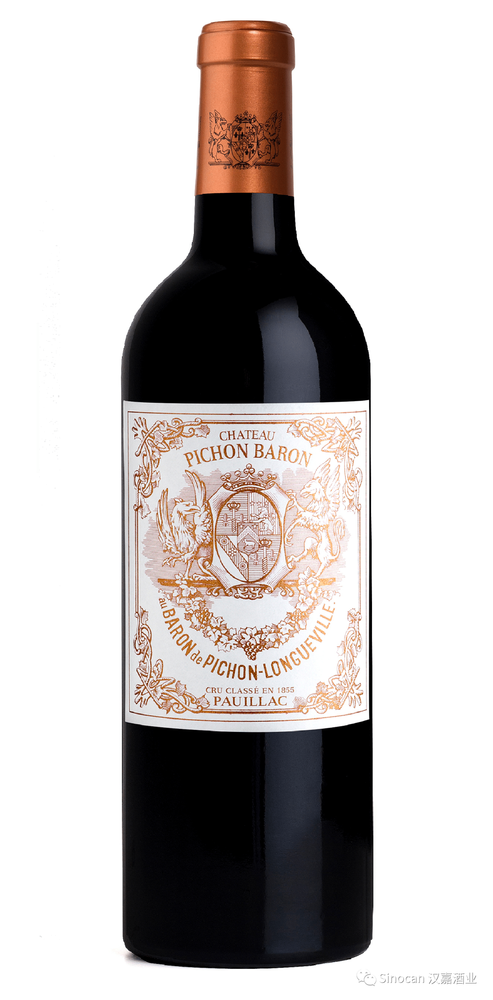

# 无标题

**链接地址:** http://mp.weixin.qq.com/s?__biz=MzIyMzU4OTc0MQ==&mid=2247484858&idx=1&sn=207e27fe00e6cad722e012daf5730422&chksm=e81aa1b8df6d28aeb8e51760e9fe9012cd36319ca863124acfd4a3ac7f0194ece92cc8ee05f9&mpshare=1&scene=2&srcid=0117KrNg8nb37MhZwjmF93IP&sharer_sharetime=1610845972680&sharer_shareid=be1c8edd6c93eec155a61c876e41d26a#rd
**作者:** 
**获取时间:** 2025/8/28 19:57:27
**图片数量:** 21

---

## 原始HTML内容

<section style="box-sizing: border-box;font-size: 16px;"><section style="margin: 10px 0%;box-sizing: border-box;" powered-by="xiumi.us"><section style="display: inline-block;width: 100%;vertical-align: top;background-color: rgb(166, 54, 49);padding: 3px;box-sizing: border-box;"><section style="box-sizing: border-box;" powered-by="xiumi.us"><section style="display: flex;flex-flow: row nowrap;box-sizing: border-box;"><section style="display: inline-block;vertical-align: top;width: auto;flex: 50 50 0%;align-self: stretch;height: auto;background-color: rgb(255, 247, 244);padding: 3px;box-sizing: border-box;"><section style="display: inline-block;width: 100%;vertical-align: middle;border-style: solid;border-width: 1px;border-radius: 0px;border-color: rgb(166, 54, 49);padding: 3px 10px 5px;align-self: center;box-sizing: border-box;" powered-by="xiumi.us"><section style="margin-top: 3px;margin-right: 0%;margin-left: 0%;box-sizing: border-box;" powered-by="xiumi.us"><section style="text-align: center;color: rgb(106, 106, 106);line-height: 1.2;font-size: 14px;box-sizing: border-box;">
<strong style="box-sizing: border-box;">点击蓝字</strong>
</section></section></section></section><section style="display: inline-block;vertical-align: middle;width: auto;padding-left: 3px;background-color: rgba(255, 255, 255, 0);flex: 50 50 0%;align-self: center;height: auto;box-sizing: border-box;"><section style="margin-top: 3px;margin-right: 0%;margin-left: 0%;box-sizing: border-box;" powered-by="xiumi.us"><section style="text-align: center;font-size: 14px;color: rgb(255, 255, 255);line-height: 1.2;box-sizing: border-box;">
<strong style="box-sizing: border-box;">关注我们</strong>
</section></section></section></section></section></section></section><section style="box-sizing: border-box;" powered-by="xiumi.us">
 
</section><section style="text-align: right;justify-content: flex-end;margin-top: 10px;margin-right: 0%;margin-left: 0%;box-sizing: border-box;" powered-by="xiumi.us"><section style="display: inline-block;width: auto;vertical-align: top;min-width: 10%;max-width: 100%;height: auto;background-color: rgb(166, 54, 49);padding: 5px 10px;border-width: 0px;box-sizing: border-box;"><section style="text-align: justify;color: rgb(255, 255, 255);font-size: 14px;box-sizing: border-box;" powered-by="xiumi.us">
<strong style="box-sizing: border-box;">2018年份波尔多葡萄酒评分出炉啦！</strong> 
</section></section></section><section style="display: inline-block;width: 100%;vertical-align: top;border-left: 2px none rgb(195, 163, 142);border-bottom-left-radius: 0px;background-color: rgba(255, 213, 195, 0);padding: 10px;border-right: 2px solid rgb(0, 0, 0);border-top-right-radius: 0px;box-sizing: border-box;" powered-by="xiumi.us"><section style="text-align: center;margin-right: 0%;margin-left: 0%;box-sizing: border-box;" powered-by="xiumi.us"><section style="max-width: 100%;vertical-align: middle;display: inline-block;line-height: 0;box-sizing: border-box;"></section></section></section><section style="text-align: right;justify-content: flex-end;margin-right: 0%;margin-bottom: 10px;margin-left: 0%;font-size: 0px;box-sizing: border-box;" powered-by="xiumi.us"><section style="display: inline-block;width: 50%;vertical-align: top;height: auto;line-height: 0;box-sizing: border-box;"><section style="margin-top: 0.5em;margin-bottom: 0.5em;box-sizing: border-box;" powered-by="xiumi.us"><section style="background-color: rgb(0, 0, 0);height: 2px;box-sizing: border-box;"><section><svg viewBox="0 0 1 1" style="float:left;line-height:0;width:0;vertical-align:top;"></svg></section></section></section></section></section><section style="box-sizing: border-box;" powered-by="xiumi.us"><section style="display: flex;flex-flow: row nowrap;margin: -10px 0% 10px;box-sizing: border-box;"><section style="display: inline-block;vertical-align: top;width: auto;flex: 0 0 auto;align-self: flex-start;min-width: 10%;max-width: 100%;height: auto;box-sizing: border-box;"><section style="color: rgb(0, 0, 0);font-size: 12px;box-sizing: border-box;" powered-by="xiumi.us">
&nbsp; &nbsp;专题出品 |&nbsp;加拿大汉嘉酒业&nbsp;
</section></section><section style="display: inline-block;vertical-align: top;width: auto;align-self: flex-start;flex: 100 100 0%;box-sizing: border-box;"><section style="margin-top: 0.5em;margin-bottom: 0.5em;box-sizing: border-box;" powered-by="xiumi.us"><section style="background-color: rgba(255, 213, 195, 0);height: 1px;box-sizing: border-box;"><section><svg viewBox="0 0 1 1" style="float:left;line-height:0;width:0;vertical-align:top;"></svg></section></section></section></section></section></section><section style="margin: 10px 0%;box-sizing: border-box;" powered-by="xiumi.us"><section style="font-size: 14px;letter-spacing: 2px;line-height: 2;padding-right: 15px;padding-left: 15px;box-sizing: border-box;">
 

前些天葡萄酒权威媒体《醇鉴》（Decanter）发布了刚刚装瓶上市的<strong style="box-sizing: border-box;"> 2018年份波尔多葡萄酒评分</strong>，打分者是《醇鉴》的波尔多专栏作家简·安森（Jane Anson）。 

 
</section></section><section style="text-align: center;margin-top: 10px;margin-bottom: 10px;box-sizing: border-box;" powered-by="xiumi.us"><section style="max-width: 100%;vertical-align: middle;display: inline-block;line-height: 0;width: 90%;height: auto;box-sizing: border-box;"></section></section><section style="margin: 10px 0%;box-sizing: border-box;" powered-by="xiumi.us"><section style="font-size: 14px;letter-spacing: 2px;line-height: 2;padding-right: 15px;padding-left: 15px;box-sizing: border-box;">
 她给这一年波尔多产区葡萄酒的<strong style="box-sizing: border-box;">整体评分为4星</strong>（满分为 5 星）： 

 

总评：★★★★

左岸红葡萄酒：★★★★

右岸红葡萄酒：★★★★☆

干白葡萄酒：★★★☆

苏玳甜酒：★★★

 
</section></section><section style="text-align: center;margin-top: 10px;margin-bottom: 10px;box-sizing: border-box;" powered-by="xiumi.us"><section style="max-width: 100%;vertical-align: middle;display: inline-block;line-height: 0;box-sizing: border-box;"></section></section><section style="margin: 10px 0%;box-sizing: border-box;" powered-by="xiumi.us"><section style="font-size: 14px;letter-spacing: 2px;line-height: 2;padding-right: 15px;padding-left: 15px;box-sizing: border-box;">
 

安森表示她品尝到一些非常出色的葡萄酒，无论是在采收后还是在调配期间，状态都非常良好。该年份虽然受到天气影响而出现比较戏剧化的酿造条件，但<strong style="box-sizing: border-box;">总体潜力巨大，延续了一贯的高品质</strong>。

 

 
</section></section><section style="box-sizing: border-box;" powered-by="xiumi.us"><section style="display: flex;flex-flow: row nowrap;text-align: center;justify-content: center;margin: 10px 0%;box-sizing: border-box;"><section style="display: inline-block;vertical-align: bottom;width: auto;flex: 0 0 0%;align-self: flex-end;height: auto;line-height: 0.5;border-width: 0px;box-sizing: border-box;"><section style="box-sizing: border-box;" powered-by="xiumi.us"><section style="display: inline-block;width: 20px;height: 24px;vertical-align: top;overflow: hidden;border-style: solid none solid solid;border-width: 1px;border-radius: 8px 0px 0px 8px;border-color: rgb(166, 54, 49) rgb(62, 62, 62) rgb(166, 54, 49) rgb(166, 54, 49);box-sizing: border-box;"><section><svg viewBox="0 0 1 1" style="float:left;line-height:0;width:0;vertical-align:top;"></svg></section></section></section></section><section style="display: inline-block;vertical-align: bottom;width: auto;flex: 0 0 auto;align-self: flex-end;min-width: 10%;max-width: 100%;height: auto;border-bottom: 1px solid rgb(166, 54, 49);border-bottom-right-radius: 0px;padding-right: 5px;padding-bottom: 5px;padding-left: 5px;box-sizing: border-box;"><section style="margin-right: 0%;margin-bottom: 3px;margin-left: 0%;box-sizing: border-box;" powered-by="xiumi.us"><section style="background-color: rgba(55, 113, 187, 0.22);height: 1px;box-sizing: border-box;"><section><svg viewBox="0 0 1 1" style="float:left;line-height:0;width:0;vertical-align:top;"></svg></section></section></section><section style="display: inline-block;width: 100%;vertical-align: top;background-color: rgba(162, 162, 162, 0.36);padding-right: 10px;padding-left: 10px;box-sizing: border-box;" powered-by="xiumi.us"><section style="margin-right: 0%;margin-left: 0%;box-sizing: border-box;" powered-by="xiumi.us"><section style="font-size: 17px;color: rgb(0, 0, 0);letter-spacing: 1px;box-sizing: border-box;">
<strong style="box-sizing: border-box;">2018年波尔多天气回顾</strong>
</section></section></section></section><section style="display: inline-block;vertical-align: bottom;width: auto;flex: 0 0 0%;align-self: flex-end;height: auto;line-height: 0.5;box-sizing: border-box;"><section style="box-sizing: border-box;" powered-by="xiumi.us"><section style="display: inline-block;width: 20px;height: 24px;vertical-align: top;overflow: hidden;border-style: solid solid solid none;border-width: 1px;border-radius: 0px 8px 8px 0px;border-color: rgb(166, 54, 49) rgb(166, 54, 49) rgb(166, 54, 49) rgb(55, 113, 187);box-sizing: border-box;"><section><svg viewBox="0 0 1 1" style="float:left;line-height:0;width:0;vertical-align:top;"></svg></section></section></section></section></section></section><section style="margin: 10px 0%;box-sizing: border-box;" powered-by="xiumi.us"><section style="font-size: 14px;letter-spacing: 2px;line-height: 2;padding-right: 15px;padding-left: 15px;box-sizing: border-box;">
 

对于波尔多地区的酒农们来说，<strong style="box-sizing: border-box;">2018并不平静</strong>。根据天气的状况，这个年份可以非常清晰地划分成两个阶段：

 

<strong style="box-sizing: border-box;">春季：雨水生波折</strong>

 

冬季比往年稍冷，初春天气温和。雨水拉开2月的帷幕，断断续续地下足了整个春季，直至7月初才罢休。<strong style="box-sizing: border-box;">短短几个月，波尔多的雨水达到往常一年的雨量。</strong>

 
</section></section><section style="text-align: center;margin-top: 10px;margin-bottom: 10px;box-sizing: border-box;" powered-by="xiumi.us"><section style="max-width: 100%;vertical-align: middle;display: inline-block;line-height: 0;width: 90%;height: auto;box-sizing: border-box;"></section></section><section style="margin: 10px 0%;box-sizing: border-box;" powered-by="xiumi.us"><section style="font-size: 14px;letter-spacing: 2px;line-height: 2;padding-right: 15px;padding-left: 15px;box-sizing: border-box;">
 

连绵的雨天让波尔多笼罩在湿漉漉的水气之中，霉菌悄悄光顾，<strong style="box-sizing: border-box;">造成了葡萄总体产量上的骤减。</strong>

 

5月底，波尔多梅多克（Medoc）地区的南部还遭受到冰雹的侵袭，不过只有布尔丘（Bourg）和 布莱伊（Blaye）受损，其余地区都没有受到影响。 

 

 

<strong style="box-sizing: border-box;">夏秋：艳阳送惊喜</strong>

 

就在土壤储水量达到最高点时，转机出现了：雨水在初夏来临时退场，整个波尔多地区阳光明媚，天气变得干燥而炎热，这种讨喜的天气一直持续至10月底。

 
</section></section><section style="text-align: center;margin-top: 10px;margin-bottom: 10px;box-sizing: border-box;" powered-by="xiumi.us"><section style="max-width: 100%;vertical-align: middle;display: inline-block;line-height: 0;box-shadow: rgb(0, 0, 0) 0px 0px 0px;width: 90%;height: auto;box-sizing: border-box;"></section></section><section style="margin: 10px 0%;box-sizing: border-box;" powered-by="xiumi.us"><section style="font-size: 14px;letter-spacing: 2px;line-height: 2;padding-right: 15px;padding-left: 15px;box-sizing: border-box;">
 

令人欣喜的不止于此，果实成熟期间，炎热的白昼和凉爽的夜晚给予了葡萄新鲜感和风味复杂度，<strong style="box-sizing: border-box;">很多葡萄的风味集中度在9月和10月达到了创纪录的水平。</strong>

 

这个大反转对于酒农和酿酒师来说是极大的惊喜，采收时得到的葡萄力量感强，<strong style="box-sizing: border-box;">成熟度十分可观。</strong>

 

 
</section></section><section style="box-sizing: border-box;" powered-by="xiumi.us"><section style="display: flex;flex-flow: row nowrap;text-align: center;justify-content: center;margin: 10px 0%;box-sizing: border-box;"><section style="display: inline-block;vertical-align: bottom;width: auto;flex: 0 0 0%;align-self: flex-end;height: auto;line-height: 0.5;border-width: 0px;box-sizing: border-box;"><section style="box-sizing: border-box;" powered-by="xiumi.us"><section style="display: inline-block;width: 20px;height: 24px;vertical-align: top;overflow: hidden;border-style: solid none solid solid;border-width: 1px;border-radius: 8px 0px 0px 8px;border-color: rgb(166, 54, 49) rgb(62, 62, 62) rgb(166, 54, 49) rgb(166, 54, 49);box-sizing: border-box;"><section><svg viewBox="0 0 1 1" style="float:left;line-height:0;width:0;vertical-align:top;"></svg></section></section></section></section><section style="display: inline-block;vertical-align: bottom;width: auto;flex: 0 0 auto;align-self: flex-end;min-width: 10%;max-width: 100%;height: auto;border-bottom: 1px solid rgb(166, 54, 49);border-bottom-right-radius: 0px;padding-right: 5px;padding-bottom: 5px;padding-left: 5px;box-sizing: border-box;"><section style="margin-right: 0%;margin-bottom: 3px;margin-left: 0%;box-sizing: border-box;" powered-by="xiumi.us"><section style="background-color: rgba(55, 113, 187, 0.22);height: 1px;box-sizing: border-box;"><section><svg viewBox="0 0 1 1" style="float:left;line-height:0;width:0;vertical-align:top;"></svg></section></section></section><section style="display: inline-block;width: 100%;vertical-align: top;background-color: rgba(162, 162, 162, 0.36);padding-right: 10px;padding-left: 10px;box-sizing: border-box;" powered-by="xiumi.us"><section style="margin-right: 0%;margin-left: 0%;box-sizing: border-box;" powered-by="xiumi.us"><section style="font-size: 17px;color: rgb(0, 0, 0);letter-spacing: 1px;box-sizing: border-box;">
<strong style="box-sizing: border-box;">2018年葡萄酒整体风格</strong>
</section></section></section></section><section style="display: inline-block;vertical-align: bottom;width: auto;flex: 0 0 0%;align-self: flex-end;height: auto;line-height: 0.5;box-sizing: border-box;"><section style="box-sizing: border-box;" powered-by="xiumi.us"><section style="display: inline-block;width: 20px;height: 24px;vertical-align: top;overflow: hidden;border-style: solid solid solid none;border-width: 1px;border-radius: 0px 8px 8px 0px;border-color: rgb(166, 54, 49) rgb(166, 54, 49) rgb(166, 54, 49) rgb(55, 113, 187);box-sizing: border-box;"><section><svg viewBox="0 0 1 1" style="float:left;line-height:0;width:0;vertical-align:top;"></svg></section></section></section></section></section></section><section style="margin: 10px 0%;box-sizing: border-box;" powered-by="xiumi.us"><section style="font-size: 14px;letter-spacing: 2px;line-height: 2;padding-right: 15px;padding-left: 15px;box-sizing: border-box;">
 

很多专家都预测这一年的葡萄酒会是<strong style="box-sizing: border-box;">结构庞大、单宁坚实、酒精度高的风格。</strong>

 
</section></section><section style="text-align: center;margin-top: 10px;margin-bottom: 10px;box-sizing: border-box;" powered-by="xiumi.us"><section style="max-width: 100%;vertical-align: middle;display: inline-block;line-height: 0;width: 90%;height: auto;box-sizing: border-box;"></section></section><section style="margin: 10px 0%;box-sizing: border-box;" powered-by="xiumi.us"><section style="font-size: 14px;letter-spacing: 2px;line-height: 2;padding-right: 15px;padding-left: 15px;box-sizing: border-box;">
 事实的确如此，如此干热的成熟期对波尔多来说并不常见，有些酒庄的<strong style="box-sizing: border-box;">赤霞珠酒精度甚至达到了 14.5% 以上。</strong>

 
</section></section><section style="text-align: center;margin-top: 10px;margin-bottom: 10px;box-sizing: border-box;" powered-by="xiumi.us"><section style="max-width: 100%;vertical-align: middle;display: inline-block;line-height: 0;box-sizing: border-box;"></section></section><section style="margin: 10px 0%;box-sizing: border-box;" powered-by="xiumi.us"><section style="font-size: 14px;letter-spacing: 2px;line-height: 2;padding-right: 15px;padding-left: 15px;box-sizing: border-box;">
 这一年<strong style="box-sizing: border-box;">右岸的红葡萄酒比左岸表现更好</strong>，尤其是<strong style="box-sizing: border-box;">圣埃美隆（St. Emilion）产区</strong>，石灰石土壤起到了降温的作用，帮助葡萄保持了适度的酸度，让果味不至于过熟。

 <strong style="box-sizing: border-box;">整体来说，波尔多 2018 年份不如 2016 年那么强壮结实，但是果味成熟，比更加轻盈的 2017 年份陈年潜力更强。</strong>

 

 
</section></section><section style="box-sizing: border-box;" powered-by="xiumi.us"><section style="display: flex;flex-flow: row nowrap;text-align: center;justify-content: center;margin: 10px 0%;box-sizing: border-box;"><section style="display: inline-block;vertical-align: bottom;width: auto;flex: 0 0 0%;align-self: flex-end;height: auto;line-height: 0.5;border-width: 0px;box-sizing: border-box;"><section style="box-sizing: border-box;" powered-by="xiumi.us"><section style="display: inline-block;width: 20px;height: 24px;vertical-align: top;overflow: hidden;border-style: solid none solid solid;border-width: 1px;border-radius: 8px 0px 0px 8px;border-color: rgb(166, 54, 49) rgb(62, 62, 62) rgb(166, 54, 49) rgb(166, 54, 49);box-sizing: border-box;"><section><svg viewBox="0 0 1 1" style="float:left;line-height:0;width:0;vertical-align:top;"></svg></section></section></section></section><section style="display: inline-block;vertical-align: bottom;width: auto;flex: 0 0 auto;align-self: flex-end;min-width: 10%;max-width: 100%;height: auto;border-bottom: 1px solid rgb(166, 54, 49);border-bottom-right-radius: 0px;padding-right: 5px;padding-bottom: 5px;padding-left: 5px;box-sizing: border-box;"><section style="margin-right: 0%;margin-bottom: 3px;margin-left: 0%;box-sizing: border-box;" powered-by="xiumi.us"><section style="background-color: rgba(55, 113, 187, 0.22);height: 1px;box-sizing: border-box;"><section><svg viewBox="0 0 1 1" style="float:left;line-height:0;width:0;vertical-align:top;"></svg></section></section></section><section style="display: inline-block;width: 100%;vertical-align: top;background-color: rgba(162, 162, 162, 0.36);padding-right: 10px;padding-left: 10px;box-sizing: border-box;" powered-by="xiumi.us"><section style="margin-right: 0%;margin-left: 0%;box-sizing: border-box;" powered-by="xiumi.us"><section style="font-size: 17px;color: rgb(0, 0, 0);letter-spacing: 1px;box-sizing: border-box;">
<strong style="box-sizing: border-box;">12款名庄珍酿登陆加拿大</strong>
</section></section></section></section><section style="display: inline-block;vertical-align: bottom;width: auto;flex: 0 0 0%;align-self: flex-end;height: auto;line-height: 0.5;box-sizing: border-box;"><section style="box-sizing: border-box;" powered-by="xiumi.us"><section style="display: inline-block;width: 20px;height: 24px;vertical-align: top;overflow: hidden;border-style: solid solid solid none;border-width: 1px;border-radius: 0px 8px 8px 0px;border-color: rgb(166, 54, 49) rgb(166, 54, 49) rgb(166, 54, 49) rgb(55, 113, 187);box-sizing: border-box;"><section><svg viewBox="0 0 1 1" style="float:left;line-height:0;width:0;vertical-align:top;"></svg></section></section></section></section></section></section><section style="margin: 10px 0%;box-sizing: border-box;" powered-by="xiumi.us"><section style="font-size: 14px;letter-spacing: 2px;line-height: 2;padding-right: 15px;padding-left: 15px;box-sizing: border-box;">
 

为了丰富葡萄酒收藏家们的酒柜，加拿大汉嘉酒业预定的<strong style="box-sizing: border-box;">2018年份波尔多产区名庄红酒即将登陆加拿大</strong>！

 

这12款精挑细选的名庄红酒，品质优异、表现完美，极具升值潜力。<strong style="box-sizing: border-box;">其中来自木桐酒庄（Chateau Mouton Rothschild）的这瓶干红，在这份2018年份波尔多葡萄酒评分中甚至拿到了满分的评价！</strong>

 

今天，就请跟随我们一起认识一下这12座波尔多产区的优质名庄及其出产的红葡萄酒吧！
</section></section><section style="box-sizing: border-box;" powered-by="xiumi.us"><section style="display: inline-block;vertical-align: top;width: 50%;padding-right: 8px;box-sizing: border-box;"><section style="margin-top: 0.5em;margin-bottom: 0.5em;box-sizing: border-box;" powered-by="xiumi.us"><section style="border-top: 4px solid rgb(236, 211, 201);box-sizing: border-box;"><section><svg viewBox="0 0 1 1" style="float:left;line-height:0;width:0;vertical-align:top;"></svg></section></section><section style="margin-top: 3px;border-top: 1px solid rgb(236, 211, 201);box-sizing: border-box;"><section><svg viewBox="0 0 1 1" style="float:left;line-height:0;width:0;vertical-align:top;"></svg></section></section></section></section><section style="display: inline-block;vertical-align: top;width: 50%;padding-left: 8px;box-sizing: border-box;"><section style="margin-top: 0.5em;margin-bottom: 0.5em;box-sizing: border-box;" powered-by="xiumi.us"><section style="border-top: 4px solid rgb(236, 211, 201);box-sizing: border-box;"><section><svg viewBox="0 0 1 1" style="float:left;line-height:0;width:0;vertical-align:top;"></svg></section></section><section style="margin-top: 3px;border-top: 1px solid rgb(236, 211, 201);box-sizing: border-box;"><section><svg viewBox="0 0 1 1" style="float:left;line-height:0;width:0;vertical-align:top;"></svg></section></section></section></section></section><section style="margin: 10px 0%;box-sizing: border-box;" powered-by="xiumi.us"><section style="font-size: 14px;letter-spacing: 2px;line-height: 2;padding-right: 15px;padding-left: 15px;box-sizing: border-box;">
 

 
</section></section><section style="text-align: center;justify-content: center;margin: 10px 0%;box-sizing: border-box;" powered-by="xiumi.us"><section style="display: inline-block;width: auto;vertical-align: top;min-width: 10%;max-width: 100%;height: auto;border-style: solid;border-width: 2px;border-radius: 0px;border-color: rgba(255, 213, 195, 0);padding: 3px 5px;box-sizing: border-box;"><section style="display: inline-block;width: 100%;vertical-align: top;border-top: 1px solid rgba(255, 213, 195, 0);border-top-left-radius: 0px;border-bottom: 1px solid rgba(255, 213, 195, 0);border-bottom-right-radius: 0px;padding: 3px 10px;box-sizing: border-box;" powered-by="xiumi.us"><section style="color: rgb(106, 106, 106);letter-spacing: 2px;box-sizing: border-box;" powered-by="xiumi.us">
<strong style="box-sizing: border-box;">木桐酒庄</strong>

<strong style="box-sizing: border-box;">Chateau Mouton Rothschild</strong>

（100分 / 满分）
</section></section></section></section><section style="height: auto;box-sizing: border-box;" powered-by="xiumi.us"><section style="display: flex;flex-flow: row nowrap;box-sizing: border-box;"><section style="display: inline-block;vertical-align: top;width: auto;flex: 100 100 0%;align-self: flex-start;height: auto;margin-right: 10px;box-sizing: border-box;"><section style="text-align: center;margin-right: 0%;margin-left: 0%;box-sizing: border-box;" powered-by="xiumi.us"><section style="max-width: 100%;vertical-align: middle;display: inline-block;line-height: 0;box-shadow: rgba(255, 213, 195, 0) 0px -16px 0px;box-sizing: border-box;"></section></section></section><section style="display: inline-block;vertical-align: top;width: auto;flex: 100 100 0%;align-self: flex-start;height: auto;box-shadow: rgba(255, 213, 195, 0) 0px 0px 0px;z-index: 1;box-sizing: border-box;"><section style="text-align: center;margin-right: 0%;margin-left: 0%;box-sizing: border-box;" powered-by="xiumi.us"><section style="max-width: 100%;vertical-align: middle;display: inline-block;line-height: 0;box-shadow: rgba(255, 213, 195, 0) 0px 16px 0px;box-sizing: border-box;"></section></section></section></section></section><section style="margin: 10px 0%;box-sizing: border-box;" powered-by="xiumi.us"><section style="font-size: 14px;letter-spacing: 2px;line-height: 2;padding-right: 15px;padding-left: 15px;box-sizing: border-box;">
 

木桐是著名的梅多克（Medoc）一级庄，位于波亚克（Pauillac）村，由罗斯柴尔德男爵家族（Baron Rothschild）拥有。

 

木桐酒庄开创了酒庄装瓶的先河，并且每年都请著名艺术家为新年份设计艺术酒标，值得注意的是其2018年的艺术酒标由中国艺术家徐冰设计，因此更具收藏价值。 
</section></section><section style="box-sizing: border-box;" powered-by="xiumi.us"><section style="display: inline-block;vertical-align: top;width: 50%;padding-right: 8px;box-sizing: border-box;"><section style="margin-top: 10px;margin-bottom: 10px;box-sizing: border-box;" powered-by="xiumi.us"><section style="border-top: 1px solid rgb(236, 211, 201);box-sizing: border-box;"><section><svg viewBox="0 0 1 1" style="float:left;line-height:0;width:0;vertical-align:top;"></svg></section></section><section style="margin-top: 3px;border-top: 4px solid rgb(236, 211, 201);box-sizing: border-box;"><section><svg viewBox="0 0 1 1" style="float:left;line-height:0;width:0;vertical-align:top;"></svg></section></section></section></section><section style="display: inline-block;vertical-align: top;width: 50%;padding-left: 8px;box-sizing: border-box;"><section style="margin-top: 10px;margin-bottom: 10px;box-sizing: border-box;" powered-by="xiumi.us"><section style="border-top: 1px solid rgb(236, 211, 201);box-sizing: border-box;"><section><svg viewBox="0 0 1 1" style="float:left;line-height:0;width:0;vertical-align:top;"></svg></section></section><section style="margin-top: 3px;border-top: 4px solid rgb(236, 211, 201);box-sizing: border-box;"><section><svg viewBox="0 0 1 1" style="float:left;line-height:0;width:0;vertical-align:top;"></svg></section></section></section></section></section><section style="margin: 10px 0%;box-sizing: border-box;" powered-by="xiumi.us"><section style="font-size: 14px;letter-spacing: 2px;line-height: 2;padding-right: 15px;padding-left: 15px;box-sizing: border-box;">
 

 
</section></section><section style="text-align: center;justify-content: center;margin: 10px 0%;box-sizing: border-box;" powered-by="xiumi.us"><section style="display: inline-block;width: auto;vertical-align: top;min-width: 10%;max-width: 100%;height: auto;border-style: solid;border-width: 2px;border-radius: 0px;border-color: rgba(255, 213, 195, 0);padding: 3px 5px;box-sizing: border-box;"><section style="display: inline-block;width: 100%;vertical-align: top;border-top: 1px solid rgba(255, 213, 195, 0);border-top-left-radius: 0px;border-bottom: 1px solid rgba(255, 213, 195, 0);border-bottom-right-radius: 0px;padding: 3px 10px;box-sizing: border-box;" powered-by="xiumi.us"><section style="color: rgb(106, 106, 106);letter-spacing: 2px;box-sizing: border-box;" powered-by="xiumi.us">
<strong style="box-sizing: border-box;">玛歌酒庄</strong>

<strong style="box-sizing: border-box;">Chateau Margaux</strong>

（98分）
</section></section></section></section><section style="text-align: center;margin-top: 10px;margin-bottom: 10px;box-sizing: border-box;" powered-by="xiumi.us"><section style="max-width: 100%;vertical-align: middle;display: inline-block;line-height: 0;width: 90%;height: auto;box-sizing: border-box;"></section></section><section style="margin: 10px 0%;box-sizing: border-box;" powered-by="xiumi.us"><section style="font-size: 14px;letter-spacing: 2px;line-height: 2;padding-right: 15px;padding-left: 15px;box-sizing: border-box;">
 

玛歌也是梅多克 5 大一级庄之一，位于玛歌产区，其历史可以追溯到公元 12 世纪，距今已有近千年，连所在产区也是以该酒庄命名，美国前总统托马斯·杰弗逊曾将玛歌评为波尔多 5 大名庄之首。

 

现在为门泽普洛斯家族（Mentzelopoulos）所有，风格是一级庄中最优雅的，尽管其单宁浓度度往往很高，但却尝不出强烈的涩味，可见整体的平衡性极佳。
</section></section><section style="box-sizing: border-box;" powered-by="xiumi.us"><section style="display: inline-block;vertical-align: top;width: 50%;padding-right: 8px;box-sizing: border-box;"><section style="margin-top: 0.5em;margin-bottom: 0.5em;box-sizing: border-box;" powered-by="xiumi.us"><section style="border-top: 4px solid rgb(236, 211, 201);box-sizing: border-box;"><section><svg viewBox="0 0 1 1" style="float:left;line-height:0;width:0;vertical-align:top;"></svg></section></section><section style="margin-top: 3px;border-top: 1px solid rgb(236, 211, 201);box-sizing: border-box;"><section><svg viewBox="0 0 1 1" style="float:left;line-height:0;width:0;vertical-align:top;"></svg></section></section></section></section><section style="display: inline-block;vertical-align: top;width: 50%;padding-left: 8px;box-sizing: border-box;"><section style="margin-top: 0.5em;margin-bottom: 0.5em;box-sizing: border-box;" powered-by="xiumi.us"><section style="border-top: 4px solid rgb(236, 211, 201);box-sizing: border-box;"><section><svg viewBox="0 0 1 1" style="float:left;line-height:0;width:0;vertical-align:top;"></svg></section></section><section style="margin-top: 3px;border-top: 1px solid rgb(236, 211, 201);box-sizing: border-box;"><section><svg viewBox="0 0 1 1" style="float:left;line-height:0;width:0;vertical-align:top;"></svg></section></section></section></section></section><section style="margin: 10px 0%;box-sizing: border-box;" powered-by="xiumi.us"><section style="font-size: 14px;letter-spacing: 2px;line-height: 2;padding-right: 15px;padding-left: 15px;box-sizing: border-box;">
 

 
</section></section><section style="text-align: center;justify-content: center;margin: 10px 0%;box-sizing: border-box;" powered-by="xiumi.us"><section style="display: inline-block;width: auto;vertical-align: top;min-width: 10%;max-width: 100%;height: auto;border-style: solid;border-width: 2px;border-radius: 0px;border-color: rgba(255, 213, 195, 0);padding: 3px 5px;box-sizing: border-box;"><section style="display: inline-block;width: 100%;vertical-align: top;border-top: 1px solid rgba(255, 213, 195, 0);border-top-left-radius: 0px;border-bottom: 1px solid rgba(255, 213, 195, 0);border-bottom-right-radius: 0px;padding: 3px 10px;box-sizing: border-box;" powered-by="xiumi.us"><section style="color: rgb(106, 106, 106);letter-spacing: 2px;box-sizing: border-box;" powered-by="xiumi.us">
<strong style="box-sizing: border-box;">侯伯王酒庄</strong>

<strong style="box-sizing: border-box;">Chateau Haut-Brion</strong>

（98分）
</section></section></section></section><section style="text-align: center;margin-top: 10px;margin-bottom: 10px;box-sizing: border-box;" powered-by="xiumi.us"><section style="max-width: 100%;vertical-align: middle;display: inline-block;line-height: 0;width: 90%;height: auto;box-sizing: border-box;"></section></section><section style="margin: 10px 0%;box-sizing: border-box;" powered-by="xiumi.us"><section style="font-size: 14px;letter-spacing: 2px;line-height: 2;padding-right: 15px;padding-left: 15px;box-sizing: border-box;">
 

侯伯王也是梅多克 5 大一级庄之一，但是位于左岸的佩萨克-雷奥良（Pessac-Leognan）产区，是 1855 分级中唯一一家不在梅多克的酒庄，同时也是唯一一个以红、白葡萄酒双栖波多尔顶级酒单的酒庄。

 

侯伯王酒庄的干红和梅多克的风格不同，梅洛和赤霞珠的占比不相上下，有很多个年份梅洛甚至占到了 50% 以上。
</section></section><section style="box-sizing: border-box;" powered-by="xiumi.us"><section style="display: inline-block;vertical-align: top;width: 50%;padding-right: 8px;box-sizing: border-box;"><section style="margin-top: 0.5em;margin-bottom: 0.5em;box-sizing: border-box;" powered-by="xiumi.us"><section style="border-top: 4px solid rgb(236, 211, 201);box-sizing: border-box;"><section><svg viewBox="0 0 1 1" style="float:left;line-height:0;width:0;vertical-align:top;"></svg></section></section><section style="margin-top: 3px;border-top: 1px solid rgb(236, 211, 201);box-sizing: border-box;"><section><svg viewBox="0 0 1 1" style="float:left;line-height:0;width:0;vertical-align:top;"></svg></section></section></section></section><section style="display: inline-block;vertical-align: top;width: 50%;padding-left: 8px;box-sizing: border-box;"><section style="margin-top: 0.5em;margin-bottom: 0.5em;box-sizing: border-box;" powered-by="xiumi.us"><section style="border-top: 4px solid rgb(236, 211, 201);box-sizing: border-box;"><section><svg viewBox="0 0 1 1" style="float:left;line-height:0;width:0;vertical-align:top;"></svg></section></section><section style="margin-top: 3px;border-top: 1px solid rgb(236, 211, 201);box-sizing: border-box;"><section><svg viewBox="0 0 1 1" style="float:left;line-height:0;width:0;vertical-align:top;"></svg></section></section></section></section></section><section style="margin: 10px 0%;box-sizing: border-box;" powered-by="xiumi.us"><section style="font-size: 14px;letter-spacing: 2px;line-height: 2;padding-right: 15px;padding-left: 15px;box-sizing: border-box;">
 

 
</section></section><section style="text-align: center;justify-content: center;margin: 10px 0%;box-sizing: border-box;" powered-by="xiumi.us"><section style="display: inline-block;width: auto;vertical-align: top;min-width: 10%;max-width: 100%;height: auto;border-style: solid;border-width: 2px;border-radius: 0px;border-color: rgba(255, 213, 195, 0);padding: 3px 5px;box-sizing: border-box;"><section style="display: inline-block;width: 100%;vertical-align: top;border-top: 1px solid rgba(255, 213, 195, 0);border-top-left-radius: 0px;border-bottom: 1px solid rgba(255, 213, 195, 0);border-bottom-right-radius: 0px;padding: 3px 10px;box-sizing: border-box;" powered-by="xiumi.us"><section style="color: rgb(106, 106, 106);letter-spacing: 2px;box-sizing: border-box;" powered-by="xiumi.us">
<strong style="box-sizing: border-box;">拉菲酒庄</strong>

<strong style="box-sizing: border-box;">Chateau Lafite Rothschild</strong>

（98分）
</section></section></section></section><section style="text-align: center;margin-top: 10px;margin-bottom: 10px;box-sizing: border-box;" powered-by="xiumi.us"><section style="max-width: 100%;vertical-align: middle;display: inline-block;line-height: 0;width: 25%;height: auto;box-sizing: border-box;"></section></section><section style="margin: 10px 0%;box-sizing: border-box;" powered-by="xiumi.us"><section style="font-size: 14px;letter-spacing: 2px;line-height: 2;padding-right: 15px;padding-left: 15px;box-sizing: border-box;">
 

拉菲酒庄也位于波亚克，由罗斯柴尔德男爵家族所有。

 

拉菲在中国应该是名气最大的波尔多一级名庄了，即使是不了解葡萄酒的人也大多听过「拉菲」这个名字。「凡入口之拉菲，皆拥有杏仁与紫罗兰的芳醇」是它最大的特点。
</section></section><section style="box-sizing: border-box;" powered-by="xiumi.us"><section style="display: inline-block;vertical-align: top;width: 50%;padding-right: 8px;box-sizing: border-box;"><section style="margin-top: 0.5em;margin-bottom: 0.5em;box-sizing: border-box;" powered-by="xiumi.us"><section style="border-top: 4px solid rgb(236, 211, 201);box-sizing: border-box;"><section><svg viewBox="0 0 1 1" style="float:left;line-height:0;width:0;vertical-align:top;"></svg></section></section><section style="margin-top: 3px;border-top: 1px solid rgb(236, 211, 201);box-sizing: border-box;"><section><svg viewBox="0 0 1 1" style="float:left;line-height:0;width:0;vertical-align:top;"></svg></section></section></section></section><section style="display: inline-block;vertical-align: top;width: 50%;padding-left: 8px;box-sizing: border-box;"><section style="margin-top: 0.5em;margin-bottom: 0.5em;box-sizing: border-box;" powered-by="xiumi.us"><section style="border-top: 4px solid rgb(236, 211, 201);box-sizing: border-box;"><section><svg viewBox="0 0 1 1" style="float:left;line-height:0;width:0;vertical-align:top;"></svg></section></section><section style="margin-top: 3px;border-top: 1px solid rgb(236, 211, 201);box-sizing: border-box;"><section><svg viewBox="0 0 1 1" style="float:left;line-height:0;width:0;vertical-align:top;"></svg></section></section></section></section></section><section style="margin: 10px 0%;box-sizing: border-box;" powered-by="xiumi.us"><section style="font-size: 14px;letter-spacing: 2px;line-height: 2;padding-right: 15px;padding-left: 15px;box-sizing: border-box;">
 

 
</section></section><section style="text-align: center;justify-content: center;margin: 10px 0%;box-sizing: border-box;" powered-by="xiumi.us"><section style="display: inline-block;width: auto;vertical-align: top;min-width: 10%;max-width: 100%;height: auto;border-style: solid;border-width: 2px;border-radius: 0px;border-color: rgba(255, 213, 195, 0);padding: 3px 5px;box-sizing: border-box;"><section style="display: inline-block;width: 100%;vertical-align: top;border-top: 1px solid rgba(255, 213, 195, 0);border-top-left-radius: 0px;border-bottom: 1px solid rgba(255, 213, 195, 0);border-bottom-right-radius: 0px;padding: 3px 10px;box-sizing: border-box;" powered-by="xiumi.us"><section style="color: rgb(106, 106, 106);letter-spacing: 2px;box-sizing: border-box;" powered-by="xiumi.us">
<strong style="box-sizing: border-box;">拉菲珍宝（小拉菲）</strong>

<strong style="box-sizing: border-box;">Carruades de Lafite</strong>
</section></section></section></section><section style="text-align: center;margin-top: 10px;margin-bottom: 10px;box-sizing: border-box;" powered-by="xiumi.us"><section style="max-width: 100%;vertical-align: middle;display: inline-block;line-height: 0;width: 20%;height: auto;box-sizing: border-box;"></section></section><section style="margin: 10px 0%;box-sizing: border-box;" powered-by="xiumi.us"><section style="font-size: 14px;letter-spacing: 2px;line-height: 2;padding-right: 15px;padding-left: 15px;box-sizing: border-box;">
 

这是一款来自法国波尔多产区波雅克村的红葡萄酒，是拉菲古堡的副牌红葡萄酒。

 

一般而言，梅多克列级庄的副牌酒是用比正牌酒质量稍低的葡萄来酿造的，这些葡萄或年份欠佳，或树龄不够，或品质尚且不够资格用于酿造正牌酒。但小拉菲却不是这样，小拉菲使用的是拉菲古堡卡许阿德园（Carruades）出产的最优秀的葡萄来酿造。

 

与大拉菲相比，小拉菲中含有的梅洛比例较高，带有芳醇甜美的品质。正因为如此，小拉菲具有和其他列级庄副牌完全不同的独特气质。
</section></section><section style="box-sizing: border-box;" powered-by="xiumi.us"><section style="display: inline-block;vertical-align: top;width: 50%;padding-right: 8px;box-sizing: border-box;"><section style="margin-top: 0.5em;margin-bottom: 0.5em;box-sizing: border-box;" powered-by="xiumi.us"><section style="border-top: 4px solid rgb(236, 211, 201);box-sizing: border-box;"><section><svg viewBox="0 0 1 1" style="float:left;line-height:0;width:0;vertical-align:top;"></svg></section></section><section style="margin-top: 3px;border-top: 1px solid rgb(236, 211, 201);box-sizing: border-box;"><section><svg viewBox="0 0 1 1" style="float:left;line-height:0;width:0;vertical-align:top;"></svg></section></section></section></section><section style="display: inline-block;vertical-align: top;width: 50%;padding-left: 8px;box-sizing: border-box;"><section style="margin-top: 0.5em;margin-bottom: 0.5em;box-sizing: border-box;" powered-by="xiumi.us"><section style="border-top: 4px solid rgb(236, 211, 201);box-sizing: border-box;"><section><svg viewBox="0 0 1 1" style="float:left;line-height:0;width:0;vertical-align:top;"></svg></section></section><section style="margin-top: 3px;border-top: 1px solid rgb(236, 211, 201);box-sizing: border-box;"><section><svg viewBox="0 0 1 1" style="float:left;line-height:0;width:0;vertical-align:top;"></svg></section></section></section></section></section><section style="margin: 10px 0%;box-sizing: border-box;" powered-by="xiumi.us"><section style="font-size: 14px;letter-spacing: 2px;line-height: 2;padding-right: 15px;padding-left: 15px;box-sizing: border-box;">
 

 
</section></section><section style="text-align: center;justify-content: center;margin: 10px 0%;box-sizing: border-box;" powered-by="xiumi.us"><section style="display: inline-block;width: auto;vertical-align: top;min-width: 10%;max-width: 100%;height: auto;border-style: solid;border-width: 2px;border-radius: 0px;border-color: rgba(255, 213, 195, 0);padding: 3px 5px;box-sizing: border-box;"><section style="display: inline-block;width: 100%;vertical-align: top;border-top: 1px solid rgba(255, 213, 195, 0);border-top-left-radius: 0px;border-bottom: 1px solid rgba(255, 213, 195, 0);border-bottom-right-radius: 0px;padding: 3px 10px;box-sizing: border-box;" powered-by="xiumi.us"><section style="color: rgb(106, 106, 106);letter-spacing: 2px;box-sizing: border-box;" powered-by="xiumi.us">
<strong style="box-sizing: border-box;">爱士图尔酒庄</strong>

<strong style="box-sizing: border-box;">Cos d'Estournel</strong>
</section></section></section></section><section style="text-align: center;margin-top: 10px;margin-bottom: 10px;box-sizing: border-box;" powered-by="xiumi.us"><section style="max-width: 100%;vertical-align: middle;display: inline-block;line-height: 0;width: 25%;height: auto;box-sizing: border-box;"></section></section><section style="margin: 10px 0%;box-sizing: border-box;" powered-by="xiumi.us"><section style="font-size: 14px;letter-spacing: 2px;line-height: 2;padding-right: 15px;padding-left: 15px;box-sizing: border-box;">
 

爱士图尔庄园（Chateau Cos d'Estournel）位于法国波尔多左岸的圣埃斯泰夫（Saint-Estephe）村，在1855分级中位列二级庄，现为公认的“超二级庄”之一。

 

爱士图尔庄园出品有着典型圣埃斯泰夫风格的葡萄酒，风味集中而优雅，层次丰富，骨架坚实，集复杂度与细腻感于一身。
</section></section><section style="box-sizing: border-box;" powered-by="xiumi.us"><section style="display: inline-block;vertical-align: top;width: 50%;padding-right: 8px;box-sizing: border-box;"><section style="margin-top: 0.5em;margin-bottom: 0.5em;box-sizing: border-box;" powered-by="xiumi.us"><section style="border-top: 4px solid rgb(236, 211, 201);box-sizing: border-box;"><section><svg viewBox="0 0 1 1" style="float:left;line-height:0;width:0;vertical-align:top;"></svg></section></section><section style="margin-top: 3px;border-top: 1px solid rgb(236, 211, 201);box-sizing: border-box;"><section><svg viewBox="0 0 1 1" style="float:left;line-height:0;width:0;vertical-align:top;"></svg></section></section></section></section><section style="display: inline-block;vertical-align: top;width: 50%;padding-left: 8px;box-sizing: border-box;"><section style="margin-top: 0.5em;margin-bottom: 0.5em;box-sizing: border-box;" powered-by="xiumi.us"><section style="border-top: 4px solid rgb(236, 211, 201);box-sizing: border-box;"><section><svg viewBox="0 0 1 1" style="float:left;line-height:0;width:0;vertical-align:top;"></svg></section></section><section style="margin-top: 3px;border-top: 1px solid rgb(236, 211, 201);box-sizing: border-box;"><section><svg viewBox="0 0 1 1" style="float:left;line-height:0;width:0;vertical-align:top;"></svg></section></section></section></section></section><section style="margin: 10px 0%;box-sizing: border-box;" powered-by="xiumi.us"><section style="font-size: 14px;letter-spacing: 2px;line-height: 2;padding-right: 15px;padding-left: 15px;box-sizing: border-box;">
 

 
</section></section><section style="text-align: center;justify-content: center;margin: 10px 0%;box-sizing: border-box;" powered-by="xiumi.us"><section style="display: inline-block;width: auto;vertical-align: top;min-width: 10%;max-width: 100%;height: auto;border-style: solid;border-width: 2px;border-radius: 0px;border-color: rgba(255, 213, 195, 0);padding: 3px 5px;box-sizing: border-box;"><section style="display: inline-block;width: 100%;vertical-align: top;border-top: 1px solid rgba(255, 213, 195, 0);border-top-left-radius: 0px;border-bottom: 1px solid rgba(255, 213, 195, 0);border-bottom-right-radius: 0px;padding: 3px 10px;box-sizing: border-box;" powered-by="xiumi.us"><section style="color: rgb(106, 106, 106);letter-spacing: 2px;box-sizing: border-box;" powered-by="xiumi.us">
<strong style="box-sizing: border-box;">达玛雅克酒庄</strong>

<strong style="box-sizing: border-box;">&nbsp;d'Armailhac</strong>
</section></section></section></section><section style="text-align: center;margin-top: 10px;margin-bottom: 10px;box-sizing: border-box;" powered-by="xiumi.us"><section style="vertical-align: middle;display: inline-block;line-height: 0;width: 18%;height: auto;box-sizing: border-box;"></section></section><section style="margin: 10px 0%;box-sizing: border-box;" powered-by="xiumi.us"><section style="font-size: 14px;letter-spacing: 2px;line-height: 2;padding-right: 15px;padding-left: 15px;box-sizing: border-box;">
 

达玛雅克城堡（Chateau d'Armailhac）位于法国波尔多左岸波雅克产区，紧邻一级庄木桐酒庄和拉菲古堡。在波尔多1855分级中，拥有悠久辉煌历史的达玛雅克城堡被评为五级庄。

 

在菲利普罗斯柴尔德男爵集团的精心管理下，达玛雅克城堡出品的葡萄酒一如既往地保持其应有的品质。得天独厚的风土加上精细的酿酒工艺，达玛雅克城堡红葡萄酒品质出众，赢得了众多葡萄酒点评家的一致认可，以及葡萄酒爱好者们的喜爱。
</section></section><section style="box-sizing: border-box;" powered-by="xiumi.us"><section style="display: inline-block;vertical-align: top;width: 50%;padding-right: 8px;box-sizing: border-box;"><section style="margin-top: 0.5em;margin-bottom: 0.5em;box-sizing: border-box;" powered-by="xiumi.us"><section style="border-top: 4px solid rgb(236, 211, 201);box-sizing: border-box;"><section><svg viewBox="0 0 1 1" style="float:left;line-height:0;width:0;vertical-align:top;"></svg></section></section><section style="margin-top: 3px;border-top: 1px solid rgb(236, 211, 201);box-sizing: border-box;"><section><svg viewBox="0 0 1 1" style="float:left;line-height:0;width:0;vertical-align:top;"></svg></section></section></section></section><section style="display: inline-block;vertical-align: top;width: 50%;padding-left: 8px;box-sizing: border-box;"><section style="margin-top: 0.5em;margin-bottom: 0.5em;box-sizing: border-box;" powered-by="xiumi.us"><section style="border-top: 4px solid rgb(236, 211, 201);box-sizing: border-box;"><section><svg viewBox="0 0 1 1" style="float:left;line-height:0;width:0;vertical-align:top;"></svg></section></section><section style="margin-top: 3px;border-top: 1px solid rgb(236, 211, 201);box-sizing: border-box;"><section><svg viewBox="0 0 1 1" style="float:left;line-height:0;width:0;vertical-align:top;"></svg></section></section></section></section></section><section style="margin: 10px 0%;box-sizing: border-box;" powered-by="xiumi.us"><section style="font-size: 14px;letter-spacing: 2px;line-height: 2;padding-right: 15px;padding-left: 15px;box-sizing: border-box;">
 

 
</section></section><section style="text-align: center;justify-content: center;margin: 10px 0%;box-sizing: border-box;" powered-by="xiumi.us"><section style="display: inline-block;width: auto;vertical-align: top;min-width: 10%;max-width: 100%;height: auto;border-style: solid;border-width: 2px;border-radius: 0px;border-color: rgba(255, 213, 195, 0);padding: 3px 5px;box-sizing: border-box;"><section style="display: inline-block;width: 100%;vertical-align: top;border-top: 1px solid rgba(255, 213, 195, 0);border-top-left-radius: 0px;border-bottom: 1px solid rgba(255, 213, 195, 0);border-bottom-right-radius: 0px;padding: 3px 10px;box-sizing: border-box;" powered-by="xiumi.us"><section style="color: rgb(106, 106, 106);letter-spacing: 2px;box-sizing: border-box;" powered-by="xiumi.us">
<strong style="box-sizing: border-box;">宝嘉龙</strong>

<strong style="box-sizing: border-box;">Ducru-Beaucaillou</strong>
</section></section></section></section><section style="text-align: center;margin-top: 10px;margin-bottom: 10px;box-sizing: border-box;" powered-by="xiumi.us"><section style="max-width: 100%;vertical-align: middle;display: inline-block;line-height: 0;width: 17%;height: auto;box-sizing: border-box;"></section></section><section style="margin: 10px 0%;box-sizing: border-box;" powered-by="xiumi.us"><section style="font-size: 14px;letter-spacing: 2px;line-height: 2;padding-right: 15px;padding-left: 15px;box-sizing: border-box;">
 

宝嘉龙城堡位于法国波尔多梅多克的圣朱利安村，在1855分级中位列二级庄，其葡萄酒风格集力量和优雅于一身，被誉为圣朱利安的精华及典范。

 

自20世纪后半叶以来，在波利（Borie）家族的掌管下，酒庄生产的顶级美酒层出不穷，频揽名家盛赞，宝嘉龙城堡也因此跻身“超二级庄”之列。正牌酒细腻迷人，结构精良，香气馥郁，品质卓绝。
</section></section><section style="box-sizing: border-box;" powered-by="xiumi.us"><section style="display: inline-block;vertical-align: top;width: 50%;padding-right: 8px;box-sizing: border-box;"><section style="margin-top: 0.5em;margin-bottom: 0.5em;box-sizing: border-box;" powered-by="xiumi.us"><section style="border-top: 4px solid rgb(236, 211, 201);box-sizing: border-box;"><section><svg viewBox="0 0 1 1" style="float:left;line-height:0;width:0;vertical-align:top;"></svg></section></section><section style="margin-top: 3px;border-top: 1px solid rgb(236, 211, 201);box-sizing: border-box;"><section><svg viewBox="0 0 1 1" style="float:left;line-height:0;width:0;vertical-align:top;"></svg></section></section></section></section><section style="display: inline-block;vertical-align: top;width: 50%;padding-left: 8px;box-sizing: border-box;"><section style="margin-top: 0.5em;margin-bottom: 0.5em;box-sizing: border-box;" powered-by="xiumi.us"><section style="border-top: 4px solid rgb(236, 211, 201);box-sizing: border-box;"><section><svg viewBox="0 0 1 1" style="float:left;line-height:0;width:0;vertical-align:top;"></svg></section></section><section style="margin-top: 3px;border-top: 1px solid rgb(236, 211, 201);box-sizing: border-box;"><section><svg viewBox="0 0 1 1" style="float:left;line-height:0;width:0;vertical-align:top;"></svg></section></section></section></section></section><section style="margin: 10px 0%;box-sizing: border-box;" powered-by="xiumi.us"><section style="font-size: 14px;letter-spacing: 2px;line-height: 2;padding-right: 15px;padding-left: 15px;box-sizing: border-box;">
 

 
</section></section><section style="text-align: center;justify-content: center;margin: 10px 0%;box-sizing: border-box;" powered-by="xiumi.us"><section style="display: inline-block;width: auto;vertical-align: top;min-width: 10%;max-width: 100%;height: auto;border-style: solid;border-width: 2px;border-radius: 0px;border-color: rgba(255, 213, 195, 0);padding: 3px 5px;box-sizing: border-box;"><section style="display: inline-block;width: 100%;vertical-align: top;border-top: 1px solid rgba(255, 213, 195, 0);border-top-left-radius: 0px;border-bottom: 1px solid rgba(255, 213, 195, 0);border-bottom-right-radius: 0px;padding: 3px 10px;box-sizing: border-box;" powered-by="xiumi.us"><section style="color: rgb(106, 106, 106);letter-spacing: 2px;box-sizing: border-box;" powered-by="xiumi.us">
<strong style="box-sizing: border-box;">杜哈米隆酒庄</strong>

<strong style="box-sizing: border-box;">Duhart-Milon</strong>
</section></section></section></section><section style="margin: 10px 0%;box-sizing: border-box;" powered-by="xiumi.us"><section style="font-size: 14px;letter-spacing: 2px;line-height: 2;padding-right: 15px;padding-left: 15px;box-sizing: border-box;">
 
</section></section><section style="text-align: center;margin-top: 10px;margin-bottom: 10px;box-sizing: border-box;" powered-by="xiumi.us"><section style="max-width: 100%;vertical-align: middle;display: inline-block;line-height: 0;width: 19%;height: auto;box-sizing: border-box;"></section></section><section style="margin: 10px 0%;box-sizing: border-box;" powered-by="xiumi.us"><section style="font-size: 14px;letter-spacing: 2px;line-height: 2;padding-right: 15px;padding-left: 15px;box-sizing: border-box;">
杜哈米隆古堡位于法国波尔多的波雅克产区，是1855分级中唯一一个位于波雅克的四级庄。目前，杜哈米隆古堡与拉菲古堡（同属拉菲罗斯柴尔德集团所有。

 

酒庄的正牌酒为杜哈米隆古堡红葡萄酒，它被认为是最具波雅克特性的佳酿之一，通常使用65%-80%的赤霞珠和20%-35%的梅洛进行酿造，口感紧密扎实，具有高雅而内敛的个性。
</section></section><section style="box-sizing: border-box;" powered-by="xiumi.us"><section style="display: inline-block;vertical-align: top;width: 50%;padding-right: 8px;box-sizing: border-box;"><section style="margin-top: 0.5em;margin-bottom: 0.5em;box-sizing: border-box;" powered-by="xiumi.us"><section style="border-top: 4px solid rgb(236, 211, 201);box-sizing: border-box;"><section><svg viewBox="0 0 1 1" style="float:left;line-height:0;width:0;vertical-align:top;"></svg></section></section><section style="margin-top: 3px;border-top: 1px solid rgb(236, 211, 201);box-sizing: border-box;"><section><svg viewBox="0 0 1 1" style="float:left;line-height:0;width:0;vertical-align:top;"></svg></section></section></section></section><section style="display: inline-block;vertical-align: top;width: 50%;padding-left: 8px;box-sizing: border-box;"><section style="margin-top: 0.5em;margin-bottom: 0.5em;box-sizing: border-box;" powered-by="xiumi.us"><section style="border-top: 4px solid rgb(236, 211, 201);box-sizing: border-box;"><section><svg viewBox="0 0 1 1" style="float:left;line-height:0;width:0;vertical-align:top;"></svg></section></section><section style="margin-top: 3px;border-top: 1px solid rgb(236, 211, 201);box-sizing: border-box;"><section><svg viewBox="0 0 1 1" style="float:left;line-height:0;width:0;vertical-align:top;"></svg></section></section></section></section></section><section style="margin: 10px 0%;box-sizing: border-box;" powered-by="xiumi.us"><section style="font-size: 14px;letter-spacing: 2px;line-height: 2;padding-right: 15px;padding-left: 15px;box-sizing: border-box;">
 

 
</section></section><section style="text-align: center;justify-content: center;margin: 10px 0%;box-sizing: border-box;" powered-by="xiumi.us"><section style="display: inline-block;width: auto;vertical-align: top;min-width: 10%;max-width: 100%;height: auto;border-style: solid;border-width: 2px;border-radius: 0px;border-color: rgba(255, 213, 195, 0);padding: 3px 5px;box-sizing: border-box;"><section style="display: inline-block;width: 100%;vertical-align: top;border-top: 1px solid rgba(255, 213, 195, 0);border-top-left-radius: 0px;border-bottom: 1px solid rgba(255, 213, 195, 0);border-bottom-right-radius: 0px;padding: 3px 10px;box-sizing: border-box;" powered-by="xiumi.us"><section style="color: rgb(106, 106, 106);letter-spacing: 2px;box-sizing: border-box;" powered-by="xiumi.us">
<strong style="box-sizing: border-box;">小金钟</strong>

<strong style="box-sizing: border-box;">Le Carillon d'Angelus</strong>
</section></section></section></section><section style="text-align: center;margin-top: 10px;margin-bottom: 10px;box-sizing: border-box;" powered-by="xiumi.us"><section style="max-width: 100%;vertical-align: middle;display: inline-block;line-height: 0;width: 65%;height: auto;box-sizing: border-box;"></section></section><section style="margin: 10px 0%;box-sizing: border-box;" powered-by="xiumi.us"><section style="font-size: 14px;letter-spacing: 2px;line-height: 2;padding-right: 15px;padding-left: 15px;box-sizing: border-box;">
 

这是一款来自法国波尔多产区的红葡萄酒，是圣埃美隆一级A等酒庄——金钟酒庄的副牌酒。这款酒于1987年首次酿制，其果香纯净，以黑莓、蓝莓和覆盆子为主。入口后可以感受到香料、烟熏和薄荷等风味，单宁柔顺，风格优雅，备受广大酒友喜爱。
</section></section><section style="box-sizing: border-box;" powered-by="xiumi.us"><section style="display: inline-block;vertical-align: top;width: 50%;padding-right: 8px;box-sizing: border-box;"><section style="margin-top: 0.5em;margin-bottom: 0.5em;box-sizing: border-box;" powered-by="xiumi.us"><section style="border-top: 4px solid rgb(236, 211, 201);box-sizing: border-box;"><section><svg viewBox="0 0 1 1" style="float:left;line-height:0;width:0;vertical-align:top;"></svg></section></section><section style="margin-top: 3px;border-top: 1px solid rgb(236, 211, 201);box-sizing: border-box;"><section><svg viewBox="0 0 1 1" style="float:left;line-height:0;width:0;vertical-align:top;"></svg></section></section></section></section><section style="display: inline-block;vertical-align: top;width: 50%;padding-left: 8px;box-sizing: border-box;"><section style="margin-top: 0.5em;margin-bottom: 0.5em;box-sizing: border-box;" powered-by="xiumi.us"><section style="border-top: 4px solid rgb(236, 211, 201);box-sizing: border-box;"><section><svg viewBox="0 0 1 1" style="float:left;line-height:0;width:0;vertical-align:top;"></svg></section></section><section style="margin-top: 3px;border-top: 1px solid rgb(236, 211, 201);box-sizing: border-box;"><section><svg viewBox="0 0 1 1" style="float:left;line-height:0;width:0;vertical-align:top;"></svg></section></section></section></section></section><section style="margin: 10px 0%;box-sizing: border-box;" powered-by="xiumi.us"><section style="font-size: 14px;letter-spacing: 2px;line-height: 2;padding-right: 15px;padding-left: 15px;box-sizing: border-box;">
 

 
</section></section><section style="text-align: center;justify-content: center;margin: 10px 0%;box-sizing: border-box;" powered-by="xiumi.us"><section style="display: inline-block;width: auto;vertical-align: top;min-width: 10%;max-width: 100%;height: auto;border-style: solid;border-width: 2px;border-radius: 0px;border-color: rgba(255, 213, 195, 0);padding: 3px 5px;box-sizing: border-box;"><section style="display: inline-block;width: 100%;vertical-align: top;border-top: 1px solid rgba(255, 213, 195, 0);border-top-left-radius: 0px;border-bottom: 1px solid rgba(255, 213, 195, 0);border-bottom-right-radius: 0px;padding: 3px 10px;box-sizing: border-box;" powered-by="xiumi.us"><section style="color: rgb(106, 106, 106);letter-spacing: 2px;box-sizing: border-box;" powered-by="xiumi.us">
<strong style="box-sizing: border-box;">靓茨伯酒庄</strong>

<strong style="box-sizing: border-box;">Lynch Bages</strong>
</section></section></section></section><section style="text-align: center;margin-top: 10px;margin-bottom: 10px;box-sizing: border-box;" powered-by="xiumi.us"><section style="max-width: 100%;vertical-align: middle;display: inline-block;line-height: 0;width: 50%;height: auto;box-sizing: border-box;"></section></section><section style="margin: 10px 0%;box-sizing: border-box;" powered-by="xiumi.us"><section style="font-size: 14px;letter-spacing: 2px;line-height: 2;padding-right: 15px;padding-left: 15px;box-sizing: border-box;">
 

靓茨伯庄园（Chateau Lynch-Bages）位于法国波尔多产区波雅克村，于1855年被评为五级酒庄，不过1980年以来其名声日盛，到90年代时，靓茨伯庄园出产的葡萄酒已经达到了“超二级庄”的水平。

 

该酒庄生产的红葡萄酒富有结构感，颜色深邃，单宁架构结实，十分细腻且优雅，年轻时便散发出馥郁的香气，随着陈年还会变得更为深邃复杂。
</section></section><section style="box-sizing: border-box;" powered-by="xiumi.us"><section style="display: inline-block;vertical-align: top;width: 50%;padding-right: 8px;box-sizing: border-box;"><section style="margin-top: 0.5em;margin-bottom: 0.5em;box-sizing: border-box;" powered-by="xiumi.us"><section style="border-top: 4px solid rgb(236, 211, 201);box-sizing: border-box;"><section><svg viewBox="0 0 1 1" style="float:left;line-height:0;width:0;vertical-align:top;"></svg></section></section><section style="margin-top: 3px;border-top: 1px solid rgb(236, 211, 201);box-sizing: border-box;"><section><svg viewBox="0 0 1 1" style="float:left;line-height:0;width:0;vertical-align:top;"></svg></section></section></section></section><section style="display: inline-block;vertical-align: top;width: 50%;padding-left: 8px;box-sizing: border-box;"><section style="margin-top: 0.5em;margin-bottom: 0.5em;box-sizing: border-box;" powered-by="xiumi.us"><section style="border-top: 4px solid rgb(236, 211, 201);box-sizing: border-box;"><section><svg viewBox="0 0 1 1" style="float:left;line-height:0;width:0;vertical-align:top;"></svg></section></section><section style="margin-top: 3px;border-top: 1px solid rgb(236, 211, 201);box-sizing: border-box;"><section><svg viewBox="0 0 1 1" style="float:left;line-height:0;width:0;vertical-align:top;"></svg></section></section></section></section></section><section style="margin: 10px 0%;box-sizing: border-box;" powered-by="xiumi.us"><section style="font-size: 14px;letter-spacing: 2px;line-height: 2;padding-right: 15px;padding-left: 15px;box-sizing: border-box;">
 

 
</section></section><section style="text-align: center;justify-content: center;margin: 10px 0%;box-sizing: border-box;" powered-by="xiumi.us"><section style="display: inline-block;width: auto;vertical-align: top;min-width: 10%;max-width: 100%;height: auto;border-style: solid;border-width: 2px;border-radius: 0px;border-color: rgba(255, 213, 195, 0);padding: 3px 5px;box-sizing: border-box;"><section style="display: inline-block;width: 100%;vertical-align: top;border-top: 1px solid rgba(255, 213, 195, 0);border-top-left-radius: 0px;border-bottom: 1px solid rgba(255, 213, 195, 0);border-bottom-right-radius: 0px;padding: 3px 10px;box-sizing: border-box;" powered-by="xiumi.us"><section style="color: rgb(106, 106, 106);letter-spacing: 2px;box-sizing: border-box;" powered-by="xiumi.us">
<strong style="box-sizing: border-box;">碧尚男爵酒庄</strong>

<strong style="box-sizing: border-box;">Pichon-Longueville Baron</strong>
</section></section></section></section><section style="text-align: center;margin-top: 10px;margin-bottom: 10px;box-sizing: border-box;" powered-by="xiumi.us"><section style="max-width: 100%;vertical-align: middle;display: inline-block;line-height: 0;width: 35%;height: auto;box-sizing: border-box;"></section></section><section style="margin: 10px 0%;box-sizing: border-box;" powered-by="xiumi.us"><section style="font-size: 14px;letter-spacing: 2px;line-height: 2;padding-right: 15px;padding-left: 15px;box-sizing: border-box;">
 

男爵古堡，又名碧尚男爵酒庄，位于波尔多著名产酒村波雅克，在1855年梅多克评级中被评为二级庄，它是整个波尔多产区内著名的“传奇式”酒庄。

 

男爵古堡的正牌酒风格优雅而富有力量，能够展现出波雅克的浓郁与复杂，风味十分丰富，单宁成熟且强劲，具有较强的陈年潜力。

 

 
</section></section><section style="box-sizing: border-box;" powered-by="xiumi.us"><section style="margin: 10px 0%;display: flex;flex-flow: row nowrap;box-sizing: border-box;"><section style="display: inline-block;vertical-align: top;width: auto;flex: 100 100 0%;height: auto;box-sizing: border-box;"><section style="margin-top: 0.5em;margin-bottom: 0.5em;box-sizing: border-box;" powered-by="xiumi.us"><section style="background-color: rgb(179, 179, 179);height: 1px;box-sizing: border-box;"><section><svg viewBox="0 0 1 1" style="float:left;line-height:0;width:0;vertical-align:top;"></svg></section></section></section></section><section style="display: inline-block;vertical-align: middle;width: 25px;flex: 0 0 auto;height: auto;align-self: center;line-height: 0;box-sizing: border-box;"><section style="transform: perspective(0px);-webkit-transform: perspective(0px);-moz-transform: perspective(0px);-o-transform: perspective(0px);transform-style: flat;box-sizing: border-box;" powered-by="xiumi.us"><section style="text-align: center;justify-content: center;transform: rotateX(180deg);margin-right: 0%;margin-left: 0%;box-sizing: border-box;"><section style="display: inline-block;width: 10px;height: 10px;vertical-align: top;overflow: hidden;border-width: 0px;border-radius: 10px;border-style: none;border-color: rgb(62, 62, 62);background-color: rgb(166, 54, 49);box-sizing: border-box;"><section><svg viewBox="0 0 1 1" style="float:left;line-height:0;width:0;vertical-align:top;"></svg></section></section></section></section></section><section style="display: inline-block;vertical-align: middle;width: auto;align-self: center;flex: 100 100 0%;height: auto;box-sizing: border-box;"><section style="margin-top: 0.5em;margin-bottom: 0.5em;box-sizing: border-box;" powered-by="xiumi.us"><section style="background-color: rgb(179, 179, 179);height: 1px;box-sizing: border-box;"><section><svg viewBox="0 0 1 1" style="float:left;line-height:0;width:0;vertical-align:top;"></svg></section></section></section></section></section></section><section style="margin: 10px 0%;box-sizing: border-box;" powered-by="xiumi.us"><section style="font-size: 14px;letter-spacing: 2px;line-height: 2;padding-right: 15px;padding-left: 15px;box-sizing: border-box;">
 

<strong style="box-sizing: border-box;">上述酒款将在2021年陆续登陆加拿大。欢迎关注我们的微信公众号，了解更多信息。我们将在今后的推文中进行详细品鉴，敬请期待。</strong>

 
</section></section><section style="margin: 10px 0%;box-sizing: border-box;" powered-by="xiumi.us"><section style="display: inline-block;width: 100%;vertical-align: top;background-color: rgba(162, 162, 162, 0.36);border-width: 1px 4px;border-radius: 0px;border-style: solid none;border-color: rgba(162, 162, 162, 0.36) rgb(205, 240, 255);box-sizing: border-box;"><section style="box-sizing: border-box;" powered-by="xiumi.us"><section style="display: inline-block;vertical-align: middle;width: 33%;align-self: center;height: auto;box-shadow: rgba(255, 213, 195, 0) 0px 0px 0px;box-sizing: border-box;"><section style="text-align: right;margin: -4px 0%;justify-content: flex-end;box-sizing: border-box;" powered-by="xiumi.us"><section style="max-width: 100%;vertical-align: middle;display: inline-block;line-height: 0;width: 90%;height: auto;box-shadow: rgb(166, 54, 49) 0px 0px 0px;border-style: solid none;border-width: 6px 4px;border-radius: 0px;border-color: rgb(166, 54, 49) rgb(255, 211, 44);box-sizing: border-box;"></section></section></section><section style="display: inline-block;vertical-align: middle;width: 66%;height: auto;align-self: center;box-sizing: border-box;"><section style="margin-right: 0%;margin-left: 0%;box-sizing: border-box;" powered-by="xiumi.us"><section style="text-align: center;font-size: 14px;color: rgb(124, 119, 219);letter-spacing: 0px;line-height: 1.6;padding-right: 20px;padding-left: 20px;box-sizing: border-box;">
<strong style="box-sizing: border-box;">汉嘉酒业</strong>

<strong style="box-sizing: border-box;">扫描二维码</strong><strong style="letter-spacing: 0px;box-sizing: border-box;">关注我们</strong>

http://www.sinocansupply.com/

Email: info@sinocansupply.com
</section></section></section></section></section></section><section style="margin: 10px 0%;box-sizing: border-box;" powered-by="xiumi.us"><section style="font-size: 14px;letter-spacing: 2px;line-height: 2;padding-right: 15px;padding-left: 15px;box-sizing: border-box;">
 

<strong style="box-sizing: border-box;">文章综合编辑至：酒百科、微酿Microvin、红酒世界</strong>
</section></section><section style="box-sizing: border-box;" powered-by="xiumi.us">
 
</section><section style="box-sizing: border-box;" powered-by="xiumi.us">
 
</section><section style="margin-top: 10px;margin-right: 0%;margin-left: 0%;box-sizing: border-box;" powered-by="xiumi.us"><section style="display: inline-block;width: auto;vertical-align: top;min-width: 10%;max-width: 100%;height: auto;box-sizing: border-box;"><section style="margin-right: 0%;margin-bottom: 3px;margin-left: 0%;box-sizing: border-box;" powered-by="xiumi.us"><section style="background-color: rgb(0, 0, 0);height: 2px;box-sizing: border-box;"><section><svg viewBox="0 0 1 1" style="float:left;line-height:0;width:0;vertical-align:top;"></svg></section></section></section><section style="margin-right: 0%;margin-left: 0%;box-sizing: border-box;" powered-by="xiumi.us"><section style="font-size: 14px;color: rgb(166, 54, 49);letter-spacing: 2px;line-height: 1.4;box-sizing: border-box;">
<strong style="box-sizing: border-box;">更多名庄佳酿推荐</strong>
</section></section></section></section><section style="min-height: 40px;margin-right: 0%;margin-bottom: 10px;margin-left: 0%;box-sizing: border-box;" powered-by="xiumi.us"><section style="width: 100%;margin-right: auto;margin-bottom: -10px;margin-left: auto;box-sizing: border-box;"><table width="100%"><tbody style="box-sizing: border-box;"><tr opera-tn-ra-comp="_$.pages:0.layers:0.comps:93.classicTable1:0" style="box-sizing: border-box;" powered-by="xiumi.us"><td colspan="1" opera-tn-ra-cell="_$.pages:0.layers:0.comps:93.classicTable1:0.td@@0" rowspan="2" style="border-color: rgb(62, 62, 62);border-radius: 0px;border-style: none;background-position: 9.02396% 58.1655%;background-repeat: repeat;background-size: 638.79%;background-attachment: scroll;vertical-align: bottom;background-image: url(&quot;https://mmbiz.qpic.cn/mmbiz_jpg/7CNdqYbqvBLibicAWaPzWy7vTmnb1KZhEegNoEKibzHHb8VcVnccWp2eq5xnNVQygo7BMHye5gn4yKgcUBry2jTug/640?wx_fmt=jpeg&quot;);box-sizing: border-box;padding: 0px;" width="30.0000%"><section style="margin-right: 0%;margin-bottom: 4px;margin-left: 0%;box-sizing: border-box;" powered-by="xiumi.us"><section style="text-align: right;padding-right: 4px;padding-left: 4px;letter-spacing: 0px;color: rgb(255, 255, 255);font-size: 32px;line-height: 1;box-sizing: border-box;">
 
<section style="line-height: 0;color:rgba(0,0,0,0);width:0;"><svg viewBox="0 0 1 1" style="vertical-align:top;"><text x="-10" y="-10">_</text></svg></section></section></section></td><td colspan="1" rowspan="1" opera-tn-ra-cell="_$.pages:0.layers:0.comps:93.classicTable1:0.td@@1" style="border-color: rgb(62, 62, 62);border-radius: 0px;border-style: none;padding-top: 0px;padding-bottom: 0px;background-color: rgb(249, 249, 249);box-sizing: border-box;" width="70.0000%"><section style="margin-top: 10px;margin-right: 0%;margin-left: 0%;box-sizing: border-box;" powered-by="xiumi.us"><section style="font-size: 14px;letter-spacing: 0px;line-height: 1.6;color: rgb(140, 140, 140);box-sizing: border-box;">
<a target="_blank" href="http://mp.weixin.qq.com/s?__biz=MzIyMzU4OTc0MQ==&amp;mid=2247484808&amp;idx=1&amp;sn=c503c4373749858cad7b42663340a7fa&amp;chksm=e81aa18adf6d289c3b4726943e0c1c07b84b8498fa80eaec6c7af79364601d6c5220ec49cca8&amp;scene=21#wechat_redirect" textvalue="●&nbsp;Vina Almaviva&nbsp;智利酒王 - 活灵魂干红葡萄酒" data-itemshowtype="0" tab="innerlink" data-linktype="2">●&nbsp;<strong style="box-sizing: border-box;">Vina Almaviva&nbsp;</strong></a>

<a target="_blank" href="http://mp.weixin.qq.com/s?__biz=MzIyMzU4OTc0MQ==&amp;mid=2247484808&amp;idx=1&amp;sn=c503c4373749858cad7b42663340a7fa&amp;chksm=e81aa18adf6d289c3b4726943e0c1c07b84b8498fa80eaec6c7af79364601d6c5220ec49cca8&amp;scene=21#wechat_redirect" textvalue="●&nbsp;Vina Almaviva&nbsp;智利酒王 - 活灵魂干红葡萄酒" data-itemshowtype="0" tab="innerlink" data-linktype="2"><strong style="box-sizing: border-box;">智利酒王 - 活灵魂干红葡萄酒</strong></a><strong style="box-sizing: border-box;"></strong>

 
</section></section></td></tr><tr opera-tn-ra-comp="_$.pages:0.layers:0.comps:93.classicTable1:1" style="box-sizing: border-box;" powered-by="xiumi.us"><td colspan="1" rowspan="1" opera-tn-ra-cell="_$.pages:0.layers:0.comps:93.classicTable1:1.td@@0" style="border-color: rgb(62, 62, 62);border-radius: 0px;border-style: none;padding-top: 0px;padding-bottom: 0px;background-color: rgb(249, 249, 249);box-sizing: border-box;" width="70.0000%"><section style="margin: 10px 0%;box-sizing: border-box;" powered-by="xiumi.us"><section style="font-size: 14px;letter-spacing: 1px;line-height: 1;color: rgb(140, 140, 140);box-sizing: border-box;">
<a target="_blank" href="http://mp.weixin.qq.com/s?__biz=MzIyMzU4OTc0MQ==&amp;mid=2247484808&amp;idx=1&amp;sn=c503c4373749858cad7b42663340a7fa&amp;chksm=e81aa18adf6d289c3b4726943e0c1c07b84b8498fa80eaec6c7af79364601d6c5220ec49cca8&amp;scene=21#wechat_redirect" textvalue="► 点击阅读" data-itemshowtype="0" tab="innerlink" data-linktype="2">► 点击阅读</a>
</section></section></td></tr></tbody></table></section></section><section style="min-height: 40px;margin-right: 0%;margin-bottom: 10px;margin-left: 0%;box-sizing: border-box;" powered-by="xiumi.us"><section style="width: 100%;margin-right: auto;margin-bottom: -10px;margin-left: auto;box-sizing: border-box;"><table width="100%"><tbody style="box-sizing: border-box;"><tr opera-tn-ra-comp="_$.pages:0.layers:0.comps:94.classicTable1:0" style="box-sizing: border-box;" powered-by="xiumi.us"><td colspan="1" opera-tn-ra-cell="_$.pages:0.layers:0.comps:94.classicTable1:0.td@@0" rowspan="2" style="border-color: rgb(62, 62, 62);border-radius: 0px;border-style: none;background-position: 48.3862% 68.3749%;background-repeat: repeat;background-size: 168.291%;background-attachment: scroll;vertical-align: bottom;background-image: url(&quot;https://mmbiz.qpic.cn/mmbiz_jpg/7CNdqYbqvBLibicAWaPzWy7vTmnb1KZhEe6icubicCIf5PE4aBiatibWiayyyx5sMGjrhQUmveU1WWGXBic2ibQKXf9QfjQ/640?wx_fmt=jpeg&quot;);box-sizing: border-box;padding: 0px;" width="30.0000%"><section style="margin-right: 0%;margin-bottom: 4px;margin-left: 0%;box-sizing: border-box;" powered-by="xiumi.us"><section style="text-align: right;padding-right: 4px;padding-left: 4px;letter-spacing: 0px;color: rgb(255, 255, 255);font-size: 32px;line-height: 1;box-sizing: border-box;">
 
<section style="line-height: 0;color:rgba(0,0,0,0);width:0;"><svg viewBox="0 0 1 1" style="vertical-align:top;"><text x="-10" y="-10">_</text></svg></section></section></section></td><td colspan="1" rowspan="1" opera-tn-ra-cell="_$.pages:0.layers:0.comps:94.classicTable1:0.td@@1" style="border-color: rgb(62, 62, 62);border-radius: 0px;border-style: none;padding-top: 0px;padding-bottom: 0px;background-color: rgb(249, 249, 249);box-sizing: border-box;" width="70.0000%"><section style="margin-top: 10px;margin-right: 0%;margin-left: 0%;box-sizing: border-box;" powered-by="xiumi.us"><section style="font-size: 14px;letter-spacing: 0px;line-height: 1.6;color: rgb(140, 140, 140);box-sizing: border-box;">
<a target="_blank" href="http://mp.weixin.qq.com/s?__biz=MzIyMzU4OTc0MQ==&amp;mid=2247484600&amp;idx=1&amp;sn=fc9f8a573ef8f059c0b93ec2eeecf777&amp;chksm=e81aa0badf6d29ac92fea9c28469c07ea97fe65cf2e3753b239d5856844ffa32574eff38984e&amp;scene=21#wechat_redirect" textvalue="●&nbsp;Chateau Pedesclaux柏德诗歌酒庄干红" data-itemshowtype="0" tab="innerlink" data-linktype="2">●&nbsp;<strong style="box-sizing: border-box;">Chateau Pedesclaux</strong></a>

<a target="_blank" href="http://mp.weixin.qq.com/s?__biz=MzIyMzU4OTc0MQ==&amp;mid=2247484600&amp;idx=1&amp;sn=fc9f8a573ef8f059c0b93ec2eeecf777&amp;chksm=e81aa0badf6d29ac92fea9c28469c07ea97fe65cf2e3753b239d5856844ffa32574eff38984e&amp;scene=21#wechat_redirect" textvalue="●&nbsp;Chateau Pedesclaux柏德诗歌酒庄干红" data-itemshowtype="0" tab="innerlink" data-linktype="2"><strong style="box-sizing: border-box;">柏德诗歌酒庄干红</strong></a>

 
</section></section></td></tr><tr opera-tn-ra-comp="_$.pages:0.layers:0.comps:94.classicTable1:1" style="box-sizing: border-box;" powered-by="xiumi.us"><td colspan="1" rowspan="1" opera-tn-ra-cell="_$.pages:0.layers:0.comps:94.classicTable1:1.td@@0" style="border-color: rgb(62, 62, 62);border-radius: 0px;border-style: none;padding-top: 0px;padding-bottom: 0px;background-color: rgb(249, 249, 249);box-sizing: border-box;" width="70.0000%"><section style="margin: 10px 0%;box-sizing: border-box;" powered-by="xiumi.us"><section style="font-size: 14px;letter-spacing: 1px;line-height: 1;color: rgb(140, 140, 140);box-sizing: border-box;">
<a target="_blank" href="http://mp.weixin.qq.com/s?__biz=MzIyMzU4OTc0MQ==&amp;mid=2247484600&amp;idx=1&amp;sn=fc9f8a573ef8f059c0b93ec2eeecf777&amp;chksm=e81aa0badf6d29ac92fea9c28469c07ea97fe65cf2e3753b239d5856844ffa32574eff38984e&amp;scene=21#wechat_redirect" textvalue="► 点击阅读" data-itemshowtype="0" tab="innerlink" data-linktype="2">► 点击阅读</a>
</section></section></td></tr></tbody></table></section></section><section style="min-height: 40px;margin-right: 0%;margin-bottom: 10px;margin-left: 0%;box-sizing: border-box;" powered-by="xiumi.us"><section style="width: 100%;margin-right: auto;margin-bottom: -10px;margin-left: auto;box-sizing: border-box;"><table width="100%"><tbody style="box-sizing: border-box;"><tr opera-tn-ra-comp="_$.pages:0.layers:0.comps:95.classicTable1:0" style="box-sizing: border-box;" powered-by="xiumi.us"><td colspan="1" opera-tn-ra-cell="_$.pages:0.layers:0.comps:95.classicTable1:0.td@@0" rowspan="2" style="border-color: rgb(62, 62, 62);border-radius: 0px;border-style: none;background-position: 50% 58.2051%;background-repeat: repeat;background-size: 110.435%;background-attachment: scroll;vertical-align: bottom;background-image: url(&quot;https://mmbiz.qpic.cn/mmbiz_png/7CNdqYbqvBLibicAWaPzWy7vTmnb1KZhEeUVD33ia237C7NuVdHvwsiaXh8hB0LwytQzSfjbNM9WicDa7bn6ia5TGYGw/640?wx_fmt=png&quot;);box-sizing: border-box;padding: 0px;" width="30.0000%"><section style="margin-right: 0%;margin-bottom: 4px;margin-left: 0%;box-sizing: border-box;" powered-by="xiumi.us"><section style="text-align: right;padding-right: 4px;padding-left: 4px;letter-spacing: 0px;color: rgb(255, 255, 255);font-size: 32px;line-height: 1;box-sizing: border-box;">
 
<section style="line-height: 0;color:rgba(0,0,0,0);width:0;"><svg viewBox="0 0 1 1" style="vertical-align:top;"><text x="-10" y="-10">_</text></svg></section></section></section></td><td colspan="1" rowspan="1" opera-tn-ra-cell="_$.pages:0.layers:0.comps:95.classicTable1:0.td@@1" style="border-color: rgb(62, 62, 62);border-radius: 0px;border-style: none;padding-top: 0px;padding-bottom: 0px;background-color: rgb(249, 249, 249);box-sizing: border-box;" width="70.0000%"><section style="margin-top: 10px;margin-right: 0%;margin-left: 0%;box-sizing: border-box;" powered-by="xiumi.us"><section style="font-size: 14px;letter-spacing: 0px;line-height: 1.6;color: rgb(140, 140, 140);box-sizing: border-box;">
<a target="_blank" href="http://mp.weixin.qq.com/s?__biz=MzIyMzU4OTc0MQ==&amp;mid=2247484443&amp;idx=2&amp;sn=23c147aefc865691a73b9ea8790f75af&amp;chksm=e81aa019df6d290f13b318e5bede53c1a1c4d61c80895d036791b6e1dc4f14ffa521594a7cb8&amp;scene=21#wechat_redirect" textvalue="●&nbsp;Château Roquettes Saint-Emilion Grand Cru&nbsp;禄禧酒庄干红&nbsp;" data-itemshowtype="0" tab="innerlink" data-linktype="2">●&nbsp;<strong style="box-sizing: border-box;">Château Roquettes Saint-Emilion Grand Cru&nbsp;</strong></a>

<a target="_blank" href="http://mp.weixin.qq.com/s?__biz=MzIyMzU4OTc0MQ==&amp;mid=2247484443&amp;idx=2&amp;sn=23c147aefc865691a73b9ea8790f75af&amp;chksm=e81aa019df6d290f13b318e5bede53c1a1c4d61c80895d036791b6e1dc4f14ffa521594a7cb8&amp;scene=21#wechat_redirect" textvalue="●&nbsp;Château Roquettes Saint-Emilion Grand Cru&nbsp;禄禧酒庄干红&nbsp;" data-itemshowtype="0" tab="innerlink" data-linktype="2"><strong style="letter-spacing: 0px;box-sizing: border-box;">禄禧酒庄干红&nbsp;</strong></a><strong style="letter-spacing: 0px;box-sizing: border-box;"></strong>
</section></section></td></tr><tr opera-tn-ra-comp="_$.pages:0.layers:0.comps:95.classicTable1:1" style="box-sizing: border-box;" powered-by="xiumi.us"><td colspan="1" rowspan="1" opera-tn-ra-cell="_$.pages:0.layers:0.comps:95.classicTable1:1.td@@0" style="border-color: rgb(62, 62, 62);border-radius: 0px;border-style: none;padding-top: 0px;padding-bottom: 0px;background-color: rgb(249, 249, 249);box-sizing: border-box;" width="70.0000%"><section style="margin: 10px 0%;box-sizing: border-box;" powered-by="xiumi.us"><section style="font-size: 14px;letter-spacing: 1px;line-height: 1;color: rgb(140, 140, 140);box-sizing: border-box;">
<a target="_blank" href="http://mp.weixin.qq.com/s?__biz=MzIyMzU4OTc0MQ==&amp;mid=2247484443&amp;idx=2&amp;sn=23c147aefc865691a73b9ea8790f75af&amp;chksm=e81aa019df6d290f13b318e5bede53c1a1c4d61c80895d036791b6e1dc4f14ffa521594a7cb8&amp;scene=21#wechat_redirect" textvalue="► 点击阅读" data-itemshowtype="0" tab="innerlink" data-linktype="2">► 点击阅读</a>
</section></section></td></tr></tbody></table></section></section></section>
 

---

## 纯文本内容

点击蓝字关注我们2018年份波尔多葡萄酒评分出炉啦！   专题出品 | 加拿大汉嘉酒业 前些天葡萄酒权威媒体《醇鉴》（Decanter）发布了刚刚装瓶上市的 2018年份波尔多葡萄酒评分，打分者是《醇鉴》的波尔多专栏作家简·安森（Jane Anson）。她给这一年波尔多产区葡萄酒的整体评分为4星（满分为 5 星）：总评：★★★★左岸红葡萄酒：★★★★右岸红葡萄酒：★★★★☆干白葡萄酒：★★★☆苏玳甜酒：★★★安森表示她品尝到一些非常出色的葡萄酒，无论是在采收后还是在调配期间，状态都非常良好。该年份虽然受到天气影响而出现比较戏剧化的酿造条件，但总体潜力巨大，延续了一贯的高品质。2018年波尔多天气回顾对于波尔多地区的酒农们来说，2018并不平静。根据天气的状况，这个年份可以非常清晰地划分成两个阶段：春季：雨水生波折冬季比往年稍冷，初春天气温和。雨水拉开2月的帷幕，断断续续地下足了整个春季，直至7月初才罢休。短短几个月，波尔多的雨水达到往常一年的雨量。连绵的雨天让波尔多笼罩在湿漉漉的水气之中，霉菌悄悄光顾，造成了葡萄总体产量上的骤减。5月底，波尔多梅多克（Medoc）地区的南部还遭受到冰雹的侵袭，不过只有布尔丘（Bourg）和 布莱伊（Blaye）受损，其余地区都没有受到影响。夏秋：艳阳送惊喜就在土壤储水量达到最高点时，转机出现了：雨水在初夏来临时退场，整个波尔多地区阳光明媚，天气变得干燥而炎热，这种讨喜的天气一直持续至10月底。令人欣喜的不止于此，果实成熟期间，炎热的白昼和凉爽的夜晚给予了葡萄新鲜感和风味复杂度，很多葡萄的风味集中度在9月和10月达到了创纪录的水平。这个大反转对于酒农和酿酒师来说是极大的惊喜，采收时得到的葡萄力量感强，成熟度十分可观。2018年葡萄酒整体风格很多专家都预测这一年的葡萄酒会是结构庞大、单宁坚实、酒精度高的风格。事实的确如此，如此干热的成熟期对波尔多来说并不常见，有些酒庄的赤霞珠酒精度甚至达到了 14.5% 以上。这一年右岸的红葡萄酒比左岸表现更好，尤其是圣埃美隆（St. Emilion）产区，石灰石土壤起到了降温的作用，帮助葡萄保持了适度的酸度，让果味不至于过熟。整体来说，波尔多 2018 年份不如 2016 年那么强壮结实，但是果味成熟，比更加轻盈的 2017 年份陈年潜力更强。12款名庄珍酿登陆加拿大为了丰富葡萄酒收藏家们的酒柜，加拿大汉嘉酒业预定的2018年份波尔多产区名庄红酒即将登陆加拿大！这12款精挑细选的名庄红酒，品质优异、表现完美，极具升值潜力。其中来自木桐酒庄（Chateau Mouton Rothschild）的这瓶干红，在这份2018年份波尔多葡萄酒评分中甚至拿到了满分的评价！今天，就请跟随我们一起认识一下这12座波尔多产区的优质名庄及其出产的红葡萄酒吧！木桐酒庄Chateau Mouton Rothschild（100分 / 满分）木桐是著名的梅多克（Medoc）一级庄，位于波亚克（Pauillac）村，由罗斯柴尔德男爵家族（Baron Rothschild）拥有。木桐酒庄开创了酒庄装瓶的先河，并且每年都请著名艺术家为新年份设计艺术酒标，值得注意的是其2018年的艺术酒标由中国艺术家徐冰设计，因此更具收藏价值。玛歌酒庄Chateau Margaux（98分）玛歌也是梅多克 5 大一级庄之一，位于玛歌产区，其历史可以追溯到公元 12 世纪，距今已有近千年，连所在产区也是以该酒庄命名，美国前总统托马斯·杰弗逊曾将玛歌评为波尔多 5 大名庄之首。现在为门泽普洛斯家族（Mentzelopoulos）所有，风格是一级庄中最优雅的，尽管其单宁浓度度往往很高，但却尝不出强烈的涩味，可见整体的平衡性极佳。侯伯王酒庄Chateau Haut-Brion（98分）侯伯王也是梅多克 5 大一级庄之一，但是位于左岸的佩萨克-雷奥良（Pessac-Leognan）产区，是 1855 分级中唯一一家不在梅多克的酒庄，同时也是唯一一个以红、白葡萄酒双栖波多尔顶级酒单的酒庄。侯伯王酒庄的干红和梅多克的风格不同，梅洛和赤霞珠的占比不相上下，有很多个年份梅洛甚至占到了 50% 以上。拉菲酒庄Chateau Lafite Rothschild（98分）拉菲酒庄也位于波亚克，由罗斯柴尔德男爵家族所有。拉菲在中国应该是名气最大的波尔多一级名庄了，即使是不了解葡萄酒的人也大多听过「拉菲」这个名字。「凡入口之拉菲，皆拥有杏仁与紫罗兰的芳醇」是它最大的特点。拉菲珍宝（小拉菲）Carruades de Lafite这是一款来自法国波尔多产区波雅克村的红葡萄酒，是拉菲古堡的副牌红葡萄酒。一般而言，梅多克列级庄的副牌酒是用比正牌酒质量稍低的葡萄来酿造的，这些葡萄或年份欠佳，或树龄不够，或品质尚且不够资格用于酿造正牌酒。但小拉菲却不是这样，小拉菲使用的是拉菲古堡卡许阿德园（Carruades）出产的最优秀的葡萄来酿造。与大拉菲相比，小拉菲中含有的梅洛比例较高，带有芳醇甜美的品质。正因为如此，小拉菲具有和其他列级庄副牌完全不同的独特气质。爱士图尔酒庄Cos d'Estournel爱士图尔庄园（Chateau Cos d'Estournel）位于法国波尔多左岸的圣埃斯泰夫（Saint-Estephe）村，在1855分级中位列二级庄，现为公认的“超二级庄”之一。爱士图尔庄园出品有着典型圣埃斯泰夫风格的葡萄酒，风味集中而优雅，层次丰富，骨架坚实，集复杂度与细腻感于一身。达玛雅克酒庄 d'Armailhac达玛雅克城堡（Chateau d'Armailhac）位于法国波尔多左岸波雅克产区，紧邻一级庄木桐酒庄和拉菲古堡。在波尔多1855分级中，拥有悠久辉煌历史的达玛雅克城堡被评为五级庄。在菲利普罗斯柴尔德男爵集团的精心管理下，达玛雅克城堡出品的葡萄酒一如既往地保持其应有的品质。得天独厚的风土加上精细的酿酒工艺，达玛雅克城堡红葡萄酒品质出众，赢得了众多葡萄酒点评家的一致认可，以及葡萄酒爱好者们的喜爱。宝嘉龙Ducru-Beaucaillou宝嘉龙城堡位于法国波尔多梅多克的圣朱利安村，在1855分级中位列二级庄，其葡萄酒风格集力量和优雅于一身，被誉为圣朱利安的精华及典范。自20世纪后半叶以来，在波利（Borie）家族的掌管下，酒庄生产的顶级美酒层出不穷，频揽名家盛赞，宝嘉龙城堡也因此跻身“超二级庄”之列。正牌酒细腻迷人，结构精良，香气馥郁，品质卓绝。杜哈米隆酒庄Duhart-Milon杜哈米隆古堡位于法国波尔多的波雅克产区，是1855分级中唯一一个位于波雅克的四级庄。目前，杜哈米隆古堡与拉菲古堡（同属拉菲罗斯柴尔德集团所有。酒庄的正牌酒为杜哈米隆古堡红葡萄酒，它被认为是最具波雅克特性的佳酿之一，通常使用65%-80%的赤霞珠和20%-35%的梅洛进行酿造，口感紧密扎实，具有高雅而内敛的个性。小金钟Le Carillon d'Angelus这是一款来自法国波尔多产区的红葡萄酒，是圣埃美隆一级A等酒庄——金钟酒庄的副牌酒。这款酒于1987年首次酿制，其果香纯净，以黑莓、蓝莓和覆盆子为主。入口后可以感受到香料、烟熏和薄荷等风味，单宁柔顺，风格优雅，备受广大酒友喜爱。靓茨伯酒庄Lynch Bages靓茨伯庄园（Chateau Lynch-Bages）位于法国波尔多产区波雅克村，于1855年被评为五级酒庄，不过1980年以来其名声日盛，到90年代时，靓茨伯庄园出产的葡萄酒已经达到了“超二级庄”的水平。该酒庄生产的红葡萄酒富有结构感，颜色深邃，单宁架构结实，十分细腻且优雅，年轻时便散发出馥郁的香气，随着陈年还会变得更为深邃复杂。碧尚男爵酒庄Pichon-Longueville Baron男爵古堡，又名碧尚男爵酒庄，位于波尔多著名产酒村波雅克，在1855年梅多克评级中被评为二级庄，它是整个波尔多产区内著名的“传奇式”酒庄。男爵古堡的正牌酒风格优雅而富有力量，能够展现出波雅克的浓郁与复杂，风味十分丰富，单宁成熟且强劲，具有较强的陈年潜力。上述酒款将在2021年陆续登陆加拿大。欢迎关注我们的微信公众号，了解更多信息。我们将在今后的推文中进行详细品鉴，敬请期待。汉嘉酒业扫描二维码关注我们http://www.sinocansupply.com/Email: info@sinocansupply.com文章综合编辑至：酒百科、微酿Microvin、红酒世界更多名庄佳酿推荐_● Vina Almaviva 智利酒王 - 活灵魂干红葡萄酒► 点击阅读_● Chateau Pedesclaux柏德诗歌酒庄干红► 点击阅读_● Château Roquettes Saint-Emilion Grand Cru 禄禧酒庄干红 ► 点击阅读

---

## 图片列表

-  (原始链接: https://mmbiz.qpic.cn/mmbiz_jpg/7CNdqYbqvBLibicAWaPzWy7vTmnb1KZhEeeHdVQhGGwqAF6LrAia3Xv76w5edEJsX9PacX3Rab4Dc9QibMWYp70eew/640?wx_fmt=jpeg)
-  (原始链接: https://mmbiz.qpic.cn/mmbiz_jpg/7CNdqYbqvBLibicAWaPzWy7vTmnb1KZhEeiaIORWhY6fMq19yMUz1vbIEic81mMU9vyEqAzgOl5F6VHMz7By0La8Hg/640?wx_fmt=jpeg)
-  (原始链接: https://mmbiz.qpic.cn/mmbiz_jpg/7CNdqYbqvBLibicAWaPzWy7vTmnb1KZhEeR7sRpXogDU9cicBdWxt2LDx5HSQAxVDvjArGzKwR935W9HVcYsIibqicA/640?wx_fmt=jpeg)
-  (原始链接: https://mmbiz.qpic.cn/mmbiz_jpg/7CNdqYbqvBLibicAWaPzWy7vTmnb1KZhEelX8kVHDvuuBjpDhhEsgDj3x8ShGrRJhia9091OITywMFFvW2dTF9t4A/640?wx_fmt=jpeg)
-  (原始链接: https://mmbiz.qpic.cn/mmbiz_jpg/7CNdqYbqvBLibicAWaPzWy7vTmnb1KZhEeBHib26xfk9bYr7x01j6y57c8OzNCn3Hmff3AwDq6rn4mh3ItEqCS5yw/640?wx_fmt=jpeg)
-  (原始链接: https://mmbiz.qpic.cn/mmbiz_jpg/7CNdqYbqvBLibicAWaPzWy7vTmnb1KZhEeKeC5I91t8QpiaF9zTVBAHcicoySoqNBsfibdice8DaSO1SzwvpVGjhGFQQ/640?wx_fmt=jpeg)
-  (原始链接: https://mmbiz.qpic.cn/mmbiz_jpg/7CNdqYbqvBLibicAWaPzWy7vTmnb1KZhEevibmRoDOFT9ibkgXyj7s38Jhcicxkc4WdeOdRcP4BceBHf4TRxibxY0Ffw/640?wx_fmt=jpeg)
-  (原始链接: https://mmbiz.qpic.cn/mmbiz_jpg/7CNdqYbqvBLibicAWaPzWy7vTmnb1KZhEerS7Dw6PV0hkLm1EBe27LyWTImTibzupNjFbupf6D7gicmK7TicM3LDiaoA/640?wx_fmt=jpeg)
-  (原始链接: https://mmbiz.qpic.cn/mmbiz_jpg/7CNdqYbqvBLibicAWaPzWy7vTmnb1KZhEeEMDqx6eB2vfib3j3ZYVtxgiaCEE6YCdxBEXMY2nL6BAbjKQ8WTWiaKw7Q/640?wx_fmt=jpeg)
-  (原始链接: https://mmbiz.qpic.cn/mmbiz_jpg/7CNdqYbqvBLibicAWaPzWy7vTmnb1KZhEekicW53ICbNbKOBEkFG0P01AxHd0PtiasW5Iwlibp0YMSsmt5DHzGwJ4rw/640?wx_fmt=jpeg)
-  (原始链接: https://mmbiz.qpic.cn/mmbiz_jpg/7CNdqYbqvBLibicAWaPzWy7vTmnb1KZhEef478ysJZ38BuemGhNpyfNBKv0ia4l86xLJFVdPicQBUPZMjI0YYp4yiaw/640?wx_fmt=jpeg)
-  (原始链接: https://mmbiz.qpic.cn/mmbiz_jpg/7CNdqYbqvBLibicAWaPzWy7vTmnb1KZhEe7iaFynVDUhw3glCZpA11Me8uVk44MzKbiabvofbdzHQ09hsJOiadyz3vg/640?wx_fmt=jpeg)
-  (原始链接: https://mmbiz.qpic.cn/mmbiz_png/7CNdqYbqvBLibicAWaPzWy7vTmnb1KZhEehHQSmJN1Ss8OoyqabwyzAkHAp2VvbDL43yjvZ2JgVYKNIX1sjYyrpg/640?wx_fmt=png)
-  (原始链接: https://mmbiz.qpic.cn/mmbiz_jpg/7CNdqYbqvBLibicAWaPzWy7vTmnb1KZhEeEe83qsupPYp1Gyynlyo6mgLSKYGWGxGmIOaF6DMytcSQ5BTCZvv2qg/640?wx_fmt=jpeg)
-  (原始链接: https://mmbiz.qpic.cn/mmbiz_png/7CNdqYbqvBLibicAWaPzWy7vTmnb1KZhEeGIKia151y21aPpt9uHDh9dGRhILWXvqh3xmAxagREDbdmDblDrLefGQ/640?wx_fmt=png)
-  (原始链接: https://mmbiz.qpic.cn/mmbiz_png/7CNdqYbqvBLibicAWaPzWy7vTmnb1KZhEeoibftJMxxxS7UjqrdLYf1PWFALOxzg8FKnRMI8yLUZyibEWRkytUiaibyQ/640?wx_fmt=png)
-  (原始链接: https://mmbiz.qpic.cn/mmbiz_png/7CNdqYbqvBLibicAWaPzWy7vTmnb1KZhEeia6JHhODYBgiaYG6eaBW2WpDP7WfS73Z53sfILNG3soib79L7VdIoyZibA/640?wx_fmt=png)
-  (原始链接: https://mmbiz.qpic.cn/mmbiz_png/7CNdqYbqvBLibicAWaPzWy7vTmnb1KZhEeLiciaI1xJ4raKrsvLUxCiayNGuXqC4D3UaN1XiadqTOibZNI4uSTsIwIY7Q/640?wx_fmt=png)
-  (原始链接: https://mmbiz.qpic.cn/mmbiz_jpg/7CNdqYbqvBLibicAWaPzWy7vTmnb1KZhEelbwb1Jm1PVEWyYp98xzt5XibPjAdP1A1QdJiczQeibeC7QND0iaicV1qaAg/640?wx_fmt=jpeg)
-  (原始链接: https://mmbiz.qpic.cn/mmbiz_png/7CNdqYbqvBLibicAWaPzWy7vTmnb1KZhEe4yIlSu0NBAypqtu2d8veRZGH2s384yI2oo5z9QrnvsF8enEAicyQGZw/640?wx_fmt=png)
-  (原始链接: https://mmbiz.qpic.cn/mmbiz_jpg/7CNdqYbqvBLibicAWaPzWy7vTmnb1KZhEeI9maicia8Vfw2k7093buKlqRRYRicuT2BYEhUQBXKm5EPt2nos5G7fxyA/640?wx_fmt=jpeg)
