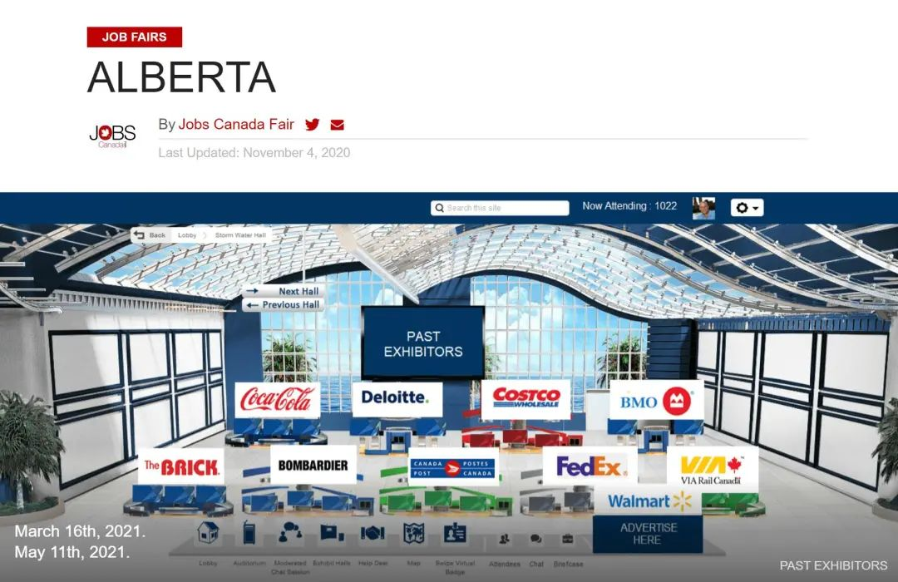
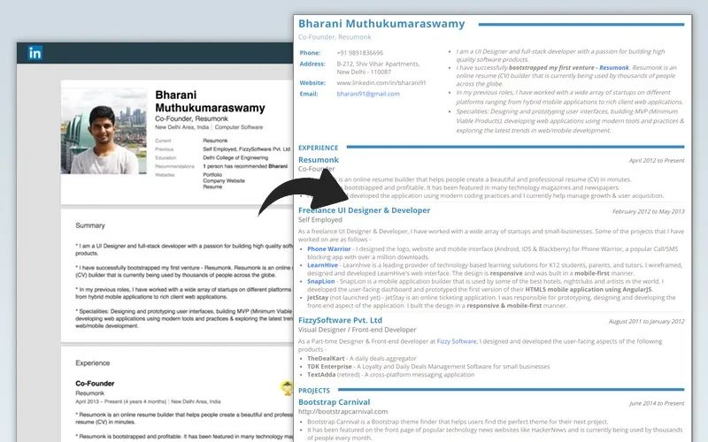
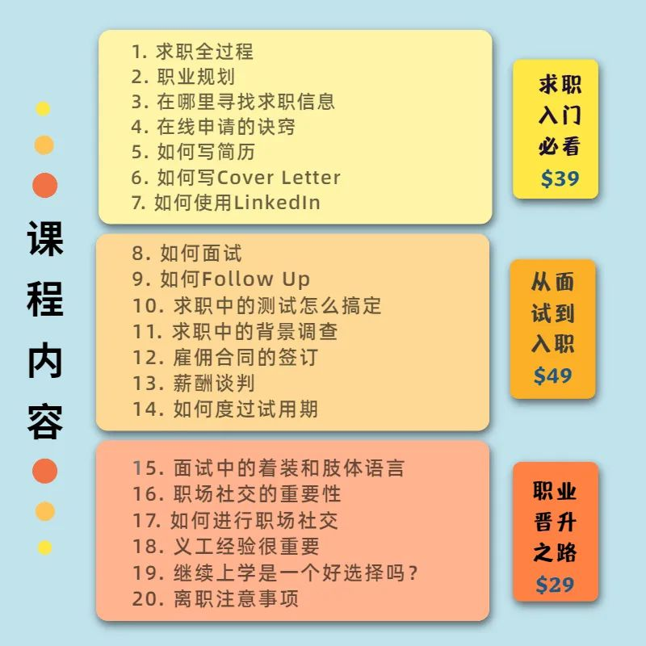
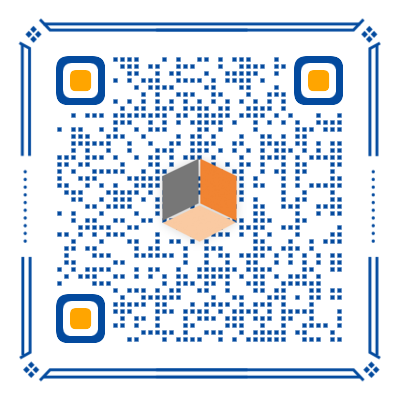

# 无标题

**链接地址:** http://mp.weixin.qq.com/s?__biz=MzI4NDYyNjAwNw==&mid=2247484678&idx=1&sn=05a221df1071f0ea8c83994c7586057c&chksm=ebf9d83edc8e51280d25202b7975abae93437ba2bb0c245bdb4ea841d8ae973b9f48a9d49afc&mpshare=1&scene=2&srcid=01172nEKN47vUYS7ESlEkPlj&sharer_sharetime=1610845850275&sharer_shareid=be1c8edd6c93eec155a61c876e41d26a#rd
**作者:** 关注我们
**获取时间:** 2025/8/28 19:57:51
**图片数量:** 24

---

## 原始HTML内容

<section style="box-sizing: border-box;font-size: 16px;"><section style="box-sizing: border-box;" powered-by="xiumi.us"><section style="display: flex;flex-flow: row nowrap;margin: 10px 0%;box-sizing: border-box;"><section style="display: inline-block;vertical-align: middle;width: auto;flex: 50 50 0%;height: auto;border-style: solid;border-width: 1px;border-radius: 0px;border-color: rgba(0, 0, 0, 0.24);padding: 4px;background-color: rgba(255, 255, 255, 0);box-shadow: rgb(255, 255, 255) 0px 0px 0px inset;align-self: center;box-sizing: border-box;"><section style="display: inline-block;width: 100%;vertical-align: top;background-color: rgba(0, 0, 0, 0.24);padding: 3px;box-sizing: border-box;" powered-by="xiumi.us"><section style="text-align: right;font-size: 14px;color: rgb(255, 255, 255);box-sizing: border-box;" powered-by="xiumi.us">
<strong style="box-sizing: border-box;">点击蓝字</strong>
</section></section></section><section style="display: inline-block;vertical-align: middle;width: auto;padding-top: 3px;padding-bottom: 3px;padding-left: 10px;flex: 50 50 0%;align-self: center;border-width: 0px;height: auto;box-shadow: rgb(0, 0, 0) 0px 0px 0px;background-color: rgb(255, 212, 168);box-sizing: border-box;"><section style="color: rgb(255, 255, 255);font-size: 14px;box-sizing: border-box;" powered-by="xiumi.us">
<strong style="box-sizing: border-box;">关注我们</strong>
</section></section></section></section><section style="box-sizing: border-box;" powered-by="xiumi.us">
 
</section><section style="margin-top: 10px;margin-right: 0%;margin-left: 0%;box-sizing: border-box;" powered-by="xiumi.us"><section style="display: inline-block;width: 100%;vertical-align: top;background-color: rgb(255, 212, 168);box-sizing: border-box;"><section style="box-sizing: border-box;" powered-by="xiumi.us"><section style="display: flex;flex-flow: row nowrap;box-sizing: border-box;"><section style="display: inline-block;vertical-align: middle;width: auto;flex: 100 100 0%;height: auto;align-self: center;box-sizing: border-box;"><section style="transform: translate3d(28px, 0px, 0px);margin-right: 0%;margin-left: 0%;box-sizing: border-box;" powered-by="xiumi.us"><section style="color: rgb(255, 255, 255);font-size: 17px;line-height: 1.6;letter-spacing: 2px;box-sizing: border-box;">
<strong style="box-sizing: border-box;">线上招聘会</strong>

<strong style="box-sizing: border-box;">应该怎样参加？</strong>
</section></section></section><section style="display: inline-block;vertical-align: middle;width: auto;flex: 0 0 auto;align-self: center;min-width: 10%;max-width: 100%;height: auto;box-sizing: border-box;"><section style="margin-right: 0%;margin-left: 0%;box-sizing: border-box;" powered-by="xiumi.us"><section style="text-align: center;color: rgb(255, 226, 196);font-size: 37px;line-height: 0.8;letter-spacing: 0px;box-sizing: border-box;">
<strong style="box-sizing: border-box;">Online&nbsp;</strong>
</section></section></section></section></section></section></section><section style="margin-right: 0%;margin-bottom: 10px;margin-left: 0%;box-sizing: border-box;" powered-by="xiumi.us"><section style="display: inline-block;width: 100%;vertical-align: top;border-style: none solid solid;border-width: 10px;border-radius: 0px;border-color: rgb(255, 228, 226) rgb(255, 212, 168) rgb(255, 212, 168);padding: 16px 20px;box-sizing: border-box;"><section style="text-align: center;margin: 10px 0% 20px;box-sizing: border-box;" powered-by="xiumi.us"><section style="max-width: 100%;vertical-align: middle;display: inline-block;line-height: 0;box-sizing: border-box;"></section></section><section style="margin-top: -20px;margin-right: 0%;margin-left: 0%;box-sizing: border-box;" powered-by="xiumi.us"><section style="text-align: right;font-size: 12px;color: rgba(121, 121, 121, 0.41);box-sizing: border-box;">
专题策划：BadaB Consulting Inc.
</section></section><section style="margin-right: 0%;margin-left: 0%;box-sizing: border-box;" powered-by="xiumi.us"><section style="font-size: 14px;color: rgb(120, 120, 120);line-height: 2;letter-spacing: 2px;box-sizing: border-box;">
 

通常每年的年初，都是加国<strong style="box-sizing: border-box;">人才市场流动较大</strong>的时刻。

 

许多大型公司招聘计划会在第一季度给出，届时会<strong style="box-sizing: border-box;">放出很多新职位</strong>。而想跳槽的职员也会等着年底公司发完bonus再申请离职，因此这段时间可供求职者参与的<strong style="box-sizing: border-box;">招聘活动尤为集中</strong>。

 
</section></section><section style="text-align: center;margin-top: 10px;margin-bottom: 10px;box-sizing: border-box;" powered-by="xiumi.us"><section style="max-width: 100%;vertical-align: middle;display: inline-block;line-height: 0;box-sizing: border-box;"></section></section><section style="margin-right: 0%;margin-left: 0%;box-sizing: border-box;" powered-by="xiumi.us"><section style="font-size: 14px;color: rgb(120, 120, 120);line-height: 2;letter-spacing: 2px;box-sizing: border-box;">
 

然而今年由于疫情的影响，求职招聘活动的主要战场<strong style="box-sizing: border-box;">从线下转为线上</strong>。

 

没有参与过线上招聘活动的求职者开始犯了难：我<strong style="box-sizing: border-box;">到底要怎样为线上招聘活动做好准备，才能给招聘单位留下最深刻的好映像呢？</strong>

 

 
</section></section><section style="transform: translate3d(1px, 0px, 0px);margin-top: 10px;margin-right: 0%;margin-left: 0%;box-sizing: border-box;" powered-by="xiumi.us"><section style="color: rgb(121, 121, 121);font-size: 17px;line-height: 1;letter-spacing: 2px;padding-right: 21px;padding-left: 21px;box-sizing: border-box;">
<strong style="box-sizing: border-box;">什么是“线上招聘会”？</strong>
</section></section><section style="box-sizing: border-box;" powered-by="xiumi.us"><section style="display: flex;flex-flow: row nowrap;box-sizing: border-box;"><section style="display: inline-block;vertical-align: top;width: auto;min-width: 10%;max-width: 100%;flex: 0 0 auto;height: auto;align-self: flex-start;box-sizing: border-box;"><section style="box-sizing: border-box;" powered-by="xiumi.us"><section style="margin-right: 0%;margin-bottom: -15px;margin-left: 0%;box-sizing: border-box;"><section style="text-align: right;font-size: 50px;color: rgba(237, 146, 15, 0.1);line-height: 0;letter-spacing: 0px;box-sizing: border-box;">
<strong style="box-sizing: border-box;">01</strong>
</section></section></section></section><section style="display: inline-block;vertical-align: top;width: auto;flex: 100 100 0%;align-self: flex-start;height: auto;margin-left: 10px;box-sizing: border-box;"><section style="margin-top: 6px;margin-right: 0%;margin-left: 0%;box-sizing: border-box;" powered-by="xiumi.us"><section style="background-color: rgba(255, 174, 174, 0.13);height: 1px;box-sizing: border-box;"><section><svg viewBox="0 0 1 1" style="float:left;line-height:0;width:0;vertical-align:top;"></svg></section></section></section></section></section></section><section style="margin-right: 0%;margin-left: 0%;box-sizing: border-box;" powered-by="xiumi.us"><section style="font-size: 14px;color: rgb(120, 120, 120);line-height: 2;letter-spacing: 2px;box-sizing: border-box;">
“线上招聘会”顾名思义就是<strong style="box-sizing: border-box;">利用网络平台进行的线上视频招聘活动</strong>。

 
</section></section><section style="text-align: center;margin-top: 10px;margin-bottom: 10px;box-sizing: border-box;" powered-by="xiumi.us"><section style="max-width: 100%;vertical-align: middle;display: inline-block;line-height: 0;box-sizing: border-box;"></section></section><section style="margin-right: 0%;margin-left: 0%;box-sizing: border-box;" powered-by="xiumi.us"><section style="font-size: 14px;color: rgb(120, 120, 120);line-height: 2;letter-spacing: 2px;box-sizing: border-box;">
 

其目的和普通的招聘会相同，都是为参展雇主代表和求职者提供一个高效便捷的<strong style="box-sizing: border-box;">就业信息交流平台</strong>。

 

但线上招聘会不仅更加<strong style="box-sizing: border-box;">透明高效</strong>，其活动形势和内容，甚至<strong style="box-sizing: border-box;">比线下招聘活动还要丰富</strong>。

 

你可以进入参展雇主的<strong style="box-sizing: border-box;">虚拟展位</strong>来浏览感兴趣的目标职位信息，通过即时聊天的模式和参展雇主代表进行<strong style="box-sizing: border-box;">一对一的语音或视频会话</strong>。

 
</section></section><section style="text-align: center;margin-top: 10px;margin-bottom: 10px;box-sizing: border-box;" powered-by="xiumi.us"><section style="max-width: 100%;vertical-align: middle;display: inline-block;line-height: 0;box-sizing: border-box;"></section></section><section style="text-align: center;font-size: 12px;color: rgba(0, 0, 0, 0.24);box-sizing: border-box;" powered-by="xiumi.us">
Jobs&nbsp;Canada&nbsp;Fair 在线活动页面
</section><section style="margin-right: 0%;margin-left: 0%;box-sizing: border-box;" powered-by="xiumi.us"><section style="font-size: 14px;color: rgb(120, 120, 120);line-height: 2;letter-spacing: 2px;box-sizing: border-box;">
 

也可以浏览提前录制好的<strong style="box-sizing: border-box;">网络研讨会</strong>来了解公司情况和行业动态，并采用电子邮件等方式追踪求职情况的进展。

 

另外，线上招聘会因为不受场地的限制，大部分都是<strong style="box-sizing: border-box;">免费为求职者提供</strong>的。而且求职者不受地理位置和通勤时间的约束，可以身处熟悉舒适的环境中参与活动，因此<strong style="box-sizing: border-box;">大大增加了求职者的可参与度</strong>。

 
</section></section><section style="text-align: center;margin-top: 10px;margin-bottom: 10px;box-sizing: border-box;" powered-by="xiumi.us"><section style="max-width: 100%;vertical-align: middle;display: inline-block;line-height: 0;box-sizing: border-box;"></section></section><section style="text-align: center;font-size: 12px;color: rgba(0, 0, 0, 0.24);box-sizing: border-box;" powered-by="xiumi.us">
线上招聘平台hexafair概念图
</section><section style="margin-right: 0%;margin-left: 0%;box-sizing: border-box;" powered-by="xiumi.us"><section style="font-size: 14px;color: rgb(120, 120, 120);line-height: 2;letter-spacing: 2px;box-sizing: border-box;">
 

然而大大提高的参与度也意味着<strong style="box-sizing: border-box;">更激烈的求职竞争</strong>，特别是在如今严峻的就业形势之下！

 

作为求职者要如何为线上招聘活动做好充分准备，从而<strong style="box-sizing: border-box;">大幅提高自己获得招聘单位面试和入职的机会</strong>，正是我们今天要和读者朋友们探讨的热门话题。

 

 
</section></section><section style="transform: translate3d(1px, 0px, 0px);margin-top: 10px;margin-right: 0%;margin-left: 0%;box-sizing: border-box;" powered-by="xiumi.us"><section style="color: rgb(121, 121, 121);font-size: 17px;line-height: 1;letter-spacing: 2px;padding-right: 21px;padding-left: 21px;box-sizing: border-box;">
<strong style="box-sizing: border-box;">Gear Up!准备好你的电子设备</strong>
</section></section><section style="box-sizing: border-box;" powered-by="xiumi.us"><section style="display: flex;flex-flow: row nowrap;box-sizing: border-box;"><section style="display: inline-block;vertical-align: top;width: auto;min-width: 10%;max-width: 100%;flex: 0 0 auto;height: auto;align-self: flex-start;box-sizing: border-box;"><section style="box-sizing: border-box;" powered-by="xiumi.us"><section style="margin-right: 0%;margin-bottom: -15px;margin-left: 0%;box-sizing: border-box;"><section style="text-align: right;font-size: 50px;color: rgba(237, 146, 15, 0.1);line-height: 0;letter-spacing: 0px;box-sizing: border-box;">
<strong style="box-sizing: border-box;">02</strong>
</section></section></section></section><section style="display: inline-block;vertical-align: top;width: auto;flex: 100 100 0%;align-self: flex-start;height: auto;margin-left: 10px;box-sizing: border-box;"><section style="margin-top: 6px;margin-right: 0%;margin-left: 0%;box-sizing: border-box;" powered-by="xiumi.us"><section style="background-color: rgba(255, 174, 174, 0.13);height: 1px;box-sizing: border-box;"><section><svg viewBox="0 0 1 1" style="float:left;line-height:0;width:0;vertical-align:top;"></svg></section></section></section></section></section></section><section style="box-sizing: border-box;" powered-by="xiumi.us">
 
</section><section style="margin-right: 0%;margin-left: 0%;box-sizing: border-box;" powered-by="xiumi.us"><section style="font-size: 14px;color: rgb(120, 120, 120);line-height: 2;letter-spacing: 2px;box-sizing: border-box;">
和普通的人才招聘活动不同的是，线上招聘活动需要通过电子设备和网络信号的传输。

 

所以为了保障有质量的活动参与效果，请在招聘活动前<strong style="box-sizing: border-box;">升级并设置好你的电子设备</strong>！

 
</section></section><section style="text-align: center;margin-top: 10px;margin-bottom: 10px;box-sizing: border-box;" powered-by="xiumi.us"><section style="max-width: 100%;vertical-align: middle;display: inline-block;line-height: 0;box-sizing: border-box;"></section></section><section style="margin-right: 0%;margin-left: 0%;box-sizing: border-box;" powered-by="xiumi.us"><section style="font-size: 14px;color: rgb(120, 120, 120);line-height: 2;letter-spacing: 2px;box-sizing: border-box;">
 

<strong style="box-sizing: border-box;">畅通的网络传输、清晰的摄像头、还有话筒和耳机等设备</strong>，请尽可能在自己财务可以承受的范围内准备齐全，以辅助你更加自信满满地参与招聘活动。

 

 
</section></section><section style="transform: translate3d(1px, 0px, 0px);margin-top: 10px;margin-right: 0%;margin-left: 0%;box-sizing: border-box;" powered-by="xiumi.us"><section style="color: rgb(121, 121, 121);font-size: 17px;line-height: 1;letter-spacing: 2px;padding-right: 21px;padding-left: 21px;box-sizing: border-box;">
<strong style="box-sizing: border-box;">注意你的“Dress Code”</strong>
</section></section><section style="box-sizing: border-box;" powered-by="xiumi.us"><section style="display: flex;flex-flow: row nowrap;box-sizing: border-box;"><section style="display: inline-block;vertical-align: top;width: auto;min-width: 10%;max-width: 100%;flex: 0 0 auto;height: auto;align-self: flex-start;box-sizing: border-box;"><section style="box-sizing: border-box;" powered-by="xiumi.us"><section style="margin-right: 0%;margin-bottom: -15px;margin-left: 0%;box-sizing: border-box;"><section style="text-align: right;font-size: 50px;color: rgba(237, 146, 15, 0.1);line-height: 0;letter-spacing: 0px;box-sizing: border-box;">
<strong style="box-sizing: border-box;">03</strong>
</section></section></section></section><section style="display: inline-block;vertical-align: top;width: auto;flex: 100 100 0%;align-self: flex-start;height: auto;margin-left: 10px;box-sizing: border-box;"><section style="margin-top: 6px;margin-right: 0%;margin-left: 0%;box-sizing: border-box;" powered-by="xiumi.us"><section style="background-color: rgba(255, 174, 174, 0.13);height: 1px;box-sizing: border-box;"><section><svg viewBox="0 0 1 1" style="float:left;line-height:0;width:0;vertical-align:top;"></svg></section></section></section></section></section></section><section style="margin-right: 0%;margin-left: 0%;box-sizing: border-box;" powered-by="xiumi.us"><section style="font-size: 14px;color: rgb(120, 120, 120);line-height: 2;letter-spacing: 2px;box-sizing: border-box;">
虽然线上招聘活动允许你坐在舒适熟悉的家中对着电脑屏幕进行，但这不代表你可以邋遢地穿着睡衣，嚼着零食进入视频模式！

 
</section></section><section style="text-align: center;margin-top: 10px;margin-bottom: 10px;box-sizing: border-box;" powered-by="xiumi.us"><section style="max-width: 100%;vertical-align: middle;display: inline-block;line-height: 0;box-sizing: border-box;"></section></section><section style="margin-right: 0%;margin-left: 0%;box-sizing: border-box;" powered-by="xiumi.us"><section style="font-size: 14px;color: rgb(120, 120, 120);line-height: 2;letter-spacing: 2px;box-sizing: border-box;">
 

线上招聘活动依然<strong style="box-sizing: border-box;">遵循正式的面试“Dress Code”</strong>，衬衣和西装这些基础的服饰要求是必不可少的。

 

虽然视频中可能看不到你的下半身穿着，但建议求职者们还是按照正式的面试场景穿戴整齐，以<strong style="box-sizing: border-box;">时刻提醒自己以最饱满的应聘状态去认真面对宝贵的求职机会</strong>。

 

 
</section></section><section style="transform: translate3d(1px, 0px, 0px);margin-top: 10px;margin-right: 0%;margin-left: 0%;box-sizing: border-box;" powered-by="xiumi.us"><section style="color: rgb(121, 121, 121);font-size: 17px;line-height: 1;letter-spacing: 2px;padding-right: 21px;padding-left: 21px;box-sizing: border-box;">
<strong style="box-sizing: border-box;">整洁明亮的环境必不可少</strong>
</section></section><section style="box-sizing: border-box;" powered-by="xiumi.us"><section style="display: flex;flex-flow: row nowrap;box-sizing: border-box;"><section style="display: inline-block;vertical-align: top;width: auto;min-width: 10%;max-width: 100%;flex: 0 0 auto;height: auto;align-self: flex-start;box-sizing: border-box;"><section style="box-sizing: border-box;" powered-by="xiumi.us"><section style="margin-right: 0%;margin-bottom: -15px;margin-left: 0%;box-sizing: border-box;"><section style="text-align: right;font-size: 50px;color: rgba(237, 146, 15, 0.1);line-height: 0;letter-spacing: 0px;box-sizing: border-box;">
<strong style="box-sizing: border-box;">04</strong>
</section></section></section></section><section style="display: inline-block;vertical-align: top;width: auto;flex: 100 100 0%;align-self: flex-start;height: auto;margin-left: 10px;box-sizing: border-box;"><section style="margin-top: 6px;margin-right: 0%;margin-left: 0%;box-sizing: border-box;" powered-by="xiumi.us"><section style="background-color: rgba(255, 174, 174, 0.13);height: 1px;box-sizing: border-box;"><section><svg viewBox="0 0 1 1" style="float:left;line-height:0;width:0;vertical-align:top;"></svg></section></section></section></section></section></section><section style="margin-right: 0%;margin-left: 0%;box-sizing: border-box;" powered-by="xiumi.us"><section style="font-size: 14px;color: rgb(120, 120, 120);line-height: 2;letter-spacing: 2px;box-sizing: border-box;">
大部分求职者会选择在家中参与在线招聘活动，但请尽可能提供一个<strong style="box-sizing: border-box;">安静、整洁、明亮的视频环境</strong>。

 
</section></section><section style="text-align: center;margin-top: 10px;margin-bottom: 10px;box-sizing: border-box;" powered-by="xiumi.us"><section style="max-width: 100%;vertical-align: middle;display: inline-block;line-height: 0;box-sizing: border-box;"></section></section><section style="margin-right: 0%;margin-left: 0%;box-sizing: border-box;" powered-by="xiumi.us"><section style="font-size: 14px;color: rgb(120, 120, 120);line-height: 2;letter-spacing: 2px;box-sizing: border-box;">
 

家中有其他家庭成员居住的应聘者，也请<strong style="box-sizing: border-box;">提前告知家庭成员你的求职活动</strong>，并请求他们在活动中照顾好家中的儿童及宠物。

 

虽然营造一个良好的视频环境并不能保证你获得一份心仪的工作，但<strong style="box-sizing: border-box;">嘈杂和凌乱的环境一定会给你的面试效果大打折扣</strong>。

 

 
</section></section><section style="transform: translate3d(1px, 0px, 0px);margin-top: 10px;margin-right: 0%;margin-left: 0%;box-sizing: border-box;" powered-by="xiumi.us"><section style="color: rgb(121, 121, 121);font-size: 17px;line-height: 1;letter-spacing: 2px;padding-right: 21px;padding-left: 21px;box-sizing: border-box;">
<strong style="box-sizing: border-box;">注意眼神交流和肢体语言</strong>
</section></section><section style="box-sizing: border-box;" powered-by="xiumi.us"><section style="display: flex;flex-flow: row nowrap;box-sizing: border-box;"><section style="display: inline-block;vertical-align: top;width: auto;min-width: 10%;max-width: 100%;flex: 0 0 auto;height: auto;align-self: flex-start;box-sizing: border-box;"><section style="box-sizing: border-box;" powered-by="xiumi.us"><section style="margin-right: 0%;margin-bottom: -15px;margin-left: 0%;box-sizing: border-box;"><section style="text-align: right;font-size: 50px;color: rgba(237, 146, 15, 0.1);line-height: 0;letter-spacing: 0px;box-sizing: border-box;">
<strong style="box-sizing: border-box;">05</strong>
</section></section></section></section><section style="display: inline-block;vertical-align: top;width: auto;flex: 100 100 0%;align-self: flex-start;height: auto;margin-left: 10px;box-sizing: border-box;"><section style="margin-top: 6px;margin-right: 0%;margin-left: 0%;box-sizing: border-box;" powered-by="xiumi.us"><section style="background-color: rgba(255, 174, 174, 0.13);height: 1px;box-sizing: border-box;"><section><svg viewBox="0 0 1 1" style="float:left;line-height:0;width:0;vertical-align:top;"></svg></section></section></section></section></section></section><section style="margin-right: 0%;margin-left: 0%;box-sizing: border-box;" powered-by="xiumi.us"><section style="font-size: 14px;color: rgb(120, 120, 120);line-height: 2;letter-spacing: 2px;box-sizing: border-box;">
哪怕你是身经百战的招聘活动参与者，第一次参加线上版的招聘活动，一定也会遇到一些<strong style="box-sizing: border-box;">不习惯的地方</strong>。

 
</section></section><section style="text-align: center;margin-top: 10px;margin-bottom: 10px;box-sizing: border-box;" powered-by="xiumi.us"><section style="max-width: 100%;vertical-align: middle;display: inline-block;line-height: 0;box-sizing: border-box;"></section></section><section style="margin-right: 0%;margin-left: 0%;box-sizing: border-box;" powered-by="xiumi.us"><section style="font-size: 14px;color: rgb(120, 120, 120);line-height: 2;letter-spacing: 2px;box-sizing: border-box;">
 

在面对面的招聘活动中，你可以轻易地和面试人员进行眼神和肢体动作上的交流；但在进行线上招聘活动时，大部分时间你需要盯着摄像头进行对话而不是屏幕，这样就<strong style="box-sizing: border-box;">难以保证足够的眼神交流</strong>。

 

而且可能发生的视频卡顿和掉帧问题，也会大大<strong style="box-sizing: border-box;">削弱你的肢体语言和手势可以传达的信息</strong>。

 
</section></section><section style="text-align: center;margin-top: 10px;margin-bottom: 10px;box-sizing: border-box;" powered-by="xiumi.us"><section style="max-width: 100%;vertical-align: middle;display: inline-block;line-height: 0;box-sizing: border-box;"></section></section><section style="margin-right: 0%;margin-left: 0%;box-sizing: border-box;" powered-by="xiumi.us"><section style="font-size: 14px;color: rgb(120, 120, 120);line-height: 2;letter-spacing: 2px;box-sizing: border-box;">
 

因此我们建议求职者在参加活动时，以较平常<strong style="box-sizing: border-box;">更明显的语调及更夸张的面部表情和肢体语言</strong>去进行沟通。并提前多次练习，以让自己适应这样的表达方式。

 
</section></section><section style="margin: 10px 0%;box-sizing: border-box;" powered-by="xiumi.us"><section style="display: inline-block;width: 100%;vertical-align: top;border-style: solid;border-width: 1px;border-radius: 0px;border-color: rgba(187, 222, 251, 0);padding-right: 10px;padding-bottom: 5px;box-shadow: rgb(0, 0, 0) 0px 0px 0px;background-color: rgba(237, 146, 15, 0.1);box-sizing: border-box;"><section style="box-sizing: border-box;" powered-by="xiumi.us"><section style="display: flex;flex-flow: row nowrap;box-sizing: border-box;"><section style="display: inline-block;vertical-align: middle;width: auto;flex: 10 10 0%;height: auto;border-style: none solid solid none;border-width: 1px;border-radius: 0px;border-color: rgb(0, 175, 236) rgba(187, 222, 251, 0) rgba(187, 222, 251, 0) rgb(0, 175, 236);padding-top: 4px;padding-right: 4px;padding-bottom: 4px;background-color: rgba(255, 255, 255, 0);box-shadow: rgb(255, 255, 255) 0px 0px 0px inset;align-self: center;box-sizing: border-box;"><section style="display: inline-block;width: 100%;vertical-align: top;background-color: rgb(255, 226, 196);padding: 3px;box-sizing: border-box;" powered-by="xiumi.us"><section style="margin-right: 0%;margin-left: 0%;box-sizing: border-box;" powered-by="xiumi.us"><section style="text-align: center;font-size: 14px;color: rgb(106, 106, 106);line-height: 1.2;box-sizing: border-box;">
<strong style="box-sizing: border-box;">贴士</strong>
</section></section></section></section><section style="display: inline-block;vertical-align: middle;width: auto;padding-left: 10px;flex: 100 100 0%;align-self: center;border-width: 0px;height: auto;box-shadow: rgb(0, 0, 0) 0px 0px 0px;box-sizing: border-box;"><section style="color: rgb(106, 106, 106);box-sizing: border-box;" powered-by="xiumi.us"><strong style="box-sizing: border-box;">我们提供“模拟面试”！</strong></section></section></section></section><section style="display: inline-block;width: 100%;vertical-align: top;padding: 10px;box-sizing: border-box;" powered-by="xiumi.us"><section style="margin-right: 0%;margin-left: 0%;box-sizing: border-box;" powered-by="xiumi.us"><section style="color: rgb(120, 120, 120);font-size: 14px;letter-spacing: 2px;line-height: 2;padding-right: 10px;padding-left: 10px;box-sizing: border-box;">
你知道吗？BadaB Consulting 提供<strong style="box-sizing: border-box;">一对一的在线“模拟面试”指导</strong>！对在线面试心里没底的小伙伴们，赶快联系我们获取<strong style="box-sizing: border-box;">最专业最高效的帮助</strong>吧！
</section></section><section style="box-sizing: border-box;" powered-by="xiumi.us"><section style="display: flex;flex-flow: row nowrap;margin: 10px 0%;box-sizing: border-box;"><section style="display: inline-block;vertical-align: middle;width: auto;flex: 0 0 0%;align-self: center;height: auto;box-sizing: border-box;"><section style="text-align: center;box-sizing: border-box;" powered-by="xiumi.us"><section style="display: inline-block;width: 90px;height: 150px;vertical-align: top;overflow: hidden;border-style: solid;border-width: 4px;border-radius: 0px;border-color: rgb(255, 226, 196);box-sizing: border-box;"><section><svg viewBox="0 0 1 1" style="float:left;line-height:0;width:0;vertical-align:top;"></svg></section></section></section></section><section style="display: inline-block;vertical-align: middle;width: auto;flex: 89.2857 89.2857 0%;align-self: center;height: auto;background-color: rgb(255, 255, 255);margin-left: -65px;box-sizing: border-box;"><section style="box-sizing: border-box;" powered-by="xiumi.us"><section style="display: flex;flex-flow: row nowrap;box-sizing: border-box;"><section style="display: inline-block;vertical-align: middle;width: auto;padding-right: 5px;flex: 0 0 0%;height: auto;align-self: center;box-sizing: border-box;"><section style="box-sizing: border-box;" powered-by="xiumi.us"><section style="display: flex;flex-flow: row nowrap;box-sizing: border-box;"><section style="display: inline-block;width: 120px;vertical-align: top;flex: 0 0 auto;height: auto;align-self: flex-start;box-sizing: border-box;"><section style="text-align: center;margin-right: 0%;margin-left: 0%;box-sizing: border-box;" powered-by="xiumi.us"><section style="max-width: 100%;vertical-align: middle;display: inline-block;line-height: 0;width: 100%;border-color: rgba(118, 178, 124, 0);border-width: 5px;border-radius: 0px;border-style: solid;box-shadow: rgb(0, 0, 0) 0px 0px 0px;box-sizing: border-box;"></section></section></section></section></section></section><section style="display: inline-block;vertical-align: middle;width: auto;padding-left: 5px;flex: 100 100 0%;height: auto;align-self: center;box-sizing: border-box;"><section style="margin-right: 0%;margin-left: 0%;box-sizing: border-box;" powered-by="xiumi.us"><section style="color: rgb(121, 121, 121);font-size: 12px;box-sizing: border-box;">
<strong style="box-sizing: border-box;">Badab Consulting Inc.</strong>

微信号 : badab101

新浪微博：BadaB_Consulting
</section></section></section></section></section></section></section></section></section></section></section><section style="margin-right: 0%;margin-left: 0%;box-sizing: border-box;" powered-by="xiumi.us"><section style="font-size: 14px;color: rgb(120, 120, 120);line-height: 2;letter-spacing: 2px;box-sizing: border-box;">
 

 
</section></section><section style="transform: translate3d(1px, 0px, 0px);margin-top: 10px;margin-right: 0%;margin-left: 0%;box-sizing: border-box;" powered-by="xiumi.us"><section style="color: rgb(121, 121, 121);font-size: 17px;line-height: 1;letter-spacing: 2px;padding-right: 21px;padding-left: 21px;box-sizing: border-box;">
<strong style="box-sizing: border-box;">将简历和LinkedIn准备好</strong>
</section></section><section style="box-sizing: border-box;" powered-by="xiumi.us"><section style="display: flex;flex-flow: row nowrap;box-sizing: border-box;"><section style="display: inline-block;vertical-align: top;width: auto;min-width: 10%;max-width: 100%;flex: 0 0 auto;height: auto;align-self: flex-start;box-sizing: border-box;"><section style="box-sizing: border-box;" powered-by="xiumi.us"><section style="margin-right: 0%;margin-bottom: -15px;margin-left: 0%;box-sizing: border-box;"><section style="text-align: right;font-size: 50px;color: rgba(237, 146, 15, 0.1);line-height: 0;letter-spacing: 0px;box-sizing: border-box;">
<strong style="box-sizing: border-box;">06</strong>
</section></section></section></section><section style="display: inline-block;vertical-align: top;width: auto;flex: 100 100 0%;align-self: flex-start;height: auto;margin-left: 10px;box-sizing: border-box;"><section style="margin-top: 6px;margin-right: 0%;margin-left: 0%;box-sizing: border-box;" powered-by="xiumi.us"><section style="background-color: rgba(255, 174, 174, 0.13);height: 1px;box-sizing: border-box;"><section><svg viewBox="0 0 1 1" style="float:left;line-height:0;width:0;vertical-align:top;"></svg></section></section></section></section></section></section><section style="margin-right: 0%;margin-left: 0%;box-sizing: border-box;" powered-by="xiumi.us"><section style="font-size: 14px;color: rgb(120, 120, 120);line-height: 2;letter-spacing: 2px;box-sizing: border-box;">
在线招聘活动的优点在于，你不用再抱着厚厚一摞简历、证书和作品集在嘈杂的会场跑来跑去。

 
</section></section><section style="text-align: center;margin-top: 10px;margin-bottom: 10px;box-sizing: border-box;" powered-by="xiumi.us"><section style="max-width: 100%;vertical-align: middle;display: inline-block;line-height: 0;box-sizing: border-box;"></section></section><section style="margin-right: 0%;margin-left: 0%;box-sizing: border-box;" powered-by="xiumi.us"><section style="font-size: 14px;color: rgb(120, 120, 120);line-height: 2;letter-spacing: 2px;box-sizing: border-box;">
 

不过记得参加在线招聘活动之前，请<strong style="box-sizing: border-box;">提前将自己的电子版简历，LinkedIn主页，及其他可以展示自己职业能力的文件准备好。</strong>

 

并且准备好几个基础的面试问题，特别是一段<strong style="box-sizing: border-box;">精简流利的自我介绍</strong>必不可少，将和应聘单位的每一次交流都当做一次正式的面试机会去沉着应对。

 
</section></section><section style="text-align: center;margin-top: 10px;margin-bottom: 10px;box-sizing: border-box;" powered-by="xiumi.us"><section style="max-width: 100%;vertical-align: middle;display: inline-block;line-height: 0;box-sizing: border-box;"></section></section><section style="margin-right: 0%;margin-left: 0%;box-sizing: border-box;" powered-by="xiumi.us"><section style="font-size: 14px;color: rgb(120, 120, 120);line-height: 2;letter-spacing: 2px;box-sizing: border-box;">
 

另外，请尽可能地<strong style="box-sizing: border-box;">积极参与交流</strong>，推销自己的工作能力以扩大职场交际圈。哪怕在这次活动中没有直接斩获新的工作机会，也可以拓展社交人脉，为自己今后的职业晋升拓宽道路。

 

 
</section></section><section style="transform: translate3d(1px, 0px, 0px);margin-top: 10px;margin-right: 0%;margin-left: 0%;box-sizing: border-box;" powered-by="xiumi.us"><section style="color: rgb(121, 121, 121);font-size: 17px;line-height: 1;letter-spacing: 2px;padding-right: 21px;padding-left: 21px;box-sizing: border-box;">
<strong style="box-sizing: border-box;">多参加职业社交活动</strong>
</section></section><section style="box-sizing: border-box;" powered-by="xiumi.us"><section style="display: flex;flex-flow: row nowrap;box-sizing: border-box;"><section style="display: inline-block;vertical-align: top;width: auto;min-width: 10%;max-width: 100%;flex: 0 0 auto;height: auto;align-self: flex-start;box-sizing: border-box;"><section style="box-sizing: border-box;" powered-by="xiumi.us"><section style="margin-right: 0%;margin-bottom: -15px;margin-left: 0%;box-sizing: border-box;"><section style="text-align: right;font-size: 50px;color: rgba(237, 146, 15, 0.1);line-height: 0;letter-spacing: 0px;box-sizing: border-box;">
<strong style="box-sizing: border-box;">07</strong>
</section></section></section></section><section style="display: inline-block;vertical-align: top;width: auto;flex: 100 100 0%;align-self: flex-start;height: auto;margin-left: 10px;box-sizing: border-box;"><section style="margin-top: 6px;margin-right: 0%;margin-left: 0%;box-sizing: border-box;" powered-by="xiumi.us"><section style="background-color: rgba(255, 174, 174, 0.13);height: 1px;box-sizing: border-box;"><section><svg viewBox="0 0 1 1" style="float:left;line-height:0;width:0;vertical-align:top;"></svg></section></section></section></section></section></section><section style="margin-right: 0%;margin-left: 0%;box-sizing: border-box;" powered-by="xiumi.us"><section style="font-size: 14px;color: rgb(120, 120, 120);line-height: 2;letter-spacing: 2px;box-sizing: border-box;">
每年正式且大型的在线招聘活动数量有限，但能够提高职场社交经验，拓展职业晋升机会的方式，<strong style="box-sizing: border-box;">远不止参加在线招聘活动一种</strong>。

 

多参与各类职业社交活动不仅可以拓展自己的职业社交圈，更可以<strong style="box-sizing: border-box;">遇见潜在的雇主</strong>，了解产业发展动向，并获取更多工作机会的信息。

 

这样的活动机会哪里找？<strong style="box-sizing: border-box;">练手的机会这就来啦！</strong>快去报名参加免费的 <strong style="box-sizing: border-box;">YEG JOB Club</strong>活动！
</section></section><section style="margin-right: 0%;margin-left: 0%;box-sizing: border-box;" powered-by="xiumi.us"><section style="font-size: 14px;color: rgb(120, 120, 120);line-height: 2;letter-spacing: 2px;box-sizing: border-box;">
 
</section></section><section style="text-align: center;margin-top: 10px;margin-bottom: 10px;box-sizing: border-box;" powered-by="xiumi.us"><section style="max-width: 100%;vertical-align: middle;display: inline-block;line-height: 0;box-sizing: border-box;"></section></section><section style="box-sizing: border-box;" powered-by="xiumi.us"><section style="display: flex;flex-flow: row nowrap;margin-top: -7px;margin-right: 0%;margin-left: 0%;box-sizing: border-box;"><section style="display: inline-block;vertical-align: top;width: 50%;background-color: rgb(125, 192, 232);padding-top: 10px;padding-bottom: 10px;padding-left: 10px;flex: 0 0 auto;align-self: stretch;border-width: 0px;box-sizing: border-box;"><section><svg viewBox="0 0 1 1" style="float:left;line-height:0;width:0;vertical-align:top;"></svg></section></section><section style="display: inline-block;vertical-align: top;width: auto;padding-top: 10px;padding-right: 10px;padding-bottom: 10px;border-width: 0px;border-radius: 0px;border-style: none;border-color: rgb(62, 62, 62);flex: 100 100 0%;align-self: stretch;height: auto;letter-spacing: 0px;background-position: 0% 0%;background-repeat: repeat;background-size: 12%;background-attachment: scroll;background-image: url(&quot;https://mmbiz.qpic.cn/mmbiz_jpg/cY0qSDjdkFdOWSHGSPibvu5ialMjZib086cV7gr2DicmicSd1uyJWlwlkODh2EazNCsRWxI1CObCnWibwfoHjWKJfMSQ/640?wx_fmt=jpeg&quot;);box-sizing: border-box;"><section><svg viewBox="0 0 1 1" style="float:left;line-height:0;width:0;vertical-align:top;"></svg></section></section></section></section><section style="box-sizing: border-box;" powered-by="xiumi.us"><section style="display: flex;flex-flow: row nowrap;box-sizing: border-box;"><section style="display: inline-block;vertical-align: top;width: 50%;background-color: rgb(125, 192, 232);padding: 10px;flex: 0 0 auto;align-self: stretch;border-width: 0px;box-sizing: border-box;"><section style="color: rgb(255, 255, 255);padding-right: 10px;padding-left: 10px;box-sizing: border-box;" powered-by="xiumi.us">
<strong style="box-sizing: border-box;">活动形式</strong>
</section><section style="text-align: right;color: rgb(255, 255, 255);font-size: 12px;padding-right: 10px;padding-left: 10px;box-sizing: border-box;" powered-by="xiumi.us">
 

<strong style="box-sizing: border-box;">线上活动</strong>
</section></section><section style="display: inline-block;vertical-align: top;width: auto;padding-top: 10px;padding-right: 10px;padding-bottom: 10px;background-position: 0% 0%;background-repeat: repeat;background-size: 12%;background-attachment: scroll;border-width: 0px;border-radius: 0px;border-style: none;border-color: rgb(62, 62, 62);flex: 100 100 0%;align-self: stretch;height: auto;letter-spacing: 0px;background-image: url(&quot;https://mmbiz.qpic.cn/mmbiz_jpg/cY0qSDjdkFdOWSHGSPibvu5ialMjZib086cV7gr2DicmicSd1uyJWlwlkODh2EazNCsRWxI1CObCnWibwfoHjWKJfMSQ/640?wx_fmt=jpeg&quot;);box-sizing: border-box;"><section style="color: rgb(15, 76, 129);padding-right: 10px;padding-left: 10px;box-sizing: border-box;" powered-by="xiumi.us">
<strong style="box-sizing: border-box;">活动时间</strong>
</section><section style="color: rgb(15, 76, 129);font-size: 12px;padding-right: 10px;padding-left: 10px;box-sizing: border-box;" powered-by="xiumi.us">
Wed, January 20, 2021

5:00 PM – 7:30 PM MST
</section><section style="box-sizing: border-box;" powered-by="xiumi.us">
 
</section></section></section></section><section style="box-sizing: border-box;" powered-by="xiumi.us"><section style="display: flex;flex-flow: row nowrap;box-sizing: border-box;"><section style="display: inline-block;vertical-align: top;width: 50%;background-color: rgb(125, 192, 232);padding-top: 10px;padding-bottom: 10px;padding-left: 10px;flex: 0 0 auto;align-self: stretch;border-width: 0px;box-sizing: border-box;"><section style="box-sizing: border-box;" powered-by="xiumi.us">
 
</section><section style="text-align: center;margin-right: 0%;margin-bottom: 10px;margin-left: 0%;box-sizing: border-box;" powered-by="xiumi.us"><section style="max-width: 100%;vertical-align: middle;display: inline-block;line-height: 0;border-style: solid solid solid none;border-width: 0px 10px;border-radius: 0px;border-color: rgb(62, 62, 62) rgb(125, 192, 232) rgb(62, 62, 62) rgb(15, 76, 129);width: 50%;height: auto;box-sizing: border-box;"></section></section></section><section style="display: inline-block;vertical-align: top;width: auto;padding: 10px;border-width: 0px;border-radius: 0px;border-style: none;border-color: rgb(62, 62, 62);flex: 100 100 0%;align-self: stretch;height: auto;letter-spacing: 0px;background-attachment: scroll;background-position: 0% 0%;background-repeat: repeat;background-size: 12%;background-image: url(&quot;https://mmbiz.qpic.cn/mmbiz_jpg/cY0qSDjdkFdOWSHGSPibvu5ialMjZib086cV7gr2DicmicSd1uyJWlwlkODh2EazNCsRWxI1CObCnWibwfoHjWKJfMSQ/640?wx_fmt=jpeg&quot;);box-sizing: border-box;"><section style="box-sizing: border-box;" powered-by="xiumi.us">
 
</section><section style="color: rgb(15, 76, 129);padding-right: 10px;padding-left: 10px;box-sizing: border-box;" powered-by="xiumi.us">
<strong style="box-sizing: border-box;">Register</strong>
</section><section style="color: rgb(15, 76, 129);font-size: 12px;padding-right: 10px;padding-left: 10px;box-sizing: border-box;">
活动<strong style="letter-spacing: 0px;box-sizing: border-box;">免费</strong> 

 

扫描<strong style="color: rgb(125, 192, 232);text-decoration: underline;box-sizing: border-box;">左侧二维码&nbsp;</strong>
</section></section></section></section><section style="box-sizing: border-box;" powered-by="xiumi.us">
 
</section><section style="margin-top: 0.5em;text-align: center;box-sizing: border-box;" powered-by="xiumi.us"><section style="display: inline-block;background-color: rgb(125, 192, 232);padding: 8px;border-radius: 0.5em;box-sizing: border-box;"><section style="text-align: justify;color: rgb(255, 255, 255);letter-spacing: 5px;box-sizing: border-box;" powered-by="xiumi.us">
<strong style="box-sizing: border-box;">活动页面</strong>
</section></section></section><section style="margin-bottom: 0.5em;text-align: center;line-height: 10px;box-sizing: border-box;" powered-by="xiumi.us"><section style="width: 0px;border-top: 10px solid rgb(125, 192, 232);display: inline-block;vertical-align: top;border-left: 6px solid transparent !important;border-right: 6px solid transparent !important;box-sizing: border-box;"><section><svg viewBox="0 0 1 1" style="float:left;line-height:0;width:0;vertical-align:top;"></svg></section></section></section><section style="padding-right: 20px;padding-left: 20px;box-sizing: border-box;" powered-by="xiumi.us">
https://www.eventbrite.ca/e/yeg-job-club-registration-133168459447 
</section><section style="text-align: center;font-size: 12px;color: rgba(0, 0, 0, 0.24);box-sizing: border-box;" powered-by="xiumi.us">
（或点击链接进入注册页面）
</section><section style="margin-right: 0%;margin-left: 0%;box-sizing: border-box;" powered-by="xiumi.us"><section style="font-size: 14px;color: rgb(120, 120, 120);line-height: 2;letter-spacing: 2px;box-sizing: border-box;">
 
</section></section><section style="box-sizing: border-box;" powered-by="xiumi.us">
 
</section><section style="font-size: 14px;padding-right: 20px;padding-left: 20px;letter-spacing: 2px;color: rgb(121, 121, 121);line-height: 2;box-sizing: border-box;" powered-by="xiumi.us">
我们的资深人力资源顾问<strong style="box-sizing: border-box;">Ada Tai</strong> 和<strong style="box-sizing: border-box;">Amber Lautischer </strong>也将参与这次活动，为大家从公司HR的专业角度<strong style="box-sizing: border-box;">量身定做职业规划的最优方案</strong>。

 
</section><section style="margin: 10px 0% 6px;box-sizing: border-box;" powered-by="xiumi.us"><section style="display: inline-block;vertical-align: middle;width: 33.33%;padding-right: 3px;padding-left: 3px;box-sizing: border-box;"><section style="font-size: 29px;text-align: center;margin-right: 0%;margin-left: 0%;box-sizing: border-box;" powered-by="xiumi.us"><section style="box-sizing: border-box;display: inline-block;vertical-align: bottom;margin: auto;width: 3em;height: 3em;border-radius: 100%;background-position: 36.5155% 57.5179%;background-repeat: no-repeat;background-size: 581.609%;overflow: hidden;background-image: url(&quot;https://mmbiz.qpic.cn/mmbiz_jpg/cY0qSDjdkFdOWSHGSPibvu5ialMjZib086c7qfzjTicNg7pJegdeVbzvNFWWia4RUMW2KgNJ28ASicefjWUs8UlaGElA/640?wx_fmt=jpeg&quot;);"><section style="height: 100%;overflow: hidden;line-height: 0;vertical-align: middle;max-width: 100%;box-sizing: border-box;"></section></section></section><section style="text-align: center;font-size: 14px;color: rgb(121, 121, 121);box-sizing: border-box;" powered-by="xiumi.us">
资深HR
</section></section><section style="display: inline-block;vertical-align: middle;width: 33.33%;padding-right: 3px;padding-left: 3px;box-sizing: border-box;"><section style="font-size: 29px;text-align: center;margin-right: 0%;margin-left: 0%;box-sizing: border-box;" powered-by="xiumi.us"><section style="box-sizing: border-box;display: inline-block;vertical-align: bottom;margin: auto;width: 3em;height: 3em;border-radius: 100%;background-position: 90.2222% 57.1111%;background-repeat: no-repeat;background-size: 617.241%;overflow: hidden;background-image: url(&quot;https://mmbiz.qpic.cn/mmbiz_jpg/cY0qSDjdkFdOWSHGSPibvu5ialMjZib086c7qfzjTicNg7pJegdeVbzvNFWWia4RUMW2KgNJ28ASicefjWUs8UlaGElA/640?wx_fmt=jpeg&quot;);"><section style="height: 100%;overflow: hidden;line-height: 0;vertical-align: middle;max-width: 100%;box-sizing: border-box;"></section></section></section><section style="text-align: center;font-size: 14px;color: rgb(121, 121, 121);box-sizing: border-box;" powered-by="xiumi.us">
企业高管
</section></section><section style="display: inline-block;vertical-align: middle;width: 33.33%;padding-right: 3px;padding-left: 3px;box-sizing: border-box;"><section style="font-size: 29px;text-align: center;margin-right: 0%;margin-left: 0%;box-sizing: border-box;" powered-by="xiumi.us"><section style="box-sizing: border-box;display: inline-block;vertical-align: bottom;margin: auto;width: 3em;height: 3em;border-radius: 100%;background-position: 36.7521% 8.54701%;background-repeat: no-repeat;background-size: 637.931%;overflow: hidden;background-image: url(&quot;https://mmbiz.qpic.cn/mmbiz_jpg/cY0qSDjdkFdOWSHGSPibvu5ialMjZib086c7qfzjTicNg7pJegdeVbzvNFWWia4RUMW2KgNJ28ASicefjWUs8UlaGElA/640?wx_fmt=jpeg&quot;);"><section style="height: 100%;overflow: hidden;line-height: 0;vertical-align: middle;max-width: 100%;box-sizing: border-box;"></section></section></section><section style="text-align: center;font-size: 14px;color: rgb(121, 121, 121);box-sizing: border-box;" powered-by="xiumi.us">
创业家
</section></section></section><section style="font-size: 14px;padding-right: 20px;padding-left: 20px;letter-spacing: 2px;color: rgb(121, 121, 121);line-height: 2;box-sizing: border-box;" powered-by="xiumi.us">
 

同时，在一个半小时的活动中，我们还将安排多位来自不同工作领域的<strong style="box-sizing: border-box;">神秘嘉宾</strong>，就大家最关心的<strong style="box-sizing: border-box;">在疫情环境下如何提升自我的职场竞争力，如何适应远程办公等热门话题</strong>进行探讨，为处于职场挑战中的你群策群力，<strong style="box-sizing: border-box;">找出职场前进的最佳方向</strong>。
</section><section style="margin-right: 0%;margin-left: 0%;box-sizing: border-box;" powered-by="xiumi.us"><section style="font-size: 14px;color: rgb(120, 120, 120);line-height: 2;letter-spacing: 2px;box-sizing: border-box;">
 
</section></section><section style="margin: 10px 0%;box-sizing: border-box;" powered-by="xiumi.us"><section style="display: inline-block;width: 100%;vertical-align: top;border-style: solid;border-width: 1px;border-radius: 0px;border-color: rgba(187, 222, 251, 0);padding-right: 10px;padding-bottom: 5px;box-shadow: rgb(0, 0, 0) 0px 0px 0px;background-color: rgba(237, 146, 15, 0.1);box-sizing: border-box;"><section style="box-sizing: border-box;" powered-by="xiumi.us"><section style="display: flex;flex-flow: row nowrap;box-sizing: border-box;"><section style="display: inline-block;vertical-align: middle;width: auto;flex: 10 10 0%;height: auto;border-style: none solid solid none;border-width: 1px;border-radius: 0px;border-color: rgb(0, 175, 236) rgba(187, 222, 251, 0) rgba(187, 222, 251, 0) rgb(0, 175, 236);padding-top: 4px;padding-right: 4px;padding-bottom: 4px;background-color: rgba(255, 255, 255, 0);box-shadow: rgb(255, 255, 255) 0px 0px 0px inset;align-self: center;box-sizing: border-box;"><section style="display: inline-block;width: 100%;vertical-align: top;background-color: rgb(255, 226, 196);padding: 3px;box-sizing: border-box;" powered-by="xiumi.us"><section style="margin-right: 0%;margin-left: 0%;box-sizing: border-box;" powered-by="xiumi.us"><section style="text-align: center;font-size: 14px;color: rgb(106, 106, 106);line-height: 1.2;box-sizing: border-box;">
<strong style="box-sizing: border-box;">预告</strong>
</section></section></section></section><section style="display: inline-block;vertical-align: middle;width: auto;padding-left: 10px;flex: 100 100 0%;align-self: center;border-width: 0px;height: auto;box-shadow: rgb(0, 0, 0) 0px 0px 0px;box-sizing: border-box;"><section style="color: rgb(106, 106, 106);box-sizing: border-box;" powered-by="xiumi.us"><strong style="box-sizing: border-box;">“后疫情时代求职专题”即将上线！</strong></section></section></section></section><section style="display: inline-block;width: 100%;vertical-align: top;padding: 10px;box-sizing: border-box;" powered-by="xiumi.us"><section style="margin-right: 0%;margin-left: 0%;box-sizing: border-box;" powered-by="xiumi.us"><section style="color: rgb(120, 120, 120);font-size: 14px;letter-spacing: 2px;line-height: 2;padding-right: 10px;padding-left: 10px;box-sizing: border-box;">
我们的<strong style="box-sizing: border-box;">“Online Training for Job Seekers”</strong>系列在线求职课程已经推出快一年啦！

 
</section></section><section style="text-align: center;margin-top: 10px;margin-bottom: 10px;justify-content: center;box-sizing: border-box;" powered-by="xiumi.us"><section style="max-width: 100%;vertical-align: middle;display: inline-block;line-height: 0;box-sizing: border-box;"></section></section><section style="margin-right: 0%;margin-left: 0%;box-sizing: border-box;" powered-by="xiumi.us"><section style="color: rgb(120, 120, 120);font-size: 14px;letter-spacing: 2px;line-height: 2;padding-right: 10px;padding-left: 10px;box-sizing: border-box;">
 

近期我们即将推出万众期待的<strong style="box-sizing: border-box;">“后疫情时代求职专题”新板块</strong>，就如何在激烈的职场竞争中脱颖而出系列话题，为各位职场人们提供最专业最实用的建议！

 

关注我们的新动向，get最刁钻的解题思路！严峻的就业环境咱不怕，一起突出重围，<strong style="box-sizing: border-box;">冲</strong><strong style="box-sizing: border-box;">冲</strong><strong style="box-sizing: border-box;">冲</strong>！

 
</section></section><section style="box-sizing: border-box;" powered-by="xiumi.us"><section style="display: flex;flex-flow: row nowrap;margin: 10px 0%;box-sizing: border-box;"><section style="display: inline-block;vertical-align: middle;width: auto;flex: 0 0 0%;align-self: center;height: auto;box-sizing: border-box;"><section style="text-align: center;box-sizing: border-box;" powered-by="xiumi.us"><section style="display: inline-block;width: 90px;height: 150px;vertical-align: top;overflow: hidden;border-style: solid;border-width: 4px;border-radius: 0px;border-color: rgb(255, 226, 196);box-sizing: border-box;"><section><svg viewBox="0 0 1 1" style="float:left;line-height:0;width:0;vertical-align:top;"></svg></section></section></section></section><section style="display: inline-block;vertical-align: middle;width: auto;flex: 89.2857 89.2857 0%;align-self: center;height: auto;background-color: rgb(255, 255, 255);margin-left: -65px;box-sizing: border-box;"><section style="box-sizing: border-box;" powered-by="xiumi.us"><section style="display: flex;flex-flow: row nowrap;box-sizing: border-box;"><section style="display: inline-block;vertical-align: middle;width: auto;padding-right: 5px;flex: 0 0 0%;height: auto;align-self: center;box-sizing: border-box;"><section style="box-sizing: border-box;" powered-by="xiumi.us"><section style="display: flex;flex-flow: row nowrap;box-sizing: border-box;"><section style="display: inline-block;width: 120px;vertical-align: top;flex: 0 0 auto;height: auto;align-self: flex-start;box-sizing: border-box;"><section style="text-align: center;margin-right: 0%;margin-left: 0%;box-sizing: border-box;" powered-by="xiumi.us"><section style="max-width: 100%;vertical-align: middle;display: inline-block;line-height: 0;width: 100%;border-color: rgba(118, 178, 124, 0);border-width: 5px;border-radius: 0px;border-style: solid;box-shadow: rgb(0, 0, 0) 0px 0px 0px;box-sizing: border-box;"></section></section></section></section></section></section><section style="display: inline-block;vertical-align: middle;width: auto;padding-left: 5px;flex: 100 100 0%;height: auto;align-self: center;box-sizing: border-box;"><section style="margin-right: 0%;margin-left: 0%;box-sizing: border-box;" powered-by="xiumi.us"><section style="color: rgb(121, 121, 121);font-size: 12px;box-sizing: border-box;">
访问我们的官方网站

进入在线课程学习吧
</section></section></section></section></section></section></section></section></section></section></section><section style="margin-right: 0%;margin-left: 0%;box-sizing: border-box;" powered-by="xiumi.us"><section style="font-size: 14px;color: rgb(120, 120, 120);line-height: 2;letter-spacing: 2px;box-sizing: border-box;">
 

疫情会随着疫苗的到来而被消灭，加国经济复苏指日可待。这一天即将到来，<strong style="box-sizing: border-box;">你准备好了吗？</strong> 

 

希望大家不要浪费疫情期间宅家学习工作的难得机会，利用多种渠道拓展自己的职场社交圈，综合提升职业竞争力。

 
</section></section><section style="text-align: center;margin-top: 10px;margin-bottom: 10px;box-sizing: border-box;" powered-by="xiumi.us"><section style="max-width: 100%;vertical-align: middle;display: inline-block;line-height: 0;box-sizing: border-box;"></section></section><section style="margin-right: 0%;margin-left: 0%;box-sizing: border-box;" powered-by="xiumi.us"><section style="font-size: 14px;color: rgb(120, 120, 120);line-height: 2;letter-spacing: 2px;box-sizing: border-box;">
 

新的一年，<strong style="box-sizing: border-box;">BadaB Consulting 将会一如既往的与你一起加油，并肩作战！</strong>

 
</section></section></section></section><section style="box-sizing: border-box;" powered-by="xiumi.us">
 
</section><section style="margin: 10px 0%;box-sizing: border-box;" powered-by="xiumi.us"><section style="display: inline-block;vertical-align: middle;width: 40%;padding-right: 10px;box-sizing: border-box;"><section style="font-size: 6px;margin-right: 0%;margin-left: 0%;text-align: right;box-sizing: border-box;" powered-by="xiumi.us"><section style="display: inline-block;border-width: 1px;border-style: solid;border-color: rgba(255, 255, 255, 0);background-color: rgb(207, 241, 237);text-align: center;width: 1.8em;height: 1.8em;line-height: 1.8em;border-radius: 100%;margin-left: auto;margin-right: auto;color: transparent;box-sizing: border-box;">
1
</section></section></section><section style="display: inline-block;vertical-align: middle;width: 20%;box-sizing: border-box;"><section style="margin-right: 0%;margin-left: 0%;text-align: center;font-size: 21px;box-sizing: border-box;" powered-by="xiumi.us"><section style="background-color: rgb(255, 212, 168);display: inline-block;width: 2.5em;height: 2.5em;line-height: 2.5em;border-radius: 100%;margin-left: auto;margin-right: auto;color: rgb(255, 255, 240);box-sizing: border-box;">
<strong style="box-sizing: border-box;">END</strong>
</section></section></section><section style="display: inline-block;vertical-align: middle;width: 40%;padding-left: 10px;box-sizing: border-box;"><section style="font-size: 6px;margin-right: 0%;margin-left: 0%;text-align: left;box-sizing: border-box;" powered-by="xiumi.us"><section style="display: inline-block;border-width: 1px;border-style: solid;border-color: rgba(255, 255, 255, 0);background-color: rgb(207, 241, 237);text-align: center;width: 1.8em;height: 1.8em;line-height: 1.8em;border-radius: 100%;margin-left: auto;margin-right: auto;color: transparent;box-sizing: border-box;">
1
</section></section></section></section><section style="box-sizing: border-box;" powered-by="xiumi.us">
 
</section><section style="margin: 10px 0%;box-sizing: border-box;" powered-by="xiumi.us"><section style="display: inline-block;width: 100%;vertical-align: top;box-shadow: rgb(0, 0, 0) 0px 0px 0px;background-color: rgb(241, 241, 241);padding: 10px;box-sizing: border-box;"><section style="text-align: center;justify-content: center;box-sizing: border-box;" powered-by="xiumi.us"><section style="display: inline-block;width: 100%;vertical-align: top;background-color: rgb(255, 255, 255);padding: 20px 10px;height: auto;box-shadow: rgb(198, 198, 198) 0px 0px 2px;border-width: 0px;border-radius: 6px;border-style: none;border-color: rgb(62, 62, 62);overflow: hidden;box-sizing: border-box;"><section style="text-align: justify;color: rgb(189, 189, 189);box-sizing: border-box;" powered-by="xiumi.us">
<strong style="box-sizing: border-box;">往期精品</strong>
</section><section style="text-align: justify;box-sizing: border-box;" powered-by="xiumi.us">
 
</section><section style="box-sizing: border-box;" powered-by="xiumi.us"><section style="display: flex;flex-flow: row nowrap;box-sizing: border-box;"><section style="display: inline-block;vertical-align: top;width: auto;flex: 100 100 0%;align-self: flex-start;height: auto;box-shadow: rgb(0, 0, 0) 0px 0px 0px;border-bottom: 1px dashed rgba(106, 106, 106, 0.25);border-bottom-right-radius: 0px;margin-right: 10px;box-sizing: border-box;"><section style="text-align: justify;font-size: 14px;box-sizing: border-box;" powered-by="xiumi.us">
<a target="_blank" href="http://mp.weixin.qq.com/s?__biz=MzI4NDYyNjAwNw==&amp;mid=2247484516&amp;idx=1&amp;sn=6b2823c9a4848a14394238fd245fa198&amp;chksm=ebf9d95cdc8e504aaa11e5e9248e2da102ccbbfa72a82715221df519cfe658dd0cdbc3f2b8d1&amp;scene=21#wechat_redirect" textvalue="疫情期间如何社交？教你坐在家中就能拓展自己的职业前景！" data-itemshowtype="0" tab="innerlink" data-linktype="2">疫情期间如何社交？教你坐在家中就能拓展自己的职业前景！</a>
</section></section><section style="display: inline-block;vertical-align: top;width: auto;flex: 20 20 0%;align-self: flex-start;height: auto;border-width: 0px;margin-left: 5px;box-sizing: border-box;"><section style="margin-right: 0%;margin-left: 0%;box-sizing: border-box;" powered-by="xiumi.us"><section style="max-width: 100%;vertical-align: middle;display: inline-block;line-height: 0;box-shadow: rgb(0, 0, 0) 0px 0px 0px;box-sizing: border-box;"><a target="_blank" href="http://mp.weixin.qq.com/s?__biz=MzI4NDYyNjAwNw==&amp;mid=2247484516&amp;idx=1&amp;sn=6b2823c9a4848a14394238fd245fa198&amp;chksm=ebf9d95cdc8e504aaa11e5e9248e2da102ccbbfa72a82715221df519cfe658dd0cdbc3f2b8d1&amp;scene=21#wechat_redirect" textvalue="你已选中了添加链接的内容" data-itemshowtype="0" tab="innerlink" data-linktype="1"></a></section></section></section></section></section><section style="text-align: justify;box-sizing: border-box;" powered-by="xiumi.us">
 
</section><section style="box-sizing: border-box;" powered-by="xiumi.us"><section style="display: flex;flex-flow: row nowrap;margin-right: 0%;margin-bottom: 20px;margin-left: 0%;box-sizing: border-box;"><section style="display: inline-block;vertical-align: top;width: auto;flex: 100 100 0%;align-self: flex-start;height: auto;box-shadow: rgb(0, 0, 0) 0px 0px 0px;border-bottom: 1px dashed rgba(106, 106, 106, 0.25);border-bottom-right-radius: 0px;margin-right: 10px;box-sizing: border-box;"><section style="text-align: justify;font-size: 14px;box-sizing: border-box;" powered-by="xiumi.us">
<a target="_blank" href="http://mp.weixin.qq.com/s?__biz=MzI4NDYyNjAwNw==&amp;mid=2247484428&amp;idx=1&amp;sn=12393aea83cd0d5e2584af206ea8ee4b&amp;chksm=ebf9d934dc8e502220f2ab1ac6720fd775e4286f9b1e1782794068408e2324e75c6c4bbf89ab&amp;scene=21#wechat_redirect" textvalue="啊！我被Lay-off了怎么办？几个步骤帮你轻松搞定！" data-itemshowtype="0" tab="innerlink" data-linktype="2">啊！我被Lay-off了怎么办？几个步骤帮你轻松搞定！</a>
</section></section><section style="display: inline-block;vertical-align: top;width: auto;flex: 20 20 0%;align-self: flex-start;height: auto;border-width: 0px;margin-left: 5px;box-sizing: border-box;"><section style="margin-right: 0%;margin-left: 0%;box-sizing: border-box;" powered-by="xiumi.us"><section style="max-width: 100%;vertical-align: middle;display: inline-block;line-height: 0;box-sizing: border-box;"><a target="_blank" href="http://mp.weixin.qq.com/s?__biz=MzI4NDYyNjAwNw==&amp;mid=2247484428&amp;idx=1&amp;sn=12393aea83cd0d5e2584af206ea8ee4b&amp;chksm=ebf9d934dc8e502220f2ab1ac6720fd775e4286f9b1e1782794068408e2324e75c6c4bbf89ab&amp;scene=21#wechat_redirect" textvalue="你已选中了添加链接的内容" data-itemshowtype="0" tab="innerlink" data-linktype="1"></a></section></section></section></section></section><section style="box-sizing: border-box;" powered-by="xiumi.us"><section style="display: flex;flex-flow: row nowrap;margin-right: 0%;margin-left: 0%;box-sizing: border-box;"><section style="display: inline-block;vertical-align: top;width: auto;flex: 100 100 0%;align-self: flex-start;height: auto;box-shadow: rgb(0, 0, 0) 0px 0px 0px;border-bottom: 1px dashed rgba(106, 106, 106, 0.25);border-bottom-right-radius: 0px;margin-right: 10px;box-sizing: border-box;"><section style="text-align: justify;font-size: 14px;box-sizing: border-box;" powered-by="xiumi.us">
<a target="_blank" href="http://mp.weixin.qq.com/s?__biz=MzI4NDYyNjAwNw==&amp;mid=2247484552&amp;idx=1&amp;sn=b43a882699191b8040c8e48cd9fa7a2e&amp;chksm=ebf9d9b0dc8e50a666eee885d4279c4d8f15bd6078632fe6138ac8fdfe40ff1aa3cec9f3297f&amp;scene=21#wechat_redirect" textvalue="用创业代替求职靠谱吗？阿省创业的必经步骤！划重点帮你少走弯路！" data-itemshowtype="0" tab="innerlink" data-linktype="2">用创业代替求职靠谱吗？阿省创业的必经步骤！划重点帮你少走弯路！</a>
</section></section><section style="display: inline-block;vertical-align: top;width: auto;flex: 20 20 0%;align-self: flex-start;height: auto;border-width: 0px;margin-left: 5px;box-sizing: border-box;"><section style="margin-right: 0%;margin-left: 0%;box-sizing: border-box;" powered-by="xiumi.us"><section style="max-width: 100%;vertical-align: middle;display: inline-block;line-height: 0;box-sizing: border-box;"><a target="_blank" href="http://mp.weixin.qq.com/s?__biz=MzI4NDYyNjAwNw==&amp;mid=2247484552&amp;idx=1&amp;sn=b43a882699191b8040c8e48cd9fa7a2e&amp;chksm=ebf9d9b0dc8e50a666eee885d4279c4d8f15bd6078632fe6138ac8fdfe40ff1aa3cec9f3297f&amp;scene=21#wechat_redirect" textvalue="你已选中了添加链接的内容" data-itemshowtype="0" tab="innerlink" data-linktype="1"></a></section></section></section></section></section></section></section></section></section></section>
 

---

## 纯文本内容

点击蓝字关注我们线上招聘会应该怎样参加？Online 专题策划：BadaB Consulting Inc.通常每年的年初，都是加国人才市场流动较大的时刻。许多大型公司招聘计划会在第一季度给出，届时会放出很多新职位。而想跳槽的职员也会等着年底公司发完bonus再申请离职，因此这段时间可供求职者参与的招聘活动尤为集中。然而今年由于疫情的影响，求职招聘活动的主要战场从线下转为线上。没有参与过线上招聘活动的求职者开始犯了难：我到底要怎样为线上招聘活动做好准备，才能给招聘单位留下最深刻的好映像呢？什么是“线上招聘会”？01“线上招聘会”顾名思义就是利用网络平台进行的线上视频招聘活动。其目的和普通的招聘会相同，都是为参展雇主代表和求职者提供一个高效便捷的就业信息交流平台。但线上招聘会不仅更加透明高效，其活动形势和内容，甚至比线下招聘活动还要丰富。你可以进入参展雇主的虚拟展位来浏览感兴趣的目标职位信息，通过即时聊天的模式和参展雇主代表进行一对一的语音或视频会话。Jobs Canada Fair 在线活动页面也可以浏览提前录制好的网络研讨会来了解公司情况和行业动态，并采用电子邮件等方式追踪求职情况的进展。另外，线上招聘会因为不受场地的限制，大部分都是免费为求职者提供的。而且求职者不受地理位置和通勤时间的约束，可以身处熟悉舒适的环境中参与活动，因此大大增加了求职者的可参与度。线上招聘平台hexafair概念图然而大大提高的参与度也意味着更激烈的求职竞争，特别是在如今严峻的就业形势之下！作为求职者要如何为线上招聘活动做好充分准备，从而大幅提高自己获得招聘单位面试和入职的机会，正是我们今天要和读者朋友们探讨的热门话题。Gear Up!准备好你的电子设备02和普通的人才招聘活动不同的是，线上招聘活动需要通过电子设备和网络信号的传输。所以为了保障有质量的活动参与效果，请在招聘活动前升级并设置好你的电子设备！畅通的网络传输、清晰的摄像头、还有话筒和耳机等设备，请尽可能在自己财务可以承受的范围内准备齐全，以辅助你更加自信满满地参与招聘活动。注意你的“Dress Code”03虽然线上招聘活动允许你坐在舒适熟悉的家中对着电脑屏幕进行，但这不代表你可以邋遢地穿着睡衣，嚼着零食进入视频模式！线上招聘活动依然遵循正式的面试“Dress Code”，衬衣和西装这些基础的服饰要求是必不可少的。虽然视频中可能看不到你的下半身穿着，但建议求职者们还是按照正式的面试场景穿戴整齐，以时刻提醒自己以最饱满的应聘状态去认真面对宝贵的求职机会。整洁明亮的环境必不可少04大部分求职者会选择在家中参与在线招聘活动，但请尽可能提供一个安静、整洁、明亮的视频环境。家中有其他家庭成员居住的应聘者，也请提前告知家庭成员你的求职活动，并请求他们在活动中照顾好家中的儿童及宠物。虽然营造一个良好的视频环境并不能保证你获得一份心仪的工作，但嘈杂和凌乱的环境一定会给你的面试效果大打折扣。注意眼神交流和肢体语言05哪怕你是身经百战的招聘活动参与者，第一次参加线上版的招聘活动，一定也会遇到一些不习惯的地方。在面对面的招聘活动中，你可以轻易地和面试人员进行眼神和肢体动作上的交流；但在进行线上招聘活动时，大部分时间你需要盯着摄像头进行对话而不是屏幕，这样就难以保证足够的眼神交流。而且可能发生的视频卡顿和掉帧问题，也会大大削弱你的肢体语言和手势可以传达的信息。因此我们建议求职者在参加活动时，以较平常更明显的语调及更夸张的面部表情和肢体语言去进行沟通。并提前多次练习，以让自己适应这样的表达方式。贴士我们提供“模拟面试”！你知道吗？BadaB Consulting 提供一对一的在线“模拟面试”指导！对在线面试心里没底的小伙伴们，赶快联系我们获取最专业最高效的帮助吧！Badab Consulting Inc.微信号 : badab101新浪微博：BadaB_Consulting将简历和LinkedIn准备好06在线招聘活动的优点在于，你不用再抱着厚厚一摞简历、证书和作品集在嘈杂的会场跑来跑去。不过记得参加在线招聘活动之前，请提前将自己的电子版简历，LinkedIn主页，及其他可以展示自己职业能力的文件准备好。并且准备好几个基础的面试问题，特别是一段精简流利的自我介绍必不可少，将和应聘单位的每一次交流都当做一次正式的面试机会去沉着应对。另外，请尽可能地积极参与交流，推销自己的工作能力以扩大职场交际圈。哪怕在这次活动中没有直接斩获新的工作机会，也可以拓展社交人脉，为自己今后的职业晋升拓宽道路。多参加职业社交活动07每年正式且大型的在线招聘活动数量有限，但能够提高职场社交经验，拓展职业晋升机会的方式，远不止参加在线招聘活动一种。多参与各类职业社交活动不仅可以拓展自己的职业社交圈，更可以遇见潜在的雇主，了解产业发展动向，并获取更多工作机会的信息。这样的活动机会哪里找？练手的机会这就来啦！快去报名参加免费的 YEG JOB Club活动！活动形式线上活动活动时间Wed, January 20, 20215:00 PM – 7:30 PM MSTRegister活动免费扫描左侧二维码 活动页面https://www.eventbrite.ca/e/yeg-job-club-registration-133168459447 （或点击链接进入注册页面）我们的资深人力资源顾问Ada Tai 和Amber Lautischer 也将参与这次活动，为大家从公司HR的专业角度量身定做职业规划的最优方案。资深HR企业高管创业家同时，在一个半小时的活动中，我们还将安排多位来自不同工作领域的神秘嘉宾，就大家最关心的在疫情环境下如何提升自我的职场竞争力，如何适应远程办公等热门话题进行探讨，为处于职场挑战中的你群策群力，找出职场前进的最佳方向。预告“后疫情时代求职专题”即将上线！我们的“Online Training for Job Seekers”系列在线求职课程已经推出快一年啦！近期我们即将推出万众期待的“后疫情时代求职专题”新板块，就如何在激烈的职场竞争中脱颖而出系列话题，为各位职场人们提供最专业最实用的建议！关注我们的新动向，get最刁钻的解题思路！严峻的就业环境咱不怕，一起突出重围，冲冲冲！访问我们的官方网站进入在线课程学习吧疫情会随着疫苗的到来而被消灭，加国经济复苏指日可待。这一天即将到来，你准备好了吗？希望大家不要浪费疫情期间宅家学习工作的难得机会，利用多种渠道拓展自己的职场社交圈，综合提升职业竞争力。新的一年，BadaB Consulting 将会一如既往的与你一起加油，并肩作战！1END1往期精品疫情期间如何社交？教你坐在家中就能拓展自己的职业前景！啊！我被Lay-off了怎么办？几个步骤帮你轻松搞定！用创业代替求职靠谱吗？阿省创业的必经步骤！划重点帮你少走弯路！

---

## 图片列表

-  (原始链接: https://mmbiz.qpic.cn/mmbiz_jpg/cY0qSDjdkFdOWSHGSPibvu5ialMjZib086cVV9qeBIQCzLa9kvTmMkIaEhzoDfAWF7Pibxlxia3enuelkfXRZtH8ZGA/640?wx_fmt=jpeg)
-  (原始链接: https://mmbiz.qpic.cn/mmbiz_jpg/cY0qSDjdkFdOWSHGSPibvu5ialMjZib086c9VhTZB6ac7ksbEBR1s4yD7wiaPpCnOJkCCAc7ic78rxJQR2b1N2fWXCA/640?wx_fmt=jpeg)
-  (原始链接: https://mmbiz.qpic.cn/mmbiz_jpg/cY0qSDjdkFdOWSHGSPibvu5ialMjZib086cI31kYBKX5uQEqlyNGZDbKAAX7YKuVGHRVwCHW57FuZoibFP2zSyicnbw/640?wx_fmt=jpeg)
-  (原始链接: https://mmbiz.qpic.cn/mmbiz_jpg/cY0qSDjdkFdOWSHGSPibvu5ialMjZib086c3M61dw0Ghn0ALQt4Z9FCXOicDgmjttSg7LnHKicDS5q06AoBAejVyicrg/640?wx_fmt=jpeg)
-  (原始链接: https://mmbiz.qpic.cn/mmbiz_png/cY0qSDjdkFdOWSHGSPibvu5ialMjZib086c9592p24WgGewiboibCM2OYiad07uDJ2tww9ib1VOA77I8VBFbx558GpEZA/640?wx_fmt=png)
-  (原始链接: https://mmbiz.qpic.cn/mmbiz_jpg/cY0qSDjdkFdOWSHGSPibvu5ialMjZib086cFlib11qzF8ZDusm4ReaL7j9umwiciaOUldBTRJicCaLzmOhgdbxNliarjiaA/640?wx_fmt=jpeg)
-  (原始链接: https://mmbiz.qpic.cn/mmbiz_jpg/cY0qSDjdkFdOWSHGSPibvu5ialMjZib086cIgGkBczM8wSjwLk3gy8P2iatuWGolEyTjboVyXRIVKFhOX3ArwMGqjQ/640?wx_fmt=jpeg)
-  (原始链接: https://mmbiz.qpic.cn/mmbiz_jpg/cY0qSDjdkFdOWSHGSPibvu5ialMjZib086c6yBuvrONxznQAsISdHhXAApsoJVCDicCyC0hGn8WHF9d02txTVBQvLA/640?wx_fmt=jpeg)
-  (原始链接: https://mmbiz.qpic.cn/mmbiz_jpg/cY0qSDjdkFdOWSHGSPibvu5ialMjZib086c3RFwibF5kNmpvic3pH2K0kY0M3Rcpdc0kOibpWng0zQQ5RwkSuYJZc5IQ/640?wx_fmt=jpeg)
-  (原始链接: https://mmbiz.qpic.cn/mmbiz_jpg/cY0qSDjdkFdOWSHGSPibvu5ialMjZib086cCmlLbESVR7sbicib8Hh9Vy9VeeRAroLf9icibkXa6YuNM6BKE6vu8Yg1qA/640?wx_fmt=jpeg)
-  (原始链接: https://mmbiz.qpic.cn/mmbiz_jpg/cY0qSDjdkFdOWSHGSPibvu5ialMjZib086cGBAfc0OuTY7dcqFzFGaHAgoYjbdmMzFsUUAqm7WsM891dVymM7TppA/640?wx_fmt=jpeg)
-  (原始链接: https://mmbiz.qpic.cn/mmbiz_jpg/cY0qSDjdkFdOWSHGSPibvu5ialMjZib086cFmWCApIQlicTiaSIYnQaHpKPM1C2eibyZzgbWg6fJKic0xSIPy1acrkARg/640?wx_fmt=jpeg)
-  (原始链接: https://mmbiz.qpic.cn/mmbiz_jpg/cY0qSDjdkFdOWSHGSPibvu5ialMjZib086cBcvM3QHxYicUqIe1ZNDeGGffkOfOc5r29AR7vicANZcafz4U6DL1GZibw/640?wx_fmt=jpeg)
-  (原始链接: https://mmbiz.qpic.cn/mmbiz_jpg/cY0qSDjdkFdOWSHGSPibvu5ialMjZib086cPJ5gHmS7tVJC0qwMia1lTTC7UxueZePc5DHPpWibfF4uJEzckxT9xgnQ/640?wx_fmt=jpeg)
-  (原始链接: https://mmbiz.qpic.cn/mmbiz_png/cY0qSDjdkFdOWSHGSPibvu5ialMjZib086cDpLp23dnVURKpY7h1DsRn0UnkpFyTDEiawyuviaEBGvoe7xdLYjqicDvA/640?wx_fmt=png)
-  (原始链接: https://mmbiz.qpic.cn/mmbiz_jpg/cY0qSDjdkFdOWSHGSPibvu5ialMjZib086c7qfzjTicNg7pJegdeVbzvNFWWia4RUMW2KgNJ28ASicefjWUs8UlaGElA/640?wx_fmt=jpeg)
-  (原始链接: https://mmbiz.qpic.cn/mmbiz_jpg/cY0qSDjdkFdOWSHGSPibvu5ialMjZib086c7qfzjTicNg7pJegdeVbzvNFWWia4RUMW2KgNJ28ASicefjWUs8UlaGElA/640?wx_fmt=jpeg)
-  (原始链接: https://mmbiz.qpic.cn/mmbiz_jpg/cY0qSDjdkFdOWSHGSPibvu5ialMjZib086c7qfzjTicNg7pJegdeVbzvNFWWia4RUMW2KgNJ28ASicefjWUs8UlaGElA/640?wx_fmt=jpeg)
-  (原始链接: https://mmbiz.qpic.cn/mmbiz_jpg/cY0qSDjdkFdOWSHGSPibvu5ialMjZib086cCqwOg6DdszFgFOyoboyicruDoxbFAAhb6UWvZ7zBnzkpKmahEjic3e0w/640?wx_fmt=jpeg)
-  (原始链接: https://mmbiz.qpic.cn/mmbiz_png/cY0qSDjdkFdOWSHGSPibvu5ialMjZib086cpxsY0Su3iakb3TPkjTHAa7F98WUBa10lMibvIx1Gibveic7MqPAQdxYWwQ/640?wx_fmt=png)
-  (原始链接: https://mmbiz.qpic.cn/mmbiz_jpg/cY0qSDjdkFdOWSHGSPibvu5ialMjZib086cRH9tygaujNYzO0ib3xhYm4vbFOo5WqTwlicQRH2lyAGeVibzJpcMiaFGfQ/640?wx_fmt=jpeg)
-  (原始链接: https://mmbiz.qpic.cn/mmbiz_jpg/cY0qSDjdkFdOWSHGSPibvu5ialMjZib086cta2pyh3mn1INFibxs2QTsLhLO3e93TjhCibZtMcNBxxRQRA35JM2bNiag/640?wx_fmt=jpeg)
-  (原始链接: https://mmbiz.qpic.cn/mmbiz_jpg/cY0qSDjdkFdOWSHGSPibvu5ialMjZib086corqqIyWEcgz9UPLHaH1n87tliaiaDAZvDZkbFOmw89ILfQlq6nUHiawag/640?wx_fmt=jpeg)
-  (原始链接: https://mmbiz.qpic.cn/mmbiz_jpg/cY0qSDjdkFdOWSHGSPibvu5ialMjZib086cbueFPSQqj5n75HwltSFEhmoBQ12LFQiciaiaP0icNic5k3e0tATGat0h1Sg/640?wx_fmt=jpeg)
