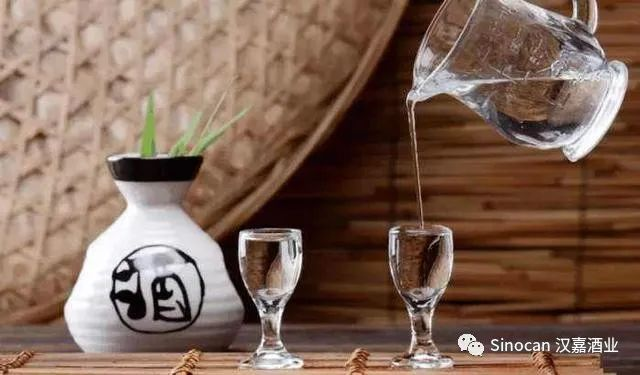

# 无标题

**链接地址:** http://mp.weixin.qq.com/s?__biz=MzIyMzU4OTc0MQ==&mid=2247484858&idx=2&sn=d816dc120eff37dd544eb64f6c3b0340&chksm=e81aa1b8df6d28ae6564f10bb6b92db59b782d8675308cd67f8a2f9c1d51fca8208efebfcdbd&mpshare=1&scene=2&srcid=0117tBHTNPysGoKh9GqqcTm5&sharer_sharetime=1610846015769&sharer_shareid=be1c8edd6c93eec155a61c876e41d26a#rd
**作者:** 
**获取时间:** 2025/8/28 19:57:04
**图片数量:** 11

---

## 原始HTML内容

<section style="box-sizing: border-box;font-size: 16px;"><section style="margin: 10px 0%;box-sizing: border-box;" powered-by="xiumi.us"><section style="display: inline-block;width: 100%;vertical-align: top;background-color: rgb(166, 54, 49);padding: 3px;box-sizing: border-box;"><section style="box-sizing: border-box;" powered-by="xiumi.us"><section style="display: flex;flex-flow: row nowrap;box-sizing: border-box;"><section style="display: inline-block;vertical-align: top;width: auto;flex: 50 50 0%;align-self: stretch;height: auto;background-color: rgb(255, 247, 244);padding: 3px;box-sizing: border-box;"><section style="display: inline-block;width: 100%;vertical-align: middle;border-style: solid;border-width: 1px;border-radius: 0px;border-color: rgb(166, 54, 49);padding: 3px 10px 5px;align-self: center;box-sizing: border-box;" powered-by="xiumi.us"><section style="margin-top: 3px;margin-right: 0%;margin-left: 0%;box-sizing: border-box;" powered-by="xiumi.us"><section style="text-align: center;color: rgb(106, 106, 106);line-height: 1.2;font-size: 14px;box-sizing: border-box;">
<strong style="box-sizing: border-box;">点击蓝字</strong>
</section></section></section></section><section style="display: inline-block;vertical-align: middle;width: auto;padding-left: 3px;background-color: rgba(255, 255, 255, 0);flex: 50 50 0%;align-self: center;height: auto;box-sizing: border-box;"><section style="margin-top: 3px;margin-right: 0%;margin-left: 0%;box-sizing: border-box;" powered-by="xiumi.us"><section style="text-align: center;font-size: 14px;color: rgb(255, 255, 255);line-height: 1.2;box-sizing: border-box;">
<strong style="box-sizing: border-box;">关注我们</strong>
</section></section></section></section></section></section></section><section style="box-sizing: border-box;" powered-by="xiumi.us">
 
</section><section style="box-sizing: border-box;" powered-by="xiumi.us"><section style="display: flex;flex-flow: row nowrap;margin: 10px 0%;box-sizing: border-box;"><section style="display: inline-block;vertical-align: top;width: auto;background-color: rgb(0, 0, 0);padding: 3px;flex: 43 43 0%;align-self: flex-start;height: auto;border-width: 0px;box-sizing: border-box;"><section style="display: inline-block;width: 100%;vertical-align: top;border-width: 1px;border-radius: 0px;border-style: solid;border-color: rgb(255, 247, 244);padding: 5px;box-sizing: border-box;" powered-by="xiumi.us"><section style="text-align: center;font-size: 38px;color: rgb(255, 255, 255);line-height: 1.2;letter-spacing: 0px;font-family: Optima-Regular, PingFangTC-light;box-sizing: border-box;" powered-by="xiumi.us">
汉嘉

快报
</section></section></section><section style="display: inline-block;vertical-align: top;width: auto;flex: 100 100 0%;align-self: flex-start;height: auto;padding-left: 10px;box-sizing: border-box;"><section style="color: rgb(0, 0, 0);font-size: 51px;line-height: 1.2;letter-spacing: 6px;font-family: Optima-Regular, PingFangTC-light;box-sizing: border-box;" powered-by="xiumi.us">
NEWS
</section><section style="margin-top: 0.5em;margin-bottom: 0.5em;box-sizing: border-box;" powered-by="xiumi.us"><section style="border-top: 4px solid rgb(0, 0, 0);box-sizing: border-box;"><section><svg viewBox="0 0 1 1" style="float:left;line-height:0;width:0;vertical-align:top;"></svg></section></section><section style="margin-top: 3px;border-top: 1px solid rgb(0, 0, 0);box-sizing: border-box;"><section><svg viewBox="0 0 1 1" style="float:left;line-height:0;width:0;vertical-align:top;"></svg></section></section></section><section style="color: rgb(0, 0, 0);letter-spacing: 2px;font-family: Optima-Regular, PingFangTC-light;box-sizing: border-box;" powered-by="xiumi.us">
2021年01月16日
</section></section></section></section><section style="margin-right: 0%;margin-left: 0%;box-sizing: border-box;" powered-by="xiumi.us"><section style="color: rgb(77, 182, 172);font-size: 14px;line-height: 1.8;letter-spacing: 1.8px;padding-right: 15px;padding-left: 15px;box-sizing: border-box;">
 
</section></section><section style="box-sizing: border-box;" powered-by="xiumi.us">
 
</section><section style="box-sizing: border-box;" powered-by="xiumi.us">
 
</section><section style="margin: 10px 0%;box-sizing: border-box;" powered-by="xiumi.us"><section style="display: inline-block;vertical-align: top;width: auto;border-top: 1px solid rgb(0, 0, 0);border-top-left-radius: 0px;padding-left: 10px;min-width: 10%;max-width: 100%;height: auto;box-sizing: border-box;"><section style="text-align: left;margin-right: 0%;margin-left: 0%;justify-content: flex-start;box-sizing: border-box;" powered-by="xiumi.us"><section style="display: inline-block;min-width: 10%;max-width: 100%;vertical-align: top;transform: matrix(1, 0, -0.2, 1, 0, 0);-webkit-transform: matrix(1, 0, -0.2, 1, 0, 0);-moz-transform: matrix(1, 0, -0.2, 1, 0, 0);-o-transform: matrix(1, 0, -0.2, 1, 0, 0);border-style: none none none solid;border-width: 1px 5px 1px 0px;border-radius: 0px;border-color: rgba(255, 255, 255, 0) rgba(255, 255, 255, 0) rgb(92, 107, 192) rgb(223, 46, 0);padding: 5px 10px;background-color: rgb(0, 0, 0);box-shadow: rgba(255, 255, 255, 0) 0px 0px 0px;line-height: 1;letter-spacing: 0px;width: auto;height: auto;box-sizing: border-box;"><section style="text-align: justify;color: rgb(255, 255, 255);box-sizing: border-box;" powered-by="xiumi.us">
<strong style="box-sizing: border-box;">01</strong>
</section></section></section></section><section style="display: inline-block;vertical-align: top;width: auto;min-width: 10%;max-width: 100%;height: auto;border-top: 1px solid rgb(0, 0, 0);border-top-left-radius: 0px;padding-right: 20px;padding-left: 10px;box-shadow: rgb(0, 0, 0) 0px 0px 0px;box-sizing: border-box;"><section style="color: rgb(166, 54, 49);box-sizing: border-box;" powered-by="xiumi.us">
<strong style="box-sizing: border-box;">觉醒的知识产权保护意识</strong>
</section></section></section><section style="margin-right: 0%;margin-left: 0%;box-sizing: border-box;" powered-by="xiumi.us"><section style="color: rgb(77, 182, 172);font-size: 14px;line-height: 1.8;letter-spacing: 1.8px;padding-right: 15px;padding-left: 15px;box-sizing: border-box;">
 

这些日子互联网上的中韩网友们，正在为一件事情争得不可开交——播主红人李子柒在社交平台新发布了一段视频，讲述萝卜从长大到被做成泡菜的“一生”。

 

本来只是普通的分享，没想到却遭到不少韩国网友的联名抵制：“泡菜是韩国的！”。

 
</section></section><section style="margin: 10px 0%;box-sizing: border-box;" powered-by="xiumi.us"><section style="display: inline-block;width: 100%;vertical-align: top;background-position: 0% 0%;background-repeat: repeat;background-size: 16.7028%;background-attachment: scroll;padding: 18px 22px;background-image: url(&quot;https://mmbiz.qpic.cn/mmbiz_png/7CNdqYbqvBLibicAWaPzWy7vTmnb1KZhEeN8lmeSibqIOica8vpCLRasZiaibFIpIYd1HEEXlHrrP8uicTjiajfezpgiceQ/640?wx_fmt=png&quot;);box-sizing: border-box;"><section style="display: inline-block;width: 100%;vertical-align: top;border-style: solid;border-width: 1px;border-radius: 0px;border-color: rgb(166, 54, 49);padding: 10px;box-sizing: border-box;" powered-by="xiumi.us"><section style="text-align: center;margin-right: 0%;margin-left: 0%;box-sizing: border-box;" powered-by="xiumi.us"><section style="max-width: 100%;vertical-align: middle;display: inline-block;line-height: 0;box-sizing: border-box;"></section></section></section></section></section><section style="margin-right: 0%;margin-left: 0%;box-sizing: border-box;" powered-by="xiumi.us"><section style="color: rgb(77, 182, 172);font-size: 14px;line-height: 1.8;letter-spacing: 1.8px;padding-right: 15px;padding-left: 15px;box-sizing: border-box;">
 
</section></section><section style="margin-right: 0%;margin-left: 0%;box-sizing: border-box;" powered-by="xiumi.us"><section style="color: rgb(77, 182, 172);font-size: 14px;line-height: 1.8;letter-spacing: 1.8px;padding-right: 15px;padding-left: 15px;box-sizing: border-box;">
泡菜起源于中国这件事本应是毫无争议的事，但中国对于本国文化遗产及其知识产权的保护意识<strong style="box-sizing: border-box;">尚在起步阶段</strong>。

 

这也导致一些辉煌灿烂流传千古的文化瑰宝，却是在<strong style="box-sizing: border-box;">近些年才逐渐确定了国际通用的名号，在国际上得到广泛的认可。</strong>

 

 

 
</section></section><section style="margin: 10px 0%;box-sizing: border-box;" powered-by="xiumi.us"><section style="display: inline-block;vertical-align: top;width: auto;border-top: 1px solid rgb(0, 0, 0);border-top-left-radius: 0px;padding-left: 10px;min-width: 10%;max-width: 100%;height: auto;box-sizing: border-box;"><section style="text-align: left;margin-right: 0%;margin-left: 0%;justify-content: flex-start;box-sizing: border-box;" powered-by="xiumi.us"><section style="display: inline-block;min-width: 10%;max-width: 100%;vertical-align: top;transform: matrix(1, 0, -0.2, 1, 0, 0);-webkit-transform: matrix(1, 0, -0.2, 1, 0, 0);-moz-transform: matrix(1, 0, -0.2, 1, 0, 0);-o-transform: matrix(1, 0, -0.2, 1, 0, 0);border-style: none none none solid;border-width: 1px 5px 1px 0px;border-radius: 0px;border-color: rgba(255, 255, 255, 0) rgba(255, 255, 255, 0) rgb(92, 107, 192) rgb(223, 46, 0);padding: 5px 10px;background-color: rgb(0, 0, 0);box-shadow: rgba(255, 255, 255, 0) 0px 0px 0px;line-height: 1;letter-spacing: 0px;width: auto;height: auto;box-sizing: border-box;"><section style="text-align: justify;color: rgb(255, 255, 255);box-sizing: border-box;" powered-by="xiumi.us">
<strong style="box-sizing: border-box;">02</strong>
</section></section></section></section><section style="display: inline-block;vertical-align: top;width: auto;min-width: 10%;max-width: 100%;height: auto;border-top: 1px solid rgb(0, 0, 0);border-top-left-radius: 0px;padding-right: 20px;padding-left: 10px;box-shadow: rgb(0, 0, 0) 0px 0px 0px;box-sizing: border-box;"><section style="color: rgb(166, 54, 49);box-sizing: border-box;" powered-by="xiumi.us">
<strong style="box-sizing: border-box;">坎坷的命名之旅</strong>
</section></section></section><section style="margin-right: 0%;margin-left: 0%;box-sizing: border-box;" powered-by="xiumi.us"><section style="color: rgb(77, 182, 172);font-size: 14px;line-height: 1.8;letter-spacing: 1.8px;padding-right: 15px;padding-left: 15px;box-sizing: border-box;">
 
</section></section><section style="margin: 10px 0%;box-sizing: border-box;" powered-by="xiumi.us"><section style="display: inline-block;width: 100%;vertical-align: top;background-position: 0% 0%;background-repeat: repeat;background-size: 16.7028%;background-attachment: scroll;padding: 18px 22px;background-image: url(&quot;https://mmbiz.qpic.cn/mmbiz_png/7CNdqYbqvBLibicAWaPzWy7vTmnb1KZhEeN8lmeSibqIOica8vpCLRasZiaibFIpIYd1HEEXlHrrP8uicTjiajfezpgiceQ/640?wx_fmt=png&quot;);box-sizing: border-box;"><section style="display: inline-block;width: 100%;vertical-align: top;border-style: solid;border-width: 1px;border-radius: 0px;border-color: rgb(166, 54, 49);padding: 10px;box-sizing: border-box;" powered-by="xiumi.us"><section style="text-align: center;margin-right: 0%;margin-left: 0%;box-sizing: border-box;" powered-by="xiumi.us"><section style="max-width: 100%;vertical-align: middle;display: inline-block;line-height: 0;box-sizing: border-box;"></section></section></section></section></section><section style="margin-right: 0%;margin-left: 0%;box-sizing: border-box;" powered-by="xiumi.us"><section style="color: rgb(77, 182, 172);font-size: 14px;line-height: 1.8;letter-spacing: 1.8px;padding-right: 15px;padding-left: 15px;box-sizing: border-box;">
 

好在近日传来一个好消息：白酒对应的英文正式被命名为<strong style="box-sizing: border-box;">“Chinese Baijiu”</strong>。

 

这种<strong style="box-sizing: border-box;">充满中华文化韵味的译名</strong>，象征着我国白酒文化输出的又一重要里程碑，着实让我们华夏儿女扬眉吐气了一把。

 

<strong style="box-sizing: border-box;">但白酒被命名为“Chinese Baijiu”的路程却不是一帆风顺。</strong>
</section></section><section style="margin: 10px 0%;box-sizing: border-box;" powered-by="xiumi.us"><section style="display: inline-block;width: 100%;vertical-align: top;background-position: 0% 0%;background-repeat: repeat;background-size: 16.7028%;background-attachment: scroll;padding: 18px 22px;background-image: url(&quot;https://mmbiz.qpic.cn/mmbiz_png/7CNdqYbqvBLibicAWaPzWy7vTmnb1KZhEeN8lmeSibqIOica8vpCLRasZiaibFIpIYd1HEEXlHrrP8uicTjiajfezpgiceQ/640?wx_fmt=png&quot;);box-sizing: border-box;"><section style="display: inline-block;width: 100%;vertical-align: top;border-style: solid;border-width: 1px;border-radius: 0px;border-color: rgb(166, 54, 49);padding: 10px;box-sizing: border-box;" powered-by="xiumi.us"><section style="text-align: center;margin-right: 0%;margin-left: 0%;box-sizing: border-box;" powered-by="xiumi.us"><section style="max-width: 100%;vertical-align: middle;display: inline-block;line-height: 0;box-sizing: border-box;"></section></section></section></section></section><section style="margin-right: 0%;margin-left: 0%;box-sizing: border-box;" powered-by="xiumi.us"><section style="color: rgb(77, 182, 172);font-size: 14px;line-height: 1.8;letter-spacing: 1.8px;padding-right: 15px;padding-left: 15px;box-sizing: border-box;">
 

多年来，中国白酒因缺乏一个官方的英文名称，而很容易造成<strong style="box-sizing: border-box;">海外消费者的困扰</strong>。

 

Chinese spirits（中国烈酒），Chinese distilled spirits（中国蒸馏酒）， Chinese liquor（中国利口酒）等，都曾被称为“中国白酒”。

 
</section></section><section style="text-align: center;margin-top: 10px;margin-bottom: 10px;box-sizing: border-box;" powered-by="xiumi.us"><section style="max-width: 100%;vertical-align: middle;display: inline-block;line-height: 0;box-sizing: border-box;"></section></section><section style="margin-right: 0%;margin-left: 0%;box-sizing: border-box;" powered-by="xiumi.us"><section style="color: rgb(77, 182, 172);font-size: 14px;line-height: 1.8;letter-spacing: 1.8px;padding-right: 15px;padding-left: 15px;box-sizing: border-box;">
 

然而，随着海关总署税收征管局（京津）多次沟通，中国酒业协会于2020年4月25日正式向海关总署提出申请，建议将海关商品名录中中国白酒的英文名字由原来的“Chinese distilled spirits”，正式更改为“Chinese Baijiu”。&nbsp;

 

海关总署在充分听取协会的意见之后，终于同意在2021年的《中华人民共和国进出口税则》中进行修改。

 
</section></section><section style="text-align: center;margin-top: 10px;margin-bottom: 10px;box-sizing: border-box;" powered-by="xiumi.us"><section style="max-width: 100%;vertical-align: middle;display: inline-block;line-height: 0;box-sizing: border-box;"></section></section><section style="margin-right: 0%;margin-left: 0%;box-sizing: border-box;" powered-by="xiumi.us"><section style="color: rgb(77, 182, 172);font-size: 14px;line-height: 1.8;letter-spacing: 1.8px;padding-right: 15px;padding-left: 15px;box-sizing: border-box;">
 

新的税则<strong style="box-sizing: border-box;">从2021年1月1日起正式执行</strong>。根据税则第22章的税号为2208.9020，白酒中文列目名称的对应英文从此之后一律修订为“Chinese Baijiu”。&nbsp;

 

 
</section></section><section style="margin: 10px 0%;box-sizing: border-box;" powered-by="xiumi.us"><section style="display: inline-block;vertical-align: top;width: auto;border-top: 1px solid rgb(0, 0, 0);border-top-left-radius: 0px;padding-left: 10px;min-width: 10%;max-width: 100%;height: auto;box-sizing: border-box;"><section style="text-align: left;margin-right: 0%;margin-left: 0%;justify-content: flex-start;box-sizing: border-box;" powered-by="xiumi.us"><section style="display: inline-block;min-width: 10%;max-width: 100%;vertical-align: top;transform: matrix(1, 0, -0.2, 1, 0, 0);-webkit-transform: matrix(1, 0, -0.2, 1, 0, 0);-moz-transform: matrix(1, 0, -0.2, 1, 0, 0);-o-transform: matrix(1, 0, -0.2, 1, 0, 0);border-style: none none none solid;border-width: 1px 5px 1px 0px;border-radius: 0px;border-color: rgba(255, 255, 255, 0) rgba(255, 255, 255, 0) rgb(92, 107, 192) rgb(223, 46, 0);padding: 5px 10px;background-color: rgb(0, 0, 0);box-shadow: rgba(255, 255, 255, 0) 0px 0px 0px;line-height: 1;letter-spacing: 0px;width: auto;height: auto;box-sizing: border-box;"><section style="text-align: justify;color: rgb(255, 255, 255);box-sizing: border-box;" powered-by="xiumi.us">
<strong style="box-sizing: border-box;">03</strong>
</section></section></section></section><section style="display: inline-block;vertical-align: top;width: auto;min-width: 10%;max-width: 100%;height: auto;border-top: 1px solid rgb(0, 0, 0);border-top-left-radius: 0px;padding-right: 20px;padding-left: 10px;box-shadow: rgb(0, 0, 0) 0px 0px 0px;box-sizing: border-box;"><section style="color: rgb(166, 54, 49);box-sizing: border-box;" powered-by="xiumi.us">
<strong style="box-sizing: border-box;">中华民族应有的文化自信</strong>
</section></section></section><section style="margin-right: 0%;margin-left: 0%;box-sizing: border-box;" powered-by="xiumi.us"><section style="color: rgb(77, 182, 172);font-size: 14px;line-height: 1.8;letter-spacing: 1.8px;padding-right: 15px;padding-left: 15px;box-sizing: border-box;">
 

这个名称，或许对于非中文母语国家和地区的人们来说并非那么浅显易懂，但却是中国弘扬本国传统文化所必经的道路，是中<strong style="box-sizing: border-box;">华民族本该具有的那一份文化自信</strong>！

 
</section></section><section style="margin: 10px 0%;box-sizing: border-box;" powered-by="xiumi.us"><section style="display: inline-block;width: 100%;vertical-align: top;background-position: 0% 0%;background-repeat: repeat;background-size: 16.7028%;background-attachment: scroll;padding: 18px 22px;background-image: url(&quot;https://mmbiz.qpic.cn/mmbiz_png/7CNdqYbqvBLibicAWaPzWy7vTmnb1KZhEeN8lmeSibqIOica8vpCLRasZiaibFIpIYd1HEEXlHrrP8uicTjiajfezpgiceQ/640?wx_fmt=png&quot;);box-sizing: border-box;"><section style="display: inline-block;width: 100%;vertical-align: top;border-style: solid;border-width: 1px;border-radius: 0px;border-color: rgb(166, 54, 49);padding: 10px;box-sizing: border-box;" powered-by="xiumi.us"><section style="text-align: center;margin-right: 0%;margin-left: 0%;box-sizing: border-box;" powered-by="xiumi.us"><section style="max-width: 100%;vertical-align: middle;display: inline-block;line-height: 0;box-sizing: border-box;"></section></section></section></section></section><section style="margin-right: 0%;margin-left: 0%;box-sizing: border-box;" powered-by="xiumi.us"><section style="color: rgb(77, 182, 172);font-size: 14px;line-height: 1.8;letter-spacing: 1.8px;padding-right: 15px;padding-left: 15px;box-sizing: border-box;">
 

中国白酒与白兰地（Brandy）、威士忌（Whisky）、伏特加（Vodka）、朗姆酒（Rum） 和金酒（Gin）一起<strong style="box-sizing: border-box;">并称为世界六大蒸馏酒</strong>，其<strong style="box-sizing: border-box;">消费量约占世界蒸馏酒总量的1/3</strong>！

 

这样重量级蒸馏酒品类，难道不值得一个<strong style="box-sizing: border-box;">独具特色的专有名词</strong>去形容吗？

 
</section></section><section style="margin: 10px 0%;box-sizing: border-box;" powered-by="xiumi.us"><section style="display: inline-block;width: 100%;vertical-align: top;background-position: 0% 0%;background-repeat: repeat;background-size: 16.7028%;background-attachment: scroll;padding: 18px 22px;background-image: url(&quot;https://mmbiz.qpic.cn/mmbiz_png/7CNdqYbqvBLibicAWaPzWy7vTmnb1KZhEeN8lmeSibqIOica8vpCLRasZiaibFIpIYd1HEEXlHrrP8uicTjiajfezpgiceQ/640?wx_fmt=png&quot;);box-sizing: border-box;"><section style="display: inline-block;width: 100%;vertical-align: top;border-style: solid;border-width: 1px;border-radius: 0px;border-color: rgb(166, 54, 49);padding: 10px;box-sizing: border-box;" powered-by="xiumi.us"><section style="text-align: center;margin-right: 0%;margin-left: 0%;box-sizing: border-box;" powered-by="xiumi.us"><section style="max-width: 100%;vertical-align: middle;display: inline-block;line-height: 0;box-sizing: border-box;"></section></section></section></section></section><section style="margin-right: 0%;margin-left: 0%;box-sizing: border-box;" powered-by="xiumi.us"><section style="color: rgb(77, 182, 172);font-size: 14px;line-height: 1.8;letter-spacing: 1.8px;padding-right: 15px;padding-left: 15px;box-sizing: border-box;">
 

更重要的是，<strong style="box-sizing: border-box;">中国白酒因其特殊的国家限定前缀，而别具意义</strong>：它起源于中国，在中国发展壮大，并从中国走向了全世界。

 

 
</section></section><section style="margin: 10px 0%;box-sizing: border-box;" powered-by="xiumi.us"><section style="display: inline-block;vertical-align: top;width: auto;border-top: 1px solid rgb(0, 0, 0);border-top-left-radius: 0px;padding-left: 10px;min-width: 10%;max-width: 100%;height: auto;box-sizing: border-box;"><section style="text-align: left;margin-right: 0%;margin-left: 0%;justify-content: flex-start;box-sizing: border-box;" powered-by="xiumi.us"><section style="display: inline-block;min-width: 10%;max-width: 100%;vertical-align: top;transform: matrix(1, 0, -0.2, 1, 0, 0);-webkit-transform: matrix(1, 0, -0.2, 1, 0, 0);-moz-transform: matrix(1, 0, -0.2, 1, 0, 0);-o-transform: matrix(1, 0, -0.2, 1, 0, 0);border-style: none none none solid;border-width: 1px 5px 1px 0px;border-radius: 0px;border-color: rgba(255, 255, 255, 0) rgba(255, 255, 255, 0) rgb(92, 107, 192) rgb(223, 46, 0);padding: 5px 10px;background-color: rgb(0, 0, 0);box-shadow: rgba(255, 255, 255, 0) 0px 0px 0px;line-height: 1;letter-spacing: 0px;width: auto;height: auto;box-sizing: border-box;"><section style="text-align: justify;color: rgb(255, 255, 255);box-sizing: border-box;" powered-by="xiumi.us">
<strong style="box-sizing: border-box;">04</strong>
</section></section></section></section><section style="display: inline-block;vertical-align: top;width: auto;min-width: 10%;max-width: 100%;height: auto;border-top: 1px solid rgb(0, 0, 0);border-top-left-radius: 0px;padding-right: 20px;padding-left: 10px;box-shadow: rgb(0, 0, 0) 0px 0px 0px;box-sizing: border-box;"><section style="color: rgb(166, 54, 49);box-sizing: border-box;" powered-by="xiumi.us">
<strong style="box-sizing: border-box;">“Baijiu”的名号在世界打响</strong>
</section></section></section><section style="margin-right: 0%;margin-left: 0%;box-sizing: border-box;" powered-by="xiumi.us"><section style="color: rgb(77, 182, 172);font-size: 14px;line-height: 1.8;letter-spacing: 1.8px;padding-right: 15px;padding-left: 15px;box-sizing: border-box;">
 

中国酒业协会称，自2017年成立<strong style="box-sizing: border-box;">中国酒业协会白酒文化国际化推广委员会</strong>以来，协会开始把“Chinese Baijiu”作为官方的英文名称，并在所有场合使用。

 
</section></section><section style="margin: 20px 0%;box-sizing: border-box;" powered-by="xiumi.us"><section style="display: inline-block;vertical-align: top;width: 50%;padding-right: 5px;box-sizing: border-box;"><section style="margin-right: 0%;margin-left: 0%;box-sizing: border-box;" powered-by="xiumi.us"><section style="display: inline-block;width: 100%;vertical-align: top;border-left: 1px dashed rgba(255, 213, 195, 0);border-bottom-left-radius: 0px;border-right: 1px none rgb(0, 0, 0);border-top-right-radius: 0px;padding-top: 5px;padding-bottom: 5px;padding-left: 10px;box-sizing: border-box;"><section style="margin: -20px 0%;box-sizing: border-box;" powered-by="xiumi.us"><section style="display: inline-block;width: 100%;vertical-align: top;border-top: 1px dashed rgba(255, 213, 195, 0);border-top-left-radius: 0px;padding-top: 10px;padding-bottom: 10px;border-bottom: 1px dashed rgba(255, 213, 195, 0);border-bottom-right-radius: 0px;box-sizing: border-box;"><section style="text-align: center;margin-right: 0%;margin-left: 0%;box-sizing: border-box;" powered-by="xiumi.us"><section style="max-width: 100%;vertical-align: middle;display: inline-block;line-height: 0;border-width: 0px;box-sizing: border-box;"></section></section></section></section></section></section></section><section style="display: inline-block;vertical-align: top;width: 50%;padding-left: 5px;box-sizing: border-box;"><section style="margin-right: 0%;margin-left: 0%;box-sizing: border-box;" powered-by="xiumi.us"><section style="display: inline-block;width: 100%;vertical-align: top;border-left: 1px none rgb(0, 0, 0);border-bottom-left-radius: 0px;border-right: 1px dashed rgba(255, 213, 195, 0);border-top-right-radius: 0px;padding-top: 5px;padding-right: 10px;padding-bottom: 5px;box-sizing: border-box;"><section style="margin: -20px 0%;box-sizing: border-box;" powered-by="xiumi.us"><section style="display: inline-block;width: 100%;vertical-align: top;border-top: 1px dashed rgba(255, 213, 195, 0);border-top-left-radius: 0px;padding-top: 10px;padding-bottom: 10px;border-bottom: 1px dashed rgba(255, 213, 195, 0);border-bottom-right-radius: 0px;box-sizing: border-box;"><section style="text-align: center;margin-right: 0%;margin-left: 0%;box-sizing: border-box;" powered-by="xiumi.us"><section style="max-width: 100%;vertical-align: middle;display: inline-block;line-height: 0;border-width: 0px;box-sizing: border-box;"></section></section></section></section></section></section></section></section><section style="padding-right: 15px;padding-left: 15px;box-sizing: border-box;" powered-by="xiumi.us">
左：GB/T 15109-2008白酒工业术语 Terminology of Chinese spirits industry；右：于2019年开始修订的GB/T 15109—201X 白酒工业术语Terminology of<strong style="box-sizing: border-box;"> Baijiu </strong>industry征求意见稿

 
</section><section style="margin-right: 0%;margin-left: 0%;box-sizing: border-box;" powered-by="xiumi.us"><section style="color: rgb(77, 182, 172);font-size: 14px;line-height: 1.8;letter-spacing: 1.8px;padding-right: 15px;padding-left: 15px;box-sizing: border-box;">
 

2019年开始，中国白酒的系列国家标准开始对《白酒工业术语》（《Terminology of baijiu industry》）进行修订，并对白酒的英文名称进行了修订：白酒，英文名字：Baijiu。

 

同时在国际期刊、会议和文献上，经学术界的努力和宣传，白酒（Chinese Baijiu）也逐步在被国内外行业专家及消费者所认知。

 
</section></section><section style="text-align: center;margin-top: 10px;margin-bottom: 10px;box-sizing: border-box;" powered-by="xiumi.us"><section style="max-width: 100%;vertical-align: middle;display: inline-block;line-height: 0;box-sizing: border-box;"></section></section><section style="margin-right: 0%;margin-left: 0%;box-sizing: border-box;" powered-by="xiumi.us"><section style="color: rgb(77, 182, 172);font-size: 14px;line-height: 1.8;letter-spacing: 1.8px;padding-right: 15px;padding-left: 15px;box-sizing: border-box;">
 

此外，近年来协会组织白酒企业参加的各种食品饮料展会上也都统一使用“Chinese Baijiu”，相信随着时间的推移，“Chinese Baijiu”的知名度将越来越高，响彻全世界！

 

 

<strong style="box-sizing: border-box;">文章综合编辑自：21世纪经济报道，北京高沃知识产权，北晚新视觉</strong>
</section></section><section style="margin-right: 0%;margin-left: 0%;box-sizing: border-box;" powered-by="xiumi.us"><section style="color: rgb(77, 182, 172);font-size: 14px;line-height: 1.8;letter-spacing: 1.8px;padding-right: 15px;padding-left: 15px;box-sizing: border-box;">
 
</section></section><section style="margin: 10px 0%;box-sizing: border-box;" powered-by="xiumi.us"><section style="display: inline-block;width: 100%;vertical-align: top;background-color: rgba(255, 213, 195, 0.26);border-width: 1px 4px;border-radius: 0px;border-style: solid none;border-color: rgba(255, 213, 195, 0.26) rgb(205, 240, 255);box-sizing: border-box;"><section style="box-sizing: border-box;" powered-by="xiumi.us"><section style="display: inline-block;vertical-align: middle;width: 33%;align-self: center;height: auto;box-shadow: rgba(255, 213, 195, 0.26) 0px 0px 0px;box-sizing: border-box;"><section style="text-align: right;margin: -4px 0%;justify-content: flex-end;box-sizing: border-box;" powered-by="xiumi.us"><section style="max-width: 100%;vertical-align: middle;display: inline-block;line-height: 0;width: 90%;height: auto;box-shadow: rgb(166, 54, 49) 0px 0px 0px;border-style: solid none;border-width: 6px 4px;border-radius: 0px;border-color: rgb(166, 54, 49) rgb(255, 211, 44);box-sizing: border-box;"></section></section></section><section style="display: inline-block;vertical-align: middle;width: 66%;height: auto;align-self: center;box-sizing: border-box;"><section style="margin-right: 0%;margin-left: 0%;box-sizing: border-box;" powered-by="xiumi.us"><section style="text-align: center;font-size: 14px;color: rgb(124, 119, 219);letter-spacing: 0px;line-height: 1.6;padding-right: 20px;padding-left: 20px;box-sizing: border-box;">
<strong style="box-sizing: border-box;">汉嘉酒业</strong>

<strong style="box-sizing: border-box;">扫描二维码</strong><strong style="letter-spacing: 0px;box-sizing: border-box;">关注我们</strong>

http://www.sinocansupply.com/

Email: info@sinocansupply.com
</section></section></section></section></section></section></section>

---

## 纯文本内容

点击蓝字关注我们汉嘉快报NEWS2021年01月16日01觉醒的知识产权保护意识这些日子互联网上的中韩网友们，正在为一件事情争得不可开交——播主红人李子柒在社交平台新发布了一段视频，讲述萝卜从长大到被做成泡菜的“一生”。本来只是普通的分享，没想到却遭到不少韩国网友的联名抵制：“泡菜是韩国的！”。泡菜起源于中国这件事本应是毫无争议的事，但中国对于本国文化遗产及其知识产权的保护意识尚在起步阶段。这也导致一些辉煌灿烂流传千古的文化瑰宝，却是在近些年才逐渐确定了国际通用的名号，在国际上得到广泛的认可。02坎坷的命名之旅好在近日传来一个好消息：白酒对应的英文正式被命名为“Chinese Baijiu”。这种充满中华文化韵味的译名，象征着我国白酒文化输出的又一重要里程碑，着实让我们华夏儿女扬眉吐气了一把。但白酒被命名为“Chinese Baijiu”的路程却不是一帆风顺。多年来，中国白酒因缺乏一个官方的英文名称，而很容易造成海外消费者的困扰。Chinese spirits（中国烈酒），Chinese distilled spirits（中国蒸馏酒）， Chinese liquor（中国利口酒）等，都曾被称为“中国白酒”。然而，随着海关总署税收征管局（京津）多次沟通，中国酒业协会于2020年4月25日正式向海关总署提出申请，建议将海关商品名录中中国白酒的英文名字由原来的“Chinese distilled spirits”，正式更改为“Chinese Baijiu”。 海关总署在充分听取协会的意见之后，终于同意在2021年的《中华人民共和国进出口税则》中进行修改。新的税则从2021年1月1日起正式执行。根据税则第22章的税号为2208.9020，白酒中文列目名称的对应英文从此之后一律修订为“Chinese Baijiu”。 03中华民族应有的文化自信这个名称，或许对于非中文母语国家和地区的人们来说并非那么浅显易懂，但却是中国弘扬本国传统文化所必经的道路，是中华民族本该具有的那一份文化自信！中国白酒与白兰地（Brandy）、威士忌（Whisky）、伏特加（Vodka）、朗姆酒（Rum） 和金酒（Gin）一起并称为世界六大蒸馏酒，其消费量约占世界蒸馏酒总量的1/3！这样重量级蒸馏酒品类，难道不值得一个独具特色的专有名词去形容吗？更重要的是，中国白酒因其特殊的国家限定前缀，而别具意义：它起源于中国，在中国发展壮大，并从中国走向了全世界。04“Baijiu”的名号在世界打响中国酒业协会称，自2017年成立中国酒业协会白酒文化国际化推广委员会以来，协会开始把“Chinese Baijiu”作为官方的英文名称，并在所有场合使用。左：GB/T 15109-2008白酒工业术语 Terminology of Chinese spirits industry；右：于2019年开始修订的GB/T 15109—201X 白酒工业术语Terminology of Baijiu industry征求意见稿2019年开始，中国白酒的系列国家标准开始对《白酒工业术语》（《Terminology of baijiu industry》）进行修订，并对白酒的英文名称进行了修订：白酒，英文名字：Baijiu。同时在国际期刊、会议和文献上，经学术界的努力和宣传，白酒（Chinese Baijiu）也逐步在被国内外行业专家及消费者所认知。此外，近年来协会组织白酒企业参加的各种食品饮料展会上也都统一使用“Chinese Baijiu”，相信随着时间的推移，“Chinese Baijiu”的知名度将越来越高，响彻全世界！文章综合编辑自：21世纪经济报道，北京高沃知识产权，北晚新视觉汉嘉酒业扫描二维码关注我们http://www.sinocansupply.com/Email: info@sinocansupply.com

---

## 图片列表

-  (原始链接: https://mmbiz.qpic.cn/mmbiz_png/7CNdqYbqvBLibicAWaPzWy7vTmnb1KZhEeo9zVvic6HK5esj9FLxhmgyGKx3nCt2nsosmibgSbmZFCXAe4URGsxLEw/640?wx_fmt=png)
-  (原始链接: https://mmbiz.qpic.cn/mmbiz_jpg/7CNdqYbqvBLibicAWaPzWy7vTmnb1KZhEeDDuiaHMJldgsrOuACEB0iaCALrb1yFD6VwbQH8LuQpBPtRsgWOicC6iaRg/640?wx_fmt=jpeg)
-  (原始链接: https://mmbiz.qpic.cn/mmbiz_jpg/7CNdqYbqvBLibicAWaPzWy7vTmnb1KZhEex6c3IfD9UDGyeUibvmpQWc7Hn1OcBjLVQ2pYCImqlzB9PCdSB53XHFA/640?wx_fmt=jpeg)
-  (原始链接: https://mmbiz.qpic.cn/mmbiz_png/7CNdqYbqvBLibicAWaPzWy7vTmnb1KZhEeve8nBCYQw7EwwFEEtxib7uib1N5m3mLC58x2iajcwN5lWg5nWiapyY9Hjg/640?wx_fmt=png)
-  (原始链接: https://mmbiz.qpic.cn/mmbiz_png/7CNdqYbqvBLibicAWaPzWy7vTmnb1KZhEemFXqdOzDV9SEsFfibdsL4iaty1VqlHSnF6XiaO0SlDBianfFVnXTNnLVDQ/640?wx_fmt=png)
-  (原始链接: https://mmbiz.qpic.cn/mmbiz_jpg/7CNdqYbqvBLibicAWaPzWy7vTmnb1KZhEejkicibicvDq5VUK8SLI9AK890KGY5sQgiavyEMWh0L96cvbZu6WATKCwfQ/640?wx_fmt=jpeg)
-  (原始链接: https://mmbiz.qpic.cn/mmbiz_jpg/7CNdqYbqvBLibicAWaPzWy7vTmnb1KZhEeo3Mx1VfgHwsn7xiajibkZszrp4TPwAOpS4XaicCqY6XQ8hLHyQ1BkVLhA/640?wx_fmt=jpeg)
-  (原始链接: https://mmbiz.qpic.cn/mmbiz_jpg/7CNdqYbqvBLibicAWaPzWy7vTmnb1KZhEearfHF8tMmVUls1cgHlv4ATUPJyLA00yAFD7e1d2JNgjib7g1CYeEXkw/640?wx_fmt=jpeg)
-  (原始链接: https://mmbiz.qpic.cn/mmbiz_jpg/7CNdqYbqvBLibicAWaPzWy7vTmnb1KZhEeZtxThJ6CB54BnviaNHgWWQgXhicVGbF63z4LKAhaFW2jvA2IJIv1gMvQ/640?wx_fmt=jpeg)
-  (原始链接: https://mmbiz.qpic.cn/mmbiz_jpg/7CNdqYbqvBLibicAWaPzWy7vTmnb1KZhEeibxfqdpPicDV0qYUb90brDeZsiaibDWgHpic6UfptUHKIlY47ibIqP4bBmGA/640?wx_fmt=jpeg)
-  (原始链接: https://mmbiz.qpic.cn/mmbiz_jpg/7CNdqYbqvBLibicAWaPzWy7vTmnb1KZhEeI9maicia8Vfw2k7093buKlqRRYRicuT2BYEhUQBXKm5EPt2nos5G7fxyA/640?wx_fmt=jpeg)
