# 无标题

**链接地址:** http://mp.weixin.qq.com/s?__biz=MzIxNTkyMDQwNg==&mid=2247509867&idx=3&sn=f2b2762d9269b914528efcdb3ff1b5e7&chksm=97921d12a0e59404ea791a234d5ffd0a0fe8b006b7178e83d58f022ba9cce5dd64e0a36bc269&mpshare=1&scene=2&srcid=0119OFiOCxLlC5xxBQbjzTmE&sharer_sharetime=1611023552350&sharer_shareid=be1c8edd6c93eec155a61c876e41d26a#rd
**作者:** 我是报姐
**获取时间:** 2025/8/28 19:56:48
**图片数量:** 30

---

## 原始HTML内容

<section style="font-size: 15px;line-height: 1.8;letter-spacing: 2px;padding-right: 10px;padding-left: 10px;box-sizing: border-box;"><section style="box-sizing: border-box;" powered-by="xiumi.us">
 

 
</section><section style="box-sizing: border-box;" powered-by="xiumi.us">
<strong style="box-sizing: border-box;">这个月，全美国的关注点，都放在了疫情上面。</strong>

 

4月1日的时候，美国确诊大约17万，<strong style="box-sizing: border-box;">而现在，美国确诊超过100万。</strong>

 

但是，就在这个月，纽约州悄悄地……<strong style="box-sizing: border-box;">通过了商业代孕合法。</strong>
</section><section style="box-sizing: border-box;" powered-by="xiumi.us">
 
</section><section style="text-align: center;margin-top: 10px;margin-bottom: 10px;box-sizing: border-box;" powered-by="xiumi.us"><section style="max-width: 100%;vertical-align: middle;display: inline-block;line-height: 0;box-sizing: border-box;"></section></section><section style="box-sizing: border-box;" powered-by="xiumi.us">
@romper

 
</section><section style="box-sizing: border-box;" powered-by="xiumi.us">
这是一个让大多数人大跌眼镜的法律。

 

因为美国大多数州对待商业代孕的态度都暧昧不清，不明确禁止也不会直接承认合法，<strong style="box-sizing: border-box;">而纽约州是曾经完全禁止商业代孕仅有的三个州之一。</strong>

 

而就在所有人都没有关注的时候，纽约州竟然直接通过了代孕条例，<strong style="box-sizing: border-box;">不是废除禁止，而是直接彻底宣布合法。</strong>
</section><section style="box-sizing: border-box;" powered-by="xiumi.us">
 
</section><section style="text-align: center;margin-top: 10px;margin-bottom: 10px;box-sizing: border-box;" powered-by="xiumi.us"><section style="max-width: 100%;vertical-align: middle;display: inline-block;line-height: 0;box-sizing: border-box;"></section></section><section style="box-sizing: border-box;" powered-by="xiumi.us">
@gothamgazette

 
</section><section style="box-sizing: border-box;" powered-by="xiumi.us">
美国州长科莫宣布——

 

<strong style="box-sizing: border-box;">“为了照顾不孕人士或同性伴侣，纽约州将在今年取消代孕禁令，并立法进行规范，让代孕双方都能得到保障。”</strong>

 

这看起来是一个对所有人都很友好的方案，不孕人士或者同性伴侣能拥有孩子，而代孕妈妈也可以得到保障？

 

绝对不是！

 

<strong style="box-sizing: border-box;">这个决策，让很多人都震惊到说不出话……</strong>
</section><section style="box-sizing: border-box;" powered-by="xiumi.us">
 
</section><section style="text-align: center;margin-top: 10px;margin-bottom: 10px;box-sizing: border-box;" powered-by="xiumi.us"><section style="max-width: 100%;vertical-align: middle;display: inline-block;line-height: 0;box-sizing: border-box;"></section></section><section style="box-sizing: border-box;" powered-by="xiumi.us">
 
</section><section style="box-sizing: border-box;" powered-by="xiumi.us">
 
</section><section style="text-align: center;margin-top: 10px;margin-bottom: 10px;box-sizing: border-box;" powered-by="xiumi.us"><section style="max-width: 100%;vertical-align: middle;display: inline-block;line-height: 0;box-sizing: border-box;"></section></section><section style="box-sizing: border-box;" powered-by="xiumi.us">
 
</section><section style="box-sizing: border-box;" powered-by="xiumi.us">
 
</section><section style="box-sizing: border-box;" powered-by="xiumi.us">
作为全美国疫情最严重的州之一，纽约州为什么会在疫情期间，通过这项法令？

 

很多人都认为，疫情的到来，应该会让这些无关法令被推迟。

 

但恰恰相反，突如其来的全球瘟疫，推动了商业代孕的合法化：<strong style="box-sizing: border-box;">纽约是美国死亡率最高的州，纽约州估计将损失100亿美元的税收。</strong>

 

它需要刺激经济发展，<strong style="box-sizing: border-box;">而商业代孕，是一个充满利益的交易链。</strong>
</section><section style="box-sizing: border-box;" powered-by="xiumi.us">
 
</section><section style="text-align: center;margin-top: 10px;margin-bottom: 10px;box-sizing: border-box;" powered-by="xiumi.us"><section style="max-width: 100%;vertical-align: middle;display: inline-block;line-height: 0;box-sizing: border-box;"></section></section><section style="box-sizing: border-box;" powered-by="xiumi.us">
@theweek

 
</section><section style="box-sizing: border-box;" powered-by="xiumi.us">
根据纽约律师埃里克·鲁贝尔的说法，<strong style="box-sizing: border-box;">商业代孕合法化，可以振兴因为疫情而萎靡不振的经济。</strong>

 

他是一位支持商业代孕合法化的律师，也给出了相对应的论据。

 

在代孕合法的加州，代孕宝宝的诞生，最高可以让代孕妈妈挣到8万美元。

 

整条交易链，除了交易的费用，还有法律费用，和密集的医疗程序，<strong style="box-sizing: border-box;">一环扣一环，每一环的消费，都能够刺激到经济。</strong>
</section><section style="box-sizing: border-box;" powered-by="xiumi.us">
 
</section><section style="text-align: center;margin-top: 10px;margin-bottom: 10px;box-sizing: border-box;" powered-by="xiumi.us"><section style="max-width: 100%;vertical-align: middle;display: inline-block;line-height: 0;box-sizing: border-box;"></section></section><section style="box-sizing: border-box;" powered-by="xiumi.us">
@christianpost

 
</section><section style="box-sizing: border-box;" powered-by="xiumi.us">
<strong style="box-sizing: border-box;">因此，因为疫情萎靡的经济，成为了同意这条法律的理由之一……</strong>只需要牺牲"一点点"人的身体健康，就能皆大欢喜，让整个州都为之受益。

 

更何况，就算有人反对，现在也无法组织起来大规模的出门抗议。

 

简直是一举三得。

 

但，这显然不是疫情期间州长一拍脑袋就想出来的主意，而是一个已经拉锯战了很久，两边僵持不下的法令。
</section><section style="box-sizing: border-box;" powered-by="xiumi.us">
 
</section><section style="text-align: center;margin-top: 10px;margin-bottom: 10px;box-sizing: border-box;" powered-by="xiumi.us"><section style="max-width: 100%;vertical-align: middle;display: inline-block;line-height: 0;box-sizing: border-box;"></section></section><section style="box-sizing: border-box;" powered-by="xiumi.us">
@thepostmillennial

 
</section><section style="box-sizing: border-box;" powered-by="xiumi.us">
在州长科莫上任的时候，他承诺会为了LGBT人群的利益而争取平权。

 

但十分讽刺的是，这条法令的正反两方代表人物，却恰恰都是LGBT人群。

 

<strong style="box-sizing: border-box;">推动合法化的领头人物，是男同性恋布拉德·霍伊曼。</strong>他分享了自己和伴侣代孕了两个女儿的温馨故事和照片，打感情牌希望能够推动合法化。

 

<strong style="box-sizing: border-box;">而反对合法化的领头人物，是立法机关中第一位公开出柜的Les，黛博拉·格里克……</strong>她没有故事可以分享，但呼吁——请不要把女性商品化。
</section><section style="box-sizing: border-box;" powered-by="xiumi.us">
 
</section><section style="text-align: center;margin-top: 10px;margin-bottom: 10px;box-sizing: border-box;" powered-by="xiumi.us"><section style="max-width: 100%;vertical-align: middle;display: inline-block;line-height: 0;box-sizing: border-box;"></section></section><section style="box-sizing: border-box;" powered-by="xiumi.us">
布拉德·霍伊曼去年6月带着女儿出来宣传

 
</section><section style="box-sizing: border-box;" powered-by="xiumi.us">
最后的结果，是令人失望的。

 

合法化推动者们宣称，逼迫LGBT人群<strong style="box-sizing: border-box;">“为了获得孩子不得不去其他州生育旅行”</strong>是荒谬的。

 

甚至，这样的结果，让很多曾经在其他有关女权方面见解完全不同的人，开始并肩作战，共同反对。

 
</section><section style="box-sizing: border-box;" powered-by="xiumi.us">
 
</section><section style="text-align: center;margin-top: 10px;margin-bottom: 10px;box-sizing: border-box;" powered-by="xiumi.us"><section style="max-width: 100%;vertical-align: middle;display: inline-block;line-height: 0;box-sizing: border-box;"></section></section><section style="box-sizing: border-box;" powered-by="xiumi.us">
 
</section><section style="box-sizing: border-box;" powered-by="xiumi.us">
 

新闻学者瑞秋露，坦言自己作为一个保守天主教徒，发现有朝一日居然会女权主义者们并肩作战，真的十分奇怪。

 

在不久之前，她们还因为妇女是否拥有堕胎权而掐得死去活来。

 

<strong style="box-sizing: border-box;">但在反对商业代孕合法化这个问题上，她们又站在了同一个战线上。</strong>
</section><section style="box-sizing: border-box;" powered-by="xiumi.us">
 
</section><section style="text-align: center;margin-top: 10px;margin-bottom: 10px;box-sizing: border-box;" powered-by="xiumi.us"><section style="max-width: 100%;vertical-align: middle;display: inline-block;line-height: 0;box-sizing: border-box;"></section></section><section style="box-sizing: border-box;" powered-by="xiumi.us">
@mashable india

 
</section><section style="box-sizing: border-box;" powered-by="xiumi.us">
瑞秋露的重点，放在了婴儿的权益上。

 

在代孕合法化中，婴儿被视作为商品——<strong style="box-sizing: border-box;">但他们应该是"人"。</strong>

 

很多代孕的宣传者们，把一切都描述得极为美好，但事实上，凡是生育，就必定会有种种意外出现。
</section><section style="box-sizing: border-box;" powered-by="xiumi.us">
 
</section><section style="text-align: center;margin-top: 10px;margin-bottom: 10px;box-sizing: border-box;" powered-by="xiumi.us"><section style="max-width: 100%;vertical-align: middle;display: inline-block;line-height: 0;box-sizing: border-box;"></section></section><section style="box-sizing: border-box;" powered-by="xiumi.us">
@NYdaily news

 
</section><section style="box-sizing: border-box;" powered-by="xiumi.us">
在代孕过程中，婴儿的性别是否要进行筛选？

 

如果婴儿出现了残疾，是否需要堕胎？甚至，如果孕检无法发现，在婴儿出生之后，才发现有畸形呢？

 

<strong style="box-sizing: border-box;">这些婴儿……在被"退货处理"之后，又会面对什么样的命运？</strong>
</section><section style="box-sizing: border-box;" powered-by="xiumi.us">
 
</section><section style="text-align: center;margin-top: 10px;margin-bottom: 10px;box-sizing: border-box;" powered-by="xiumi.us"><section style="max-width: 100%;vertical-align: middle;display: inline-block;line-height: 0;box-sizing: border-box;"></section></section><section style="box-sizing: border-box;" powered-by="xiumi.us">
@guardian

 
</section><section style="box-sizing: border-box;" powered-by="xiumi.us">
甚至还有，如果代孕合法化。

 

<strong style="box-sizing: border-box;">那么，很多人贩子，也将以代孕作为理由，贩卖婴儿。</strong>
</section><section style="box-sizing: border-box;" powered-by="xiumi.us">
 
</section><section style="text-align: center;margin-top: 10px;margin-bottom: 10px;box-sizing: border-box;" powered-by="xiumi.us"><section style="max-width: 100%;vertical-align: middle;display: inline-block;line-height: 0;box-sizing: border-box;"></section></section><section style="box-sizing: border-box;" powered-by="xiumi.us">
 
</section><section style="box-sizing: border-box;" powered-by="xiumi.us">
 
</section><section style="text-align: center;margin-top: 10px;margin-bottom: 10px;box-sizing: border-box;" powered-by="xiumi.us"><section style="max-width: 100%;vertical-align: middle;display: inline-block;line-height: 0;box-sizing: border-box;"></section></section><section style="box-sizing: border-box;" powered-by="xiumi.us">
 
</section><section style="box-sizing: border-box;" powered-by="xiumi.us">
 
</section><section style="box-sizing: border-box;" powered-by="xiumi.us">
但代孕的问题，不仅限于此：<strong style="box-sizing: border-box;">它将女性的身体，视为了一种商品。</strong>

 

很多支持代孕合法化的人，都喊着"love is love”的口号，但却做着玷污这个口号的事情——<strong style="box-sizing: border-box;">他们假装婴儿的权益不存在，无视妇女的人身权利。</strong>

 

他们假装，女性的子宫只是一个渠道，假装看不到在这一切背后的血与泪，喊着女性应该拥有代孕的权利，喊着代孕合法化是为了给底层女性一个活下去的道路，让她们能够通过这种方式补贴家用，买到喜欢的东西。
</section><section style="box-sizing: border-box;" powered-by="xiumi.us">
 
</section><section style="text-align: center;margin-top: 10px;margin-bottom: 10px;box-sizing: border-box;" powered-by="xiumi.us"><section style="max-width: 100%;vertical-align: middle;display: inline-block;line-height: 0;box-sizing: border-box;"></section></section><section style="box-sizing: border-box;" powered-by="xiumi.us">
@BBC

 
</section><section style="box-sizing: border-box;" powered-by="xiumi.us">
<strong style="box-sizing: border-box;">但如果用同样的逻辑，对待那些非女性独有的器官呢？</strong>

 
</section><section style="margin-top: 10px;margin-bottom: 10px;box-sizing: border-box;" powered-by="xiumi.us"><section style="display: inline-block;width: 100%;border-width: 1px;border-style: solid;border-color: rgb(226, 226, 226);padding: 10px;box-shadow: rgb(226, 226, 226) 0px 16px 1px -13px;box-sizing: border-box;"><section style="box-sizing: border-box;" powered-by="xiumi.us">
“我认为器官买卖应该合法化，这样需要器官移植的人能够活下去，底层人士也能够通过卖肾来补贴家用，买到自己喜欢的东西。”
</section></section></section><section style="box-sizing: border-box;" powered-by="xiumi.us">
 

如果女性拥有代孕权是自由的体现，那凭什么同样损害身体健康的卖肾就不是呢？

 

引用罗翔老师的一句话：

 
</section><section style="margin-top: 10px;margin-bottom: 10px;box-sizing: border-box;" powered-by="xiumi.us"><section style="display: inline-block;width: 100%;border-width: 1px;border-style: solid;border-color: rgb(226, 226, 226);padding: 10px;box-shadow: rgb(226, 226, 226) 0px 16px 1px -13px;box-sizing: border-box;"><section style="box-sizing: border-box;" powered-by="xiumi.us">
拥有自由不应该以放弃自由为前提，如果重要的个人利益可以放弃，<strong style="box-sizing: border-box;">那么绝对的自由，一定会导致强者对弱者的剥削！</strong>
</section></section></section><section style="box-sizing: border-box;" powered-by="xiumi.us">
 
</section><section style="box-sizing: border-box;" powered-by="xiumi.us">
如果商业代孕合法化，妇女将更容易遭受生殖剥削，甚至可能因此面临被拐卖贩运的危险。

 

这是对底层女性的剥削，更是对所有女性的剥削，让很多本来可能拥有无限可能的女性，成为了生育机器。
</section><section style="box-sizing: border-box;" powered-by="xiumi.us">
 
</section><section style="text-align: center;margin-top: 10px;margin-bottom: 10px;box-sizing: border-box;" powered-by="xiumi.us"><section style="max-width: 100%;vertical-align: middle;display: inline-block;line-height: 0;box-sizing: border-box;"></section></section><section style="box-sizing: border-box;" powered-by="xiumi.us">
@BBC

 
</section><section style="box-sizing: border-box;" powered-by="xiumi.us">
在现在，她们可能会早早离开学业，去打工补贴家用。

 

如果代孕合法化，她们面临的处境，或许就会成为商品。
</section><section style="box-sizing: border-box;" powered-by="xiumi.us">
 
</section><section style="text-align: center;margin-top: 10px;margin-bottom: 10px;box-sizing: border-box;" powered-by="xiumi.us"><section style="max-width: 100%;vertical-align: middle;display: inline-block;line-height: 0;box-sizing: border-box;"></section></section><section style="box-sizing: border-box;" powered-by="xiumi.us">
@bbc

 
</section><section style="box-sizing: border-box;" powered-by="xiumi.us">
她们会像是动物一样，在家中一胎接一胎的怀孕，直到彻底丧失价值。

 

<strong style="box-sizing: border-box;">一旦走上了这一条道路，她们很难，再重新走出来。</strong>
</section><section style="box-sizing: border-box;" powered-by="xiumi.us">
 
</section><section style="text-align: center;margin-top: 10px;margin-bottom: 10px;box-sizing: border-box;" powered-by="xiumi.us"><section style="max-width: 100%;vertical-align: middle;display: inline-block;line-height: 0;box-sizing: border-box;"></section></section><section style="box-sizing: border-box;" powered-by="xiumi.us">
@bbc

 
</section><section style="box-sizing: border-box;" powered-by="xiumi.us">
 
</section><section style="text-align: center;margin-top: 10px;margin-bottom: 10px;box-sizing: border-box;" powered-by="xiumi.us"><section style="max-width: 100%;vertical-align: middle;display: inline-block;line-height: 0;box-sizing: border-box;"></section></section><section style="box-sizing: border-box;" powered-by="xiumi.us">
 
</section><section style="box-sizing: border-box;" powered-by="xiumi.us">
 
</section><section style="box-sizing: border-box;" powered-by="xiumi.us">
但，不要以为这件事情离我们很远。

 

纽约州通过法令或许远在天边，但我们身边，也正在发生同样的事情。

 

<strong style="box-sizing: border-box;">真正让报妹愤怒的，是在各大平台大张旗鼓的代孕广告。</strong>
</section><section style="box-sizing: border-box;" powered-by="xiumi.us">
 
</section><section style="text-align: center;margin-top: 10px;margin-bottom: 10px;box-sizing: border-box;" powered-by="xiumi.us"><section style="max-width: 100%;vertical-align: middle;display: inline-block;line-height: 0;box-sizing: border-box;"></section></section><section style="box-sizing: border-box;" powered-by="xiumi.us">
 

无论纽约州是否合法，现在，至少中国，代孕还并不合法！
</section><section style="box-sizing: border-box;" powered-by="xiumi.us">
 
</section><section style="box-sizing: border-box;" powered-by="xiumi.us">
据不完全统计，目前，全国的代孕中介多达400多家，费用从40万到135万不等。

 

现在，有很多代孕机构，在大张旗鼓地宣传着及犯罪行为。
</section><section style="box-sizing: border-box;" powered-by="xiumi.us">
 
</section><section style="text-align: center;margin-top: 10px;margin-bottom: 10px;box-sizing: border-box;" powered-by="xiumi.us"><section style="max-width: 100%;vertical-align: middle;display: inline-block;line-height: 0;box-sizing: border-box;"></section></section><section style="box-sizing: border-box;" powered-by="xiumi.us">
@21财经

 
</section><section style="box-sizing: border-box;" powered-by="xiumi.us">
去年三月，北京市卫生局联合公安、药监等部门对非法代孕机构进行了查处，对相关责任人加以处罚，但并无更多细节。

 

然而……3万以下的罚款，与代孕的利润相比，微不足道。

上海市社会科学院的刘长秋表示：<strong style="box-sizing: border-box;">“公布这样的处罚措施只会鼓励代孕机构”。</strong>
</section><section style="box-sizing: border-box;" powered-by="xiumi.us">
 
</section><section style="text-align: center;margin-top: 10px;margin-bottom: 10px;box-sizing: border-box;" powered-by="xiumi.us"><section style="max-width: 100%;vertical-align: middle;display: inline-block;line-height: 0;box-sizing: border-box;"></section></section><section style="box-sizing: border-box;" powered-by="xiumi.us">
怀孕6个月的小孔：32岁的小孔来自农村，受聘宝贝计划担任代孕母亲。完成服务后，她将得到15万元的佣金。@nyt

 
</section><section style="box-sizing: border-box;" powered-by="xiumi.us">
山东卫视《调查》曾经对中国的“代孕镇”——湖北潜江市浩口镇，做过一次调查。

 

<strong style="box-sizing: border-box;">“我们村年轻的(妇女)几乎都去做代孕妈妈了，整个镇都去了很多。”</strong>

 

在这里，家家户户做代孕，甚至四五十岁的高龄妇女也冒险代孕，过年后几乎找不到年轻的妇女。
</section><section style="box-sizing: border-box;" powered-by="xiumi.us">
 
</section><section style="text-align: center;margin-top: 10px;margin-bottom: 10px;box-sizing: border-box;" powered-by="xiumi.us"><section style="max-width: 100%;vertical-align: middle;display: inline-block;line-height: 0;box-sizing: border-box;"></section></section><section style="box-sizing: border-box;" powered-by="xiumi.us">
 

有的村民告诉记者，她40岁的女儿和46岁的儿媳妇都做过代孕妈妈——

 
</section><section style="margin-top: 10px;margin-bottom: 10px;box-sizing: border-box;" powered-by="xiumi.us"><section style="display: inline-block;width: 100%;border-width: 1px;border-style: solid;border-color: rgb(226, 226, 226);padding: 10px;box-shadow: rgb(226, 226, 226) 0px 16px 1px -13px;box-sizing: border-box;"><section style="box-sizing: border-box;" powered-by="xiumi.us">
“屁股有打得肿起来的，打完这个地方全都是硬的，一天一针，连续打75针。”

 

“儿媳妇是四十五六岁去生的，我女儿也去生孩子，生了两个，都在武汉生的。”
</section></section></section><section style="box-sizing: border-box;" powered-by="xiumi.us">
 
</section><section style="text-align: center;margin-top: 10px;margin-bottom: 10px;box-sizing: border-box;" powered-by="xiumi.us"><section style="max-width: 100%;vertical-align: middle;display: inline-block;line-height: 0;box-sizing: border-box;"></section></section><section style="box-sizing: border-box;" powered-by="xiumi.us">
 

在这里，因为代孕导致的医疗事故时常发生，甚至曾有妇女因此死亡。
</section><section style="box-sizing: border-box;" powered-by="xiumi.us">
 
</section><section style="box-sizing: border-box;" powered-by="xiumi.us">
但，也同样在这里，村子里家家户户盖着整整齐齐的新楼房。
</section><section style="box-sizing: border-box;" powered-by="xiumi.us">
 
</section><section style="text-align: center;margin-top: 10px;margin-bottom: 10px;box-sizing: border-box;" powered-by="xiumi.us"><section style="max-width: 100%;vertical-align: middle;display: inline-block;line-height: 0;box-sizing: border-box;"></section></section><section style="box-sizing: border-box;" powered-by="xiumi.us">
 

<strong style="box-sizing: border-box;">代孕后面，有巨大的利益。</strong>
</section><section style="box-sizing: border-box;" powered-by="xiumi.us">
 
</section><section style="box-sizing: border-box;" powered-by="xiumi.us">
所以每一次，都有人顶风冒险，有人不断试探。

 

但一旦开了这个口子，就是无数女性的权益被侵犯，身体被当做商品出卖。
</section><section style="box-sizing: border-box;" powered-by="xiumi.us">
 
</section><section style="margin-top: 10px;margin-bottom: 10px;box-sizing: border-box;" powered-by="xiumi.us"><section style="display: inline-block;width: 100%;border-width: 1px;border-style: solid;border-color: rgb(226, 226, 226);padding: 10px;box-shadow: rgb(226, 226, 226) 0px 16px 1px -13px;box-sizing: border-box;"><section style="text-align: center;margin-top: 10px;margin-bottom: 10px;box-sizing: border-box;" powered-by="xiumi.us"><section style="max-width: 100%;vertical-align: middle;display: inline-block;line-height: 0;box-sizing: border-box;"></section></section></section></section><section style="box-sizing: border-box;" powered-by="xiumi.us">
@人间反光镜

 
</section><section style="box-sizing: border-box;" powered-by="xiumi.us">
<strong style="box-sizing: border-box;">女性的身体，不是生产车间。</strong>

 

<strong style="box-sizing: border-box;">请尊重她们。</strong>

 
</section><section style="margin-top: 10px;margin-bottom: 10px;box-sizing: border-box;" powered-by="xiumi.us"><section style="display: inline-block;width: 100%;border-width: 1px;border-style: solid;border-color: rgb(255, 255, 255);padding: 10px;background-color: rgb(239, 239, 239);box-sizing: border-box;"><section style="color: rgb(160, 160, 160);font-size: 14px;box-sizing: border-box;" powered-by="xiumi.us">
source：

https://www.theguardian.com/commentisfree/2016/feb/25/surrogacy-sweden-ban

https://www.thesun.co.uk/news/11493924/cops-shut-down-international-baby-smuggling-sold-newborns-hospitals/

https://www.bbc.com/news/world-europe-42845602

https://cn.nytimes.com/china/20140813/cc13surrogate/

http://cxnews.zjol.com.cn/cxnews/system/2017/05/11/030096463.shtml

http://www.cbc-network.org/2019/06/gloria-steinem-calls-to-not-legalize-commercial-surrogacy/

https://theweek.com/articles/847302/against-commercial-surrogacy

https://www.christianpost.com/news/americans-surrogacy-horrors-fertility-predators.html

https://www.gothamgazette.com/opinion/9295-legalization-of-paid-surrogacy-will-benefit-many-in-new-york

https://www.nwaonline.com/news/2020/apr/26/legalizing-surrogacy-is-shameful-202004/
</section></section></section><section style="box-sizing: border-box;" powered-by="xiumi.us">
 
<section style="padding-right: 10px;padding-left: 10px;max-width: 100%;box-sizing: border-box;font-size: 15px;line-height: 1.8;letter-spacing: 2px;overflow-wrap: break-word !important;"><section powered-by="xiumi.us" style="max-width: 100%;box-sizing: border-box;overflow-wrap: break-word !important;"><section powered-by="xiumi.us" style="max-width: 100%;box-sizing: border-box;letter-spacing: 1px;overflow-wrap: break-word !important;">
<strong style="max-width: 100%;box-sizing: border-box !important;overflow-wrap: break-word !important;">听说</strong> 

<strong style="max-width: 100%;box-sizing: border-box !important;overflow-wrap: break-word !important;">把【报姐】设置为&nbsp;</strong><strong style="max-width: 100%;box-sizing: border-box !important;overflow-wrap: break-word !important;">☆星标☆</strong>

<strong style="max-width: 100%;box-sizing: border-box !important;overflow-wrap: break-word !important;">更容易抢到C位哦&nbsp;~</strong>
</section><section powered-by="xiumi.us" style="margin-top: 10px;margin-bottom: 10px;max-width: 100%;box-sizing: border-box;letter-spacing: 1px;text-align: center;overflow-wrap: break-word !important;"><section style="max-width: 100%;box-sizing: border-box;vertical-align: middle;display: inline-block;line-height: 0;overflow-wrap: break-word !important;"></section></section><section powered-by="xiumi.us" style="margin-top: 10px;margin-bottom: 10px;max-width: 100%;box-sizing: border-box;letter-spacing: 1px;text-align: center;overflow-wrap: break-word !important;"><section style="max-width: 100%;box-sizing: border-box;vertical-align: middle;display: inline-block;line-height: 0;overflow-wrap: break-word !important;"></section></section><section powered-by="xiumi.us" style="margin-top: 10px;margin-bottom: 10px;max-width: 100%;box-sizing: border-box;letter-spacing: 1px;text-align: center;overflow-wrap: break-word !important;"><section style="max-width: 100%;box-sizing: border-box;vertical-align: middle;display: inline-block;line-height: 0;overflow-wrap: break-word !important;"></section></section></section></section></section></section>

---

## 纯文本内容

这个月，全美国的关注点，都放在了疫情上面。4月1日的时候，美国确诊大约17万，而现在，美国确诊超过100万。但是，就在这个月，纽约州悄悄地……通过了商业代孕合法。@romper这是一个让大多数人大跌眼镜的法律。因为美国大多数州对待商业代孕的态度都暧昧不清，不明确禁止也不会直接承认合法，而纽约州是曾经完全禁止商业代孕仅有的三个州之一。而就在所有人都没有关注的时候，纽约州竟然直接通过了代孕条例，不是废除禁止，而是直接彻底宣布合法。@gothamgazette美国州长科莫宣布——“为了照顾不孕人士或同性伴侣，纽约州将在今年取消代孕禁令，并立法进行规范，让代孕双方都能得到保障。”这看起来是一个对所有人都很友好的方案，不孕人士或者同性伴侣能拥有孩子，而代孕妈妈也可以得到保障？绝对不是！这个决策，让很多人都震惊到说不出话……作为全美国疫情最严重的州之一，纽约州为什么会在疫情期间，通过这项法令？很多人都认为，疫情的到来，应该会让这些无关法令被推迟。但恰恰相反，突如其来的全球瘟疫，推动了商业代孕的合法化：纽约是美国死亡率最高的州，纽约州估计将损失100亿美元的税收。它需要刺激经济发展，而商业代孕，是一个充满利益的交易链。@theweek根据纽约律师埃里克·鲁贝尔的说法，商业代孕合法化，可以振兴因为疫情而萎靡不振的经济。他是一位支持商业代孕合法化的律师，也给出了相对应的论据。在代孕合法的加州，代孕宝宝的诞生，最高可以让代孕妈妈挣到8万美元。整条交易链，除了交易的费用，还有法律费用，和密集的医疗程序，一环扣一环，每一环的消费，都能够刺激到经济。@christianpost因此，因为疫情萎靡的经济，成为了同意这条法律的理由之一……只需要牺牲"一点点"人的身体健康，就能皆大欢喜，让整个州都为之受益。更何况，就算有人反对，现在也无法组织起来大规模的出门抗议。简直是一举三得。但，这显然不是疫情期间州长一拍脑袋就想出来的主意，而是一个已经拉锯战了很久，两边僵持不下的法令。@thepostmillennial在州长科莫上任的时候，他承诺会为了LGBT人群的利益而争取平权。但十分讽刺的是，这条法令的正反两方代表人物，却恰恰都是LGBT人群。推动合法化的领头人物，是男同性恋布拉德·霍伊曼。他分享了自己和伴侣代孕了两个女儿的温馨故事和照片，打感情牌希望能够推动合法化。而反对合法化的领头人物，是立法机关中第一位公开出柜的Les，黛博拉·格里克……她没有故事可以分享，但呼吁——请不要把女性商品化。布拉德·霍伊曼去年6月带着女儿出来宣传最后的结果，是令人失望的。合法化推动者们宣称，逼迫LGBT人群“为了获得孩子不得不去其他州生育旅行”是荒谬的。甚至，这样的结果，让很多曾经在其他有关女权方面见解完全不同的人，开始并肩作战，共同反对。新闻学者瑞秋露，坦言自己作为一个保守天主教徒，发现有朝一日居然会女权主义者们并肩作战，真的十分奇怪。在不久之前，她们还因为妇女是否拥有堕胎权而掐得死去活来。但在反对商业代孕合法化这个问题上，她们又站在了同一个战线上。@mashable india瑞秋露的重点，放在了婴儿的权益上。在代孕合法化中，婴儿被视作为商品——但他们应该是"人"。很多代孕的宣传者们，把一切都描述得极为美好，但事实上，凡是生育，就必定会有种种意外出现。@NYdaily news在代孕过程中，婴儿的性别是否要进行筛选？如果婴儿出现了残疾，是否需要堕胎？甚至，如果孕检无法发现，在婴儿出生之后，才发现有畸形呢？这些婴儿……在被"退货处理"之后，又会面对什么样的命运？@guardian甚至还有，如果代孕合法化。那么，很多人贩子，也将以代孕作为理由，贩卖婴儿。但代孕的问题，不仅限于此：它将女性的身体，视为了一种商品。很多支持代孕合法化的人，都喊着"love is love”的口号，但却做着玷污这个口号的事情——他们假装婴儿的权益不存在，无视妇女的人身权利。他们假装，女性的子宫只是一个渠道，假装看不到在这一切背后的血与泪，喊着女性应该拥有代孕的权利，喊着代孕合法化是为了给底层女性一个活下去的道路，让她们能够通过这种方式补贴家用，买到喜欢的东西。@BBC但如果用同样的逻辑，对待那些非女性独有的器官呢？“我认为器官买卖应该合法化，这样需要器官移植的人能够活下去，底层人士也能够通过卖肾来补贴家用，买到自己喜欢的东西。”如果女性拥有代孕权是自由的体现，那凭什么同样损害身体健康的卖肾就不是呢？引用罗翔老师的一句话：拥有自由不应该以放弃自由为前提，如果重要的个人利益可以放弃，那么绝对的自由，一定会导致强者对弱者的剥削！如果商业代孕合法化，妇女将更容易遭受生殖剥削，甚至可能因此面临被拐卖贩运的危险。这是对底层女性的剥削，更是对所有女性的剥削，让很多本来可能拥有无限可能的女性，成为了生育机器。@BBC在现在，她们可能会早早离开学业，去打工补贴家用。如果代孕合法化，她们面临的处境，或许就会成为商品。@bbc她们会像是动物一样，在家中一胎接一胎的怀孕，直到彻底丧失价值。一旦走上了这一条道路，她们很难，再重新走出来。@bbc但，不要以为这件事情离我们很远。纽约州通过法令或许远在天边，但我们身边，也正在发生同样的事情。真正让报妹愤怒的，是在各大平台大张旗鼓的代孕广告。无论纽约州是否合法，现在，至少中国，代孕还并不合法！据不完全统计，目前，全国的代孕中介多达400多家，费用从40万到135万不等。现在，有很多代孕机构，在大张旗鼓地宣传着及犯罪行为。@21财经去年三月，北京市卫生局联合公安、药监等部门对非法代孕机构进行了查处，对相关责任人加以处罚，但并无更多细节。然而……3万以下的罚款，与代孕的利润相比，微不足道。上海市社会科学院的刘长秋表示：“公布这样的处罚措施只会鼓励代孕机构”。怀孕6个月的小孔：32岁的小孔来自农村，受聘宝贝计划担任代孕母亲。完成服务后，她将得到15万元的佣金。@nyt山东卫视《调查》曾经对中国的“代孕镇”——湖北潜江市浩口镇，做过一次调查。“我们村年轻的(妇女)几乎都去做代孕妈妈了，整个镇都去了很多。”在这里，家家户户做代孕，甚至四五十岁的高龄妇女也冒险代孕，过年后几乎找不到年轻的妇女。有的村民告诉记者，她40岁的女儿和46岁的儿媳妇都做过代孕妈妈——“屁股有打得肿起来的，打完这个地方全都是硬的，一天一针，连续打75针。”“儿媳妇是四十五六岁去生的，我女儿也去生孩子，生了两个，都在武汉生的。”在这里，因为代孕导致的医疗事故时常发生，甚至曾有妇女因此死亡。但，也同样在这里，村子里家家户户盖着整整齐齐的新楼房。代孕后面，有巨大的利益。所以每一次，都有人顶风冒险，有人不断试探。但一旦开了这个口子，就是无数女性的权益被侵犯，身体被当做商品出卖。@人间反光镜女性的身体，不是生产车间。请尊重她们。source：https://www.theguardian.com/commentisfree/2016/feb/25/surrogacy-sweden-banhttps://www.thesun.co.uk/news/11493924/cops-shut-down-international-baby-smuggling-sold-newborns-hospitals/https://www.bbc.com/news/world-europe-42845602https://cn.nytimes.com/china/20140813/cc13surrogate/http://cxnews.zjol.com.cn/cxnews/system/2017/05/11/030096463.shtmlhttp://www.cbc-network.org/2019/06/gloria-steinem-calls-to-not-legalize-commercial-surrogacy/https://theweek.com/articles/847302/against-commercial-surrogacyhttps://www.christianpost.com/news/americans-surrogacy-horrors-fertility-predators.htmlhttps://www.gothamgazette.com/opinion/9295-legalization-of-paid-surrogacy-will-benefit-many-in-new-yorkhttps://www.nwaonline.com/news/2020/apr/26/legalizing-surrogacy-is-shameful-202004/听说把【报姐】设置为 ☆星标☆更容易抢到C位哦 ~

---

## 图片列表

-  (原始链接: https://mmbiz.qpic.cn/sz_mmbiz_gif/VnKUHtWf7xz8R4mreWx0JGyU5HelT3pcCVSGPebrvSStTrMzMaO8zLD9boB21ZvY2y2IkDw8NBWZMYOEl6xichA/640?wx_fmt=gif)
- 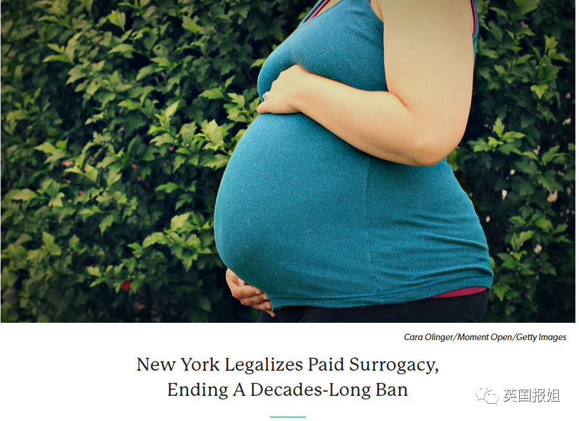 (原始链接: https://mmbiz.qpic.cn/sz_mmbiz_png/VnKUHtWf7xyjgaGs6pDzjQ7c8xZTSrU49fmyVibSMV5wqMFL6y7hG6oicibzCZVicHNHQEjoFnPjXBjBgCLE0V2jgA/640?wx_fmt=png)
- 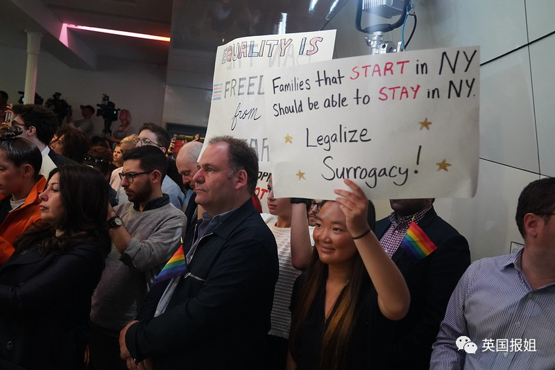 (原始链接: https://mmbiz.qpic.cn/sz_mmbiz_png/VnKUHtWf7xyjgaGs6pDzjQ7c8xZTSrU4BaqtdWTDsJNggFkDA0OKiaVMuUdykSDqGwibj26wkCofqGicnRKV6BjEA/640?wx_fmt=png)
-  (原始链接: https://mmbiz.qpic.cn/sz_mmbiz_png/VnKUHtWf7xyjgaGs6pDzjQ7c8xZTSrU4CwgTaE9ic0PYvP1BjQibbZR9snGEttteKdAiaFbpWfVcxmTriaVGTF1icAw/640?wx_fmt=png)
-  (原始链接: https://mmbiz.qpic.cn/mmbiz_jpg/VnKUHtWf7xzZcOVrFibJOS3xDoxmBCib744WEmVyl2qaUXbWJqhD8kpphTd8ePxcMRNOHnyXTQCgWyB3d22o95ug/640?wx_fmt=jpeg)
-  (原始链接: https://mmbiz.qpic.cn/sz_mmbiz_png/VnKUHtWf7xyjgaGs6pDzjQ7c8xZTSrU4n7qOzic8REELDmxdl3yw1iayd1BjibBrPwlupljsKzzAL8oZI6Kss1KIg/640?wx_fmt=png)
- 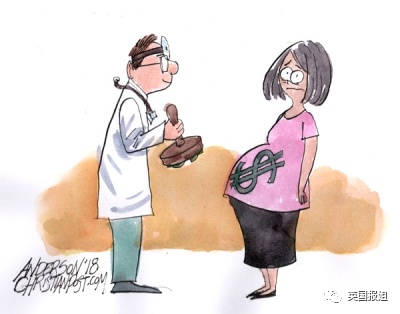 (原始链接: https://mmbiz.qpic.cn/sz_mmbiz_png/VnKUHtWf7xyjgaGs6pDzjQ7c8xZTSrU4AAzhmgRDjb33QmauargibCVaPMsow4V8ttwsNunoeia96ZFHraJN67fQ/640?wx_fmt=png)
-  (原始链接: https://mmbiz.qpic.cn/sz_mmbiz_png/VnKUHtWf7xyjgaGs6pDzjQ7c8xZTSrU4Sf6vCvWjOEPAKCevjWibppeJYIV3INHMyDvQMPtpO5uzpBo1Kwm2NHg/640?wx_fmt=png)
-  (原始链接: https://mmbiz.qpic.cn/sz_mmbiz_png/VnKUHtWf7xyjgaGs6pDzjQ7c8xZTSrU4wiaW4Uprw2PPfS1jbzmdWObVLjiaI5xnCgjPGSMnx1AKNMeh4t4tXia3g/640?wx_fmt=png)
-  (原始链接: https://mmbiz.qpic.cn/mmbiz_jpg/VnKUHtWf7xzZcOVrFibJOS3xDoxmBCib744WEmVyl2qaUXbWJqhD8kpphTd8ePxcMRNOHnyXTQCgWyB3d22o95ug/640?wx_fmt=jpeg)
-  (原始链接: https://mmbiz.qpic.cn/sz_mmbiz_png/VnKUHtWf7xyjgaGs6pDzjQ7c8xZTSrU4dGARzqNcTZ0hPNFRN6PosdU9qnp8qCIACR7u4vwK7Xicp6oUXjrN8nQ/640?wx_fmt=png)
-  (原始链接: https://mmbiz.qpic.cn/sz_mmbiz_png/VnKUHtWf7xyjgaGs6pDzjQ7c8xZTSrU4nPHzEQAicwq3or1micJhfsD4A0QGMNJBib1NFUYg5zp1RjNfslZpRbA0w/640?wx_fmt=png)
- 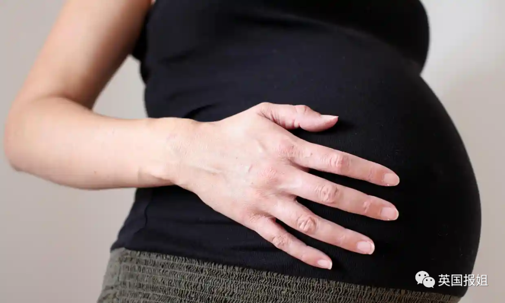 (原始链接: https://mmbiz.qpic.cn/sz_mmbiz_png/VnKUHtWf7xyjgaGs6pDzjQ7c8xZTSrU4dng6MRGjbRjKtf6iaV6QmZORuxK6cqoYPhGibwXOYJnVaYj12jOoicckg/640?wx_fmt=png)
-  (原始链接: https://mmbiz.qpic.cn/sz_mmbiz_png/VnKUHtWf7xyjgaGs6pDzjQ7c8xZTSrU4wJWc1TFicbdOfNqXuGia9y7fCnOPV1gXWaSB2EXvNMIDjSjez6zkLb3Q/640?wx_fmt=png)
-  (原始链接: https://mmbiz.qpic.cn/mmbiz_jpg/VnKUHtWf7xzZcOVrFibJOS3xDoxmBCib744WEmVyl2qaUXbWJqhD8kpphTd8ePxcMRNOHnyXTQCgWyB3d22o95ug/640?wx_fmt=jpeg)
- 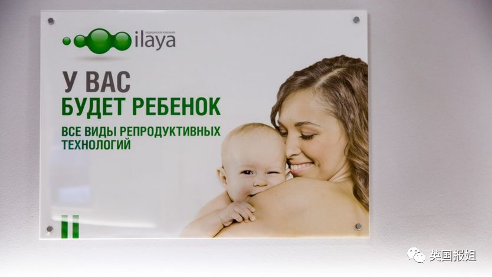 (原始链接: https://mmbiz.qpic.cn/sz_mmbiz_png/VnKUHtWf7xyjgaGs6pDzjQ7c8xZTSrU49DukDPg4Vj1Izib361DQ8mWicMetO1mcgUx8ibgZcicDFY6lZSHChrFNPg/640?wx_fmt=png)
- 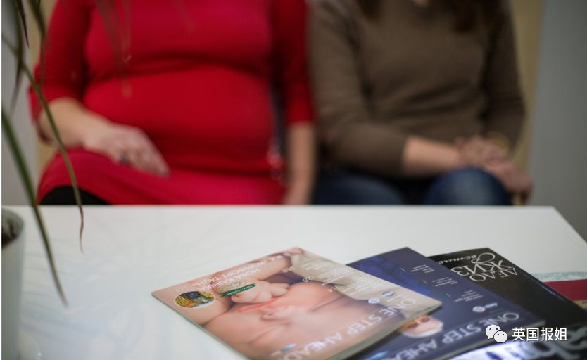 (原始链接: https://mmbiz.qpic.cn/sz_mmbiz_png/VnKUHtWf7xyjgaGs6pDzjQ7c8xZTSrU4es3kib2WicwRprmh3WnBWf8XaicRH4ZpsibOu7eicSVuEafxE6QnEWHG2iaA/640?wx_fmt=png)
-  (原始链接: https://mmbiz.qpic.cn/sz_mmbiz_png/VnKUHtWf7xyjgaGs6pDzjQ7c8xZTSrU4Jgw1RdgNUXVAGOXgnIdl5BSA8qltcMNKN8dzuWwzia1FuwVLvIyricPQ/640?wx_fmt=png)
- 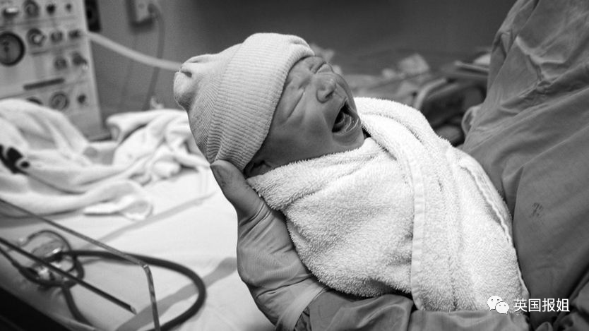 (原始链接: https://mmbiz.qpic.cn/sz_mmbiz_png/VnKUHtWf7xyjgaGs6pDzjQ7c8xZTSrU48kqibxXJ9etIwPlbPJX18LWQztMjLkHmNPGhS4CsUk2J5zS7RiaXcM3g/640?wx_fmt=png)
-  (原始链接: https://mmbiz.qpic.cn/mmbiz_jpg/VnKUHtWf7xzZcOVrFibJOS3xDoxmBCib744WEmVyl2qaUXbWJqhD8kpphTd8ePxcMRNOHnyXTQCgWyB3d22o95ug/640?wx_fmt=jpeg)
-  (原始链接: https://mmbiz.qpic.cn/sz_mmbiz_png/VnKUHtWf7xyjgaGs6pDzjQ7c8xZTSrU4KDibVXEtARptpCo0b7bbAvtGBZic3gMd7b1FV6Qiciaf8trOQWAGNEohiag/640?wx_fmt=png)
-  (原始链接: https://mmbiz.qpic.cn/sz_mmbiz_png/VnKUHtWf7xyjgaGs6pDzjQ7c8xZTSrU4vbVubOcUtVssdQCxNkeicjBp4sIGyDdYcFmM0JhibEsO5ia9RzppQicufg/640?wx_fmt=png)
- 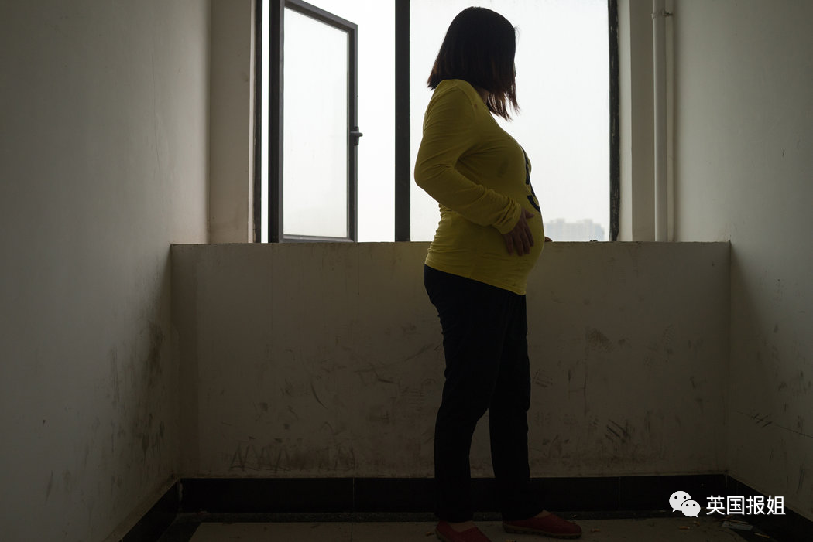 (原始链接: https://mmbiz.qpic.cn/sz_mmbiz_png/VnKUHtWf7xyjgaGs6pDzjQ7c8xZTSrU4CYHWAf8hENqz9KhohTMzZGhhIJpEickP3ruYpe3alvSrPVIsXqxBHyg/640?wx_fmt=png)
-  (原始链接: https://mmbiz.qpic.cn/sz_mmbiz_png/VnKUHtWf7xyjgaGs6pDzjQ7c8xZTSrU4tjz3vYCbebpic4y0JpE8rpCtd9n1K5k0xthFQ71ibJHNQlfAOOicZ3D0Q/640?wx_fmt=png)
- 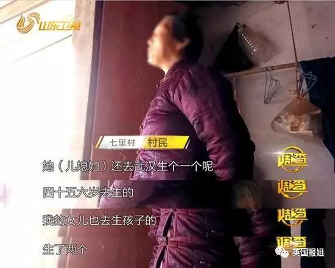 (原始链接: https://mmbiz.qpic.cn/sz_mmbiz_png/VnKUHtWf7xyjgaGs6pDzjQ7c8xZTSrU4ibBVPV9q4fgduQ6rFCAiap6rInicGHc5NZ6pT6m9LlPGBCiccD2OuotakA/640?wx_fmt=png)
- 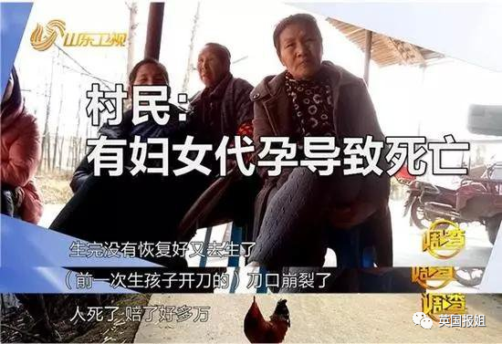 (原始链接: https://mmbiz.qpic.cn/sz_mmbiz_png/VnKUHtWf7xyjgaGs6pDzjQ7c8xZTSrU4LJzaLLKibNibTicHMZHoWWG4nrvrOHK4bJyAWUMYicbJChLicF7P1SuDyCQ/640?wx_fmt=png)
- 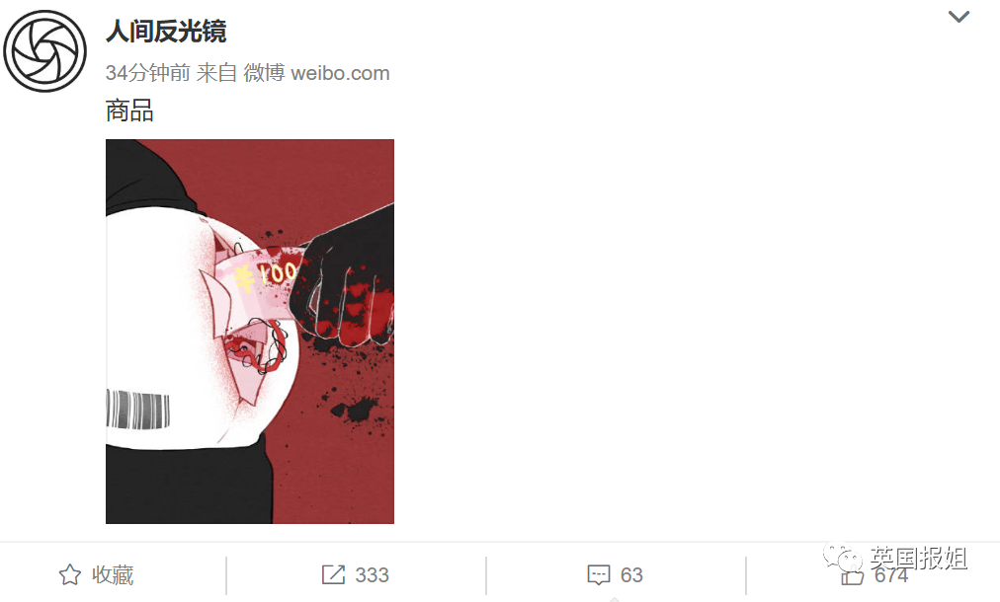 (原始链接: https://mmbiz.qpic.cn/sz_mmbiz_png/VnKUHtWf7xyjgaGs6pDzjQ7c8xZTSrU45AUWXZo0aJb8HQbmRIB7GC8PlBvV0kDqjTCvXn0ibvbwCMhm48wHlbQ/640?wx_fmt=png)
-  (原始链接: https://mmbiz.qpic.cn/mmbiz_gif/VnKUHtWf7xwT5QZufmgNcgLfuXIoPOzLoZ6M5Qic5zWeYgDpj74wkhJiaDNkhhSdj1BmywmYBRpwibUJmuNJGCCYQ/640?wx_fmt=gif)
-  (原始链接: https://mmbiz.qpic.cn/mmbiz_gif/VnKUHtWf7xwT5QZufmgNcgLfuXIoPOzLOZutKKXmCAPoq6ksyOJD27vwF8oBKVpJUZtVN3oCia7ytncMnjGgCPQ/640?wx_fmt=gif)
-  (原始链接: https://mmbiz.qpic.cn/mmbiz_gif/VnKUHtWf7xwT5QZufmgNcgLfuXIoPOzLicE7H6JzqMicbXiacJcSDDg13To5vZMNxdpic4puTs8BLhZujiaI3PjUKkg/640?wx_fmt=gif)
