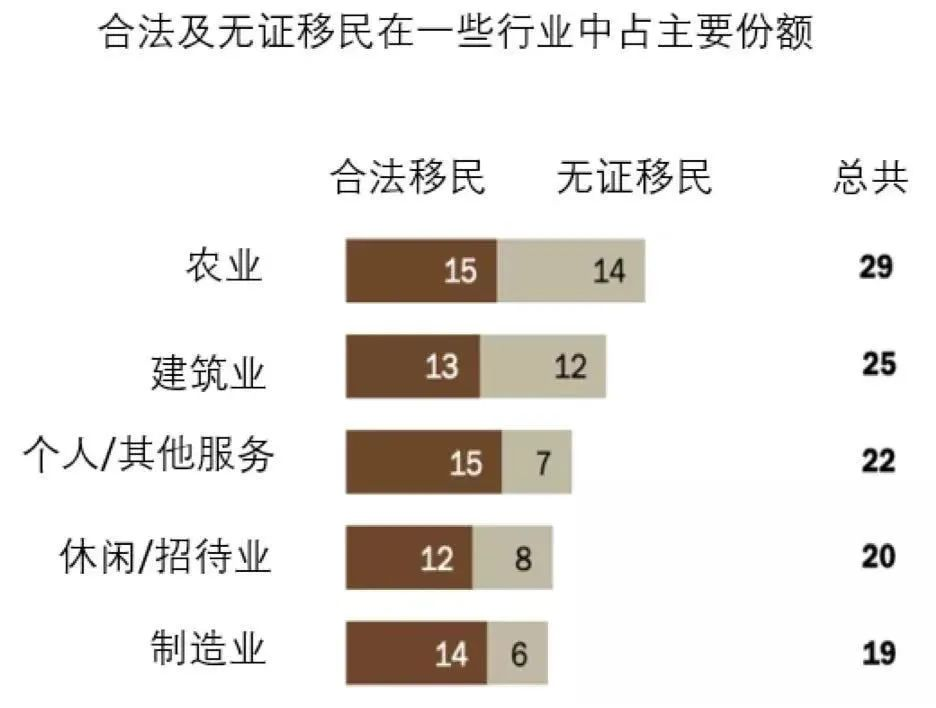
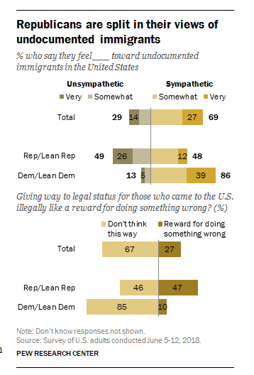
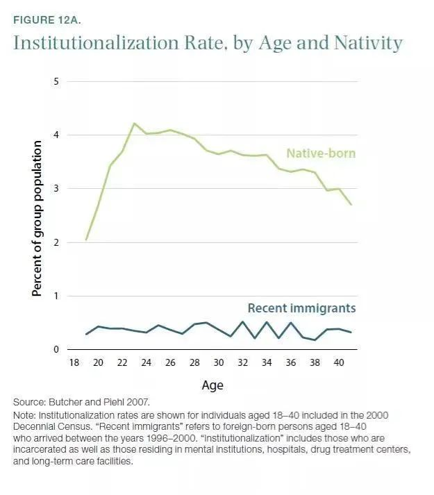
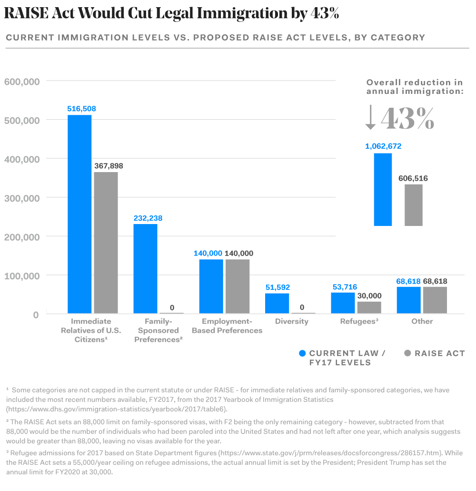
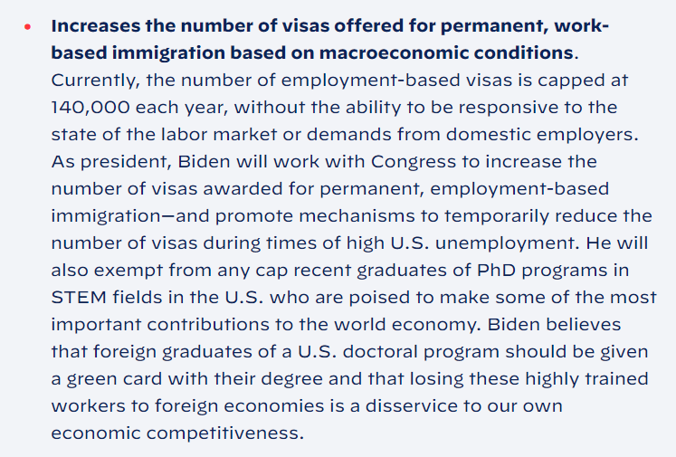

# 无标题

**链接地址:** http://mp.weixin.qq.com/s?__biz=MzA3MTI0NTE1MQ==&mid=2651226813&idx=1&sn=750e87f3a29eca4356a764f564e152fe&chksm=84c2ae8db3b5279bcc64ef95cfdfa2422bf8ee7ee0a8af35d87aca0b7b959f70407deda599ee&dt_platform=wechat_moments&dt_dapp=1#rd
**作者:** 破破的桥
**获取时间:** 2025/8/28 19:55:53
**图片数量:** 5

---

## 原始HTML内容

本文是@破破的桥 微博V+的第50篇文章。接下来几篇将分别讲述：QAnon理论、人肉俄罗斯下毒者的过程、信息污染、美国持枪权因警察没有保护公民义务这一说法的谬误。这些文章大部分会收费，所以不会全文转贴到公众号上来。

——————————————

 

2017年初，特朗普刚刚上任，裹挟巨大的政治能量，很快签署了几个极富争议的、反移民色彩浓厚的总统行政令，包括：1.禁穆令（禁止多个穆斯林国家的国民入境）；2.建边境墙；3.扩充拘留所、全国抓捕非法移民。前两条大家熟悉，最后一条我略作讲解。

 

美国是世界上非法移民（左翼一般称之为无证移民）最多的国家。它们违法，但此前美国政府的处理手段相对柔和。这是由于：

 

经济需要：无证移民承担了很多底层工作，且极其廉价。大幅降低了很多公司或个人的成本。

 

图：无证移民在美国经济中的重要作用

 

人道考虑：有些无证移民长期居住，其后代出生在美国，均为美国公民；还有些小孩，虽然不是美国公民，但未成年时来美，自小在美国上学工作，其人生经验与美国公民毫无区别，缺乏在原属国的生活条件甚至不会当地语言，很多人根本不知道自己不是美国人。这批人中，有一部分，大约70-80万人，其居留和工作权，被奥巴马在2012年用DACA行政令保护。

 

经费困难：抓捕、收押和遣返无证移民的成本非常高昂，相比其危害，这个投入是不值得的；

 

政策顾虑：前几年为便于管理和防止犯罪，地方政府以各种许诺，让这些无证移民过来登记，建立档案。这些人出于对地方政府的信任予以配合。现在联邦政府派人下来照着登记地址一个个去抓人，你让地方政府今后还怎么治理？

 

但对靠反移民议题上台也毫无妥协欲望的特朗普来说，这些都不值得考虑，先做再说。这种未经商议就动手的做事风格，自然招致了民主党的激烈反抗，其手段就是“庇护州”和“庇护城市”，即民主党控制的州政府或地方政府，不配合联邦警察抓无证移民。你想逮捕可以，但我不给名单不出经费禁止你在路上随意拦车查验。你来抓吧，我看你能抓几个？特朗普则以威胁停止对这些地区的联邦拨款来反制。

 

马里兰州是个深蓝州，参众两院均由民主党控制，并且比例超过60%（注：但州长是共和党人。14年选上，18年连任）。它在这场风暴里自然不能独善其身。马里兰州推进庇护州法律的重任，就交给了该州多数党党鞭李凤迁（Susan
 Lee）。李是律师出身，六任州众议员，2014年任州参议员。她曾推进过网络安全、家暴、人口贩运、生物技术、教育等方面的多项立法。

 

州议院与选民关系比联邦紧密很多，尽管在议院占绝对优势，但倾听家乡父老的反对意见非常重要。相比以前那些挑战，庇护州法案在李凤迁看来难度不大。因为“反对”和“仇恨”是两回事。选民可能会“反对”无证移民，但很少会仇恨他们，只要不仇恨，就不会去阻挡政策。很多无证移民在美国生活十几年，和周围邻居早已打成一片，关系良好，警察局经常因为抓个人就收到社区里一堆投诉或者求情信。

 

根据Pew（皮尤）2018年的民调，即便在共和党支持者中，也只有一半的人不同情无证移民，真正厌恶的只有26%。而民主党里持同样态度的仅5%。因此对无证移民立法造成影响的，是很小一群人。

 

图：皮尤民调：两党选民对无证移民是否持同情态度

 

 

当庇护州法案在马里兰州众议院司法会员会一读的时候，这群反对派现身了。李凤迁注意到，<strong>前来听证会上发言，对无证移民持坚决反对态度的32个市民代表中，有27个是中国移民</strong>，<strong>而中国移民仅占马里兰州总人口的1%</strong>。[1] 在该法案经历的其它场景中，情况好一点，但中国移民在狂热反对者中的比例，依然过于醒目。 

 

————————————————————

 

在马里兰州，第一代移民共计90万人，占600万人口总数的15%。按来源国区分的话，最大的移民群体是萨尔瓦多人共计10万1千，其次是中国人6万[2]。

 

为什么会有那么多萨尔瓦多人？这是个中美洲小国，在1979-1992年萨尔瓦多内战期间，它约有50-100万国民逃亡美国，主要扎根在华盛顿DC周边（马里兰州就位于华盛顿DC旁），其中有40万拿到了合法证明。而这些合法移民中，又有19.9万人持有的只是TPS（自然灾害或战争国的临时庇护证明）。TPS地位需要国会定期通过法案延续，一旦延续失败，这些人会立刻变成无证移民。而在李凤迁推行庇护州法案时，这些萨尔瓦多人手中的TPS，正面临2018年3月9日即将过期，而特朗普政府又不给再续的威胁。

 

（此后进程是萨尔瓦多的TPS到期被特朗普政府撤销，但时值2018年众议院翻转，重新掌控众议院的民主党以造墙预算换到了萨尔瓦多移民TPS身份的3年缓冲期，将其截止日期拖到了2021年12月7日，也就是有可能对他们相对友好的拜登政府时期。拜登上台后立刻签发行政令，中止抓捕无证移民。并承诺给予TPS和DACA身份以公民通道。） 

 

当一个人手持TPS在美国居住工作三四十年以后，一旦TPS取消，那除了黑下来，没有任何方法。这展示了一个现实，就是：

 

移民法，和其它普通法条不同。犯这款法，跟你做了什么，其实没多大关系，而是仅仅取决于政策条文怎么写、怎么修改。<strong>你为之无可奈何的出身身份，以及政治角力下毫无道理可言的短短几行字，决定了你是不是犯法</strong>。糟糕的是，因为你还不是美国公民，所以你并没有投票权去改变移民法，没拿绿卡时连捐款都不行。你最大的武器，就是已经上岸的同胞出于感情愿意为你奔走。

 

绝大多数本土美国人，并不清楚移民所遭遇的具体困难。即便在移民群体中，欧洲白人相对于其它族裔，生存也容易得多。你甚至可以从双方的日常用语里看出端倪。一个中国人，谈起它怎么移民美国，用词通常是“immigrant”（移民）。而一个欧洲白人，谈起它怎么移民美国，用词则往往是“move”（搬家）。因为难度完全不一样。

 

为什么难度会不一样？首先欧洲人在美国可以直接入境而无需签证，并且语言和种族鸿沟较小，这大大增加了他们找到工作的机会。其次，也是最重要的一点，就是在美国每年会有14万张劳工绿卡发放，但是这个发放，并不是在申请者群体中平均分配，而是依国籍区分。一个国家每年的职业移民配额上限是7%，也就是说任何国家，不管人口多少，都不能拿超过14万×7%张的职业移民绿卡，如果这些绿卡发放完毕，那么该国剩余的申请者就必须等下一年新的绿卡发放，一年年越累积越多。这就使得21世纪移民来美的主要来源国，印度、中国、墨西哥等等，出现了劳工绿卡申请堆积，也就是排期的现象。随着等待人数变多，排期越来越长。中国的EB-2（劳工绿卡）至少要等待6-7年，而印度则通常需要等待11-13年以上。 

 

所以十多年前美国网络上，那些没有拿到绿卡的华人新移民，虽然不参与政治，但关心两个议题，一个是绿卡扩容，另一个就是取消国别分配。 

 

绿卡扩容这个议题，在2014年最后一次移民改革失败以后，就失去了时间窗口。2010年两党对移民有着更加宽松的共识，也愿意推进改革。但被随后崛起的茶党运动所打断，而共和党也逐渐转变为一个反移民政党。这种转变首先出现在更迭频繁的众议院。当众议院否决了参院高票通过、奥巴马也不反对的法案之后。移民改革业已胎死腹中。几十年前定下，永远无法满足需求的14万张绿卡上限，依然死死卡在那里。特朗普上台以后自然更加没有可能。

 

既然无法增加职业移民数量，那么高科技公司和移民群体的主意自然就打到国别分配上来。2019年，由犹他州共和党联邦参议员Mike
 
Lee推出S386法案。要求取消国别上限并设置3年缓冲期。刚听说此事时，华人自然是大喜过望。但随后稍作计算，发现了其中的问题：印度人得利比我们更多！而且华人移民在三年缓冲期大幅得利后会迎来黑暗期，印度人长期积压的H1b，将有可能会让华人的EB2绿卡在第4-10年颗粒无收。于是很多华人找到伊利诺伊州民主党参议员Dick
 Durbin来反对这个议案。 

 

尽管我们可以简单定义某个议员（比如Mike
 
Lee是保守联盟评出100分的明星茶党等等），但这件事本身并非意识形态驱动，而是两党均有参与。2020年参院通过的S386修订版本（提交众议院编号H.R.1044），相比2019年，消除了华人EB2在4-10年内颗粒无收的情况，大致每年的绿卡数都会比现在更好，但它也有诸如Sec
 9排斥共产党员及其亲属这类雷区。不过，这些细节并非本文要说的重点。本文要讲的，是华人在美国的政治参与。 

 

———————————————————— 

 

回到马里兰州的庇护州法案。

 

面对该州第一代华人新移民对无证移民的仇视，李凤迁并非没有开展她的说服技巧。

 

一般来说，本土居民对移民的担心不外乎几点：犯罪、文化融入、抢工作。对于无证移民来说，最后那点其实最不重要，因为它们一般承担着本土人看不上、工资非常低的底层工作，尤其很难对当地以高级知识分子或技术工人为主的华人工作形成威胁，相反华人还经常廉价雇佣无证移民打理房屋或花园。至于文化融入，西裔或中美洲人比起华人更为容易。而针对当地人关心的犯罪问题，李凤迁解释说，无证移民的犯罪率比本土美国人低很多，他们对社会也并非毫无贡献。

 

图：移民犯罪率。其中合法移民比无证移民更低。 

 

绝大部分白人在真正了解移民的难处以后，不管是否讨厌，多少都会生出点同情心。除非小部分极端者。但对华裔来说，他们却并非如此——移民犯罪率低？可全赶走了犯罪就是0，你再低还能低到没有？无证移民虽然不抢我们工作，但它们的后代占用我们的教育资源，那些小孩都在小学中学占着名额那。

 

中国移民当然知道移民的艰难，除了极少数特别有天份又顺遂的，它们都有切身的痛苦和体验。从事高科技工作的中国移民，其教育背景往往是中国最好的那一批大学，通过申请博士到美国大学深造，花上5年左右，以极低的薪水和近乎007的努力工作拿到学位。再到处投简历，若能力或运气足够，得到某家大公司垂青，给予H1b签证，在美国就基本稳定下来了。由于H1b名额不足，有时还需要抽签。拿到身份后，再工作数年，期间往往不能更换公司，因为更换公司经常会造成H1b
 
gap（身份转换中的间隙，是违法的）。H1b到期后还要续约。从头到尾总计花费十几年，等待那一张绿卡。类似的经历，在这些反对无证移民的中国移民里，极其普遍。有些人甚至因为工作签证到期而不得不搬到加拿大再搬回来。

 

但相比与对方共情，他们却觉得，这种艰难的移民方式，才足够有“尊严”。你们这些偷偷摸摸黑进来的无证移民，钻美国的执法漏洞，算什么东西？

 

随着摆数据、讲道理的方法，不停地遭遇失败。李凤迁终于发现，那些人并不是害怕丧失经济地位或者担心文化侵略，而是真真切切地、没什么来由地，发自内心地，仇恨那些无证移民。

 

她不得已使用了最后的武器——同胞身份。她是中国移民，很多无证移民也是（全美共250万中国移民，其中不到40万为无证移民）。但这依然毫无作用，谁跟你是同胞？偷渡客也配当同胞？

 

长时间的，不停的争吵和抗辩，令双方的情绪越来越激动。最后，见过无数大风大浪的老牌政客李凤迁，失态地大吼起来：

 

你们的良心在哪里？？？

 

呵呵，“良心”，好古老的过气词汇。

 

——————————————————

 

美国华人和其它亚裔的政治选择原本并无明显不同，但自2014年“反AA”运动起，情况有了很大变化。一些意见领袖宣传说，华人在藤校等高等院校招生时受到了歧视，因为黑人、西裔的录取标准远比亚裔要低。这一切是民主党推行的平权政策导致。如果支持共和党，让它们拿到总统和参议院，任命两个保守派大法官进最高法院，就可以废除AA（平权法案），你的孩子就更有机会上好大学尤其是藤校了。

 

2016年，不管是不是他们的功劳，总之愿望实现了。共和党总统、参议院，保守派大法官还多任命了1个，一共3个人，不但极端保守，还年轻。 

 

那他们的反AA大业成了吗？

 

2017年，SFFA（公平入学组织）拿到华人一大堆捐款并推出亚裔原告，向哈佛大学起诉亚裔权力受损。它还向教育部和司法部提交了哈佛的招生调查申请，结果教育部拒绝但司法部接了。2019年10月，麻省地方法院判哈佛大学胜诉。2020年SFFA将案子递到第一巡回法院。但这时它的操作已经惹恼了老牌亚裔政治组织AALDEF（亚裔美国人法律辩护和教育基金），反对势力开始与之对垒。

 

尽管有别的亚裔反对，也输了官司，但路还长，万里长征毕竟迈出了第一步。也许再过20年就能成功的把黑墨原本已很少的名额再剥夺一些，拿到亚裔手中，每个学校按比例分给华裔几个或者几十个。这应该就是他们设想中最美好的结局。 

 

但虽然这几个名额的进度极其缓慢，还没到手，可在这四年里。几十万中国留学生和没拿到绿卡的人，却迅速地倒了大霉。

 

中国人H1b RFE（劳工签证材料不齐或不准确要求补）的人数翻了三倍，受害者们组了一堆微信群在那里哭嚎，发现没啥好办法以后学会了自吞苦果乖乖打包回国。

 

H1b（劳工签证）的工资要求提高了整整一个档次（尚未实施，预计会被拜登政府废除）。除了硅谷和华尔街高薪行业的少数员工，恐怕大部分中国博士毕业生都拿不到。 

 

移民身份如果因为政府部门自身错误意外失效，申请人要为错误承担责任麻溜地滚回国去。

 

奥巴马开放给H4身份（劳工签证配偶）的EAD工卡被取消，因为DHS（国土安全部）认为这些人没技能阻碍美国公民就业。民权组织立刻打官司搞DHS，卡住了这次法案执行。但H4恐怕已经没法安心工作了。

 

奥巴马给中国学生的F1（学生身份）5年签证，被提案要求取消。学校因为疫情不能开放线下课程的话，F1学生身份将要被取消。中国七所高校及其附属高中的留美学生身份被取消……

 

最厉害的当属特朗普背书，共和党参议员Cotton、Perdue和Hawley等人（其中Cotton和Hawley是共和党的明日之星，不过Hawley因配合1月6日暴动被视为新纳粹而前途成疑）联手提出的RAISE
 
Act。该法案要求取消亲属移民等，将已经很少的绿卡数量降低40%多，来“保住本土美国人的工作”。这招致了一堆移民群体的强烈反对。2017年该提案首次提出，次年在参议院以39比60未能通过。2019年再提，但此时民主党中期选举翻盘，控制了众议院，议案被直接挂起。

 

图：RAISE法案假如通过，将减少的绿卡数量

 

最后，则是2020年在美华人听到耳朵起茧的“中国病毒”（还有“功夫流感”等）。总统的宣传和穿透能力是如此的强大，以致于在竞选前，交通部长，共和党大佬麦康奈尔的妻子赵小兰，在召集华人共和党粉丝开会时，都要很别扭地在海报上用“亚太地区共和党/特朗普支持者”的标题。

 

而民主党的副总统候选人贺锦丽在2020年5月份则提交议案，要求谴责部分官员歧视华裔的“武汉/中国病毒”等提法，改用标准的“COVID-19”。

 

你想想，这四年搞下来，那些原本认为“中国人在美国是被黑墨反向歧视”而反民主党的华人，会支持谁呢？

 

当然还是特朗普了，废话。

 

——————————————————

 

为什么越是虐待侮辱砸铁拳，不少华人移民反而越是支持呢？你要理解他们的思维方式：

 

他们首先会先验地划分“敌”、“友”。举个例子，“敌”是民主党，“友”是共和党，或者特朗普。然后用一组套套逻辑不停强化自身立场。

 

1.对于“敌”的任何举动，他们都瞪大眼睛，具备强烈的“被迫害感”或“被忽视感”。

 

“被忽视感”比如：民主党为什么老给穆斯林和少数族裔说话，肯定是为了要他们的票！可为什么他们就不给华人说话呢？（美国穆斯林人口占总人口0.9%，与华人比例大致相当）一定是想把华人群体的利益卖给其它族裔，要后者的票。

 

“被迫害感”比如：哪怕是个看起来非常中立，人畜无害的政策，他们会立刻警惕：

 

为什么民主党在政府调查问卷上要搞“亚裔细分”？要亚洲移民填写具体的来源国？肯定是因为中国人学习成绩太好了，比其它亚裔都好（事实是华裔成绩位于亚裔中游）。要把我们细分出来，再制定定向歧视政策迫害我们！

 

（刚刚知道）推亚裔细分的六个议员里面有三个是华人？这一定是汉奸！汉奸！把党派利益放在族群利益之前，下次必须把它们选下去！。 

 

2.对于“友”，则会把对方所有于己不利的法案、措施，重新解读为对己有利的。 

 

要打击非法移民，统统抓起来遣返？毫无疑问对我们合法移民有利。

 

要打击亲属移民，取消这批人所有绿卡名额？毫无疑问对我们劳工移民有利。

 

要打击低技术劳工，提高H1b门槛？毫无疑问对我们高技术移民有利。

 

天天说中国病毒？只是说个事实嘛，根本就不算什么歧视。至于别人因此会对华人会有什么误解，反正又伤不了我一根毫毛。我住的社区、工作的公司里，都是高端人士，不会被这影响。 

 

至于他的同胞是不是拥有高技术，是不是有父母兄弟姐妹，是不是非法移民，周围环境有没有敌意，同胞身边的同事或者邻居的脑子是否能理解叫中国病毒并不意味着华人对此有责任等等，你会发现这些号称代表全体华人利益的人，其实是半点也不关心的。谁跟你是同胞？

 

他们的整套思路都是扭曲的，评判体系也完全倒个儿。比如政客道德好，是“虚伪、伪君子”，道德不好，是“真小人、真性情”。政客用“中国病毒”煽动歧视，是“不看身份只说道理”；反对用歧视性语言，那是“虚伪的作态，试图用身份定义我们，这才是真正的种族主义”。出一个对己不利的法案，是“象征性的，反正国会发挥制衡作用通不过”，开一张空头支票，却是“总统的确关心我们”。在这样的逻辑驱使下，他们永远无法从立场中走出来。 

 

3.后果就是他们会经常被铁拳砸到但又不了解这拳头长在谁身上

 

比如真给华人什么好的或者宽松的政策，无论是给H4发EAD卡还是F1
 
5年签之类的，并不见华人有多么感恩在意。而当他们被铁拳砸到的时候，今天H1b倒霉了，明天F1倒霉了，又只会无能狂怒，不知道怎么去改变。直到被一个爆款微信帖子煽动起来，去做一个完全无效的签名（通常顺便给别人的营销号涨了流量），给议员们打一堆骚扰电话（通常因为蛮不讲理又如同蝗虫过境而把华人形象变得更差），或者掏出腰包去捐款（通常肥了某些擅长cosplay维权者的意见领袖）。

 

美国不是一个政治神秘的国家，大部分东西都是在台面上公开的，政策谁鼓吹、谁制定、谁附议、谁投票，全部都有记录。即便没有公开记录的，比如具体哪条是谁修订的，足够有能力的记者要搞到也不难。

 

像第一代华人移民群体这种挨了四年毒打，却100个里至少95个不知道Stephen
 
Miller是谁，至少99个不知道他到底干了什么的情况，是相当有中国特色的（文末链接里有一个对Miller的简单介绍[3]）。所以他们既有力，能够在公众号一篇文章鼓动下集体骂街，让前来交流的市议会议员们落荒而逃；又无力，似乎无论怎么做，几万人、几十万人的签名、捐款、打电话，也无法改变自身处境。 

 

2019年底，随着S386法案提交，微信和Telegram里出现了很多反386的群，尽管提法案的大多是共和党议员，也不能说对整个华人群体不利，但却被叙述为“新排华法案”，定调是“民主党偏袒印度裔出卖华人利益”。大家在群里以及群外宣泄着对印度裔移民的刻骨仇恨。到了2020年秋季，这些群很多都关掉了，其中有些说明了关闭原因——“当前美国总体仇视华裔的氛围不适合再搞这类运动”。那这个氛围跟运动有联系吗？群主是不解释的。

 

其实停止搞事不难理解，特朗普连H1b都停掉了，连工作签证都没了，还反什么从工作签证走向绿卡分配的S386？这不是笑话嘛。到了2020年12月，尽管法案内容早已变更[4]，但这些人又故态复萌，各种谣言、仇印、拼命打议员电话。 

 

这种现象以前有个词描述，叫做“灾民理性”。被无处不在又不知具体来源的铁拳砸习惯以后，虽然换了环境和时代，韭菜们看见了抗争可能，却无法更改行为模式。 

 

——————————————————————

 

我特别喜欢讲一个寓言故事，叫“狐狸吃饼”。这个故事很多人小时候都听过。

 

小猪兄弟在集市上买来一张饼。分饼的时候没有分匀，猪哥哥的那块大了一点，两人争论不休。

 

路边一只狐狸看见这一幕，就走了过来。说我来帮你们分吧，这样你们就不用争了。

 

他在大的那张饼上咬了一口，再给小猪双方一看，由于咬去的太多，那块原本小的饼显得比另一张大，猪哥哥不满意。于是狐狸在另一张饼上也咬了一口，结果也咬多了，原先这张又重新显大。猪弟弟又不满意了。狐狸左边一口右边一口。把这两块饼吃得很小，小猪们终于看不出它们有什么区别了。

 

于是饼公平地分完了，猪哥哥和猪弟弟各拿着一块小饼，大眼瞪小眼。狐狸拍拍肚子满意地走了。 

 

我小时候并不喜欢寓言故事，因为我觉得里头的人很蠢。我六岁都能明白的道理，他们居然会栽在上面。当然，这则故事的主角是小猪，所以尚可接受。如果是两个人，那情节就太不合理了。

 

但是，长大以后，看见很多，我才明白：寓言之所以传承百年、千年，就是因为人类会在很简单的道理上犯错。

 

具体到这件事，狐狸为什么能成功？

 

<strong>第一，他掌握了分饼的权力。是这件事的强势方。小猪并不理解对饼的处置权，才是最大的权力。</strong>

 

<strong>第二，他有效地挑动了弱势方的内部矛盾，煽动双方的不满和仇恨。让小猪们的关注焦点，集中到这块饼分得谁多得谁少得这种次要问题上。当小猪们开始分裂和互斗的时候，他得利了。 </strong>

 

认识不到这两点，又极度自私的小猪们，自然得到了双输的结果。

 

当我们遇到类似的事，要思考的是：谁是掌握着分饼权的狐狸？谁是饼？谁又是弱势方的小猪们？

 

你需要首先警惕的是分饼的人，要对饼的大小敏感。然后再去处理与其它小猪之间的关系，那些小猪，跟你是对手，但同时也是和你一起对抗强势方的伙伴。态势其实非常微妙。 

 

 

2020年，美国华人的政治观念出现了转折，民主党群里，跑来了不少原先中立或者特朗普的支持者，原因几乎都是一样的，就是被“中国病毒”给气着了。但这群人不但没有票（往往不是公民或居住在铁蓝州），还带来了一些不良习气，就是喜欢发仇恨言论。比如原先这些华人，不是喜欢骂民主党支持者搞AA剥夺华人受教育机会，所以是“汉奸”嘛。现在投靠民主党了，它们就反过来骂特朗普支持者是汉奸。除了骂华人川粉以外，它们同样也骂黑人骂墨西哥人骂印度人乃至骂白人……但凡看见这种情况，我在自己略有影响力的群里都会出面说两句——不要搞这种事，在蓝群呆就得习惯这边的规矩。当然，更多的群，其氛围是我根本控制不了的。

 

为什么特朗普或者共和党的支持者可以去敌视黑人、墨西哥人、或者其它亚裔，民主党的支持群里，就不行，非要守这些古板的规矩呢？这跟美国两党的组成方式有关。

 

很多不熟悉美国政治的人，往往会认为美国的两党是镜像的，一个左一个右嘛。实际上它们的组成和根基是完全不同的。共和党是一个意识形态党，所以只要时机合适，它可以方便的极端化，提高战斗力，尽管会赶走一些人，但反正美国投票率长期偏低，出票率足够高就能赢。但民主党是一个多元化政党，是各个利益集团拼凑而成。比如LGBT性少数群体，女权组织，少数族裔、某些非主流宗教团体、极左翼经济平权者等等。这些群体之间有很多内部矛盾。前几天我就做过视频，提到了同性恋群体和女权群体在代孕一事上的矛盾。男同性恋群体希望留下后代而女权却不乐意女性身体被商品化使用。

 

这种多元化组成，意味着民主党极端化的后果是严重的，会导致分崩离析。这也就意味着，这里面的所有群体都要相互体让，求同存异。因为满足其中某个群体的需求，必然招致其它群体不满，这就需要大家商量着来。

 

但这批中国新移民中，很大比例恰恰不是那种愿意“商量”的类型。 

 

它们不关心别的族群的利益，从来不会谈论什么黑人、墨西哥人、或者其他亚裔面临的困难，永远谈的是自己的不满。在它们谈论反AA的时候，自豪地宣称华人重视教育成绩好的时候，已经排斥了那些底层华人，尽管后者比例一点不低。在绿卡争夺战中，这一点表现得更为明显，当家属移民的名额被大砍特砍的法案出台的时候，他们谈论的是自己那点劳工移民名额没有受到影响——证明美国政府更重视我们，而非那帮把家属搬运进来吃福利的龙虾党，或者把小孩生在美国然后靠着这层关系混进来的不法之徒。在2019年秋冬季，反S386第一个版本出台的时候，他们谈的是EB2和EB3（劳工与亲属）在第四年以后会受到什么影响，而华人中该法案的得利者，EB1（特殊人才）和同样排期十年以上、名额也积压很多的EB5（投资移民），由于痛苦相对较轻，也没有什么话语权，因此绝大部分鼓吹反S386的文章及背后的营销号、意见领袖，对这些群体没有半点解释和安慰，而是提醒大家“要警惕有人用S386有利华人EB5来搞乱我们”。

 

它们哪怕是说一声，尽管S386可能对你们EB1，EB5的排期有利，但请体谅一下我们这些普通劳工生活挣扎的难处呢？没有。有的只是拿一堆谎言欺骗这些人，更普遍的是漠视。谁跟你是同胞？

 

所以你会明白为什么当总统开始对付它们的时候，它们会突然发现“哎？好像没人给我们说话，今年美国的种族氛围突然恶劣了耶！”

 

————————————————

 

回到S386的问题上。无论内部争得多么激烈，你首先要了解到的是：矛盾的根源是什么？是饼不够大。

 

14万张绿卡的上限远远少于美国公司对外国劳工人才的需求，甚至少于美国公司对高科技人才的需求。这是当前问题的根子。让这些劳工为美国工作，却不能给他们提供足够的绿卡让人安家、让人能够有职场上更好的发展，是一个不公、不义的行为。

 

在这种不公不义的环境下，无论是排期13年也好，排期7年也罢，都是状况年年恶化，人们的需求日益紧迫，必须解决的问题。这是形势所趋。

 

为什么要在争夺利益的时候说这些有的没的呢？ 

 

首先，了解问题的根源，有助于我们选择更好的解决方法。如果某种方法，比如鼓动移民之间相互仇恨或因分配不匀而去支持反移民组织，并不利于解决这个根源问题，那么即便看起来它对我们眼前有利或可以报复出一口气，也尽可能不要使用。弱势互害的零和游戏永远只能让我们在低水平挣扎。组织好力量，等待形势变化，才能在解决根源问题的窗口期到来时有充足准备。与其他移民群体去拼死争夺几千张绿卡的分配，却忽略拜登竞选网站上扩充14万张职业移民绿卡上限的承诺（尽管未必能被国会通过），是舍本逐末的不良政治参与。

 

图：拜登竞选团队对职业移民的承诺 

 

其次，大势是难以阻挡的，判断什么是大势所趋非常重要，而对“不公”的感知能辅助你的判断。美国高速发展的科技企业需要劳工移民，但劳工移民境遇越来越差，等待时间越来越长，利益受损越来越重，不利于这点，解决的愿望自然会越来越迫切，这种状况也不会永远持续，你会发现很多人在为此努力。这时越是去抵挡它，越遭人仇视，今后的反弹和报复也就越重。不要因为自己不能完全满意就去讲“我们要干掉S386”，而是要看法案是不是存在原则上的问题，如果只是名额多寡的事，那完全可以磋商并达到目的。

 

最后，就是不要总觉得自己才是被需要的，不可或缺的，其他人都可有可无。中国人总说印度的“外包工厂”，以假材料搞定了太多H1b，弄进来很多低技能劳工，挤占了其它族裔的名额。从欺诈移民局的意义上，这种指责当然成立，但很多人还附带着“他们水平不足并不是硅谷所需”的看法。遗憾的是，便宜的低技术劳工，才是硅谷那些中小公司所紧缺。

 

这种高高在上的想法在第一代华人移民中极其普遍，他们认为拿着prevailing wages的人才是社会或者说美国“真正的”需求。那些又穷又没文化的人并没有超额贡献，应该滚回去。

 

从经济上说这个结论是不对的。但我更想从社会和道德上聊聊，反低技术移民（包括难民、无证移民等等）是很多第一代华人的共同特征，甚至对反川的华人来说，看不起没有大学学历的红脖子也是普遍的。只是毕竟穷白人是美国本土人更是政坛不可忽视的力量，他们歧视起来不硬气。

 

第一代华人移民之所以对特朗普有好感，有一个原因是特朗普与他们有着共同的感情和共同的敌人。在这其中，对穷人，尤其是有色人种穷人的鄙视和仇恨，华人川粉比特朗普更甚。他们能够用非常刺痛非常狠毒的语言去侮辱那些穷人，甚至为此发明了很多新词。

 

既然对穷人那么鄙视，那他们自己的境况一定很好，拿着绿卡或者公民，勤劳致富，钱多到花不完对吧？的确，你经常可以看到那些口出恶言的人，会给自己打造这么一套人设，就跟知乎用户们人均百万年薪一样。但在这四年里，让我印象最深的是两件事。

 

在特朗普上台以后，劳工签证H1b与其它签证的RFE（材料待审）率大幅提高。尽管可能印度人倒霉最多，但华人的哀嚎四处可见。2019年，买买提论坛上，一位网友求助说，自己H1b在被公司解职后失效，无奈转为旅游签证B2继续找工作，但手续原因导致有了150天违规停留期。因此他在第二次续B2时被RFE，身份无法延续，又有80岁高龄的家人在美治疗，归国的话恐老人病有不测。家里没钱，请不起移民律师，只能到论坛上看看能不能免费求助。

 

这当然很惨、很无奈也很棘手，但当网友纷纷给他出主意的时候，人肉结果出来了——这家伙居然是个川粉！于是论坛上的画风突变：

 

——B2是旅游签证，你用它来找下一份工作，这是欺骗移民局，是最令川粉不齿的非法移民赖着不走的行为。看在同胞份上我们不举报你，但请你尊重law and order自我遣返。（法律与秩序是特朗普的口号之一，而“自我遣返”是Miller造出来的新词）。

 

——别人H1b拿的好好的，你却被公司辞退了。poverty is a choice（贫穷是你自己的选择，共和党的流行观念之一，指穷是因为懒），你被公司辞退恐怕是因为太懒吧？这个美好的国家不可能有勤劳但穷困的人。你没有工作居然在美国呆了一年，你是不是去领福利了？是不是社会寄生虫？

 

——你既然被公司辞退了，说明美国并不需要你在这里工作。你干嘛一定要赖在美国不走，抢美国人的工作呢？其它公司也应该积极响应川总“buy american, hire american”（买美国货，雇美国人）的号召，早点让你们这种抢美国人饭碗的人麻溜地滚回去。

 

——你这位80岁的长辈，没有劳动能力，却呆在美国治病，不停地消耗高额的医疗费用。它自己自然是还不起了，最后必然只能是人死债烂，给我们这些美国纳税人增加沉重的负担，让我们的医保费用年年上涨。这位长辈既然是中国人，在中国交了一辈子税，那么理应回中国治病，不要浪费美国人的钱。

 

——你们批评我让老人冒死亡的危险回国心狠？你们这帮圣母婊那么有公德，倒是把他家老人接回自家住啊？怎么一个都不站出来？白左真是虚伪得很。

 

……

 

这种事不是第一次出现，上一轮掀起轩然大波的，是著名的特朗普粉丝罗医生去世。他是当地粉丝团的头，捐款并组织了大量助选活动，例如飞机拉横幅给特朗普助选，连不在美国的朋友都耳熟能详。

 

罗医生因为意外去世，大家发现，他留下了80岁的老父，第两任妻子，三个兄弟和多个未成年孩子。因为高收入的顶梁柱壮年去世，家中无钱甚至难以发丧，妻子不得已到网上募捐。她只募到了聊以自慰的钱，而伴随这些钱的是各种讽刺：

 

——你们家这可是特朗普最痛恨的“链式移民”（Chain immigration）啊。全家像拔萝卜一样的被罗医生一个个从中国搬运过来。还两任妻子。

 

——你们有钱给特朗普这个亿万富翁捐款，有钱搞飞机助选，有钱租车集体去外地多次参加特朗普的活动，现在说自己没钱吃饭，甚至连发丧的钱都没有，谁信？

 

——不是说成功的富人选特朗普，没钱的穷鬼选希拉里吗？罗医生作为富人中的头，怎么会没钱？居然还要别人当左逼圣母婊，给他们捐钱？谁是圣母婊谁就捐吧。把他全家接自己家里住最好。我们不拦着。

 

——罗医生骂了一辈子拿福利的懒人和龙虾党，信奉丛林法则，现在人一死，突然全家都成了他最痛恨的龙虾党（注：2016年华人圈一直传说穷人有时用政府发放的食物券买龙虾，指他们生活奢靡。美国龙虾大致是9美元每斤。龙虾党是他们对这些领福利的穷人的蔑称）。请罗夫人有一点骨气，绝对不要去拿邪恶的福利。那可都是我们纳税人的血汗钱，不是用来养你们这些懒人的。

 

——听说罗夫人找不到工作？我知道一家批萨店，去店里摊批萨可以拿最低的法定工资7.25美元一小时。罗夫人赶紧去吧？啊？这点钱养不活几个孩子？你可以加班同时打两三份工啊。 

 

——你们拿着绿卡领福利，按特朗普的政策是要遣返的。建议你们去求求他，看在罗医生助选汗马功劳的面子上给ICE发个命令，暂缓遣返。说不定川总一高兴还捐钱给你们呢。

 

…… 

 

这些话异常的刺耳和难听，但每一个词汇，每一个句式，都是川粉们自己发明，并说了一年又一年的。说的时候他们不觉得，他们落难，别人开始拿这些词数落他们的时候，他们受不了了。你不明白为什么他们为什么会对穷人占一点便宜那么的敏感，为什么会那么的仇恨。 

 

————————————————— 

 

来美前，他们一直是主体民族，没有被边缘化过；移民政策筛选机制，使得来美者大多中国社会竞争中的胜者，没有体察过竞争失败、无力流泪的滋味；生活经历，中国这几十年来，从零开始持续发展，几乎每个人都能获利，社会暂时还没有完全固化，让他们觉得穷人是因为懒惰、活该；文化原因，他们从小就不被鼓励或禁止往上质疑，那么往下欺压就变成了不少人的默认选项；天生视野狭窄，一辈子做题家，到了美国也是顶级学校加大公司，很少愿意去接触三教九流的广阔人群，也不关心他们的生存状态。

 

正是因此，自视为强势群体，或者依附强者，就是他们政治参与的首选项。如果强者能够看上并接纳他们的势力，那么这个策略自然是成功的。但假如强者因为某些原因要甩锅给他们，要剥夺他们的利益，比如喊起了“中国病毒”“功夫流感”，那么这个时候他们就处在既无法从狐狸手中获利，又被其它小猪仇视的尴尬位置。

 

人不为己天诛地灭，丛林法则强者为尊，是很多第一代中国移民的生存法则和成功之道。然而当他们投身到政治领域时，却发现原本让他们无往而不利的准则，成了被人仇视的诱因。而那些看起来无用的道德，对一件事是否“不公”或者"不义“的判断，却是一个群体在政治上站得住，话说的出口的基点。 

 

 

[1] These first-generation Chinese Americans are vigorously opposing sanctuary laws 

[2] https://www.migrationpolicy.org/data/state-profiles/state/demographics/MD

[3]
 
https://www.newyorker.com/magazine/2020/03/02/how-stephen-miller-manipulates-donald-trump-to-further-his-immigration-obsession

[4] https://www.congress.gov/bill/116th-congress/house-bill/1044

 

---

## 纯文本内容

本文是@破破的桥 微博V+的第50篇文章。接下来几篇将分别讲述：QAnon理论、人肉俄罗斯下毒者的过程、信息污染、美国持枪权因警察没有保护公民义务这一说法的谬误。这些文章大部分会收费，所以不会全文转贴到公众号上来。——————————————2017年初，特朗普刚刚上任，裹挟巨大的政治能量，很快签署了几个极富争议的、反移民色彩浓厚的总统行政令，包括：1.禁穆令（禁止多个穆斯林国家的国民入境）；2.建边境墙；3.扩充拘留所、全国抓捕非法移民。前两条大家熟悉，最后一条我略作讲解。美国是世界上非法移民（左翼一般称之为无证移民）最多的国家。它们违法，但此前美国政府的处理手段相对柔和。这是由于：经济需要：无证移民承担了很多底层工作，且极其廉价。大幅降低了很多公司或个人的成本。图：无证移民在美国经济中的重要作用人道考虑：有些无证移民长期居住，其后代出生在美国，均为美国公民；还有些小孩，虽然不是美国公民，但未成年时来美，自小在美国上学工作，其人生经验与美国公民毫无区别，缺乏在原属国的生活条件甚至不会当地语言，很多人根本不知道自己不是美国人。这批人中，有一部分，大约70-80万人，其居留和工作权，被奥巴马在2012年用DACA行政令保护。经费困难：抓捕、收押和遣返无证移民的成本非常高昂，相比其危害，这个投入是不值得的；政策顾虑：前几年为便于管理和防止犯罪，地方政府以各种许诺，让这些无证移民过来登记，建立档案。这些人出于对地方政府的信任予以配合。现在联邦政府派人下来照着登记地址一个个去抓人，你让地方政府今后还怎么治理？但对靠反移民议题上台也毫无妥协欲望的特朗普来说，这些都不值得考虑，先做再说。这种未经商议就动手的做事风格，自然招致了民主党的激烈反抗，其手段就是“庇护州”和“庇护城市”，即民主党控制的州政府或地方政府，不配合联邦警察抓无证移民。你想逮捕可以，但我不给名单不出经费禁止你在路上随意拦车查验。你来抓吧，我看你能抓几个？特朗普则以威胁停止对这些地区的联邦拨款来反制。马里兰州是个深蓝州，参众两院均由民主党控制，并且比例超过60%（注：但州长是共和党人。14年选上，18年连任）。它在这场风暴里自然不能独善其身。马里兰州推进庇护州法律的重任，就交给了该州多数党党鞭李凤迁（Susan
 Lee）。李是律师出身，六任州众议员，2014年任州参议员。她曾推进过网络安全、家暴、人口贩运、生物技术、教育等方面的多项立法。州议院与选民关系比联邦紧密很多，尽管在议院占绝对优势，但倾听家乡父老的反对意见非常重要。相比以前那些挑战，庇护州法案在李凤迁看来难度不大。因为“反对”和“仇恨”是两回事。选民可能会“反对”无证移民，但很少会仇恨他们，只要不仇恨，就不会去阻挡政策。很多无证移民在美国生活十几年，和周围邻居早已打成一片，关系良好，警察局经常因为抓个人就收到社区里一堆投诉或者求情信。根据Pew（皮尤）2018年的民调，即便在共和党支持者中，也只有一半的人不同情无证移民，真正厌恶的只有26%。而民主党里持同样态度的仅5%。因此对无证移民立法造成影响的，是很小一群人。图：皮尤民调：两党选民对无证移民是否持同情态度当庇护州法案在马里兰州众议院司法会员会一读的时候，这群反对派现身了。李凤迁注意到，前来听证会上发言，对无证移民持坚决反对态度的32个市民代表中，有27个是中国移民，而中国移民仅占马里兰州总人口的1%。[1] 在该法案经历的其它场景中，情况好一点，但中国移民在狂热反对者中的比例，依然过于醒目。————————————————————在马里兰州，第一代移民共计90万人，占600万人口总数的15%。按来源国区分的话，最大的移民群体是萨尔瓦多人共计10万1千，其次是中国人6万[2]。为什么会有那么多萨尔瓦多人？这是个中美洲小国，在1979-1992年萨尔瓦多内战期间，它约有50-100万国民逃亡美国，主要扎根在华盛顿DC周边（马里兰州就位于华盛顿DC旁），其中有40万拿到了合法证明。而这些合法移民中，又有19.9万人持有的只是TPS（自然灾害或战争国的临时庇护证明）。TPS地位需要国会定期通过法案延续，一旦延续失败，这些人会立刻变成无证移民。而在李凤迁推行庇护州法案时，这些萨尔瓦多人手中的TPS，正面临2018年3月9日即将过期，而特朗普政府又不给再续的威胁。（此后进程是萨尔瓦多的TPS到期被特朗普政府撤销，但时值2018年众议院翻转，重新掌控众议院的民主党以造墙预算换到了萨尔瓦多移民TPS身份的3年缓冲期，将其截止日期拖到了2021年12月7日，也就是有可能对他们相对友好的拜登政府时期。拜登上台后立刻签发行政令，中止抓捕无证移民。并承诺给予TPS和DACA身份以公民通道。）当一个人手持TPS在美国居住工作三四十年以后，一旦TPS取消，那除了黑下来，没有任何方法。这展示了一个现实，就是：移民法，和其它普通法条不同。犯这款法，跟你做了什么，其实没多大关系，而是仅仅取决于政策条文怎么写、怎么修改。你为之无可奈何的出身身份，以及政治角力下毫无道理可言的短短几行字，决定了你是不是犯法。糟糕的是，因为你还不是美国公民，所以你并没有投票权去改变移民法，没拿绿卡时连捐款都不行。你最大的武器，就是已经上岸的同胞出于感情愿意为你奔走。绝大多数本土美国人，并不清楚移民所遭遇的具体困难。即便在移民群体中，欧洲白人相对于其它族裔，生存也容易得多。你甚至可以从双方的日常用语里看出端倪。一个中国人，谈起它怎么移民美国，用词通常是“immigrant”（移民）。而一个欧洲白人，谈起它怎么移民美国，用词则往往是“move”（搬家）。因为难度完全不一样。为什么难度会不一样？首先欧洲人在美国可以直接入境而无需签证，并且语言和种族鸿沟较小，这大大增加了他们找到工作的机会。其次，也是最重要的一点，就是在美国每年会有14万张劳工绿卡发放，但是这个发放，并不是在申请者群体中平均分配，而是依国籍区分。一个国家每年的职业移民配额上限是7%，也就是说任何国家，不管人口多少，都不能拿超过14万×7%张的职业移民绿卡，如果这些绿卡发放完毕，那么该国剩余的申请者就必须等下一年新的绿卡发放，一年年越累积越多。这就使得21世纪移民来美的主要来源国，印度、中国、墨西哥等等，出现了劳工绿卡申请堆积，也就是排期的现象。随着等待人数变多，排期越来越长。中国的EB-2（劳工绿卡）至少要等待6-7年，而印度则通常需要等待11-13年以上。所以十多年前美国网络上，那些没有拿到绿卡的华人新移民，虽然不参与政治，但关心两个议题，一个是绿卡扩容，另一个就是取消国别分配。绿卡扩容这个议题，在2014年最后一次移民改革失败以后，就失去了时间窗口。2010年两党对移民有着更加宽松的共识，也愿意推进改革。但被随后崛起的茶党运动所打断，而共和党也逐渐转变为一个反移民政党。这种转变首先出现在更迭频繁的众议院。当众议院否决了参院高票通过、奥巴马也不反对的法案之后。移民改革业已胎死腹中。几十年前定下，永远无法满足需求的14万张绿卡上限，依然死死卡在那里。特朗普上台以后自然更加没有可能。既然无法增加职业移民数量，那么高科技公司和移民群体的主意自然就打到国别分配上来。2019年，由犹他州共和党联邦参议员Mike
 
Lee推出S386法案。要求取消国别上限并设置3年缓冲期。刚听说此事时，华人自然是大喜过望。但随后稍作计算，发现了其中的问题：印度人得利比我们更多！而且华人移民在三年缓冲期大幅得利后会迎来黑暗期，印度人长期积压的H1b，将有可能会让华人的EB2绿卡在第4-10年颗粒无收。于是很多华人找到伊利诺伊州民主党参议员Dick
 Durbin来反对这个议案。尽管我们可以简单定义某个议员（比如Mike
 
Lee是保守联盟评出100分的明星茶党等等），但这件事本身并非意识形态驱动，而是两党均有参与。2020年参院通过的S386修订版本（提交众议院编号H.R.1044），相比2019年，消除了华人EB2在4-10年内颗粒无收的情况，大致每年的绿卡数都会比现在更好，但它也有诸如Sec
 9排斥共产党员及其亲属这类雷区。不过，这些细节并非本文要说的重点。本文要讲的，是华人在美国的政治参与。————————————————————回到马里兰州的庇护州法案。面对该州第一代华人新移民对无证移民的仇视，李凤迁并非没有开展她的说服技巧。一般来说，本土居民对移民的担心不外乎几点：犯罪、文化融入、抢工作。对于无证移民来说，最后那点其实最不重要，因为它们一般承担着本土人看不上、工资非常低的底层工作，尤其很难对当地以高级知识分子或技术工人为主的华人工作形成威胁，相反华人还经常廉价雇佣无证移民打理房屋或花园。至于文化融入，西裔或中美洲人比起华人更为容易。而针对当地人关心的犯罪问题，李凤迁解释说，无证移民的犯罪率比本土美国人低很多，他们对社会也并非毫无贡献。图：移民犯罪率。其中合法移民比无证移民更低。绝大部分白人在真正了解移民的难处以后，不管是否讨厌，多少都会生出点同情心。除非小部分极端者。但对华裔来说，他们却并非如此——移民犯罪率低？可全赶走了犯罪就是0，你再低还能低到没有？无证移民虽然不抢我们工作，但它们的后代占用我们的教育资源，那些小孩都在小学中学占着名额那。中国移民当然知道移民的艰难，除了极少数特别有天份又顺遂的，它们都有切身的痛苦和体验。从事高科技工作的中国移民，其教育背景往往是中国最好的那一批大学，通过申请博士到美国大学深造，花上5年左右，以极低的薪水和近乎007的努力工作拿到学位。再到处投简历，若能力或运气足够，得到某家大公司垂青，给予H1b签证，在美国就基本稳定下来了。由于H1b名额不足，有时还需要抽签。拿到身份后，再工作数年，期间往往不能更换公司，因为更换公司经常会造成H1b
 
gap（身份转换中的间隙，是违法的）。H1b到期后还要续约。从头到尾总计花费十几年，等待那一张绿卡。类似的经历，在这些反对无证移民的中国移民里，极其普遍。有些人甚至因为工作签证到期而不得不搬到加拿大再搬回来。但相比与对方共情，他们却觉得，这种艰难的移民方式，才足够有“尊严”。你们这些偷偷摸摸黑进来的无证移民，钻美国的执法漏洞，算什么东西？随着摆数据、讲道理的方法，不停地遭遇失败。李凤迁终于发现，那些人并不是害怕丧失经济地位或者担心文化侵略，而是真真切切地、没什么来由地，发自内心地，仇恨那些无证移民。她不得已使用了最后的武器——同胞身份。她是中国移民，很多无证移民也是（全美共250万中国移民，其中不到40万为无证移民）。但这依然毫无作用，谁跟你是同胞？偷渡客也配当同胞？长时间的，不停的争吵和抗辩，令双方的情绪越来越激动。最后，见过无数大风大浪的老牌政客李凤迁，失态地大吼起来：你们的良心在哪里？？？呵呵，“良心”，好古老的过气词汇。——————————————————美国华人和其它亚裔的政治选择原本并无明显不同，但自2014年“反AA”运动起，情况有了很大变化。一些意见领袖宣传说，华人在藤校等高等院校招生时受到了歧视，因为黑人、西裔的录取标准远比亚裔要低。这一切是民主党推行的平权政策导致。如果支持共和党，让它们拿到总统和参议院，任命两个保守派大法官进最高法院，就可以废除AA（平权法案），你的孩子就更有机会上好大学尤其是藤校了。2016年，不管是不是他们的功劳，总之愿望实现了。共和党总统、参议院，保守派大法官还多任命了1个，一共3个人，不但极端保守，还年轻。那他们的反AA大业成了吗？2017年，SFFA（公平入学组织）拿到华人一大堆捐款并推出亚裔原告，向哈佛大学起诉亚裔权力受损。它还向教育部和司法部提交了哈佛的招生调查申请，结果教育部拒绝但司法部接了。2019年10月，麻省地方法院判哈佛大学胜诉。2020年SFFA将案子递到第一巡回法院。但这时它的操作已经惹恼了老牌亚裔政治组织AALDEF（亚裔美国人法律辩护和教育基金），反对势力开始与之对垒。尽管有别的亚裔反对，也输了官司，但路还长，万里长征毕竟迈出了第一步。也许再过20年就能成功的把黑墨原本已很少的名额再剥夺一些，拿到亚裔手中，每个学校按比例分给华裔几个或者几十个。这应该就是他们设想中最美好的结局。但虽然这几个名额的进度极其缓慢，还没到手，可在这四年里。几十万中国留学生和没拿到绿卡的人，却迅速地倒了大霉。中国人H1b RFE（劳工签证材料不齐或不准确要求补）的人数翻了三倍，受害者们组了一堆微信群在那里哭嚎，发现没啥好办法以后学会了自吞苦果乖乖打包回国。H1b（劳工签证）的工资要求提高了整整一个档次（尚未实施，预计会被拜登政府废除）。除了硅谷和华尔街高薪行业的少数员工，恐怕大部分中国博士毕业生都拿不到。移民身份如果因为政府部门自身错误意外失效，申请人要为错误承担责任麻溜地滚回国去。奥巴马开放给H4身份（劳工签证配偶）的EAD工卡被取消，因为DHS（国土安全部）认为这些人没技能阻碍美国公民就业。民权组织立刻打官司搞DHS，卡住了这次法案执行。但H4恐怕已经没法安心工作了。奥巴马给中国学生的F1（学生身份）5年签证，被提案要求取消。学校因为疫情不能开放线下课程的话，F1学生身份将要被取消。中国七所高校及其附属高中的留美学生身份被取消……最厉害的当属特朗普背书，共和党参议员Cotton、Perdue和Hawley等人（其中Cotton和Hawley是共和党的明日之星，不过Hawley因配合1月6日暴动被视为新纳粹而前途成疑）联手提出的RAISE
 
Act。该法案要求取消亲属移民等，将已经很少的绿卡数量降低40%多，来“保住本土美国人的工作”。这招致了一堆移民群体的强烈反对。2017年该提案首次提出，次年在参议院以39比60未能通过。2019年再提，但此时民主党中期选举翻盘，控制了众议院，议案被直接挂起。图：RAISE法案假如通过，将减少的绿卡数量最后，则是2020年在美华人听到耳朵起茧的“中国病毒”（还有“功夫流感”等）。总统的宣传和穿透能力是如此的强大，以致于在竞选前，交通部长，共和党大佬麦康奈尔的妻子赵小兰，在召集华人共和党粉丝开会时，都要很别扭地在海报上用“亚太地区共和党/特朗普支持者”的标题。而民主党的副总统候选人贺锦丽在2020年5月份则提交议案，要求谴责部分官员歧视华裔的“武汉/中国病毒”等提法，改用标准的“COVID-19”。你想想，这四年搞下来，那些原本认为“中国人在美国是被黑墨反向歧视”而反民主党的华人，会支持谁呢？当然还是特朗普了，废话。——————————————————为什么越是虐待侮辱砸铁拳，不少华人移民反而越是支持呢？你要理解他们的思维方式：他们首先会先验地划分“敌”、“友”。举个例子，“敌”是民主党，“友”是共和党，或者特朗普。然后用一组套套逻辑不停强化自身立场。1.对于“敌”的任何举动，他们都瞪大眼睛，具备强烈的“被迫害感”或“被忽视感”。“被忽视感”比如：民主党为什么老给穆斯林和少数族裔说话，肯定是为了要他们的票！可为什么他们就不给华人说话呢？（美国穆斯林人口占总人口0.9%，与华人比例大致相当）一定是想把华人群体的利益卖给其它族裔，要后者的票。“被迫害感”比如：哪怕是个看起来非常中立，人畜无害的政策，他们会立刻警惕：为什么民主党在政府调查问卷上要搞“亚裔细分”？要亚洲移民填写具体的来源国？肯定是因为中国人学习成绩太好了，比其它亚裔都好（事实是华裔成绩位于亚裔中游）。要把我们细分出来，再制定定向歧视政策迫害我们！（刚刚知道）推亚裔细分的六个议员里面有三个是华人？这一定是汉奸！汉奸！把党派利益放在族群利益之前，下次必须把它们选下去！。2.对于“友”，则会把对方所有于己不利的法案、措施，重新解读为对己有利的。要打击非法移民，统统抓起来遣返？毫无疑问对我们合法移民有利。要打击亲属移民，取消这批人所有绿卡名额？毫无疑问对我们劳工移民有利。要打击低技术劳工，提高H1b门槛？毫无疑问对我们高技术移民有利。天天说中国病毒？只是说个事实嘛，根本就不算什么歧视。至于别人因此会对华人会有什么误解，反正又伤不了我一根毫毛。我住的社区、工作的公司里，都是高端人士，不会被这影响。至于他的同胞是不是拥有高技术，是不是有父母兄弟姐妹，是不是非法移民，周围环境有没有敌意，同胞身边的同事或者邻居的脑子是否能理解叫中国病毒并不意味着华人对此有责任等等，你会发现这些号称代表全体华人利益的人，其实是半点也不关心的。谁跟你是同胞？他们的整套思路都是扭曲的，评判体系也完全倒个儿。比如政客道德好，是“虚伪、伪君子”，道德不好，是“真小人、真性情”。政客用“中国病毒”煽动歧视，是“不看身份只说道理”；反对用歧视性语言，那是“虚伪的作态，试图用身份定义我们，这才是真正的种族主义”。出一个对己不利的法案，是“象征性的，反正国会发挥制衡作用通不过”，开一张空头支票，却是“总统的确关心我们”。在这样的逻辑驱使下，他们永远无法从立场中走出来。3.后果就是他们会经常被铁拳砸到但又不了解这拳头长在谁身上比如真给华人什么好的或者宽松的政策，无论是给H4发EAD卡还是F1
 
5年签之类的，并不见华人有多么感恩在意。而当他们被铁拳砸到的时候，今天H1b倒霉了，明天F1倒霉了，又只会无能狂怒，不知道怎么去改变。直到被一个爆款微信帖子煽动起来，去做一个完全无效的签名（通常顺便给别人的营销号涨了流量），给议员们打一堆骚扰电话（通常因为蛮不讲理又如同蝗虫过境而把华人形象变得更差），或者掏出腰包去捐款（通常肥了某些擅长cosplay维权者的意见领袖）。美国不是一个政治神秘的国家，大部分东西都是在台面上公开的，政策谁鼓吹、谁制定、谁附议、谁投票，全部都有记录。即便没有公开记录的，比如具体哪条是谁修订的，足够有能力的记者要搞到也不难。像第一代华人移民群体这种挨了四年毒打，却100个里至少95个不知道Stephen
 
Miller是谁，至少99个不知道他到底干了什么的情况，是相当有中国特色的（文末链接里有一个对Miller的简单介绍[3]）。所以他们既有力，能够在公众号一篇文章鼓动下集体骂街，让前来交流的市议会议员们落荒而逃；又无力，似乎无论怎么做，几万人、几十万人的签名、捐款、打电话，也无法改变自身处境。2019年底，随着S386法案提交，微信和Telegram里出现了很多反386的群，尽管提法案的大多是共和党议员，也不能说对整个华人群体不利，但却被叙述为“新排华法案”，定调是“民主党偏袒印度裔出卖华人利益”。大家在群里以及群外宣泄着对印度裔移民的刻骨仇恨。到了2020年秋季，这些群很多都关掉了，其中有些说明了关闭原因——“当前美国总体仇视华裔的氛围不适合再搞这类运动”。那这个氛围跟运动有联系吗？群主是不解释的。其实停止搞事不难理解，特朗普连H1b都停掉了，连工作签证都没了，还反什么从工作签证走向绿卡分配的S386？这不是笑话嘛。到了2020年12月，尽管法案内容早已变更[4]，但这些人又故态复萌，各种谣言、仇印、拼命打议员电话。这种现象以前有个词描述，叫做“灾民理性”。被无处不在又不知具体来源的铁拳砸习惯以后，虽然换了环境和时代，韭菜们看见了抗争可能，却无法更改行为模式。——————————————————————我特别喜欢讲一个寓言故事，叫“狐狸吃饼”。这个故事很多人小时候都听过。小猪兄弟在集市上买来一张饼。分饼的时候没有分匀，猪哥哥的那块大了一点，两人争论不休。路边一只狐狸看见这一幕，就走了过来。说我来帮你们分吧，这样你们就不用争了。他在大的那张饼上咬了一口，再给小猪双方一看，由于咬去的太多，那块原本小的饼显得比另一张大，猪哥哥不满意。于是狐狸在另一张饼上也咬了一口，结果也咬多了，原先这张又重新显大。猪弟弟又不满意了。狐狸左边一口右边一口。把这两块饼吃得很小，小猪们终于看不出它们有什么区别了。于是饼公平地分完了，猪哥哥和猪弟弟各拿着一块小饼，大眼瞪小眼。狐狸拍拍肚子满意地走了。我小时候并不喜欢寓言故事，因为我觉得里头的人很蠢。我六岁都能明白的道理，他们居然会栽在上面。当然，这则故事的主角是小猪，所以尚可接受。如果是两个人，那情节就太不合理了。但是，长大以后，看见很多，我才明白：寓言之所以传承百年、千年，就是因为人类会在很简单的道理上犯错。具体到这件事，狐狸为什么能成功？第一，他掌握了分饼的权力。是这件事的强势方。小猪并不理解对饼的处置权，才是最大的权力。第二，他有效地挑动了弱势方的内部矛盾，煽动双方的不满和仇恨。让小猪们的关注焦点，集中到这块饼分得谁多得谁少得这种次要问题上。当小猪们开始分裂和互斗的时候，他得利了。认识不到这两点，又极度自私的小猪们，自然得到了双输的结果。当我们遇到类似的事，要思考的是：谁是掌握着分饼权的狐狸？谁是饼？谁又是弱势方的小猪们？你需要首先警惕的是分饼的人，要对饼的大小敏感。然后再去处理与其它小猪之间的关系，那些小猪，跟你是对手，但同时也是和你一起对抗强势方的伙伴。态势其实非常微妙。2020年，美国华人的政治观念出现了转折，民主党群里，跑来了不少原先中立或者特朗普的支持者，原因几乎都是一样的，就是被“中国病毒”给气着了。但这群人不但没有票（往往不是公民或居住在铁蓝州），还带来了一些不良习气，就是喜欢发仇恨言论。比如原先这些华人，不是喜欢骂民主党支持者搞AA剥夺华人受教育机会，所以是“汉奸”嘛。现在投靠民主党了，它们就反过来骂特朗普支持者是汉奸。除了骂华人川粉以外，它们同样也骂黑人骂墨西哥人骂印度人乃至骂白人……但凡看见这种情况，我在自己略有影响力的群里都会出面说两句——不要搞这种事，在蓝群呆就得习惯这边的规矩。当然，更多的群，其氛围是我根本控制不了的。为什么特朗普或者共和党的支持者可以去敌视黑人、墨西哥人、或者其它亚裔，民主党的支持群里，就不行，非要守这些古板的规矩呢？这跟美国两党的组成方式有关。很多不熟悉美国政治的人，往往会认为美国的两党是镜像的，一个左一个右嘛。实际上它们的组成和根基是完全不同的。共和党是一个意识形态党，所以只要时机合适，它可以方便的极端化，提高战斗力，尽管会赶走一些人，但反正美国投票率长期偏低，出票率足够高就能赢。但民主党是一个多元化政党，是各个利益集团拼凑而成。比如LGBT性少数群体，女权组织，少数族裔、某些非主流宗教团体、极左翼经济平权者等等。这些群体之间有很多内部矛盾。前几天我就做过视频，提到了同性恋群体和女权群体在代孕一事上的矛盾。男同性恋群体希望留下后代而女权却不乐意女性身体被商品化使用。这种多元化组成，意味着民主党极端化的后果是严重的，会导致分崩离析。这也就意味着，这里面的所有群体都要相互体让，求同存异。因为满足其中某个群体的需求，必然招致其它群体不满，这就需要大家商量着来。但这批中国新移民中，很大比例恰恰不是那种愿意“商量”的类型。它们不关心别的族群的利益，从来不会谈论什么黑人、墨西哥人、或者其他亚裔面临的困难，永远谈的是自己的不满。在它们谈论反AA的时候，自豪地宣称华人重视教育成绩好的时候，已经排斥了那些底层华人，尽管后者比例一点不低。在绿卡争夺战中，这一点表现得更为明显，当家属移民的名额被大砍特砍的法案出台的时候，他们谈论的是自己那点劳工移民名额没有受到影响——证明美国政府更重视我们，而非那帮把家属搬运进来吃福利的龙虾党，或者把小孩生在美国然后靠着这层关系混进来的不法之徒。在2019年秋冬季，反S386第一个版本出台的时候，他们谈的是EB2和EB3（劳工与亲属）在第四年以后会受到什么影响，而华人中该法案的得利者，EB1（特殊人才）和同样排期十年以上、名额也积压很多的EB5（投资移民），由于痛苦相对较轻，也没有什么话语权，因此绝大部分鼓吹反S386的文章及背后的营销号、意见领袖，对这些群体没有半点解释和安慰，而是提醒大家“要警惕有人用S386有利华人EB5来搞乱我们”。它们哪怕是说一声，尽管S386可能对你们EB1，EB5的排期有利，但请体谅一下我们这些普通劳工生活挣扎的难处呢？没有。有的只是拿一堆谎言欺骗这些人，更普遍的是漠视。谁跟你是同胞？所以你会明白为什么当总统开始对付它们的时候，它们会突然发现“哎？好像没人给我们说话，今年美国的种族氛围突然恶劣了耶！”————————————————回到S386的问题上。无论...

---

## 图片列表

-  (原始链接: https://mmbiz.qpic.cn/mmbiz_jpg/L3u8s8NKHC4hoGcEmU1Kv1JQDXOTy8oG2BkLsGjtJcCBTWwPSYicic09Yk3rA80iarZDOQYBd7ic84GGC7O99EZ0vA/640?wx_fmt=jpeg)
-  (原始链接: https://mmbiz.qpic.cn/mmbiz_png/L3u8s8NKHC4hoGcEmU1Kv1JQDXOTy8oGSDs4XMBabvqTsnkeAdZbD6014SNcyXcFdOVjicztle7fBr5EdMbTAiaQ/640?wx_fmt=png)
-  (原始链接: https://mmbiz.qpic.cn/mmbiz_jpg/L3u8s8NKHC4hoGcEmU1Kv1JQDXOTy8oGqumow3kuicFLaHURLNKOoOFpN5PlMTShTo9Zdffdr9Dsd5bJVcdbrmg/640?wx_fmt=jpeg)
-  (原始链接: https://mmbiz.qpic.cn/mmbiz_png/L3u8s8NKHC4hoGcEmU1Kv1JQDXOTy8oG6bw3UHo6UEqX1dOD5XSyANp107sOuFDI3I5DnfZLFBkpXlWvuibVfRw/640?wx_fmt=png)
-  (原始链接: https://mmbiz.qpic.cn/mmbiz_png/L3u8s8NKHC4hoGcEmU1Kv1JQDXOTy8oG8EMwP1mk6ERpFeialyp9dMBCNAeibYEeZjJuwFbTEw0eibDZR7oSoZk1A/640?wx_fmt=png)
