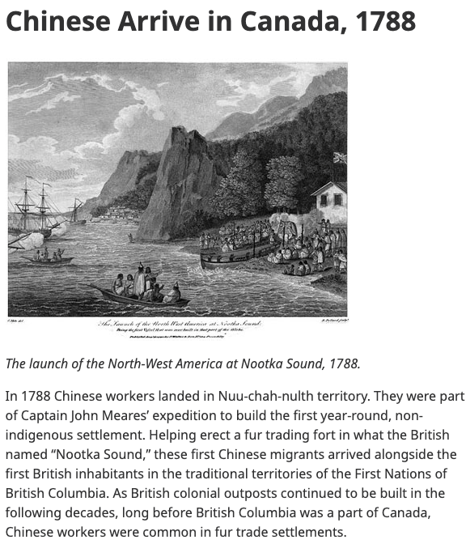
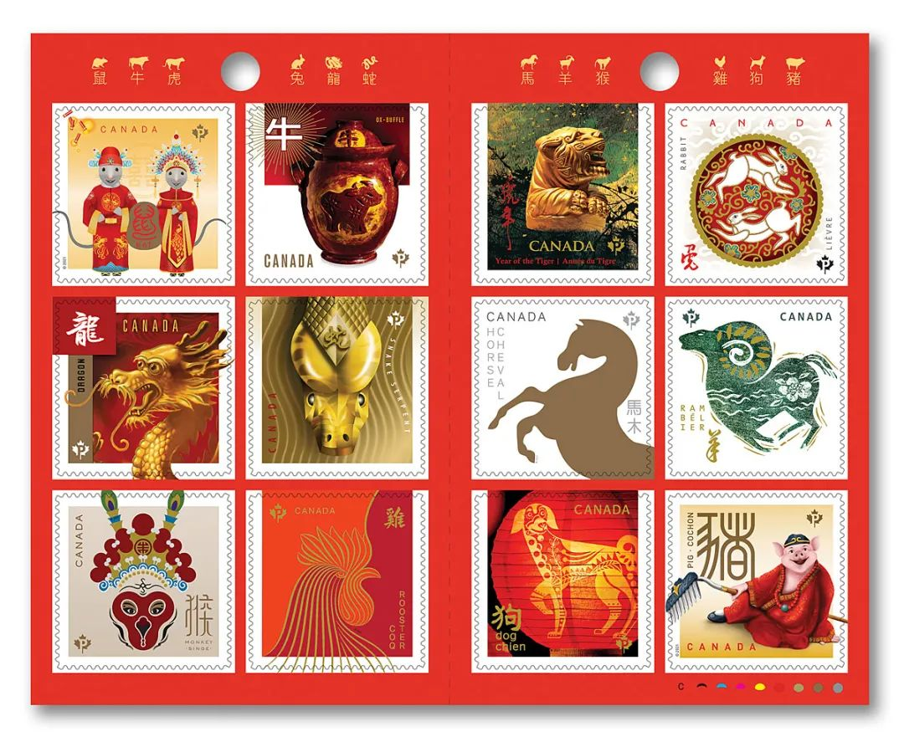
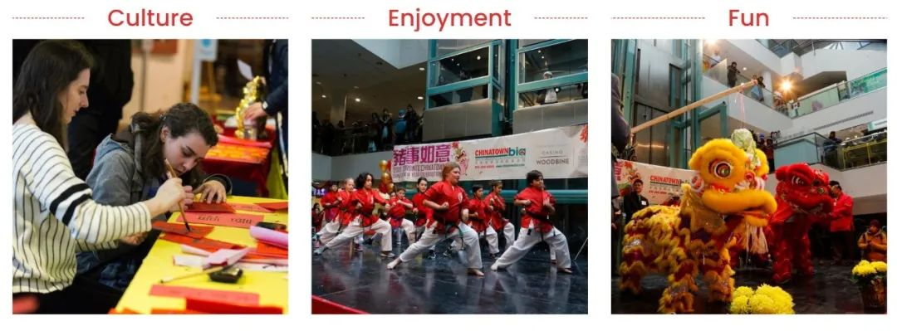
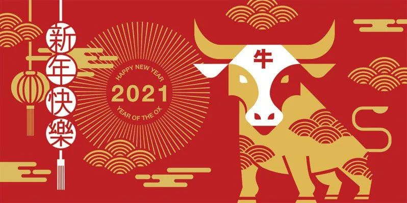

# 无标题

**链接地址:** http://mp.weixin.qq.com/s?__biz=MjM5MDEzNzY2NQ==&mid=2652807828&idx=1&sn=d0a0cb227692cf9e0b869f3ea19c42b8&chksm=bda36eba8ad4e7ac62ddac713225cde43a3bb4374072598cc6075e39226e0686b8a05b74bf84&mpshare=1&scene=2&srcid=0211ilafGBXILKtC923d6vmW&sharer_sharetime=1612998165707&sharer_shareid=be1c8edd6c93eec155a61c876e41d26a#rd
**作者:** 妮娜&丁其
**获取时间:** 2025/8/28 19:55:32
**图片数量:** 21

---

## 原始HTML内容

<section style="box-sizing: border-box;font-style: normal;text-align: justify;" data-mpa-powered-by="yiban.io"><section style="margin: 10px 0%;box-sizing: border-box;" powered-by="xiumi.us"><section style="letter-spacing: 0px;line-height: 2;padding: 0px 15px;box-sizing: border-box;">
<a target="_blank" href="https://mp.weixin.qq.com/s?__biz=MjM5MDEzNzY2NQ==&amp;mid=2652805377&amp;idx=2&amp;sn=218f8d5c0d7a85f12a715b5da06b1060&amp;scene=21#wechat_redirect" textvalue="你已选中了添加链接的内容" tab="innerlink" data-linktype="1"></a>

+++++上方是广告+++++‍‍‍‍‍‍‍‍‍‍‍‍‍‍‍‍‍

 

<strong>2021年牛年<strong style="box-sizing: border-box;">春节到了</strong></strong>

 

今年，加拿大的华人特别有面子

 

 

总理特鲁多刚刚送上

中国新年祝福！

 

不但

开始第一句用普通话说 
<section style="font-size: 15px;font-weight: 400;text-align: center;white-space: normal;margin: 0px 16px;padding: 0px;box-sizing: border-box;line-height: 3em;"><strong>“新年快乐！”</strong> </section><section style="text-align: center;white-space: normal;margin: 0px 16px;padding: 0px;box-sizing: border-box;line-height: 2em;">还对华人在大流行中的抗疫</section><section style="font-size: 15px;font-weight: 400;text-align: center;white-space: normal;margin: 0px 16px;padding: 0px;box-sizing: border-box;line-height: 2em;">大加表扬！</section><section style="font-size: 15px;font-weight: 400;text-align: center;white-space: normal;margin: 0px 16px;padding: 0px;box-sizing: border-box;line-height: 2em;">肯定华人的成绩</section><section style="font-size: 15px;font-weight: 400;text-align: center;line-height: 2em;margin-left: 16px;margin-right: 16px;"><strong>感谢加拿大华人</strong></section><section style="font-size: 15px;font-weight: 400;text-align: center;line-height: 2em;margin-left: 16px;margin-right: 16px;"><strong>从疫情开始就做出的无私奉献，</strong></section><section style="font-size: 15px;font-weight: 400;text-align: center;line-height: 2em;margin-left: 16px;margin-right: 16px;">并祝愿大家都平安，健康，生活中充满爱。</section><section style="font-size: 15px;font-weight: 400;text-align: center;line-height: 2em;margin-left: 16px;margin-right: 16px;"> </section><section style="font-size: 15px;font-weight: 400;text-align: center;line-height: 2em;margin-left: 16px;margin-right: 16px;">最后，总理还用粤语说结尾： </section><section style="font-size: 15px;font-weight: 400;text-align: center;line-height: 2em;margin-left: 16px;margin-right: 16px;"><strong>“新年快乐！”</strong></section><section style="font-size: 15px;font-weight: 400;text-align: center;white-space: normal;margin: 0px 16px;padding: 0px;box-sizing: border-box;line-height: 2em;">下面看看总理特鲁多</section><section style="font-size: 15px;font-weight: 400;text-align: center;white-space: normal;margin: 0px 16px;padding: 0px;box-sizing: border-box;line-height: 2em;">在牛年向华人的</section><section style="font-size: 15px;font-weight: 400;text-align: center;white-space: normal;margin: 0px 16px;padding: 0px;box-sizing: border-box;line-height: 2em;">新年祝福视频：</section><section style="font-size: 15px;font-weight: 400;text-align: center;white-space: normal;margin: 0px 16px;padding: 0px;box-sizing: border-box;line-height: 2em;"> </section><section class="channels_iframe_wrp"><mpvideosnap class="js_uneditable custom_select_card channels_iframe" data-pluginname="videosnap" data-id="export/UzFfAgtgekIEAQAAAAAAQ5kFoQMS5QAAAAstQy6ubaLX4KHWvLEZgBPE1JJof0pieob4zNPgMIvESrRa9IuM3E0ugWztTtTc" data-url="https://findermp.video.qq.com/251/20350/stodownload?encfilekey=XGocBFxVWK5dcyOOqpEU4yzyhTS7AsF7CBhWdPpyNhOcqCiah5aOqBibkbfnQyUDLxv0vKWicwlhm5d0Q29ia7BBvSzQSGvBOpfYvZkWLzcpetEZkvPiaGic7gqvTb7qxBnsMhZGB2gYiblTgtZXBAu4lXzVzzfMnXUAtPbELeexD32rfUOkuJicia7cd6Q&amp;adaptivelytrans=0&amp;bizid=1023&amp;dotrans=0&amp;hy=HK&amp;idx=1&amp;m=f664824b638d371f4fa2515842e32ce2&amp;token=x5Y29zUxcibDL4kjgECWmgZMBGNMEbSuN8Mdwl4YTqcABw4ic2QCgCEGeh9Rxx7xbL" data-headimgurl="http://wx.qlogo.cn/finderhead/kMaz9nc8bgIs9o8cUnHIS0HMadlW2F13HlBRCx0pQ3NhvVhh0THzBg/0" data-username="v2_060000231003b20faec8c7eb811acad1c900ec33b077138aa668874921be7a405ebce1a58797@finder" data-nickname="加拿大超级生活CA" data-desc="加拿大总理给大家拜年啦！中文新年快乐说得很标准

加拿大总理特鲁多给华人拜年啦！中文新年快乐说得老标准了。他感谢加拿大华人从疫情开始就做出的无私奉献，并祝愿大家都平安，健康，生活中充满爱。。。

其实2016年6月1日起，加拿大议会就通过了提案，将中国的春节（ Chinese New Year ）也就是大年初一这一天，规定为加拿大的法定节日！虽然没有放假，但是对华人传统节日的认可和支持。

在这里超级生活也祝各位在加拿大努力宅家的小伙伴牛年大吉，健康如意，百毒不侵！

@微信时刻 #加拿大 #加拿大生活 #春节 #加拿大新鲜事 #特鲁多 #海外华人" data-nonceid="18176913586327920235" data-type="video"></mpvideosnap></section><section style="font-size: 15px;font-weight: 400;text-align: center;white-space: normal;margin: 0px 16px;padding: 0px;box-sizing: border-box;line-height: 2em;"> </section><section style="font-size: 15px;font-weight: 400;text-align: center;white-space: normal;margin: 0px 16px;padding: 0px;box-sizing: border-box;line-height: 2em;">来看看中英对照全文</section><section style="font-size: 15px;font-weight: 400;text-align: center;white-space: normal;margin: 0px 16px;padding: 0px;box-sizing: border-box;line-height: 2em;">↓↓</section><section style="line-height: 2em;margin-left: 16px;margin-right: 16px;">加拿大总理特鲁多在视频开始，<strong>用非常标准的中文说：“新年快乐！” </strong>然后用英语祝贺：<strong>Happy New Year Everyone！</strong></section><section style="line-height: 2em;margin-left: 16px;margin-right: 16px;"> </section><section style="line-height: 2em;margin-left: 16px;margin-right: 16px;">“这周<strong>我们与加拿大和全球华人社区一起，</strong><strong>共同庆祝春节</strong>，同时喜迎牛年。”</section><section style="line-height: 2em;margin-left: 16px;margin-right: 16px;">（This week, we join Chinese communities in Canada and around the world to celebrate the Spring Festival to welcome the year of the OX ）</section><section style="line-height: 2em;margin-left: 16px;margin-right: 16px;"> </section><section style="line-height: 2em;margin-left: 16px;margin-right: 16px;">牛，是一种很有价值的动物。<strong>TA们被视为勤奋，诚实和坚韧的象征。</strong></section><section style="line-height: 2em;margin-left: 16px;margin-right: 16px;">（The Ox is a vlued animal. It is seen as hard working, honest and persevere）</section><section style="line-height: 2em;margin-left: 16px;margin-right: 16px;"> </section><section style="line-height: 2em;margin-left: 16px;margin-right: 16px;">今年，当我们不得不继续和新冠疫情的影响作斗争时。我不禁会想到<strong>那些用尽洪荒之力来保证我们安全的人们</strong>。</section><section style="line-height: 2em;margin-left: 16px;margin-right: 16px;">&nbsp;（And this year as we continue to deal with the impacts of Covid -19, I can't help but think of those who are working hard to keep us all safe.）</section><section style="line-height: 2em;margin-left: 16px;margin-right: 16px;"> </section><section style="line-height: 2em;margin-left: 16px;margin-right: 16px;">自从大流行一开始，<strong>加拿大华人就用多种方式为我们的集体抗疫努力做出了很多贡献！</strong>因此，当中国新年来临之际， <strong>让我们感谢许许多多加拿大华人！是他们，把别人的利益和安危看得比自己的更重。</strong></section><section style="line-height: 2em;margin-left: 16px;margin-right: 16px;">（Since the start of the pandemic, Chinese Canadians have contributed to our collective effort&nbsp; in SO MANY WAYS! So as we kick off the Chinese New Year. Let's give thanks to the many Chinese Canadians who are stepping up to put others before themselves. ）</section><section style="line-height: 2em;margin-left: 16px;margin-right: 16px;"> </section><section style="line-height: 2em;margin-left: 16px;margin-right: 16px;">值此新春佳节之际，让我代表全家，和我夫人苏菲一起，祝愿所有人。<strong>祝大家平安，健康，生活充满爱！</strong></section><section style="line-height: 2em;margin-left: 16px;margin-right: 16px;">（From out family to yours, Sophie and I&nbsp; wish every one celebrating ! Peace, Health &amp; Love this year and beyond.）</section><section style="line-height: 2em;margin-left: 16px;margin-right: 16px;"> </section><section style="line-height: 2em;margin-left: 16px;margin-right: 16px;">（粤语）<strong>新年快乐！</strong>Sun Ning Fat Lo</section><section style="line-height: 2em;margin-left: 16px;margin-right: 16px;"> </section><section style="white-space: normal;font-size: 15px;text-align: center;line-height: 2em;margin-left: 16px;margin-right: 16px;">总理的普通话说得很标准</section><section style="white-space: normal;font-size: 15px;text-align: center;line-height: 2em;margin-left: 16px;margin-right: 16px;">但粤语却是10级水平都听不出来</section><section style="white-space: normal;font-size: 15px;text-align: center;line-height: 2em;margin-left: 16px;margin-right: 16px;">到底是说：新年快乐</section><section style="white-space: normal;font-size: 15px;text-align: center;line-height: 2em;margin-left: 16px;margin-right: 16px;">还是</section><section style="white-space: normal;font-size: 15px;text-align: center;line-height: 2em;margin-left: 16px;margin-right: 16px;">祝您快乐？</section><section style="font-size: 15px;font-weight: 400;text-align: center;white-space: normal;margin: 0px 16px;padding: 0px;box-sizing: border-box;line-height: 2em;"> </section><section style="font-size: 15px;font-weight: 400;text-align: center;white-space: normal;margin: 0px 16px;padding: 0px;box-sizing: border-box;line-height: 2em;">不过</section><section style="font-size: 15px;font-weight: 400;white-space: normal;text-align: center;line-height: 2em;margin-left: 16px;margin-right: 16px;">作为加拿大的华人 </section><section style="font-size: 15px;font-weight: 400;white-space: normal;text-align: center;line-height: 2em;margin-left: 16px;margin-right: 16px;">这一刻是不是&nbsp;<strong>倍感骄傲?</strong></section><section style="font-size: 15px;font-weight: 400;white-space: normal;text-align: center;line-height: 2em;margin-left: 16px;margin-right: 16px;"> </section></section></section><section style="font-size: 16px;font-weight: 400;text-align: center;margin: 10px 16px;box-sizing: border-box;line-height: 2em;"><section style="max-width: 100%;vertical-align: middle;display: inline-block;line-height: 0;box-sizing: border-box;"></section></section><section style="font-size: 16px;font-weight: 400;margin: 10px 0%;box-sizing: border-box;" powered-by="xiumi.us"><section style="font-size: 15px;letter-spacing: 0px;line-height: 2;padding: 0px 15px;box-sizing: border-box;"><section style="white-space: normal;margin: 0px 16px;padding: 0px;box-sizing: border-box;line-height: 2em;"> </section><section style="text-align: center;white-space: normal;margin: 0px 16px;padding: 0px;box-sizing: border-box;line-height: 2em;">今年的<strong style="box-sizing: border-box;">春节有点特殊</strong></section><section style="text-align: center;white-space: normal;margin: 0px 16px;padding: 0px;box-sizing: border-box;line-height: 2em;">身在加拿大朋友们</section><section style="text-align: center;white-space: normal;margin: 0px 16px;padding: 0px;box-sizing: border-box;line-height: 2em;">受到疫情的影响而不得不宅家安度</section><section style="text-align: center;white-space: normal;margin: 0px 16px;padding: 0px;box-sizing: border-box;line-height: 2em;"> </section></section></section><section style="font-size: 16px;font-weight: 400;text-align: center;margin: 10px 16px;box-sizing: border-box;line-height: 2em;"><section style="max-width: 100%;vertical-align: middle;display: inline-block;line-height: 0;box-sizing: border-box;"></section></section><section style="font-size: 16px;font-weight: 400;margin: 10px 0%;box-sizing: border-box;" powered-by="xiumi.us"><section style="font-size: 15px;letter-spacing: 0px;line-height: 2;padding: 0px 15px;box-sizing: border-box;"><section style="white-space: normal;margin: 0px 16px;padding: 0px;box-sizing: border-box;line-height: 2em;"> </section><section style="text-align: center;white-space: normal;margin: 0px 16px;padding: 0px;box-sizing: border-box;line-height: 2em;">晚会仪式等庆祝活动受影响不得不取消</section><section style="text-align: center;white-space: normal;margin: 0px 16px;padding: 0px;box-sizing: border-box;line-height: 2em;">走亲访友吃顿团年饭也不能如意举办 </section><section style="text-align: center;white-space: normal;margin: 0px 16px;padding: 0px;box-sizing: border-box;line-height: 2em;">连出门逛个街采买点年货都得小心翼翼的</section><section style="text-align: center;white-space: normal;margin: 0px 16px;padding: 0px;box-sizing: border-box;line-height: 2em;">更别说打个飞的跑到沙滩海岛去度假这种百日梦</section><section style="text-align: center;white-space: normal;margin: 0px 16px;padding: 0px;box-sizing: border-box;line-height: 2em;"> </section></section></section><section style="font-size: 16px;font-weight: 400;text-align: center;margin: 10px 16px;box-sizing: border-box;line-height: 2em;"><section style="max-width: 100%;vertical-align: middle;display: inline-block;line-height: 0;box-sizing: border-box;"></section></section><section style="font-size: 16px;font-weight: 400;margin: 10px 0%;box-sizing: border-box;" powered-by="xiumi.us"><section style="font-size: 15px;letter-spacing: 0px;line-height: 2;padding: 0px 15px;box-sizing: border-box;"><section style="white-space: normal;margin: 0px 16px;padding: 0px;box-sizing: border-box;line-height: 2em;"> </section><section style="text-align: center;white-space: normal;margin: 0px 16px;padding: 0px;box-sizing: border-box;line-height: 2em;">或许在家熬夜看看<strong style="box-sizing: border-box;">网络直播的春晚</strong></section><section style="text-align: center;white-space: normal;margin: 0px 16px;padding: 0px;box-sizing: border-box;line-height: 2em;">才是今年春节的正确打开方式</section><section style="text-align: center;white-space: normal;margin: 0px 16px;padding: 0px;box-sizing: border-box;line-height: 2em;"> </section><section style="text-align: center;white-space: normal;margin: 0px 16px;padding: 0px;box-sizing: border-box;line-height: 2em;">但如果不是疫情的关系</section><section style="text-align: center;white-space: normal;margin: 0px 16px;padding: 0px;box-sizing: border-box;line-height: 2em;"><strong style="box-sizing: border-box;">加拿大的春节本应该是相当热闹的</strong></section><section style="text-align: center;white-space: normal;margin: 0px 16px;padding: 0px;box-sizing: border-box;line-height: 2em;"><strong style="box-sizing: border-box;"> </strong></section></section></section><section style="font-size: 16px;font-weight: 400;text-align: center;margin: 10px 16px;box-sizing: border-box;line-height: 2em;"><section style="max-width: 100%;vertical-align: middle;display: inline-block;line-height: 0;box-sizing: border-box;"></section></section><section style="font-size: 16px;font-weight: 400;margin: 10px 0%;box-sizing: border-box;" powered-by="xiumi.us"><section style="font-size: 15px;letter-spacing: 0px;line-height: 1;padding: 0px 15px;box-sizing: border-box;"><section style="white-space: normal;margin: 0px 16px;padding: 0px;box-sizing: border-box;line-height: 2em;">2020年于加拿大西埃德蒙顿商场举办的春节庆祝活动。图片来源：wikipedia</section></section></section><section style="font-size: 16px;font-weight: 400;margin: 10px 0%;box-sizing: border-box;" powered-by="xiumi.us"><section style="font-size: 15px;letter-spacing: 0px;line-height: 2;padding: 0px 15px;box-sizing: border-box;"><section style="text-align: center;white-space: normal;margin: 0px 16px;padding: 0px;box-sizing: border-box;line-height: 2em;"> </section><section style="text-align: center;white-space: normal;margin: 0px 16px;padding: 0px;box-sizing: border-box;line-height: 2em;">加拿大的春节</section><section style="text-align: center;white-space: normal;margin: 0px 16px;padding: 0px;box-sizing: border-box;line-height: 2em;">画风是这样婶儿的！</section><section style="text-align: center;white-space: normal;margin: 0px 16px;padding: 0px;box-sizing: border-box;line-height: 2em;"><strong style="box-sizing: border-box;">白人舞狮的“中国风”居然也没啥违和感</strong></section><section style="text-align: center;white-space: normal;margin: 0px 16px;padding: 0px;box-sizing: border-box;line-height: 2em;"> </section><section style="text-align: center;white-space: normal;margin: 0px 16px;padding: 0px;box-sizing: border-box;line-height: 2em;">为啥？</section><section style="text-align: center;white-space: normal;margin: 0px 16px;padding: 0px;box-sizing: border-box;line-height: 2em;"><strong style="box-sizing: border-box;">因为咱们的春节</strong></section><section style="text-align: center;white-space: normal;margin: 0px 16px;padding: 0px;box-sizing: border-box;line-height: 2em;"><strong style="box-sizing: border-box;">可是正经的加拿大法定节日！</strong></section></section></section><section style="font-size: 16px;font-weight: 400;text-align: center;margin: 10px 16px;box-sizing: border-box;line-height: 2em;"> </section><section style="font-size: 16px;font-weight: 400;margin: 10px 0%;box-sizing: border-box;" powered-by="xiumi.us"><section style="font-size: 15px;letter-spacing: 0px;line-height: 2;padding: 0px 15px;box-sizing: border-box;"><section style="line-height: 2em;margin-left: 16px;margin-right: 16px;">2016年6月1日，加拿大国会通过第38号动议，将每年农历正月初一到十五命名为<strong>“春节”（Spring Festival）</strong>，也就是规定为加拿大的法定节日！</section></section></section><section style="font-size: 16px;font-weight: 400;margin: 10px 0%;box-sizing: border-box;" powered-by="xiumi.us"><section style="font-size: 15px;letter-spacing: 0px;line-height: 2;padding: 0px 15px;box-sizing: border-box;"><section style="white-space: normal;margin: 0px 16px;padding: 0px;box-sizing: border-box;line-height: 2em;"> </section><section style="white-space: normal;margin: 0px 16px;padding: 0px;box-sizing: border-box;line-height: 2em;">尽管春节还不是加拿大的法定公共假日，无法享受到带薪休假的优待，<strong style="box-sizing: border-box;">但许多拥有中华文化背景的企业都会在这天停业休息或者提前结束营业，甚至为拥有中华文化背景的员工赠送节日礼品和红包奖金等等。</strong></section><section style="white-space: normal;margin: 0px 16px;padding: 0px;box-sizing: border-box;line-height: 2em;"><strong style="box-sizing: border-box;"> </strong></section></section></section><section style="font-size: 16px;font-weight: 400;text-align: center;margin: 10px 16px;box-sizing: border-box;line-height: 2em;"><section style="max-width: 100%;vertical-align: middle;display: inline-block;line-height: 0;box-sizing: border-box;padding: 0px 0.5em;"></section></section><section style="font-size: 16px;font-weight: 400;margin: 10px 0%;box-sizing: border-box;" powered-by="xiumi.us"><section style="font-size: 15px;letter-spacing: 0px;line-height: 1;padding: 0px 15px;box-sizing: border-box;"><section style="text-align: center;white-space: normal;margin: 0px 16px;padding: 0px;box-sizing: border-box;line-height: 2em;">特鲁多总理与自由党国会议员于豪门宴举办2020春节团拜会 </section><section style="white-space: normal;margin: 0px 16px;padding: 0px;box-sizing: border-box;line-height: 2em;"> </section></section></section><section style="font-size: 16px;font-weight: 400;margin: 10px 0%;box-sizing: border-box;" powered-by="xiumi.us"><section style="font-size: 15px;letter-spacing: 0px;line-height: 2;padding: 0px 15px;box-sizing: border-box;"><section style="white-space: normal;margin: 0px 16px;padding: 0px;box-sizing: border-box;line-height: 2em;">无论是各地的政府机构还是商业组织，都免不了在这个节日组织包括年会、舞狮、烟花、集市在内的丰富活动进行庆祝；向在加拿大的华人群体，用（蹩脚的）中文送来<strong style="letter-spacing: 0px;box-sizing: border-box;">满怀诚意的祝贺</strong>。 </section><section style="white-space: normal;margin: 0px 16px;padding: 0px;box-sizing: border-box;line-height: 2em;"> </section><section style="white-space: normal;margin: 0px 16px;padding: 0px;box-sizing: border-box;line-height: 2em;"><strong style="box-sizing: border-box;">每每看到这样的景象，作为中华儿女的眼中总是饱含着感动的泪光，为祖国的繁荣和文化的强盛感到自豪骄傲。</strong></section><section style="white-space: normal;margin: 0px 16px;padding: 0px;box-sizing: border-box;line-height: 2em;"><strong style="box-sizing: border-box;"> </strong></section></section></section><section style="font-size: 16px;font-weight: 400;text-align: center;margin: 10px 16px;box-sizing: border-box;line-height: 2em;"><section style="max-width: 100%;vertical-align: middle;display: inline-block;line-height: 0;box-sizing: border-box;"></section></section><section style="font-size: 16px;font-weight: 400;margin: 10px 0%;box-sizing: border-box;" powered-by="xiumi.us"><section style="font-size: 15px;letter-spacing: 0px;line-height: 2;padding: 0px 15px;box-sizing: border-box;"><section style="white-space: normal;margin: 0px 16px;padding: 0px;box-sizing: border-box;line-height: 2em;"> </section><section style="white-space: normal;margin: 0px 16px;padding: 0px;box-sizing: border-box;line-height: 2em;">目前加拿大华裔已成为<strong style="box-sizing: border-box;">加拿大第三大族裔</strong>，根据2016年的人口普查数据，华裔<strong style="box-sizing: border-box;">人口数量占据到了加拿大总人口的5.1%，已超过180万人。</strong></section><section style="white-space: normal;margin: 0px 16px;padding: 0px;box-sizing: border-box;line-height: 2em;"> </section><section style="white-space: normal;margin: 0px 16px;padding: 0px;box-sizing: border-box;line-height: 2em;"><strong style="box-sizing: border-box;"></strong>然而，华人在加拿大的发迹史，却并非一帆风顺，而是满怀心酸血泪。</section><section style="white-space: normal;margin: 0px 16px;padding: 0px;box-sizing: border-box;line-height: 2em;"> </section><section style="text-align: center;padding: 0px 0.5em;line-height: 2em;margin-left: 16px;margin-right: 16px;"></section><section style="white-space: normal;margin: 0px 16px;padding: 0px;box-sizing: border-box;line-height: 2em;"></section><section style="white-space: normal;margin: 0px 16px;padding: 0px;box-sizing: border-box;line-height: 2em;"> </section><section style="white-space: normal;margin: 0px 16px;padding: 0px;box-sizing: border-box;line-height: 2em;">第一批在加拿大定居的中国人是<strong style="box-sizing: border-box;">50名工匠</strong>，他们于1788年跟随约翰·梅雷斯（John Meares）上尉，来到加拿大建立了一个贸易站，以扩长中国广州和卑诗省之间的毛皮贸易。</section><section style="white-space: normal;margin: 0px 16px;padding: 0px;box-sizing: border-box;line-height: 2em;"> </section></section></section><section style="font-size: 16px;font-weight: 400;text-align: center;padding: 0px 0.5em;line-height: 2em;margin-left: 16px;margin-right: 16px;"></section><section style="font-size: 16px;font-weight: 400;margin: 10px 0%;box-sizing: border-box;" powered-by="xiumi.us"><section style="font-size: 15px;letter-spacing: 0px;line-height: 1;padding: 0px 15px;box-sizing: border-box;"><section style="text-align: center;white-space: normal;margin: 0px 16px;padding: 0px;box-sizing: border-box;line-height: 2em;"></section><section style="white-space: normal;margin: 0px 16px;padding: 0px;box-sizing: border-box;line-height: 2em;">1858年，卑诗省菲莎河淘金热开始吸引来自旧金山的中国移民。</section><section style="white-space: normal;margin: 0px 16px;padding: 0px;box-sizing: border-box;line-height: 2em;"><strong style=""> </strong></section><section style="white-space: normal;margin: 0px 16px;padding: 0px;box-sizing: border-box;line-height: 2em;"><strong style="">1860年，加拿大华人人口已增长到7000多人。</strong></section><section style="white-space: normal;margin: 0px 16px;padding: 0px;box-sizing: border-box;line-height: 2em;"><strong style=""> </strong></section><section style="text-align: center;padding: 0px 0.5em;line-height: 2em;margin-left: 16px;margin-right: 16px;"></section><section style="white-space: normal;margin: 0px 16px;padding: 0px;box-sizing: border-box;line-height: 2em;"><strong style=""> </strong></section><section style="white-space: normal;margin: 0px 16px;padding: 0px;box-sizing: border-box;line-height: 2em;"><strong style=""></strong></section><section style="white-space: normal;margin: 0px 16px;padding: 0px;box-sizing: border-box;line-height: 2em;">这些最初的移民中有很大一部分是来自中国南方的年轻农民，他们被带到加拿大修建加拿大太平洋铁路。</section><section style="white-space: normal;margin: 0px 16px;padding: 0px;box-sizing: border-box;line-height: 2em;"> </section><section style="margin: 10px 16px;font-size: 16px;white-space: normal;text-align: center;line-height: 2em;"><section style="padding-right: 0.5em;padding-left: 0.5em;vertical-align: middle;display: inline-block;line-height: 0;"></section></section><section powered-by="xiumi.us" style="margin-top: 10px;margin-bottom: 10px;font-size: 16px;white-space: normal;"><section style="padding-right: 15px;padding-left: 15px;font-size: 15px;letter-spacing: 0px;line-height: 1;"><section style="text-align: center;line-height: 2em;margin-left: 16px;margin-right: 16px;">修建修建加拿大太平洋铁路的中国工人,wikipedia</section></section></section><section style="white-space: normal;margin: 0px 16px;padding: 0px;box-sizing: border-box;line-height: 2em;"> </section><section style="white-space: normal;margin: 0px 16px;padding: 0px;box-sizing: border-box;line-height: 2em;">这一批移民远渡重洋，在加拿大经历了残酷的压迫与歧视，却坚强地发展壮大起来，从此<strong style="">建立起了第一个华人社区</strong>，将中华名族的灿烂文化和传统发扬在加拿大这篇遥远的土地上。</section><section style="white-space: normal;margin: 0px 16px;padding: 0px;box-sizing: border-box;line-height: 2em;"> </section><section style="text-align: center;padding: 0px 0.5em;line-height: 2em;margin-left: 16px;margin-right: 16px;"></section><section style="white-space: normal;margin: 0px 16px;padding: 0px;box-sizing: border-box;line-height: 2em;"></section></section></section><section style="font-size: 16px;font-weight: 400;margin: 10px 0%;box-sizing: border-box;" powered-by="xiumi.us"><section style="font-size: 15px;letter-spacing: 0px;line-height: 2;padding: 0px 15px;box-sizing: border-box;"><section style="white-space: normal;margin: 0px 16px;padding: 0px;box-sizing: border-box;line-height: 2em;">近些年来，加拿大本国对于春节的庆祝也是越来越看重。<strong style="box-sizing: border-box;">自1997年以来，加拿大邮政几乎每年都会为庆祝春节发布富含中国元素的邮票。</strong></section></section></section><section style="font-size: 16px;font-weight: 400;text-align: center;margin: 10px 16px;box-sizing: border-box;line-height: 2em;"><section style="max-width: 100%;vertical-align: middle;display: inline-block;line-height: 0;box-sizing: border-box;"></section></section><section style="font-size: 16px;font-weight: 400;margin: 10px 0%;box-sizing: border-box;" powered-by="xiumi.us"><section style="font-size: 15px;letter-spacing: 0px;line-height: 2;padding: 0px 15px;box-sizing: border-box;"><section style="white-space: normal;margin: 0px 16px;padding: 0px;box-sizing: border-box;line-height: 2em;"> </section><section style="white-space: normal;margin: 0px 16px;padding: 0px;box-sizing: border-box;line-height: 2em;">和那些国际时装品牌设计的匪夷所思的圈钱时尚单品相比，这些邮票设计感和艺术性都十分到位，体现出了对中国文化的崇高敬意，<strong style="box-sizing: border-box;">收藏价值满格</strong>。</section><section style="white-space: normal;margin: 0px 16px;padding: 0px;box-sizing: border-box;line-height: 2em;"> </section></section></section><section style="font-size: 16px;font-weight: 400;text-align: center;margin: 10px 16px;box-sizing: border-box;line-height: 2em;"><section style="max-width: 100%;vertical-align: middle;display: inline-block;line-height: 0;box-sizing: border-box;"></section></section><section style="font-size: 16px;font-weight: 400;margin: 10px 0%;box-sizing: border-box;" powered-by="xiumi.us"><section style="font-size: 15px;letter-spacing: 0px;line-height: 1;padding: 0px 15px;box-sizing: border-box;"><section style="white-space: normal;margin: 0px 16px;padding: 0px;box-sizing: border-box;line-height: 2em;">2020年于多伦多唐人街举办的春节庆祝活动。图片来源：chinatownbia.com </section><section style="white-space: normal;margin: 0px 16px;padding: 0px;box-sizing: border-box;line-height: 2em;"> </section></section></section><section style="font-size: 16px;font-weight: 400;margin: 10px 0%;box-sizing: border-box;" powered-by="xiumi.us"><section style="font-size: 15px;letter-spacing: 0px;line-height: 2;padding: 0px 15px;box-sizing: border-box;"><section style="white-space: normal;margin: 0px 16px;padding: 0px;box-sizing: border-box;line-height: 2em;">不同的华人组织和媒体，也会在春节前后联合本地社区举办丰富多彩的春节庆祝活动。让春节不在是华人自娱自乐的节日，而是<strong style="box-sizing: border-box;">努力“破圈”</strong>，用各种方式让中华民族的耀眼文化传播到加拿大本地人的生活中。</section><section style="white-space: normal;margin: 0px 16px;padding: 0px;box-sizing: border-box;line-height: 2em;"> </section></section></section><section style="font-size: 16px;font-weight: 400;box-sizing: border-box;line-height: 2em;margin-left: 16px;margin-right: 16px;"><section style="display: flex;flex-flow: row nowrap;margin: 10px 0%;box-sizing: border-box;"><section style="display: inline-block;vertical-align: middle;width: auto;flex: 100 100 0%;align-self: center;height: auto;box-sizing: border-box;"><section style="transform: perspective(0px);-webkit-transform: perspective(0px);-moz-transform: perspective(0px);-o-transform: perspective(0px);transform-style: flat;box-sizing: border-box;" powered-by="xiumi.us"><section style="margin: 0px 0%;transform: rotateY(180deg);-webkit-transform: rotateY(180deg);-moz-transform: rotateY(180deg);-o-transform: rotateY(180deg);box-sizing: border-box;"><section style="background-image: linear-gradient(to right, rgb(255, 63, 64) 0%, rgba(255, 63, 64, 0.5) 100%);height: 3px;box-sizing: border-box;"><section><svg viewBox="0 0 1 1" style="float:left;line-height:0;width:0;vertical-align:top;"></svg></section></section></section></section></section><section style="display: inline-block;vertical-align: middle;width: auto;align-self: center;flex: 0 0 0%;height: auto;margin: -12px -1px 0px;box-sizing: border-box;"><section style="transform: rotateZ(45deg);-webkit-transform: rotateZ(45deg);-moz-transform: rotateZ(45deg);-o-transform: rotateZ(45deg);box-sizing: border-box;" powered-by="xiumi.us"><section style="text-align: center;margin: 11px 0% 0px;justify-content: center;box-sizing: border-box;"><section style="display: inline-block;width: 40px;height: 40px;vertical-align: top;overflow: hidden;box-shadow: rgb(0, 0, 0) 0px 0px 0px;border-radius: 0%;border-width: 1px;border-style: none;border-color: rgb(243, 227, 181);background-color: rgb(246, 44, 44);box-sizing: border-box;"><section style="transform: rotateZ(315deg);-webkit-transform: rotateZ(315deg);-moz-transform: rotateZ(315deg);-o-transform: rotateZ(315deg);box-sizing: border-box;" powered-by="xiumi.us"><section style="margin: 6px 0% 0px;justify-content: center;box-sizing: border-box;"><section style="max-width: 100%;vertical-align: middle;display: inline-block;line-height: 0;width: 70%;height: auto;border-width: 0px;box-sizing: border-box;"></section></section></section></section></section></section></section><section style="display: inline-block;vertical-align: middle;width: auto;align-self: center;flex: 100 100 0%;box-sizing: border-box;"><section style="margin: 0px 0%;box-sizing: border-box;" powered-by="xiumi.us"><section style="background-image: linear-gradient(to right, rgb(255, 63, 64) 0%, rgba(255, 63, 64, 0.5) 100%);height: 3px;box-sizing: border-box;"><section><svg viewBox="0 0 1 1" style="float:left;line-height:0;width:0;vertical-align:top;"></svg></section></section></section></section></section></section><section style="font-size: 16px;font-weight: 400;margin: 10px 0%;box-sizing: border-box;" powered-by="xiumi.us"><section style="font-size: 15px;letter-spacing: 0px;line-height: 2;padding: 0px 15px;box-sizing: border-box;"><section style="white-space: normal;margin: 0px 16px;padding: 0px;box-sizing: border-box;line-height: 2em;"> </section><section style="white-space: normal;margin: 0px 16px;padding: 0px;box-sizing: border-box;line-height: 2em;">回顾华人在加拿大这边土地上扎根奋斗的历史，心中却满怀着感慨。感叹这一路走来的艰辛不易，越发为今日华人在加国获取到<strong style="box-sizing: border-box;">来之不易的社会地位所珍惜感恩</strong>。</section><section style="white-space: normal;margin: 0px 16px;padding: 0px;box-sizing: border-box;line-height: 2em;"> </section></section></section><section style="font-size: 16px;font-weight: 400;text-align: center;margin: 10px 16px;box-sizing: border-box;line-height: 2em;"><section style="max-width: 100%;vertical-align: middle;display: inline-block;line-height: 0;box-sizing: border-box;"></section></section><section style="font-size: 16px;margin: 10px 0%;box-sizing: border-box;" powered-by="xiumi.us"><section style="font-size: 15px;letter-spacing: 0px;line-height: 2;padding: 0px 15px;box-sizing: border-box;"><section style="font-weight: 400;white-space: normal;margin: 0px 16px;padding: 0px;box-sizing: border-box;line-height: 2em;"> </section><section style="font-weight: 400;white-space: normal;margin: 0px 16px;padding: 0px;box-sizing: border-box;line-height: 2em;"><strong style="box-sizing: border-box;">今天，在牛年到来之际，加拿大总理特鲁多用中文向大家拜年，肯定华人对加拿大做出的贡献，让我们华人倍感骄傲。 </strong></section><section style="font-weight: 400;white-space: normal;margin: 0px 16px;padding: 0px;box-sizing: border-box;line-height: 2em;"><strong style="box-sizing: border-box;"> </strong></section><section style="text-align: center;padding: 0px 0.5em;line-height: 2em;margin-left: 16px;margin-right: 16px;"></section><section style="font-weight: 400;white-space: normal;margin: 0px 16px;padding: 0px;box-sizing: border-box;line-height: 2em;"><strong style="box-sizing: border-box;"></strong> </section><section style="font-weight: 400;white-space: normal;margin: 0px 16px;padding: 0px;box-sizing: border-box;line-height: 2em;"><strong style="box-sizing: border-box;"> </strong></section><section style="font-weight: 400;font-size: 15px;white-space: normal;text-align: center;line-height: 2em;margin-left: 16px;margin-right: 16px;">高清原视频：</section><section style="font-weight: 400;font-size: 15px;white-space: normal;line-height: 2em;margin-left: 16px;margin-right: 16px;"><iframe class="video_iframe rich_pages" data-vidtype="2" data-mpvid="wxv_1734690551779622914" data-cover="http%3A%2F%2Fmmbiz.qpic.cn%2Fmmbiz_jpg%2FicDcCacWsN1VXg7zRNEY0Q1ANicfVgviaZNGxoWnd8oRquiaTgmLTufPdUL1CctvlEMlT1seVNHPQHPWqSSgP8kINw%2F0%3Fwx_fmt%3Djpeg" allowfullscreen="" frameborder="0" data-ratio="1.7777777777777777" data-w="1504" data-src="https://mp.weixin.qq.com/mp/readtemplate?t=pages/video_player_tmpl&amp;action=mpvideo&amp;auto=0&amp;vid=wxv_1734690551779622914"></iframe></section><section style="font-weight: 400;white-space: normal;margin: 0px 16px;padding: 0px;box-sizing: border-box;text-align: center;line-height: 2em;"><strong style="box-sizing: border-box;">最后，给我们超级生活的读者朋友们拜个年！</strong></section><section style="font-weight: 400;white-space: normal;margin: 0px 16px;padding: 0px;box-sizing: border-box;text-align: center;line-height: 2em;"><strong style="box-sizing: border-box;">祝大家</strong></section><section style="font-weight: 400;white-space: normal;margin: 0px 16px;padding: 0px;box-sizing: border-box;text-align: center;line-height: 2em;"><strong style="box-sizing: border-box;"> </strong></section><section style="font-weight: 400;white-space: normal;margin: 0px 16px;padding: 0px;box-sizing: border-box;text-align: center;line-height: 3em;"><strong style="box-sizing: border-box;"><strong style="color: rgb(171, 25, 66);font-size: 15px;text-align: center;white-space: normal;">健康快乐！</strong></strong></section><section style="white-space: normal;margin: 0px 16px;padding: 0px;box-sizing: border-box;text-align: center;line-height: 3em;"><strong>新年快乐！</strong> </section><section style="font-weight: 400;white-space: normal;margin: 0px 16px;padding: 0px;box-sizing: border-box;text-align: center;line-height: 3em;"><strong>牛气冲天！ </strong></section><section style="font-weight: 400;white-space: normal;margin: 0px 16px;padding: 0px;box-sizing: border-box;text-align: center;line-height: 2em;"> </section><section style="font-weight: 400;white-space: normal;margin: 0px 16px;padding: 0px;box-sizing: border-box;line-height: 2em;"> </section><section style="font-weight: 400;white-space: normal;margin: 0px 16px;padding: 0px;box-sizing: border-box;line-height: 2em;"><strong style="box-sizing: border-box;">文章参考来源：</strong></section><section style="font-weight: 400;white-space: normal;margin: 0px 16px;padding: 0px;box-sizing: border-box;line-height: 2em;">https://www2.gov.bc.ca/gov/content/governments/multiculturalism-anti-racism/chinese-legacy-bc/history/gold-mountain</section><section style="font-weight: 400;white-space: normal;margin: 0px 16px;padding: 0px;box-sizing: border-box;line-height: 2em;text-align: center;"> </section><section style="font-weight: 400;white-space: normal;margin: 0px 16px;padding: 0px;box-sizing: border-box;text-align: center;line-height: 2em;">+++++下方是广告+++++</section><section style="text-align: center;line-height: 2em;margin-left: 16px;margin-right: 16px;"></section><section style="font-weight: 400;white-space: normal;margin: 0px 16px;padding: 0px;box-sizing: border-box;line-height: 2em;"> </section><section style="font-family: -apple-system, system-ui, &quot;Helvetica Neue&quot;, &quot;PingFang SC&quot;, &quot;Hiragino Sans GB&quot;, &quot;Microsoft YaHei UI&quot;, &quot;Microsoft YaHei&quot;, Arial, sans-serif;font-size: 15px;letter-spacing: 0.544px;white-space: normal;text-align: center;line-height: 2em;margin-left: 16px;margin-right: 16px;">+++全加拿大华人都在关注超级生活，就差你了+++ </section><section style="font-family: -apple-system, system-ui, &quot;Helvetica Neue&quot;, &quot;PingFang SC&quot;, &quot;Hiragino Sans GB&quot;, &quot;Microsoft YaHei UI&quot;, &quot;Microsoft YaHei&quot;, Arial, sans-serif;font-size: 15px;letter-spacing: 0.544px;white-space: normal;text-align: center;line-height: 2em;margin-left: 16px;margin-right: 16px;"></section><section style="font-family: -apple-system, system-ui, &quot;Helvetica Neue&quot;, &quot;PingFang SC&quot;, &quot;Hiragino Sans GB&quot;, &quot;Microsoft YaHei UI&quot;, &quot;Microsoft YaHei&quot;, Arial, sans-serif;font-size: 15px;letter-spacing: 0.544px;white-space: normal;text-align: right;line-height: 2em;margin-left: 16px;margin-right: 16px;"><strong style="letter-spacing: 0.544px;"><strong style="letter-spacing: 0.544px;">喜欢点个“在看”&nbsp;吧</strong><strong style="letter-spacing: 0.544px;"></strong></strong></section><section style="line-height: 2em;margin-left: 16px;margin-right: 16px;"><strong style="font-size: 16px;letter-spacing: 0.544px;"></strong></section></section></section></section>

---

## 纯文本内容

+++++上方是广告+++++‍‍‍‍‍‍‍‍‍‍‍‍‍‍‍‍‍2021年牛年春节到了今年，加拿大的华人特别有面子总理特鲁多刚刚送上中国新年祝福！不但开始第一句用普通话说“新年快乐！”还对华人在大流行中的抗疫大加表扬！肯定华人的成绩感谢加拿大华人从疫情开始就做出的无私奉献，并祝愿大家都平安，健康，生活中充满爱。最后，总理还用粤语说结尾：“新年快乐！”下面看看总理特鲁多在牛年向华人的新年祝福视频：来看看中英对照全文↓↓加拿大总理特鲁多在视频开始，用非常标准的中文说：“新年快乐！” 然后用英语祝贺：Happy New Year Everyone！“这周我们与加拿大和全球华人社区一起，共同庆祝春节，同时喜迎牛年。”（This week, we join Chinese communities in Canada and around the world to celebrate the Spring Festival to welcome the year of the OX ）牛，是一种很有价值的动物。TA们被视为勤奋，诚实和坚韧的象征。（The Ox is a vlued animal. It is seen as hard working, honest and persevere）今年，当我们不得不继续和新冠疫情的影响作斗争时。我不禁会想到那些用尽洪荒之力来保证我们安全的人们。 （And this year as we continue to deal with the impacts of Covid -19, I can't help but think of those who are working hard to keep us all safe.）自从大流行一开始，加拿大华人就用多种方式为我们的集体抗疫努力做出了很多贡献！因此，当中国新年来临之际， 让我们感谢许许多多加拿大华人！是他们，把别人的利益和安危看得比自己的更重。（Since the start of the pandemic, Chinese Canadians have contributed to our collective effort  in SO MANY WAYS! So as we kick off the Chinese New Year. Let's give thanks to the many Chinese Canadians who are stepping up to put others before themselves. ）值此新春佳节之际，让我代表全家，和我夫人苏菲一起，祝愿所有人。祝大家平安，健康，生活充满爱！（From out family to yours, Sophie and I  wish every one celebrating ! Peace, Health & Love this year and beyond.）（粤语）新年快乐！Sun Ning Fat Lo总理的普通话说得很标准但粤语却是10级水平都听不出来到底是说：新年快乐还是祝您快乐？不过作为加拿大的华人这一刻是不是 倍感骄傲?今年的春节有点特殊身在加拿大朋友们受到疫情的影响而不得不宅家安度晚会仪式等庆祝活动受影响不得不取消走亲访友吃顿团年饭也不能如意举办连出门逛个街采买点年货都得小心翼翼的更别说打个飞的跑到沙滩海岛去度假这种百日梦或许在家熬夜看看网络直播的春晚才是今年春节的正确打开方式但如果不是疫情的关系加拿大的春节本应该是相当热闹的2020年于加拿大西埃德蒙顿商场举办的春节庆祝活动。图片来源：wikipedia加拿大的春节画风是这样婶儿的！白人舞狮的“中国风”居然也没啥违和感为啥？因为咱们的春节可是正经的加拿大法定节日！2016年6月1日，加拿大国会通过第38号动议，将每年农历正月初一到十五命名为“春节”（Spring Festival），也就是规定为加拿大的法定节日！尽管春节还不是加拿大的法定公共假日，无法享受到带薪休假的优待，但许多拥有中华文化背景的企业都会在这天停业休息或者提前结束营业，甚至为拥有中华文化背景的员工赠送节日礼品和红包奖金等等。特鲁多总理与自由党国会议员于豪门宴举办2020春节团拜会无论是各地的政府机构还是商业组织，都免不了在这个节日组织包括年会、舞狮、烟花、集市在内的丰富活动进行庆祝；向在加拿大的华人群体，用（蹩脚的）中文送来满怀诚意的祝贺。每每看到这样的景象，作为中华儿女的眼中总是饱含着感动的泪光，为祖国的繁荣和文化的强盛感到自豪骄傲。目前加拿大华裔已成为加拿大第三大族裔，根据2016年的人口普查数据，华裔人口数量占据到了加拿大总人口的5.1%，已超过180万人。然而，华人在加拿大的发迹史，却并非一帆风顺，而是满怀心酸血泪。第一批在加拿大定居的中国人是50名工匠，他们于1788年跟随约翰·梅雷斯（John Meares）上尉，来到加拿大建立了一个贸易站，以扩长中国广州和卑诗省之间的毛皮贸易。1858年，卑诗省菲莎河淘金热开始吸引来自旧金山的中国移民。1860年，加拿大华人人口已增长到7000多人。这些最初的移民中有很大一部分是来自中国南方的年轻农民，他们被带到加拿大修建加拿大太平洋铁路。修建修建加拿大太平洋铁路的中国工人,wikipedia这一批移民远渡重洋，在加拿大经历了残酷的压迫与歧视，却坚强地发展壮大起来，从此建立起了第一个华人社区，将中华名族的灿烂文化和传统发扬在加拿大这篇遥远的土地上。近些年来，加拿大本国对于春节的庆祝也是越来越看重。自1997年以来，加拿大邮政几乎每年都会为庆祝春节发布富含中国元素的邮票。和那些国际时装品牌设计的匪夷所思的圈钱时尚单品相比，这些邮票设计感和艺术性都十分到位，体现出了对中国文化的崇高敬意，收藏价值满格。2020年于多伦多唐人街举办的春节庆祝活动。图片来源：chinatownbia.com不同的华人组织和媒体，也会在春节前后联合本地社区举办丰富多彩的春节庆祝活动。让春节不在是华人自娱自乐的节日，而是努力“破圈”，用各种方式让中华民族的耀眼文化传播到加拿大本地人的生活中。回顾华人在加拿大这边土地上扎根奋斗的历史，心中却满怀着感慨。感叹这一路走来的艰辛不易，越发为今日华人在加国获取到来之不易的社会地位所珍惜感恩。今天，在牛年到来之际，加拿大总理特鲁多用中文向大家拜年，肯定华人对加拿大做出的贡献，让我们华人倍感骄傲。高清原视频：最后，给我们超级生活的读者朋友们拜个年！祝大家健康快乐！新年快乐！牛气冲天！文章参考来源：https://www2.gov.bc.ca/gov/content/governments/multiculturalism-anti-racism/chinese-legacy-bc/history/gold-mountain+++++下方是广告++++++++全加拿大华人都在关注超级生活，就差你了+++喜欢点个“在看” 吧

---

## 图片列表

-  (原始链接: https://mmbiz.qpic.cn/mmbiz_jpg/szJas1pFaJfTTuHy2Dia0PPX2q1UGicHovfsyCarHVhibvic2SmB7r0UGNiaSLIPzcOG4W7LiafZJSl86BG7neicHkAYA/640?wx_fmt=jpeg)
-  (原始链接: https://mmbiz.qpic.cn/mmbiz_png/icDcCacWsN1VXg7zRNEY0Q1ANicfVgviaZNyx232bDMwre03XSCibGMBCJvbPicY66lnS6llepS6AYskAJMVJwoDW7A/640?wx_fmt=png)
-  (原始链接: https://mmbiz.qpic.cn/mmbiz_jpg/4kibCXA1QiblSm4ibMTaPkDa7m11Fl8C52xs1micsIXDy3VzOKZyAvA4hMu6Q55a3gYSzlZYuMeBaVzn0YAk7ACDNA/640?wx_fmt=jpeg)
-  (原始链接: https://mmbiz.qpic.cn/mmbiz_jpg/4kibCXA1QiblSm4ibMTaPkDa7m11Fl8C52xoiaffWe2xZKpEY2qzJ68hKfibsO6n0NuHayQaIF6E2sDvXibd2WIiaJsPQ/640?wx_fmt=jpeg)
-  (原始链接: https://mmbiz.qpic.cn/mmbiz_jpg/4kibCXA1QiblSm4ibMTaPkDa7m11Fl8C52xsibd86sNSw4bgTxKOauzlia07kMzJGD4MFs66VXBRHH53knFfFGlNQHQ/640?wx_fmt=jpeg)
-  (原始链接: https://mmbiz.qpic.cn/mmbiz_jpg/4kibCXA1QiblSm4ibMTaPkDa7m11Fl8C52xclur9o8M5sfsx58ib7cLQBKft3lyaoLFBlA5U4CJO7lD25UMia2AwUVQ/640?wx_fmt=jpeg)
-  (原始链接: https://mmbiz.qpic.cn/mmbiz_jpg/4kibCXA1QiblSm4ibMTaPkDa7m11Fl8C52xLMfcj74XVeXsVcbcQtDibBYouxyiaW65VVGYIJPm9SKor67AGQux6y6w/640?wx_fmt=jpeg)
-  (原始链接: https://mmbiz.qpic.cn/mmbiz_jpg/4kibCXA1QiblSm4ibMTaPkDa7m11Fl8C52xTWt2VAvvzbQ9w1rsjUrrbaN3Qyd4icZMfrWDfP7SwgNDEt9AKGic1spQ/640?wx_fmt=jpeg)
-  (原始链接: https://mmbiz.qpic.cn/mmbiz_png/icDcCacWsN1VXg7zRNEY0Q1ANicfVgviaZNAxyh1ial6At8vibicWchgEYP0iack0Raqf0e6zI02ACD7UeTlyHdHQyFVg/640?wx_fmt=png)
-  (原始链接: https://mmbiz.qpic.cn/mmbiz_png/icDcCacWsN1VXg7zRNEY0Q1ANicfVgviaZNyhdLYFBLf9BmHIDfZDicOZCy9L6S26SdMJJN2oP207V8ic0Kicap51v9A/640?wx_fmt=png)
-  (原始链接: https://mmbiz.qpic.cn/mmbiz_png/icDcCacWsN1VXg7zRNEY0Q1ANicfVgviaZNsmGFoqogWhWf6LeAFbQUfibUCrINfIbyuX2iakUcaLRwQ8C1kmoMPaNw/640?wx_fmt=png)
-  (原始链接: https://mmbiz.qpic.cn/mmbiz_jpg/4kibCXA1QiblSm4ibMTaPkDa7m11Fl8C52x4ytTIpBUvsk0ZdIa7Cst5B4YqBrRE1JCdSibBZNbTZChoHb7mzticRLw/640?wx_fmt=jpeg)
-  (原始链接: https://mmbiz.qpic.cn/mmbiz_png/icDcCacWsN1VXg7zRNEY0Q1ANicfVgviaZNeyUEM1WNSY30qBM3Eicdgk6wLIL3ZicxhtJMPvrsQJAIib7D3UfqVvWHg/640?wx_fmt=png)
-  (原始链接: https://mmbiz.qpic.cn/mmbiz_jpg/4kibCXA1QiblSm4ibMTaPkDa7m11Fl8C52xO2kwnssxRW9XPveXVJXoBO08icHpnxzoOqOfB07zERs8zNic72MMV5ew/640?wx_fmt=jpeg)
-  (原始链接: https://mmbiz.qpic.cn/mmbiz_jpg/4kibCXA1QiblSm4ibMTaPkDa7m11Fl8C52xYDWg3jR8XlMekehLNYmFic7D6BnoBGibPy14acRoUxcCCVw3rz0pENpQ/640?wx_fmt=jpeg)
-  (原始链接: https://mmbiz.qpic.cn/mmbiz_png/dmnADsRiaBxC3MKsYdIBHQadfAu1aJI4kAiccpbDvzljk1cLRjicp9PHjSXyjRy30ft7zwtficybO9S13tp0dfOVGA/640?wx_fmt=png)
-  (原始链接: https://mmbiz.qpic.cn/mmbiz_jpg/4kibCXA1QiblSm4ibMTaPkDa7m11Fl8C52xdHNea3eOoCESnQzFbHGWtbPdwG5bKo2gfjwEM0n9sJvib0s7B7r3wkg/640?wx_fmt=jpeg)
-  (原始链接: https://mmbiz.qpic.cn/mmbiz_png/icDcCacWsN1VXg7zRNEY0Q1ANicfVgviaZNr8rYIxumhTDTzYXrHTwW0OicuicCibJZxNtYVkzsaykc5zpAbUpsgJMCw/640?wx_fmt=png)
-  (原始链接: https://mmbiz.qpic.cn/mmbiz_jpg/szJas1pFaJfTTuHy2Dia0PPX2q1UGicHovkEdBn1ibTHqR3pot9e00gomVmDniajhgibbXuIWicxtFtibhuXpicw7y82Rg/640?wx_fmt=jpeg)
-  (原始链接: https://mmbiz.qpic.cn/mmbiz_gif/szJas1pFaJdUFDPEKnLrCyGC4WgrAvl6lSC2beZFt6icTnXfebnRzcRialMg5VZujw1AhX9ribkSDQNZZukk8HX9w/640?wx_fmt=gif)
-  (原始链接: https://mmbiz.qpic.cn/mmbiz_png/szJas1pFaJdux7mbDaq4CpWoWAUe3fNIlVYWrSfV7acu1tNBibI1icqvrlqkkqWdELW157V8YZVNxH7MLYksFHcA/640?wx_fmt=png)
