# 无标题

**链接地址:** http://mp.weixin.qq.com/s?__biz=MzIyMzU4OTc0MQ==&mid=2247485262&idx=1&sn=5b7f6ce72209442f2188f47edc2cfd6e&chksm=e81aa34cdf6d2a5af15e098ef8e5e0d35db93b8773ffc63b50588b2cf7af010b385c9caadc68&mpshare=1&scene=2&srcid=0219Rl20vy6ib50zFHivdebw&sharer_sharetime=1613699796956&sharer_shareid=be1c8edd6c93eec155a61c876e41d26a#rd
**作者:** 
**获取时间:** 2025/8/28 19:53:46
**图片数量:** 28

---

## 原始HTML内容

<section style="box-sizing: border-box;font-size: 16px;"><section style="margin: 10px 0%;box-sizing: border-box;" powered-by="xiumi.us"><section style="display: inline-block;width: 100%;vertical-align: top;background-color: rgb(166, 54, 49);padding: 3px;box-sizing: border-box;"><section style="box-sizing: border-box;" powered-by="xiumi.us"><section style="display: flex;flex-flow: row nowrap;box-sizing: border-box;"><section style="display: inline-block;vertical-align: top;width: auto;flex: 50 50 0%;align-self: stretch;height: auto;background-color: rgb(255, 247, 244);padding: 3px;box-sizing: border-box;"><section style="display: inline-block;width: 100%;vertical-align: middle;border-style: solid;border-width: 1px;border-color: rgb(166, 54, 49);padding: 3px 10px 5px;align-self: center;box-sizing: border-box;" powered-by="xiumi.us"><section style="margin-top: 3px;margin-right: 0%;margin-left: 0%;box-sizing: border-box;" powered-by="xiumi.us"><section style="text-align: center;color: rgb(106, 106, 106);line-height: 1.2;font-size: 14px;box-sizing: border-box;">
<strong style="box-sizing: border-box;">点击蓝字</strong>
</section></section></section></section><section style="display: inline-block;vertical-align: middle;width: auto;padding-left: 3px;background-color: rgba(255, 255, 255, 0);flex: 50 50 0%;align-self: center;height: auto;box-sizing: border-box;"><section style="margin-top: 3px;margin-right: 0%;margin-left: 0%;box-sizing: border-box;" powered-by="xiumi.us"><section style="text-align: center;font-size: 14px;color: rgb(255, 255, 255);line-height: 1.2;box-sizing: border-box;">
<strong style="box-sizing: border-box;">关注我们</strong>
</section></section></section></section></section></section></section><section style="box-sizing: border-box;" powered-by="xiumi.us">
 
</section><section style="text-align: right;justify-content: flex-end;margin-top: 10px;margin-right: 0%;margin-left: 0%;box-sizing: border-box;" powered-by="xiumi.us"><section style="display: inline-block;width: auto;vertical-align: top;min-width: 10%;max-width: 100%;height: auto;background-color: rgb(166, 54, 49);padding: 5px 10px;border-width: 0px;box-sizing: border-box;"><section style="text-align: justify;color: rgb(255, 255, 255);font-size: 14px;box-sizing: border-box;" powered-by="xiumi.us">
<strong style="box-sizing: border-box;">国家喝酒日就在今天！您，开瓶了吗？</strong>
</section></section></section><section style="display: inline-block;width: 100%;vertical-align: top;border-left: 2px none rgb(195, 163, 142);border-bottom-left-radius: 0px;background-color: rgba(255, 213, 195, 0);padding: 10px;border-right: 2px solid rgb(0, 0, 0);border-top-right-radius: 0px;box-sizing: border-box;" powered-by="xiumi.us"><section style="text-align: center;margin-right: 0%;margin-left: 0%;box-sizing: border-box;" powered-by="xiumi.us"><section style="max-width: 100%;vertical-align: middle;display: inline-block;line-height: 0;box-sizing: border-box;"></section></section></section><section style="text-align: right;justify-content: flex-end;margin-right: 0%;margin-bottom: 10px;margin-left: 0%;font-size: 0px;box-sizing: border-box;" powered-by="xiumi.us"><section style="display: inline-block;width: 50%;vertical-align: top;height: auto;line-height: 0;box-sizing: border-box;"><section style="margin-top: 0.5em;margin-bottom: 0.5em;box-sizing: border-box;" powered-by="xiumi.us"><section style="background-color: rgb(0, 0, 0);height: 2px;box-sizing: border-box;"><section><svg viewBox="0 0 1 1" style="float:left;line-height:0;width:0;vertical-align:top;"></svg></section></section></section></section></section><section style="box-sizing: border-box;" powered-by="xiumi.us"><section style="display: flex;flex-flow: row nowrap;margin: -10px 0% 10px;box-sizing: border-box;"><section style="display: inline-block;vertical-align: top;width: auto;flex: 0 0 auto;align-self: flex-start;min-width: 10%;max-width: 100%;height: auto;box-sizing: border-box;"><section style="color: rgb(0, 0, 0);font-size: 12px;box-sizing: border-box;" powered-by="xiumi.us">
&nbsp; &nbsp;专题出品 |&nbsp;加拿大汉嘉酒业&nbsp;
</section></section><section style="display: inline-block;vertical-align: top;width: auto;align-self: flex-start;flex: 100 100 0%;box-sizing: border-box;"><section style="margin-top: 0.5em;margin-bottom: 0.5em;box-sizing: border-box;" powered-by="xiumi.us"><section style="background-color: rgba(255, 213, 195, 0);height: 1px;box-sizing: border-box;"><section><svg viewBox="0 0 1 1" style="float:left;line-height:0;width:0;vertical-align:top;"></svg></section></section></section></section></section></section><section style="margin: 10px 0%;box-sizing: border-box;" powered-by="xiumi.us"><section style="font-size: 15px;letter-spacing: 2px;line-height: 2;padding-right: 15px;padding-left: 15px;box-sizing: border-box;">
 

生活在北美的小伙伴们，你们或许对于这个<strong style="box-sizing: border-box;">国家饮酒日（National Drink Wine Day）</strong>没什么概念，但喜欢喝酒的朋友们却会有所听闻。

 
</section></section><section style="text-align: center;margin-top: 10px;margin-bottom: 10px;box-sizing: border-box;" powered-by="xiumi.us"><section style="max-width: 100%;vertical-align: middle;display: inline-block;line-height: 0;box-sizing: border-box;"></section></section><section style="margin: 10px 0%;box-sizing: border-box;" powered-by="xiumi.us"><section style="font-size: 15px;letter-spacing: 2px;line-height: 2;padding-right: 15px;padding-left: 15px;box-sizing: border-box;">
 

每年的<strong style="box-sizing: border-box;">2月18日</strong>，都是美国、加拿大和英国等国家的国家饮酒日。

 

虽然源头上已无法考究这个日子到底是商家的营销鼓吹，还是酒友朋友们自发组织的庆祝活动。

 

总之能找个正大光明的理由喝上一两杯助兴，也未尝不是现代人<strong style="box-sizing: border-box;">放松休闲娱乐生活的好方式</strong>。

 
</section></section><section style="margin-top: 20px;margin-right: 0%;margin-left: 0%;box-sizing: border-box;" powered-by="xiumi.us"><section style="display: inline-block;width: 100%;vertical-align: top;box-sizing: border-box;"><section style="box-sizing: border-box;" powered-by="xiumi.us"><section style="display: flex;flex-flow: row nowrap;box-sizing: border-box;"><section style="display: inline-block;vertical-align: top;width: auto;flex: 0 0 0%;align-self: stretch;height: auto;background-position: 50% 50%;background-repeat: no-repeat;background-size: 100% 100%;background-attachment: scroll;background-image: url(&quot;https://mmbiz.qpic.cn/mmbiz_png/7CNdqYbqvBKnDiawuibKmt2KQW9EIcttPRoic5B5cKuTmBYWo4sW5FvTkRezI6kAz85ia4LsCqIOqSRmN6lfMsOkGA/640?wx_fmt=png&quot;);box-sizing: border-box;"><section style="text-align: center;box-sizing: border-box;" powered-by="xiumi.us"><section style="display: inline-block;width: 15px;height: 15px;vertical-align: top;overflow: hidden;box-sizing: border-box;"><section><svg viewBox="0 0 1 1" style="float:left;line-height:0;width:0;vertical-align:top;"></svg></section></section></section></section><section style="display: inline-block;vertical-align: top;width: auto;flex: 100 100 0%;align-self: stretch;height: auto;box-sizing: border-box;"><section style="display: inline-block;width: 100%;vertical-align: top;border-width: 7px;border-style: solid;border-color: rgb(255, 254, 251);box-shadow: rgb(218, 203, 158) 0px 0px 10px;box-sizing: border-box;" powered-by="xiumi.us"><section style="text-align: center;margin-right: 0%;margin-left: 0%;box-sizing: border-box;" powered-by="xiumi.us"><section style="max-width: 100%;vertical-align: middle;display: inline-block;line-height: 0;box-sizing: border-box;"></section></section></section></section><section style="display: inline-block;vertical-align: top;width: auto;flex: 0 0 0%;align-self: stretch;height: auto;background-position: 50% 50%;background-repeat: no-repeat;background-size: 100% 100%;background-attachment: scroll;background-image: url(&quot;https://mmbiz.qpic.cn/mmbiz_png/7CNdqYbqvBKnDiawuibKmt2KQW9EIcttPRnLiaDv8wuvIzXpW705rricOC2Moyao4ic7ufXRPIKFz4jwKx7LucSAlqQ/640?wx_fmt=png&quot;);box-sizing: border-box;"><section style="text-align: center;box-sizing: border-box;" powered-by="xiumi.us"><section style="display: inline-block;width: 15px;height: 15px;vertical-align: top;overflow: hidden;box-sizing: border-box;"><section><svg viewBox="0 0 1 1" style="float:left;line-height:0;width:0;vertical-align:top;"></svg></section></section></section></section></section></section><section style="box-sizing: border-box;" powered-by="xiumi.us"><section style="display: flex;flex-flow: row nowrap;margin-right: 0%;margin-bottom: 10px;margin-left: 0%;box-sizing: border-box;"><section style="display: inline-block;vertical-align: top;width: auto;flex: 0 0 0%;align-self: stretch;height: auto;background-position: 50% 50%;background-repeat: no-repeat;background-size: 100% 100%;background-attachment: scroll;line-height: 0;background-image: url(&quot;https://mmbiz.qpic.cn/mmbiz_png/7CNdqYbqvBKnDiawuibKmt2KQW9EIcttPRQln2n41GNicvOdKpeCz29l3NhibmdUSDBz1jLE8pet9eicn6KbicZH3ygw/640?wx_fmt=png&quot;);box-sizing: border-box;"><section style="text-align: center;box-sizing: border-box;" powered-by="xiumi.us"><section style="display: inline-block;width: 15px;height: 15px;vertical-align: top;overflow: hidden;box-sizing: border-box;"><section><svg viewBox="0 0 1 1" style="float:left;line-height:0;width:0;vertical-align:top;"></svg></section></section></section></section><section style="display: inline-block;vertical-align: top;width: auto;flex: 100 100 0%;align-self: stretch;height: auto;background-position: 50% 50%;background-repeat: no-repeat;background-size: 100% 100%;background-attachment: scroll;line-height: 0;background-image: url(&quot;https://mmbiz.qpic.cn/mmbiz_png/7CNdqYbqvBKnDiawuibKmt2KQW9EIcttPRmSndb0iaLvSIO7kbzrFkxZ1fyzickibicpZAiaicoNcdAA8XBCxZ52sMpg3Q/640?wx_fmt=png&quot;);box-sizing: border-box;"><section style="text-align: center;box-sizing: border-box;" powered-by="xiumi.us"><section style="display: inline-block;width: 15px;height: 15px;vertical-align: top;overflow: hidden;box-sizing: border-box;"><section><svg viewBox="0 0 1 1" style="float:left;line-height:0;width:0;vertical-align:top;"></svg></section></section></section></section><section style="display: inline-block;vertical-align: top;width: auto;flex: 0 0 0%;align-self: stretch;height: auto;background-position: 50% 50%;background-repeat: no-repeat;background-size: 100% 100%;background-attachment: scroll;line-height: 0;background-image: url(&quot;https://mmbiz.qpic.cn/mmbiz_png/7CNdqYbqvBKnDiawuibKmt2KQW9EIcttPRlMeXVCLspuPvKdAKoRz0eZWdPGBAVhCDAZ56sea7gAILmAKo5ullSw/640?wx_fmt=png&quot;);box-sizing: border-box;"><section style="text-align: center;box-sizing: border-box;" powered-by="xiumi.us"><section style="display: inline-block;width: 15px;height: 15px;vertical-align: top;overflow: hidden;box-sizing: border-box;"><section><svg viewBox="0 0 1 1" style="float:left;line-height:0;width:0;vertical-align:top;"></svg></section></section></section></section></section></section></section></section><section style="margin: 10px 0%;box-sizing: border-box;" powered-by="xiumi.us"><section style="font-size: 15px;letter-spacing: 2px;line-height: 2;padding-right: 15px;padding-left: 15px;box-sizing: border-box;">
2月18日国家饮酒日<strong style="box-sizing: border-box;">主打的酒类正是葡萄酒</strong>。

 

自公元前7000年人类发明葡萄酒以来，葡萄酒一直是餐桌上的主角明星。一些古代社会甚至<strong style="box-sizing: border-box;">将葡萄酒作为一种崇拜的对象</strong>！ 

 
</section></section><section style="box-sizing: border-box;" powered-by="xiumi.us"><section style="display: flex;flex-flow: row nowrap;margin: 10px 0%;box-sizing: border-box;"><section style="display: inline-block;vertical-align: top;width: auto;flex: 0 0 0%;align-self: stretch;height: auto;background-position: 50% 50%;background-repeat: no-repeat;background-size: 100% 100%;background-attachment: scroll;background-image: url(&quot;https://mmbiz.qpic.cn/mmbiz_png/7CNdqYbqvBKnDiawuibKmt2KQW9EIcttPRQHpqbVooGiaU0IicFnCAGxUqq9fIFnvb0Oic7UJb5oiciazqtQK8VTxu4PA/640?wx_fmt=png&quot;);box-sizing: border-box;"><section style="text-align: center;box-sizing: border-box;" powered-by="xiumi.us"><section style="display: inline-block;width: 15px;height: 15px;vertical-align: top;overflow: hidden;box-sizing: border-box;"><section><svg viewBox="0 0 1 1" style="float:left;line-height:0;width:0;vertical-align:top;"></svg></section></section></section></section><section style="display: inline-block;vertical-align: top;width: auto;flex: 100 100 0%;align-self: stretch;height: auto;box-sizing: border-box;"><section style="display: inline-block;width: 100%;vertical-align: top;border-width: 7px;border-style: solid;border-color: rgb(255, 254, 251);box-shadow: rgb(218, 203, 158) 0px 0px 10px;box-sizing: border-box;" powered-by="xiumi.us"><section style="text-align: center;margin-right: 0%;margin-left: 0%;box-sizing: border-box;" powered-by="xiumi.us"><section style="max-width: 100%;vertical-align: middle;display: inline-block;line-height: 0;box-shadow: rgb(0, 0, 0) 0px 0px 0px;box-sizing: border-box;"></section></section></section></section><section style="display: inline-block;vertical-align: top;width: auto;flex: 0 0 0%;align-self: stretch;height: auto;background-position: 50% 50%;background-repeat: no-repeat;background-size: 100% 100%;background-attachment: scroll;background-image: url(&quot;https://mmbiz.qpic.cn/mmbiz_png/7CNdqYbqvBKnDiawuibKmt2KQW9EIcttPR8nwKfOOgZ543L2zAFNyhXibj2LgzRjZibTRMQQ02JicLfU5osESAq4xRw/640?wx_fmt=png&quot;);box-sizing: border-box;"><section style="text-align: center;box-sizing: border-box;" powered-by="xiumi.us"><section style="display: inline-block;width: 15px;height: 15px;vertical-align: top;overflow: hidden;box-sizing: border-box;"><section><svg viewBox="0 0 1 1" style="float:left;line-height:0;width:0;vertical-align:top;"></svg></section></section></section></section></section></section><section style="font-size: 12px;color: rgb(179, 179, 179);text-align: center;box-sizing: border-box;" powered-by="xiumi.us">
《年轻的酒神》，1593年代卡拉瓦乔创作的油画
</section><section style="margin: 10px 0%;box-sizing: border-box;" powered-by="xiumi.us"><section style="font-size: 15px;letter-spacing: 2px;line-height: 2;padding-right: 15px;padding-left: 15px;box-sizing: border-box;">
 

现在随着人类酿酒文明的延续和科技发展，可以选择的酒的品牌和种类也越来越多。不过<strong style="box-sizing: border-box;">葡萄酒在人们心中依然占据着重要的地位</strong>。

 

不管葡萄酒是否是你的最爱，多了解一些葡萄酒的知识也没什么坏处。今天汉嘉酒业将带着大家去了解一些<strong style="box-sizing: border-box;">北美饮用葡萄酒的 fun facts</strong>！看看北美人饮用葡萄酒的奇怪习惯又有哪些呢？
</section></section><section style="box-sizing: border-box;" powered-by="xiumi.us"><section style="display: flex;flex-flow: row nowrap;margin: 10px 0%;box-sizing: border-box;"><section style="display: inline-block;vertical-align: middle;width: auto;flex: 100 100 0%;align-self: center;height: auto;box-sizing: border-box;"><section style="transform: perspective(0px);-webkit-transform: perspective(0px);-moz-transform: perspective(0px);-o-transform: perspective(0px);transform-style: flat;box-sizing: border-box;" powered-by="xiumi.us"><section style="margin-top: 0.5em;margin-bottom: 0.5em;transform: rotateY(180deg);box-sizing: border-box;"><section style="background-image: linear-gradient(to right, rgb(255, 63, 64) 0%, rgba(255, 63, 64, 0.5) 100%);height: 3px;box-sizing: border-box;"><section><svg viewBox="0 0 1 1" style="float:left;line-height:0;width:0;vertical-align:top;"></svg></section></section></section></section></section><section style="display: inline-block;vertical-align: middle;width: auto;align-self: center;flex: 0 0 0%;height: auto;margin-right: -1px;margin-left: -1px;box-sizing: border-box;"><section style="transform: rotateZ(90deg);-webkit-transform: rotateZ(90deg);-moz-transform: rotateZ(90deg);-o-transform: rotateZ(90deg);box-sizing: border-box;" powered-by="xiumi.us"><section style="text-align: center;justify-content: center;box-sizing: border-box;"><section style="display: inline-block;width: 22px;height: 22px;vertical-align: top;overflow: hidden;border-width: 0px;border-radius: 50%;border-style: none;border-color: rgb(62, 62, 62);line-height: 0;background-image: linear-gradient(to left bottom, rgb(255, 63, 64) 0%, rgb(255, 133, 133) 100%);box-sizing: border-box;"><section style="transform: rotateZ(135deg);-webkit-transform: rotateZ(135deg);-moz-transform: rotateZ(135deg);-o-transform: rotateZ(135deg);box-sizing: border-box;" powered-by="xiumi.us"><section style="justify-content: center;margin-top: 6px;margin-right: 0%;margin-left: 0%;transform: translate3d(2px, 0px, 0px);box-sizing: border-box;"><section style="display: inline-block;width: 8px;height: 8px;vertical-align: top;overflow: hidden;border-style: solid none none solid;border-width: 1px;border-color: rgb(255, 255, 255);box-sizing: border-box;"><section><svg viewBox="0 0 1 1" style="float:left;line-height:0;width:0;vertical-align:top;"></svg></section></section></section></section></section></section></section></section><section style="display: inline-block;vertical-align: middle;width: auto;align-self: center;flex: 100 100 0%;box-sizing: border-box;"><section style="margin-top: 0.5em;margin-bottom: 0.5em;box-sizing: border-box;" powered-by="xiumi.us"><section style="background-image: linear-gradient(to right, rgb(255, 63, 64) 0%, rgba(255, 63, 64, 0.5) 100%);height: 3px;box-sizing: border-box;"><section><svg viewBox="0 0 1 1" style="float:left;line-height:0;width:0;vertical-align:top;"></svg></section></section></section></section></section></section><section style="margin: 10px 0%;box-sizing: border-box;" powered-by="xiumi.us"><section style="font-size: 15px;letter-spacing: 2px;line-height: 2;padding-right: 15px;padding-left: 15px;box-sizing: border-box;">
 

 

位于美国洛杉矶的 Los Angeles Marketing Agency 曾在几年前为北美的1000位酒类消费者做过一项<strong style="box-sizing: border-box;">关于葡萄酒饮用习惯的有趣调查</strong>。
</section></section><section style="text-align: center;margin-top: 10px;margin-bottom: 10px;box-sizing: border-box;" powered-by="xiumi.us"><section style="max-width: 100%;vertical-align: middle;display: inline-block;line-height: 0;width: 75%;height: auto;box-sizing: border-box;"></section></section><section style="margin: 10px 0%;box-sizing: border-box;" powered-by="xiumi.us"><section style="font-size: 15px;letter-spacing: 2px;line-height: 2;padding-right: 15px;padding-left: 15px;box-sizing: border-box;">
在受访者中，认为红葡萄酒是他们最爱酒类的人数，占到了42%！

 
</section></section><section style="box-sizing: border-box;" powered-by="xiumi.us"><section style="display: flex;flex-flow: row nowrap;margin: 10px 0%;box-sizing: border-box;"><section style="display: inline-block;vertical-align: top;width: auto;flex: 0 0 0%;align-self: stretch;height: auto;background-position: 50% 50%;background-repeat: no-repeat;background-size: 100% 100%;background-attachment: scroll;background-image: url(&quot;https://mmbiz.qpic.cn/mmbiz_png/7CNdqYbqvBKnDiawuibKmt2KQW9EIcttPRQHpqbVooGiaU0IicFnCAGxUqq9fIFnvb0Oic7UJb5oiciazqtQK8VTxu4PA/640?wx_fmt=png&quot;);box-sizing: border-box;"><section style="text-align: center;box-sizing: border-box;" powered-by="xiumi.us"><section style="display: inline-block;width: 15px;height: 15px;vertical-align: top;overflow: hidden;box-sizing: border-box;"><section><svg viewBox="0 0 1 1" style="float:left;line-height:0;width:0;vertical-align:top;"></svg></section></section></section></section><section style="display: inline-block;vertical-align: top;width: auto;flex: 100 100 0%;align-self: stretch;height: auto;box-sizing: border-box;"><section style="display: inline-block;width: 100%;vertical-align: top;border-width: 7px;border-style: solid;border-color: rgb(255, 254, 251);box-shadow: rgb(218, 203, 158) 0px 0px 10px;box-sizing: border-box;" powered-by="xiumi.us"><section style="text-align: center;margin-right: 0%;margin-left: 0%;box-sizing: border-box;" powered-by="xiumi.us"><section style="max-width: 100%;vertical-align: middle;display: inline-block;line-height: 0;box-shadow: rgb(0, 0, 0) 0px 0px 0px;box-sizing: border-box;"></section></section></section></section><section style="display: inline-block;vertical-align: top;width: auto;flex: 0 0 0%;align-self: stretch;height: auto;background-position: 50% 50%;background-repeat: no-repeat;background-size: 100% 100%;background-attachment: scroll;background-image: url(&quot;https://mmbiz.qpic.cn/mmbiz_png/7CNdqYbqvBKnDiawuibKmt2KQW9EIcttPR8nwKfOOgZ543L2zAFNyhXibj2LgzRjZibTRMQQ02JicLfU5osESAq4xRw/640?wx_fmt=png&quot;);box-sizing: border-box;"><section style="text-align: center;box-sizing: border-box;" powered-by="xiumi.us"><section style="display: inline-block;width: 15px;height: 15px;vertical-align: top;overflow: hidden;box-sizing: border-box;"><section><svg viewBox="0 0 1 1" style="float:left;line-height:0;width:0;vertical-align:top;"></svg></section></section></section></section></section></section><section style="margin: 10px 0%;box-sizing: border-box;" powered-by="xiumi.us"><section style="font-size: 15px;letter-spacing: 2px;line-height: 2;padding-right: 15px;padding-left: 15px;box-sizing: border-box;">
 

“一杯红酒配电影”，红酒不仅仅是逼格的象征，<strong style="box-sizing: border-box;">适中的酒精度和饱满多姿的风味受到大众的喜爱</strong>。 

 
</section></section><section style="text-align: center;margin-top: 10px;margin-bottom: 10px;box-sizing: border-box;" powered-by="xiumi.us"><section style="max-width: 100%;vertical-align: middle;display: inline-block;line-height: 0;width: 75%;height: auto;box-sizing: border-box;"></section></section><section style="margin: 10px 0%;box-sizing: border-box;" powered-by="xiumi.us"><section style="font-size: 15px;letter-spacing: 2px;line-height: 2;padding-right: 15px;padding-left: 15px;box-sizing: border-box;">
然而，也有<strong style="box-sizing: border-box;">16%的朋友对葡萄酒似乎并不感兴趣</strong>。他们对葡萄酒几乎一窍不通。喝不惯葡萄酒？没关系！“你不是一个人！” 

 
</section></section><section style="text-align: center;margin-top: 10px;margin-bottom: 10px;box-sizing: border-box;" powered-by="xiumi.us"><section style="max-width: 100%;vertical-align: middle;display: inline-block;line-height: 0;box-sizing: border-box;"></section></section><section style="margin: 10px 0%;box-sizing: border-box;" powered-by="xiumi.us"><section style="font-size: 15px;letter-spacing: 2px;line-height: 2;padding-right: 15px;padding-left: 15px;box-sizing: border-box;">
 

而对于最喜欢的葡萄酒品种，获得18%最高选票的正是大家的老朋友——<strong style="box-sizing: border-box;">梅洛葡萄酒（merlot）</strong>。

 
</section></section><section style="box-sizing: border-box;" powered-by="xiumi.us"><section style="display: flex;flex-flow: row nowrap;margin: 10px 0%;box-sizing: border-box;"><section style="display: inline-block;vertical-align: top;width: auto;flex: 0 0 0%;align-self: stretch;height: auto;background-position: 50% 50%;background-repeat: no-repeat;background-size: 100% 100%;background-attachment: scroll;background-image: url(&quot;https://mmbiz.qpic.cn/mmbiz_png/7CNdqYbqvBKnDiawuibKmt2KQW9EIcttPRQHpqbVooGiaU0IicFnCAGxUqq9fIFnvb0Oic7UJb5oiciazqtQK8VTxu4PA/640?wx_fmt=png&quot;);box-sizing: border-box;"><section style="text-align: center;box-sizing: border-box;" powered-by="xiumi.us"><section style="display: inline-block;width: 15px;height: 15px;vertical-align: top;overflow: hidden;box-sizing: border-box;"><section><svg viewBox="0 0 1 1" style="float:left;line-height:0;width:0;vertical-align:top;"></svg></section></section></section></section><section style="display: inline-block;vertical-align: top;width: auto;flex: 100 100 0%;align-self: stretch;height: auto;box-sizing: border-box;"><section style="display: inline-block;width: 100%;vertical-align: top;border-width: 7px;border-style: solid;border-color: rgb(255, 254, 251);box-shadow: rgb(218, 203, 158) 0px 0px 10px;box-sizing: border-box;" powered-by="xiumi.us"><section style="text-align: center;margin-right: 0%;margin-left: 0%;box-sizing: border-box;" powered-by="xiumi.us"><section style="max-width: 100%;vertical-align: middle;display: inline-block;line-height: 0;box-shadow: rgb(0, 0, 0) 0px 0px 0px;box-sizing: border-box;"></section></section></section></section><section style="display: inline-block;vertical-align: top;width: auto;flex: 0 0 0%;align-self: stretch;height: auto;background-position: 50% 50%;background-repeat: no-repeat;background-size: 100% 100%;background-attachment: scroll;background-image: url(&quot;https://mmbiz.qpic.cn/mmbiz_png/7CNdqYbqvBKnDiawuibKmt2KQW9EIcttPR8nwKfOOgZ543L2zAFNyhXibj2LgzRjZibTRMQQ02JicLfU5osESAq4xRw/640?wx_fmt=png&quot;);box-sizing: border-box;"><section style="text-align: center;box-sizing: border-box;" powered-by="xiumi.us"><section style="display: inline-block;width: 15px;height: 15px;vertical-align: top;overflow: hidden;box-sizing: border-box;"><section><svg viewBox="0 0 1 1" style="float:left;line-height:0;width:0;vertical-align:top;"></svg></section></section></section></section></section></section><section style="margin: 10px 0%;box-sizing: border-box;" powered-by="xiumi.us"><section style="font-size: 15px;letter-spacing: 2px;line-height: 2;padding-right: 15px;padding-left: 15px;box-sizing: border-box;">
 

梅洛葡萄酒品尝起来具有红色水果的芬芳。单宁柔顺、回味柔和，口感顺滑的的风格特征，让就算是<strong style="box-sizing: border-box;">第一次接触到葡萄酒的朋友很容易接受</strong>，受到大家的喜爱也很好理解啦~

嘻嘻，才不是因为merlot最好发音呢！ 

 
</section></section><section style="text-align: center;margin-top: 10px;margin-bottom: 10px;box-sizing: border-box;" powered-by="xiumi.us"><section style="max-width: 100%;vertical-align: middle;display: inline-block;line-height: 0;box-sizing: border-box;"></section></section><section style="margin: 10px 0%;box-sizing: border-box;" powered-by="xiumi.us"><section style="font-size: 15px;letter-spacing: 2px;line-height: 2;padding-right: 15px;padding-left: 15px;box-sizing: border-box;">
 

那么一餐应该饮用几杯葡萄酒才算合适呢？一个标准杯的葡萄酒是 12 盎司/ 360 毫升的容量。绝大多数的受访者认为<strong style="box-sizing: border-box;">一到两杯刚好微醺的境界最为合适</strong>。

 
</section></section><section style="box-sizing: border-box;" powered-by="xiumi.us"><section style="display: flex;flex-flow: row nowrap;margin: 10px 0%;box-sizing: border-box;"><section style="display: inline-block;vertical-align: top;width: auto;flex: 0 0 0%;align-self: stretch;height: auto;background-position: 50% 50%;background-repeat: no-repeat;background-size: 100% 100%;background-attachment: scroll;background-image: url(&quot;https://mmbiz.qpic.cn/mmbiz_png/7CNdqYbqvBKnDiawuibKmt2KQW9EIcttPRQHpqbVooGiaU0IicFnCAGxUqq9fIFnvb0Oic7UJb5oiciazqtQK8VTxu4PA/640?wx_fmt=png&quot;);box-sizing: border-box;"><section style="text-align: center;box-sizing: border-box;" powered-by="xiumi.us"><section style="display: inline-block;width: 15px;height: 15px;vertical-align: top;overflow: hidden;box-sizing: border-box;"><section><svg viewBox="0 0 1 1" style="float:left;line-height:0;width:0;vertical-align:top;"></svg></section></section></section></section><section style="display: inline-block;vertical-align: top;width: auto;flex: 100 100 0%;align-self: stretch;height: auto;box-sizing: border-box;"><section style="display: inline-block;width: 100%;vertical-align: top;border-width: 7px;border-style: solid;border-color: rgb(255, 254, 251);box-shadow: rgb(218, 203, 158) 0px 0px 10px;box-sizing: border-box;" powered-by="xiumi.us"><section style="text-align: center;margin-right: 0%;margin-left: 0%;box-sizing: border-box;" powered-by="xiumi.us"><section style="max-width: 100%;vertical-align: middle;display: inline-block;line-height: 0;box-shadow: rgb(0, 0, 0) 0px 0px 0px;box-sizing: border-box;"></section></section></section></section><section style="display: inline-block;vertical-align: top;width: auto;flex: 0 0 0%;align-self: stretch;height: auto;background-position: 50% 50%;background-repeat: no-repeat;background-size: 100% 100%;background-attachment: scroll;background-image: url(&quot;https://mmbiz.qpic.cn/mmbiz_png/7CNdqYbqvBKnDiawuibKmt2KQW9EIcttPR8nwKfOOgZ543L2zAFNyhXibj2LgzRjZibTRMQQ02JicLfU5osESAq4xRw/640?wx_fmt=png&quot;);box-sizing: border-box;"><section style="text-align: center;box-sizing: border-box;" powered-by="xiumi.us"><section style="display: inline-block;width: 15px;height: 15px;vertical-align: top;overflow: hidden;box-sizing: border-box;"><section><svg viewBox="0 0 1 1" style="float:left;line-height:0;width:0;vertical-align:top;"></svg></section></section></section></section></section></section><section style="margin: 10px 0%;box-sizing: border-box;" powered-by="xiumi.us"><section style="font-size: 15px;letter-spacing: 2px;line-height: 2;padding-right: 15px;padding-left: 15px;box-sizing: border-box;">
 

但某些酒量大的朋友甚至需要喝到5杯甚至以上才能够“进入状态”！葡萄酒度数平均在12度到15度左右，不算烈酒但<strong style="box-sizing: border-box;">度数也绝对不算低</strong>。汉嘉酒业在这里善意地提醒各位，<strong style="box-sizing: border-box;">美酒好喝，但是切莫贪杯啊</strong>！

 
</section></section><section style="text-align: center;margin-top: 10px;margin-bottom: 10px;box-sizing: border-box;" powered-by="xiumi.us"><section style="max-width: 100%;vertical-align: middle;display: inline-block;line-height: 0;box-sizing: border-box;"></section></section><section style="margin: 10px 0%;box-sizing: border-box;" powered-by="xiumi.us"><section style="font-size: 15px;letter-spacing: 2px;line-height: 2;padding-right: 15px;padding-left: 15px;box-sizing: border-box;">
 

常去逛酒铺的朋友们应该会留意到一些便宜的佐餐红酒，会像保鲜牛奶一样<strong style="box-sizing: border-box;">成盒出售</strong>，为了节约灌装和储运成本。

 
</section></section><section style="box-sizing: border-box;" powered-by="xiumi.us"><section style="display: flex;flex-flow: row nowrap;margin: 10px 0%;box-sizing: border-box;"><section style="display: inline-block;vertical-align: top;width: auto;flex: 0 0 0%;align-self: stretch;height: auto;background-position: 50% 50%;background-repeat: no-repeat;background-size: 100% 100%;background-attachment: scroll;background-image: url(&quot;https://mmbiz.qpic.cn/mmbiz_png/7CNdqYbqvBKnDiawuibKmt2KQW9EIcttPRQHpqbVooGiaU0IicFnCAGxUqq9fIFnvb0Oic7UJb5oiciazqtQK8VTxu4PA/640?wx_fmt=png&quot;);box-sizing: border-box;"><section style="text-align: center;box-sizing: border-box;" powered-by="xiumi.us"><section style="display: inline-block;width: 15px;height: 15px;vertical-align: top;overflow: hidden;box-sizing: border-box;"><section><svg viewBox="0 0 1 1" style="float:left;line-height:0;width:0;vertical-align:top;"></svg></section></section></section></section><section style="display: inline-block;vertical-align: top;width: auto;flex: 100 100 0%;align-self: stretch;height: auto;box-sizing: border-box;"><section style="display: inline-block;width: 100%;vertical-align: top;border-width: 7px;border-style: solid;border-color: rgb(255, 254, 251);box-shadow: rgb(218, 203, 158) 0px 0px 10px;box-sizing: border-box;" powered-by="xiumi.us"><section style="text-align: center;margin-right: 0%;margin-left: 0%;box-sizing: border-box;" powered-by="xiumi.us"><section style="max-width: 100%;vertical-align: middle;display: inline-block;line-height: 0;box-shadow: rgb(0, 0, 0) 0px 0px 0px;box-sizing: border-box;"></section></section></section></section><section style="display: inline-block;vertical-align: top;width: auto;flex: 0 0 0%;align-self: stretch;height: auto;background-position: 50% 50%;background-repeat: no-repeat;background-size: 100% 100%;background-attachment: scroll;background-image: url(&quot;https://mmbiz.qpic.cn/mmbiz_png/7CNdqYbqvBKnDiawuibKmt2KQW9EIcttPR8nwKfOOgZ543L2zAFNyhXibj2LgzRjZibTRMQQ02JicLfU5osESAq4xRw/640?wx_fmt=png&quot;);box-sizing: border-box;"><section style="text-align: center;box-sizing: border-box;" powered-by="xiumi.us"><section style="display: inline-block;width: 15px;height: 15px;vertical-align: top;overflow: hidden;box-sizing: border-box;"><section><svg viewBox="0 0 1 1" style="float:left;line-height:0;width:0;vertical-align:top;"></svg></section></section></section></section></section></section><section style="margin: 10px 0%;box-sizing: border-box;" powered-by="xiumi.us"><section style="font-size: 15px;letter-spacing: 2px;line-height: 2;padding-right: 15px;padding-left: 15px;box-sizing: border-box;">
 

而红酒见底时儿，大家伙居然做出了<strong style="box-sizing: border-box;">统一的动作：拍拍</strong>，看还能不能多流出来几滴。就像我们过去拍打信号不好的电视机那样！

 
</section></section><section style="text-align: center;margin-top: 10px;margin-bottom: 10px;box-sizing: border-box;" powered-by="xiumi.us"><section style="max-width: 100%;vertical-align: middle;display: inline-block;line-height: 0;box-sizing: border-box;"></section></section><section style="margin: 10px 0%;box-sizing: border-box;" powered-by="xiumi.us"><section style="font-size: 15px;letter-spacing: 2px;line-height: 2;padding-right: 15px;padding-left: 15px;box-sizing: border-box;">
 

红酒也有鄙视链？呃…不值得宣扬，但似乎是有这么一说。粉红葡萄酒（rosé）因其粉嫩的颜值、顺滑轻盈的质感和较高的甜度<strong style="box-sizing: border-box;">俘获了不少年轻人儿的芳心</strong>。

 
</section></section><section style="box-sizing: border-box;" powered-by="xiumi.us"><section style="display: flex;flex-flow: row nowrap;margin: 10px 0%;box-sizing: border-box;"><section style="display: inline-block;vertical-align: top;width: auto;flex: 0 0 0%;align-self: stretch;height: auto;background-position: 50% 50%;background-repeat: no-repeat;background-size: 100% 100%;background-attachment: scroll;background-image: url(&quot;https://mmbiz.qpic.cn/mmbiz_png/7CNdqYbqvBKnDiawuibKmt2KQW9EIcttPRQHpqbVooGiaU0IicFnCAGxUqq9fIFnvb0Oic7UJb5oiciazqtQK8VTxu4PA/640?wx_fmt=png&quot;);box-sizing: border-box;"><section style="text-align: center;box-sizing: border-box;" powered-by="xiumi.us"><section style="display: inline-block;width: 15px;height: 15px;vertical-align: top;overflow: hidden;box-sizing: border-box;"><section><svg viewBox="0 0 1 1" style="float:left;line-height:0;width:0;vertical-align:top;"></svg></section></section></section></section><section style="display: inline-block;vertical-align: top;width: auto;flex: 100 100 0%;align-self: stretch;height: auto;box-sizing: border-box;"><section style="display: inline-block;width: 100%;vertical-align: top;border-width: 7px;border-style: solid;border-color: rgb(255, 254, 251);box-shadow: rgb(218, 203, 158) 0px 0px 10px;box-sizing: border-box;" powered-by="xiumi.us"><section style="text-align: center;margin-right: 0%;margin-left: 0%;box-sizing: border-box;" powered-by="xiumi.us"><section style="max-width: 100%;vertical-align: middle;display: inline-block;line-height: 0;box-shadow: rgb(0, 0, 0) 0px 0px 0px;box-sizing: border-box;"></section></section></section></section><section style="display: inline-block;vertical-align: top;width: auto;flex: 0 0 0%;align-self: stretch;height: auto;background-position: 50% 50%;background-repeat: no-repeat;background-size: 100% 100%;background-attachment: scroll;background-image: url(&quot;https://mmbiz.qpic.cn/mmbiz_png/7CNdqYbqvBKnDiawuibKmt2KQW9EIcttPR8nwKfOOgZ543L2zAFNyhXibj2LgzRjZibTRMQQ02JicLfU5osESAq4xRw/640?wx_fmt=png&quot;);box-sizing: border-box;"><section style="text-align: center;box-sizing: border-box;" powered-by="xiumi.us"><section style="display: inline-block;width: 15px;height: 15px;vertical-align: top;overflow: hidden;box-sizing: border-box;"><section><svg viewBox="0 0 1 1" style="float:left;line-height:0;width:0;vertical-align:top;"></svg></section></section></section></section></section></section><section style="margin: 10px 0%;box-sizing: border-box;" powered-by="xiumi.us"><section style="font-size: 15px;letter-spacing: 2px;line-height: 2;padding-right: 15px;padding-left: 15px;box-sizing: border-box;">
 

但这样特征的葡萄酒却通常不被崇尚浑厚酒体、饱满单宁和酸涩口感的传统红酒评鉴系统所认可。因此喜欢粉红葡萄酒的朋友们偶尔会<strong style="box-sizing: border-box;">背上“肤浅，不懂葡萄酒”的骂名</strong>。

 

好在拥有这样想法的人只占少数。<strong style="box-sizing: border-box;">喝自己喜欢喝的酒，让别人说去吧！</strong>

 
</section></section><section style="text-align: center;margin-top: 10px;margin-bottom: 10px;box-sizing: border-box;" powered-by="xiumi.us"><section style="max-width: 100%;vertical-align: middle;display: inline-block;line-height: 0;box-sizing: border-box;"></section></section><section style="margin: 10px 0%;box-sizing: border-box;" powered-by="xiumi.us"><section style="font-size: 15px;letter-spacing: 2px;line-height: 2;padding-right: 15px;padding-left: 15px;box-sizing: border-box;">
 

喝酒喝太多，会醉！<strong style="box-sizing: border-box;">严重的还会宿醉不醒</strong>。虽然葡萄酒不如烈酒度数高，但喝太多还是会造成宿醉。

 

关于<strong style="box-sizing: border-box;">哪种酒造成的宿醉最为难熬的评价均为玄学</strong>，只要是宿醉就会很难受！还是从根本上注意适量饮酒，切勿酗酒才是最关键的！

 
</section></section><section style="text-align: center;margin-top: 10px;margin-bottom: 10px;box-sizing: border-box;" powered-by="xiumi.us"><section style="max-width: 100%;vertical-align: middle;display: inline-block;line-height: 0;box-sizing: border-box;"></section></section><section style="margin: 10px 0%;box-sizing: border-box;" powered-by="xiumi.us"><section style="font-size: 15px;letter-spacing: 2px;line-height: 2;padding-right: 15px;padding-left: 15px;box-sizing: border-box;">
 

3%的人每喝必哭！朋友，你这喝的不是酒，是孟姜女的泪啊！

 
</section></section><section style="margin: 10px 0%;box-sizing: border-box;" powered-by="xiumi.us"><section style="font-size: 15px;letter-spacing: 2px;line-height: 2;padding-right: 15px;padding-left: 15px;box-sizing: border-box;">
 
</section></section><section style="text-align: center;margin-top: 10px;margin-bottom: 10px;box-sizing: border-box;" powered-by="xiumi.us"><section style="max-width: 100%;vertical-align: middle;display: inline-block;line-height: 0;box-sizing: border-box;"></section></section><section style="margin: 10px 0%;box-sizing: border-box;" powered-by="xiumi.us"><section style="font-size: 15px;letter-spacing: 2px;line-height: 2;padding-right: 15px;padding-left: 15px;box-sizing: border-box;">
 

37%的人可以一个人干完一整瓶红酒！这，酒量可真够好的呀！ 

 
</section></section><section style="text-align: center;margin-top: 10px;margin-bottom: 10px;box-sizing: border-box;" powered-by="xiumi.us"><section style="max-width: 100%;vertical-align: middle;display: inline-block;line-height: 0;box-sizing: border-box;"></section></section><section style="margin: 10px 0%;box-sizing: border-box;" powered-by="xiumi.us"><section style="font-size: 15px;letter-spacing: 2px;line-height: 2;padding-right: 15px;padding-left: 15px;box-sizing: border-box;">
9%的红酒饮用者只买便宜的盒装红酒。红酒价格区间分布广泛，早已不是什么尊贵身份的象征啦！ 

 
</section></section><section style="text-align: center;margin-top: 10px;margin-bottom: 10px;box-sizing: border-box;" powered-by="xiumi.us"><section style="max-width: 100%;vertical-align: middle;display: inline-block;line-height: 0;box-sizing: border-box;"></section></section><section style="margin: 10px 0%;box-sizing: border-box;" powered-by="xiumi.us"><section style="font-size: 15px;letter-spacing: 2px;line-height: 2;padding-right: 15px;padding-left: 15px;box-sizing: border-box;">
42%的受访者认为价值10刀的红酒就算的上一瓶不错的红酒。喂，你们还真是不挑啊！

 
</section></section><section style="text-align: center;margin-top: 10px;margin-bottom: 10px;box-sizing: border-box;" powered-by="xiumi.us"><section style="max-width: 100%;vertical-align: middle;display: inline-block;line-height: 0;box-sizing: border-box;"></section></section><section style="margin: 10px 0%;box-sizing: border-box;" powered-by="xiumi.us"><section style="font-size: 15px;letter-spacing: 2px;line-height: 2;padding-right: 15px;padding-left: 15px;box-sizing: border-box;">
24%的受访者认为，15刀的葡萄酒就算得上奢侈。汉嘉的小编只能感叹一句，这个世界的贫富差距可真是大，吓得我都需要喝一杯82年的拉菲压压惊啦！

 
</section></section><section style="box-sizing: border-box;" powered-by="xiumi.us"><section style="display: flex;flex-flow: row nowrap;margin: 10px 0%;box-sizing: border-box;"><section style="display: inline-block;vertical-align: top;width: auto;flex: 0 0 0%;align-self: stretch;height: auto;background-position: 50% 50%;background-repeat: no-repeat;background-size: 100% 100%;background-attachment: scroll;background-image: url(&quot;https://mmbiz.qpic.cn/mmbiz_png/7CNdqYbqvBKnDiawuibKmt2KQW9EIcttPRQHpqbVooGiaU0IicFnCAGxUqq9fIFnvb0Oic7UJb5oiciazqtQK8VTxu4PA/640?wx_fmt=png&quot;);box-sizing: border-box;"><section style="text-align: center;box-sizing: border-box;" powered-by="xiumi.us"><section style="display: inline-block;width: 15px;height: 15px;vertical-align: top;overflow: hidden;box-sizing: border-box;"><section><svg viewBox="0 0 1 1" style="float:left;line-height:0;width:0;vertical-align:top;"></svg></section></section></section></section><section style="display: inline-block;vertical-align: top;width: auto;flex: 100 100 0%;align-self: stretch;height: auto;box-sizing: border-box;"><section style="display: inline-block;width: 100%;vertical-align: top;border-width: 7px;border-style: solid;border-color: rgb(255, 254, 251);box-shadow: rgb(218, 203, 158) 0px 0px 10px;box-sizing: border-box;" powered-by="xiumi.us"><section style="text-align: center;margin-right: 0%;margin-left: 0%;box-sizing: border-box;" powered-by="xiumi.us"><section style="max-width: 100%;vertical-align: middle;display: inline-block;line-height: 0;box-shadow: rgb(0, 0, 0) 0px 0px 0px;box-sizing: border-box;"></section></section></section></section><section style="display: inline-block;vertical-align: top;width: auto;flex: 0 0 0%;align-self: stretch;height: auto;background-position: 50% 50%;background-repeat: no-repeat;background-size: 100% 100%;background-attachment: scroll;background-image: url(&quot;https://mmbiz.qpic.cn/mmbiz_png/7CNdqYbqvBKnDiawuibKmt2KQW9EIcttPR8nwKfOOgZ543L2zAFNyhXibj2LgzRjZibTRMQQ02JicLfU5osESAq4xRw/640?wx_fmt=png&quot;);box-sizing: border-box;"><section style="text-align: center;box-sizing: border-box;" powered-by="xiumi.us"><section style="display: inline-block;width: 15px;height: 15px;vertical-align: top;overflow: hidden;box-sizing: border-box;"><section><svg viewBox="0 0 1 1" style="float:left;line-height:0;width:0;vertical-align:top;"></svg></section></section></section></section></section></section><section style="margin: 10px 0%;box-sizing: border-box;" powered-by="xiumi.us"><section style="font-size: 15px;letter-spacing: 2px;line-height: 2;padding-right: 15px;padding-left: 15px;box-sizing: border-box;">
 
</section></section><section style="box-sizing: border-box;" powered-by="xiumi.us"><section style="text-align: center;justify-content: center;display: flex;flex-flow: row nowrap;margin: 15px 0%;box-sizing: border-box;"><section style="display: inline-block;vertical-align: middle;width: auto;align-self: center;flex: 100 100 0%;height: auto;box-sizing: border-box;"><section style="margin-top: 0.5em;margin-bottom: 0.5em;box-sizing: border-box;" powered-by="xiumi.us"><section style="border-top: 1px dashed rgb(206, 51, 51);box-sizing: border-box;"><section><svg viewBox="0 0 1 1" style="float:left;line-height:0;width:0;vertical-align:top;"></svg></section></section></section></section><section style="display: inline-block;vertical-align: middle;width: auto;min-width: 10%;max-width: 100%;flex: 0 0 auto;height: auto;line-height: 0;align-self: center;box-sizing: border-box;"><section style="transform: perspective(0px);-webkit-transform: perspective(0px);-moz-transform: perspective(0px);-o-transform: perspective(0px);transform-style: flat;box-sizing: border-box;" powered-by="xiumi.us"><section style="transform: rotateX(180deg);justify-content: center;margin-right: 0%;margin-left: 0%;box-sizing: border-box;"><section style="display: inline-block;width: 14px;height: 14px;vertical-align: top;overflow: hidden;background-color: rgb(206, 51, 51);box-sizing: border-box;"><section><svg viewBox="0 0 1 1" style="float:left;line-height:0;width:0;vertical-align:top;"></svg></section></section></section></section></section><section style="display: inline-block;vertical-align: middle;width: auto;flex: 100 100 0%;align-self: center;height: auto;box-sizing: border-box;"><section style="margin-top: 0.5em;margin-bottom: 0.5em;box-sizing: border-box;" powered-by="xiumi.us"><section style="border-top: 1px dashed rgb(206, 51, 51);box-sizing: border-box;"><section><svg viewBox="0 0 1 1" style="float:left;line-height:0;width:0;vertical-align:top;"></svg></section></section></section></section></section></section><section style="margin: 10px 0%;box-sizing: border-box;" powered-by="xiumi.us"><section style="font-size: 15px;letter-spacing: 2px;line-height: 2;padding-right: 15px;padding-left: 15px;box-sizing: border-box;">
 

看完这个调查，相信大家对于葡萄酒在北美人心目中的地位也算有了一个大致的了解。

 

这些年来<strong style="box-sizing: border-box;">葡萄酒在北美的普及度非常之高</strong>，而广泛的价格区间也给不同承受能力消费者们提供了五花八门的选择。

 
</section></section><section style="box-sizing: border-box;" powered-by="xiumi.us"><section style="display: flex;flex-flow: row nowrap;margin: 10px 0%;box-sizing: border-box;"><section style="display: inline-block;vertical-align: top;width: auto;flex: 0 0 0%;align-self: stretch;height: auto;background-position: 50% 50%;background-repeat: no-repeat;background-size: 100% 100%;background-attachment: scroll;background-image: url(&quot;https://mmbiz.qpic.cn/mmbiz_png/7CNdqYbqvBKnDiawuibKmt2KQW9EIcttPRQHpqbVooGiaU0IicFnCAGxUqq9fIFnvb0Oic7UJb5oiciazqtQK8VTxu4PA/640?wx_fmt=png&quot;);box-sizing: border-box;"><section style="text-align: center;box-sizing: border-box;" powered-by="xiumi.us"><section style="display: inline-block;width: 15px;height: 15px;vertical-align: top;overflow: hidden;box-sizing: border-box;"><section><svg viewBox="0 0 1 1" style="float:left;line-height:0;width:0;vertical-align:top;"></svg></section></section></section></section><section style="display: inline-block;vertical-align: top;width: auto;flex: 100 100 0%;align-self: stretch;height: auto;box-sizing: border-box;"><section style="display: inline-block;width: 100%;vertical-align: top;border-width: 7px;border-style: solid;border-color: rgb(255, 254, 251);box-shadow: rgb(218, 203, 158) 0px 0px 10px;box-sizing: border-box;" powered-by="xiumi.us"><section style="text-align: center;margin-right: 0%;margin-left: 0%;box-sizing: border-box;" powered-by="xiumi.us"><section style="max-width: 100%;vertical-align: middle;display: inline-block;line-height: 0;box-shadow: rgb(0, 0, 0) 0px 0px 0px;box-sizing: border-box;"></section></section></section></section><section style="display: inline-block;vertical-align: top;width: auto;flex: 0 0 0%;align-self: stretch;height: auto;background-position: 50% 50%;background-repeat: no-repeat;background-size: 100% 100%;background-attachment: scroll;background-image: url(&quot;https://mmbiz.qpic.cn/mmbiz_png/7CNdqYbqvBKnDiawuibKmt2KQW9EIcttPR8nwKfOOgZ543L2zAFNyhXibj2LgzRjZibTRMQQ02JicLfU5osESAq4xRw/640?wx_fmt=png&quot;);box-sizing: border-box;"><section style="text-align: center;box-sizing: border-box;" powered-by="xiumi.us"><section style="display: inline-block;width: 15px;height: 15px;vertical-align: top;overflow: hidden;box-sizing: border-box;"><section><svg viewBox="0 0 1 1" style="float:left;line-height:0;width:0;vertical-align:top;"></svg></section></section></section></section></section></section><section style="margin: 10px 0%;box-sizing: border-box;" powered-by="xiumi.us"><section style="font-size: 15px;letter-spacing: 2px;line-height: 2;padding-right: 15px;padding-left: 15px;box-sizing: border-box;">
 

<strong style="box-sizing: border-box;">葡萄酒既能作为馈赠亲友的奢侈礼物，也可以作为佐餐用的日常饮品。</strong>在这个葡萄酒友们举杯相祝的日子里，不妨也给自己一个节日的理由整上一两杯，以此来放松身心，享受生活，不也是棒棒哒？

 

哦，对了。记得<strong style="box-sizing: border-box;">关注我们加拿大汉嘉酒业的公众号</strong>，了解更多葡萄酒热知识，get一手加拿大名庄葡萄酒上架信息！

 

<strong style="box-sizing: border-box;">我们在等你哟~</strong>

 
</section></section><section style="margin: 10px 0%;box-sizing: border-box;" powered-by="xiumi.us"><section style="display: inline-block;width: 100%;vertical-align: top;background-color: rgba(162, 162, 162, 0.36);border-width: 1px 4px;border-style: solid none;border-color: rgba(162, 162, 162, 0.36) rgb(205, 240, 255);box-sizing: border-box;"><section style="box-sizing: border-box;" powered-by="xiumi.us"><section style="display: inline-block;vertical-align: middle;width: 33%;align-self: center;height: auto;box-shadow: rgba(255, 213, 195, 0) 0px 0px 0px;box-sizing: border-box;"><section style="text-align: right;margin: -4px 0%;justify-content: flex-end;box-sizing: border-box;" powered-by="xiumi.us"><section style="max-width: 100%;vertical-align: middle;display: inline-block;line-height: 0;width: 90%;height: auto;box-shadow: rgb(166, 54, 49) 0px 0px 0px;border-style: solid none;border-width: 6px 4px;border-color: rgb(166, 54, 49) rgb(255, 211, 44);box-sizing: border-box;"></section></section></section><section style="display: inline-block;vertical-align: middle;width: 66%;height: auto;align-self: center;box-sizing: border-box;"><section style="margin-right: 0%;margin-left: 0%;box-sizing: border-box;" powered-by="xiumi.us"><section style="text-align: center;font-size: 14px;color: rgb(124, 119, 219);letter-spacing: 0px;line-height: 1.6;padding-right: 20px;padding-left: 20px;box-sizing: border-box;">
<strong style="box-sizing: border-box;">汉嘉酒业</strong>

<strong style="box-sizing: border-box;">扫描二维码</strong><strong style="letter-spacing: 0px;box-sizing: border-box;">关注我们</strong>

http://www.sinocansupply.com/

Email: info@sinocansupply.com
</section></section></section></section></section></section><section style="margin: 10px 0%;box-sizing: border-box;" powered-by="xiumi.us"><section style="font-size: 15px;letter-spacing: 2px;line-height: 2;padding-right: 15px;padding-left: 15px;box-sizing: border-box;">
 

<strong style="box-sizing: border-box;">文章参考来源：</strong>

nationaltoday.com/national-drink-wine-day

 
</section></section><section style="margin: 10px 0%;box-sizing: border-box;" powered-by="xiumi.us"><section style="display: inline-block;width: 100%;vertical-align: top;box-shadow: rgb(0, 0, 0) 0px 0px 0px;background-color: rgb(241, 241, 241);padding: 10px;box-sizing: border-box;"><section style="text-align: center;justify-content: center;box-sizing: border-box;" powered-by="xiumi.us"><section style="display: inline-block;width: 100%;vertical-align: top;background-color: rgb(255, 255, 255);padding: 20px 10px;height: auto;box-shadow: rgb(198, 198, 198) 0px 0px 2px;border-width: 0px;border-radius: 6px;border-style: none;border-color: rgb(62, 62, 62);overflow: hidden;box-sizing: border-box;"><section style="text-align: justify;color: rgb(189, 189, 189);box-sizing: border-box;" powered-by="xiumi.us">
<strong style="box-sizing: border-box;">往期精品</strong>
</section><section style="text-align: justify;box-sizing: border-box;" powered-by="xiumi.us">
 
</section><section style="box-sizing: border-box;" powered-by="xiumi.us"><section style="display: flex;flex-flow: row nowrap;box-sizing: border-box;"><section style="display: inline-block;vertical-align: top;width: auto;flex: 100 100 0%;align-self: flex-start;height: auto;box-shadow: rgb(0, 0, 0) 0px 0px 0px;border-bottom: 1px dashed rgba(106, 106, 106, 0.25);border-bottom-right-radius: 0px;margin-right: 10px;box-sizing: border-box;"><section style="text-align: justify;font-size: 14px;box-sizing: border-box;" powered-by="xiumi.us">
<a target="_blank" href="http://mp.weixin.qq.com/s?__biz=MzIyMzU4OTc0MQ==&amp;mid=2247484720&amp;idx=1&amp;sn=6ed16c66a7e0fb0213a8dd1ee7e05cfb&amp;chksm=e81aa132df6d2824648fd50f0821bb078de9e28b52a12b0a59eb46e0a561ca5be0cbf5d6d30e&amp;scene=21#wechat_redirect" textvalue="葡萄酒为什么会有那么多的味道：主要的红葡萄品种解析" data-itemshowtype="0" tab="innerlink" data-linktype="2">葡萄酒为什么会有那么多的味道：主要的红葡萄品种解析</a>
</section></section><section style="display: inline-block;vertical-align: top;width: auto;flex: 20 20 0%;align-self: flex-start;height: auto;border-width: 0px;margin-left: 5px;box-sizing: border-box;"><section style="margin-right: 0%;margin-left: 0%;box-sizing: border-box;" powered-by="xiumi.us"><section style="max-width: 100%;vertical-align: middle;display: inline-block;line-height: 0;box-shadow: rgb(0, 0, 0) 0px 0px 0px;box-sizing: border-box;"><a target="_blank" href="http://mp.weixin.qq.com/s?__biz=MzIyMzU4OTc0MQ==&amp;mid=2247484720&amp;idx=1&amp;sn=6ed16c66a7e0fb0213a8dd1ee7e05cfb&amp;chksm=e81aa132df6d2824648fd50f0821bb078de9e28b52a12b0a59eb46e0a561ca5be0cbf5d6d30e&amp;scene=21#wechat_redirect" textvalue="你已选中了添加链接的内容" data-itemshowtype="0" tab="innerlink" data-linktype="1"></a></section></section></section></section></section><section style="text-align: justify;box-sizing: border-box;" powered-by="xiumi.us">
 
</section><section style="box-sizing: border-box;" powered-by="xiumi.us"><section style="display: flex;flex-flow: row nowrap;margin-right: 0%;margin-bottom: 20px;margin-left: 0%;box-sizing: border-box;"><section style="display: inline-block;vertical-align: top;width: auto;flex: 100 100 0%;align-self: flex-start;height: auto;box-shadow: rgb(0, 0, 0) 0px 0px 0px;border-bottom: 1px dashed rgba(106, 106, 106, 0.25);border-bottom-right-radius: 0px;margin-right: 10px;box-sizing: border-box;"><section style="text-align: justify;font-size: 14px;box-sizing: border-box;" powered-by="xiumi.us">
<a target="_blank" href="http://mp.weixin.qq.com/s?__biz=MzIyMzU4OTc0MQ==&amp;mid=2247484183&amp;idx=2&amp;sn=5d5a956d9b272b6be1c7bbdb6b0634fd&amp;chksm=e81aa715df6d2e03bd215dd54bc0ce6625ea7aea1f9634f08bf922c20018f56c8377260b0edb&amp;scene=21#wechat_redirect" textvalue="醇香扑鼻， 幽雅悦人…白酒香气来自哪里？" data-itemshowtype="0" tab="innerlink" data-linktype="2">醇香扑鼻， 幽雅悦人…白酒香气来自哪里？</a>

 
</section></section><section style="display: inline-block;vertical-align: top;width: auto;flex: 20 20 0%;align-self: flex-start;height: auto;border-width: 0px;margin-left: 5px;box-sizing: border-box;"><section style="margin-right: 0%;margin-left: 0%;box-sizing: border-box;" powered-by="xiumi.us"><section style="max-width: 100%;vertical-align: middle;display: inline-block;line-height: 0;box-sizing: border-box;"><a target="_blank" href="http://mp.weixin.qq.com/s?__biz=MzIyMzU4OTc0MQ==&amp;mid=2247484183&amp;idx=2&amp;sn=5d5a956d9b272b6be1c7bbdb6b0634fd&amp;chksm=e81aa715df6d2e03bd215dd54bc0ce6625ea7aea1f9634f08bf922c20018f56c8377260b0edb&amp;scene=21#wechat_redirect" textvalue="你已选中了添加链接的内容" data-itemshowtype="0" tab="innerlink" data-linktype="1"></a></section></section></section></section></section><section style="box-sizing: border-box;" powered-by="xiumi.us"><section style="display: flex;flex-flow: row nowrap;margin-right: 0%;margin-bottom: 20px;margin-left: 0%;box-sizing: border-box;"><section style="display: inline-block;vertical-align: top;width: auto;flex: 100 100 0%;align-self: flex-start;height: auto;box-shadow: rgb(0, 0, 0) 0px 0px 0px;border-bottom: 1px dashed rgba(106, 106, 106, 0.25);border-bottom-right-radius: 0px;margin-right: 10px;box-sizing: border-box;"><section style="text-align: justify;font-size: 14px;box-sizing: border-box;" powered-by="xiumi.us">
<a target="_blank" href="http://mp.weixin.qq.com/s?__biz=MzIyMzU4OTc0MQ==&amp;mid=2247484070&amp;idx=2&amp;sn=f1d9b20ceb2a467012e4a8742f477a00&amp;chksm=e81aa6a4df6d2fb2638d2922ea8a3743c180dac85cef0a38945908c141b0ec413269ff7205aa&amp;scene=21#wechat_redirect" textvalue="有哪些因素，会让你收藏的老酒贬值？" data-itemshowtype="0" tab="innerlink" data-linktype="2">有哪些因素，会让你收藏的老酒贬值？</a>

 
</section></section><section style="display: inline-block;vertical-align: top;width: auto;flex: 20 20 0%;align-self: flex-start;height: auto;border-width: 0px;margin-left: 5px;box-sizing: border-box;"><section style="margin-right: 0%;margin-left: 0%;box-sizing: border-box;" powered-by="xiumi.us"><section style="max-width: 100%;vertical-align: middle;display: inline-block;line-height: 0;box-sizing: border-box;"><a target="_blank" href="http://mp.weixin.qq.com/s?__biz=MzIyMzU4OTc0MQ==&amp;mid=2247484070&amp;idx=2&amp;sn=f1d9b20ceb2a467012e4a8742f477a00&amp;chksm=e81aa6a4df6d2fb2638d2922ea8a3743c180dac85cef0a38945908c141b0ec413269ff7205aa&amp;scene=21#wechat_redirect" textvalue="你已选中了添加链接的内容" data-itemshowtype="0" tab="innerlink" data-linktype="1"></a></section></section></section></section></section><section style="box-sizing: border-box;" powered-by="xiumi.us"><section style="display: flex;flex-flow: row nowrap;box-sizing: border-box;"><section style="display: inline-block;vertical-align: top;width: auto;flex: 100 100 0%;align-self: flex-start;height: auto;box-shadow: rgb(0, 0, 0) 0px 0px 0px;border-bottom: 1px dashed rgba(106, 106, 106, 0.25);border-bottom-right-radius: 0px;margin-right: 10px;box-sizing: border-box;"><section style="text-align: justify;font-size: 14px;box-sizing: border-box;" powered-by="xiumi.us">
<a target="_blank" href="http://mp.weixin.qq.com/s?__biz=MzIyMzU4OTc0MQ==&amp;mid=2247483776&amp;idx=1&amp;sn=ff5ec56539f1c09476f6ea5fdbef1f5d&amp;chksm=e81aa582df6d2c943a004105daad68341280324442125b2053bfdfde9c34b852efbdb0359fa5&amp;scene=21#wechat_redirect" textvalue="如何正确储存白酒？明白三大要素，在家也能让酒升值！" data-itemshowtype="0" tab="innerlink" data-linktype="2">如何正确储存白酒？明白三大要素，在家也能让酒升值！</a>
</section></section><section style="display: inline-block;vertical-align: top;width: auto;flex: 20 20 0%;align-self: flex-start;height: auto;border-width: 0px;margin-left: 5px;box-sizing: border-box;"><section style="margin-right: 0%;margin-left: 0%;box-sizing: border-box;" powered-by="xiumi.us"><section style="max-width: 100%;vertical-align: middle;display: inline-block;line-height: 0;box-sizing: border-box;"><a target="_blank" href="http://mp.weixin.qq.com/s?__biz=MzIyMzU4OTc0MQ==&amp;mid=2247483776&amp;idx=1&amp;sn=ff5ec56539f1c09476f6ea5fdbef1f5d&amp;chksm=e81aa582df6d2c943a004105daad68341280324442125b2053bfdfde9c34b852efbdb0359fa5&amp;scene=21#wechat_redirect" textvalue="你已选中了添加链接的内容" data-itemshowtype="0" tab="innerlink" data-linktype="1"></a></section></section></section></section></section></section></section></section></section></section>
 

---

## 纯文本内容

点击蓝字关注我们国家喝酒日就在今天！您，开瓶了吗？   专题出品 | 加拿大汉嘉酒业 生活在北美的小伙伴们，你们或许对于这个国家饮酒日（National Drink Wine Day）没什么概念，但喜欢喝酒的朋友们却会有所听闻。每年的2月18日，都是美国、加拿大和英国等国家的国家饮酒日。虽然源头上已无法考究这个日子到底是商家的营销鼓吹，还是酒友朋友们自发组织的庆祝活动。总之能找个正大光明的理由喝上一两杯助兴，也未尝不是现代人放松休闲娱乐生活的好方式。2月18日国家饮酒日主打的酒类正是葡萄酒。自公元前7000年人类发明葡萄酒以来，葡萄酒一直是餐桌上的主角明星。一些古代社会甚至将葡萄酒作为一种崇拜的对象！《年轻的酒神》，1593年代卡拉瓦乔创作的油画现在随着人类酿酒文明的延续和科技发展，可以选择的酒的品牌和种类也越来越多。不过葡萄酒在人们心中依然占据着重要的地位。不管葡萄酒是否是你的最爱，多了解一些葡萄酒的知识也没什么坏处。今天汉嘉酒业将带着大家去了解一些北美饮用葡萄酒的 fun facts！看看北美人饮用葡萄酒的奇怪习惯又有哪些呢？位于美国洛杉矶的 Los Angeles Marketing Agency 曾在几年前为北美的1000位酒类消费者做过一项关于葡萄酒饮用习惯的有趣调查。在受访者中，认为红葡萄酒是他们最爱酒类的人数，占到了42%！“一杯红酒配电影”，红酒不仅仅是逼格的象征，适中的酒精度和饱满多姿的风味受到大众的喜爱。然而，也有16%的朋友对葡萄酒似乎并不感兴趣。他们对葡萄酒几乎一窍不通。喝不惯葡萄酒？没关系！“你不是一个人！”而对于最喜欢的葡萄酒品种，获得18%最高选票的正是大家的老朋友——梅洛葡萄酒（merlot）。梅洛葡萄酒品尝起来具有红色水果的芬芳。单宁柔顺、回味柔和，口感顺滑的的风格特征，让就算是第一次接触到葡萄酒的朋友很容易接受，受到大家的喜爱也很好理解啦~嘻嘻，才不是因为merlot最好发音呢！那么一餐应该饮用几杯葡萄酒才算合适呢？一个标准杯的葡萄酒是 12 盎司/ 360 毫升的容量。绝大多数的受访者认为一到两杯刚好微醺的境界最为合适。但某些酒量大的朋友甚至需要喝到5杯甚至以上才能够“进入状态”！葡萄酒度数平均在12度到15度左右，不算烈酒但度数也绝对不算低。汉嘉酒业在这里善意地提醒各位，美酒好喝，但是切莫贪杯啊！常去逛酒铺的朋友们应该会留意到一些便宜的佐餐红酒，会像保鲜牛奶一样成盒出售，为了节约灌装和储运成本。而红酒见底时儿，大家伙居然做出了统一的动作：拍拍，看还能不能多流出来几滴。就像我们过去拍打信号不好的电视机那样！红酒也有鄙视链？呃…不值得宣扬，但似乎是有这么一说。粉红葡萄酒（rosé）因其粉嫩的颜值、顺滑轻盈的质感和较高的甜度俘获了不少年轻人儿的芳心。但这样特征的葡萄酒却通常不被崇尚浑厚酒体、饱满单宁和酸涩口感的传统红酒评鉴系统所认可。因此喜欢粉红葡萄酒的朋友们偶尔会背上“肤浅，不懂葡萄酒”的骂名。好在拥有这样想法的人只占少数。喝自己喜欢喝的酒，让别人说去吧！喝酒喝太多，会醉！严重的还会宿醉不醒。虽然葡萄酒不如烈酒度数高，但喝太多还是会造成宿醉。关于哪种酒造成的宿醉最为难熬的评价均为玄学，只要是宿醉就会很难受！还是从根本上注意适量饮酒，切勿酗酒才是最关键的！3%的人每喝必哭！朋友，你这喝的不是酒，是孟姜女的泪啊！37%的人可以一个人干完一整瓶红酒！这，酒量可真够好的呀！9%的红酒饮用者只买便宜的盒装红酒。红酒价格区间分布广泛，早已不是什么尊贵身份的象征啦！42%的受访者认为价值10刀的红酒就算的上一瓶不错的红酒。喂，你们还真是不挑啊！24%的受访者认为，15刀的葡萄酒就算得上奢侈。汉嘉的小编只能感叹一句，这个世界的贫富差距可真是大，吓得我都需要喝一杯82年的拉菲压压惊啦！看完这个调查，相信大家对于葡萄酒在北美人心目中的地位也算有了一个大致的了解。这些年来葡萄酒在北美的普及度非常之高，而广泛的价格区间也给不同承受能力消费者们提供了五花八门的选择。葡萄酒既能作为馈赠亲友的奢侈礼物，也可以作为佐餐用的日常饮品。在这个葡萄酒友们举杯相祝的日子里，不妨也给自己一个节日的理由整上一两杯，以此来放松身心，享受生活，不也是棒棒哒？哦，对了。记得关注我们加拿大汉嘉酒业的公众号，了解更多葡萄酒热知识，get一手加拿大名庄葡萄酒上架信息！我们在等你哟~汉嘉酒业扫描二维码关注我们http://www.sinocansupply.com/Email: info@sinocansupply.com文章参考来源：nationaltoday.com/national-drink-wine-day往期精品葡萄酒为什么会有那么多的味道：主要的红葡萄品种解析醇香扑鼻， 幽雅悦人…白酒香气来自哪里？有哪些因素，会让你收藏的老酒贬值？如何正确储存白酒？明白三大要素，在家也能让酒升值！

---

## 图片列表

- 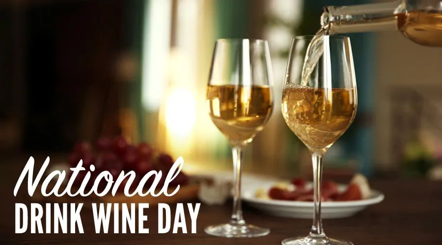 (原始链接: https://mmbiz.qpic.cn/mmbiz_jpg/7CNdqYbqvBKnDiawuibKmt2KQW9EIcttPRQYbo7ibfnsGOpWpb7iajHvtzkooPKZth0ibprHLYbrgbX13IAl7bQAb4Q/640?wx_fmt=jpeg)
-  (原始链接: https://mmbiz.qpic.cn/mmbiz_jpg/7CNdqYbqvBKnDiawuibKmt2KQW9EIcttPR4o9iaNGDN0MGh8yAh8Rcs4Q4ibelm76WDtud86bAJpSSephCrPeAD61w/640?wx_fmt=jpeg)
-  (原始链接: https://mmbiz.qpic.cn/mmbiz_jpg/7CNdqYbqvBKnDiawuibKmt2KQW9EIcttPRzKQqYz0mSk5dwAz5JbibbJJIVxVLN3icibibzOO0vVfCNh91mVPWOB3Duw/640?wx_fmt=jpeg)
- 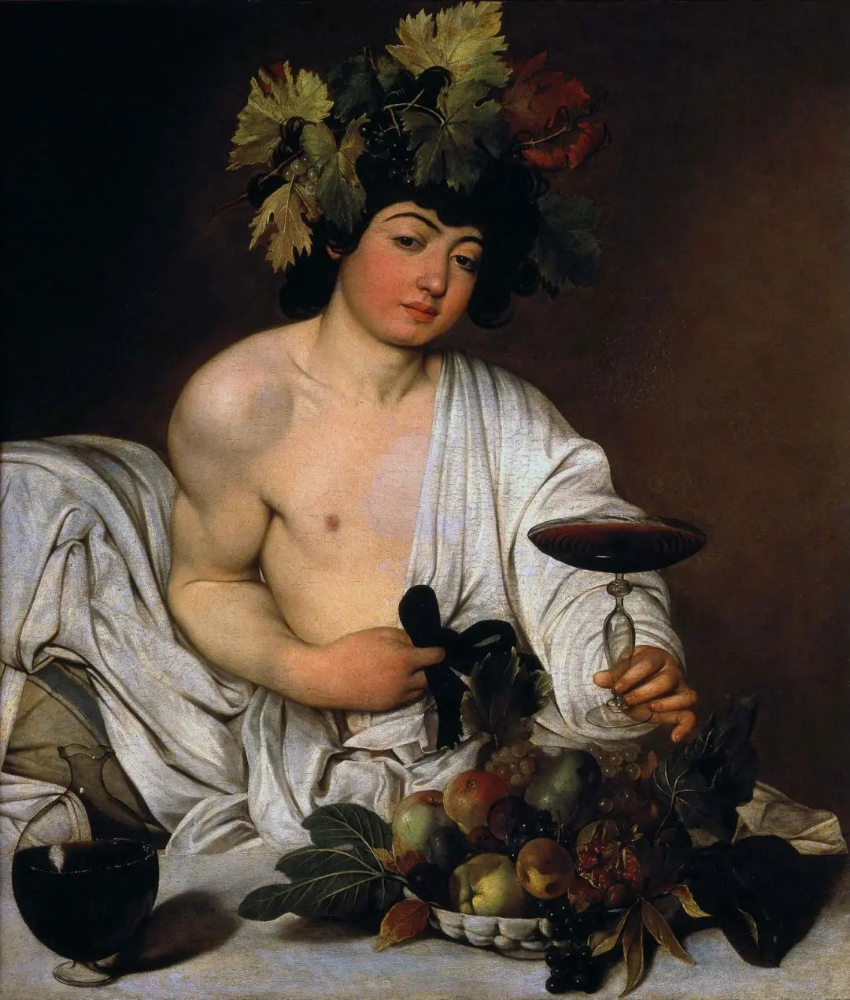 (原始链接: https://mmbiz.qpic.cn/mmbiz_jpg/7CNdqYbqvBKnDiawuibKmt2KQW9EIcttPRvdhbG9v5jrIm7xTrmDED5JWDqYessgianicR9JdAKahcNicYmYJtiahwyw/640?wx_fmt=jpeg)
- 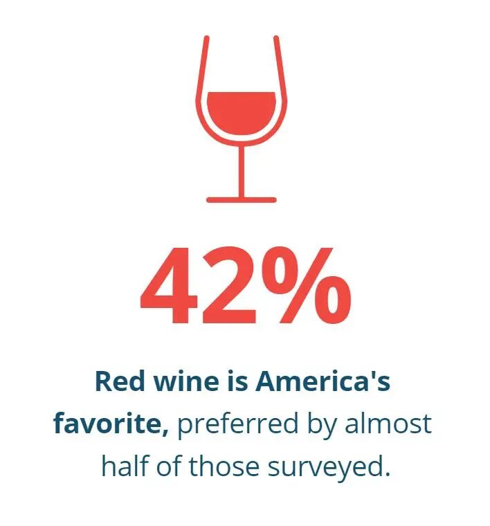 (原始链接: https://mmbiz.qpic.cn/mmbiz_jpg/7CNdqYbqvBKnDiawuibKmt2KQW9EIcttPRMZvFo5x0FtSW6qkzicWAOfPl5L1pd3GZUyXxcj25xX6yAsiaha79a4vg/640?wx_fmt=jpeg)
-  (原始链接: https://mmbiz.qpic.cn/mmbiz_jpg/7CNdqYbqvBKnDiawuibKmt2KQW9EIcttPRiczYYabKLvYGgrDRNIGwWDo2TpePaU9E8Wc0oBSv4w9y8C5BibMDPaDA/640?wx_fmt=jpeg)
- 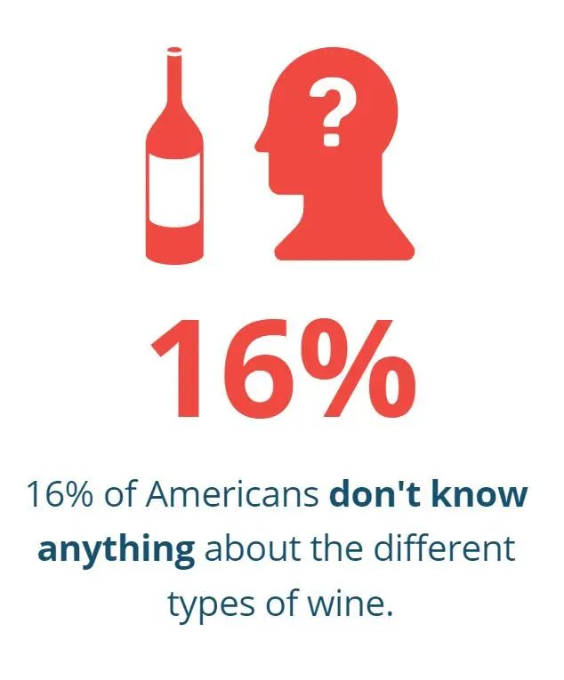 (原始链接: https://mmbiz.qpic.cn/mmbiz_jpg/7CNdqYbqvBKnDiawuibKmt2KQW9EIcttPR57yLYSeeemcp4xLyIIobnOvkiaCEFk7HOed25G5o37ReClwm2jeq2ag/640?wx_fmt=jpeg)
- 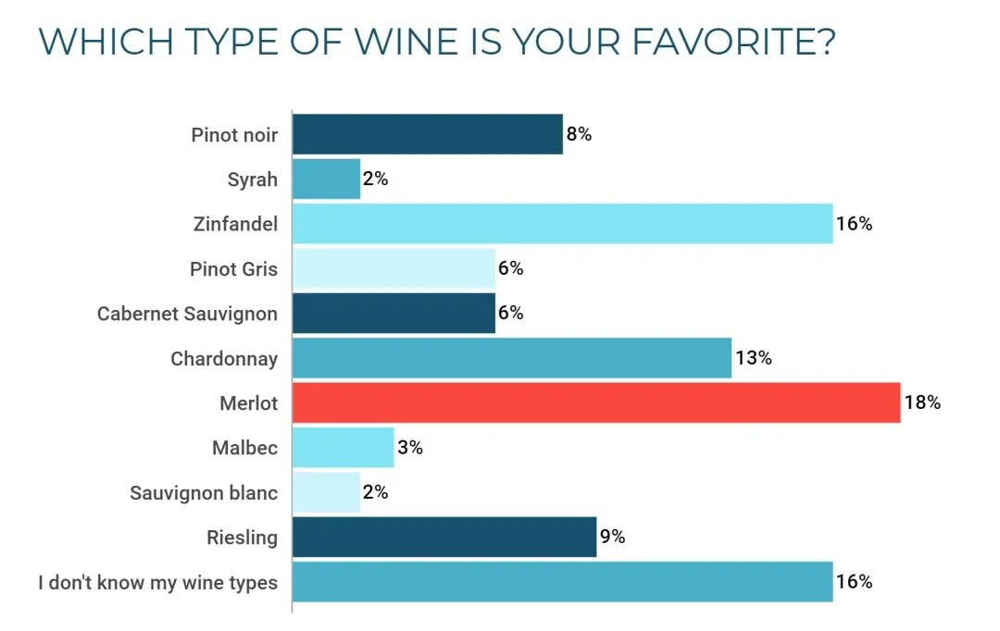 (原始链接: https://mmbiz.qpic.cn/mmbiz_jpg/7CNdqYbqvBKnDiawuibKmt2KQW9EIcttPR67uIN3pFPU6Cic95TyibX28u7Hz3ia1GejDFZLY3cZX4zqVKGrmOPgLhw/640?wx_fmt=jpeg)
- 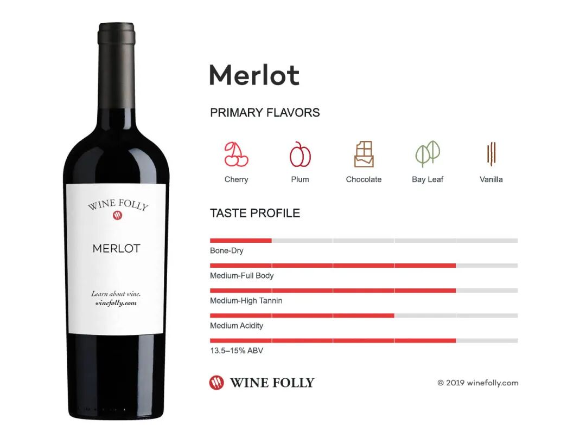 (原始链接: https://mmbiz.qpic.cn/mmbiz_jpg/7CNdqYbqvBKnDiawuibKmt2KQW9EIcttPRic1AFKXiam0Hu0dxJH0BAmUFaqUA3keibfkuW2gymJUGiboekrZZOAfq6w/640?wx_fmt=jpeg)
- 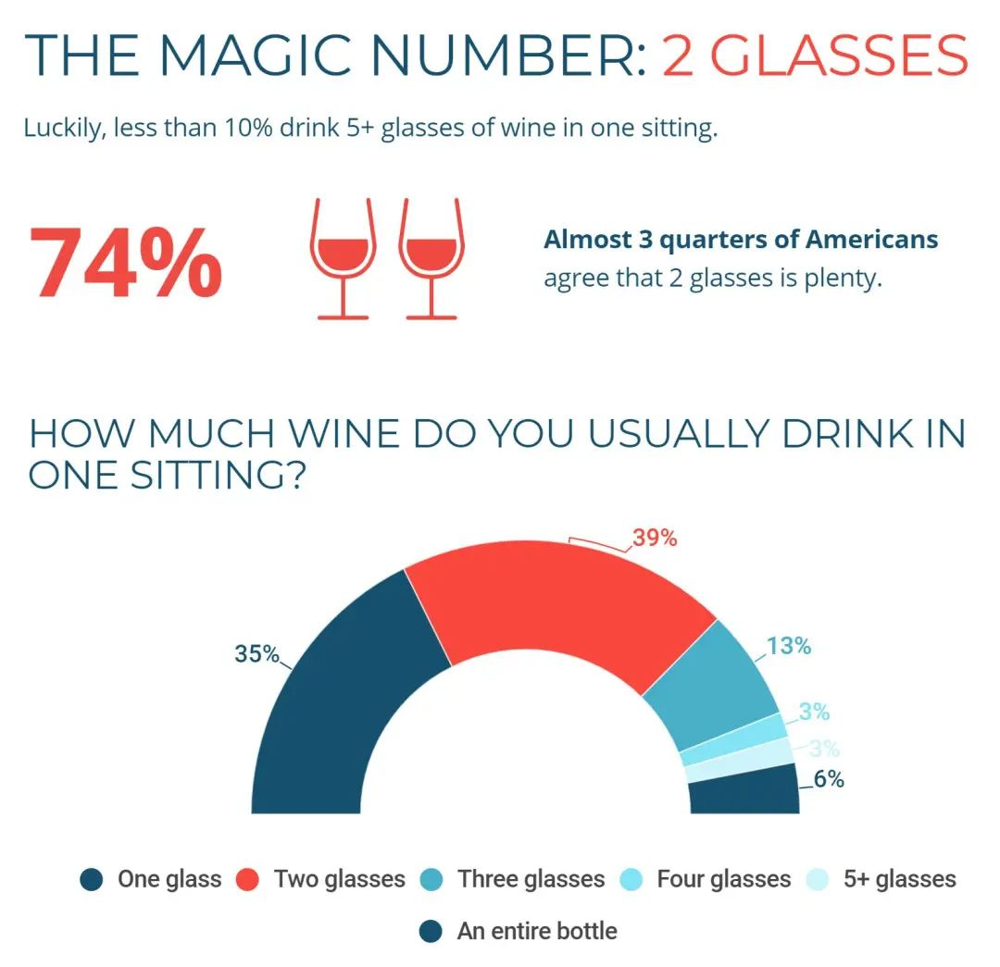 (原始链接: https://mmbiz.qpic.cn/mmbiz_jpg/7CNdqYbqvBKnDiawuibKmt2KQW9EIcttPRk5pIcViblZuHCcS0oZ65NnNElVw9VrmnquCUeF8CVBFKQPmbBDkpdRQ/640?wx_fmt=jpeg)
-  (原始链接: https://mmbiz.qpic.cn/mmbiz_jpg/7CNdqYbqvBKnDiawuibKmt2KQW9EIcttPRyjlBkjMuylhACNFK78Rg8WoLTKXlyMZCM0L15HkKsSuGaib5n17M9rw/640?wx_fmt=jpeg)
-  (原始链接: https://mmbiz.qpic.cn/mmbiz_jpg/7CNdqYbqvBKnDiawuibKmt2KQW9EIcttPRonncdAicL6d3jszYict3J8CNv8BbMHgOxXTYg7dQyCsHTLsP3fjib4GQg/640?wx_fmt=jpeg)
- 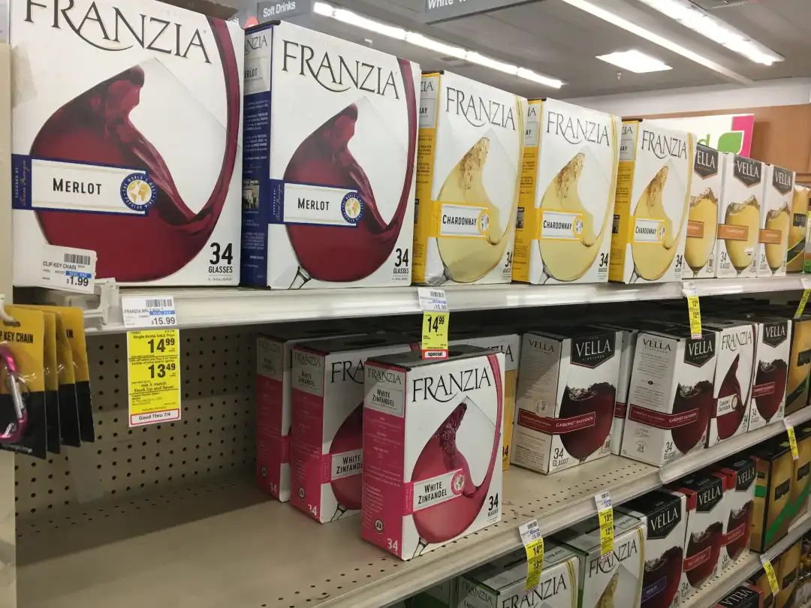 (原始链接: https://mmbiz.qpic.cn/mmbiz_jpg/7CNdqYbqvBKnDiawuibKmt2KQW9EIcttPRAe9XctY4ialdsLgGmnsvOlfsPOXkFIIe6CGKRoRia4TeYOA3hpNtL9pA/640?wx_fmt=jpeg)
-  (原始链接: https://mmbiz.qpic.cn/mmbiz_jpg/7CNdqYbqvBKnDiawuibKmt2KQW9EIcttPRaic5pLia0dMX1pzsJ3oluR12zSAdYF4QdqNZVgqx0HlGQtm8MGhw24XA/640?wx_fmt=jpeg)
-  (原始链接: https://mmbiz.qpic.cn/mmbiz_jpg/7CNdqYbqvBKnDiawuibKmt2KQW9EIcttPRqxhKweOZicm3SU1OKZtAvr6wYiaUX6EfcfAQRA6nfveuehPic79zIZx5g/640?wx_fmt=jpeg)
-  (原始链接: https://mmbiz.qpic.cn/mmbiz_jpg/7CNdqYbqvBKnDiawuibKmt2KQW9EIcttPRDVkEzeTKW3XEOZX8uKHuCictgtBn1R0KHDdA5FgpMYXJQW2x7JJibPJQ/640?wx_fmt=jpeg)
-  (原始链接: https://mmbiz.qpic.cn/mmbiz_jpg/7CNdqYbqvBKnDiawuibKmt2KQW9EIcttPR0AtNXq3BnoiaxjpLEPPqTT8k5wUSZrsQQavkLUy1DlXuyvJ1D0Fj3kA/640?wx_fmt=jpeg)
-  (原始链接: https://mmbiz.qpic.cn/mmbiz_jpg/7CNdqYbqvBKnDiawuibKmt2KQW9EIcttPRheibpsuODqubSs18ZGBJz3NVKsqktnicnmvLFYxDibjOkELLiagXVFJ6dA/640?wx_fmt=jpeg)
-  (原始链接: https://mmbiz.qpic.cn/mmbiz_jpg/7CNdqYbqvBKnDiawuibKmt2KQW9EIcttPRYRicPVNw9rRlXngmedibRiaKp22VQKMIOS4AalTsaLicQiayq7WB3YpasJg/640?wx_fmt=jpeg)
- 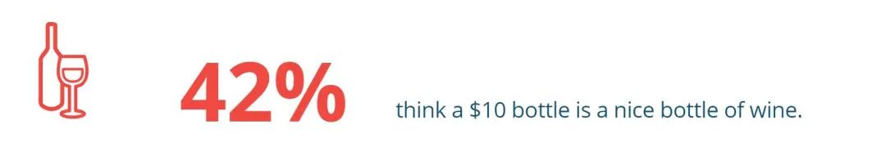 (原始链接: https://mmbiz.qpic.cn/mmbiz_jpg/7CNdqYbqvBKnDiawuibKmt2KQW9EIcttPRtReSS159crlyH7V7OszpAxpr54Cic2FAU8pRIauLyMWtFJCXzbYsEyA/640?wx_fmt=jpeg)
- 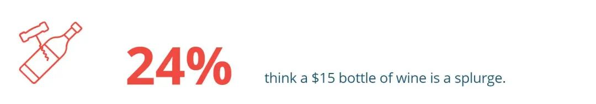 (原始链接: https://mmbiz.qpic.cn/mmbiz_jpg/7CNdqYbqvBKnDiawuibKmt2KQW9EIcttPRdEKyNw5JMc8ggQmXiaV1pXdTkj1kibIxgNvDm1NfdwoRPq2UFWXSL60w/640?wx_fmt=jpeg)
-  (原始链接: https://mmbiz.qpic.cn/mmbiz_jpg/7CNdqYbqvBKnDiawuibKmt2KQW9EIcttPRsKWiaKt48wQ9p1MzibXKerGhicTlgpG53rviawsuOsXZCeJuoMG0Psp7yg/640?wx_fmt=jpeg)
-  (原始链接: https://mmbiz.qpic.cn/mmbiz_jpg/7CNdqYbqvBKnDiawuibKmt2KQW9EIcttPRaUN8m3dQFgvSw8rR70OWL0iczdY3X3GYZgAMdhwAFHsQ0o9Q1hbC6DQ/640?wx_fmt=jpeg)
-  (原始链接: https://mmbiz.qpic.cn/mmbiz_jpg/7CNdqYbqvBKnDiawuibKmt2KQW9EIcttPRcv4QPDlCzCM5Wo8jUezRU30icccrryATIJxxEicwAJvsdvxaS2zBs1Vg/640?wx_fmt=jpeg)
-  (原始链接: https://mmbiz.qpic.cn/mmbiz_jpg/7CNdqYbqvBKnDiawuibKmt2KQW9EIcttPREOYRxW4f7Cgls3kBqC8ytnfmDfIvqYtDFuoZmbFVRJiaIib36QomhLyQ/640?wx_fmt=jpeg)
-  (原始链接: https://mmbiz.qpic.cn/mmbiz_jpg/7CNdqYbqvBKnDiawuibKmt2KQW9EIcttPR24NbxlVPrY2plibJZsIPq3bwRFYUJib1Rgo5g4USvHZyeUuD1u8rL95w/640?wx_fmt=jpeg)
- 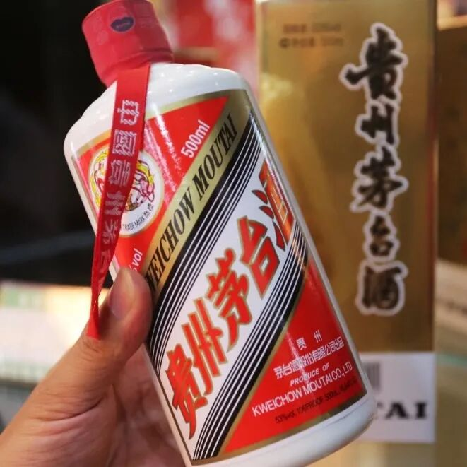 (原始链接: https://mmbiz.qpic.cn/mmbiz_jpg/7CNdqYbqvBKnDiawuibKmt2KQW9EIcttPRnnag1opCGE2dks6Nibb3P6JAulBRvOJDDHsATldMnfB7dJzjhQlRGZw/640?wx_fmt=jpeg)
- 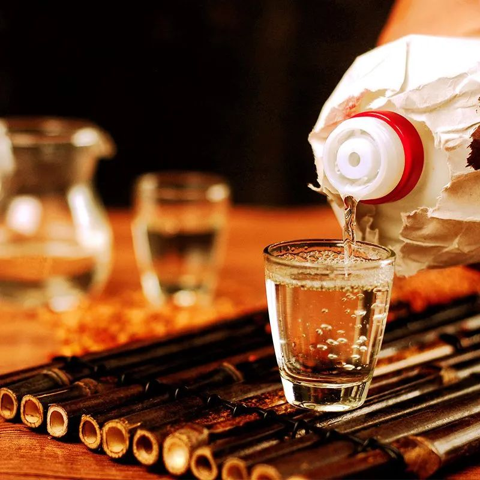 (原始链接: https://mmbiz.qpic.cn/mmbiz_jpg/7CNdqYbqvBKnDiawuibKmt2KQW9EIcttPRcILgCmIDx51fhpz4Adcyw7vc8EFvwzoWibUdMyDm68Sd3JtL6bykjyg/640?wx_fmt=jpeg)
