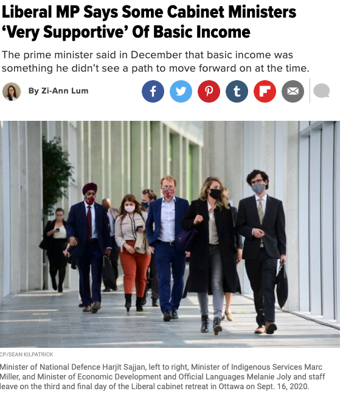
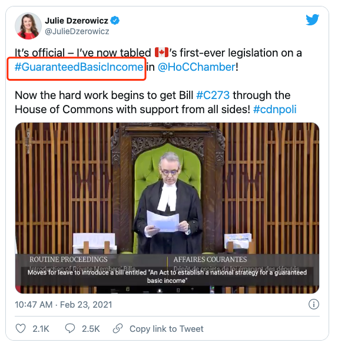
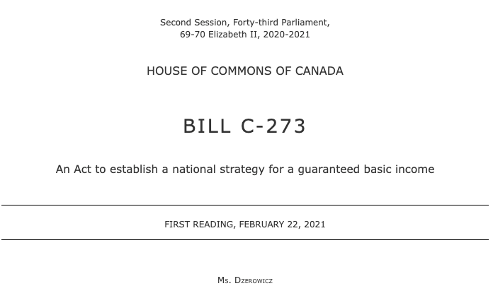
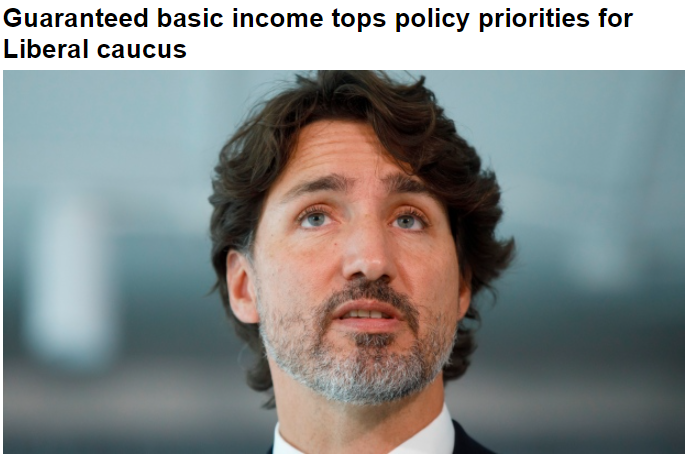
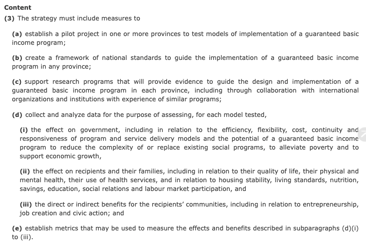
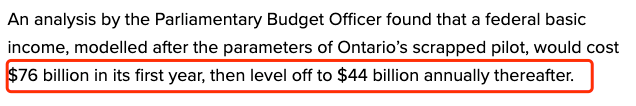

# 无标题

**链接地址:** http://mp.weixin.qq.com/s?__biz=MjM5MDEzNzY2NQ==&mid=2652808964&idx=1&sn=3ebddd48c5763e3e24837cb3755037a7&chksm=bda36b2a8ad4e23cedfb6b4cae498359fcfdac0955aa3ea0a20868aa4c702ea6c5213435a1da&mpshare=1&scene=2&srcid=0227KnRnkAmZo9K4HjITtwrp&sharer_sharetime=1614378574050&sharer_shareid=be1c8edd6c93eec155a61c876e41d26a#rd
**作者:** 丁其
**获取时间:** 2025/8/28 19:53:20
**图片数量:** 10

---

## 原始HTML内容

+++++上方是广告+++++

 

加拿大自由党联邦国会议员今天提出一项私人立法，要求联邦财政部长实施保障的基本收入，并且称实施基本收入这个想法在总理特鲁多领导的自由党核心小组非常受欢迎。 

 

 

来自多伦多Davenport选区的自由党国会议员朱莉·德泽尔维奇（Julie Dzerowicz）本周一（2月22日）提出了一项私人法案，即C-273法案，该法案呼吁联邦财政部长研究基本收入模型，并制定一项国家战略，以评估基本收入计划如何在加拿大实施。

 

 

C-273法案，又名“建立保障基本收入的国家战略法”，本周一已获得一读通过。

 

 

“保障基本收入”一词有时与“保障可居住收入”或“保障年收入”互换使用，是指旨在通过确保国民有足够的钱来负担基本必需品的社会援助计划，以帮助社会上收入最低的人群能够有足够的钱支付基本生活开支，包括食物，衣服和住所。

 

其实，安省早在2017年韦恩年代就已经实施基本收入试点计划。

 

当时参加试点的三个地区，分别为汉密尔顿（Hamilton），林赛（Lindsay）和雷湾（Thunder Bay）。无论有没有工作，参与试点项目的单身人士每年最多可领$16,989加元基本收入，相当于每月$1415加元；而夫妇两人最多每年可以领$24,027加元。

 

回顾：<a target="_blank" href="http://mp.weixin.qq.com/s?__biz=MjM5MDEzNzY2NQ==&amp;mid=2652729719&amp;idx=1&amp;sn=de52c79e9a80e951c2f02c332b6acd44&amp;chksm=bda0bd598ad7344fee7325d4be86505937f55a00510f6049baa2a7eb456b1203585476172082&amp;scene=21#wechat_redirect" data-itemshowtype="0" tab="innerlink" style="text-decoration: underline;" data-linktype="2">安省春末试点基本收入：单身每年可领$16,989加元，夫妇$24,027</a> 

 

大流行以来，特鲁多总理开始推出CERB福利计划，每月$2000加元，希望能够帮助受大流行影响的人群。

 

去年9月，当CERB福利计划期满的时候，根据加通社报道，加拿大自由党核心小组的首要政策选择是为所有加拿大人提供保证的基本收入。

&nbsp;

当时，自由党核心小组呼吁政府在优先政策决议中采纳基本收入这一想法。

 

当时称，自由党议员的首要政策选择是为所有加拿大人提供保证基本收入。

 

如果按照特鲁多为大流行制定的CERB救济福利金或即将发放的CRB复苏福利金标准，基本每月大约$2000加元。

 

回顾：<a target="_blank" href="http://mp.weixin.qq.com/s?__biz=MjM5MDEzNzY2NQ==&amp;mid=2652791344&amp;idx=3&amp;sn=4ec71a1ac561eca526891a3e2943f29d&amp;chksm=bda3ae1e8ad427083aa79f618d42b31dac7bbc9b6411079aaad4a969aca4a629a9376ef63b01&amp;scene=21#wechat_redirect" data-itemshowtype="0" tab="innerlink" style="font-family: mp-quote, -apple-system-font, BlinkMacSystemFont, &quot;Helvetica Neue&quot;, &quot;PingFang SC&quot;, &quot;Hiragino Sans GB&quot;, &quot;Microsoft YaHei UI&quot;, &quot;Microsoft YaHei&quot;, Arial, sans-serif;text-decoration: underline;" data-linktype="2">人人发钱的基本收入将是自由党的首要政策！每月$2000</a>

加拿大联邦政府每年预算案大概在3月底4月初公布，现在，自由党国会议员Dzerowicz本周一提出C-273法案，督促财政部将基本收入纳入考虑范围。 

 

一读通过的C-273法案称：“部长必须制定一项国家战略，以评估加拿大有保证的基本收入计划的实施模式。”

 

 

周四，Dzerowicz议员在讨论她的法案时说：“我确实知道，有联邦内阁部长非常支持基本收入。”

 

Dzerowicz说，有一个“广泛的”自由党核心小组成员支持这个想法。“我不想给出具体数字，但是数目很多。”

 

 

联邦国会预算官员的一项分析指出，根据安省2017年实施的基本收入试点的数据来参考，如果全加拿大实施基本收入，第一年将耗资760亿加元，然后每年大约440亿加元。

 

而因为大流行，加拿大联邦政府去年赤字已经超过$3000亿，还能再增加$440亿吗？

 

对此，大家怎么看？

 

+++下方是广告+++

+++全加拿大华人都在关注超级生活，就差你了+++ 

 

<strong style="letter-spacing: 0.544px;"><strong style="letter-spacing: 0.544px;">喜欢点个“在看”&nbsp;吧</strong><strong style="letter-spacing: 0.544px;"></strong></strong>

---

## 纯文本内容

+++++上方是广告+++++加拿大自由党联邦国会议员今天提出一项私人立法，要求联邦财政部长实施保障的基本收入，并且称实施基本收入这个想法在总理特鲁多领导的自由党核心小组非常受欢迎。来自多伦多Davenport选区的自由党国会议员朱莉·德泽尔维奇（Julie Dzerowicz）本周一（2月22日）提出了一项私人法案，即C-273法案，该法案呼吁联邦财政部长研究基本收入模型，并制定一项国家战略，以评估基本收入计划如何在加拿大实施。C-273法案，又名“建立保障基本收入的国家战略法”，本周一已获得一读通过。“保障基本收入”一词有时与“保障可居住收入”或“保障年收入”互换使用，是指旨在通过确保国民有足够的钱来负担基本必需品的社会援助计划，以帮助社会上收入最低的人群能够有足够的钱支付基本生活开支，包括食物，衣服和住所。其实，安省早在2017年韦恩年代就已经实施基本收入试点计划。当时参加试点的三个地区，分别为汉密尔顿（Hamilton），林赛（Lindsay）和雷湾（Thunder Bay）。无论有没有工作，参与试点项目的单身人士每年最多可领$16,989加元基本收入，相当于每月$1415加元；而夫妇两人最多每年可以领$24,027加元。回顾：安省春末试点基本收入：单身每年可领$16,989加元，夫妇$24,027大流行以来，特鲁多总理开始推出CERB福利计划，每月$2000加元，希望能够帮助受大流行影响的人群。去年9月，当CERB福利计划期满的时候，根据加通社报道，加拿大自由党核心小组的首要政策选择是为所有加拿大人提供保证的基本收入。 当时，自由党核心小组呼吁政府在优先政策决议中采纳基本收入这一想法。当时称，自由党议员的首要政策选择是为所有加拿大人提供保证基本收入。如果按照特鲁多为大流行制定的CERB救济福利金或即将发放的CRB复苏福利金标准，基本每月大约$2000加元。回顾：人人发钱的基本收入将是自由党的首要政策！每月$2000加拿大联邦政府每年预算案大概在3月底4月初公布，现在，自由党国会议员Dzerowicz本周一提出C-273法案，督促财政部将基本收入纳入考虑范围。一读通过的C-273法案称：“部长必须制定一项国家战略，以评估加拿大有保证的基本收入计划的实施模式。”周四，Dzerowicz议员在讨论她的法案时说：“我确实知道，有联邦内阁部长非常支持基本收入。”Dzerowicz说，有一个“广泛的”自由党核心小组成员支持这个想法。“我不想给出具体数字，但是数目很多。”联邦国会预算官员的一项分析指出，根据安省2017年实施的基本收入试点的数据来参考，如果全加拿大实施基本收入，第一年将耗资760亿加元，然后每年大约440亿加元。而因为大流行，加拿大联邦政府去年赤字已经超过$3000亿，还能再增加$440亿吗？对此，大家怎么看？+++下方是广告++++++全加拿大华人都在关注超级生活，就差你了+++喜欢点个“在看” 吧

---

## 图片列表

-  (原始链接: https://mmbiz.qpic.cn/mmbiz_jpg/szJas1pFaJcLrHQw8Aib48AnDXwMRCVxubjlxVWMicXTsE6kFh8XnfpLAQHXPahwNP9N9BsJJ0TYBjcGHmJYdvAw/640?wx_fmt=jpeg)
-  (原始链接: https://mmbiz.qpic.cn/mmbiz_png/szJas1pFaJcniaG8m4VJ6a3hKYciayxtvFfgAjiaWtgiahOjpDP7iaib3Z5WRUz7iboFsjuFL3urTcbxtdT7krEibDGA0A/640?wx_fmt=png)
-  (原始链接: https://mmbiz.qpic.cn/mmbiz_png/szJas1pFaJcniaG8m4VJ6a3hKYciayxtvF4zicowfCSJHYTqZe3wjv8JxnCN1ItFWyMeBiaAw2YpeoRp5ia30Z6eFRA/640?wx_fmt=png)
-  (原始链接: https://mmbiz.qpic.cn/mmbiz_png/szJas1pFaJcniaG8m4VJ6a3hKYciayxtvFmMrvLxtLw2Izl6nDqbg7ZDpls8kfBJXR8t0HgTlvCOFoYDPqCzKNIQ/640?wx_fmt=png)
-  (原始链接: https://mmbiz.qpic.cn/mmbiz_png/szJas1pFaJfFIDwNERtZ9pWZjGicNdWd71xDBDsNzbQYaicRibprQsrOGUb1Im9k1GG7AbH1GnOCxtGZvySWYW1hw/640?wx_fmt=png)
-  (原始链接: https://mmbiz.qpic.cn/mmbiz_png/szJas1pFaJcniaG8m4VJ6a3hKYciayxtvF0ic2z7AVxkiaNhwibia2oLSvkXXqCIjpT6LrFlEcic0ibmQHlb4dJyfC5Jtw/640?wx_fmt=png)
-  (原始链接: https://mmbiz.qpic.cn/mmbiz_png/szJas1pFaJcniaG8m4VJ6a3hKYciayxtvFD2RPI6X6FNiaKwBpDRcJmdvIic5zZ2biapEqocufWmbyggqHZL6KPckdg/640?wx_fmt=png)
-  (原始链接: https://mmbiz.qpic.cn/mmbiz_jpg/szJas1pFaJcjaC1hRD2egrutFKz0QBzQuM5ianmeeyweib9ibfoWKP6EQIqib5T3qC0Kctp0004FVgu6P3stPSmSgg/640?wx_fmt=jpeg)
-  (原始链接: https://mmbiz.qpic.cn/mmbiz_gif/szJas1pFaJdUFDPEKnLrCyGC4WgrAvl6lSC2beZFt6icTnXfebnRzcRialMg5VZujw1AhX9ribkSDQNZZukk8HX9w/640?wx_fmt=gif)
-  (原始链接: https://mmbiz.qpic.cn/mmbiz_png/szJas1pFaJdux7mbDaq4CpWoWAUe3fNIlVYWrSfV7acu1tNBibI1icqvrlqkkqWdELW157V8YZVNxH7MLYksFHcA/640?wx_fmt=png)
