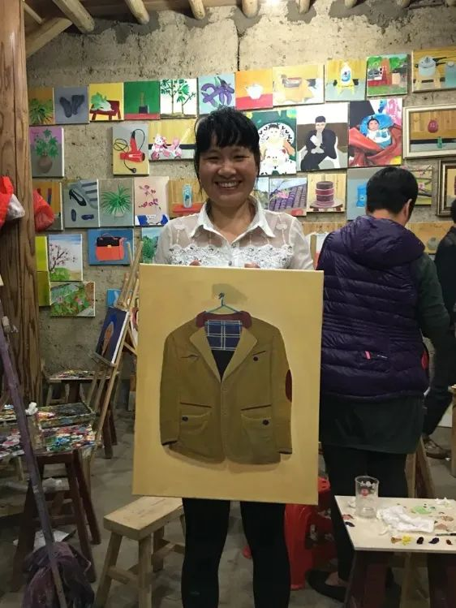

# 无标题

**链接地址:** http://mp.weixin.qq.com/s?__biz=MzUzMTI3MjY0Mg==&mid=2247486622&idx=2&sn=cfba0a405c144b9904621e4c1322d0d1&chksm=fa444a33cd33c325226d052639ada5befa5607c20c0201904809373b99772e23ac3a9187086a&mpshare=1&scene=2&srcid=0303gMJb0FQeMvsdQ71NFjOY&sharer_sharetime=1614799791571&sharer_shareid=be1c8edd6c93eec155a61c876e41d26a#rd
**作者:** 思林
**获取时间:** 2025/8/28 19:52:42
**图片数量:** 53

---

## 原始HTML内容

  

一部有笑有泪，温暖而感动的电影。

这是一篇影评，也是一篇招募。 

 

 
<section class="_wxbEditor"><section class="RankEditor"><section><section style="margin-top: 10px; margin-right: 0%; margin-left: 0%;"><section class="Mscroll" style="display: inline-block; vertical-align: top; width: 50%; padding-right: 5px;"><section><section style="text-align: center; margin-right: 0%; margin-left: 0%;"></section></section><section><section style="text-align: center;"><section style="background-image: url(&quot;https://mmbiz.qpic.cn/mmbiz_png/oMlX8Lll9JgtXCwzZQgjv0XUiaeyqIX90b1J6mXhhAokLM54a1nlTLIXrIAibDqq07yFYcoaywsNnmAwt50vmK7Q/640&quot;); background-position: 119.078% -2.3785%; background-repeat: repeat-y; background-size: 100%; background-attachment: scroll; width: 100%; margin-left: auto; margin-right: auto;"><section style="display: inline-block; width: 100%; height: 210px; vertical-align: top; overflow-x: hidden; overflow-y: auto; padding-right: 15px; padding-left: 15px;"><section>
 
</section><section>
向下滑动

查看所有影评
</section><section><section style="margin-top: 10px; margin-right: 0%; margin-left: 0%;"><section style="vertical-align: middle; display: inline-block;"></section></section></section><section><section style="margin-right: 0%; margin-left: 0%;"><section style="vertical-align: middle;display: inline-block;"></section></section></section></section></section></section></section><section><section style="text-align: center; margin-right: 0%; margin-left: 0%;"></section></section></section><section style="display: inline-block; vertical-align: top; width: 50%; padding-left: 5px;"><section><section style="margin-right: 0%; margin-left: 0%;"><section style="width: 2.5em; margin-left: auto;"><section style="width: 2.5em; border-top: 1px solid rgb(158, 158, 158);"></section><section style="height: 1.4em; border-left: 1px solid rgb(158, 158, 158); margin-top: -0.5em; margin-left: 2em;"></section></section><section style="padding-right: 0.5em; padding-left: 0.5em;"><section style="padding-right: 5px; padding-left: 5px;text-align: center; ">
你好，龙潭里
</section></section><section style="height: 1.4em; border-left: 1px solid rgb(158, 158, 158); margin-bottom: -0.5em; margin-left: 0.5em;"></section><section style="width: 2.5em; border-top: 1px solid rgb(158, 158, 158);"></section></section></section><section><section style="text-align: right; margin: -10px 0% 10px;"></section></section><section><section style="text-align: justify; line-height: 1.8; padding-right: 10px; padding-left: 10px;white-space: normal;">
 

左边是10月份看完x++《你好，龙潭里》电影的小伙伴们留下的影评，离开的时候大家纷纷表示意犹未尽，并且心甘情愿要当“自来水”，有机会还想要二刷。
</section></section></section></section></section></section></section>
 

 

乡村是最容易打动人的题材，因为乡愁、因为小时候的记忆、因为诗酒田园的向往。同样，乡村也是最难拍摄的题材，在很多人的印象当中往往“乡村+建设+文旅 = 华而不实+烂片”。 

 

《你好，龙潭里》究竟如何蜕去“网红村”的外衣，呈现众多个性鲜明的新村民和突破藩篱的老村民，把常见的题材拍出打动人心的效果和新意？

 

提醒：本文内含大量剧透，慎入！

 

 

<strong style="max-width: 100%;box-sizing: border-box !important;overflow-wrap: break-word !important;">Part.1 &nbsp;电影拍摄地：龙潭里</strong>

 

“有人说是新村民成就了龙潭里，有人说没有龙潭的古建筑和绿水青山也无法吸引如织的游人。我想说，电影里的景与人是如此和谐，不分你我。”

 

某观影者如是说。 

 

 

龙潭村属高山林区，有清新的空气和干净的山泉水，一条小溪从村中流过，溪水清澈见底，村尾最古老石拱桥大约建于明代，它的“四平戏”和“酿酒技艺"都是国家级文化遗产。 

 

作为一个山村，风景优美，气候宜人，那是最基本的。温暖的阳光，潺潺流动的溪水，安静伫立的土房子，得天独厚的自然生态，任意一个角落都是景致。

 

 

不止山水，这个村最意思的是，年轻新村民特别多，且家家户户自带文艺光环，有画家、音乐人、电影人、作家、自媒体人。而他们的空间从外面看都是土墙黑瓦普普通通，走入之后却能感受到浓浓的艺术气息以及每位主人的脾性。

 

 

<strong style="max-width: 100%;box-sizing: border-box !important;overflow-wrap: break-word !important;">Part.2 &nbsp;&nbsp;导演：林正碌</strong>

 

“人人都是艺术家” 

这是导演林正碌给给这部电影定下的基调。

 

 

要给“龙潭里复兴”真正溯源的话，我们不得不提到“认租”机制的开创者林正碌老师，他是屏南古村文创产业的总策划。不同于往常“扶持乡村建设”的思路，林老师提出“引进人才”才是乡村活化的核心。 

 

林正碌2015年带团队来到屏南，发起了“人人都是艺术家”的公益教学活动，鼓励原来从来没有接触过绘画的人从事创作，并利用自己积累的销售经验帮助他们出售作品。 

 

林老师亲自教学，不仅不收学费，还免费提供画材和场地。他的学生从最早的当地村民、弱势群体、发展到国内甚至海外慕名而来的学画者，一个月甚至有上千名新学员来拜师。学生们的画作卖出后，林老师扣除材料费，将剩余所得全部还给学生，但有些学生又会将收益捐给画室。

 

 

龙潭里最早一批“新村民”大部分都是林老师的学生。他们认领改造好老房子之后，还要想办法生活下去，于是这里不但有民宿、饭店，还有书店、咖啡馆、酒吧、工作室。新村民们经常会筹划一些活动，比如集市、音乐会、读书会、排演戏剧等等来丰富自己的精神生活。

 

从林老师来到屏南到现在，不过短短5年的时间，这里已经有了翻天覆地的变化。龙潭里也从一个默默无闻的凋敝古村，转型成为前卫青年探索生活的理想居所。

 

<strong style="max-width: 100%;box-sizing: border-box !important;overflow-wrap: break-word !important;">Part.3 影片主演（<strong style="max-width: 100%;white-space: normal;box-sizing: border-box !important;overflow-wrap: break-word !important;">本期接待者</strong>）</strong>

 

不同于传统乡村主题影片，本片的主角不是老村民或者千篇一律的民宿主、咖啡馆主。《你好，龙潭里》中的主角各有各的精彩，每个人的个性与追求都在电影场景中呈现的淋漓尽致。

 

整个观影过程以“人”为主，白天拜访当地人，走进他们的生活，了解他们过往的经历以及现在在做的事情。

 

 

&nbsp;- 曾伟&amp;黄旭丹 -&nbsp;

#画家&nbsp; #诗人 &nbsp;#书店主理人

 

 这对85后夫妻来自江西，他们是龙潭里的第一户新村民。2017年他们来到这里，曾伟忙着装修破败不堪的老房子，黄旭丹则在龙潭小学担任一二年级的语文老师。

 

 

宅子改造好了，生活也慢慢步入正轨。曾伟原来从事网络图书经营，他在自家开辟了喝茶阅读的空间，成为“随喜书屋”，在这里从事艺术创作、活动策划、创意产品研发等。

 

18年，黄旭丹在旁边开起了咖啡馆，不忙的时候夫妻俩写诗画画，偶尔还帮村民推销特产，比如当地的非遗红曲黄酒，山里产的桃胶、柿子饼。

 

 

&nbsp;- 周涵&nbsp;-&nbsp;

#占星&nbsp; #诗歌&nbsp; #首饰

 

 

周涵和妹妹在龙潭里拥有一个名叫“岛屿”的空间，她是岛，妹妹是屿。姐妹俩都喜欢创作首饰，岛主攻能量饰品，即根据每个客户的星盘，通过搭配不同质地、颜色的材料来平衡客户自身的能量；屿主攻银饰。

 

 

周涵曾经居住在上海，为多家时尚杂志撰写人物专稿，后来着迷于心理学，在国内一家知名心理网站担任主编。

 

来到龙潭以后，她开始学习油画、出版诗集、设计首饰、推广波西米亚文化，还在岛屿空间里，开了一间只有几个座位的咖啡馆。

 

&nbsp;- 李懒懒&nbsp;-&nbsp;

#无法定义&nbsp; #时予&nbsp; #探索

 

 

懒懒是个特立独行的90后，她无法定义自己的身份，好像也从来没给自己贴过任何标签。

 

北漂7年后，她来到龙潭里租了一间老房子，开了一家日式小酒馆，名叫“时予”。懒懒认为所拥有和失去的一切都是时间的给予，这就是“时予”的含义。

 

 

目前，她觉得自己只是乡村生活的体验者，生活在变，身份在转换。活着，去探索一切可能性是最重要的。

 

 

&nbsp;- 小燕 -&nbsp;

#油画 &nbsp;#生活 &nbsp;#燕窝空间

 

 

小燕是一个来自泉州的90后，毕业于武汉大学，曾从事水利设计，辞职后去云南摆过摊，当过瑜伽老师。

 

17年她先去屏南跟林正碌老师学习了一阵油画，随后来到龙潭里小学支教。她认领了一栋很宽敞的老房子，改造好后开始运营这个叫“燕窝”的民宿，扎根在乡村探索新的生活方式。

 

 

龙潭里因油画而兴起，来到这里怎么能不体验一下画油画呢？在这里，老师不怎么教授油画技法，而是鼓励学生们看到什么就画什么，发挥创意自由表达，人人都是艺术家。 

 

&nbsp;- 思林&nbsp;-&nbsp;

#乡建&nbsp; #新农夫 #教育

 

 

思林毕业之后便一直在乡村摸爬滚打，曾从事乡村规划、农业、研学旅行等行业。2019年因为考察乡村的缘故来到龙潭里，被一群有趣的朋友和村庄的发展模式所吸引，并且与经营燕窝空间的小燕结了缘。

 

 

如今他和爱人小燕一起定居于龙潭里，打理燕窝空间的同时还开辟了一个农场。他认为在乡村，不仅仅是生活和工作，同样期待人与人的互相支持以及探索乡村的不同发展方式。

 

 

&nbsp;- 友情出演&nbsp;-&nbsp;

 

2019年9月底，先锋书店第四家乡村书局在屏南厦地古村开业，终于有机会跟先锋书店近距离接触啦！在如此自然淳朴的环境中静静读一本书，让身体和心灵一起充充电。

 

 

农耕采摘&nbsp;• 古村探秘&nbsp;• 看萤火虫&nbsp;• 观星&nbsp;• 听戏&nbsp;•&nbsp;山野徒步等

 

 

 

<strong style="max-width: 100%;box-sizing: border-box !important;overflow-wrap: break-word !important;">Part.4&nbsp; 往期观影者</strong>

 

结束了白天的拜访，晚上是大家交流、思考的时间。x++优秀的小伙伴们来自各行各业，有着不同的人生经历，同样是很重要的交流对象。
<section class="_wxbEditor">
 
<section class="_wxb-style" data-tools="135编辑器" data-id="86426" style="line-height: 25.6px; white-space: normal; border: 0px none;"><section style="margin: 1em auto; padding: 5px; text-align: center; border: 1px solid rgb(221, 221, 221); overflow: hidden;"><section class="135brush" data-style="display: inline-block;width: 100%;margin:0;padding:0;" style="white-space: nowrap; overflow-x: scroll;"></section>
&nbsp;同行小伙伴，向右滑&nbsp;→
</section></section></section>

在这几天共处的时光里，大家将一起拜访有意思的村民、探索自然、学油画、创作诗歌、玩游戏、交换自己的故事。

 

大家在活动中建立起来的信任和伙伴关系会一直延续下去，就算大家回归自己的生活也不会终止，线上线下，小伙伴们都还有非常多机会继续交流。

 

 

 

<strong style="max-width: 100%;box-sizing: border-box !important;overflow-wrap: break-word !important;">x++「间隔游」活动说明</strong>

 

1. 行程信息

 

地点：福州集合解散，共6天5晚&nbsp;

时间：含清明小长假，4月1日-6日&nbsp; &nbsp; &nbsp; &nbsp; &nbsp; &nbsp; &nbsp; &nbsp; &nbsp; &nbsp; &nbsp; &nbsp; &nbsp; &nbsp; &nbsp; &nbsp; &nbsp; &nbsp; &nbsp; &nbsp; &nbsp;

人数：8-12人

内容：返乡青年交流、艺术体验、新农人生活、山间徒步、古建筑改造

 

 

1. 交通

 

福州市区到龙潭里古镇约有2.5小时车程，我们会安排车辆依次从长乐机场/福州南站/福州站接大家，出发时间依次为4月1日中午11点/12点/1点30。

 

返程时间为4月6号早饭后，大巴车送站顺序为福州站/福州南站/长乐机场，预计抵达时间为中午11点-1点。

 

2. 餐饮

 

 

行程所含餐饮以清淡宜人的农家菜为主，形式为自助，每餐含3素2荤，主食、汤、水果。行程中我们也安排了丰富的当地特色菜。

 

3. 住宿

 

本次活动我们将入住民宿“燕窝”，“燕窝”是古建筑改造而成，整体为木质结构，隔音稍差，请大家入住时尽量放轻脚步，小声交谈。
<section class="_wxbEditor">
 
<section class="_wxb-style" data-tools="135编辑器" data-id="86426" style="line-height: 25.6px; white-space: normal; border: 0px none;"><section style="margin: 1em auto; padding: 5px; text-align: center; border: 1px solid rgb(221, 221, 221); overflow: hidden;"><section class="135brush" data-style="display: inline-block;width: 100%;margin:0;padding:0;" style="white-space: nowrap; overflow-x: scroll;"></section>
燕窝空间，向右滑 →
</section></section></section>

当地民宿房间以1.5米大床房为主，我们尽量做到一人一床，如有特殊情况领队会提前告知协商。

 

因龙潭古村地处山野林间，室内有机会见到一些昆虫，介意的朋友请慎重报名。

 

4. 安全

 

村里有社区卫生所，乡卫生院开车20分钟左右，每期都会配备急救措施和药物；我们会为所有成员购买保额为20万元人民币的旅行意外保险。

 

疫情期间安全提示：

确认出行之前请知悉您本人居住地/社区的隔离条例，避免返程时遇到不必要的麻烦。如遇到需要乘坐公共交通、前往人员密集的室内或有其他易感情况时，请佩戴口罩，勤洗手，做好个人防护措施。

 

2. 项目费用

 

为保证出行交流质量，龙潭里「间隔游」均为12人以下的小团队出行，配有领队、地接。6天5晚项目费用为4580/人，x++社群成员有不同级别优惠。

 
<ul class=" list-paddingleft-2" style="list-style-type: circle;"><li>
费用包含福州市指定地点往返龙潭里的交通、行程内住宿、餐饮、活动相关费用（场地、嘉宾、物料等）、照片、视频、公用物资、急救包、保险。
</li><li>
费用不含成员前往福州的大交通、自由活动期间产生的费用及其他个人消费。
</li><li>
退款原则定金为全价的30%，一经支付恕不退款，集合前20天以上可办理70%退款，集合前4-20天可办理50%退款，集合前3天内不支持退款。如因疫情原因不能如约出行，x++将退回除已发生的费用外的余款。
</li></ul>
 

3. 参与流程

 
<ol class=" list-paddingleft-2" style="max-width: 100%;width: 494px;overflow-wrap: break-word !important;"><li>
点击文末“阅读原文”，填写申请表
</li><li>
语音沟通
</li><li>
支付30%定金占位
</li><li>
收到成团通知后自行购买机票、火车票，并支付尾款
</li><li>
参加线上出行介绍会及成员check-in
</li><li>
开启间隔游，探访当地人，成员互动
</li><li>
开始后续的合作、开发、价值生产
</li></ol>
 

 
<section style="margin: 5px 8px; white-space: normal; line-height: 1.5em;"><strong style="text-align: right;">更多x++相关资料</strong></section>

 

 
<section style="margin: 5px 8px; white-space: normal; font-family: mp-quote, -apple-system-font, system-ui, &quot;Helvetica Neue&quot;, &quot;PingFang SC&quot;, &quot;Hiragino Sans GB&quot;, &quot;Microsoft YaHei UI&quot;, &quot;Microsoft YaHei&quot;, Arial, sans-serif; caret-color: rgb(0, 0, 0); letter-spacing: 1px; overflow-wrap: break-word !important;">关于我们【<a href="http://mp.weixin.qq.com/s?__biz=MzUzMTI3MjY0Mg==&amp;mid=2247485189&amp;idx=3&amp;sn=a22df3c3173d486ba994438f1db3acb4&amp;chksm=fa4441a8cd33c8be4c0d19e1b18adb33a73181af5475031701a5a2425d7a6ee782958dc72919&amp;scene=21#wechat_redirect" data-linktype="2" style="font-size: 12px; overflow-wrap: break-word !important;">“x++”是什么?</a>】 </section><section style="margin: 5px 8px; white-space: normal; font-family: mp-quote, -apple-system-font, system-ui, &quot;Helvetica Neue&quot;, &quot;PingFang SC&quot;, &quot;Hiragino Sans GB&quot;, &quot;Microsoft YaHei UI&quot;, &quot;Microsoft YaHei&quot;, Arial, sans-serif; letter-spacing: 1px; line-height: 1.5em; overflow-wrap: break-word !important;">出行介绍【<a href="http://mp.weixin.qq.com/s?__biz=MzUzMTI3MjY0Mg==&amp;mid=2247485189&amp;idx=1&amp;sn=0667b38ee0a991abbc34b8a59cb94456&amp;chksm=fa4441a8cd33c8be0f3702e415aa149b5539e1e8e0e3de958ee041f25c6c19dc62e4cc7f9173&amp;scene=21#wechat_redirect" data-linktype="2" style="overflow-wrap: break-word !important;">“间隔游”是什么？</a>】</section><section style="margin: 5px 8px; white-space: normal; font-family: mp-quote, -apple-system-font, system-ui, &quot;Helvetica Neue&quot;, &quot;PingFang SC&quot;, &quot;Hiragino Sans GB&quot;, &quot;Microsoft YaHei UI&quot;, &quot;Microsoft YaHei&quot;, Arial, sans-serif; letter-spacing: 1px; line-height: 1.5em; overflow-wrap: break-word !important;">往期成员【<a href="http://mp.weixin.qq.com/s?__biz=MzUzMTI3MjY0Mg==&amp;mid=2247485451&amp;idx=1&amp;sn=a0773b186208a17db3f3d9cbcd07ad19&amp;chksm=fa444ea6cd33c7b0733c138118d9a41b6ad5e73e052eb4a7c57ac29ca7bf22e855baeeb0964f&amp;scene=21#wechat_redirect" data-linktype="2">「x++间隔游」往期出行成员</a>】</section><section style="margin: 5px 8px; white-space: normal; font-family: mp-quote, -apple-system-font, system-ui, &quot;Helvetica Neue&quot;, &quot;PingFang SC&quot;, &quot;Hiragino Sans GB&quot;, &quot;Microsoft YaHei UI&quot;, &quot;Microsoft YaHei&quot;, Arial, sans-serif; letter-spacing: 1px; line-height: 1.5em; overflow-wrap: break-word !important;">逆向交流【<a href="http://mp.weixin.qq.com/s?__biz=MzUzMTI3MjY0Mg==&amp;mid=2247484813&amp;idx=1&amp;sn=1acda72799a2c164491ba36e81c5f736&amp;chksm=fa444320cd33ca36fa75459feb1733ed848730b479e233b770eef8e6e313f7782138ce68ab25&amp;scene=21#wechat_redirect" data-linktype="2">是什么让一群来访中国的日本人啧啧称奇</a>】</section><section style="margin: 5px 8px; white-space: normal;"> </section><section style="margin: 5px 8px; white-space: normal; line-height: 1.5em;"></section><section style="margin: 5px 8px; white-space: normal; line-height: 1.5em; text-align: right;">部分图片来自网络，如有侵权请联系工作人员删除。</section>
 

 
<section style="margin: 5px 8px; white-space: normal; letter-spacing: 1px; text-align: justify; line-height: 1.5em;">有独特的体验、来自世界各地的小伙伴、有与你过着不同人生的当地人……思维的交流与碰撞究竟有多大的能量？你与答案之间只差一张申请表！ </section><section style="margin: 5px 8px; white-space: normal; text-align: center;"> </section><section style="margin: 5px 8px; font-size: medium; white-space: normal; caret-color: rgb(0, 0, 0); color: rgb(0, 0, 0); letter-spacing: 1px; text-align: center; line-height: 1.5em; overflow-wrap: break-word !important;"><strong>咨询工作人员</strong></section><section style="margin: 5px 8px; white-space: normal; caret-color: rgb(0, 0, 0); letter-spacing: 1px; text-align: center; line-height: 1.5em; overflow-wrap: break-word !important;"></section><section style="margin: 5px 8px; white-space: normal; caret-color: rgb(0, 0, 0); letter-spacing: 1px; text-align: center; line-height: 1.5em; overflow-wrap: break-word !important;"> </section><section style="margin: 5px 8px; white-space: normal; text-align: center; letter-spacing: 1px; line-height: 1.5em;"><strong>填写申请表</strong></section><section style="margin: 5px 8px; white-space: normal; text-align: center; letter-spacing: 1px; line-height: 1.5em;"><strong>↙</strong>请戳阅读原文</section>
 

---

## 纯文本内容

一部有笑有泪，温暖而感动的电影。这是一篇影评，也是一篇招募。向下滑动查看所有影评你好，龙潭里左边是10月份看完x++《你好，龙潭里》电影的小伙伴们留下的影评，离开的时候大家纷纷表示意犹未尽，并且心甘情愿要当“自来水”，有机会还想要二刷。乡村是最容易打动人的题材，因为乡愁、因为小时候的记忆、因为诗酒田园的向往。同样，乡村也是最难拍摄的题材，在很多人的印象当中往往“乡村+建设+文旅 = 华而不实+烂片”。《你好，龙潭里》究竟如何蜕去“网红村”的外衣，呈现众多个性鲜明的新村民和突破藩篱的老村民，把常见的题材拍出打动人心的效果和新意？提醒：本文内含大量剧透，慎入！Part.1  电影拍摄地：龙潭里“有人说是新村民成就了龙潭里，有人说没有龙潭的古建筑和绿水青山也无法吸引如织的游人。我想说，电影里的景与人是如此和谐，不分你我。”某观影者如是说。龙潭村属高山林区，有清新的空气和干净的山泉水，一条小溪从村中流过，溪水清澈见底，村尾最古老石拱桥大约建于明代，它的“四平戏”和“酿酒技艺"都是国家级文化遗产。作为一个山村，风景优美，气候宜人，那是最基本的。温暖的阳光，潺潺流动的溪水，安静伫立的土房子，得天独厚的自然生态，任意一个角落都是景致。不止山水，这个村最意思的是，年轻新村民特别多，且家家户户自带文艺光环，有画家、音乐人、电影人、作家、自媒体人。而他们的空间从外面看都是土墙黑瓦普普通通，走入之后却能感受到浓浓的艺术气息以及每位主人的脾性。Part.2   导演：林正碌“人人都是艺术家”这是导演林正碌给给这部电影定下的基调。要给“龙潭里复兴”真正溯源的话，我们不得不提到“认租”机制的开创者林正碌老师，他是屏南古村文创产业的总策划。不同于往常“扶持乡村建设”的思路，林老师提出“引进人才”才是乡村活化的核心。林正碌2015年带团队来到屏南，发起了“人人都是艺术家”的公益教学活动，鼓励原来从来没有接触过绘画的人从事创作，并利用自己积累的销售经验帮助他们出售作品。林老师亲自教学，不仅不收学费，还免费提供画材和场地。他的学生从最早的当地村民、弱势群体、发展到国内甚至海外慕名而来的学画者，一个月甚至有上千名新学员来拜师。学生们的画作卖出后，林老师扣除材料费，将剩余所得全部还给学生，但有些学生又会将收益捐给画室。龙潭里最早一批“新村民”大部分都是林老师的学生。他们认领改造好老房子之后，还要想办法生活下去，于是这里不但有民宿、饭店，还有书店、咖啡馆、酒吧、工作室。新村民们经常会筹划一些活动，比如集市、音乐会、读书会、排演戏剧等等来丰富自己的精神生活。从林老师来到屏南到现在，不过短短5年的时间，这里已经有了翻天覆地的变化。龙潭里也从一个默默无闻的凋敝古村，转型成为前卫青年探索生活的理想居所。Part.3 影片主演（本期接待者）不同于传统乡村主题影片，本片的主角不是老村民或者千篇一律的民宿主、咖啡馆主。《你好，龙潭里》中的主角各有各的精彩，每个人的个性与追求都在电影场景中呈现的淋漓尽致。整个观影过程以“人”为主，白天拜访当地人，走进他们的生活，了解他们过往的经历以及现在在做的事情。 - 曾伟&黄旭丹 - #画家  #诗人  #书店主理人这对85后夫妻来自江西，他们是龙潭里的第一户新村民。2017年他们来到这里，曾伟忙着装修破败不堪的老房子，黄旭丹则在龙潭小学担任一二年级的语文老师。宅子改造好了，生活也慢慢步入正轨。曾伟原来从事网络图书经营，他在自家开辟了喝茶阅读的空间，成为“随喜书屋”，在这里从事艺术创作、活动策划、创意产品研发等。18年，黄旭丹在旁边开起了咖啡馆，不忙的时候夫妻俩写诗画画，偶尔还帮村民推销特产，比如当地的非遗红曲黄酒，山里产的桃胶、柿子饼。 - 周涵 - #占星  #诗歌  #首饰周涵和妹妹在龙潭里拥有一个名叫“岛屿”的空间，她是岛，妹妹是屿。姐妹俩都喜欢创作首饰，岛主攻能量饰品，即根据每个客户的星盘，通过搭配不同质地、颜色的材料来平衡客户自身的能量；屿主攻银饰。周涵曾经居住在上海，为多家时尚杂志撰写人物专稿，后来着迷于心理学，在国内一家知名心理网站担任主编。来到龙潭以后，她开始学习油画、出版诗集、设计首饰、推广波西米亚文化，还在岛屿空间里，开了一间只有几个座位的咖啡馆。 - 李懒懒 - #无法定义  #时予  #探索懒懒是个特立独行的90后，她无法定义自己的身份，好像也从来没给自己贴过任何标签。北漂7年后，她来到龙潭里租了一间老房子，开了一家日式小酒馆，名叫“时予”。懒懒认为所拥有和失去的一切都是时间的给予，这就是“时予”的含义。目前，她觉得自己只是乡村生活的体验者，生活在变，身份在转换。活着，去探索一切可能性是最重要的。 - 小燕 - #油画  #生活  #燕窝空间小燕是一个来自泉州的90后，毕业于武汉大学，曾从事水利设计，辞职后去云南摆过摊，当过瑜伽老师。17年她先去屏南跟林正碌老师学习了一阵油画，随后来到龙潭里小学支教。她认领了一栋很宽敞的老房子，改造好后开始运营这个叫“燕窝”的民宿，扎根在乡村探索新的生活方式。龙潭里因油画而兴起，来到这里怎么能不体验一下画油画呢？在这里，老师不怎么教授油画技法，而是鼓励学生们看到什么就画什么，发挥创意自由表达，人人都是艺术家。 - 思林 - #乡建  #新农夫 #教育思林毕业之后便一直在乡村摸爬滚打，曾从事乡村规划、农业、研学旅行等行业。2019年因为考察乡村的缘故来到龙潭里，被一群有趣的朋友和村庄的发展模式所吸引，并且与经营燕窝空间的小燕结了缘。如今他和爱人小燕一起定居于龙潭里，打理燕窝空间的同时还开辟了一个农场。他认为在乡村，不仅仅是生活和工作，同样期待人与人的互相支持以及探索乡村的不同发展方式。 - 友情出演 - 2019年9月底，先锋书店第四家乡村书局在屏南厦地古村开业，终于有机会跟先锋书店近距离接触啦！在如此自然淳朴的环境中静静读一本书，让身体和心灵一起充充电。农耕采摘 • 古村探秘 • 看萤火虫 • 观星 • 听戏 • 山野徒步等Part.4  往期观影者结束了白天的拜访，晚上是大家交流、思考的时间。x++优秀的小伙伴们来自各行各业，有着不同的人生经历，同样是很重要的交流对象。 同行小伙伴，向右滑 →在这几天共处的时光里，大家将一起拜访有意思的村民、探索自然、学油画、创作诗歌、玩游戏、交换自己的故事。大家在活动中建立起来的信任和伙伴关系会一直延续下去，就算大家回归自己的生活也不会终止，线上线下，小伙伴们都还有非常多机会继续交流。x++「间隔游」活动说明1. 行程信息地点：福州集合解散，共6天5晚 时间：含清明小长假，4月1日-6日                                         人数：8-12人内容：返乡青年交流、艺术体验、新农人生活、山间徒步、古建筑改造1. 交通福州市区到龙潭里古镇约有2.5小时车程，我们会安排车辆依次从长乐机场/福州南站/福州站接大家，出发时间依次为4月1日中午11点/12点/1点30。返程时间为4月6号早饭后，大巴车送站顺序为福州站/福州南站/长乐机场，预计抵达时间为中午11点-1点。2. 餐饮行程所含餐饮以清淡宜人的农家菜为主，形式为自助，每餐含3素2荤，主食、汤、水果。行程中我们也安排了丰富的当地特色菜。3. 住宿本次活动我们将入住民宿“燕窝”，“燕窝”是古建筑改造而成，整体为木质结构，隔音稍差，请大家入住时尽量放轻脚步，小声交谈。燕窝空间，向右滑 →当地民宿房间以1.5米大床房为主，我们尽量做到一人一床，如有特殊情况领队会提前告知协商。因龙潭古村地处山野林间，室内有机会见到一些昆虫，介意的朋友请慎重报名。4. 安全村里有社区卫生所，乡卫生院开车20分钟左右，每期都会配备急救措施和药物；我们会为所有成员购买保额为20万元人民币的旅行意外保险。疫情期间安全提示：确认出行之前请知悉您本人居住地/社区的隔离条例，避免返程时遇到不必要的麻烦。如遇到需要乘坐公共交通、前往人员密集的室内或有其他易感情况时，请佩戴口罩，勤洗手，做好个人防护措施。2. 项目费用为保证出行交流质量，龙潭里「间隔游」均为12人以下的小团队出行，配有领队、地接。6天5晚项目费用为4580/人，x++社群成员有不同级别优惠。费用包含福州市指定地点往返龙潭里的交通、行程内住宿、餐饮、活动相关费用（场地、嘉宾、物料等）、照片、视频、公用物资、急救包、保险。费用不含成员前往福州的大交通、自由活动期间产生的费用及其他个人消费。退款原则定金为全价的30%，一经支付恕不退款，集合前20天以上可办理70%退款，集合前4-20天可办理50%退款，集合前3天内不支持退款。如因疫情原因不能如约出行，x++将退回除已发生的费用外的余款。3. 参与流程点击文末“阅读原文”，填写申请表语音沟通支付30%定金占位收到成团通知后自行购买机票、火车票，并支付尾款参加线上出行介绍会及成员check-in开启间隔游，探访当地人，成员互动开始后续的合作、开发、价值生产更多x++相关资料关于我们【“x++”是什么?】出行介绍【“间隔游”是什么？】往期成员【「x++间隔游」往期出行成员】逆向交流【是什么让一群来访中国的日本人啧啧称奇】部分图片来自网络，如有侵权请联系工作人员删除。有独特的体验、来自世界各地的小伙伴、有与你过着不同人生的当地人……思维的交流与碰撞究竟有多大的能量？你与答案之间只差一张申请表！咨询工作人员填写申请表↙请戳阅读原文

---

## 图片列表

-  (原始链接: https://mmbiz.qpic.cn/mmbiz_png/oMlX8Lll9JgtXCwzZQgjv0XUiaeyqIX90JicDljpl7l5o3Z9RHsEdFwRmpQjCRkszV9eiakqvls07gXeSnG1bPeicQ/640)
-  (原始链接: https://res.wx.qq.com/mpres/htmledition/images/icon/common/emotion_panel/smiley/smiley_66.png)
-  (原始链接: https://mmbiz.qpic.cn/mmbiz_png/L6HdGyg0k5SC7xeSnkS6AeP6MDqINicJyYc6zXmEia6mIAU6GibbmuzoVaXFSOqGk3RJm1ia6yzQXZ0brEROicQnW3Q/640?wx_fmt=png)
-  (原始链接: https://mmbiz.qpic.cn/mmbiz_png/L6HdGyg0k5SC7xeSnkS6AeP6MDqINicJyhCY5Fh1z6HJZJdxCohHTA6owSgQEX3gH0Rul79ttHJVzNXc9sWt5VQ/640?wx_fmt=png)
-  (原始链接: https://mmbiz.qpic.cn/mmbiz_png/L6HdGyg0k5SC7xeSnkS6AeP6MDqINicJypCkFS5D34eWC3WBqVYBXFFmRWDtnYlePVej7UuG1h1lLseRuqYEtkA/640?wx_fmt=png)
-  (原始链接: https://mmbiz.qpic.cn/mmbiz_jpg/L6HdGyg0k5SC7xeSnkS6AeP6MDqINicJyvdg89dXDDib2w8y5LbSltqFiaDfnKO6nDjT2afvykwVhNOwibShw4348Q/640?wx_fmt=jpeg)
-  (原始链接: https://mmbiz.qpic.cn/mmbiz_jpg/L6HdGyg0k5SC7xeSnkS6AeP6MDqINicJydTACUgI02CyK6h0lVPFf60Dnajq5j6hkgDK4aKydXS4j7Jy6Z4qGKA/640?wx_fmt=jpeg)
-  (原始链接: https://mmbiz.qpic.cn/mmbiz_jpg/L6HdGyg0k5RaYjrLu109HEjRaVUropfHXDp5UMQiaxHUvf9ukVZ9ZfLhiaR8ibRWybYYe6fyYDTNqHlu2pN1mJ55Q/640?wx_fmt=jpeg)
-  (原始链接: https://mmbiz.qpic.cn/mmbiz_png/oMlX8Lll9JgtXCwzZQgjv0XUiaeyqIX909ZDHIoCHM36taXQLBul7jeMNpcosQRibXDtf8FXfe2L8KAoFfa5atqg/640)
-  (原始链接: https://mmbiz.qpic.cn/mmbiz_jpg/L6HdGyg0k5SC7xeSnkS6AeP6MDqINicJyAfficE8eCqJ9UnleXrJNJFibZahfH4UFrv3aOPTRVlFk7XvkNNxKMggw/640?wx_fmt=jpeg)
-  (原始链接: https://mmbiz.qpic.cn/mmbiz_jpg/L6HdGyg0k5SC7xeSnkS6AeP6MDqINicJyvDfWZictIIrx2PF4YBFwjCBPicNyQ2HwXvz9CpibOMXnuTG9XRicprUn2g/640?wx_fmt=jpeg)
-  (原始链接: https://mmbiz.qpic.cn/mmbiz_jpg/L6HdGyg0k5QbvO0erlhicaE2ysw3giaQg1U1RXFuAJ08AuSU3PzFXzQgxwznXk7vA3yQLyoOu32AfH0x9xJXSYPA/640?wx_fmt=jpeg)
-  (原始链接: https://mmbiz.qpic.cn/mmbiz_jpg/L6HdGyg0k5QbvO0erlhicaE2ysw3giaQg1STLd239E1j6szGBcOSzsG6LIxSSIyKFpuianCZxn5FDTDbZgDdEHibWQ/640?wx_fmt=jpeg)
-  (原始链接: https://mmbiz.qpic.cn/mmbiz_jpg/L6HdGyg0k5Rtb1zJhpFNuZkCicx0AEv2ooxHjt1qYvDtAl8MFxVKBLcEZibwpcR0GxPpPXRAteb4GbcUZz6ib0I9A/640?wx_fmt=jpeg)
-  (原始链接: https://mmbiz.qpic.cn/mmbiz_jpg/L6HdGyg0k5Rtb1zJhpFNuZkCicx0AEv2o16IwtzKtTjRZDGE2JTZrukhqcpTxZ8w4JVTJsBHbJ92oazj4Eiaria3g/640?wx_fmt=jpeg)
-  (原始链接: https://mmbiz.qpic.cn/mmbiz_jpg/tViahyw2BhjHqdUiczpJQKkiaky9ic9lkQ8icUDEAxrTDm8Dliaq4VTpCnhS7sDGo0icicjdc3GAsiakGUH1sHJg9yotw9A/640?wx_fmt=jpeg)
-  (原始链接: https://mmbiz.qpic.cn/mmbiz_jpg/L6HdGyg0k5SC7xeSnkS6AeP6MDqINicJyToVjBxjgyDxzEOxaIotqc1VacDUfpHGz3RWjdDcCJwsmFSgPCMMibjw/640?wx_fmt=jpeg)
-  (原始链接: https://mmbiz.qpic.cn/mmbiz_jpg/tViahyw2BhjHqdUiczpJQKkiaky9ic9lkQ8ic4mbqHiaRc75dnduVib2qmiamgqLmIQCwy93Xicia2alicVyUgcFYDib9fq23A/640?wx_fmt=jpeg)
-  (原始链接: https://mmbiz.qpic.cn/mmbiz_jpg/tViahyw2BhjHqdUiczpJQKkiaky9ic9lkQ8icDNwoCgsIibXoXBrvfS0st0JQY9WAznGfmQIiaODLPUP3okoSS6NMjzKw/640?wx_fmt=jpeg)
-  (原始链接: https://mmbiz.qpic.cn/mmbiz_jpg/tViahyw2BhjFSHwAe3nQhMs7WKriaOW7R6vicxLy4qp9UR7YUkbSShY4Ly2yhoUweogZToRjtg4jfflmiaHiciaqHicNw/640?wx_fmt=jpeg)
-  (原始链接: https://mmbiz.qpic.cn/mmbiz_jpg/L6HdGyg0k5SC7xeSnkS6AeP6MDqINicJyM7NUsx63l6KwFcEpHZesFNYhIAb2VeucczrDec1ia1YVGeNxLHwicTcQ/640?wx_fmt=jpeg)
-  (原始链接: https://mmbiz.qpic.cn/mmbiz_jpg/L6HdGyg0k5R8clNounNfwxB1CKCAXnrzuu4ZMVJNM9m6GWGLWiaQJkMlwibHNYLz0LHdAq1N4ibn3WkrRib4azbQwg/640?wx_fmt=jpeg)
-  (原始链接: https://mmbiz.qpic.cn/mmbiz_jpg/tViahyw2BhjHqdUiczpJQKkiaky9ic9lkQ8ic1vZNDmwLnI0icows3cSBWBTJKoMQRDn6aYyVMT0ZEI5OvbXftnrXcMg/640?wx_fmt=jpeg)
-  (原始链接: https://mmbiz.qpic.cn/mmbiz_jpg/L6HdGyg0k5QbvO0erlhicaE2ysw3giaQg1JxiaFlMDDkwI0DXay1fnWxzdOuQV6Wsibt5Qb9N1iboEcBJD3whbIOjqw/640?wx_fmt=jpeg)
-  (原始链接: https://mmbiz.qpic.cn/mmbiz_jpg/L6HdGyg0k5Q3RSSHfuWGUvNHPdNOob8yvhia0k9Y0KiaicxoAV1fcoVicN8o5VKkesACWy0K7Wn6GK6ia7H2D1EkzEA/640?wx_fmt=jpeg)
-  (原始链接: https://mmbiz.qpic.cn/mmbiz_jpg/L6HdGyg0k5TSBgMTdO3tic0HqwJmuoZobtMeKuibLcJvYnZE9Y3qt9ZpHMFPtqMKICiaQF0jnZ9aqQGv2gMJgMjyg/640?wx_fmt=jpeg)
-  (原始链接: https://mmbiz.qpic.cn/mmbiz_jpg/L6HdGyg0k5TSBgMTdO3tic0HqwJmuoZobOd5AOEAZbOwPVa4Rn05QI0cwMtmURxiblLNicEzWIHia5suYhs6iaaKmhg/640?wx_fmt=jpeg)
-  (原始链接: https://mmbiz.qpic.cn/mmbiz_jpg/L6HdGyg0k5TSBgMTdO3tic0HqwJmuoZobthQS1b4cB8MVbiaWL3Lt9YFDLjH3iaiaeQHgCPQu3rgF4XHBHV3xnzHMA/640?wx_fmt=jpeg)
-  (原始链接: https://mmbiz.qpic.cn/mmbiz_jpg/L6HdGyg0k5TSBgMTdO3tic0HqwJmuoZobUZm5ibxMpubE4Ut1PytIKZymXxHZnTmVny8hBOVBuV3keUYW8Lk9vfQ/640?wx_fmt=jpeg)
-  (原始链接: https://mmbiz.qpic.cn/mmbiz_jpg/L6HdGyg0k5SC7xeSnkS6AeP6MDqINicJyE9fpnBnBmaickFER0ExSAiaicsI6yuAUJovLoeZdKN2JCHdSPx5nriaia6A/640?wx_fmt=jpeg)
-  (原始链接: https://mmbiz.qpic.cn/mmbiz_jpg/L6HdGyg0k5TSBgMTdO3tic0HqwJmuoZob1AzEBQibgTdhQAfyH5Jh5d0A1iaB8ZuibPVNqZUo1jpYiaW3Zzsch2gD4w/640?wx_fmt=jpeg)
-  (原始链接: http://mmbiz.qpic.cn/mmbiz_jpg/L6HdGyg0k5Q3RSSHfuWGUvNHPdNOob8y1IEN6ICgibDzZsNY6bpVWloo7T3ia5l7GEgyuV8aYlNkuIEeL8qiaHZdQ/640?wx_fmt=jpeg)
-  (原始链接: http://mmbiz.qpic.cn/mmbiz_jpg/L6HdGyg0k5Q3RSSHfuWGUvNHPdNOob8yTZnTrhRsOmZlbWr9OHkspastlfJZFfmdbE2dufwSkjbENQ0OLJKG2Q/640?wx_fmt=jpeg)
-  (原始链接: https://mmbiz.qpic.cn/mmbiz_jpg/L6HdGyg0k5T9ibPN19dh50GsrQa2IktzWsVZWsz3LsNc4a5icppobn83CuAkw5x3ycicsyLlGzWPWMGeuE0icqWictA/640?wx_fmt=jpeg)
-  (原始链接: https://mmbiz.qpic.cn/mmbiz_jpg/L6HdGyg0k5T9ibPN19dh50GsrQa2IktzWewZ74hicbs1PIOUveYBoJVgFB0iamlIS5Vx4ykKq4AzH6dQO5Cck6JPg/640?wx_fmt=jpeg)
-  (原始链接: http://mmbiz.qpic.cn/mmbiz_jpg/L6HdGyg0k5Q3RSSHfuWGUvNHPdNOob8yNqiawLLvX7wRq0mToyWcJGzW1kGAQ1j1PINWhyWqia6zbYiaEWSPiaSGibA/640?wx_fmt=jpeg)
-  (原始链接: http://mmbiz.qpic.cn/mmbiz_jpg/L6HdGyg0k5Q3RSSHfuWGUvNHPdNOob8yn7ap4xDvRXcm2ic10rOvbxJFmMbAEo8NZTsIeFzXpGvhjGsQAKiaCPxA/640?wx_fmt=jpeg)
-  (原始链接: http://mmbiz.qpic.cn/mmbiz_jpg/L6HdGyg0k5Sc9QOReTaEoNicxVejqjZHuCIkWL7odI4yoHbXZtLTzwwqUZTeb1gn8ud0UibZcg671DhMjiapNcCtQ/640?wx_fmt=jpeg)
-  (原始链接: http://mmbiz.qpic.cn/mmbiz_jpg/L6HdGyg0k5Sc9QOReTaEoNicxVejqjZHuc9Tvq7cQ6bf0yRFI4HLIC2CAvOVUauVcL1wibsP7W6ONCBjbWaib7GeA/640?wx_fmt=jpeg)
-  (原始链接: http://mmbiz.qpic.cn/mmbiz_jpg/L6HdGyg0k5Sc9QOReTaEoNicxVejqjZHuF0MnyLY1AzaaSMBAqjLSKyUPc7KqzGfnE9ia4wLeJxibVwS4JF7nYq4A/640?wx_fmt=jpeg)
-  (原始链接: https://res.wx.qq.com/mpres/htmledition/images/icon/common/emotion_panel/smiley/smiley_66.png)
-  (原始链接: https://mmbiz.qpic.cn/mmbiz_jpg/L6HdGyg0k5Rtb1zJhpFNuZkCicx0AEv2o9oSBTLhviceuuI7iboENeYgeumbY9od01sxXm3BGnM0z5NS9cJ5NhTVw/640?wx_fmt=jpeg)
-  (原始链接: https://mmbiz.qpic.cn/mmbiz_png/L6HdGyg0k5SC7xeSnkS6AeP6MDqINicJyqBTYWyZC4pBbBmNWQ4zBKHibiaUWLXFNKY9YOv7koabic5sBNHTPUyIAA/640?wx_fmt=png)
-  (原始链接: https://mmbiz.qpic.cn/mmbiz_jpg/L6HdGyg0k5TSBgMTdO3tic0HqwJmuoZobiblgxutyvhuBDDPwBeo3M35mnvK11jjIXNqsiap6XgdibOEhyxLGsnKibw/640?wx_fmt=jpeg)
-  (原始链接: https://mmbiz.qpic.cn/mmbiz_jpg/L6HdGyg0k5TSBgMTdO3tic0HqwJmuoZobibwYgsicjYPSyZ9uOtCpBpDfJC8lKTJulnutKsCx7VOgmLczoKaL0DnA/640?wx_fmt=jpeg)
-  (原始链接: https://mmbiz.qpic.cn/mmbiz_png/L6HdGyg0k5SC7xeSnkS6AeP6MDqINicJyxcvTSn4OADRPnexr82Ddpux0I2fQ5NNrB4Sa0a1t79fNL4BpIT5Dew/640?wx_fmt=png)
-  (原始链接: https://mmbiz.qpic.cn/mmbiz_jpg/L6HdGyg0k5TSBgMTdO3tic0HqwJmuoZobV1hDqFOrW41xicuE22diaic05iciaCaickrVZqgYhYjUt7AhIMkAtjPZ0sfQ/640?wx_fmt=jpeg)
-  (原始链接: https://mmbiz.qpic.cn/mmbiz_jpg/L6HdGyg0k5TSBgMTdO3tic0HqwJmuoZob1tBpWkrI5NicsPt78wQhNKrz2jj2gk44nMicgGpKBf47iafkLz4VqBI3Q/640?wx_fmt=jpeg)
-  (原始链接: https://mmbiz.qpic.cn/mmbiz_jpg/L6HdGyg0k5TSBgMTdO3tic0HqwJmuoZob12PqmzicPdKPALzKNaLFEeu6zgK6QdzxkqfYf2yrVZUmN6PNOjEMNQw/640?wx_fmt=jpeg)
-  (原始链接: https://mmbiz.qpic.cn/mmbiz_jpg/L6HdGyg0k5TSBgMTdO3tic0HqwJmuoZobAYM7sxDkGA6zqfGkU0Sd3cOiaicdQQDJLHmyicurv4NS6XOL2xKiabxgEA/640?wx_fmt=jpeg)
-  (原始链接: https://res.wx.qq.com/mpres/htmledition/images/icon/common/emotion_panel/smiley/smiley_66.png)
-  (原始链接: https://mmbiz.qpic.cn/mmbiz_gif/L6HdGyg0k5StNhUicFEGXLbLQr5Qibjia2G92ficKrxQaTQENmhiciawIeYRHTrhBnwJe3pGKRmOuibQoIGcYPXa1z4Cw/640?wx_fmt=gif)
-  (原始链接: https://mmbiz.qpic.cn/mmbiz_jpg/L6HdGyg0k5SKv6J7icdhCJR1yGFrdiauyqyqswLicThAQyuAJ7mXibZNdhVILhG8Nb59f10zxUkPQn5EvIQZ88Y6Pg/640?wx_fmt=jpeg)
