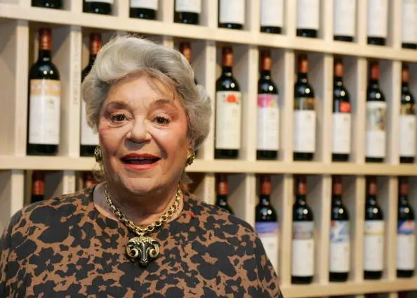

# 无标题

**链接地址:** http://mp.weixin.qq.com/s?__biz=MzIyMzU4OTc0MQ==&mid=2247485361&idx=1&sn=df96798a3ecd50d6184386f423e862d7&chksm=e81aa3b3df6d2aa536dbc50ed4e75ed7dbe56244a6a6acf3093245e78341ab1db7e0e37217cb&mpshare=1&scene=2&srcid=0308IGdY989o20yuQBud2bNo&sharer_sharetime=1615170392191&sharer_shareid=be1c8edd6c93eec155a61c876e41d26a#rd
**作者:** 
**获取时间:** 2025/8/28 19:51:53
**图片数量:** 21

---

## 原始HTML内容

<section style="box-sizing: border-box;font-size: 16px;"><section style="margin: 10px 0%;box-sizing: border-box;" powered-by="xiumi.us"><section style="display: inline-block;width: 100%;vertical-align: top;background-color: rgb(166, 54, 49);padding: 3px;box-sizing: border-box;"><section style="box-sizing: border-box;" powered-by="xiumi.us"><section style="display: flex;flex-flow: row nowrap;box-sizing: border-box;"><section style="display: inline-block;vertical-align: top;width: auto;flex: 50 50 0%;align-self: stretch;height: auto;background-color: rgb(255, 247, 244);padding: 3px;box-sizing: border-box;"><section style="display: inline-block;width: 100%;vertical-align: middle;border-style: solid;border-width: 1px;border-color: rgb(166, 54, 49);padding: 3px 10px 5px;align-self: center;box-sizing: border-box;" powered-by="xiumi.us"><section style="margin-top: 3px;margin-right: 0%;margin-left: 0%;box-sizing: border-box;" powered-by="xiumi.us"><section style="text-align: center;color: rgb(106, 106, 106);line-height: 1.2;font-size: 14px;box-sizing: border-box;">
<strong style="box-sizing: border-box;">点击蓝字</strong>
</section></section></section></section><section style="display: inline-block;vertical-align: middle;width: auto;padding-left: 3px;background-color: rgba(255, 255, 255, 0);flex: 50 50 0%;align-self: center;height: auto;box-sizing: border-box;"><section style="margin-top: 3px;margin-right: 0%;margin-left: 0%;box-sizing: border-box;" powered-by="xiumi.us"><section style="text-align: center;font-size: 14px;color: rgb(255, 255, 255);line-height: 1.2;box-sizing: border-box;">
<strong style="box-sizing: border-box;">关注我们</strong>
</section></section></section></section></section></section></section><section style="box-sizing: border-box;" powered-by="xiumi.us">
 
</section><section style="text-align: right;justify-content: flex-end;margin-top: 10px;margin-right: 0%;margin-left: 0%;box-sizing: border-box;" powered-by="xiumi.us"><section style="display: inline-block;width: auto;vertical-align: top;min-width: 10%;max-width: 100%;height: auto;background-color: rgb(166, 54, 49);padding: 5px 10px;border-width: 0px;box-sizing: border-box;"><section style="text-align: justify;color: rgb(255, 255, 255);font-size: 14px;box-sizing: border-box;" powered-by="xiumi.us">
<strong style="box-sizing: border-box;">特别专</strong><strong style="box-sizing: border-box;">题《罗斯柴尔德女爵》</strong>
</section></section></section><section style="display: inline-block;width: 100%;vertical-align: top;border-left: 2px none rgb(195, 163, 142);border-bottom-left-radius: 0px;background-color: rgba(255, 213, 195, 0);padding: 10px;border-right: 2px solid rgb(0, 0, 0);border-top-right-radius: 0px;box-sizing: border-box;" powered-by="xiumi.us"><section style="text-align: center;margin-right: 0%;margin-left: 0%;box-sizing: border-box;" powered-by="xiumi.us"><section style="max-width: 100%;vertical-align: middle;display: inline-block;line-height: 0;box-sizing: border-box;"></section></section></section><section style="text-align: right;justify-content: flex-end;margin-right: 0%;margin-bottom: 10px;margin-left: 0%;font-size: 0px;box-sizing: border-box;" powered-by="xiumi.us"><section style="display: inline-block;width: 50%;vertical-align: top;height: auto;line-height: 0;box-sizing: border-box;"><section style="margin-top: 0.5em;margin-bottom: 0.5em;box-sizing: border-box;" powered-by="xiumi.us"><section style="background-color: rgb(0, 0, 0);height: 2px;box-sizing: border-box;"><section><svg viewBox="0 0 1 1" style="float:left;line-height:0;width:0;vertical-align:top;"></svg></section></section></section></section></section><section style="box-sizing: border-box;" powered-by="xiumi.us"><section style="display: flex;flex-flow: row nowrap;margin: -10px 0% 10px;box-sizing: border-box;"><section style="display: inline-block;vertical-align: top;width: auto;flex: 0 0 auto;align-self: flex-start;min-width: 10%;max-width: 100%;height: auto;box-sizing: border-box;"><section style="color: rgb(0, 0, 0);font-size: 12px;box-sizing: border-box;" powered-by="xiumi.us">
&nbsp; &nbsp;专题出品 |&nbsp;加拿大汉嘉酒业&nbsp;
</section></section><section style="display: inline-block;vertical-align: top;width: auto;align-self: flex-start;flex: 100 100 0%;box-sizing: border-box;"><section style="margin-top: 0.5em;margin-bottom: 0.5em;box-sizing: border-box;" powered-by="xiumi.us"><section style="background-color: rgba(255, 213, 195, 0);height: 1px;box-sizing: border-box;"><section><svg viewBox="0 0 1 1" style="float:left;line-height:0;width:0;vertical-align:top;"></svg></section></section></section></section></section></section><section style="box-sizing: border-box;" powered-by="xiumi.us">
 
</section><section style="font-size: 14px;line-height: 2;letter-spacing: 2px;padding-right: 14px;padding-left: 14px;box-sizing: border-box;" powered-by="xiumi.us">
今年一月，葡萄酒权威媒体《醇鉴》（Decanter）发布了刚刚装瓶上市的&nbsp;<strong style="box-sizing: border-box;">2018年份波尔多葡萄酒评分</strong>。

 

其中来自木桐酒庄（Chateau Mouton Rothschild）的干红，在这份葡萄酒评分中拿到了<strong style="box-sizing: border-box;">满分的极高评价</strong>！

 
</section><section style="margin-right: 0%;margin-bottom: 20px;margin-left: 0%;text-align: center;justify-content: center;box-sizing: border-box;" powered-by="xiumi.us"><section style="display: inline-block;width: 90%;vertical-align: top;padding: 10px;border-style: dashed;border-width: 3px;border-radius: 5px;border-color: rgb(179, 179, 179);overflow: hidden;height: auto;box-sizing: border-box;"><section style="box-sizing: border-box;" powered-by="xiumi.us"><section style="display: inline-block;vertical-align: top;width: 40%;border-style: solid;border-width: 0px;border-color: rgb(213, 181, 113);padding-right: 6px;height: auto;box-sizing: border-box;"><section style="margin-right: 0%;margin-left: 0%;box-sizing: border-box;" powered-by="xiumi.us"><section style="max-width: 100%;vertical-align: middle;display: inline-block;line-height: 0;width: 100%;height: auto;box-sizing: border-box;"></section></section><section style="text-align: justify;font-size: 12px;color: rgb(115, 115, 114);padding-right: 15px;padding-left: 15px;box-sizing: border-box;" powered-by="xiumi.us">
 

木桐酒庄红葡萄酒2018年的艺术酒标由中国艺术家徐冰设计。
</section></section><section style="display: inline-block;vertical-align: top;width: 60%;height: auto;box-sizing: border-box;"><section style="text-align: justify;font-size: 12px;padding-right: 15px;padding-left: 15px;box-sizing: border-box;" powered-by="xiumi.us">
年份&nbsp;:&nbsp;2018 

产区 :&nbsp;法国波雅克 

净含量&nbsp;:&nbsp;750 ml

种类&nbsp;:&nbsp;红葡萄酒

酒精度&nbsp;:&nbsp;13％

酒庄&nbsp;:&nbsp;木桐酒庄（Chateau Mouton Rothschild） 

葡萄品种 ：赤霞珠90%、梅洛9%、味而多1%

上架日期：2021年下半年
</section><section style="text-align: justify;box-sizing: border-box;" powered-by="xiumi.us">
 
</section><section style="text-align: justify;box-sizing: border-box;" powered-by="xiumi.us">
 
</section><section style="text-align: justify;box-sizing: border-box;" powered-by="xiumi.us">
 
</section><section style="font-size: 12px;color: rgb(115, 115, 114);box-sizing: border-box;" powered-by="xiumi.us">
联系我们查询订购信息
</section></section></section></section></section><section style="font-size: 14px;line-height: 2;letter-spacing: 2px;padding-right: 14px;padding-left: 14px;box-sizing: border-box;" powered-by="xiumi.us">
 

说起法国波尔多五大一级庄之一的木桐酒庄，你或许知道它<strong style="box-sizing: border-box;">曾经开创了酒庄装瓶的先河</strong>，但我们今天要聊的却是运营这个酒庄背后的罗斯柴尔德男爵集团曾经的掌门人——<strong style="box-sizing: border-box;">菲丽屏•罗斯柴尔德女爵</strong>。 

 
</section><section style="box-sizing: border-box;" powered-by="xiumi.us"><section style="display: flex;flex-flow: row nowrap;margin: 10px 0%;box-sizing: border-box;"><section style="display: inline-block;vertical-align: top;width: auto;flex: 0 0 0%;align-self: stretch;height: auto;background-position: 50% 50%;background-repeat: no-repeat;background-size: 100% 100%;background-attachment: scroll;background-image: url(&quot;https://mmbiz.qpic.cn/mmbiz_png/7CNdqYbqvBIS8B87UrwPOj0qmce2kWA5vIKpMuGJjnkvUbKbdm0b4aiaTuDYcia12eQ4vLvnoGz7DuBu7dwtYYqQ/640?wx_fmt=png&quot;);box-sizing: border-box;"><section style="text-align: center;box-sizing: border-box;" powered-by="xiumi.us"><section style="display: inline-block;width: 15px;height: 15px;vertical-align: top;overflow: hidden;box-sizing: border-box;"><section><svg viewBox="0 0 1 1" style="float:left;line-height:0;width:0;vertical-align:top;"></svg></section></section></section></section><section style="display: inline-block;vertical-align: top;width: auto;flex: 100 100 0%;align-self: stretch;height: auto;box-sizing: border-box;"><section style="display: inline-block;width: 100%;vertical-align: top;border-width: 7px;border-style: solid;border-color: rgb(255, 254, 251);box-shadow: rgb(218, 203, 158) 0px 0px 10px;box-sizing: border-box;" powered-by="xiumi.us"><section style="text-align: center;margin-right: 0%;margin-left: 0%;box-sizing: border-box;" powered-by="xiumi.us"><section style="max-width: 100%;vertical-align: middle;display: inline-block;line-height: 0;box-shadow: rgb(0, 0, 0) 0px 0px 0px;box-sizing: border-box;"></section></section></section></section><section style="display: inline-block;vertical-align: top;width: auto;flex: 0 0 0%;align-self: stretch;height: auto;background-position: 50% 50%;background-repeat: no-repeat;background-size: 100% 100%;background-attachment: scroll;background-image: url(&quot;https://mmbiz.qpic.cn/mmbiz_png/7CNdqYbqvBIS8B87UrwPOj0qmce2kWA5ZGCnkQf8hBIqdtibIlDZcmCRlbvic5YMFEDtXFLqH1tuI9jtgWGBX2CA/640?wx_fmt=png&quot;);box-sizing: border-box;"><section style="text-align: center;box-sizing: border-box;" powered-by="xiumi.us"><section style="display: inline-block;width: 15px;height: 15px;vertical-align: top;overflow: hidden;box-sizing: border-box;"><section><svg viewBox="0 0 1 1" style="float:left;line-height:0;width:0;vertical-align:top;"></svg></section></section></section></section></section></section><section style="text-align: center;font-size: 12px;color: rgb(179, 179, 179);box-sizing: border-box;" powered-by="xiumi.us">
（菲丽屏•罗斯柴尔德女爵，1933年11月22日 - 2014年8月23日）
</section><section style="font-size: 14px;line-height: 2;letter-spacing: 2px;padding-right: 14px;padding-left: 14px;box-sizing: border-box;" powered-by="xiumi.us">
 

菲丽屏•罗斯柴尔德女爵（Baroness Philippine de Rothschild）于1933年11月22日在法国巴黎出生。

 

作为世界上最神秘最富有的罗斯柴尔德家族的分支，雄厚的背景和财富并没有赋予菲丽屏一个完美的童年。

 

她的父母，罗斯柴尔德男爵和伊丽莎白在菲丽屏五岁时就已离婚；她的母亲更是惨死在了纳粹集中营内。

 
</section><section style="box-sizing: border-box;" powered-by="xiumi.us"><section style="display: flex;flex-flow: row nowrap;margin: 10px 0%;box-sizing: border-box;"><section style="display: inline-block;vertical-align: top;width: auto;flex: 0 0 0%;align-self: stretch;height: auto;background-position: 50% 50%;background-repeat: no-repeat;background-size: 100% 100%;background-attachment: scroll;background-image: url(&quot;https://mmbiz.qpic.cn/mmbiz_png/7CNdqYbqvBIS8B87UrwPOj0qmce2kWA5vIKpMuGJjnkvUbKbdm0b4aiaTuDYcia12eQ4vLvnoGz7DuBu7dwtYYqQ/640?wx_fmt=png&quot;);box-sizing: border-box;"><section style="text-align: center;box-sizing: border-box;" powered-by="xiumi.us"><section style="display: inline-block;width: 15px;height: 15px;vertical-align: top;overflow: hidden;box-sizing: border-box;"><section><svg viewBox="0 0 1 1" style="float:left;line-height:0;width:0;vertical-align:top;"></svg></section></section></section></section><section style="display: inline-block;vertical-align: top;width: auto;flex: 100 100 0%;align-self: stretch;height: auto;box-sizing: border-box;"><section style="display: inline-block;width: 100%;vertical-align: top;border-width: 7px;border-style: solid;border-color: rgb(255, 254, 251);box-shadow: rgb(218, 203, 158) 0px 0px 10px;box-sizing: border-box;" powered-by="xiumi.us"><section style="text-align: center;margin-right: 0%;margin-left: 0%;box-sizing: border-box;" powered-by="xiumi.us"><section style="max-width: 100%;vertical-align: middle;display: inline-block;line-height: 0;box-shadow: rgb(0, 0, 0) 0px 0px 0px;box-sizing: border-box;"></section></section></section></section><section style="display: inline-block;vertical-align: top;width: auto;flex: 0 0 0%;align-self: stretch;height: auto;background-position: 50% 50%;background-repeat: no-repeat;background-size: 100% 100%;background-attachment: scroll;background-image: url(&quot;https://mmbiz.qpic.cn/mmbiz_png/7CNdqYbqvBIS8B87UrwPOj0qmce2kWA5ZGCnkQf8hBIqdtibIlDZcmCRlbvic5YMFEDtXFLqH1tuI9jtgWGBX2CA/640?wx_fmt=png&quot;);box-sizing: border-box;"><section style="text-align: center;box-sizing: border-box;" powered-by="xiumi.us"><section style="display: inline-block;width: 15px;height: 15px;vertical-align: top;overflow: hidden;box-sizing: border-box;"><section><svg viewBox="0 0 1 1" style="float:left;line-height:0;width:0;vertical-align:top;"></svg></section></section></section></section></section></section><section style="text-align: center;font-size: 12px;color: rgb(179, 179, 179);box-sizing: border-box;" powered-by="xiumi.us">
（菲丽屏的舞台表演剧照）
</section><section style="font-size: 14px;line-height: 2;letter-spacing: 2px;padding-right: 14px;padding-left: 14px;box-sizing: border-box;" powered-by="xiumi.us">
 

在进入葡萄酒的世界之前，菲丽屏一直进行着自己的<strong style="box-sizing: border-box;">演艺事业</strong>。1958年她从巴黎国立高等艺术戏剧学院毕业，并成为了一名事业有成的<strong style="box-sizing: border-box;">法国舞台喜剧演员</strong>。

 

1981年她开始介入家族酒庄的工作，将对艺术的喜爱注入葡萄酒中。木桐酒庄以为不同年份的葡萄酒<strong style="box-sizing: border-box;">独特设计的艺术酒标</strong>而闻名于世，这也让木桐酒庄的红酒比其他酒庄<strong style="box-sizing: border-box;">更添收藏价值和艺术趣味</strong>。

 
</section><section style="margin-right: 0%;margin-bottom: 20px;margin-left: 0%;text-align: center;justify-content: center;box-sizing: border-box;" powered-by="xiumi.us"><section style="display: inline-block;width: 90%;vertical-align: top;padding: 10px;border-style: dashed;border-width: 3px;border-radius: 5px;border-color: rgb(179, 179, 179);overflow: hidden;height: auto;box-sizing: border-box;"><section style="box-sizing: border-box;" powered-by="xiumi.us"><section style="display: inline-block;vertical-align: top;width: 40%;border-style: solid;border-width: 0px;border-color: rgb(213, 181, 113);padding-right: 6px;height: auto;box-sizing: border-box;"><section style="margin-right: 0%;margin-left: 0%;box-sizing: border-box;" powered-by="xiumi.us"><section style="max-width: 100%;vertical-align: middle;display: inline-block;line-height: 0;width: 100%;height: auto;box-sizing: border-box;"></section></section><section style="text-align: justify;font-size: 12px;color: rgb(115, 115, 114);padding-right: 15px;padding-left: 15px;box-sizing: border-box;" powered-by="xiumi.us">
 

英国查尔斯王子亲自为木桐酒庄绘制一幅水彩作为酒标，为英法两国于1904年订立的友好协议的百年纪念。
</section></section><section style="display: inline-block;vertical-align: top;width: 60%;height: auto;box-sizing: border-box;"><section style="text-align: justify;font-size: 12px;padding-right: 15px;padding-left: 15px;box-sizing: border-box;" powered-by="xiumi.us">
AB&nbsp;SKU: 841474

年份&nbsp;:&nbsp;2004 

产区 :&nbsp;法国波雅克 

净含量&nbsp;:&nbsp;750 ml

种类&nbsp;:&nbsp;红葡萄酒

酒精度&nbsp;:&nbsp;13％

酒庄&nbsp;:&nbsp;木桐酒庄（Chateau Mouton Rothschild） 

葡萄品种 ：赤霞珠83%、梅洛17%
</section><section style="text-align: justify;box-sizing: border-box;" powered-by="xiumi.us">
 
</section><section style="text-align: justify;box-sizing: border-box;" powered-by="xiumi.us">
 
</section><section style="text-align: justify;box-sizing: border-box;" powered-by="xiumi.us">
 
</section><section style="text-align: justify;box-sizing: border-box;" powered-by="xiumi.us">
 
</section><section style="text-align: justify;box-sizing: border-box;" powered-by="xiumi.us">
 
</section><section style="font-size: 12px;color: rgb(115, 115, 114);box-sizing: border-box;" powered-by="xiumi.us">
联系我们查询订购信息
</section></section></section></section></section><section style="font-size: 14px;line-height: 2;letter-spacing: 2px;padding-right: 14px;padding-left: 14px;box-sizing: border-box;" powered-by="xiumi.us">
 

每一位设计酒标的艺术家都由菲丽屏亲自挑选。<strong style="box-sizing: border-box;">该酒庄于1996年、2008年和2018年曾多次力邀中国艺术家主导设计当年出品红酒的酒标。</strong>

 
</section><section style="box-sizing: border-box;" powered-by="xiumi.us"><section style="display: flex;flex-flow: row nowrap;margin: 10px 0%;box-sizing: border-box;"><section style="display: inline-block;vertical-align: top;width: auto;flex: 0 0 0%;align-self: stretch;height: auto;background-position: 50% 50%;background-repeat: no-repeat;background-size: 100% 100%;background-attachment: scroll;background-image: url(&quot;https://mmbiz.qpic.cn/mmbiz_png/7CNdqYbqvBIS8B87UrwPOj0qmce2kWA5vIKpMuGJjnkvUbKbdm0b4aiaTuDYcia12eQ4vLvnoGz7DuBu7dwtYYqQ/640?wx_fmt=png&quot;);box-sizing: border-box;"><section style="text-align: center;box-sizing: border-box;" powered-by="xiumi.us"><section style="display: inline-block;width: 15px;height: 15px;vertical-align: top;overflow: hidden;box-sizing: border-box;"><section><svg viewBox="0 0 1 1" style="float:left;line-height:0;width:0;vertical-align:top;"></svg></section></section></section></section><section style="display: inline-block;vertical-align: top;width: auto;flex: 100 100 0%;align-self: stretch;height: auto;box-sizing: border-box;"><section style="display: inline-block;width: 100%;vertical-align: top;border-width: 7px;border-style: solid;border-color: rgb(255, 254, 251);box-shadow: rgb(218, 203, 158) 0px 0px 10px;box-sizing: border-box;" powered-by="xiumi.us"><section style="text-align: center;margin-right: 0%;margin-left: 0%;box-sizing: border-box;" powered-by="xiumi.us"><section style="max-width: 100%;vertical-align: middle;display: inline-block;line-height: 0;box-shadow: rgb(0, 0, 0) 0px 0px 0px;box-sizing: border-box;"></section></section></section></section><section style="display: inline-block;vertical-align: top;width: auto;flex: 0 0 0%;align-self: stretch;height: auto;background-position: 50% 50%;background-repeat: no-repeat;background-size: 100% 100%;background-attachment: scroll;background-image: url(&quot;https://mmbiz.qpic.cn/mmbiz_png/7CNdqYbqvBIS8B87UrwPOj0qmce2kWA5ZGCnkQf8hBIqdtibIlDZcmCRlbvic5YMFEDtXFLqH1tuI9jtgWGBX2CA/640?wx_fmt=png&quot;);box-sizing: border-box;"><section style="text-align: center;box-sizing: border-box;" powered-by="xiumi.us"><section style="display: inline-block;width: 15px;height: 15px;vertical-align: top;overflow: hidden;box-sizing: border-box;"><section><svg viewBox="0 0 1 1" style="float:left;line-height:0;width:0;vertical-align:top;"></svg></section></section></section></section></section></section><section style="text-align: center;font-size: 12px;color: rgb(179, 179, 179);box-sizing: border-box;" powered-by="xiumi.us">
（菲丽屏与她的父亲——罗斯柴尔德男爵）
</section><section style="font-size: 14px;line-height: 2;letter-spacing: 2px;padding-right: 14px;padding-left: 14px;box-sizing: border-box;" powered-by="xiumi.us">
 

木桐酒庄的基石是由菲丽屏的父亲打下。<strong style="box-sizing: border-box;">1973年该酒庄由二级庄晋升为一级庄。</strong>

 

1979年，罗斯柴尔德男爵与美国葡萄酒之父罗伯特·蒙大维建立合作关系，在加州纳帕谷（Napa Valley）的奥克维尔（Oakville）创建了如今享有<strong style="box-sizing: border-box;">“美国酒王”之称的作品一号酒庄（Opus One Winery）</strong>。

 
</section><section style="margin-right: 0%;margin-bottom: 20px;margin-left: 0%;text-align: center;justify-content: center;box-sizing: border-box;" powered-by="xiumi.us"><section style="display: inline-block;width: 90%;vertical-align: top;padding: 10px;border-style: dashed;border-width: 3px;border-radius: 5px;border-color: rgb(179, 179, 179);overflow: hidden;height: auto;box-sizing: border-box;"><section style="box-sizing: border-box;" powered-by="xiumi.us"><section style="display: inline-block;vertical-align: top;width: 40%;border-style: solid;border-width: 0px;border-color: rgb(213, 181, 113);padding-right: 6px;height: auto;box-sizing: border-box;"><section style="margin-right: 0%;margin-left: 0%;box-sizing: border-box;" powered-by="xiumi.us"><section style="max-width: 100%;vertical-align: middle;display: inline-block;line-height: 0;width: 65%;height: auto;box-sizing: border-box;"></section></section></section><section style="display: inline-block;vertical-align: top;width: 60%;height: auto;box-sizing: border-box;"><section style="text-align: justify;font-size: 12px;padding-right: 15px;padding-left: 15px;box-sizing: border-box;" powered-by="xiumi.us">
AB&nbsp;SKU: 841900

年份&nbsp;:&nbsp;2017 

产区 :&nbsp;美国加州奥克维尔 

净含量&nbsp;:&nbsp;750 ml

种类&nbsp;:&nbsp;红葡萄酒

酒精度&nbsp;:&nbsp;14.5％

酒庄&nbsp;:&nbsp;作品一号酒庄（Opus One Winery） 

葡萄品种 ：赤霞珠 81%，小维尔多 8.5%， 品丽珠 5%， 梅洛 4.5%， 马尔贝克 1%
</section><section style="margin-top: 10px;margin-bottom: 10px;justify-content: center;box-sizing: border-box;" powered-by="xiumi.us"><section style="max-width: 100%;vertical-align: middle;display: inline-block;line-height: 0;width: 35%;height: auto;box-sizing: border-box;"></section></section><section style="font-size: 12px;color: rgb(115, 115, 114);box-sizing: border-box;" powered-by="xiumi.us">
扫码了解更多信息
</section></section></section></section></section><section style="font-size: 14px;line-height: 2;letter-spacing: 2px;padding-right: 14px;padding-left: 14px;box-sizing: border-box;" powered-by="xiumi.us">
 

1988年，菲丽屏的父亲罗斯柴尔德男爵辞世，她接替父亲成为了木桐酒庄的第五代庄主，并根据父亲既定的方向开始创建市场急需的波尔多酒，<strong style="box-sizing: border-box;">副牌Le Petit Mouton de Mouton Rothschild（小木桐）</strong>，一经推出就在市场上获得了巨大的成功。 

 

菲丽屏延续了家族的辉煌，她带领着罗斯柴尔德男爵在获得优良口碑和商业成功的同时，<strong style="box-sizing: border-box;">不断巩固着木桐酒庄的在法国葡萄酒界的地位，并积极开拓着海外的葡萄酒市场。</strong>

 
</section><section style="margin-right: 0%;margin-bottom: 20px;margin-left: 0%;text-align: center;justify-content: center;box-sizing: border-box;" powered-by="xiumi.us"><section style="display: inline-block;width: 90%;vertical-align: top;padding: 10px;border-style: dashed;border-width: 3px;border-radius: 5px;border-color: rgb(179, 179, 179);overflow: hidden;height: auto;box-sizing: border-box;"><section style="box-sizing: border-box;" powered-by="xiumi.us"><section style="display: inline-block;vertical-align: top;width: 40%;border-style: solid;border-width: 0px;border-color: rgb(213, 181, 113);padding-right: 6px;height: auto;box-sizing: border-box;"><section style="margin-right: 0%;margin-left: 0%;box-sizing: border-box;" powered-by="xiumi.us"><section style="max-width: 100%;vertical-align: middle;display: inline-block;line-height: 0;width: 70%;height: auto;box-sizing: border-box;"></section></section></section><section style="display: inline-block;vertical-align: top;width: 60%;height: auto;box-sizing: border-box;"><section style="text-align: justify;font-size: 12px;padding-right: 15px;padding-left: 15px;box-sizing: border-box;" powered-by="xiumi.us">
AB SKU: 841899

年份&nbsp;:&nbsp;2018 

产区 : 智利&nbsp;Maipo Valley 

净含量&nbsp;:&nbsp;750 ml

种类&nbsp;:&nbsp;红葡萄酒

酒精度&nbsp;:&nbsp;14％

酒庄&nbsp;:&nbsp;&nbsp;活灵魂酒庄 （Almaviva） 

葡萄品种 ：赤霞珠 72% 、&nbsp;佳美娜 19% 、&nbsp;品丽珠&nbsp; 6% 、小维多 3%
</section><section style="margin-top: 10px;margin-bottom: 10px;justify-content: center;box-sizing: border-box;" powered-by="xiumi.us"><section style="max-width: 100%;vertical-align: middle;display: inline-block;line-height: 0;width: 35%;height: auto;box-sizing: border-box;"></section></section><section style="font-size: 12px;color: rgb(115, 115, 114);box-sizing: border-box;" powered-by="xiumi.us">
扫码了解更多信息
</section></section></section></section></section><section style="font-size: 14px;line-height: 2;letter-spacing: 2px;padding-right: 14px;padding-left: 14px;box-sizing: border-box;" powered-by="xiumi.us">
 

1997年，菲莉嫔受邀前往智利，与该国<strong style="box-sizing: border-box;">最大的葡萄酒业集团干露酒庄</strong>的庄主爱德华多·吉利萨斯蒂·塔格莱签订合作协议，并创建了<strong style="box-sizing: border-box;">“智利酒王”活灵魂酒庄（Almaviva Winery</strong>）。 

 
</section><section style="box-sizing: border-box;" powered-by="xiumi.us"><section style="display: flex;flex-flow: row nowrap;margin: 10px 0%;box-sizing: border-box;"><section style="display: inline-block;vertical-align: top;width: auto;flex: 0 0 0%;align-self: stretch;height: auto;background-position: 50% 50%;background-repeat: no-repeat;background-size: 100% 100%;background-attachment: scroll;background-image: url(&quot;https://mmbiz.qpic.cn/mmbiz_png/7CNdqYbqvBIS8B87UrwPOj0qmce2kWA5vIKpMuGJjnkvUbKbdm0b4aiaTuDYcia12eQ4vLvnoGz7DuBu7dwtYYqQ/640?wx_fmt=png&quot;);box-sizing: border-box;"><section style="text-align: center;box-sizing: border-box;" powered-by="xiumi.us"><section style="display: inline-block;width: 15px;height: 15px;vertical-align: top;overflow: hidden;box-sizing: border-box;"><section><svg viewBox="0 0 1 1" style="float:left;line-height:0;width:0;vertical-align:top;"></svg></section></section></section></section><section style="display: inline-block;vertical-align: top;width: auto;flex: 100 100 0%;align-self: stretch;height: auto;box-sizing: border-box;"><section style="display: inline-block;width: 100%;vertical-align: top;border-width: 7px;border-style: solid;border-color: rgb(255, 254, 251);box-shadow: rgb(218, 203, 158) 0px 0px 10px;box-sizing: border-box;" powered-by="xiumi.us"><section style="text-align: center;margin-right: 0%;margin-left: 0%;box-sizing: border-box;" powered-by="xiumi.us"><section style="max-width: 100%;vertical-align: middle;display: inline-block;line-height: 0;box-shadow: rgb(0, 0, 0) 0px 0px 0px;box-sizing: border-box;"></section></section></section></section><section style="display: inline-block;vertical-align: top;width: auto;flex: 0 0 0%;align-self: stretch;height: auto;background-position: 50% 50%;background-repeat: no-repeat;background-size: 100% 100%;background-attachment: scroll;background-image: url(&quot;https://mmbiz.qpic.cn/mmbiz_png/7CNdqYbqvBIS8B87UrwPOj0qmce2kWA5ZGCnkQf8hBIqdtibIlDZcmCRlbvic5YMFEDtXFLqH1tuI9jtgWGBX2CA/640?wx_fmt=png&quot;);box-sizing: border-box;"><section style="text-align: center;box-sizing: border-box;" powered-by="xiumi.us"><section style="display: inline-block;width: 15px;height: 15px;vertical-align: top;overflow: hidden;box-sizing: border-box;"><section><svg viewBox="0 0 1 1" style="float:left;line-height:0;width:0;vertical-align:top;"></svg></section></section></section></section></section></section><section style="text-align: left;font-size: 12px;color: rgb(179, 179, 179);box-sizing: border-box;" powered-by="xiumi.us">
（菲丽屏•罗斯柴尔德女爵与干露酒庄的庄主爱德华多·吉利萨斯蒂·塔格莱签订合作协议）
</section><section style="font-size: 14px;line-height: 2;letter-spacing: 2px;padding-right: 14px;padding-left: 14px;box-sizing: border-box;" powered-by="xiumi.us">
 

菲莉嫔不仅是木桐酒庄的庄主，同时还是<strong style="box-sizing: border-box;">罗斯柴尔德的董事长和大股东</strong>。她帮助改善了公司很多产品的质量，并增加众多品牌的全球销售，比如克莱米隆酒庄（Chateau Clerc Milon）和达玛雅克酒庄（Chateau d'Armailhac）。

 
</section><section style="margin-right: 0%;margin-bottom: 20px;margin-left: 0%;text-align: center;justify-content: center;box-sizing: border-box;" powered-by="xiumi.us"><section style="display: inline-block;width: 90%;vertical-align: top;padding: 10px;border-style: dashed;border-width: 3px;border-radius: 5px;border-color: rgb(179, 179, 179);overflow: hidden;height: auto;box-sizing: border-box;"><section style="box-sizing: border-box;" powered-by="xiumi.us"><section style="display: inline-block;vertical-align: top;width: 40%;border-style: solid;border-width: 0px;border-color: rgb(213, 181, 113);padding-right: 6px;height: auto;box-sizing: border-box;"><section style="margin-right: 0%;margin-left: 0%;box-sizing: border-box;" powered-by="xiumi.us"><section style="max-width: 100%;vertical-align: middle;display: inline-block;line-height: 0;width: 75%;height: auto;box-sizing: border-box;"></section></section></section><section style="display: inline-block;vertical-align: top;width: 60%;height: auto;box-sizing: border-box;"><section style="text-align: justify;font-size: 12px;padding-right: 15px;padding-left: 15px;box-sizing: border-box;" powered-by="xiumi.us">
年份&nbsp;:&nbsp;2018 

产区 :&nbsp;法国波雅克 

净含量&nbsp;:&nbsp;750 ml

种类&nbsp;:&nbsp;红葡萄酒

酒精度&nbsp;:&nbsp;13.5％

酒庄&nbsp;:&nbsp;达玛雅克酒庄（Chateau d'Armailhac） 

葡萄品种 ：62%赤霞珠、27%梅洛、9%品丽珠、2%味而多

上架日期：2021年下半年
</section><section style="margin-top: 10px;margin-bottom: 10px;justify-content: center;box-sizing: border-box;" powered-by="xiumi.us"><section style="max-width: 100%;vertical-align: middle;display: inline-block;line-height: 0;width: 35%;height: auto;box-sizing: border-box;"></section></section><section style="font-size: 12px;color: rgb(115, 115, 114);box-sizing: border-box;" powered-by="xiumi.us">
扫码了解更多信息
</section></section></section></section></section><section style="font-size: 14px;line-height: 2;letter-spacing: 2px;padding-right: 14px;padding-left: 14px;box-sizing: border-box;" powered-by="xiumi.us">
 

1997年，菲丽屏从波尔多葡萄酒大师协会获得<strong style="box-sizing: border-box;">“终身成就奖”</strong>。媒体评选出的葡萄酒财富人物中，她位居法国<strong style="box-sizing: border-box;">葡萄酒财富排行榜第四名</strong>。公司在她的运营下每年销售超过<strong style="box-sizing: border-box;">3.5亿美元</strong>的葡萄酒。

 

2014年，菲丽屏女爵逝世。而木桐酒庄则交由她的三位子女——卡米尔·素汉·罗斯柴尔德、菲利普·素汉·罗斯柴尔德和朱利安·博马舍·罗斯柴尔德共同管理。

 

这位美貌与智慧并存的“葡萄酒女王”凭着惊人的毅力和天赋<strong style="box-sizing: border-box;">在葡萄酒界获得了极其耀眼的成就</strong>，在男性占据着绝对话语权的葡萄酒产业中占据了一席之地。

 

<strong style="box-sizing: border-box;">然而她并非葡萄酒界唯一的女掌门。</strong>

 
</section><section style="text-align: center;margin-top: 10px;margin-bottom: 10px;box-sizing: border-box;" powered-by="xiumi.us"><section style="max-width: 100%;vertical-align: middle;display: inline-block;line-height: 0;box-sizing: border-box;"></section></section><section style="text-align: center;font-size: 12px;color: rgb(179, 179, 179);box-sizing: border-box;" powered-by="xiumi.us">
科琳娜·门泽普洛斯（Corinne Mentzelopoulos）
</section><section style="font-size: 14px;line-height: 2;letter-spacing: 2px;padding-right: 14px;padding-left: 14px;box-sizing: border-box;" powered-by="xiumi.us">
 

现年64岁的科琳娜·门泽普洛斯（Corinne Mentzelopoulos）是<strong style="box-sizing: border-box;">波尔多1855一级庄玛歌酒庄（Chateau Margaux）</strong>的现任庄主。

 

科琳娜在年仅27岁时便接手了处于窘境中的玛歌酒庄。当时对酒庄的运营一窍不通她通过不断的学习和改进，在著名酿酒学家埃米耶·佩诺和父亲原班人马的大力支持，带领酒庄一步步恢复往日荣光，<strong style="box-sizing: border-box;">成就了今日无上辉煌的一级名庄</strong>。

 
</section><section style="text-align: center;margin-top: 10px;margin-bottom: 10px;box-sizing: border-box;" powered-by="xiumi.us"><section style="max-width: 100%;vertical-align: middle;display: inline-block;line-height: 0;box-sizing: border-box;"></section></section><section style="text-align: center;font-size: 12px;color: rgb(179, 179, 179);box-sizing: border-box;" powered-by="xiumi.us">
萨斯基亚·罗斯柴尔德（Saskia de Rothschild）
</section><section style="font-size: 14px;line-height: 2;letter-spacing: 2px;padding-right: 14px;padding-left: 14px;box-sizing: border-box;" powered-by="xiumi.us">
 

另外，大名鼎鼎的拉菲古堡的现任女掌门人，正是年仅34岁的<strong style="box-sizing: border-box;">萨斯基亚·罗斯柴尔德（Saskia de Rothschild）</strong>。

 

她不仅是波尔多一级酒庄拉菲罗斯柴尔德古堡(Chateau Lafite Rothschild)<strong style="box-sizing: border-box;">最年轻的现任掌门人</strong>，还是这个在三大洲拥有7家酒庄的<strong style="box-sizing: border-box;">拉菲罗斯柴尔德集团的第一位女主席</strong>。

 
</section><section style="box-sizing: border-box;" powered-by="xiumi.us"><section style="display: flex;flex-flow: row nowrap;margin: 10px 0%;box-sizing: border-box;"><section style="display: inline-block;vertical-align: top;width: auto;flex: 0 0 0%;align-self: stretch;height: auto;background-position: 50% 50%;background-repeat: no-repeat;background-size: 100% 100%;background-attachment: scroll;background-image: url(&quot;https://mmbiz.qpic.cn/mmbiz_png/7CNdqYbqvBIS8B87UrwPOj0qmce2kWA5vIKpMuGJjnkvUbKbdm0b4aiaTuDYcia12eQ4vLvnoGz7DuBu7dwtYYqQ/640?wx_fmt=png&quot;);box-sizing: border-box;"><section style="text-align: center;box-sizing: border-box;" powered-by="xiumi.us"><section style="display: inline-block;width: 15px;height: 15px;vertical-align: top;overflow: hidden;box-sizing: border-box;"><section><svg viewBox="0 0 1 1" style="float:left;line-height:0;width:0;vertical-align:top;"></svg></section></section></section></section><section style="display: inline-block;vertical-align: top;width: auto;flex: 100 100 0%;align-self: stretch;height: auto;box-sizing: border-box;"><section style="display: inline-block;width: 100%;vertical-align: top;border-width: 7px;border-style: solid;border-color: rgb(255, 254, 251);box-shadow: rgb(218, 203, 158) 0px 0px 10px;box-sizing: border-box;" powered-by="xiumi.us"><section style="text-align: center;margin-right: 0%;margin-left: 0%;box-sizing: border-box;" powered-by="xiumi.us"><section style="max-width: 100%;vertical-align: middle;display: inline-block;line-height: 0;box-shadow: rgb(0, 0, 0) 0px 0px 0px;box-sizing: border-box;"></section></section></section></section><section style="display: inline-block;vertical-align: top;width: auto;flex: 0 0 0%;align-self: stretch;height: auto;background-position: 50% 50%;background-repeat: no-repeat;background-size: 100% 100%;background-attachment: scroll;background-image: url(&quot;https://mmbiz.qpic.cn/mmbiz_png/7CNdqYbqvBIS8B87UrwPOj0qmce2kWA5ZGCnkQf8hBIqdtibIlDZcmCRlbvic5YMFEDtXFLqH1tuI9jtgWGBX2CA/640?wx_fmt=png&quot;);box-sizing: border-box;"><section style="text-align: center;box-sizing: border-box;" powered-by="xiumi.us"><section style="display: inline-block;width: 15px;height: 15px;vertical-align: top;overflow: hidden;box-sizing: border-box;"><section><svg viewBox="0 0 1 1" style="float:left;line-height:0;width:0;vertical-align:top;"></svg></section></section></section></section></section></section><section style="font-size: 14px;line-height: 2;letter-spacing: 2px;padding-right: 14px;padding-left: 14px;box-sizing: border-box;" powered-by="xiumi.us">
 

随着时代的变迁，越来越多年轻又有能力的女性开始加入了葡萄酒行业。在葡萄酒生产、管理、推广、销售的各个环节中都<strong style="box-sizing: border-box;">充满辛勤又智慧的女性身影</strong>。让这个曾以守旧与传统著称的行业焕发了新鲜的活力与夺目的光彩。

 

在3月8日国际妇女节这个重要的节日中，让我们<strong style="box-sizing: border-box;">向这些伟大的女性葡萄酒从业者们致敬与喝彩</strong>，感谢她们对于葡萄酒行业做出的杰出贡献！

 

 
</section><section style="margin: 10px 0%;box-sizing: border-box;" powered-by="xiumi.us"><section style="display: inline-block;width: 100%;vertical-align: top;background-color: rgba(162, 162, 162, 0.36);border-width: 1px 4px;border-style: solid none;border-color: rgba(162, 162, 162, 0.36) rgb(205, 240, 255);box-sizing: border-box;"><section style="box-sizing: border-box;" powered-by="xiumi.us"><section style="display: inline-block;vertical-align: middle;width: 33%;align-self: center;height: auto;box-shadow: rgba(255, 213, 195, 0) 0px 0px 0px;box-sizing: border-box;"><section style="text-align: right;margin: -4px 0%;justify-content: flex-end;box-sizing: border-box;" powered-by="xiumi.us"><section style="max-width: 100%;vertical-align: middle;display: inline-block;line-height: 0;width: 90%;height: auto;box-shadow: rgb(166, 54, 49) 0px 0px 0px;border-style: solid none;border-width: 6px 4px;border-color: rgb(166, 54, 49) rgb(255, 211, 44);box-sizing: border-box;"></section></section></section><section style="display: inline-block;vertical-align: middle;width: 66%;height: auto;align-self: center;box-sizing: border-box;"><section style="margin-right: 0%;margin-left: 0%;box-sizing: border-box;" powered-by="xiumi.us"><section style="text-align: center;font-size: 14px;color: rgb(124, 119, 219);letter-spacing: 0px;line-height: 1.6;padding-right: 20px;padding-left: 20px;box-sizing: border-box;">
<strong style="box-sizing: border-box;">汉嘉酒业</strong>

<strong style="box-sizing: border-box;">扫描二维码</strong><strong style="letter-spacing: 0px;box-sizing: border-box;">关注我们</strong>

http://www.sinocansupply.com/

Email: info@sinocansupply.com
</section></section></section></section></section></section><section style="font-size: 14px;line-height: 2;letter-spacing: 2px;padding-right: 14px;padding-left: 14px;box-sizing: border-box;" powered-by="xiumi.us">
 

<strong style="box-sizing: border-box;">文章参考：</strong>

https://m.winesinfo.com/NewsDetail.aspx?id=58463

https://ijiu.ifeng.com/44821793/news.shtml?&amp;back&amp;back&amp;back

 
</section><section style="box-sizing: border-box;" powered-by="xiumi.us">
 
</section><section style="margin: 10px 0%;box-sizing: border-box;" powered-by="xiumi.us"><section style="display: inline-block;width: 100%;vertical-align: top;box-shadow: rgb(0, 0, 0) 0px 0px 0px;background-color: rgb(241, 241, 241);padding: 10px;box-sizing: border-box;"><section style="text-align: center;justify-content: center;box-sizing: border-box;" powered-by="xiumi.us"><section style="display: inline-block;width: 100%;vertical-align: top;background-color: rgb(255, 255, 255);padding: 20px 10px;height: auto;box-shadow: rgb(198, 198, 198) 0px 0px 2px;border-width: 0px;border-radius: 6px;border-style: none;border-color: rgb(62, 62, 62);overflow: hidden;box-sizing: border-box;"><section style="text-align: justify;color: rgb(189, 189, 189);box-sizing: border-box;" powered-by="xiumi.us">
<strong style="box-sizing: border-box;">往期精品</strong>
</section><section style="text-align: justify;box-sizing: border-box;" powered-by="xiumi.us">
 
</section><section style="box-sizing: border-box;" powered-by="xiumi.us"><section style="display: flex;flex-flow: row nowrap;margin-right: 0%;margin-bottom: 20px;margin-left: 0%;box-sizing: border-box;"><section style="display: inline-block;vertical-align: top;width: auto;flex: 100 100 0%;align-self: flex-start;height: auto;box-shadow: rgb(0, 0, 0) 0px 0px 0px;border-bottom: 1px dashed rgba(106, 106, 106, 0.25);border-bottom-right-radius: 0px;margin-right: 10px;box-sizing: border-box;"><section style="text-align: justify;font-size: 14px;box-sizing: border-box;" powered-by="xiumi.us">
<a target="_blank" href="http://mp.weixin.qq.com/s?__biz=MzIyMzU4OTc0MQ==&amp;mid=2247485326&amp;idx=2&amp;sn=4e484e2a792e1a95843b3c8b1847196c&amp;chksm=e81aa38cdf6d2a9a40f5e0ba625c0c4790efe0575f78890fe708aa42daf52d079fb4fa94bbf7&amp;scene=21#wechat_redirect" textvalue="饮灯酒、唱酒歌、对酒联…元宵酒俗原来这么秀！" data-itemshowtype="0" tab="innerlink" data-linktype="2">饮灯酒、唱酒歌、对酒联…元宵酒俗原来这么秀！</a>
</section></section><section style="display: inline-block;vertical-align: top;width: auto;flex: 20 20 0%;align-self: flex-start;height: auto;border-width: 0px;margin-left: 5px;box-sizing: border-box;"><section style="margin-right: 0%;margin-left: 0%;box-sizing: border-box;" powered-by="xiumi.us"><section style="max-width: 100%;vertical-align: middle;display: inline-block;line-height: 0;box-shadow: rgb(0, 0, 0) 0px 0px 0px;box-sizing: border-box;"><a target="_blank" href="http://mp.weixin.qq.com/s?__biz=MzIyMzU4OTc0MQ==&amp;mid=2247485326&amp;idx=2&amp;sn=4e484e2a792e1a95843b3c8b1847196c&amp;chksm=e81aa38cdf6d2a9a40f5e0ba625c0c4790efe0575f78890fe708aa42daf52d079fb4fa94bbf7&amp;scene=21#wechat_redirect" textvalue="你已选中了添加链接的内容" data-itemshowtype="0" tab="innerlink" data-linktype="1"></a></section></section></section></section></section><section style="box-sizing: border-box;" powered-by="xiumi.us"><section style="display: flex;flex-flow: row nowrap;box-sizing: border-box;"><section style="display: inline-block;vertical-align: top;width: auto;flex: 100 100 0%;align-self: flex-start;height: auto;box-shadow: rgb(0, 0, 0) 0px 0px 0px;border-bottom: 1px dashed rgba(106, 106, 106, 0.25);border-bottom-right-radius: 0px;margin-right: 10px;box-sizing: border-box;"><section style="text-align: justify;font-size: 14px;box-sizing: border-box;" powered-by="xiumi.us">
<a target="_blank" href="http://mp.weixin.qq.com/s?__biz=MzIyMzU4OTc0MQ==&amp;mid=2247485262&amp;idx=1&amp;sn=5b7f6ce72209442f2188f47edc2cfd6e&amp;chksm=e81aa34cdf6d2a5af15e098ef8e5e0d35db93b8773ffc63b50588b2cf7af010b385c9caadc68&amp;scene=21#wechat_redirect" textvalue="国家喝酒日居然在这天！您，开瓶了吗？" data-itemshowtype="0" tab="innerlink" data-linktype="2">国家喝酒日居然在这天！您，开瓶了吗？</a>

 
</section></section><section style="display: inline-block;vertical-align: top;width: auto;flex: 20 20 0%;align-self: flex-start;height: auto;border-width: 0px;margin-left: 5px;box-sizing: border-box;"><section style="margin-right: 0%;margin-left: 0%;box-sizing: border-box;" powered-by="xiumi.us"><section style="max-width: 100%;vertical-align: middle;display: inline-block;line-height: 0;box-shadow: rgb(0, 0, 0) 0px 0px 0px;box-sizing: border-box;"><a target="_blank" href="http://mp.weixin.qq.com/s?__biz=MzIyMzU4OTc0MQ==&amp;mid=2247485262&amp;idx=1&amp;sn=5b7f6ce72209442f2188f47edc2cfd6e&amp;chksm=e81aa34cdf6d2a5af15e098ef8e5e0d35db93b8773ffc63b50588b2cf7af010b385c9caadc68&amp;scene=21#wechat_redirect" textvalue="你已选中了添加链接的内容" data-itemshowtype="0" tab="innerlink" data-linktype="1"></a></section></section></section></section></section><section style="text-align: justify;box-sizing: border-box;" powered-by="xiumi.us">
 
</section><section style="box-sizing: border-box;" powered-by="xiumi.us"><section style="display: flex;flex-flow: row nowrap;box-sizing: border-box;"><section style="display: inline-block;vertical-align: top;width: auto;flex: 100 100 0%;align-self: flex-start;height: auto;box-shadow: rgb(0, 0, 0) 0px 0px 0px;border-bottom: 1px dashed rgba(106, 106, 106, 0.25);border-bottom-right-radius: 0px;margin-right: 10px;box-sizing: border-box;"><section style="text-align: justify;font-size: 14px;box-sizing: border-box;" powered-by="xiumi.us">
<a target="_blank" href="http://mp.weixin.qq.com/s?__biz=MzIyMzU4OTc0MQ==&amp;mid=2247484720&amp;idx=1&amp;sn=6ed16c66a7e0fb0213a8dd1ee7e05cfb&amp;chksm=e81aa132df6d2824648fd50f0821bb078de9e28b52a12b0a59eb46e0a561ca5be0cbf5d6d30e&amp;scene=21#wechat_redirect" textvalue="葡萄酒为什么会有那么多的味道：主要的红葡萄品种解析" data-itemshowtype="0" tab="innerlink" data-linktype="2">葡萄酒为什么会有那么多的味道：主要的红葡萄品种解析</a>
</section></section><section style="display: inline-block;vertical-align: top;width: auto;flex: 20 20 0%;align-self: flex-start;height: auto;border-width: 0px;margin-left: 5px;box-sizing: border-box;"><section style="margin-right: 0%;margin-left: 0%;box-sizing: border-box;" powered-by="xiumi.us"><section style="max-width: 100%;vertical-align: middle;display: inline-block;line-height: 0;box-shadow: rgb(0, 0, 0) 0px 0px 0px;box-sizing: border-box;"><a target="_blank" href="http://mp.weixin.qq.com/s?__biz=MzIyMzU4OTc0MQ==&amp;mid=2247484720&amp;idx=1&amp;sn=6ed16c66a7e0fb0213a8dd1ee7e05cfb&amp;chksm=e81aa132df6d2824648fd50f0821bb078de9e28b52a12b0a59eb46e0a561ca5be0cbf5d6d30e&amp;scene=21#wechat_redirect" textvalue="你已选中了添加链接的内容" data-itemshowtype="0" tab="innerlink" data-linktype="1"></a></section></section></section></section></section><section style="text-align: justify;box-sizing: border-box;" powered-by="xiumi.us">
 
</section><section style="box-sizing: border-box;" powered-by="xiumi.us"><section style="display: flex;flex-flow: row nowrap;margin-right: 0%;margin-bottom: 20px;margin-left: 0%;box-sizing: border-box;"><section style="display: inline-block;vertical-align: top;width: auto;flex: 100 100 0%;align-self: flex-start;height: auto;box-shadow: rgb(0, 0, 0) 0px 0px 0px;border-bottom: 1px dashed rgba(106, 106, 106, 0.25);border-bottom-right-radius: 0px;margin-right: 10px;box-sizing: border-box;"><section style="text-align: justify;font-size: 14px;box-sizing: border-box;" powered-by="xiumi.us">
<a target="_blank" href="http://mp.weixin.qq.com/s?__biz=MzIyMzU4OTc0MQ==&amp;mid=2247484183&amp;idx=2&amp;sn=5d5a956d9b272b6be1c7bbdb6b0634fd&amp;chksm=e81aa715df6d2e03bd215dd54bc0ce6625ea7aea1f9634f08bf922c20018f56c8377260b0edb&amp;scene=21#wechat_redirect" textvalue="醇香扑鼻， 幽雅悦人…白酒香气来自哪里？" data-itemshowtype="0" tab="innerlink" data-linktype="2">醇香扑鼻， 幽雅悦人…白酒香气来自哪里？</a>

 
</section></section><section style="display: inline-block;vertical-align: top;width: auto;flex: 20 20 0%;align-self: flex-start;height: auto;border-width: 0px;margin-left: 5px;box-sizing: border-box;"><section style="margin-right: 0%;margin-left: 0%;box-sizing: border-box;" powered-by="xiumi.us"><section style="max-width: 100%;vertical-align: middle;display: inline-block;line-height: 0;box-sizing: border-box;"><a target="_blank" href="http://mp.weixin.qq.com/s?__biz=MzIyMzU4OTc0MQ==&amp;mid=2247484183&amp;idx=2&amp;sn=5d5a956d9b272b6be1c7bbdb6b0634fd&amp;chksm=e81aa715df6d2e03bd215dd54bc0ce6625ea7aea1f9634f08bf922c20018f56c8377260b0edb&amp;scene=21#wechat_redirect" textvalue="你已选中了添加链接的内容" data-itemshowtype="0" tab="innerlink" data-linktype="1"></a></section></section></section></section></section></section></section></section></section></section>
 

---

## 纯文本内容

点击蓝字关注我们特别专题《罗斯柴尔德女爵》   专题出品 | 加拿大汉嘉酒业 今年一月，葡萄酒权威媒体《醇鉴》（Decanter）发布了刚刚装瓶上市的 2018年份波尔多葡萄酒评分。其中来自木桐酒庄（Chateau Mouton Rothschild）的干红，在这份葡萄酒评分中拿到了满分的极高评价！木桐酒庄红葡萄酒2018年的艺术酒标由中国艺术家徐冰设计。年份 : 2018产区 : 法国波雅克净含量 : 750 ml种类 : 红葡萄酒酒精度 : 13％酒庄 : 木桐酒庄（Chateau Mouton Rothschild）葡萄品种 ：赤霞珠90%、梅洛9%、味而多1%上架日期：2021年下半年联系我们查询订购信息说起法国波尔多五大一级庄之一的木桐酒庄，你或许知道它曾经开创了酒庄装瓶的先河，但我们今天要聊的却是运营这个酒庄背后的罗斯柴尔德男爵集团曾经的掌门人——菲丽屏•罗斯柴尔德女爵。（菲丽屏•罗斯柴尔德女爵，1933年11月22日 - 2014年8月23日）菲丽屏•罗斯柴尔德女爵（Baroness Philippine de Rothschild）于1933年11月22日在法国巴黎出生。作为世界上最神秘最富有的罗斯柴尔德家族的分支，雄厚的背景和财富并没有赋予菲丽屏一个完美的童年。她的父母，罗斯柴尔德男爵和伊丽莎白在菲丽屏五岁时就已离婚；她的母亲更是惨死在了纳粹集中营内。（菲丽屏的舞台表演剧照）在进入葡萄酒的世界之前，菲丽屏一直进行着自己的演艺事业。1958年她从巴黎国立高等艺术戏剧学院毕业，并成为了一名事业有成的法国舞台喜剧演员。1981年她开始介入家族酒庄的工作，将对艺术的喜爱注入葡萄酒中。木桐酒庄以为不同年份的葡萄酒独特设计的艺术酒标而闻名于世，这也让木桐酒庄的红酒比其他酒庄更添收藏价值和艺术趣味。英国查尔斯王子亲自为木桐酒庄绘制一幅水彩作为酒标，为英法两国于1904年订立的友好协议的百年纪念。AB SKU: 841474年份 : 2004产区 : 法国波雅克净含量 : 750 ml种类 : 红葡萄酒酒精度 : 13％酒庄 : 木桐酒庄（Chateau Mouton Rothschild）葡萄品种 ：赤霞珠83%、梅洛17%联系我们查询订购信息每一位设计酒标的艺术家都由菲丽屏亲自挑选。该酒庄于1996年、2008年和2018年曾多次力邀中国艺术家主导设计当年出品红酒的酒标。（菲丽屏与她的父亲——罗斯柴尔德男爵）木桐酒庄的基石是由菲丽屏的父亲打下。1973年该酒庄由二级庄晋升为一级庄。1979年，罗斯柴尔德男爵与美国葡萄酒之父罗伯特·蒙大维建立合作关系，在加州纳帕谷（Napa Valley）的奥克维尔（Oakville）创建了如今享有“美国酒王”之称的作品一号酒庄（Opus One Winery）。AB SKU: 841900年份 : 2017产区 : 美国加州奥克维尔净含量 : 750 ml种类 : 红葡萄酒酒精度 : 14.5％酒庄 : 作品一号酒庄（Opus One Winery）葡萄品种 ：赤霞珠 81%，小维尔多 8.5%， 品丽珠 5%， 梅洛 4.5%， 马尔贝克 1%扫码了解更多信息1988年，菲丽屏的父亲罗斯柴尔德男爵辞世，她接替父亲成为了木桐酒庄的第五代庄主，并根据父亲既定的方向开始创建市场急需的波尔多酒，副牌Le Petit Mouton de Mouton Rothschild（小木桐），一经推出就在市场上获得了巨大的成功。菲丽屏延续了家族的辉煌，她带领着罗斯柴尔德男爵在获得优良口碑和商业成功的同时，不断巩固着木桐酒庄的在法国葡萄酒界的地位，并积极开拓着海外的葡萄酒市场。AB SKU: 841899年份 : 2018产区 : 智利 Maipo Valley净含量 : 750 ml种类 : 红葡萄酒酒精度 : 14％酒庄 :  活灵魂酒庄 （Almaviva）葡萄品种 ：赤霞珠 72% 、 佳美娜 19% 、 品丽珠  6% 、小维多 3%扫码了解更多信息1997年，菲莉嫔受邀前往智利，与该国最大的葡萄酒业集团干露酒庄的庄主爱德华多·吉利萨斯蒂·塔格莱签订合作协议，并创建了“智利酒王”活灵魂酒庄（Almaviva Winery）。（菲丽屏•罗斯柴尔德女爵与干露酒庄的庄主爱德华多·吉利萨斯蒂·塔格莱签订合作协议）菲莉嫔不仅是木桐酒庄的庄主，同时还是罗斯柴尔德的董事长和大股东。她帮助改善了公司很多产品的质量，并增加众多品牌的全球销售，比如克莱米隆酒庄（Chateau Clerc Milon）和达玛雅克酒庄（Chateau d'Armailhac）。年份 : 2018产区 : 法国波雅克净含量 : 750 ml种类 : 红葡萄酒酒精度 : 13.5％酒庄 : 达玛雅克酒庄（Chateau d'Armailhac）葡萄品种 ：62%赤霞珠、27%梅洛、9%品丽珠、2%味而多上架日期：2021年下半年扫码了解更多信息1997年，菲丽屏从波尔多葡萄酒大师协会获得“终身成就奖”。媒体评选出的葡萄酒财富人物中，她位居法国葡萄酒财富排行榜第四名。公司在她的运营下每年销售超过3.5亿美元的葡萄酒。2014年，菲丽屏女爵逝世。而木桐酒庄则交由她的三位子女——卡米尔·素汉·罗斯柴尔德、菲利普·素汉·罗斯柴尔德和朱利安·博马舍·罗斯柴尔德共同管理。这位美貌与智慧并存的“葡萄酒女王”凭着惊人的毅力和天赋在葡萄酒界获得了极其耀眼的成就，在男性占据着绝对话语权的葡萄酒产业中占据了一席之地。然而她并非葡萄酒界唯一的女掌门。科琳娜·门泽普洛斯（Corinne Mentzelopoulos）现年64岁的科琳娜·门泽普洛斯（Corinne Mentzelopoulos）是波尔多1855一级庄玛歌酒庄（Chateau Margaux）的现任庄主。科琳娜在年仅27岁时便接手了处于窘境中的玛歌酒庄。当时对酒庄的运营一窍不通她通过不断的学习和改进，在著名酿酒学家埃米耶·佩诺和父亲原班人马的大力支持，带领酒庄一步步恢复往日荣光，成就了今日无上辉煌的一级名庄。萨斯基亚·罗斯柴尔德（Saskia de Rothschild）另外，大名鼎鼎的拉菲古堡的现任女掌门人，正是年仅34岁的萨斯基亚·罗斯柴尔德（Saskia de Rothschild）。她不仅是波尔多一级酒庄拉菲罗斯柴尔德古堡(Chateau Lafite Rothschild)最年轻的现任掌门人，还是这个在三大洲拥有7家酒庄的拉菲罗斯柴尔德集团的第一位女主席。随着时代的变迁，越来越多年轻又有能力的女性开始加入了葡萄酒行业。在葡萄酒生产、管理、推广、销售的各个环节中都充满辛勤又智慧的女性身影。让这个曾以守旧与传统著称的行业焕发了新鲜的活力与夺目的光彩。在3月8日国际妇女节这个重要的节日中，让我们向这些伟大的女性葡萄酒从业者们致敬与喝彩，感谢她们对于葡萄酒行业做出的杰出贡献！汉嘉酒业扫描二维码关注我们http://www.sinocansupply.com/Email: info@sinocansupply.com文章参考：https://m.winesinfo.com/NewsDetail.aspx?id=58463https://ijiu.ifeng.com/44821793/news.shtml?&back&back&back往期精品饮灯酒、唱酒歌、对酒联…元宵酒俗原来这么秀！国家喝酒日居然在这天！您，开瓶了吗？葡萄酒为什么会有那么多的味道：主要的红葡萄品种解析醇香扑鼻， 幽雅悦人…白酒香气来自哪里？

---

## 图片列表

-  (原始链接: https://mmbiz.qpic.cn/mmbiz_jpg/7CNdqYbqvBIS8B87UrwPOj0qmce2kWA5wiagLwVSevTULKyxTjlOJ5Xj7kyclJZiamcE6O5s5cNCXnUVkExo29Gw/640?wx_fmt=jpeg)
-  (原始链接: https://mmbiz.qpic.cn/mmbiz_jpg/7CNdqYbqvBIS8B87UrwPOj0qmce2kWA5NndAiaxjqQcCUBnsiaRkTU82xbNncicic2I7pWFvVeERd5cJQ1Uq6jAGrQ/640?wx_fmt=jpeg)
-  (原始链接: https://mmbiz.qpic.cn/mmbiz_jpg/7CNdqYbqvBIS8B87UrwPOj0qmce2kWA5vrzXHicefN5aBot0ELkhoyiagMaAEKyGqAZpveXDz1m1n73rtKEiaxOhw/640?wx_fmt=jpeg)
-  (原始链接: https://mmbiz.qpic.cn/mmbiz_jpg/7CNdqYbqvBIS8B87UrwPOj0qmce2kWA5r2jODvHkXFrvS6YwxPVfROdc6FE28ZPIzQE9IfeDUPTrUZlK7m430w/640?wx_fmt=jpeg)
-  (原始链接: https://mmbiz.qpic.cn/mmbiz_jpg/7CNdqYbqvBIS8B87UrwPOj0qmce2kWA5kn07ODmeBt2fY9icqtTiaTDwibcJjeUoQHSJs6Z9wZWSUOCG0tRFWwhRg/640?wx_fmt=jpeg)
-  (原始链接: https://mmbiz.qpic.cn/mmbiz_jpg/7CNdqYbqvBIS8B87UrwPOj0qmce2kWA5cmzQFfnSJN7ajic0nd9L3oY8rO5ka6QsicbibF4fYnu5pAaWYIOeSicMAw/640?wx_fmt=jpeg)
-  (原始链接: https://mmbiz.qpic.cn/mmbiz_png/7CNdqYbqvBIS8B87UrwPOj0qmce2kWA5Cp1LZ0aOXr7orotjO3xtWojTpBWX7JBOOUia8vDkrGXiaGGGQVkdoPaQ/640?wx_fmt=png)
-  (原始链接: https://mmbiz.qpic.cn/mmbiz_png/7CNdqYbqvBIS8B87UrwPOj0qmce2kWA5tEjJf8v83xBrOMT1V7rWhOPgj0lQ4JQ8PIWTsPtGqEtMYicw9MbciaRQ/640?wx_fmt=png)
-  (原始链接: https://mmbiz.qpic.cn/mmbiz_png/7CNdqYbqvBIS8B87UrwPOj0qmce2kWA5B6685B0iaABYszBuEBjRmDopdVUFcxibbwbjT3YzNPRr87rJuLYgjl4A/640?wx_fmt=png)
-  (原始链接: https://mmbiz.qpic.cn/mmbiz_png/7CNdqYbqvBIS8B87UrwPOj0qmce2kWA5SdAmSX6osjdVY2bjRclkuVYBF4DKb9Gf2QSpalDOicXV1O10tvaNJww/640?wx_fmt=png)
-  (原始链接: https://mmbiz.qpic.cn/mmbiz_jpg/7CNdqYbqvBIS8B87UrwPOj0qmce2kWA5CxJ4BktBw0jmkeKlQNLiapXfXKfJqxcUuibv8sa391iatibvJyWxqWUiaCA/640?wx_fmt=jpeg)
-  (原始链接: https://mmbiz.qpic.cn/mmbiz_png/7CNdqYbqvBIS8B87UrwPOj0qmce2kWA5rBnibWKEWZjAzedM7DMiaQsXDpA5ABPPUARIfHmibEyNvibXeSVoxXYO3A/640?wx_fmt=png)
-  (原始链接: https://mmbiz.qpic.cn/mmbiz_png/7CNdqYbqvBIS8B87UrwPOj0qmce2kWA5XLIHI6KVrko2Kf7uwC8q14uRpv1vynWB0iciaZ9hagVEcBwTib21y05JQ/640?wx_fmt=png)
-  (原始链接: https://mmbiz.qpic.cn/mmbiz_jpg/7CNdqYbqvBIS8B87UrwPOj0qmce2kWA54wpOeDrLydTykpV7oMiaMYtW4pOlqjuicQYicU21cibBT8NRdls12IVuRg/640?wx_fmt=jpeg)
-  (原始链接: https://mmbiz.qpic.cn/mmbiz_jpg/7CNdqYbqvBIS8B87UrwPOj0qmce2kWA5plMORAMU8iblP5VfYIq78r5IhUaBIuPUT2PvargRhsddbtia0xzibcG2Q/640?wx_fmt=jpeg)
-  (原始链接: https://mmbiz.qpic.cn/mmbiz_jpg/7CNdqYbqvBIS8B87UrwPOj0qmce2kWA5FoicJ51m4qRBukG0Ctlicia9wmBN4hQ3Ro31sAgibzGmLNL5gJ5D8cwJSA/640?wx_fmt=jpeg)
-  (原始链接: https://mmbiz.qpic.cn/mmbiz_jpg/7CNdqYbqvBIS8B87UrwPOj0qmce2kWA5FZxE30gzOuqdJPhKCtLkI0BvPZey6wric46Qk6uw4DzHGJWMcOndQIQ/640?wx_fmt=jpeg)
-  (原始链接: https://mmbiz.qpic.cn/mmbiz_jpg/7CNdqYbqvBIS8B87UrwPOj0qmce2kWA5u3PchrYNs18jt3pZS8xB7mp0wlicpJzh7sodfRsdgoCCExceVc4yPGg/640?wx_fmt=jpeg)
-  (原始链接: https://mmbiz.qpic.cn/mmbiz_jpg/7CNdqYbqvBIS8B87UrwPOj0qmce2kWA5Gchj51mHt9NpCxecSkHFZCoHkrfSVV7CnfiaOicGHlibyvNt4qboCfWBQ/640?wx_fmt=jpeg)
-  (原始链接: https://mmbiz.qpic.cn/mmbiz_jpg/7CNdqYbqvBIS8B87UrwPOj0qmce2kWA5ktWWh9d44Jd2hlofCushSOBVD7vsYPNiaod6Cb1bTG5t7sF3QUKWbbQ/640?wx_fmt=jpeg)
-  (原始链接: https://mmbiz.qpic.cn/mmbiz_jpg/7CNdqYbqvBIS8B87UrwPOj0qmce2kWA5RscYXKvKFPZE4RTBibIuicM6FoW388tcU1z3PzZKia2c8UwN2G1Mzibv4w/640?wx_fmt=jpeg)
