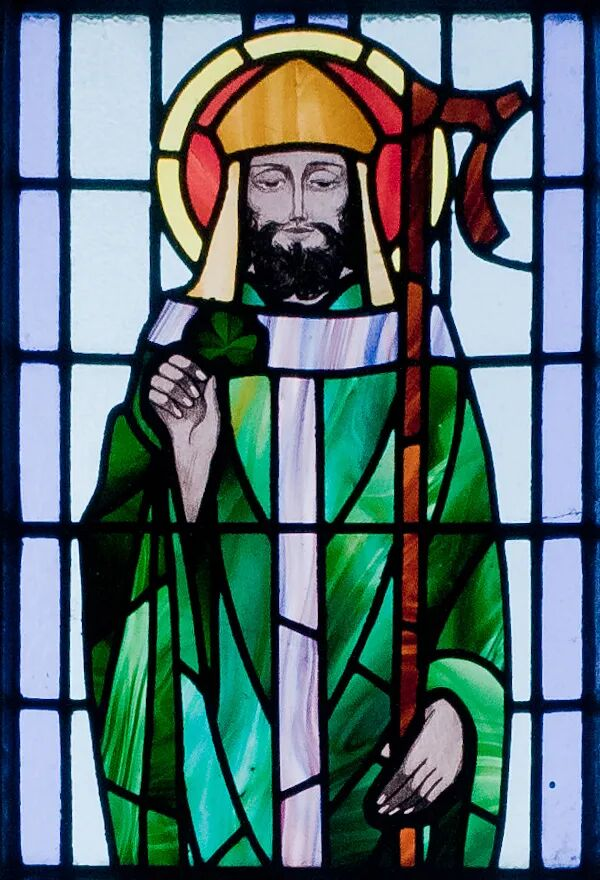
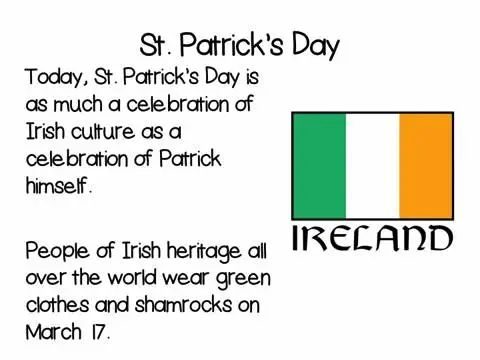
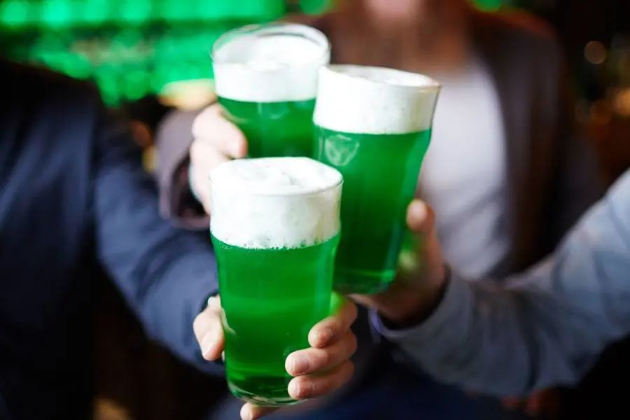
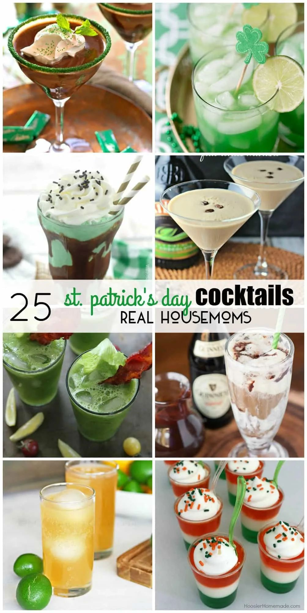
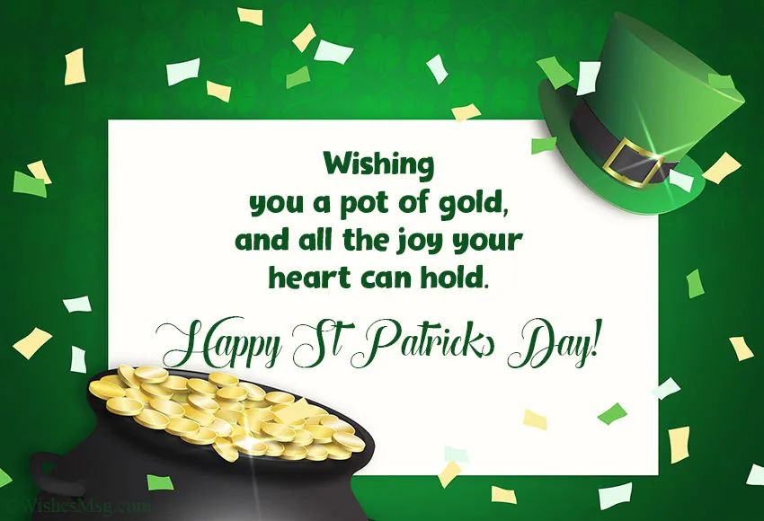
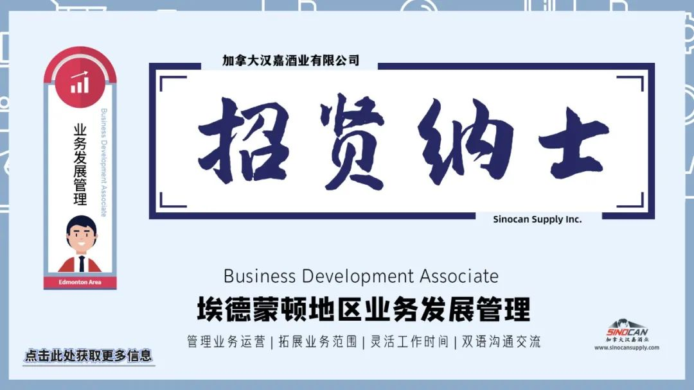

# 无标题

**链接地址:** http://mp.weixin.qq.com/s?__biz=MzIyMzU4OTc0MQ==&mid=2247485401&idx=1&sn=e91e60c8a086a098f1019d2939e71ee8&chksm=e81aa3dbdf6d2acd6cde39108570c75f4da685cd393a5d58926d0e5c75e4651dc66e8345f342&mpshare=1&scene=2&srcid=0318D48w2uIDIwWQ2ROiD7UP&sharer_sharetime=1616036417494&sharer_shareid=be1c8edd6c93eec155a61c876e41d26a#rd
**作者:** 关注我们
**获取时间:** 2025/8/28 19:51:35
**图片数量:** 18

---

## 原始HTML内容

<section style="box-sizing: border-box;font-size: 16px;"><section style="margin: 10px 0%;box-sizing: border-box;" powered-by="xiumi.us"><section style="display: inline-block;width: 100%;vertical-align: top;background-color: rgb(86, 157, 11);padding: 3px;box-sizing: border-box;"><section style="box-sizing: border-box;" powered-by="xiumi.us"><section style="display: flex;flex-flow: row nowrap;box-sizing: border-box;"><section style="display: inline-block;vertical-align: top;width: auto;flex: 50 50 0%;align-self: stretch;height: auto;background-color: rgb(255, 247, 244);padding: 3px;box-sizing: border-box;"><section style="display: inline-block;width: 100%;vertical-align: middle;border-style: solid;border-width: 1px;border-color: rgb(86, 157, 11);padding: 3px 10px 5px;align-self: center;box-sizing: border-box;" powered-by="xiumi.us"><section style="margin-top: 3px;margin-right: 0%;margin-left: 0%;box-sizing: border-box;" powered-by="xiumi.us"><section style="text-align: center;color: rgb(106, 106, 106);line-height: 1.2;font-size: 14px;box-sizing: border-box;">
<strong style="box-sizing: border-box;">点击蓝字</strong>
</section></section></section></section><section style="display: inline-block;vertical-align: middle;width: auto;padding-left: 3px;background-color: rgba(255, 255, 255, 0);flex: 50 50 0%;align-self: center;height: auto;box-sizing: border-box;"><section style="margin-top: 3px;margin-right: 0%;margin-left: 0%;box-sizing: border-box;" powered-by="xiumi.us"><section style="text-align: center;font-size: 14px;color: rgb(255, 255, 255);line-height: 1.2;box-sizing: border-box;">
<strong style="box-sizing: border-box;">关注我们</strong>
</section></section></section></section></section></section></section><section style="box-sizing: border-box;" powered-by="xiumi.us">
 
</section><section style="text-align: right;justify-content: flex-end;margin-top: 10px;margin-right: 0%;margin-left: 0%;box-sizing: border-box;" powered-by="xiumi.us"><section style="display: inline-block;width: auto;vertical-align: top;min-width: 10%;max-width: 100%;height: auto;background-color: rgb(86, 157, 11);padding: 5px 10px;border-width: 0px;box-sizing: border-box;"><section style="text-align: justify;color: rgb(255, 255, 255);font-size: 14px;box-sizing: border-box;" powered-by="xiumi.us">
<strong style="box-sizing: border-box;">特别专题《圣帕特里克节居然是酒节》</strong>
</section></section></section><section style="display: inline-block;width: 100%;vertical-align: top;border-left: 2px none rgb(195, 163, 142);border-bottom-left-radius: 0px;background-color: rgba(255, 213, 195, 0);padding: 10px;border-right: 2px solid rgb(0, 0, 0);border-top-right-radius: 0px;box-sizing: border-box;" powered-by="xiumi.us"><section style="text-align: center;margin-right: 0%;margin-left: 0%;box-sizing: border-box;" powered-by="xiumi.us"><section style="max-width: 100%;vertical-align: middle;display: inline-block;line-height: 0;box-sizing: border-box;"></section></section></section><section style="text-align: right;justify-content: flex-end;margin-right: 0%;margin-bottom: 10px;margin-left: 0%;font-size: 0px;box-sizing: border-box;" powered-by="xiumi.us"><section style="display: inline-block;width: 50%;vertical-align: top;height: auto;line-height: 0;box-sizing: border-box;"><section style="margin-top: 0.5em;margin-bottom: 0.5em;box-sizing: border-box;" powered-by="xiumi.us"><section style="background-color: rgb(0, 0, 0);height: 2px;box-sizing: border-box;"><section><svg viewBox="0 0 1 1" style="float:left;line-height:0;width:0;vertical-align:top;"></svg></section></section></section></section></section><section style="box-sizing: border-box;" powered-by="xiumi.us"><section style="display: flex;flex-flow: row nowrap;margin: -10px 0% 10px;box-sizing: border-box;"><section style="display: inline-block;vertical-align: top;width: auto;flex: 0 0 auto;align-self: flex-start;min-width: 10%;max-width: 100%;height: auto;box-sizing: border-box;"><section style="color: rgb(0, 0, 0);font-size: 12px;box-sizing: border-box;" powered-by="xiumi.us">
&nbsp; &nbsp;专题出品 |&nbsp;加拿大汉嘉酒业&nbsp;
</section></section><section style="display: inline-block;vertical-align: top;width: auto;align-self: flex-start;flex: 100 100 0%;box-sizing: border-box;"><section style="margin-top: 0.5em;margin-bottom: 0.5em;box-sizing: border-box;" powered-by="xiumi.us"><section style="background-color: rgba(255, 213, 195, 0);height: 1px;box-sizing: border-box;"><section><svg viewBox="0 0 1 1" style="float:left;line-height:0;width:0;vertical-align:top;"></svg></section></section></section></section></section></section><section style="margin: 10px 0%;box-sizing: border-box;" powered-by="xiumi.us"><section style="font-size: 14px;letter-spacing: 2px;line-height: 2;padding-right: 15px;padding-left: 15px;box-sizing: border-box;">
 

眼尖的朋友们或许已经发现，今天我们把文章的配色从过往一贯的红色，换成了<strong style="box-sizing: border-box;">绿色</strong>。

 

没错，这正是为了迎接这一年中<strong style="box-sizing: border-box;">“最绿的日子”</strong><strong style="box-sizing: border-box;">——圣·帕特里克节！</strong>
</section></section><section style="text-align: center;margin-top: 10px;margin-bottom: 10px;box-sizing: border-box;" powered-by="xiumi.us"><section style="max-width: 100%;vertical-align: middle;display: inline-block;line-height: 0;width: 50%;height: auto;box-sizing: border-box;"></section></section><section style="box-sizing: border-box;" powered-by="xiumi.us">
 
</section><section style="margin: 10px 0%;box-sizing: border-box;" powered-by="xiumi.us"><section style="font-size: 14px;letter-spacing: 2px;line-height: 2;padding-right: 15px;padding-left: 15px;box-sizing: border-box;">
 
</section></section><section style="transform: perspective(0px);-webkit-transform: perspective(0px);-moz-transform: perspective(0px);-o-transform: perspective(0px);transform-style: flat;box-sizing: border-box;" powered-by="xiumi.us"><section style="display: flex;flex-flow: row nowrap;margin: 30px 0% 10px;transform: rotateY(180deg);-webkit-transform: rotateY(180deg);-moz-transform: rotateY(180deg);-o-transform: rotateY(180deg);box-sizing: border-box;"><section style="display: inline-block;vertical-align: top;width: auto;flex: 100 100 0%;align-self: flex-start;height: auto;z-index: 1;margin-right: -20px;margin-left: 30px;box-sizing: border-box;"><section style="transform: perspective(0px);-webkit-transform: perspective(0px);-moz-transform: perspective(0px);-o-transform: perspective(0px);transform-style: flat;box-sizing: border-box;" powered-by="xiumi.us"><section style="text-align: left;justify-content: flex-start;transform: translate3d(23px, 0px, 0px) rotateY(180deg);margin-top: 6px;margin-right: 0%;margin-left: 0%;box-sizing: border-box;"><section style="font-size: 14px;color: rgba(44, 153, 105, 0.71);letter-spacing: 3px;line-height: 2;font-family: Optima-Regular, PingFangTC-light;box-sizing: border-box;">
<strong style="box-sizing: border-box;">01 · 一年中最绿的日子</strong>
</section></section></section><section style="margin-right: 0%;margin-bottom: -1px;margin-left: 0%;box-sizing: border-box;" powered-by="xiumi.us"><section style="background-color: rgb(44, 153, 105);height: 1px;box-sizing: border-box;"><section><svg viewBox="0 0 1 1" style="float:left;line-height:0;width:0;vertical-align:top;"></svg></section></section></section></section><section style="display: inline-block;vertical-align: top;width: auto;min-width: 10%;max-width: 100%;flex: 0 0 auto;height: auto;align-self: flex-start;box-sizing: border-box;"><section style="text-align: right;justify-content: flex-end;margin-top: -22px;margin-right: 0%;margin-left: 0%;transform: translate3d(-10px, 0px, 0px);box-sizing: border-box;" powered-by="xiumi.us"><section style="display: inline-block;width: 66px;height: 66px;vertical-align: top;overflow: hidden;border-width: 0px;border-radius: 60px;border-style: none;border-color: rgb(62, 62, 62);background-color: rgb(255, 251, 174);box-sizing: border-box;"><section><svg viewBox="0 0 1 1" style="float:left;line-height:0;width:0;vertical-align:top;"></svg></section></section></section></section></section></section><section style="margin: 10px 0%;box-sizing: border-box;" powered-by="xiumi.us"><section style="font-size: 14px;letter-spacing: 2px;line-height: 2;padding-right: 15px;padding-left: 15px;box-sizing: border-box;">
 

圣帕特里克节（St. Patrick's Day）在每年的3月17日，是为了纪念<strong style="box-sizing: border-box;">爱尔兰守护神圣帕特里克</strong>所设立的节日。

 
</section></section><section style="box-sizing: border-box;" powered-by="xiumi.us"><section style="display: flex;flex-flow: row nowrap;margin: 10px 0%;box-sizing: border-box;"><section style="display: inline-block;vertical-align: top;width: auto;flex: 0 0 0%;align-self: stretch;height: auto;background-position: 50% 50%;background-repeat: no-repeat;background-size: 100% 100%;background-attachment: scroll;background-image: url(&quot;https://mmbiz.qpic.cn/mmbiz_png/7CNdqYbqvBIJDeM2anmia6jwEkZm8rQ7upOKBMKxn0G7P9ibVeAJx4pKgCLm9d5aJVbdg2mcAe2ckKvrJEbCVmbg/640?wx_fmt=png&quot;);box-sizing: border-box;"><section style="text-align: center;box-sizing: border-box;" powered-by="xiumi.us"><section style="display: inline-block;width: 15px;height: 15px;vertical-align: top;overflow: hidden;box-sizing: border-box;"><section><svg viewBox="0 0 1 1" style="float:left;line-height:0;width:0;vertical-align:top;"></svg></section></section></section></section><section style="display: inline-block;vertical-align: top;width: auto;flex: 100 100 0%;align-self: stretch;height: auto;box-sizing: border-box;"><section style="display: inline-block;width: 100%;vertical-align: top;border-width: 6px;border-style: solid;border-color: rgb(255, 254, 251);box-shadow: rgb(86, 157, 11) 0px 0px 10px;box-sizing: border-box;" powered-by="xiumi.us"><section style="text-align: center;margin-right: 0%;margin-left: 0%;box-sizing: border-box;" powered-by="xiumi.us"><section style="max-width: 100%;vertical-align: middle;display: inline-block;line-height: 0;box-shadow: rgb(0, 0, 0) 0px 0px 0px;box-sizing: border-box;"></section></section></section></section><section style="display: inline-block;vertical-align: top;width: auto;flex: 0 0 0%;align-self: stretch;height: auto;background-position: 50% 50%;background-repeat: no-repeat;background-size: 100% 100%;background-attachment: scroll;background-image: url(&quot;https://mmbiz.qpic.cn/mmbiz_png/7CNdqYbqvBIJDeM2anmia6jwEkZm8rQ7ubVE0dibmweKQxZp4Th4uJibRpwlJULd57nWFCiciaHmhKXktcibiaulJuvCw/640?wx_fmt=png&quot;);box-sizing: border-box;"><section style="text-align: center;box-sizing: border-box;" powered-by="xiumi.us"><section style="display: inline-block;width: 15px;height: 15px;vertical-align: top;overflow: hidden;box-sizing: border-box;"><section><svg viewBox="0 0 1 1" style="float:left;line-height:0;width:0;vertical-align:top;"></svg></section></section></section></section></section></section><section style="text-align: center;font-size: 12px;color: rgb(179, 179, 179);box-sizing: border-box;" powered-by="xiumi.us">
圣帕特里克在教堂中的彩色玻璃画像
</section><section style="margin: 10px 0%;box-sizing: border-box;" powered-by="xiumi.us"><section style="font-size: 14px;letter-spacing: 2px;line-height: 2;padding-right: 15px;padding-left: 15px;box-sizing: border-box;">
 

随着爱尔兰后裔遍布世界各地，这个节日在世界上的影响力也越来越广。

 

现在圣帕特里克节已经成为了加拿大纽芬兰和拉布拉多省的一个<strong style="box-sizing: border-box;">法定节日</strong>。

 

在没有经历疫情以前，加拿大不少地区在这一天都要<strong style="box-sizing: border-box;">举行游行、教堂礼拜和聚餐狂欢等活动</strong>。

 
</section></section><section style="box-sizing: border-box;" powered-by="xiumi.us"><section style="display: flex;flex-flow: row nowrap;margin: 10px 0%;box-sizing: border-box;"><section style="display: inline-block;vertical-align: top;width: auto;flex: 0 0 0%;align-self: stretch;height: auto;background-position: 50% 50%;background-repeat: no-repeat;background-size: 100% 100%;background-attachment: scroll;background-image: url(&quot;https://mmbiz.qpic.cn/mmbiz_png/7CNdqYbqvBIJDeM2anmia6jwEkZm8rQ7upOKBMKxn0G7P9ibVeAJx4pKgCLm9d5aJVbdg2mcAe2ckKvrJEbCVmbg/640?wx_fmt=png&quot;);box-sizing: border-box;"><section style="text-align: center;box-sizing: border-box;" powered-by="xiumi.us"><section style="display: inline-block;width: 15px;height: 15px;vertical-align: top;overflow: hidden;box-sizing: border-box;"><section><svg viewBox="0 0 1 1" style="float:left;line-height:0;width:0;vertical-align:top;"></svg></section></section></section></section><section style="display: inline-block;vertical-align: top;width: auto;flex: 100 100 0%;align-self: stretch;height: auto;box-sizing: border-box;"><section style="display: inline-block;width: 100%;vertical-align: top;border-width: 6px;border-style: solid;border-color: rgb(255, 254, 251);box-shadow: rgb(86, 157, 11) 0px 0px 10px;box-sizing: border-box;" powered-by="xiumi.us"><section style="text-align: center;margin-right: 0%;margin-left: 0%;box-sizing: border-box;" powered-by="xiumi.us"><section style="max-width: 100%;vertical-align: middle;display: inline-block;line-height: 0;box-shadow: rgb(0, 0, 0) 0px 0px 0px;box-sizing: border-box;"></section></section></section></section><section style="display: inline-block;vertical-align: top;width: auto;flex: 0 0 0%;align-self: stretch;height: auto;background-position: 50% 50%;background-repeat: no-repeat;background-size: 100% 100%;background-attachment: scroll;background-image: url(&quot;https://mmbiz.qpic.cn/mmbiz_png/7CNdqYbqvBIJDeM2anmia6jwEkZm8rQ7ubVE0dibmweKQxZp4Th4uJibRpwlJULd57nWFCiciaHmhKXktcibiaulJuvCw/640?wx_fmt=png&quot;);box-sizing: border-box;"><section style="text-align: center;box-sizing: border-box;" powered-by="xiumi.us"><section style="display: inline-block;width: 15px;height: 15px;vertical-align: top;overflow: hidden;box-sizing: border-box;"><section><svg viewBox="0 0 1 1" style="float:left;line-height:0;width:0;vertical-align:top;"></svg></section></section></section></section></section></section><section style="text-align: center;font-size: 12px;color: rgb(179, 179, 179);box-sizing: border-box;" powered-by="xiumi.us">
参加圣帕特里克节庆活动的民众
</section><section style="box-sizing: border-box;" powered-by="xiumi.us">
 
</section><section style="margin: 10px 0%;box-sizing: border-box;" powered-by="xiumi.us"><section style="font-size: 14px;letter-spacing: 2px;line-height: 2;padding-right: 15px;padding-left: 15px;box-sizing: border-box;">
加拿大的爱尔兰人喜欢佩带四叶草，用爱尔兰的国旗颜色——绿黄两色装饰房间，身穿绿色衣服，<strong style="box-sizing: border-box;">带上绿色的帽子</strong>，并向宾客赠送四叶草饰物等。 

 
</section></section><section style="transform: perspective(0px);-webkit-transform: perspective(0px);-moz-transform: perspective(0px);-o-transform: perspective(0px);transform-style: flat;box-sizing: border-box;" powered-by="xiumi.us"><section style="display: flex;flex-flow: row nowrap;margin: 30px 0% 10px;transform: rotateY(180deg);-webkit-transform: rotateY(180deg);-moz-transform: rotateY(180deg);-o-transform: rotateY(180deg);box-sizing: border-box;"><section style="display: inline-block;vertical-align: top;width: auto;flex: 100 100 0%;align-self: flex-start;height: auto;z-index: 1;margin-right: -20px;margin-left: 30px;box-sizing: border-box;"><section style="transform: perspective(0px);-webkit-transform: perspective(0px);-moz-transform: perspective(0px);-o-transform: perspective(0px);transform-style: flat;box-sizing: border-box;" powered-by="xiumi.us"><section style="text-align: left;justify-content: flex-start;transform: translate3d(23px, 0px, 0px) rotateY(180deg);margin-top: 6px;margin-right: 0%;margin-left: 0%;box-sizing: border-box;"><section style="font-size: 14px;color: rgba(44, 153, 105, 0.71);letter-spacing: 3px;line-height: 2;font-family: Optima-Regular, PingFangTC-light;box-sizing: border-box;">
<strong style="box-sizing: border-box;">02 · 和酒关系最紧密的日子</strong>
</section></section></section><section style="margin-right: 0%;margin-bottom: -1px;margin-left: 0%;box-sizing: border-box;" powered-by="xiumi.us"><section style="background-color: rgb(44, 153, 105);height: 1px;box-sizing: border-box;"><section><svg viewBox="0 0 1 1" style="float:left;line-height:0;width:0;vertical-align:top;"></svg></section></section></section></section><section style="display: inline-block;vertical-align: top;width: auto;min-width: 10%;max-width: 100%;flex: 0 0 auto;height: auto;align-self: flex-start;box-sizing: border-box;"><section style="text-align: right;justify-content: flex-end;margin-top: -22px;margin-right: 0%;margin-left: 0%;transform: translate3d(-10px, 0px, 0px);box-sizing: border-box;" powered-by="xiumi.us"><section style="display: inline-block;width: 66px;height: 66px;vertical-align: top;overflow: hidden;border-width: 0px;border-radius: 60px;border-style: none;border-color: rgb(62, 62, 62);background-color: rgb(255, 251, 174);box-sizing: border-box;"><section><svg viewBox="0 0 1 1" style="float:left;line-height:0;width:0;vertical-align:top;"></svg></section></section></section></section></section></section><section style="margin: 10px 0%;box-sizing: border-box;" powered-by="xiumi.us"><section style="font-size: 14px;letter-spacing: 2px;line-height: 2;padding-right: 15px;padding-left: 15px;box-sizing: border-box;">
 

然而对于我们不在这样文化背景下成长起来的华人群体来说，圣帕特里克节除了看上去很<strong style="box-sizing: border-box;">绿</strong>之外，还是无比<strong style="box-sizing: border-box;">“吵闹”</strong>的一个日子。

 
</section></section><section style="box-sizing: border-box;" powered-by="xiumi.us"><section style="display: flex;flex-flow: row nowrap;margin: 10px 0%;box-sizing: border-box;"><section style="display: inline-block;vertical-align: top;width: auto;flex: 0 0 0%;align-self: stretch;height: auto;background-position: 50% 50%;background-repeat: no-repeat;background-size: 100% 100%;background-attachment: scroll;background-image: url(&quot;https://mmbiz.qpic.cn/mmbiz_png/7CNdqYbqvBIJDeM2anmia6jwEkZm8rQ7upOKBMKxn0G7P9ibVeAJx4pKgCLm9d5aJVbdg2mcAe2ckKvrJEbCVmbg/640?wx_fmt=png&quot;);box-sizing: border-box;"><section style="text-align: center;box-sizing: border-box;" powered-by="xiumi.us"><section style="display: inline-block;width: 15px;height: 15px;vertical-align: top;overflow: hidden;box-sizing: border-box;"><section><svg viewBox="0 0 1 1" style="float:left;line-height:0;width:0;vertical-align:top;"></svg></section></section></section></section><section style="display: inline-block;vertical-align: top;width: auto;flex: 100 100 0%;align-self: stretch;height: auto;box-sizing: border-box;"><section style="display: inline-block;width: 100%;vertical-align: top;border-width: 6px;border-style: solid;border-color: rgb(255, 254, 251);box-shadow: rgb(86, 157, 11) 0px 0px 10px;box-sizing: border-box;" powered-by="xiumi.us"><section style="text-align: center;margin-right: 0%;margin-left: 0%;box-sizing: border-box;" powered-by="xiumi.us"><section style="max-width: 100%;vertical-align: middle;display: inline-block;line-height: 0;box-shadow: rgb(0, 0, 0) 0px 0px 0px;box-sizing: border-box;"></section></section></section></section><section style="display: inline-block;vertical-align: top;width: auto;flex: 0 0 0%;align-self: stretch;height: auto;background-position: 50% 50%;background-repeat: no-repeat;background-size: 100% 100%;background-attachment: scroll;background-image: url(&quot;https://mmbiz.qpic.cn/mmbiz_png/7CNdqYbqvBIJDeM2anmia6jwEkZm8rQ7ubVE0dibmweKQxZp4Th4uJibRpwlJULd57nWFCiciaHmhKXktcibiaulJuvCw/640?wx_fmt=png&quot;);box-sizing: border-box;"><section style="text-align: center;box-sizing: border-box;" powered-by="xiumi.us"><section style="display: inline-block;width: 15px;height: 15px;vertical-align: top;overflow: hidden;box-sizing: border-box;"><section><svg viewBox="0 0 1 1" style="float:left;line-height:0;width:0;vertical-align:top;"></svg></section></section></section></section></section></section><section style="margin: 10px 0%;box-sizing: border-box;" powered-by="xiumi.us"><section style="font-size: 14px;letter-spacing: 2px;line-height: 2;padding-right: 15px;padding-left: 15px;box-sizing: border-box;">
 

因为这一天，大大小小的酒吧和饭店里总是塞满了<strong style="box-sizing: border-box;">喝到酩酊大醉的“酒鬼”</strong>。

 

要说这是酒吧老板们一年中最喜欢的日子一点也不为过，三月份的<strong style="box-sizing: border-box;">酒水销量KPI能否达标，</strong>可就指望这一天了！

 
</section></section><section style="text-align: center;margin-top: 10px;margin-bottom: 10px;box-sizing: border-box;" powered-by="xiumi.us"><section style="max-width: 100%;vertical-align: middle;display: inline-block;line-height: 0;box-sizing: border-box;"></section></section><section style="margin: 10px 0%;box-sizing: border-box;" powered-by="xiumi.us"><section style="font-size: 14px;letter-spacing: 2px;line-height: 2;padding-right: 15px;padding-left: 15px;box-sizing: border-box;">
 

为什么圣帕特里克节和酒饮有着如此深厚的关系？那还要追溯到这<strong style="box-sizing: border-box;">节日的起源</strong>上。

 

圣帕特里克节在17世纪初被定为正式的基督教节日，由天主教会，英国圣公会，东正教教堂和路德宗确立。

 
</section></section><section style="box-sizing: border-box;" powered-by="xiumi.us"><section style="display: flex;flex-flow: row nowrap;margin: 10px 0%;box-sizing: border-box;"><section style="display: inline-block;vertical-align: top;width: auto;flex: 0 0 0%;align-self: stretch;height: auto;background-position: 50% 50%;background-repeat: no-repeat;background-size: 100% 100%;background-attachment: scroll;background-image: url(&quot;https://mmbiz.qpic.cn/mmbiz_png/7CNdqYbqvBIJDeM2anmia6jwEkZm8rQ7upOKBMKxn0G7P9ibVeAJx4pKgCLm9d5aJVbdg2mcAe2ckKvrJEbCVmbg/640?wx_fmt=png&quot;);box-sizing: border-box;"><section style="text-align: center;box-sizing: border-box;" powered-by="xiumi.us"><section style="display: inline-block;width: 15px;height: 15px;vertical-align: top;overflow: hidden;box-sizing: border-box;"><section><svg viewBox="0 0 1 1" style="float:left;line-height:0;width:0;vertical-align:top;"></svg></section></section></section></section><section style="display: inline-block;vertical-align: top;width: auto;flex: 100 100 0%;align-self: stretch;height: auto;box-sizing: border-box;"><section style="display: inline-block;width: 100%;vertical-align: top;border-width: 6px;border-style: solid;border-color: rgb(255, 254, 251);box-shadow: rgb(86, 157, 11) 0px 0px 10px;box-sizing: border-box;" powered-by="xiumi.us"><section style="text-align: center;margin-right: 0%;margin-left: 0%;box-sizing: border-box;" powered-by="xiumi.us"><section style="max-width: 100%;vertical-align: middle;display: inline-block;line-height: 0;box-shadow: rgb(0, 0, 0) 0px 0px 0px;box-sizing: border-box;"></section></section></section></section><section style="display: inline-block;vertical-align: top;width: auto;flex: 0 0 0%;align-self: stretch;height: auto;background-position: 50% 50%;background-repeat: no-repeat;background-size: 100% 100%;background-attachment: scroll;background-image: url(&quot;https://mmbiz.qpic.cn/mmbiz_png/7CNdqYbqvBIJDeM2anmia6jwEkZm8rQ7ubVE0dibmweKQxZp4Th4uJibRpwlJULd57nWFCiciaHmhKXktcibiaulJuvCw/640?wx_fmt=png&quot;);box-sizing: border-box;"><section style="text-align: center;box-sizing: border-box;" powered-by="xiumi.us"><section style="display: inline-block;width: 15px;height: 15px;vertical-align: top;overflow: hidden;box-sizing: border-box;"><section><svg viewBox="0 0 1 1" style="float:left;line-height:0;width:0;vertical-align:top;"></svg></section></section></section></section></section></section><section style="margin: 10px 0%;box-sizing: border-box;" powered-by="xiumi.us"><section style="font-size: 14px;letter-spacing: 2px;line-height: 2;padding-right: 15px;padding-left: 15px;box-sizing: border-box;">
 

属于礼仪教派的基督徒会参加教会服务，并且根据天主教礼俗，限制饮食饮酒的四旬大斋期结束时间正好接上圣帕特里克节。

 

憋了好久的不能狂欢作乐的灵魂终于得以释放，也难免会让<strong style="box-sizing: border-box;">酒精的消耗飙升</strong>了。

 
</section></section><section style="transform: perspective(0px);-webkit-transform: perspective(0px);-moz-transform: perspective(0px);-o-transform: perspective(0px);transform-style: flat;box-sizing: border-box;" powered-by="xiumi.us"><section style="display: flex;flex-flow: row nowrap;margin: 30px 0% 10px;transform: rotateY(180deg);-webkit-transform: rotateY(180deg);-moz-transform: rotateY(180deg);-o-transform: rotateY(180deg);box-sizing: border-box;"><section style="display: inline-block;vertical-align: top;width: auto;flex: 100 100 0%;align-self: flex-start;height: auto;z-index: 1;margin-right: -20px;margin-left: 30px;box-sizing: border-box;"><section style="transform: perspective(0px);-webkit-transform: perspective(0px);-moz-transform: perspective(0px);-o-transform: perspective(0px);transform-style: flat;box-sizing: border-box;" powered-by="xiumi.us"><section style="text-align: left;justify-content: flex-start;transform: translate3d(23px, 0px, 0px) rotateY(180deg);margin-top: 6px;margin-right: 0%;margin-left: 0%;box-sizing: border-box;"><section style="font-size: 14px;color: rgba(44, 153, 105, 0.71);letter-spacing: 3px;line-height: 2;font-family: Optima-Regular, PingFangTC-light;box-sizing: border-box;">
<strong style="box-sizing: border-box;">03 · 圣帕特里克节的酒俗知多少？</strong>
</section></section></section><section style="margin-right: 0%;margin-bottom: -1px;margin-left: 0%;box-sizing: border-box;" powered-by="xiumi.us"><section style="background-color: rgb(44, 153, 105);height: 1px;box-sizing: border-box;"><section><svg viewBox="0 0 1 1" style="float:left;line-height:0;width:0;vertical-align:top;"></svg></section></section></section></section><section style="display: inline-block;vertical-align: top;width: auto;min-width: 10%;max-width: 100%;flex: 0 0 auto;height: auto;align-self: flex-start;box-sizing: border-box;"><section style="text-align: right;justify-content: flex-end;margin-top: -22px;margin-right: 0%;margin-left: 0%;transform: translate3d(-10px, 0px, 0px);box-sizing: border-box;" powered-by="xiumi.us"><section style="display: inline-block;width: 66px;height: 66px;vertical-align: top;overflow: hidden;border-width: 0px;border-radius: 60px;border-style: none;border-color: rgb(62, 62, 62);background-color: rgb(255, 251, 174);box-sizing: border-box;"><section><svg viewBox="0 0 1 1" style="float:left;line-height:0;width:0;vertical-align:top;"></svg></section></section></section></section></section></section><section style="margin: 10px 0%;box-sizing: border-box;" powered-by="xiumi.us"><section style="font-size: 14px;letter-spacing: 2px;line-height: 2;padding-right: 15px;padding-left: 15px;box-sizing: border-box;">
 

<strong style="box-sizing: border-box;">狂欢庆祝的节日怎能少得了酒精的助兴？</strong>喝酒，尤其是爱尔兰威士忌，啤酒或苹果酒已成为庆祝这个节日活动不可分割的一部分。

 
</section></section><section style="box-sizing: border-box;" powered-by="xiumi.us"><section style="display: flex;flex-flow: row nowrap;margin: 10px 0%;box-sizing: border-box;"><section style="display: inline-block;vertical-align: top;width: auto;flex: 0 0 0%;align-self: stretch;height: auto;background-position: 50% 50%;background-repeat: no-repeat;background-size: 100% 100%;background-attachment: scroll;background-image: url(&quot;https://mmbiz.qpic.cn/mmbiz_png/7CNdqYbqvBIJDeM2anmia6jwEkZm8rQ7upOKBMKxn0G7P9ibVeAJx4pKgCLm9d5aJVbdg2mcAe2ckKvrJEbCVmbg/640?wx_fmt=png&quot;);box-sizing: border-box;"><section style="text-align: center;box-sizing: border-box;" powered-by="xiumi.us"><section style="display: inline-block;width: 15px;height: 15px;vertical-align: top;overflow: hidden;box-sizing: border-box;"><section><svg viewBox="0 0 1 1" style="float:left;line-height:0;width:0;vertical-align:top;"></svg></section></section></section></section><section style="display: inline-block;vertical-align: top;width: auto;flex: 100 100 0%;align-self: stretch;height: auto;box-sizing: border-box;"><section style="display: inline-block;width: 100%;vertical-align: top;border-width: 6px;border-style: solid;border-color: rgb(255, 254, 251);box-shadow: rgb(86, 157, 11) 0px 0px 10px;box-sizing: border-box;" powered-by="xiumi.us"><section style="text-align: center;margin-right: 0%;margin-left: 0%;box-sizing: border-box;" powered-by="xiumi.us"><section style="max-width: 100%;vertical-align: middle;display: inline-block;line-height: 0;box-shadow: rgb(0, 0, 0) 0px 0px 0px;box-sizing: border-box;"></section></section></section></section><section style="display: inline-block;vertical-align: top;width: auto;flex: 0 0 0%;align-self: stretch;height: auto;background-position: 50% 50%;background-repeat: no-repeat;background-size: 100% 100%;background-attachment: scroll;background-image: url(&quot;https://mmbiz.qpic.cn/mmbiz_png/7CNdqYbqvBIJDeM2anmia6jwEkZm8rQ7ubVE0dibmweKQxZp4Th4uJibRpwlJULd57nWFCiciaHmhKXktcibiaulJuvCw/640?wx_fmt=png&quot;);box-sizing: border-box;"><section style="text-align: center;box-sizing: border-box;" powered-by="xiumi.us"><section style="display: inline-block;width: 15px;height: 15px;vertical-align: top;overflow: hidden;box-sizing: border-box;"><section><svg viewBox="0 0 1 1" style="float:left;line-height:0;width:0;vertical-align:top;"></svg></section></section></section></section></section></section><section style="margin: 10px 0%;box-sizing: border-box;" powered-by="xiumi.us"><section style="font-size: 14px;letter-spacing: 2px;line-height: 2;padding-right: 15px;padding-left: 15px;box-sizing: border-box;">
 

<strong style="box-sizing: border-box;">“淹没四叶草”</strong>这个传统习俗尤其受欢迎。庆祝活动结束时，象征着节日风情的四叶草会被放入杯子的底部，接着盛满酒精饮料，然后向活动现场的参与者敬酒并且一乾而尽。

 

四叶草可以吞下肚，或者是拿出来放在肩上以求好运。这样<strong style="box-sizing: border-box;">“暴力”且尽兴的喝法</strong>，也难怪会让这么不胜酒力的活动参与者喝到酩酊大醉啦！

 
</section></section><section style="box-sizing: border-box;" powered-by="xiumi.us"><section style="display: flex;flex-flow: row nowrap;margin: 10px 0%;box-sizing: border-box;"><section style="display: inline-block;vertical-align: top;width: auto;flex: 0 0 0%;align-self: stretch;height: auto;background-position: 50% 50%;background-repeat: no-repeat;background-size: 100% 100%;background-attachment: scroll;background-image: url(&quot;https://mmbiz.qpic.cn/mmbiz_png/7CNdqYbqvBIJDeM2anmia6jwEkZm8rQ7upOKBMKxn0G7P9ibVeAJx4pKgCLm9d5aJVbdg2mcAe2ckKvrJEbCVmbg/640?wx_fmt=png&quot;);box-sizing: border-box;"><section style="text-align: center;box-sizing: border-box;" powered-by="xiumi.us"><section style="display: inline-block;width: 15px;height: 15px;vertical-align: top;overflow: hidden;box-sizing: border-box;"><section><svg viewBox="0 0 1 1" style="float:left;line-height:0;width:0;vertical-align:top;"></svg></section></section></section></section><section style="display: inline-block;vertical-align: top;width: auto;flex: 100 100 0%;align-self: stretch;height: auto;box-sizing: border-box;"><section style="display: inline-block;width: 100%;vertical-align: top;border-width: 6px;border-style: solid;border-color: rgb(255, 254, 251);box-shadow: rgb(86, 157, 11) 0px 0px 10px;box-sizing: border-box;" powered-by="xiumi.us"><section style="text-align: center;margin-right: 0%;margin-left: 0%;box-sizing: border-box;" powered-by="xiumi.us"><section style="max-width: 100%;vertical-align: middle;display: inline-block;line-height: 0;box-shadow: rgb(0, 0, 0) 0px 0px 0px;box-sizing: border-box;"></section></section></section></section><section style="display: inline-block;vertical-align: top;width: auto;flex: 0 0 0%;align-self: stretch;height: auto;background-position: 50% 50%;background-repeat: no-repeat;background-size: 100% 100%;background-attachment: scroll;background-image: url(&quot;https://mmbiz.qpic.cn/mmbiz_png/7CNdqYbqvBIJDeM2anmia6jwEkZm8rQ7ubVE0dibmweKQxZp4Th4uJibRpwlJULd57nWFCiciaHmhKXktcibiaulJuvCw/640?wx_fmt=png&quot;);box-sizing: border-box;"><section style="text-align: center;box-sizing: border-box;" powered-by="xiumi.us"><section style="display: inline-block;width: 15px;height: 15px;vertical-align: top;overflow: hidden;box-sizing: border-box;"><section><svg viewBox="0 0 1 1" style="float:left;line-height:0;width:0;vertical-align:top;"></svg></section></section></section></section></section></section><section style="margin: 10px 0%;box-sizing: border-box;" powered-by="xiumi.us"><section style="font-size: 14px;letter-spacing: 2px;line-height: 2;padding-right: 15px;padding-left: 15px;box-sizing: border-box;">
 

为了让这个节日<strong style="box-sizing: border-box;">绿得更加彻底</strong>，爱动脑筋的酒饮商人在这天还会特别推出<strong style="box-sizing: border-box;">“绿色的啤酒”</strong>，用螺旋藻或食用色素为啤酒染色，让卖相更加贴合节日的主题。

 

不喜欢的喝啤酒和威士忌的朋友，也能很轻松的在酒吧里购买到商家花心思特调的<strong style="box-sizing: border-box;">“圣帕特里克节特饮”</strong>，或者用网上的配方DIY出符合自己口味的饮品。

 
</section></section><section style="box-sizing: border-box;" powered-by="xiumi.us"><section style="display: flex;flex-flow: row nowrap;margin: 10px 0%;box-sizing: border-box;"><section style="display: inline-block;vertical-align: top;width: auto;flex: 0 0 0%;align-self: stretch;height: auto;background-position: 50% 50%;background-repeat: no-repeat;background-size: 100% 100%;background-attachment: scroll;background-image: url(&quot;https://mmbiz.qpic.cn/mmbiz_png/7CNdqYbqvBIJDeM2anmia6jwEkZm8rQ7upOKBMKxn0G7P9ibVeAJx4pKgCLm9d5aJVbdg2mcAe2ckKvrJEbCVmbg/640?wx_fmt=png&quot;);box-sizing: border-box;"><section style="text-align: center;box-sizing: border-box;" powered-by="xiumi.us"><section style="display: inline-block;width: 15px;height: 15px;vertical-align: top;overflow: hidden;box-sizing: border-box;"><section><svg viewBox="0 0 1 1" style="float:left;line-height:0;width:0;vertical-align:top;"></svg></section></section></section></section><section style="display: inline-block;vertical-align: top;width: auto;flex: 100 100 0%;align-self: stretch;height: auto;box-sizing: border-box;"><section style="display: inline-block;width: 100%;vertical-align: top;border-width: 6px;border-style: solid;border-color: rgb(255, 254, 251);box-shadow: rgb(86, 157, 11) 0px 0px 10px;box-sizing: border-box;" powered-by="xiumi.us"><section style="text-align: center;margin-right: 0%;margin-left: 0%;box-sizing: border-box;" powered-by="xiumi.us"><section style="max-width: 100%;vertical-align: middle;display: inline-block;line-height: 0;box-shadow: rgb(0, 0, 0) 0px 0px 0px;box-sizing: border-box;"></section></section></section></section><section style="display: inline-block;vertical-align: top;width: auto;flex: 0 0 0%;align-self: stretch;height: auto;background-position: 50% 50%;background-repeat: no-repeat;background-size: 100% 100%;background-attachment: scroll;background-image: url(&quot;https://mmbiz.qpic.cn/mmbiz_png/7CNdqYbqvBIJDeM2anmia6jwEkZm8rQ7ubVE0dibmweKQxZp4Th4uJibRpwlJULd57nWFCiciaHmhKXktcibiaulJuvCw/640?wx_fmt=png&quot;);box-sizing: border-box;"><section style="text-align: center;box-sizing: border-box;" powered-by="xiumi.us"><section style="display: inline-block;width: 15px;height: 15px;vertical-align: top;overflow: hidden;box-sizing: border-box;"><section><svg viewBox="0 0 1 1" style="float:left;line-height:0;width:0;vertical-align:top;"></svg></section></section></section></section></section></section><section style="margin: 10px 0%;box-sizing: border-box;" powered-by="xiumi.us"><section style="font-size: 14px;letter-spacing: 2px;line-height: 2;padding-right: 15px;padding-left: 15px;box-sizing: border-box;">
 

这些高颜值的酒精饮料，就算是不爱喝酒的人也很容易就被其俘获芳心。

 

 
</section></section><section style="transform: perspective(0px);-webkit-transform: perspective(0px);-moz-transform: perspective(0px);-o-transform: perspective(0px);transform-style: flat;box-sizing: border-box;" powered-by="xiumi.us"><section style="display: flex;flex-flow: row nowrap;margin: 30px 0% 10px;transform: rotateY(180deg);-webkit-transform: rotateY(180deg);-moz-transform: rotateY(180deg);-o-transform: rotateY(180deg);box-sizing: border-box;"><section style="display: inline-block;vertical-align: top;width: auto;flex: 100 100 0%;align-self: flex-start;height: auto;z-index: 1;margin-right: -20px;margin-left: 30px;box-sizing: border-box;"><section style="transform: perspective(0px);-webkit-transform: perspective(0px);-moz-transform: perspective(0px);-o-transform: perspective(0px);transform-style: flat;box-sizing: border-box;" powered-by="xiumi.us"><section style="text-align: left;justify-content: flex-start;transform: translate3d(23px, 0px, 0px) rotateY(180deg);margin-top: 6px;margin-right: 0%;margin-left: 0%;box-sizing: border-box;"><section style="font-size: 14px;color: rgba(44, 153, 105, 0.71);letter-spacing: 3px;line-height: 2;font-family: Optima-Regular, PingFangTC-light;box-sizing: border-box;">
<strong style="box-sizing: border-box;">04 · 早已不是爱尔兰人的专属节日</strong>
</section></section></section><section style="margin-right: 0%;margin-bottom: -1px;margin-left: 0%;box-sizing: border-box;" powered-by="xiumi.us"><section style="background-color: rgb(44, 153, 105);height: 1px;box-sizing: border-box;"><section><svg viewBox="0 0 1 1" style="float:left;line-height:0;width:0;vertical-align:top;"></svg></section></section></section></section><section style="display: inline-block;vertical-align: top;width: auto;min-width: 10%;max-width: 100%;flex: 0 0 auto;height: auto;align-self: flex-start;box-sizing: border-box;"><section style="text-align: right;justify-content: flex-end;margin-top: -22px;margin-right: 0%;margin-left: 0%;transform: translate3d(-10px, 0px, 0px);box-sizing: border-box;" powered-by="xiumi.us"><section style="display: inline-block;width: 66px;height: 66px;vertical-align: top;overflow: hidden;border-width: 0px;border-radius: 60px;border-style: none;border-color: rgb(62, 62, 62);background-color: rgb(255, 251, 174);box-sizing: border-box;"><section><svg viewBox="0 0 1 1" style="float:left;line-height:0;width:0;vertical-align:top;"></svg></section></section></section></section></section></section><section style="margin: 10px 0%;box-sizing: border-box;" powered-by="xiumi.us"><section style="font-size: 14px;letter-spacing: 2px;line-height: 2;padding-right: 15px;padding-left: 15px;box-sizing: border-box;">
 

圣帕特里克节虽然发源于爱尔兰，但<strong style="box-sizing: border-box;">早已不是爱尔兰人的专属节日</strong>。就像在爱尔兰发明的威士忌一样，也不再是圣帕特里克节的主打酒饮。

 

越来越多的人在这个欢庆的节日里加入庆祝的队伍。在漫长的冬季后庆祝欣欣向荣春日的到来，用歌舞和欢笑祈祷新春生活的幸运和顺利。

 
</section></section><section style="box-sizing: border-box;" powered-by="xiumi.us"><section style="display: flex;flex-flow: row nowrap;margin: 10px 0%;box-sizing: border-box;"><section style="display: inline-block;vertical-align: top;width: auto;flex: 0 0 0%;align-self: stretch;height: auto;background-position: 50% 50%;background-repeat: no-repeat;background-size: 100% 100%;background-attachment: scroll;background-image: url(&quot;https://mmbiz.qpic.cn/mmbiz_png/7CNdqYbqvBIJDeM2anmia6jwEkZm8rQ7upOKBMKxn0G7P9ibVeAJx4pKgCLm9d5aJVbdg2mcAe2ckKvrJEbCVmbg/640?wx_fmt=png&quot;);box-sizing: border-box;"><section style="text-align: center;box-sizing: border-box;" powered-by="xiumi.us"><section style="display: inline-block;width: 15px;height: 15px;vertical-align: top;overflow: hidden;box-sizing: border-box;"><section><svg viewBox="0 0 1 1" style="float:left;line-height:0;width:0;vertical-align:top;"></svg></section></section></section></section><section style="display: inline-block;vertical-align: top;width: auto;flex: 100 100 0%;align-self: stretch;height: auto;box-sizing: border-box;"><section style="display: inline-block;width: 100%;vertical-align: top;border-width: 6px;border-style: solid;border-color: rgb(255, 254, 251);box-shadow: rgb(86, 157, 11) 0px 0px 10px;box-sizing: border-box;" powered-by="xiumi.us"><section style="text-align: center;margin-right: 0%;margin-left: 0%;box-sizing: border-box;" powered-by="xiumi.us"><section style="max-width: 100%;vertical-align: middle;display: inline-block;line-height: 0;box-shadow: rgb(0, 0, 0) 0px 0px 0px;box-sizing: border-box;"></section></section></section></section><section style="display: inline-block;vertical-align: top;width: auto;flex: 0 0 0%;align-self: stretch;height: auto;background-position: 50% 50%;background-repeat: no-repeat;background-size: 100% 100%;background-attachment: scroll;background-image: url(&quot;https://mmbiz.qpic.cn/mmbiz_png/7CNdqYbqvBIJDeM2anmia6jwEkZm8rQ7ubVE0dibmweKQxZp4Th4uJibRpwlJULd57nWFCiciaHmhKXktcibiaulJuvCw/640?wx_fmt=png&quot;);box-sizing: border-box;"><section style="text-align: center;box-sizing: border-box;" powered-by="xiumi.us"><section style="display: inline-block;width: 15px;height: 15px;vertical-align: top;overflow: hidden;box-sizing: border-box;"><section><svg viewBox="0 0 1 1" style="float:left;line-height:0;width:0;vertical-align:top;"></svg></section></section></section></section></section></section><section style="margin: 10px 0%;box-sizing: border-box;" powered-by="xiumi.us"><section style="font-size: 14px;letter-spacing: 2px;line-height: 2;padding-right: 15px;padding-left: 15px;box-sizing: border-box;">
 

多民族多文化的融合，为圣帕特里克节带来了更丰富多元的文化色彩，变成了<strong style="box-sizing: border-box;">五</strong><strong style="box-sizing: border-box;">彩</strong><strong style="box-sizing: border-box;">斑</strong><strong style="box-sizing: border-box;">斓</strong>的<strong style="box-sizing: border-box;">绿</strong>！

 

在这样欢庆的日子里，无论你<strong style="box-sizing: border-box;">举起装着什么酒饮的酒杯</strong>，都能带给你最美好的祝福和祈愿！

 
</section></section><section style="text-align: center;margin-top: 10px;margin-bottom: 10px;box-sizing: border-box;" powered-by="xiumi.us"><section style="max-width: 100%;vertical-align: middle;display: inline-block;line-height: 0;box-sizing: border-box;"></section></section><section style="margin: 10px 0%;box-sizing: border-box;" powered-by="xiumi.us"><section style="font-size: 14px;letter-spacing: 2px;line-height: 2;padding-right: 15px;padding-left: 15px;box-sizing: border-box;">
 

<strong style="box-sizing: border-box;">汉嘉酒业在此祝愿大家，</strong>

<strong style="box-sizing: border-box;">圣帕特里克节快乐！</strong>

<strong style="box-sizing: border-box;">2021年好事成双行大运！</strong>

 

 
</section></section><section style="margin: 10px 0%;box-sizing: border-box;" powered-by="xiumi.us"><section style="display: inline-block;width: 100%;vertical-align: top;background-color: rgba(162, 162, 162, 0.36);border-width: 1px 4px;border-style: solid none;border-color: rgba(162, 162, 162, 0.36) rgb(205, 240, 255);box-sizing: border-box;"><section style="box-sizing: border-box;" powered-by="xiumi.us"><section style="display: inline-block;vertical-align: middle;width: 33%;align-self: center;height: auto;box-shadow: rgba(255, 213, 195, 0) 0px 0px 0px;box-sizing: border-box;"><section style="text-align: right;margin: -4px 0%;justify-content: flex-end;box-sizing: border-box;" powered-by="xiumi.us"><section style="vertical-align: middle;display: inline-block;line-height: 0;width: 90%;height: auto;box-shadow: rgb(86, 157, 11) 0px 0px 0px;border-style: solid none;border-width: 6px 4px;border-color: rgb(86, 157, 11) rgb(255, 211, 44);box-sizing: border-box;"></section></section></section><section style="display: inline-block;vertical-align: middle;width: 66%;height: auto;align-self: center;box-sizing: border-box;"><section style="margin-right: 0%;margin-left: 0%;box-sizing: border-box;" powered-by="xiumi.us"><section style="text-align: center;font-size: 14px;color: rgb(124, 119, 219);letter-spacing: 0px;line-height: 1.6;padding-right: 20px;padding-left: 20px;box-sizing: border-box;">
<strong style="box-sizing: border-box;">汉嘉酒业</strong>

<strong style="box-sizing: border-box;">扫描二维码</strong><strong style="letter-spacing: 0px;box-sizing: border-box;">关注我们</strong>

http://www.sinocansupply.com/

Email: info@sinocansupply.com
</section></section></section></section></section></section><section style="margin: 10px 0%;box-sizing: border-box;" powered-by="xiumi.us"><section style="font-size: 14px;letter-spacing: 2px;line-height: 2;padding-right: 15px;padding-left: 15px;box-sizing: border-box;">
<strong style="box-sizing: border-box;">文章参考：百度百科、wikipedia</strong>

 
</section></section><section style="text-align: center;margin-top: 10px;margin-bottom: 10px;box-sizing: border-box;" powered-by="xiumi.us"><section style="max-width: 100%;vertical-align: middle;display: inline-block;line-height: 0;box-sizing: border-box;"><a target="_blank" href="http://mp.weixin.qq.com/s?__biz=MzIyMzU4OTc0MQ==&amp;mid=2247485115&amp;idx=1&amp;sn=52bcbd0301a288737ec5a37404d903c7&amp;chksm=e81aa2b9df6d2bafbe2e517746bb64ec68defcea9321ed247b17c9152d86e94ca3455b18b170&amp;scene=21#wechat_redirect" textvalue="你已选中了添加链接的内容" data-itemshowtype="0" tab="innerlink" data-linktype="1"></a></section></section><section style="box-sizing: border-box;" powered-by="xiumi.us">
 
</section><section style="margin: 10px 0%;box-sizing: border-box;" powered-by="xiumi.us"><section style="display: inline-block;width: 100%;vertical-align: top;box-shadow: rgb(0, 0, 0) 0px 0px 0px;background-color: rgb(241, 241, 241);padding: 10px;box-sizing: border-box;"><section style="text-align: center;justify-content: center;box-sizing: border-box;" powered-by="xiumi.us"><section style="display: inline-block;width: 100%;vertical-align: top;background-color: rgb(255, 255, 255);padding: 20px 10px;height: auto;box-shadow: rgb(198, 198, 198) 0px 0px 2px;border-width: 0px;border-radius: 6px;border-style: none;border-color: rgb(62, 62, 62);overflow: hidden;box-sizing: border-box;"><section style="text-align: justify;color: rgb(189, 189, 189);box-sizing: border-box;" powered-by="xiumi.us">
<strong style="box-sizing: border-box;">往期精品</strong>
</section><section style="text-align: justify;box-sizing: border-box;" powered-by="xiumi.us">
 
</section><section style="box-sizing: border-box;" powered-by="xiumi.us"><section style="display: flex;flex-flow: row nowrap;box-sizing: border-box;"><section style="display: inline-block;vertical-align: top;width: auto;flex: 100 100 0%;align-self: flex-start;height: auto;box-shadow: rgb(0, 0, 0) 0px 0px 0px;border-bottom: 1px dashed rgba(106, 106, 106, 0.25);border-bottom-right-radius: 0px;margin-right: 10px;box-sizing: border-box;"><section style="text-align: justify;font-size: 14px;box-sizing: border-box;" powered-by="xiumi.us">
<a target="_blank" href="http://mp.weixin.qq.com/s?__biz=MzIyMzU4OTc0MQ==&amp;mid=2247485361&amp;idx=1&amp;sn=df96798a3ecd50d6184386f423e862d7&amp;chksm=e81aa3b3df6d2aa536dbc50ed4e75ed7dbe56244a6a6acf3093245e78341ab1db7e0e37217cb&amp;scene=21#wechat_redirect" textvalue="木桐酒庄辉煌缔造者——罗斯柴尔德女爵的传奇人生" data-itemshowtype="0" tab="innerlink" data-linktype="2">木桐酒庄辉煌缔造者——罗斯柴尔德女爵的传奇人生</a>
</section></section><section style="display: inline-block;vertical-align: top;width: auto;flex: 20 20 0%;align-self: flex-start;height: auto;border-width: 0px;margin-left: 5px;box-sizing: border-box;"><section style="margin-right: 0%;margin-left: 0%;box-sizing: border-box;" powered-by="xiumi.us"><section style="max-width: 100%;vertical-align: middle;display: inline-block;line-height: 0;box-shadow: rgb(0, 0, 0) 0px 0px 0px;box-sizing: border-box;"><a target="_blank" href="http://mp.weixin.qq.com/s?__biz=MzIyMzU4OTc0MQ==&amp;mid=2247485361&amp;idx=1&amp;sn=df96798a3ecd50d6184386f423e862d7&amp;chksm=e81aa3b3df6d2aa536dbc50ed4e75ed7dbe56244a6a6acf3093245e78341ab1db7e0e37217cb&amp;scene=21#wechat_redirect" textvalue="你已选中了添加链接的内容" data-itemshowtype="0" tab="innerlink" data-linktype="1"></a></section></section></section></section></section><section style="text-align: justify;box-sizing: border-box;" powered-by="xiumi.us">
 
</section><section style="box-sizing: border-box;" powered-by="xiumi.us"><section style="display: flex;flex-flow: row nowrap;margin-right: 0%;margin-bottom: 20px;margin-left: 0%;box-sizing: border-box;"><section style="display: inline-block;vertical-align: top;width: auto;flex: 100 100 0%;align-self: flex-start;height: auto;box-shadow: rgb(0, 0, 0) 0px 0px 0px;border-bottom: 1px dashed rgba(106, 106, 106, 0.25);border-bottom-right-radius: 0px;margin-right: 10px;box-sizing: border-box;"><section style="text-align: justify;font-size: 14px;box-sizing: border-box;" powered-by="xiumi.us">
<a target="_blank" href="http://mp.weixin.qq.com/s?__biz=MzIyMzU4OTc0MQ==&amp;mid=2247485326&amp;idx=2&amp;sn=4e484e2a792e1a95843b3c8b1847196c&amp;chksm=e81aa38cdf6d2a9a40f5e0ba625c0c4790efe0575f78890fe708aa42daf52d079fb4fa94bbf7&amp;scene=21#wechat_redirect" textvalue="饮灯酒、唱酒歌、对酒联…元宵酒俗原来这么秀！" data-itemshowtype="0" tab="innerlink" data-linktype="2">饮灯酒、唱酒歌、对酒联…元宵酒俗原来这么秀！</a>
</section></section><section style="display: inline-block;vertical-align: top;width: auto;flex: 20 20 0%;align-self: flex-start;height: auto;border-width: 0px;margin-left: 5px;box-sizing: border-box;"><section style="margin-right: 0%;margin-left: 0%;box-sizing: border-box;" powered-by="xiumi.us"><section style="max-width: 100%;vertical-align: middle;display: inline-block;line-height: 0;box-shadow: rgb(0, 0, 0) 0px 0px 0px;box-sizing: border-box;"><a target="_blank" href="http://mp.weixin.qq.com/s?__biz=MzIyMzU4OTc0MQ==&amp;mid=2247485326&amp;idx=2&amp;sn=4e484e2a792e1a95843b3c8b1847196c&amp;chksm=e81aa38cdf6d2a9a40f5e0ba625c0c4790efe0575f78890fe708aa42daf52d079fb4fa94bbf7&amp;scene=21#wechat_redirect" textvalue="你已选中了添加链接的内容" data-itemshowtype="0" tab="innerlink" data-linktype="1"></a></section></section></section></section></section><section style="box-sizing: border-box;" powered-by="xiumi.us"><section style="display: flex;flex-flow: row nowrap;box-sizing: border-box;"><section style="display: inline-block;vertical-align: top;width: auto;flex: 100 100 0%;align-self: flex-start;height: auto;box-shadow: rgb(0, 0, 0) 0px 0px 0px;border-bottom: 1px dashed rgba(106, 106, 106, 0.25);border-bottom-right-radius: 0px;margin-right: 10px;box-sizing: border-box;"><section style="text-align: justify;font-size: 14px;box-sizing: border-box;" powered-by="xiumi.us">
<a target="_blank" href="http://mp.weixin.qq.com/s?__biz=MzIyMzU4OTc0MQ==&amp;mid=2247485262&amp;idx=1&amp;sn=5b7f6ce72209442f2188f47edc2cfd6e&amp;chksm=e81aa34cdf6d2a5af15e098ef8e5e0d35db93b8773ffc63b50588b2cf7af010b385c9caadc68&amp;scene=21#wechat_redirect" textvalue="国家喝酒日居然在这天！您，开瓶了吗？" data-itemshowtype="0" tab="innerlink" data-linktype="2">国家喝酒日居然在这天！您，开瓶了吗？</a>

 
</section></section><section style="display: inline-block;vertical-align: top;width: auto;flex: 20 20 0%;align-self: flex-start;height: auto;border-width: 0px;margin-left: 5px;box-sizing: border-box;"><section style="margin-right: 0%;margin-left: 0%;box-sizing: border-box;" powered-by="xiumi.us"><section style="max-width: 100%;vertical-align: middle;display: inline-block;line-height: 0;box-shadow: rgb(0, 0, 0) 0px 0px 0px;box-sizing: border-box;"><a target="_blank" href="http://mp.weixin.qq.com/s?__biz=MzIyMzU4OTc0MQ==&amp;mid=2247485262&amp;idx=1&amp;sn=5b7f6ce72209442f2188f47edc2cfd6e&amp;chksm=e81aa34cdf6d2a5af15e098ef8e5e0d35db93b8773ffc63b50588b2cf7af010b385c9caadc68&amp;scene=21#wechat_redirect" textvalue="你已选中了添加链接的内容" data-itemshowtype="0" tab="innerlink" data-linktype="1"></a></section></section></section></section></section><section style="text-align: justify;box-sizing: border-box;" powered-by="xiumi.us">
 
</section><section style="box-sizing: border-box;" powered-by="xiumi.us"><section style="display: flex;flex-flow: row nowrap;box-sizing: border-box;"><section style="display: inline-block;vertical-align: top;width: auto;flex: 100 100 0%;align-self: flex-start;height: auto;box-shadow: rgb(0, 0, 0) 0px 0px 0px;border-bottom: 1px dashed rgba(106, 106, 106, 0.25);border-bottom-right-radius: 0px;margin-right: 10px;box-sizing: border-box;"><section style="text-align: justify;font-size: 14px;box-sizing: border-box;" powered-by="xiumi.us">
<a target="_blank" href="http://mp.weixin.qq.com/s?__biz=MzIyMzU4OTc0MQ==&amp;mid=2247484720&amp;idx=1&amp;sn=6ed16c66a7e0fb0213a8dd1ee7e05cfb&amp;chksm=e81aa132df6d2824648fd50f0821bb078de9e28b52a12b0a59eb46e0a561ca5be0cbf5d6d30e&amp;scene=21#wechat_redirect" textvalue="葡萄酒为什么会有那么多的味道：主要的红葡萄品种解析" data-itemshowtype="0" tab="innerlink" data-linktype="2">葡萄酒为什么会有那么多的味道：主要的红葡萄品种解析</a>
</section></section><section style="display: inline-block;vertical-align: top;width: auto;flex: 20 20 0%;align-self: flex-start;height: auto;border-width: 0px;margin-left: 5px;box-sizing: border-box;"><section style="margin-right: 0%;margin-left: 0%;box-sizing: border-box;" powered-by="xiumi.us"><section style="max-width: 100%;vertical-align: middle;display: inline-block;line-height: 0;box-shadow: rgb(0, 0, 0) 0px 0px 0px;box-sizing: border-box;"><a target="_blank" href="http://mp.weixin.qq.com/s?__biz=MzIyMzU4OTc0MQ==&amp;mid=2247484720&amp;idx=1&amp;sn=6ed16c66a7e0fb0213a8dd1ee7e05cfb&amp;chksm=e81aa132df6d2824648fd50f0821bb078de9e28b52a12b0a59eb46e0a561ca5be0cbf5d6d30e&amp;scene=21#wechat_redirect" textvalue="你已选中了添加链接的内容" data-itemshowtype="0" tab="innerlink" data-linktype="1"></a></section></section></section></section></section></section></section></section></section></section>
 

---

## 纯文本内容

点击蓝字关注我们特别专题《圣帕特里克节居然是酒节》   专题出品 | 加拿大汉嘉酒业 眼尖的朋友们或许已经发现，今天我们把文章的配色从过往一贯的红色，换成了绿色。没错，这正是为了迎接这一年中“最绿的日子”——圣·帕特里克节！01 · 一年中最绿的日子圣帕特里克节（St. Patrick's Day）在每年的3月17日，是为了纪念爱尔兰守护神圣帕特里克所设立的节日。圣帕特里克在教堂中的彩色玻璃画像随着爱尔兰后裔遍布世界各地，这个节日在世界上的影响力也越来越广。现在圣帕特里克节已经成为了加拿大纽芬兰和拉布拉多省的一个法定节日。在没有经历疫情以前，加拿大不少地区在这一天都要举行游行、教堂礼拜和聚餐狂欢等活动。参加圣帕特里克节庆活动的民众加拿大的爱尔兰人喜欢佩带四叶草，用爱尔兰的国旗颜色——绿黄两色装饰房间，身穿绿色衣服，带上绿色的帽子，并向宾客赠送四叶草饰物等。02 · 和酒关系最紧密的日子然而对于我们不在这样文化背景下成长起来的华人群体来说，圣帕特里克节除了看上去很绿之外，还是无比“吵闹”的一个日子。因为这一天，大大小小的酒吧和饭店里总是塞满了喝到酩酊大醉的“酒鬼”。要说这是酒吧老板们一年中最喜欢的日子一点也不为过，三月份的酒水销量KPI能否达标，可就指望这一天了！为什么圣帕特里克节和酒饮有着如此深厚的关系？那还要追溯到这节日的起源上。圣帕特里克节在17世纪初被定为正式的基督教节日，由天主教会，英国圣公会，东正教教堂和路德宗确立。属于礼仪教派的基督徒会参加教会服务，并且根据天主教礼俗，限制饮食饮酒的四旬大斋期结束时间正好接上圣帕特里克节。憋了好久的不能狂欢作乐的灵魂终于得以释放，也难免会让酒精的消耗飙升了。03 · 圣帕特里克节的酒俗知多少？狂欢庆祝的节日怎能少得了酒精的助兴？喝酒，尤其是爱尔兰威士忌，啤酒或苹果酒已成为庆祝这个节日活动不可分割的一部分。“淹没四叶草”这个传统习俗尤其受欢迎。庆祝活动结束时，象征着节日风情的四叶草会被放入杯子的底部，接着盛满酒精饮料，然后向活动现场的参与者敬酒并且一乾而尽。四叶草可以吞下肚，或者是拿出来放在肩上以求好运。这样“暴力”且尽兴的喝法，也难怪会让这么不胜酒力的活动参与者喝到酩酊大醉啦！为了让这个节日绿得更加彻底，爱动脑筋的酒饮商人在这天还会特别推出“绿色的啤酒”，用螺旋藻或食用色素为啤酒染色，让卖相更加贴合节日的主题。不喜欢的喝啤酒和威士忌的朋友，也能很轻松的在酒吧里购买到商家花心思特调的“圣帕特里克节特饮”，或者用网上的配方DIY出符合自己口味的饮品。这些高颜值的酒精饮料，就算是不爱喝酒的人也很容易就被其俘获芳心。04 · 早已不是爱尔兰人的专属节日圣帕特里克节虽然发源于爱尔兰，但早已不是爱尔兰人的专属节日。就像在爱尔兰发明的威士忌一样，也不再是圣帕特里克节的主打酒饮。越来越多的人在这个欢庆的节日里加入庆祝的队伍。在漫长的冬季后庆祝欣欣向荣春日的到来，用歌舞和欢笑祈祷新春生活的幸运和顺利。多民族多文化的融合，为圣帕特里克节带来了更丰富多元的文化色彩，变成了五彩斑斓的绿！在这样欢庆的日子里，无论你举起装着什么酒饮的酒杯，都能带给你最美好的祝福和祈愿！汉嘉酒业在此祝愿大家，圣帕特里克节快乐！2021年好事成双行大运！汉嘉酒业扫描二维码关注我们http://www.sinocansupply.com/Email: info@sinocansupply.com文章参考：百度百科、wikipedia往期精品木桐酒庄辉煌缔造者——罗斯柴尔德女爵的传奇人生饮灯酒、唱酒歌、对酒联…元宵酒俗原来这么秀！国家喝酒日居然在这天！您，开瓶了吗？葡萄酒为什么会有那么多的味道：主要的红葡萄品种解析

---

## 图片列表

-  (原始链接: https://mmbiz.qpic.cn/mmbiz_png/7CNdqYbqvBIJDeM2anmia6jwEkZm8rQ7ulnb5TZpPicU7DTlYI5YiaicswLYvExBk7E0KD7O23rc9ia4wQia8FDiayCOQ/640?wx_fmt=png)
-  (原始链接: https://mmbiz.qpic.cn/mmbiz_jpg/7CNdqYbqvBIJDeM2anmia6jwEkZm8rQ7uyf8qkQb9WEfbiaQf9TDGXpswu8JktKaChUf6sDeH5T5jLFXJnibJlfuQ/640?wx_fmt=jpeg)
-  (原始链接: https://mmbiz.qpic.cn/mmbiz_jpg/7CNdqYbqvBIJDeM2anmia6jwEkZm8rQ7umJpTNFcZEaamibCicibic4zSa9WBSqZic0w1PjCiakqpaFXxJb7cunMoAlxA/640?wx_fmt=jpeg)
-  (原始链接: https://mmbiz.qpic.cn/mmbiz_jpg/7CNdqYbqvBIJDeM2anmia6jwEkZm8rQ7uXj7DJBibFuKAkxT9B8waLkUiadOgoqXwow2p06pHrYbEAibXebqmOccOw/640?wx_fmt=jpeg)
-  (原始链接: https://mmbiz.qpic.cn/mmbiz_png/7CNdqYbqvBIJDeM2anmia6jwEkZm8rQ7utuNcTpicqgUrjLmJWc2XMFw5VdMSXm7tV5t5FnYEq0VKbW3ZvwRwmfg/640?wx_fmt=png)
-  (原始链接: https://mmbiz.qpic.cn/mmbiz_jpg/7CNdqYbqvBIJDeM2anmia6jwEkZm8rQ7u0MLUy4wVGfVgficfLgZChXpygc7vZJyoBib6Quiaia4IPP04knI8Xmsznw/640?wx_fmt=jpeg)
-  (原始链接: https://mmbiz.qpic.cn/mmbiz_jpg/7CNdqYbqvBIJDeM2anmia6jwEkZm8rQ7uam13BsR0ibI0EE1VClHLMoGzlr2EibXsviaTugWkQupabF8EpX1N4lKhw/640?wx_fmt=jpeg)
-  (原始链接: https://mmbiz.qpic.cn/mmbiz_jpg/7CNdqYbqvBIJDeM2anmia6jwEkZm8rQ7uFtZse7pYyVH26JW2B6QQxJVmNq9sFqTHuld9UWEGezRqZ6qrNuKiaMg/640?wx_fmt=jpeg)
-  (原始链接: https://mmbiz.qpic.cn/mmbiz_jpg/7CNdqYbqvBIJDeM2anmia6jwEkZm8rQ7uicoTx1b9hTNVWycGZ63sXAZQhzcaxiah06ExRibpKGicsy9vUlXElx6APQ/640?wx_fmt=jpeg)
-  (原始链接: https://mmbiz.qpic.cn/mmbiz_jpg/7CNdqYbqvBIJDeM2anmia6jwEkZm8rQ7uBKv6xRKCT54DcjbBDBcBDYC6ULgJc2PCeRuWeMDJPCbBssCH9TaATg/640?wx_fmt=jpeg)
-  (原始链接: https://mmbiz.qpic.cn/mmbiz_png/7CNdqYbqvBIJDeM2anmia6jwEkZm8rQ7uvGBLuvUibPJnhBwNUKUUeVRqU4e1u7t075qum6x8cict9KW2CA8y24Hw/640?wx_fmt=png)
-  (原始链接: https://mmbiz.qpic.cn/mmbiz_jpg/7CNdqYbqvBIJDeM2anmia6jwEkZm8rQ7uNhBlsEfZdDJahOBohicuanGgN8gSZz0weLhaZKV1RozyRhrrPuFGb4A/640?wx_fmt=jpeg)
-  (原始链接: https://mmbiz.qpic.cn/mmbiz_jpg/7CNdqYbqvBIJDeM2anmia6jwEkZm8rQ7uBJ2ZFmu9vSvSoT28KcpFIqJpmzjTWSwkg8QJiafvOfC35yBIDibicvtdg/640?wx_fmt=jpeg)
-  (原始链接: https://mmbiz.qpic.cn/mmbiz_jpg/7CNdqYbqvBIJDeM2anmia6jwEkZm8rQ7upKfNsMia9lVxJG4uONwpt44M10yBoOicglm94YJSNUoAFDTwpVy8Ir7w/640?wx_fmt=jpeg)
-  (原始链接: https://mmbiz.qpic.cn/mmbiz_jpg/7CNdqYbqvBIJDeM2anmia6jwEkZm8rQ7uriaQVicFQ5noZ0KX03QUt9m5JRzR0Y9bwyhgcibnhlsjuWCUBKwFciaZmg/640?wx_fmt=jpeg)
-  (原始链接: https://mmbiz.qpic.cn/mmbiz_jpg/7CNdqYbqvBIJDeM2anmia6jwEkZm8rQ7uMicBLMlJ5ISUgWlCcKicRzXIbD1tv97PGS0WqYficMYoTXPsmhwWE6JIw/640?wx_fmt=jpeg)
-  (原始链接: https://mmbiz.qpic.cn/mmbiz_jpg/7CNdqYbqvBIJDeM2anmia6jwEkZm8rQ7uAibCLpdIERrUkdIwNHInufsLagTcPcx2jwZqP02WzAfiaWEwql1pPaIw/640?wx_fmt=jpeg)
-  (原始链接: https://mmbiz.qpic.cn/mmbiz_jpg/7CNdqYbqvBIJDeM2anmia6jwEkZm8rQ7uDNIop4R0eicrROr5GUsib5woGvXORGefplRSTtsWQwkvyPDIaJ1WUgOQ/640?wx_fmt=jpeg)
