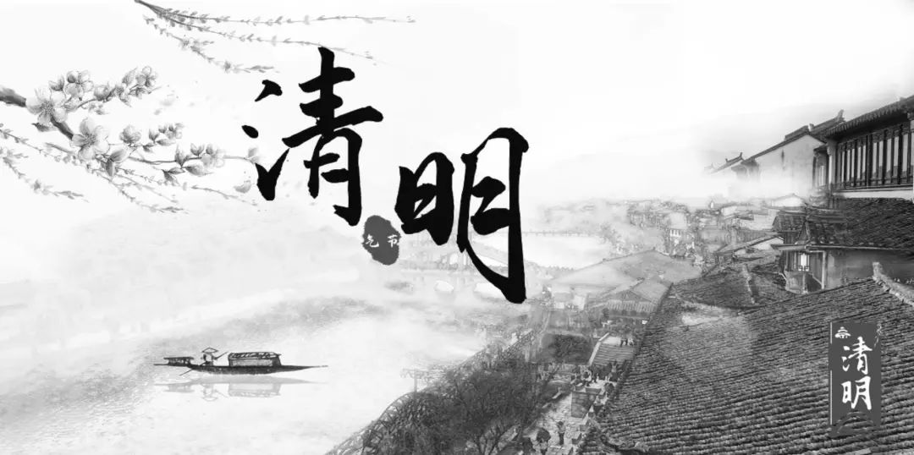
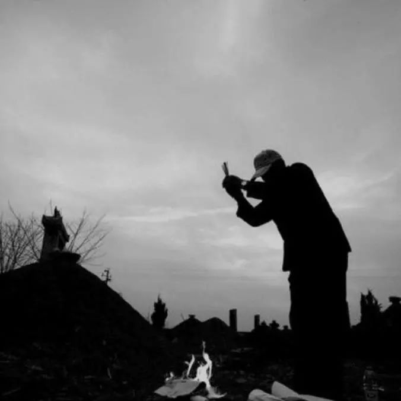
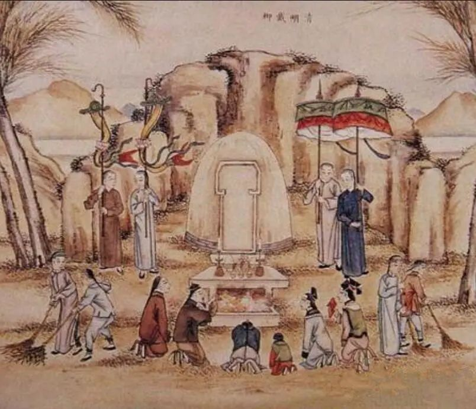
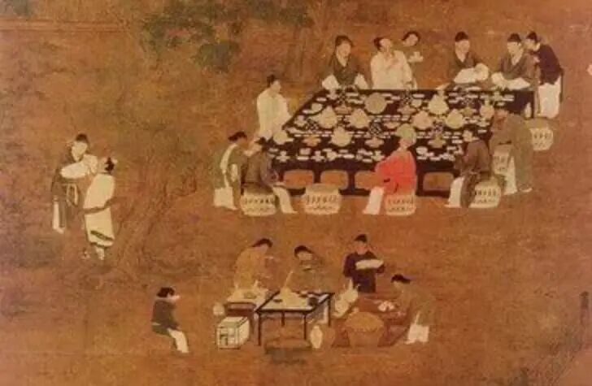
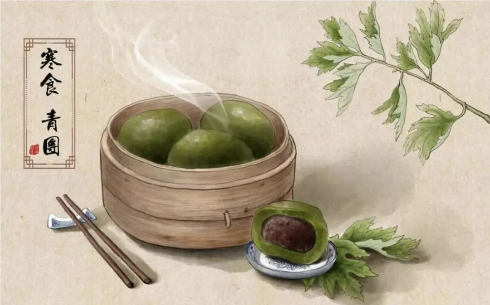
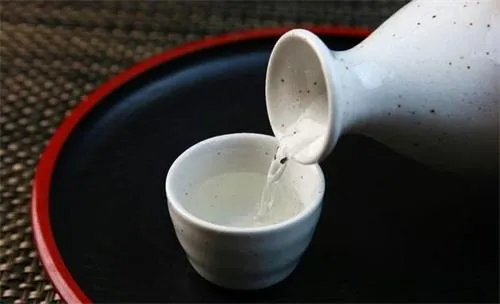
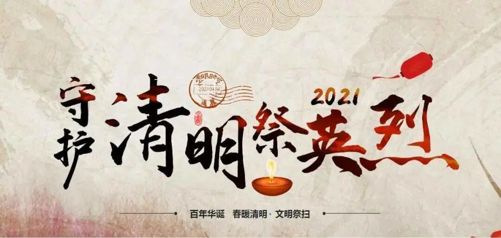
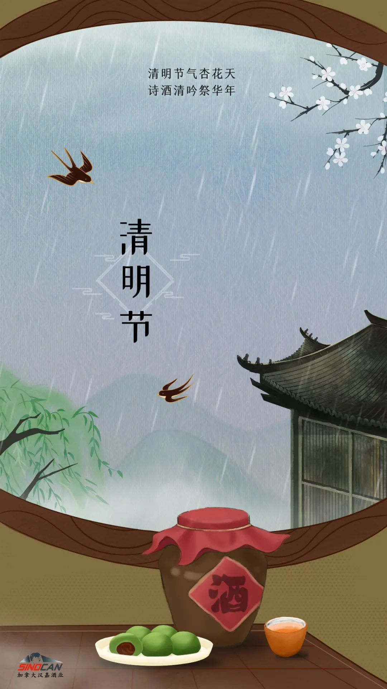
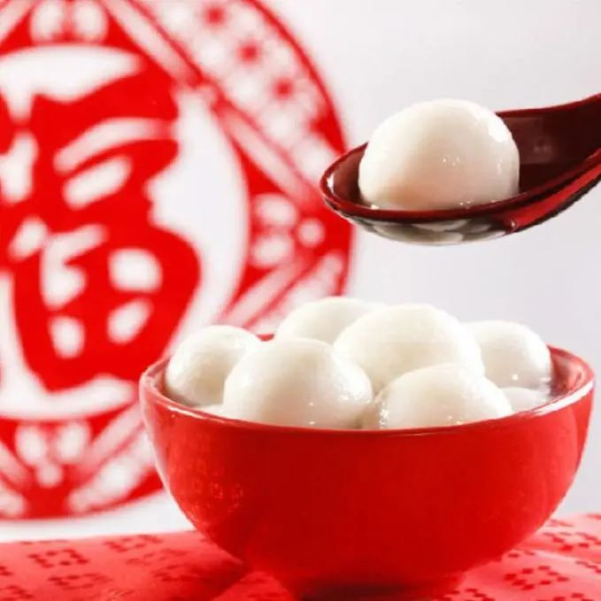

# 无标题

**链接地址:** http://mp.weixin.qq.com/s?__biz=MzIyMzU4OTc0MQ==&mid=2247485471&idx=1&sn=1596fec895a9ecb69d11dda67f88da13&chksm=e81aac1ddf6d250b2d217e825309e43ceacd4c2b0c64efc52a8e7de4be6ba6ddb5b55e2c45d7&mpshare=1&scene=2&srcid=0404iUCtR7i10dYooXG6h7es&sharer_sharetime=1617496802666&sharer_shareid=be1c8edd6c93eec155a61c876e41d26a#rd
**作者:** 
**获取时间:** 2025/8/28 19:50:51
**图片数量:** 28

---

## 原始HTML内容

<section style="box-sizing: border-box;font-style: normal;font-weight: 400;text-align: justify;font-size: 16px;"><section style="box-sizing: border-box;"><section style="display: flex;flex-flow: row nowrap;margin: 10px 0%;box-sizing: border-box;"><section style="display: inline-block;vertical-align: bottom;width: auto;background-color: rgb(243, 243, 241);flex: 100 100 0%;align-self: flex-end;height: auto;padding: 0px;margin: 0px -30px 0px 30px;box-sizing: border-box;"><section style="margin: 10px 0% 0px;box-sizing: border-box;"><section style="text-align: center;line-height: 1.8;letter-spacing: 1.5px;color: rgb(127, 127, 127);font-family: Optima-Regular, PingFangTC-light;padding: 0px 10px;box-sizing: border-box;">
<strong style="box-sizing: border-box;">点击蓝字 · 关注我们</strong>
</section></section><section style="box-sizing: border-box;"><section style="display: flex;flex-flow: row nowrap;margin: 0px 0% 5px;transform: translate3d(-20px, 0px, 0px);-webkit-transform: translate3d(-20px, 0px, 0px);-moz-transform: translate3d(-20px, 0px, 0px);-o-transform: translate3d(-20px, 0px, 0px);box-sizing: border-box;"><section style="display: inline-block;vertical-align: bottom;width: auto;flex: 0 0 0%;align-self: flex-end;height: auto;box-sizing: border-box;"><section style="box-sizing: border-box;"><section style="display: flex;flex-flow: row nowrap;margin: 0px 0%;box-sizing: border-box;"><section style="display: inline-block;vertical-align: top;width: 15px;align-self: flex-start;flex: 0 0 auto;height: auto;margin: 0px -4px 0px 0px;box-sizing: border-box;"><section style="margin: 0px 0%;box-sizing: border-box;"><section style="background-color: rgb(184, 184, 184);height: 1px;box-sizing: border-box;"><section><svg viewBox="0 0 1 1" style="float:left;line-height:0;width:0;vertical-align:top;"></svg></section></section></section></section><section style="display: inline-block;vertical-align: bottom;width: auto;line-height: 0;letter-spacing: 0px;flex: 0 0 0%;align-self: flex-end;height: auto;border-top: 0px solid rgb(62, 62, 62);border-top-left-radius: 0px;box-sizing: border-box;"><section style="text-align: center;transform: translate3d(4px, 0px, 0px);-webkit-transform: translate3d(4px, 0px, 0px);-moz-transform: translate3d(4px, 0px, 0px);-o-transform: translate3d(4px, 0px, 0px);margin: 0px 0% -1px;box-sizing: border-box;"><section style="display: inline-block;width: 10px;height: 5px;vertical-align: top;overflow: hidden;border-width: 1px 1px 1px 0px;border-radius: 0px 50px 50px 0px;border-style: solid solid solid none;border-color: rgb(184, 184, 184) rgb(184, 184, 184) rgb(184, 184, 184) rgb(62, 62, 62);background-color: rgba(255, 255, 255, 0);box-sizing: border-box;"><section><svg viewBox="0 0 1 1" style="float:left;line-height:0;width:0;vertical-align:top;"></svg></section></section></section><section style="text-align: center;box-sizing: border-box;"><section style="display: inline-block;width: 10px;height: 6px;vertical-align: top;overflow: hidden;border-width: 1px;border-radius: 50px 0px 0px 50px;border-style: solid none solid solid;border-color: rgb(184, 184, 184) rgb(62, 62, 62) rgb(184, 184, 184) rgb(184, 184, 184);background-color: rgba(255, 255, 255, 0);box-sizing: border-box;"><section><svg viewBox="0 0 1 1" style="float:left;line-height:0;width:0;vertical-align:top;"></svg></section></section></section></section><section style="display: inline-block;vertical-align: bottom;width: 18px;align-self: flex-end;flex: 0 0 auto;line-height: 0;letter-spacing: 0px;height: auto;box-sizing: border-box;"><section style="margin: 0px 0%;box-sizing: border-box;"><section style="background-color: rgb(184, 184, 184);height: 1px;box-sizing: border-box;"><section><svg viewBox="0 0 1 1" style="float:left;line-height:0;width:0;vertical-align:top;"></svg></section></section></section></section></section></section></section><section style="display: inline-block;vertical-align: bottom;width: 25px;align-self: flex-end;flex: 0 0 auto;height: auto;box-sizing: border-box;"><section style="margin: 0px 0%;box-sizing: border-box;"><section style="background-color: rgb(184, 184, 184);height: 1px;box-sizing: border-box;"><section><svg viewBox="0 0 1 1" style="float:left;line-height:0;width:0;vertical-align:top;"></svg></section></section></section></section></section></section></section><section style="display: inline-block;vertical-align: bottom;width: auto;align-self: flex-end;min-width: 10%;max-width: 100%;flex: 0 0 auto;height: auto;box-sizing: border-box;"><section style="text-align: center;margin: 0px 0%;box-sizing: border-box;"><section style="max-width: 100%;vertical-align: middle;display: inline-block;line-height: 0;width: 66px;height: auto;box-sizing: border-box;"></section></section></section></section></section><section style="box-sizing: border-box;">
 
</section><section style="display: inline-block;width: 100%;vertical-align: top;box-sizing: border-box;"><section style="text-align: center;margin: 10px 0% -60px;box-sizing: border-box;"><section style="max-width: 100%;vertical-align: middle;display: inline-block;line-height: 0;box-sizing: border-box;"></section></section></section><section style="box-sizing: border-box;"><section style="margin: 26px 0% 20px;display: flex;flex-flow: row nowrap;box-sizing: border-box;"><section style="display: inline-block;vertical-align: bottom;width: auto;align-self: flex-end;flex: 100 100 0%;height: auto;margin: 0px 0px -10px;box-sizing: border-box;"><section style="box-sizing: border-box;"><section style="display: flex;flex-flow: row nowrap;text-align: center;justify-content: center;box-sizing: border-box;"><section style="display: inline-block;vertical-align: bottom;width: auto;min-width: 10%;max-width: 100%;flex: 0 0 auto;height: auto;align-self: flex-end;box-sizing: border-box;"><section style="margin: 0px 0%;box-sizing: border-box;"><section style="text-align: justify;font-size: 15px;color: rgb(127, 127, 127);font-family: Optima-Regular, PingFangTC-light;letter-spacing: 1px;line-height: 1.5;padding: 0px 10px;box-sizing: border-box;">
清明时节雨纷纷

路上行人欲断魂

 

 
</section></section></section><section style="display: inline-block;vertical-align: middle;width: auto;min-width: 10%;max-width: 100%;flex: 0 0 auto;height: auto;align-self: center;border-left: 1px solid rgb(184, 184, 184);border-bottom-left-radius: 0px;margin: 0px 0px 0px 10px;padding: 0px 0px 0px 10px;box-sizing: border-box;"><section style="color: rgb(127, 127, 127);font-family: Optima-Regular, PingFangTC-light;line-height: 1.3;letter-spacing: 0px;box-sizing: border-box;">
<strong style="box-sizing: border-box;">清明</strong>

 
</section><section style="text-align: justify;color: rgb(196, 196, 196);font-family: Optima-Regular, PingFangTC-light;line-height: 1.3;letter-spacing: 0px;box-sizing: border-box;">
 

杜牧

 
</section></section></section></section></section><section style="display: inline-block;vertical-align: bottom;width: auto;background-color: rgb(243, 243, 241);align-self: flex-end;flex: 80 80 0%;height: auto;margin: 0px 23px 0px 0px;box-sizing: border-box;"><section style="text-align: center;margin: 5px 0%;box-sizing: border-box;"><section style="max-width: 100%;vertical-align: middle;display: inline-block;line-height: 0;width: 93%;height: auto;box-sizing: border-box;"></section></section></section></section></section><section style="box-sizing: border-box;">
 
</section><section style="text-align: center;justify-content: center;margin: 0px 0% 10px;box-sizing: border-box;"><section style="display: inline-block;width: 90%;vertical-align: top;height: auto;background-color: rgb(243, 243, 241);box-sizing: border-box;"><section style="box-sizing: border-box;"><section style="display: flex;flex-flow: row nowrap;box-sizing: border-box;"><section style="display: inline-block;vertical-align: top;width: auto;min-width: 10%;max-width: 100%;flex: 0 0 auto;height: auto;align-self: flex-start;box-sizing: border-box;"><section style="margin: -40px 0% 0px;box-sizing: border-box;"><section style="display: inline-block;width: 1px;height: 55px;vertical-align: top;overflow: hidden;background-color: rgb(232, 232, 231);box-sizing: border-box;"><section><svg viewBox="0 0 1 1" style="float:left;line-height:0;width:0;vertical-align:top;"></svg></section></section></section></section><section style="display: inline-block;vertical-align: top;width: auto;flex: 100 100 0%;align-self: flex-start;height: auto;box-sizing: border-box;"><section style="text-align: right;font-size: 12px;color: rgb(184, 184, 184);letter-spacing: 1px;line-height: 2;box-sizing: border-box;">
专题出品：加拿大汉嘉酒业
</section></section></section></section></section></section><section style="box-sizing: border-box;">
 
</section><section style="margin: 10px 0%;box-sizing: border-box;"><section style="display: inline-block;width: 100%;vertical-align: top;background-color: rgb(243, 243, 241);padding: 0px 20px;border-width: 0px;border-style: none;border-color: rgb(62, 62, 62);overflow: hidden;box-sizing: border-box;"><section style="margin: 30px 0% 0px;box-sizing: border-box;"><section style="display: inline-block;vertical-align: middle;width: 25px;height: auto;align-self: center;line-height: 1;padding: 0px;margin: 0px;box-sizing: border-box;"><section style="text-align: center;box-sizing: border-box;"><section style="display: inline-block;width: 14px;height: 14px;vertical-align: top;overflow: hidden;border-width: 0px;border-radius: 220px;border-style: none;border-color: rgb(62, 62, 62);background-color: rgb(184, 184, 184);box-sizing: border-box;"><section style="margin: 1px 0% 0px;transform: translate3d(1px, 0px, 0px);-webkit-transform: translate3d(1px, 0px, 0px);-moz-transform: translate3d(1px, 0px, 0px);-o-transform: translate3d(1px, 0px, 0px);box-sizing: border-box;"><section style="color: rgb(255, 255, 255);font-size: 12px;line-height: 1;letter-spacing: 0px;font-family: Optima-Regular, PingFangTC-light;box-sizing: border-box;">
1
</section></section></section></section></section><section style="display: inline-block;vertical-align: middle;width: auto;min-width: 10%;max-width: 100%;height: auto;align-self: center;box-sizing: border-box;"><section style="font-size: 22px;color: rgb(127, 127, 127);font-family: Optima-Regular, PingFangTC-light;letter-spacing: 1px;padding: 0px 13px;line-height: 1;box-sizing: border-box;">
<strong style="box-sizing: border-box;">清明节与酒的缘分</strong>
</section></section></section><section style="box-sizing: border-box;"><section style="display: flex;flex-flow: row nowrap;margin: 0px 0% 10px;box-sizing: border-box;"><section style="display: inline-block;vertical-align: bottom;width: auto;flex: 0 0 0%;align-self: flex-end;height: auto;box-sizing: border-box;"><section style="box-sizing: border-box;"><section style="display: flex;flex-flow: row nowrap;margin: 0px 0%;box-sizing: border-box;"><section style="display: inline-block;vertical-align: top;width: 15px;align-self: flex-start;flex: 0 0 auto;height: auto;margin: 0px -4px 0px 0px;box-sizing: border-box;"><section style="margin: 0px 0%;box-sizing: border-box;"><section style="background-color: rgb(184, 184, 184);height: 1px;box-sizing: border-box;"><section><svg viewBox="0 0 1 1" style="float:left;line-height:0;width:0;vertical-align:top;"></svg></section></section></section></section><section style="display: inline-block;vertical-align: bottom;width: auto;line-height: 0;letter-spacing: 0px;flex: 0 0 0%;align-self: flex-end;height: auto;border-top: 0px solid rgb(62, 62, 62);border-top-left-radius: 0px;box-sizing: border-box;"><section style="text-align: center;transform: translate3d(4px, 0px, 0px);-webkit-transform: translate3d(4px, 0px, 0px);-moz-transform: translate3d(4px, 0px, 0px);-o-transform: translate3d(4px, 0px, 0px);margin: 0px 0% -1px;box-sizing: border-box;"><section style="display: inline-block;width: 10px;height: 5px;vertical-align: top;overflow: hidden;border-width: 1px 1px 1px 0px;border-radius: 0px 50px 50px 0px;border-style: solid solid solid none;border-color: rgb(184, 184, 184) rgb(184, 184, 184) rgb(184, 184, 184) rgb(62, 62, 62);background-color: rgba(255, 255, 255, 0);box-sizing: border-box;"><section><svg viewBox="0 0 1 1" style="float:left;line-height:0;width:0;vertical-align:top;"></svg></section></section></section><section style="text-align: center;box-sizing: border-box;"><section style="display: inline-block;width: 10px;height: 6px;vertical-align: top;overflow: hidden;border-width: 1px;border-radius: 50px 0px 0px 50px;border-style: solid none solid solid;border-color: rgb(184, 184, 184) rgb(62, 62, 62) rgb(184, 184, 184) rgb(184, 184, 184);background-color: rgba(255, 255, 255, 0);box-sizing: border-box;"><section><svg viewBox="0 0 1 1" style="float:left;line-height:0;width:0;vertical-align:top;"></svg></section></section></section></section><section style="display: inline-block;vertical-align: bottom;width: 18px;align-self: flex-end;flex: 0 0 auto;line-height: 0;letter-spacing: 0px;height: auto;box-sizing: border-box;"><section style="margin: 0px 0%;box-sizing: border-box;"><section style="background-color: rgb(184, 184, 184);height: 1px;box-sizing: border-box;"><section><svg viewBox="0 0 1 1" style="float:left;line-height:0;width:0;vertical-align:top;"></svg></section></section></section></section></section></section></section><section style="display: inline-block;vertical-align: bottom;width: 25px;align-self: flex-end;flex: 0 0 auto;height: auto;box-sizing: border-box;"><section style="margin: 0px 0%;box-sizing: border-box;"><section style="background-color: rgb(184, 184, 184);height: 1px;box-sizing: border-box;"><section><svg viewBox="0 0 1 1" style="float:left;line-height:0;width:0;vertical-align:top;"></svg></section></section></section></section></section></section><section style="margin: 20px 0% 0px;box-sizing: border-box;"><section style="font-size: 14px;line-height: 2;letter-spacing: 2px;color: rgb(127, 127, 127);font-family: Optima-Regular, PingFangTC-light;padding: 0px 10px;box-sizing: border-box;">
清明节将至。

 

清明节是中国传统节日，人们一般将寒食节与清明节合为一个节日，<strong style="box-sizing: border-box;">有祭祖、扫墓是的习俗。</strong>

 
</section></section><section style="box-sizing: border-box;"><section style="display: flex;flex-flow: row nowrap;box-sizing: border-box;"><section style="display: inline-block;vertical-align: top;width: auto;flex: 100 100 0%;align-self: flex-start;height: auto;box-sizing: border-box;"><section style="text-align: center;margin-top: 10px;margin-bottom: 10px;box-sizing: border-box;"><section style="max-width: 100%;vertical-align: middle;display: inline-block;line-height: 0;border-width: 5px;border-radius: 50%;border-style: solid;border-color: rgb(232, 232, 231);overflow: hidden;box-sizing: border-box;"></section></section></section><section style="display: inline-block;vertical-align: top;width: 30%;flex: 0 0 auto;height: auto;align-self: flex-start;box-sizing: border-box;"><section style="text-align: center;margin-top: 10px;margin-bottom: 10px;box-sizing: border-box;"><section style="max-width: 100%;vertical-align: middle;display: inline-block;line-height: 0;border-width: 0px;border-radius: 50%;border-style: none;border-color: rgb(62, 62, 62);overflow: hidden;box-sizing: border-box;"></section></section><section style="box-sizing: border-box;"><section style="display: flex;flex-flow: row nowrap;text-align: center;justify-content: center;margin: 40px 0% 30px;box-sizing: border-box;"><section style="display: inline-block;width: auto;vertical-align: top;min-width: 10%;max-width: 100%;flex: 0 0 auto;height: auto;align-self: flex-start;border-left: 1px solid rgb(184, 184, 184);border-bottom-left-radius: 0px;margin: 0px;padding: 0px 0px 0px 7px;box-sizing: border-box;"><section style="margin: 0px 0% -30px;box-sizing: border-box;"><section style="display: inline-block;vertical-align: bottom;width: 49.7511%;align-self: flex-end;box-sizing: border-box;"><section style="margin: 0px 0%;box-sizing: border-box;"><section style="text-align: justify;color: rgb(196, 196, 196);font-family: Optima-Regular, PingFangTC-light;line-height: 1.5;letter-spacing: 0px;font-size: 14px;padding: 0px 2px;box-sizing: border-box;">
雨纷纷 

 
</section></section></section><section style="display: inline-block;vertical-align: bottom;width: 50%;align-self: flex-end;box-sizing: border-box;"><section style="margin: -20px 0% 20px;box-sizing: border-box;"><section style="color: rgb(127, 127, 127);font-family: Optima-Regular, PingFangTC-light;line-height: 1.3;letter-spacing: 0px;box-sizing: border-box;">
<strong style="box-sizing: border-box;">清明时节</strong>

 
</section></section></section></section></section></section></section></section></section></section><section style="margin: 20px 0% 0px;box-sizing: border-box;"><section style="font-size: 14px;line-height: 2;letter-spacing: 2px;color: rgb(127, 127, 127);font-family: Optima-Regular, PingFangTC-light;padding: 0px 10px;box-sizing: border-box;">
 

酒是中国的传统饮品，特别是在古代，酒的地位显得更加重要，因为饮品只有酒和茶，茶只在人们休闲娱乐时喝，而酒不光在平时喝，在重要的场合都少不了的。在清明的习俗中都有酒存在的。

 

<strong style="box-sizing: border-box;">首先，清明节饮酒一般有三种原因：</strong>

 

1. 喝酒是祭祀故去亲人的方式，也是寄托思念之情的媒介；

2. 寒食节期间，不能生火吃热食，只能吃凉食，饮酒可以增加热量；

3.人们常借扫墓之机，与家人携酒食春游，喝酒助兴，饮酒作乐。

 

 
</section></section><section style="margin: 30px 0% 0px;box-sizing: border-box;"><section style="display: inline-block;vertical-align: middle;width: 25px;height: auto;align-self: center;line-height: 1;padding: 0px;margin: 0px;box-sizing: border-box;"><section style="text-align: center;box-sizing: border-box;"><section style="display: inline-block;width: 14px;height: 14px;vertical-align: top;overflow: hidden;border-width: 0px;border-radius: 220px;border-style: none;border-color: rgb(62, 62, 62);background-color: rgb(184, 184, 184);box-sizing: border-box;"><section style="margin: 1px 0% 0px;transform: translate3d(1px, 0px, 0px);-webkit-transform: translate3d(1px, 0px, 0px);-moz-transform: translate3d(1px, 0px, 0px);-o-transform: translate3d(1px, 0px, 0px);box-sizing: border-box;"><section style="color: rgb(255, 255, 255);font-size: 12px;line-height: 1;letter-spacing: 0px;font-family: Optima-Regular, PingFangTC-light;box-sizing: border-box;">
2
</section></section></section></section></section><section style="display: inline-block;vertical-align: middle;width: auto;min-width: 10%;max-width: 100%;height: auto;align-self: center;box-sizing: border-box;"><section style="font-size: 22px;color: rgb(127, 127, 127);font-family: Optima-Regular, PingFangTC-light;letter-spacing: 1px;padding: 0px 13px;line-height: 1;box-sizing: border-box;">
<strong style="box-sizing: border-box;">酒与祭祀</strong>
</section></section></section><section style="box-sizing: border-box;"><section style="display: flex;flex-flow: row nowrap;margin: 0px 0% 10px;box-sizing: border-box;"><section style="display: inline-block;vertical-align: bottom;width: auto;flex: 0 0 0%;align-self: flex-end;height: auto;box-sizing: border-box;"><section style="box-sizing: border-box;"><section style="display: flex;flex-flow: row nowrap;margin: 0px 0%;box-sizing: border-box;"><section style="display: inline-block;vertical-align: top;width: 15px;align-self: flex-start;flex: 0 0 auto;height: auto;margin: 0px -4px 0px 0px;box-sizing: border-box;"><section style="margin: 0px 0%;box-sizing: border-box;"><section style="background-color: rgb(184, 184, 184);height: 1px;box-sizing: border-box;"><section><svg viewBox="0 0 1 1" style="float:left;line-height:0;width:0;vertical-align:top;"></svg></section></section></section></section><section style="display: inline-block;vertical-align: bottom;width: auto;line-height: 0;letter-spacing: 0px;flex: 0 0 0%;align-self: flex-end;height: auto;border-top: 0px solid rgb(62, 62, 62);border-top-left-radius: 0px;box-sizing: border-box;"><section style="text-align: center;transform: translate3d(4px, 0px, 0px);-webkit-transform: translate3d(4px, 0px, 0px);-moz-transform: translate3d(4px, 0px, 0px);-o-transform: translate3d(4px, 0px, 0px);margin: 0px 0% -1px;box-sizing: border-box;"><section style="display: inline-block;width: 10px;height: 5px;vertical-align: top;overflow: hidden;border-width: 1px 1px 1px 0px;border-radius: 0px 50px 50px 0px;border-style: solid solid solid none;border-color: rgb(184, 184, 184) rgb(184, 184, 184) rgb(184, 184, 184) rgb(62, 62, 62);background-color: rgba(255, 255, 255, 0);box-sizing: border-box;"><section><svg viewBox="0 0 1 1" style="float:left;line-height:0;width:0;vertical-align:top;"></svg></section></section></section><section style="text-align: center;box-sizing: border-box;"><section style="display: inline-block;width: 10px;height: 6px;vertical-align: top;overflow: hidden;border-width: 1px;border-radius: 50px 0px 0px 50px;border-style: solid none solid solid;border-color: rgb(184, 184, 184) rgb(62, 62, 62) rgb(184, 184, 184) rgb(184, 184, 184);background-color: rgba(255, 255, 255, 0);box-sizing: border-box;"><section><svg viewBox="0 0 1 1" style="float:left;line-height:0;width:0;vertical-align:top;"></svg></section></section></section></section><section style="display: inline-block;vertical-align: bottom;width: 18px;align-self: flex-end;flex: 0 0 auto;line-height: 0;letter-spacing: 0px;height: auto;box-sizing: border-box;"><section style="margin: 0px 0%;box-sizing: border-box;"><section style="background-color: rgb(184, 184, 184);height: 1px;box-sizing: border-box;"><section><svg viewBox="0 0 1 1" style="float:left;line-height:0;width:0;vertical-align:top;"></svg></section></section></section></section></section></section></section><section style="display: inline-block;vertical-align: bottom;width: 25px;align-self: flex-end;flex: 0 0 auto;height: auto;box-sizing: border-box;"><section style="margin: 0px 0%;box-sizing: border-box;"><section style="background-color: rgb(184, 184, 184);height: 1px;box-sizing: border-box;"><section><svg viewBox="0 0 1 1" style="float:left;line-height:0;width:0;vertical-align:top;"></svg></section></section></section></section></section></section><section style="margin: 20px 0% 0px;box-sizing: border-box;"><section style="font-size: 14px;line-height: 2;letter-spacing: 2px;color: rgb(127, 127, 127);font-family: Optima-Regular, PingFangTC-light;padding: 0px 10px;box-sizing: border-box;">
 

清明扫墓除整修坟墓、清除杂草外，无论家境贫富，都要备好酒醪，全家举行祭祀仪式，仪式后饮酒聚食，称之为<strong style="box-sizing: border-box;">吃清明酒</strong>。
</section></section><section style="margin: 10px 0%;box-sizing: border-box;"><section style="display: inline-block;width: 100%;vertical-align: top;background-color: rgb(242, 243, 241);padding: 0px 20px;border-width: 0px;border-style: none;border-color: rgb(62, 62, 62);overflow: hidden;box-sizing: border-box;"><section style="box-sizing: border-box;"><section style="display: flex;flex-flow: row nowrap;margin: 20px 0% 0px;box-sizing: border-box;"><section style="display: inline-block;vertical-align: bottom;width: auto;flex: 0 0 0%;align-self: flex-end;height: auto;box-sizing: border-box;"><section style="box-sizing: border-box;"><section style="display: flex;flex-flow: row nowrap;margin: 0px 0%;box-sizing: border-box;"><section style="display: inline-block;vertical-align: top;width: 15px;align-self: flex-start;flex: 0 0 auto;height: auto;margin: 0px -4px 0px 0px;box-sizing: border-box;"><section style="margin: 0px 0%;box-sizing: border-box;"><section style="background-color: rgb(184, 184, 184);height: 1px;box-sizing: border-box;"><section><svg viewBox="0 0 1 1" style="float:left;line-height:0;width:0;vertical-align:top;"></svg></section></section></section></section><section style="display: inline-block;vertical-align: bottom;width: auto;line-height: 0;letter-spacing: 0px;flex: 0 0 0%;align-self: flex-end;height: auto;border-top: 0px solid rgb(62, 62, 62);border-top-left-radius: 0px;box-sizing: border-box;"><section style="text-align: center;transform: translate3d(4px, 0px, 0px);-webkit-transform: translate3d(4px, 0px, 0px);-moz-transform: translate3d(4px, 0px, 0px);-o-transform: translate3d(4px, 0px, 0px);margin: 0px 0% -1px;box-sizing: border-box;"><section style="display: inline-block;width: 10px;height: 5px;vertical-align: top;overflow: hidden;border-width: 1px 1px 1px 0px;border-radius: 0px 50px 50px 0px;border-style: solid solid solid none;border-color: rgb(184, 184, 184) rgb(184, 184, 184) rgb(184, 184, 184) rgb(62, 62, 62);background-color: rgba(255, 255, 255, 0);box-sizing: border-box;"><section><svg viewBox="0 0 1 1" style="float:left;line-height:0;width:0;vertical-align:top;"></svg></section></section></section><section style="text-align: center;box-sizing: border-box;"><section style="display: inline-block;width: 10px;height: 6px;vertical-align: top;overflow: hidden;border-width: 1px;border-radius: 50px 0px 0px 50px;border-style: solid none solid solid;border-color: rgb(184, 184, 184) rgb(62, 62, 62) rgb(184, 184, 184) rgb(184, 184, 184);background-color: rgba(255, 255, 255, 0);box-sizing: border-box;"><section><svg viewBox="0 0 1 1" style="float:left;line-height:0;width:0;vertical-align:top;"></svg></section></section></section></section><section style="display: inline-block;vertical-align: bottom;width: 18px;align-self: flex-end;flex: 0 0 auto;line-height: 0;letter-spacing: 0px;height: auto;box-sizing: border-box;"><section style="margin: 0px 0%;box-sizing: border-box;"><section style="background-color: rgb(184, 184, 184);height: 1px;box-sizing: border-box;"><section><svg viewBox="0 0 1 1" style="float:left;line-height:0;width:0;vertical-align:top;"></svg></section></section></section></section></section></section></section><section style="display: inline-block;vertical-align: bottom;width: 25px;align-self: flex-end;flex: 0 0 auto;height: auto;box-sizing: border-box;"><section style="margin: 0px 0%;box-sizing: border-box;"><section style="background-color: rgb(184, 184, 184);height: 1px;box-sizing: border-box;"><section><svg viewBox="0 0 1 1" style="float:left;line-height:0;width:0;vertical-align:top;"></svg></section></section></section></section></section></section><section style="text-align: center;margin: 10px 0%;box-sizing: border-box;"><section style="max-width: 100%;vertical-align: middle;display: inline-block;line-height: 0;box-sizing: border-box;"></section></section><section style="text-align: right;margin: 0px 0% -6px;opacity: 0.33;justify-content: flex-end;transform: translate3d(33px, 0px, 0px);-webkit-transform: translate3d(33px, 0px, 0px);-moz-transform: translate3d(33px, 0px, 0px);-o-transform: translate3d(33px, 0px, 0px);box-sizing: border-box;"><section style="max-width: 100%;vertical-align: middle;display: inline-block;line-height: 0;width: 30%;height: auto;box-sizing: border-box;"></section></section></section></section><section style="margin: 20px 0% 0px;box-sizing: border-box;"><section style="font-size: 14px;line-height: 2;letter-spacing: 2px;color: rgb(127, 127, 127);font-family: Optima-Regular, PingFangTC-light;padding: 0px 10px;box-sizing: border-box;">
 

此时，酒是人们平缓或麻醉哀痛心情的最好载体。 

 

一杯烈酒，是对<strong style="box-sizing: border-box;">先祖的祭奠</strong>，对逝者的哀悼；也是对过去时光的思念，对人生无常的叹息；更是返回内心，对自我的追寻与洗礼。

 

餐毕，再去扫墓，在坟前供上吃清明酒时特意留下的食物和酒，点烛烧纸进行祭奠，清明与酒的缘分正是来源于祭扫。 
</section></section><section style="margin: 10px 0%;box-sizing: border-box;"><section style="display: inline-block;width: 100%;vertical-align: top;background-color: rgb(242, 243, 241);padding: 0px 20px;border-width: 0px;border-style: none;border-color: rgb(62, 62, 62);overflow: hidden;box-sizing: border-box;"><section style="box-sizing: border-box;"><section style="display: flex;flex-flow: row nowrap;margin: 20px 0% 0px;box-sizing: border-box;"><section style="display: inline-block;vertical-align: bottom;width: auto;flex: 0 0 0%;align-self: flex-end;height: auto;box-sizing: border-box;"><section style="box-sizing: border-box;"><section style="display: flex;flex-flow: row nowrap;margin: 0px 0%;box-sizing: border-box;"><section style="display: inline-block;vertical-align: top;width: 15px;align-self: flex-start;flex: 0 0 auto;height: auto;margin: 0px -4px 0px 0px;box-sizing: border-box;"><section style="margin: 0px 0%;box-sizing: border-box;"><section style="background-color: rgb(184, 184, 184);height: 1px;box-sizing: border-box;"><section><svg viewBox="0 0 1 1" style="float:left;line-height:0;width:0;vertical-align:top;"></svg></section></section></section></section><section style="display: inline-block;vertical-align: bottom;width: auto;line-height: 0;letter-spacing: 0px;flex: 0 0 0%;align-self: flex-end;height: auto;border-top: 0px solid rgb(62, 62, 62);border-top-left-radius: 0px;box-sizing: border-box;"><section style="text-align: center;transform: translate3d(4px, 0px, 0px);-webkit-transform: translate3d(4px, 0px, 0px);-moz-transform: translate3d(4px, 0px, 0px);-o-transform: translate3d(4px, 0px, 0px);margin: 0px 0% -1px;box-sizing: border-box;"><section style="display: inline-block;width: 10px;height: 5px;vertical-align: top;overflow: hidden;border-width: 1px 1px 1px 0px;border-radius: 0px 50px 50px 0px;border-style: solid solid solid none;border-color: rgb(184, 184, 184) rgb(184, 184, 184) rgb(184, 184, 184) rgb(62, 62, 62);background-color: rgba(255, 255, 255, 0);box-sizing: border-box;"><section><svg viewBox="0 0 1 1" style="float:left;line-height:0;width:0;vertical-align:top;"></svg></section></section></section><section style="text-align: center;box-sizing: border-box;"><section style="display: inline-block;width: 10px;height: 6px;vertical-align: top;overflow: hidden;border-width: 1px;border-radius: 50px 0px 0px 50px;border-style: solid none solid solid;border-color: rgb(184, 184, 184) rgb(62, 62, 62) rgb(184, 184, 184) rgb(184, 184, 184);background-color: rgba(255, 255, 255, 0);box-sizing: border-box;"><section><svg viewBox="0 0 1 1" style="float:left;line-height:0;width:0;vertical-align:top;"></svg></section></section></section></section><section style="display: inline-block;vertical-align: bottom;width: 18px;align-self: flex-end;flex: 0 0 auto;line-height: 0;letter-spacing: 0px;height: auto;box-sizing: border-box;"><section style="margin: 0px 0%;box-sizing: border-box;"><section style="background-color: rgb(184, 184, 184);height: 1px;box-sizing: border-box;"><section><svg viewBox="0 0 1 1" style="float:left;line-height:0;width:0;vertical-align:top;"></svg></section></section></section></section></section></section></section><section style="display: inline-block;vertical-align: bottom;width: 25px;align-self: flex-end;flex: 0 0 auto;height: auto;box-sizing: border-box;"><section style="margin: 0px 0%;box-sizing: border-box;"><section style="background-color: rgb(184, 184, 184);height: 1px;box-sizing: border-box;"><section><svg viewBox="0 0 1 1" style="float:left;line-height:0;width:0;vertical-align:top;"></svg></section></section></section></section></section></section><section style="text-align: center;margin: 10px 0%;box-sizing: border-box;"><section style="max-width: 100%;vertical-align: middle;display: inline-block;line-height: 0;box-sizing: border-box;"></section></section><section style="text-align: right;margin: 0px 0% -6px;opacity: 0.33;justify-content: flex-end;transform: translate3d(33px, 0px, 0px);-webkit-transform: translate3d(33px, 0px, 0px);-moz-transform: translate3d(33px, 0px, 0px);-o-transform: translate3d(33px, 0px, 0px);box-sizing: border-box;"><section style="max-width: 100%;vertical-align: middle;display: inline-block;line-height: 0;width: 30%;height: auto;box-sizing: border-box;"></section></section></section></section><section style="margin: 20px 0% 0px;box-sizing: border-box;"><section style="font-size: 14px;line-height: 2;letter-spacing: 2px;color: rgb(127, 127, 127);font-family: Optima-Regular, PingFangTC-light;padding: 0px 10px;box-sizing: border-box;">
 

在<strong style="box-sizing: border-box;">全家相逢相聚的好时机饮一杯清明酒</strong>，除了不忘祖宗恩德、享受今日幸福生活的含义外，亦有籍此思考自己的人生，通过缅怀完成了一次对生命的礼赞。

 

 
</section></section><section style="margin: 30px 0% 0px;box-sizing: border-box;"><section style="display: inline-block;vertical-align: middle;width: 25px;height: auto;align-self: center;line-height: 1;padding: 0px;margin: 0px;box-sizing: border-box;"><section style="text-align: center;box-sizing: border-box;"><section style="display: inline-block;width: 14px;height: 14px;vertical-align: top;overflow: hidden;border-width: 0px;border-radius: 220px;border-style: none;border-color: rgb(62, 62, 62);background-color: rgb(184, 184, 184);box-sizing: border-box;"><section style="margin: 1px 0% 0px;transform: translate3d(1px, 0px, 0px);-webkit-transform: translate3d(1px, 0px, 0px);-moz-transform: translate3d(1px, 0px, 0px);-o-transform: translate3d(1px, 0px, 0px);box-sizing: border-box;"><section style="color: rgb(255, 255, 255);font-size: 12px;line-height: 1;letter-spacing: 0px;font-family: Optima-Regular, PingFangTC-light;box-sizing: border-box;">
3
</section></section></section></section></section><section style="display: inline-block;vertical-align: middle;width: auto;min-width: 10%;max-width: 100%;height: auto;align-self: center;box-sizing: border-box;"><section style="font-size: 22px;color: rgb(127, 127, 127);font-family: Optima-Regular, PingFangTC-light;letter-spacing: 1px;padding: 0px 13px;line-height: 1;box-sizing: border-box;">
<strong style="box-sizing: border-box;">酒与寒食</strong>
</section></section></section><section style="box-sizing: border-box;">
 
</section><section style="box-sizing: border-box;"><section style="display: flex;flex-flow: row nowrap;margin: 0px 0% 10px;box-sizing: border-box;"><section style="display: inline-block;vertical-align: bottom;width: auto;flex: 0 0 0%;align-self: flex-end;height: auto;box-sizing: border-box;"><section style="box-sizing: border-box;"><section style="display: flex;flex-flow: row nowrap;margin: 0px 0%;box-sizing: border-box;"><section style="display: inline-block;vertical-align: top;width: 15px;align-self: flex-start;flex: 0 0 auto;height: auto;margin: 0px -4px 0px 0px;box-sizing: border-box;"><section style="margin: 0px 0%;box-sizing: border-box;"><section style="background-color: rgb(184, 184, 184);height: 1px;box-sizing: border-box;"><section><svg viewBox="0 0 1 1" style="float:left;line-height:0;width:0;vertical-align:top;"></svg></section></section></section></section><section style="display: inline-block;vertical-align: bottom;width: auto;line-height: 0;letter-spacing: 0px;flex: 0 0 0%;align-self: flex-end;height: auto;border-top: 0px solid rgb(62, 62, 62);border-top-left-radius: 0px;box-sizing: border-box;"><section style="text-align: center;transform: translate3d(4px, 0px, 0px);-webkit-transform: translate3d(4px, 0px, 0px);-moz-transform: translate3d(4px, 0px, 0px);-o-transform: translate3d(4px, 0px, 0px);margin: 0px 0% -1px;box-sizing: border-box;"><section style="display: inline-block;width: 10px;height: 5px;vertical-align: top;overflow: hidden;border-width: 1px 1px 1px 0px;border-radius: 0px 50px 50px 0px;border-style: solid solid solid none;border-color: rgb(184, 184, 184) rgb(184, 184, 184) rgb(184, 184, 184) rgb(62, 62, 62);background-color: rgba(255, 255, 255, 0);box-sizing: border-box;"><section><svg viewBox="0 0 1 1" style="float:left;line-height:0;width:0;vertical-align:top;"></svg></section></section></section><section style="text-align: center;box-sizing: border-box;"><section style="display: inline-block;width: 10px;height: 6px;vertical-align: top;overflow: hidden;border-width: 1px;border-radius: 50px 0px 0px 50px;border-style: solid none solid solid;border-color: rgb(184, 184, 184) rgb(62, 62, 62) rgb(184, 184, 184) rgb(184, 184, 184);background-color: rgba(255, 255, 255, 0);box-sizing: border-box;"><section><svg viewBox="0 0 1 1" style="float:left;line-height:0;width:0;vertical-align:top;"></svg></section></section></section></section><section style="display: inline-block;vertical-align: bottom;width: 18px;align-self: flex-end;flex: 0 0 auto;line-height: 0;letter-spacing: 0px;height: auto;box-sizing: border-box;"><section style="margin: 0px 0%;box-sizing: border-box;"><section style="background-color: rgb(184, 184, 184);height: 1px;box-sizing: border-box;"><section><svg viewBox="0 0 1 1" style="float:left;line-height:0;width:0;vertical-align:top;"></svg></section></section></section></section></section></section></section><section style="display: inline-block;vertical-align: bottom;width: 25px;align-self: flex-end;flex: 0 0 auto;height: auto;box-sizing: border-box;"><section style="margin: 0px 0%;box-sizing: border-box;"><section style="background-color: rgb(184, 184, 184);height: 1px;box-sizing: border-box;"><section><svg viewBox="0 0 1 1" style="float:left;line-height:0;width:0;vertical-align:top;"></svg></section></section></section></section></section></section><section style="margin: 20px 0% 0px;box-sizing: border-box;"><section style="font-size: 14px;line-height: 2;letter-spacing: 2px;color: rgb(127, 127, 127);font-family: Optima-Regular, PingFangTC-light;padding: 0px 10px;box-sizing: border-box;">
<strong style="box-sizing: border-box;">怀家寒食夜，中酒落花天 。</strong>

<strong style="box-sizing: border-box;">酒中藏明月，温酒驱寒意。</strong>

 

古时，在清明前还有一个节日——<strong style="box-sizing: border-box;">寒食节</strong>。
</section></section><section style="margin: 10px 0%;box-sizing: border-box;"><section style="display: inline-block;width: 100%;vertical-align: top;background-color: rgb(242, 243, 241);padding: 0px 20px;border-width: 0px;border-style: none;border-color: rgb(62, 62, 62);overflow: hidden;box-sizing: border-box;"><section style="box-sizing: border-box;"><section style="display: flex;flex-flow: row nowrap;margin: 20px 0% 0px;box-sizing: border-box;"><section style="display: inline-block;vertical-align: bottom;width: auto;flex: 0 0 0%;align-self: flex-end;height: auto;box-sizing: border-box;"><section style="box-sizing: border-box;"><section style="display: flex;flex-flow: row nowrap;margin: 0px 0%;box-sizing: border-box;"><section style="display: inline-block;vertical-align: top;width: 15px;align-self: flex-start;flex: 0 0 auto;height: auto;margin: 0px -4px 0px 0px;box-sizing: border-box;"><section style="margin: 0px 0%;box-sizing: border-box;"><section style="background-color: rgb(184, 184, 184);height: 1px;box-sizing: border-box;"><section><svg viewBox="0 0 1 1" style="float:left;line-height:0;width:0;vertical-align:top;"></svg></section></section></section></section><section style="display: inline-block;vertical-align: bottom;width: auto;line-height: 0;letter-spacing: 0px;flex: 0 0 0%;align-self: flex-end;height: auto;border-top: 0px solid rgb(62, 62, 62);border-top-left-radius: 0px;box-sizing: border-box;"><section style="text-align: center;transform: translate3d(4px, 0px, 0px);-webkit-transform: translate3d(4px, 0px, 0px);-moz-transform: translate3d(4px, 0px, 0px);-o-transform: translate3d(4px, 0px, 0px);margin: 0px 0% -1px;box-sizing: border-box;"><section style="display: inline-block;width: 10px;height: 5px;vertical-align: top;overflow: hidden;border-width: 1px 1px 1px 0px;border-radius: 0px 50px 50px 0px;border-style: solid solid solid none;border-color: rgb(184, 184, 184) rgb(184, 184, 184) rgb(184, 184, 184) rgb(62, 62, 62);background-color: rgba(255, 255, 255, 0);box-sizing: border-box;"><section><svg viewBox="0 0 1 1" style="float:left;line-height:0;width:0;vertical-align:top;"></svg></section></section></section><section style="text-align: center;box-sizing: border-box;"><section style="display: inline-block;width: 10px;height: 6px;vertical-align: top;overflow: hidden;border-width: 1px;border-radius: 50px 0px 0px 50px;border-style: solid none solid solid;border-color: rgb(184, 184, 184) rgb(62, 62, 62) rgb(184, 184, 184) rgb(184, 184, 184);background-color: rgba(255, 255, 255, 0);box-sizing: border-box;"><section><svg viewBox="0 0 1 1" style="float:left;line-height:0;width:0;vertical-align:top;"></svg></section></section></section></section><section style="display: inline-block;vertical-align: bottom;width: 18px;align-self: flex-end;flex: 0 0 auto;line-height: 0;letter-spacing: 0px;height: auto;box-sizing: border-box;"><section style="margin: 0px 0%;box-sizing: border-box;"><section style="background-color: rgb(184, 184, 184);height: 1px;box-sizing: border-box;"><section><svg viewBox="0 0 1 1" style="float:left;line-height:0;width:0;vertical-align:top;"></svg></section></section></section></section></section></section></section><section style="display: inline-block;vertical-align: bottom;width: 25px;align-self: flex-end;flex: 0 0 auto;height: auto;box-sizing: border-box;"><section style="margin: 0px 0%;box-sizing: border-box;"><section style="background-color: rgb(184, 184, 184);height: 1px;box-sizing: border-box;"><section><svg viewBox="0 0 1 1" style="float:left;line-height:0;width:0;vertical-align:top;"></svg></section></section></section></section></section></section><section style="text-align: center;margin: 10px 0%;box-sizing: border-box;"><section style="max-width: 100%;vertical-align: middle;display: inline-block;line-height: 0;box-sizing: border-box;"></section></section><section style="text-align: right;margin: 0px 0% -6px;opacity: 0.33;justify-content: flex-end;transform: translate3d(33px, 0px, 0px);-webkit-transform: translate3d(33px, 0px, 0px);-moz-transform: translate3d(33px, 0px, 0px);-o-transform: translate3d(33px, 0px, 0px);box-sizing: border-box;"><section style="max-width: 100%;vertical-align: middle;display: inline-block;line-height: 0;width: 30%;height: auto;box-sizing: border-box;"></section></section></section></section><section style="margin: 20px 0% 0px;box-sizing: border-box;"><section style="font-size: 14px;line-height: 2;letter-spacing: 2px;color: rgb(127, 127, 127);font-family: Optima-Regular, PingFangTC-light;padding: 0px 10px;box-sizing: border-box;">
 

相传这是为了纪念隐居不言禄、枹树焚身的介子推，寒食节<strong style="box-sizing: border-box;">禁火要延续三天</strong>的时间。

 

寒食食品包括寒食粥、寒食面、寒食浆、青精饭及饧等。在初春乍暖还寒时，连吃三天的冷食会使胃很不舒服，所以人们便会选择<strong style="box-sizing: border-box;">饮酒来暖身子</strong>。
</section></section><section style="margin: 10px 0%;box-sizing: border-box;"><section style="display: inline-block;width: 100%;vertical-align: top;background-color: rgb(242, 243, 241);padding: 0px 20px;border-width: 0px;border-style: none;border-color: rgb(62, 62, 62);overflow: hidden;box-sizing: border-box;"><section style="box-sizing: border-box;"><section style="display: flex;flex-flow: row nowrap;margin: 20px 0% 0px;box-sizing: border-box;"><section style="display: inline-block;vertical-align: bottom;width: auto;flex: 0 0 0%;align-self: flex-end;height: auto;box-sizing: border-box;"><section style="box-sizing: border-box;"><section style="display: flex;flex-flow: row nowrap;margin: 0px 0%;box-sizing: border-box;"><section style="display: inline-block;vertical-align: top;width: 15px;align-self: flex-start;flex: 0 0 auto;height: auto;margin: 0px -4px 0px 0px;box-sizing: border-box;"><section style="margin: 0px 0%;box-sizing: border-box;"><section style="background-color: rgb(184, 184, 184);height: 1px;box-sizing: border-box;"><section><svg viewBox="0 0 1 1" style="float:left;line-height:0;width:0;vertical-align:top;"></svg></section></section></section></section><section style="display: inline-block;vertical-align: bottom;width: auto;line-height: 0;letter-spacing: 0px;flex: 0 0 0%;align-self: flex-end;height: auto;border-top: 0px solid rgb(62, 62, 62);border-top-left-radius: 0px;box-sizing: border-box;"><section style="text-align: center;transform: translate3d(4px, 0px, 0px);-webkit-transform: translate3d(4px, 0px, 0px);-moz-transform: translate3d(4px, 0px, 0px);-o-transform: translate3d(4px, 0px, 0px);margin: 0px 0% -1px;box-sizing: border-box;"><section style="display: inline-block;width: 10px;height: 5px;vertical-align: top;overflow: hidden;border-width: 1px 1px 1px 0px;border-radius: 0px 50px 50px 0px;border-style: solid solid solid none;border-color: rgb(184, 184, 184) rgb(184, 184, 184) rgb(184, 184, 184) rgb(62, 62, 62);background-color: rgba(255, 255, 255, 0);box-sizing: border-box;"><section><svg viewBox="0 0 1 1" style="float:left;line-height:0;width:0;vertical-align:top;"></svg></section></section></section><section style="text-align: center;box-sizing: border-box;"><section style="display: inline-block;width: 10px;height: 6px;vertical-align: top;overflow: hidden;border-width: 1px;border-radius: 50px 0px 0px 50px;border-style: solid none solid solid;border-color: rgb(184, 184, 184) rgb(62, 62, 62) rgb(184, 184, 184) rgb(184, 184, 184);background-color: rgba(255, 255, 255, 0);box-sizing: border-box;"><section><svg viewBox="0 0 1 1" style="float:left;line-height:0;width:0;vertical-align:top;"></svg></section></section></section></section><section style="display: inline-block;vertical-align: bottom;width: 18px;align-self: flex-end;flex: 0 0 auto;line-height: 0;letter-spacing: 0px;height: auto;box-sizing: border-box;"><section style="margin: 0px 0%;box-sizing: border-box;"><section style="background-color: rgb(184, 184, 184);height: 1px;box-sizing: border-box;"><section><svg viewBox="0 0 1 1" style="float:left;line-height:0;width:0;vertical-align:top;"></svg></section></section></section></section></section></section></section><section style="display: inline-block;vertical-align: bottom;width: 25px;align-self: flex-end;flex: 0 0 auto;height: auto;box-sizing: border-box;"><section style="margin: 0px 0%;box-sizing: border-box;"><section style="background-color: rgb(184, 184, 184);height: 1px;box-sizing: border-box;"><section><svg viewBox="0 0 1 1" style="float:left;line-height:0;width:0;vertical-align:top;"></svg></section></section></section></section></section></section><section style="text-align: center;margin: 10px 0%;box-sizing: border-box;"><section style="max-width: 100%;vertical-align: middle;display: inline-block;line-height: 0;box-sizing: border-box;"></section></section><section style="text-align: right;margin: 0px 0% -6px;opacity: 0.33;justify-content: flex-end;transform: translate3d(33px, 0px, 0px);-webkit-transform: translate3d(33px, 0px, 0px);-moz-transform: translate3d(33px, 0px, 0px);-o-transform: translate3d(33px, 0px, 0px);box-sizing: border-box;"><section style="max-width: 100%;vertical-align: middle;display: inline-block;line-height: 0;width: 30%;height: auto;box-sizing: border-box;"></section></section></section></section><section style="margin: 20px 0% 0px;box-sizing: border-box;"><section style="font-size: 14px;line-height: 2;letter-spacing: 2px;color: rgb(127, 127, 127);font-family: Optima-Regular, PingFangTC-light;padding: 0px 10px;box-sizing: border-box;">
 

虽然现在寒食节和清明节已经合并，也很少有人家会在清明节禁火，但做几碟精致的菜肴佐酒，和家人或好友围桌而坐，也成了现代人不约而同的习俗。

 

 
</section></section><section style="margin: 30px 0% 0px;box-sizing: border-box;"><section style="display: inline-block;vertical-align: middle;width: 25px;height: auto;align-self: center;line-height: 1;padding: 0px;margin: 0px;box-sizing: border-box;"><section style="text-align: center;box-sizing: border-box;"><section style="display: inline-block;width: 14px;height: 14px;vertical-align: top;overflow: hidden;border-width: 0px;border-radius: 220px;border-style: none;border-color: rgb(62, 62, 62);background-color: rgb(184, 184, 184);box-sizing: border-box;"><section style="margin: 1px 0% 0px;transform: translate3d(1px, 0px, 0px);-webkit-transform: translate3d(1px, 0px, 0px);-moz-transform: translate3d(1px, 0px, 0px);-o-transform: translate3d(1px, 0px, 0px);box-sizing: border-box;"><section style="color: rgb(255, 255, 255);font-size: 12px;line-height: 1;letter-spacing: 0px;font-family: Optima-Regular, PingFangTC-light;box-sizing: border-box;">
4
</section></section></section></section></section><section style="display: inline-block;vertical-align: middle;width: auto;min-width: 10%;max-width: 100%;height: auto;align-self: center;box-sizing: border-box;"><section style="font-size: 22px;color: rgb(127, 127, 127);font-family: Optima-Regular, PingFangTC-light;letter-spacing: 1px;padding: 0px 13px;line-height: 1;box-sizing: border-box;">
<strong style="box-sizing: border-box;">酒与踏青</strong>
</section></section></section><section style="box-sizing: border-box;"><section style="display: flex;flex-flow: row nowrap;margin: 0px 0% 10px;box-sizing: border-box;"><section style="display: inline-block;vertical-align: bottom;width: auto;flex: 0 0 0%;align-self: flex-end;height: auto;box-sizing: border-box;"><section style="box-sizing: border-box;"><section style="display: flex;flex-flow: row nowrap;margin: 0px 0%;box-sizing: border-box;"><section style="display: inline-block;vertical-align: top;width: 15px;align-self: flex-start;flex: 0 0 auto;height: auto;margin: 0px -4px 0px 0px;box-sizing: border-box;"><section style="margin: 0px 0%;box-sizing: border-box;"><section style="background-color: rgb(184, 184, 184);height: 1px;box-sizing: border-box;"><section><svg viewBox="0 0 1 1" style="float:left;line-height:0;width:0;vertical-align:top;"></svg></section></section></section></section><section style="display: inline-block;vertical-align: bottom;width: auto;line-height: 0;letter-spacing: 0px;flex: 0 0 0%;align-self: flex-end;height: auto;border-top: 0px solid rgb(62, 62, 62);border-top-left-radius: 0px;box-sizing: border-box;"><section style="text-align: center;transform: translate3d(4px, 0px, 0px);-webkit-transform: translate3d(4px, 0px, 0px);-moz-transform: translate3d(4px, 0px, 0px);-o-transform: translate3d(4px, 0px, 0px);margin: 0px 0% -1px;box-sizing: border-box;"><section style="display: inline-block;width: 10px;height: 5px;vertical-align: top;overflow: hidden;border-width: 1px 1px 1px 0px;border-radius: 0px 50px 50px 0px;border-style: solid solid solid none;border-color: rgb(184, 184, 184) rgb(184, 184, 184) rgb(184, 184, 184) rgb(62, 62, 62);background-color: rgba(255, 255, 255, 0);box-sizing: border-box;"><section><svg viewBox="0 0 1 1" style="float:left;line-height:0;width:0;vertical-align:top;"></svg></section></section></section><section style="text-align: center;box-sizing: border-box;"><section style="display: inline-block;width: 10px;height: 6px;vertical-align: top;overflow: hidden;border-width: 1px;border-radius: 50px 0px 0px 50px;border-style: solid none solid solid;border-color: rgb(184, 184, 184) rgb(62, 62, 62) rgb(184, 184, 184) rgb(184, 184, 184);background-color: rgba(255, 255, 255, 0);box-sizing: border-box;"><section><svg viewBox="0 0 1 1" style="float:left;line-height:0;width:0;vertical-align:top;"></svg></section></section></section></section><section style="display: inline-block;vertical-align: bottom;width: 18px;align-self: flex-end;flex: 0 0 auto;line-height: 0;letter-spacing: 0px;height: auto;box-sizing: border-box;"><section style="margin: 0px 0%;box-sizing: border-box;"><section style="background-color: rgb(184, 184, 184);height: 1px;box-sizing: border-box;"><section><svg viewBox="0 0 1 1" style="float:left;line-height:0;width:0;vertical-align:top;"></svg></section></section></section></section></section></section></section><section style="display: inline-block;vertical-align: bottom;width: 25px;align-self: flex-end;flex: 0 0 auto;height: auto;box-sizing: border-box;"><section style="margin: 0px 0%;box-sizing: border-box;"><section style="background-color: rgb(184, 184, 184);height: 1px;box-sizing: border-box;"><section><svg viewBox="0 0 1 1" style="float:left;line-height:0;width:0;vertical-align:top;"></svg></section></section></section></section></section></section><section style="margin: 20px 0% 0px;box-sizing: border-box;"><section style="font-size: 14px;line-height: 2;letter-spacing: 2px;color: rgb(127, 127, 127);font-family: Optima-Regular, PingFangTC-light;padding: 0px 10px;box-sizing: border-box;">
 

清明时节，草长莺飞，山水如画，正是踏青郊游的好时候，又<strong style="box-sizing: border-box;">怎能少了酒来助兴</strong>呢？
</section></section><section style="margin: 10px 0%;box-sizing: border-box;"><section style="display: inline-block;width: 100%;vertical-align: top;background-color: rgb(242, 243, 241);padding: 0px 20px;border-width: 0px;border-style: none;border-color: rgb(62, 62, 62);overflow: hidden;box-sizing: border-box;"><section style="box-sizing: border-box;"><section style="display: flex;flex-flow: row nowrap;margin: 20px 0% 0px;box-sizing: border-box;"><section style="display: inline-block;vertical-align: bottom;width: auto;flex: 0 0 0%;align-self: flex-end;height: auto;box-sizing: border-box;"><section style="box-sizing: border-box;"><section style="display: flex;flex-flow: row nowrap;margin: 0px 0%;box-sizing: border-box;"><section style="display: inline-block;vertical-align: top;width: 15px;align-self: flex-start;flex: 0 0 auto;height: auto;margin: 0px -4px 0px 0px;box-sizing: border-box;"><section style="margin: 0px 0%;box-sizing: border-box;"><section style="background-color: rgb(184, 184, 184);height: 1px;box-sizing: border-box;"><section><svg viewBox="0 0 1 1" style="float:left;line-height:0;width:0;vertical-align:top;"></svg></section></section></section></section><section style="display: inline-block;vertical-align: bottom;width: auto;line-height: 0;letter-spacing: 0px;flex: 0 0 0%;align-self: flex-end;height: auto;border-top: 0px solid rgb(62, 62, 62);border-top-left-radius: 0px;box-sizing: border-box;"><section style="text-align: center;transform: translate3d(4px, 0px, 0px);-webkit-transform: translate3d(4px, 0px, 0px);-moz-transform: translate3d(4px, 0px, 0px);-o-transform: translate3d(4px, 0px, 0px);margin: 0px 0% -1px;box-sizing: border-box;"><section style="display: inline-block;width: 10px;height: 5px;vertical-align: top;overflow: hidden;border-width: 1px 1px 1px 0px;border-radius: 0px 50px 50px 0px;border-style: solid solid solid none;border-color: rgb(184, 184, 184) rgb(184, 184, 184) rgb(184, 184, 184) rgb(62, 62, 62);background-color: rgba(255, 255, 255, 0);box-sizing: border-box;"><section><svg viewBox="0 0 1 1" style="float:left;line-height:0;width:0;vertical-align:top;"></svg></section></section></section><section style="text-align: center;box-sizing: border-box;"><section style="display: inline-block;width: 10px;height: 6px;vertical-align: top;overflow: hidden;border-width: 1px;border-radius: 50px 0px 0px 50px;border-style: solid none solid solid;border-color: rgb(184, 184, 184) rgb(62, 62, 62) rgb(184, 184, 184) rgb(184, 184, 184);background-color: rgba(255, 255, 255, 0);box-sizing: border-box;"><section><svg viewBox="0 0 1 1" style="float:left;line-height:0;width:0;vertical-align:top;"></svg></section></section></section></section><section style="display: inline-block;vertical-align: bottom;width: 18px;align-self: flex-end;flex: 0 0 auto;line-height: 0;letter-spacing: 0px;height: auto;box-sizing: border-box;"><section style="margin: 0px 0%;box-sizing: border-box;"><section style="background-color: rgb(184, 184, 184);height: 1px;box-sizing: border-box;"><section><svg viewBox="0 0 1 1" style="float:left;line-height:0;width:0;vertical-align:top;"></svg></section></section></section></section></section></section></section><section style="display: inline-block;vertical-align: bottom;width: 25px;align-self: flex-end;flex: 0 0 auto;height: auto;box-sizing: border-box;"><section style="margin: 0px 0%;box-sizing: border-box;"><section style="background-color: rgb(184, 184, 184);height: 1px;box-sizing: border-box;"><section><svg viewBox="0 0 1 1" style="float:left;line-height:0;width:0;vertical-align:top;"></svg></section></section></section></section></section></section><section style="text-align: center;margin: 10px 0%;box-sizing: border-box;"><section style="max-width: 100%;vertical-align: middle;display: inline-block;line-height: 0;box-sizing: border-box;"></section></section><section style="text-align: right;margin: 0px 0% -6px;opacity: 0.33;justify-content: flex-end;transform: translate3d(33px, 0px, 0px);-webkit-transform: translate3d(33px, 0px, 0px);-moz-transform: translate3d(33px, 0px, 0px);-o-transform: translate3d(33px, 0px, 0px);box-sizing: border-box;"><section style="max-width: 100%;vertical-align: middle;display: inline-block;line-height: 0;width: 30%;height: auto;box-sizing: border-box;"></section></section></section></section><section style="margin: 20px 0% 0px;box-sizing: border-box;"><section style="font-size: 14px;line-height: 2;letter-spacing: 2px;color: rgb(127, 127, 127);font-family: Optima-Regular, PingFangTC-light;padding: 0px 10px;box-sizing: border-box;">
 

宋代程颢说：“莫辞盏酒十分劝，只恐风花一片飞。况是清明好天气，不妨游衍莫忘归。” 

 

人间四月天，亲友群聚在山野或园亭之间，罗列杯盘，互相劝酬，享受美酒佳肴的滋润，为清明又<strong style="box-sizing: border-box;">平添了许多情趣</strong>。
</section></section><section style="margin: 10px 0%;box-sizing: border-box;"><section style="display: inline-block;width: 100%;vertical-align: top;background-color: rgb(242, 243, 241);padding: 0px 20px;border-width: 0px;border-style: none;border-color: rgb(62, 62, 62);overflow: hidden;box-sizing: border-box;"><section style="box-sizing: border-box;"><section style="display: flex;flex-flow: row nowrap;margin: 20px 0% 0px;box-sizing: border-box;"><section style="display: inline-block;vertical-align: bottom;width: auto;flex: 0 0 0%;align-self: flex-end;height: auto;box-sizing: border-box;"><section style="box-sizing: border-box;"><section style="display: flex;flex-flow: row nowrap;margin: 0px 0%;box-sizing: border-box;"><section style="display: inline-block;vertical-align: top;width: 15px;align-self: flex-start;flex: 0 0 auto;height: auto;margin: 0px -4px 0px 0px;box-sizing: border-box;"><section style="margin: 0px 0%;box-sizing: border-box;"><section style="background-color: rgb(184, 184, 184);height: 1px;box-sizing: border-box;"><section><svg viewBox="0 0 1 1" style="float:left;line-height:0;width:0;vertical-align:top;"></svg></section></section></section></section><section style="display: inline-block;vertical-align: bottom;width: auto;line-height: 0;letter-spacing: 0px;flex: 0 0 0%;align-self: flex-end;height: auto;border-top: 0px solid rgb(62, 62, 62);border-top-left-radius: 0px;box-sizing: border-box;"><section style="text-align: center;transform: translate3d(4px, 0px, 0px);-webkit-transform: translate3d(4px, 0px, 0px);-moz-transform: translate3d(4px, 0px, 0px);-o-transform: translate3d(4px, 0px, 0px);margin: 0px 0% -1px;box-sizing: border-box;"><section style="display: inline-block;width: 10px;height: 5px;vertical-align: top;overflow: hidden;border-width: 1px 1px 1px 0px;border-radius: 0px 50px 50px 0px;border-style: solid solid solid none;border-color: rgb(184, 184, 184) rgb(184, 184, 184) rgb(184, 184, 184) rgb(62, 62, 62);background-color: rgba(255, 255, 255, 0);box-sizing: border-box;"><section><svg viewBox="0 0 1 1" style="float:left;line-height:0;width:0;vertical-align:top;"></svg></section></section></section><section style="text-align: center;box-sizing: border-box;"><section style="display: inline-block;width: 10px;height: 6px;vertical-align: top;overflow: hidden;border-width: 1px;border-radius: 50px 0px 0px 50px;border-style: solid none solid solid;border-color: rgb(184, 184, 184) rgb(62, 62, 62) rgb(184, 184, 184) rgb(184, 184, 184);background-color: rgba(255, 255, 255, 0);box-sizing: border-box;"><section><svg viewBox="0 0 1 1" style="float:left;line-height:0;width:0;vertical-align:top;"></svg></section></section></section></section><section style="display: inline-block;vertical-align: bottom;width: 18px;align-self: flex-end;flex: 0 0 auto;line-height: 0;letter-spacing: 0px;height: auto;box-sizing: border-box;"><section style="margin: 0px 0%;box-sizing: border-box;"><section style="background-color: rgb(184, 184, 184);height: 1px;box-sizing: border-box;"><section><svg viewBox="0 0 1 1" style="float:left;line-height:0;width:0;vertical-align:top;"></svg></section></section></section></section></section></section></section><section style="display: inline-block;vertical-align: bottom;width: 25px;align-self: flex-end;flex: 0 0 auto;height: auto;box-sizing: border-box;"><section style="margin: 0px 0%;box-sizing: border-box;"><section style="background-color: rgb(184, 184, 184);height: 1px;box-sizing: border-box;"><section><svg viewBox="0 0 1 1" style="float:left;line-height:0;width:0;vertical-align:top;"></svg></section></section></section></section></section></section><section style="text-align: center;margin: 10px 0%;box-sizing: border-box;"><section style="max-width: 100%;vertical-align: middle;display: inline-block;line-height: 0;box-sizing: border-box;"></section></section><section style="text-align: right;margin: 0px 0% -6px;opacity: 0.33;justify-content: flex-end;transform: translate3d(33px, 0px, 0px);-webkit-transform: translate3d(33px, 0px, 0px);-moz-transform: translate3d(33px, 0px, 0px);-o-transform: translate3d(33px, 0px, 0px);box-sizing: border-box;"><section style="max-width: 100%;vertical-align: middle;display: inline-block;line-height: 0;width: 30%;height: auto;box-sizing: border-box;"></section></section></section></section><section style="margin: 20px 0% 0px;box-sizing: border-box;"><section style="font-size: 14px;line-height: 2;letter-spacing: 2px;color: rgb(127, 127, 127);font-family: Optima-Regular, PingFangTC-light;padding: 0px 10px;box-sizing: border-box;">
 

其实，与酒相伴、流传至今的清明节，本身也成了一杯<strong style="box-sizing: border-box;">芳香浓稠、回味悠长的白酒</strong>，一滴滴，浸染着岁月。

 

 
</section></section><section style="margin: 30px 0% 0px;box-sizing: border-box;"><section style="display: inline-block;vertical-align: middle;width: 25px;height: auto;align-self: center;line-height: 1;padding: 0px;margin: 0px;box-sizing: border-box;"><section style="text-align: center;box-sizing: border-box;"><section style="display: inline-block;width: 14px;height: 14px;vertical-align: top;overflow: hidden;border-width: 0px;border-radius: 220px;border-style: none;border-color: rgb(62, 62, 62);background-color: rgb(184, 184, 184);box-sizing: border-box;"><section style="margin: 1px 0% 0px;transform: translate3d(1px, 0px, 0px);-webkit-transform: translate3d(1px, 0px, 0px);-moz-transform: translate3d(1px, 0px, 0px);-o-transform: translate3d(1px, 0px, 0px);box-sizing: border-box;"><section style="color: rgb(255, 255, 255);font-size: 12px;line-height: 1;letter-spacing: 0px;font-family: Optima-Regular, PingFangTC-light;box-sizing: border-box;">
5
</section></section></section></section></section><section style="display: inline-block;vertical-align: middle;width: auto;min-width: 10%;max-width: 100%;height: auto;align-self: center;box-sizing: border-box;"><section style="font-size: 22px;color: rgb(127, 127, 127);font-family: Optima-Regular, PingFangTC-light;letter-spacing: 1px;padding: 0px 13px;line-height: 1;box-sizing: border-box;">
<strong style="box-sizing: border-box;">何为“清明酒”？</strong>
</section></section></section><section style="box-sizing: border-box;"><section style="display: flex;flex-flow: row nowrap;margin: 0px 0% 10px;box-sizing: border-box;"><section style="display: inline-block;vertical-align: bottom;width: auto;flex: 0 0 0%;align-self: flex-end;height: auto;box-sizing: border-box;"><section style="box-sizing: border-box;"><section style="display: flex;flex-flow: row nowrap;margin: 0px 0%;box-sizing: border-box;"><section style="display: inline-block;vertical-align: top;width: 15px;align-self: flex-start;flex: 0 0 auto;height: auto;margin: 0px -4px 0px 0px;box-sizing: border-box;"><section style="margin: 0px 0%;box-sizing: border-box;"><section style="background-color: rgb(184, 184, 184);height: 1px;box-sizing: border-box;"><section><svg viewBox="0 0 1 1" style="float:left;line-height:0;width:0;vertical-align:top;"></svg></section></section></section></section><section style="display: inline-block;vertical-align: bottom;width: auto;line-height: 0;letter-spacing: 0px;flex: 0 0 0%;align-self: flex-end;height: auto;border-top: 0px solid rgb(62, 62, 62);border-top-left-radius: 0px;box-sizing: border-box;"><section style="text-align: center;transform: translate3d(4px, 0px, 0px);-webkit-transform: translate3d(4px, 0px, 0px);-moz-transform: translate3d(4px, 0px, 0px);-o-transform: translate3d(4px, 0px, 0px);margin: 0px 0% -1px;box-sizing: border-box;"><section style="display: inline-block;width: 10px;height: 5px;vertical-align: top;overflow: hidden;border-width: 1px 1px 1px 0px;border-radius: 0px 50px 50px 0px;border-style: solid solid solid none;border-color: rgb(184, 184, 184) rgb(184, 184, 184) rgb(184, 184, 184) rgb(62, 62, 62);background-color: rgba(255, 255, 255, 0);box-sizing: border-box;"><section><svg viewBox="0 0 1 1" style="float:left;line-height:0;width:0;vertical-align:top;"></svg></section></section></section><section style="text-align: center;box-sizing: border-box;"><section style="display: inline-block;width: 10px;height: 6px;vertical-align: top;overflow: hidden;border-width: 1px;border-radius: 50px 0px 0px 50px;border-style: solid none solid solid;border-color: rgb(184, 184, 184) rgb(62, 62, 62) rgb(184, 184, 184) rgb(184, 184, 184);background-color: rgba(255, 255, 255, 0);box-sizing: border-box;"><section><svg viewBox="0 0 1 1" style="float:left;line-height:0;width:0;vertical-align:top;"></svg></section></section></section></section><section style="display: inline-block;vertical-align: bottom;width: 18px;align-self: flex-end;flex: 0 0 auto;line-height: 0;letter-spacing: 0px;height: auto;box-sizing: border-box;"><section style="margin: 0px 0%;box-sizing: border-box;"><section style="background-color: rgb(184, 184, 184);height: 1px;box-sizing: border-box;"><section><svg viewBox="0 0 1 1" style="float:left;line-height:0;width:0;vertical-align:top;"></svg></section></section></section></section></section></section></section><section style="display: inline-block;vertical-align: bottom;width: 25px;align-self: flex-end;flex: 0 0 auto;height: auto;box-sizing: border-box;"><section style="margin: 0px 0%;box-sizing: border-box;"><section style="background-color: rgb(184, 184, 184);height: 1px;box-sizing: border-box;"><section><svg viewBox="0 0 1 1" style="float:left;line-height:0;width:0;vertical-align:top;"></svg></section></section></section></section></section></section><section style="margin: 20px 0% 0px;box-sizing: border-box;"><section style="font-size: 14px;line-height: 2;letter-spacing: 2px;color: rgb(127, 127, 127);font-family: Optima-Regular, PingFangTC-light;padding: 0px 10px;box-sizing: border-box;">
 

清明节的酒就是“清明酒”，而且这种酒<strong style="box-sizing: border-box;">只能在清明节前后一周酿造</strong>，不到时日或者过了时间，酿出来的酒都不会那么甘甜醇美，颜色也不会那么深浓。

 

据史料记载，<strong style="box-sizing: border-box;">清明酒已有三千年的历史</strong>。唐贞观年间，太宗皇帝李世民南巡到大塘，有人献清明酒御用，太宗皇帝大加赞赏，被定为贡酒，清明酒也因此扬名。
</section></section><section style="margin: 10px 0%;box-sizing: border-box;"><section style="display: inline-block;width: 100%;vertical-align: top;background-color: rgb(242, 243, 241);padding: 0px 20px;border-width: 0px;border-style: none;border-color: rgb(62, 62, 62);overflow: hidden;box-sizing: border-box;"><section style="box-sizing: border-box;"><section style="display: flex;flex-flow: row nowrap;margin: 20px 0% 0px;box-sizing: border-box;"><section style="display: inline-block;vertical-align: bottom;width: auto;flex: 0 0 0%;align-self: flex-end;height: auto;box-sizing: border-box;"><section style="box-sizing: border-box;"><section style="display: flex;flex-flow: row nowrap;margin: 0px 0%;box-sizing: border-box;"><section style="display: inline-block;vertical-align: top;width: 15px;align-self: flex-start;flex: 0 0 auto;height: auto;margin: 0px -4px 0px 0px;box-sizing: border-box;"><section style="margin: 0px 0%;box-sizing: border-box;"><section style="background-color: rgb(184, 184, 184);height: 1px;box-sizing: border-box;"><section><svg viewBox="0 0 1 1" style="float:left;line-height:0;width:0;vertical-align:top;"></svg></section></section></section></section><section style="display: inline-block;vertical-align: bottom;width: auto;line-height: 0;letter-spacing: 0px;flex: 0 0 0%;align-self: flex-end;height: auto;border-top: 0px solid rgb(62, 62, 62);border-top-left-radius: 0px;box-sizing: border-box;"><section style="text-align: center;transform: translate3d(4px, 0px, 0px);-webkit-transform: translate3d(4px, 0px, 0px);-moz-transform: translate3d(4px, 0px, 0px);-o-transform: translate3d(4px, 0px, 0px);margin: 0px 0% -1px;box-sizing: border-box;"><section style="display: inline-block;width: 10px;height: 5px;vertical-align: top;overflow: hidden;border-width: 1px 1px 1px 0px;border-radius: 0px 50px 50px 0px;border-style: solid solid solid none;border-color: rgb(184, 184, 184) rgb(184, 184, 184) rgb(184, 184, 184) rgb(62, 62, 62);background-color: rgba(255, 255, 255, 0);box-sizing: border-box;"><section><svg viewBox="0 0 1 1" style="float:left;line-height:0;width:0;vertical-align:top;"></svg></section></section></section><section style="text-align: center;box-sizing: border-box;"><section style="display: inline-block;width: 10px;height: 6px;vertical-align: top;overflow: hidden;border-width: 1px;border-radius: 50px 0px 0px 50px;border-style: solid none solid solid;border-color: rgb(184, 184, 184) rgb(62, 62, 62) rgb(184, 184, 184) rgb(184, 184, 184);background-color: rgba(255, 255, 255, 0);box-sizing: border-box;"><section><svg viewBox="0 0 1 1" style="float:left;line-height:0;width:0;vertical-align:top;"></svg></section></section></section></section><section style="display: inline-block;vertical-align: bottom;width: 18px;align-self: flex-end;flex: 0 0 auto;line-height: 0;letter-spacing: 0px;height: auto;box-sizing: border-box;"><section style="margin: 0px 0%;box-sizing: border-box;"><section style="background-color: rgb(184, 184, 184);height: 1px;box-sizing: border-box;"><section><svg viewBox="0 0 1 1" style="float:left;line-height:0;width:0;vertical-align:top;"></svg></section></section></section></section></section></section></section><section style="display: inline-block;vertical-align: bottom;width: 25px;align-self: flex-end;flex: 0 0 auto;height: auto;box-sizing: border-box;"><section style="margin: 0px 0%;box-sizing: border-box;"><section style="background-color: rgb(184, 184, 184);height: 1px;box-sizing: border-box;"><section><svg viewBox="0 0 1 1" style="float:left;line-height:0;width:0;vertical-align:top;"></svg></section></section></section></section></section></section><section style="text-align: center;margin: 10px 0%;box-sizing: border-box;"><section style="max-width: 100%;vertical-align: middle;display: inline-block;line-height: 0;box-sizing: border-box;"></section></section><section style="text-align: right;margin: 0px 0% -6px;opacity: 0.33;justify-content: flex-end;transform: translate3d(33px, 0px, 0px);-webkit-transform: translate3d(33px, 0px, 0px);-moz-transform: translate3d(33px, 0px, 0px);-o-transform: translate3d(33px, 0px, 0px);box-sizing: border-box;"><section style="max-width: 100%;vertical-align: middle;display: inline-block;line-height: 0;width: 30%;height: auto;box-sizing: border-box;"></section></section></section></section><section style="margin: 20px 0% 0px;box-sizing: border-box;"><section style="font-size: 14px;line-height: 2;letter-spacing: 2px;color: rgb(127, 127, 127);font-family: Optima-Regular, PingFangTC-light;padding: 0px 10px;box-sizing: border-box;">
 

江西等地的清明酒有数百年的历史，因而当地一直存在着过年<strong style="box-sizing: border-box;">拿上好的清明酒待客的传统习俗</strong>。

 

<strong style="box-sizing: border-box;">“酒越陈越香”</strong>这句话放在清明酒身上再合适不过了，新酿的清明酒呈透明状，而存放5年以上的清明酒已是金黄色，存放10年以上的清明酒则完全变成了<strong style="box-sizing: border-box;">黑色</strong>。

 

 
</section></section><section style="margin: 30px 0% 0px;box-sizing: border-box;"><section style="display: inline-block;vertical-align: middle;width: 25px;height: auto;align-self: center;line-height: 1;padding: 0px;margin: 0px;box-sizing: border-box;"><section style="text-align: center;box-sizing: border-box;"><section style="display: inline-block;width: 14px;height: 14px;vertical-align: top;overflow: hidden;border-width: 0px;border-radius: 220px;border-style: none;border-color: rgb(62, 62, 62);background-color: rgb(184, 184, 184);box-sizing: border-box;"><section style="margin: 1px 0% 0px;transform: translate3d(1px, 0px, 0px);-webkit-transform: translate3d(1px, 0px, 0px);-moz-transform: translate3d(1px, 0px, 0px);-o-transform: translate3d(1px, 0px, 0px);box-sizing: border-box;"><section style="color: rgb(255, 255, 255);font-size: 12px;line-height: 1;letter-spacing: 0px;font-family: Optima-Regular, PingFangTC-light;box-sizing: border-box;">
6
</section></section></section></section></section><section style="display: inline-block;vertical-align: middle;width: auto;min-width: 10%;max-width: 100%;height: auto;align-self: center;box-sizing: border-box;"><section style="font-size: 22px;color: rgb(127, 127, 127);font-family: Optima-Regular, PingFangTC-light;letter-spacing: 1px;padding: 0px 13px;line-height: 1;box-sizing: border-box;">
<strong style="box-sizing: border-box;">守护·2021清明祭英烈</strong>
</section></section></section><section style="margin: 20px 0% 0px;box-sizing: border-box;"><section style="font-size: 14px;line-height: 2;letter-spacing: 2px;color: rgb(127, 127, 127);font-family: Optima-Regular, PingFangTC-light;padding: 0px 10px;box-sizing: border-box;">
 

2021年是<strong style="box-sizing: border-box;">中国</strong><strong style="box-sizing: border-box;">共产党成立100周年</strong>，也是“十四五”开局之年。

 
</section></section><section style="text-align: center;margin-top: 10px;margin-bottom: 10px;box-sizing: border-box;"><section style="max-width: 100%;vertical-align: middle;display: inline-block;line-height: 0;box-sizing: border-box;"></section></section><section style="margin: 20px 0% 0px;box-sizing: border-box;"><section style="font-size: 14px;line-height: 2;letter-spacing: 2px;color: rgb(127, 127, 127);font-family: Optima-Regular, PingFangTC-light;padding: 0px 10px;box-sizing: border-box;">
 

今年的清明节主题是：“<strong style="box-sizing: border-box;">守护·2021清明祭英烈</strong>”。我们也不能忘记为国捐躯的英雄烈士。在做好疫情防控的前提下，用缅怀和祭奠向他们致致以崇高的敬意！

 

无数革命烈士、仁人志士，为了人民的幸福、民族的解放和国家的富强，永远长眠在我们中华人民共和国的这片热土上。

 

为实现中华民族伟大复兴的中国梦，包括我们海外中华儿女的在内的所有中国人更应该努力奋斗，让烈士精神注入国家血脉，构筑民族之魂。

 

清明节之际，让我们用更文明、更绿色、更健康的祭奠方式来表达对烈士的缅怀之情，<strong style="box-sizing: border-box;">向为中华民族和中国人民做出贡献的英雄烈士们致敬！</strong>
</section></section><section style="margin: 20px 0% 0px;box-sizing: border-box;"><section style="font-size: 14px;line-height: 2;letter-spacing: 2px;color: rgb(127, 127, 127);font-family: Optima-Regular, PingFangTC-light;padding: 0px 10px;box-sizing: border-box;">
 
</section></section><section style="text-align: center;margin: 10px 0% -40px;transform: translate3d(6px, 0px, 0px);-webkit-transform: translate3d(6px, 0px, 0px);-moz-transform: translate3d(6px, 0px, 0px);-o-transform: translate3d(6px, 0px, 0px);box-sizing: border-box;"><section style="max-width: 100%;vertical-align: middle;display: inline-block;line-height: 0;width: 63px;height: auto;box-sizing: border-box;"></section></section><section style="box-sizing: border-box;"><section style="display: flex;flex-flow: row nowrap;margin: 10px 0%;box-sizing: border-box;"><section style="display: inline-block;vertical-align: middle;width: auto;flex: 100 100 0%;align-self: center;height: auto;box-sizing: border-box;"><section style="transform: perspective(0px);-webkit-transform: perspective(0px);-moz-transform: perspective(0px);-o-transform: perspective(0px);transform-style: flat;box-sizing: border-box;"><section style="margin: 0.5em 0px;transform: rotateY(180deg);-webkit-transform: rotateY(180deg);-moz-transform: rotateY(180deg);-o-transform: rotateY(180deg);box-sizing: border-box;"><section style="background-color: rgb(184, 184, 184);height: 1px;box-sizing: border-box;"><section><svg viewBox="0 0 1 1" style="float:left;line-height:0;width:0;vertical-align:top;"></svg></section></section></section></section></section><section style="display: inline-block;vertical-align: middle;width: auto;align-self: center;min-width: 10%;max-width: 100%;flex: 0 0 auto;height: auto;line-height: 0;margin: 0px 10px;box-sizing: border-box;"><section style="text-align: center;box-sizing: border-box;"><section style="display: inline-block;width: 40px;height: 40px;vertical-align: top;overflow: hidden;background-color: rgb(242, 243, 241);border-width: 0px;border-radius: 110px;border-style: none;border-color: rgb(62, 62, 62);box-sizing: border-box;"><section><svg viewBox="0 0 1 1" style="float:left;line-height:0;width:0;vertical-align:top;"></svg></section></section></section></section><section style="display: inline-block;vertical-align: middle;width: auto;align-self: center;flex: 100 100 0%;box-sizing: border-box;"><section style="transform: perspective(0px);-webkit-transform: perspective(0px);-moz-transform: perspective(0px);-o-transform: perspective(0px);transform-style: flat;box-sizing: border-box;"><section style="margin: 0.5em 0px;transform: rotateY(180deg);-webkit-transform: rotateY(180deg);-moz-transform: rotateY(180deg);-o-transform: rotateY(180deg);box-sizing: border-box;"><section style="background-color: rgb(184, 184, 184);height: 1px;box-sizing: border-box;"><section><svg viewBox="0 0 1 1" style="float:left;line-height:0;width:0;vertical-align:top;"></svg></section></section></section></section></section></section></section><section style="margin: 20px 0% 0px;box-sizing: border-box;"><section style="font-size: 14px;line-height: 2;letter-spacing: 2px;color: rgb(127, 127, 127);font-family: Optima-Regular, PingFangTC-light;padding: 0px 10px;box-sizing: border-box;">
 

随着时代的变迁，虽然清明节的主题和习俗不断发生变化，但扫墓、踏青、郊游这些活动，至今仍被人们重视。

 

而且在这些活动中，无论是对先祖英烈的缅怀和祭奠，还是对春天大自然美景的享受，<strong style="box-sizing: border-box;">饮酒，不管在野外或是家里、抑或是酒家，依然是少不了的。</strong>

 

 
</section></section><section style="text-align: center;margin-top: 10px;margin-bottom: 10px;box-sizing: border-box;"><section style="max-width: 100%;vertical-align: middle;display: inline-block;line-height: 0;box-sizing: border-box;"></section></section><section style="margin: 20px 0% 0px;box-sizing: border-box;"><section style="font-size: 14px;line-height: 2;letter-spacing: 2px;color: rgb(127, 127, 127);font-family: Optima-Regular, PingFangTC-light;padding: 0px 10px;box-sizing: border-box;">
 
</section></section><section style="margin: 10px 0%;box-sizing: border-box;"><section style="display: inline-block;width: 100%;vertical-align: top;background-color: rgba(162, 162, 162, 0.36);border-width: 1px 4px;border-style: solid none;border-color: rgba(162, 162, 162, 0.36) rgb(205, 240, 255);box-sizing: border-box;"><section style="box-sizing: border-box;"><section style="display: inline-block;vertical-align: middle;width: 33%;align-self: center;height: auto;box-shadow: rgba(255, 213, 195, 0) 0px 0px 0px;box-sizing: border-box;"><section style="text-align: right;margin: -4px 0%;justify-content: flex-end;box-sizing: border-box;"><section style="max-width: 100%;vertical-align: middle;display: inline-block;line-height: 0;width: 90%;height: auto;box-shadow: rgb(0, 0, 0) 0px 0px 0px;border-style: solid none;border-width: 6px 4px;border-color: rgb(0, 0, 0) rgb(255, 211, 44);box-sizing: border-box;"></section></section></section><section style="display: inline-block;vertical-align: middle;width: 66%;height: auto;align-self: center;box-sizing: border-box;"><section style="margin: 0px 0%;box-sizing: border-box;"><section style="text-align: center;font-size: 14px;color: rgb(124, 119, 219);letter-spacing: 0px;line-height: 1.6;padding: 0px 20px;box-sizing: border-box;">
<strong style="box-sizing: border-box;">汉嘉酒业</strong>

<strong style="box-sizing: border-box;">扫描二维码</strong><strong style="letter-spacing: 0px;box-sizing: border-box;">关注我们</strong>

http://www.sinocansupply.com/

Email: info@sinocansupply.com
</section></section></section></section></section></section><section style="margin: 20px 0% 0px;box-sizing: border-box;"><section style="font-size: 14px;line-height: 2;letter-spacing: 2px;color: rgb(127, 127, 127);font-family: Optima-Regular, PingFangTC-light;padding: 0px 10px;box-sizing: border-box;">
 

<strong style="box-sizing: border-box;">文章内容参考</strong>：Drinker Family、酒是喜欢你、爱酒一点

 
</section></section><section style="box-sizing: border-box;">
 
</section><section style="text-align: right;margin: 0px 0% -6px;opacity: 0.33;justify-content: flex-end;transform: translate3d(33px, 0px, 0px);-webkit-transform: translate3d(33px, 0px, 0px);-moz-transform: translate3d(33px, 0px, 0px);-o-transform: translate3d(33px, 0px, 0px);box-sizing: border-box;"><section style="max-width: 100%;vertical-align: middle;display: inline-block;line-height: 0;width: 30%;height: auto;box-sizing: border-box;"></section></section></section></section><section style="margin: 10px 0%;box-sizing: border-box;"><section style="display: inline-block;width: 100%;vertical-align: top;box-shadow: rgb(0, 0, 0) 0px 0px 0px;background-color: rgb(241, 241, 241);padding: 10px;box-sizing: border-box;"><section style="text-align: center;justify-content: center;box-sizing: border-box;"><section style="display: inline-block;width: 100%;vertical-align: top;background-color: rgb(255, 255, 255);padding: 20px 10px;height: auto;box-shadow: rgb(198, 198, 198) 0px 0px 2px;border-width: 0px;border-radius: 6px;border-style: none;border-color: rgb(62, 62, 62);overflow: hidden;box-sizing: border-box;"><section style="text-align: justify;color: rgb(189, 189, 189);box-sizing: border-box;">
<strong style="box-sizing: border-box;">往期精品</strong>
</section><section style="text-align: justify;box-sizing: border-box;">
 
</section><section style="box-sizing: border-box;"><section style="display: flex;flex-flow: row nowrap;margin: 0px 0% 20px;box-sizing: border-box;"><section style="display: inline-block;vertical-align: top;width: auto;flex: 100 100 0%;align-self: flex-start;height: auto;box-shadow: rgb(0, 0, 0) 0px 0px 0px;border-bottom: 1px dashed rgba(106, 106, 106, 0.25);border-bottom-right-radius: 0px;margin: 0px 10px 0px 0px;box-sizing: border-box;"><section style="text-align: justify;font-size: 14px;box-sizing: border-box;">
<a target="_blank" href="http://mp.weixin.qq.com/s?__biz=MzIyMzU4OTc0MQ==&amp;mid=2247485326&amp;idx=2&amp;sn=4e484e2a792e1a95843b3c8b1847196c&amp;chksm=e81aa38cdf6d2a9a40f5e0ba625c0c4790efe0575f78890fe708aa42daf52d079fb4fa94bbf7&amp;scene=21#wechat_redirect" textvalue="饮灯酒、唱酒歌、对酒联…元宵酒俗原来这么秀！" data-itemshowtype="0" tab="innerlink" data-linktype="2">饮灯酒、唱酒歌、对酒联…元宵酒俗原来这么秀！</a>
</section></section><section style="display: inline-block;vertical-align: top;width: auto;flex: 20 20 0%;align-self: flex-start;height: auto;border-width: 0px;margin: 0px 0px 0px 5px;box-sizing: border-box;"><section style="margin: 0px 0%;box-sizing: border-box;"><section style="max-width: 100%;vertical-align: middle;display: inline-block;line-height: 0;box-shadow: rgb(0, 0, 0) 0px 0px 0px;box-sizing: border-box;"><a target="_blank" href="http://mp.weixin.qq.com/s?__biz=MzIyMzU4OTc0MQ==&amp;mid=2247485326&amp;idx=2&amp;sn=4e484e2a792e1a95843b3c8b1847196c&amp;chksm=e81aa38cdf6d2a9a40f5e0ba625c0c4790efe0575f78890fe708aa42daf52d079fb4fa94bbf7&amp;scene=21#wechat_redirect" textvalue="你已选中了添加链接的内容" data-itemshowtype="0" tab="innerlink" data-linktype="1"></a></section></section></section></section></section><section style="box-sizing: border-box;"><section style="display: flex;flex-flow: row nowrap;box-sizing: border-box;"><section style="display: inline-block;vertical-align: top;width: auto;flex: 100 100 0%;align-self: flex-start;height: auto;box-shadow: rgb(0, 0, 0) 0px 0px 0px;border-bottom: 1px dashed rgba(106, 106, 106, 0.25);border-bottom-right-radius: 0px;margin: 0px 10px 0px 0px;box-sizing: border-box;"><section style="text-align: justify;font-size: 14px;box-sizing: border-box;">
<a target="_blank" href="http://mp.weixin.qq.com/s?__biz=MzIyMzU4OTc0MQ==&amp;mid=2247485262&amp;idx=1&amp;sn=5b7f6ce72209442f2188f47edc2cfd6e&amp;chksm=e81aa34cdf6d2a5af15e098ef8e5e0d35db93b8773ffc63b50588b2cf7af010b385c9caadc68&amp;scene=21#wechat_redirect" textvalue="国家喝酒日居然在这天！您，开瓶了吗？" data-itemshowtype="0" tab="innerlink" data-linktype="2">国家喝酒日居然在这天！您，开瓶了吗？</a>

 
</section></section><section style="display: inline-block;vertical-align: top;width: auto;flex: 20 20 0%;align-self: flex-start;height: auto;border-width: 0px;margin: 0px 0px 0px 5px;box-sizing: border-box;"><section style="margin: 0px 0%;box-sizing: border-box;"><section style="max-width: 100%;vertical-align: middle;display: inline-block;line-height: 0;box-shadow: rgb(0, 0, 0) 0px 0px 0px;box-sizing: border-box;"><a target="_blank" href="http://mp.weixin.qq.com/s?__biz=MzIyMzU4OTc0MQ==&amp;mid=2247485262&amp;idx=1&amp;sn=5b7f6ce72209442f2188f47edc2cfd6e&amp;chksm=e81aa34cdf6d2a5af15e098ef8e5e0d35db93b8773ffc63b50588b2cf7af010b385c9caadc68&amp;scene=21#wechat_redirect" textvalue="你已选中了添加链接的内容" data-itemshowtype="0" tab="innerlink" data-linktype="1"></a></section></section></section></section></section><section style="text-align: justify;box-sizing: border-box;">
 
</section><section style="box-sizing: border-box;"><section style="display: flex;flex-flow: row nowrap;box-sizing: border-box;"><section style="display: inline-block;vertical-align: top;width: auto;flex: 100 100 0%;align-self: flex-start;height: auto;box-shadow: rgb(0, 0, 0) 0px 0px 0px;border-bottom: 1px dashed rgba(106, 106, 106, 0.25);border-bottom-right-radius: 0px;margin: 0px 10px 0px 0px;box-sizing: border-box;"><section style="text-align: justify;font-size: 14px;box-sizing: border-box;">
<a target="_blank" href="http://mp.weixin.qq.com/s?__biz=MzIyMzU4OTc0MQ==&amp;mid=2247484720&amp;idx=1&amp;sn=6ed16c66a7e0fb0213a8dd1ee7e05cfb&amp;chksm=e81aa132df6d2824648fd50f0821bb078de9e28b52a12b0a59eb46e0a561ca5be0cbf5d6d30e&amp;scene=21#wechat_redirect" textvalue="葡萄酒为什么会有那么多的味道：主要的红葡萄品种解析" data-itemshowtype="0" tab="innerlink" data-linktype="2">葡萄酒为什么会有那么多的味道：主要的红葡萄品种解析</a>
</section></section><section style="display: inline-block;vertical-align: top;width: auto;flex: 20 20 0%;align-self: flex-start;height: auto;border-width: 0px;margin: 0px 0px 0px 5px;box-sizing: border-box;"><section style="margin: 0px 0%;box-sizing: border-box;"><section style="max-width: 100%;vertical-align: middle;display: inline-block;line-height: 0;box-shadow: rgb(0, 0, 0) 0px 0px 0px;box-sizing: border-box;"><a target="_blank" href="http://mp.weixin.qq.com/s?__biz=MzIyMzU4OTc0MQ==&amp;mid=2247484720&amp;idx=1&amp;sn=6ed16c66a7e0fb0213a8dd1ee7e05cfb&amp;chksm=e81aa132df6d2824648fd50f0821bb078de9e28b52a12b0a59eb46e0a561ca5be0cbf5d6d30e&amp;scene=21#wechat_redirect" textvalue="你已选中了添加链接的内容" data-itemshowtype="0" tab="innerlink" data-linktype="1"></a></section></section></section></section></section><section style="text-align: justify;box-sizing: border-box;">
 
</section><section style="box-sizing: border-box;"><section style="display: flex;flex-flow: row nowrap;margin: 0px 0% 20px;box-sizing: border-box;"><section style="display: inline-block;vertical-align: top;width: auto;flex: 100 100 0%;align-self: flex-start;height: auto;box-shadow: rgb(0, 0, 0) 0px 0px 0px;border-bottom: 1px dashed rgba(106, 106, 106, 0.25);border-bottom-right-radius: 0px;margin: 0px 10px 0px 0px;box-sizing: border-box;"><section style="text-align: justify;font-size: 14px;box-sizing: border-box;">
<a target="_blank" href="http://mp.weixin.qq.com/s?__biz=MzIyMzU4OTc0MQ==&amp;mid=2247484808&amp;idx=2&amp;sn=dd97dd2f0bc2a381c2c245944f3f139d&amp;chksm=e81aa18adf6d289c709c45d79cba88a7f8d70b6a923dd2a20f897059b39fbdef732ceca7b74b&amp;scene=21#wechat_redirect" textvalue="醇香扑鼻， 幽雅悦人…白酒香气来自哪里？" data-itemshowtype="0" tab="innerlink" data-linktype="2">醇香扑鼻， 幽雅悦人…白酒香气来自哪里？</a>

 
</section></section><section style="display: inline-block;vertical-align: top;width: auto;flex: 20 20 0%;align-self: flex-start;height: auto;border-width: 0px;margin: 0px 0px 0px 5px;box-sizing: border-box;"><section style="margin: 0px 0%;box-sizing: border-box;"><section style="max-width: 100%;vertical-align: middle;display: inline-block;line-height: 0;box-sizing: border-box;"><a target="_blank" href="http://mp.weixin.qq.com/s?__biz=MzIyMzU4OTc0MQ==&amp;mid=2247484808&amp;idx=2&amp;sn=dd97dd2f0bc2a381c2c245944f3f139d&amp;chksm=e81aa18adf6d289c709c45d79cba88a7f8d70b6a923dd2a20f897059b39fbdef732ceca7b74b&amp;scene=21#wechat_redirect" textvalue="你已选中了添加链接的内容" data-itemshowtype="0" tab="innerlink" data-linktype="1"></a></section></section></section></section></section></section></section></section></section></section>
 

---

## 纯文本内容

点击蓝字 · 关注我们清明时节雨纷纷路上行人欲断魂清明杜牧专题出品：加拿大汉嘉酒业1清明节与酒的缘分清明节将至。清明节是中国传统节日，人们一般将寒食节与清明节合为一个节日，有祭祖、扫墓是的习俗。雨纷纷清明时节酒是中国的传统饮品，特别是在古代，酒的地位显得更加重要，因为饮品只有酒和茶，茶只在人们休闲娱乐时喝，而酒不光在平时喝，在重要的场合都少不了的。在清明的习俗中都有酒存在的。首先，清明节饮酒一般有三种原因：1. 喝酒是祭祀故去亲人的方式，也是寄托思念之情的媒介；2. 寒食节期间，不能生火吃热食，只能吃凉食，饮酒可以增加热量；3.人们常借扫墓之机，与家人携酒食春游，喝酒助兴，饮酒作乐。2酒与祭祀清明扫墓除整修坟墓、清除杂草外，无论家境贫富，都要备好酒醪，全家举行祭祀仪式，仪式后饮酒聚食，称之为吃清明酒。此时，酒是人们平缓或麻醉哀痛心情的最好载体。一杯烈酒，是对先祖的祭奠，对逝者的哀悼；也是对过去时光的思念，对人生无常的叹息；更是返回内心，对自我的追寻与洗礼。餐毕，再去扫墓，在坟前供上吃清明酒时特意留下的食物和酒，点烛烧纸进行祭奠，清明与酒的缘分正是来源于祭扫。在全家相逢相聚的好时机饮一杯清明酒，除了不忘祖宗恩德、享受今日幸福生活的含义外，亦有籍此思考自己的人生，通过缅怀完成了一次对生命的礼赞。3酒与寒食怀家寒食夜，中酒落花天 。酒中藏明月，温酒驱寒意。古时，在清明前还有一个节日——寒食节。相传这是为了纪念隐居不言禄、枹树焚身的介子推，寒食节禁火要延续三天的时间。寒食食品包括寒食粥、寒食面、寒食浆、青精饭及饧等。在初春乍暖还寒时，连吃三天的冷食会使胃很不舒服，所以人们便会选择饮酒来暖身子。虽然现在寒食节和清明节已经合并，也很少有人家会在清明节禁火，但做几碟精致的菜肴佐酒，和家人或好友围桌而坐，也成了现代人不约而同的习俗。4酒与踏青清明时节，草长莺飞，山水如画，正是踏青郊游的好时候，又怎能少了酒来助兴呢？宋代程颢说：“莫辞盏酒十分劝，只恐风花一片飞。况是清明好天气，不妨游衍莫忘归。”人间四月天，亲友群聚在山野或园亭之间，罗列杯盘，互相劝酬，享受美酒佳肴的滋润，为清明又平添了许多情趣。其实，与酒相伴、流传至今的清明节，本身也成了一杯芳香浓稠、回味悠长的白酒，一滴滴，浸染着岁月。5何为“清明酒”？清明节的酒就是“清明酒”，而且这种酒只能在清明节前后一周酿造，不到时日或者过了时间，酿出来的酒都不会那么甘甜醇美，颜色也不会那么深浓。据史料记载，清明酒已有三千年的历史。唐贞观年间，太宗皇帝李世民南巡到大塘，有人献清明酒御用，太宗皇帝大加赞赏，被定为贡酒，清明酒也因此扬名。江西等地的清明酒有数百年的历史，因而当地一直存在着过年拿上好的清明酒待客的传统习俗。“酒越陈越香”这句话放在清明酒身上再合适不过了，新酿的清明酒呈透明状，而存放5年以上的清明酒已是金黄色，存放10年以上的清明酒则完全变成了黑色。6守护·2021清明祭英烈2021年是中国共产党成立100周年，也是“十四五”开局之年。今年的清明节主题是：“守护·2021清明祭英烈”。我们也不能忘记为国捐躯的英雄烈士。在做好疫情防控的前提下，用缅怀和祭奠向他们致致以崇高的敬意！无数革命烈士、仁人志士，为了人民的幸福、民族的解放和国家的富强，永远长眠在我们中华人民共和国的这片热土上。为实现中华民族伟大复兴的中国梦，包括我们海外中华儿女的在内的所有中国人更应该努力奋斗，让烈士精神注入国家血脉，构筑民族之魂。清明节之际，让我们用更文明、更绿色、更健康的祭奠方式来表达对烈士的缅怀之情，向为中华民族和中国人民做出贡献的英雄烈士们致敬！随着时代的变迁，虽然清明节的主题和习俗不断发生变化，但扫墓、踏青、郊游这些活动，至今仍被人们重视。而且在这些活动中，无论是对先祖英烈的缅怀和祭奠，还是对春天大自然美景的享受，饮酒，不管在野外或是家里、抑或是酒家，依然是少不了的。汉嘉酒业扫描二维码关注我们http://www.sinocansupply.com/Email: info@sinocansupply.com文章内容参考：Drinker Family、酒是喜欢你、爱酒一点往期精品饮灯酒、唱酒歌、对酒联…元宵酒俗原来这么秀！国家喝酒日居然在这天！您，开瓶了吗？葡萄酒为什么会有那么多的味道：主要的红葡萄品种解析醇香扑鼻， 幽雅悦人…白酒香气来自哪里？

---

## 图片列表

-  (原始链接: https://mmbiz.qpic.cn/mmbiz_png/7CNdqYbqvBIxjBBflKWsj458iaibRhlaKEVQ5CUXO05PX4wQ8p7ZF3ibqpudljicuNnhArtrTNxfkptevzAE1Softw/640?wx_fmt=png)
-  (原始链接: https://mmbiz.qpic.cn/mmbiz_jpg/7CNdqYbqvBIxjBBflKWsj458iaibRhlaKEUibzsKfA8ggt5OWwlz2549NQmWppZHDrvBgjQITlR78KytVJRDbmiaaQ/640?wx_fmt=jpeg)
-  (原始链接: https://mmbiz.qpic.cn/mmbiz_jpg/7CNdqYbqvBIxjBBflKWsj458iaibRhlaKEO157ic5mO6QTxgD2hV21Bwy09r3WXckgvyJicCkhHicJ1b5f8rYvHX2fw/640?wx_fmt=jpeg)
-  (原始链接: https://mmbiz.qpic.cn/mmbiz_jpg/7CNdqYbqvBIxjBBflKWsj458iaibRhlaKEC54cqBLOghG2tpEAibjbODQDhP81sAf0dwbt86S5RNgJ8ORLGpta79A/640?wx_fmt=jpeg)
-  (原始链接: https://mmbiz.qpic.cn/mmbiz_jpg/7CNdqYbqvBIxjBBflKWsj458iaibRhlaKEs94PhXicHdI2YLeQCEDNPrt1SbhNEuPhfZiaSsA3nuE24qWicZ7c6bjmQ/640?wx_fmt=jpeg)
-  (原始链接: https://mmbiz.qpic.cn/mmbiz_jpg/7CNdqYbqvBIxjBBflKWsj458iaibRhlaKEprX870v6kBgwf5R8kSLTbqiatsjjtSwI077MrJ9iaEOzlIPicL0Q0Tg1Q/640?wx_fmt=jpeg)
-  (原始链接: https://mmbiz.qpic.cn/mmbiz_png/7CNdqYbqvBIxjBBflKWsj458iaibRhlaKECobx9YVmZc34uYCMBhuKiafqtFwE3yIshE6ZH1cc59MyoKrbeLwdmuA/640?wx_fmt=png)
-  (原始链接: https://mmbiz.qpic.cn/mmbiz_jpg/7CNdqYbqvBIxjBBflKWsj458iaibRhlaKER7oaRRUgDrnVruDA9E3Y0XM0fIB36nOkySEHtia0ZYCx1jpMWB1GZ2g/640?wx_fmt=jpeg)
-  (原始链接: https://mmbiz.qpic.cn/mmbiz_png/7CNdqYbqvBIxjBBflKWsj458iaibRhlaKECobx9YVmZc34uYCMBhuKiafqtFwE3yIshE6ZH1cc59MyoKrbeLwdmuA/640?wx_fmt=png)
-  (原始链接: https://mmbiz.qpic.cn/mmbiz_jpg/7CNdqYbqvBIxjBBflKWsj458iaibRhlaKEYkwVICnqFC6AI0pDwzLOX5mVnZVaSEq0QY7jGdtaKtZ4icYYibBZibDrQ/640?wx_fmt=jpeg)
-  (原始链接: https://mmbiz.qpic.cn/mmbiz_png/7CNdqYbqvBIxjBBflKWsj458iaibRhlaKECobx9YVmZc34uYCMBhuKiafqtFwE3yIshE6ZH1cc59MyoKrbeLwdmuA/640?wx_fmt=png)
-  (原始链接: https://mmbiz.qpic.cn/mmbiz_png/7CNdqYbqvBIxjBBflKWsj458iaibRhlaKE5B9GViaiaxs2ibfMk865icx1V8ZqvuJWgPL1YicptBwdN85uibIMSxO0GGhA/640?wx_fmt=png)
-  (原始链接: https://mmbiz.qpic.cn/mmbiz_png/7CNdqYbqvBIxjBBflKWsj458iaibRhlaKECobx9YVmZc34uYCMBhuKiafqtFwE3yIshE6ZH1cc59MyoKrbeLwdmuA/640?wx_fmt=png)
-  (原始链接: https://mmbiz.qpic.cn/mmbiz_jpg/7CNdqYbqvBIxjBBflKWsj458iaibRhlaKELmc5depfyTd8HEiauGZwiaylmIhf19y5brtm8573ZqbibHSicb0sXAxsYw/640?wx_fmt=jpeg)
-  (原始链接: https://mmbiz.qpic.cn/mmbiz_png/7CNdqYbqvBIxjBBflKWsj458iaibRhlaKECobx9YVmZc34uYCMBhuKiafqtFwE3yIshE6ZH1cc59MyoKrbeLwdmuA/640?wx_fmt=png)
-  (原始链接: https://mmbiz.qpic.cn/mmbiz_jpg/7CNdqYbqvBIxjBBflKWsj458iaibRhlaKErkH2RYyiaMx1fJdPPic8xOgTuuW2d4bKUCWxyAl0vAyJnU9etAbP2l8g/640?wx_fmt=jpeg)
-  (原始链接: https://mmbiz.qpic.cn/mmbiz_png/7CNdqYbqvBIxjBBflKWsj458iaibRhlaKECobx9YVmZc34uYCMBhuKiafqtFwE3yIshE6ZH1cc59MyoKrbeLwdmuA/640?wx_fmt=png)
-  (原始链接: https://mmbiz.qpic.cn/mmbiz_jpg/7CNdqYbqvBIxjBBflKWsj458iaibRhlaKETUd90TkxhiaZqfBQf7Fse6dPUicwjSrxicyQWeAdmn54ydckKMMhw9Skw/640?wx_fmt=jpeg)
-  (原始链接: https://mmbiz.qpic.cn/mmbiz_png/7CNdqYbqvBIxjBBflKWsj458iaibRhlaKECobx9YVmZc34uYCMBhuKiafqtFwE3yIshE6ZH1cc59MyoKrbeLwdmuA/640?wx_fmt=png)
-  (原始链接: https://mmbiz.qpic.cn/mmbiz_jpg/7CNdqYbqvBIxjBBflKWsj458iaibRhlaKEIwVS99yOiauCsnnoynqf1TCnK7Sxy6Ttp97LP9IEw8dxSXbnkymKTJQ/640?wx_fmt=jpeg)
-  (原始链接: https://mmbiz.qpic.cn/mmbiz_png/7CNdqYbqvBIxjBBflKWsj458iaibRhlaKEk6aDJwNw8icUn0zIibtPZj8fylTQJedYXnhyP6amEuOuCVpPl2Usq7mA/640?wx_fmt=png)
-  (原始链接: https://mmbiz.qpic.cn/mmbiz_jpg/7CNdqYbqvBIxjBBflKWsj458iaibRhlaKEnbNRxGawNgQSHWv2HvFYAGosp3HmDZau5ibiaznYbvpXTgzLtfCEibufg/640?wx_fmt=jpeg)
-  (原始链接: https://mmbiz.qpic.cn/mmbiz_jpg/7CNdqYbqvBIxjBBflKWsj458iaibRhlaKEYN3qYaag2GDQCxyV2NYyX1rbxCVECMFJR2U3iaPx9vx6edH6bbBccfw/640?wx_fmt=jpeg)
-  (原始链接: https://mmbiz.qpic.cn/mmbiz_png/7CNdqYbqvBIxjBBflKWsj458iaibRhlaKECobx9YVmZc34uYCMBhuKiafqtFwE3yIshE6ZH1cc59MyoKrbeLwdmuA/640?wx_fmt=png)
-  (原始链接: https://mmbiz.qpic.cn/mmbiz_jpg/7CNdqYbqvBIxjBBflKWsj458iaibRhlaKEFBbSyT8zR02TVfwYDWWtwIHOg38TMBML6Bv2EvEuCfIWfMyTCPc8Sg/640?wx_fmt=jpeg)
-  (原始链接: https://mmbiz.qpic.cn/mmbiz_jpg/7CNdqYbqvBIxjBBflKWsj458iaibRhlaKE2LZYqXFL7EF9UNFslvG1gkmWJfVvDHzhDANbXA0JXYCKrYLIOibAoRA/640?wx_fmt=jpeg)
-  (原始链接: https://mmbiz.qpic.cn/mmbiz_jpg/7CNdqYbqvBIxjBBflKWsj458iaibRhlaKEFcsicYNdraZEnEfGRKXntAVb8iadcMHW8rfSYFC8RxfMPkyia1rdJz2aw/640?wx_fmt=jpeg)
-  (原始链接: https://mmbiz.qpic.cn/mmbiz_jpg/7CNdqYbqvBIxjBBflKWsj458iaibRhlaKE7Vn6AkRQEKxzHotcyUoeaFZQyTtfxALOcDEj3wGjiazL1SSeic75c6KA/640?wx_fmt=jpeg)
