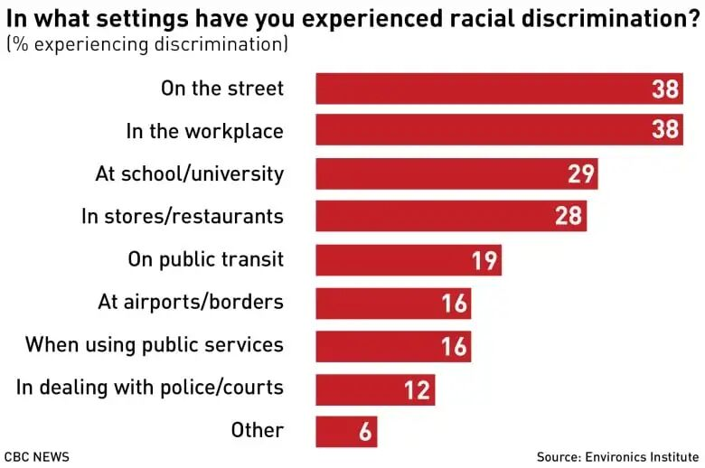
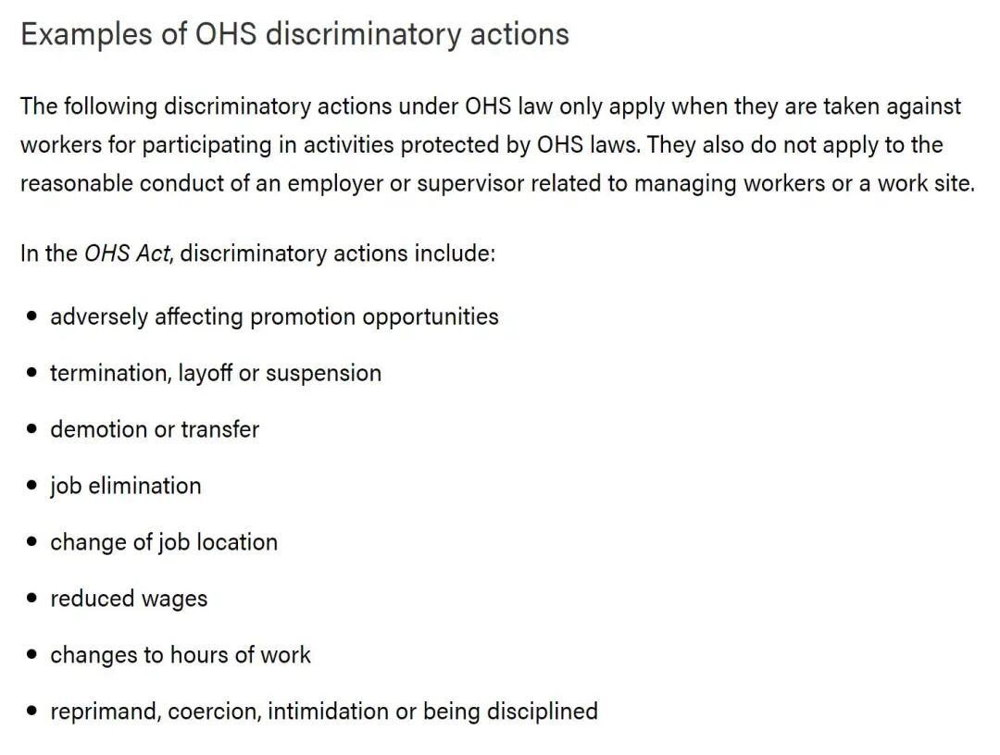

# 无标题

**链接地址:** http://mp.weixin.qq.com/s?__biz=MzI4NDYyNjAwNw==&mid=2247484866&idx=1&sn=3dad81686c52e33c75353610678426b5&chksm=ebf9d8fadc8e51ecd343412eb9ac0dd5bcbc16eb17a0ac117f6d3bb009c0bbd8a1516a1a8b88&mpshare=1&scene=2&srcid=0404gh7H5U84OC1nReeuAOEh&sharer_sharetime=1617496830528&sharer_shareid=be1c8edd6c93eec155a61c876e41d26a#rd
**作者:** 关注我们
**获取时间:** 2025/8/28 19:50:25
**图片数量:** 13

---

## 原始HTML内容

<section style="box-sizing: border-box;font-style: normal;font-weight: 400;text-align: justify;font-size: 16px;"><section style="box-sizing: border-box;"><section style="display: flex;flex-flow: row nowrap;margin: 10px 0%;box-sizing: border-box;"><section style="display: inline-block;vertical-align: middle;width: auto;flex: 100 100 0%;align-self: center;height: auto;line-height: 0;margin: 0px;border-width: 0px;box-sizing: border-box;"><section style="text-align: center;margin: 0px 0%;box-sizing: border-box;"><section style="display: inline-block;width: 100%;height: 8px;vertical-align: top;overflow: hidden;background-color: rgb(245, 210, 136);border-width: 2px;border-radius: 20px;border-style: solid;border-color: rgb(255, 255, 255);box-sizing: border-box;"><section><svg viewBox="0 0 1 1" style="float:left;line-height:0;width:0;vertical-align:top;"></svg></section></section></section></section><section style="display: inline-block;vertical-align: top;width: auto;min-width: 10%;max-width: 100%;flex: 0 0 auto;height: auto;box-sizing: border-box;"><section style="margin: 0px 0%;box-sizing: border-box;"><section style="line-height: 1.8;letter-spacing: 2px;padding: 0px 8px;color: rgb(98, 195, 204);font-family: Optima-Regular, PingFangTC-light;box-sizing: border-box;">
<strong style="box-sizing: border-box;">点击蓝字</strong>
</section></section></section><section style="display: inline-block;vertical-align: middle;width: auto;flex: 0 0 0%;align-self: center;height: auto;line-height: 0;border-width: 0px;box-sizing: border-box;"><section style="text-align: center;margin: 0px 0%;justify-content: center;box-sizing: border-box;"><section style="display: inline-block;width: 11px;height: 11px;vertical-align: top;overflow: hidden;background-color: rgb(235, 130, 126);border-width: 2px;border-radius: 20px;border-style: solid;border-color: rgb(255, 255, 255);box-sizing: border-box;"><section><svg viewBox="0 0 1 1" style="float:left;line-height:0;width:0;vertical-align:top;"></svg></section></section></section></section><section style="display: inline-block;vertical-align: top;width: auto;min-width: 10%;max-width: 100%;flex: 0 0 auto;height: auto;box-sizing: border-box;"><section style="margin: 0px 0%;box-sizing: border-box;"><section style="line-height: 1.8;letter-spacing: 2px;padding: 0px 8px;color: rgb(98, 195, 204);font-family: Optima-Regular, PingFangTC-light;box-sizing: border-box;">
<strong style="box-sizing: border-box;">关注我们</strong>
</section></section></section><section style="display: inline-block;vertical-align: middle;width: auto;flex: 100 100 0%;align-self: center;height: auto;line-height: 0;margin: 0px;border-width: 0px;box-sizing: border-box;"><section style="text-align: center;margin: 0px 0%;box-sizing: border-box;"><section style="display: inline-block;width: 100%;height: 8px;vertical-align: top;overflow: hidden;background-color: rgb(245, 210, 136);border-width: 2px;border-radius: 20px;border-style: solid;border-color: rgb(255, 255, 255);box-sizing: border-box;"><section><svg viewBox="0 0 1 1" style="float:left;line-height:0;width:0;vertical-align:top;"></svg></section></section></section></section></section></section><section style="box-sizing: border-box;">
 
</section><section style="margin: 10px 0%;box-sizing: border-box;"><section style="display: inline-block;width: 100%;vertical-align: top;background-color: rgba(206, 238, 239, 0.21);padding: 0px 20px;box-sizing: border-box;"><section style="text-align: center;margin-top: 10px;margin-bottom: 10px;box-sizing: border-box;"><section style="max-width: 100%;vertical-align: middle;display: inline-block;line-height: 0;box-sizing: border-box;"></section></section><section style="margin: 10px 0% 20px;box-sizing: border-box;"><section style="font-size: 12px;line-height: 1.8;letter-spacing: 0px;padding: 0px;color: rgb(98, 195, 204);font-family: Optima-Regular, PingFangTC-light;box-sizing: border-box;">
●&nbsp;●●&nbsp; <strong style="box-sizing: border-box;">于加拿大举办的反亚裔歧视游行活动</strong>
</section></section><section style="letter-spacing: 2px;line-height: 2;padding: 0px 5px;box-sizing: border-box;">
近期在北美发生了一系列关于种族歧视问题的冲突事件。包括埃德蒙顿在内的多地爆发了<strong style="color: rgb(121, 121, 121);font-size: 14px;box-sizing: border-box;">抗议针对亚裔的种族歧视和仇恨犯罪</strong>的游行示威活动。

 
</section><section style="text-align: center;margin-top: 10px;margin-bottom: 10px;box-sizing: border-box;"><section style="max-width: 100%;vertical-align: middle;display: inline-block;line-height: 0;box-sizing: border-box;"></section></section><section style="letter-spacing: 2px;line-height: 2;padding: 0px 5px;box-sizing: border-box;">
 

根据CBC News于2019年举办的“Race Relations in Canada 2019 Survey”显示，参与调查的3111名成年加拿大人在工作遭受过<strong style="box-sizing: border-box;">种族歧视的比例高达38%</strong>！

 

新冠疫情在世界的流行更是将针对华裔、华人和华侨在加国职场的<strong style="box-sizing: border-box;">种族歧视比例推向新高</strong>，给他们本就艰难的职场道路制造了更多障碍。

 
</section><section style="transform: perspective(0px);-webkit-transform: perspective(0px);-moz-transform: perspective(0px);-o-transform: perspective(0px);transform-style: flat;box-sizing: border-box;"><section style="display: flex;flex-flow: row nowrap;margin: 20px 0% 0px;transform: rotateY(180deg);-webkit-transform: rotateY(180deg);-moz-transform: rotateY(180deg);-o-transform: rotateY(180deg);box-sizing: border-box;"><section style="display: inline-block;vertical-align: middle;width: auto;flex: 0 0 0%;align-self: center;height: auto;line-height: 0;border-width: 0px;box-sizing: border-box;"><section style="text-align: center;margin: 0px 0%;justify-content: center;box-sizing: border-box;"><section style="display: inline-block;width: 11px;height: 11px;vertical-align: top;overflow: hidden;background-color: rgb(235, 130, 126);border-width: 2px;border-radius: 20px;border-style: solid;border-color: rgb(255, 255, 255);box-sizing: border-box;"><section><svg viewBox="0 0 1 1" style="float:left;line-height:0;width:0;vertical-align:top;"></svg></section></section></section></section><section style="display: inline-block;vertical-align: middle;width: auto;flex: 100 100 0%;align-self: center;height: auto;line-height: 0;margin: 0px 0px 0px 10px;box-sizing: border-box;"><section style="text-align: center;margin: 0px 0%;box-sizing: border-box;"><section style="display: inline-block;width: 100%;height: 8px;vertical-align: top;overflow: hidden;background-color: rgb(245, 210, 136);border-width: 2px;border-radius: 20px;border-style: solid;border-color: rgb(255, 255, 255);box-sizing: border-box;"><section><svg viewBox="0 0 1 1" style="float:left;line-height:0;width:0;vertical-align:top;"></svg></section></section></section></section></section></section><section style="text-align: center;margin-top: 10px;margin-bottom: 10px;box-sizing: border-box;"><section style="max-width: 100%;vertical-align: middle;display: inline-block;line-height: 0;box-sizing: border-box;"></section></section><section style="margin: 10px 0% 20px;box-sizing: border-box;"><section style="font-size: 12px;line-height: 1.8;letter-spacing: 0px;padding: 0px;color: rgb(98, 195, 204);font-family: Optima-Regular, PingFangTC-light;box-sizing: border-box;">
●&nbsp;●●&nbsp; Jason Redmond / Getty Images
</section></section><section style="letter-spacing: 2px;line-height: 2;padding: 0px 5px;box-sizing: border-box;">
 

今天，我们就要来讨论一下这个敏感、严肃却也必须面对的问题——<strong style="box-sizing: border-box;">职场种族歧视</strong>。

 
</section></section></section><section style="box-sizing: border-box;">
 
</section><section style="box-sizing: border-box;">
 
</section><section style="margin: 10px 0%;box-sizing: border-box;"><section style="line-height: 1.8;letter-spacing: 1px;padding: 0px;color: rgb(98, 195, 204);font-family: Optima-Regular, PingFangTC-light;box-sizing: border-box;">
<strong style="box-sizing: border-box;">●</strong><strong style="box-sizing: border-box;">&nbsp;1. 如何界定职场种族歧视&nbsp;●</strong>

 
</section></section><section style="letter-spacing: 2px;line-height: 2;padding: 0px 20px;box-sizing: border-box;">
首先，我们要学会界定<strong style="box-sizing: border-box;">不同的职场歧视性质</strong>。

 

在职场中大家能够接触到的因种族主义产生的<strong style="box-sizing: border-box;">辱骂、诽谤、殴打等直接的歧视行为</strong>，并不单纯限定为“工作场合中的种族歧视”，而属于基本的种族歧视，<strong style="box-sizing: border-box;">通常属于和工作非直接相关的个人行为</strong>。

 
</section><section style="text-align: center;margin-top: 10px;margin-bottom: 10px;box-sizing: border-box;"><section style="max-width: 100%;vertical-align: middle;display: inline-block;line-height: 0;width: 90%;height: auto;box-sizing: border-box;"></section></section><section style="letter-spacing: 2px;line-height: 2;padding: 0px 20px;box-sizing: border-box;">
 

而常见的“工作场合中的种族歧视”方式包括但不限于<strong style="box-sizing: border-box;">因种族主义产生的同工不同酬、福利工时消减、晋升壁垒等等</strong>。这样的歧视方式通常和工作本身有着更多关联，而表现形式也更加隐晦。

 

这两种不同种族歧视都在职场中时常出现，但<strong style="box-sizing: border-box;">处理方式却有着区别</strong>，我们会在接下来的章节中详细说明。

 

今天我们邀请资深人力资源顾问来讲述一下，如果你在职场中遇到这类问题，应该如何处理。

 

 
</section><section style="margin: 10px 0%;box-sizing: border-box;"><section style="line-height: 1.8;letter-spacing: 1px;padding: 0px;color: rgb(98, 195, 204);font-family: Optima-Regular, PingFangTC-light;box-sizing: border-box;">
<strong style="box-sizing: border-box;">●</strong><strong style="box-sizing: border-box;">&nbsp;2. 学会 SAY NO！●</strong>
</section></section><section style="box-sizing: border-box;">
 
</section><section style="letter-spacing: 2px;line-height: 2;padding: 0px 20px;box-sizing: border-box;">
如果你遇到了明确的种族歧视，千万不要想着退一步海阔天空。种族歧视有一次就会有无数次，学会 <strong style="box-sizing: border-box;">Say NO！</strong>是避免冲突升级的第一步。

 
</section><section style="text-align: center;margin-top: 10px;margin-bottom: 10px;box-sizing: border-box;"><section style="max-width: 100%;vertical-align: middle;display: inline-block;line-height: 0;box-sizing: border-box;"></section></section><section style="letter-spacing: 2px;line-height: 2;padding: 0px 20px;box-sizing: border-box;">
 

作为被歧视方首先需要做的就是<strong style="box-sizing: border-box;">明确地制止这种行为，并表明自己反对歧视的立场。</strong>

 

就算对方可能只是一句（看似）无心的玩笑话，或者展示网上搜来的梗图，也要明确向TA表示这样的行为<strong style="box-sizing: border-box;">伤害了你的感情和尊严</strong>。

 

通常我们在职场中遇到最多也最明显的种族歧视，都属于这样<strong style="box-sizing: border-box;">相对轻微的情况</strong>，可以通过自己出面解决。但如果遇到更严重的种族歧视和冲突应该怎么办呢？
</section><section style="box-sizing: border-box;">
 
</section><section style="box-sizing: border-box;">
 
</section><section style="margin: 10px 0%;box-sizing: border-box;"><section style="line-height: 1.8;letter-spacing: 1px;padding: 0px;color: rgb(98, 195, 204);font-family: Optima-Regular, PingFangTC-light;box-sizing: border-box;">
<strong style="box-sizing: border-box;">●</strong><strong style="box-sizing: border-box;">&nbsp;3. 向公司反映情况&nbsp;●</strong>
</section></section><section style="letter-spacing: 2px;line-height: 2;padding: 0px 20px;box-sizing: border-box;">
 

遇到更严重的种族歧视，或者你害怕自己出面可能会对自己的人身安全造成侵害，第一个需要跟自己的<strong style="box-sizing: border-box;">顶头上司直接反映问题</strong>，寻求解决方案。

 

如果顶头上司没有办法解决或者他本人是歧视你的人，那么需要<strong style="box-sizing: border-box;">向公司的HR或者更高层反映</strong>。

 
</section><section style="text-align: center;margin-top: 10px;margin-bottom: 10px;box-sizing: border-box;"><section style="max-width: 100%;vertical-align: middle;display: inline-block;line-height: 0;box-sizing: border-box;"></section></section><section style="letter-spacing: 2px;line-height: 2;padding: 0px 20px;box-sizing: border-box;">
 

你需要<strong style="box-sizing: border-box;">详细地书面记录</strong>种族歧视发生的时间、地点、人物、谁是歧视你的人、当时你是怎样处理的，以及周围有没有其他人看到事件的过程等等重要信息。

 

因为如果这个事件变大，需要HR或者管理层介入的时候，他们都会向你索要相关记录等重要信息，同时请注意留存好所有事实证据。

 

很多企业和机构都具备相关政策去处理种族歧视问题，他们会<strong style="box-sizing: border-box;">视事件的严重等级做出相应的反馈与仲裁</strong>。

 

 
</section><section style="margin: 10px 0%;box-sizing: border-box;"><section style="line-height: 1.8;letter-spacing: 1px;padding: 0px;color: rgb(98, 195, 204);font-family: Optima-Regular, PingFangTC-light;box-sizing: border-box;">
<strong style="box-sizing: border-box;">●</strong><strong style="box-sizing: border-box;">&nbsp;4. 向其他途径反映情况&nbsp;●</strong>
</section></section><section style="box-sizing: border-box;">
 
</section><section style="letter-spacing: 2px;line-height: 2;padding: 0px 20px;box-sizing: border-box;">
 

如果你工作的单位有工会，那么下一步可以<strong style="box-sizing: border-box;">向工会代表反映</strong>。工会是代表员工的利益，会通过一系列的流程与你的雇主交涉，从而解决问题。

 
</section><section style="box-sizing: border-box;">
 
</section><section style="text-align: center;margin-top: 10px;margin-bottom: 10px;box-sizing: border-box;"><section style="max-width: 100%;vertical-align: middle;display: inline-block;line-height: 0;width: 90%;height: auto;box-sizing: border-box;"></section></section><section style="letter-spacing: 2px;line-height: 2;padding: 0px 20px;box-sizing: border-box;">
 

如果工会无法帮助你解决问题，你也可以向正式的法律组织寻求帮助。这时可以联系&nbsp;<strong style="box-sizing: border-box;">阿尔伯塔人权法案/ Alberta Human Rights Commission（AHRC）法务部门&nbsp;</strong>做出投诉。

 
</section><section style="box-sizing: border-box;"><section style="margin: 10px 0% -8px;text-align: left;justify-content: flex-start;display: flex;flex-flow: row nowrap;box-sizing: border-box;"><section style="display: inline-block;vertical-align: middle;width: auto;background-color: rgb(241, 248, 255);line-height: 0;min-width: 10%;max-width: 100%;flex: 0 0 auto;height: auto;align-self: center;box-sizing: border-box;"><section style="box-sizing: border-box;"><section style="display: flex;flex-flow: row nowrap;box-sizing: border-box;"><section style="display: inline-block;width: auto;vertical-align: middle;align-self: center;flex: 100 100 0%;height: auto;box-sizing: border-box;"><section style="margin: 0px 0%;box-sizing: border-box;"><section style="text-align: justify;font-size: 17px;color: rgb(241, 92, 25);letter-spacing: 1px;line-height: 3;padding: 0px 26px;box-sizing: border-box;">
<strong style="box-sizing: border-box;">投诉方式</strong>
</section></section></section></section></section></section><section style="display: inline-block;vertical-align: middle;width: auto;min-width: 10%;max-width: 100%;flex: 0 0 auto;height: auto;align-self: center;line-height: 0;box-sizing: border-box;"><section style="box-sizing: border-box;"><section style="display: flex;flex-flow: row nowrap;text-align: right;justify-content: flex-end;margin: 4px 0%;transform: translate3d(15px, 0px, 0px);-webkit-transform: translate3d(15px, 0px, 0px);-moz-transform: translate3d(15px, 0px, 0px);-o-transform: translate3d(15px, 0px, 0px);box-sizing: border-box;"><section style="display: inline-block;vertical-align: top;width: auto;flex: 0 0 0%;height: auto;align-self: flex-start;box-sizing: border-box;"><section style="text-align: center;box-sizing: border-box;"><section style="display: inline-block;width: 6px;height: 6px;vertical-align: top;overflow: hidden;border-width: 0px;border-radius: 10px;border-style: none;border-color: rgb(62, 62, 62);background-color: rgb(241, 92, 25);box-sizing: border-box;"><section><svg viewBox="0 0 1 1" style="float:left;line-height:0;width:0;vertical-align:top;"></svg></section></section></section></section><section style="display: inline-block;vertical-align: top;width: auto;flex: 0 0 0%;height: auto;align-self: flex-start;margin: 0px 10px;box-sizing: border-box;"><section style="text-align: center;box-sizing: border-box;"><section style="display: inline-block;width: 6px;height: 6px;vertical-align: top;overflow: hidden;border-width: 0px;border-radius: 10px;border-style: none;border-color: rgb(62, 62, 62);background-color: rgb(247, 206, 42);box-sizing: border-box;"><section><svg viewBox="0 0 1 1" style="float:left;line-height:0;width:0;vertical-align:top;"></svg></section></section></section></section><section style="display: inline-block;vertical-align: top;width: auto;flex: 0 0 0%;height: auto;box-sizing: border-box;"><section style="text-align: center;box-sizing: border-box;"><section style="display: inline-block;width: 6px;height: 6px;vertical-align: top;overflow: hidden;border-width: 0px;border-radius: 10px;border-style: none;border-color: rgb(62, 62, 62);background-color: rgb(57, 219, 183);box-sizing: border-box;"><section><svg viewBox="0 0 1 1" style="float:left;line-height:0;width:0;vertical-align:top;"></svg></section></section></section></section></section></section></section></section></section><section style="margin: 0px 0% 10px;box-sizing: border-box;"><section style="display: inline-block;width: 100%;vertical-align: top;border-style: solid;border-width: 8px;border-color: rgb(241, 248, 255);box-sizing: border-box;"><section style="margin: 20px 0%;box-sizing: border-box;"><section style="color: rgb(153, 153, 153);font-size: 15px;line-height: 1.8;letter-spacing: 1px;padding: 0px 20px;box-sizing: border-box;">
<strong style="box-sizing: border-box;"></strong><strong style="box-sizing: border-box;">网页：</strong>

https://www.albertahumanrights.ab.ca/complaints/forms/Pages/complaint_form_and_guide.aspx
</section></section></section></section><section style="letter-spacing: 2px;line-height: 2;padding: 0px 20px;box-sizing: border-box;">
 

如果<strong style="box-sizing: border-box;">事发紧急</strong>，请务必及时拨打“911”<strong style="box-sizing: border-box;">报警</strong>，让警察第一时间介入现场，以保障你的人身安全。
</section><section style="box-sizing: border-box;">
 
</section><section style="box-sizing: border-box;">
 
</section><section style="margin: 10px 0%;box-sizing: border-box;"><section style="line-height: 1.8;letter-spacing: 1px;padding: 0px;color: rgb(98, 195, 204);font-family: Optima-Regular, PingFangTC-light;box-sizing: border-box;">
<strong style="box-sizing: border-box;">●</strong><strong style="box-sizing: border-box;">&nbsp;5. 向 OHS 法务部门投诉&nbsp;●</strong>
</section></section><section style="letter-spacing: 2px;line-height: 2;padding: 0px 20px;box-sizing: border-box;">
 

以上提到的以言论或肢体冲突为主要形式的歧视方式比较直接，但有时在工作中遇到的种族歧视却是相对<strong style="box-sizing: border-box;">隐晦</strong>的。

 

对于这种难以举证和裁定，也很难通过你自身出面去解决的职场种族歧视，你需要联系 <strong style="box-sizing: border-box;">职场健康和安全/&nbsp;Occupational Health and Safety (OHS) 法务部门</strong> 去进行投诉。

 
</section><section style="box-sizing: border-box;"><section style="margin: 10px 0% -8px;text-align: left;justify-content: flex-start;display: flex;flex-flow: row nowrap;box-sizing: border-box;"><section style="display: inline-block;vertical-align: middle;width: auto;background-color: rgb(241, 248, 255);line-height: 0;min-width: 10%;max-width: 100%;flex: 0 0 auto;height: auto;align-self: center;box-sizing: border-box;"><section style="box-sizing: border-box;"><section style="display: flex;flex-flow: row nowrap;box-sizing: border-box;"><section style="display: inline-block;width: auto;vertical-align: middle;align-self: center;flex: 100 100 0%;height: auto;box-sizing: border-box;"><section style="margin: 0px 0%;box-sizing: border-box;"><section style="text-align: justify;font-size: 17px;color: rgb(241, 92, 25);letter-spacing: 1px;line-height: 3;padding: 0px 26px;box-sizing: border-box;">
<strong style="box-sizing: border-box;">投诉方式</strong>
</section></section></section></section></section></section><section style="display: inline-block;vertical-align: middle;width: auto;min-width: 10%;max-width: 100%;flex: 0 0 auto;height: auto;align-self: center;line-height: 0;box-sizing: border-box;"><section style="box-sizing: border-box;"><section style="display: flex;flex-flow: row nowrap;text-align: right;justify-content: flex-end;margin: 4px 0%;transform: translate3d(15px, 0px, 0px);-webkit-transform: translate3d(15px, 0px, 0px);-moz-transform: translate3d(15px, 0px, 0px);-o-transform: translate3d(15px, 0px, 0px);box-sizing: border-box;"><section style="display: inline-block;vertical-align: top;width: auto;flex: 0 0 0%;height: auto;align-self: flex-start;box-sizing: border-box;"><section style="text-align: center;box-sizing: border-box;"><section style="display: inline-block;width: 6px;height: 6px;vertical-align: top;overflow: hidden;border-width: 0px;border-radius: 10px;border-style: none;border-color: rgb(62, 62, 62);background-color: rgb(241, 92, 25);box-sizing: border-box;"><section><svg viewBox="0 0 1 1" style="float:left;line-height:0;width:0;vertical-align:top;"></svg></section></section></section></section><section style="display: inline-block;vertical-align: top;width: auto;flex: 0 0 0%;height: auto;align-self: flex-start;margin: 0px 10px;box-sizing: border-box;"><section style="text-align: center;box-sizing: border-box;"><section style="display: inline-block;width: 6px;height: 6px;vertical-align: top;overflow: hidden;border-width: 0px;border-radius: 10px;border-style: none;border-color: rgb(62, 62, 62);background-color: rgb(247, 206, 42);box-sizing: border-box;"><section><svg viewBox="0 0 1 1" style="float:left;line-height:0;width:0;vertical-align:top;"></svg></section></section></section></section><section style="display: inline-block;vertical-align: top;width: auto;flex: 0 0 0%;height: auto;box-sizing: border-box;"><section style="text-align: center;box-sizing: border-box;"><section style="display: inline-block;width: 6px;height: 6px;vertical-align: top;overflow: hidden;border-width: 0px;border-radius: 10px;border-style: none;border-color: rgb(62, 62, 62);background-color: rgb(57, 219, 183);box-sizing: border-box;"><section><svg viewBox="0 0 1 1" style="float:left;line-height:0;width:0;vertical-align:top;"></svg></section></section></section></section></section></section></section></section></section><section style="margin: 0px 0% 10px;box-sizing: border-box;"><section style="display: inline-block;width: 100%;vertical-align: top;border-style: solid;border-width: 8px;border-color: rgb(241, 248, 255);box-sizing: border-box;"><section style="margin: 20px 0%;box-sizing: border-box;"><section style="color: rgb(153, 153, 153);font-size: 15px;line-height: 1.8;letter-spacing: 1px;padding: 0px 20px;box-sizing: border-box;">
<strong style="box-sizing: border-box;">电话：</strong>

780-415-8690&nbsp;

<strong style="box-sizing: border-box;"> </strong>

<strong style="box-sizing: border-box;">网页：</strong>

https://www.alberta.ca/ohs-discriminatory-action-complaints.aspx
</section></section></section></section><section style="box-sizing: border-box;">
 
</section><section style="box-sizing: border-box;">
 
</section><section style="margin: 10px 0%;box-sizing: border-box;"><section style="line-height: 1.8;letter-spacing: 1px;padding: 0px;color: rgb(98, 195, 204);font-family: Optima-Regular, PingFangTC-light;box-sizing: border-box;">
<strong style="box-sizing: border-box;">●</strong><strong style="box-sizing: border-box;">&nbsp;6. 勇敢面对&nbsp;●</strong>
</section></section><section style="letter-spacing: 2px;line-height: 2;padding: 0px 20px;box-sizing: border-box;">
 

一些朋友在职场中遇到种族歧视问题时总是<strong style="box-sizing: border-box;">顾虑满满</strong>，担心这样冲动的行为会影响自己在单位的业绩表现，甚至葬送自己的职业生涯。

 

但请相信，在加拿大这样一个<strong style="box-sizing: border-box;">民族文化极其多元</strong>的生活环境中，绝大部分人都是<strong style="box-sizing: border-box;">善良、包容又正义</strong>的。

 
</section><section style="text-align: center;margin-top: 10px;margin-bottom: 10px;box-sizing: border-box;"><section style="max-width: 100%;vertical-align: middle;display: inline-block;line-height: 0;box-sizing: border-box;"></section></section><section style="letter-spacing: 2px;line-height: 2;padding: 0px 20px;box-sizing: border-box;">
 

在这样一个拥有较健全人权法律的国度，会无视法律继续造次的人才是最不识好歹的。就算你不能当面怼得TA满地找牙，<strong style="box-sizing: border-box;">法律的裁决也会让TA吃尽苦头</strong>。

 

我们的族裔理应是我们的<strong style="box-sizing: border-box;">骄傲</strong>，永远<strong style="box-sizing: border-box;">不应也不能成为他人侮辱的原因和仇恨的目标</strong>。所以千万不要退缩，请拿起法律的武器保护好自己！

 

 
</section><section style="margin: 10px 0%;box-sizing: border-box;"><section style="display: inline-block;width: 100%;vertical-align: top;background-color: rgb(200, 232, 245);padding: 0px 10px;box-sizing: border-box;"><section style="box-sizing: border-box;"><section style="display: flex;flex-flow: row nowrap;margin: -5px 0%;text-align: center;justify-content: center;box-sizing: border-box;"><section style="display: inline-block;width: auto;vertical-align: middle;min-width: 10%;max-width: 100%;flex: 0 0 auto;height: auto;border-style: solid;border-width: 1px;border-color: rgb(51, 167, 233);padding: 4px;background-color: rgb(255, 255, 255);box-shadow: rgb(255, 255, 255) 0px 0px 0px inset;align-self: center;box-sizing: border-box;"><section style="display: inline-block;width: 100%;vertical-align: top;border-width: 0px;background-color: rgb(200, 232, 245);padding: 0px 10px;box-sizing: border-box;"><section style="text-align: justify;color: rgb(106, 106, 106);letter-spacing: 1px;box-sizing: border-box;">
<strong style="box-sizing: border-box;">关于我们</strong>
</section></section></section></section></section></section></section><section style="box-sizing: border-box;">
 
</section><section style="text-align: center;margin: 10px 0%;box-sizing: border-box;"><section style="display: inline-block;width: 90%;vertical-align: top;border-style: solid;border-width: 2px;border-color: rgb(237, 128, 15);letter-spacing: 0px;padding: 10px;box-sizing: border-box;"><section style="box-sizing: border-box;"><section style="display: inline-block;vertical-align: middle;width: 40%;padding: 0px;box-sizing: border-box;"><section style="margin: 0px 0%;box-sizing: border-box;"><section style="max-width: 100%;vertical-align: middle;display: inline-block;line-height: 0;border-width: 0px;width: 100%;box-sizing: border-box;"></section></section></section><section style="display: inline-block;vertical-align: middle;width: 60%;padding: 0px 0px 0px 10px;box-sizing: border-box;"><section style="margin: 0px 0% 5px;box-sizing: border-box;"><section style="display: inline-block;border-color: rgb(237, 128, 15);border-style: solid;border-width: 2px;padding: 0.1em 0.3em;background-color: rgb(237, 128, 15);color: rgb(255, 255, 255);font-size: 12px;box-sizing: border-box;">
<strong style="box-sizing: border-box;">Ada&nbsp; Tai</strong>
</section></section><section style="margin: 0px 0%;box-sizing: border-box;"><section style="font-size: 13px;box-sizing: border-box;">
<strong style="box-sizing: border-box;">MBA, CPHR, SHRM-SCP</strong>
</section></section><section style="box-sizing: border-box;"><section style="display: inline-block;vertical-align: middle;width: 10%;border-width: 0px;box-sizing: border-box;"><section style="margin: 5px 0%;text-align: left;font-size: 0px;box-sizing: border-box;"><section style="padding: 4px;display: inline-block;background-color: rgb(237, 128, 15);box-sizing: border-box;"><section style="border-color: rgba(255, 255, 255, 0);width: 1.6em;height: 1.6em;border-style: solid;border-width: 1px;text-align: center;line-height: 1.5em;color: rgb(255, 255, 255);box-sizing: border-box;">
 
</section></section></section></section><section style="display: inline-block;vertical-align: middle;width: 90%;box-sizing: border-box;"><section style="text-align: justify;font-size: 12px;box-sizing: border-box;">
修改简历与求职信
</section></section></section><section style="box-sizing: border-box;"><section style="display: inline-block;vertical-align: middle;width: 10%;box-sizing: border-box;"><section style="margin: 5px 0%;text-align: left;font-size: 0px;box-sizing: border-box;"><section style="padding: 4px;display: inline-block;background-color: rgb(237, 128, 15);box-sizing: border-box;"><section style="border-color: rgba(255, 255, 255, 0);width: 1.6em;height: 1.6em;border-style: solid;border-width: 1px;text-align: center;line-height: 1.5em;color: rgb(255, 255, 255);box-sizing: border-box;">
 
</section></section></section></section><section style="display: inline-block;vertical-align: middle;width: 90%;box-sizing: border-box;"><section style="text-align: justify;font-size: 12px;box-sizing: border-box;">
培训面试
</section></section></section><section style="box-sizing: border-box;"><section style="display: inline-block;vertical-align: middle;width: 10%;border-width: 0px;box-sizing: border-box;"><section style="margin: 5px 0%;text-align: left;font-size: 0px;box-sizing: border-box;"><section style="padding: 4px;display: inline-block;background-color: rgb(237, 128, 15);box-sizing: border-box;"><section style="border-color: rgba(255, 255, 255, 0);width: 1.6em;height: 1.6em;border-style: solid;border-width: 1px;text-align: center;line-height: 1.5em;color: rgb(255, 255, 255);box-sizing: border-box;">
 
</section></section></section></section><section style="display: inline-block;vertical-align: middle;width: 90%;box-sizing: border-box;"><section style="text-align: justify;font-size: 12px;box-sizing: border-box;">
建立LinkedIn Profile
</section></section></section><section style="box-sizing: border-box;"><section style="display: inline-block;vertical-align: middle;width: 10%;box-sizing: border-box;"><section style="margin: 5px 0%;text-align: left;font-size: 0px;box-sizing: border-box;"><section style="padding: 4px;display: inline-block;background-color: rgb(237, 128, 15);box-sizing: border-box;"><section style="border-color: rgba(255, 255, 255, 0);width: 1.6em;height: 1.6em;border-style: solid;border-width: 1px;text-align: center;line-height: 1.5em;color: rgb(255, 255, 255);box-sizing: border-box;">
 
</section></section></section></section><section style="display: inline-block;vertical-align: middle;width: 90%;box-sizing: border-box;"><section style="text-align: justify;font-size: 12px;box-sizing: border-box;">
职业评估与规划、社交培训
</section></section></section><section style="box-sizing: border-box;"><section style="display: inline-block;vertical-align: middle;width: 10%;box-sizing: border-box;"><section style="margin: 5px 0%;text-align: left;font-size: 0px;box-sizing: border-box;"><section style="padding: 4px;display: inline-block;background-color: rgb(237, 128, 15);box-sizing: border-box;"><section style="border-color: rgba(255, 255, 255, 0);width: 1.6em;height: 1.6em;border-style: solid;border-width: 1px;text-align: center;line-height: 1.5em;color: rgb(255, 255, 255);box-sizing: border-box;">
 
</section></section></section></section><section style="display: inline-block;vertical-align: middle;width: 90%;box-sizing: border-box;"><section style="text-align: justify;font-size: 12px;box-sizing: border-box;">
求职、职场文化等多种讲座
</section></section></section></section></section></section></section><section style="margin: 20px 0%;box-sizing: border-box;"><section style="letter-spacing: 2px;font-size: 14px;color: rgba(51, 51, 51, 0.61);padding: 0px 20px;line-height: 2;box-sizing: border-box;">
 

Ada Tai 毕业于埃尔伯塔大学工商管理硕士学位,并拥有加拿大和美国“注册人力资源管理师”资格证。十几年来 Ada 一直在不同的领域从事人力资源的管理工作。在最近的几年时间里，Ada与她的团队BadaB Consulting Inc. 已成功帮助超过500名不同年龄和职业背景的求职者找到心仪的工作，并帮助他们克服职场困难，向理想的职业成长方向稳步前进。

 
</section></section><section style="box-sizing: border-box;"><section style="display: flex;flex-flow: row nowrap;margin: 10px 0%;box-sizing: border-box;"><section style="display: inline-block;vertical-align: middle;width: auto;flex: 0 0 0%;align-self: center;height: auto;box-sizing: border-box;"><section style="text-align: center;box-sizing: border-box;"><section style="display: inline-block;width: 90px;height: 150px;vertical-align: top;overflow: hidden;border-style: solid;border-width: 4px;border-color: rgb(255, 226, 196);box-sizing: border-box;"><section><svg viewBox="0 0 1 1" style="float:left;line-height:0;width:0;vertical-align:top;"></svg></section></section></section></section><section style="display: inline-block;vertical-align: middle;width: auto;flex: 89.2857 89.2857 0%;align-self: center;height: auto;background-color: rgb(255, 255, 255);margin: 0px 0px 0px -65px;box-sizing: border-box;"><section style="box-sizing: border-box;"><section style="display: flex;flex-flow: row nowrap;box-sizing: border-box;"><section style="display: inline-block;vertical-align: middle;width: auto;padding: 0px 5px 0px 0px;flex: 0 0 0%;height: auto;align-self: center;box-sizing: border-box;"><section style="box-sizing: border-box;"><section style="display: flex;flex-flow: row nowrap;box-sizing: border-box;"><section style="display: inline-block;width: 120px;vertical-align: top;flex: 0 0 auto;height: auto;align-self: flex-start;box-sizing: border-box;"><section style="text-align: center;margin: 0px 0%;box-sizing: border-box;"><section style="max-width: 100%;vertical-align: middle;display: inline-block;line-height: 0;width: 100%;border-color: rgba(118, 178, 124, 0);border-width: 5px;border-style: solid;box-shadow: rgb(0, 0, 0) 0px 0px 0px;box-sizing: border-box;"></section></section></section></section></section></section><section style="display: inline-block;vertical-align: middle;width: auto;padding: 0px 0px 0px 5px;flex: 100 100 0%;height: auto;align-self: center;box-sizing: border-box;"><section style="margin: 0px 0%;box-sizing: border-box;"><section style="color: rgb(121, 121, 121);font-size: 12px;box-sizing: border-box;">
<strong style="box-sizing: border-box;">Badab Consulting Inc.</strong>

微信号 : badab101

新浪微博：BadaB_Consulting
</section></section></section></section></section></section></section></section><section style="letter-spacing: 2px;line-height: 2;padding: 0px 20px;box-sizing: border-box;">
 
</section><section style="margin: 10px 0%;box-sizing: border-box;"><section style="display: inline-block;width: 100%;vertical-align: top;box-shadow: rgb(0, 0, 0) 0px 0px 0px;background-color: rgb(241, 241, 241);padding: 10px;box-sizing: border-box;"><section style="text-align: center;justify-content: center;box-sizing: border-box;"><section style="display: inline-block;width: 100%;vertical-align: top;background-color: rgb(255, 255, 255);padding: 20px 10px;height: auto;box-shadow: rgb(198, 198, 198) 0px 0px 2px;border-width: 0px;border-radius: 6px;border-style: none;border-color: rgb(62, 62, 62);overflow: hidden;box-sizing: border-box;"><section style="text-align: justify;color: rgb(189, 189, 189);box-sizing: border-box;">
<strong style="box-sizing: border-box;">往期精品</strong>
</section><section style="text-align: justify;box-sizing: border-box;">
 
</section><section style="box-sizing: border-box;"><section style="display: flex;flex-flow: row nowrap;margin: 0px 0%;box-sizing: border-box;"><section style="display: inline-block;vertical-align: top;width: auto;flex: 100 100 0%;align-self: flex-start;height: auto;box-shadow: rgb(0, 0, 0) 0px 0px 0px;border-bottom: 1px dashed rgba(106, 106, 106, 0.25);border-bottom-right-radius: 0px;margin: 0px 10px 0px 0px;box-sizing: border-box;"><section style="text-align: justify;font-size: 14px;box-sizing: border-box;">
<a target="_blank" href="http://mp.weixin.qq.com/s?__biz=MzI4NDYyNjAwNw==&amp;mid=2247484849&amp;idx=1&amp;sn=1b603d74e08eeb5a15ce47d295ce14ac&amp;chksm=ebf9d889dc8e519fcda78f3061a839fe80b07c4515e60f9ddb3fb4eabab5eaf7459f78ae86bf&amp;scene=21#wechat_redirect" textvalue="那些年，我们在面试中犯下的错……" data-itemshowtype="0" tab="innerlink" data-linktype="2">那些年，我们在面试中犯下的错……</a>

 
</section></section><section style="display: inline-block;vertical-align: top;width: auto;flex: 20 20 0%;align-self: flex-start;height: auto;border-width: 0px;margin: 0px 0px 0px 5px;box-sizing: border-box;"><section style="margin: 0px 0%;box-sizing: border-box;"><section style="max-width: 100%;vertical-align: middle;display: inline-block;line-height: 0;box-sizing: border-box;"><a target="_blank" href="http://mp.weixin.qq.com/s?__biz=MzI4NDYyNjAwNw==&amp;mid=2247484849&amp;idx=1&amp;sn=1b603d74e08eeb5a15ce47d295ce14ac&amp;chksm=ebf9d889dc8e519fcda78f3061a839fe80b07c4515e60f9ddb3fb4eabab5eaf7459f78ae86bf&amp;scene=21#wechat_redirect" textvalue="你已选中了添加链接的内容" data-itemshowtype="0" tab="innerlink" data-linktype="1"></a></section></section></section></section></section><section style="text-align: justify;box-sizing: border-box;">
 
</section><section style="box-sizing: border-box;"><section style="display: flex;flex-flow: row nowrap;margin: 0px 0%;box-sizing: border-box;"><section style="display: inline-block;vertical-align: top;width: auto;flex: 100 100 0%;align-self: flex-start;height: auto;box-shadow: rgb(0, 0, 0) 0px 0px 0px;border-bottom: 1px dashed rgba(106, 106, 106, 0.25);border-bottom-right-radius: 0px;margin: 0px 10px 0px 0px;box-sizing: border-box;"><section style="text-align: justify;font-size: 14px;box-sizing: border-box;">
<a target="_blank" href="http://mp.weixin.qq.com/s?__biz=MzI4NDYyNjAwNw==&amp;mid=2247484816&amp;idx=1&amp;sn=44017f304e12471f68ea5bec00d3f6e3&amp;chksm=ebf9d8a8dc8e51be638ef3698e3353ad50b8712cf11a22092a1e7501d84fcd698fba0dbed5f2&amp;scene=21#wechat_redirect" textvalue="七大视频面试易踩坑避雷指南，几个小巧思帮你拿到Offer！" data-itemshowtype="0" tab="innerlink" data-linktype="2">七大视频面试易踩坑避雷指南，几个小巧思帮你拿到Offer！</a>
</section></section><section style="display: inline-block;vertical-align: top;width: auto;flex: 20 20 0%;align-self: flex-start;height: auto;border-width: 0px;margin: 0px 0px 0px 5px;box-sizing: border-box;"><section style="margin: 0px 0%;box-sizing: border-box;"><section style="max-width: 100%;vertical-align: middle;display: inline-block;line-height: 0;box-shadow: rgb(0, 0, 0) 0px 0px 0px;box-sizing: border-box;"><a target="_blank" href="http://mp.weixin.qq.com/s?__biz=MzI4NDYyNjAwNw==&amp;mid=2247484816&amp;idx=1&amp;sn=44017f304e12471f68ea5bec00d3f6e3&amp;chksm=ebf9d8a8dc8e51be638ef3698e3353ad50b8712cf11a22092a1e7501d84fcd698fba0dbed5f2&amp;scene=21#wechat_redirect" textvalue="你已选中了添加链接的内容" data-itemshowtype="0" tab="innerlink" data-linktype="1"></a></section></section></section></section></section><section style="text-align: justify;box-sizing: border-box;">
 
</section><section style="box-sizing: border-box;"><section style="display: flex;flex-flow: row nowrap;box-sizing: border-box;"><section style="display: inline-block;vertical-align: top;width: auto;flex: 100 100 0%;align-self: flex-start;height: auto;box-shadow: rgb(0, 0, 0) 0px 0px 0px;border-bottom: 1px dashed rgba(106, 106, 106, 0.25);border-bottom-right-radius: 0px;margin: 0px 10px 0px 0px;box-sizing: border-box;"><section style="text-align: justify;font-size: 14px;box-sizing: border-box;">
<a target="_blank" href="http://mp.weixin.qq.com/s?__biz=MzI4NDYyNjAwNw==&amp;mid=2247484763&amp;idx=1&amp;sn=30893910267afbd8efc876abd95e9fe4&amp;chksm=ebf9d863dc8e51758126516f623b2075de37e4f4a0969dccb38cfc00208dfaaf344eed653e7c&amp;scene=21#wechat_redirect" textvalue="疫情改变职场，2021年加国最热门十大职业盘点！" data-itemshowtype="0" tab="innerlink" data-linktype="2">疫情改变职场，2021年加国最热门十大职业盘点！</a>
</section></section><section style="display: inline-block;vertical-align: top;width: auto;flex: 20 20 0%;align-self: flex-start;height: auto;border-width: 0px;margin: 0px 0px 0px 5px;box-sizing: border-box;"><section style="margin: 0px 0%;box-sizing: border-box;"><section style="max-width: 100%;vertical-align: middle;display: inline-block;line-height: 0;box-shadow: rgb(0, 0, 0) 0px 0px 0px;box-sizing: border-box;"><a target="_blank" href="http://mp.weixin.qq.com/s?__biz=MzI4NDYyNjAwNw==&amp;mid=2247484763&amp;idx=1&amp;sn=30893910267afbd8efc876abd95e9fe4&amp;chksm=ebf9d863dc8e51758126516f623b2075de37e4f4a0969dccb38cfc00208dfaaf344eed653e7c&amp;scene=21#wechat_redirect" textvalue="你已选中了添加链接的内容" data-itemshowtype="0" tab="innerlink" data-linktype="1"></a></section></section></section></section></section><section style="text-align: justify;box-sizing: border-box;">
 
</section></section></section></section></section><section style="box-sizing: border-box;">
  
</section></section>
 

---

## 纯文本内容

点击蓝字关注我们● ●●  于加拿大举办的反亚裔歧视游行活动近期在北美发生了一系列关于种族歧视问题的冲突事件。包括埃德蒙顿在内的多地爆发了抗议针对亚裔的种族歧视和仇恨犯罪的游行示威活动。根据CBC News于2019年举办的“Race Relations in Canada 2019 Survey”显示，参与调查的3111名成年加拿大人在工作遭受过种族歧视的比例高达38%！新冠疫情在世界的流行更是将针对华裔、华人和华侨在加国职场的种族歧视比例推向新高，给他们本就艰难的职场道路制造了更多障碍。● ●●  Jason Redmond / Getty Images今天，我们就要来讨论一下这个敏感、严肃却也必须面对的问题——职场种族歧视。● 1. 如何界定职场种族歧视 ●首先，我们要学会界定不同的职场歧视性质。在职场中大家能够接触到的因种族主义产生的辱骂、诽谤、殴打等直接的歧视行为，并不单纯限定为“工作场合中的种族歧视”，而属于基本的种族歧视，通常属于和工作非直接相关的个人行为。而常见的“工作场合中的种族歧视”方式包括但不限于因种族主义产生的同工不同酬、福利工时消减、晋升壁垒等等。这样的歧视方式通常和工作本身有着更多关联，而表现形式也更加隐晦。这两种不同种族歧视都在职场中时常出现，但处理方式却有着区别，我们会在接下来的章节中详细说明。今天我们邀请资深人力资源顾问来讲述一下，如果你在职场中遇到这类问题，应该如何处理。● 2. 学会 SAY NO！●如果你遇到了明确的种族歧视，千万不要想着退一步海阔天空。种族歧视有一次就会有无数次，学会 Say NO！是避免冲突升级的第一步。作为被歧视方首先需要做的就是明确地制止这种行为，并表明自己反对歧视的立场。就算对方可能只是一句（看似）无心的玩笑话，或者展示网上搜来的梗图，也要明确向TA表示这样的行为伤害了你的感情和尊严。通常我们在职场中遇到最多也最明显的种族歧视，都属于这样相对轻微的情况，可以通过自己出面解决。但如果遇到更严重的种族歧视和冲突应该怎么办呢？● 3. 向公司反映情况 ●遇到更严重的种族歧视，或者你害怕自己出面可能会对自己的人身安全造成侵害，第一个需要跟自己的顶头上司直接反映问题，寻求解决方案。如果顶头上司没有办法解决或者他本人是歧视你的人，那么需要向公司的HR或者更高层反映。你需要详细地书面记录种族歧视发生的时间、地点、人物、谁是歧视你的人、当时你是怎样处理的，以及周围有没有其他人看到事件的过程等等重要信息。因为如果这个事件变大，需要HR或者管理层介入的时候，他们都会向你索要相关记录等重要信息，同时请注意留存好所有事实证据。很多企业和机构都具备相关政策去处理种族歧视问题，他们会视事件的严重等级做出相应的反馈与仲裁。● 4. 向其他途径反映情况 ●如果你工作的单位有工会，那么下一步可以向工会代表反映。工会是代表员工的利益，会通过一系列的流程与你的雇主交涉，从而解决问题。如果工会无法帮助你解决问题，你也可以向正式的法律组织寻求帮助。这时可以联系 阿尔伯塔人权法案/ Alberta Human Rights Commission（AHRC）法务部门 做出投诉。投诉方式网页：https://www.albertahumanrights.ab.ca/complaints/forms/Pages/complaint_form_and_guide.aspx如果事发紧急，请务必及时拨打“911”报警，让警察第一时间介入现场，以保障你的人身安全。● 5. 向 OHS 法务部门投诉 ●以上提到的以言论或肢体冲突为主要形式的歧视方式比较直接，但有时在工作中遇到的种族歧视却是相对隐晦的。对于这种难以举证和裁定，也很难通过你自身出面去解决的职场种族歧视，你需要联系 职场健康和安全/ Occupational Health and Safety (OHS) 法务部门 去进行投诉。投诉方式电话：780-415-8690 网页：https://www.alberta.ca/ohs-discriminatory-action-complaints.aspx● 6. 勇敢面对 ●一些朋友在职场中遇到种族歧视问题时总是顾虑满满，担心这样冲动的行为会影响自己在单位的业绩表现，甚至葬送自己的职业生涯。但请相信，在加拿大这样一个民族文化极其多元的生活环境中，绝大部分人都是善良、包容又正义的。在这样一个拥有较健全人权法律的国度，会无视法律继续造次的人才是最不识好歹的。就算你不能当面怼得TA满地找牙，法律的裁决也会让TA吃尽苦头。我们的族裔理应是我们的骄傲，永远不应也不能成为他人侮辱的原因和仇恨的目标。所以千万不要退缩，请拿起法律的武器保护好自己！关于我们Ada  TaiMBA, CPHR, SHRM-SCP修改简历与求职信培训面试建立LinkedIn Profile职业评估与规划、社交培训求职、职场文化等多种讲座Ada Tai 毕业于埃尔伯塔大学工商管理硕士学位,并拥有加拿大和美国“注册人力资源管理师”资格证。十几年来 Ada 一直在不同的领域从事人力资源的管理工作。在最近的几年时间里，Ada与她的团队BadaB Consulting Inc. 已成功帮助超过500名不同年龄和职业背景的求职者找到心仪的工作，并帮助他们克服职场困难，向理想的职业成长方向稳步前进。Badab Consulting Inc.微信号 : badab101新浪微博：BadaB_Consulting往期精品那些年，我们在面试中犯下的错……七大视频面试易踩坑避雷指南，几个小巧思帮你拿到Offer！疫情改变职场，2021年加国最热门十大职业盘点！

---

## 图片列表

-  (原始链接: https://mmbiz.qpic.cn/mmbiz_jpg/cY0qSDjdkFexUqBZbe4icrDRqKXO11IBibicB4aRP9uicGLK2s8peBic0ibsGAydEqwWToqsU4mTAeKtqPLPcMbzYMAg/640?wx_fmt=jpeg)
-  (原始链接: https://mmbiz.qpic.cn/mmbiz_jpg/cY0qSDjdkFexUqBZbe4icrDRqKXO11IBibtQng8Q1juYDzAhtavM6v7xdPmSwbku2ibzgDZ63CDM0PDIEicBPqReZg/640?wx_fmt=jpeg)
-  (原始链接: https://mmbiz.qpic.cn/mmbiz_jpg/cY0qSDjdkFexUqBZbe4icrDRqKXO11IBibWOTUq04cwN7p1iaic5hQRPI6Ggs3Oib2tyqYL7U1JSGbAdCdibesYEmxLA/640?wx_fmt=jpeg)
-  (原始链接: https://mmbiz.qpic.cn/mmbiz_jpg/cY0qSDjdkFexUqBZbe4icrDRqKXO11IBibjtEicsr9CEFEuo8KUTKE8pz5FUjHKxJxACwhDqsA09qpT1o7JrmwZXA/640?wx_fmt=jpeg)
-  (原始链接: https://mmbiz.qpic.cn/mmbiz_jpg/cY0qSDjdkFexUqBZbe4icrDRqKXO11IBibIeRk33g4mEVfFlUdPrllIRLjXuzJwdAs0k5jAlUibMiaL6TYE2BsEjAQ/640?wx_fmt=jpeg)
-  (原始链接: https://mmbiz.qpic.cn/mmbiz_jpg/cY0qSDjdkFexUqBZbe4icrDRqKXO11IBibuROYtiaNEExMO7Bgao3MQaKoCXySgac4ko2qZCj6qAyYoV9icv7ZwAXg/640?wx_fmt=jpeg)
-  (原始链接: https://mmbiz.qpic.cn/mmbiz_png/cY0qSDjdkFexUqBZbe4icrDRqKXO11IBib2yXd85uWyic2cfGT3kEhCE5oGforiaVEx5bBwvxGbgTxtniaSbWdL5CtQ/640?wx_fmt=png)
-  (原始链接: https://mmbiz.qpic.cn/mmbiz_jpg/cY0qSDjdkFexUqBZbe4icrDRqKXO11IBibkHXU4FicnDJypiao7LHErnXX7ic6Fv196L2qnqKSsylPn5nK2KmJx7dgA/640?wx_fmt=jpeg)
-  (原始链接: https://mmbiz.qpic.cn/mmbiz_jpg/cY0qSDjdkFexUqBZbe4icrDRqKXO11IBibSwVOiao3juchqvOib0lh321dwlmSyLWFujwHBbgEia3czuK3qAzrCFDicw/640?wx_fmt=jpeg)
-  (原始链接: https://mmbiz.qpic.cn/mmbiz_jpg/cY0qSDjdkFexUqBZbe4icrDRqKXO11IBibIHY28oMO4EPKxTriaPSE7trKKOFOupicrRZMNWOBgM4M48CzWENeZjgA/640?wx_fmt=jpeg)
-  (原始链接: https://mmbiz.qpic.cn/mmbiz_jpg/cY0qSDjdkFexUqBZbe4icrDRqKXO11IBibRFZib2G6ibcS8IEzqkFrk6hib7QOk2MA2KicCMBAPNf6qpjRlUU7LC4Huw/640?wx_fmt=jpeg)
-  (原始链接: https://mmbiz.qpic.cn/mmbiz_jpg/cY0qSDjdkFexUqBZbe4icrDRqKXO11IBib7xWzUwDHQ5oppGIYutIL3sAw7RajVrDaMpnx8rzrEurjPrcfq7PakQ/640?wx_fmt=jpeg)
-  (原始链接: https://mmbiz.qpic.cn/mmbiz_jpg/cY0qSDjdkFexUqBZbe4icrDRqKXO11IBib2fWtnnD9A6vuJ6jVzVtxDOBWhNTv4AnYnicyMNu1qGdewl69N7U3sRA/640?wx_fmt=jpeg)
