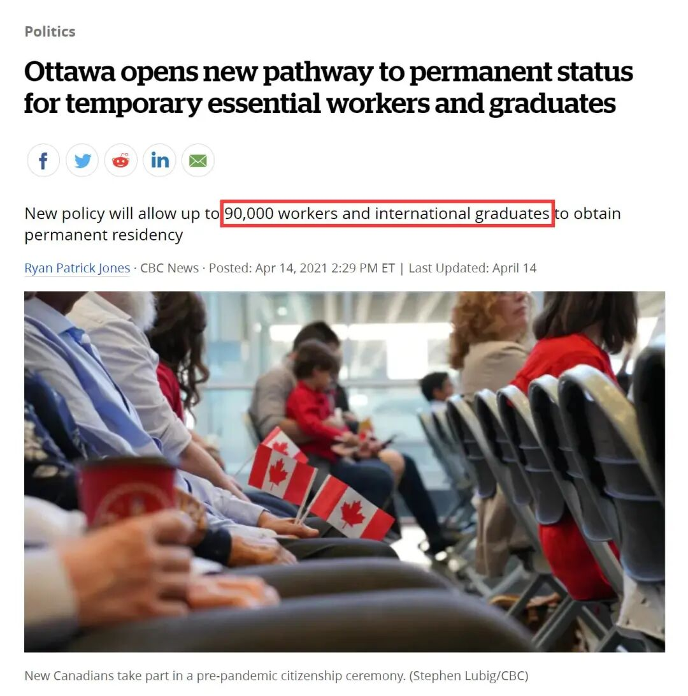
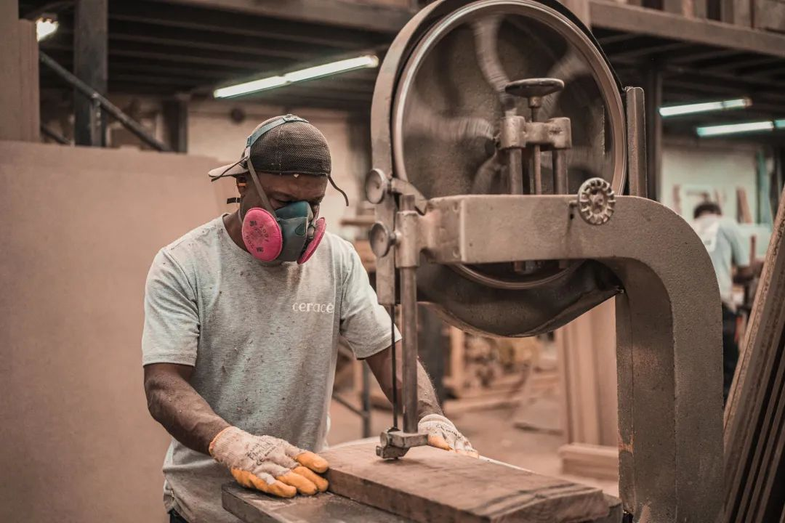
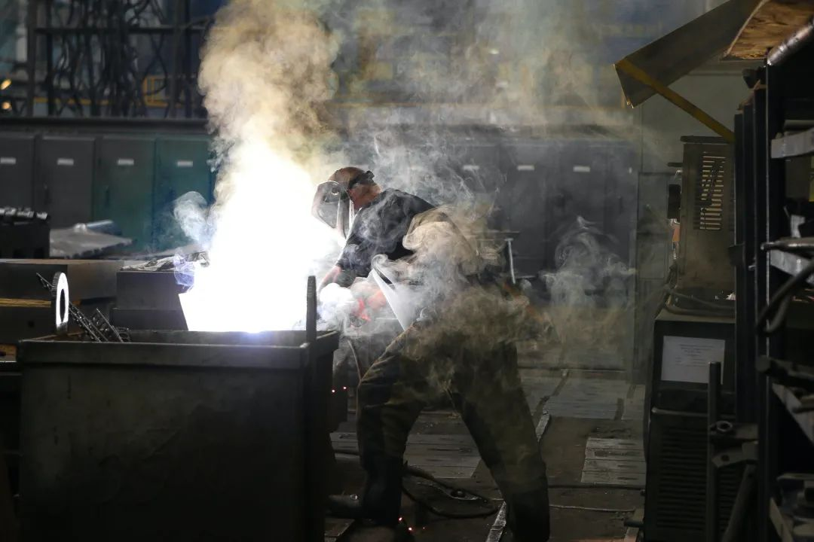
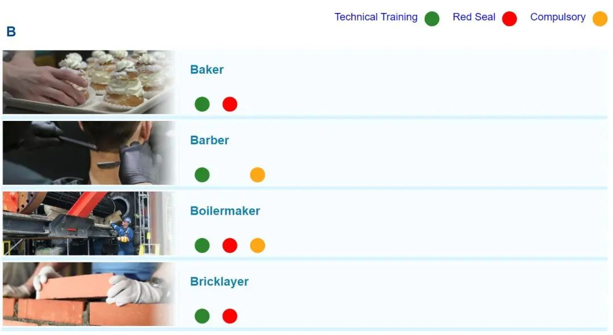
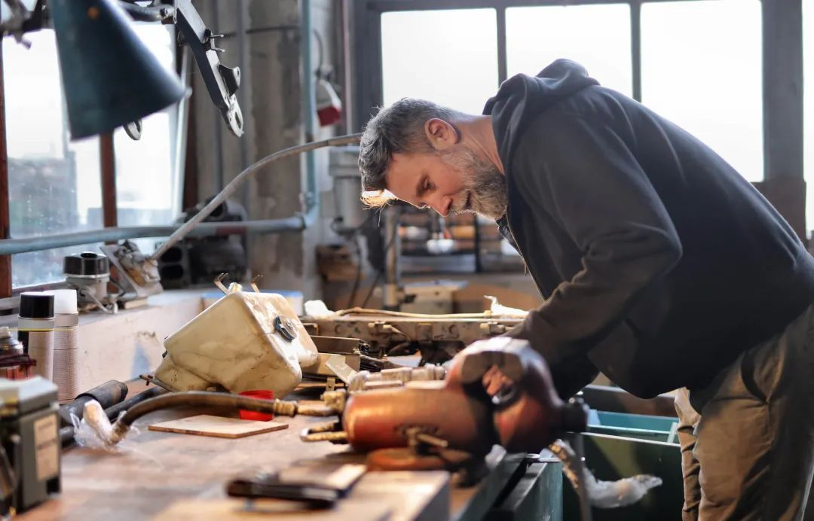
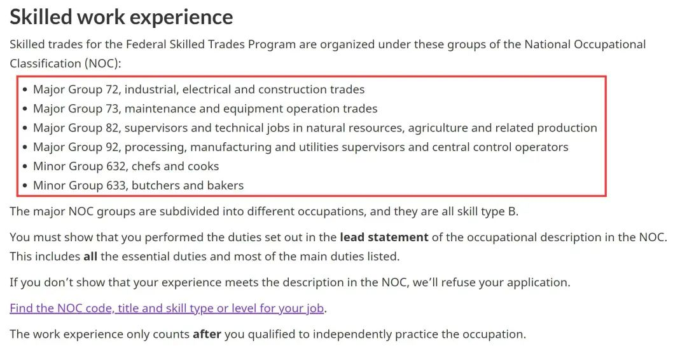
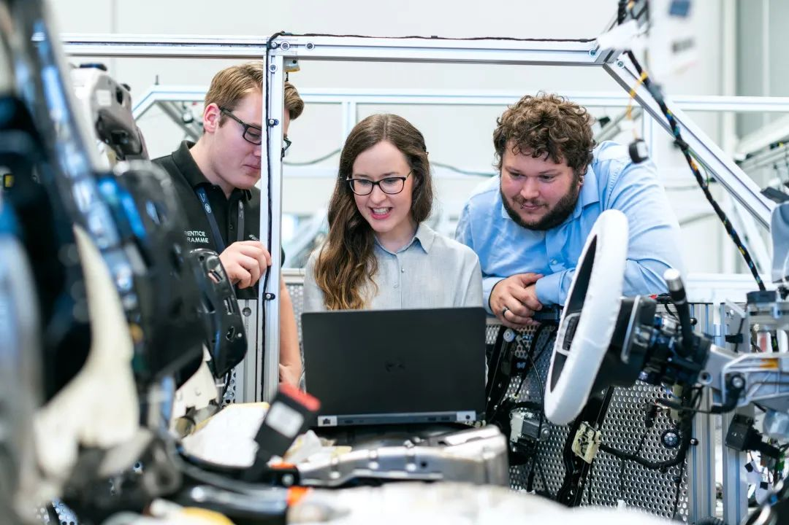

# 无标题

**链接地址:** http://mp.weixin.qq.com/s?__biz=MzI4NDYyNjAwNw==&mid=2247484900&idx=1&sn=d66c1b531e5aa6eb7144b717b614e0a5&chksm=ebf9d8dcdc8e51caeb201edaf4560922b013b0982de1e41147aeff3f6e9eb95802c37f694632&mpshare=1&scene=2&srcid=041801nq6Fxv3LRGNVEHRTV7&sharer_sharetime=1618709804672&sharer_shareid=be1c8edd6c93eec155a61c876e41d26a#rd
**作者:** 关注我们
**获取时间:** 2025/8/28 19:49:12
**图片数量:** 30

---

## 原始HTML内容

<section style="box-sizing: border-box;font-size: 16px;"><section style="margin: 10px 0%;box-sizing: border-box;" powered-by="xiumi.us"><section style="display: inline-block;width: 100%;vertical-align: top;background-color: rgb(200, 232, 245);box-sizing: border-box;"><section style="box-sizing: border-box;" powered-by="xiumi.us"><section style="display: flex;flex-flow: row nowrap;box-sizing: border-box;"><section style="display: inline-block;vertical-align: middle;width: auto;align-self: center;flex: 100 100 0%;height: auto;box-sizing: border-box;"><section style="text-align: center;justify-content: center;box-sizing: border-box;" powered-by="xiumi.us"><section style="display: inline-block;width: auto;vertical-align: top;background-color: rgb(180, 180, 180);min-width: 10%;max-width: 100%;height: auto;box-sizing: border-box;"><section style="margin-right: 0%;margin-left: 0%;box-sizing: border-box;" powered-by="xiumi.us"><section style="font-family: Optima-Regular, PingFangTC-light;font-size: 14px;color: rgb(255, 255, 255);line-height: 2;letter-spacing: 6px;box-sizing: border-box;">
&nbsp;点击蓝字 关注我们&nbsp;
</section></section></section></section></section><section style="display: inline-block;vertical-align: middle;width: 75px;align-self: center;flex: 0 0 auto;height: auto;box-sizing: border-box;"><section style="box-sizing: border-box;" powered-by="xiumi.us">
 
</section><section style="text-align: center;margin-right: 0%;margin-left: 0%;box-sizing: border-box;" powered-by="xiumi.us"><section style="max-width: 100%;vertical-align: middle;display: inline-block;line-height: 0;width: 45%;height: auto;box-sizing: border-box;"></section></section><section style="box-sizing: border-box;" powered-by="xiumi.us">
 
</section></section></section></section></section></section><section style="margin: 20px 0%;box-sizing: border-box;" powered-by="xiumi.us"><section style="letter-spacing: 2px;font-size: 14px;color: rgba(51, 51, 51, 0.61);padding-right: 20px;padding-left: 20px;line-height: 2;box-sizing: border-box;">
 

4月14日，一个<strong style="box-sizing: border-box;">惊爆的大消息</strong>“炸”开了朋友圈：加拿大移民部长马可·门迪奇诺（Marco Mendicino）宣布了一项移民计划：将向在加拿大居住生活的<strong style="box-sizing: border-box;">90,000人提供永久居留身份</strong>，连原先不符合移民申请条件的工作者也可以申请。
</section></section><section style="text-align: center;margin-top: 10px;margin-bottom: 10px;box-sizing: border-box;" powered-by="xiumi.us"><section style="max-width: 100%;vertical-align: middle;display: inline-block;line-height: 0;width: 90%;height: auto;box-sizing: border-box;"></section></section><section style="margin: 20px 0%;box-sizing: border-box;" powered-by="xiumi.us"><section style="letter-spacing: 2px;font-size: 14px;color: rgba(51, 51, 51, 0.61);padding-right: 20px;padding-left: 20px;line-height: 2;box-sizing: border-box;">
 

这对于受限于疫情而无法找到对口全职工作，又有移民需求的朋友们来说，相当于<strong style="box-sizing: border-box;">白捡了一个移民机会</strong>：只要是符合条件的全职工作，不管你是在超市收银还是在外卖送餐，<strong style="box-sizing: border-box;">都可以移民！</strong>

 

不过在第三波疫情的影响下，加拿大的经济尚未复苏，想在这时候找到一份<strong style="box-sizing: border-box;">收入满意，前景可观的全职工作</strong>也并非易事。或许是时候转换一下职业规划的思路了！ 

 
</section></section><section style="margin: 10px 0%;text-align: center;justify-content: center;box-sizing: border-box;" powered-by="xiumi.us"><section style="display: inline-block;width: 80%;vertical-align: top;box-shadow: rgb(0, 0, 0) 0px 0px 0px;background-color: rgb(241, 241, 241);padding: 10px;height: auto;box-sizing: border-box;"><section style="justify-content: center;box-sizing: border-box;" powered-by="xiumi.us"><section style="display: inline-block;width: 100%;vertical-align: top;background-color: rgb(255, 255, 255);padding: 20px 10px;height: auto;box-shadow: rgb(198, 198, 198) 0px 0px 2px;border-width: 0px;border-radius: 6px;border-style: none;border-color: rgb(62, 62, 62);overflow: hidden;box-sizing: border-box;"><section style="box-sizing: border-box;" powered-by="xiumi.us"><section style="display: flex;flex-flow: row nowrap;margin-right: 0%;margin-left: 0%;box-sizing: border-box;"><section style="display: inline-block;vertical-align: top;width: auto;flex: 100 100 0%;align-self: flex-start;height: auto;box-shadow: rgb(0, 0, 0) 0px 0px 0px;border-bottom: 1px dashed rgba(106, 106, 106, 0.25);border-bottom-right-radius: 0px;margin-right: 10px;box-sizing: border-box;"><section style="font-size: 14px;box-sizing: border-box;" powered-by="xiumi.us">
<a target="_blank" href="http://mp.weixin.qq.com/s?__biz=MzI4NDYyNjAwNw==&amp;mid=2247484763&amp;idx=1&amp;sn=30893910267afbd8efc876abd95e9fe4&amp;chksm=ebf9d863dc8e51758126516f623b2075de37e4f4a0969dccb38cfc00208dfaaf344eed653e7c&amp;scene=21#wechat_redirect" textvalue="2021年加国最热门十大职业盘点（点击阅读）" data-itemshowtype="0" tab="innerlink" data-linktype="2"><strong style="box-sizing: border-box;">2021年加国最热门十大职业盘点</strong></a>

<a target="_blank" href="http://mp.weixin.qq.com/s?__biz=MzI4NDYyNjAwNw==&amp;mid=2247484763&amp;idx=1&amp;sn=30893910267afbd8efc876abd95e9fe4&amp;chksm=ebf9d863dc8e51758126516f623b2075de37e4f4a0969dccb38cfc00208dfaaf344eed653e7c&amp;scene=21#wechat_redirect" textvalue="2021年加国最热门十大职业盘点（点击阅读）" data-itemshowtype="0" tab="innerlink" data-linktype="2">（点击阅读）</a>
</section></section><section style="display: inline-block;vertical-align: top;width: auto;flex: 20 20 0%;align-self: flex-start;height: auto;border-width: 0px;margin-left: 5px;box-sizing: border-box;"><section style="margin-right: 0%;margin-left: 0%;box-sizing: border-box;" powered-by="xiumi.us"><section style="max-width: 100%;vertical-align: middle;display: inline-block;line-height: 0;box-shadow: rgb(0, 0, 0) 0px 0px 0px;box-sizing: border-box;"><a target="_blank" href="http://mp.weixin.qq.com/s?__biz=MzI4NDYyNjAwNw==&amp;mid=2247484763&amp;idx=1&amp;sn=30893910267afbd8efc876abd95e9fe4&amp;chksm=ebf9d863dc8e51758126516f623b2075de37e4f4a0969dccb38cfc00208dfaaf344eed653e7c&amp;scene=21#wechat_redirect" textvalue="你已选中了添加链接的内容" data-itemshowtype="0" tab="innerlink" data-linktype="1"></a></section></section></section></section></section></section></section></section></section><section style="margin: 20px 0%;box-sizing: border-box;" powered-by="xiumi.us"><section style="letter-spacing: 2px;font-size: 14px;color: rgba(51, 51, 51, 0.61);padding-right: 20px;padding-left: 20px;line-height: 2;box-sizing: border-box;">
 

在前段时间我们发布的文章<strong style="box-sizing: border-box;">《2021年加国最热门十大职业盘点》</strong>中，朋友们不难发现其中大部分的工种都属于技工，也就是俗称的<strong style="box-sizing: border-box;">“蓝领”职业</strong>。

 

根据加拿大统计局的职位空缺和工资调查，2019年第一季度，&nbsp;加拿大技工行业有<strong style="box-sizing: border-box;">60170个职位空缺</strong>，比上年同期增长14%。
</section></section><section style="margin: 10px 0%;box-sizing: border-box;" powered-by="xiumi.us"><section style="display: inline-block;width: 100%;vertical-align: top;border-width: 1px;border-style: solid;border-color: rgba(187, 222, 251, 0);box-sizing: border-box;"><section style="box-sizing: border-box;" powered-by="xiumi.us"><section style="display: flex;flex-flow: row nowrap;margin: 20px 0%;box-sizing: border-box;"><section style="display: inline-block;vertical-align: top;width: auto;flex: 100 100 0%;align-self: stretch;height: auto;padding-right: 10px;padding-left: 10px;border-width: 0px;box-sizing: border-box;"><section style="text-align: center;margin: -10px 0%;box-sizing: border-box;" powered-by="xiumi.us"><section style="max-width: 100%;vertical-align: middle;display: inline-block;line-height: 0;border-width: 0px;border-radius: 5px;border-style: none;border-color: rgb(62, 62, 62);overflow: hidden;box-sizing: border-box;"></section></section></section><section style="display: inline-block;vertical-align: top;width: auto;align-self: stretch;flex: 100 100 0%;border-left: 1px solid rgba(187, 222, 251, 0);border-bottom-left-radius: 0px;padding-right: 10px;padding-left: 10px;box-sizing: border-box;"><section style="text-align: center;margin: -10px 0%;box-sizing: border-box;" powered-by="xiumi.us"><section style="max-width: 100%;vertical-align: middle;display: inline-block;line-height: 0;border-width: 0px;border-radius: 5px;border-style: none;border-color: rgb(62, 62, 62);overflow: hidden;box-sizing: border-box;"></section></section></section></section></section><section style="box-sizing: border-box;" powered-by="xiumi.us"><section style="display: flex;flex-flow: row nowrap;box-sizing: border-box;"><section style="display: inline-block;vertical-align: top;width: auto;flex: 100 100 0%;align-self: flex-start;height: auto;padding-right: 20px;padding-left: 20px;box-sizing: border-box;"><section style="margin-right: 0%;margin-left: 0%;box-sizing: border-box;" powered-by="xiumi.us"><section style="background-color: rgba(187, 222, 251, 0);height: 1px;box-sizing: border-box;"><section><svg viewBox="0 0 1 1" style="float:left;line-height:0;width:0;vertical-align:top;"></svg></section></section></section></section><section style="display: inline-block;vertical-align: top;width: auto;align-self: flex-start;flex: 100 100 0%;padding-right: 20px;padding-left: 20px;box-sizing: border-box;"><section style="margin-right: 0%;margin-left: 0%;box-sizing: border-box;" powered-by="xiumi.us"><section style="background-color: rgba(187, 222, 251, 0);height: 1px;box-sizing: border-box;"><section><svg viewBox="0 0 1 1" style="float:left;line-height:0;width:0;vertical-align:top;"></svg></section></section></section></section></section></section><section style="box-sizing: border-box;" powered-by="xiumi.us"><section style="display: flex;flex-flow: row nowrap;margin: 20px 0%;box-sizing: border-box;"><section style="display: inline-block;vertical-align: top;width: auto;flex: 100 100 0%;align-self: stretch;height: auto;padding-right: 10px;padding-left: 10px;border-width: 0px;box-sizing: border-box;"><section style="text-align: center;margin: -10px 0%;box-sizing: border-box;" powered-by="xiumi.us"><section style="max-width: 100%;vertical-align: middle;display: inline-block;line-height: 0;border-width: 0px;border-radius: 5px;border-style: none;border-color: rgb(62, 62, 62);overflow: hidden;box-sizing: border-box;"></section></section></section><section style="display: inline-block;vertical-align: top;width: auto;align-self: stretch;flex: 100 100 0%;border-left: 1px solid rgba(187, 222, 251, 0);border-bottom-left-radius: 0px;padding-right: 10px;padding-left: 10px;box-sizing: border-box;"><section style="text-align: center;margin: -10px 0%;box-sizing: border-box;" powered-by="xiumi.us"><section style="max-width: 100%;vertical-align: middle;display: inline-block;line-height: 0;border-width: 0px;border-radius: 5px;border-style: none;border-color: rgb(62, 62, 62);overflow: hidden;box-sizing: border-box;"></section></section></section></section></section></section></section><section style="margin: 20px 0%;box-sizing: border-box;" powered-by="xiumi.us"><section style="letter-spacing: 2px;font-size: 14px;color: rgba(51, 51, 51, 0.61);padding-right: 20px;padding-left: 20px;line-height: 2;box-sizing: border-box;">
 

纵使在疫情最严重的时段，加拿大对于大多数技工的<strong style="box-sizing: border-box;">需求依然十分高涨</strong>。那么，现在<strong style="box-sizing: border-box;">在加拿大选择进入技工职业会是一个好选择吗？</strong> 

 

今天我们的文章会为大家盘点在加拿大做技工的<strong style="box-sizing: border-box;">几个重点因素</strong>。正在纠结要不要进入蓝领职业规划的朋友们看好啦！

 

 
</section></section><section style="box-sizing: border-box;" powered-by="xiumi.us"><section style="display: flex;flex-flow: row nowrap;margin: 10px 0%;box-sizing: border-box;"><section style="display: inline-block;vertical-align: middle;width: auto;flex: 100 100 0%;align-self: center;height: auto;box-sizing: border-box;"><section style="text-align: center;margin: 10px 0%;box-sizing: border-box;" powered-by="xiumi.us"><section style="max-width: 100%;vertical-align: middle;display: inline-block;line-height: 0;box-sizing: border-box;"></section></section></section><section style="display: inline-block;vertical-align: middle;width: auto;flex: 100 100 0%;align-self: center;height: auto;margin-left: 10px;box-sizing: border-box;"><section style="text-align: center;justify-content: center;margin-right: 0%;margin-left: 0%;box-sizing: border-box;" powered-by="xiumi.us"><section style="display: inline-block;width: auto;vertical-align: top;min-width: 10%;max-width: 100%;height: auto;border-bottom: 1px solid rgb(62, 62, 62);border-bottom-right-radius: 0px;box-sizing: border-box;"><section style="font-size: 26px;color: rgb(92, 92, 92);font-family: Optima-Regular, PingFangTC-light;padding-right: 31px;padding-left: 31px;line-height: 1.5;letter-spacing: 0px;box-sizing: border-box;" powered-by="xiumi.us">
<strong style="box-sizing: border-box;">#1</strong>
</section></section></section><section style="font-size: 14px;font-family: Optima-Regular, PingFangTC-light;color: rgb(181, 181, 181);line-height: 2;letter-spacing: 0px;box-sizing: border-box;" powered-by="xiumi.us">
<strong style="box-sizing: border-box;">培训</strong>
</section><section style="text-align: center;margin-top: 10px;margin-right: 0%;margin-left: 0%;box-sizing: border-box;" powered-by="xiumi.us"><section style="max-width: 100%;vertical-align: middle;display: inline-block;line-height: 0;box-sizing: border-box;"></section></section></section></section></section><section style="margin: 20px 0%;box-sizing: border-box;" powered-by="xiumi.us"><section style="letter-spacing: 2px;font-size: 14px;color: rgba(51, 51, 51, 0.61);padding-right: 20px;padding-left: 20px;line-height: 2;box-sizing: border-box;">
 

相较于平均需要花费四年时间获取的本科学位（degree），技工的<strong style="box-sizing: border-box;">在校培训时间则短得多，相对的花费也少。</strong> 

 

不过技工的“上课”时间虽然短，但想要正式上岗前却需要经历长时间的带薪培训，也就是“学徒”（apprenticeship）时期。

 
</section></section><section style="text-align: center;margin-top: 10px;margin-bottom: 10px;box-sizing: border-box;" powered-by="xiumi.us"><section style="max-width: 100%;vertical-align: middle;display: inline-block;line-height: 0;width: 90%;height: auto;box-sizing: border-box;"></section></section><section style="margin: 20px 0%;box-sizing: border-box;" powered-by="xiumi.us"><section style="letter-spacing: 2px;font-size: 14px;color: rgba(51, 51, 51, 0.61);padding-right: 20px;padding-left: 20px;line-height: 2;box-sizing: border-box;">
 

从几个月的专业培训（certificate），到两年的大专文凭（diploma），再到实习后进阶的职业“Red Seal”（红印章）等认证…<strong style="box-sizing: border-box;">花费的时间累计起来也不少。</strong>

 

所以千万不要仅仅考虑到“好找工作”这一项优点，就决心投身某项事业。在你正式熬成经验丰富的<strong style="box-sizing: border-box;">“老师傅”</strong>之前，还有着<strong style="box-sizing: border-box;">许多步骤</strong>要走。
</section></section><section style="text-align: center;margin-top: 10px;margin-bottom: 10px;box-sizing: border-box;" powered-by="xiumi.us"><section style="max-width: 100%;vertical-align: middle;display: inline-block;line-height: 0;width: 90%;height: auto;box-sizing: border-box;"></section></section><section style="font-size: 12px;color: rgb(180, 180, 180);padding-right: 20px;padding-left: 20px;box-sizing: border-box;" powered-by="xiumi.us">
阿省职业证书查询地址：

https://tradesecrets.alberta.ca/trades-occupations/trades-occupations-list/
</section><section style="margin: 20px 0%;box-sizing: border-box;" powered-by="xiumi.us"><section style="letter-spacing: 2px;font-size: 14px;color: rgba(51, 51, 51, 0.61);padding-right: 20px;padding-left: 20px;line-height: 2;box-sizing: border-box;">
 

不同的专业领域所需要的<strong style="box-sizing: border-box;">上岗证照和专业考试</strong>有着较大区别，请根据自己的情况在计划学习或从事行业之前进行检阅。

 
</section></section><section style="box-sizing: border-box;" powered-by="xiumi.us"><section style="display: flex;flex-flow: row nowrap;margin: 10px 0%;box-sizing: border-box;"><section style="display: inline-block;vertical-align: middle;width: auto;flex: 100 100 0%;align-self: center;height: auto;box-sizing: border-box;"><section style="text-align: center;justify-content: center;margin-right: 0%;margin-left: 0%;box-sizing: border-box;" powered-by="xiumi.us"><section style="display: inline-block;width: auto;vertical-align: top;min-width: 10%;max-width: 100%;height: auto;border-bottom: 1px solid rgb(62, 62, 62);border-bottom-right-radius: 0px;box-sizing: border-box;"><section style="font-size: 26px;color: rgb(92, 92, 92);font-family: Optima-Regular, PingFangTC-light;padding-right: 31px;padding-left: 31px;line-height: 1.5;letter-spacing: 0px;box-sizing: border-box;" powered-by="xiumi.us">
<strong style="box-sizing: border-box;">#2</strong>
</section></section></section><section style="font-size: 14px;font-family: Optima-Regular, PingFangTC-light;color: rgb(181, 181, 181);line-height: 2;letter-spacing: 0px;box-sizing: border-box;" powered-by="xiumi.us">
<strong style="box-sizing: border-box;">就业</strong>
</section><section style="text-align: center;margin-top: 10px;margin-right: 0%;margin-left: 0%;box-sizing: border-box;" powered-by="xiumi.us"><section style="max-width: 100%;vertical-align: middle;display: inline-block;line-height: 0;box-sizing: border-box;"></section></section></section><section style="display: inline-block;vertical-align: middle;width: auto;flex: 100 100 0%;align-self: center;height: auto;margin-left: 10px;box-sizing: border-box;"><section style="text-align: center;margin: 10px 0%;box-sizing: border-box;" powered-by="xiumi.us"><section style="max-width: 100%;vertical-align: middle;display: inline-block;line-height: 0;box-sizing: border-box;"></section></section></section></section></section><section style="margin: 20px 0%;box-sizing: border-box;" powered-by="xiumi.us"><section style="letter-spacing: 2px;font-size: 14px;color: rgba(51, 51, 51, 0.61);padding-right: 20px;padding-left: 20px;line-height: 2;box-sizing: border-box;">
 

每年加拿大都需要邀请十万以上的海外劳工进入加拿大，以补充<strong style="box-sizing: border-box;">长期或季节性劳工短缺</strong>。“缺工人”的现象在加拿大是一个不争的事实。

 

加拿大劳动市场经济专家 Emna Braham 指出，加拿大目前招不够员工的工作岗位中，有<strong style="box-sizing: border-box;">9%是工资高、福利好的技工工作</strong>，比如铁工、钻井技工、农业机械工人、汽车维修技工等。

 
</section></section><section style="text-align: center;margin-top: 10px;margin-bottom: 10px;box-sizing: border-box;" powered-by="xiumi.us"><section style="max-width: 100%;vertical-align: middle;display: inline-block;line-height: 0;width: 90%;height: auto;box-sizing: border-box;"></section></section><section style="text-align: center;font-size: 12px;color: rgb(180, 180, 180);padding-right: 20px;padding-left: 20px;box-sizing: border-box;" powered-by="xiumi.us">
点击放大图片阅读
</section><section style="margin: 20px 0%;box-sizing: border-box;" powered-by="xiumi.us"><section style="letter-spacing: 2px;font-size: 14px;color: rgba(51, 51, 51, 0.61);padding-right: 20px;padding-left: 20px;line-height: 2;box-sizing: border-box;">
 

但这些工作大多集中在消耗体力的<strong style="box-sizing: border-box;">重劳力工种</strong>中，而相对热门的烹饪、烘焙、理发等服务类行业在目前的疫情和经济状况下并不紧缺。

 

因此，如果<strong style="box-sizing: border-box;">就业率</strong>是一项你十分看重的因素，不妨多翻阅一下加拿大统计局总结的<strong style="box-sizing: border-box;">劳工短缺报告</strong>，看看还有哪些行业缺人。

 
</section></section><section style="box-sizing: border-box;" powered-by="xiumi.us"><section style="text-align: center;justify-content: center;display: flex;flex-flow: row nowrap;margin: 10px 0% -7px;transform: translate3d(-1px, 0px, 0px);-webkit-transform: translate3d(-1px, 0px, 0px);-moz-transform: translate3d(-1px, 0px, 0px);-o-transform: translate3d(-1px, 0px, 0px);box-sizing: border-box;"><section style="display: inline-block;width: auto;vertical-align: top;min-width: 10%;max-width: 100%;flex: 0 0 auto;height: auto;line-height: 0;align-self: flex-start;background-color: rgb(255, 255, 255);padding-right: 9px;padding-left: 9px;box-sizing: border-box;"><section style="box-sizing: border-box;" powered-by="xiumi.us"><section style="display: flex;flex-flow: row nowrap;margin-right: 0%;margin-left: 0%;justify-content: center;isolation: isolate;box-sizing: border-box;"><section style="display: inline-block;vertical-align: middle;width: auto;min-width: 10%;max-width: 100%;flex: 0 0 auto;height: auto;align-self: center;box-sizing: border-box;"><section style="text-align: right;justify-content: flex-end;box-sizing: border-box;" powered-by="xiumi.us"><section style="text-align: justify;line-height: 1.4;letter-spacing: 0px;color: rgb(214, 60, 60);padding-right: 4px;padding-left: 4px;font-family: Optima-Regular, PingFangTC-light;font-size: 12px;box-sizing: border-box;">
<strong style="box-sizing: border-box;">★</strong>
</section></section></section><section style="display: inline-block;vertical-align: top;width: auto;flex: 0 0 0%;align-self: stretch;height: auto;line-height: 0;box-sizing: border-box;"><section style="transform: perspective(0px);-webkit-transform: perspective(0px);-moz-transform: perspective(0px);-o-transform: perspective(0px);transform-style: flat;box-sizing: border-box;" powered-by="xiumi.us"><section style="transform: rotateY(180deg);-webkit-transform: rotateY(180deg);-moz-transform: rotateY(180deg);-o-transform: rotateY(180deg);box-sizing: border-box;"><section style="display: inline-block;width: 0px;height: 0px;vertical-align: top;overflow: hidden;border-style: solid;border-width: 4px 2px;border-color: rgb(214, 60, 60) rgba(255, 255, 255, 0) rgba(255, 255, 255, 0) rgb(214, 60, 60);box-sizing: border-box;"><section><svg viewBox="0 0 1 1" style="float:left;line-height:0;width:0;vertical-align:top;"></svg></section></section></section></section><section style="transform: perspective(0px);-webkit-transform: perspective(0px);-moz-transform: perspective(0px);-o-transform: perspective(0px);transform-style: flat;box-sizing: border-box;" powered-by="xiumi.us"><section style="transform: rotateX(180deg) rotateY(180deg);-webkit-transform: rotateX(180deg) rotateY(180deg);-moz-transform: rotateX(180deg) rotateY(180deg);-o-transform: rotateX(180deg) rotateY(180deg);box-sizing: border-box;"><section style="display: inline-block;width: 0px;height: 0px;vertical-align: top;overflow: hidden;border-style: solid;border-width: 4px 2px;border-color: rgb(214, 60, 60) rgba(255, 255, 255, 0) rgba(255, 255, 255, 0) rgb(214, 60, 60);box-sizing: border-box;"><section><svg viewBox="0 0 1 1" style="float:left;line-height:0;width:0;vertical-align:top;"></svg></section></section></section></section></section><section style="display: inline-block;vertical-align: top;width: auto;flex: 0 0 auto;align-self: stretch;min-width: 10%;max-width: 100%;height: auto;background-color: rgb(214, 60, 60);border-width: 0px;box-sizing: border-box;"><section style="text-align: justify;line-height: 1.4;letter-spacing: 0px;color: rgb(255, 255, 255);padding-right: 10px;padding-left: 10px;font-family: Optima-Regular, PingFangTC-light;font-size: 12px;box-sizing: border-box;" powered-by="xiumi.us">
<strong style="box-sizing: border-box;">贴士</strong>
</section></section><section style="display: inline-block;vertical-align: top;width: auto;flex: 0 0 0%;align-self: stretch;height: auto;line-height: 0;box-sizing: border-box;"><section style="box-sizing: border-box;" powered-by="xiumi.us"><section style="display: inline-block;width: 0px;height: 0px;vertical-align: top;overflow: hidden;border-style: solid;border-width: 4px 2px;border-color: rgb(214, 60, 60) rgba(255, 255, 255, 0) rgba(255, 255, 255, 0) rgb(214, 60, 60);box-sizing: border-box;"><section><svg viewBox="0 0 1 1" style="float:left;line-height:0;width:0;vertical-align:top;"></svg></section></section></section><section style="transform: perspective(0px);-webkit-transform: perspective(0px);-moz-transform: perspective(0px);-o-transform: perspective(0px);transform-style: flat;box-sizing: border-box;" powered-by="xiumi.us"><section style="transform: rotateX(180deg);-webkit-transform: rotateX(180deg);-moz-transform: rotateX(180deg);-o-transform: rotateX(180deg);box-sizing: border-box;"><section style="display: inline-block;width: 0px;height: 0px;vertical-align: top;overflow: hidden;border-style: solid;border-width: 4px 2px;border-color: rgb(214, 60, 60) rgba(255, 255, 255, 0) rgba(255, 255, 255, 0) rgb(214, 60, 60);box-sizing: border-box;"><section><svg viewBox="0 0 1 1" style="float:left;line-height:0;width:0;vertical-align:top;"></svg></section></section></section></section></section><section style="display: inline-block;vertical-align: middle;width: auto;min-width: 10%;max-width: 100%;flex: 0 0 auto;height: auto;align-self: center;box-sizing: border-box;"><section style="text-align: left;justify-content: flex-start;box-sizing: border-box;" powered-by="xiumi.us"><section style="text-align: justify;line-height: 1.4;letter-spacing: 0px;color: rgb(214, 60, 60);padding-right: 4px;padding-left: 4px;font-family: Optima-Regular, PingFangTC-light;font-size: 12px;box-sizing: border-box;">
<strong style="box-sizing: border-box;">★</strong>
</section></section></section></section></section></section></section></section><section style="margin-right: 0%;margin-bottom: 10px;margin-left: 0%;box-sizing: border-box;" powered-by="xiumi.us"><section style="display: inline-block;width: 100%;vertical-align: top;border-style: solid;border-width: 1px;border-color: rgb(203, 203, 203);box-sizing: border-box;"><section style="margin: 25px 0% 20px;box-sizing: border-box;" powered-by="xiumi.us"><section style="font-size: 14px;color: rgb(127, 127, 127);padding-right: 23px;padding-left: 23px;line-height: 1.8;letter-spacing: 1px;font-family: Optima-Regular, PingFangTC-light;box-sizing: border-box;">
<strong style="box-sizing: border-box;">好奇加拿大的劳工缺乏情况？</strong>

点击以下网站进行参考查询：

https://www.canada.ca/en/employment-social-development/corporate/reports/briefing-binder-2019/book-1/addressing-shortages.html
</section></section></section></section><section style="margin: 20px 0%;box-sizing: border-box;" powered-by="xiumi.us"><section style="letter-spacing: 2px;font-size: 14px;color: rgba(51, 51, 51, 0.61);padding-right: 20px;padding-left: 20px;line-height: 2;box-sizing: border-box;">
 
</section></section><section style="box-sizing: border-box;" powered-by="xiumi.us"><section style="display: flex;flex-flow: row nowrap;margin: 10px 0%;box-sizing: border-box;"><section style="display: inline-block;vertical-align: middle;width: auto;flex: 100 100 0%;align-self: center;height: auto;box-sizing: border-box;"><section style="text-align: center;margin: 10px 0%;box-sizing: border-box;" powered-by="xiumi.us"><section style="max-width: 100%;vertical-align: middle;display: inline-block;line-height: 0;box-sizing: border-box;"></section></section></section><section style="display: inline-block;vertical-align: middle;width: auto;flex: 100 100 0%;align-self: center;height: auto;margin-left: 10px;box-sizing: border-box;"><section style="text-align: center;justify-content: center;margin-right: 0%;margin-left: 0%;box-sizing: border-box;" powered-by="xiumi.us"><section style="display: inline-block;width: auto;vertical-align: top;min-width: 10%;max-width: 100%;height: auto;border-bottom: 1px solid rgb(62, 62, 62);border-bottom-right-radius: 0px;box-sizing: border-box;"><section style="font-size: 26px;color: rgb(92, 92, 92);font-family: Optima-Regular, PingFangTC-light;padding-right: 31px;padding-left: 31px;line-height: 1.5;letter-spacing: 0px;box-sizing: border-box;" powered-by="xiumi.us">
<strong style="box-sizing: border-box;">#3</strong>
</section></section></section><section style="font-size: 14px;font-family: Optima-Regular, PingFangTC-light;color: rgb(181, 181, 181);line-height: 2;letter-spacing: 0px;box-sizing: border-box;" powered-by="xiumi.us">
<strong style="box-sizing: border-box;">移民</strong>
</section><section style="text-align: center;margin-top: 10px;margin-right: 0%;margin-left: 0%;box-sizing: border-box;" powered-by="xiumi.us"><section style="max-width: 100%;vertical-align: middle;display: inline-block;line-height: 0;box-sizing: border-box;"></section></section></section></section></section><section style="margin: 20px 0%;box-sizing: border-box;" powered-by="xiumi.us"><section style="letter-spacing: 2px;font-size: 14px;color: rgba(51, 51, 51, 0.61);padding-right: 20px;padding-left: 20px;line-height: 2;box-sizing: border-box;">
 

如果你对读报告实在没有兴趣，一个“捷径”就是直接查询<strong style="box-sizing: border-box;">“联邦技工移民计划”</strong>（Federal Skilled Trades class, FSTC）中的职业列表。

 
</section></section><section style="text-align: center;margin-top: 10px;margin-bottom: 10px;box-sizing: border-box;" powered-by="xiumi.us"><section style="max-width: 100%;vertical-align: middle;display: inline-block;line-height: 0;width: 90%;height: auto;box-sizing: border-box;"></section></section><section style="font-size: 12px;color: rgb(180, 180, 180);padding-right: 20px;padding-left: 20px;box-sizing: border-box;" powered-by="xiumi.us">
National Occupational Classification (NOC) 职业列表查询：

https://www.canada.ca/en/immigration-refugees-citizenship/services/immigrate-canada/express-entry/eligibility/skilled-trades.html
</section><section style="margin: 20px 0%;box-sizing: border-box;" powered-by="xiumi.us"><section style="letter-spacing: 2px;font-size: 14px;color: rgba(51, 51, 51, 0.61);padding-right: 20px;padding-left: 20px;line-height: 2;box-sizing: border-box;">
 

这些加拿大相对比较紧缺的职业的从事者，不仅在申请移民时享受较低的语言要求（听说CLB5分， 阅读写作 CLB4分 / 雅思G类阅读4.0+3个5.0），而且可以通过<strong style="box-sizing: border-box;">EE（Express Entry）</strong>快速通道进行申请，<strong style="box-sizing: border-box;">申请过程和等待时间都更为简短。</strong>

 

不过即将在5月6日新推出的移民政策更是<strong style="box-sizing: border-box;">进一步放宽了对于职业的要求</strong>。移民对于国际毕业生们已经不再是挡在面前的一座大山，因此在职业的选择上拥有更大了自由度。
</section></section><section style="box-sizing: border-box;" powered-by="xiumi.us">
 
</section><section style="box-sizing: border-box;" powered-by="xiumi.us"><section style="display: flex;flex-flow: row nowrap;margin: 10px 0%;box-sizing: border-box;"><section style="display: inline-block;vertical-align: middle;width: auto;flex: 100 100 0%;align-self: center;height: auto;box-sizing: border-box;"><section style="text-align: center;justify-content: center;margin-right: 0%;margin-left: 0%;box-sizing: border-box;" powered-by="xiumi.us"><section style="display: inline-block;width: auto;vertical-align: top;min-width: 10%;max-width: 100%;height: auto;border-bottom: 1px solid rgb(62, 62, 62);border-bottom-right-radius: 0px;box-sizing: border-box;"><section style="font-size: 26px;color: rgb(92, 92, 92);font-family: Optima-Regular, PingFangTC-light;padding-right: 31px;padding-left: 31px;line-height: 1.5;letter-spacing: 0px;box-sizing: border-box;" powered-by="xiumi.us">
<strong style="box-sizing: border-box;">#4</strong>
</section></section></section><section style="font-size: 14px;font-family: Optima-Regular, PingFangTC-light;color: rgb(181, 181, 181);line-height: 2;letter-spacing: 0px;box-sizing: border-box;" powered-by="xiumi.us">
<strong style="box-sizing: border-box;">薪资</strong>
</section><section style="text-align: center;margin-top: 10px;margin-right: 0%;margin-left: 0%;box-sizing: border-box;" powered-by="xiumi.us"><section style="max-width: 100%;vertical-align: middle;display: inline-block;line-height: 0;box-sizing: border-box;"></section></section></section><section style="display: inline-block;vertical-align: middle;width: auto;flex: 100 100 0%;align-self: center;height: auto;margin-left: 10px;box-sizing: border-box;"><section style="text-align: center;margin: 10px 0%;box-sizing: border-box;" powered-by="xiumi.us"><section style="max-width: 100%;vertical-align: middle;display: inline-block;line-height: 0;box-sizing: border-box;"></section></section></section></section></section><section style="margin: 20px 0%;box-sizing: border-box;" powered-by="xiumi.us"><section style="letter-spacing: 2px;font-size: 14px;color: rgba(51, 51, 51, 0.61);padding-right: 20px;padding-left: 20px;line-height: 2;box-sizing: border-box;">
 

说到工作，<strong style="box-sizing: border-box;">“工资”</strong>肯定是大家最关心的话题之一，那么加拿大从事技工工种到底赚不赚钱呢？

 

如果你拥有叫专业师傅上门维修，或者修车的经历，那你一定会感受到一个事实：<strong style="box-sizing: border-box;">加拿大的蓝领赚得真多！</strong>

 

刚本科毕业拿着最低工资的我和<strong style="box-sizing: border-box;">时薪超过50加币</strong>的他们一比，我的学费就像打了水漂一样！

 
</section></section><section style="text-align: center;margin-top: 10px;margin-bottom: 10px;box-sizing: border-box;" powered-by="xiumi.us"><section style="max-width: 100%;vertical-align: middle;display: inline-block;line-height: 0;width: 50%;height: auto;box-sizing: border-box;"></section></section><section style="margin: 20px 0%;box-sizing: border-box;" powered-by="xiumi.us"><section style="letter-spacing: 2px;font-size: 14px;color: rgba(51, 51, 51, 0.61);padding-right: 20px;padding-left: 20px;line-height: 2;box-sizing: border-box;">
 

加拿大统计局的数字显示，2010年加拿大18个技术工种在拿到红印章技术工人证书后的平均年薪<strong style="box-sizing: border-box;">是5万2千加元</strong>。工资最高的工种是操作重型机械的技工，平均年薪达到了10万7千加元。

 

而加拿大过去一年由于疫情的关系，最紧缺的注册护士职位，短缺数已经达到十四万，<strong style="box-sizing: border-box;">平均小时工资更是冲到了$36！</strong>

 
</section></section><section style="text-align: center;margin-top: 10px;margin-bottom: 10px;box-sizing: border-box;" powered-by="xiumi.us"><section style="max-width: 100%;vertical-align: middle;display: inline-block;line-height: 0;width: 50%;height: auto;box-sizing: border-box;"></section></section><section style="margin: 20px 0%;box-sizing: border-box;" powered-by="xiumi.us"><section style="letter-spacing: 2px;font-size: 14px;color: rgba(51, 51, 51, 0.61);padding-right: 20px;padding-left: 20px;line-height: 2;box-sizing: border-box;">
 

加拿大的蓝领阶层时薪高也正是因为人口及社会结构、经济发展程度和短缺的青壮年劳力所综合影响的。在加拿大做个<strong style="box-sizing: border-box;">有钱有闲的</strong>蓝领阶层，<strong style="box-sizing: border-box;">日子嘛，无比滋润。</strong>

 
</section></section><section style="box-sizing: border-box;" powered-by="xiumi.us"><section style="text-align: center;justify-content: center;display: flex;flex-flow: row nowrap;margin: 10px 0% -7px;transform: translate3d(-1px, 0px, 0px);-webkit-transform: translate3d(-1px, 0px, 0px);-moz-transform: translate3d(-1px, 0px, 0px);-o-transform: translate3d(-1px, 0px, 0px);box-sizing: border-box;"><section style="display: inline-block;width: auto;vertical-align: top;min-width: 10%;max-width: 100%;flex: 0 0 auto;height: auto;line-height: 0;align-self: flex-start;background-color: rgb(255, 255, 255);padding-right: 9px;padding-left: 9px;box-sizing: border-box;"><section style="box-sizing: border-box;" powered-by="xiumi.us"><section style="display: flex;flex-flow: row nowrap;margin-right: 0%;margin-left: 0%;justify-content: center;isolation: isolate;box-sizing: border-box;"><section style="display: inline-block;vertical-align: middle;width: auto;min-width: 10%;max-width: 100%;flex: 0 0 auto;height: auto;align-self: center;box-sizing: border-box;"><section style="text-align: right;justify-content: flex-end;box-sizing: border-box;" powered-by="xiumi.us"><section style="text-align: justify;line-height: 1.4;letter-spacing: 0px;color: rgb(214, 60, 60);padding-right: 4px;padding-left: 4px;font-family: Optima-Regular, PingFangTC-light;font-size: 12px;box-sizing: border-box;">
<strong style="box-sizing: border-box;">★</strong>
</section></section></section><section style="display: inline-block;vertical-align: top;width: auto;flex: 0 0 0%;align-self: stretch;height: auto;line-height: 0;box-sizing: border-box;"><section style="transform: perspective(0px);-webkit-transform: perspective(0px);-moz-transform: perspective(0px);-o-transform: perspective(0px);transform-style: flat;box-sizing: border-box;" powered-by="xiumi.us"><section style="transform: rotateY(180deg);-webkit-transform: rotateY(180deg);-moz-transform: rotateY(180deg);-o-transform: rotateY(180deg);box-sizing: border-box;"><section style="display: inline-block;width: 0px;height: 0px;vertical-align: top;overflow: hidden;border-style: solid;border-width: 4px 2px;border-color: rgb(214, 60, 60) rgba(255, 255, 255, 0) rgba(255, 255, 255, 0) rgb(214, 60, 60);box-sizing: border-box;"><section><svg viewBox="0 0 1 1" style="float:left;line-height:0;width:0;vertical-align:top;"></svg></section></section></section></section><section style="transform: perspective(0px);-webkit-transform: perspective(0px);-moz-transform: perspective(0px);-o-transform: perspective(0px);transform-style: flat;box-sizing: border-box;" powered-by="xiumi.us"><section style="transform: rotateX(180deg) rotateY(180deg);-webkit-transform: rotateX(180deg) rotateY(180deg);-moz-transform: rotateX(180deg) rotateY(180deg);-o-transform: rotateX(180deg) rotateY(180deg);box-sizing: border-box;"><section style="display: inline-block;width: 0px;height: 0px;vertical-align: top;overflow: hidden;border-style: solid;border-width: 4px 2px;border-color: rgb(214, 60, 60) rgba(255, 255, 255, 0) rgba(255, 255, 255, 0) rgb(214, 60, 60);box-sizing: border-box;"><section><svg viewBox="0 0 1 1" style="float:left;line-height:0;width:0;vertical-align:top;"></svg></section></section></section></section></section><section style="display: inline-block;vertical-align: top;width: auto;flex: 0 0 auto;align-self: stretch;min-width: 10%;max-width: 100%;height: auto;background-color: rgb(214, 60, 60);border-width: 0px;box-sizing: border-box;"><section style="text-align: justify;line-height: 1.4;letter-spacing: 0px;color: rgb(255, 255, 255);padding-right: 10px;padding-left: 10px;font-family: Optima-Regular, PingFangTC-light;font-size: 12px;box-sizing: border-box;" powered-by="xiumi.us">
<strong style="box-sizing: border-box;">贴士</strong>
</section></section><section style="display: inline-block;vertical-align: top;width: auto;flex: 0 0 0%;align-self: stretch;height: auto;line-height: 0;box-sizing: border-box;"><section style="box-sizing: border-box;" powered-by="xiumi.us"><section style="display: inline-block;width: 0px;height: 0px;vertical-align: top;overflow: hidden;border-style: solid;border-width: 4px 2px;border-color: rgb(214, 60, 60) rgba(255, 255, 255, 0) rgba(255, 255, 255, 0) rgb(214, 60, 60);box-sizing: border-box;"><section><svg viewBox="0 0 1 1" style="float:left;line-height:0;width:0;vertical-align:top;"></svg></section></section></section><section style="transform: perspective(0px);-webkit-transform: perspective(0px);-moz-transform: perspective(0px);-o-transform: perspective(0px);transform-style: flat;box-sizing: border-box;" powered-by="xiumi.us"><section style="transform: rotateX(180deg);-webkit-transform: rotateX(180deg);-moz-transform: rotateX(180deg);-o-transform: rotateX(180deg);box-sizing: border-box;"><section style="display: inline-block;width: 0px;height: 0px;vertical-align: top;overflow: hidden;border-style: solid;border-width: 4px 2px;border-color: rgb(214, 60, 60) rgba(255, 255, 255, 0) rgba(255, 255, 255, 0) rgb(214, 60, 60);box-sizing: border-box;"><section><svg viewBox="0 0 1 1" style="float:left;line-height:0;width:0;vertical-align:top;"></svg></section></section></section></section></section><section style="display: inline-block;vertical-align: middle;width: auto;min-width: 10%;max-width: 100%;flex: 0 0 auto;height: auto;align-self: center;box-sizing: border-box;"><section style="text-align: left;justify-content: flex-start;box-sizing: border-box;" powered-by="xiumi.us"><section style="text-align: justify;line-height: 1.4;letter-spacing: 0px;color: rgb(214, 60, 60);padding-right: 4px;padding-left: 4px;font-family: Optima-Regular, PingFangTC-light;font-size: 12px;box-sizing: border-box;">
<strong style="box-sizing: border-box;">★</strong>
</section></section></section></section></section></section></section></section><section style="margin-right: 0%;margin-bottom: 10px;margin-left: 0%;box-sizing: border-box;" powered-by="xiumi.us"><section style="display: inline-block;width: 100%;vertical-align: top;border-style: solid;border-width: 1px;border-color: rgb(203, 203, 203);box-sizing: border-box;"><section style="margin: 25px 0% 20px;box-sizing: border-box;" powered-by="xiumi.us"><section style="font-size: 14px;color: rgb(127, 127, 127);padding-right: 23px;padding-left: 23px;line-height: 1.8;letter-spacing: 1px;font-family: Optima-Regular, PingFangTC-light;box-sizing: border-box;">
<strong style="box-sizing: border-box;">好奇加拿大不同工作的收入情况如何？</strong>

点击以下网站进行参考查询：

https://www.payscale.com/research/CA/Country=Canada/Salary
</section></section></section></section><section style="box-sizing: border-box;" powered-by="xiumi.us">
 
</section><section style="box-sizing: border-box;" powered-by="xiumi.us"><section style="display: flex;flex-flow: row nowrap;margin: 10px 0%;box-sizing: border-box;"><section style="display: inline-block;vertical-align: middle;width: auto;flex: 100 100 0%;align-self: center;height: auto;box-sizing: border-box;"><section style="text-align: center;margin: 10px 0%;box-sizing: border-box;" powered-by="xiumi.us"><section style="max-width: 100%;vertical-align: middle;display: inline-block;line-height: 0;box-sizing: border-box;"></section></section></section><section style="display: inline-block;vertical-align: middle;width: auto;flex: 100 100 0%;align-self: center;height: auto;margin-left: 10px;box-sizing: border-box;"><section style="text-align: center;justify-content: center;margin-right: 0%;margin-left: 0%;box-sizing: border-box;" powered-by="xiumi.us"><section style="display: inline-block;width: auto;vertical-align: top;min-width: 10%;max-width: 100%;height: auto;border-bottom: 1px solid rgb(62, 62, 62);border-bottom-right-radius: 0px;box-sizing: border-box;"><section style="font-size: 26px;color: rgb(92, 92, 92);font-family: Optima-Regular, PingFangTC-light;padding-right: 31px;padding-left: 31px;line-height: 1.5;letter-spacing: 0px;box-sizing: border-box;" powered-by="xiumi.us">
<strong style="box-sizing: border-box;">#5</strong>
</section></section></section><section style="font-size: 14px;font-family: Optima-Regular, PingFangTC-light;color: rgb(181, 181, 181);line-height: 2;letter-spacing: 0px;box-sizing: border-box;" powered-by="xiumi.us">
<strong style="box-sizing: border-box;">福利</strong>
</section><section style="text-align: center;margin-top: 10px;margin-right: 0%;margin-left: 0%;box-sizing: border-box;" powered-by="xiumi.us"><section style="max-width: 100%;vertical-align: middle;display: inline-block;line-height: 0;box-sizing: border-box;"></section></section></section></section></section><section style="margin: 20px 0%;box-sizing: border-box;" powered-by="xiumi.us"><section style="letter-spacing: 2px;font-size: 14px;color: rgba(51, 51, 51, 0.61);padding-right: 20px;padding-left: 20px;line-height: 2;box-sizing: border-box;">
 

另外值得注意的是，蓝领不仅赚钱不少，工作福利也一点没落下。

 

技工的工作职位一般都<strong style="box-sizing: border-box;">受到工会保护</strong>，所以包括休假，养老金及医疗保险等各方面的福利保障都非常完善。

 

可别小瞧了这些福利待遇。相比起不受工会监管的职位，技工的工作可就<strong style="box-sizing: border-box;">有保障</strong>多了。每年都可以拿着这些福利去享受充足的假期，何乐而不为呢？
</section></section><section style="box-sizing: border-box;" powered-by="xiumi.us">
 
</section><section style="box-sizing: border-box;" powered-by="xiumi.us"><section style="display: flex;flex-flow: row nowrap;margin: 10px 0%;box-sizing: border-box;"><section style="display: inline-block;vertical-align: middle;width: auto;flex: 100 100 0%;align-self: center;height: auto;box-sizing: border-box;"><section style="text-align: center;margin: 10px 0%;box-sizing: border-box;" powered-by="xiumi.us"><section style="max-width: 100%;vertical-align: middle;display: inline-block;line-height: 0;box-sizing: border-box;"></section></section></section><section style="display: inline-block;vertical-align: middle;width: auto;flex: 100 100 0%;align-self: center;height: auto;margin-left: 10px;box-sizing: border-box;"><section style="text-align: center;justify-content: center;margin-right: 0%;margin-left: 0%;box-sizing: border-box;" powered-by="xiumi.us"><section style="display: inline-block;width: auto;vertical-align: top;min-width: 10%;max-width: 100%;height: auto;border-bottom: 1px solid rgb(62, 62, 62);border-bottom-right-radius: 0px;box-sizing: border-box;"><section style="font-size: 26px;color: rgb(92, 92, 92);font-family: Optima-Regular, PingFangTC-light;padding-right: 31px;padding-left: 31px;line-height: 1.5;letter-spacing: 0px;box-sizing: border-box;" powered-by="xiumi.us">
<strong style="box-sizing: border-box;">#6</strong>
</section></section></section><section style="font-size: 14px;font-family: Optima-Regular, PingFangTC-light;color: rgb(181, 181, 181);line-height: 2;letter-spacing: 0px;box-sizing: border-box;" powered-by="xiumi.us">
<strong style="box-sizing: border-box;">职业发展</strong>
</section><section style="text-align: center;margin-top: 10px;margin-right: 0%;margin-left: 0%;box-sizing: border-box;" powered-by="xiumi.us"><section style="max-width: 100%;vertical-align: middle;display: inline-block;line-height: 0;box-sizing: border-box;"></section></section></section></section></section><section style="margin: 20px 0%;box-sizing: border-box;" powered-by="xiumi.us"><section style="letter-spacing: 2px;font-size: 14px;color: rgba(51, 51, 51, 0.61);padding-right: 20px;padding-left: 20px;line-height: 2;box-sizing: border-box;">
 

许多人不愿意从事技工工种的一大因素就是担心技工的<strong style="box-sizing: border-box;">职业发展天花板太低</strong>，工作不了几年就失去了升迁的机会，似乎职业的发展前景一眼就望到了头。

 

但是俗话说得好：<strong style="box-sizing: border-box;">三百六十行，行行出状元。</strong>在积累经验，磨砺技能的工作过程中，也会提供你许多坚实的人脉、发展的机会和创业的机遇。

 

核心的技术永远都是第一生产力。想要赚了钱以后继续读书深造，或者另起炉灶做自己的老板，从蓝领开始做起反而是一个很<strong style="box-sizing: border-box;">实际的选择</strong>。

 
</section></section><section style="box-sizing: border-box;" powered-by="xiumi.us"><section style="display: flex;flex-flow: row nowrap;margin: 10px 0%;box-sizing: border-box;"><section style="display: inline-block;vertical-align: middle;width: auto;align-self: center;flex: 100 100 0%;height: auto;box-sizing: border-box;"><section style="transform: perspective(0px);-webkit-transform: perspective(0px);-moz-transform: perspective(0px);-o-transform: perspective(0px);transform-style: flat;box-sizing: border-box;" powered-by="xiumi.us"><section style="margin-top: 0.5em;margin-bottom: 0.5em;transform: rotateY(180deg);box-sizing: border-box;"><section style="background-image: linear-gradient(to right, rgb(232, 236, 254) 0%, rgba(232, 236, 254, 0) 100%);height: 2px;box-sizing: border-box;"><section><svg viewBox="0 0 1 1" style="float:left;line-height:0;width:0;vertical-align:top;"></svg></section></section></section></section></section><section style="display: inline-block;vertical-align: middle;width: auto;align-self: center;min-width: 10%;max-width: 100%;flex: 0 0 auto;height: auto;box-sizing: border-box;"><section style="transform: scale(0.55);-webkit-transform: scale(0.55);-moz-transform: scale(0.55);-o-transform: scale(0.55);transform-origin: center center;-webkit-transform-origin: center center;-moz-transform-origin: center center;-o-transform-origin: center center;margin: -8px -121px;max-width: unset !important;box-sizing: border-box;" powered-by="xiumi.us"><section style="display: flex;flex-flow: row nowrap;margin-right: 0%;margin-left: 0%;text-align: center;justify-content: center;box-sizing: border-box;"><section style="display: inline-block;width: auto;vertical-align: middle;flex: 0 0 0%;align-self: center;height: auto;line-height: 0;z-index: 1;box-sizing: border-box;"><section style="box-sizing: border-box;" powered-by="xiumi.us"><section style="display: flex;flex-flow: row nowrap;justify-content: center;margin-right: 0%;margin-left: 0%;box-sizing: border-box;"><section style="display: inline-block;width: auto;vertical-align: top;line-height: 0;flex: 0 0 0%;align-self: flex-start;height: auto;box-sizing: border-box;"><section style="margin-right: 0%;margin-bottom: -5px;margin-left: 0%;box-sizing: border-box;" powered-by="xiumi.us"><section style="display: inline-block;width: 30px;height: 10px;vertical-align: top;overflow: hidden;background-color: rgb(194, 214, 246);border-width: 0px;border-radius: 50%;border-style: none;border-color: rgb(62, 62, 62);box-sizing: border-box;"><section><svg viewBox="0 0 1 1" style="float:left;line-height:0;width:0;vertical-align:top;"></svg></section></section></section><section style="margin-right: 0%;margin-bottom: -1px;margin-left: 0%;box-sizing: border-box;" powered-by="xiumi.us"><section style="display: inline-block;width: 30px;height: 10px;vertical-align: top;overflow: hidden;background-color: rgb(194, 214, 246);box-sizing: border-box;"><section><svg viewBox="0 0 1 1" style="float:left;line-height:0;width:0;vertical-align:top;"></svg></section></section></section><section style="box-sizing: border-box;" powered-by="xiumi.us"><section style="justify-content: center;display: flex;flex-flow: row nowrap;box-sizing: border-box;"><section style="display: inline-block;vertical-align: top;width: auto;border-width: 0px;border-style: none;border-color: rgb(62, 62, 62);overflow: hidden;flex: 100 100 0%;align-self: flex-start;height: auto;box-sizing: border-box;"><section style="text-align: right;justify-content: flex-end;transform: translate3d(7px, 0px, 0px);margin-right: 0%;margin-left: 0%;box-sizing: border-box;" powered-by="xiumi.us"><section style="display: inline-block;width: 22px;height: 22px;vertical-align: top;overflow: hidden;border-left: 0px none rgb(62, 62, 62);border-bottom-left-radius: 100px;background-color: rgb(194, 214, 246);box-sizing: border-box;"><section><svg viewBox="0 0 1 1" style="float:left;line-height:0;width:0;vertical-align:top;"></svg></section></section></section></section><section style="display: inline-block;vertical-align: top;width: auto;border-width: 0px;border-style: none;border-color: rgb(62, 62, 62);overflow: hidden;flex: 100 100 0%;align-self: flex-start;height: auto;box-sizing: border-box;"><section style="text-align: left;justify-content: flex-start;transform: translate3d(-7px, 0px, 0px);margin-right: 0%;margin-left: 0%;box-sizing: border-box;" powered-by="xiumi.us"><section style="display: inline-block;width: 22px;height: 22px;vertical-align: top;overflow: hidden;border-width: 0px;border-radius: 0px 0px 100px;border-style: none;border-color: rgb(62, 62, 62);background-color: rgb(194, 214, 246);box-sizing: border-box;"><section><svg viewBox="0 0 1 1" style="float:left;line-height:0;width:0;vertical-align:top;"></svg></section></section></section></section></section></section></section></section></section><section style="transform: rotateZ(315deg);-webkit-transform: rotateZ(315deg);-moz-transform: rotateZ(315deg);-o-transform: rotateZ(315deg);box-sizing: border-box;" powered-by="xiumi.us"><section style="margin: -27px 0% 16px;box-sizing: border-box;"><section style="display: inline-block;width: 17px;height: 11px;vertical-align: top;overflow: hidden;border-style: none none solid solid;border-width: 3px;border-color: rgb(62, 62, 62) rgb(62, 62, 62) rgb(232, 236, 254) rgb(232, 236, 254);box-sizing: border-box;"><section><svg viewBox="0 0 1 1" style="float:left;line-height:0;width:0;vertical-align:top;"></svg></section></section></section></section></section></section></section></section><section style="display: inline-block;vertical-align: middle;width: auto;align-self: center;flex: 100 100 0%;height: auto;box-sizing: border-box;"><section style="margin-top: 0.5em;margin-bottom: 0.5em;box-sizing: border-box;" powered-by="xiumi.us"><section style="background-image: linear-gradient(to right, rgb(232, 236, 254) 0%, rgba(232, 236, 254, 0) 100%);height: 2px;box-sizing: border-box;"><section><svg viewBox="0 0 1 1" style="float:left;line-height:0;width:0;vertical-align:top;"></svg></section></section></section></section></section></section><section style="margin: 20px 0%;box-sizing: border-box;" powered-by="xiumi.us"><section style="letter-spacing: 2px;font-size: 14px;color: rgba(51, 51, 51, 0.61);padding-right: 20px;padding-left: 20px;line-height: 2;box-sizing: border-box;">
 

在这个求职的寒冬，许多应届毕业生和工作经验较少的求职者们都面临着<strong style="box-sizing: border-box;">严峻的就业挑战</strong>。

 

如果你对自己的职业规划感到迷茫，不确定是否应该进入新的职业领域进行尝试，欢迎<strong style="box-sizing: border-box;">联系我们进行一对一职业规划咨询！</strong>

 
</section></section><section style="box-sizing: border-box;" powered-by="xiumi.us">
 
</section><section style="margin: 10px 0%;box-sizing: border-box;" powered-by="xiumi.us"><section style="display: inline-block;width: 100%;vertical-align: top;background-color: rgb(200, 232, 245);padding-right: 10px;padding-left: 10px;box-sizing: border-box;"><section style="box-sizing: border-box;" powered-by="xiumi.us"><section style="display: flex;flex-flow: row nowrap;margin: -5px 0%;text-align: center;justify-content: center;box-sizing: border-box;"><section style="display: inline-block;width: auto;vertical-align: middle;min-width: 10%;max-width: 100%;flex: 0 0 auto;height: auto;border-style: solid;border-width: 1px;border-color: rgb(51, 167, 233);padding: 4px;background-color: rgb(255, 255, 255);box-shadow: rgb(255, 255, 255) 0px 0px 0px inset;align-self: center;box-sizing: border-box;"><section style="display: inline-block;width: 100%;vertical-align: top;border-width: 0px;background-color: rgb(200, 232, 245);padding-right: 10px;padding-left: 10px;box-sizing: border-box;" powered-by="xiumi.us"><section style="text-align: justify;color: rgb(106, 106, 106);letter-spacing: 1px;box-sizing: border-box;" powered-by="xiumi.us">
<strong style="box-sizing: border-box;">关于我们</strong>
</section></section></section></section></section></section></section><section style="box-sizing: border-box;" powered-by="xiumi.us">
 
</section><section style="text-align: center;margin: 10px 0%;box-sizing: border-box;" powered-by="xiumi.us"><section style="display: inline-block;width: 90%;vertical-align: top;border-style: solid;border-width: 2px;border-color: rgb(237, 128, 15);letter-spacing: 0px;padding: 10px;box-sizing: border-box;"><section style="box-sizing: border-box;" powered-by="xiumi.us"><section style="display: inline-block;vertical-align: middle;width: 40%;box-sizing: border-box;"><section style="margin-right: 0%;margin-left: 0%;box-sizing: border-box;" powered-by="xiumi.us"><section style="max-width: 100%;vertical-align: middle;display: inline-block;line-height: 0;border-width: 0px;width: 100%;box-sizing: border-box;"></section></section></section><section style="display: inline-block;vertical-align: middle;width: 60%;padding-left: 10px;box-sizing: border-box;"><section style="margin-right: 0%;margin-bottom: 5px;margin-left: 0%;box-sizing: border-box;" powered-by="xiumi.us"><section style="display: inline-block;border-width: 2px;border-style: solid;border-color: rgb(237, 128, 15);padding: 0.1em 0.3em;background-color: rgb(237, 128, 15);color: rgb(255, 255, 255);font-size: 12px;box-sizing: border-box;">
<strong style="box-sizing: border-box;">Ada&nbsp; Tai</strong>
</section></section><section style="margin-right: 0%;margin-left: 0%;box-sizing: border-box;" powered-by="xiumi.us"><section style="font-size: 13px;box-sizing: border-box;">
<strong style="box-sizing: border-box;">MBA, CPHR, SHRM-SCP</strong>
</section></section><section style="box-sizing: border-box;" powered-by="xiumi.us"><section style="display: inline-block;vertical-align: middle;width: 10%;border-width: 0px;box-sizing: border-box;"><section style="margin: 5px 0%;text-align: left;font-size: 0px;box-sizing: border-box;" powered-by="xiumi.us"><section style="padding: 4px;display: inline-block;background-color: rgb(237, 128, 15);box-sizing: border-box;"><section style="border-color: rgba(255, 255, 255, 0);width: 1.6em;height: 1.6em;border-style: solid;border-width: 1px;text-align: center;line-height: 1.5em;color: rgb(255, 255, 255);box-sizing: border-box;">
 
</section></section></section></section><section style="display: inline-block;vertical-align: middle;width: 90%;box-sizing: border-box;"><section style="text-align: justify;font-size: 12px;box-sizing: border-box;" powered-by="xiumi.us">
修改简历与求职信
</section></section></section><section style="box-sizing: border-box;" powered-by="xiumi.us"><section style="display: inline-block;vertical-align: middle;width: 10%;box-sizing: border-box;"><section style="margin: 5px 0%;text-align: left;font-size: 0px;box-sizing: border-box;" powered-by="xiumi.us"><section style="padding: 4px;display: inline-block;background-color: rgb(237, 128, 15);box-sizing: border-box;"><section style="border-color: rgba(255, 255, 255, 0);width: 1.6em;height: 1.6em;border-style: solid;border-width: 1px;text-align: center;line-height: 1.5em;color: rgb(255, 255, 255);box-sizing: border-box;">
 
</section></section></section></section><section style="display: inline-block;vertical-align: middle;width: 90%;box-sizing: border-box;"><section style="text-align: justify;font-size: 12px;box-sizing: border-box;" powered-by="xiumi.us">
培训面试
</section></section></section><section style="box-sizing: border-box;" powered-by="xiumi.us"><section style="display: inline-block;vertical-align: middle;width: 10%;border-width: 0px;box-sizing: border-box;"><section style="margin: 5px 0%;text-align: left;font-size: 0px;box-sizing: border-box;" powered-by="xiumi.us"><section style="padding: 4px;display: inline-block;background-color: rgb(237, 128, 15);box-sizing: border-box;"><section style="border-color: rgba(255, 255, 255, 0);width: 1.6em;height: 1.6em;border-style: solid;border-width: 1px;text-align: center;line-height: 1.5em;color: rgb(255, 255, 255);box-sizing: border-box;">
 
</section></section></section></section><section style="display: inline-block;vertical-align: middle;width: 90%;box-sizing: border-box;"><section style="text-align: justify;font-size: 12px;box-sizing: border-box;" powered-by="xiumi.us">
建立LinkedIn Profile
</section></section></section><section style="box-sizing: border-box;" powered-by="xiumi.us"><section style="display: inline-block;vertical-align: middle;width: 10%;box-sizing: border-box;"><section style="margin: 5px 0%;text-align: left;font-size: 0px;box-sizing: border-box;" powered-by="xiumi.us"><section style="padding: 4px;display: inline-block;background-color: rgb(237, 128, 15);box-sizing: border-box;"><section style="border-color: rgba(255, 255, 255, 0);width: 1.6em;height: 1.6em;border-style: solid;border-width: 1px;text-align: center;line-height: 1.5em;color: rgb(255, 255, 255);box-sizing: border-box;">
 
</section></section></section></section><section style="display: inline-block;vertical-align: middle;width: 90%;box-sizing: border-box;"><section style="text-align: justify;font-size: 12px;box-sizing: border-box;" powered-by="xiumi.us">
职业评估与规划、社交培训
</section></section></section><section style="box-sizing: border-box;" powered-by="xiumi.us"><section style="display: inline-block;vertical-align: middle;width: 10%;box-sizing: border-box;"><section style="margin: 5px 0%;text-align: left;font-size: 0px;box-sizing: border-box;" powered-by="xiumi.us"><section style="padding: 4px;display: inline-block;background-color: rgb(237, 128, 15);box-sizing: border-box;"><section style="border-color: rgba(255, 255, 255, 0);width: 1.6em;height: 1.6em;border-style: solid;border-width: 1px;text-align: center;line-height: 1.5em;color: rgb(255, 255, 255);box-sizing: border-box;">
 
</section></section></section></section><section style="display: inline-block;vertical-align: middle;width: 90%;box-sizing: border-box;"><section style="text-align: justify;font-size: 12px;box-sizing: border-box;" powered-by="xiumi.us">
求职、职场文化等多种讲座
</section></section></section></section></section></section></section><section style="margin: 20px 0%;box-sizing: border-box;" powered-by="xiumi.us"><section style="letter-spacing: 2px;font-size: 14px;color: rgba(51, 51, 51, 0.61);padding-right: 20px;padding-left: 20px;line-height: 2;box-sizing: border-box;">
 

Ada Tai 毕业于埃尔伯塔大学工商管理硕士学位,并拥有加拿大和美国“注册人力资源管理师”资格证。十几年来 Ada 一直在不同的领域从事人力资源的管理工作。在最近的几年时间里，Ada与她的团队BadaB Consulting Inc. 已成功帮助超过500名不同年龄和职业背景的求职者找到心仪的工作，并帮助他们克服职场困难，向理想的职业成长方向稳步前进。

 
</section></section><section style="box-sizing: border-box;" powered-by="xiumi.us"><section style="display: flex;flex-flow: row nowrap;margin: 10px 0%;box-sizing: border-box;"><section style="display: inline-block;vertical-align: middle;width: auto;flex: 0 0 0%;align-self: center;height: auto;box-sizing: border-box;"><section style="text-align: center;box-sizing: border-box;" powered-by="xiumi.us"><section style="display: inline-block;width: 90px;height: 150px;vertical-align: top;overflow: hidden;border-style: solid;border-width: 4px;border-color: rgb(255, 226, 196);box-sizing: border-box;"><section><svg viewBox="0 0 1 1" style="float:left;line-height:0;width:0;vertical-align:top;"></svg></section></section></section></section><section style="display: inline-block;vertical-align: middle;width: auto;flex: 89.2857 89.2857 0%;align-self: center;height: auto;background-color: rgb(255, 255, 255);margin-left: -65px;box-sizing: border-box;"><section style="box-sizing: border-box;" powered-by="xiumi.us"><section style="display: flex;flex-flow: row nowrap;box-sizing: border-box;"><section style="display: inline-block;vertical-align: middle;width: auto;padding-right: 5px;flex: 0 0 0%;height: auto;align-self: center;box-sizing: border-box;"><section style="box-sizing: border-box;" powered-by="xiumi.us"><section style="display: flex;flex-flow: row nowrap;box-sizing: border-box;"><section style="display: inline-block;width: 120px;vertical-align: top;flex: 0 0 auto;height: auto;align-self: flex-start;box-sizing: border-box;"><section style="text-align: center;margin-right: 0%;margin-left: 0%;box-sizing: border-box;" powered-by="xiumi.us"><section style="max-width: 100%;vertical-align: middle;display: inline-block;line-height: 0;width: 100%;border-color: rgba(118, 178, 124, 0);border-width: 5px;border-style: solid;box-shadow: rgb(0, 0, 0) 0px 0px 0px;box-sizing: border-box;"></section></section></section></section></section></section><section style="display: inline-block;vertical-align: middle;width: auto;padding-left: 5px;flex: 100 100 0%;height: auto;align-self: center;box-sizing: border-box;"><section style="margin-right: 0%;margin-left: 0%;box-sizing: border-box;" powered-by="xiumi.us"><section style="color: rgb(121, 121, 121);font-size: 12px;box-sizing: border-box;">
<strong style="box-sizing: border-box;">BadaB Consulting Inc.</strong>

微信号 : badab101

新浪微博：BadaB_Consulting
</section></section></section></section></section></section></section></section><section style="box-sizing: border-box;" powered-by="xiumi.us">
 
</section><section style="margin: 10px 0%;box-sizing: border-box;" powered-by="xiumi.us"><section style="display: inline-block;width: 100%;vertical-align: top;box-shadow: rgb(0, 0, 0) 0px 0px 0px;background-color: rgb(241, 241, 241);padding: 10px;box-sizing: border-box;"><section style="text-align: center;justify-content: center;box-sizing: border-box;" powered-by="xiumi.us"><section style="display: inline-block;width: 100%;vertical-align: top;background-color: rgb(255, 255, 255);padding: 20px 10px;height: auto;box-shadow: rgb(198, 198, 198) 0px 0px 2px;border-width: 0px;border-radius: 6px;border-style: none;border-color: rgb(62, 62, 62);overflow: hidden;box-sizing: border-box;"><section style="text-align: justify;color: rgb(189, 189, 189);box-sizing: border-box;" powered-by="xiumi.us">
<strong style="box-sizing: border-box;">往期精品</strong>
</section><section style="text-align: justify;box-sizing: border-box;" powered-by="xiumi.us">
 
</section><section style="box-sizing: border-box;" powered-by="xiumi.us"><section style="display: flex;flex-flow: row nowrap;margin-right: 0%;margin-left: 0%;box-sizing: border-box;"><section style="display: inline-block;vertical-align: top;width: auto;flex: 100 100 0%;align-self: flex-start;height: auto;box-shadow: rgb(0, 0, 0) 0px 0px 0px;border-bottom: 1px dashed rgba(106, 106, 106, 0.25);border-bottom-right-radius: 0px;margin-right: 10px;box-sizing: border-box;"><section style="text-align: justify;font-size: 14px;box-sizing: border-box;" powered-by="xiumi.us">
<a target="_blank" href="http://mp.weixin.qq.com/s?__biz=MzI4NDYyNjAwNw==&amp;mid=2247484816&amp;idx=1&amp;sn=44017f304e12471f68ea5bec00d3f6e3&amp;chksm=ebf9d8a8dc8e51be638ef3698e3353ad50b8712cf11a22092a1e7501d84fcd698fba0dbed5f2&amp;scene=21#wechat_redirect" textvalue="七大视频面试易踩坑避雷指南，几个小巧思帮你拿到Offer！" data-itemshowtype="0" tab="innerlink" data-linktype="2">七大视频面试易踩坑避雷指南，几个小巧思帮你拿到Offer！</a>
</section></section><section style="display: inline-block;vertical-align: top;width: auto;flex: 20 20 0%;align-self: flex-start;height: auto;border-width: 0px;margin-left: 5px;box-sizing: border-box;"><section style="margin-right: 0%;margin-left: 0%;box-sizing: border-box;" powered-by="xiumi.us"><section style="max-width: 100%;vertical-align: middle;display: inline-block;line-height: 0;box-shadow: rgb(0, 0, 0) 0px 0px 0px;box-sizing: border-box;"><a target="_blank" href="http://mp.weixin.qq.com/s?__biz=MzI4NDYyNjAwNw==&amp;mid=2247484816&amp;idx=1&amp;sn=44017f304e12471f68ea5bec00d3f6e3&amp;chksm=ebf9d8a8dc8e51be638ef3698e3353ad50b8712cf11a22092a1e7501d84fcd698fba0dbed5f2&amp;scene=21#wechat_redirect" textvalue="你已选中了添加链接的内容" data-itemshowtype="0" tab="innerlink" data-linktype="1"></a></section></section></section></section></section><section style="text-align: justify;box-sizing: border-box;" powered-by="xiumi.us">
 
</section><section style="box-sizing: border-box;" powered-by="xiumi.us"><section style="display: flex;flex-flow: row nowrap;box-sizing: border-box;"><section style="display: inline-block;vertical-align: top;width: auto;flex: 100 100 0%;align-self: flex-start;height: auto;box-shadow: rgb(0, 0, 0) 0px 0px 0px;border-bottom: 1px dashed rgba(106, 106, 106, 0.25);border-bottom-right-radius: 0px;margin-right: 10px;box-sizing: border-box;"><section style="text-align: justify;font-size: 14px;box-sizing: border-box;" powered-by="xiumi.us">
<a target="_blank" href="http://mp.weixin.qq.com/s?__biz=MzI4NDYyNjAwNw==&amp;mid=2247484763&amp;idx=1&amp;sn=30893910267afbd8efc876abd95e9fe4&amp;chksm=ebf9d863dc8e51758126516f623b2075de37e4f4a0969dccb38cfc00208dfaaf344eed653e7c&amp;scene=21#wechat_redirect" textvalue="疫情改变职场，2021年加国最热门十大职业盘点！" data-itemshowtype="0" tab="innerlink" data-linktype="2">疫情改变职场，2021年加国最热门十大职业盘点！</a>
</section></section><section style="display: inline-block;vertical-align: top;width: auto;flex: 20 20 0%;align-self: flex-start;height: auto;border-width: 0px;margin-left: 5px;box-sizing: border-box;"><section style="margin-right: 0%;margin-left: 0%;box-sizing: border-box;" powered-by="xiumi.us"><section style="max-width: 100%;vertical-align: middle;display: inline-block;line-height: 0;box-shadow: rgb(0, 0, 0) 0px 0px 0px;box-sizing: border-box;"><a target="_blank" href="http://mp.weixin.qq.com/s?__biz=MzI4NDYyNjAwNw==&amp;mid=2247484763&amp;idx=1&amp;sn=30893910267afbd8efc876abd95e9fe4&amp;chksm=ebf9d863dc8e51758126516f623b2075de37e4f4a0969dccb38cfc00208dfaaf344eed653e7c&amp;scene=21#wechat_redirect" textvalue="你已选中了添加链接的内容" data-itemshowtype="0" tab="innerlink" data-linktype="1"></a></section></section></section></section></section><section style="text-align: justify;box-sizing: border-box;" powered-by="xiumi.us">
 
</section><section style="box-sizing: border-box;" powered-by="xiumi.us"><section style="display: flex;flex-flow: row nowrap;margin-right: 0%;margin-left: 0%;box-sizing: border-box;"><section style="display: inline-block;vertical-align: top;width: auto;flex: 100 100 0%;align-self: flex-start;height: auto;box-shadow: rgb(0, 0, 0) 0px 0px 0px;border-bottom: 1px dashed rgba(106, 106, 106, 0.25);border-bottom-right-radius: 0px;margin-right: 10px;box-sizing: border-box;"><section style="text-align: justify;font-size: 14px;box-sizing: border-box;" powered-by="xiumi.us">
<a target="_blank" href="http://mp.weixin.qq.com/s?__biz=MzI4NDYyNjAwNw==&amp;mid=2247484736&amp;idx=1&amp;sn=d3a6cb1b970fa66694f60ba37a3fdcb6&amp;chksm=ebf9d878dc8e516edd075a0ad559eab20b7f05d1ff8c6591aa2c4d522cff9f090049d8f5dded&amp;scene=21#wechat_redirect" textvalue="搞副业也能起飞！“身兼数职”正流行，如何开启我的斜杠人生？" data-itemshowtype="0" tab="innerlink" data-linktype="2">搞副业也能起飞！“身兼数职”正流行，如何开启我的斜杠人生？</a>
</section></section><section style="display: inline-block;vertical-align: top;width: auto;flex: 20 20 0%;align-self: flex-start;height: auto;border-width: 0px;margin-left: 5px;box-sizing: border-box;"><section style="margin-right: 0%;margin-left: 0%;box-sizing: border-box;" powered-by="xiumi.us"><section style="max-width: 100%;vertical-align: middle;display: inline-block;line-height: 0;box-sizing: border-box;"><a target="_blank" href="http://mp.weixin.qq.com/s?__biz=MzI4NDYyNjAwNw==&amp;mid=2247484736&amp;idx=1&amp;sn=d3a6cb1b970fa66694f60ba37a3fdcb6&amp;chksm=ebf9d878dc8e516edd075a0ad559eab20b7f05d1ff8c6591aa2c4d522cff9f090049d8f5dded&amp;scene=21#wechat_redirect" textvalue="你已选中了添加链接的内容" data-itemshowtype="0" tab="innerlink" data-linktype="1"></a></section></section></section></section></section></section></section></section></section></section>
 

---

## 纯文本内容

点击蓝字 关注我们 4月14日，一个惊爆的大消息“炸”开了朋友圈：加拿大移民部长马可·门迪奇诺（Marco Mendicino）宣布了一项移民计划：将向在加拿大居住生活的90,000人提供永久居留身份，连原先不符合移民申请条件的工作者也可以申请。这对于受限于疫情而无法找到对口全职工作，又有移民需求的朋友们来说，相当于白捡了一个移民机会：只要是符合条件的全职工作，不管你是在超市收银还是在外卖送餐，都可以移民！不过在第三波疫情的影响下，加拿大的经济尚未复苏，想在这时候找到一份收入满意，前景可观的全职工作也并非易事。或许是时候转换一下职业规划的思路了！2021年加国最热门十大职业盘点（点击阅读）在前段时间我们发布的文章《2021年加国最热门十大职业盘点》中，朋友们不难发现其中大部分的工种都属于技工，也就是俗称的“蓝领”职业。根据加拿大统计局的职位空缺和工资调查，2019年第一季度， 加拿大技工行业有60170个职位空缺，比上年同期增长14%。纵使在疫情最严重的时段，加拿大对于大多数技工的需求依然十分高涨。那么，现在在加拿大选择进入技工职业会是一个好选择吗？今天我们的文章会为大家盘点在加拿大做技工的几个重点因素。正在纠结要不要进入蓝领职业规划的朋友们看好啦！#1培训相较于平均需要花费四年时间获取的本科学位（degree），技工的在校培训时间则短得多，相对的花费也少。不过技工的“上课”时间虽然短，但想要正式上岗前却需要经历长时间的带薪培训，也就是“学徒”（apprenticeship）时期。从几个月的专业培训（certificate），到两年的大专文凭（diploma），再到实习后进阶的职业“Red Seal”（红印章）等认证…花费的时间累计起来也不少。所以千万不要仅仅考虑到“好找工作”这一项优点，就决心投身某项事业。在你正式熬成经验丰富的“老师傅”之前，还有着许多步骤要走。阿省职业证书查询地址：https://tradesecrets.alberta.ca/trades-occupations/trades-occupations-list/不同的专业领域所需要的上岗证照和专业考试有着较大区别，请根据自己的情况在计划学习或从事行业之前进行检阅。#2就业每年加拿大都需要邀请十万以上的海外劳工进入加拿大，以补充长期或季节性劳工短缺。“缺工人”的现象在加拿大是一个不争的事实。加拿大劳动市场经济专家 Emna Braham 指出，加拿大目前招不够员工的工作岗位中，有9%是工资高、福利好的技工工作，比如铁工、钻井技工、农业机械工人、汽车维修技工等。点击放大图片阅读但这些工作大多集中在消耗体力的重劳力工种中，而相对热门的烹饪、烘焙、理发等服务类行业在目前的疫情和经济状况下并不紧缺。因此，如果就业率是一项你十分看重的因素，不妨多翻阅一下加拿大统计局总结的劳工短缺报告，看看还有哪些行业缺人。★贴士★好奇加拿大的劳工缺乏情况？点击以下网站进行参考查询：https://www.canada.ca/en/employment-social-development/corporate/reports/briefing-binder-2019/book-1/addressing-shortages.html#3移民如果你对读报告实在没有兴趣，一个“捷径”就是直接查询“联邦技工移民计划”（Federal Skilled Trades class, FSTC）中的职业列表。National Occupational Classification (NOC) 职业列表查询：https://www.canada.ca/en/immigration-refugees-citizenship/services/immigrate-canada/express-entry/eligibility/skilled-trades.html这些加拿大相对比较紧缺的职业的从事者，不仅在申请移民时享受较低的语言要求（听说CLB5分， 阅读写作 CLB4分 / 雅思G类阅读4.0+3个5.0），而且可以通过EE（Express Entry）快速通道进行申请，申请过程和等待时间都更为简短。不过即将在5月6日新推出的移民政策更是进一步放宽了对于职业的要求。移民对于国际毕业生们已经不再是挡在面前的一座大山，因此在职业的选择上拥有更大了自由度。#4薪资说到工作，“工资”肯定是大家最关心的话题之一，那么加拿大从事技工工种到底赚不赚钱呢？如果你拥有叫专业师傅上门维修，或者修车的经历，那你一定会感受到一个事实：加拿大的蓝领赚得真多！刚本科毕业拿着最低工资的我和时薪超过50加币的他们一比，我的学费就像打了水漂一样！加拿大统计局的数字显示，2010年加拿大18个技术工种在拿到红印章技术工人证书后的平均年薪是5万2千加元。工资最高的工种是操作重型机械的技工，平均年薪达到了10万7千加元。而加拿大过去一年由于疫情的关系，最紧缺的注册护士职位，短缺数已经达到十四万，平均小时工资更是冲到了$36！加拿大的蓝领阶层时薪高也正是因为人口及社会结构、经济发展程度和短缺的青壮年劳力所综合影响的。在加拿大做个有钱有闲的蓝领阶层，日子嘛，无比滋润。★贴士★好奇加拿大不同工作的收入情况如何？点击以下网站进行参考查询：https://www.payscale.com/research/CA/Country=Canada/Salary#5福利另外值得注意的是，蓝领不仅赚钱不少，工作福利也一点没落下。技工的工作职位一般都受到工会保护，所以包括休假，养老金及医疗保险等各方面的福利保障都非常完善。可别小瞧了这些福利待遇。相比起不受工会监管的职位，技工的工作可就有保障多了。每年都可以拿着这些福利去享受充足的假期，何乐而不为呢？#6职业发展许多人不愿意从事技工工种的一大因素就是担心技工的职业发展天花板太低，工作不了几年就失去了升迁的机会，似乎职业的发展前景一眼就望到了头。但是俗话说得好：三百六十行，行行出状元。在积累经验，磨砺技能的工作过程中，也会提供你许多坚实的人脉、发展的机会和创业的机遇。核心的技术永远都是第一生产力。想要赚了钱以后继续读书深造，或者另起炉灶做自己的老板，从蓝领开始做起反而是一个很实际的选择。在这个求职的寒冬，许多应届毕业生和工作经验较少的求职者们都面临着严峻的就业挑战。如果你对自己的职业规划感到迷茫，不确定是否应该进入新的职业领域进行尝试，欢迎联系我们进行一对一职业规划咨询！关于我们Ada  TaiMBA, CPHR, SHRM-SCP修改简历与求职信培训面试建立LinkedIn Profile职业评估与规划、社交培训求职、职场文化等多种讲座Ada Tai 毕业于埃尔伯塔大学工商管理硕士学位,并拥有加拿大和美国“注册人力资源管理师”资格证。十几年来 Ada 一直在不同的领域从事人力资源的管理工作。在最近的几年时间里，Ada与她的团队BadaB Consulting Inc. 已成功帮助超过500名不同年龄和职业背景的求职者找到心仪的工作，并帮助他们克服职场困难，向理想的职业成长方向稳步前进。BadaB Consulting Inc.微信号 : badab101新浪微博：BadaB_Consulting往期精品七大视频面试易踩坑避雷指南，几个小巧思帮你拿到Offer！疫情改变职场，2021年加国最热门十大职业盘点！搞副业也能起飞！“身兼数职”正流行，如何开启我的斜杠人生？

---

## 图片列表

-  (原始链接: https://mmbiz.qpic.cn/mmbiz_png/cY0qSDjdkFdH9uhibUv6hPYV5uINuqN3PmjJv9Y3MgHhNK8pktg0Fm3eGVNvdGYWR855tSNKRvvX5TULKN3muoA/640?wx_fmt=png)
-  (原始链接: https://mmbiz.qpic.cn/mmbiz_jpg/cY0qSDjdkFdH9uhibUv6hPYV5uINuqN3PK3FIx1eW2xCEHNfnNgHSjlN2icbhbLImZy43VpbGoYfGQrdGfWxZhqA/640?wx_fmt=jpeg)
-  (原始链接: https://mmbiz.qpic.cn/mmbiz_jpg/cY0qSDjdkFdH9uhibUv6hPYV5uINuqN3Plm2envI3u7ldtdNbo3BicFT2Vxa7MRPKiaYhSqhnJ0chstH9SGxVibRaQ/640?wx_fmt=jpeg)
-  (原始链接: https://mmbiz.qpic.cn/mmbiz_jpg/cY0qSDjdkFdH9uhibUv6hPYV5uINuqN3PSPctGvU4eUegRR8LO4yvj6HFb3NDQgVnrmJPicHqE8Sac7L43icWZ7RA/640?wx_fmt=jpeg)
-  (原始链接: https://mmbiz.qpic.cn/mmbiz_jpg/cY0qSDjdkFdH9uhibUv6hPYV5uINuqN3PA7Xibm04ulcmsSd1pXu5MJJibSvJk6V7XRKLmDibdib9JDdRJPgfLvs9tg/640?wx_fmt=jpeg)
-  (原始链接: https://mmbiz.qpic.cn/mmbiz_jpg/cY0qSDjdkFdH9uhibUv6hPYV5uINuqN3PN9UTGuTpxZl5mrSCh9vhzNiab7GqKH7DDrcgNFR7uo3o2MFibOWDbkuA/640?wx_fmt=jpeg)
-  (原始链接: https://mmbiz.qpic.cn/mmbiz_jpg/cY0qSDjdkFdH9uhibUv6hPYV5uINuqN3PBicRsNZMjWUn1IGicvoIa97mXHPc6fOdEnTIO7XKdk9TWgmyOMODQrqA/640?wx_fmt=jpeg)
-  (原始链接: https://mmbiz.qpic.cn/mmbiz_jpg/cY0qSDjdkFdH9uhibUv6hPYV5uINuqN3Ped5ZpuwLTjN1AVFawr7KnZOcsrhPC5I98O8BfUeRdhlSAezstee3Cw/640?wx_fmt=jpeg)
-  (原始链接: https://mmbiz.qpic.cn/mmbiz_jpg/cY0qSDjdkFdH9uhibUv6hPYV5uINuqN3PmhDuGZTm5vhMtlEvcgxgf3LpFoGSSzrTPCRibibX8uo5hqjrpc1HyBdA/640?wx_fmt=jpeg)
-  (原始链接: https://mmbiz.qpic.cn/mmbiz_png/cY0qSDjdkFdH9uhibUv6hPYV5uINuqN3PMpMzBAmohRicLDicUichoicjvgJxibRZp8QS0u318cG5ibmicHEW3WYicdk4tg/640?wx_fmt=png)
-  (原始链接: https://mmbiz.qpic.cn/mmbiz_jpg/cY0qSDjdkFdH9uhibUv6hPYV5uINuqN3PMZibxQYZCWo0hibrq3M73dtsChpKmx3hlahyABe2zwk4uiajpw5ibzzibSQ/640?wx_fmt=jpeg)
-  (原始链接: https://mmbiz.qpic.cn/mmbiz_jpg/cY0qSDjdkFdH9uhibUv6hPYV5uINuqN3Pb6nMkiaSCELj3sRccyFc1ZPTIg8u2tPBmybtY81LQ3UOibrScC50Wkvw/640?wx_fmt=jpeg)
-  (原始链接: https://mmbiz.qpic.cn/mmbiz_jpg/cY0qSDjdkFdH9uhibUv6hPYV5uINuqN3POOhcg6Sx6foAdwzzuvYtd7qKR6Dv37e0VXGcOBQLicNAMht1PwDMNHg/640?wx_fmt=jpeg)
-  (原始链接: https://mmbiz.qpic.cn/mmbiz_jpg/cY0qSDjdkFdH9uhibUv6hPYV5uINuqN3PxIWEe99ldTTBTpfHpPibYdLAHKggjxASc2tftibZYlPWmmib7MemUmyHw/640?wx_fmt=jpeg)
-  (原始链接: https://mmbiz.qpic.cn/mmbiz_jpg/cY0qSDjdkFdH9uhibUv6hPYV5uINuqN3PicNYrfxk6VB2ZqB5Pat1mq9eiakfmWVGibMkEd0kzDOaWKYRdsLvH6GhQ/640?wx_fmt=jpeg)
-  (原始链接: https://mmbiz.qpic.cn/mmbiz_jpg/cY0qSDjdkFdH9uhibUv6hPYV5uINuqN3PxAwxc6fIKftUkibdYzjrlZU0oEky0blMS5qhQkwB4l38g19dpLZgic7Q/640?wx_fmt=jpeg)
-  (原始链接: https://mmbiz.qpic.cn/mmbiz_jpg/cY0qSDjdkFdH9uhibUv6hPYV5uINuqN3Pe1NmCyOCrn1maK0icEvEt59plVrPl1uLek9OcIhXZywqSky4he7auvQ/640?wx_fmt=jpeg)
-  (原始链接: https://mmbiz.qpic.cn/mmbiz_jpg/cY0qSDjdkFdH9uhibUv6hPYV5uINuqN3P4D3XXKnEoZSgQiaspAaaZWbZL2nVibOQ6kqyuBy0F6EMM7wcsNZKlx4A/640?wx_fmt=jpeg)
-  (原始链接: https://mmbiz.qpic.cn/mmbiz_jpg/cY0qSDjdkFdH9uhibUv6hPYV5uINuqN3P5Tib4fjI1QqNaSmyTzoLM5Oibic6kMOtEFnmCb5yg5zuyKibpgjRcjwKAA/640?wx_fmt=jpeg)
-  (原始链接: https://mmbiz.qpic.cn/mmbiz_jpg/cY0qSDjdkFdH9uhibUv6hPYV5uINuqN3PsLr6hPofXGUdohv7U6NqGVtMWOV6RzUI8XBC5q6IYbXx1QzbQecBXg/640?wx_fmt=jpeg)
-  (原始链接: https://mmbiz.qpic.cn/mmbiz_jpg/cY0qSDjdkFdH9uhibUv6hPYV5uINuqN3PxfMgfJG9rcdbPhk9W7CW5PicoHTeCvCCXibaTeM5kR825BmCuzKSJmqA/640?wx_fmt=jpeg)
-  (原始链接: https://mmbiz.qpic.cn/mmbiz_jpg/cY0qSDjdkFdH9uhibUv6hPYV5uINuqN3PlawRnCSe9rWyrt73KVtADTD1q8dwiaVbyIibiaJExqkxP2g5kFw43Xa9w/640?wx_fmt=jpeg)
-  (原始链接: https://mmbiz.qpic.cn/mmbiz_jpg/cY0qSDjdkFdH9uhibUv6hPYV5uINuqN3PjvFHyakcr5b67X8usQdKBwMId5X04YIGbnQJ5uicrYE0Z2I3dWgr29g/640?wx_fmt=jpeg)
-  (原始链接: https://mmbiz.qpic.cn/mmbiz_jpg/cY0qSDjdkFdH9uhibUv6hPYV5uINuqN3PLd1XfjScjVC9U0zqqGuBxicfqXIwWosWY4iaKNEKHlXVvE0Or6ceNFxQ/640?wx_fmt=jpeg)
-  (原始链接: https://mmbiz.qpic.cn/mmbiz_jpg/cY0qSDjdkFdH9uhibUv6hPYV5uINuqN3Pr9OjRAhQTo7iaS5jTLhCrrNfk7s5UibHo34R7niaNxGT6BngTsZSNmCbg/640?wx_fmt=jpeg)
-  (原始链接: https://mmbiz.qpic.cn/mmbiz_jpg/cY0qSDjdkFdH9uhibUv6hPYV5uINuqN3P0OgkZYmqXcTVrziaAzcD1so1zvy73oNqArUEygB9dDjsojMIl3iaxZibw/640?wx_fmt=jpeg)
-  (原始链接: https://mmbiz.qpic.cn/mmbiz_jpg/cY0qSDjdkFdH9uhibUv6hPYV5uINuqN3PJA62wEXVic7JbCyXrTaJ4n3eRFR8FqlPRc86xd58icl5lJ9wbALNzkFQ/640?wx_fmt=jpeg)
-  (原始链接: https://mmbiz.qpic.cn/mmbiz_jpg/cY0qSDjdkFdH9uhibUv6hPYV5uINuqN3Plm2envI3u7ldtdNbo3BicFT2Vxa7MRPKiaYhSqhnJ0chstH9SGxVibRaQ/640?wx_fmt=jpeg)
-  (原始链接: https://mmbiz.qpic.cn/mmbiz_jpg/cY0qSDjdkFdH9uhibUv6hPYV5uINuqN3P5RmjlWibjKrDJf5446TNiaZrVIicA1D3HecPtTicThsxSvDIo5YheaBftw/640?wx_fmt=jpeg)
-  (原始链接: https://mmbiz.qpic.cn/mmbiz_jpg/cY0qSDjdkFdH9uhibUv6hPYV5uINuqN3PUYOcw2vZRlFN1s7GQD9loHUn3ZnCoWhT0iaxibL5PibLZTeHQmSlZno3w/640?wx_fmt=jpeg)
