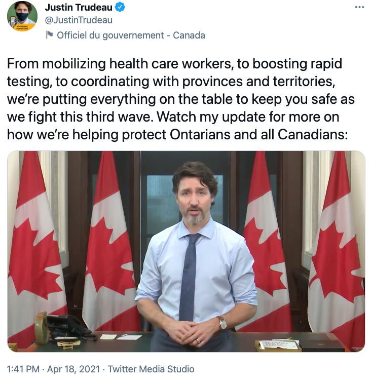
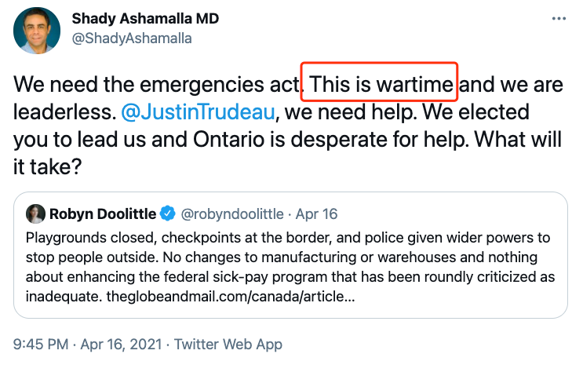

# 无标题

**链接地址:** http://mp.weixin.qq.com/s?__biz=MjM5MDEzNzY2NQ==&mid=2652814447&idx=1&sn=cfc715f10d9154abccd1dc6e33041700&chksm=bda370418ad4f957b575dd86debe8c2d7b8bdc55797b65bacdd1abf2b006b6f641183e566419&mpshare=1&scene=2&srcid=0419MdNzL2nPhuwy7FxpoSSa&sharer_sharetime=1618793433076&sharer_shareid=be1c8edd6c93eec155a61c876e41d26a#rd
**作者:** 丁其
**获取时间:** 2025/8/28 19:48:39
**图片数量:** 12

---

## 原始HTML内容

<section style="font-family: -apple-system, system-ui, &quot;Helvetica Neue&quot;, &quot;PingFang SC&quot;, &quot;Hiragino Sans GB&quot;, &quot;Microsoft YaHei UI&quot;, &quot;Microsoft YaHei&quot;, Arial, sans-serif;letter-spacing: 0.544px;white-space: normal;background-color: rgb(255, 255, 255);text-align: center;line-height: 2em;margin-left: 8px;margin-right: 8px;" data-mpa-powered-by="yiban.io"></section><section style="font-family: -apple-system, system-ui, &quot;Helvetica Neue&quot;, &quot;PingFang SC&quot;, &quot;Hiragino Sans GB&quot;, &quot;Microsoft YaHei UI&quot;, &quot;Microsoft YaHei&quot;, Arial, sans-serif;letter-spacing: 0.544px;white-space: normal;background-color: rgb(255, 255, 255);text-align: center;line-height: 2em;margin-left: 8px;margin-right: 8px;">+++++上方是广告+++++</section><section style="caret-color: rgb(51, 51, 51);font-family: -apple-system, BlinkMacSystemFont, &quot;Helvetica Neue&quot;, &quot;PingFang SC&quot;, &quot;Hiragino Sans GB&quot;, &quot;Microsoft YaHei UI&quot;, &quot;Microsoft YaHei&quot;, Arial, sans-serif;letter-spacing: 0.621714px;white-space: normal;text-size-adjust: auto;line-height: 2em;margin-left: 8px;margin-right: 8px;">加拿大各省疫情告急，安省福特省长还罕见其他省份发出求救信，总理特鲁多今天表示将会派遣医疗人员到安省救火。而有联邦部长透露，不排除有史以来第一次援引《加拿大紧急法》（Canada Emergencies Act），接管各省权力，全加拿大集中分配资源，联合抗疫。</section><section style="caret-color: rgb(51, 51, 51);font-family: -apple-system, BlinkMacSystemFont, &quot;Helvetica Neue&quot;, &quot;PingFang SC&quot;, &quot;Hiragino Sans GB&quot;, &quot;Microsoft YaHei UI&quot;, &quot;Microsoft YaHei&quot;, Arial, sans-serif;letter-spacing: 0.621714px;white-space: normal;text-size-adjust: auto;line-height: 2em;margin-left: 8px;margin-right: 8px;"> </section><section style="text-align: center;padding: 0px 0.5em;line-height: 2em;margin-left: 8px;margin-right: 8px;"></section><section style="text-align: center;padding: 0px 0.5em;line-height: 2em;margin-left: 8px;margin-right: 8px;"> </section><section style="padding-right: 0.5em;padding-left: 0.5em;caret-color: rgb(51, 51, 51);white-space: normal;text-size-adjust: auto;font-family: -apple-system, system-ui, &quot;Helvetica Neue&quot;, &quot;PingFang SC&quot;, &quot;Hiragino Sans GB&quot;, &quot;Microsoft YaHei UI&quot;, &quot;Microsoft YaHei&quot;, Arial, sans-serif;letter-spacing: 0.544px;font-size: 16px;background-color: rgb(255, 255, 255);text-align: left;line-height: 2em;margin-left: 8px;margin-right: 8px;">安省今天新增4250例，连续4天4000+，破百的地区10个：</section><ol class="list-paddingleft-2" style="caret-color: rgb(51, 51, 51);white-space: normal;text-size-adjust: auto;width: 577.422px;font-family: -apple-system, system-ui, &quot;Helvetica Neue&quot;, &quot;PingFang SC&quot;, &quot;Hiragino Sans GB&quot;, &quot;Microsoft YaHei UI&quot;, &quot;Microsoft YaHei&quot;, Arial, sans-serif;letter-spacing: 0.544px;font-size: 16px;background-color: rgb(255, 255, 255);margin-left: 8px;margin-right: 8px;"><li>
多伦多：1392例 
</li><li>
皮尔区：714例 
</li><li>
约克区：483例 
</li><li>
杜林区：279例
</li><li>
渥太华：239例
</li><li>
荷顿区：127例
</li><li>
伦敦：117例
</li><li>
大瀑布：149例
</li><li>
哈密尔顿：151例
</li><li>
巴里-Muskoka：101例
</li></ol><section style="caret-color: rgb(51, 51, 51);font-family: -apple-system, BlinkMacSystemFont, &quot;Helvetica Neue&quot;, &quot;PingFang SC&quot;, &quot;Hiragino Sans GB&quot;, &quot;Microsoft YaHei UI&quot;, &quot;Microsoft YaHei&quot;, Arial, sans-serif;letter-spacing: 0.621714px;white-space: normal;text-size-adjust: auto;line-height: 2em;margin-left: 8px;margin-right: 8px;"> </section><section style="caret-color: rgb(51, 51, 51);font-family: -apple-system, BlinkMacSystemFont, &quot;Helvetica Neue&quot;, &quot;PingFang SC&quot;, &quot;Hiragino Sans GB&quot;, &quot;Microsoft YaHei UI&quot;, &quot;Microsoft YaHei&quot;, Arial, sans-serif;letter-spacing: 0.621714px;white-space: normal;text-size-adjust: auto;line-height: 2em;margin-left: 8px;margin-right: 8px;">住院人数在继续攀升，今天有2107人患新冠住院，高于昨日的2065例。新冠ICU人数741例继续创新高，其中506例需要插管上呼吸机。</section><section style="caret-color: rgb(51, 51, 51);font-family: -apple-system, BlinkMacSystemFont, &quot;Helvetica Neue&quot;, &quot;PingFang SC&quot;, &quot;Hiragino Sans GB&quot;, &quot;Microsoft YaHei UI&quot;, &quot;Microsoft YaHei&quot;, Arial, sans-serif;letter-spacing: 0.621714px;white-space: normal;text-size-adjust: auto;line-height: 2em;margin-left: 8px;margin-right: 8px;"> </section><section style="caret-color: rgb(51, 51, 51);font-family: -apple-system, BlinkMacSystemFont, &quot;Helvetica Neue&quot;, &quot;PingFang SC&quot;, &quot;Hiragino Sans GB&quot;, &quot;Microsoft YaHei UI&quot;, &quot;Microsoft YaHei&quot;, Arial, sans-serif;letter-spacing: 0.621714px;white-space: normal;text-size-adjust: auto;line-height: 2em;margin-left: 8px;margin-right: 8px;">医院逼爆！医生和护士不堪重负，安省政府不得不向加拿大其他省份/地区寻求医疗资源的帮助。 </section><section style="line-height: 2em;margin-left: 8px;margin-right: 8px;"> </section><section style="text-align: center;line-height: 2em;margin-left: 8px;margin-right: 8px;"></section><section style="line-height: 2em;margin-left: 8px;margin-right: 8px;"> </section><section style="line-height: 2em;margin-left: 8px;margin-right: 8px;">安省卫生厅在致其他省份/地区的一封信中承认，安省ICU病房正变得“越来越紧张”，导致在接下来的四个月中估计约有4,145名护士出现短缺。</section><section style="line-height: 2em;margin-left: 8px;margin-right: 8px;"> </section><section style="line-height: 2em;margin-left: 8px;margin-right: 8px;">根据多伦多大学的数据模型预测，预计到4月底将有大约1000名患者需要进ICU重症监护病房，但是，安省其他ICU病人已经有1400人，早前为新冠病人预留了900个ICU病床，现在已经741例了。</section><section style="line-height: 2em;margin-left: 8px;margin-right: 8px;"> </section><section style="line-height: 2em;margin-left: 8px;margin-right: 8px;">安省本周已经开始减少手术，以腾出额外的床位，加上本周预计新增350张床位，从而将安省的ICU总容量增加到2500张。</section><section style="line-height: 2em;margin-left: 8px;margin-right: 8px;"> </section><section style="line-height: 2em;margin-left: 8px;margin-right: 8px;">虽然安省已发布紧急命令，将家庭护理人员重新部署到安省各大医院中，但向各省求救的信件暗示，这些措施将无法充分填补人员配备方面的空白，从而引发了对“急需的卫生人力资源”的呼吁。</section><section style="line-height: 2em;margin-left: 8px;margin-right: 8px;"> </section><section style="line-height: 2em;margin-left: 8px;margin-right: 8px;">安省卫生厅副厅长海伦·安格斯（Helen Angus）的信中写道：“为了满足安省第三波高峰期之后的预期需求，我们正在寻求620名专业人员的支持，以支持安省医院。”</section><section style="line-height: 2em;margin-left: 8px;margin-right: 8px;"> </section><section style="line-height: 2em;margin-left: 8px;margin-right: 8px;">对医护人员的要求包括：</section><section style="line-height: 2em;margin-left: 8px;margin-right: 8px;">•500名护士（ICU /重症监护/康复室/普通）</section><section style="line-height: 2em;margin-left: 8px;margin-right: 8px;">•100名呼吸治疗师</section><section style="line-height: 2em;margin-left: 8px;margin-right: 8px;">•10名灌注师</section><section style="line-height: 2em;margin-left: 8px;margin-right: 8px;">•10名麻醉助手</section><section style="text-align: center;padding: 0px 0.5em;line-height: 2em;margin-left: 8px;margin-right: 8px;"> </section><section style="line-height: 2em;margin-left: 8px;margin-right: 8px;">信中说，大部分传入的卫生保健资源将部署在大多伦多地区和附近地区，由于病毒爆发，GTA这些地方的医院已经超负荷工作。</section><section style="line-height: 2em;margin-left: 8px;margin-right: 8px;"> </section><section style="text-align: center;padding: 0px 0.5em;line-height: 2em;margin-left: 8px;margin-right: 8px;"></section><section style="line-height: 2em;margin-left: 8px;margin-right: 8px;"> </section><section style="line-height: 2em;margin-left: 8px;margin-right: 8px;">总理贾斯汀·特鲁多（Justin Trudeau）今天表示，联邦政府和加拿大一些省份正在努力派遣医护人员和设备，以帮助安省应对破纪录的COVID-19数据。</section><section style="line-height: 2em;margin-left: 8px;margin-right: 8px;"> </section><section style="line-height: 2em;margin-left: 8px;margin-right: 8px;">特鲁多今天（4月18日）下午1：40发放视频说，国防和移民等政府部门雇用的医护人员将被重新安置到安省，特别是大多伦多地区。</section><section style="line-height: 2em;margin-left: 8px;margin-right: 8px;"> </section><section style="text-align: center;padding: 0px 0.5em;line-height: 2em;margin-left: 8px;margin-right: 8px;"></section><section style="line-height: 2em;margin-left: 8px;margin-right: 8px;"> </section><section style="line-height: 2em;margin-left: 8px;margin-right: 8px;">总理说，他还与纽芬兰和拉布拉多省，爱德华王子岛和新斯科舍省的省长进行了交谈，他们正在评估他们未来几天可以释放的人力资源和设备。</section><section style="line-height: 2em;margin-left: 8px;margin-right: 8px;"> </section><section style="text-align: center;padding: 0px 0.5em;line-height: 2em;margin-left: 8px;margin-right: 8px;"></section><section style="line-height: 2em;margin-left: 8px;margin-right: 8px;"> </section><section style="line-height: 2em;margin-left: 8px;margin-right: 8px;">加拿大负责疫苗采购的联邦采购部长阿妮塔·阿南德（Anita Anand）今天接受媒体采访时透露，联邦政府不排除任何可能有助于加拿大遏制第三波COVID-19的方案，包括援引《加拿大紧急法》（Canada Emergencies Act）。</section><section style="line-height: 2em;margin-left: 8px;margin-right: 8px;"> </section><section style="line-height: 2em;margin-left: 8px;margin-right: 8px;">阿南德透露，联邦内阁将在周末和下周开会，考虑一切方案抗疫，包括加拿大历史上从没实施过的《加拿大紧急法》。</section><section style="line-height: 2em;margin-left: 8px;margin-right: 8px;"> </section><section style="line-height: 2em;margin-left: 8px;margin-right: 8px;">《加拿大紧急法》将赋予联邦政府权力，可在国会审查后迅速发布行政命令并重新分配公共资金。</section><section style="line-height: 2em;margin-left: 8px;margin-right: 8px;"> </section><section style="line-height: 2em;margin-left: 8px;margin-right: 8px;">大流行发展至今，虽然各个省份已经宣布进入紧急状态，但联邦政府目前一直还没有宣布过进入紧急状态。</section><section style="line-height: 2em;margin-left: 8px;margin-right: 8px;"> </section><section style="line-height: 2em;margin-left: 8px;margin-right: 8px;">《加拿大紧急法》本身从未在加拿大使用过。因为一旦援引，联邦政府的权力将会大大增加，削弱各省的权力。</section><section style="line-height: 2em;margin-left: 8px;margin-right: 8px;"> </section><section style="line-height: 2em;margin-left: 8px;margin-right: 8px;">《加拿大紧急法》的前身是《战争状态法》（War Measures Act），加拿大历史上援引过三次《战争状态法》：第一次和第二次世界大战期间以及1970年10月危机。该法允许联邦政府在国家紧急情况下采取行动确保安全与保障，《战争状态法》1988年7月21日废除，由《加拿大紧急法》所取代。</section><section style="line-height: 2em;margin-left: 8px;margin-right: 8px;"> </section><section style="line-height: 2em;margin-left: 8px;margin-right: 8px;">《加拿大紧急法》是加拿大议会的一项法案，授权采取特别的临时措施以确保国家紧急情况下的安全与保障，它被认为可以提供“加拿大所有紧急法律中最严格的政府紧急权力。”（the stiffest government emergency powers of any emergency law in Canada）</section><section style="line-height: 2em;margin-left: 8px;margin-right: 8px;"> </section><section style="line-height: 2em;margin-left: 8px;margin-right: 8px;">《紧急状态法》与《战争措施法》只在两个方面有所不同：</section><section style="line-height: 2em;margin-left: 8px;margin-right: 8px;"> </section><section style="line-height: 2em;margin-left: 8px;margin-right: 8px;"></section><section style="line-height: 2em;margin-left: 8px;margin-right: 8px;">1、联邦政府内阁宣布紧急情况必须由国会审查</section><section style="line-height: 2em;margin-left: 8px;margin-right: 8px;">2、根据该法案制定的任何临时法律均受宪法《权利和自由宪章》的约束。</section><section style="line-height: 2em;margin-left: 8px;margin-right: 8px;"> </section><section style="line-height: 2em;margin-left: 8px;margin-right: 8px;">不过，一旦特鲁多宣布《加拿大紧急状态法》，联邦政府的权力将会空前强大，则意味着特鲁多联邦政府将会接管加拿大各省，将各省的权力接管。</section><section style="line-height: 2em;margin-left: 8px;margin-right: 8px;"> </section><section style="line-height: 2em;margin-left: 8px;margin-right: 8px;">对于这个惊人的提议，立即震动加拿大社会各界。</section><section style="line-height: 2em;margin-left: 8px;margin-right: 8px;"> </section><section style="text-align: center;padding: 0px 0.5em;line-height: 2em;margin-left: 8px;margin-right: 8px;"></section><section style="line-height: 2em;margin-left: 8px;margin-right: 8px;">联邦前司法部长王州迪表示：“我们应该讨论面对COVID大流行是否要使用《联邦紧急状态法》，尤其是现在已经迎来了第三波浪潮。”</section><section style="line-height: 2em;margin-left: 8px;margin-right: 8px;"> </section><section style="text-align: center;padding: 0px 0.5em;line-height: 2em;margin-left: 8px;margin-right: 8px;"></section><section style="line-height: 2em;margin-left: 8px;margin-right: 8px;"></section><section style="line-height: 2em;margin-left: 8px;margin-right: 8px;">多伦多新宁医院（Sunnybrook）的外科医生Shady Ashamalla医生则非常赞成：“我们需要联邦紧急法，现在就是战时！特鲁多先生，我们需要您的帮助，我们选你来领导我们，安省需要帮忙。”</section><section style="line-height: 2em;margin-left: 8px;margin-right: 8px;"> </section><section style="text-align: center;padding: 0px 0.5em;line-height: 2em;margin-left: 8px;margin-right: 8px;"></section><section style="line-height: 2em;margin-left: 8px;margin-right: 8px;">多伦多太阳报的评论员则指特鲁多如果接管各省将是一个灾难。</section><section style="line-height: 2em;margin-left: 8px;margin-right: 8px;"> </section><section style="line-height: 2em;margin-left: 8px;margin-right: 8px;">加拿大目前不但疫情到处告急，疫苗分配也有问题，特鲁多如果历史上首次宣布援引《加拿大紧急状态法》，接管各省的权力，统一抗疫，是否会起到立竿见影的作用？</section><section style="line-height: 2em;margin-left: 8px;margin-right: 8px;"> </section><section style="font-family: -apple-system, system-ui, &quot;Helvetica Neue&quot;, &quot;PingFang SC&quot;, &quot;Hiragino Sans GB&quot;, &quot;Microsoft YaHei UI&quot;, &quot;Microsoft YaHei&quot;, Arial, sans-serif;letter-spacing: 0.544px;white-space: normal;background-color: rgb(255, 255, 255);color: rgb(160, 160, 160);font-size: 15px;text-align: center;line-height: 2em;margin-left: 8px;margin-right: 8px;">+++++下方是广告+++++</section><section style="font-family: -apple-system, system-ui, &quot;Helvetica Neue&quot;, &quot;PingFang SC&quot;, &quot;Hiragino Sans GB&quot;, &quot;Microsoft YaHei UI&quot;, &quot;Microsoft YaHei&quot;, Arial, sans-serif;letter-spacing: 0.544px;white-space: normal;background-color: rgb(255, 255, 255);text-align: center;line-height: 2em;margin-left: 8px;margin-right: 8px;"></section><section style="font-family: -apple-system, BlinkMacSystemFont, &quot;Helvetica Neue&quot;, &quot;PingFang SC&quot;, &quot;Hiragino Sans GB&quot;, &quot;Microsoft YaHei UI&quot;, &quot;Microsoft YaHei&quot;, Arial, sans-serif;letter-spacing: 0.544px;white-space: normal;background-color: rgb(255, 255, 255);color: rgb(160, 160, 160);font-size: 15px;text-align: center;line-height: 2em;margin-left: 8px;margin-right: 8px;">+++全加拿大华人都在关注超级生活，就差你了+++ </section><section style="font-family: -apple-system, BlinkMacSystemFont, &quot;Helvetica Neue&quot;, &quot;PingFang SC&quot;, &quot;Hiragino Sans GB&quot;, &quot;Microsoft YaHei UI&quot;, &quot;Microsoft YaHei&quot;, Arial, sans-serif;letter-spacing: 0.544px;white-space: normal;background-color: rgb(255, 255, 255);color: rgb(160, 160, 160);font-size: 15px;text-align: center;line-height: 2em;margin-left: 8px;margin-right: 8px;"></section><section style="font-family: -apple-system, BlinkMacSystemFont, &quot;Helvetica Neue&quot;, &quot;PingFang SC&quot;, &quot;Hiragino Sans GB&quot;, &quot;Microsoft YaHei UI&quot;, &quot;Microsoft YaHei&quot;, Arial, sans-serif;letter-spacing: 0.544px;white-space: normal;background-color: rgb(255, 255, 255);color: rgb(160, 160, 160);font-size: 15px;text-align: right;line-height: 2em;margin-left: 8px;margin-right: 8px;"><strong style="letter-spacing: 0.544px;"><strong style="letter-spacing: 0.544px;">喜欢就狠点两下吧</strong><strong style="letter-spacing: 0.544px;"></strong></strong></section>

---

## 纯文本内容

+++++上方是广告+++++加拿大各省疫情告急，安省福特省长还罕见其他省份发出求救信，总理特鲁多今天表示将会派遣医疗人员到安省救火。而有联邦部长透露，不排除有史以来第一次援引《加拿大紧急法》（Canada Emergencies Act），接管各省权力，全加拿大集中分配资源，联合抗疫。安省今天新增4250例，连续4天4000+，破百的地区10个：多伦多：1392例皮尔区：714例约克区：483例杜林区：279例渥太华：239例荷顿区：127例伦敦：117例大瀑布：149例哈密尔顿：151例巴里-Muskoka：101例住院人数在继续攀升，今天有2107人患新冠住院，高于昨日的2065例。新冠ICU人数741例继续创新高，其中506例需要插管上呼吸机。医院逼爆！医生和护士不堪重负，安省政府不得不向加拿大其他省份/地区寻求医疗资源的帮助。安省卫生厅在致其他省份/地区的一封信中承认，安省ICU病房正变得“越来越紧张”，导致在接下来的四个月中估计约有4,145名护士出现短缺。根据多伦多大学的数据模型预测，预计到4月底将有大约1000名患者需要进ICU重症监护病房，但是，安省其他ICU病人已经有1400人，早前为新冠病人预留了900个ICU病床，现在已经741例了。安省本周已经开始减少手术，以腾出额外的床位，加上本周预计新增350张床位，从而将安省的ICU总容量增加到2500张。虽然安省已发布紧急命令，将家庭护理人员重新部署到安省各大医院中，但向各省求救的信件暗示，这些措施将无法充分填补人员配备方面的空白，从而引发了对“急需的卫生人力资源”的呼吁。安省卫生厅副厅长海伦·安格斯（Helen Angus）的信中写道：“为了满足安省第三波高峰期之后的预期需求，我们正在寻求620名专业人员的支持，以支持安省医院。”对医护人员的要求包括：•500名护士（ICU /重症监护/康复室/普通）•100名呼吸治疗师•10名灌注师•10名麻醉助手信中说，大部分传入的卫生保健资源将部署在大多伦多地区和附近地区，由于病毒爆发，GTA这些地方的医院已经超负荷工作。总理贾斯汀·特鲁多（Justin Trudeau）今天表示，联邦政府和加拿大一些省份正在努力派遣医护人员和设备，以帮助安省应对破纪录的COVID-19数据。特鲁多今天（4月18日）下午1：40发放视频说，国防和移民等政府部门雇用的医护人员将被重新安置到安省，特别是大多伦多地区。总理说，他还与纽芬兰和拉布拉多省，爱德华王子岛和新斯科舍省的省长进行了交谈，他们正在评估他们未来几天可以释放的人力资源和设备。加拿大负责疫苗采购的联邦采购部长阿妮塔·阿南德（Anita Anand）今天接受媒体采访时透露，联邦政府不排除任何可能有助于加拿大遏制第三波COVID-19的方案，包括援引《加拿大紧急法》（Canada Emergencies Act）。阿南德透露，联邦内阁将在周末和下周开会，考虑一切方案抗疫，包括加拿大历史上从没实施过的《加拿大紧急法》。《加拿大紧急法》将赋予联邦政府权力，可在国会审查后迅速发布行政命令并重新分配公共资金。大流行发展至今，虽然各个省份已经宣布进入紧急状态，但联邦政府目前一直还没有宣布过进入紧急状态。《加拿大紧急法》本身从未在加拿大使用过。因为一旦援引，联邦政府的权力将会大大增加，削弱各省的权力。《加拿大紧急法》的前身是《战争状态法》（War Measures Act），加拿大历史上援引过三次《战争状态法》：第一次和第二次世界大战期间以及1970年10月危机。该法允许联邦政府在国家紧急情况下采取行动确保安全与保障，《战争状态法》1988年7月21日废除，由《加拿大紧急法》所取代。《加拿大紧急法》是加拿大议会的一项法案，授权采取特别的临时措施以确保国家紧急情况下的安全与保障，它被认为可以提供“加拿大所有紧急法律中最严格的政府紧急权力。”（the stiffest government emergency powers of any emergency law in Canada）《紧急状态法》与《战争措施法》只在两个方面有所不同：1、联邦政府内阁宣布紧急情况必须由国会审查2、根据该法案制定的任何临时法律均受宪法《权利和自由宪章》的约束。不过，一旦特鲁多宣布《加拿大紧急状态法》，联邦政府的权力将会空前强大，则意味着特鲁多联邦政府将会接管加拿大各省，将各省的权力接管。对于这个惊人的提议，立即震动加拿大社会各界。联邦前司法部长王州迪表示：“我们应该讨论面对COVID大流行是否要使用《联邦紧急状态法》，尤其是现在已经迎来了第三波浪潮。”多伦多新宁医院（Sunnybrook）的外科医生Shady Ashamalla医生则非常赞成：“我们需要联邦紧急法，现在就是战时！特鲁多先生，我们需要您的帮助，我们选你来领导我们，安省需要帮忙。”多伦多太阳报的评论员则指特鲁多如果接管各省将是一个灾难。加拿大目前不但疫情到处告急，疫苗分配也有问题，特鲁多如果历史上首次宣布援引《加拿大紧急状态法》，接管各省的权力，统一抗疫，是否会起到立竿见影的作用？+++++下方是广告++++++++全加拿大华人都在关注超级生活，就差你了+++喜欢就狠点两下吧

---

## 图片列表

-  (原始链接: https://mmbiz.qpic.cn/mmbiz_jpg/szJas1pFaJcqjQncOPG1lRaq8KkyuGTicnbqhn0CAjiaV5Uickg6fJ4MibhYZYicfaFmYrM7W0AvpfYdxE4YqB8tZgQ/640?wx_fmt=jpeg)
-  (原始链接: https://mmbiz.qpic.cn/mmbiz_png/szJas1pFaJfgrTLH3tvOD95iaiclfibY5BuPPzJibAsuiczv8pHT6G2WqaQAY7AuPhSINSuRqX8v9zJyN2EZYSicQd8Q/640?wx_fmt=png)
-  (原始链接: https://mmbiz.qpic.cn/mmbiz_png/szJas1pFaJfgrTLH3tvOD95iaiclfibY5Buicoacv6xiaUkWyhPf4e0oSX421bGsTAibUibOSKibCb8U2p1KEtv0GbaBUw/640?wx_fmt=png)
-  (原始链接: https://mmbiz.qpic.cn/mmbiz_png/szJas1pFaJfgrTLH3tvOD95iaiclfibY5BuECRSBTodfWcRibRibiacB5DicNZicicKkWHWZak7TautLjh05Vz0xaRMVhHw/640?wx_fmt=png)
-  (原始链接: https://mmbiz.qpic.cn/mmbiz_png/szJas1pFaJfgrTLH3tvOD95iaiclfibY5BuLGUOrzCTLIl83eich9j4VvES9dKW0vVlPAJfCf1C8lJnqm3EF6I2AGQ/640?wx_fmt=png)
-  (原始链接: https://mmbiz.qpic.cn/mmbiz_png/szJas1pFaJfgrTLH3tvOD95iaiclfibY5Bu1CwbyyxwRSFxSjbD2tgabU2R2jicDPS1sLWBmOYXklcxG0997xG32lQ/640?wx_fmt=png)
-  (原始链接: https://mmbiz.qpic.cn/mmbiz_png/szJas1pFaJfgrTLH3tvOD95iaiclfibY5BuM5GYUzMJKLGdS5IP9AqmGp8BeJ1icEPZbe9o9LocQ0OrwibYngFrLIwg/640?wx_fmt=png)
-  (原始链接: https://mmbiz.qpic.cn/mmbiz_png/szJas1pFaJfgrTLH3tvOD95iaiclfibY5Buia7B8TibjiaUsX65NXYZFlmnqs0zt76cP6jiah4Wsia2pevFJTQ39QHQc5A/640?wx_fmt=png)
-  (原始链接: https://mmbiz.qpic.cn/mmbiz_png/szJas1pFaJfgrTLH3tvOD95iaiclfibY5BujGibfsKiaG2ODUicyRKTA2WdfXLrtj4vx73ibHB7m2IKL7qzF7icjFIUk8Q/640?wx_fmt=png)
-  (原始链接: https://mmbiz.qpic.cn/mmbiz_jpg/szJas1pFaJednVGkuNxykXB3dNw9QDticEDzsyPASz9cplzbpnARmxictkOrxFMibqicUAN7h3WoibgCnfKGFgHGyPw/640?wx_fmt=jpeg)
-  (原始链接: https://mmbiz.qpic.cn/mmbiz_gif/szJas1pFaJdUFDPEKnLrCyGC4WgrAvl6lSC2beZFt6icTnXfebnRzcRialMg5VZujw1AhX9ribkSDQNZZukk8HX9w/640?wx_fmt=gif)
-  (原始链接: https://mmbiz.qpic.cn/mmbiz_png/szJas1pFaJdux7mbDaq4CpWoWAUe3fNIlVYWrSfV7acu1tNBibI1icqvrlqkkqWdELW157V8YZVNxH7MLYksFHcA/640?wx_fmt=png)
