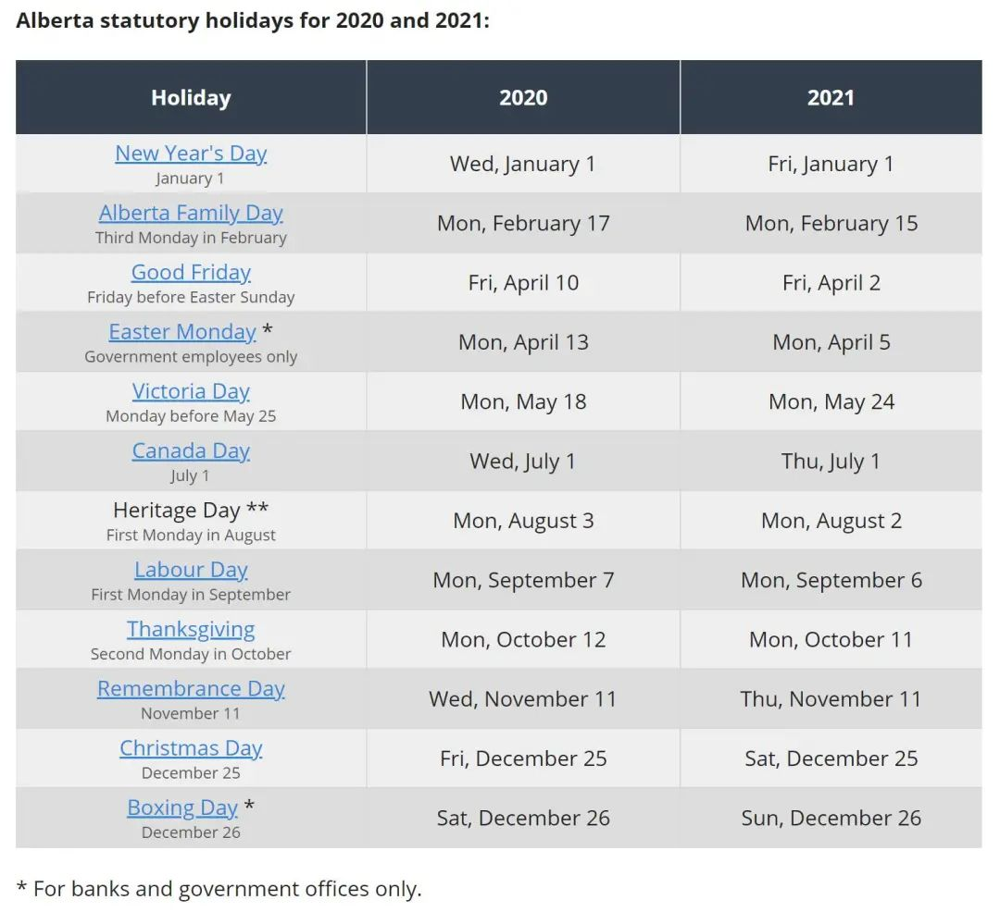
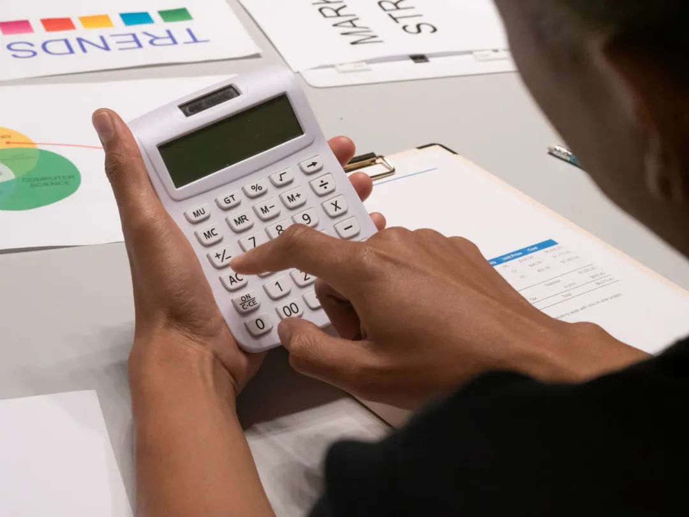
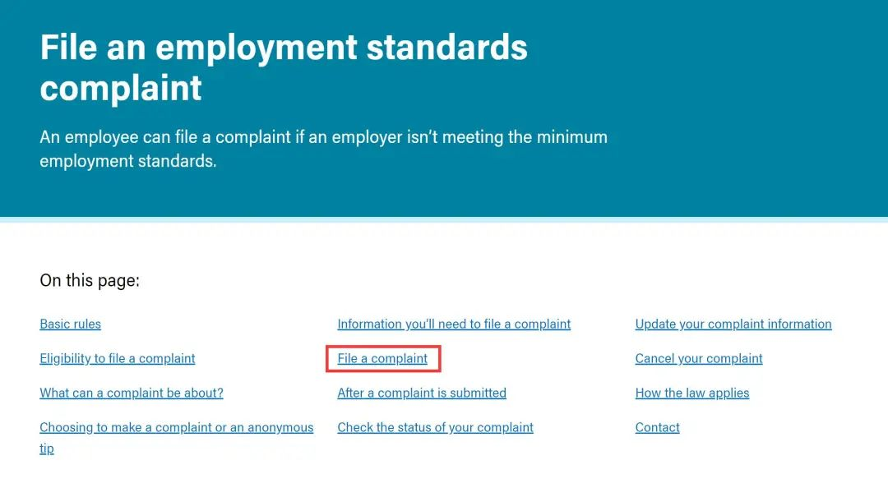
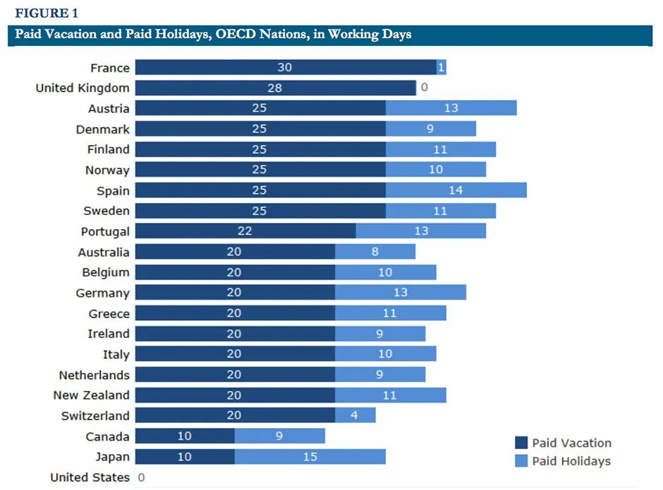

# 无标题

**链接地址:** http://mp.weixin.qq.com/s?__biz=MzI4NDYyNjAwNw==&mid=2247484928&idx=1&sn=deed0ec4f6d2a30ed7b42b2cd21636d6&chksm=ebf9db38dc8e522ee2fe2cc7a5276fb3b12b9ed3a7ea2af9f12a04e58ed4f9f72fd2c0a2a104&mpshare=1&scene=2&srcid=05024j7Yjq5TMMaAipdk9hkE&sharer_sharetime=1619918671417&sharer_shareid=be1c8edd6c93eec155a61c876e41d26a#rd
**作者:** 关注我们
**获取时间:** 2025/8/28 19:48:25
**图片数量:** 21

---

## 原始HTML内容

<section style="box-sizing: border-box;font-size: 16px;"><section style="box-sizing: border-box;" powered-by="xiumi.us"><section style="text-align: center;justify-content: center;margin: 10px 0%;display: flex;flex-flow: row nowrap;box-sizing: border-box;"><section style="display: inline-block;vertical-align: top;width: auto;min-width: 10%;max-width: 100%;flex: 0 0 auto;height: auto;align-self: flex-start;box-sizing: border-box;"><section style="box-sizing: border-box;" powered-by="xiumi.us"><section style="display: flex;flex-flow: row nowrap;box-sizing: border-box;"><section style="display: inline-block;vertical-align: top;width: auto;line-height: 0;flex: 100 100 0%;align-self: flex-start;height: auto;box-sizing: border-box;"><section style="margin-right: 0%;margin-bottom: 5px;margin-left: 0%;box-sizing: border-box;" powered-by="xiumi.us"><section style="display: inline-block;width: 4px;height: 4px;vertical-align: top;overflow: hidden;background-color: rgba(245, 72, 21, 0.2);border-width: 0px;border-radius: 74px;border-style: none;border-color: rgb(62, 62, 62);box-sizing: border-box;"><section><svg viewBox="0 0 1 1" style="float:left;line-height:0;width:0;vertical-align:top;"></svg></section></section></section></section><section style="display: inline-block;vertical-align: top;width: auto;line-height: 0;flex: 100 100 0%;align-self: flex-start;height: auto;box-sizing: border-box;"><section style="margin-right: 0%;margin-bottom: 5px;margin-left: 0%;box-sizing: border-box;" powered-by="xiumi.us"><section style="display: inline-block;width: 4px;height: 4px;vertical-align: top;overflow: hidden;background-color: rgba(245, 72, 21, 0.2);border-width: 0px;border-radius: 74px;border-style: none;border-color: rgb(62, 62, 62);box-sizing: border-box;"><section><svg viewBox="0 0 1 1" style="float:left;line-height:0;width:0;vertical-align:top;"></svg></section></section></section></section><section style="display: inline-block;vertical-align: top;width: auto;line-height: 0;flex: 100 100 0%;align-self: flex-start;height: auto;box-sizing: border-box;"><section style="margin-right: 0%;margin-bottom: 5px;margin-left: 0%;box-sizing: border-box;" powered-by="xiumi.us"><section style="display: inline-block;width: 4px;height: 4px;vertical-align: top;overflow: hidden;background-color: rgba(245, 72, 21, 0.2);border-width: 0px;border-radius: 74px;border-style: none;border-color: rgb(62, 62, 62);box-sizing: border-box;"><section><svg viewBox="0 0 1 1" style="float:left;line-height:0;width:0;vertical-align:top;"></svg></section></section></section></section><section style="display: inline-block;vertical-align: top;width: auto;line-height: 0;flex: 100 100 0%;align-self: flex-start;height: auto;box-sizing: border-box;"><section style="margin-right: 0%;margin-bottom: 5px;margin-left: 0%;box-sizing: border-box;" powered-by="xiumi.us"><section style="display: inline-block;width: 4px;height: 4px;vertical-align: top;overflow: hidden;background-color: rgba(245, 72, 21, 0.2);border-width: 0px;border-radius: 74px;border-style: none;border-color: rgb(62, 62, 62);box-sizing: border-box;"><section><svg viewBox="0 0 1 1" style="float:left;line-height:0;width:0;vertical-align:top;"></svg></section></section></section></section></section></section><section style="box-sizing: border-box;" powered-by="xiumi.us"><section style="display: flex;flex-flow: row nowrap;box-sizing: border-box;"><section style="display: inline-block;vertical-align: top;width: auto;line-height: 0;flex: 100 100 0%;align-self: flex-start;height: auto;box-sizing: border-box;"><section style="margin-right: 0%;margin-bottom: 5px;margin-left: 0%;box-sizing: border-box;" powered-by="xiumi.us"><section style="display: inline-block;width: 4px;height: 4px;vertical-align: top;overflow: hidden;background-color: rgba(245, 72, 21, 0.2);border-width: 0px;border-radius: 74px;border-style: none;border-color: rgb(62, 62, 62);box-sizing: border-box;"><section><svg viewBox="0 0 1 1" style="float:left;line-height:0;width:0;vertical-align:top;"></svg></section></section></section></section><section style="display: inline-block;vertical-align: top;width: auto;line-height: 0;flex: 100 100 0%;align-self: flex-start;height: auto;box-sizing: border-box;"><section style="margin-right: 0%;margin-bottom: 5px;margin-left: 0%;box-sizing: border-box;" powered-by="xiumi.us"><section style="display: inline-block;width: 4px;height: 4px;vertical-align: top;overflow: hidden;background-color: rgba(245, 72, 21, 0.2);border-width: 0px;border-radius: 74px;border-style: none;border-color: rgb(62, 62, 62);box-sizing: border-box;"><section><svg viewBox="0 0 1 1" style="float:left;line-height:0;width:0;vertical-align:top;"></svg></section></section></section></section><section style="display: inline-block;vertical-align: top;width: auto;line-height: 0;flex: 100 100 0%;align-self: flex-start;height: auto;box-sizing: border-box;"><section style="margin-right: 0%;margin-bottom: 5px;margin-left: 0%;box-sizing: border-box;" powered-by="xiumi.us"><section style="display: inline-block;width: 4px;height: 4px;vertical-align: top;overflow: hidden;background-color: rgba(245, 72, 21, 0.2);border-width: 0px;border-radius: 74px;border-style: none;border-color: rgb(62, 62, 62);box-sizing: border-box;"><section><svg viewBox="0 0 1 1" style="float:left;line-height:0;width:0;vertical-align:top;"></svg></section></section></section></section><section style="display: inline-block;vertical-align: top;width: auto;line-height: 0;flex: 100 100 0%;align-self: flex-start;height: auto;box-sizing: border-box;"><section style="margin-right: 0%;margin-bottom: 5px;margin-left: 0%;box-sizing: border-box;" powered-by="xiumi.us"><section style="display: inline-block;width: 4px;height: 4px;vertical-align: top;overflow: hidden;background-color: rgba(245, 72, 21, 0.2);border-width: 0px;border-radius: 74px;border-style: none;border-color: rgb(62, 62, 62);box-sizing: border-box;"><section><svg viewBox="0 0 1 1" style="float:left;line-height:0;width:0;vertical-align:top;"></svg></section></section></section></section></section></section><section style="box-sizing: border-box;" powered-by="xiumi.us"><section style="display: flex;flex-flow: row nowrap;box-sizing: border-box;"><section style="display: inline-block;vertical-align: top;width: auto;line-height: 0;flex: 100 100 0%;align-self: flex-start;height: auto;box-sizing: border-box;"><section style="margin-right: 0%;margin-bottom: 5px;margin-left: 0%;box-sizing: border-box;" powered-by="xiumi.us"><section style="display: inline-block;width: 4px;height: 4px;vertical-align: top;overflow: hidden;background-color: rgba(245, 72, 21, 0.2);border-width: 0px;border-radius: 74px;border-style: none;border-color: rgb(62, 62, 62);box-sizing: border-box;"><section><svg viewBox="0 0 1 1" style="float:left;line-height:0;width:0;vertical-align:top;"></svg></section></section></section></section><section style="display: inline-block;vertical-align: top;width: auto;line-height: 0;flex: 100 100 0%;align-self: flex-start;height: auto;box-sizing: border-box;"><section style="margin-right: 0%;margin-bottom: 5px;margin-left: 0%;box-sizing: border-box;" powered-by="xiumi.us"><section style="display: inline-block;width: 4px;height: 4px;vertical-align: top;overflow: hidden;background-color: rgba(245, 72, 21, 0.2);border-width: 0px;border-radius: 74px;border-style: none;border-color: rgb(62, 62, 62);box-sizing: border-box;"><section><svg viewBox="0 0 1 1" style="float:left;line-height:0;width:0;vertical-align:top;"></svg></section></section></section></section><section style="display: inline-block;vertical-align: top;width: auto;line-height: 0;flex: 100 100 0%;align-self: flex-start;height: auto;box-sizing: border-box;"><section style="margin-right: 0%;margin-bottom: 5px;margin-left: 0%;box-sizing: border-box;" powered-by="xiumi.us"><section style="display: inline-block;width: 4px;height: 4px;vertical-align: top;overflow: hidden;background-color: rgba(245, 72, 21, 0.2);border-width: 0px;border-radius: 74px;border-style: none;border-color: rgb(62, 62, 62);box-sizing: border-box;"><section><svg viewBox="0 0 1 1" style="float:left;line-height:0;width:0;vertical-align:top;"></svg></section></section></section></section><section style="display: inline-block;vertical-align: top;width: auto;line-height: 0;flex: 100 100 0%;align-self: flex-start;height: auto;box-sizing: border-box;"><section style="margin-right: 0%;margin-bottom: 5px;margin-left: 0%;box-sizing: border-box;" powered-by="xiumi.us"><section style="display: inline-block;width: 4px;height: 4px;vertical-align: top;overflow: hidden;background-color: rgba(245, 72, 21, 0.2);border-width: 0px;border-radius: 74px;border-style: none;border-color: rgb(62, 62, 62);box-sizing: border-box;"><section><svg viewBox="0 0 1 1" style="float:left;line-height:0;width:0;vertical-align:top;"></svg></section></section></section></section></section></section></section><section style="display: inline-block;vertical-align: top;width: auto;background-color: rgb(237, 128, 15);margin: 7px -16px 12px -17px;flex: 100 100 0%;height: auto;align-self: flex-start;box-sizing: border-box;"><section style="text-align: justify;font-size: 14px;color: rgb(255, 255, 255);line-height: 2;letter-spacing: 2px;padding-right: 12px;padding-left: 12px;font-family: Optima-Regular, PingFangTC-light;box-sizing: border-box;" powered-by="xiumi.us">
<strong style="box-sizing: border-box;">点击蓝字｜关注我们</strong>
</section></section><section style="display: inline-block;vertical-align: bottom;width: auto;min-width: 10%;max-width: 100%;flex: 0 0 auto;height: auto;align-self: flex-end;box-sizing: border-box;"><section style="box-sizing: border-box;" powered-by="xiumi.us"><section style="display: flex;flex-flow: row nowrap;box-sizing: border-box;"><section style="display: inline-block;vertical-align: top;width: auto;line-height: 0;flex: 100 100 0%;align-self: flex-start;height: auto;box-sizing: border-box;"><section style="margin-right: 0%;margin-bottom: 5px;margin-left: 0%;box-sizing: border-box;" powered-by="xiumi.us"><section style="display: inline-block;width: 4px;height: 4px;vertical-align: top;overflow: hidden;background-color: rgba(245, 72, 21, 0.2);border-width: 0px;border-radius: 74px;border-style: none;border-color: rgb(62, 62, 62);box-sizing: border-box;"><section><svg viewBox="0 0 1 1" style="float:left;line-height:0;width:0;vertical-align:top;"></svg></section></section></section></section><section style="display: inline-block;vertical-align: top;width: auto;line-height: 0;flex: 100 100 0%;align-self: flex-start;height: auto;box-sizing: border-box;"><section style="margin-right: 0%;margin-bottom: 5px;margin-left: 0%;box-sizing: border-box;" powered-by="xiumi.us"><section style="display: inline-block;width: 4px;height: 4px;vertical-align: top;overflow: hidden;background-color: rgba(245, 72, 21, 0.2);border-width: 0px;border-radius: 74px;border-style: none;border-color: rgb(62, 62, 62);box-sizing: border-box;"><section><svg viewBox="0 0 1 1" style="float:left;line-height:0;width:0;vertical-align:top;"></svg></section></section></section></section><section style="display: inline-block;vertical-align: top;width: auto;line-height: 0;flex: 100 100 0%;align-self: flex-start;height: auto;box-sizing: border-box;"><section style="margin-right: 0%;margin-bottom: 5px;margin-left: 0%;box-sizing: border-box;" powered-by="xiumi.us"><section style="display: inline-block;width: 4px;height: 4px;vertical-align: top;overflow: hidden;background-color: rgba(245, 72, 21, 0.2);border-width: 0px;border-radius: 74px;border-style: none;border-color: rgb(62, 62, 62);box-sizing: border-box;"><section><svg viewBox="0 0 1 1" style="float:left;line-height:0;width:0;vertical-align:top;"></svg></section></section></section></section><section style="display: inline-block;vertical-align: top;width: auto;line-height: 0;flex: 100 100 0%;align-self: flex-start;height: auto;box-sizing: border-box;"><section style="margin-right: 0%;margin-bottom: 5px;margin-left: 0%;box-sizing: border-box;" powered-by="xiumi.us"><section style="display: inline-block;width: 4px;height: 4px;vertical-align: top;overflow: hidden;background-color: rgba(245, 72, 21, 0.2);border-width: 0px;border-radius: 74px;border-style: none;border-color: rgb(62, 62, 62);box-sizing: border-box;"><section><svg viewBox="0 0 1 1" style="float:left;line-height:0;width:0;vertical-align:top;"></svg></section></section></section></section></section></section><section style="box-sizing: border-box;" powered-by="xiumi.us"><section style="display: flex;flex-flow: row nowrap;box-sizing: border-box;"><section style="display: inline-block;vertical-align: top;width: auto;line-height: 0;flex: 100 100 0%;align-self: flex-start;height: auto;box-sizing: border-box;"><section style="margin-right: 0%;margin-bottom: 5px;margin-left: 0%;box-sizing: border-box;" powered-by="xiumi.us"><section style="display: inline-block;width: 4px;height: 4px;vertical-align: top;overflow: hidden;background-color: rgba(245, 72, 21, 0.2);border-width: 0px;border-radius: 74px;border-style: none;border-color: rgb(62, 62, 62);box-sizing: border-box;"><section><svg viewBox="0 0 1 1" style="float:left;line-height:0;width:0;vertical-align:top;"></svg></section></section></section></section><section style="display: inline-block;vertical-align: top;width: auto;line-height: 0;flex: 100 100 0%;align-self: flex-start;height: auto;box-sizing: border-box;"><section style="margin-right: 0%;margin-bottom: 5px;margin-left: 0%;box-sizing: border-box;" powered-by="xiumi.us"><section style="display: inline-block;width: 4px;height: 4px;vertical-align: top;overflow: hidden;background-color: rgba(245, 72, 21, 0.2);border-width: 0px;border-radius: 74px;border-style: none;border-color: rgb(62, 62, 62);box-sizing: border-box;"><section><svg viewBox="0 0 1 1" style="float:left;line-height:0;width:0;vertical-align:top;"></svg></section></section></section></section><section style="display: inline-block;vertical-align: top;width: auto;line-height: 0;flex: 100 100 0%;align-self: flex-start;height: auto;box-sizing: border-box;"><section style="margin-right: 0%;margin-bottom: 5px;margin-left: 0%;box-sizing: border-box;" powered-by="xiumi.us"><section style="display: inline-block;width: 4px;height: 4px;vertical-align: top;overflow: hidden;background-color: rgba(245, 72, 21, 0.2);border-width: 0px;border-radius: 74px;border-style: none;border-color: rgb(62, 62, 62);box-sizing: border-box;"><section><svg viewBox="0 0 1 1" style="float:left;line-height:0;width:0;vertical-align:top;"></svg></section></section></section></section><section style="display: inline-block;vertical-align: top;width: auto;line-height: 0;flex: 100 100 0%;align-self: flex-start;height: auto;box-sizing: border-box;"><section style="margin-right: 0%;margin-bottom: 5px;margin-left: 0%;box-sizing: border-box;" powered-by="xiumi.us"><section style="display: inline-block;width: 4px;height: 4px;vertical-align: top;overflow: hidden;background-color: rgba(245, 72, 21, 0.2);border-width: 0px;border-radius: 74px;border-style: none;border-color: rgb(62, 62, 62);box-sizing: border-box;"><section><svg viewBox="0 0 1 1" style="float:left;line-height:0;width:0;vertical-align:top;"></svg></section></section></section></section></section></section><section style="box-sizing: border-box;" powered-by="xiumi.us"><section style="display: flex;flex-flow: row nowrap;box-sizing: border-box;"><section style="display: inline-block;vertical-align: top;width: auto;line-height: 0;flex: 100 100 0%;align-self: flex-start;height: auto;box-sizing: border-box;"><section style="margin-right: 0%;margin-bottom: 5px;margin-left: 0%;box-sizing: border-box;" powered-by="xiumi.us"><section style="display: inline-block;width: 4px;height: 4px;vertical-align: top;overflow: hidden;background-color: rgba(245, 72, 21, 0.2);border-width: 0px;border-radius: 74px;border-style: none;border-color: rgb(62, 62, 62);box-sizing: border-box;"><section><svg viewBox="0 0 1 1" style="float:left;line-height:0;width:0;vertical-align:top;"></svg></section></section></section></section><section style="display: inline-block;vertical-align: top;width: auto;line-height: 0;flex: 100 100 0%;align-self: flex-start;height: auto;box-sizing: border-box;"><section style="margin-right: 0%;margin-bottom: 5px;margin-left: 0%;box-sizing: border-box;" powered-by="xiumi.us"><section style="display: inline-block;width: 4px;height: 4px;vertical-align: top;overflow: hidden;background-color: rgba(245, 72, 21, 0.2);border-width: 0px;border-radius: 74px;border-style: none;border-color: rgb(62, 62, 62);box-sizing: border-box;"><section><svg viewBox="0 0 1 1" style="float:left;line-height:0;width:0;vertical-align:top;"></svg></section></section></section></section><section style="display: inline-block;vertical-align: top;width: auto;line-height: 0;flex: 100 100 0%;align-self: flex-start;height: auto;box-sizing: border-box;"><section style="margin-right: 0%;margin-bottom: 5px;margin-left: 0%;box-sizing: border-box;" powered-by="xiumi.us"><section style="display: inline-block;width: 4px;height: 4px;vertical-align: top;overflow: hidden;background-color: rgba(245, 72, 21, 0.2);border-width: 0px;border-radius: 74px;border-style: none;border-color: rgb(62, 62, 62);box-sizing: border-box;"><section><svg viewBox="0 0 1 1" style="float:left;line-height:0;width:0;vertical-align:top;"></svg></section></section></section></section><section style="display: inline-block;vertical-align: top;width: auto;line-height: 0;flex: 100 100 0%;align-self: flex-start;height: auto;box-sizing: border-box;"><section style="margin-right: 0%;margin-bottom: 5px;margin-left: 0%;box-sizing: border-box;" powered-by="xiumi.us"><section style="display: inline-block;width: 4px;height: 4px;vertical-align: top;overflow: hidden;background-color: rgba(245, 72, 21, 0.2);border-width: 0px;border-radius: 74px;border-style: none;border-color: rgb(62, 62, 62);box-sizing: border-box;"><section><svg viewBox="0 0 1 1" style="float:left;line-height:0;width:0;vertical-align:top;"></svg></section></section></section></section></section></section></section></section></section><section style="box-sizing: border-box;" powered-by="xiumi.us">
 
</section><section style="text-align: center;margin-top: 10px;margin-bottom: 10px;box-sizing: border-box;" powered-by="xiumi.us"><section style="max-width: 100%;vertical-align: middle;display: inline-block;line-height: 0;width: 100%;height: auto;box-sizing: border-box;"></section></section><section style="text-align: center;justify-content: center;margin: -25px 0% 10px;box-sizing: border-box;" powered-by="xiumi.us"><section style="display: inline-block;width: 86%;vertical-align: top;background-color: rgb(255, 255, 255);height: auto;margin-top: -39px;padding: 22px;border-bottom: 5px solid rgb(241, 241, 241);border-bottom-right-radius: 0px;box-sizing: border-box;"><section style="box-sizing: border-box;" powered-by="xiumi.us"><section style="display: flex;flex-flow: row nowrap;box-sizing: border-box;"><section style="display: inline-block;vertical-align: top;width: 35px;flex: 0 0 auto;height: auto;align-self: flex-start;box-sizing: border-box;"><section style="box-sizing: border-box;" powered-by="xiumi.us"><section style="display: flex;flex-flow: row nowrap;box-sizing: border-box;"><section style="display: inline-block;vertical-align: top;width: auto;line-height: 0;flex: 100 100 0%;align-self: flex-start;height: auto;box-sizing: border-box;"><section style="margin-right: 0%;margin-bottom: 5px;margin-left: 0%;box-sizing: border-box;" powered-by="xiumi.us"><section style="display: inline-block;width: 4px;height: 4px;vertical-align: top;overflow: hidden;background-color: rgba(245, 72, 21, 0.2);border-width: 0px;border-radius: 74px;border-style: none;border-color: rgb(62, 62, 62);box-sizing: border-box;"><section><svg viewBox="0 0 1 1" style="float:left;line-height:0;width:0;vertical-align:top;"></svg></section></section></section></section><section style="display: inline-block;vertical-align: top;width: auto;line-height: 0;flex: 100 100 0%;align-self: flex-start;height: auto;box-sizing: border-box;"><section style="margin-right: 0%;margin-bottom: 5px;margin-left: 0%;box-sizing: border-box;" powered-by="xiumi.us"><section style="display: inline-block;width: 4px;height: 4px;vertical-align: top;overflow: hidden;background-color: rgba(245, 72, 21, 0.2);border-width: 0px;border-radius: 74px;border-style: none;border-color: rgb(62, 62, 62);box-sizing: border-box;"><section><svg viewBox="0 0 1 1" style="float:left;line-height:0;width:0;vertical-align:top;"></svg></section></section></section></section><section style="display: inline-block;vertical-align: top;width: auto;line-height: 0;flex: 100 100 0%;align-self: flex-start;height: auto;box-sizing: border-box;"><section style="margin-right: 0%;margin-bottom: 5px;margin-left: 0%;box-sizing: border-box;" powered-by="xiumi.us"><section style="display: inline-block;width: 4px;height: 4px;vertical-align: top;overflow: hidden;background-color: rgba(245, 72, 21, 0.2);border-width: 0px;border-radius: 74px;border-style: none;border-color: rgb(62, 62, 62);box-sizing: border-box;"><section><svg viewBox="0 0 1 1" style="float:left;line-height:0;width:0;vertical-align:top;"></svg></section></section></section></section><section style="display: inline-block;vertical-align: top;width: auto;line-height: 0;flex: 100 100 0%;align-self: flex-start;height: auto;box-sizing: border-box;"><section style="margin-right: 0%;margin-bottom: 5px;margin-left: 0%;box-sizing: border-box;" powered-by="xiumi.us"><section style="display: inline-block;width: 4px;height: 4px;vertical-align: top;overflow: hidden;background-color: rgba(245, 72, 21, 0.2);border-width: 0px;border-radius: 74px;border-style: none;border-color: rgb(62, 62, 62);box-sizing: border-box;"><section><svg viewBox="0 0 1 1" style="float:left;line-height:0;width:0;vertical-align:top;"></svg></section></section></section></section></section></section><section style="box-sizing: border-box;" powered-by="xiumi.us"><section style="display: flex;flex-flow: row nowrap;box-sizing: border-box;"><section style="display: inline-block;vertical-align: top;width: auto;line-height: 0;flex: 100 100 0%;align-self: flex-start;height: auto;box-sizing: border-box;"><section style="margin-right: 0%;margin-bottom: 5px;margin-left: 0%;box-sizing: border-box;" powered-by="xiumi.us"><section style="display: inline-block;width: 4px;height: 4px;vertical-align: top;overflow: hidden;background-color: rgba(245, 72, 21, 0.2);border-width: 0px;border-radius: 74px;border-style: none;border-color: rgb(62, 62, 62);box-sizing: border-box;"><section><svg viewBox="0 0 1 1" style="float:left;line-height:0;width:0;vertical-align:top;"></svg></section></section></section></section><section style="display: inline-block;vertical-align: top;width: auto;line-height: 0;flex: 100 100 0%;align-self: flex-start;height: auto;box-sizing: border-box;"><section style="margin-right: 0%;margin-bottom: 5px;margin-left: 0%;box-sizing: border-box;" powered-by="xiumi.us"><section style="display: inline-block;width: 4px;height: 4px;vertical-align: top;overflow: hidden;background-color: rgba(245, 72, 21, 0.2);border-width: 0px;border-radius: 74px;border-style: none;border-color: rgb(62, 62, 62);box-sizing: border-box;"><section><svg viewBox="0 0 1 1" style="float:left;line-height:0;width:0;vertical-align:top;"></svg></section></section></section></section><section style="display: inline-block;vertical-align: top;width: auto;line-height: 0;flex: 100 100 0%;align-self: flex-start;height: auto;box-sizing: border-box;"><section style="margin-right: 0%;margin-bottom: 5px;margin-left: 0%;box-sizing: border-box;" powered-by="xiumi.us"><section style="display: inline-block;width: 4px;height: 4px;vertical-align: top;overflow: hidden;background-color: rgba(245, 72, 21, 0.2);border-width: 0px;border-radius: 74px;border-style: none;border-color: rgb(62, 62, 62);box-sizing: border-box;"><section><svg viewBox="0 0 1 1" style="float:left;line-height:0;width:0;vertical-align:top;"></svg></section></section></section></section><section style="display: inline-block;vertical-align: top;width: auto;line-height: 0;flex: 100 100 0%;align-self: flex-start;height: auto;box-sizing: border-box;"><section style="margin-right: 0%;margin-bottom: 5px;margin-left: 0%;box-sizing: border-box;" powered-by="xiumi.us"><section style="display: inline-block;width: 4px;height: 4px;vertical-align: top;overflow: hidden;background-color: rgba(245, 72, 21, 0.2);border-width: 0px;border-radius: 74px;border-style: none;border-color: rgb(62, 62, 62);box-sizing: border-box;"><section><svg viewBox="0 0 1 1" style="float:left;line-height:0;width:0;vertical-align:top;"></svg></section></section></section></section></section></section><section style="box-sizing: border-box;" powered-by="xiumi.us"><section style="display: flex;flex-flow: row nowrap;box-sizing: border-box;"><section style="display: inline-block;vertical-align: top;width: auto;line-height: 0;flex: 100 100 0%;align-self: flex-start;height: auto;box-sizing: border-box;"><section style="margin-right: 0%;margin-bottom: 5px;margin-left: 0%;box-sizing: border-box;" powered-by="xiumi.us"><section style="display: inline-block;width: 4px;height: 4px;vertical-align: top;overflow: hidden;background-color: rgba(245, 72, 21, 0.2);border-width: 0px;border-radius: 74px;border-style: none;border-color: rgb(62, 62, 62);box-sizing: border-box;"><section><svg viewBox="0 0 1 1" style="float:left;line-height:0;width:0;vertical-align:top;"></svg></section></section></section></section><section style="display: inline-block;vertical-align: top;width: auto;line-height: 0;flex: 100 100 0%;align-self: flex-start;height: auto;box-sizing: border-box;"><section style="margin-right: 0%;margin-bottom: 5px;margin-left: 0%;box-sizing: border-box;" powered-by="xiumi.us"><section style="display: inline-block;width: 4px;height: 4px;vertical-align: top;overflow: hidden;background-color: rgba(245, 72, 21, 0.2);border-width: 0px;border-radius: 74px;border-style: none;border-color: rgb(62, 62, 62);box-sizing: border-box;"><section><svg viewBox="0 0 1 1" style="float:left;line-height:0;width:0;vertical-align:top;"></svg></section></section></section></section><section style="display: inline-block;vertical-align: top;width: auto;line-height: 0;flex: 100 100 0%;align-self: flex-start;height: auto;box-sizing: border-box;"><section style="margin-right: 0%;margin-bottom: 5px;margin-left: 0%;box-sizing: border-box;" powered-by="xiumi.us"><section style="display: inline-block;width: 4px;height: 4px;vertical-align: top;overflow: hidden;background-color: rgba(245, 72, 21, 0.2);border-width: 0px;border-radius: 74px;border-style: none;border-color: rgb(62, 62, 62);box-sizing: border-box;"><section><svg viewBox="0 0 1 1" style="float:left;line-height:0;width:0;vertical-align:top;"></svg></section></section></section></section><section style="display: inline-block;vertical-align: top;width: auto;line-height: 0;flex: 100 100 0%;align-self: flex-start;height: auto;box-sizing: border-box;"><section style="margin-right: 0%;margin-bottom: 5px;margin-left: 0%;box-sizing: border-box;" powered-by="xiumi.us"><section style="display: inline-block;width: 4px;height: 4px;vertical-align: top;overflow: hidden;background-color: rgba(245, 72, 21, 0.2);border-width: 0px;border-radius: 74px;border-style: none;border-color: rgb(62, 62, 62);box-sizing: border-box;"><section><svg viewBox="0 0 1 1" style="float:left;line-height:0;width:0;vertical-align:top;"></svg></section></section></section></section></section></section></section><section style="display: inline-block;vertical-align: top;width: auto;flex: 100 100 0%;align-self: flex-start;height: auto;box-sizing: border-box;"><section style="margin-right: 0%;margin-bottom: 3px;margin-left: 0%;box-sizing: border-box;" powered-by="xiumi.us"><section style="text-align: right;font-size: 18px;color: rgb(244, 81, 62);font-family: Optima-Regular, PingFangTC-light;line-height: 1;letter-spacing: 0px;box-sizing: border-box;">
<strong style="box-sizing: border-box;">加拿大休假知多少</strong>

 
</section></section></section></section></section><section style="margin-top: 10px;margin-right: 0%;margin-left: 0%;box-sizing: border-box;" powered-by="xiumi.us"><section style="text-align: justify;font-size: 14px;color: rgb(121, 121, 121);line-height: 2;letter-spacing: 2px;font-family: Optima-Regular, PingFangTC-light;box-sizing: border-box;">
五月来临，春光明媚。大好的天气早已禁锢不住大家想要<strong style="box-sizing: border-box;">出去走走</strong>的心情。踏青、野营、吃烧烤成为了春夏假期活动中的最热门的项目。

 

然而相比起前几日国内的朋友们因五一劳动节的<strong style="box-sizing: border-box;">调休</strong>在网上叫苦不迭，似乎加拿大的朋友们在休假这件事情上却<strong style="box-sizing: border-box;">没有那么多的烦恼</strong>。

 
</section></section><section style="margin: 10px 0%;box-sizing: border-box;" powered-by="xiumi.us"><section style="display: inline-block;width: 100%;vertical-align: top;border-width: 1px;border-style: solid;border-color: rgba(187, 222, 251, 0);box-sizing: border-box;"><section style="box-sizing: border-box;" powered-by="xiumi.us"><section style="display: flex;flex-flow: row nowrap;margin: 20px 0%;box-sizing: border-box;"><section style="display: inline-block;vertical-align: top;width: auto;flex: 100 100 0%;align-self: stretch;height: auto;padding-right: 10px;padding-left: 10px;border-width: 0px;box-sizing: border-box;"><section style="margin: -10px 0%;box-sizing: border-box;" powered-by="xiumi.us"><section style="max-width: 100%;vertical-align: middle;display: inline-block;line-height: 0;border-width: 0px;border-radius: 5px;border-style: none;border-color: rgb(62, 62, 62);overflow: hidden;box-sizing: border-box;"></section></section></section><section style="display: inline-block;vertical-align: top;width: auto;align-self: stretch;flex: 100 100 0%;border-left: 1px solid rgba(187, 222, 251, 0);border-bottom-left-radius: 0px;padding-right: 10px;padding-left: 10px;box-sizing: border-box;"><section style="margin: -10px 0%;box-sizing: border-box;" powered-by="xiumi.us"><section style="max-width: 100%;vertical-align: middle;display: inline-block;line-height: 0;border-width: 0px;border-radius: 5px;border-style: none;border-color: rgb(62, 62, 62);overflow: hidden;box-sizing: border-box;"></section></section></section></section></section><section style="box-sizing: border-box;" powered-by="xiumi.us"><section style="display: flex;flex-flow: row nowrap;box-sizing: border-box;"><section style="display: inline-block;vertical-align: top;width: auto;flex: 100 100 0%;align-self: flex-start;height: auto;padding-right: 20px;padding-left: 20px;box-sizing: border-box;"><section style="margin-right: 0%;margin-left: 0%;box-sizing: border-box;" powered-by="xiumi.us"><section style="background-color: rgba(187, 222, 251, 0);height: 1px;box-sizing: border-box;"><section><svg viewBox="0 0 1 1" style="float:left;line-height:0;width:0;vertical-align:top;"></svg></section></section></section></section><section style="display: inline-block;vertical-align: top;width: auto;align-self: flex-start;flex: 100 100 0%;padding-right: 20px;padding-left: 20px;box-sizing: border-box;"><section style="margin-right: 0%;margin-left: 0%;box-sizing: border-box;" powered-by="xiumi.us"><section style="background-color: rgba(187, 222, 251, 0);height: 1px;box-sizing: border-box;"><section><svg viewBox="0 0 1 1" style="float:left;line-height:0;width:0;vertical-align:top;"></svg></section></section></section></section></section></section><section style="box-sizing: border-box;" powered-by="xiumi.us"><section style="display: flex;flex-flow: row nowrap;margin: 20px 0%;box-sizing: border-box;"><section style="display: inline-block;vertical-align: top;width: auto;flex: 100 100 0%;align-self: stretch;height: auto;padding-right: 10px;padding-left: 10px;border-width: 0px;box-sizing: border-box;"><section style="margin: -10px 0%;box-sizing: border-box;" powered-by="xiumi.us"><section style="max-width: 100%;vertical-align: middle;display: inline-block;line-height: 0;border-width: 0px;border-radius: 5px;border-style: none;border-color: rgb(62, 62, 62);overflow: hidden;box-sizing: border-box;"></section></section></section><section style="display: inline-block;vertical-align: top;width: auto;align-self: stretch;flex: 100 100 0%;border-left: 1px solid rgba(187, 222, 251, 0);border-bottom-left-radius: 0px;padding-right: 10px;padding-left: 10px;box-sizing: border-box;"><section style="margin: -10px 0%;box-sizing: border-box;" powered-by="xiumi.us"><section style="max-width: 100%;vertical-align: middle;display: inline-block;line-height: 0;border-width: 0px;border-radius: 5px;border-style: none;border-color: rgb(62, 62, 62);overflow: hidden;box-sizing: border-box;"></section></section></section></section></section></section></section><section style="margin-top: 10px;margin-right: 0%;margin-left: 0%;box-sizing: border-box;" powered-by="xiumi.us"><section style="text-align: justify;font-size: 14px;color: rgb(121, 121, 121);line-height: 2;letter-spacing: 2px;font-family: Optima-Regular, PingFangTC-light;box-sizing: border-box;">
 

许多人都感叹加拿大就像是<strong style="box-sizing: border-box;">“假日之国”</strong>，不仅从来不用调休，每个月上不了几天班就能碰到一个<strong style="box-sizing: border-box;">小长假</strong>休息。

 

那么加拿大的节日为何如此<strong style="box-sizing: border-box;">机智地避过了周末</strong>？我们打工人到底一年又有多少天的带薪假期可以享受呢？

 

今天我们就要来聊聊加拿大的<strong style="box-sizing: border-box;">“休假政策”</strong>。对这个话题感兴趣的小伙伴们，请赶快把这篇文章收藏起来吧！
</section></section></section></section><section style="box-sizing: border-box;" powered-by="xiumi.us">
 
</section><section style="box-sizing: border-box;" powered-by="xiumi.us">
 
</section><section style="text-align: left;justify-content: flex-start;margin: 10px 0%;transform: translate3d(15px, 0px, 0px);-webkit-transform: translate3d(15px, 0px, 0px);-moz-transform: translate3d(15px, 0px, 0px);-o-transform: translate3d(15px, 0px, 0px);box-sizing: border-box;" powered-by="xiumi.us"><section style="display: inline-block;vertical-align: top;width: auto;background-color: rgb(237, 128, 15);margin-top: 7px;min-width: 10%;max-width: 100%;height: auto;box-sizing: border-box;"><section style="text-align: center;justify-content: center;transform: translate3d(1px, 0px, 0px);-webkit-transform: translate3d(1px, 0px, 0px);-moz-transform: translate3d(1px, 0px, 0px);-o-transform: translate3d(1px, 0px, 0px);box-sizing: border-box;" powered-by="xiumi.us"><section style="text-align: justify;font-size: 27px;color: rgb(255, 255, 255);line-height: 1;letter-spacing: 0px;font-family: Optima-Regular, PingFangTC-light;box-sizing: border-box;">
<strong style="box-sizing: border-box;">#01</strong>
</section></section></section><section style="display: inline-block;vertical-align: top;width: 40px;height: auto;margin-left: -19px;box-sizing: border-box;"><section style="box-sizing: border-box;" powered-by="xiumi.us"><section style="display: flex;flex-flow: row nowrap;box-sizing: border-box;"><section style="display: inline-block;vertical-align: top;width: auto;line-height: 0;flex: 100 100 0%;align-self: flex-start;height: auto;box-sizing: border-box;"><section style="text-align: center;margin-right: 0%;margin-bottom: 5px;margin-left: 0%;box-sizing: border-box;" powered-by="xiumi.us"><section style="display: inline-block;width: 4px;height: 4px;vertical-align: top;overflow: hidden;background-color: rgba(245, 72, 21, 0.2);border-width: 0px;border-radius: 74px;border-style: none;border-color: rgb(62, 62, 62);box-sizing: border-box;"><section><svg viewBox="0 0 1 1" style="float:left;line-height:0;width:0;vertical-align:top;"></svg></section></section></section></section><section style="display: inline-block;vertical-align: top;width: auto;line-height: 0;flex: 100 100 0%;align-self: flex-start;height: auto;box-sizing: border-box;"><section style="text-align: center;margin-right: 0%;margin-bottom: 5px;margin-left: 0%;box-sizing: border-box;" powered-by="xiumi.us"><section style="display: inline-block;width: 4px;height: 4px;vertical-align: top;overflow: hidden;background-color: rgba(245, 72, 21, 0.2);border-width: 0px;border-radius: 74px;border-style: none;border-color: rgb(62, 62, 62);box-sizing: border-box;"><section><svg viewBox="0 0 1 1" style="float:left;line-height:0;width:0;vertical-align:top;"></svg></section></section></section></section><section style="display: inline-block;vertical-align: top;width: auto;line-height: 0;flex: 100 100 0%;align-self: flex-start;height: auto;box-sizing: border-box;"><section style="text-align: center;margin-right: 0%;margin-bottom: 5px;margin-left: 0%;box-sizing: border-box;" powered-by="xiumi.us"><section style="display: inline-block;width: 4px;height: 4px;vertical-align: top;overflow: hidden;background-color: rgba(245, 72, 21, 0.2);border-width: 0px;border-radius: 74px;border-style: none;border-color: rgb(62, 62, 62);box-sizing: border-box;"><section><svg viewBox="0 0 1 1" style="float:left;line-height:0;width:0;vertical-align:top;"></svg></section></section></section></section><section style="display: inline-block;vertical-align: top;width: auto;line-height: 0;flex: 100 100 0%;align-self: flex-start;height: auto;box-sizing: border-box;"><section style="text-align: center;margin-right: 0%;margin-bottom: 5px;margin-left: 0%;box-sizing: border-box;" powered-by="xiumi.us"><section style="display: inline-block;width: 4px;height: 4px;vertical-align: top;overflow: hidden;background-color: rgba(245, 72, 21, 0.2);border-width: 0px;border-radius: 74px;border-style: none;border-color: rgb(62, 62, 62);box-sizing: border-box;"><section><svg viewBox="0 0 1 1" style="float:left;line-height:0;width:0;vertical-align:top;"></svg></section></section></section></section></section></section><section style="box-sizing: border-box;" powered-by="xiumi.us"><section style="display: flex;flex-flow: row nowrap;box-sizing: border-box;"><section style="display: inline-block;vertical-align: top;width: auto;line-height: 0;flex: 100 100 0%;align-self: flex-start;height: auto;box-sizing: border-box;"><section style="text-align: center;margin-right: 0%;margin-bottom: 5px;margin-left: 0%;box-sizing: border-box;" powered-by="xiumi.us"><section style="display: inline-block;width: 4px;height: 4px;vertical-align: top;overflow: hidden;background-color: rgba(245, 72, 21, 0.2);border-width: 0px;border-radius: 74px;border-style: none;border-color: rgb(62, 62, 62);box-sizing: border-box;"><section><svg viewBox="0 0 1 1" style="float:left;line-height:0;width:0;vertical-align:top;"></svg></section></section></section></section><section style="display: inline-block;vertical-align: top;width: auto;line-height: 0;flex: 100 100 0%;align-self: flex-start;height: auto;box-sizing: border-box;"><section style="text-align: center;margin-right: 0%;margin-bottom: 5px;margin-left: 0%;box-sizing: border-box;" powered-by="xiumi.us"><section style="display: inline-block;width: 4px;height: 4px;vertical-align: top;overflow: hidden;background-color: rgba(245, 72, 21, 0.2);border-width: 0px;border-radius: 74px;border-style: none;border-color: rgb(62, 62, 62);box-sizing: border-box;"><section><svg viewBox="0 0 1 1" style="float:left;line-height:0;width:0;vertical-align:top;"></svg></section></section></section></section><section style="display: inline-block;vertical-align: top;width: auto;line-height: 0;flex: 100 100 0%;align-self: flex-start;height: auto;box-sizing: border-box;"><section style="text-align: center;margin-right: 0%;margin-bottom: 5px;margin-left: 0%;box-sizing: border-box;" powered-by="xiumi.us"><section style="display: inline-block;width: 4px;height: 4px;vertical-align: top;overflow: hidden;background-color: rgba(245, 72, 21, 0.2);border-width: 0px;border-radius: 74px;border-style: none;border-color: rgb(62, 62, 62);box-sizing: border-box;"><section><svg viewBox="0 0 1 1" style="float:left;line-height:0;width:0;vertical-align:top;"></svg></section></section></section></section><section style="display: inline-block;vertical-align: top;width: auto;line-height: 0;flex: 100 100 0%;align-self: flex-start;height: auto;box-sizing: border-box;"><section style="text-align: center;margin-right: 0%;margin-bottom: 5px;margin-left: 0%;box-sizing: border-box;" powered-by="xiumi.us"><section style="display: inline-block;width: 4px;height: 4px;vertical-align: top;overflow: hidden;background-color: rgba(245, 72, 21, 0.2);border-width: 0px;border-radius: 74px;border-style: none;border-color: rgb(62, 62, 62);box-sizing: border-box;"><section><svg viewBox="0 0 1 1" style="float:left;line-height:0;width:0;vertical-align:top;"></svg></section></section></section></section></section></section><section style="box-sizing: border-box;" powered-by="xiumi.us"><section style="display: flex;flex-flow: row nowrap;box-sizing: border-box;"><section style="display: inline-block;vertical-align: top;width: auto;line-height: 0;flex: 100 100 0%;align-self: flex-start;height: auto;box-sizing: border-box;"><section style="text-align: center;margin-right: 0%;margin-bottom: 5px;margin-left: 0%;box-sizing: border-box;" powered-by="xiumi.us"><section style="display: inline-block;width: 4px;height: 4px;vertical-align: top;overflow: hidden;background-color: rgba(245, 72, 21, 0.2);border-width: 0px;border-radius: 74px;border-style: none;border-color: rgb(62, 62, 62);box-sizing: border-box;"><section><svg viewBox="0 0 1 1" style="float:left;line-height:0;width:0;vertical-align:top;"></svg></section></section></section></section><section style="display: inline-block;vertical-align: top;width: auto;line-height: 0;flex: 100 100 0%;align-self: flex-start;height: auto;box-sizing: border-box;"><section style="text-align: center;margin-right: 0%;margin-bottom: 5px;margin-left: 0%;box-sizing: border-box;" powered-by="xiumi.us"><section style="display: inline-block;width: 4px;height: 4px;vertical-align: top;overflow: hidden;background-color: rgba(245, 72, 21, 0.2);border-width: 0px;border-radius: 74px;border-style: none;border-color: rgb(62, 62, 62);box-sizing: border-box;"><section><svg viewBox="0 0 1 1" style="float:left;line-height:0;width:0;vertical-align:top;"></svg></section></section></section></section><section style="display: inline-block;vertical-align: top;width: auto;line-height: 0;flex: 100 100 0%;align-self: flex-start;height: auto;box-sizing: border-box;"><section style="text-align: center;margin-right: 0%;margin-bottom: 5px;margin-left: 0%;box-sizing: border-box;" powered-by="xiumi.us"><section style="display: inline-block;width: 4px;height: 4px;vertical-align: top;overflow: hidden;background-color: rgba(245, 72, 21, 0.2);border-width: 0px;border-radius: 74px;border-style: none;border-color: rgb(62, 62, 62);box-sizing: border-box;"><section><svg viewBox="0 0 1 1" style="float:left;line-height:0;width:0;vertical-align:top;"></svg></section></section></section></section><section style="display: inline-block;vertical-align: top;width: auto;line-height: 0;flex: 100 100 0%;align-self: flex-start;height: auto;box-sizing: border-box;"><section style="text-align: center;margin-right: 0%;margin-bottom: 5px;margin-left: 0%;box-sizing: border-box;" powered-by="xiumi.us"><section style="display: inline-block;width: 4px;height: 4px;vertical-align: top;overflow: hidden;background-color: rgba(245, 72, 21, 0.2);border-width: 0px;border-radius: 74px;border-style: none;border-color: rgb(62, 62, 62);box-sizing: border-box;"><section><svg viewBox="0 0 1 1" style="float:left;line-height:0;width:0;vertical-align:top;"></svg></section></section></section></section></section></section></section><section style="display: inline-block;vertical-align: bottom;width: auto;min-width: 10%;max-width: 100%;height: auto;align-self: flex-end;box-sizing: border-box;"><section style="text-align: justify;font-size: 17px;color: rgb(237, 128, 15);line-height: 1.5;letter-spacing: 2px;padding-right: 12px;padding-left: 12px;font-family: Optima-Regular, PingFangTC-light;box-sizing: border-box;" powered-by="xiumi.us">
<strong style="box-sizing: border-box;">加拿大为什么没有调休？</strong>
</section></section></section><section style="margin-top: 10px;margin-right: 0%;margin-left: 0%;box-sizing: border-box;" powered-by="xiumi.us"><section style="font-size: 14px;color: rgb(121, 121, 121);line-height: 2;letter-spacing: 2px;padding-right: 15px;padding-left: 15px;font-family: Optima-Regular, PingFangTC-light;box-sizing: border-box;">
 

说起加拿大的假期，可能最让国内朋友们羡慕的便是<strong style="box-sizing: border-box;">“没有调休”</strong>。其实加拿大之所以没有调休的政策，正是由于许多法定节假日都是根据宗教和习俗以每个月的星期几进行设立的。

 

比如我们耳熟能详的：Good Friday（圣周五）被安排在复活节前的周五、Labour Day （劳动节）被安排在了九月的第一个周一、Thanksgiving Day（感恩节）被安排在十月的第二个周一。

 
</section></section><section style="text-align: center;margin-top: 10px;margin-bottom: 10px;box-sizing: border-box;" powered-by="xiumi.us"><section style="max-width: 100%;vertical-align: middle;display: inline-block;line-height: 0;width: 90%;height: auto;box-sizing: border-box;"></section></section><section style="text-align: center;font-size: 12px;color: rgb(140, 140, 140);box-sizing: border-box;" powered-by="xiumi.us">
图片来源：www.statutoryholidays.com/alberta
</section><section style="margin-top: 10px;margin-right: 0%;margin-left: 0%;box-sizing: border-box;" powered-by="xiumi.us"><section style="font-size: 14px;color: rgb(121, 121, 121);line-height: 2;letter-spacing: 2px;padding-right: 15px;padding-left: 15px;font-family: Optima-Regular, PingFangTC-light;box-sizing: border-box;">
 

在阿尔伯塔省<strong style="box-sizing: border-box;">9个公立假日和3个选择性假日</strong>中，以周五和周一进行安排的节日占到了7个，和周末自然组成了一个<strong style="box-sizing: border-box;">小长假</strong>，于是也就规避了“调休”的问题。

 

 
</section></section><section style="text-align: left;justify-content: flex-start;margin: 10px 0%;transform: translate3d(15px, 0px, 0px);-webkit-transform: translate3d(15px, 0px, 0px);-moz-transform: translate3d(15px, 0px, 0px);-o-transform: translate3d(15px, 0px, 0px);box-sizing: border-box;" powered-by="xiumi.us"><section style="display: inline-block;vertical-align: top;width: auto;background-color: rgb(237, 128, 15);margin-top: 7px;min-width: 10%;max-width: 100%;height: auto;box-sizing: border-box;"><section style="text-align: center;justify-content: center;transform: translate3d(1px, 0px, 0px);-webkit-transform: translate3d(1px, 0px, 0px);-moz-transform: translate3d(1px, 0px, 0px);-o-transform: translate3d(1px, 0px, 0px);box-sizing: border-box;" powered-by="xiumi.us"><section style="text-align: justify;font-size: 27px;color: rgb(255, 255, 255);line-height: 1;letter-spacing: 0px;font-family: Optima-Regular, PingFangTC-light;box-sizing: border-box;">
<strong style="box-sizing: border-box;">#02</strong>
</section></section></section><section style="display: inline-block;vertical-align: top;width: 40px;height: auto;margin-left: -19px;box-sizing: border-box;"><section style="box-sizing: border-box;" powered-by="xiumi.us"><section style="display: flex;flex-flow: row nowrap;box-sizing: border-box;"><section style="display: inline-block;vertical-align: top;width: auto;line-height: 0;flex: 100 100 0%;align-self: flex-start;height: auto;box-sizing: border-box;"><section style="text-align: center;margin-right: 0%;margin-bottom: 5px;margin-left: 0%;box-sizing: border-box;" powered-by="xiumi.us"><section style="display: inline-block;width: 4px;height: 4px;vertical-align: top;overflow: hidden;background-color: rgba(245, 72, 21, 0.2);border-width: 0px;border-radius: 74px;border-style: none;border-color: rgb(62, 62, 62);box-sizing: border-box;"><section><svg viewBox="0 0 1 1" style="float:left;line-height:0;width:0;vertical-align:top;"></svg></section></section></section></section><section style="display: inline-block;vertical-align: top;width: auto;line-height: 0;flex: 100 100 0%;align-self: flex-start;height: auto;box-sizing: border-box;"><section style="text-align: center;margin-right: 0%;margin-bottom: 5px;margin-left: 0%;box-sizing: border-box;" powered-by="xiumi.us"><section style="display: inline-block;width: 4px;height: 4px;vertical-align: top;overflow: hidden;background-color: rgba(245, 72, 21, 0.2);border-width: 0px;border-radius: 74px;border-style: none;border-color: rgb(62, 62, 62);box-sizing: border-box;"><section><svg viewBox="0 0 1 1" style="float:left;line-height:0;width:0;vertical-align:top;"></svg></section></section></section></section><section style="display: inline-block;vertical-align: top;width: auto;line-height: 0;flex: 100 100 0%;align-self: flex-start;height: auto;box-sizing: border-box;"><section style="text-align: center;margin-right: 0%;margin-bottom: 5px;margin-left: 0%;box-sizing: border-box;" powered-by="xiumi.us"><section style="display: inline-block;width: 4px;height: 4px;vertical-align: top;overflow: hidden;background-color: rgba(245, 72, 21, 0.2);border-width: 0px;border-radius: 74px;border-style: none;border-color: rgb(62, 62, 62);box-sizing: border-box;"><section><svg viewBox="0 0 1 1" style="float:left;line-height:0;width:0;vertical-align:top;"></svg></section></section></section></section><section style="display: inline-block;vertical-align: top;width: auto;line-height: 0;flex: 100 100 0%;align-self: flex-start;height: auto;box-sizing: border-box;"><section style="text-align: center;margin-right: 0%;margin-bottom: 5px;margin-left: 0%;box-sizing: border-box;" powered-by="xiumi.us"><section style="display: inline-block;width: 4px;height: 4px;vertical-align: top;overflow: hidden;background-color: rgba(245, 72, 21, 0.2);border-width: 0px;border-radius: 74px;border-style: none;border-color: rgb(62, 62, 62);box-sizing: border-box;"><section><svg viewBox="0 0 1 1" style="float:left;line-height:0;width:0;vertical-align:top;"></svg></section></section></section></section></section></section><section style="box-sizing: border-box;" powered-by="xiumi.us"><section style="display: flex;flex-flow: row nowrap;box-sizing: border-box;"><section style="display: inline-block;vertical-align: top;width: auto;line-height: 0;flex: 100 100 0%;align-self: flex-start;height: auto;box-sizing: border-box;"><section style="text-align: center;margin-right: 0%;margin-bottom: 5px;margin-left: 0%;box-sizing: border-box;" powered-by="xiumi.us"><section style="display: inline-block;width: 4px;height: 4px;vertical-align: top;overflow: hidden;background-color: rgba(245, 72, 21, 0.2);border-width: 0px;border-radius: 74px;border-style: none;border-color: rgb(62, 62, 62);box-sizing: border-box;"><section><svg viewBox="0 0 1 1" style="float:left;line-height:0;width:0;vertical-align:top;"></svg></section></section></section></section><section style="display: inline-block;vertical-align: top;width: auto;line-height: 0;flex: 100 100 0%;align-self: flex-start;height: auto;box-sizing: border-box;"><section style="text-align: center;margin-right: 0%;margin-bottom: 5px;margin-left: 0%;box-sizing: border-box;" powered-by="xiumi.us"><section style="display: inline-block;width: 4px;height: 4px;vertical-align: top;overflow: hidden;background-color: rgba(245, 72, 21, 0.2);border-width: 0px;border-radius: 74px;border-style: none;border-color: rgb(62, 62, 62);box-sizing: border-box;"><section><svg viewBox="0 0 1 1" style="float:left;line-height:0;width:0;vertical-align:top;"></svg></section></section></section></section><section style="display: inline-block;vertical-align: top;width: auto;line-height: 0;flex: 100 100 0%;align-self: flex-start;height: auto;box-sizing: border-box;"><section style="text-align: center;margin-right: 0%;margin-bottom: 5px;margin-left: 0%;box-sizing: border-box;" powered-by="xiumi.us"><section style="display: inline-block;width: 4px;height: 4px;vertical-align: top;overflow: hidden;background-color: rgba(245, 72, 21, 0.2);border-width: 0px;border-radius: 74px;border-style: none;border-color: rgb(62, 62, 62);box-sizing: border-box;"><section><svg viewBox="0 0 1 1" style="float:left;line-height:0;width:0;vertical-align:top;"></svg></section></section></section></section><section style="display: inline-block;vertical-align: top;width: auto;line-height: 0;flex: 100 100 0%;align-self: flex-start;height: auto;box-sizing: border-box;"><section style="text-align: center;margin-right: 0%;margin-bottom: 5px;margin-left: 0%;box-sizing: border-box;" powered-by="xiumi.us"><section style="display: inline-block;width: 4px;height: 4px;vertical-align: top;overflow: hidden;background-color: rgba(245, 72, 21, 0.2);border-width: 0px;border-radius: 74px;border-style: none;border-color: rgb(62, 62, 62);box-sizing: border-box;"><section><svg viewBox="0 0 1 1" style="float:left;line-height:0;width:0;vertical-align:top;"></svg></section></section></section></section></section></section><section style="box-sizing: border-box;" powered-by="xiumi.us"><section style="display: flex;flex-flow: row nowrap;box-sizing: border-box;"><section style="display: inline-block;vertical-align: top;width: auto;line-height: 0;flex: 100 100 0%;align-self: flex-start;height: auto;box-sizing: border-box;"><section style="text-align: center;margin-right: 0%;margin-bottom: 5px;margin-left: 0%;box-sizing: border-box;" powered-by="xiumi.us"><section style="display: inline-block;width: 4px;height: 4px;vertical-align: top;overflow: hidden;background-color: rgba(245, 72, 21, 0.2);border-width: 0px;border-radius: 74px;border-style: none;border-color: rgb(62, 62, 62);box-sizing: border-box;"><section><svg viewBox="0 0 1 1" style="float:left;line-height:0;width:0;vertical-align:top;"></svg></section></section></section></section><section style="display: inline-block;vertical-align: top;width: auto;line-height: 0;flex: 100 100 0%;align-self: flex-start;height: auto;box-sizing: border-box;"><section style="text-align: center;margin-right: 0%;margin-bottom: 5px;margin-left: 0%;box-sizing: border-box;" powered-by="xiumi.us"><section style="display: inline-block;width: 4px;height: 4px;vertical-align: top;overflow: hidden;background-color: rgba(245, 72, 21, 0.2);border-width: 0px;border-radius: 74px;border-style: none;border-color: rgb(62, 62, 62);box-sizing: border-box;"><section><svg viewBox="0 0 1 1" style="float:left;line-height:0;width:0;vertical-align:top;"></svg></section></section></section></section><section style="display: inline-block;vertical-align: top;width: auto;line-height: 0;flex: 100 100 0%;align-self: flex-start;height: auto;box-sizing: border-box;"><section style="text-align: center;margin-right: 0%;margin-bottom: 5px;margin-left: 0%;box-sizing: border-box;" powered-by="xiumi.us"><section style="display: inline-block;width: 4px;height: 4px;vertical-align: top;overflow: hidden;background-color: rgba(245, 72, 21, 0.2);border-width: 0px;border-radius: 74px;border-style: none;border-color: rgb(62, 62, 62);box-sizing: border-box;"><section><svg viewBox="0 0 1 1" style="float:left;line-height:0;width:0;vertical-align:top;"></svg></section></section></section></section><section style="display: inline-block;vertical-align: top;width: auto;line-height: 0;flex: 100 100 0%;align-self: flex-start;height: auto;box-sizing: border-box;"><section style="text-align: center;margin-right: 0%;margin-bottom: 5px;margin-left: 0%;box-sizing: border-box;" powered-by="xiumi.us"><section style="display: inline-block;width: 4px;height: 4px;vertical-align: top;overflow: hidden;background-color: rgba(245, 72, 21, 0.2);border-width: 0px;border-radius: 74px;border-style: none;border-color: rgb(62, 62, 62);box-sizing: border-box;"><section><svg viewBox="0 0 1 1" style="float:left;line-height:0;width:0;vertical-align:top;"></svg></section></section></section></section></section></section></section><section style="display: inline-block;vertical-align: bottom;width: auto;min-width: 10%;max-width: 100%;height: auto;align-self: flex-end;box-sizing: border-box;"><section style="text-align: justify;font-size: 17px;color: rgb(237, 128, 15);line-height: 1.5;letter-spacing: 2px;padding-right: 12px;padding-left: 12px;font-family: Optima-Regular, PingFangTC-light;box-sizing: border-box;" powered-by="xiumi.us">
<strong style="box-sizing: border-box;">为什么不用在假期加班？</strong>
</section></section></section><section style="margin-top: 10px;margin-right: 0%;margin-left: 0%;box-sizing: border-box;" powered-by="xiumi.us"><section style="font-size: 14px;color: rgb(121, 121, 121);line-height: 2;letter-spacing: 2px;padding-right: 15px;padding-left: 15px;font-family: Optima-Regular, PingFangTC-light;box-sizing: border-box;">
 

不但没有调休，许多国内朋友更是羡慕加拿大很少有老板要求员工在节假日加班。是他们不想鞭挞员工多多干活吗？NO！是因为他们<strong style="box-sizing: border-box;">不愿意支付超高的加班工资</strong>。

 

不得不说加拿大法律在保障员工利益这一块制度上还是相对完善的。对于许多岗位来说，平时、周末以及节假日的加班都需要支付<strong style="box-sizing: border-box;">至少1.5倍的工资</strong>。

 
</section></section><section style="text-align: center;margin-top: 10px;margin-bottom: 10px;box-sizing: border-box;" powered-by="xiumi.us"><section style="max-width: 100%;vertical-align: middle;display: inline-block;line-height: 0;width: 90%;height: auto;box-sizing: border-box;"></section></section><section style="margin-top: 10px;margin-right: 0%;margin-left: 0%;box-sizing: border-box;" powered-by="xiumi.us"><section style="font-size: 14px;color: rgb(121, 121, 121);line-height: 2;letter-spacing: 2px;padding-right: 15px;padding-left: 15px;font-family: Optima-Regular, PingFangTC-light;box-sizing: border-box;">
 

另外，阿尔伯塔省的大部分的工作都尊崇“<strong style="box-sizing: border-box;">8/44规则”</strong>，即如果你一天工作了超过8个小时，或者一周超过了44小时（以较大者为准），你的工作单位也需要支付你1.5倍的加班工资，<strong style="box-sizing: border-box;"><em style="box-sizing: border-box;">或者提供你额外的带薪休假</em></strong>。

 

所以这么一看，出于盈利的角度，除非有<strong style="box-sizing: border-box;">天大的紧急任务</strong>，否则老板着实没有必要要求员工在节假日上班。

 

 
</section></section><section style="text-align: left;justify-content: flex-start;margin: 10px 0%;transform: translate3d(15px, 0px, 0px);-webkit-transform: translate3d(15px, 0px, 0px);-moz-transform: translate3d(15px, 0px, 0px);-o-transform: translate3d(15px, 0px, 0px);box-sizing: border-box;" powered-by="xiumi.us"><section style="display: inline-block;vertical-align: top;width: auto;background-color: rgb(237, 128, 15);margin-top: 7px;min-width: 10%;max-width: 100%;height: auto;box-sizing: border-box;"><section style="text-align: center;justify-content: center;transform: translate3d(1px, 0px, 0px);-webkit-transform: translate3d(1px, 0px, 0px);-moz-transform: translate3d(1px, 0px, 0px);-o-transform: translate3d(1px, 0px, 0px);box-sizing: border-box;" powered-by="xiumi.us"><section style="text-align: justify;font-size: 27px;color: rgb(255, 255, 255);line-height: 1;letter-spacing: 0px;font-family: Optima-Regular, PingFangTC-light;box-sizing: border-box;">
<strong style="box-sizing: border-box;">#03</strong>
</section></section></section><section style="display: inline-block;vertical-align: top;width: 40px;height: auto;margin-left: -19px;box-sizing: border-box;"><section style="box-sizing: border-box;" powered-by="xiumi.us"><section style="display: flex;flex-flow: row nowrap;box-sizing: border-box;"><section style="display: inline-block;vertical-align: top;width: auto;line-height: 0;flex: 100 100 0%;align-self: flex-start;height: auto;box-sizing: border-box;"><section style="text-align: center;margin-right: 0%;margin-bottom: 5px;margin-left: 0%;box-sizing: border-box;" powered-by="xiumi.us"><section style="display: inline-block;width: 4px;height: 4px;vertical-align: top;overflow: hidden;background-color: rgba(245, 72, 21, 0.2);border-width: 0px;border-radius: 74px;border-style: none;border-color: rgb(62, 62, 62);box-sizing: border-box;"><section><svg viewBox="0 0 1 1" style="float:left;line-height:0;width:0;vertical-align:top;"></svg></section></section></section></section><section style="display: inline-block;vertical-align: top;width: auto;line-height: 0;flex: 100 100 0%;align-self: flex-start;height: auto;box-sizing: border-box;"><section style="text-align: center;margin-right: 0%;margin-bottom: 5px;margin-left: 0%;box-sizing: border-box;" powered-by="xiumi.us"><section style="display: inline-block;width: 4px;height: 4px;vertical-align: top;overflow: hidden;background-color: rgba(245, 72, 21, 0.2);border-width: 0px;border-radius: 74px;border-style: none;border-color: rgb(62, 62, 62);box-sizing: border-box;"><section><svg viewBox="0 0 1 1" style="float:left;line-height:0;width:0;vertical-align:top;"></svg></section></section></section></section><section style="display: inline-block;vertical-align: top;width: auto;line-height: 0;flex: 100 100 0%;align-self: flex-start;height: auto;box-sizing: border-box;"><section style="text-align: center;margin-right: 0%;margin-bottom: 5px;margin-left: 0%;box-sizing: border-box;" powered-by="xiumi.us"><section style="display: inline-block;width: 4px;height: 4px;vertical-align: top;overflow: hidden;background-color: rgba(245, 72, 21, 0.2);border-width: 0px;border-radius: 74px;border-style: none;border-color: rgb(62, 62, 62);box-sizing: border-box;"><section><svg viewBox="0 0 1 1" style="float:left;line-height:0;width:0;vertical-align:top;"></svg></section></section></section></section><section style="display: inline-block;vertical-align: top;width: auto;line-height: 0;flex: 100 100 0%;align-self: flex-start;height: auto;box-sizing: border-box;"><section style="text-align: center;margin-right: 0%;margin-bottom: 5px;margin-left: 0%;box-sizing: border-box;" powered-by="xiumi.us"><section style="display: inline-block;width: 4px;height: 4px;vertical-align: top;overflow: hidden;background-color: rgba(245, 72, 21, 0.2);border-width: 0px;border-radius: 74px;border-style: none;border-color: rgb(62, 62, 62);box-sizing: border-box;"><section><svg viewBox="0 0 1 1" style="float:left;line-height:0;width:0;vertical-align:top;"></svg></section></section></section></section></section></section><section style="box-sizing: border-box;" powered-by="xiumi.us"><section style="display: flex;flex-flow: row nowrap;box-sizing: border-box;"><section style="display: inline-block;vertical-align: top;width: auto;line-height: 0;flex: 100 100 0%;align-self: flex-start;height: auto;box-sizing: border-box;"><section style="text-align: center;margin-right: 0%;margin-bottom: 5px;margin-left: 0%;box-sizing: border-box;" powered-by="xiumi.us"><section style="display: inline-block;width: 4px;height: 4px;vertical-align: top;overflow: hidden;background-color: rgba(245, 72, 21, 0.2);border-width: 0px;border-radius: 74px;border-style: none;border-color: rgb(62, 62, 62);box-sizing: border-box;"><section><svg viewBox="0 0 1 1" style="float:left;line-height:0;width:0;vertical-align:top;"></svg></section></section></section></section><section style="display: inline-block;vertical-align: top;width: auto;line-height: 0;flex: 100 100 0%;align-self: flex-start;height: auto;box-sizing: border-box;"><section style="text-align: center;margin-right: 0%;margin-bottom: 5px;margin-left: 0%;box-sizing: border-box;" powered-by="xiumi.us"><section style="display: inline-block;width: 4px;height: 4px;vertical-align: top;overflow: hidden;background-color: rgba(245, 72, 21, 0.2);border-width: 0px;border-radius: 74px;border-style: none;border-color: rgb(62, 62, 62);box-sizing: border-box;"><section><svg viewBox="0 0 1 1" style="float:left;line-height:0;width:0;vertical-align:top;"></svg></section></section></section></section><section style="display: inline-block;vertical-align: top;width: auto;line-height: 0;flex: 100 100 0%;align-self: flex-start;height: auto;box-sizing: border-box;"><section style="text-align: center;margin-right: 0%;margin-bottom: 5px;margin-left: 0%;box-sizing: border-box;" powered-by="xiumi.us"><section style="display: inline-block;width: 4px;height: 4px;vertical-align: top;overflow: hidden;background-color: rgba(245, 72, 21, 0.2);border-width: 0px;border-radius: 74px;border-style: none;border-color: rgb(62, 62, 62);box-sizing: border-box;"><section><svg viewBox="0 0 1 1" style="float:left;line-height:0;width:0;vertical-align:top;"></svg></section></section></section></section><section style="display: inline-block;vertical-align: top;width: auto;line-height: 0;flex: 100 100 0%;align-self: flex-start;height: auto;box-sizing: border-box;"><section style="text-align: center;margin-right: 0%;margin-bottom: 5px;margin-left: 0%;box-sizing: border-box;" powered-by="xiumi.us"><section style="display: inline-block;width: 4px;height: 4px;vertical-align: top;overflow: hidden;background-color: rgba(245, 72, 21, 0.2);border-width: 0px;border-radius: 74px;border-style: none;border-color: rgb(62, 62, 62);box-sizing: border-box;"><section><svg viewBox="0 0 1 1" style="float:left;line-height:0;width:0;vertical-align:top;"></svg></section></section></section></section></section></section><section style="box-sizing: border-box;" powered-by="xiumi.us"><section style="display: flex;flex-flow: row nowrap;box-sizing: border-box;"><section style="display: inline-block;vertical-align: top;width: auto;line-height: 0;flex: 100 100 0%;align-self: flex-start;height: auto;box-sizing: border-box;"><section style="text-align: center;margin-right: 0%;margin-bottom: 5px;margin-left: 0%;box-sizing: border-box;" powered-by="xiumi.us"><section style="display: inline-block;width: 4px;height: 4px;vertical-align: top;overflow: hidden;background-color: rgba(245, 72, 21, 0.2);border-width: 0px;border-radius: 74px;border-style: none;border-color: rgb(62, 62, 62);box-sizing: border-box;"><section><svg viewBox="0 0 1 1" style="float:left;line-height:0;width:0;vertical-align:top;"></svg></section></section></section></section><section style="display: inline-block;vertical-align: top;width: auto;line-height: 0;flex: 100 100 0%;align-self: flex-start;height: auto;box-sizing: border-box;"><section style="text-align: center;margin-right: 0%;margin-bottom: 5px;margin-left: 0%;box-sizing: border-box;" powered-by="xiumi.us"><section style="display: inline-block;width: 4px;height: 4px;vertical-align: top;overflow: hidden;background-color: rgba(245, 72, 21, 0.2);border-width: 0px;border-radius: 74px;border-style: none;border-color: rgb(62, 62, 62);box-sizing: border-box;"><section><svg viewBox="0 0 1 1" style="float:left;line-height:0;width:0;vertical-align:top;"></svg></section></section></section></section><section style="display: inline-block;vertical-align: top;width: auto;line-height: 0;flex: 100 100 0%;align-self: flex-start;height: auto;box-sizing: border-box;"><section style="text-align: center;margin-right: 0%;margin-bottom: 5px;margin-left: 0%;box-sizing: border-box;" powered-by="xiumi.us"><section style="display: inline-block;width: 4px;height: 4px;vertical-align: top;overflow: hidden;background-color: rgba(245, 72, 21, 0.2);border-width: 0px;border-radius: 74px;border-style: none;border-color: rgb(62, 62, 62);box-sizing: border-box;"><section><svg viewBox="0 0 1 1" style="float:left;line-height:0;width:0;vertical-align:top;"></svg></section></section></section></section><section style="display: inline-block;vertical-align: top;width: auto;line-height: 0;flex: 100 100 0%;align-self: flex-start;height: auto;box-sizing: border-box;"><section style="text-align: center;margin-right: 0%;margin-bottom: 5px;margin-left: 0%;box-sizing: border-box;" powered-by="xiumi.us"><section style="display: inline-block;width: 4px;height: 4px;vertical-align: top;overflow: hidden;background-color: rgba(245, 72, 21, 0.2);border-width: 0px;border-radius: 74px;border-style: none;border-color: rgb(62, 62, 62);box-sizing: border-box;"><section><svg viewBox="0 0 1 1" style="float:left;line-height:0;width:0;vertical-align:top;"></svg></section></section></section></section></section></section></section><section style="display: inline-block;vertical-align: bottom;width: auto;min-width: 10%;max-width: 100%;height: auto;align-self: flex-end;box-sizing: border-box;"><section style="text-align: justify;font-size: 17px;color: rgb(237, 128, 15);line-height: 1.5;letter-spacing: 2px;padding-right: 12px;padding-left: 12px;font-family: Optima-Regular, PingFangTC-light;box-sizing: border-box;" powered-by="xiumi.us">
<strong style="box-sizing: border-box;">为什么我没有加班工资？</strong>
</section></section></section><section style="margin-top: 10px;margin-right: 0%;margin-left: 0%;box-sizing: border-box;" powered-by="xiumi.us"><section style="font-size: 14px;color: rgb(121, 121, 121);line-height: 2;letter-spacing: 2px;padding-right: 15px;padding-left: 15px;font-family: Optima-Regular, PingFangTC-light;box-sizing: border-box;">
 

有点同学看到这里，可能会疑问：“<strong style="box-sizing: border-box;">为什么我加班既没有1.5倍的加班工资呢？</strong>是不是我的老板坑我了！！！”

 
</section></section><section style="margin: 10px 0%;box-sizing: border-box;" powered-by="xiumi.us"><section style="display: inline-block;width: 100%;vertical-align: top;border-width: 1px;border-style: solid;border-color: rgba(187, 222, 251, 0);box-sizing: border-box;"><section style="box-sizing: border-box;" powered-by="xiumi.us"><section style="display: flex;flex-flow: row nowrap;margin: 20px 0%;box-sizing: border-box;"><section style="display: inline-block;vertical-align: top;width: auto;flex: 100 100 0%;align-self: stretch;height: auto;padding-right: 10px;padding-left: 10px;border-width: 0px;box-sizing: border-box;"><section style="text-align: center;margin: -10px 0%;box-sizing: border-box;" powered-by="xiumi.us"><section style="max-width: 100%;vertical-align: middle;display: inline-block;line-height: 0;border-width: 0px;border-radius: 5px;border-style: none;border-color: rgb(62, 62, 62);overflow: hidden;box-sizing: border-box;"></section></section></section><section style="display: inline-block;vertical-align: top;width: auto;align-self: stretch;flex: 100 100 0%;border-left: 1px solid rgba(187, 222, 251, 0);border-bottom-left-radius: 0px;padding-right: 10px;padding-left: 10px;box-sizing: border-box;"><section style="text-align: center;margin: -10px 0%;box-sizing: border-box;" powered-by="xiumi.us"><section style="max-width: 100%;vertical-align: middle;display: inline-block;line-height: 0;border-width: 0px;border-radius: 5px;border-style: none;border-color: rgb(62, 62, 62);overflow: hidden;box-sizing: border-box;"></section></section></section></section></section><section style="box-sizing: border-box;" powered-by="xiumi.us"><section style="display: flex;flex-flow: row nowrap;box-sizing: border-box;"><section style="display: inline-block;vertical-align: top;width: auto;flex: 100 100 0%;align-self: flex-start;height: auto;padding-right: 20px;padding-left: 20px;box-sizing: border-box;"><section style="margin-right: 0%;margin-left: 0%;box-sizing: border-box;" powered-by="xiumi.us"><section style="background-color: rgba(187, 222, 251, 0);height: 1px;box-sizing: border-box;"><section><svg viewBox="0 0 1 1" style="float:left;line-height:0;width:0;vertical-align:top;"></svg></section></section></section></section><section style="display: inline-block;vertical-align: top;width: auto;align-self: flex-start;flex: 100 100 0%;padding-right: 20px;padding-left: 20px;box-sizing: border-box;"><section style="margin-right: 0%;margin-left: 0%;box-sizing: border-box;" powered-by="xiumi.us"><section style="background-color: rgba(187, 222, 251, 0);height: 1px;box-sizing: border-box;"><section><svg viewBox="0 0 1 1" style="float:left;line-height:0;width:0;vertical-align:top;"></svg></section></section></section></section></section></section><section style="box-sizing: border-box;" powered-by="xiumi.us"><section style="display: flex;flex-flow: row nowrap;margin: 20px 0%;box-sizing: border-box;"><section style="display: inline-block;vertical-align: top;width: auto;flex: 100 100 0%;align-self: stretch;height: auto;padding-right: 10px;padding-left: 10px;border-width: 0px;box-sizing: border-box;"><section style="text-align: center;margin: -10px 0%;box-sizing: border-box;" powered-by="xiumi.us"><section style="max-width: 100%;vertical-align: middle;display: inline-block;line-height: 0;border-width: 0px;border-radius: 5px;border-style: none;border-color: rgb(62, 62, 62);overflow: hidden;box-sizing: border-box;"></section></section></section><section style="display: inline-block;vertical-align: top;width: auto;align-self: stretch;flex: 100 100 0%;border-left: 1px solid rgba(187, 222, 251, 0);border-bottom-left-radius: 0px;padding-right: 10px;padding-left: 10px;box-sizing: border-box;"><section style="text-align: center;margin: -10px 0%;box-sizing: border-box;" powered-by="xiumi.us"><section style="max-width: 100%;vertical-align: middle;display: inline-block;line-height: 0;border-width: 0px;border-radius: 5px;border-style: none;border-color: rgb(62, 62, 62);overflow: hidden;box-sizing: border-box;"></section></section></section></section></section></section></section><section style="margin-top: 10px;margin-right: 0%;margin-left: 0%;box-sizing: border-box;" powered-by="xiumi.us"><section style="font-size: 14px;color: rgb(121, 121, 121);line-height: 2;letter-spacing: 2px;padding-right: 15px;padding-left: 15px;font-family: Optima-Regular, PingFangTC-light;box-sizing: border-box;">
 

不一定，凡事都有例外。“8/44规则”<strong style="box-sizing: border-box;">并非适用于所有工种</strong>。一些特殊性质的工作，比如消防员、运输司机、农林从业者等职位，遵从<strong style="box-sizing: border-box;">特别设定的加班制度</strong>；而企业高管、医生、演员、律师及房地产销售等职业，<strong style="box-sizing: border-box;">原则上没有加班工资。</strong>

 

如果你不确信自己的职业的<strong style="box-sizing: border-box;">加班及工资制度条款</strong>，可以询问公司的人事部门，也欢迎查询《<strong style="box-sizing: border-box;">阿尔伯塔省就业标准规则–加班和加班费》章节</strong>。

 

地址：

https://www.alberta.ca/overtime-hours-overtime-pay.aspx

 
</section></section><section style="text-align: center;margin-top: 10px;margin-bottom: 10px;box-sizing: border-box;" powered-by="xiumi.us"><section style="max-width: 100%;vertical-align: middle;display: inline-block;line-height: 0;width: 95%;height: auto;box-sizing: border-box;"></section></section><section style="margin-top: 10px;margin-right: 0%;margin-left: 0%;box-sizing: border-box;" powered-by="xiumi.us"><section style="font-size: 14px;color: rgb(121, 121, 121);line-height: 2;letter-spacing: 2px;padding-right: 15px;padding-left: 15px;font-family: Optima-Regular, PingFangTC-light;box-sizing: border-box;">
 

如果你确信你的雇主<strong style="box-sizing: border-box;">没有遵守这项标准</strong>，也可以在阿尔伯塔省政府的官网上在线填写<strong style="box-sizing: border-box;">投诉</strong>信以要求相关部门进行干涉。

 

地址：

https://www.alberta.ca/file-employment-standards-complaint.aspx

 

 
</section></section><section style="text-align: left;justify-content: flex-start;margin: 10px 0%;transform: translate3d(15px, 0px, 0px);-webkit-transform: translate3d(15px, 0px, 0px);-moz-transform: translate3d(15px, 0px, 0px);-o-transform: translate3d(15px, 0px, 0px);box-sizing: border-box;" powered-by="xiumi.us"><section style="display: inline-block;vertical-align: top;width: auto;background-color: rgb(237, 128, 15);margin-top: 7px;min-width: 10%;max-width: 100%;height: auto;box-sizing: border-box;"><section style="text-align: center;justify-content: center;transform: translate3d(1px, 0px, 0px);-webkit-transform: translate3d(1px, 0px, 0px);-moz-transform: translate3d(1px, 0px, 0px);-o-transform: translate3d(1px, 0px, 0px);box-sizing: border-box;" powered-by="xiumi.us"><section style="text-align: justify;font-size: 27px;color: rgb(255, 255, 255);line-height: 1;letter-spacing: 0px;font-family: Optima-Regular, PingFangTC-light;box-sizing: border-box;">
<strong style="box-sizing: border-box;">#04</strong>
</section></section></section><section style="display: inline-block;vertical-align: top;width: 40px;height: auto;margin-left: -19px;box-sizing: border-box;"><section style="box-sizing: border-box;" powered-by="xiumi.us"><section style="display: flex;flex-flow: row nowrap;box-sizing: border-box;"><section style="display: inline-block;vertical-align: top;width: auto;line-height: 0;flex: 100 100 0%;align-self: flex-start;height: auto;box-sizing: border-box;"><section style="text-align: center;margin-right: 0%;margin-bottom: 5px;margin-left: 0%;box-sizing: border-box;" powered-by="xiumi.us"><section style="display: inline-block;width: 4px;height: 4px;vertical-align: top;overflow: hidden;background-color: rgba(245, 72, 21, 0.2);border-width: 0px;border-radius: 74px;border-style: none;border-color: rgb(62, 62, 62);box-sizing: border-box;"><section><svg viewBox="0 0 1 1" style="float:left;line-height:0;width:0;vertical-align:top;"></svg></section></section></section></section><section style="display: inline-block;vertical-align: top;width: auto;line-height: 0;flex: 100 100 0%;align-self: flex-start;height: auto;box-sizing: border-box;"><section style="text-align: center;margin-right: 0%;margin-bottom: 5px;margin-left: 0%;box-sizing: border-box;" powered-by="xiumi.us"><section style="display: inline-block;width: 4px;height: 4px;vertical-align: top;overflow: hidden;background-color: rgba(245, 72, 21, 0.2);border-width: 0px;border-radius: 74px;border-style: none;border-color: rgb(62, 62, 62);box-sizing: border-box;"><section><svg viewBox="0 0 1 1" style="float:left;line-height:0;width:0;vertical-align:top;"></svg></section></section></section></section><section style="display: inline-block;vertical-align: top;width: auto;line-height: 0;flex: 100 100 0%;align-self: flex-start;height: auto;box-sizing: border-box;"><section style="text-align: center;margin-right: 0%;margin-bottom: 5px;margin-left: 0%;box-sizing: border-box;" powered-by="xiumi.us"><section style="display: inline-block;width: 4px;height: 4px;vertical-align: top;overflow: hidden;background-color: rgba(245, 72, 21, 0.2);border-width: 0px;border-radius: 74px;border-style: none;border-color: rgb(62, 62, 62);box-sizing: border-box;"><section><svg viewBox="0 0 1 1" style="float:left;line-height:0;width:0;vertical-align:top;"></svg></section></section></section></section><section style="display: inline-block;vertical-align: top;width: auto;line-height: 0;flex: 100 100 0%;align-self: flex-start;height: auto;box-sizing: border-box;"><section style="text-align: center;margin-right: 0%;margin-bottom: 5px;margin-left: 0%;box-sizing: border-box;" powered-by="xiumi.us"><section style="display: inline-block;width: 4px;height: 4px;vertical-align: top;overflow: hidden;background-color: rgba(245, 72, 21, 0.2);border-width: 0px;border-radius: 74px;border-style: none;border-color: rgb(62, 62, 62);box-sizing: border-box;"><section><svg viewBox="0 0 1 1" style="float:left;line-height:0;width:0;vertical-align:top;"></svg></section></section></section></section></section></section><section style="box-sizing: border-box;" powered-by="xiumi.us"><section style="display: flex;flex-flow: row nowrap;box-sizing: border-box;"><section style="display: inline-block;vertical-align: top;width: auto;line-height: 0;flex: 100 100 0%;align-self: flex-start;height: auto;box-sizing: border-box;"><section style="text-align: center;margin-right: 0%;margin-bottom: 5px;margin-left: 0%;box-sizing: border-box;" powered-by="xiumi.us"><section style="display: inline-block;width: 4px;height: 4px;vertical-align: top;overflow: hidden;background-color: rgba(245, 72, 21, 0.2);border-width: 0px;border-radius: 74px;border-style: none;border-color: rgb(62, 62, 62);box-sizing: border-box;"><section><svg viewBox="0 0 1 1" style="float:left;line-height:0;width:0;vertical-align:top;"></svg></section></section></section></section><section style="display: inline-block;vertical-align: top;width: auto;line-height: 0;flex: 100 100 0%;align-self: flex-start;height: auto;box-sizing: border-box;"><section style="text-align: center;margin-right: 0%;margin-bottom: 5px;margin-left: 0%;box-sizing: border-box;" powered-by="xiumi.us"><section style="display: inline-block;width: 4px;height: 4px;vertical-align: top;overflow: hidden;background-color: rgba(245, 72, 21, 0.2);border-width: 0px;border-radius: 74px;border-style: none;border-color: rgb(62, 62, 62);box-sizing: border-box;"><section><svg viewBox="0 0 1 1" style="float:left;line-height:0;width:0;vertical-align:top;"></svg></section></section></section></section><section style="display: inline-block;vertical-align: top;width: auto;line-height: 0;flex: 100 100 0%;align-self: flex-start;height: auto;box-sizing: border-box;"><section style="text-align: center;margin-right: 0%;margin-bottom: 5px;margin-left: 0%;box-sizing: border-box;" powered-by="xiumi.us"><section style="display: inline-block;width: 4px;height: 4px;vertical-align: top;overflow: hidden;background-color: rgba(245, 72, 21, 0.2);border-width: 0px;border-radius: 74px;border-style: none;border-color: rgb(62, 62, 62);box-sizing: border-box;"><section><svg viewBox="0 0 1 1" style="float:left;line-height:0;width:0;vertical-align:top;"></svg></section></section></section></section><section style="display: inline-block;vertical-align: top;width: auto;line-height: 0;flex: 100 100 0%;align-self: flex-start;height: auto;box-sizing: border-box;"><section style="text-align: center;margin-right: 0%;margin-bottom: 5px;margin-left: 0%;box-sizing: border-box;" powered-by="xiumi.us"><section style="display: inline-block;width: 4px;height: 4px;vertical-align: top;overflow: hidden;background-color: rgba(245, 72, 21, 0.2);border-width: 0px;border-radius: 74px;border-style: none;border-color: rgb(62, 62, 62);box-sizing: border-box;"><section><svg viewBox="0 0 1 1" style="float:left;line-height:0;width:0;vertical-align:top;"></svg></section></section></section></section></section></section><section style="box-sizing: border-box;" powered-by="xiumi.us"><section style="display: flex;flex-flow: row nowrap;box-sizing: border-box;"><section style="display: inline-block;vertical-align: top;width: auto;line-height: 0;flex: 100 100 0%;align-self: flex-start;height: auto;box-sizing: border-box;"><section style="text-align: center;margin-right: 0%;margin-bottom: 5px;margin-left: 0%;box-sizing: border-box;" powered-by="xiumi.us"><section style="display: inline-block;width: 4px;height: 4px;vertical-align: top;overflow: hidden;background-color: rgba(245, 72, 21, 0.2);border-width: 0px;border-radius: 74px;border-style: none;border-color: rgb(62, 62, 62);box-sizing: border-box;"><section><svg viewBox="0 0 1 1" style="float:left;line-height:0;width:0;vertical-align:top;"></svg></section></section></section></section><section style="display: inline-block;vertical-align: top;width: auto;line-height: 0;flex: 100 100 0%;align-self: flex-start;height: auto;box-sizing: border-box;"><section style="text-align: center;margin-right: 0%;margin-bottom: 5px;margin-left: 0%;box-sizing: border-box;" powered-by="xiumi.us"><section style="display: inline-block;width: 4px;height: 4px;vertical-align: top;overflow: hidden;background-color: rgba(245, 72, 21, 0.2);border-width: 0px;border-radius: 74px;border-style: none;border-color: rgb(62, 62, 62);box-sizing: border-box;"><section><svg viewBox="0 0 1 1" style="float:left;line-height:0;width:0;vertical-align:top;"></svg></section></section></section></section><section style="display: inline-block;vertical-align: top;width: auto;line-height: 0;flex: 100 100 0%;align-self: flex-start;height: auto;box-sizing: border-box;"><section style="text-align: center;margin-right: 0%;margin-bottom: 5px;margin-left: 0%;box-sizing: border-box;" powered-by="xiumi.us"><section style="display: inline-block;width: 4px;height: 4px;vertical-align: top;overflow: hidden;background-color: rgba(245, 72, 21, 0.2);border-width: 0px;border-radius: 74px;border-style: none;border-color: rgb(62, 62, 62);box-sizing: border-box;"><section><svg viewBox="0 0 1 1" style="float:left;line-height:0;width:0;vertical-align:top;"></svg></section></section></section></section><section style="display: inline-block;vertical-align: top;width: auto;line-height: 0;flex: 100 100 0%;align-self: flex-start;height: auto;box-sizing: border-box;"><section style="text-align: center;margin-right: 0%;margin-bottom: 5px;margin-left: 0%;box-sizing: border-box;" powered-by="xiumi.us"><section style="display: inline-block;width: 4px;height: 4px;vertical-align: top;overflow: hidden;background-color: rgba(245, 72, 21, 0.2);border-width: 0px;border-radius: 74px;border-style: none;border-color: rgb(62, 62, 62);box-sizing: border-box;"><section><svg viewBox="0 0 1 1" style="float:left;line-height:0;width:0;vertical-align:top;"></svg></section></section></section></section></section></section></section><section style="display: inline-block;vertical-align: bottom;width: auto;min-width: 10%;max-width: 100%;height: auto;align-self: flex-end;box-sizing: border-box;"><section style="text-align: justify;font-size: 17px;color: rgb(237, 128, 15);line-height: 1.5;letter-spacing: 2px;padding-right: 12px;padding-left: 12px;font-family: Optima-Regular, PingFangTC-light;box-sizing: border-box;" powered-by="xiumi.us">
<strong style="box-sizing: border-box;">带薪休假一共有多少天？</strong>
</section></section></section><section style="margin-top: 10px;margin-right: 0%;margin-left: 0%;box-sizing: border-box;" powered-by="xiumi.us"><section style="font-size: 14px;color: rgb(121, 121, 121);line-height: 2;letter-spacing: 2px;padding-right: 15px;padding-left: 15px;font-family: Optima-Regular, PingFangTC-light;box-sizing: border-box;">
 

阿尔伯塔省的雇员除了每年9天的公共假期和3个选择性假日以外，在工作满12个月后，还可以得到<strong style="box-sizing: border-box;">至少2个星期的带薪年假</strong>，如果你在这一工作单位<strong style="box-sizing: border-box;">连续工作超过5年</strong>，则可以享受到3个星期的带薪年假。

 

不过要注意的是，不论年假是一次放还是分多次放，除非得到雇主的许可，否则在有资格放年假之后的<strong style="box-sizing: border-box;">12个月内必须把这个假期休掉</strong>。

 
</section></section><section style="text-align: center;margin-top: 10px;margin-bottom: 10px;box-sizing: border-box;" powered-by="xiumi.us"><section style="max-width: 100%;vertical-align: middle;display: inline-block;line-height: 0;width: 90%;height: auto;box-sizing: border-box;"></section></section><section style="margin-top: 10px;margin-right: 0%;margin-left: 0%;box-sizing: border-box;" powered-by="xiumi.us"><section style="font-size: 14px;color: rgb(121, 121, 121);line-height: 2;letter-spacing: 2px;padding-right: 15px;padding-left: 15px;font-family: Optima-Regular, PingFangTC-light;box-sizing: border-box;">
 

一些朋友可能会抱怨，过去的一年由于新冠的影响，<strong style="box-sizing: border-box;">没有熬够12个月</strong>的全职工作，公司就给我炒了鱿鱼，那么这部分带薪休假是不是也彻底泡汤了呢？

 

遇到这种情况的朋友请赶紧去查自己最后一张工资单，是不是比平时多出来了个等值于雇佣期间所有工资的<strong style="box-sizing: border-box;">4%的vacation pay</strong>?就算在一个工作单位没有工作满一年，休假的这部分薪金也是可以获取的。是不是看完心里稍微平衡了点？ 

 

 
</section></section><section style="text-align: left;justify-content: flex-start;margin: 10px 0%;transform: translate3d(15px, 0px, 0px);-webkit-transform: translate3d(15px, 0px, 0px);-moz-transform: translate3d(15px, 0px, 0px);-o-transform: translate3d(15px, 0px, 0px);box-sizing: border-box;" powered-by="xiumi.us"><section style="display: inline-block;vertical-align: top;width: auto;background-color: rgb(237, 128, 15);margin-top: 7px;min-width: 10%;max-width: 100%;height: auto;box-sizing: border-box;"><section style="text-align: center;justify-content: center;transform: translate3d(1px, 0px, 0px);-webkit-transform: translate3d(1px, 0px, 0px);-moz-transform: translate3d(1px, 0px, 0px);-o-transform: translate3d(1px, 0px, 0px);box-sizing: border-box;" powered-by="xiumi.us"><section style="text-align: justify;font-size: 27px;color: rgb(255, 255, 255);line-height: 1;letter-spacing: 0px;font-family: Optima-Regular, PingFangTC-light;box-sizing: border-box;">
<strong style="box-sizing: border-box;">#05</strong>
</section></section></section><section style="display: inline-block;vertical-align: top;width: 40px;height: auto;margin-left: -19px;box-sizing: border-box;"><section style="box-sizing: border-box;" powered-by="xiumi.us"><section style="display: flex;flex-flow: row nowrap;box-sizing: border-box;"><section style="display: inline-block;vertical-align: top;width: auto;line-height: 0;flex: 100 100 0%;align-self: flex-start;height: auto;box-sizing: border-box;"><section style="text-align: center;margin-right: 0%;margin-bottom: 5px;margin-left: 0%;box-sizing: border-box;" powered-by="xiumi.us"><section style="display: inline-block;width: 4px;height: 4px;vertical-align: top;overflow: hidden;background-color: rgba(245, 72, 21, 0.2);border-width: 0px;border-radius: 74px;border-style: none;border-color: rgb(62, 62, 62);box-sizing: border-box;"><section><svg viewBox="0 0 1 1" style="float:left;line-height:0;width:0;vertical-align:top;"></svg></section></section></section></section><section style="display: inline-block;vertical-align: top;width: auto;line-height: 0;flex: 100 100 0%;align-self: flex-start;height: auto;box-sizing: border-box;"><section style="text-align: center;margin-right: 0%;margin-bottom: 5px;margin-left: 0%;box-sizing: border-box;" powered-by="xiumi.us"><section style="display: inline-block;width: 4px;height: 4px;vertical-align: top;overflow: hidden;background-color: rgba(245, 72, 21, 0.2);border-width: 0px;border-radius: 74px;border-style: none;border-color: rgb(62, 62, 62);box-sizing: border-box;"><section><svg viewBox="0 0 1 1" style="float:left;line-height:0;width:0;vertical-align:top;"></svg></section></section></section></section><section style="display: inline-block;vertical-align: top;width: auto;line-height: 0;flex: 100 100 0%;align-self: flex-start;height: auto;box-sizing: border-box;"><section style="text-align: center;margin-right: 0%;margin-bottom: 5px;margin-left: 0%;box-sizing: border-box;" powered-by="xiumi.us"><section style="display: inline-block;width: 4px;height: 4px;vertical-align: top;overflow: hidden;background-color: rgba(245, 72, 21, 0.2);border-width: 0px;border-radius: 74px;border-style: none;border-color: rgb(62, 62, 62);box-sizing: border-box;"><section><svg viewBox="0 0 1 1" style="float:left;line-height:0;width:0;vertical-align:top;"></svg></section></section></section></section><section style="display: inline-block;vertical-align: top;width: auto;line-height: 0;flex: 100 100 0%;align-self: flex-start;height: auto;box-sizing: border-box;"><section style="text-align: center;margin-right: 0%;margin-bottom: 5px;margin-left: 0%;box-sizing: border-box;" powered-by="xiumi.us"><section style="display: inline-block;width: 4px;height: 4px;vertical-align: top;overflow: hidden;background-color: rgba(245, 72, 21, 0.2);border-width: 0px;border-radius: 74px;border-style: none;border-color: rgb(62, 62, 62);box-sizing: border-box;"><section><svg viewBox="0 0 1 1" style="float:left;line-height:0;width:0;vertical-align:top;"></svg></section></section></section></section></section></section><section style="box-sizing: border-box;" powered-by="xiumi.us"><section style="display: flex;flex-flow: row nowrap;box-sizing: border-box;"><section style="display: inline-block;vertical-align: top;width: auto;line-height: 0;flex: 100 100 0%;align-self: flex-start;height: auto;box-sizing: border-box;"><section style="text-align: center;margin-right: 0%;margin-bottom: 5px;margin-left: 0%;box-sizing: border-box;" powered-by="xiumi.us"><section style="display: inline-block;width: 4px;height: 4px;vertical-align: top;overflow: hidden;background-color: rgba(245, 72, 21, 0.2);border-width: 0px;border-radius: 74px;border-style: none;border-color: rgb(62, 62, 62);box-sizing: border-box;"><section><svg viewBox="0 0 1 1" style="float:left;line-height:0;width:0;vertical-align:top;"></svg></section></section></section></section><section style="display: inline-block;vertical-align: top;width: auto;line-height: 0;flex: 100 100 0%;align-self: flex-start;height: auto;box-sizing: border-box;"><section style="text-align: center;margin-right: 0%;margin-bottom: 5px;margin-left: 0%;box-sizing: border-box;" powered-by="xiumi.us"><section style="display: inline-block;width: 4px;height: 4px;vertical-align: top;overflow: hidden;background-color: rgba(245, 72, 21, 0.2);border-width: 0px;border-radius: 74px;border-style: none;border-color: rgb(62, 62, 62);box-sizing: border-box;"><section><svg viewBox="0 0 1 1" style="float:left;line-height:0;width:0;vertical-align:top;"></svg></section></section></section></section><section style="display: inline-block;vertical-align: top;width: auto;line-height: 0;flex: 100 100 0%;align-self: flex-start;height: auto;box-sizing: border-box;"><section style="text-align: center;margin-right: 0%;margin-bottom: 5px;margin-left: 0%;box-sizing: border-box;" powered-by="xiumi.us"><section style="display: inline-block;width: 4px;height: 4px;vertical-align: top;overflow: hidden;background-color: rgba(245, 72, 21, 0.2);border-width: 0px;border-radius: 74px;border-style: none;border-color: rgb(62, 62, 62);box-sizing: border-box;"><section><svg viewBox="0 0 1 1" style="float:left;line-height:0;width:0;vertical-align:top;"></svg></section></section></section></section><section style="display: inline-block;vertical-align: top;width: auto;line-height: 0;flex: 100 100 0%;align-self: flex-start;height: auto;box-sizing: border-box;"><section style="text-align: center;margin-right: 0%;margin-bottom: 5px;margin-left: 0%;box-sizing: border-box;" powered-by="xiumi.us"><section style="display: inline-block;width: 4px;height: 4px;vertical-align: top;overflow: hidden;background-color: rgba(245, 72, 21, 0.2);border-width: 0px;border-radius: 74px;border-style: none;border-color: rgb(62, 62, 62);box-sizing: border-box;"><section><svg viewBox="0 0 1 1" style="float:left;line-height:0;width:0;vertical-align:top;"></svg></section></section></section></section></section></section><section style="box-sizing: border-box;" powered-by="xiumi.us"><section style="display: flex;flex-flow: row nowrap;box-sizing: border-box;"><section style="display: inline-block;vertical-align: top;width: auto;line-height: 0;flex: 100 100 0%;align-self: flex-start;height: auto;box-sizing: border-box;"><section style="text-align: center;margin-right: 0%;margin-bottom: 5px;margin-left: 0%;box-sizing: border-box;" powered-by="xiumi.us"><section style="display: inline-block;width: 4px;height: 4px;vertical-align: top;overflow: hidden;background-color: rgba(245, 72, 21, 0.2);border-width: 0px;border-radius: 74px;border-style: none;border-color: rgb(62, 62, 62);box-sizing: border-box;"><section><svg viewBox="0 0 1 1" style="float:left;line-height:0;width:0;vertical-align:top;"></svg></section></section></section></section><section style="display: inline-block;vertical-align: top;width: auto;line-height: 0;flex: 100 100 0%;align-self: flex-start;height: auto;box-sizing: border-box;"><section style="text-align: center;margin-right: 0%;margin-bottom: 5px;margin-left: 0%;box-sizing: border-box;" powered-by="xiumi.us"><section style="display: inline-block;width: 4px;height: 4px;vertical-align: top;overflow: hidden;background-color: rgba(245, 72, 21, 0.2);border-width: 0px;border-radius: 74px;border-style: none;border-color: rgb(62, 62, 62);box-sizing: border-box;"><section><svg viewBox="0 0 1 1" style="float:left;line-height:0;width:0;vertical-align:top;"></svg></section></section></section></section><section style="display: inline-block;vertical-align: top;width: auto;line-height: 0;flex: 100 100 0%;align-self: flex-start;height: auto;box-sizing: border-box;"><section style="text-align: center;margin-right: 0%;margin-bottom: 5px;margin-left: 0%;box-sizing: border-box;" powered-by="xiumi.us"><section style="display: inline-block;width: 4px;height: 4px;vertical-align: top;overflow: hidden;background-color: rgba(245, 72, 21, 0.2);border-width: 0px;border-radius: 74px;border-style: none;border-color: rgb(62, 62, 62);box-sizing: border-box;"><section><svg viewBox="0 0 1 1" style="float:left;line-height:0;width:0;vertical-align:top;"></svg></section></section></section></section><section style="display: inline-block;vertical-align: top;width: auto;line-height: 0;flex: 100 100 0%;align-self: flex-start;height: auto;box-sizing: border-box;"><section style="text-align: center;margin-right: 0%;margin-bottom: 5px;margin-left: 0%;box-sizing: border-box;" powered-by="xiumi.us"><section style="display: inline-block;width: 4px;height: 4px;vertical-align: top;overflow: hidden;background-color: rgba(245, 72, 21, 0.2);border-width: 0px;border-radius: 74px;border-style: none;border-color: rgb(62, 62, 62);box-sizing: border-box;"><section><svg viewBox="0 0 1 1" style="float:left;line-height:0;width:0;vertical-align:top;"></svg></section></section></section></section></section></section></section><section style="display: inline-block;vertical-align: bottom;width: auto;min-width: 10%;max-width: 100%;height: auto;align-self: flex-end;box-sizing: border-box;"><section style="text-align: justify;font-size: 17px;color: rgb(237, 128, 15);line-height: 1.5;letter-spacing: 2px;padding-right: 12px;padding-left: 12px;font-family: Optima-Regular, PingFangTC-light;box-sizing: border-box;" powered-by="xiumi.us">
<strong style="box-sizing: border-box;">加拿大带薪假其实并不多？</strong>
</section></section></section><section style="margin-top: 10px;margin-right: 0%;margin-left: 0%;box-sizing: border-box;" powered-by="xiumi.us"><section style="font-size: 14px;color: rgb(121, 121, 121);line-height: 2;letter-spacing: 2px;padding-right: 15px;padding-left: 15px;font-family: Optima-Regular, PingFangTC-light;box-sizing: border-box;">
 
</section></section><section style="margin-top: 10px;margin-right: 0%;margin-left: 0%;box-sizing: border-box;" powered-by="xiumi.us"><section style="font-size: 14px;color: rgb(121, 121, 121);line-height: 2;letter-spacing: 2px;padding-right: 15px;padding-left: 15px;font-family: Optima-Regular, PingFangTC-light;box-sizing: border-box;">
看完上面的带薪休假政策，是不是觉得加拿大的工作休假多到飞起？但其实<strong style="box-sizing: border-box;">大部分加拿大人都修不满自己至少两周的带薪假期</strong>，而带薪假理论上是不休也不能积攒起来的。

 
</section></section><section style="text-align: center;margin-top: 10px;margin-bottom: 10px;box-sizing: border-box;" powered-by="xiumi.us"><section style="max-width: 100%;vertical-align: middle;display: inline-block;line-height: 0;width: 90%;height: auto;box-sizing: border-box;"></section></section><section style="margin-top: 10px;margin-right: 0%;margin-left: 0%;box-sizing: border-box;" powered-by="xiumi.us"><section style="font-size: 14px;color: rgb(121, 121, 121);line-height: 2;letter-spacing: 2px;padding-right: 15px;padding-left: 15px;font-family: Optima-Regular, PingFangTC-light;box-sizing: border-box;">
 

根据PressProgress新闻公司的报道，加拿大是发达国家中休假数量<strong style="box-sizing: border-box;">几乎垫底</strong>的那个，<strong style="box-sizing: border-box;">每年平均只能休到10天时间</strong>。而排在榜单第一的法国，每年人均有共30天的带薪休假外加1天的带薪公共假期。

 

而澳大利亚更是以一年人均25天带薪假期外加13天带薪节日，<strong style="box-sizing: border-box;">共38天的休假</strong>摘得了<strong style="box-sizing: border-box;">“休假天堂”</strong>的桂冠。加上周末的时间，澳大利亚人一年中约有140天都在放假！

 
</section></section><section style="text-align: center;margin-top: 10px;margin-bottom: 10px;box-sizing: border-box;" powered-by="xiumi.us"><section style="max-width: 100%;vertical-align: middle;display: inline-block;line-height: 0;width: 50%;height: auto;box-sizing: border-box;"></section></section><section style="margin-top: 10px;margin-right: 0%;margin-left: 0%;box-sizing: border-box;" powered-by="xiumi.us"><section style="font-size: 14px;color: rgb(121, 121, 121);line-height: 2;letter-spacing: 2px;padding-right: 15px;padding-left: 15px;font-family: Optima-Regular, PingFangTC-light;box-sizing: border-box;">
 

这可是羡煞了加拿大的打工人们。不过对比一下隔壁，不干活就一分钱没得赚，原则上<strong style="box-sizing: border-box;">一天带薪休假和带薪节日都没有</strong>的美国，是不是心里也稍微好受了一些？

 

 
</section></section><section style="text-align: left;justify-content: flex-start;margin: 10px 0%;transform: translate3d(15px, 0px, 0px);-webkit-transform: translate3d(15px, 0px, 0px);-moz-transform: translate3d(15px, 0px, 0px);-o-transform: translate3d(15px, 0px, 0px);box-sizing: border-box;" powered-by="xiumi.us"><section style="display: inline-block;vertical-align: top;width: auto;background-color: rgb(237, 128, 15);margin-top: 7px;min-width: 10%;max-width: 100%;height: auto;box-sizing: border-box;"><section style="text-align: center;justify-content: center;transform: translate3d(1px, 0px, 0px);-webkit-transform: translate3d(1px, 0px, 0px);-moz-transform: translate3d(1px, 0px, 0px);-o-transform: translate3d(1px, 0px, 0px);box-sizing: border-box;" powered-by="xiumi.us"><section style="text-align: justify;font-size: 27px;color: rgb(255, 255, 255);line-height: 1;letter-spacing: 0px;font-family: Optima-Regular, PingFangTC-light;box-sizing: border-box;">
<strong style="box-sizing: border-box;">#06</strong>
</section></section></section><section style="display: inline-block;vertical-align: top;width: 40px;height: auto;margin-left: -19px;box-sizing: border-box;"><section style="box-sizing: border-box;" powered-by="xiumi.us"><section style="display: flex;flex-flow: row nowrap;box-sizing: border-box;"><section style="display: inline-block;vertical-align: top;width: auto;line-height: 0;flex: 100 100 0%;align-self: flex-start;height: auto;box-sizing: border-box;"><section style="text-align: center;margin-right: 0%;margin-bottom: 5px;margin-left: 0%;box-sizing: border-box;" powered-by="xiumi.us"><section style="display: inline-block;width: 4px;height: 4px;vertical-align: top;overflow: hidden;background-color: rgba(245, 72, 21, 0.2);border-width: 0px;border-radius: 74px;border-style: none;border-color: rgb(62, 62, 62);box-sizing: border-box;"><section><svg viewBox="0 0 1 1" style="float:left;line-height:0;width:0;vertical-align:top;"></svg></section></section></section></section><section style="display: inline-block;vertical-align: top;width: auto;line-height: 0;flex: 100 100 0%;align-self: flex-start;height: auto;box-sizing: border-box;"><section style="text-align: center;margin-right: 0%;margin-bottom: 5px;margin-left: 0%;box-sizing: border-box;" powered-by="xiumi.us"><section style="display: inline-block;width: 4px;height: 4px;vertical-align: top;overflow: hidden;background-color: rgba(245, 72, 21, 0.2);border-width: 0px;border-radius: 74px;border-style: none;border-color: rgb(62, 62, 62);box-sizing: border-box;"><section><svg viewBox="0 0 1 1" style="float:left;line-height:0;width:0;vertical-align:top;"></svg></section></section></section></section><section style="display: inline-block;vertical-align: top;width: auto;line-height: 0;flex: 100 100 0%;align-self: flex-start;height: auto;box-sizing: border-box;"><section style="text-align: center;margin-right: 0%;margin-bottom: 5px;margin-left: 0%;box-sizing: border-box;" powered-by="xiumi.us"><section style="display: inline-block;width: 4px;height: 4px;vertical-align: top;overflow: hidden;background-color: rgba(245, 72, 21, 0.2);border-width: 0px;border-radius: 74px;border-style: none;border-color: rgb(62, 62, 62);box-sizing: border-box;"><section><svg viewBox="0 0 1 1" style="float:left;line-height:0;width:0;vertical-align:top;"></svg></section></section></section></section><section style="display: inline-block;vertical-align: top;width: auto;line-height: 0;flex: 100 100 0%;align-self: flex-start;height: auto;box-sizing: border-box;"><section style="text-align: center;margin-right: 0%;margin-bottom: 5px;margin-left: 0%;box-sizing: border-box;" powered-by="xiumi.us"><section style="display: inline-block;width: 4px;height: 4px;vertical-align: top;overflow: hidden;background-color: rgba(245, 72, 21, 0.2);border-width: 0px;border-radius: 74px;border-style: none;border-color: rgb(62, 62, 62);box-sizing: border-box;"><section><svg viewBox="0 0 1 1" style="float:left;line-height:0;width:0;vertical-align:top;"></svg></section></section></section></section></section></section><section style="box-sizing: border-box;" powered-by="xiumi.us"><section style="display: flex;flex-flow: row nowrap;box-sizing: border-box;"><section style="display: inline-block;vertical-align: top;width: auto;line-height: 0;flex: 100 100 0%;align-self: flex-start;height: auto;box-sizing: border-box;"><section style="text-align: center;margin-right: 0%;margin-bottom: 5px;margin-left: 0%;box-sizing: border-box;" powered-by="xiumi.us"><section style="display: inline-block;width: 4px;height: 4px;vertical-align: top;overflow: hidden;background-color: rgba(245, 72, 21, 0.2);border-width: 0px;border-radius: 74px;border-style: none;border-color: rgb(62, 62, 62);box-sizing: border-box;"><section><svg viewBox="0 0 1 1" style="float:left;line-height:0;width:0;vertical-align:top;"></svg></section></section></section></section><section style="display: inline-block;vertical-align: top;width: auto;line-height: 0;flex: 100 100 0%;align-self: flex-start;height: auto;box-sizing: border-box;"><section style="text-align: center;margin-right: 0%;margin-bottom: 5px;margin-left: 0%;box-sizing: border-box;" powered-by="xiumi.us"><section style="display: inline-block;width: 4px;height: 4px;vertical-align: top;overflow: hidden;background-color: rgba(245, 72, 21, 0.2);border-width: 0px;border-radius: 74px;border-style: none;border-color: rgb(62, 62, 62);box-sizing: border-box;"><section><svg viewBox="0 0 1 1" style="float:left;line-height:0;width:0;vertical-align:top;"></svg></section></section></section></section><section style="display: inline-block;vertical-align: top;width: auto;line-height: 0;flex: 100 100 0%;align-self: flex-start;height: auto;box-sizing: border-box;"><section style="text-align: center;margin-right: 0%;margin-bottom: 5px;margin-left: 0%;box-sizing: border-box;" powered-by="xiumi.us"><section style="display: inline-block;width: 4px;height: 4px;vertical-align: top;overflow: hidden;background-color: rgba(245, 72, 21, 0.2);border-width: 0px;border-radius: 74px;border-style: none;border-color: rgb(62, 62, 62);box-sizing: border-box;"><section><svg viewBox="0 0 1 1" style="float:left;line-height:0;width:0;vertical-align:top;"></svg></section></section></section></section><section style="display: inline-block;vertical-align: top;width: auto;line-height: 0;flex: 100 100 0%;align-self: flex-start;height: auto;box-sizing: border-box;"><section style="text-align: center;margin-right: 0%;margin-bottom: 5px;margin-left: 0%;box-sizing: border-box;" powered-by="xiumi.us"><section style="display: inline-block;width: 4px;height: 4px;vertical-align: top;overflow: hidden;background-color: rgba(245, 72, 21, 0.2);border-width: 0px;border-radius: 74px;border-style: none;border-color: rgb(62, 62, 62);box-sizing: border-box;"><section><svg viewBox="0 0 1 1" style="float:left;line-height:0;width:0;vertical-align:top;"></svg></section></section></section></section></section></section><section style="box-sizing: border-box;" powered-by="xiumi.us"><section style="display: flex;flex-flow: row nowrap;box-sizing: border-box;"><section style="display: inline-block;vertical-align: top;width: auto;line-height: 0;flex: 100 100 0%;align-self: flex-start;height: auto;box-sizing: border-box;"><section style="text-align: center;margin-right: 0%;margin-bottom: 5px;margin-left: 0%;box-sizing: border-box;" powered-by="xiumi.us"><section style="display: inline-block;width: 4px;height: 4px;vertical-align: top;overflow: hidden;background-color: rgba(245, 72, 21, 0.2);border-width: 0px;border-radius: 74px;border-style: none;border-color: rgb(62, 62, 62);box-sizing: border-box;"><section><svg viewBox="0 0 1 1" style="float:left;line-height:0;width:0;vertical-align:top;"></svg></section></section></section></section><section style="display: inline-block;vertical-align: top;width: auto;line-height: 0;flex: 100 100 0%;align-self: flex-start;height: auto;box-sizing: border-box;"><section style="text-align: center;margin-right: 0%;margin-bottom: 5px;margin-left: 0%;box-sizing: border-box;" powered-by="xiumi.us"><section style="display: inline-block;width: 4px;height: 4px;vertical-align: top;overflow: hidden;background-color: rgba(245, 72, 21, 0.2);border-width: 0px;border-radius: 74px;border-style: none;border-color: rgb(62, 62, 62);box-sizing: border-box;"><section><svg viewBox="0 0 1 1" style="float:left;line-height:0;width:0;vertical-align:top;"></svg></section></section></section></section><section style="display: inline-block;vertical-align: top;width: auto;line-height: 0;flex: 100 100 0%;align-self: flex-start;height: auto;box-sizing: border-box;"><section style="text-align: center;margin-right: 0%;margin-bottom: 5px;margin-left: 0%;box-sizing: border-box;" powered-by="xiumi.us"><section style="display: inline-block;width: 4px;height: 4px;vertical-align: top;overflow: hidden;background-color: rgba(245, 72, 21, 0.2);border-width: 0px;border-radius: 74px;border-style: none;border-color: rgb(62, 62, 62);box-sizing: border-box;"><section><svg viewBox="0 0 1 1" style="float:left;line-height:0;width:0;vertical-align:top;"></svg></section></section></section></section><section style="display: inline-block;vertical-align: top;width: auto;line-height: 0;flex: 100 100 0%;align-self: flex-start;height: auto;box-sizing: border-box;"><section style="text-align: center;margin-right: 0%;margin-bottom: 5px;margin-left: 0%;box-sizing: border-box;" powered-by="xiumi.us"><section style="display: inline-block;width: 4px;height: 4px;vertical-align: top;overflow: hidden;background-color: rgba(245, 72, 21, 0.2);border-width: 0px;border-radius: 74px;border-style: none;border-color: rgb(62, 62, 62);box-sizing: border-box;"><section><svg viewBox="0 0 1 1" style="float:left;line-height:0;width:0;vertical-align:top;"></svg></section></section></section></section></section></section></section><section style="display: inline-block;vertical-align: bottom;width: auto;min-width: 10%;max-width: 100%;height: auto;align-self: flex-end;box-sizing: border-box;"><section style="text-align: justify;font-size: 17px;color: rgb(237, 128, 15);line-height: 1.5;letter-spacing: 2px;padding-right: 12px;padding-left: 12px;font-family: Optima-Regular, PingFangTC-light;box-sizing: border-box;" powered-by="xiumi.us">
<strong style="box-sizing: border-box;">不休白不休，当然要休！</strong>
</section></section></section><section style="margin-top: 10px;margin-right: 0%;margin-left: 0%;box-sizing: border-box;" powered-by="xiumi.us"><section style="font-size: 14px;color: rgb(121, 121, 121);line-height: 2;letter-spacing: 2px;padding-right: 15px;padding-left: 15px;font-family: Optima-Regular, PingFangTC-light;box-sizing: border-box;">
 

前面提到的每年2周的带薪年假，其实是法律规定<strong style="box-sizing: border-box;">最少的休假时间</strong>。如果雇主大方一点，愿意用福利去吸引人才，可能还会额外再给你多一些的优惠待遇。

 

比如，有的资深业界人士在刚入职时就可以直接获得三四个星期的假期。这些福利待遇都是在你签offer的时候可以跟雇主商讨的。如果你对自己的经验和技术有足够的信心，完全可以在入职时就为自己<strong style="box-sizing: border-box;">多争取</strong>一点哦！

 

既然带薪假日和带薪休假是这样一个<strong style="box-sizing: border-box;">不休白不休</strong>的员工福利，那么各位辛苦的打工人也<strong style="box-sizing: border-box;">不要亏待</strong>自己。

 
</section></section><section style="text-align: center;margin-top: 10px;margin-bottom: 10px;box-sizing: border-box;" powered-by="xiumi.us"><section style="max-width: 100%;vertical-align: middle;display: inline-block;line-height: 0;width: 50%;height: auto;box-sizing: border-box;"></section></section><section style="margin-top: 10px;margin-right: 0%;margin-left: 0%;box-sizing: border-box;" powered-by="xiumi.us"><section style="font-size: 14px;color: rgb(121, 121, 121);line-height: 2;letter-spacing: 2px;padding-right: 15px;padding-left: 15px;font-family: Optima-Regular, PingFangTC-light;box-sizing: border-box;">
 

注意劳逸结合，工作和生活的平衡，好好利用休假的时间给自己充充电，这样才能更<strong style="box-sizing: border-box;">精力充沛地投入接下来的工作中去呀</strong>！

 

 

 

 

 
</section></section><section style="margin: 10px 0%;box-sizing: border-box;" powered-by="xiumi.us"><section style="display: inline-block;width: 100%;vertical-align: top;background-color: rgb(200, 232, 245);padding-right: 10px;padding-left: 10px;box-sizing: border-box;"><section style="box-sizing: border-box;" powered-by="xiumi.us"><section style="display: flex;flex-flow: row nowrap;margin: -5px 0%;text-align: center;justify-content: center;box-sizing: border-box;"><section style="display: inline-block;width: auto;vertical-align: middle;min-width: 10%;max-width: 100%;flex: 0 0 auto;height: auto;border-style: solid;border-width: 1px;border-color: rgb(51, 167, 233);padding: 4px;background-color: rgb(255, 255, 255);box-shadow: rgb(255, 255, 255) 0px 0px 0px inset;align-self: center;box-sizing: border-box;"><section style="display: inline-block;width: 100%;vertical-align: top;border-width: 0px;background-color: rgb(200, 232, 245);padding-right: 10px;padding-left: 10px;box-sizing: border-box;" powered-by="xiumi.us"><section style="text-align: justify;color: rgb(106, 106, 106);letter-spacing: 1px;box-sizing: border-box;" powered-by="xiumi.us">
<strong style="box-sizing: border-box;">关于我们</strong>
</section></section></section></section></section></section></section><section style="box-sizing: border-box;" powered-by="xiumi.us">
 
</section><section style="text-align: center;margin: 10px 0%;box-sizing: border-box;" powered-by="xiumi.us"><section style="display: inline-block;width: 90%;vertical-align: top;border-style: solid;border-width: 2px;border-color: rgb(237, 128, 15);letter-spacing: 0px;padding: 10px;box-sizing: border-box;"><section style="box-sizing: border-box;" powered-by="xiumi.us"><section style="display: inline-block;vertical-align: middle;width: 40%;box-sizing: border-box;"><section style="margin-right: 0%;margin-left: 0%;box-sizing: border-box;" powered-by="xiumi.us"><section style="max-width: 100%;vertical-align: middle;display: inline-block;line-height: 0;border-width: 0px;width: 100%;box-sizing: border-box;"></section></section></section><section style="display: inline-block;vertical-align: middle;width: 60%;padding-left: 10px;box-sizing: border-box;"><section style="margin-right: 0%;margin-bottom: 5px;margin-left: 0%;box-sizing: border-box;" powered-by="xiumi.us"><section style="display: inline-block;border-width: 2px;border-style: solid;border-color: rgb(237, 128, 15);padding: 0.1em 0.3em;background-color: rgb(237, 128, 15);color: rgb(255, 255, 255);font-size: 12px;box-sizing: border-box;">
<strong style="box-sizing: border-box;">Ada&nbsp; Tai</strong>
</section></section><section style="margin-right: 0%;margin-left: 0%;box-sizing: border-box;" powered-by="xiumi.us"><section style="font-size: 13px;box-sizing: border-box;">
<strong style="box-sizing: border-box;">MBA, CPHR, SHRM-SCP</strong>
</section></section><section style="box-sizing: border-box;" powered-by="xiumi.us"><section style="display: inline-block;vertical-align: middle;width: 10%;border-width: 0px;box-sizing: border-box;"><section style="margin: 5px 0%;text-align: left;font-size: 0px;box-sizing: border-box;" powered-by="xiumi.us"><section style="padding: 4px;display: inline-block;background-color: rgb(237, 128, 15);box-sizing: border-box;"><section style="border-color: rgba(255, 255, 255, 0);width: 1.6em;height: 1.6em;border-style: solid;border-width: 1px;text-align: center;line-height: 1.5em;color: rgb(255, 255, 255);box-sizing: border-box;">
 
</section></section></section></section><section style="display: inline-block;vertical-align: middle;width: 90%;box-sizing: border-box;"><section style="text-align: justify;font-size: 12px;box-sizing: border-box;" powered-by="xiumi.us">
修改简历与求职信
</section></section></section><section style="box-sizing: border-box;" powered-by="xiumi.us"><section style="display: inline-block;vertical-align: middle;width: 10%;box-sizing: border-box;"><section style="margin: 5px 0%;text-align: left;font-size: 0px;box-sizing: border-box;" powered-by="xiumi.us"><section style="padding: 4px;display: inline-block;background-color: rgb(237, 128, 15);box-sizing: border-box;"><section style="border-color: rgba(255, 255, 255, 0);width: 1.6em;height: 1.6em;border-style: solid;border-width: 1px;text-align: center;line-height: 1.5em;color: rgb(255, 255, 255);box-sizing: border-box;">
 
</section></section></section></section><section style="display: inline-block;vertical-align: middle;width: 90%;box-sizing: border-box;"><section style="text-align: justify;font-size: 12px;box-sizing: border-box;" powered-by="xiumi.us">
培训面试
</section></section></section><section style="box-sizing: border-box;" powered-by="xiumi.us"><section style="display: inline-block;vertical-align: middle;width: 10%;border-width: 0px;box-sizing: border-box;"><section style="margin: 5px 0%;text-align: left;font-size: 0px;box-sizing: border-box;" powered-by="xiumi.us"><section style="padding: 4px;display: inline-block;background-color: rgb(237, 128, 15);box-sizing: border-box;"><section style="border-color: rgba(255, 255, 255, 0);width: 1.6em;height: 1.6em;border-style: solid;border-width: 1px;text-align: center;line-height: 1.5em;color: rgb(255, 255, 255);box-sizing: border-box;">
 
</section></section></section></section><section style="display: inline-block;vertical-align: middle;width: 90%;box-sizing: border-box;"><section style="text-align: justify;font-size: 12px;box-sizing: border-box;" powered-by="xiumi.us">
建立LinkedIn Profile
</section></section></section><section style="box-sizing: border-box;" powered-by="xiumi.us"><section style="display: inline-block;vertical-align: middle;width: 10%;box-sizing: border-box;"><section style="margin: 5px 0%;text-align: left;font-size: 0px;box-sizing: border-box;" powered-by="xiumi.us"><section style="padding: 4px;display: inline-block;background-color: rgb(237, 128, 15);box-sizing: border-box;"><section style="border-color: rgba(255, 255, 255, 0);width: 1.6em;height: 1.6em;border-style: solid;border-width: 1px;text-align: center;line-height: 1.5em;color: rgb(255, 255, 255);box-sizing: border-box;">
 
</section></section></section></section><section style="display: inline-block;vertical-align: middle;width: 90%;box-sizing: border-box;"><section style="text-align: justify;font-size: 12px;box-sizing: border-box;" powered-by="xiumi.us">
职业评估与规划、社交培训
</section></section></section><section style="box-sizing: border-box;" powered-by="xiumi.us"><section style="display: inline-block;vertical-align: middle;width: 10%;box-sizing: border-box;"><section style="margin: 5px 0%;text-align: left;font-size: 0px;box-sizing: border-box;" powered-by="xiumi.us"><section style="padding: 4px;display: inline-block;background-color: rgb(237, 128, 15);box-sizing: border-box;"><section style="border-color: rgba(255, 255, 255, 0);width: 1.6em;height: 1.6em;border-style: solid;border-width: 1px;text-align: center;line-height: 1.5em;color: rgb(255, 255, 255);box-sizing: border-box;">
 
</section></section></section></section><section style="display: inline-block;vertical-align: middle;width: 90%;box-sizing: border-box;"><section style="text-align: justify;font-size: 12px;box-sizing: border-box;" powered-by="xiumi.us">
求职、职场文化等多种讲座
</section></section></section></section></section></section></section><section style="margin: 20px 0%;box-sizing: border-box;" powered-by="xiumi.us"><section style="letter-spacing: 2px;font-size: 14px;color: rgba(51, 51, 51, 0.61);padding-right: 20px;padding-left: 20px;line-height: 2;box-sizing: border-box;">
 

Ada Tai 毕业于埃尔伯塔大学工商管理硕士学位,并拥有加拿大和美国“注册人力资源管理师”资格证。十几年来 Ada 一直在不同的领域从事人力资源的管理工作。在最近的几年时间里，Ada与她的团队BadaB Consulting Inc. 已成功帮助超过500名不同年龄和职业背景的求职者找到心仪的工作，并帮助他们克服职场困难，向理想的职业成长方向稳步前进。

 
</section></section><section style="box-sizing: border-box;" powered-by="xiumi.us"><section style="display: flex;flex-flow: row nowrap;margin: 10px 0%;box-sizing: border-box;"><section style="display: inline-block;vertical-align: middle;width: auto;flex: 0 0 0%;align-self: center;height: auto;box-sizing: border-box;"><section style="text-align: center;box-sizing: border-box;" powered-by="xiumi.us"><section style="display: inline-block;width: 90px;height: 150px;vertical-align: top;overflow: hidden;border-style: solid;border-width: 4px;border-color: rgb(255, 226, 196);box-sizing: border-box;"><section><svg viewBox="0 0 1 1" style="float:left;line-height:0;width:0;vertical-align:top;"></svg></section></section></section></section><section style="display: inline-block;vertical-align: middle;width: auto;flex: 89.2857 89.2857 0%;align-self: center;height: auto;background-color: rgb(255, 255, 255);margin-left: -65px;box-sizing: border-box;"><section style="box-sizing: border-box;" powered-by="xiumi.us"><section style="display: flex;flex-flow: row nowrap;box-sizing: border-box;"><section style="display: inline-block;vertical-align: middle;width: auto;padding-right: 5px;flex: 0 0 0%;height: auto;align-self: center;box-sizing: border-box;"><section style="box-sizing: border-box;" powered-by="xiumi.us"><section style="display: flex;flex-flow: row nowrap;box-sizing: border-box;"><section style="display: inline-block;width: 120px;vertical-align: top;flex: 0 0 auto;height: auto;align-self: flex-start;box-sizing: border-box;"><section style="text-align: center;margin-right: 0%;margin-left: 0%;box-sizing: border-box;" powered-by="xiumi.us"><section style="max-width: 100%;vertical-align: middle;display: inline-block;line-height: 0;width: 100%;border-color: rgba(118, 178, 124, 0);border-width: 5px;border-style: solid;box-shadow: rgb(0, 0, 0) 0px 0px 0px;box-sizing: border-box;"></section></section></section></section></section></section><section style="display: inline-block;vertical-align: middle;width: auto;padding-left: 5px;flex: 100 100 0%;height: auto;align-self: center;box-sizing: border-box;"><section style="margin-right: 0%;margin-left: 0%;box-sizing: border-box;" powered-by="xiumi.us"><section style="color: rgb(121, 121, 121);font-size: 12px;box-sizing: border-box;">
微信号 : badab101

新浪微博：BadaB_Consulting

LinkedIn：BadaB Consulting Inc.

Facebook：BadaB Consulting Inc.

YouTube:&nbsp;BadaB Consulting Inc.

Website：www.badab101.com
</section></section></section></section></section></section></section></section><section style="margin-top: 10px;margin-right: 0%;margin-left: 0%;box-sizing: border-box;" powered-by="xiumi.us"><section style="font-size: 14px;color: rgb(121, 121, 121);line-height: 2;letter-spacing: 2px;padding-right: 15px;padding-left: 15px;font-family: Optima-Regular, PingFangTC-light;box-sizing: border-box;">
 
</section></section><section style="box-sizing: border-box;" powered-by="xiumi.us">
 
</section><section style="margin: 10px 0%;box-sizing: border-box;" powered-by="xiumi.us"><section style="display: inline-block;width: 100%;vertical-align: top;box-shadow: rgb(0, 0, 0) 0px 0px 0px;background-color: rgb(241, 241, 241);padding: 10px;box-sizing: border-box;"><section style="text-align: center;justify-content: center;box-sizing: border-box;" powered-by="xiumi.us"><section style="display: inline-block;width: 100%;vertical-align: top;background-color: rgb(255, 255, 255);padding: 20px 10px;height: auto;box-shadow: rgb(198, 198, 198) 0px 0px 2px;border-width: 0px;border-radius: 6px;border-style: none;border-color: rgb(62, 62, 62);overflow: hidden;box-sizing: border-box;"><section style="text-align: justify;color: rgb(189, 189, 189);box-sizing: border-box;" powered-by="xiumi.us">
<strong style="box-sizing: border-box;">往期精品</strong>
</section><section style="text-align: justify;box-sizing: border-box;" powered-by="xiumi.us">
 
</section><section style="box-sizing: border-box;" powered-by="xiumi.us"><section style="display: flex;flex-flow: row nowrap;box-sizing: border-box;"><section style="display: inline-block;vertical-align: top;width: auto;flex: 100 100 0%;align-self: flex-start;height: auto;box-shadow: rgb(0, 0, 0) 0px 0px 0px;border-bottom: 1px dashed rgba(106, 106, 106, 0.25);border-bottom-right-radius: 0px;margin-right: 10px;box-sizing: border-box;"><section style="text-align: justify;font-size: 14px;box-sizing: border-box;" powered-by="xiumi.us">
<a target="_blank" href="http://mp.weixin.qq.com/s?__biz=MzI4NDYyNjAwNw==&amp;mid=2247484516&amp;idx=1&amp;sn=6b2823c9a4848a14394238fd245fa198&amp;chksm=ebf9d95cdc8e504aaa11e5e9248e2da102ccbbfa72a82715221df519cfe658dd0cdbc3f2b8d1&amp;scene=21#wechat_redirect" textvalue="疫情期间如何社交？教你坐在家中就能拓展自己的职业前景！" data-itemshowtype="0" tab="innerlink" data-linktype="2">疫情期间如何社交？教你坐在家中就能拓展自己的职业前景！</a>
</section></section><section style="display: inline-block;vertical-align: top;width: auto;flex: 20 20 0%;align-self: flex-start;height: auto;border-width: 0px;margin-left: 5px;box-sizing: border-box;"><section style="margin-right: 0%;margin-left: 0%;box-sizing: border-box;" powered-by="xiumi.us"><section style="max-width: 100%;vertical-align: middle;display: inline-block;line-height: 0;box-shadow: rgb(0, 0, 0) 0px 0px 0px;box-sizing: border-box;"><a target="_blank" href="http://mp.weixin.qq.com/s?__biz=MzI4NDYyNjAwNw==&amp;mid=2247484516&amp;idx=1&amp;sn=6b2823c9a4848a14394238fd245fa198&amp;chksm=ebf9d95cdc8e504aaa11e5e9248e2da102ccbbfa72a82715221df519cfe658dd0cdbc3f2b8d1&amp;scene=21#wechat_redirect" textvalue="你已选中了添加链接的内容" data-itemshowtype="0" tab="innerlink" data-linktype="1"></a></section></section></section></section></section><section style="text-align: justify;box-sizing: border-box;" powered-by="xiumi.us">
 
</section><section style="box-sizing: border-box;" powered-by="xiumi.us"><section style="display: flex;flex-flow: row nowrap;margin-right: 0%;margin-bottom: 20px;margin-left: 0%;box-sizing: border-box;"><section style="display: inline-block;vertical-align: top;width: auto;flex: 100 100 0%;align-self: flex-start;height: auto;box-shadow: rgb(0, 0, 0) 0px 0px 0px;border-bottom: 1px dashed rgba(106, 106, 106, 0.25);border-bottom-right-radius: 0px;margin-right: 10px;box-sizing: border-box;"><section style="text-align: justify;font-size: 14px;box-sizing: border-box;" powered-by="xiumi.us">
<a target="_blank" href="http://mp.weixin.qq.com/s?__biz=MzI4NDYyNjAwNw==&amp;mid=2247484428&amp;idx=1&amp;sn=12393aea83cd0d5e2584af206ea8ee4b&amp;chksm=ebf9d934dc8e502220f2ab1ac6720fd775e4286f9b1e1782794068408e2324e75c6c4bbf89ab&amp;scene=21#wechat_redirect" textvalue="啊！我被Lay-off了怎么办？几个步骤帮你轻松搞定！" data-itemshowtype="0" tab="innerlink" data-linktype="2">啊！我被Lay-off了怎么办？几个步骤帮你轻松搞定！</a>
</section></section><section style="display: inline-block;vertical-align: top;width: auto;flex: 20 20 0%;align-self: flex-start;height: auto;border-width: 0px;margin-left: 5px;box-sizing: border-box;"><section style="margin-right: 0%;margin-left: 0%;box-sizing: border-box;" powered-by="xiumi.us"><section style="max-width: 100%;vertical-align: middle;display: inline-block;line-height: 0;box-sizing: border-box;"><a target="_blank" href="http://mp.weixin.qq.com/s?__biz=MzI4NDYyNjAwNw==&amp;mid=2247484428&amp;idx=1&amp;sn=12393aea83cd0d5e2584af206ea8ee4b&amp;chksm=ebf9d934dc8e502220f2ab1ac6720fd775e4286f9b1e1782794068408e2324e75c6c4bbf89ab&amp;scene=21#wechat_redirect" textvalue="你已选中了添加链接的内容" data-itemshowtype="0" tab="innerlink" data-linktype="1"></a></section></section></section></section></section><section style="box-sizing: border-box;" powered-by="xiumi.us"><section style="display: flex;flex-flow: row nowrap;margin-right: 0%;margin-left: 0%;box-sizing: border-box;"><section style="display: inline-block;vertical-align: top;width: auto;flex: 100 100 0%;align-self: flex-start;height: auto;box-shadow: rgb(0, 0, 0) 0px 0px 0px;border-bottom: 1px dashed rgba(106, 106, 106, 0.25);border-bottom-right-radius: 0px;margin-right: 10px;box-sizing: border-box;"><section style="text-align: justify;font-size: 14px;box-sizing: border-box;" powered-by="xiumi.us">
<a target="_blank" href="http://mp.weixin.qq.com/s?__biz=MzI4NDYyNjAwNw==&amp;mid=2247484552&amp;idx=1&amp;sn=b43a882699191b8040c8e48cd9fa7a2e&amp;chksm=ebf9d9b0dc8e50a666eee885d4279c4d8f15bd6078632fe6138ac8fdfe40ff1aa3cec9f3297f&amp;scene=21#wechat_redirect" textvalue="用创业代替求职靠谱吗？阿省创业的必经步骤！划重点帮你少走弯路！" data-itemshowtype="0" tab="innerlink" data-linktype="2">用创业代替求职靠谱吗？阿省创业的必经步骤！划重点帮你少走弯路！</a>
</section></section><section style="display: inline-block;vertical-align: top;width: auto;flex: 20 20 0%;align-self: flex-start;height: auto;border-width: 0px;margin-left: 5px;box-sizing: border-box;"><section style="margin-right: 0%;margin-left: 0%;box-sizing: border-box;" powered-by="xiumi.us"><section style="max-width: 100%;vertical-align: middle;display: inline-block;line-height: 0;box-sizing: border-box;"><a target="_blank" href="http://mp.weixin.qq.com/s?__biz=MzI4NDYyNjAwNw==&amp;mid=2247484552&amp;idx=1&amp;sn=b43a882699191b8040c8e48cd9fa7a2e&amp;chksm=ebf9d9b0dc8e50a666eee885d4279c4d8f15bd6078632fe6138ac8fdfe40ff1aa3cec9f3297f&amp;scene=21#wechat_redirect" textvalue="你已选中了添加链接的内容" data-itemshowtype="0" tab="innerlink" data-linktype="1"></a></section></section></section></section></section></section></section></section></section></section>
 

---

## 纯文本内容

点击蓝字｜关注我们加拿大休假知多少五月来临，春光明媚。大好的天气早已禁锢不住大家想要出去走走的心情。踏青、野营、吃烧烤成为了春夏假期活动中的最热门的项目。然而相比起前几日国内的朋友们因五一劳动节的调休在网上叫苦不迭，似乎加拿大的朋友们在休假这件事情上却没有那么多的烦恼。许多人都感叹加拿大就像是“假日之国”，不仅从来不用调休，每个月上不了几天班就能碰到一个小长假休息。那么加拿大的节日为何如此机智地避过了周末？我们打工人到底一年又有多少天的带薪假期可以享受呢？今天我们就要来聊聊加拿大的“休假政策”。对这个话题感兴趣的小伙伴们，请赶快把这篇文章收藏起来吧！#01加拿大为什么没有调休？说起加拿大的假期，可能最让国内朋友们羡慕的便是“没有调休”。其实加拿大之所以没有调休的政策，正是由于许多法定节假日都是根据宗教和习俗以每个月的星期几进行设立的。比如我们耳熟能详的：Good Friday（圣周五）被安排在复活节前的周五、Labour Day （劳动节）被安排在了九月的第一个周一、Thanksgiving Day（感恩节）被安排在十月的第二个周一。图片来源：www.statutoryholidays.com/alberta在阿尔伯塔省9个公立假日和3个选择性假日中，以周五和周一进行安排的节日占到了7个，和周末自然组成了一个小长假，于是也就规避了“调休”的问题。#02为什么不用在假期加班？不但没有调休，许多国内朋友更是羡慕加拿大很少有老板要求员工在节假日加班。是他们不想鞭挞员工多多干活吗？NO！是因为他们不愿意支付超高的加班工资。不得不说加拿大法律在保障员工利益这一块制度上还是相对完善的。对于许多岗位来说，平时、周末以及节假日的加班都需要支付至少1.5倍的工资。另外，阿尔伯塔省的大部分的工作都尊崇“8/44规则”，即如果你一天工作了超过8个小时，或者一周超过了44小时（以较大者为准），你的工作单位也需要支付你1.5倍的加班工资，或者提供你额外的带薪休假。所以这么一看，出于盈利的角度，除非有天大的紧急任务，否则老板着实没有必要要求员工在节假日上班。#03为什么我没有加班工资？有点同学看到这里，可能会疑问：“为什么我加班既没有1.5倍的加班工资呢？是不是我的老板坑我了！！！”不一定，凡事都有例外。“8/44规则”并非适用于所有工种。一些特殊性质的工作，比如消防员、运输司机、农林从业者等职位，遵从特别设定的加班制度；而企业高管、医生、演员、律师及房地产销售等职业，原则上没有加班工资。如果你不确信自己的职业的加班及工资制度条款，可以询问公司的人事部门，也欢迎查询《阿尔伯塔省就业标准规则–加班和加班费》章节。地址：https://www.alberta.ca/overtime-hours-overtime-pay.aspx如果你确信你的雇主没有遵守这项标准，也可以在阿尔伯塔省政府的官网上在线填写投诉信以要求相关部门进行干涉。地址：https://www.alberta.ca/file-employment-standards-complaint.aspx#04带薪休假一共有多少天？阿尔伯塔省的雇员除了每年9天的公共假期和3个选择性假日以外，在工作满12个月后，还可以得到至少2个星期的带薪年假，如果你在这一工作单位连续工作超过5年，则可以享受到3个星期的带薪年假。不过要注意的是，不论年假是一次放还是分多次放，除非得到雇主的许可，否则在有资格放年假之后的12个月内必须把这个假期休掉。一些朋友可能会抱怨，过去的一年由于新冠的影响，没有熬够12个月的全职工作，公司就给我炒了鱿鱼，那么这部分带薪休假是不是也彻底泡汤了呢？遇到这种情况的朋友请赶紧去查自己最后一张工资单，是不是比平时多出来了个等值于雇佣期间所有工资的4%的vacation pay?就算在一个工作单位没有工作满一年，休假的这部分薪金也是可以获取的。是不是看完心里稍微平衡了点？#05加拿大带薪假其实并不多？看完上面的带薪休假政策，是不是觉得加拿大的工作休假多到飞起？但其实大部分加拿大人都修不满自己至少两周的带薪假期，而带薪假理论上是不休也不能积攒起来的。根据PressProgress新闻公司的报道，加拿大是发达国家中休假数量几乎垫底的那个，每年平均只能休到10天时间。而排在榜单第一的法国，每年人均有共30天的带薪休假外加1天的带薪公共假期。而澳大利亚更是以一年人均25天带薪假期外加13天带薪节日，共38天的休假摘得了“休假天堂”的桂冠。加上周末的时间，澳大利亚人一年中约有140天都在放假！这可是羡煞了加拿大的打工人们。不过对比一下隔壁，不干活就一分钱没得赚，原则上一天带薪休假和带薪节日都没有的美国，是不是心里也稍微好受了一些？#06不休白不休，当然要休！前面提到的每年2周的带薪年假，其实是法律规定最少的休假时间。如果雇主大方一点，愿意用福利去吸引人才，可能还会额外再给你多一些的优惠待遇。比如，有的资深业界人士在刚入职时就可以直接获得三四个星期的假期。这些福利待遇都是在你签offer的时候可以跟雇主商讨的。如果你对自己的经验和技术有足够的信心，完全可以在入职时就为自己多争取一点哦！既然带薪假日和带薪休假是这样一个不休白不休的员工福利，那么各位辛苦的打工人也不要亏待自己。注意劳逸结合，工作和生活的平衡，好好利用休假的时间给自己充充电，这样才能更精力充沛地投入接下来的工作中去呀！关于我们Ada  TaiMBA, CPHR, SHRM-SCP修改简历与求职信培训面试建立LinkedIn Profile职业评估与规划、社交培训求职、职场文化等多种讲座Ada Tai 毕业于埃尔伯塔大学工商管理硕士学位,并拥有加拿大和美国“注册人力资源管理师”资格证。十几年来 Ada 一直在不同的领域从事人力资源的管理工作。在最近的几年时间里，Ada与她的团队BadaB Consulting Inc. 已成功帮助超过500名不同年龄和职业背景的求职者找到心仪的工作，并帮助他们克服职场困难，向理想的职业成长方向稳步前进。微信号 : badab101新浪微博：BadaB_ConsultingLinkedIn：BadaB Consulting Inc.Facebook：BadaB Consulting Inc.YouTube: BadaB Consulting Inc.Website：www.badab101.com往期精品疫情期间如何社交？教你坐在家中就能拓展自己的职业前景！啊！我被Lay-off了怎么办？几个步骤帮你轻松搞定！用创业代替求职靠谱吗？阿省创业的必经步骤！划重点帮你少走弯路！

---

## 图片列表

-  (原始链接: https://mmbiz.qpic.cn/mmbiz_jpg/cY0qSDjdkFfTHOwXr8HEhiawJLDuKeCVEjiaKVVmz8zPxWQbP4PAKy2P0XHibud2ic5j7hXZ4HGqeuocTnnXsrzk0Q/640?wx_fmt=jpeg)
-  (原始链接: https://mmbiz.qpic.cn/mmbiz_jpg/cY0qSDjdkFfTHOwXr8HEhiawJLDuKeCVEYExiahUsribVrbXZRw03eSlibj18YdbXJKxLkVwIdkD5YG9BtDlresC4w/640?wx_fmt=jpeg)
-  (原始链接: https://mmbiz.qpic.cn/mmbiz_jpg/cY0qSDjdkFfTHOwXr8HEhiawJLDuKeCVEpn7hiaWliaGbc5KXrOATZriazM4eaXozOWZaCaRqeawbElYZg3ge0qUwA/640?wx_fmt=jpeg)
-  (原始链接: https://mmbiz.qpic.cn/mmbiz_jpg/cY0qSDjdkFfTHOwXr8HEhiawJLDuKeCVEQke9x7QazxW2kLfyLGaRicBzWJTswIVAxHqKyw8BcibrzXHmNvhCQjQA/640?wx_fmt=jpeg)
-  (原始链接: https://mmbiz.qpic.cn/mmbiz_jpg/cY0qSDjdkFfTHOwXr8HEhiawJLDuKeCVE4GvQd4rRzDdYbb8VeK5gJZl9jfAgkkIKLdibajdZKnHErRacRCVaUUA/640?wx_fmt=jpeg)
-  (原始链接: https://mmbiz.qpic.cn/mmbiz_jpg/cY0qSDjdkFfTHOwXr8HEhiawJLDuKeCVEY4Y0wbpNoWYIZt4I7a8cLw6RFbP8q0sJlN102e3ia7HC9sCUnuA3oPQ/640?wx_fmt=jpeg)
-  (原始链接: https://mmbiz.qpic.cn/mmbiz_jpg/cY0qSDjdkFfTHOwXr8HEhiawJLDuKeCVEqWTSBFzlQ3bMeXWrPBMjicmOBKpT0SCN1rqic5n0lzdJ0O3ibTNUpYh7Q/640?wx_fmt=jpeg)
-  (原始链接: https://mmbiz.qpic.cn/mmbiz_jpg/cY0qSDjdkFfTHOwXr8HEhiawJLDuKeCVE9bicnRe3FeX3xRicKJ227OTSKXib9V8mL5cOYSEGoHVrOukKVqMOfEYuA/640?wx_fmt=jpeg)
-  (原始链接: https://mmbiz.qpic.cn/mmbiz_jpg/cY0qSDjdkFfTHOwXr8HEhiawJLDuKeCVEolDcPvO7B09ITyOcxMSicvNrQgj8ibibE0IibcKqBQic4xbAibicNol0ZRgMA/640?wx_fmt=jpeg)
-  (原始链接: https://mmbiz.qpic.cn/mmbiz_jpg/cY0qSDjdkFfTHOwXr8HEhiawJLDuKeCVEtibFlyo70qPoFR3Iicib4q35XuFeLnDb4pwQ2LjJEyGZ4FJxExvic8LMPA/640?wx_fmt=jpeg)
-  (原始链接: https://mmbiz.qpic.cn/mmbiz_jpg/cY0qSDjdkFfTHOwXr8HEhiawJLDuKeCVERYkuLNJD7T5icQBPs1zMphBEFXMfsz0tJcbxKseRPF4HmGrjc7Hy8NA/640?wx_fmt=jpeg)
-  (原始链接: https://mmbiz.qpic.cn/mmbiz_jpg/cY0qSDjdkFfTHOwXr8HEhiawJLDuKeCVElPfENq2iaBicCHNSImvoibL1YNh19w03PDddgJQmkFsLne5Jfph0icakBQ/640?wx_fmt=jpeg)
-  (原始链接: https://mmbiz.qpic.cn/mmbiz_jpg/cY0qSDjdkFfTHOwXr8HEhiawJLDuKeCVEk3kZj0c5QCUPk5v80Z7TrewMGQQJKkwhoyZT4nqhdqW250pgGemaJQ/640?wx_fmt=jpeg)
-  (原始链接: https://mmbiz.qpic.cn/mmbiz_jpg/cY0qSDjdkFfTHOwXr8HEhiawJLDuKeCVE8XVUqXjcn6VoiaJyXSmYPnicIdORC7kM50lq5QSfjTGRNN3oYxa4xIEw/640?wx_fmt=jpeg)
-  (原始链接: https://mmbiz.qpic.cn/mmbiz_png/cY0qSDjdkFfTHOwXr8HEhiawJLDuKeCVElVnk8T08nnWczm1f02gMkva0FYzBrpQlXoxKOicQo5lDeslykGmHgWw/640?wx_fmt=png)
-  (原始链接: https://mmbiz.qpic.cn/mmbiz_jpg/cY0qSDjdkFfTHOwXr8HEhiawJLDuKeCVEUA8eDjHVdPIw901Hs6mBYJvyIlfKMlsaiaYfy3fc3bdl41WFRjYYegg/640?wx_fmt=jpeg)
-  (原始链接: https://mmbiz.qpic.cn/mmbiz_jpg/cY0qSDjdkFfTHOwXr8HEhiawJLDuKeCVE50XvtgTcYXDIOic7sykibbvAnJtJ23iaIAwrhRCia78pahzT9SgBl5votg/640?wx_fmt=jpeg)
-  (原始链接: https://mmbiz.qpic.cn/mmbiz_jpg/cY0qSDjdkFfTHOwXr8HEhiawJLDuKeCVERrLMf4B4ib0nevPibOek43ZNP4wJ3Cv4RWnEsGtncKU8HibXwuyibKic1sA/640?wx_fmt=jpeg)
-  (原始链接: https://mmbiz.qpic.cn/mmbiz_jpg/cY0qSDjdkFfTHOwXr8HEhiawJLDuKeCVEUwChcpc0U8HTXicLYNiaqzgleibcgxwB651OdBj6qkpYaTG8XaCMXg2JA/640?wx_fmt=jpeg)
-  (原始链接: https://mmbiz.qpic.cn/mmbiz_jpg/cY0qSDjdkFfTHOwXr8HEhiawJLDuKeCVE8icw8xicq68V5NoKwIUhRqnECPCPzRKBjGhZbDmWTOCzyRuqJDbrC2EQ/640?wx_fmt=jpeg)
-  (原始链接: https://mmbiz.qpic.cn/mmbiz_jpg/cY0qSDjdkFfTHOwXr8HEhiawJLDuKeCVEicDTSxVUMSDHZFgTNB36iclJzURSRPEtMYgaRLmfObHzbn7BB25AIiaqg/640?wx_fmt=jpeg)
