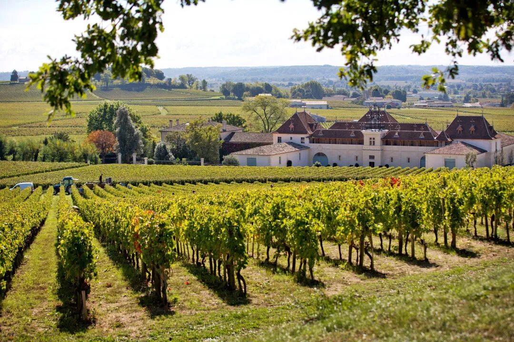

# 无标题

**链接地址:** http://mp.weixin.qq.com/s?__biz=MzIyMzU4OTc0MQ==&mid=2247485689&idx=1&sn=b26780890b8ed3c9387a70841fdd8b1f&chksm=e81aacfbdf6d25edf0de9199515c547dbca9848dee620143f093fffa3df48b8266eb117592b2&mpshare=1&scene=2&srcid=05219ABsfSh4FaipduuRbalS&sharer_sharetime=1621549631940&sharer_shareid=be1c8edd6c93eec155a61c876e41d26a#rd
**作者:** 欢迎转发
**获取时间:** 2025/8/28 19:46:56
**图片数量:** 22

---

## 原始HTML内容

<section style="box-sizing: border-box;font-size: 16px;"><section style="box-sizing: border-box;" powered-by="xiumi.us"><section style="display: flex;flex-flow: row nowrap;margin: 10px 0%;box-sizing: border-box;"><section style="display: inline-block;vertical-align: bottom;width: auto;flex: 0 0 auto;align-self: flex-end;min-width: 10%;max-width: 100%;height: auto;border-bottom: 1px solid rgb(255, 164, 30);border-bottom-right-radius: 0px;padding-right: 3px;padding-bottom: 3px;box-sizing: border-box;"><section style="display: inline-block;width: 100%;vertical-align: top;background-color: rgba(255, 164, 30, 0.1);border-width: 0px;box-sizing: border-box;" powered-by="xiumi.us"><section style="color: rgb(255, 164, 30);padding-right: 10px;padding-left: 10px;letter-spacing: 1px;font-size: 12px;box-sizing: border-box;" powered-by="xiumi.us">
<strong style="box-sizing: border-box;">点击蓝字 关注我们</strong>
</section></section></section><section style="display: inline-block;vertical-align: bottom;width: auto;align-self: flex-end;flex: 100 100 0%;box-sizing: border-box;"><section style="text-align: center;font-size: 0px;box-sizing: border-box;" powered-by="xiumi.us"><section style="display: inline-block;width: 100%;height: 15px;vertical-align: top;overflow: hidden;border-style: solid none none solid;border-width: 1px;border-color: rgb(255, 164, 30);padding-top: 3px;padding-left: 3px;box-sizing: border-box;"><section style="display: inline-block;width: 100%;height: 22px;vertical-align: top;overflow: hidden;background-color: rgba(255, 164, 30, 0.1);box-sizing: border-box;" powered-by="xiumi.us"><section><svg viewBox="0 0 1 1" style="float:left;line-height:0;width:0;vertical-align:top;"></svg></section></section></section></section></section></section></section><section style="box-sizing: border-box;" powered-by="xiumi.us">
 
</section><section style="text-align: right;justify-content: flex-end;margin-top: 10px;margin-right: 0%;margin-left: 0%;box-sizing: border-box;" powered-by="xiumi.us"><section style="display: inline-block;width: auto;vertical-align: top;min-width: 10%;max-width: 100%;height: auto;background-color: rgb(255, 164, 30);padding: 5px 10px;border-width: 0px;box-sizing: border-box;"><section style="text-align: justify;color: rgb(255, 255, 255);font-size: 14px;box-sizing: border-box;" powered-by="xiumi.us">
<strong style="box-sizing: border-box;">特别专题《金声玉振，羽化成蝶》</strong>
</section></section></section><section style="display: inline-block;width: 100%;vertical-align: top;border-left: 2px none rgb(195, 163, 142);border-bottom-left-radius: 0px;background-color: rgba(255, 213, 195, 0);padding: 10px;border-right: 2px solid rgb(255, 164, 30);border-top-right-radius: 0px;box-sizing: border-box;" powered-by="xiumi.us"><section style="text-align: center;margin-top: 10px;margin-bottom: 10px;box-sizing: border-box;" powered-by="xiumi.us"><section style="max-width: 100%;vertical-align: middle;display: inline-block;line-height: 0;box-sizing: border-box;"></section></section></section><section style="text-align: right;justify-content: flex-end;margin-right: 0%;margin-bottom: 10px;margin-left: 0%;font-size: 0px;box-sizing: border-box;" powered-by="xiumi.us"><section style="display: inline-block;width: 50%;vertical-align: top;height: auto;line-height: 0;box-sizing: border-box;"><section style="margin-top: 0.5em;margin-bottom: 0.5em;box-sizing: border-box;" powered-by="xiumi.us"><section style="background-color: rgb(255, 164, 30);height: 2px;box-sizing: border-box;"><section><svg viewBox="0 0 1 1" style="float:left;line-height:0;width:0;vertical-align:top;"></svg></section></section></section></section></section><section style="box-sizing: border-box;" powered-by="xiumi.us"><section style="display: flex;flex-flow: row nowrap;margin: -10px 0% 10px;box-sizing: border-box;"><section style="display: inline-block;vertical-align: top;width: auto;flex: 0 0 auto;align-self: flex-start;min-width: 10%;max-width: 100%;height: auto;box-sizing: border-box;"><section style="color: rgb(0, 0, 0);font-size: 12px;box-sizing: border-box;" powered-by="xiumi.us">
&nbsp; &nbsp;专题出品 |&nbsp;加拿大汉嘉酒业&nbsp;
</section></section><section style="display: inline-block;vertical-align: top;width: auto;align-self: flex-start;flex: 100 100 0%;border-width: 0px;box-sizing: border-box;"><section style="margin-top: 0.5em;margin-bottom: 0.5em;box-sizing: border-box;" powered-by="xiumi.us"><section style="background-color: rgba(255, 213, 195, 0);height: 1px;box-sizing: border-box;"><section><svg viewBox="0 0 1 1" style="float:left;line-height:0;width:0;vertical-align:top;"></svg></section></section></section></section></section></section><section style="box-sizing: border-box;" powered-by="xiumi.us">
 
</section><section style="box-sizing: border-box;" powered-by="xiumi.us"><section style="display: flex;flex-flow: row nowrap;margin-top: 15px;margin-right: 0%;margin-left: 0%;box-sizing: border-box;"><section style="display: inline-block;vertical-align: bottom;width: 33%;flex: 0 0 auto;align-self: flex-end;height: auto;border-style: none;border-width: 0px;border-bottom-color: rgb(255, 164, 30);box-sizing: border-box;"><section style="margin-right: 0%;margin-left: 0%;box-sizing: border-box;" powered-by="xiumi.us"><section style="background-color: rgb(255, 164, 30);height: 1px;box-sizing: border-box;"><section><svg viewBox="0 0 1 1" style="float:left;line-height:0;width:0;vertical-align:top;"></svg></section></section></section></section><section style="display: inline-block;vertical-align: bottom;width: auto;align-self: flex-end;flex: 100 100 0%;height: auto;padding-left: 5px;box-sizing: border-box;"><section style="text-align: center;font-size: 0px;margin-right: 0%;margin-bottom: -4px;margin-left: 0%;box-sizing: border-box;" powered-by="xiumi.us"><section style="display: inline-block;width: 100%;height: 9px;vertical-align: top;overflow: hidden;background-color: rgba(255, 164, 30, 0.1);box-sizing: border-box;"><section><svg viewBox="0 0 1 1" style="float:left;line-height:0;width:0;vertical-align:top;"></svg></section></section></section></section></section></section><section style="margin-right: 0%;margin-bottom: 10px;margin-left: 0%;box-sizing: border-box;" powered-by="xiumi.us"><section style="display: inline-block;width: 100%;vertical-align: top;border-left: 1px solid rgb(255, 164, 30);border-bottom-left-radius: 0px;padding-left: 4px;box-sizing: border-box;"><section style="margin-top: 4px;margin-right: 0%;margin-left: 0%;box-sizing: border-box;" powered-by="xiumi.us"><section style="display: inline-block;width: 100%;vertical-align: top;border-left: 7px solid rgba(255, 164, 30, 0.1);border-bottom-left-radius: 0px;padding-top: 10px;padding-left: 15px;box-sizing: border-box;"><section style="display: inline-block;width: 100%;vertical-align: top;border-style: none solid solid none;border-width: 1px;border-color: rgb(255, 164, 30);padding-top: 6px;padding-right: 16px;padding-bottom: 20px;box-sizing: border-box;" powered-by="xiumi.us"><section style="margin-right: 0%;margin-left: 0%;box-sizing: border-box;" powered-by="xiumi.us"><section style="font-size: 15px;color: rgb(111, 83, 49);line-height: 2;letter-spacing: 2px;box-sizing: border-box;">
每年春天的波尔多期酒季都是葡萄酒从业者和爱好者们的一场<strong style="box-sizing: border-box;">狂欢</strong>。

 

虽然今年由于新冠疫情的持续肆虐，往常在波尔多各个酒庄举行得盛大且隆重的<strong style="box-sizing: border-box;">试饮宴会</strong>变成了远程线上小型试品会，但这也没能浇灭葡萄酒爱好者们心中对各大不同产区不同列级的名庄去年的最新产出的<strong style="box-sizing: border-box;">强烈好奇</strong>。

 

尤其像<strong style="box-sizing: border-box;">金钟酒庄（Château Angélus）</strong>这样的波尔多右岸的明星产区圣埃美隆的一级特等A级庄（Premier Grand Cru Classé A - Saint-Emilion）的<strong style="box-sizing: border-box;">正副牌</strong>产出。

 
</section></section><section style="box-sizing: border-box;" powered-by="xiumi.us"><section style="display: flex;flex-flow: row nowrap;margin: 10px 0%;box-sizing: border-box;"><section style="display: inline-block;vertical-align: top;width: auto;flex: 0 0 0%;align-self: stretch;height: auto;background-position: 50% 50%;background-repeat: no-repeat;background-size: 100% 100%;background-attachment: scroll;background-image: url(&quot;https://mmbiz.qpic.cn/mmbiz_png/7CNdqYbqvBI9bfn6LoVPoYLBuQ63T9lldP8nUcdQ85EqHsATVbuDIcN55SQgoFolgMlct9xgkd5lD7SqNISFtw/640?wx_fmt=png&quot;);box-sizing: border-box;"><section style="text-align: center;box-sizing: border-box;" powered-by="xiumi.us"><section style="display: inline-block;width: 15px;height: 15px;vertical-align: top;overflow: hidden;box-sizing: border-box;"><section><svg viewBox="0 0 1 1" style="float:left;line-height:0;width:0;vertical-align:top;"></svg></section></section></section></section><section style="display: inline-block;vertical-align: top;width: auto;flex: 100 100 0%;align-self: stretch;height: auto;box-sizing: border-box;"><section style="display: inline-block;width: 100%;vertical-align: top;border-width: 5px;border-style: solid;border-color: rgb(255, 254, 251);box-shadow: rgba(255, 213, 195, 0) 0px 0px 10px;box-sizing: border-box;" powered-by="xiumi.us"><section style="text-align: center;margin-top: 10px;margin-bottom: 10px;box-sizing: border-box;" powered-by="xiumi.us"><section style="max-width: 100%;vertical-align: middle;display: inline-block;line-height: 0;width: 100%;height: auto;border-width: 0px;box-shadow: rgba(255, 213, 195, 0) 0px 0px 0px;box-sizing: border-box;"></section></section></section></section><section style="display: inline-block;vertical-align: top;width: auto;flex: 0 0 0%;align-self: stretch;height: auto;background-position: 50% 50%;background-repeat: no-repeat;background-size: 100% 100%;background-attachment: scroll;background-image: url(&quot;https://mmbiz.qpic.cn/mmbiz_png/7CNdqYbqvBI9bfn6LoVPoYLBuQ63T9llEVbwHcaTkKFgOHq3sX8JJula06ttTk1cfUlo9Mgykn2C95DGribKY2w/640?wx_fmt=png&quot;);box-sizing: border-box;"><section style="text-align: center;box-sizing: border-box;" powered-by="xiumi.us"><section style="display: inline-block;width: 15px;height: 15px;vertical-align: top;overflow: hidden;box-sizing: border-box;"><section><svg viewBox="0 0 1 1" style="float:left;line-height:0;width:0;vertical-align:top;"></svg></section></section></section></section></section></section><section style="margin-right: 0%;margin-left: 0%;box-sizing: border-box;" powered-by="xiumi.us"><section style="font-size: 15px;color: rgb(111, 83, 49);line-height: 2;letter-spacing: 2px;box-sizing: border-box;">
 

在<strong style="box-sizing: border-box;">5月18日</strong>金钟酒庄发布他们2020年的期酒价格之后不到<strong style="box-sizing: border-box;">24小时之内</strong>成功地与我们的法国供货商完成订货确认的小编终于有时间坐下来和大家好好聊聊这个<strong style="box-sizing: border-box;">汇聚八代人心血、</strong>拥有独特风土和浓厚人文气息的名庄，以及他们一贯品质卓越，优雅醇厚的产出了。

 
</section></section></section></section></section></section></section><section style="box-sizing: border-box;" powered-by="xiumi.us">
 
</section><section style="box-sizing: border-box;" powered-by="xiumi.us">
 
</section><section style="box-sizing: border-box;" powered-by="xiumi.us"><section style="display: flex;flex-flow: row nowrap;margin: 10px 0%;box-sizing: border-box;"><section style="display: inline-block;vertical-align: bottom;width: auto;flex: 0 0 auto;align-self: flex-end;min-width: 10%;max-width: 100%;height: auto;border-bottom: 1px solid rgb(255, 164, 30);border-bottom-right-radius: 0px;padding-bottom: 5px;line-height: 1;letter-spacing: 0px;box-sizing: border-box;"><section style="display: inline-block;width: 100%;vertical-align: top;background-color: rgba(255, 164, 30, 0.1);border-width: 0px;line-height: 1;letter-spacing: 0px;box-sizing: border-box;" powered-by="xiumi.us"><section style="color: rgb(255, 164, 30);padding-right: 10px;padding-left: 10px;letter-spacing: 1px;font-size: 19px;line-height: 1;box-sizing: border-box;" powered-by="xiumi.us">
<strong style="box-sizing: border-box;">01</strong>
</section></section></section><section style="display: inline-block;vertical-align: bottom;width: auto;align-self: flex-end;flex: 100 100 0%;height: auto;padding-left: 5px;box-sizing: border-box;"><section style="margin-right: 0%;margin-bottom: -5px;margin-left: 0%;box-sizing: border-box;" powered-by="xiumi.us"><section style="color: rgb(255, 164, 30);padding-right: 10px;padding-left: 10px;letter-spacing: 1px;line-height: 1;box-sizing: border-box;">
<strong style="box-sizing: border-box;">金钟酒庄的历史</strong>
</section></section><section style="text-align: center;font-size: 0px;box-sizing: border-box;" powered-by="xiumi.us"><section style="display: inline-block;width: 100%;height: 9px;vertical-align: top;overflow: hidden;background-color: rgba(255, 164, 30, 0.1);box-sizing: border-box;"><section><svg viewBox="0 0 1 1" style="float:left;line-height:0;width:0;vertical-align:top;"></svg></section></section></section></section></section></section><section style="box-sizing: border-box;" powered-by="xiumi.us"><section style="display: flex;flex-flow: row nowrap;margin-top: 15px;margin-right: 0%;margin-left: 0%;box-sizing: border-box;"><section style="display: inline-block;vertical-align: bottom;width: 33%;flex: 0 0 auto;align-self: flex-end;height: auto;border-style: none;border-width: 0px;border-bottom-color: rgb(255, 164, 30);box-sizing: border-box;"><section style="margin-right: 0%;margin-left: 0%;box-sizing: border-box;" powered-by="xiumi.us"><section style="background-color: rgb(255, 164, 30);height: 1px;box-sizing: border-box;"><section><svg viewBox="0 0 1 1" style="float:left;line-height:0;width:0;vertical-align:top;"></svg></section></section></section></section><section style="display: inline-block;vertical-align: bottom;width: auto;align-self: flex-end;flex: 100 100 0%;height: auto;padding-left: 5px;box-sizing: border-box;"><section style="text-align: center;font-size: 0px;margin-right: 0%;margin-bottom: -4px;margin-left: 0%;box-sizing: border-box;" powered-by="xiumi.us"><section style="display: inline-block;width: 100%;height: 9px;vertical-align: top;overflow: hidden;background-color: rgba(255, 164, 30, 0.1);box-sizing: border-box;"><section><svg viewBox="0 0 1 1" style="float:left;line-height:0;width:0;vertical-align:top;"></svg></section></section></section></section></section></section><section style="margin-right: 0%;margin-bottom: 10px;margin-left: 0%;box-sizing: border-box;" powered-by="xiumi.us"><section style="display: inline-block;width: 100%;vertical-align: top;border-left: 1px solid rgb(255, 164, 30);border-bottom-left-radius: 0px;padding-left: 4px;box-sizing: border-box;"><section style="margin-top: 4px;margin-right: 0%;margin-left: 0%;box-sizing: border-box;" powered-by="xiumi.us"><section style="display: inline-block;width: 100%;vertical-align: top;border-left: 7px solid rgba(255, 164, 30, 0.1);border-bottom-left-radius: 0px;padding-top: 10px;padding-left: 15px;box-sizing: border-box;"><section style="display: inline-block;width: 100%;vertical-align: top;border-style: none solid solid none;border-width: 1px;border-color: rgb(255, 164, 30);padding-top: 6px;padding-right: 16px;padding-bottom: 20px;box-sizing: border-box;" powered-by="xiumi.us"><section style="font-size: 14px;color: rgb(111, 83, 49);line-height: 2;letter-spacing: 2px;box-sizing: border-box;" powered-by="xiumi.us">
金钟酒庄位于<strong style="box-sizing: border-box;">波尔多右岸的圣埃米隆产区</strong>，周边地形如同一个阶梯式的圆形剧场，酒庄的葡萄园就位于正南朝向的坡地及坡脚处。这种得天独厚的地理位置具有扩音的效果。

 
</section><section style="box-sizing: border-box;" powered-by="xiumi.us"><section style="display: flex;flex-flow: row nowrap;margin: 10px 0%;box-sizing: border-box;"><section style="display: inline-block;vertical-align: top;width: auto;flex: 0 0 0%;align-self: stretch;height: auto;background-position: 50% 50%;background-repeat: no-repeat;background-size: 100% 100%;background-attachment: scroll;background-image: url(&quot;https://mmbiz.qpic.cn/mmbiz_png/7CNdqYbqvBI9bfn6LoVPoYLBuQ63T9lldP8nUcdQ85EqHsATVbuDIcN55SQgoFolgMlct9xgkd5lD7SqNISFtw/640?wx_fmt=png&quot;);box-sizing: border-box;"><section style="text-align: center;box-sizing: border-box;" powered-by="xiumi.us"><section style="display: inline-block;width: 15px;height: 15px;vertical-align: top;overflow: hidden;box-sizing: border-box;"><section><svg viewBox="0 0 1 1" style="float:left;line-height:0;width:0;vertical-align:top;"></svg></section></section></section></section><section style="display: inline-block;vertical-align: top;width: auto;flex: 100 100 0%;align-self: stretch;height: auto;box-sizing: border-box;"><section style="display: inline-block;width: 100%;vertical-align: top;border-width: 5px;border-style: solid;border-color: rgb(255, 254, 251);box-shadow: rgba(255, 213, 195, 0) 0px 0px 10px;box-sizing: border-box;" powered-by="xiumi.us"><section style="text-align: center;margin-top: 10px;margin-bottom: 10px;box-sizing: border-box;" powered-by="xiumi.us"><section style="max-width: 100%;vertical-align: middle;display: inline-block;line-height: 0;box-shadow: rgb(0, 0, 0) 0px 0px 0px;box-sizing: border-box;"></section></section></section></section><section style="display: inline-block;vertical-align: top;width: auto;flex: 0 0 0%;align-self: stretch;height: auto;background-position: 50% 50%;background-repeat: no-repeat;background-size: 100% 100%;background-attachment: scroll;background-image: url(&quot;https://mmbiz.qpic.cn/mmbiz_png/7CNdqYbqvBI9bfn6LoVPoYLBuQ63T9llEVbwHcaTkKFgOHq3sX8JJula06ttTk1cfUlo9Mgykn2C95DGribKY2w/640?wx_fmt=png&quot;);box-sizing: border-box;"><section style="text-align: center;box-sizing: border-box;" powered-by="xiumi.us"><section style="display: inline-block;width: 15px;height: 15px;vertical-align: top;overflow: hidden;box-sizing: border-box;"><section><svg viewBox="0 0 1 1" style="float:left;line-height:0;width:0;vertical-align:top;"></svg></section></section></section></section></section></section><section style="font-size: 14px;color: rgb(111, 83, 49);line-height: 2;letter-spacing: 2px;box-sizing: border-box;" powered-by="xiumi.us">
 

每日早、中、晚，位于高处的三座圣埃米隆教堂都会敲起钟声，在葡萄园和村庄中生活工作的人们听到钟声，都会停下来<strong style="box-sizing: border-box;">冥思祷告</strong>片刻。

 

金钟酒庄的名字就源于每日三次的<strong style="box-sizing: border-box;">三钟经祷告</strong>，而自诞生伊始就<strong style="box-sizing: border-box;">印在酒标上的大钟</strong>则象征着这一起源以及祷告的时刻。

 
</section><section style="box-sizing: border-box;" powered-by="xiumi.us"><section style="display: flex;flex-flow: row nowrap;margin: 10px 0%;box-sizing: border-box;"><section style="display: inline-block;vertical-align: top;width: auto;flex: 0 0 0%;align-self: stretch;height: auto;background-position: 50% 50%;background-repeat: no-repeat;background-size: 100% 100%;background-attachment: scroll;background-image: url(&quot;https://mmbiz.qpic.cn/mmbiz_png/7CNdqYbqvBI9bfn6LoVPoYLBuQ63T9lldP8nUcdQ85EqHsATVbuDIcN55SQgoFolgMlct9xgkd5lD7SqNISFtw/640?wx_fmt=png&quot;);box-sizing: border-box;"><section style="text-align: center;box-sizing: border-box;" powered-by="xiumi.us"><section style="display: inline-block;width: 15px;height: 15px;vertical-align: top;overflow: hidden;box-sizing: border-box;"><section><svg viewBox="0 0 1 1" style="float:left;line-height:0;width:0;vertical-align:top;"></svg></section></section></section></section><section style="display: inline-block;vertical-align: top;width: auto;flex: 100 100 0%;align-self: stretch;height: auto;box-sizing: border-box;"><section style="display: inline-block;width: 100%;vertical-align: top;border-width: 5px;border-style: solid;border-color: rgb(255, 254, 251);box-shadow: rgba(255, 213, 195, 0) 0px 0px 10px;box-sizing: border-box;" powered-by="xiumi.us"><section style="text-align: center;margin-top: 10px;margin-bottom: 10px;box-sizing: border-box;" powered-by="xiumi.us"><section style="max-width: 100%;vertical-align: middle;display: inline-block;line-height: 0;box-sizing: border-box;"></section></section></section></section><section style="display: inline-block;vertical-align: top;width: auto;flex: 0 0 0%;align-self: stretch;height: auto;background-position: 50% 50%;background-repeat: no-repeat;background-size: 100% 100%;background-attachment: scroll;background-image: url(&quot;https://mmbiz.qpic.cn/mmbiz_png/7CNdqYbqvBI9bfn6LoVPoYLBuQ63T9llEVbwHcaTkKFgOHq3sX8JJula06ttTk1cfUlo9Mgykn2C95DGribKY2w/640?wx_fmt=png&quot;);box-sizing: border-box;"><section style="text-align: center;box-sizing: border-box;" powered-by="xiumi.us"><section style="display: inline-block;width: 15px;height: 15px;vertical-align: top;overflow: hidden;box-sizing: border-box;"><section><svg viewBox="0 0 1 1" style="float:left;line-height:0;width:0;vertical-align:top;"></svg></section></section></section></section></section></section><section style="font-size: 14px;color: rgb(111, 83, 49);line-height: 2;letter-spacing: 2px;box-sizing: border-box;" powered-by="xiumi.us">
 

而这祷告的瞬间被法国著名巴比松派画家<strong style="box-sizing: border-box;">让-弗朗索瓦·米勒</strong>以不朽写实主义名作<strong style="box-sizing: border-box;">《晚祷》</strong>幻化为永恒，今天陈列于奥赛博物馆。作品的法语原名即为“Angélus”。

 

可可·香奈儿曾说：<strong style="box-sizing: border-box;">“时尚稍纵即逝，唯有风格永存。”</strong>金钟酒庄有着自己独有的风格，那就是大胆地运用不同种类的葡萄调配与卓越风土之间的联姻。

 

圣埃美隆南坡的风土特质与<strong style="box-sizing: border-box;">高比例的品丽珠</strong>携手缔造出其独一无二的风格：饱满、浓郁、优雅、经典、纯正、清新并具有<strong style="box-sizing: border-box;">极强的陈年潜力</strong>。

 

金钟酒庄秉着对品质和特性坚持不懈的追求，于1955年圣埃米隆产区的首轮评级中被评定为<strong style="box-sizing: border-box;">“特级酒庄（Grand Cru Classé）”</strong>，并在2012年成功地升级为圣埃米隆产区的最高级别——<strong style="box-sizing: border-box;">特一级A等酒庄（1er Grand Cru Classé A）</strong>。

 
</section></section></section></section></section></section><section style="box-sizing: border-box;" powered-by="xiumi.us">
 
</section><section style="box-sizing: border-box;" powered-by="xiumi.us">
 
</section><section style="box-sizing: border-box;" powered-by="xiumi.us"><section style="display: flex;flex-flow: row nowrap;margin: 10px 0%;box-sizing: border-box;"><section style="display: inline-block;vertical-align: bottom;width: auto;flex: 0 0 auto;align-self: flex-end;min-width: 10%;max-width: 100%;height: auto;border-bottom: 1px solid rgb(255, 164, 30);border-bottom-right-radius: 0px;padding-bottom: 5px;line-height: 1;letter-spacing: 0px;box-sizing: border-box;"><section style="display: inline-block;width: 100%;vertical-align: top;background-color: rgba(255, 164, 30, 0.1);border-width: 0px;line-height: 1;letter-spacing: 0px;box-sizing: border-box;" powered-by="xiumi.us"><section style="color: rgb(255, 164, 30);padding-right: 10px;padding-left: 10px;letter-spacing: 1px;font-size: 19px;line-height: 1;box-sizing: border-box;" powered-by="xiumi.us">
<strong style="box-sizing: border-box;">02</strong>
</section></section></section><section style="display: inline-block;vertical-align: bottom;width: auto;align-self: flex-end;flex: 100 100 0%;height: auto;padding-left: 5px;box-sizing: border-box;"><section style="margin-right: 0%;margin-bottom: -5px;margin-left: 0%;box-sizing: border-box;" powered-by="xiumi.us"><section style="color: rgb(255, 164, 30);padding-right: 10px;padding-left: 10px;letter-spacing: 1px;line-height: 1;box-sizing: border-box;">
<strong style="box-sizing: border-box;">2020年份期酒 LE SUBLIME 羽化成蝶</strong>
</section></section><section style="text-align: center;font-size: 0px;box-sizing: border-box;" powered-by="xiumi.us"><section style="display: inline-block;width: 100%;height: 9px;vertical-align: top;overflow: hidden;background-color: rgba(255, 164, 30, 0.1);box-sizing: border-box;"><section><svg viewBox="0 0 1 1" style="float:left;line-height:0;width:0;vertical-align:top;"></svg></section></section></section></section></section></section><section style="box-sizing: border-box;" powered-by="xiumi.us"><section style="display: flex;flex-flow: row nowrap;margin-top: 15px;margin-right: 0%;margin-left: 0%;box-sizing: border-box;"><section style="display: inline-block;vertical-align: bottom;width: 33%;flex: 0 0 auto;align-self: flex-end;height: auto;border-style: none;border-width: 0px;border-bottom-color: rgb(255, 164, 30);box-sizing: border-box;"><section style="margin-right: 0%;margin-left: 0%;box-sizing: border-box;" powered-by="xiumi.us"><section style="background-color: rgb(255, 164, 30);height: 1px;box-sizing: border-box;"><section><svg viewBox="0 0 1 1" style="float:left;line-height:0;width:0;vertical-align:top;"></svg></section></section></section></section><section style="display: inline-block;vertical-align: bottom;width: auto;align-self: flex-end;flex: 100 100 0%;height: auto;padding-left: 5px;box-sizing: border-box;"><section style="text-align: center;font-size: 0px;margin-right: 0%;margin-bottom: -4px;margin-left: 0%;box-sizing: border-box;" powered-by="xiumi.us"><section style="display: inline-block;width: 100%;height: 9px;vertical-align: top;overflow: hidden;background-color: rgba(255, 164, 30, 0.1);box-sizing: border-box;"><section><svg viewBox="0 0 1 1" style="float:left;line-height:0;width:0;vertical-align:top;"></svg></section></section></section></section></section></section><section style="margin-right: 0%;margin-bottom: 10px;margin-left: 0%;box-sizing: border-box;" powered-by="xiumi.us"><section style="display: inline-block;width: 100%;vertical-align: top;border-left: 1px solid rgb(255, 164, 30);border-bottom-left-radius: 0px;padding-left: 4px;box-sizing: border-box;"><section style="margin-top: 4px;margin-right: 0%;margin-left: 0%;box-sizing: border-box;" powered-by="xiumi.us"><section style="display: inline-block;width: 100%;vertical-align: top;border-left: 7px solid rgba(255, 164, 30, 0.1);border-bottom-left-radius: 0px;padding-top: 10px;padding-left: 15px;box-sizing: border-box;"><section style="display: inline-block;width: 100%;vertical-align: top;border-style: none solid solid none;border-width: 1px;border-color: rgb(255, 164, 30);padding-top: 6px;padding-right: 16px;padding-bottom: 20px;box-sizing: border-box;" powered-by="xiumi.us"><section style="text-align: center;margin-top: 10px;margin-bottom: 10px;box-sizing: border-box;" powered-by="xiumi.us"><section style="opacity: 0.5;display: none;box-sizing: border-box;"><section style="width: 0px;margin-right: auto;margin-left: auto;border-top: 6px solid black;border-left: 6px solid transparent;border-right: 6px solid transparent;box-sizing: border-box;"><section><svg viewBox="0 0 1 1" style="float:left;line-height:0;width:0;vertical-align:top;"></svg></section></section></section><section style="width: 100%;background-color: rgb(0, 0, 0);line-height: 0;box-sizing: border-box;"><section style="width: 100%;transform: rotate(0deg);height: 100%;box-sizing: border-box;">&nbsp;<section style="top: 0px;left: 0px;width: 100%;height: 40%;box-sizing: border-box;"><section><svg viewBox="0 0 1 1" style="float:left;line-height:0;width:0;vertical-align:top;"></svg></section></section></section></section></section><section style="box-sizing: border-box;" powered-by="xiumi.us">
<iframe class="video_iframe rich_pages" data-vidtype="2" data-mpvid="wxv_1876851343038939139" data-cover="http%3A%2F%2Fmmbiz.qpic.cn%2Fmmbiz_jpg%2F7CNdqYbqvBJx3W63VnauLpGRqrchoS9tjyWMg1eiaYXFMNDOSLJORcRNAWgGc7PQhZxYBZZ7qoFg3vO2Tw1qEYA%2F0%3Fwx_fmt%3Djpeg" allowfullscreen="" frameborder="0" data-ratio="1.7777777777777777" data-w="1920" data-src="https://mp.weixin.qq.com/mp/readtemplate?t=pages/video_player_tmpl&amp;action=mpvideo&amp;auto=0&amp;vid=wxv_1876851343038939139"></iframe>

 
</section><section style="font-size: 14px;color: rgb(111, 83, 49);line-height: 2;letter-spacing: 2px;box-sizing: border-box;" powered-by="xiumi.us">
2020这个年份酒丰富多样、完整无缺，好似两个出色前身，既于2018 Le Phenix凤凰和2019 Le Flamboyant璀璨组成了一个<strong style="box-sizing: border-box;">完美三部曲</strong>，更是一段充满魔幻色彩之时光的结晶，一个绝佳的收官。

 

冬春两季的降水量很大，土壤因此储备了充足的水分，让葡萄园在这年余下的时间里一直<strong style="box-sizing: border-box;">维持了平衡的状态</strong>。这年虽然高温，却没有遭遇滚滚热浪。

 
</section><section style="text-align: center;margin-top: 10px;margin-bottom: 10px;box-sizing: border-box;" powered-by="xiumi.us"><section style="max-width: 100%;vertical-align: middle;display: inline-block;line-height: 0;width: 100%;height: auto;box-sizing: border-box;"></section></section><section style="text-align: center;font-size: 12px;color: rgb(179, 179, 179);box-sizing: border-box;" powered-by="xiumi.us">
（点击放大了解更多信息）
</section><section style="font-size: 14px;color: rgb(111, 83, 49);line-height: 2;letter-spacing: 2px;box-sizing: border-box;" powered-by="xiumi.us">
 

本年份最为特殊之处在于一段长于往年的<strong style="box-sizing: border-box;">干旱期</strong>，然而，优质的土壤（粘土、石灰岩）及其在冬季储水的能力帮助葡萄园达到了一种最佳的平衡状态。

 

长达两个半月的夏季为葡萄藤的成熟期提供了<strong style="box-sizing: border-box;">最为优秀的条件</strong>，孕育出的葡萄<strong style="box-sizing: border-box;">健康、平衡，含丰富的多酚类物质，成熟度高</strong>。

 

虽然先在优质的美乐品种身上看到一种稍稍强势的状态，然而，如往常一样，在陈酿数星期之后，品丽珠给我们带来<strong style="box-sizing: border-box;">连连惊喜</strong>，其密度和质感均达到<strong style="box-sizing: border-box;">最顶级水准</strong>。

 
</section></section></section></section></section></section><section style="box-sizing: border-box;" powered-by="xiumi.us">
 
</section><section style="box-sizing: border-box;" powered-by="xiumi.us">
 
</section><section style="box-sizing: border-box;" powered-by="xiumi.us"><section style="display: flex;flex-flow: row nowrap;margin: 10px 0%;box-sizing: border-box;"><section style="display: inline-block;vertical-align: bottom;width: auto;flex: 0 0 auto;align-self: flex-end;min-width: 10%;max-width: 100%;height: auto;border-bottom: 1px solid rgb(255, 164, 30);border-bottom-right-radius: 0px;padding-bottom: 5px;line-height: 1;letter-spacing: 0px;box-sizing: border-box;"><section style="display: inline-block;width: 100%;vertical-align: top;background-color: rgba(255, 164, 30, 0.1);border-width: 0px;line-height: 1;letter-spacing: 0px;box-sizing: border-box;" powered-by="xiumi.us"><section style="color: rgb(255, 164, 30);padding-right: 10px;padding-left: 10px;letter-spacing: 1px;font-size: 19px;line-height: 1;box-sizing: border-box;" powered-by="xiumi.us">
<strong style="box-sizing: border-box;">03</strong>
</section></section></section><section style="display: inline-block;vertical-align: bottom;width: auto;align-self: flex-end;flex: 100 100 0%;height: auto;padding-left: 5px;box-sizing: border-box;"><section style="margin-right: 0%;margin-bottom: -5px;margin-left: 0%;box-sizing: border-box;" powered-by="xiumi.us"><section style="color: rgb(255, 164, 30);padding-right: 10px;padding-left: 10px;letter-spacing: 1px;line-height: 1;box-sizing: border-box;">
<strong style="box-sizing: border-box;">酒款介绍</strong>
</section></section><section style="text-align: center;font-size: 0px;box-sizing: border-box;" powered-by="xiumi.us"><section style="display: inline-block;width: 100%;height: 9px;vertical-align: top;overflow: hidden;background-color: rgba(255, 164, 30, 0.1);box-sizing: border-box;"><section><svg viewBox="0 0 1 1" style="float:left;line-height:0;width:0;vertical-align:top;"></svg></section></section></section></section></section></section><section style="box-sizing: border-box;" powered-by="xiumi.us"><section style="display: flex;flex-flow: row nowrap;margin-top: 15px;margin-right: 0%;margin-left: 0%;box-sizing: border-box;"><section style="display: inline-block;vertical-align: bottom;width: 33%;flex: 0 0 auto;align-self: flex-end;height: auto;border-style: none;border-width: 0px;border-bottom-color: rgb(255, 164, 30);box-sizing: border-box;"><section style="margin-right: 0%;margin-left: 0%;box-sizing: border-box;" powered-by="xiumi.us"><section style="background-color: rgb(255, 164, 30);height: 1px;box-sizing: border-box;"><section><svg viewBox="0 0 1 1" style="float:left;line-height:0;width:0;vertical-align:top;"></svg></section></section></section></section><section style="display: inline-block;vertical-align: bottom;width: auto;align-self: flex-end;flex: 100 100 0%;height: auto;padding-left: 5px;box-sizing: border-box;"><section style="text-align: center;font-size: 0px;margin-right: 0%;margin-bottom: -4px;margin-left: 0%;box-sizing: border-box;" powered-by="xiumi.us"><section style="display: inline-block;width: 100%;height: 9px;vertical-align: top;overflow: hidden;background-color: rgba(255, 164, 30, 0.1);box-sizing: border-box;"><section><svg viewBox="0 0 1 1" style="float:left;line-height:0;width:0;vertical-align:top;"></svg></section></section></section></section></section></section><section style="margin-right: 0%;margin-bottom: 10px;margin-left: 0%;box-sizing: border-box;" powered-by="xiumi.us"><section style="display: inline-block;width: 100%;vertical-align: top;border-left: 1px solid rgb(255, 164, 30);border-bottom-left-radius: 0px;padding-left: 4px;box-sizing: border-box;"><section style="margin-top: 4px;margin-right: 0%;margin-left: 0%;box-sizing: border-box;" powered-by="xiumi.us"><section style="display: inline-block;width: 100%;vertical-align: top;border-left: 7px solid rgba(255, 164, 30, 0.1);border-bottom-left-radius: 0px;padding-top: 10px;padding-left: 15px;box-sizing: border-box;"><section style="display: inline-block;width: 100%;vertical-align: top;border-style: none solid solid none;border-width: 1px;border-color: rgb(255, 164, 30);padding-top: 6px;padding-right: 16px;padding-bottom: 20px;box-sizing: border-box;" powered-by="xiumi.us"><section style="font-size: 15px;color: rgb(111, 83, 49);line-height: 1.8;letter-spacing: 1.5px;box-sizing: border-box;" powered-by="xiumi.us">
<strong style="box-sizing: border-box;">CHÂTEAU ANGÉLUS&nbsp;&nbsp;2020</strong>

<strong style="box-sizing: border-box;">2020年份金钟酒庄</strong>

 

Saint-Emilion Premier Grand Cru Classé « A »

圣埃米隆一级A等酒庄

 

詹姆斯·萨克林（JAMES SUCKLING）评分: 98 - 99分

《醇鉴Decanter》：97分

 
</section><section style="margin-right: 0%;margin-bottom: 10px;margin-left: 0%;box-sizing: border-box;" powered-by="xiumi.us"><section style="display: inline-block;width: 100%;vertical-align: top;padding-left: 8px;box-sizing: border-box;"><section style="margin-right: 0%;margin-bottom: -20px;margin-left: 0%;box-sizing: border-box;" powered-by="xiumi.us"><section style="display: inline-block;width: 100%;vertical-align: top;background-color: rgba(255, 213, 195, 0);padding-bottom: 10px;border-width: 0px;box-sizing: border-box;"><section style="margin-right: 0%;margin-left: 0%;box-sizing: border-box;" powered-by="xiumi.us"><section style="display: inline-block;width: 100%;vertical-align: top;padding: 10px;box-sizing: border-box;"><section style="box-sizing: border-box;" powered-by="xiumi.us"><section style="display: inline-block;vertical-align: top;width: 40%;border-style: solid;border-width: 0px;border-color: rgb(213, 181, 113);padding-right: 6px;height: auto;box-sizing: border-box;"><section style="text-align: center;margin-top: 10px;margin-bottom: 10px;box-sizing: border-box;" powered-by="xiumi.us"><section style="max-width: 100%;vertical-align: middle;display: inline-block;line-height: 0;box-sizing: border-box;"></section></section></section><section style="display: inline-block;vertical-align: top;width: 60%;height: auto;box-sizing: border-box;"><section style="font-size: 12px;box-sizing: border-box;" powered-by="xiumi.us">
葡萄酒质感稠密，明亮璀璨，颜色极深，近乎黑色，泛着紫色光泽，这是葡萄达到完美成熟度并获得最佳pH值的表现。轻嗅一下，酒中释放出多汁黑果、野樱桃和黑莓的浓郁香气。随后，如牡丹和紫罗兰一般的优雅花香飘然而出。单宁精致，构建出一种持久、圆润又丰满的结构感。口感在一种清爽与和谐的印象中不断延展。这一年份拥有一种极为罕见的优雅感，由史诗一般的美乐和个性十足的品丽珠调配而得的成果成功攀至纯和精准的峰顶。

 

<strong style="box-sizing: border-box;">调配比例：60%美乐、40%品丽珠</strong>
</section></section></section></section></section></section></section></section></section></section></section></section></section></section><section style="box-sizing: border-box;" powered-by="xiumi.us">
 
</section><section style="box-sizing: border-box;" powered-by="xiumi.us"><section style="display: flex;flex-flow: row nowrap;margin-top: 15px;margin-right: 0%;margin-left: 0%;box-sizing: border-box;"><section style="display: inline-block;vertical-align: bottom;width: 33%;flex: 0 0 auto;align-self: flex-end;height: auto;border-style: none;border-width: 0px;border-bottom-color: rgb(255, 164, 30);box-sizing: border-box;"><section style="margin-right: 0%;margin-left: 0%;box-sizing: border-box;" powered-by="xiumi.us"><section style="background-color: rgb(255, 164, 30);height: 1px;box-sizing: border-box;"><section><svg viewBox="0 0 1 1" style="float:left;line-height:0;width:0;vertical-align:top;"></svg></section></section></section></section><section style="display: inline-block;vertical-align: bottom;width: auto;align-self: flex-end;flex: 100 100 0%;height: auto;padding-left: 5px;box-sizing: border-box;"><section style="text-align: center;font-size: 0px;margin-right: 0%;margin-bottom: -4px;margin-left: 0%;box-sizing: border-box;" powered-by="xiumi.us"><section style="display: inline-block;width: 100%;height: 9px;vertical-align: top;overflow: hidden;background-color: rgba(255, 164, 30, 0.1);box-sizing: border-box;"><section><svg viewBox="0 0 1 1" style="float:left;line-height:0;width:0;vertical-align:top;"></svg></section></section></section></section></section></section><section style="margin-right: 0%;margin-bottom: 10px;margin-left: 0%;box-sizing: border-box;" powered-by="xiumi.us"><section style="display: inline-block;width: 100%;vertical-align: top;border-left: 1px solid rgb(255, 164, 30);border-bottom-left-radius: 0px;padding-left: 4px;box-sizing: border-box;"><section style="margin-top: 4px;margin-right: 0%;margin-left: 0%;box-sizing: border-box;" powered-by="xiumi.us"><section style="display: inline-block;width: 100%;vertical-align: top;border-left: 7px solid rgba(255, 164, 30, 0.1);border-bottom-left-radius: 0px;padding-top: 10px;padding-left: 15px;box-sizing: border-box;"><section style="display: inline-block;width: 100%;vertical-align: top;border-style: none solid solid none;border-width: 1px;border-color: rgb(255, 164, 30);padding-top: 6px;padding-right: 16px;padding-bottom: 20px;box-sizing: border-box;" powered-by="xiumi.us"><section style="font-size: 15px;color: rgb(111, 83, 49);line-height: 1.8;letter-spacing: 1.5px;box-sizing: border-box;" powered-by="xiumi.us">
<strong style="box-sizing: border-box;">LE CARILLON&nbsp; D'ANGÉLUS&nbsp;2020</strong>

<strong style="box-sizing: border-box;">2020年份小金钟</strong>

 

Saint-Emilion

圣埃米隆

 

詹姆斯·萨克林（JAMES SUCKLING）评分: 94 - 95分

 
</section><section style="margin-right: 0%;margin-bottom: 10px;margin-left: 0%;box-sizing: border-box;" powered-by="xiumi.us"><section style="display: inline-block;width: 100%;vertical-align: top;padding-left: 8px;box-sizing: border-box;"><section style="margin-right: 0%;margin-bottom: -20px;margin-left: 0%;box-sizing: border-box;" powered-by="xiumi.us"><section style="display: inline-block;width: 100%;vertical-align: top;background-color: rgba(255, 213, 195, 0);padding-bottom: 10px;border-width: 0px;box-sizing: border-box;"><section style="margin-right: 0%;margin-left: 0%;box-sizing: border-box;" powered-by="xiumi.us"><section style="display: inline-block;width: 100%;vertical-align: top;padding: 10px;box-sizing: border-box;"><section style="box-sizing: border-box;" powered-by="xiumi.us"><section style="display: inline-block;vertical-align: top;width: 40%;border-style: solid;border-width: 0px;border-color: rgb(213, 181, 113);padding-right: 6px;height: auto;box-sizing: border-box;"><section style="text-align: center;margin-top: 10px;margin-bottom: 10px;box-sizing: border-box;" powered-by="xiumi.us"><section style="max-width: 100%;vertical-align: middle;display: inline-block;line-height: 0;box-sizing: border-box;"></section></section></section><section style="display: inline-block;vertical-align: top;width: 60%;height: auto;box-sizing: border-box;"><section style="font-size: 12px;box-sizing: border-box;" powered-by="xiumi.us">
 

 

 

葡萄酒展现出一种深邃、明亮的红宝石色。品鉴时，野生小红果的香气与樱桃核香混合在一起，胡椒和香料的香调紧随而至。口中，单宁美味、柔顺，带着一丝酸感，在收尾时，留下一道久久不散又深入人心的风味。

 

<strong style="box-sizing: border-box;">调配比例：90%美乐、10%品丽珠</strong>

 
</section></section></section></section></section></section></section></section></section></section></section></section></section></section><section style="box-sizing: border-box;" powered-by="xiumi.us">
 
</section><section style="box-sizing: border-box;" powered-by="xiumi.us">
 
</section><section style="box-sizing: border-box;" powered-by="xiumi.us"><section style="display: flex;flex-flow: row nowrap;margin: 10px 0%;box-sizing: border-box;"><section style="display: inline-block;vertical-align: bottom;width: auto;flex: 0 0 auto;align-self: flex-end;min-width: 10%;max-width: 100%;height: auto;border-bottom: 1px solid rgb(255, 164, 30);border-bottom-right-radius: 0px;padding-bottom: 5px;line-height: 1;letter-spacing: 0px;box-sizing: border-box;"><section style="display: inline-block;width: 100%;vertical-align: top;background-color: rgba(255, 164, 30, 0.1);border-width: 0px;line-height: 1;letter-spacing: 0px;box-sizing: border-box;" powered-by="xiumi.us"><section style="color: rgb(255, 164, 30);padding-right: 10px;padding-left: 10px;letter-spacing: 1px;font-size: 19px;line-height: 1;box-sizing: border-box;" powered-by="xiumi.us">
<strong style="box-sizing: border-box;">04</strong>
</section></section></section><section style="display: inline-block;vertical-align: bottom;width: auto;align-self: flex-end;flex: 100 100 0%;height: auto;padding-left: 5px;box-sizing: border-box;"><section style="margin-right: 0%;margin-bottom: -5px;margin-left: 0%;box-sizing: border-box;" powered-by="xiumi.us"><section style="color: rgb(255, 164, 30);padding-right: 10px;padding-left: 10px;letter-spacing: 1px;line-height: 1;box-sizing: border-box;">
<strong style="box-sizing: border-box;">汉嘉酒业2020金钟酒庄期酒试品会</strong>
</section></section><section style="text-align: center;font-size: 0px;box-sizing: border-box;" powered-by="xiumi.us"><section style="display: inline-block;width: 100%;height: 9px;vertical-align: top;overflow: hidden;background-color: rgba(255, 164, 30, 0.1);box-sizing: border-box;"><section><svg viewBox="0 0 1 1" style="float:left;line-height:0;width:0;vertical-align:top;"></svg></section></section></section></section></section></section><section style="box-sizing: border-box;" powered-by="xiumi.us"><section style="display: flex;flex-flow: row nowrap;margin-top: 15px;margin-right: 0%;margin-left: 0%;box-sizing: border-box;"><section style="display: inline-block;vertical-align: bottom;width: 33%;flex: 0 0 auto;align-self: flex-end;height: auto;border-style: none;border-width: 0px;border-bottom-color: rgb(255, 164, 30);box-sizing: border-box;"><section style="margin-right: 0%;margin-left: 0%;box-sizing: border-box;" powered-by="xiumi.us"><section style="background-color: rgb(255, 164, 30);height: 1px;box-sizing: border-box;"><section><svg viewBox="0 0 1 1" style="float:left;line-height:0;width:0;vertical-align:top;"></svg></section></section></section></section><section style="display: inline-block;vertical-align: bottom;width: auto;align-self: flex-end;flex: 100 100 0%;height: auto;padding-left: 5px;box-sizing: border-box;"><section style="text-align: center;font-size: 0px;margin-right: 0%;margin-bottom: -4px;margin-left: 0%;box-sizing: border-box;" powered-by="xiumi.us"><section style="display: inline-block;width: 100%;height: 9px;vertical-align: top;overflow: hidden;background-color: rgba(255, 164, 30, 0.1);box-sizing: border-box;"><section><svg viewBox="0 0 1 1" style="float:left;line-height:0;width:0;vertical-align:top;"></svg></section></section></section></section></section></section><section style="margin-right: 0%;margin-bottom: 10px;margin-left: 0%;box-sizing: border-box;" powered-by="xiumi.us"><section style="display: inline-block;width: 100%;vertical-align: top;border-left: 1px solid rgb(255, 164, 30);border-bottom-left-radius: 0px;padding-left: 4px;box-sizing: border-box;"><section style="margin-top: 4px;margin-right: 0%;margin-left: 0%;box-sizing: border-box;" powered-by="xiumi.us"><section style="display: inline-block;width: 100%;vertical-align: top;border-left: 7px solid rgba(255, 164, 30, 0.1);border-bottom-left-radius: 0px;padding-top: 10px;padding-left: 15px;box-sizing: border-box;"><section style="display: inline-block;width: 100%;vertical-align: top;border-style: none solid solid none;border-width: 1px;border-color: rgb(255, 164, 30);padding-top: 6px;padding-right: 16px;padding-bottom: 20px;box-sizing: border-box;" powered-by="xiumi.us"><section style="font-size: 14px;color: rgb(111, 83, 49);line-height: 2;letter-spacing: 2px;box-sizing: border-box;" powered-by="xiumi.us">
在今年3月份收到金钟酒庄的邀请后， 我司于2021年4月28日荣幸地邀请到了所在<strong style="box-sizing: border-box;">AB省最大的连锁酒铺Wine &amp; Beyond</strong>的两位经理和我们一起参加了法国波尔多圣埃美隆产区一级特等酒庄A级之一的金钟酒庄举办地<strong style="box-sizing: border-box;">2020年期酒线下试饮会</strong>。&nbsp;

 

与会期间，两位经理在品尝过2020年的期酒后与法国金钟酒庄的北美区负责人进行了热烈地讨论。

 
</section><section style="box-sizing: border-box;" powered-by="xiumi.us"><section style="display: flex;flex-flow: row nowrap;margin: 10px 0%;box-sizing: border-box;"><section style="display: inline-block;vertical-align: top;width: auto;flex: 0 0 0%;align-self: stretch;height: auto;background-position: 50% 50%;background-repeat: no-repeat;background-size: 100% 100%;background-attachment: scroll;background-image: url(&quot;https://mmbiz.qpic.cn/mmbiz_png/7CNdqYbqvBI9bfn6LoVPoYLBuQ63T9lldP8nUcdQ85EqHsATVbuDIcN55SQgoFolgMlct9xgkd5lD7SqNISFtw/640?wx_fmt=png&quot;);box-sizing: border-box;"><section style="text-align: center;box-sizing: border-box;" powered-by="xiumi.us"><section style="display: inline-block;width: 15px;height: 15px;vertical-align: top;overflow: hidden;box-sizing: border-box;"><section><svg viewBox="0 0 1 1" style="float:left;line-height:0;width:0;vertical-align:top;"></svg></section></section></section></section><section style="display: inline-block;vertical-align: top;width: auto;flex: 100 100 0%;align-self: stretch;height: auto;box-sizing: border-box;"><section style="display: inline-block;width: 100%;vertical-align: top;border-width: 5px;border-style: solid;border-color: rgb(255, 254, 251);box-shadow: rgba(255, 213, 195, 0) 0px 0px 10px;box-sizing: border-box;" powered-by="xiumi.us"><section style="text-align: center;margin-top: 10px;margin-bottom: 10px;box-sizing: border-box;" powered-by="xiumi.us"><section style="max-width: 100%;vertical-align: middle;display: inline-block;line-height: 0;box-sizing: border-box;"></section></section></section></section><section style="display: inline-block;vertical-align: top;width: auto;flex: 0 0 0%;align-self: stretch;height: auto;background-position: 50% 50%;background-repeat: no-repeat;background-size: 100% 100%;background-attachment: scroll;background-image: url(&quot;https://mmbiz.qpic.cn/mmbiz_png/7CNdqYbqvBI9bfn6LoVPoYLBuQ63T9llEVbwHcaTkKFgOHq3sX8JJula06ttTk1cfUlo9Mgykn2C95DGribKY2w/640?wx_fmt=png&quot;);box-sizing: border-box;"><section style="text-align: center;box-sizing: border-box;" powered-by="xiumi.us"><section style="display: inline-block;width: 15px;height: 15px;vertical-align: top;overflow: hidden;box-sizing: border-box;"><section><svg viewBox="0 0 1 1" style="float:left;line-height:0;width:0;vertical-align:top;"></svg></section></section></section></section></section></section><section style="font-size: 14px;color: rgb(111, 83, 49);line-height: 2;letter-spacing: 2px;box-sizing: border-box;" powered-by="xiumi.us">
 

与会的品鉴者们不仅仅为<strong style="box-sizing: border-box;">2020年的大金钟Chateau Angelus</strong>优雅细腻如天鹅绒的单宁、饱满的酒体、平衡的结构和富有层次的余味以及<strong style="box-sizing: border-box;">小金钟Le Carillon d'Angelus</strong>柔和的单宁、精致活泼的风格背后所体现出的高超酿造技艺和对品质的追求所折服，更为金钟酒庄坚守初心的同时与时俱进以低碳环保为理念开始全有机种植并积极促进金钟美酒与各种艺术形式的融合来全方位地提升品酒者的感官体验的<strong style="box-sizing: border-box;">各种创新与尝试</strong>所激赏。

 

与会三方一致赞同在以后将更加<strong style="box-sizing: border-box;">紧密地合作</strong>，将更多金钟酒庄的优秀出产介绍给更多的加拿大葡萄酒爱好者。

 
</section></section></section></section></section></section><section style="box-sizing: border-box;" powered-by="xiumi.us">
 
</section><section style="box-sizing: border-box;" powered-by="xiumi.us">
 
</section><section style="box-sizing: border-box;" powered-by="xiumi.us"><section style="display: flex;flex-flow: row nowrap;margin: 10px 0%;box-sizing: border-box;"><section style="display: inline-block;vertical-align: bottom;width: auto;flex: 0 0 auto;align-self: flex-end;min-width: 10%;max-width: 100%;height: auto;border-bottom: 1px solid rgb(255, 164, 30);border-bottom-right-radius: 0px;padding-bottom: 5px;line-height: 1;letter-spacing: 0px;box-sizing: border-box;"><section style="display: inline-block;width: 100%;vertical-align: top;background-color: rgba(255, 164, 30, 0.1);border-width: 0px;line-height: 1;letter-spacing: 0px;box-sizing: border-box;" powered-by="xiumi.us"><section style="color: rgb(255, 164, 30);padding-right: 10px;padding-left: 10px;letter-spacing: 1px;font-size: 19px;line-height: 1;box-sizing: border-box;" powered-by="xiumi.us">
<strong style="box-sizing: border-box;">05</strong>
</section></section></section><section style="display: inline-block;vertical-align: bottom;width: auto;align-self: flex-end;flex: 100 100 0%;height: auto;padding-left: 5px;box-sizing: border-box;"><section style="margin-right: 0%;margin-bottom: -5px;margin-left: 0%;box-sizing: border-box;" powered-by="xiumi.us"><section style="color: rgb(255, 164, 30);padding-right: 10px;padding-left: 10px;letter-spacing: 1px;line-height: 1;box-sizing: border-box;">
<strong style="box-sizing: border-box;">创新与环保</strong>
</section></section><section style="text-align: center;font-size: 0px;box-sizing: border-box;" powered-by="xiumi.us"><section style="display: inline-block;width: 100%;height: 9px;vertical-align: top;overflow: hidden;background-color: rgba(255, 164, 30, 0.1);box-sizing: border-box;"><section><svg viewBox="0 0 1 1" style="float:left;line-height:0;width:0;vertical-align:top;"></svg></section></section></section></section></section></section><section style="box-sizing: border-box;" powered-by="xiumi.us"><section style="display: flex;flex-flow: row nowrap;margin-top: 15px;margin-right: 0%;margin-left: 0%;box-sizing: border-box;"><section style="display: inline-block;vertical-align: bottom;width: 33%;flex: 0 0 auto;align-self: flex-end;height: auto;border-style: none;border-width: 0px;border-bottom-color: rgb(255, 164, 30);box-sizing: border-box;"><section style="margin-right: 0%;margin-left: 0%;box-sizing: border-box;" powered-by="xiumi.us"><section style="background-color: rgb(255, 164, 30);height: 1px;box-sizing: border-box;"><section><svg viewBox="0 0 1 1" style="float:left;line-height:0;width:0;vertical-align:top;"></svg></section></section></section></section><section style="display: inline-block;vertical-align: bottom;width: auto;align-self: flex-end;flex: 100 100 0%;height: auto;padding-left: 5px;box-sizing: border-box;"><section style="text-align: center;font-size: 0px;margin-right: 0%;margin-bottom: -4px;margin-left: 0%;box-sizing: border-box;" powered-by="xiumi.us"><section style="display: inline-block;width: 100%;height: 9px;vertical-align: top;overflow: hidden;background-color: rgba(255, 164, 30, 0.1);box-sizing: border-box;"><section><svg viewBox="0 0 1 1" style="float:left;line-height:0;width:0;vertical-align:top;"></svg></section></section></section></section></section></section><section style="margin-right: 0%;margin-bottom: 10px;margin-left: 0%;box-sizing: border-box;" powered-by="xiumi.us"><section style="display: inline-block;width: 100%;vertical-align: top;border-left: 1px solid rgb(255, 164, 30);border-bottom-left-radius: 0px;padding-left: 4px;box-sizing: border-box;"><section style="margin-top: 4px;margin-right: 0%;margin-left: 0%;box-sizing: border-box;" powered-by="xiumi.us"><section style="display: inline-block;width: 100%;vertical-align: top;border-left: 7px solid rgba(255, 164, 30, 0.1);border-bottom-left-radius: 0px;padding-top: 10px;padding-left: 15px;box-sizing: border-box;"><section style="display: inline-block;width: 100%;vertical-align: top;border-style: none solid solid none;border-width: 1px;border-color: rgb(255, 164, 30);padding-top: 6px;padding-right: 16px;padding-bottom: 20px;box-sizing: border-box;" powered-by="xiumi.us"><section style="font-size: 14px;color: rgb(111, 83, 49);line-height: 2;letter-spacing: 2px;box-sizing: border-box;" powered-by="xiumi.us">
金钟酒庄从2018年起以<strong style="box-sizing: border-box;">可持续发展的葡萄园</strong>为目标，开始了他们以气候、土壤、水储藏、葡萄树和为葡萄园劳作之人为本的向有机农业转型之路。

 

在金钟，风土就是所有这些因素在达到完美平衡时结出的硕果。维系这一平衡，让葡萄园及其环境<strong style="box-sizing: border-box;">永葆繁荣</strong>，优化资源并促进生物多样性，就是金钟团队的日常工作和使命。

 

2019年，金钟酒庄的新酒窖落成，作为<strong style="box-sizing: border-box;">技术、环保与美学三大领域的结晶</strong>，这一全新酒窖带着绝对现代化的风格，享受着最为顶级的设备。建筑物面积达4400平方米，栖息于一片占地3.3公顷大的土地上，半地下结构，屋顶被植被覆盖。

 
</section><section style="box-sizing: border-box;" powered-by="xiumi.us"><section style="display: flex;flex-flow: row nowrap;margin: 10px 0%;box-sizing: border-box;"><section style="display: inline-block;vertical-align: top;width: auto;flex: 0 0 0%;align-self: stretch;height: auto;background-position: 50% 50%;background-repeat: no-repeat;background-size: 100% 100%;background-attachment: scroll;background-image: url(&quot;https://mmbiz.qpic.cn/mmbiz_png/7CNdqYbqvBI9bfn6LoVPoYLBuQ63T9lldP8nUcdQ85EqHsATVbuDIcN55SQgoFolgMlct9xgkd5lD7SqNISFtw/640?wx_fmt=png&quot;);box-sizing: border-box;"><section style="text-align: center;box-sizing: border-box;" powered-by="xiumi.us"><section style="display: inline-block;width: 15px;height: 15px;vertical-align: top;overflow: hidden;box-sizing: border-box;"><section><svg viewBox="0 0 1 1" style="float:left;line-height:0;width:0;vertical-align:top;"></svg></section></section></section></section><section style="display: inline-block;vertical-align: top;width: auto;flex: 100 100 0%;align-self: stretch;height: auto;box-sizing: border-box;"><section style="display: inline-block;width: 100%;vertical-align: top;border-width: 5px;border-style: solid;border-color: rgb(255, 254, 251);box-shadow: rgba(255, 213, 195, 0) 0px 0px 10px;box-sizing: border-box;" powered-by="xiumi.us"><section style="text-align: center;margin-top: 10px;margin-bottom: 10px;box-sizing: border-box;" powered-by="xiumi.us"><section style="max-width: 100%;vertical-align: middle;display: inline-block;line-height: 0;box-sizing: border-box;"></section></section></section></section><section style="display: inline-block;vertical-align: top;width: auto;flex: 0 0 0%;align-self: stretch;height: auto;background-position: 50% 50%;background-repeat: no-repeat;background-size: 100% 100%;background-attachment: scroll;background-image: url(&quot;https://mmbiz.qpic.cn/mmbiz_png/7CNdqYbqvBI9bfn6LoVPoYLBuQ63T9llEVbwHcaTkKFgOHq3sX8JJula06ttTk1cfUlo9Mgykn2C95DGribKY2w/640?wx_fmt=png&quot;);box-sizing: border-box;"><section style="text-align: center;box-sizing: border-box;" powered-by="xiumi.us"><section style="display: inline-block;width: 15px;height: 15px;vertical-align: top;overflow: hidden;box-sizing: border-box;"><section><svg viewBox="0 0 1 1" style="float:left;line-height:0;width:0;vertical-align:top;"></svg></section></section></section></section></section></section><section style="font-size: 14px;color: rgb(111, 83, 49);line-height: 2;letter-spacing: 2px;box-sizing: border-box;" powered-by="xiumi.us">
 

建筑物内配有<strong style="box-sizing: border-box;">光学分选机</strong>，为葡萄入窖做好万全准备，还有一个<strong style="box-sizing: border-box;">发酵车间</strong>、一个专为苹果酸乳酸发酵服务的酒窖，还有一个陈酿酒窖。

 

未来，还会有一条<strong style="box-sizing: border-box;">灌装和包装线</strong>前来为这些设备锦上添花。发酵车间百分百依靠重力作业，18个倒挂的截顶圆锥体发酵罐带有滑车系统和升举酒罐的系统。

 

<strong style="box-sizing: border-box;">氮气生产中心</strong>时时刻刻均为葡萄酒献上无微不至的保护，无论是在发酵过程中，还是在陈酿期间，都为氧气的含量给予精准把控。

 

<strong style="box-sizing: border-box;">光伏板</strong>能够为新酒窖的运转自供一部分电力。这座建筑物获得了HQE（高环境质量）的英国版，即BREEAM（建筑研究机构环境评估方法）绿色建筑评估体系的认证。
</section><section style="font-size: 12px;color: rgb(111, 83, 49);line-height: 1.8;letter-spacing: 1.5px;box-sizing: border-box;" powered-by="xiumi.us">
 
</section></section></section></section></section></section><section style="box-sizing: border-box;" powered-by="xiumi.us">
 
</section><section style="box-sizing: border-box;" powered-by="xiumi.us">
 
</section><section style="box-sizing: border-box;" powered-by="xiumi.us"><section style="display: flex;flex-flow: row nowrap;margin: 10px 0%;box-sizing: border-box;"><section style="display: inline-block;vertical-align: bottom;width: auto;flex: 0 0 auto;align-self: flex-end;min-width: 10%;max-width: 100%;height: auto;border-bottom: 1px solid rgb(255, 164, 30);border-bottom-right-radius: 0px;padding-bottom: 5px;line-height: 1;letter-spacing: 0px;box-sizing: border-box;"><section style="display: inline-block;width: 100%;vertical-align: top;background-color: rgba(255, 164, 30, 0.1);border-width: 0px;line-height: 1;letter-spacing: 0px;box-sizing: border-box;" powered-by="xiumi.us"><section style="color: rgb(255, 164, 30);padding-right: 10px;padding-left: 10px;letter-spacing: 1px;font-size: 19px;line-height: 1;box-sizing: border-box;" powered-by="xiumi.us">
<strong style="box-sizing: border-box;">06</strong>
</section></section></section><section style="display: inline-block;vertical-align: bottom;width: auto;align-self: flex-end;flex: 100 100 0%;height: auto;padding-left: 5px;box-sizing: border-box;"><section style="margin-right: 0%;margin-bottom: -5px;margin-left: 0%;box-sizing: border-box;" powered-by="xiumi.us"><section style="color: rgb(255, 164, 30);padding-right: 10px;padding-left: 10px;letter-spacing: 1px;line-height: 1;box-sizing: border-box;">
<strong style="box-sizing: border-box;">詹姆斯·邦德的选择</strong>
</section></section><section style="text-align: center;font-size: 0px;box-sizing: border-box;" powered-by="xiumi.us"><section style="display: inline-block;width: 100%;height: 9px;vertical-align: top;overflow: hidden;background-color: rgba(255, 164, 30, 0.1);box-sizing: border-box;"><section><svg viewBox="0 0 1 1" style="float:left;line-height:0;width:0;vertical-align:top;"></svg></section></section></section></section></section></section><section style="box-sizing: border-box;" powered-by="xiumi.us"><section style="display: flex;flex-flow: row nowrap;margin-top: 15px;margin-right: 0%;margin-left: 0%;box-sizing: border-box;"><section style="display: inline-block;vertical-align: bottom;width: 33%;flex: 0 0 auto;align-self: flex-end;height: auto;border-style: none;border-width: 0px;border-bottom-color: rgb(255, 164, 30);box-sizing: border-box;"><section style="margin-right: 0%;margin-left: 0%;box-sizing: border-box;" powered-by="xiumi.us"><section style="background-color: rgb(255, 164, 30);height: 1px;box-sizing: border-box;"><section><svg viewBox="0 0 1 1" style="float:left;line-height:0;width:0;vertical-align:top;"></svg></section></section></section></section><section style="display: inline-block;vertical-align: bottom;width: auto;align-self: flex-end;flex: 100 100 0%;height: auto;padding-left: 5px;box-sizing: border-box;"><section style="text-align: center;font-size: 0px;margin-right: 0%;margin-bottom: -4px;margin-left: 0%;box-sizing: border-box;" powered-by="xiumi.us"><section style="display: inline-block;width: 100%;height: 9px;vertical-align: top;overflow: hidden;background-color: rgba(255, 164, 30, 0.1);box-sizing: border-box;"><section><svg viewBox="0 0 1 1" style="float:left;line-height:0;width:0;vertical-align:top;"></svg></section></section></section></section></section></section><section style="margin-right: 0%;margin-bottom: 10px;margin-left: 0%;box-sizing: border-box;" powered-by="xiumi.us"><section style="display: inline-block;width: 100%;vertical-align: top;border-left: 1px solid rgb(255, 164, 30);border-bottom-left-radius: 0px;padding-left: 4px;box-sizing: border-box;"><section style="margin-top: 4px;margin-right: 0%;margin-left: 0%;box-sizing: border-box;" powered-by="xiumi.us"><section style="display: inline-block;width: 100%;vertical-align: top;border-left: 7px solid rgba(255, 164, 30, 0.1);border-bottom-left-radius: 0px;padding-top: 10px;padding-left: 15px;box-sizing: border-box;"><section style="display: inline-block;width: 100%;vertical-align: top;border-style: none solid solid none;border-width: 1px;border-color: rgb(255, 164, 30);padding-top: 6px;padding-right: 16px;padding-bottom: 20px;box-sizing: border-box;" powered-by="xiumi.us"><section style="font-size: 14px;color: rgb(111, 83, 49);line-height: 2;letter-spacing: 2px;box-sizing: border-box;" powered-by="xiumi.us">
Angélus（金钟）葡萄酒曾在<strong style="box-sizing: border-box;">多部电影</strong>中出现，成为高贵和精致的不二元素。它的独特风格吸引着众多大片的导演：在<strong style="box-sizing: border-box;">《007：大战皇家赌场》</strong>中，詹姆斯·邦德选择了这款美酒来迎接一次决定性的会面（他与他的唯一挚爱Vesper在夜行列车上喝的就是1982年的金钟）。

 
</section><section style="text-align: center;margin-top: 10px;margin-bottom: 10px;box-sizing: border-box;" powered-by="xiumi.us"><section style="max-width: 100%;vertical-align: middle;display: inline-block;line-height: 0;box-sizing: border-box;"></section></section><section style="text-align: center;margin-top: 10px;margin-bottom: 10px;box-sizing: border-box;" powered-by="xiumi.us"><section style="max-width: 100%;vertical-align: middle;display: inline-block;line-height: 0;box-sizing: border-box;"></section></section><section style="font-size: 14px;color: rgb(111, 83, 49);line-height: 2;letter-spacing: 2px;box-sizing: border-box;" powered-by="xiumi.us">
 

而在之后的第24部007电影<strong style="box-sizing: border-box;">《007：幽灵党》</strong>上映时，人们又在影片预告中惊喜地看到，随着新一任“邦女郎”玛德琳袅袅婷婷地步入餐厅，一瓶金钟红酒再次醒目地出现在镜头中，位置在玛德琳路过的一张餐桌上......

 

还有《玫瑰人生》、《与我的园丁对话》、《不朽》等等。Angélus（金钟）曾在<strong style="box-sizing: border-box;">三十多部法国和国际电影</strong>中露面。作为美好相遇、朋友聚会和分享瞬间的中心“人物”，它体现着观众希望在电影中看到的一种强烈的价值观。

 

无论剧情如何，在葡萄园还是在舞台上，我们品尝的都是一种<strong style="box-sizing: border-box;">永恒的典雅</strong>，尽管品尝本身仅延续片刻......

 
</section></section></section></section></section></section><section style="box-sizing: border-box;" powered-by="xiumi.us">
 
</section><section style="box-sizing: border-box;" powered-by="xiumi.us">
 
</section><section style="box-sizing: border-box;" powered-by="xiumi.us"><section style="display: flex;flex-flow: row nowrap;margin: 10px 0%;box-sizing: border-box;"><section style="display: inline-block;vertical-align: bottom;width: auto;flex: 0 0 auto;align-self: flex-end;min-width: 10%;max-width: 100%;height: auto;border-bottom: 1px solid rgb(255, 164, 30);border-bottom-right-radius: 0px;padding-bottom: 5px;line-height: 1;letter-spacing: 0px;box-sizing: border-box;"><section style="display: inline-block;width: 100%;vertical-align: top;background-color: rgba(255, 164, 30, 0.1);border-width: 0px;line-height: 1;letter-spacing: 0px;box-sizing: border-box;" powered-by="xiumi.us"><section style="color: rgb(255, 164, 30);padding-right: 10px;padding-left: 10px;letter-spacing: 1px;font-size: 19px;line-height: 1;box-sizing: border-box;" powered-by="xiumi.us">
<strong style="box-sizing: border-box;">07</strong>
</section></section></section><section style="display: inline-block;vertical-align: bottom;width: auto;align-self: flex-end;flex: 100 100 0%;height: auto;padding-left: 5px;box-sizing: border-box;"><section style="margin-right: 0%;margin-bottom: -5px;margin-left: 0%;box-sizing: border-box;" powered-by="xiumi.us"><section style="color: rgb(255, 164, 30);padding-right: 10px;padding-left: 10px;letter-spacing: 1px;line-height: 1;box-sizing: border-box;">
<strong style="box-sizing: border-box;">金钟美酒给予了音乐家无限的艺术灵感</strong>
</section></section><section style="text-align: center;font-size: 0px;box-sizing: border-box;" powered-by="xiumi.us"><section style="display: inline-block;width: 100%;height: 9px;vertical-align: top;overflow: hidden;background-color: rgba(255, 164, 30, 0.1);box-sizing: border-box;"><section><svg viewBox="0 0 1 1" style="float:left;line-height:0;width:0;vertical-align:top;"></svg></section></section></section></section></section></section><section style="box-sizing: border-box;" powered-by="xiumi.us"><section style="display: flex;flex-flow: row nowrap;margin-top: 15px;margin-right: 0%;margin-left: 0%;box-sizing: border-box;"><section style="display: inline-block;vertical-align: bottom;width: 33%;flex: 0 0 auto;align-self: flex-end;height: auto;border-style: none;border-width: 0px;border-bottom-color: rgb(255, 164, 30);box-sizing: border-box;"><section style="margin-right: 0%;margin-left: 0%;box-sizing: border-box;" powered-by="xiumi.us"><section style="background-color: rgb(255, 164, 30);height: 1px;box-sizing: border-box;"><section><svg viewBox="0 0 1 1" style="float:left;line-height:0;width:0;vertical-align:top;"></svg></section></section></section></section><section style="display: inline-block;vertical-align: bottom;width: auto;align-self: flex-end;flex: 100 100 0%;height: auto;padding-left: 5px;box-sizing: border-box;"><section style="text-align: center;font-size: 0px;margin-right: 0%;margin-bottom: -4px;margin-left: 0%;box-sizing: border-box;" powered-by="xiumi.us"><section style="display: inline-block;width: 100%;height: 9px;vertical-align: top;overflow: hidden;background-color: rgba(255, 164, 30, 0.1);box-sizing: border-box;"><section><svg viewBox="0 0 1 1" style="float:left;line-height:0;width:0;vertical-align:top;"></svg></section></section></section></section></section></section><section style="margin-right: 0%;margin-bottom: 10px;margin-left: 0%;box-sizing: border-box;" powered-by="xiumi.us"><section style="display: inline-block;width: 100%;vertical-align: top;border-left: 1px solid rgb(255, 164, 30);border-bottom-left-radius: 0px;padding-left: 4px;box-sizing: border-box;"><section style="margin-top: 4px;margin-right: 0%;margin-left: 0%;box-sizing: border-box;" powered-by="xiumi.us"><section style="display: inline-block;width: 100%;vertical-align: top;border-left: 7px solid rgba(255, 164, 30, 0.1);border-bottom-left-radius: 0px;padding-top: 10px;padding-left: 15px;box-sizing: border-box;"><section style="display: inline-block;width: 100%;vertical-align: top;border-style: none solid solid none;border-width: 1px;border-color: rgb(255, 164, 30);padding-top: 6px;padding-right: 16px;padding-bottom: 20px;box-sizing: border-box;" powered-by="xiumi.us"><section style="font-size: 12px;color: rgb(111, 83, 49);line-height: 2;letter-spacing: 2px;box-sizing: border-box;" powered-by="xiumi.us">
葡萄酒与艺术有相通之处，二者一同分享着一个<strong style="box-sizing: border-box;">精益求精且充满激情的世界</strong>。所有作品都始于一份灵感的冲动，将寻常事物转化为某种美妙的东西。

 

“金钟”，仅仅说到这个名字就已经唤起钟声在脑中的回响，作为<strong style="box-sizing: border-box;">酒庄的标志</strong>，无论是酒标，还是酒庄钟塔上，金钟随处可见。为表达出这一独特的金钟之声，金钟酒庄特邀著名<strong style="box-sizing: border-box;">爵士钢琴家Yaron Herman</strong>对酒庄的自我风格从听觉上做出诠释。

 

<iframe class="video_iframe rich_pages" data-vidtype="2" data-mpvid="wxv_1876857957859000327" data-cover="http%3A%2F%2Fmmbiz.qpic.cn%2Fmmbiz_jpg%2F7CNdqYbqvBJx3W63VnauLpGRqrchoS9tAlxniaekRaANic6ksalNDPib8bMJhPwr4pGbfX0iaCMhu0UQjoBqcHF1tA%2F0%3Fwx_fmt%3Djpeg" allowfullscreen="" frameborder="0" data-ratio="1.7777777777777777" data-w="1920" data-src="https://mp.weixin.qq.com/mp/readtemplate?t=pages/video_player_tmpl&amp;action=mpvideo&amp;auto=0&amp;vid=wxv_1876857957859000327"></iframe>

 
</section><section style="text-align: center;margin-top: 10px;margin-bottom: 10px;box-sizing: border-box;" powered-by="xiumi.us"><section style="opacity: 0.5;display: none;box-sizing: border-box;"><section style="width: 0px;margin-right: auto;margin-left: auto;border-top: 6px solid black;border-left: 6px solid transparent;border-right: 6px solid transparent;box-sizing: border-box;"><section><svg viewBox="0 0 1 1" style="float:left;line-height:0;width:0;vertical-align:top;"></svg></section></section></section><section style="width: 100%;background-color: rgb(0, 0, 0);line-height: 0;box-sizing: border-box;"><section style="width: 100%;transform: rotate(0deg);height: 100%;box-sizing: border-box;">&nbsp;<section style="top: 0px;left: 0px;width: 100%;height: 40%;box-sizing: border-box;"><section><svg viewBox="0 0 1 1" style="float:left;line-height:0;width:0;vertical-align:top;"></svg></section></section></section></section></section><section style="font-size: 12px;color: rgb(111, 83, 49);line-height: 2;letter-spacing: 2px;box-sizing: border-box;" powered-by="xiumi.us">
 

<strong style="box-sizing: border-box;">与世界级钢琴大师郎朗结缘</strong>

 
</section><section style="box-sizing: border-box;" powered-by="xiumi.us"><section style="display: flex;flex-flow: row nowrap;margin: 10px 0%;box-sizing: border-box;"><section style="display: inline-block;vertical-align: top;width: auto;flex: 0 0 0%;align-self: stretch;height: auto;background-position: 50% 50%;background-repeat: no-repeat;background-size: 100% 100%;background-attachment: scroll;background-image: url(&quot;https://mmbiz.qpic.cn/mmbiz_png/7CNdqYbqvBI9bfn6LoVPoYLBuQ63T9lldP8nUcdQ85EqHsATVbuDIcN55SQgoFolgMlct9xgkd5lD7SqNISFtw/640?wx_fmt=png&quot;);box-sizing: border-box;"><section style="text-align: center;box-sizing: border-box;" powered-by="xiumi.us"><section style="display: inline-block;width: 15px;height: 15px;vertical-align: top;overflow: hidden;box-sizing: border-box;"><section><svg viewBox="0 0 1 1" style="float:left;line-height:0;width:0;vertical-align:top;"></svg></section></section></section></section><section style="display: inline-block;vertical-align: top;width: auto;flex: 100 100 0%;align-self: stretch;height: auto;box-sizing: border-box;"><section style="display: inline-block;width: 100%;vertical-align: top;border-width: 5px;border-style: solid;border-color: rgb(255, 254, 251);box-shadow: rgba(255, 213, 195, 0) 0px 0px 10px;box-sizing: border-box;" powered-by="xiumi.us"><section style="text-align: center;margin-top: 10px;margin-bottom: 10px;box-sizing: border-box;" powered-by="xiumi.us"><section style="max-width: 100%;vertical-align: middle;display: inline-block;line-height: 0;box-sizing: border-box;"></section></section></section></section><section style="display: inline-block;vertical-align: top;width: auto;flex: 0 0 0%;align-self: stretch;height: auto;background-position: 50% 50%;background-repeat: no-repeat;background-size: 100% 100%;background-attachment: scroll;background-image: url(&quot;https://mmbiz.qpic.cn/mmbiz_png/7CNdqYbqvBI9bfn6LoVPoYLBuQ63T9llEVbwHcaTkKFgOHq3sX8JJula06ttTk1cfUlo9Mgykn2C95DGribKY2w/640?wx_fmt=png&quot;);box-sizing: border-box;"><section style="text-align: center;box-sizing: border-box;" powered-by="xiumi.us"><section style="display: inline-block;width: 15px;height: 15px;vertical-align: top;overflow: hidden;box-sizing: border-box;"><section><svg viewBox="0 0 1 1" style="float:left;line-height:0;width:0;vertical-align:top;"></svg></section></section></section></section></section></section><section style="font-size: 12px;color: rgb(111, 83, 49);line-height: 2;letter-spacing: 2px;box-sizing: border-box;" powered-by="xiumi.us">
 

金钟作为合作伙伴为<strong style="box-sizing: border-box;">郎朗</strong>与世界顶级钢琴制造商斯坦威联名款钢琴发布会既郎朗钢琴演奏会举办了盛大的晚宴。

 
</section></section></section></section></section></section><section style="box-sizing: border-box;" powered-by="xiumi.us">
 
</section><section style="box-sizing: border-box;" powered-by="xiumi.us">
 
</section><section style="box-sizing: border-box;" powered-by="xiumi.us"><section style="display: flex;flex-flow: row nowrap;margin: 10px 0%;box-sizing: border-box;"><section style="display: inline-block;vertical-align: bottom;width: auto;flex: 0 0 auto;align-self: flex-end;min-width: 10%;max-width: 100%;height: auto;border-bottom: 1px solid rgb(255, 164, 30);border-bottom-right-radius: 0px;padding-bottom: 5px;line-height: 1;letter-spacing: 0px;box-sizing: border-box;"><section style="display: inline-block;width: 100%;vertical-align: top;background-color: rgba(255, 164, 30, 0.1);border-width: 0px;line-height: 1;letter-spacing: 0px;box-sizing: border-box;" powered-by="xiumi.us"><section style="color: rgb(255, 164, 30);padding-right: 10px;padding-left: 10px;letter-spacing: 1px;font-size: 19px;line-height: 1;box-sizing: border-box;" powered-by="xiumi.us">
<strong style="box-sizing: border-box;">08</strong>
</section></section></section><section style="display: inline-block;vertical-align: bottom;width: auto;align-self: flex-end;flex: 100 100 0%;height: auto;padding-left: 5px;box-sizing: border-box;"><section style="margin-right: 0%;margin-bottom: -5px;margin-left: 0%;box-sizing: border-box;" powered-by="xiumi.us"><section style="color: rgb(255, 164, 30);padding-right: 10px;padding-left: 10px;letter-spacing: 1px;line-height: 1;box-sizing: border-box;">
<strong style="box-sizing: border-box;">美酒与美食的完美组合</strong>
</section></section><section style="text-align: center;font-size: 0px;box-sizing: border-box;" powered-by="xiumi.us"><section style="display: inline-block;width: 100%;height: 9px;vertical-align: top;overflow: hidden;background-color: rgba(255, 164, 30, 0.1);box-sizing: border-box;"><section><svg viewBox="0 0 1 1" style="float:left;line-height:0;width:0;vertical-align:top;"></svg></section></section></section></section></section></section><section style="box-sizing: border-box;" powered-by="xiumi.us"><section style="display: flex;flex-flow: row nowrap;margin-top: 15px;margin-right: 0%;margin-left: 0%;box-sizing: border-box;"><section style="display: inline-block;vertical-align: bottom;width: 33%;flex: 0 0 auto;align-self: flex-end;height: auto;border-style: none;border-width: 0px;border-bottom-color: rgb(255, 164, 30);box-sizing: border-box;"><section style="margin-right: 0%;margin-left: 0%;box-sizing: border-box;" powered-by="xiumi.us"><section style="background-color: rgb(255, 164, 30);height: 1px;box-sizing: border-box;"><section><svg viewBox="0 0 1 1" style="float:left;line-height:0;width:0;vertical-align:top;"></svg></section></section></section></section><section style="display: inline-block;vertical-align: bottom;width: auto;align-self: flex-end;flex: 100 100 0%;height: auto;padding-left: 5px;box-sizing: border-box;"><section style="text-align: center;font-size: 0px;margin-right: 0%;margin-bottom: -4px;margin-left: 0%;box-sizing: border-box;" powered-by="xiumi.us"><section style="display: inline-block;width: 100%;height: 9px;vertical-align: top;overflow: hidden;background-color: rgba(255, 164, 30, 0.1);box-sizing: border-box;"><section><svg viewBox="0 0 1 1" style="float:left;line-height:0;width:0;vertical-align:top;"></svg></section></section></section></section></section></section><section style="margin-right: 0%;margin-bottom: 10px;margin-left: 0%;box-sizing: border-box;" powered-by="xiumi.us"><section style="display: inline-block;width: 100%;vertical-align: top;border-left: 1px solid rgb(255, 164, 30);border-bottom-left-radius: 0px;padding-left: 4px;box-sizing: border-box;"><section style="margin-top: 4px;margin-right: 0%;margin-left: 0%;box-sizing: border-box;" powered-by="xiumi.us"><section style="display: inline-block;width: 100%;vertical-align: top;border-left: 7px solid rgba(255, 164, 30, 0.1);border-bottom-left-radius: 0px;padding-top: 10px;padding-left: 15px;box-sizing: border-box;"><section style="display: inline-block;width: 100%;vertical-align: top;border-style: none solid solid none;border-width: 1px;border-color: rgb(255, 164, 30);padding-top: 6px;padding-right: 16px;padding-bottom: 20px;box-sizing: border-box;" powered-by="xiumi.us"><section style="text-align: left;font-size: 14px;color: rgb(111, 83, 49);line-height: 2;letter-spacing: 2px;box-sizing: border-box;" powered-by="xiumi.us">
金钟酒庄持有人Boüard家族拥有<strong style="box-sizing: border-box;">两家米其林星级餐厅</strong>——<strong style="box-sizing: border-box;">Le Logis de la Cadène</strong>和

<strong style="box-sizing: border-box;">Le Gabriel</strong>。

 
</section><section style="box-sizing: border-box;" powered-by="xiumi.us"><section style="display: flex;flex-flow: row nowrap;margin-top: 10px;margin-right: 0%;margin-left: 0%;box-sizing: border-box;"><section style="display: inline-block;vertical-align: top;width: auto;flex: 100 100 0%;align-self: flex-start;height: auto;margin-right: -40px;border-width: 1px;border-style: none;border-color: rgb(255, 164, 30);box-sizing: border-box;"><section style="display: inline-block;width: 100%;vertical-align: top;border-style: solid;border-width: 1px;border-color: rgb(255, 164, 30);box-sizing: border-box;" powered-by="xiumi.us"><section style="text-align: center;margin-right: 0%;margin-left: 0%;box-sizing: border-box;" powered-by="xiumi.us"><section style="max-width: 100%;vertical-align: middle;display: inline-block;line-height: 0;border-style: solid;border-width: 10px;border-color: rgb(255, 255, 255);box-sizing: border-box;"></section></section></section></section><section style="display: inline-block;vertical-align: top;width: auto;align-self: flex-start;flex: 100 100 0%;box-sizing: border-box;"><section style="text-align: center;margin-right: 0%;margin-left: 0%;box-sizing: border-box;" powered-by="xiumi.us"><section style="max-width: 100%;vertical-align: middle;display: inline-block;line-height: 0;border-width: 10px;border-style: solid none solid solid;border-color: rgb(255, 255, 255);box-sizing: border-box;"></section></section></section></section></section><section style="font-size: 15px;color: rgb(111, 83, 49);line-height: 2;letter-spacing: 2px;box-sizing: border-box;" powered-by="xiumi.us">
 

Le Logis de la Cadène酒店成立于1848年，是圣艾美隆<strong style="box-sizing: border-box;">最古老的酒店之一</strong>。随着时间的推移，它成为一家深受当地居民和游客喜爱的酒店。

 

这个富有历史底蕴的酒店吸引了金钟酒庄庄户的目光，Boüard家族在2013年夏天收购了这家酒店。Le Logis de la Cadène酒店位于中世纪<strong style="box-sizing: border-box;">古城中心的小广场</strong>上。酒店餐厅菜式丰富、美味可口，带领食客们体验用高品质食材精心烹制的当地传统美食。

 

而另一家Le Gabriel在今年也获得了米其林一星，它位于<strong style="box-sizing: border-box;">波尔多交易所广场</strong>（Place de la Bourse），在2019年也被Bouard家族收购。被收购后，餐厅进行了大规模的翻新工作，并在去年9月在餐厅的顶层开设了一个仅拥有35个座位的精致高级料理餐室——L’Observatoire。

 
</section><section style="box-sizing: border-box;" powered-by="xiumi.us"><section style="display: flex;flex-flow: row nowrap;margin-top: 10px;margin-right: 0%;margin-left: 0%;box-sizing: border-box;"><section style="display: inline-block;vertical-align: top;width: auto;flex: 100 100 0%;align-self: flex-start;height: auto;margin-right: -40px;border-width: 1px;border-style: none;border-color: rgb(255, 164, 30);box-sizing: border-box;"><section style="display: inline-block;width: 100%;vertical-align: top;border-style: solid;border-width: 1px;border-color: rgb(255, 164, 30);box-sizing: border-box;" powered-by="xiumi.us"><section style="text-align: center;margin-right: 0%;margin-left: 0%;box-sizing: border-box;" powered-by="xiumi.us"><section style="max-width: 100%;vertical-align: middle;display: inline-block;line-height: 0;border-style: solid;border-width: 10px;border-color: rgb(255, 255, 255);box-sizing: border-box;"></section></section></section></section><section style="display: inline-block;vertical-align: top;width: auto;align-self: flex-start;flex: 100 100 0%;box-sizing: border-box;"><section style="text-align: right;justify-content: flex-end;box-sizing: border-box;" powered-by="xiumi.us"><section style="display: inline-block;width: auto;vertical-align: top;min-width: 10%;max-width: 100%;height: auto;box-sizing: border-box;"><section style="margin-top: 5px;margin-right: 0%;margin-left: 0%;box-sizing: border-box;" powered-by="xiumi.us"><section style="font-size: 15px;color: rgb(255, 164, 30);box-sizing: border-box;">
 
</section></section><section style="margin-right: 0%;margin-left: 0%;box-sizing: border-box;" powered-by="xiumi.us"><section style="font-size: 25px;color: rgba(255, 164, 30, 0.2);line-height: 1;letter-spacing: 0px;box-sizing: border-box;">
 
</section></section></section></section><section style="text-align: center;margin-right: 0%;margin-left: 0%;box-sizing: border-box;" powered-by="xiumi.us"><section style="max-width: 100%;vertical-align: middle;display: inline-block;line-height: 0;border-width: 10px;border-style: solid none solid solid;border-color: rgb(255, 255, 255);box-sizing: border-box;"></section></section></section></section></section><section style="box-sizing: border-box;" powered-by="xiumi.us">
 
</section></section></section></section></section></section><section style="box-sizing: border-box;" powered-by="xiumi.us"><section style="text-align: center;justify-content: center;display: flex;flex-flow: row nowrap;margin: 15px 0%;box-sizing: border-box;"><section style="display: inline-block;vertical-align: middle;width: auto;align-self: center;flex: 100 100 0%;height: auto;box-sizing: border-box;"><section style="margin-top: 0.5em;margin-bottom: 0.5em;box-sizing: border-box;" powered-by="xiumi.us"><section style="border-top: 1px dashed rgba(255, 213, 195, 0);box-sizing: border-box;"><section><svg viewBox="0 0 1 1" style="float:left;line-height:0;width:0;vertical-align:top;"></svg></section></section></section></section><section style="display: inline-block;vertical-align: middle;width: 15%;flex: 0 0 auto;height: auto;line-height: 0;align-self: center;box-sizing: border-box;"><section style="margin-top: 10px;margin-bottom: 10px;box-sizing: border-box;" powered-by="xiumi.us"><section style="max-width: 100%;vertical-align: middle;display: inline-block;line-height: 0;width: 100%;height: auto;box-sizing: border-box;"></section></section></section><section style="display: inline-block;vertical-align: middle;width: auto;flex: 100 100 0%;align-self: center;height: auto;box-sizing: border-box;"><section style="margin-top: 0.5em;margin-bottom: 0.5em;box-sizing: border-box;" powered-by="xiumi.us"><section style="border-top: 1px dashed rgba(255, 213, 195, 0);box-sizing: border-box;"><section><svg viewBox="0 0 1 1" style="float:left;line-height:0;width:0;vertical-align:top;"></svg></section></section></section></section></section></section><section style="box-sizing: border-box;" powered-by="xiumi.us">
 
</section><section style="margin: 10px 0%;box-sizing: border-box;" powered-by="xiumi.us"><section style="display: inline-block;width: 100%;vertical-align: top;background-color: rgba(162, 162, 162, 0.36);border-width: 1px 4px;border-style: solid none;border-color: rgba(162, 162, 162, 0.36) rgb(205, 240, 255);box-sizing: border-box;"><section style="box-sizing: border-box;" powered-by="xiumi.us"><section style="display: inline-block;vertical-align: middle;width: 33%;align-self: center;height: auto;box-shadow: rgba(255, 213, 195, 0) 0px 0px 0px;box-sizing: border-box;"><section style="text-align: right;margin: -4px 0%;justify-content: flex-end;box-sizing: border-box;" powered-by="xiumi.us"><section style="max-width: 100%;vertical-align: middle;display: inline-block;line-height: 0;width: 90%;height: auto;box-shadow: rgb(255, 165, 4) 0px 0px 0px;border-style: solid none;border-width: 6px 4px;border-color: rgb(255, 165, 4) rgb(255, 211, 44);box-sizing: border-box;"></section></section></section><section style="display: inline-block;vertical-align: middle;width: 66%;height: auto;align-self: center;box-sizing: border-box;"><section style="margin-right: 0%;margin-left: 0%;box-sizing: border-box;" powered-by="xiumi.us"><section style="text-align: center;font-size: 14px;color: rgb(124, 119, 219);letter-spacing: 0px;line-height: 1.6;padding-right: 20px;padding-left: 20px;box-sizing: border-box;">
<strong style="box-sizing: border-box;">汉嘉酒业</strong>

<strong style="box-sizing: border-box;">扫描二维码</strong><strong style="letter-spacing: 0px;box-sizing: border-box;">关注我们</strong>

http://www.sinocansupply.com/

Email: info@sinocansupply.com
</section></section></section></section></section></section><section style="box-sizing: border-box;" powered-by="xiumi.us">
 
</section><section style="margin: 10px 0%;box-sizing: border-box;" powered-by="xiumi.us"><section style="display: inline-block;width: 100%;vertical-align: top;box-shadow: rgb(0, 0, 0) 0px 0px 0px;background-color: rgb(241, 241, 241);padding: 10px;box-sizing: border-box;"><section style="text-align: center;justify-content: center;box-sizing: border-box;" powered-by="xiumi.us"><section style="display: inline-block;width: 100%;vertical-align: top;background-color: rgb(255, 255, 255);padding: 20px 10px;height: auto;box-shadow: rgb(198, 198, 198) 0px 0px 2px;border-width: 0px;border-radius: 6px;border-style: none;border-color: rgb(62, 62, 62);overflow: hidden;box-sizing: border-box;"><section style="text-align: justify;color: rgb(189, 189, 189);box-sizing: border-box;" powered-by="xiumi.us">
<strong style="box-sizing: border-box;">往期精品</strong>
</section><section style="text-align: justify;box-sizing: border-box;" powered-by="xiumi.us">
 
</section><section style="box-sizing: border-box;" powered-by="xiumi.us"><section style="display: flex;flex-flow: row nowrap;margin-right: 0%;margin-bottom: 20px;margin-left: 0%;box-sizing: border-box;"><section style="display: inline-block;vertical-align: top;width: auto;flex: 100 100 0%;align-self: flex-start;height: auto;box-shadow: rgb(0, 0, 0) 0px 0px 0px;border-bottom: 1px dashed rgba(106, 106, 106, 0.25);border-bottom-right-radius: 0px;margin-right: 10px;box-sizing: border-box;"><section style="text-align: justify;font-size: 14px;box-sizing: border-box;" powered-by="xiumi.us">
<a target="_blank" href="http://mp.weixin.qq.com/s?__biz=MzIyMzU4OTc0MQ==&amp;mid=2247485591&amp;idx=1&amp;sn=9286ba977101287324547800f3bd5942&amp;chksm=e81aac95df6d2583dcb93a483f56f253d055f288e7bcf3ff4802acecc6ee9012406bbef9cfed&amp;scene=21#wechat_redirect" textvalue="“贵妇”专享！母亲节送妈妈，两款法国贵腐酒奢华上线！" data-itemshowtype="0" tab="innerlink" data-linktype="2">“贵妇”专享！母亲节送妈妈，两款法国贵腐酒奢华上线！</a>
</section></section><section style="display: inline-block;vertical-align: top;width: auto;flex: 20 20 0%;align-self: flex-start;height: auto;border-width: 0px;margin-left: 5px;box-sizing: border-box;"><section style="margin-right: 0%;margin-left: 0%;box-sizing: border-box;" powered-by="xiumi.us"><section style="max-width: 100%;vertical-align: middle;display: inline-block;line-height: 0;box-shadow: rgb(0, 0, 0) 0px 0px 0px;box-sizing: border-box;"><a target="_blank" href="http://mp.weixin.qq.com/s?__biz=MzIyMzU4OTc0MQ==&amp;mid=2247485591&amp;idx=1&amp;sn=9286ba977101287324547800f3bd5942&amp;chksm=e81aac95df6d2583dcb93a483f56f253d055f288e7bcf3ff4802acecc6ee9012406bbef9cfed&amp;scene=21#wechat_redirect" textvalue="你已选中了添加链接的内容" data-itemshowtype="0" tab="innerlink" data-linktype="1"></a></section></section></section></section></section><section style="box-sizing: border-box;" powered-by="xiumi.us"><section style="display: flex;flex-flow: row nowrap;box-sizing: border-box;"><section style="display: inline-block;vertical-align: top;width: auto;flex: 100 100 0%;align-self: flex-start;height: auto;box-shadow: rgb(0, 0, 0) 0px 0px 0px;border-bottom: 1px dashed rgba(106, 106, 106, 0.25);border-bottom-right-radius: 0px;margin-right: 10px;box-sizing: border-box;"><section style="text-align: justify;font-size: 14px;box-sizing: border-box;" powered-by="xiumi.us">
<a target="_blank" href="http://mp.weixin.qq.com/s?__biz=MzIyMzU4OTc0MQ==&amp;mid=2247485538&amp;idx=1&amp;sn=eec934858c760663b2eaed72b60445e0&amp;chksm=e81aac60df6d257601e6d0097406b454920f2e78cee58db032294b5e9cca9a7a2468a0943a9b&amp;scene=21#wechat_redirect" textvalue="国际长相思日在即，法国精品白葡萄酒团购上线！" data-itemshowtype="0" tab="innerlink" data-linktype="2">国际长相思日在即，法国精品白葡萄酒团购上线！</a>
</section></section><section style="display: inline-block;vertical-align: top;width: auto;flex: 20 20 0%;align-self: flex-start;height: auto;border-width: 0px;margin-left: 5px;box-sizing: border-box;"><section style="margin-right: 0%;margin-left: 0%;box-sizing: border-box;" powered-by="xiumi.us"><section style="max-width: 100%;vertical-align: middle;display: inline-block;line-height: 0;box-shadow: rgb(0, 0, 0) 0px 0px 0px;box-sizing: border-box;"><a target="_blank" href="http://mp.weixin.qq.com/s?__biz=MzIyMzU4OTc0MQ==&amp;mid=2247485538&amp;idx=1&amp;sn=eec934858c760663b2eaed72b60445e0&amp;chksm=e81aac60df6d257601e6d0097406b454920f2e78cee58db032294b5e9cca9a7a2468a0943a9b&amp;scene=21#wechat_redirect" textvalue="你已选中了添加链接的内容" data-itemshowtype="0" tab="innerlink" data-linktype="1"></a></section></section></section></section></section><section style="text-align: justify;box-sizing: border-box;" powered-by="xiumi.us">
 
</section><section style="box-sizing: border-box;" powered-by="xiumi.us"><section style="display: flex;flex-flow: row nowrap;box-sizing: border-box;"><section style="display: inline-block;vertical-align: top;width: auto;flex: 100 100 0%;align-self: flex-start;height: auto;box-shadow: rgb(0, 0, 0) 0px 0px 0px;border-bottom: 1px dashed rgba(106, 106, 106, 0.25);border-bottom-right-radius: 0px;margin-right: 10px;box-sizing: border-box;"><section style="text-align: justify;font-size: 14px;box-sizing: border-box;" powered-by="xiumi.us">
<a target="_blank" href="http://mp.weixin.qq.com/s?__biz=MzIyMzU4OTc0MQ==&amp;mid=2247485513&amp;idx=1&amp;sn=c3a6a4fee238cd9409747ac2af54a5b7&amp;chksm=e81aac4bdf6d255dfad0cba3052a73cf4714d8228a8f26395f878db6fd2c9157a126cf08aa6a&amp;scene=21#wechat_redirect" textvalue="国际马尔贝克（Malbec）日就在今天！两款精品阿根廷马尔贝克登陆加拿大！" data-itemshowtype="0" tab="innerlink" data-linktype="2">国际马尔贝克（Malbec）日就在今天！两款精品阿根廷马尔贝克登陆加拿大！</a>
</section></section><section style="display: inline-block;vertical-align: top;width: auto;flex: 20 20 0%;align-self: flex-start;height: auto;border-width: 0px;margin-left: 5px;box-sizing: border-box;"><section style="margin-right: 0%;margin-left: 0%;box-sizing: border-box;" powered-by="xiumi.us"><section style="max-width: 100%;vertical-align: middle;display: inline-block;line-height: 0;box-shadow: rgb(0, 0, 0) 0px 0px 0px;box-sizing: border-box;"><a target="_blank" href="http://mp.weixin.qq.com/s?__biz=MzIyMzU4OTc0MQ==&amp;mid=2247485513&amp;idx=1&amp;sn=c3a6a4fee238cd9409747ac2af54a5b7&amp;chksm=e81aac4bdf6d255dfad0cba3052a73cf4714d8228a8f26395f878db6fd2c9157a126cf08aa6a&amp;scene=21#wechat_redirect" textvalue="你已选中了添加链接的内容" data-itemshowtype="0" tab="innerlink" data-linktype="1"></a></section></section></section></section></section><section style="text-align: justify;box-sizing: border-box;" powered-by="xiumi.us">
 
</section><section style="box-sizing: border-box;" powered-by="xiumi.us"><section style="display: flex;flex-flow: row nowrap;margin-right: 0%;margin-bottom: 20px;margin-left: 0%;box-sizing: border-box;"><section style="display: inline-block;vertical-align: top;width: auto;flex: 100 100 0%;align-self: flex-start;height: auto;box-shadow: rgb(0, 0, 0) 0px 0px 0px;border-bottom: 1px dashed rgba(106, 106, 106, 0.25);border-bottom-right-radius: 0px;margin-right: 10px;box-sizing: border-box;"><section style="text-align: justify;font-size: 14px;box-sizing: border-box;" powered-by="xiumi.us">
<a target="_blank" href="http://mp.weixin.qq.com/s?__biz=MzIyMzU4OTc0MQ==&amp;mid=2247485361&amp;idx=1&amp;sn=df96798a3ecd50d6184386f423e862d7&amp;chksm=e81aa3b3df6d2aa536dbc50ed4e75ed7dbe56244a6a6acf3093245e78341ab1db7e0e37217cb&amp;scene=21#wechat_redirect" textvalue="木桐酒庄辉煌缔造者——罗斯柴尔德女爵的传奇人生" data-itemshowtype="0" tab="innerlink" data-linktype="2">木桐酒庄辉煌缔造者——罗斯柴尔德女爵的传奇人生</a>
</section></section><section style="display: inline-block;vertical-align: top;width: auto;flex: 20 20 0%;align-self: flex-start;height: auto;border-width: 0px;margin-left: 5px;box-sizing: border-box;"><section style="margin-right: 0%;margin-left: 0%;box-sizing: border-box;" powered-by="xiumi.us"><section style="max-width: 100%;vertical-align: middle;display: inline-block;line-height: 0;box-sizing: border-box;"><a target="_blank" href="http://mp.weixin.qq.com/s?__biz=MzIyMzU4OTc0MQ==&amp;mid=2247485361&amp;idx=1&amp;sn=df96798a3ecd50d6184386f423e862d7&amp;chksm=e81aa3b3df6d2aa536dbc50ed4e75ed7dbe56244a6a6acf3093245e78341ab1db7e0e37217cb&amp;scene=21#wechat_redirect" textvalue="你已选中了添加链接的内容" data-itemshowtype="0" tab="innerlink" data-linktype="1"></a></section></section></section></section></section></section></section></section></section></section>
 

---

## 纯文本内容

点击蓝字 关注我们特别专题《金声玉振，羽化成蝶》   专题出品 | 加拿大汉嘉酒业 每年春天的波尔多期酒季都是葡萄酒从业者和爱好者们的一场狂欢。虽然今年由于新冠疫情的持续肆虐，往常在波尔多各个酒庄举行得盛大且隆重的试饮宴会变成了远程线上小型试品会，但这也没能浇灭葡萄酒爱好者们心中对各大不同产区不同列级的名庄去年的最新产出的强烈好奇。尤其像金钟酒庄（Château Angélus）这样的波尔多右岸的明星产区圣埃美隆的一级特等A级庄（Premier Grand Cru Classé A - Saint-Emilion）的正副牌产出。在5月18日金钟酒庄发布他们2020年的期酒价格之后不到24小时之内成功地与我们的法国供货商完成订货确认的小编终于有时间坐下来和大家好好聊聊这个汇聚八代人心血、拥有独特风土和浓厚人文气息的名庄，以及他们一贯品质卓越，优雅醇厚的产出了。01金钟酒庄的历史金钟酒庄位于波尔多右岸的圣埃米隆产区，周边地形如同一个阶梯式的圆形剧场，酒庄的葡萄园就位于正南朝向的坡地及坡脚处。这种得天独厚的地理位置具有扩音的效果。每日早、中、晚，位于高处的三座圣埃米隆教堂都会敲起钟声，在葡萄园和村庄中生活工作的人们听到钟声，都会停下来冥思祷告片刻。金钟酒庄的名字就源于每日三次的三钟经祷告，而自诞生伊始就印在酒标上的大钟则象征着这一起源以及祷告的时刻。而这祷告的瞬间被法国著名巴比松派画家让-弗朗索瓦·米勒以不朽写实主义名作《晚祷》幻化为永恒，今天陈列于奥赛博物馆。作品的法语原名即为“Angélus”。可可·香奈儿曾说：“时尚稍纵即逝，唯有风格永存。”金钟酒庄有着自己独有的风格，那就是大胆地运用不同种类的葡萄调配与卓越风土之间的联姻。圣埃美隆南坡的风土特质与高比例的品丽珠携手缔造出其独一无二的风格：饱满、浓郁、优雅、经典、纯正、清新并具有极强的陈年潜力。金钟酒庄秉着对品质和特性坚持不懈的追求，于1955年圣埃米隆产区的首轮评级中被评定为“特级酒庄（Grand Cru Classé）”，并在2012年成功地升级为圣埃米隆产区的最高级别——特一级A等酒庄（1er Grand Cru Classé A）。022020年份期酒 LE SUBLIME 羽化成蝶 2020这个年份酒丰富多样、完整无缺，好似两个出色前身，既于2018 Le Phenix凤凰和2019 Le Flamboyant璀璨组成了一个完美三部曲，更是一段充满魔幻色彩之时光的结晶，一个绝佳的收官。冬春两季的降水量很大，土壤因此储备了充足的水分，让葡萄园在这年余下的时间里一直维持了平衡的状态。这年虽然高温，却没有遭遇滚滚热浪。（点击放大了解更多信息）本年份最为特殊之处在于一段长于往年的干旱期，然而，优质的土壤（粘土、石灰岩）及其在冬季储水的能力帮助葡萄园达到了一种最佳的平衡状态。长达两个半月的夏季为葡萄藤的成熟期提供了最为优秀的条件，孕育出的葡萄健康、平衡，含丰富的多酚类物质，成熟度高。虽然先在优质的美乐品种身上看到一种稍稍强势的状态，然而，如往常一样，在陈酿数星期之后，品丽珠给我们带来连连惊喜，其密度和质感均达到最顶级水准。03酒款介绍CHÂTEAU ANGÉLUS  20202020年份金钟酒庄Saint-Emilion Premier Grand Cru Classé « A »圣埃米隆一级A等酒庄詹姆斯·萨克林（JAMES SUCKLING）评分: 98 - 99分《醇鉴Decanter》：97分葡萄酒质感稠密，明亮璀璨，颜色极深，近乎黑色，泛着紫色光泽，这是葡萄达到完美成熟度并获得最佳pH值的表现。轻嗅一下，酒中释放出多汁黑果、野樱桃和黑莓的浓郁香气。随后，如牡丹和紫罗兰一般的优雅花香飘然而出。单宁精致，构建出一种持久、圆润又丰满的结构感。口感在一种清爽与和谐的印象中不断延展。这一年份拥有一种极为罕见的优雅感，由史诗一般的美乐和个性十足的品丽珠调配而得的成果成功攀至纯和精准的峰顶。调配比例：60%美乐、40%品丽珠LE CARILLON  D'ANGÉLUS 20202020年份小金钟Saint-Emilion圣埃米隆詹姆斯·萨克林（JAMES SUCKLING）评分: 94 - 95分葡萄酒展现出一种深邃、明亮的红宝石色。品鉴时，野生小红果的香气与樱桃核香混合在一起，胡椒和香料的香调紧随而至。口中，单宁美味、柔顺，带着一丝酸感，在收尾时，留下一道久久不散又深入人心的风味。调配比例：90%美乐、10%品丽珠04汉嘉酒业2020金钟酒庄期酒试品会在今年3月份收到金钟酒庄的邀请后， 我司于2021年4月28日荣幸地邀请到了所在AB省最大的连锁酒铺Wine & Beyond的两位经理和我们一起参加了法国波尔多圣埃美隆产区一级特等酒庄A级之一的金钟酒庄举办地2020年期酒线下试饮会。 与会期间，两位经理在品尝过2020年的期酒后与法国金钟酒庄的北美区负责人进行了热烈地讨论。与会的品鉴者们不仅仅为2020年的大金钟Chateau Angelus优雅细腻如天鹅绒的单宁、饱满的酒体、平衡的结构和富有层次的余味以及小金钟Le Carillon d'Angelus柔和的单宁、精致活泼的风格背后所体现出的高超酿造技艺和对品质的追求所折服，更为金钟酒庄坚守初心的同时与时俱进以低碳环保为理念开始全有机种植并积极促进金钟美酒与各种艺术形式的融合来全方位地提升品酒者的感官体验的各种创新与尝试所激赏。与会三方一致赞同在以后将更加紧密地合作，将更多金钟酒庄的优秀出产介绍给更多的加拿大葡萄酒爱好者。05创新与环保金钟酒庄从2018年起以可持续发展的葡萄园为目标，开始了他们以气候、土壤、水储藏、葡萄树和为葡萄园劳作之人为本的向有机农业转型之路。在金钟，风土就是所有这些因素在达到完美平衡时结出的硕果。维系这一平衡，让葡萄园及其环境永葆繁荣，优化资源并促进生物多样性，就是金钟团队的日常工作和使命。2019年，金钟酒庄的新酒窖落成，作为技术、环保与美学三大领域的结晶，这一全新酒窖带着绝对现代化的风格，享受着最为顶级的设备。建筑物面积达4400平方米，栖息于一片占地3.3公顷大的土地上，半地下结构，屋顶被植被覆盖。建筑物内配有光学分选机，为葡萄入窖做好万全准备，还有一个发酵车间、一个专为苹果酸乳酸发酵服务的酒窖，还有一个陈酿酒窖。未来，还会有一条灌装和包装线前来为这些设备锦上添花。发酵车间百分百依靠重力作业，18个倒挂的截顶圆锥体发酵罐带有滑车系统和升举酒罐的系统。氮气生产中心时时刻刻均为葡萄酒献上无微不至的保护，无论是在发酵过程中，还是在陈酿期间，都为氧气的含量给予精准把控。光伏板能够为新酒窖的运转自供一部分电力。这座建筑物获得了HQE（高环境质量）的英国版，即BREEAM（建筑研究机构环境评估方法）绿色建筑评估体系的认证。06詹姆斯·邦德的选择Angélus（金钟）葡萄酒曾在多部电影中出现，成为高贵和精致的不二元素。它的独特风格吸引着众多大片的导演：在《007：大战皇家赌场》中，詹姆斯·邦德选择了这款美酒来迎接一次决定性的会面（他与他的唯一挚爱Vesper在夜行列车上喝的就是1982年的金钟）。而在之后的第24部007电影《007：幽灵党》上映时，人们又在影片预告中惊喜地看到，随着新一任“邦女郎”玛德琳袅袅婷婷地步入餐厅，一瓶金钟红酒再次醒目地出现在镜头中，位置在玛德琳路过的一张餐桌上......还有《玫瑰人生》、《与我的园丁对话》、《不朽》等等。Angélus（金钟）曾在三十多部法国和国际电影中露面。作为美好相遇、朋友聚会和分享瞬间的中心“人物”，它体现着观众希望在电影中看到的一种强烈的价值观。无论剧情如何，在葡萄园还是在舞台上，我们品尝的都是一种永恒的典雅，尽管品尝本身仅延续片刻......07金钟美酒给予了音乐家无限的艺术灵感葡萄酒与艺术有相通之处，二者一同分享着一个精益求精且充满激情的世界。所有作品都始于一份灵感的冲动，将寻常事物转化为某种美妙的东西。“金钟”，仅仅说到这个名字就已经唤起钟声在脑中的回响，作为酒庄的标志，无论是酒标，还是酒庄钟塔上，金钟随处可见。为表达出这一独特的金钟之声，金钟酒庄特邀著名爵士钢琴家Yaron Herman对酒庄的自我风格从听觉上做出诠释。 与世界级钢琴大师郎朗结缘金钟作为合作伙伴为郎朗与世界顶级钢琴制造商斯坦威联名款钢琴发布会既郎朗钢琴演奏会举办了盛大的晚宴。08美酒与美食的完美组合金钟酒庄持有人Boüard家族拥有两家米其林星级餐厅——Le Logis de la Cadène和Le Gabriel。Le Logis de la Cadène酒店成立于1848年，是圣艾美隆最古老的酒店之一。随着时间的推移，它成为一家深受当地居民和游客喜爱的酒店。这个富有历史底蕴的酒店吸引了金钟酒庄庄户的目光，Boüard家族在2013年夏天收购了这家酒店。Le Logis de la Cadène酒店位于中世纪古城中心的小广场上。酒店餐厅菜式丰富、美味可口，带领食客们体验用高品质食材精心烹制的当地传统美食。而另一家Le Gabriel在今年也获得了米其林一星，它位于波尔多交易所广场（Place de la Bourse），在2019年也被Bouard家族收购。被收购后，餐厅进行了大规模的翻新工作，并在去年9月在餐厅的顶层开设了一个仅拥有35个座位的精致高级料理餐室——L’Observatoire。汉嘉酒业扫描二维码关注我们http://www.sinocansupply.com/Email: info@sinocansupply.com往期精品“贵妇”专享！母亲节送妈妈，两款法国贵腐酒奢华上线！国际长相思日在即，法国精品白葡萄酒团购上线！国际马尔贝克（Malbec）日就在今天！两款精品阿根廷马尔贝克登陆加拿大！木桐酒庄辉煌缔造者——罗斯柴尔德女爵的传奇人生

---

## 图片列表

-  (原始链接: https://mmbiz.qpic.cn/mmbiz_jpg/7CNdqYbqvBI9bfn6LoVPoYLBuQ63T9llPRmosK35b5HMVpG8n4PChicn9CnibSSxu6sK8ibibVHWTkHyPviaGRickEHA/640?wx_fmt=jpeg)
-  (原始链接: https://mmbiz.qpic.cn/mmbiz_jpg/7CNdqYbqvBI9bfn6LoVPoYLBuQ63T9llC1Gzf8VZaH8icDMZcvK90O7jMqPoUiceEzQ8ibciauR9Y6q2IcgI5oAGzw/640?wx_fmt=jpeg)
-  (原始链接: https://mmbiz.qpic.cn/mmbiz_jpg/7CNdqYbqvBI9bfn6LoVPoYLBuQ63T9llcbJ2zCCPYiaeG9a0XEI64ywia7jc9ib39icZ7ib5QtT0tUYwz0XxJN9y9YQ/640?wx_fmt=jpeg)
-  (原始链接: https://mmbiz.qpic.cn/mmbiz_jpg/7CNdqYbqvBI9bfn6LoVPoYLBuQ63T9llJtGZxeKUziavVImicu4EquZ9mD69CFN51miaytMZYbT5gSgh6MqnsLCZQ/640?wx_fmt=jpeg)
-  (原始链接: https://mmbiz.qpic.cn/mmbiz_png/7CNdqYbqvBI9bfn6LoVPoYLBuQ63T9llBd8Coy7MLoVOiatDTKH25V51wQFtJqSqT4ZQDa2EicvbXibkP5sic8Xkzw/640?wx_fmt=png)
-  (原始链接: https://mmbiz.qpic.cn/mmbiz_jpg/7CNdqYbqvBI9bfn6LoVPoYLBuQ63T9lldeJNVbponOaOj5STyb6PjyGNRuBQvoaiauNrGiccV4FhosqW7QG4xTcw/640?wx_fmt=jpeg)
-  (原始链接: https://mmbiz.qpic.cn/mmbiz_png/7CNdqYbqvBI9bfn6LoVPoYLBuQ63T9ll0gTdV8960kGkQZjljzokzI3icVXia2ZuKibpSicso1By1AM9WL6su5lJZw/640?wx_fmt=png)
-  (原始链接: https://mmbiz.qpic.cn/mmbiz_jpg/7CNdqYbqvBI9bfn6LoVPoYLBuQ63T9llXSb1srw5mMFYNvEKiahNsEibNDQ0HfRLzUhHB5kbkLeGfVvk9jCswkjQ/640?wx_fmt=jpeg)
-  (原始链接: https://mmbiz.qpic.cn/mmbiz_jpg/7CNdqYbqvBI9bfn6LoVPoYLBuQ63T9ll3iaTibibrQUoia03H6IGaF5IYTicCtYTTsj9rRicaU5IFeAjR0XPOQldJic0A/640?wx_fmt=jpeg)
-  (原始链接: https://mmbiz.qpic.cn/mmbiz_jpg/7CNdqYbqvBI9bfn6LoVPoYLBuQ63T9llkz0Nhzr19TQZlFaibm2jrW5wicc6iamncZ60rfynibfqpP9xIgpB92sJqA/640?wx_fmt=jpeg)
-  (原始链接: https://mmbiz.qpic.cn/mmbiz_jpg/7CNdqYbqvBI9bfn6LoVPoYLBuQ63T9llxOD7fuzWsvqA8Zsic0K3Wj92tGgEiarQ16YbJh8BeicktTuSAEEDicib0Zw/640?wx_fmt=jpeg)
-  (原始链接: https://mmbiz.qpic.cn/mmbiz_jpg/7CNdqYbqvBI9bfn6LoVPoYLBuQ63T9llDPWTkYkbQg11gkG3kw14m0LicVRgsYAaYfmFx2ibk4P046micPP6bicwEw/640?wx_fmt=jpeg)
-  (原始链接: https://mmbiz.qpic.cn/mmbiz_jpg/7CNdqYbqvBI9bfn6LoVPoYLBuQ63T9llpY4rI58RcQUsLNDib9LZicbWXMbwpR2R8iaeTDiaicNalFBJ9UljmDUgaVQ/640?wx_fmt=jpeg)
-  (原始链接: https://mmbiz.qpic.cn/mmbiz_jpg/7CNdqYbqvBI9bfn6LoVPoYLBuQ63T9llFax63uCwPDibCKbpPSdxkeskWxONyHCxdI2GJyIINShBpiaibnDPWAKIQ/640?wx_fmt=jpeg)
-  (原始链接: https://mmbiz.qpic.cn/mmbiz_jpg/7CNdqYbqvBI9bfn6LoVPoYLBuQ63T9llQx5ZOOgmsIYicND2f07NP7PPW77NpLDIOEBBZtiaJmiaQkkTZmu8kmdsw/640?wx_fmt=jpeg)
-  (原始链接: https://mmbiz.qpic.cn/mmbiz_jpg/7CNdqYbqvBI9bfn6LoVPoYLBuQ63T9llrFMZmztiaFy1kAHWaXoNVuianiaJWSAkibqdcLPqOcvN96rzdtDfg91R8w/640?wx_fmt=jpeg)
-  (原始链接: https://mmbiz.qpic.cn/mmbiz_gif/7CNdqYbqvBI9bfn6LoVPoYLBuQ63T9llgJk50I3spZOHUQbmv8mIHSsuYMsRYnLrDbaHlXG6dU3A1FCf15GQlQ/640?wx_fmt=gif)
-  (原始链接: https://mmbiz.qpic.cn/mmbiz_jpg/7CNdqYbqvBI9bfn6LoVPoYLBuQ63T9ll5KSMqUtZpibBnz9gVa637d1ONt8TXv0h523haHYxHtxsqfCwTU9g4xA/640?wx_fmt=jpeg)
-  (原始链接: https://mmbiz.qpic.cn/mmbiz_jpg/7CNdqYbqvBI9bfn6LoVPoYLBuQ63T9llCcaEJ4cia4Ihb1Z2CFppNicNZ6E2XHeMPhHqibicH4gInUkE8mOic5E6Pow/640?wx_fmt=jpeg)
-  (原始链接: https://mmbiz.qpic.cn/mmbiz_jpg/7CNdqYbqvBI9bfn6LoVPoYLBuQ63T9llQIRichkFOpwu4VLJVEzqCHWwbQUNSvl7k57eh7zlRiandEichzcBLQn7w/640?wx_fmt=jpeg)
-  (原始链接: https://mmbiz.qpic.cn/mmbiz_jpg/7CNdqYbqvBI9bfn6LoVPoYLBuQ63T9llc0KnozVLpdbcc0yMJQ59lzyDia8hGyqxpu9DCdTzugxdNYXf2Rc2hQQ/640?wx_fmt=jpeg)
-  (原始链接: https://mmbiz.qpic.cn/mmbiz_jpg/7CNdqYbqvBI9bfn6LoVPoYLBuQ63T9llLicvnFhlD8gBV7u75IoFbqzwesabx2Fdx5woiafVw7TOycKNvZsH0ichA/640?wx_fmt=jpeg)
