# 无标题

**链接地址:** http://mp.weixin.qq.com/s?__biz=MzI2ODYyODQ0OA==&mid=2247532998&idx=7&sn=87d777692effdbeba78e3b706d703002&chksm=eaeeb949dd99305f49c07a0a2796214680f0c37d9cd0188565e59aa83502e596f02ff096e655&mpshare=1&scene=2&srcid=0530jzPurjmQ8Sn0n9DXX07W&sharer_sharetime=1622334590744&sharer_shareid=be1c8edd6c93eec155a61c876e41d26a#rd
**作者:** 妮娜
**获取时间:** 2025/8/28 19:46:33
**图片数量:** 25

---

## 原始HTML内容

<section style="box-sizing: border-box;font-style: normal;font-weight: 400;text-align: justify;font-size: 16px;" data-mpa-powered-by="yiban.io"><section style="margin: 10px 0%;box-sizing: border-box;" powered-by="xiumi.us"><section style="font-size: 15px;letter-spacing: 0px;line-height: 2;padding: 0px 15px;box-sizing: border-box;">
随着夏日的来临，加拿大的新冠疫苗第一针接种比例已经蹿升至<strong style="box-sizing: border-box;">53.1%</strong>，疫情已明显得到了有效的控制。

 
</section></section><section style="text-align: center;margin-top: 10px;margin-bottom: 10px;box-sizing: border-box;" powered-by="xiumi.us"><section style="max-width: 100%;vertical-align: middle;display: inline-block;line-height: 0;box-sizing: border-box;"></section></section><section style="margin: 10px 0%;box-sizing: border-box;" powered-by="xiumi.us"><section style="font-size: 15px;letter-spacing: 0px;line-height: 2;padding: 0px 15px;box-sizing: border-box;">
 

重开的希望在即，虽然迎接大家的终将是重新回到办公室，<strong style="box-sizing: border-box;">恢复以往的生活</strong>；但在返工前<strong style="box-sizing: border-box;">“出门野一野”</strong>是已经在家憋了一年多的每个加拿大人的希望。

 

介于疫情还没有完全消除，加拿大的大部分<strong style="box-sizing: border-box;">室内活动</strong>和如国庆日、嘉年华及音乐节等<strong style="box-sizing: border-box;">大型活动</strong>还尚未重启。

 
</section></section><section style="text-align: center;margin-top: 10px;margin-bottom: 10px;box-sizing: border-box;" powered-by="xiumi.us"><section style="max-width: 100%;vertical-align: middle;display: inline-block;line-height: 0;box-sizing: border-box;"></section></section><section style="margin: 10px 0%;box-sizing: border-box;" powered-by="xiumi.us"><section style="font-size: 15px;letter-spacing: 0px;line-height: 2;padding: 0px 15px;box-sizing: border-box;">
 

而国际旅行受困于<strong style="box-sizing: border-box;">严苛的隔离政策</strong>，也难以执行。于是在加<strong style="box-sizing: border-box;">拿大国境内玩一圈</strong>，特别是到附近美丽的国家公园消夏避暑成了许多人<strong style="box-sizing: border-box;">出行计划列表的首选项</strong>。

 

今天，小编就为大家精挑细选了加拿大最美丽，也最具有代表性的<strong style="box-sizing: border-box;">5大国家公园</strong>供大家参考。想要为这个夏天安排出行计划的各位赶快加入收藏夹吧！

 

 
</section></section><section style="margin: 10px 0% 5px;transform: translate3d(15px, 0px, 0px);-webkit-transform: translate3d(15px, 0px, 0px);-moz-transform: translate3d(15px, 0px, 0px);-o-transform: translate3d(15px, 0px, 0px);box-sizing: border-box;" powered-by="xiumi.us"><section style="font-size: 30px;color: rgb(206, 228, 249);font-family: Optima-Regular, PingFangTC-light;line-height: 1;letter-spacing: 0px;box-sizing: border-box;">
<strong style="box-sizing: border-box;">No.1&nbsp;海湾群岛国家公园保护区</strong>
</section></section><section style="margin: 0px 0%;text-align: left;justify-content: flex-start;transform: translate3d(15px, 0px, 0px);-webkit-transform: translate3d(15px, 0px, 0px);-moz-transform: translate3d(15px, 0px, 0px);-o-transform: translate3d(15px, 0px, 0px);box-sizing: border-box;" powered-by="xiumi.us"><section style="display: inline-block;width: auto;vertical-align: top;background-color: rgb(194, 218, 241);min-width: 10%;max-width: 100%;height: auto;padding: 0px;box-sizing: border-box;"><section style="margin: 0px 0%;box-sizing: border-box;" powered-by="xiumi.us"><section style="text-align: justify;font-family: Optima-Regular, PingFangTC-light;color: rgb(255, 255, 255);font-size: 12px;padding: 0px 3px;line-height: 1.4;letter-spacing: 0px;box-sizing: border-box;">
Gulf Islands National Park Reserve
</section></section></section></section><section style="text-align: center;margin-top: 10px;margin-bottom: 10px;box-sizing: border-box;" powered-by="xiumi.us"><section style="max-width: 100%;vertical-align: middle;display: inline-block;line-height: 0;box-sizing: border-box;"></section></section><section style="margin: 10px 0%;box-sizing: border-box;" powered-by="xiumi.us"><section style="font-size: 15px;letter-spacing: 0px;line-height: 2;padding: 0px 15px;box-sizing: border-box;">
 

海湾岛国家公园是加拿大政府设立的一座国家公园，位于<strong style="box-sizing: border-box;">卑诗省西南部</strong>。

 
</section></section><section style="text-align: center;margin-top: 10px;margin-bottom: 10px;box-sizing: border-box;" powered-by="xiumi.us"><section style="max-width: 100%;vertical-align: middle;display: inline-block;line-height: 0;box-sizing: border-box;"></section></section><section style="margin: 10px 0%;box-sizing: border-box;" powered-by="xiumi.us"><section style="font-size: 15px;letter-spacing: 0px;line-height: 2;padding: 0px 15px;box-sizing: border-box;">
 

公园建于2003年5月9日，是加拿大国家公园系统里第40个被建立的国家公园，它包含乔治亚海峡海湾群岛的<strong style="box-sizing: border-box;">16个小岛</strong>及数个暗礁，面积达33平方公里。

 
</section></section><section style="text-align: center;margin-top: 10px;margin-bottom: 10px;box-sizing: border-box;" powered-by="xiumi.us"><section style="max-width: 100%;vertical-align: middle;display: inline-block;line-height: 0;box-sizing: border-box;"></section></section><section style="margin: 10px 0%;box-sizing: border-box;" powered-by="xiumi.us"><section style="font-size: 15px;letter-spacing: 0px;line-height: 2;padding: 0px 15px;box-sizing: border-box;">
 

这个美丽的国家公园位于Saturna岛上，如果你计划前往维多利亚游玩，这里是<strong style="box-sizing: border-box;">一日游</strong>的理想目的地。

 
</section></section><section style="text-align: center;margin-top: 10px;margin-bottom: 10px;box-sizing: border-box;" powered-by="xiumi.us"><section style="max-width: 100%;vertical-align: middle;display: inline-block;line-height: 0;box-sizing: border-box;"></section></section><section style="margin: 10px 0%;box-sizing: border-box;" powered-by="xiumi.us"><section style="font-size: 15px;letter-spacing: 0px;line-height: 2;padding: 0px 15px;box-sizing: border-box;">
 

被海湾包围的萨利什海环绕着海豚，水獭，海豹和逆戟鲸等许多<strong style="box-sizing: border-box;">野生海洋动物</strong>。这里茂密的森林也是各种稀有的鸟类和野生动植物的天堂。

 
</section></section><section style="text-align: center;margin-top: 10px;margin-bottom: 10px;box-sizing: border-box;" powered-by="xiumi.us"><section style="max-width: 100%;vertical-align: middle;display: inline-block;line-height: 0;box-sizing: border-box;"></section></section><section style="margin: 10px 0%;box-sizing: border-box;" powered-by="xiumi.us"><section style="font-size: 15px;letter-spacing: 0px;line-height: 2;padding: 0px 15px;box-sizing: border-box;">
 

在海湾群岛国家公园保护区内，沿着森林小径可欣赏到周围小岛的壮丽景色，或者在特殊<strong style="box-sizing: border-box;">地中海气候</strong>的湖面泛舟而下也是一种不错的选择。

 

 
</section></section><section style="margin: 10px 0% 5px;transform: translate3d(15px, 0px, 0px);-webkit-transform: translate3d(15px, 0px, 0px);-moz-transform: translate3d(15px, 0px, 0px);-o-transform: translate3d(15px, 0px, 0px);box-sizing: border-box;" powered-by="xiumi.us"><section style="font-size: 30px;color: rgb(206, 228, 249);font-family: Optima-Regular, PingFangTC-light;line-height: 1;letter-spacing: 0px;box-sizing: border-box;">
<strong style="box-sizing: border-box;">No.2&nbsp;班夫国家公园</strong>
</section></section><section style="margin: 0px 0%;text-align: left;justify-content: flex-start;transform: translate3d(15px, 0px, 0px);-webkit-transform: translate3d(15px, 0px, 0px);-moz-transform: translate3d(15px, 0px, 0px);-o-transform: translate3d(15px, 0px, 0px);box-sizing: border-box;" powered-by="xiumi.us"><section style="display: inline-block;width: auto;vertical-align: top;background-color: rgb(194, 218, 241);min-width: 10%;max-width: 100%;height: auto;padding: 0px;box-sizing: border-box;"><section style="margin: 0px 0%;box-sizing: border-box;" powered-by="xiumi.us"><section style="text-align: justify;font-family: Optima-Regular, PingFangTC-light;color: rgb(255, 255, 255);font-size: 12px;padding: 0px 3px;line-height: 1.4;letter-spacing: 0px;box-sizing: border-box;">
Banff National Park
</section></section></section></section><section style="text-align: center;margin-top: 10px;margin-bottom: 10px;box-sizing: border-box;" powered-by="xiumi.us"><section style="max-width: 100%;vertical-align: middle;display: inline-block;line-height: 0;box-sizing: border-box;"></section></section><section style="margin: 10px 0%;box-sizing: border-box;" powered-by="xiumi.us"><section style="font-size: 15px;letter-spacing: 0px;line-height: 2;padding: 0px 15px;box-sizing: border-box;">
 

班芙国家公园建于1885年，是<strong style="box-sizing: border-box;">加拿大历史最悠久的国家公园</strong>。

 
</section></section><section style="text-align: center;margin-top: 10px;margin-bottom: 10px;box-sizing: border-box;" powered-by="xiumi.us"><section style="max-width: 100%;vertical-align: middle;display: inline-block;line-height: 0;box-sizing: border-box;"></section></section><section style="margin: 10px 0%;box-sizing: border-box;" powered-by="xiumi.us"><section style="font-size: 15px;letter-spacing: 0px;line-height: 2;padding: 0px 15px;box-sizing: border-box;">
 

它坐落于<strong style="box-sizing: border-box;">落基山脉北段</strong>，距加拿大艾伯塔省卡尔加里以西约110-180公里处。公园共占地6641平方公里，遍布冰川、冰原、松林和高山。

 
</section></section><section style="text-align: center;margin-top: 10px;margin-bottom: 10px;box-sizing: border-box;" powered-by="xiumi.us"><section style="max-width: 100%;vertical-align: middle;display: inline-block;line-height: 0;box-sizing: border-box;"></section></section><section style="margin: 10px 0%;box-sizing: border-box;" powered-by="xiumi.us"><section style="font-size: 15px;letter-spacing: 0px;line-height: 2;padding: 0px 15px;box-sizing: border-box;">
 

冰原公路从路易斯湖开始，一直连接到北部的贾斯珀国家公园。西面是省级森林和幽鹤国家公园，南面与库特尼国家公园毗邻，卡纳纳斯基斯镇位于其东南方。

 
</section></section><section style="text-align: center;margin-top: 10px;margin-bottom: 10px;box-sizing: border-box;" powered-by="xiumi.us"><section style="max-width: 100%;vertical-align: middle;display: inline-block;line-height: 0;box-sizing: border-box;"></section></section><section style="margin: 10px 0%;box-sizing: border-box;" powered-by="xiumi.us"><section style="font-size: 15px;letter-spacing: 0px;line-height: 2;padding: 0px 15px;box-sizing: border-box;">
 

公园内主要的商业区为弓河山谷的<strong style="box-sizing: border-box;">班夫镇</strong>。它作为加拿大落基山脉公园群的一部分，与其它加拿大洛矶山脉的国家和省立公园一起被列入世界遗产名录中。

 
</section></section><section style="text-align: center;margin-top: 10px;margin-bottom: 10px;box-sizing: border-box;" powered-by="xiumi.us"><section style="max-width: 100%;vertical-align: middle;display: inline-block;line-height: 0;box-sizing: border-box;"></section></section><section style="margin: 10px 0%;box-sizing: border-box;" powered-by="xiumi.us"><section style="font-size: 15px;letter-spacing: 0px;line-height: 2;padding: 0px 15px;box-sizing: border-box;">
 

加拿大太平洋铁路是早期通往班夫的方式，太平洋铁路集团在公园内建造了<strong style="box-sizing: border-box;">班夫温泉酒店和路易斯湖城堡酒店</strong>，吸引了大量游客前往。

 

1960年开始公园全年对外开放，平均每年接待的游客数量<strong style="box-sizing: border-box;">超百万人次</strong>。

 
</section></section><section style="box-sizing: border-box;" powered-by="xiumi.us">
 
</section><section style="margin: 10px 0% 5px;transform: translate3d(15px, 0px, 0px);-webkit-transform: translate3d(15px, 0px, 0px);-moz-transform: translate3d(15px, 0px, 0px);-o-transform: translate3d(15px, 0px, 0px);box-sizing: border-box;" powered-by="xiumi.us"><section style="font-size: 30px;color: rgb(206, 228, 249);font-family: Optima-Regular, PingFangTC-light;line-height: 1;letter-spacing: 0px;box-sizing: border-box;">
<strong style="box-sizing: border-box;">No.3&nbsp;贾斯珀国家公园</strong>
</section></section><section style="margin: 0px 0%;text-align: left;justify-content: flex-start;transform: translate3d(15px, 0px, 0px);-webkit-transform: translate3d(15px, 0px, 0px);-moz-transform: translate3d(15px, 0px, 0px);-o-transform: translate3d(15px, 0px, 0px);box-sizing: border-box;" powered-by="xiumi.us"><section style="display: inline-block;width: auto;vertical-align: top;background-color: rgb(194, 218, 241);min-width: 10%;max-width: 100%;height: auto;padding: 0px;box-sizing: border-box;"><section style="margin: 0px 0%;box-sizing: border-box;" powered-by="xiumi.us"><section style="text-align: justify;font-family: Optima-Regular, PingFangTC-light;color: rgb(255, 255, 255);font-size: 12px;padding: 0px 3px;line-height: 1.4;letter-spacing: 0px;box-sizing: border-box;">
Jasper National Park
</section></section></section></section><section style="text-align: center;margin-top: 10px;margin-bottom: 10px;box-sizing: border-box;" powered-by="xiumi.us"><section style="max-width: 100%;vertical-align: middle;display: inline-block;line-height: 0;box-sizing: border-box;"></section></section><section style="margin: 10px 0%;box-sizing: border-box;" powered-by="xiumi.us"><section style="font-size: 15px;letter-spacing: 0px;line-height: 2;padding: 0px 15px;box-sizing: border-box;">
 

贾斯伯国家公园是加拿大著名高山国家公园之一，也是加拿大洛矶山脉<strong style="box-sizing: border-box;">最大型的的国家公园</strong>。

 
</section></section><section style="text-align: center;margin-top: 10px;margin-bottom: 10px;box-sizing: border-box;" powered-by="xiumi.us"><section style="max-width: 100%;vertical-align: middle;display: inline-block;line-height: 0;box-sizing: border-box;"></section></section><section style="margin: 10px 0%;box-sizing: border-box;" powered-by="xiumi.us"><section style="font-size: 15px;letter-spacing: 0px;line-height: 2;padding: 0px 15px;box-sizing: border-box;">
 

位于艾伯塔省洛矶山脉最北边，占地面积10,878平方公里。在班夫国家公园的北面及艾德蒙顿的西面。风景秀丽，环境优美，有多种野生动植物生长其中。

 
</section></section><section style="text-align: center;margin-top: 10px;margin-bottom: 10px;box-sizing: border-box;" powered-by="xiumi.us"><section style="max-width: 100%;vertical-align: middle;display: inline-block;line-height: 0;box-sizing: border-box;"></section></section><section style="margin: 10px 0%;box-sizing: border-box;" powered-by="xiumi.us"><section style="font-size: 15px;letter-spacing: 0px;line-height: 2;padding: 0px 15px;box-sizing: border-box;">
 

各种野生动物像北美红鹿、驼鹿、大角野绵羊、美洲黑熊和驯鹿数量众多。贾斯珀国家公园内，有佩投湖、弓湖、巫药湖、派翠西亚湖、金字塔山、马林湖及马林峡谷，<strong style="box-sizing: border-box;">景色非常秀丽</strong>。

 
</section></section><section style="text-align: center;margin-top: 10px;margin-bottom: 10px;box-sizing: border-box;" powered-by="xiumi.us"><section style="max-width: 100%;vertical-align: middle;display: inline-block;line-height: 0;box-sizing: border-box;"></section></section><section style="margin: 10px 0%;box-sizing: border-box;" powered-by="xiumi.us"><section style="font-size: 15px;letter-spacing: 0px;line-height: 2;padding: 0px 15px;box-sizing: border-box;">
 

这里还有哥伦比亚冰原冰川，温泉，湖泊，瀑布和雄伟的山脉。<strong style="box-sizing: border-box;">园内设施齐备</strong>，十分适合家庭组织适合野营、泡温泉、徒步、泛舟等活动。

 

 
</section></section><section style="margin: 10px 0% 5px;transform: translate3d(15px, 0px, 0px);-webkit-transform: translate3d(15px, 0px, 0px);-moz-transform: translate3d(15px, 0px, 0px);-o-transform: translate3d(15px, 0px, 0px);box-sizing: border-box;" powered-by="xiumi.us"><section style="font-size: 30px;color: rgb(206, 228, 249);font-family: Optima-Regular, PingFangTC-light;line-height: 1;letter-spacing: 0px;box-sizing: border-box;">
<strong style="box-sizing: border-box;">No.4&nbsp;乔治亚湾群岛国家公园</strong>
</section></section><section style="margin: 0px 0%;text-align: left;justify-content: flex-start;transform: translate3d(15px, 0px, 0px);-webkit-transform: translate3d(15px, 0px, 0px);-moz-transform: translate3d(15px, 0px, 0px);-o-transform: translate3d(15px, 0px, 0px);box-sizing: border-box;" powered-by="xiumi.us"><section style="display: inline-block;width: auto;vertical-align: top;background-color: rgb(194, 218, 241);min-width: 10%;max-width: 100%;height: auto;padding: 0px;box-sizing: border-box;"><section style="margin: 0px 0%;box-sizing: border-box;" powered-by="xiumi.us"><section style="text-align: justify;font-family: Optima-Regular, PingFangTC-light;color: rgb(255, 255, 255);font-size: 12px;padding: 0px 3px;line-height: 1.4;letter-spacing: 0px;box-sizing: border-box;">
Georgian Bay Islands National Park
</section></section></section></section><section style="text-align: center;margin-top: 10px;margin-bottom: 10px;box-sizing: border-box;" powered-by="xiumi.us"><section style="max-width: 100%;vertical-align: middle;display: inline-block;line-height: 0;box-sizing: border-box;"></section></section><section style="margin: 10px 0%;box-sizing: border-box;" powered-by="xiumi.us"><section style="font-size: 15px;letter-spacing: 0px;line-height: 2;padding: 0px 15px;box-sizing: border-box;">
 

乔治亚湾群岛国家公园是加拿大安大略省乔治亚湾的一座国家公园，始建于1929年。

 
</section></section><section style="text-align: center;margin-top: 10px;margin-bottom: 10px;box-sizing: border-box;" powered-by="xiumi.us"><section style="max-width: 100%;vertical-align: middle;display: inline-block;line-height: 0;box-sizing: border-box;"></section></section><section style="margin: 10px 0%;box-sizing: border-box;" powered-by="xiumi.us"><section style="font-size: 15px;letter-spacing: 0px;line-height: 2;padding: 0px 15px;box-sizing: border-box;">
 

作为<strong style="box-sizing: border-box;">世界上最大的</strong><strong style="box-sizing: border-box;">淡水群岛</strong>，这座公园由休伦湖上的63座岛屿组成，面积为13.5平方公里。公园里布满了加拿大东部典型的岩石地质和松树植被。

 
</section></section><section style="text-align: center;margin-top: 10px;margin-bottom: 10px;box-sizing: border-box;" powered-by="xiumi.us"><section style="max-width: 100%;vertical-align: middle;display: inline-block;line-height: 0;box-sizing: border-box;"></section></section><section style="margin: 10px 0%;box-sizing: border-box;" powered-by="xiumi.us"><section style="font-size: 15px;letter-spacing: 0px;line-height: 2;padding: 0px 15px;box-sizing: border-box;">
 

渴望将城市的喧嚣快速切换为大自然宁静悠闲生活模式的都市一族，都可以在<strong style="box-sizing: border-box;">蜜港（Honey Harbour）</strong>度过难忘的一次放松之旅 。

 

并且，最重要的是这里距多伦多市中心只有<strong style="box-sizing: border-box;">不到两小时的车程</strong>。十分适合想要亲近自然却又抽不出太多时间花费在旅程上的安省游客。

 

 
</section></section><section style="margin: 10px 0% 5px;transform: translate3d(15px, 0px, 0px);-webkit-transform: translate3d(15px, 0px, 0px);-moz-transform: translate3d(15px, 0px, 0px);-o-transform: translate3d(15px, 0px, 0px);box-sizing: border-box;" powered-by="xiumi.us"><section style="font-size: 30px;color: rgb(206, 228, 249);font-family: Optima-Regular, PingFangTC-light;line-height: 1;letter-spacing: 0px;box-sizing: border-box;">
<strong style="box-sizing: border-box;">No.5&nbsp;莫里西国家公园</strong>
</section></section><section style="margin: 0px 0%;text-align: left;justify-content: flex-start;transform: translate3d(15px, 0px, 0px);-webkit-transform: translate3d(15px, 0px, 0px);-moz-transform: translate3d(15px, 0px, 0px);-o-transform: translate3d(15px, 0px, 0px);box-sizing: border-box;" powered-by="xiumi.us"><section style="display: inline-block;width: auto;vertical-align: top;background-color: rgb(194, 218, 241);min-width: 10%;max-width: 100%;height: auto;padding: 0px;box-sizing: border-box;"><section style="margin: 0px 0%;box-sizing: border-box;" powered-by="xiumi.us"><section style="text-align: justify;font-family: Optima-Regular, PingFangTC-light;color: rgb(255, 255, 255);font-size: 12px;padding: 0px 3px;line-height: 1.4;letter-spacing: 0px;box-sizing: border-box;">
La Mauricie National Park
</section></section></section></section><section style="text-align: center;margin-top: 10px;margin-bottom: 10px;box-sizing: border-box;" powered-by="xiumi.us"><section style="max-width: 100%;vertical-align: middle;display: inline-block;line-height: 0;box-sizing: border-box;"></section></section><section style="margin: 10px 0%;box-sizing: border-box;" powered-by="xiumi.us"><section style="font-size: 15px;letter-spacing: 0px;line-height: 2;padding: 0px 15px;box-sizing: border-box;">
 

莫里西国家公园，位于加拿大魁北克省莫里西区。占地面积<strong style="box-sizing: border-box;">536平方公里</strong>。

 
</section></section><section style="text-align: center;margin-top: 10px;margin-bottom: 10px;box-sizing: border-box;" powered-by="xiumi.us"><section style="max-width: 100%;vertical-align: middle;display: inline-block;line-height: 0;box-sizing: border-box;"></section></section><section style="margin: 10px 0%;box-sizing: border-box;" powered-by="xiumi.us"><section style="font-size: 15px;letter-spacing: 0px;line-height: 2;padding: 0px 15px;box-sizing: border-box;">
 

该公园距离蒙特利尔市区<strong style="box-sizing: border-box;">仅有194公里</strong>，像一个山水秀丽的世外桃源。这里林木茂盛，拥有种类丰富的阔叶林和针叶树。

 
</section></section><section style="text-align: center;margin-top: 10px;margin-bottom: 10px;box-sizing: border-box;" powered-by="xiumi.us"><section style="max-width: 100%;vertical-align: middle;display: inline-block;line-height: 0;box-sizing: border-box;"></section></section><section style="margin: 10px 0%;box-sizing: border-box;" powered-by="xiumi.us"><section style="font-size: 15px;letter-spacing: 0px;line-height: 2;padding: 0px 15px;box-sizing: border-box;">
 

公园内可供湖边游览的景点密集，也提供丰富的水上活动。在其覆盖的整个区域内有<strong style="box-sizing: border-box;">150多个大小不一的湖泊</strong>，并以大气磅礴，激荡人心的瀑布群（Waber Falls&nbsp;）而闻名。

 
</section></section><section style="text-align: center;margin-top: 10px;margin-bottom: 10px;box-sizing: border-box;" powered-by="xiumi.us"><section style="max-width: 100%;vertical-align: middle;display: inline-block;line-height: 0;box-sizing: border-box;"></section></section><section style="margin: 10px 0%;box-sizing: border-box;" powered-by="xiumi.us"><section style="font-size: 15px;letter-spacing: 0px;line-height: 2;padding: 0px 15px;box-sizing: border-box;">
 

特别是<strong style="box-sizing: border-box;">枫叶染上红晕的秋天</strong>，漫步在湖边步道欣赏五彩缤纷的秋色，将会成为你最惬意的旅程回忆。

 
</section></section><section style="text-align: center;margin-top: 10px;margin-bottom: 10px;box-sizing: border-box;" powered-by="xiumi.us"><section style="max-width: 100%;vertical-align: middle;display: inline-block;line-height: 0;box-sizing: border-box;"></section></section><section style="margin: 10px 0%;box-sizing: border-box;" powered-by="xiumi.us"><section style="font-size: 15px;letter-spacing: 0px;line-height: 2;padding: 0px 15px;box-sizing: border-box;">
 
</section></section><section style="margin-top: 10px;margin-bottom: 10px;text-align: center;box-sizing: border-box;" powered-by="xiumi.us"><section style="padding-left: 1em;padding-right: 1em;display: inline-block;box-sizing: border-box;">
<strong style="box-sizing: border-box;">温馨提示</strong>
 </section><section style="border-width: 1px;border-style: solid;border-color: rgb(192, 200, 209);margin-top: -1em;padding: 20px 10px 10px;background-color: rgb(239, 239, 239);box-sizing: border-box;"><section style="text-align: justify;font-size: 14px;padding: 0px 15px;box-sizing: border-box;" powered-by="xiumi.us">
 

由于加拿大的疫情尚未完全平息，请在出游时注意个人卫生安全的防护。按照园区指示佩戴口罩并勤进行卫生消毒。

 

另外部分园区和园区功能受到疫情影响尚未完全开放，请在造访前查询各公园的官方网站或致电进行确认，以合理安排您的行程。

 
</section></section></section><section style="margin: 10px 0%;box-sizing: border-box;" powered-by="xiumi.us"><section style="font-size: 15px;letter-spacing: 0px;line-height: 2;padding: 0px 15px;box-sizing: border-box;">
 

 

<strong style="box-sizing: border-box;">文章参考来源：</strong>

https://dailyhive.com/mapped/travelodge-canada-national-parks-explore-2021

 
<section style="margin-right: 8px;margin-left: 8px;letter-spacing: 0.544px;white-space: normal;background-color: rgb(255, 255, 255);font-size: 16px;font-family: -apple-system-font, BlinkMacSystemFont, &quot;Helvetica Neue&quot;, &quot;PingFang SC&quot;, &quot;Hiragino Sans GB&quot;, &quot;Microsoft YaHei UI&quot;, &quot;Microsoft YaHei&quot;, Arial, sans-serif;min-height: 1em;text-align: center;line-height: 2em;">---大家快来关注加国君↓↓---</section>

<section style="margin-right: 8px;margin-left: 8px;letter-spacing: 0.544px;white-space: normal;background-color: rgb(255, 255, 255);font-family: -apple-system-font, BlinkMacSystemFont, &quot;Helvetica Neue&quot;, &quot;PingFang SC&quot;, &quot;Hiragino Sans GB&quot;, &quot;Microsoft YaHei UI&quot;, &quot;Microsoft YaHei&quot;, Arial, sans-serif;font-size: 15px;min-height: 1em;text-align: right;line-height: 2em;"><strong style="font-size: 16px;letter-spacing: 0.544px;">喜欢请点下面&nbsp;↓↓</strong></section></section></section></section>

---

## 纯文本内容

随着夏日的来临，加拿大的新冠疫苗第一针接种比例已经蹿升至53.1%，疫情已明显得到了有效的控制。重开的希望在即，虽然迎接大家的终将是重新回到办公室，恢复以往的生活；但在返工前“出门野一野”是已经在家憋了一年多的每个加拿大人的希望。介于疫情还没有完全消除，加拿大的大部分室内活动和如国庆日、嘉年华及音乐节等大型活动还尚未重启。而国际旅行受困于严苛的隔离政策，也难以执行。于是在加拿大国境内玩一圈，特别是到附近美丽的国家公园消夏避暑成了许多人出行计划列表的首选项。今天，小编就为大家精挑细选了加拿大最美丽，也最具有代表性的5大国家公园供大家参考。想要为这个夏天安排出行计划的各位赶快加入收藏夹吧！No.1 海湾群岛国家公园保护区Gulf Islands National Park Reserve海湾岛国家公园是加拿大政府设立的一座国家公园，位于卑诗省西南部。公园建于2003年5月9日，是加拿大国家公园系统里第40个被建立的国家公园，它包含乔治亚海峡海湾群岛的16个小岛及数个暗礁，面积达33平方公里。这个美丽的国家公园位于Saturna岛上，如果你计划前往维多利亚游玩，这里是一日游的理想目的地。被海湾包围的萨利什海环绕着海豚，水獭，海豹和逆戟鲸等许多野生海洋动物。这里茂密的森林也是各种稀有的鸟类和野生动植物的天堂。在海湾群岛国家公园保护区内，沿着森林小径可欣赏到周围小岛的壮丽景色，或者在特殊地中海气候的湖面泛舟而下也是一种不错的选择。No.2 班夫国家公园Banff National Park班芙国家公园建于1885年，是加拿大历史最悠久的国家公园。它坐落于落基山脉北段，距加拿大艾伯塔省卡尔加里以西约110-180公里处。公园共占地6641平方公里，遍布冰川、冰原、松林和高山。冰原公路从路易斯湖开始，一直连接到北部的贾斯珀国家公园。西面是省级森林和幽鹤国家公园，南面与库特尼国家公园毗邻，卡纳纳斯基斯镇位于其东南方。公园内主要的商业区为弓河山谷的班夫镇。它作为加拿大落基山脉公园群的一部分，与其它加拿大洛矶山脉的国家和省立公园一起被列入世界遗产名录中。加拿大太平洋铁路是早期通往班夫的方式，太平洋铁路集团在公园内建造了班夫温泉酒店和路易斯湖城堡酒店，吸引了大量游客前往。1960年开始公园全年对外开放，平均每年接待的游客数量超百万人次。No.3 贾斯珀国家公园Jasper National Park贾斯伯国家公园是加拿大著名高山国家公园之一，也是加拿大洛矶山脉最大型的的国家公园。位于艾伯塔省洛矶山脉最北边，占地面积10,878平方公里。在班夫国家公园的北面及艾德蒙顿的西面。风景秀丽，环境优美，有多种野生动植物生长其中。各种野生动物像北美红鹿、驼鹿、大角野绵羊、美洲黑熊和驯鹿数量众多。贾斯珀国家公园内，有佩投湖、弓湖、巫药湖、派翠西亚湖、金字塔山、马林湖及马林峡谷，景色非常秀丽。这里还有哥伦比亚冰原冰川，温泉，湖泊，瀑布和雄伟的山脉。园内设施齐备，十分适合家庭组织适合野营、泡温泉、徒步、泛舟等活动。No.4 乔治亚湾群岛国家公园Georgian Bay Islands National Park乔治亚湾群岛国家公园是加拿大安大略省乔治亚湾的一座国家公园，始建于1929年。作为世界上最大的淡水群岛，这座公园由休伦湖上的63座岛屿组成，面积为13.5平方公里。公园里布满了加拿大东部典型的岩石地质和松树植被。渴望将城市的喧嚣快速切换为大自然宁静悠闲生活模式的都市一族，都可以在蜜港（Honey Harbour）度过难忘的一次放松之旅 。并且，最重要的是这里距多伦多市中心只有不到两小时的车程。十分适合想要亲近自然却又抽不出太多时间花费在旅程上的安省游客。No.5 莫里西国家公园La Mauricie National Park莫里西国家公园，位于加拿大魁北克省莫里西区。占地面积536平方公里。该公园距离蒙特利尔市区仅有194公里，像一个山水秀丽的世外桃源。这里林木茂盛，拥有种类丰富的阔叶林和针叶树。公园内可供湖边游览的景点密集，也提供丰富的水上活动。在其覆盖的整个区域内有150多个大小不一的湖泊，并以大气磅礴，激荡人心的瀑布群（Waber Falls ）而闻名。特别是枫叶染上红晕的秋天，漫步在湖边步道欣赏五彩缤纷的秋色，将会成为你最惬意的旅程回忆。温馨提示 由于加拿大的疫情尚未完全平息，请在出游时注意个人卫生安全的防护。按照园区指示佩戴口罩并勤进行卫生消毒。另外部分园区和园区功能受到疫情影响尚未完全开放，请在造访前查询各公园的官方网站或致电进行确认，以合理安排您的行程。文章参考来源：https://dailyhive.com/mapped/travelodge-canada-national-parks-explore-2021---大家快来关注加国君↓↓---喜欢请点下面 ↓↓

---

## 图片列表

-  (原始链接: https://mmbiz.qpic.cn/mmbiz_png/4kibCXA1QiblSIvyC4RKyezvhAe4MPFegISHDZxFBTZt3J3Wvgy973JiaVAtA9qF9mEuJFOGgjciaUYmleewvJqGMA/640?wx_fmt=png)
-  (原始链接: https://mmbiz.qpic.cn/mmbiz_jpg/4kibCXA1QiblSIvyC4RKyezvhAe4MPFegIGwoTKGRMSbP11f8BYfndTIa0cAY1fnecLlRmsLb8BfINe4a6NtzKMw/640?wx_fmt=jpeg)
- 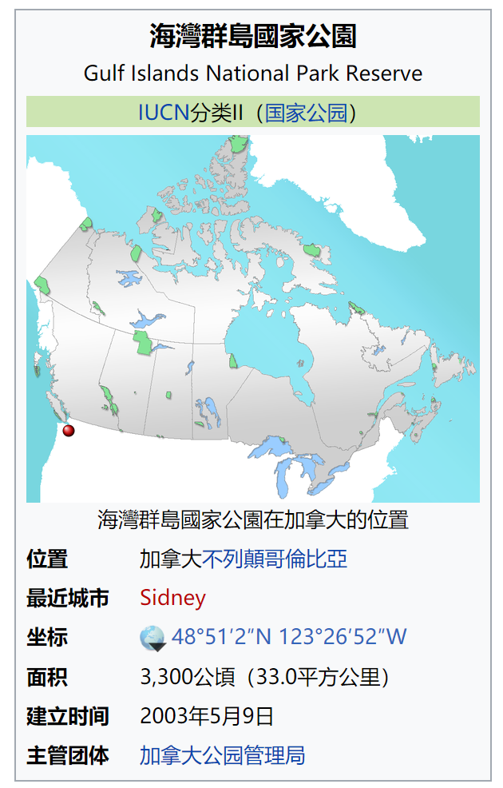 (原始链接: https://mmbiz.qpic.cn/mmbiz_png/4kibCXA1QiblSIvyC4RKyezvhAe4MPFegIicvzTBW0Z2ibfDBSXghN81Qs8YmfWzY9RfjqjFwR1qGLqtkIeXWoD8tQ/640?wx_fmt=png)
- 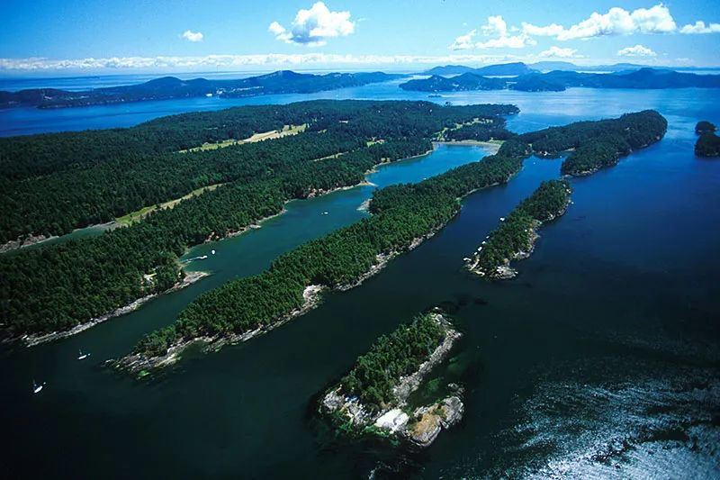 (原始链接: https://mmbiz.qpic.cn/mmbiz_jpg/4kibCXA1QiblSIvyC4RKyezvhAe4MPFegIsl4ibMR1vicpM2ic88a7aLIFJCd9zE0ekia5M5TyBxDvN8tF90Z9bqK6mQ/640?wx_fmt=jpeg)
- 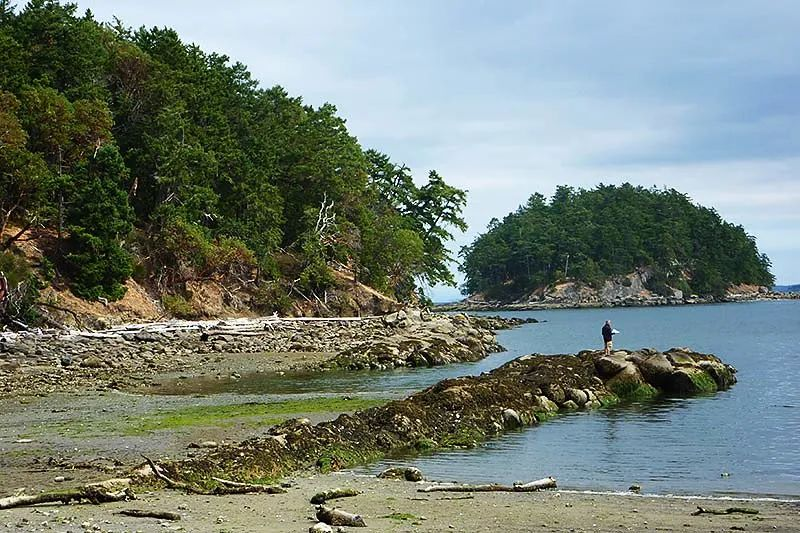 (原始链接: https://mmbiz.qpic.cn/mmbiz_jpg/4kibCXA1QiblSIvyC4RKyezvhAe4MPFegIUjDm03WTcqiajqYtoqQLpcTnQ9YcUibVicOAqamv2aDvJ8Waicic19sgm6w/640?wx_fmt=jpeg)
- 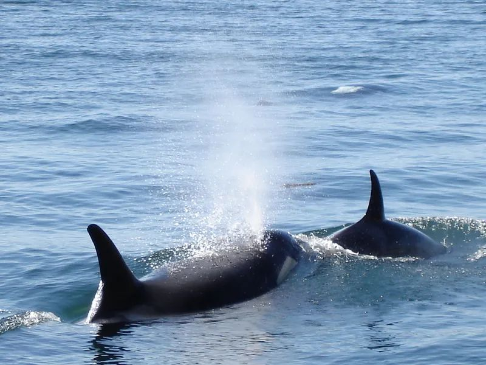 (原始链接: https://mmbiz.qpic.cn/mmbiz_jpg/4kibCXA1QiblSIvyC4RKyezvhAe4MPFegI8DYFzFwwYuEdSwiaK3biaunS2o8rjTuSGLX8ice4zia5BgF4EBqibcMSlLQ/640?wx_fmt=jpeg)
- 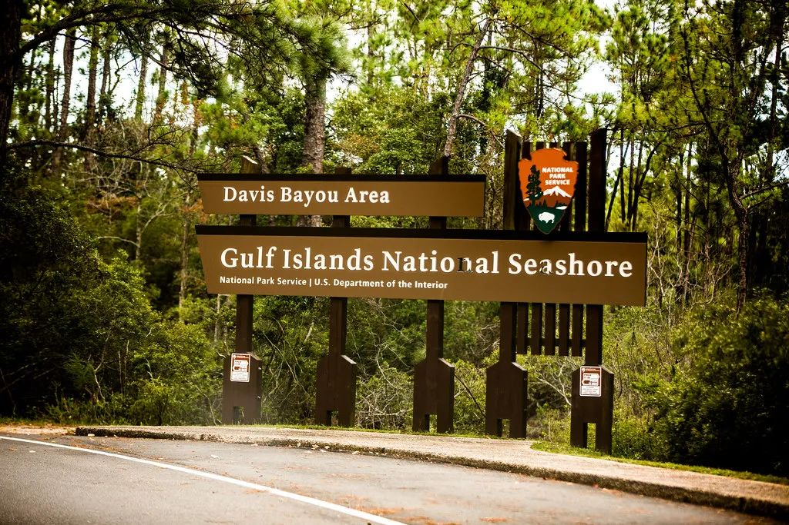 (原始链接: https://mmbiz.qpic.cn/mmbiz_jpg/4kibCXA1QiblSIvyC4RKyezvhAe4MPFegI3osPicOPVvzMVqewOiaLAFJfYlTX4p4CvvpS8BgBRVtq5rpKlP8a1vTA/640?wx_fmt=jpeg)
- 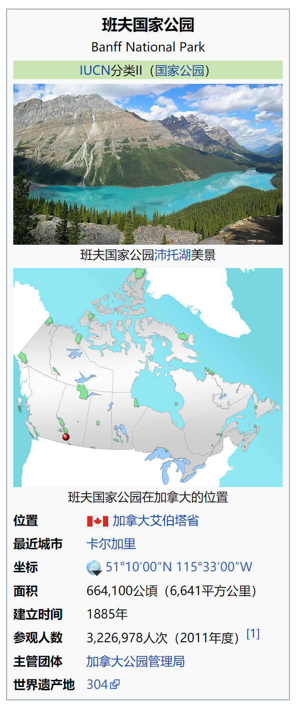 (原始链接: https://mmbiz.qpic.cn/mmbiz_png/4kibCXA1QiblSIvyC4RKyezvhAe4MPFegILTbOU0wwou6FZJkvN9GFehJKt8JKEyjz8y80WCoEuqNgicvUCbZYAcQ/640?wx_fmt=png)
-  (原始链接: https://mmbiz.qpic.cn/mmbiz_jpg/4kibCXA1QiblSIvyC4RKyezvhAe4MPFegIMvKhK1WibWRMUHocVcUAWbLnJ0uIeYeykpNXLRpkD4RsWgBlq9ZeT4w/640?wx_fmt=jpeg)
- 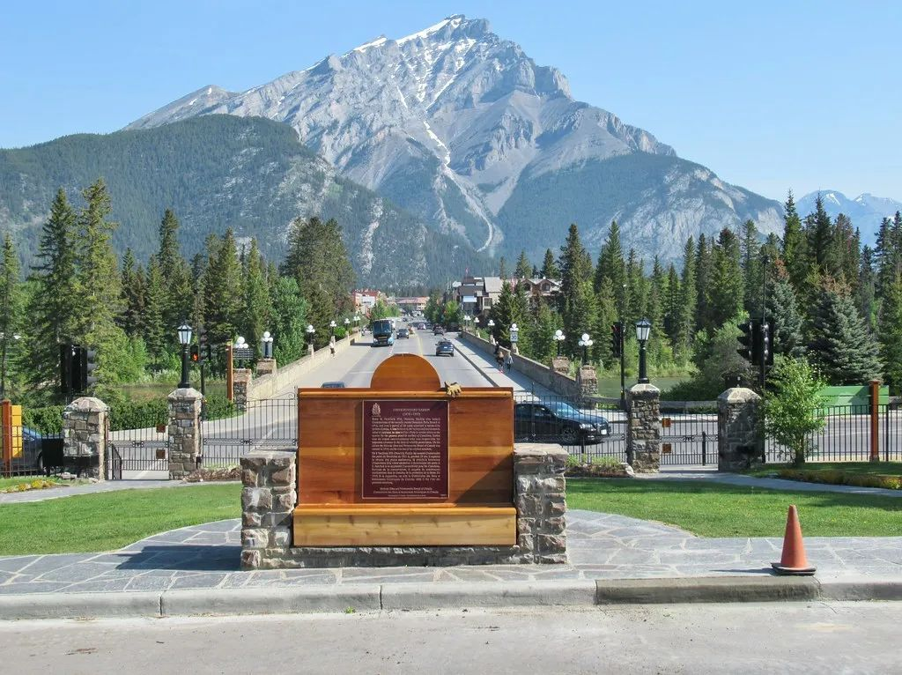 (原始链接: https://mmbiz.qpic.cn/mmbiz_jpg/4kibCXA1QiblSIvyC4RKyezvhAe4MPFegI5TTUq1jxkSq6cIQUtc6GNGnrGmDEAkhhLMMQQHcd4md1BO86V3z6Og/640?wx_fmt=jpeg)
-  (原始链接: https://mmbiz.qpic.cn/mmbiz_jpg/4kibCXA1QiblSIvyC4RKyezvhAe4MPFegIialic7ksjYZKP2cvo7NSibA5VdlNwz1nJu1s6eXL7X46Nl1DyE3wLhODA/640?wx_fmt=jpeg)
- 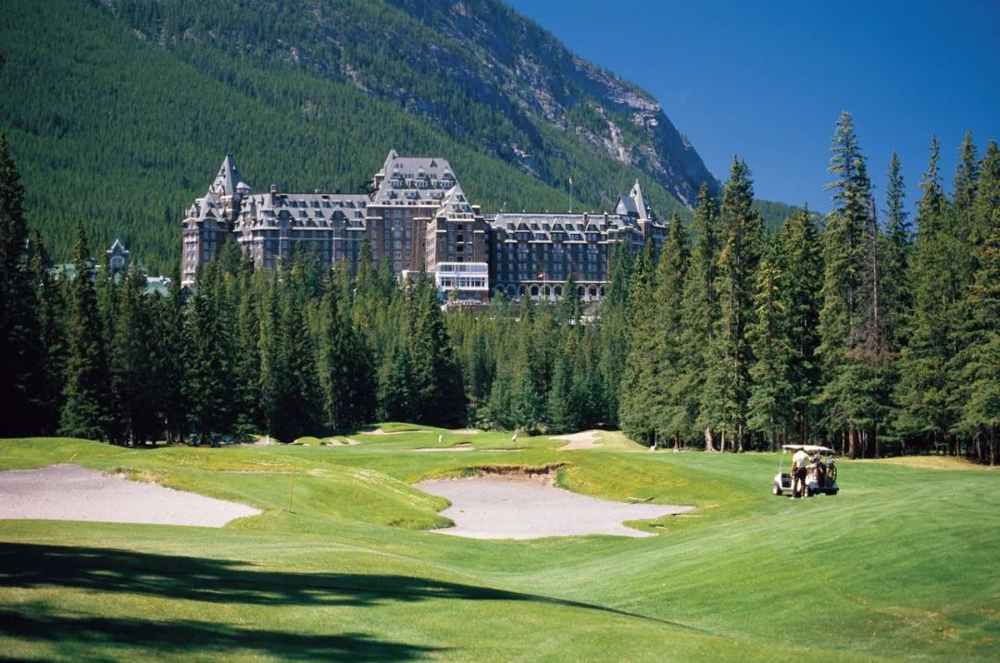 (原始链接: https://mmbiz.qpic.cn/mmbiz_jpg/4kibCXA1QiblSIvyC4RKyezvhAe4MPFegILBLPBGibAsu2N3I3LVWfDAd2OyJz1roylQdpt40AKMUwcVpKLZWcAWg/640?wx_fmt=jpeg)
- 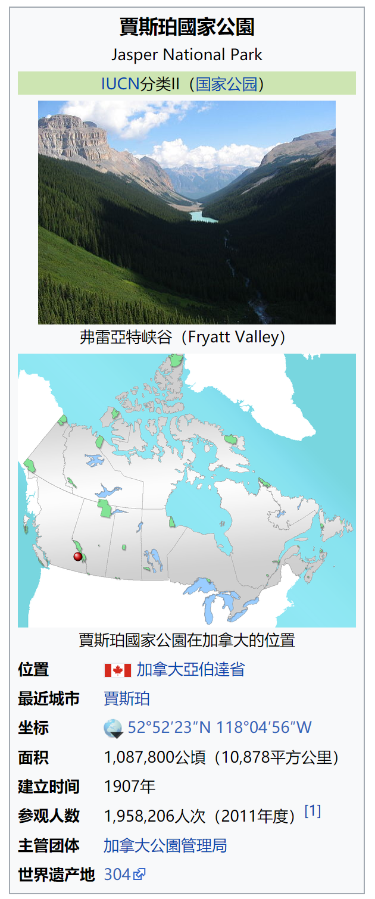 (原始链接: https://mmbiz.qpic.cn/mmbiz_png/4kibCXA1QiblSIvyC4RKyezvhAe4MPFegICYAOueKsA68dzc0jicUpEibHbKdo4qGeibDtic3iaG0WkAZY6p3UiajW0cdg/640?wx_fmt=png)
- 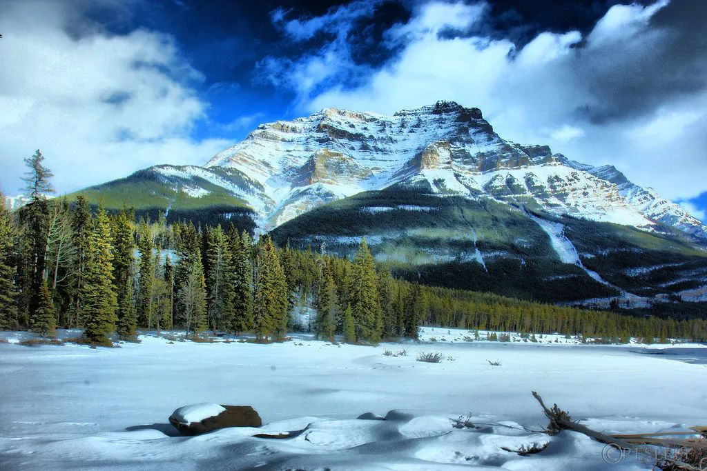 (原始链接: https://mmbiz.qpic.cn/mmbiz_jpg/4kibCXA1QiblSIvyC4RKyezvhAe4MPFegIEx6x5YwDuFrDnd97nU0hFa1hu8icjz1knmwMhYhWZQ8ibNuib6m7icYWfg/640?wx_fmt=jpeg)
- 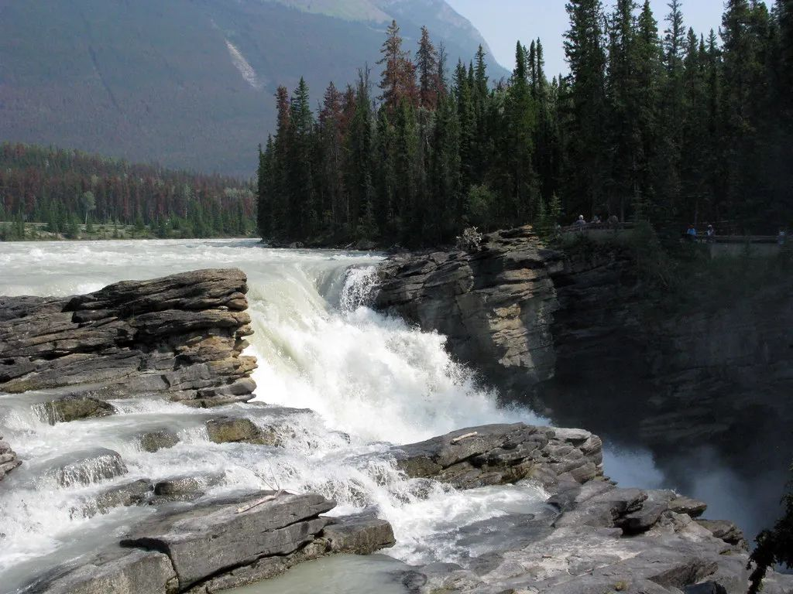 (原始链接: https://mmbiz.qpic.cn/mmbiz_jpg/4kibCXA1QiblSIvyC4RKyezvhAe4MPFegI797ZAPx1FeToaADyiathTVRs9uB02nETTr58FM0lufeEdPU5DjHmThw/640?wx_fmt=jpeg)
- 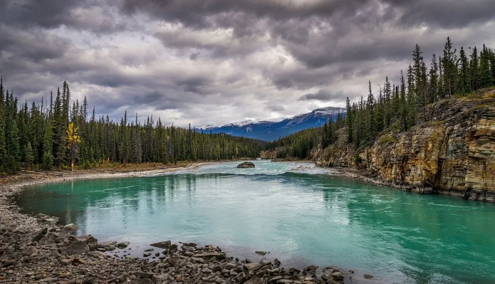 (原始链接: https://mmbiz.qpic.cn/mmbiz_jpg/4kibCXA1QiblSIvyC4RKyezvhAe4MPFegIUaWK1oxttDuZxZAgpgcRF5jaG9EUchUDAMvUKicsKFP8DI1N8DibZeLg/640?wx_fmt=jpeg)
- 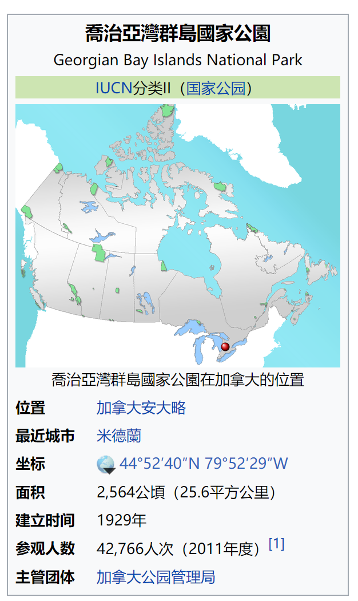 (原始链接: https://mmbiz.qpic.cn/mmbiz_png/4kibCXA1QiblSIvyC4RKyezvhAe4MPFegIHuFWOpe3icyS1OmVvTaRncFcka9ia96ib7o8BKmPvWxD9B99cLofWEVmA/640?wx_fmt=png)
- 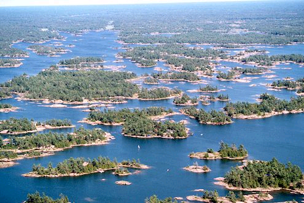 (原始链接: https://mmbiz.qpic.cn/mmbiz_png/4kibCXA1QiblSIvyC4RKyezvhAe4MPFegII7xPsgKOcJlEa39LfSJKbVMvqfFoxZkZ0hKEc1TsCWeZu4tHucsKVA/640?wx_fmt=png)
- 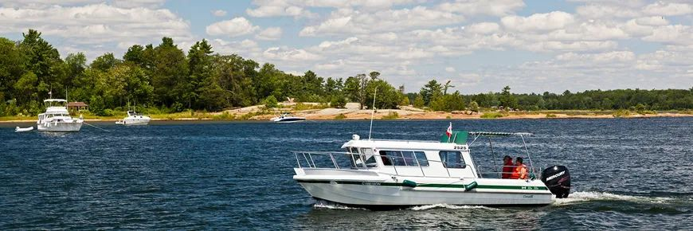 (原始链接: https://mmbiz.qpic.cn/mmbiz_jpg/4kibCXA1QiblSIvyC4RKyezvhAe4MPFegI61HMddu7YhYjYicQSxxSJyhIAkmKmW5LsVbLHGT2BUy3wlQVuOk5Ogg/640?wx_fmt=jpeg)
- 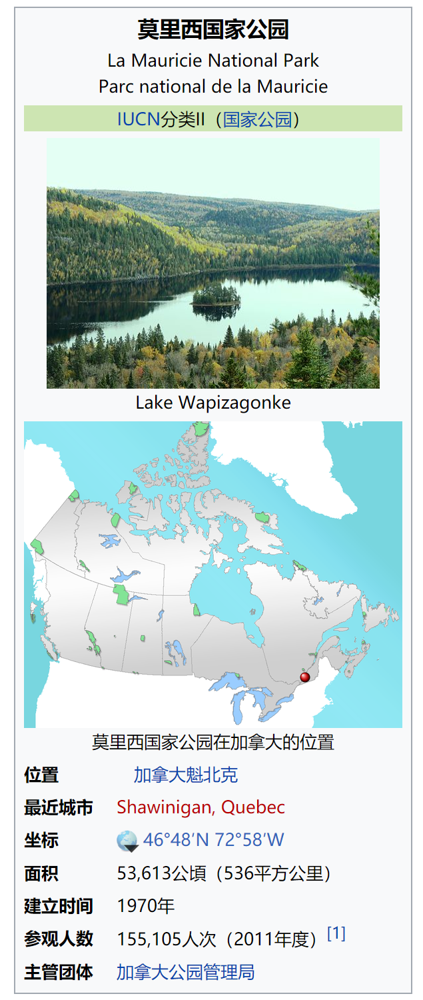 (原始链接: https://mmbiz.qpic.cn/mmbiz_png/4kibCXA1QiblSIvyC4RKyezvhAe4MPFegIMyDN2fa8XngVXUNxCDGUSHArmiapuibPn06aDBiaFibovME8eKBI8cyYmQ/640?wx_fmt=png)
- 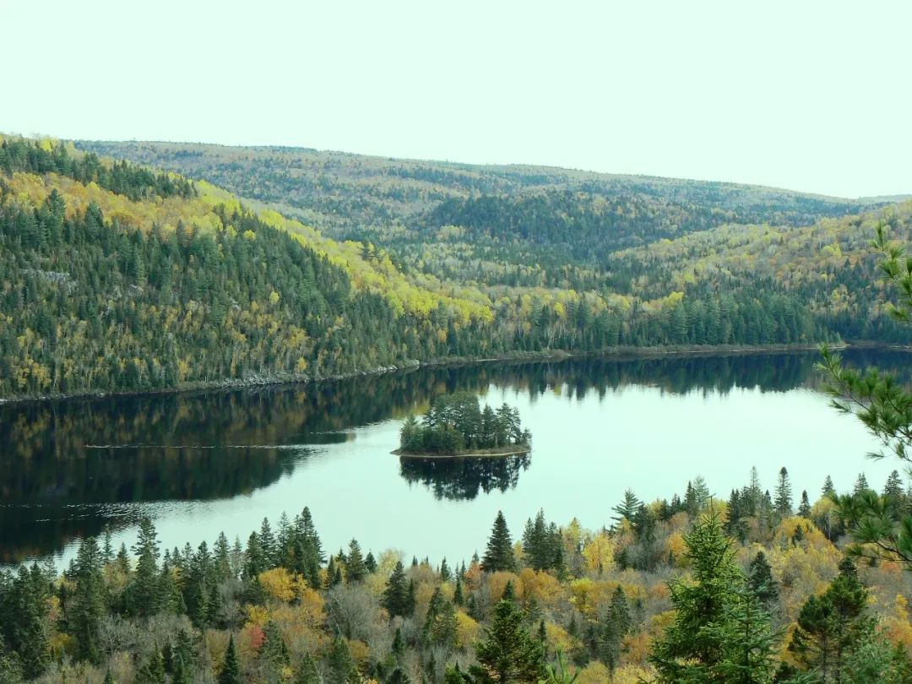 (原始链接: https://mmbiz.qpic.cn/mmbiz_jpg/4kibCXA1QiblSIvyC4RKyezvhAe4MPFegIRNiaJzO2ULxIibKLibuVJ5379n8mibP1kaLiboLo9F9QqEFYUNQTRQ9WYqQ/640?wx_fmt=jpeg)
- 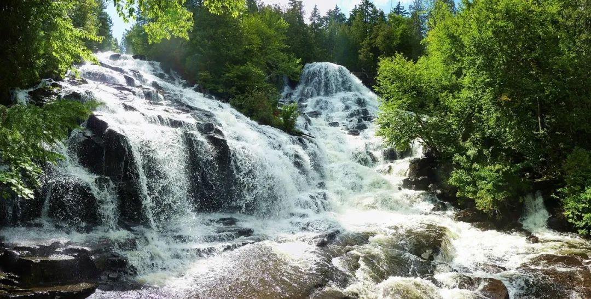 (原始链接: https://mmbiz.qpic.cn/mmbiz_jpg/4kibCXA1QiblSIvyC4RKyezvhAe4MPFegIIjZpiaia0j4hf1VdaTyUqbMe1GZiaNn3AefiaXMesung5icdZK9MChYeAVg/640?wx_fmt=jpeg)
- 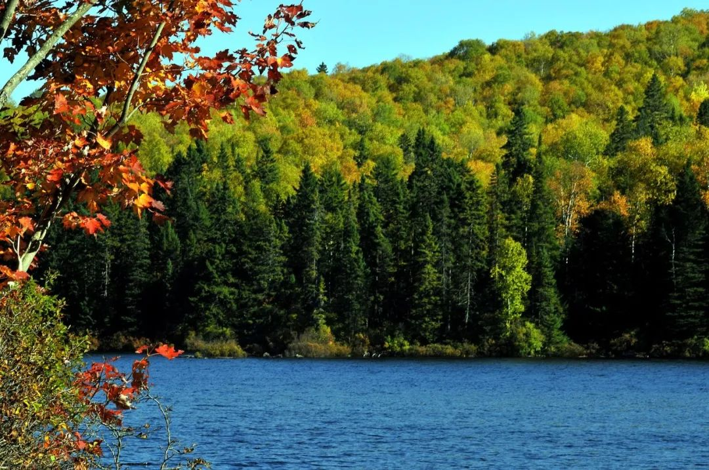 (原始链接: https://mmbiz.qpic.cn/mmbiz_jpg/4kibCXA1QiblSIvyC4RKyezvhAe4MPFegIfo9yEePpI2T1TMiahC3f1iaIxqclGTmdDNuvEctoWyOic3PCBKIAU2RRA/640?wx_fmt=jpeg)
-  (原始链接: https://mmbiz.qpic.cn/mmbiz_png/z1kFo0My85mYA17kLthGTs3LBhduiaYdoRWlcs47h8kgLhnX8Cc9NECL3ou8XkxAXrgsfibaxccdbhictJAxGVD6w/640?wx_fmt=png)
-  (原始链接: https://mmbiz.qpic.cn/mmbiz_jpg/icDcCacWsN1UfuVe5mmtBBvvB08BYhC4VDdleW5ykgKfQSY29ib5NByGTYSvMSw6HmDpYI5utbL0cgwAIxkqDU3Q/640?wx_fmt=jpeg)
