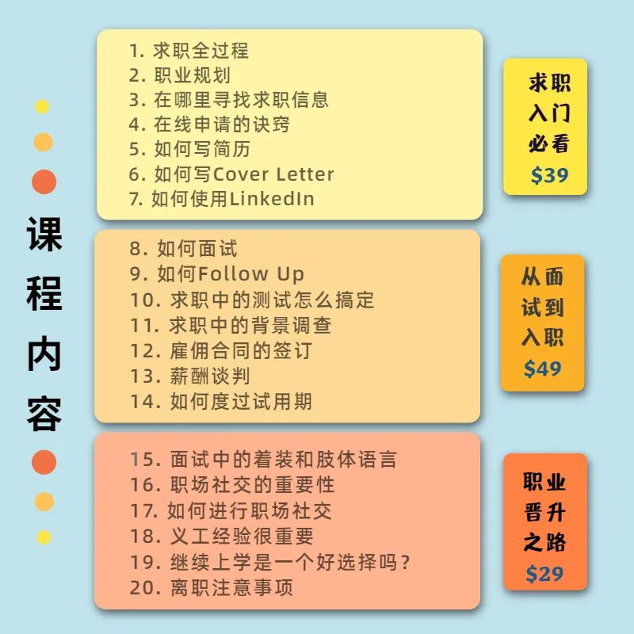
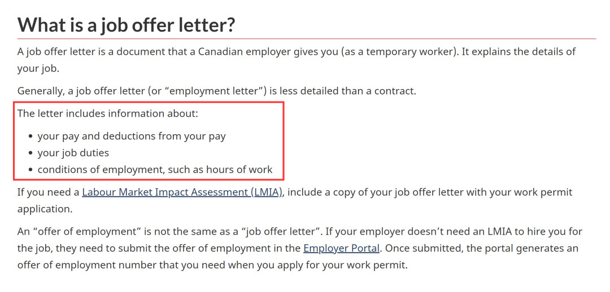

# 无标题

**链接地址:** http://mp.weixin.qq.com/s?__biz=MzI4NDYyNjAwNw==&mid=2247484979&idx=1&sn=4482d3048877c2d1b4d78661563683cd&chksm=ebf9db0bdc8e521d7bd347671f5cb62822cb0a0d612badb1911aa4be804925a9a923a3b9fbdd&mpshare=1&scene=2&srcid=0604Zi1dIYmyPKw23dsBZWoY&sharer_sharetime=1622760432429&sharer_shareid=be1c8edd6c93eec155a61c876e41d26a#rd
**作者:** 关注我们
**获取时间:** 2025/8/28 19:46:07
**图片数量:** 39

---

## 原始HTML内容

<section style="box-sizing: border-box;font-size: 16px;"><section style="box-sizing: border-box;" powered-by="xiumi.us"><section style="text-align: center;justify-content: center;display: flex;flex-flow: row nowrap;margin: 10px 0%;box-sizing: border-box;"><section style="display: inline-block;width: auto;vertical-align: top;min-width: 10%;max-width: 100%;flex: 0 0 auto;height: auto;align-self: flex-start;line-height: 0;box-sizing: border-box;"><section style="margin-right: 0%;margin-left: 0%;box-sizing: border-box;" powered-by="xiumi.us"><section style="background-color: rgb(51, 167, 233);height: 1px;box-sizing: border-box;"><section><svg viewBox="0 0 1 1" style="float:left;line-height:0;width:0;vertical-align:top;"></svg></section></section></section><section style="font-size: 14px;line-height: 2;padding-right: 23px;padding-left: 23px;font-family: Optima-Regular, PingFangTC-light;letter-spacing: 3px;color: rgb(121, 121, 121);box-sizing: border-box;" powered-by="xiumi.us">
<strong style="box-sizing: border-box;">点击蓝字 · 关注我们</strong>
</section><section style="margin-right: 0%;margin-left: 0%;box-sizing: border-box;" powered-by="xiumi.us"><section style="background-color: rgb(51, 167, 233);height: 1px;box-sizing: border-box;"><section><svg viewBox="0 0 1 1" style="float:left;line-height:0;width:0;vertical-align:top;"></svg></section></section></section></section></section></section><section style="box-sizing: border-box;" powered-by="xiumi.us">
 
</section><section style="box-sizing: border-box;" powered-by="xiumi.us">
 
</section><section style="box-sizing: border-box;" powered-by="xiumi.us"><section style="margin: 90px 0% 10px;display: flex;flex-flow: row nowrap;box-sizing: border-box;"><section style="display: inline-block;width: auto;vertical-align: top;border-style: solid;border-width: 1px;border-color: rgb(51, 167, 233);flex: 100 100 0%;align-self: flex-start;height: auto;margin-left: 88px;box-sizing: border-box;"><section style="box-sizing: border-box;" powered-by="xiumi.us"><section style="text-align: right;justify-content: flex-end;display: flex;flex-flow: row nowrap;margin-top: -8px;margin-right: 0%;margin-left: 0%;transform: translate3d(-27px, 0px, 0px);box-sizing: border-box;"><section style="display: inline-block;vertical-align: top;width: auto;flex: 0 0 0%;height: auto;line-height: 0;z-index: 3;box-sizing: border-box;"><section style="text-align: left;margin-right: 0%;margin-left: 0%;justify-content: flex-start;box-sizing: border-box;" powered-by="xiumi.us"><section style="display: inline-block;width: 16px;height: 16px;vertical-align: top;overflow: hidden;background-color: rgba(255, 255, 255, 0);border-width: 1px;border-radius: 26px;border-style: solid;border-color: rgb(51, 167, 233);box-sizing: border-box;"><section><svg viewBox="0 0 1 1" style="float:left;line-height:0;width:0;vertical-align:top;"></svg></section></section></section></section><section style="display: inline-block;vertical-align: top;width: auto;flex: 0 0 0%;height: auto;margin-left: -8px;line-height: 0;box-sizing: border-box;"><section style="text-align: left;margin-right: 0%;margin-left: 0%;justify-content: flex-start;transform: translate3d(-3px, 0px, 0px);box-sizing: border-box;" powered-by="xiumi.us"><section style="display: inline-block;width: 16px;height: 16px;vertical-align: top;overflow: hidden;background-color: rgb(237, 146, 15);border-width: 0px;border-radius: 26px;border-style: none;border-color: rgb(62, 62, 62);box-sizing: border-box;"><section><svg viewBox="0 0 1 1" style="float:left;line-height:0;width:0;vertical-align:top;"></svg></section></section></section></section></section></section><section style="text-align: right;margin: -86px 0% 10px;justify-content: flex-end;transform: translate3d(-85px, 0px, 0px);-webkit-transform: translate3d(-85px, 0px, 0px);-moz-transform: translate3d(-85px, 0px, 0px);-o-transform: translate3d(-85px, 0px, 0px);box-sizing: border-box;" powered-by="xiumi.us"><section style="max-width: 100%;vertical-align: middle;display: inline-block;line-height: 0;border-width: 0px;width: 100%;height: auto;box-sizing: border-box;"></section></section><section style="margin-top: -33px;margin-right: 0%;margin-left: 0%;box-sizing: border-box;" powered-by="xiumi.us"><section style="display: inline-block;width: 100%;vertical-align: top;padding-right: 20px;box-sizing: border-box;"><section style="transform: rotateZ(90deg) scale(0.99);transform-origin: right top;margin-right: -1px;margin-left: -1px;box-sizing: border-box;max-width: unset !important;" powered-by="xiumi.us"><section style="margin-right: 0%;margin-bottom: 12px;margin-left: 0%;box-sizing: border-box;"><section style="text-align: right;font-size: 12px;color: rgb(51, 167, 233);font-family: PingFangTC-ultralight;line-height: 1.8;letter-spacing: 1px;box-sizing: border-box;">
2021

✕&nbsp; summer
</section></section></section></section></section><section style="margin-right: 0%;margin-bottom: 12px;margin-left: 0%;box-sizing: border-box;" powered-by="xiumi.us"><section style="font-size: 13px;color: rgb(152, 186, 189);font-family: Optima-Regular, PingFangTC-light;line-height: 2;letter-spacing: 2px;padding-right: 28px;padding-left: 28px;box-sizing: border-box;">
6月是每年的<strong style="box-sizing: border-box;">毕业季</strong>。毕业生们身着礼服，在礼堂前骄傲地将学士帽抛向天空的那一刻，是对自己多年来留学经历画下的<strong style="box-sizing: border-box;">最完美句点</strong>。
</section></section><section style="text-align: left;justify-content: flex-start;transform: translate3d(4px, 0px, 0px);margin-right: 0%;margin-bottom: -12px;margin-left: 0%;box-sizing: border-box;" powered-by="xiumi.us"><section style="display: inline-block;vertical-align: middle;width: 15px;height: auto;align-self: center;margin-right: -7px;box-sizing: border-box;"><section style="transform: rotateZ(311deg);-webkit-transform: rotateZ(311deg);-moz-transform: rotateZ(311deg);-o-transform: rotateZ(311deg);box-sizing: border-box;" powered-by="xiumi.us"><section style="margin-right: 0%;margin-left: 0%;box-sizing: border-box;"><section style="background-color: rgb(51, 167, 233);height: 1px;box-sizing: border-box;"><section><svg viewBox="0 0 1 1" style="float:left;line-height:0;width:0;vertical-align:top;"></svg></section></section></section></section></section><section style="display: inline-block;vertical-align: middle;width: 15px;height: auto;align-self: center;box-sizing: border-box;"><section style="transform: rotateZ(311deg);-webkit-transform: rotateZ(311deg);-moz-transform: rotateZ(311deg);-o-transform: rotateZ(311deg);box-sizing: border-box;" powered-by="xiumi.us"><section style="margin-right: 0%;margin-left: 0%;box-sizing: border-box;"><section style="background-color: rgb(51, 167, 233);height: 1px;box-sizing: border-box;"><section><svg viewBox="0 0 1 1" style="float:left;line-height:0;width:0;vertical-align:top;"></svg></section></section></section></section></section></section></section></section></section><section style="box-sizing: border-box;" powered-by="xiumi.us">
 
</section><section style="box-sizing: border-box;" powered-by="xiumi.us"><section style="margin: 90px 0% 10px;display: flex;flex-flow: row nowrap;box-sizing: border-box;"><section style="display: inline-block;width: auto;vertical-align: top;border-style: solid;border-width: 1px;border-color: rgb(51, 167, 233);flex: 100 100 0%;align-self: flex-start;height: auto;margin-right: 88px;box-sizing: border-box;"><section style="box-sizing: border-box;" powered-by="xiumi.us"><section style="text-align: left;justify-content: flex-start;display: flex;flex-flow: row nowrap;margin-top: -8px;margin-right: 0%;margin-left: 0%;transform: translate3d(27px, 0px, 0px);box-sizing: border-box;"><section style="display: inline-block;vertical-align: top;width: auto;flex: 0 0 0%;height: auto;line-height: 0;z-index: 3;box-sizing: border-box;"><section style="margin-right: 0%;margin-left: 0%;justify-content: flex-start;box-sizing: border-box;" powered-by="xiumi.us"><section style="display: inline-block;width: 16px;height: 16px;vertical-align: top;overflow: hidden;background-color: rgba(255, 255, 255, 0);border-width: 1px;border-radius: 26px;border-style: solid;border-color: rgb(51, 167, 233);box-sizing: border-box;"><section><svg viewBox="0 0 1 1" style="float:left;line-height:0;width:0;vertical-align:top;"></svg></section></section></section></section><section style="display: inline-block;vertical-align: top;width: auto;flex: 0 0 0%;height: auto;margin-left: -8px;line-height: 0;box-sizing: border-box;"><section style="margin-right: 0%;margin-left: 0%;justify-content: flex-start;transform: translate3d(-3px, 0px, 0px);box-sizing: border-box;" powered-by="xiumi.us"><section style="display: inline-block;width: 16px;height: 16px;vertical-align: top;overflow: hidden;background-color: rgb(237, 146, 15);border-width: 0px;border-radius: 26px;border-style: none;border-color: rgb(62, 62, 62);box-sizing: border-box;"><section><svg viewBox="0 0 1 1" style="float:left;line-height:0;width:0;vertical-align:top;"></svg></section></section></section></section></section></section><section style="text-align: right;margin: -86px 0% 10px;justify-content: flex-end;transform: translate3d(85px, 0px, 0px);-webkit-transform: translate3d(85px, 0px, 0px);-moz-transform: translate3d(85px, 0px, 0px);-o-transform: translate3d(85px, 0px, 0px);box-sizing: border-box;" powered-by="xiumi.us"><section style="max-width: 100%;vertical-align: middle;display: inline-block;line-height: 0;border-width: 0px;width: 100%;height: auto;box-sizing: border-box;"></section></section><section style="margin-right: 0%;margin-bottom: 12px;margin-left: 0%;box-sizing: border-box;" powered-by="xiumi.us"><section style="font-size: 13px;color: rgb(152, 186, 189);font-family: Optima-Regular, PingFangTC-light;line-height: 2;letter-spacing: 2px;padding-right: 28px;padding-left: 28px;box-sizing: border-box;">
 

然而今年的毕业季却因为疫情的原因变得有些特殊。无法参加毕业典礼的毕业生们，面临的却是一个<strong style="box-sizing: border-box;">更加艰难的就业环境</strong>，和<strong style="box-sizing: border-box;">变幻多端的移民政策</strong>。
</section></section><section style="text-align: right;justify-content: flex-end;transform: translate3d(-18px, 0px, 0px);margin-right: 0%;margin-bottom: -12px;margin-left: 0%;box-sizing: border-box;" powered-by="xiumi.us"><section style="display: inline-block;vertical-align: middle;width: 15px;height: auto;align-self: center;margin-right: -7px;box-sizing: border-box;"><section style="transform: rotateZ(311deg);-webkit-transform: rotateZ(311deg);-moz-transform: rotateZ(311deg);-o-transform: rotateZ(311deg);box-sizing: border-box;" powered-by="xiumi.us"><section style="margin-right: 0%;margin-left: 0%;box-sizing: border-box;"><section style="background-color: rgb(51, 167, 233);height: 1px;box-sizing: border-box;"><section><svg viewBox="0 0 1 1" style="float:left;line-height:0;width:0;vertical-align:top;"></svg></section></section></section></section></section><section style="display: inline-block;vertical-align: middle;width: 15px;height: auto;align-self: center;box-sizing: border-box;"><section style="transform: rotateZ(311deg);-webkit-transform: rotateZ(311deg);-moz-transform: rotateZ(311deg);-o-transform: rotateZ(311deg);box-sizing: border-box;" powered-by="xiumi.us"><section style="margin-right: 0%;margin-left: 0%;box-sizing: border-box;"><section style="background-color: rgb(51, 167, 233);height: 1px;box-sizing: border-box;"><section><svg viewBox="0 0 1 1" style="float:left;line-height:0;width:0;vertical-align:top;"></svg></section></section></section></section></section></section></section></section></section><section style="box-sizing: border-box;" powered-by="xiumi.us">
 
</section><section style="height: auto;box-sizing: border-box;" powered-by="xiumi.us"><section style="display: flex;flex-flow: row nowrap;box-sizing: border-box;"><section style="display: inline-block;vertical-align: middle;width: auto;flex: 100 100 0%;align-self: center;height: auto;margin-right: 10px;box-sizing: border-box;"><section style="text-align: right;margin: 10px 0%;justify-content: flex-end;transform: translate3d(1px, 0px, 0px);-webkit-transform: translate3d(1px, 0px, 0px);-moz-transform: translate3d(1px, 0px, 0px);-o-transform: translate3d(1px, 0px, 0px);box-sizing: border-box;" powered-by="xiumi.us"><section style="max-width: 100%;vertical-align: middle;display: inline-block;line-height: 0;width: 88%;height: auto;box-sizing: border-box;"></section></section></section><section style="display: inline-block;vertical-align: middle;width: 22.9765%;flex: 0 0 auto;align-self: center;height: auto;box-sizing: border-box;"><section style="transform: rotateZ(333deg);-webkit-transform: rotateZ(333deg);-moz-transform: rotateZ(333deg);-o-transform: rotateZ(333deg);box-sizing: border-box;" powered-by="xiumi.us"><section style="text-align: left;justify-content: flex-start;transform: translate3d(-4px, 0px, 0px);margin-right: 0%;margin-left: 0%;box-sizing: border-box;"><section style="text-align: justify;font-size: 15px;color: rgb(51, 167, 233);font-family: Optima-Regular, PingFangTC-light;box-sizing: border-box;">
2021
</section></section></section><section style="transform: rotateZ(333deg);-webkit-transform: rotateZ(333deg);-moz-transform: rotateZ(333deg);-o-transform: rotateZ(333deg);box-sizing: border-box;" powered-by="xiumi.us"><section style="text-align: left;justify-content: flex-start;transform: translate3d(-30px, 0px, 0px);-webkit-transform: translate3d(-30px, 0px, 0px);-moz-transform: translate3d(-30px, 0px, 0px);-o-transform: translate3d(-30px, 0px, 0px);margin: 7px 0% 26px;box-sizing: border-box;"><section style="text-align: justify;font-size: 15px;color: rgb(51, 167, 233);font-family: Optima-Regular, PingFangTC-light;box-sizing: border-box;">
工作 vs. 移民
</section></section></section><section style="transform: rotateZ(333deg);-webkit-transform: rotateZ(333deg);-moz-transform: rotateZ(333deg);-o-transform: rotateZ(333deg);box-sizing: border-box;" powered-by="xiumi.us"><section style="margin: 16px 0% 8px;text-align: left;justify-content: flex-start;box-sizing: border-box;"><section style="background-color: rgb(152, 186, 189);height: 1px;box-sizing: border-box;"><section><svg viewBox="0 0 1 1" style="float:left;line-height:0;width:0;vertical-align:top;"></svg></section></section></section></section><section style="text-align: left;margin-top: -3px;margin-right: 0%;margin-left: 0%;justify-content: flex-start;box-sizing: border-box;" powered-by="xiumi.us"><section style="display: inline-block;width: 33px;height: 33px;vertical-align: top;overflow: hidden;background-color: rgb(237, 146, 15);border-width: 0px;border-radius: 26px;border-style: none;border-color: rgb(62, 62, 62);box-sizing: border-box;"><section><svg viewBox="0 0 1 1" style="float:left;line-height:0;width:0;vertical-align:top;"></svg></section></section></section></section></section></section><section style="margin: -84px 0% 10px;box-sizing: border-box;" powered-by="xiumi.us"><section style="display: inline-block;width: 100%;vertical-align: top;border-style: solid;border-width: 1px;border-color: rgb(152, 186, 189);box-sizing: border-box;"><section style="margin-right: 0%;margin-bottom: -100px;margin-left: 0%;box-sizing: border-box;" powered-by="xiumi.us"><section style="font-size: 13px;color: rgb(152, 186, 189);font-family: Optima-Regular, PingFangTC-light;line-height: 2;letter-spacing: 2px;padding-right: 28px;padding-left: 28px;box-sizing: border-box;">
 

 

 

 

面对这样的就业和移民局势，许多挣扎在求职市场的毕业生们总是<strong style="box-sizing: border-box;">充满了疑惑</strong>。<strong style="box-sizing: border-box;">“到底怎样的工作可以帮我移民？而我又该选择怎样的移民方式呢？”</strong>
</section></section><section style="margin: 93px 0% 24px;box-sizing: border-box;" powered-by="xiumi.us"><section style="font-size: 15px;color: rgb(152, 186, 189);font-family: Optima-Regular, PingFangTC-light;line-height: 1.8;letter-spacing: 1px;padding-right: 28px;padding-left: 28px;box-sizing: border-box;">
 
</section></section></section></section><section style="box-sizing: border-box;" powered-by="xiumi.us">
 
</section><section style="box-sizing: border-box;" powered-by="xiumi.us">
 
</section><section style="box-sizing: border-box;" powered-by="xiumi.us"><section style="display: flex;flex-flow: row nowrap;margin-top: 40px;margin-right: 0%;margin-left: 0%;box-sizing: border-box;"><section style="display: inline-block;width: auto;vertical-align: top;background-color: rgba(211, 226, 242, 0.43);line-height: 0;flex: 0 0 auto;align-self: flex-start;min-width: 10%;max-width: 100%;height: auto;box-sizing: border-box;"><section style="box-sizing: border-box;" powered-by="xiumi.us"><section style="display: flex;flex-flow: row nowrap;box-sizing: border-box;"><section style="display: inline-block;vertical-align: bottom;width: auto;flex: 0 0 0%;height: auto;align-self: flex-end;box-sizing: border-box;"><section style="text-align: left;justify-content: flex-start;box-sizing: border-box;" powered-by="xiumi.us"><section style="display: inline-block;width: 15px;height: 15px;vertical-align: top;overflow: hidden;background-color: rgb(51, 167, 233);box-sizing: border-box;"><section><svg viewBox="0 0 1 1" style="float:left;line-height:0;width:0;vertical-align:top;"></svg></section></section></section></section><section style="display: inline-block;vertical-align: bottom;width: auto;flex: 0 0 0%;align-self: flex-end;height: auto;box-sizing: border-box;"><section style="text-align: left;justify-content: flex-start;box-sizing: border-box;" powered-by="xiumi.us"><section style="display: inline-block;width: 15px;height: 15px;vertical-align: top;overflow: hidden;background-color: rgb(237, 146, 15);box-sizing: border-box;"><section><svg viewBox="0 0 1 1" style="float:left;line-height:0;width:0;vertical-align:top;"></svg></section></section></section></section><section style="display: inline-block;vertical-align: bottom;width: auto;flex: 100 100 0%;height: auto;align-self: flex-end;box-sizing: border-box;"><section style="font-family: Optima-Regular, PingFangTC-light;color: rgb(119, 95, 255);font-size: 17px;padding-right: 10px;padding-left: 10px;line-height: 1;letter-spacing: 1px;box-sizing: border-box;" powered-by="xiumi.us">
<strong style="box-sizing: border-box;">嘉宾介绍</strong>
</section></section></section></section></section></section></section><section style="margin: 10px 0%;box-sizing: border-box;" powered-by="xiumi.us"><section style="display: inline-block;width: 100%;vertical-align: top;background-color: rgba(211, 226, 242, 0.43);padding: 20px 30px 20px 10px;box-sizing: border-box;"><section style="box-sizing: border-box;" powered-by="xiumi.us"><section style="display: flex;flex-flow: row nowrap;margin-right: 0%;margin-bottom: -10px;margin-left: 0%;box-sizing: border-box;"><section style="display: inline-block;vertical-align: bottom;width: 55%;align-self: flex-end;flex: 0 0 auto;height: auto;box-sizing: border-box;"><section style="padding-right: 10px;padding-left: 10px;box-sizing: border-box;" powered-by="xiumi.us">
<strong style="box-sizing: border-box;">Ms. Zoe Zhou</strong>

<strong style="box-sizing: border-box;">RCIC, MBA</strong>

REGULATED CANADIAN IMMIGRATION CONSULTANT

 
</section></section><section style="display: inline-block;vertical-align: bottom;width: auto;align-self: flex-end;flex: 100 100 0%;height: auto;margin-left: 20px;box-sizing: border-box;"><section style="text-align: center;margin: -80px 0% 20px;box-sizing: border-box;" powered-by="xiumi.us"><section style="max-width: 100%;vertical-align: middle;display: inline-block;line-height: 0;box-sizing: border-box;"></section></section></section></section></section></section></section><section style="box-sizing: border-box;" powered-by="xiumi.us">
 
</section><section style="margin-right: 0%;margin-bottom: 12px;margin-left: 0%;box-sizing: border-box;" powered-by="xiumi.us"><section style="font-size: 13px;color: rgb(152, 186, 189);font-family: Optima-Regular, PingFangTC-light;line-height: 2;letter-spacing: 2px;padding-right: 28px;padding-left: 28px;box-sizing: border-box;">
 

面对这些涌入的<strong style="box-sizing: border-box;">“工作 vs. 移民”</strong>问题，BadaB Consulting 邀请到了<strong style="box-sizing: border-box;">新时代留学移民法律事务所的首席顾问</strong> <strong style="box-sizing: border-box;">Zoe Zhou</strong> 女士，用视频的方式就大家最关心的<strong style="box-sizing: border-box;">六大毕业生移民问题</strong>进行解答，欢迎感兴趣的小伙伴们一键三连哦！

 

 
</section></section><section style="box-sizing: border-box;" powered-by="xiumi.us">
 
</section><section style="margin: 10px 0%;box-sizing: border-box;" powered-by="xiumi.us"><section style="display: inline-block;width: 100%;vertical-align: top;background-color: rgb(200, 232, 245);padding-right: 10px;padding-left: 10px;box-sizing: border-box;"><section style="box-sizing: border-box;" powered-by="xiumi.us"><section style="display: flex;flex-flow: row nowrap;margin: -5px 0%;text-align: center;justify-content: center;box-sizing: border-box;"><section style="display: inline-block;width: auto;vertical-align: middle;min-width: 10%;max-width: 100%;flex: 0 0 auto;height: auto;border-style: solid;border-width: 1px;border-color: rgb(51, 167, 233);padding: 4px;background-color: rgb(255, 255, 255);box-shadow: rgb(255, 255, 255) 0px 0px 0px inset;align-self: center;box-sizing: border-box;"><section style="display: inline-block;width: 100%;vertical-align: top;border-width: 0px;background-color: rgb(200, 232, 245);padding-right: 10px;padding-left: 10px;box-sizing: border-box;" powered-by="xiumi.us"><section style="text-align: justify;color: rgb(106, 106, 106);letter-spacing: 1px;box-sizing: border-box;" powered-by="xiumi.us"><strong style="box-sizing: border-box;">视频请戳</strong></section></section></section></section></section></section></section><section style="text-align: center;margin-top: 10px;margin-bottom: 10px;box-sizing: border-box;" powered-by="xiumi.us"><section style="opacity: 0.5;display: none;box-sizing: border-box;"><section style="width: 0px;margin-right: auto;margin-left: auto;border-top: 6px solid black;border-left: 6px solid transparent;border-right: 6px solid transparent;box-sizing: border-box;"><section><svg viewBox="0 0 1 1" style="float:left;line-height:0;width:0;vertical-align:top;"></svg></section></section></section><section style="width: 100%;line-height: 0;box-sizing: border-box;"><section style="width: 100%;transform: rotate(0deg);-webkit-transform: rotate(0deg);-moz-transform: rotate(0deg);-o-transform: rotate(0deg);box-sizing: border-box;"> </section></section></section><section style="box-sizing: border-box;" powered-by="xiumi.us">
<iframe class="video_iframe rich_pages" data-vidtype="2" data-mpvid="wxv_1897518959625633797" data-cover="http%3A%2F%2Fmmbiz.qpic.cn%2Fmmbiz_jpg%2FcY0qSDjdkFelw6iaPTUfYHMMcSKeH57oZ75tQYqWIia2n3h52j564AHwOF5tcyTzTQvLO4jyicm2nMr65VL81uzXA%2F0%3Fwx_fmt%3Djpeg" allowfullscreen="" frameborder="0" data-ratio="1.7777777777777777" data-w="1280" data-src="https://mp.weixin.qq.com/mp/readtemplate?t=pages/video_player_tmpl&amp;action=mpvideo&amp;auto=0&amp;vid=wxv_1897518959625633797"></iframe>

 

 

 
</section><section style="margin: 10px 0%;box-sizing: border-box;" powered-by="xiumi.us"><section style="display: inline-block;width: 100%;vertical-align: top;background-color: rgb(200, 232, 245);padding-right: 10px;padding-left: 10px;box-sizing: border-box;"><section style="box-sizing: border-box;" powered-by="xiumi.us"><section style="display: flex;flex-flow: row nowrap;margin: -5px 0%;text-align: center;justify-content: center;box-sizing: border-box;"><section style="display: inline-block;width: auto;vertical-align: middle;min-width: 10%;max-width: 100%;flex: 0 0 auto;height: auto;border-style: solid;border-width: 1px;border-color: rgb(51, 167, 233);padding: 4px;background-color: rgb(255, 255, 255);box-shadow: rgb(255, 255, 255) 0px 0px 0px inset;align-self: center;box-sizing: border-box;"><section style="display: inline-block;width: 100%;vertical-align: top;border-width: 0px;background-color: rgb(200, 232, 245);padding-right: 10px;padding-left: 10px;box-sizing: border-box;" powered-by="xiumi.us"><section style="text-align: justify;color: rgb(106, 106, 106);letter-spacing: 1px;box-sizing: border-box;" powered-by="xiumi.us">
<strong style="box-sizing: border-box;">注意，划重点啦！</strong>
</section></section></section></section></section></section></section><section style="margin-right: 0%;margin-bottom: 12px;margin-left: 0%;box-sizing: border-box;" powered-by="xiumi.us"><section style="font-size: 13px;color: rgb(152, 186, 189);font-family: Optima-Regular, PingFangTC-light;line-height: 2;letter-spacing: 2px;padding-right: 28px;padding-left: 28px;box-sizing: border-box;">
 

为了方便大家截取视频中的关键信息，贴心的小编特别为你们准备了视频中对于6个问题的<strong style="box-sizing: border-box;">精简版</strong><strong style="box-sizing: border-box;">文字</strong>对话内容。句句<strong style="box-sizing: border-box;">干货</strong>，请需要的小伙伴们及时<strong style="box-sizing: border-box;">收藏分享</strong>哦！

 
</section></section><section style="box-sizing: border-box;" powered-by="xiumi.us"><section style="display: flex;flex-flow: row nowrap;margin: 20px 0%;box-sizing: border-box;"><section style="display: inline-block;vertical-align: bottom;width: auto;flex: 0 0 auto;align-self: flex-end;min-width: 10%;max-width: 100%;height: auto;box-sizing: border-box;"><section style="text-align: center;margin-right: 0%;margin-left: 0%;box-sizing: border-box;" powered-by="xiumi.us"><section style="max-width: 100%;vertical-align: middle;display: inline-block;line-height: 0;width: 40px;height: auto;border-width: 0px;border-radius: 90px;border-style: none;border-color: rgb(62, 62, 62);overflow: hidden;box-sizing: border-box;"></section></section><section style="text-align: center;box-sizing: border-box;" powered-by="xiumi.us">
<strong style="box-sizing: border-box;">Ada</strong>
</section></section><section style="display: inline-block;vertical-align: bottom;width: auto;align-self: flex-end;flex: 100 100 0%;height: auto;padding-right: 60px;box-sizing: border-box;"><section style="transform: translate3d(10px, 0px, 0px);-webkit-transform: translate3d(10px, 0px, 0px);-moz-transform: translate3d(10px, 0px, 0px);-o-transform: translate3d(10px, 0px, 0px);box-sizing: border-box;" powered-by="xiumi.us"><section style="display: inline-block;width: auto;vertical-align: top;min-width: 10%;max-width: 100%;height: auto;background-color: rgba(211, 226, 242, 0.43);border-width: 0px;border-radius: 20px 20px 20px 0px;border-style: none;border-color: rgb(62, 62, 62);box-sizing: border-box;"><section style="margin: 15px 0%;box-sizing: border-box;" powered-by="xiumi.us"><section style="font-size: 14px;color: rgb(121, 121, 121);line-height: 1.6;letter-spacing: 1px;padding-right: 20px;padding-left: 20px;box-sizing: border-box;">
最近我个人听说好像我们的移民政策有所放宽，不知道这样是不是对我们的毕业生有利呢？想请Zoe通过专业的角度讲一讲在我们<strong style="box-sizing: border-box;">阿尔伯塔省针对毕业生，最常见有哪些移民途径</strong>呢？
</section></section></section></section></section></section></section><section style="box-sizing: border-box;" powered-by="xiumi.us"><section style="display: flex;flex-flow: row nowrap;margin: 20px 0%;text-align: right;justify-content: flex-end;box-sizing: border-box;"><section style="display: inline-block;vertical-align: bottom;width: auto;align-self: flex-end;flex: 100 100 0%;height: auto;padding-left: 60px;box-sizing: border-box;"><section style="transform: translate3d(-10px, 0px, 0px);-webkit-transform: translate3d(-10px, 0px, 0px);-moz-transform: translate3d(-10px, 0px, 0px);-o-transform: translate3d(-10px, 0px, 0px);justify-content: flex-end;box-sizing: border-box;" powered-by="xiumi.us"><section style="display: inline-block;width: auto;vertical-align: top;min-width: 10%;max-width: 100%;height: auto;background-color: rgba(237, 146, 15, 0.1);border-width: 0px;border-radius: 20px 20px 0px;border-style: none;border-color: rgb(62, 62, 62);box-sizing: border-box;"><section style="margin: 15px 0%;box-sizing: border-box;" powered-by="xiumi.us"><section style="text-align: justify;color: rgb(121, 121, 121);line-height: 1.6;letter-spacing: 1px;padding-right: 20px;padding-left: 20px;font-size: 14px;box-sizing: border-box;">
先假设我们阿尔伯塔省的毕业生都满足了毕业工签的申请条件。如果获取了<strong style="box-sizing: border-box;">开放式的毕业工签</strong>，一般人会选择的移民途径就是阿尔伯塔省的<strong style="box-sizing: border-box;">省提名（AINP）</strong>，或者是<strong style="box-sizing: border-box;">Express Entry（EE）</strong> - Canadian Experience Class，或者最近很火的，所谓“新政大赦”，就是移民局开始送身份，叫做<strong style="box-sizing: border-box;">TR to PR Pathway</strong>。这个Program针对留学生的名额有40,000个，但是在25个小时内名额已经抢空。

 

不过移民局现在也放出很多消息，说他们有意去<strong style="box-sizing: border-box;">增加这个名额</strong>。大家如果感兴趣，或者觉得自己可能满足条件就一定要提前做好准备，不要错失下一次机会。
</section></section></section></section></section><section style="display: inline-block;vertical-align: bottom;width: auto;align-self: flex-end;min-width: 10%;max-width: 100%;flex: 0 0 auto;height: auto;box-sizing: border-box;"><section style="text-align: center;margin-right: 0%;margin-left: 0%;box-sizing: border-box;" powered-by="xiumi.us"><section style="max-width: 100%;vertical-align: middle;display: inline-block;line-height: 0;width: 40px;height: auto;border-width: 0px;border-radius: 90px;border-style: none;border-color: rgb(62, 62, 62);overflow: hidden;box-sizing: border-box;"></section></section><section style="text-align: center;box-sizing: border-box;" powered-by="xiumi.us">
<strong style="box-sizing: border-box;">Zoe</strong>
</section></section></section></section><section style="box-sizing: border-box;" powered-by="xiumi.us"><section style="display: flex;flex-flow: row nowrap;margin: 20px 0%;box-sizing: border-box;"><section style="display: inline-block;vertical-align: bottom;width: auto;flex: 0 0 auto;align-self: flex-end;min-width: 10%;max-width: 100%;height: auto;box-sizing: border-box;"><section style="text-align: center;margin-right: 0%;margin-left: 0%;box-sizing: border-box;" powered-by="xiumi.us"><section style="max-width: 100%;vertical-align: middle;display: inline-block;line-height: 0;width: 40px;height: auto;border-width: 0px;border-radius: 90px;border-style: none;border-color: rgb(62, 62, 62);overflow: hidden;box-sizing: border-box;"></section></section><section style="text-align: center;box-sizing: border-box;" powered-by="xiumi.us">
<strong style="box-sizing: border-box;">Ada</strong>
</section></section><section style="display: inline-block;vertical-align: bottom;width: auto;align-self: flex-end;flex: 100 100 0%;height: auto;padding-right: 60px;box-sizing: border-box;"><section style="transform: translate3d(10px, 0px, 0px);-webkit-transform: translate3d(10px, 0px, 0px);-moz-transform: translate3d(10px, 0px, 0px);-o-transform: translate3d(10px, 0px, 0px);box-sizing: border-box;" powered-by="xiumi.us"><section style="display: inline-block;width: auto;vertical-align: top;min-width: 10%;max-width: 100%;height: auto;background-color: rgba(211, 226, 242, 0.43);border-width: 0px;border-radius: 20px 20px 20px 0px;border-style: none;border-color: rgb(62, 62, 62);box-sizing: border-box;"><section style="margin: 15px 0%;box-sizing: border-box;" powered-by="xiumi.us"><section style="font-size: 14px;color: rgb(121, 121, 121);line-height: 1.6;letter-spacing: 1px;padding-right: 20px;padding-left: 20px;box-sizing: border-box;">
有很多雇主在招聘留学毕业生时都会有一些疑问，尤其是关于<strong style="box-sizing: border-box;">工签</strong>问题。用人单位一般都是很想把人才招进来然后马上工作。那么一个毕业生在<strong style="box-sizing: border-box;">递交工签多久后才可以正式上岗</strong>呢？
</section></section></section></section></section></section></section><section style="box-sizing: border-box;" powered-by="xiumi.us"><section style="display: flex;flex-flow: row nowrap;margin: 20px 0%;text-align: right;justify-content: flex-end;box-sizing: border-box;"><section style="display: inline-block;vertical-align: bottom;width: auto;align-self: flex-end;flex: 100 100 0%;height: auto;padding-left: 60px;box-sizing: border-box;"><section style="transform: translate3d(-10px, 0px, 0px);-webkit-transform: translate3d(-10px, 0px, 0px);-moz-transform: translate3d(-10px, 0px, 0px);-o-transform: translate3d(-10px, 0px, 0px);justify-content: flex-end;box-sizing: border-box;" powered-by="xiumi.us"><section style="display: inline-block;width: auto;vertical-align: top;min-width: 10%;max-width: 100%;height: auto;background-color: rgba(237, 146, 15, 0.1);border-width: 0px;border-radius: 20px 20px 0px;border-style: none;border-color: rgb(62, 62, 62);box-sizing: border-box;"><section style="margin: 15px 0%;box-sizing: border-box;" powered-by="xiumi.us"><section style="text-align: justify;color: rgb(121, 121, 121);line-height: 1.6;letter-spacing: 1px;padding-right: 20px;padding-left: 20px;font-size: 14px;box-sizing: border-box;">
按照现在的规定，移民局和劳工部都认可毕业生在递交工签后就可以<strong style="box-sizing: border-box;">立刻开始工作</strong>。所以为了更有效地去利用有限的三年毕业工签，建议<strong style="box-sizing: border-box;">先去找工作，同时准备好材料</strong>，这样在递交工签申请的那天就可以开始工作了。

 

以前的毕业工签申请时间长达三四个月，但现在基本上<strong style="box-sizing: border-box;">一个月</strong>就可以拿到了。

 

如果你的雇主不懂或者不认可这样的情况，我们会为客户准备一份可以合法工作的证明。同时一般情况下，你的<strong style="box-sizing: border-box;">Social Insurance Number （SIN）</strong>也会继续保留，不会因为你留学生到工作者的身份转变而更改。

 
</section></section></section></section></section><section style="display: inline-block;vertical-align: bottom;width: auto;align-self: flex-end;min-width: 10%;max-width: 100%;flex: 0 0 auto;height: auto;box-sizing: border-box;"><section style="text-align: center;margin-right: 0%;margin-left: 0%;box-sizing: border-box;" powered-by="xiumi.us"><section style="max-width: 100%;vertical-align: middle;display: inline-block;line-height: 0;width: 40px;height: auto;border-width: 0px;border-radius: 90px;border-style: none;border-color: rgb(62, 62, 62);overflow: hidden;box-sizing: border-box;"></section></section><section style="text-align: center;box-sizing: border-box;" powered-by="xiumi.us">
<strong style="box-sizing: border-box;">Zoe</strong>
</section></section></section></section><section style="box-sizing: border-box;" powered-by="xiumi.us"><section style="display: flex;flex-flow: row nowrap;margin: 20px 0%;box-sizing: border-box;"><section style="display: inline-block;vertical-align: bottom;width: auto;flex: 0 0 auto;align-self: flex-end;min-width: 10%;max-width: 100%;height: auto;box-sizing: border-box;"><section style="text-align: center;margin-right: 0%;margin-left: 0%;box-sizing: border-box;" powered-by="xiumi.us"><section style="max-width: 100%;vertical-align: middle;display: inline-block;line-height: 0;width: 40px;height: auto;border-width: 0px;border-radius: 90px;border-style: none;border-color: rgb(62, 62, 62);overflow: hidden;box-sizing: border-box;"></section></section><section style="text-align: center;box-sizing: border-box;" powered-by="xiumi.us">
<strong style="box-sizing: border-box;">Ada</strong>
</section></section><section style="display: inline-block;vertical-align: bottom;width: auto;align-self: flex-end;flex: 100 100 0%;height: auto;padding-right: 60px;box-sizing: border-box;"><section style="transform: translate3d(10px, 0px, 0px);-webkit-transform: translate3d(10px, 0px, 0px);-moz-transform: translate3d(10px, 0px, 0px);-o-transform: translate3d(10px, 0px, 0px);box-sizing: border-box;" powered-by="xiumi.us"><section style="display: inline-block;width: auto;vertical-align: top;min-width: 10%;max-width: 100%;height: auto;background-color: rgba(211, 226, 242, 0.43);border-width: 0px;border-radius: 20px 20px 20px 0px;border-style: none;border-color: rgb(62, 62, 62);box-sizing: border-box;"><section style="margin: 15px 0%;box-sizing: border-box;" powered-by="xiumi.us"><section style="font-size: 14px;color: rgb(121, 121, 121);line-height: 1.6;letter-spacing: 1px;padding-right: 20px;padding-left: 20px;box-sizing: border-box;">
咱们的高校毕业生移民加拿大需要雇主来<strong style="box-sizing: border-box;">准备哪些材料</strong>呢？他们可以怎样<strong style="box-sizing: border-box;">配合雇主</strong>去准备这些材料呢？
</section></section></section></section></section></section></section><section style="box-sizing: border-box;" powered-by="xiumi.us"><section style="display: flex;flex-flow: row nowrap;margin: 20px 0%;text-align: right;justify-content: flex-end;box-sizing: border-box;"><section style="display: inline-block;vertical-align: bottom;width: auto;align-self: flex-end;flex: 100 100 0%;height: auto;padding-left: 60px;box-sizing: border-box;"><section style="transform: translate3d(-10px, 0px, 0px);-webkit-transform: translate3d(-10px, 0px, 0px);-moz-transform: translate3d(-10px, 0px, 0px);-o-transform: translate3d(-10px, 0px, 0px);justify-content: flex-end;box-sizing: border-box;" powered-by="xiumi.us"><section style="display: inline-block;width: auto;vertical-align: top;min-width: 10%;max-width: 100%;height: auto;background-color: rgba(237, 146, 15, 0.1);border-width: 0px;border-radius: 20px 20px 0px;border-style: none;border-color: rgb(62, 62, 62);box-sizing: border-box;"><section style="margin: 15px 0%;box-sizing: border-box;" powered-by="xiumi.us"><section style="text-align: justify;color: rgb(121, 121, 121);line-height: 1.6;letter-spacing: 1px;padding-right: 20px;padding-left: 20px;font-size: 14px;box-sizing: border-box;">
现在毕业生主要拿的都是开放式工签，这意味着他们可以给<strong style="box-sizing: border-box;">任何岗位任何雇主</strong>去工作，这样就不存在雇主担保的问题。只要你的工作性质、薪资、工时数符合移民的条件，就只需要雇主配合你出具<strong style="box-sizing: border-box;">一封信</strong>——

<strong style="box-sizing: border-box;">Employment Verification Letter</strong>，来证明你在公司的工作情况即可。

 

有些公司不知道该如何为雇员准备这封信，我们事务所可以为你提供一份<strong style="box-sizing: border-box;">模板</strong>，你可以根据自己的情况去添加和更改工作信息，这样可以帮助雇主<strong style="box-sizing: border-box;">省去许多麻烦</strong>。

 

在我们帮助顾客申请移民时，也会根据清单跟申请者索要 Job Offer 和&nbsp;Employment Verification Letter，这是两份不同的文件，<strong style="box-sizing: border-box;">不可以互相替代</strong>。Job Offer有很多不同的形式，如果大家有疑问可以咨询 Ada 这样专业的人力资源顾问。

 
</section></section></section></section></section><section style="display: inline-block;vertical-align: bottom;width: auto;align-self: flex-end;min-width: 10%;max-width: 100%;flex: 0 0 auto;height: auto;box-sizing: border-box;"><section style="text-align: center;margin-right: 0%;margin-left: 0%;box-sizing: border-box;" powered-by="xiumi.us"><section style="max-width: 100%;vertical-align: middle;display: inline-block;line-height: 0;width: 40px;height: auto;border-width: 0px;border-radius: 90px;border-style: none;border-color: rgb(62, 62, 62);overflow: hidden;box-sizing: border-box;"></section></section><section style="text-align: center;box-sizing: border-box;" powered-by="xiumi.us">
<strong style="box-sizing: border-box;">Zoe</strong>
</section></section></section></section><section style="box-sizing: border-box;" powered-by="xiumi.us"><section style="display: flex;flex-flow: row nowrap;margin: 20px 0%;box-sizing: border-box;"><section style="display: inline-block;vertical-align: bottom;width: auto;flex: 0 0 auto;align-self: flex-end;min-width: 10%;max-width: 100%;height: auto;box-sizing: border-box;"><section style="text-align: center;margin-right: 0%;margin-left: 0%;box-sizing: border-box;" powered-by="xiumi.us"><section style="max-width: 100%;vertical-align: middle;display: inline-block;line-height: 0;width: 40px;height: auto;border-width: 0px;border-radius: 90px;border-style: none;border-color: rgb(62, 62, 62);overflow: hidden;box-sizing: border-box;"></section></section><section style="text-align: center;box-sizing: border-box;" powered-by="xiumi.us">
<strong style="box-sizing: border-box;">Ada</strong>
</section></section><section style="display: inline-block;vertical-align: bottom;width: auto;align-self: flex-end;flex: 100 100 0%;height: auto;padding-right: 60px;box-sizing: border-box;"><section style="transform: translate3d(10px, 0px, 0px);-webkit-transform: translate3d(10px, 0px, 0px);-moz-transform: translate3d(10px, 0px, 0px);-o-transform: translate3d(10px, 0px, 0px);box-sizing: border-box;" powered-by="xiumi.us"><section style="display: inline-block;width: auto;vertical-align: top;min-width: 10%;max-width: 100%;height: auto;background-color: rgba(211, 226, 242, 0.43);border-width: 0px;border-radius: 20px 20px 20px 0px;border-style: none;border-color: rgb(62, 62, 62);box-sizing: border-box;"><section style="margin: 15px 0%;box-sizing: border-box;" powered-by="xiumi.us"><section style="font-size: 14px;color: rgb(121, 121, 121);line-height: 1.6;letter-spacing: 1px;padding-right: 20px;padding-left: 20px;box-sizing: border-box;">
作为HR，想在这提醒大家除了满足移民方面的要求，一定要在签署Offer之前把所有条款都<strong style="box-sizing: border-box;">仔仔细细的看明白</strong>，因为一旦签了字，这个Offer就产生了法律效应。

 

第二点想提醒大家的是，一些比较小气的雇主只会按照我们省规定的最低的标准来给你提供薪酬和福利待遇。我建议大家如果已经积攒了一些工作经验了，可以尝试和你的雇主去<strong style="box-sizing: border-box;">谈判 (negotiate) </strong>一下这些细节，为自己争取最大的利益。

 

至于这个Offer应该怎么去解读和谈判，大家可以观看我们出品的<strong style="box-sizing: border-box;">20门求职网课</strong>。
</section></section></section></section></section></section></section><section style="box-sizing: border-box;" powered-by="xiumi.us"><section style="display: flex;flex-flow: row nowrap;margin: 20px 0%;box-sizing: border-box;"><section style="display: inline-block;vertical-align: bottom;width: auto;flex: 0 0 auto;align-self: flex-end;min-width: 10%;max-width: 100%;height: auto;box-sizing: border-box;"><section style="text-align: center;margin-right: 0%;margin-left: 0%;box-sizing: border-box;" powered-by="xiumi.us"><section style="max-width: 100%;vertical-align: middle;display: inline-block;line-height: 0;width: 40px;height: auto;border-width: 0px;border-radius: 90px;border-style: none;border-color: rgb(62, 62, 62);overflow: hidden;box-sizing: border-box;"></section></section><section style="text-align: center;box-sizing: border-box;" powered-by="xiumi.us">
<strong style="box-sizing: border-box;">Ada</strong>
</section></section><section style="display: inline-block;vertical-align: bottom;width: auto;align-self: flex-end;flex: 100 100 0%;height: auto;padding-right: 60px;box-sizing: border-box;"><section style="transform: translate3d(10px, 0px, 0px);-webkit-transform: translate3d(10px, 0px, 0px);-moz-transform: translate3d(10px, 0px, 0px);-o-transform: translate3d(10px, 0px, 0px);box-sizing: border-box;" powered-by="xiumi.us"><section style="display: inline-block;width: auto;vertical-align: top;min-width: 10%;max-width: 100%;height: auto;background-color: rgba(211, 226, 242, 0.43);border-width: 0px;border-radius: 20px 20px 20px 0px;border-style: none;border-color: rgb(62, 62, 62);box-sizing: border-box;"><section style="text-align: center;margin-top: 10px;margin-bottom: 10px;box-sizing: border-box;" powered-by="xiumi.us"><section style="max-width: 100%;vertical-align: middle;display: inline-block;line-height: 0;width: 90%;height: auto;box-sizing: border-box;"></section></section><section style="box-sizing: border-box;" powered-by="xiumi.us">
 
</section><section style="text-align: center;margin-top: 10px;margin-bottom: 10px;box-sizing: border-box;" powered-by="xiumi.us"><section style="max-width: 100%;vertical-align: middle;display: inline-block;line-height: 0;width: 50%;height: auto;box-sizing: border-box;"></section></section><section style="box-sizing: border-box;" powered-by="xiumi.us">
 
</section><section style="font-size: 12px;color: rgb(121, 121, 121);padding-right: 15px;padding-left: 15px;box-sizing: border-box;" powered-by="xiumi.us">
www.badab101.com/onlineclassforjobseekers
</section><section style="box-sizing: border-box;" powered-by="xiumi.us">
 
</section></section></section></section></section></section><section style="box-sizing: border-box;" powered-by="xiumi.us"><section style="display: flex;flex-flow: row nowrap;margin: 20px 0%;text-align: right;justify-content: flex-end;box-sizing: border-box;"><section style="display: inline-block;vertical-align: bottom;width: auto;align-self: flex-end;flex: 100 100 0%;height: auto;padding-left: 60px;box-sizing: border-box;"><section style="transform: translate3d(-10px, 0px, 0px);-webkit-transform: translate3d(-10px, 0px, 0px);-moz-transform: translate3d(-10px, 0px, 0px);-o-transform: translate3d(-10px, 0px, 0px);justify-content: flex-end;box-sizing: border-box;" powered-by="xiumi.us"><section style="display: inline-block;width: auto;vertical-align: top;min-width: 10%;max-width: 100%;height: auto;background-color: rgba(237, 146, 15, 0.1);border-width: 0px;border-radius: 20px 20px 0px;border-style: none;border-color: rgb(62, 62, 62);box-sizing: border-box;"><section style="margin: 15px 0%;box-sizing: border-box;" powered-by="xiumi.us"><section style="text-align: justify;color: rgb(121, 121, 121);line-height: 1.6;letter-spacing: 1px;padding-right: 20px;padding-left: 20px;font-size: 14px;box-sizing: border-box;">
通常薪资也是移民时需要考量的标准。如果申请EE的话，通常对薪资没有太多要求；但申请AINP的话，每个岗位都有一个限定的<strong style="box-sizing: border-box;">最低工资标准</strong>。

 

虽然阿尔伯塔统一的<strong style="box-sizing: border-box;">最低工资标准$15/hr</strong>，但并不代表你申请移民的岗位也是最低$15/hr的薪资要求。因此很多客户在好不容易积累到六个月的工作经验来来找我们办理移民的时候，才发现他们的薪资并<strong style="box-sizing: border-box;">不符合移民要求</strong>，这样就非常可惜。不过这部分工作经验可以累积，只是会<strong style="box-sizing: border-box;">延后</strong>你移民申请的递交时间。

 

如果你们不准备去请专业的人力资源顾问来撰写这些文件，也可以去参考<strong style="box-sizing: border-box;">移民局官网</strong>上的详细指导。
</section></section></section></section></section><section style="display: inline-block;vertical-align: bottom;width: auto;align-self: flex-end;min-width: 10%;max-width: 100%;flex: 0 0 auto;height: auto;box-sizing: border-box;"><section style="text-align: center;margin-right: 0%;margin-left: 0%;box-sizing: border-box;" powered-by="xiumi.us"><section style="max-width: 100%;vertical-align: middle;display: inline-block;line-height: 0;width: 40px;height: auto;border-width: 0px;border-radius: 90px;border-style: none;border-color: rgb(62, 62, 62);overflow: hidden;box-sizing: border-box;"></section></section><section style="text-align: center;box-sizing: border-box;" powered-by="xiumi.us">
<strong style="box-sizing: border-box;">Zoe</strong>
</section></section></section></section><section style="box-sizing: border-box;" powered-by="xiumi.us"><section style="display: flex;flex-flow: row nowrap;margin: 20px 0%;text-align: right;justify-content: flex-end;box-sizing: border-box;"><section style="display: inline-block;vertical-align: bottom;width: auto;align-self: flex-end;flex: 100 100 0%;height: auto;padding-left: 60px;box-sizing: border-box;"><section style="transform: translate3d(-10px, 0px, 0px);-webkit-transform: translate3d(-10px, 0px, 0px);-moz-transform: translate3d(-10px, 0px, 0px);-o-transform: translate3d(-10px, 0px, 0px);justify-content: flex-end;box-sizing: border-box;" powered-by="xiumi.us"><section style="display: inline-block;width: auto;vertical-align: top;min-width: 10%;max-width: 100%;height: auto;background-color: rgba(237, 146, 15, 0.1);border-width: 0px;border-radius: 20px 20px 0px;border-style: none;border-color: rgb(62, 62, 62);box-sizing: border-box;"><section style="text-align: center;margin-top: 10px;margin-bottom: 10px;box-sizing: border-box;" powered-by="xiumi.us"><section style="max-width: 100%;vertical-align: middle;display: inline-block;line-height: 0;width: 90%;height: auto;box-sizing: border-box;"></section></section><section style="text-align: justify;font-size: 12px;color: rgb(121, 121, 121);padding-right: 15px;padding-left: 15px;box-sizing: border-box;" powered-by="xiumi.us">
（点击放大图片阅读详细信息）

www.cic.gc.ca/english/helpcentre/answer.asp?qnum=1200&amp;top=17
</section><section style="text-align: justify;box-sizing: border-box;" powered-by="xiumi.us">
 
</section></section></section></section><section style="display: inline-block;vertical-align: bottom;width: auto;align-self: flex-end;min-width: 10%;max-width: 100%;flex: 0 0 auto;height: auto;box-sizing: border-box;"><section style="text-align: center;margin-right: 0%;margin-left: 0%;box-sizing: border-box;" powered-by="xiumi.us"><section style="max-width: 100%;vertical-align: middle;display: inline-block;line-height: 0;width: 40px;height: auto;border-width: 0px;border-radius: 90px;border-style: none;border-color: rgb(62, 62, 62);overflow: hidden;box-sizing: border-box;"></section></section><section style="text-align: center;box-sizing: border-box;" powered-by="xiumi.us">
<strong style="box-sizing: border-box;">Zoe</strong>
</section></section></section></section><section style="box-sizing: border-box;" powered-by="xiumi.us"><section style="display: flex;flex-flow: row nowrap;margin: 20px 0%;text-align: right;justify-content: flex-end;box-sizing: border-box;"><section style="display: inline-block;vertical-align: bottom;width: auto;align-self: flex-end;flex: 100 100 0%;height: auto;padding-left: 60px;box-sizing: border-box;"><section style="transform: translate3d(-10px, 0px, 0px);-webkit-transform: translate3d(-10px, 0px, 0px);-moz-transform: translate3d(-10px, 0px, 0px);-o-transform: translate3d(-10px, 0px, 0px);justify-content: flex-end;box-sizing: border-box;" powered-by="xiumi.us"><section style="display: inline-block;width: auto;vertical-align: top;min-width: 10%;max-width: 100%;height: auto;background-color: rgba(237, 146, 15, 0.1);border-width: 0px;border-radius: 20px 20px 0px;border-style: none;border-color: rgb(62, 62, 62);box-sizing: border-box;"><section style="margin: 15px 0%;box-sizing: border-box;" powered-by="xiumi.us"><section style="text-align: justify;color: rgb(121, 121, 121);line-height: 1.6;letter-spacing: 1px;padding-right: 20px;padding-left: 20px;font-size: 14px;box-sizing: border-box;">
一些客户反应自己的雇主不想使用材料模板，这样也没有关系。就算格式和模板不同，但只要材料中<strong style="box-sizing: border-box;">涵盖了所有移民局要求的信息</strong>就可以了。
</section></section></section></section></section><section style="display: inline-block;vertical-align: bottom;width: auto;align-self: flex-end;min-width: 10%;max-width: 100%;flex: 0 0 auto;height: auto;box-sizing: border-box;"><section style="text-align: center;margin-right: 0%;margin-left: 0%;box-sizing: border-box;" powered-by="xiumi.us"><section style="max-width: 100%;vertical-align: middle;display: inline-block;line-height: 0;width: 40px;height: auto;border-width: 0px;border-radius: 90px;border-style: none;border-color: rgb(62, 62, 62);overflow: hidden;box-sizing: border-box;"></section></section><section style="text-align: center;box-sizing: border-box;" powered-by="xiumi.us">
<strong style="box-sizing: border-box;">Zoe</strong>
</section></section></section></section><section style="box-sizing: border-box;" powered-by="xiumi.us"><section style="display: flex;flex-flow: row nowrap;margin: 20px 0%;box-sizing: border-box;"><section style="display: inline-block;vertical-align: bottom;width: auto;flex: 0 0 auto;align-self: flex-end;min-width: 10%;max-width: 100%;height: auto;box-sizing: border-box;"><section style="text-align: center;margin-right: 0%;margin-left: 0%;box-sizing: border-box;" powered-by="xiumi.us"><section style="max-width: 100%;vertical-align: middle;display: inline-block;line-height: 0;width: 40px;height: auto;border-width: 0px;border-radius: 90px;border-style: none;border-color: rgb(62, 62, 62);overflow: hidden;box-sizing: border-box;"></section></section><section style="text-align: center;box-sizing: border-box;" powered-by="xiumi.us">
<strong style="box-sizing: border-box;">Ada</strong>
</section></section><section style="display: inline-block;vertical-align: bottom;width: auto;align-self: flex-end;flex: 100 100 0%;height: auto;padding-right: 60px;box-sizing: border-box;"><section style="transform: translate3d(10px, 0px, 0px);-webkit-transform: translate3d(10px, 0px, 0px);-moz-transform: translate3d(10px, 0px, 0px);-o-transform: translate3d(10px, 0px, 0px);box-sizing: border-box;" powered-by="xiumi.us"><section style="display: inline-block;width: auto;vertical-align: top;min-width: 10%;max-width: 100%;height: auto;background-color: rgba(211, 226, 242, 0.43);border-width: 0px;border-radius: 20px 20px 20px 0px;border-style: none;border-color: rgb(62, 62, 62);box-sizing: border-box;"><section style="margin: 15px 0%;box-sizing: border-box;" powered-by="xiumi.us"><section style="font-size: 14px;color: rgb(121, 121, 121);line-height: 1.6;letter-spacing: 1px;padding-right: 20px;padding-left: 20px;box-sizing: border-box;">
作为一名已经入了职的毕业生，现在想要更换工作或者是找到了更心仪的工作。这个时候他需要<strong style="box-sizing: border-box;">更新移民的申请文件</strong>吗？需要怎样去更新呢？
</section></section></section></section></section></section></section><section style="box-sizing: border-box;" powered-by="xiumi.us"><section style="display: flex;flex-flow: row nowrap;margin: 20px 0%;text-align: right;justify-content: flex-end;box-sizing: border-box;"><section style="display: inline-block;vertical-align: bottom;width: auto;align-self: flex-end;flex: 100 100 0%;height: auto;padding-left: 60px;box-sizing: border-box;"><section style="transform: translate3d(-10px, 0px, 0px);-webkit-transform: translate3d(-10px, 0px, 0px);-moz-transform: translate3d(-10px, 0px, 0px);-o-transform: translate3d(-10px, 0px, 0px);justify-content: flex-end;box-sizing: border-box;" powered-by="xiumi.us"><section style="display: inline-block;width: auto;vertical-align: top;min-width: 10%;max-width: 100%;height: auto;background-color: rgba(237, 146, 15, 0.1);border-width: 0px;border-radius: 20px 20px 0px;border-style: none;border-color: rgb(62, 62, 62);box-sizing: border-box;"><section style="margin: 15px 0%;box-sizing: border-box;" powered-by="xiumi.us"><section style="text-align: justify;color: rgb(121, 121, 121);line-height: 1.6;letter-spacing: 1px;padding-right: 20px;padding-left: 20px;font-size: 14px;box-sizing: border-box;">
这是一个我经常被问到的问题。因为大部分毕业生所持的都是开放式工签，那么他们是完全<strong style="box-sizing: border-box;">可以</strong>在移民过程中<strong style="box-sizing: border-box;">更换工作</strong>的。但是每个移民项目要求有所不同，为了避免一些误导信息，请大家不要断章取义地去理解。

 

如果申请的是AINP项目，在提名信下来前，可以使用移民<strong style="box-sizing: border-box;">申请网站上的邮箱</strong>进行信息更新。但请注意，所换工作最好和申请移民时的<strong style="box-sizing: border-box;">岗位一致</strong>，<strong style="box-sizing: border-box;">同时必须满足移民的条件</strong>。

 

如果已经走到联邦阶段，可以通过 <strong style="box-sizing: border-box;">Web Form</strong> 进行信息更新。如果走的是省提名+联邦项目，则需要两边都进行更新。

 

另外，申请AINP项目的同学们请注意，申请移民的工作和想要更换的工作，必须是阿尔伯塔省的<strong style="box-sizing: border-box;">本省的工作岗位</strong>。只有等到获得移民身份后，才可以入职其他省份的工作岗位。
</section></section></section></section></section><section style="display: inline-block;vertical-align: bottom;width: auto;align-self: flex-end;min-width: 10%;max-width: 100%;flex: 0 0 auto;height: auto;box-sizing: border-box;"><section style="text-align: center;margin-right: 0%;margin-left: 0%;box-sizing: border-box;" powered-by="xiumi.us"><section style="max-width: 100%;vertical-align: middle;display: inline-block;line-height: 0;width: 40px;height: auto;border-width: 0px;border-radius: 90px;border-style: none;border-color: rgb(62, 62, 62);overflow: hidden;box-sizing: border-box;"></section></section><section style="text-align: center;box-sizing: border-box;" powered-by="xiumi.us">
<strong style="box-sizing: border-box;">Zoe</strong>
</section></section></section></section><section style="box-sizing: border-box;" powered-by="xiumi.us"><section style="display: flex;flex-flow: row nowrap;margin: 20px 0%;box-sizing: border-box;"><section style="display: inline-block;vertical-align: bottom;width: auto;flex: 0 0 auto;align-self: flex-end;min-width: 10%;max-width: 100%;height: auto;box-sizing: border-box;"><section style="text-align: center;margin-right: 0%;margin-left: 0%;box-sizing: border-box;" powered-by="xiumi.us"><section style="max-width: 100%;vertical-align: middle;display: inline-block;line-height: 0;width: 40px;height: auto;border-width: 0px;border-radius: 90px;border-style: none;border-color: rgb(62, 62, 62);overflow: hidden;box-sizing: border-box;"></section></section><section style="text-align: center;box-sizing: border-box;" powered-by="xiumi.us">
<strong style="box-sizing: border-box;">Ada</strong>
</section></section><section style="display: inline-block;vertical-align: bottom;width: auto;align-self: flex-end;flex: 100 100 0%;height: auto;padding-right: 60px;box-sizing: border-box;"><section style="transform: translate3d(10px, 0px, 0px);-webkit-transform: translate3d(10px, 0px, 0px);-moz-transform: translate3d(10px, 0px, 0px);-o-transform: translate3d(10px, 0px, 0px);box-sizing: border-box;" powered-by="xiumi.us"><section style="display: inline-block;width: auto;vertical-align: top;min-width: 10%;max-width: 100%;height: auto;background-color: rgba(211, 226, 242, 0.43);border-width: 0px;border-radius: 20px 20px 20px 0px;border-style: none;border-color: rgb(62, 62, 62);box-sizing: border-box;"><section style="margin: 15px 0%;box-sizing: border-box;" powered-by="xiumi.us"><section style="font-size: 14px;color: rgb(121, 121, 121);line-height: 1.6;letter-spacing: 1px;padding-right: 20px;padding-left: 20px;box-sizing: border-box;">
介于现在本省低迷的经济和疫情状况，许多职场新手和资深工作者都遭遇了Lay-off的痛苦经历。<strong style="box-sizing: border-box;">移民期间失业会对移民的申请造成怎样的影响</strong>呢？
</section></section></section></section></section></section></section><section style="box-sizing: border-box;" powered-by="xiumi.us"><section style="display: flex;flex-flow: row nowrap;margin: 20px 0%;text-align: right;justify-content: flex-end;box-sizing: border-box;"><section style="display: inline-block;vertical-align: bottom;width: auto;align-self: flex-end;flex: 100 100 0%;height: auto;padding-left: 60px;box-sizing: border-box;"><section style="transform: translate3d(-10px, 0px, 0px);-webkit-transform: translate3d(-10px, 0px, 0px);-moz-transform: translate3d(-10px, 0px, 0px);-o-transform: translate3d(-10px, 0px, 0px);justify-content: flex-end;box-sizing: border-box;" powered-by="xiumi.us"><section style="display: inline-block;width: auto;vertical-align: top;min-width: 10%;max-width: 100%;height: auto;background-color: rgba(237, 146, 15, 0.1);border-width: 0px;border-radius: 20px 20px 0px;border-style: none;border-color: rgb(62, 62, 62);box-sizing: border-box;"><section style="margin: 15px 0%;box-sizing: border-box;" powered-by="xiumi.us"><section style="text-align: justify;color: rgb(121, 121, 121);line-height: 1.6;letter-spacing: 1px;padding-right: 20px;padding-left: 20px;font-size: 14px;box-sizing: border-box;">
失业对移民的影响和申请者<strong style="box-sizing: border-box;">申请的项目和项目所在的阶段有关</strong>。如果你申请的是AINP项目，且提名信还没下来，如果是疫情引起的暂时失业，那么你的递交移民申请将<strong style="box-sizing: border-box;">暂缓受理</strong>；如果是永久性失业，那么你递交的移民申请将被<strong style="box-sizing: border-box;">拒绝</strong>。

 

不过好在积累的工作经验并没有浪费。如果申请人的工作没能衔接上，等到申请人重新找到工作后，我们事务所可以直接为申请人递交一份<strong style="box-sizing: border-box;">新的申请</strong>。但前提是两份工作需要是<strong style="box-sizing: border-box;">同一岗位或相关联</strong>。

 

如果申请的是EE项目，则自由度比较高。只要是要求岗位内，无所谓全职兼职，只需要累积够要求的工时即可进行申请。就算在累积工作经验的过程中失业了，也只会<strong style="box-sizing: border-box;">延迟申请时间</strong>，不会造成移民审理的暂停或拒绝。 
</section></section></section></section></section><section style="display: inline-block;vertical-align: bottom;width: auto;align-self: flex-end;min-width: 10%;max-width: 100%;flex: 0 0 auto;height: auto;box-sizing: border-box;"><section style="text-align: center;margin-right: 0%;margin-left: 0%;box-sizing: border-box;" powered-by="xiumi.us"><section style="max-width: 100%;vertical-align: middle;display: inline-block;line-height: 0;width: 40px;height: auto;border-width: 0px;border-radius: 90px;border-style: none;border-color: rgb(62, 62, 62);overflow: hidden;box-sizing: border-box;"></section></section><section style="text-align: center;box-sizing: border-box;" powered-by="xiumi.us">
<strong style="box-sizing: border-box;">Zoe</strong>
</section></section></section></section><section style="box-sizing: border-box;" powered-by="xiumi.us"><section style="display: flex;flex-flow: row nowrap;margin: 20px 0%;text-align: right;justify-content: flex-end;box-sizing: border-box;"><section style="display: inline-block;vertical-align: bottom;width: auto;align-self: flex-end;flex: 100 100 0%;height: auto;padding-left: 60px;box-sizing: border-box;"><section style="transform: translate3d(-10px, 0px, 0px);-webkit-transform: translate3d(-10px, 0px, 0px);-moz-transform: translate3d(-10px, 0px, 0px);-o-transform: translate3d(-10px, 0px, 0px);justify-content: flex-end;box-sizing: border-box;" powered-by="xiumi.us"><section style="display: inline-block;width: auto;vertical-align: top;min-width: 10%;max-width: 100%;height: auto;background-color: rgba(237, 146, 15, 0.1);border-width: 0px;border-radius: 20px 20px 0px;border-style: none;border-color: rgb(62, 62, 62);box-sizing: border-box;"><section style="margin: 15px 0%;box-sizing: border-box;" powered-by="xiumi.us"><section style="text-align: justify;color: rgb(121, 121, 121);line-height: 1.6;letter-spacing: 1px;padding-right: 20px;padding-left: 20px;font-size: 14px;box-sizing: border-box;">
找工作的是Ada的专长，如果毕业生被裁员，<strong style="box-sizing: border-box;">想尽快找到下份工作</strong>，有什么好的建议吗？
</section></section></section></section></section><section style="display: inline-block;vertical-align: bottom;width: auto;align-self: flex-end;min-width: 10%;max-width: 100%;flex: 0 0 auto;height: auto;box-sizing: border-box;"><section style="text-align: center;margin-right: 0%;margin-left: 0%;box-sizing: border-box;" powered-by="xiumi.us"><section style="max-width: 100%;vertical-align: middle;display: inline-block;line-height: 0;width: 40px;height: auto;border-width: 0px;border-radius: 90px;border-style: none;border-color: rgb(62, 62, 62);overflow: hidden;box-sizing: border-box;"></section></section><section style="text-align: center;box-sizing: border-box;" powered-by="xiumi.us">
<strong style="box-sizing: border-box;">Zoe</strong>
</section></section></section></section><section style="box-sizing: border-box;" powered-by="xiumi.us"><section style="display: flex;flex-flow: row nowrap;margin: 20px 0%;box-sizing: border-box;"><section style="display: inline-block;vertical-align: bottom;width: auto;flex: 0 0 auto;align-self: flex-end;min-width: 10%;max-width: 100%;height: auto;box-sizing: border-box;"><section style="text-align: center;margin-right: 0%;margin-left: 0%;box-sizing: border-box;" powered-by="xiumi.us"><section style="max-width: 100%;vertical-align: middle;display: inline-block;line-height: 0;width: 40px;height: auto;border-width: 0px;border-radius: 90px;border-style: none;border-color: rgb(62, 62, 62);overflow: hidden;box-sizing: border-box;"></section></section><section style="text-align: center;box-sizing: border-box;" powered-by="xiumi.us">
<strong style="box-sizing: border-box;">Ada</strong>
</section></section><section style="display: inline-block;vertical-align: bottom;width: auto;align-self: flex-end;flex: 100 100 0%;height: auto;padding-right: 60px;box-sizing: border-box;"><section style="transform: translate3d(10px, 0px, 0px);-webkit-transform: translate3d(10px, 0px, 0px);-moz-transform: translate3d(10px, 0px, 0px);-o-transform: translate3d(10px, 0px, 0px);box-sizing: border-box;" powered-by="xiumi.us"><section style="display: inline-block;width: auto;vertical-align: top;min-width: 10%;max-width: 100%;height: auto;background-color: rgba(211, 226, 242, 0.43);border-width: 0px;border-radius: 20px 20px 20px 0px;border-style: none;border-color: rgb(62, 62, 62);box-sizing: border-box;"><section style="margin: 15px 0%;box-sizing: border-box;" powered-by="xiumi.us"><section style="font-size: 14px;color: rgb(121, 121, 121);line-height: 1.6;letter-spacing: 1px;padding-right: 20px;padding-left: 20px;box-sizing: border-box;">
失业对于很多人来说都是很痛苦很失落的一个经历。遇到这种情况不要惊慌，首先要了解雇主给自己的<strong style="box-sizing: border-box;">离职通知或者补偿金是否合法</strong>。这里给大家提供一个链接：

www.alberta.ca/temporary-layoffs.aspx

 

让大家可以去查一下我们省的法律规定。如果你的雇主没有按照章程来做，那你一定要在离职前把这些问题<strong style="box-sizing: border-box;">问清楚讲明白</strong>。

 

第二步，就是要看你能够拿到多少雇主的抚恤金，或者是政府提供的抚恤金，也就是我们常听到的<strong style="box-sizing: border-box;">EI（Employment Insurance&nbsp;）</strong>。

 

第三步就是要为你求职做准备了。强烈建议大家把我所说的这个<strong style="box-sizing: border-box;">求职四步曲</strong>做好：<strong style="box-sizing: border-box;">Resume、Cover Letter、 LinkedIn Profile和Interview Skills</strong>。

 

在开始海投的过程之中，一定要把大把的精力放在面试的<strong style="box-sizing: border-box;">常见问题</strong>的准备上。特别是如果你已经好久没有系统地准备过面试，那么在雇主打电话让你过几天就进行面试时，恐怕你还不能准备得很好。关于求职和面试的技巧，欢迎大家关注我们<strong style="box-sizing: border-box;">公众号</strong>，查看推送的文章进行学习。
</section></section></section></section></section></section></section><section style="margin: 10px 0%;box-sizing: border-box;" powered-by="xiumi.us"><section style="display: inline-block;width: 100%;vertical-align: top;box-shadow: rgb(0, 0, 0) 0px 0px 0px;background-color: rgb(241, 241, 241);padding: 10px;box-sizing: border-box;"><section style="text-align: center;justify-content: center;box-sizing: border-box;" powered-by="xiumi.us"><section style="display: inline-block;width: 100%;vertical-align: top;background-color: rgb(255, 255, 255);padding: 20px 10px;height: auto;box-shadow: rgb(198, 198, 198) 0px 0px 2px;border-width: 0px;border-radius: 6px;border-style: none;border-color: rgb(62, 62, 62);overflow: hidden;box-sizing: border-box;"><section style="text-align: justify;color: rgb(189, 189, 189);box-sizing: border-box;" powered-by="xiumi.us">
<strong style="box-sizing: border-box;">求职面试技巧</strong>
</section><section style="text-align: justify;box-sizing: border-box;" powered-by="xiumi.us">
 
</section><section style="box-sizing: border-box;" powered-by="xiumi.us"><section style="display: flex;flex-flow: row nowrap;margin-right: 0%;margin-left: 0%;box-sizing: border-box;"><section style="display: inline-block;vertical-align: top;width: auto;flex: 100 100 0%;align-self: flex-start;height: auto;box-shadow: rgb(0, 0, 0) 0px 0px 0px;border-bottom: 1px dashed rgba(106, 106, 106, 0.25);border-bottom-right-radius: 0px;margin-right: 10px;box-sizing: border-box;"><section style="text-align: justify;font-size: 14px;box-sizing: border-box;" powered-by="xiumi.us">
<a target="_blank" href="http://mp.weixin.qq.com/s?__biz=MzI4NDYyNjAwNw==&amp;mid=2247483868&amp;idx=1&amp;sn=234a8d704664ab64402ebe01160197b7&amp;chksm=ebf9dce4dc8e55f2d55c474a0bb5ec0ef1bf9434d43cfe5a9eed0ed276291049f365d4a11d8c&amp;scene=21#wechat_redirect" textvalue="北美求职神器LinkedIn到底怎么用？让这10个小Tips来告诉你！" data-itemshowtype="0" tab="innerlink" data-linktype="2">北美求职神器LinkedIn到底怎么用？让这10个小Tips来告诉你！</a>
</section></section><section style="display: inline-block;vertical-align: top;width: auto;flex: 20 20 0%;align-self: flex-start;height: auto;border-width: 0px;margin-left: 5px;box-sizing: border-box;"><section style="margin-right: 0%;margin-left: 0%;box-sizing: border-box;" powered-by="xiumi.us"><section style="max-width: 100%;vertical-align: middle;display: inline-block;line-height: 0;box-shadow: rgb(0, 0, 0) 0px 0px 0px;box-sizing: border-box;"><a target="_blank" href="http://mp.weixin.qq.com/s?__biz=MzI4NDYyNjAwNw==&amp;mid=2247483868&amp;idx=1&amp;sn=234a8d704664ab64402ebe01160197b7&amp;chksm=ebf9dce4dc8e55f2d55c474a0bb5ec0ef1bf9434d43cfe5a9eed0ed276291049f365d4a11d8c&amp;scene=21#wechat_redirect" textvalue="你已选中了添加链接的内容" data-itemshowtype="0" tab="innerlink" data-linktype="1"></a></section></section></section></section></section><section style="text-align: justify;box-sizing: border-box;" powered-by="xiumi.us">
 
</section><section style="box-sizing: border-box;" powered-by="xiumi.us"><section style="display: flex;flex-flow: row nowrap;margin-right: 0%;margin-left: 0%;box-sizing: border-box;"><section style="display: inline-block;vertical-align: top;width: auto;flex: 100 100 0%;align-self: flex-start;height: auto;box-shadow: rgb(0, 0, 0) 0px 0px 0px;border-bottom: 1px dashed rgba(106, 106, 106, 0.25);border-bottom-right-radius: 0px;margin-right: 10px;box-sizing: border-box;"><section style="text-align: justify;font-size: 14px;box-sizing: border-box;" powered-by="xiumi.us">
<a target="_blank" href="http://mp.weixin.qq.com/s?__biz=MzI4NDYyNjAwNw==&amp;mid=2247484816&amp;idx=1&amp;sn=44017f304e12471f68ea5bec00d3f6e3&amp;chksm=ebf9d8a8dc8e51be638ef3698e3353ad50b8712cf11a22092a1e7501d84fcd698fba0dbed5f2&amp;scene=21#wechat_redirect" textvalue="七大视频面试易踩坑避雷指南，几个小巧思帮你拿到Offer！" data-itemshowtype="0" tab="innerlink" data-linktype="2">七大视频面试易踩坑避雷指南，几个小巧思帮你拿到Offer！</a>
</section></section><section style="display: inline-block;vertical-align: top;width: auto;flex: 20 20 0%;align-self: flex-start;height: auto;border-width: 0px;margin-left: 5px;box-sizing: border-box;"><section style="margin-right: 0%;margin-left: 0%;box-sizing: border-box;" powered-by="xiumi.us"><section style="max-width: 100%;vertical-align: middle;display: inline-block;line-height: 0;box-shadow: rgb(0, 0, 0) 0px 0px 0px;box-sizing: border-box;"><a target="_blank" href="http://mp.weixin.qq.com/s?__biz=MzI4NDYyNjAwNw==&amp;mid=2247484816&amp;idx=1&amp;sn=44017f304e12471f68ea5bec00d3f6e3&amp;chksm=ebf9d8a8dc8e51be638ef3698e3353ad50b8712cf11a22092a1e7501d84fcd698fba0dbed5f2&amp;scene=21#wechat_redirect" textvalue="你已选中了添加链接的内容" data-itemshowtype="0" tab="innerlink" data-linktype="1"></a></section></section></section></section></section><section style="text-align: justify;box-sizing: border-box;" powered-by="xiumi.us">
 
</section><section style="box-sizing: border-box;" powered-by="xiumi.us"><section style="display: flex;flex-flow: row nowrap;box-sizing: border-box;"><section style="display: inline-block;vertical-align: top;width: auto;flex: 100 100 0%;align-self: flex-start;height: auto;box-shadow: rgb(0, 0, 0) 0px 0px 0px;border-bottom: 1px dashed rgba(106, 106, 106, 0.25);border-bottom-right-radius: 0px;margin-right: 10px;box-sizing: border-box;"><section style="text-align: justify;font-size: 14px;box-sizing: border-box;" powered-by="xiumi.us">
<a target="_blank" href="http://mp.weixin.qq.com/s?__biz=MzI4NDYyNjAwNw==&amp;mid=2247483880&amp;idx=1&amp;sn=1f7f682141868764c07afecf245a3fb4&amp;chksm=ebf9dcd0dc8e55c69d6174cd8ce74747ba9cab3ce877cd4f530afd6e0bc233f85307f77afefb&amp;scene=21#wechat_redirect" textvalue="手把手教你回答面试中最难缠的Behavioral Questions！" data-itemshowtype="0" tab="innerlink" data-linktype="2">手把手教你回答面试中最难缠的Behavioral Questions！</a>
</section></section><section style="display: inline-block;vertical-align: top;width: auto;flex: 20 20 0%;align-self: flex-start;height: auto;border-width: 0px;margin-left: 5px;box-sizing: border-box;"><section style="margin-right: 0%;margin-left: 0%;box-sizing: border-box;" powered-by="xiumi.us"><section style="max-width: 100%;vertical-align: middle;display: inline-block;line-height: 0;box-shadow: rgb(0, 0, 0) 0px 0px 0px;box-sizing: border-box;"><a target="_blank" href="http://mp.weixin.qq.com/s?__biz=MzI4NDYyNjAwNw==&amp;mid=2247483880&amp;idx=1&amp;sn=1f7f682141868764c07afecf245a3fb4&amp;chksm=ebf9dcd0dc8e55c69d6174cd8ce74747ba9cab3ce877cd4f530afd6e0bc233f85307f77afefb&amp;scene=21#wechat_redirect" textvalue="你已选中了添加链接的内容" data-itemshowtype="0" tab="innerlink" data-linktype="1"></a></section></section></section></section></section><section style="text-align: justify;box-sizing: border-box;" powered-by="xiumi.us">
 
</section><section style="box-sizing: border-box;" powered-by="xiumi.us"><section style="display: flex;flex-flow: row nowrap;margin-right: 0%;margin-left: 0%;box-sizing: border-box;"><section style="display: inline-block;vertical-align: top;width: auto;flex: 100 100 0%;align-self: flex-start;height: auto;box-shadow: rgb(0, 0, 0) 0px 0px 0px;border-bottom: 1px dashed rgba(106, 106, 106, 0.25);border-bottom-right-radius: 0px;margin-right: 10px;box-sizing: border-box;"><section style="text-align: justify;font-size: 14px;box-sizing: border-box;" powered-by="xiumi.us">
<a target="_blank" href="http://mp.weixin.qq.com/s?__biz=MzI4NDYyNjAwNw==&amp;mid=2247483888&amp;idx=1&amp;sn=7e8bf7d73cc0be44982eafb713a39585&amp;chksm=ebf9dcc8dc8e55dea9b106f83adae0636b00402774fa2460453e942d93e8a69b626ae0de176a&amp;scene=21#wechat_redirect" textvalue="面试后几周还没收到Offer？还不快做这件事！" data-itemshowtype="0" tab="innerlink" data-linktype="2">面试后几周还没收到Offer？还不快做这件事！</a>
</section></section><section style="display: inline-block;vertical-align: top;width: auto;flex: 20 20 0%;align-self: flex-start;height: auto;border-width: 0px;margin-left: 5px;box-sizing: border-box;"><section style="margin-right: 0%;margin-left: 0%;box-sizing: border-box;" powered-by="xiumi.us"><section style="max-width: 100%;vertical-align: middle;display: inline-block;line-height: 0;box-shadow: rgb(0, 0, 0) 0px 0px 0px;box-sizing: border-box;"><a target="_blank" href="http://mp.weixin.qq.com/s?__biz=MzI4NDYyNjAwNw==&amp;mid=2247483888&amp;idx=1&amp;sn=7e8bf7d73cc0be44982eafb713a39585&amp;chksm=ebf9dcc8dc8e55dea9b106f83adae0636b00402774fa2460453e942d93e8a69b626ae0de176a&amp;scene=21#wechat_redirect" textvalue="你已选中了添加链接的内容" data-itemshowtype="0" tab="innerlink" data-linktype="1"></a></section></section></section></section></section></section></section></section></section><section style="box-sizing: border-box;" powered-by="xiumi.us"><section style="display: flex;flex-flow: row nowrap;margin: 20px 0%;box-sizing: border-box;"><section style="display: inline-block;vertical-align: bottom;width: auto;flex: 0 0 auto;align-self: flex-end;min-width: 10%;max-width: 100%;height: auto;box-sizing: border-box;"><section style="text-align: center;margin-right: 0%;margin-left: 0%;box-sizing: border-box;" powered-by="xiumi.us"><section style="max-width: 100%;vertical-align: middle;display: inline-block;line-height: 0;width: 40px;height: auto;border-width: 0px;border-radius: 90px;border-style: none;border-color: rgb(62, 62, 62);overflow: hidden;box-sizing: border-box;"></section></section><section style="text-align: center;box-sizing: border-box;" powered-by="xiumi.us">
<strong style="box-sizing: border-box;">Ada</strong>
</section></section><section style="display: inline-block;vertical-align: bottom;width: auto;align-self: flex-end;flex: 100 100 0%;height: auto;padding-right: 60px;box-sizing: border-box;"><section style="transform: translate3d(10px, 0px, 0px);-webkit-transform: translate3d(10px, 0px, 0px);-moz-transform: translate3d(10px, 0px, 0px);-o-transform: translate3d(10px, 0px, 0px);box-sizing: border-box;" powered-by="xiumi.us"><section style="display: inline-block;width: auto;vertical-align: top;min-width: 10%;max-width: 100%;height: auto;background-color: rgba(211, 226, 242, 0.43);border-width: 0px;border-radius: 20px 20px 20px 0px;border-style: none;border-color: rgb(62, 62, 62);box-sizing: border-box;"><section style="margin: 15px 0%;box-sizing: border-box;" powered-by="xiumi.us"><section style="font-size: 14px;color: rgb(121, 121, 121);line-height: 1.6;letter-spacing: 1px;padding-right: 20px;padding-left: 20px;box-sizing: border-box;">
最后一步就是一定要好好<strong style="box-sizing: border-box;">利用自己的人脉资源</strong>了。通过熟人介绍是经济低迷的情况下最好的求职途径。具体有关被解雇和再就业的操作，请请大家观看我们在上面提到的的<strong style="box-sizing: border-box;">20门求职网课</strong>。
</section></section></section></section></section></section></section><section style="box-sizing: border-box;" powered-by="xiumi.us"><section style="display: flex;flex-flow: row nowrap;margin: 20px 0%;box-sizing: border-box;"><section style="display: inline-block;vertical-align: bottom;width: auto;flex: 0 0 auto;align-self: flex-end;min-width: 10%;max-width: 100%;height: auto;box-sizing: border-box;"><section style="text-align: center;margin-right: 0%;margin-left: 0%;box-sizing: border-box;" powered-by="xiumi.us"><section style="max-width: 100%;vertical-align: middle;display: inline-block;line-height: 0;width: 40px;height: auto;border-width: 0px;border-radius: 90px;border-style: none;border-color: rgb(62, 62, 62);overflow: hidden;box-sizing: border-box;"></section></section><section style="text-align: center;box-sizing: border-box;" powered-by="xiumi.us">
<strong style="box-sizing: border-box;">Ada</strong>
</section></section><section style="display: inline-block;vertical-align: bottom;width: auto;align-self: flex-end;flex: 100 100 0%;height: auto;padding-right: 60px;box-sizing: border-box;"><section style="transform: translate3d(10px, 0px, 0px);-webkit-transform: translate3d(10px, 0px, 0px);-moz-transform: translate3d(10px, 0px, 0px);-o-transform: translate3d(10px, 0px, 0px);box-sizing: border-box;" powered-by="xiumi.us"><section style="display: inline-block;width: auto;vertical-align: top;min-width: 10%;max-width: 100%;height: auto;background-color: rgba(211, 226, 242, 0.43);border-width: 0px;border-radius: 20px 20px 20px 0px;border-style: none;border-color: rgb(62, 62, 62);box-sizing: border-box;"><section style="margin: 15px 0%;box-sizing: border-box;" powered-by="xiumi.us"><section style="font-size: 14px;color: rgb(121, 121, 121);line-height: 1.6;letter-spacing: 1px;padding-right: 20px;padding-left: 20px;box-sizing: border-box;">
非常感谢今天Zoe加入我们的这个谈话，为大家提供了简明又专业的移民意见。如果大家有任何私人的问题，请直接联系<strong style="box-sizing: border-box;">Zoe和她的团队</strong>进行咨询。
</section></section></section></section></section></section></section><section style="text-align: center;margin-top: 10px;margin-bottom: 10px;box-sizing: border-box;" powered-by="xiumi.us"><section style="max-width: 100%;vertical-align: middle;display: inline-block;line-height: 0;box-sizing: border-box;"></section></section><section style="box-sizing: border-box;" powered-by="xiumi.us"><section style="display: flex;flex-flow: row nowrap;margin: 20px 0%;text-align: right;justify-content: flex-end;box-sizing: border-box;"><section style="display: inline-block;vertical-align: bottom;width: auto;align-self: flex-end;flex: 100 100 0%;height: auto;padding-left: 60px;box-sizing: border-box;"><section style="transform: translate3d(-10px, 0px, 0px);-webkit-transform: translate3d(-10px, 0px, 0px);-moz-transform: translate3d(-10px, 0px, 0px);-o-transform: translate3d(-10px, 0px, 0px);justify-content: flex-end;box-sizing: border-box;" powered-by="xiumi.us"><section style="display: inline-block;width: auto;vertical-align: top;min-width: 10%;max-width: 100%;height: auto;background-color: rgba(237, 146, 15, 0.1);border-width: 0px;border-radius: 20px 20px 0px;border-style: none;border-color: rgb(62, 62, 62);box-sizing: border-box;"><section style="margin: 15px 0%;box-sizing: border-box;" powered-by="xiumi.us"><section style="text-align: justify;color: rgb(121, 121, 121);line-height: 1.6;letter-spacing: 1px;padding-right: 20px;padding-left: 20px;font-size: 14px;box-sizing: border-box;">
另外，我自己做了一个<strong style="box-sizing: border-box;">微信视频号</strong>。里面会时不时的更新一些大家关注的和热门的移民话题。特别是一些<strong style="box-sizing: border-box;">“知识盲点”</strong>和<strong style="box-sizing: border-box;">容易被忽略掉的小细节</strong>。请感兴趣的朋友们扫描二维码关注起来吧！
</section></section></section></section></section><section style="display: inline-block;vertical-align: bottom;width: auto;align-self: flex-end;min-width: 10%;max-width: 100%;flex: 0 0 auto;height: auto;box-sizing: border-box;"><section style="text-align: center;margin-right: 0%;margin-left: 0%;box-sizing: border-box;" powered-by="xiumi.us"><section style="max-width: 100%;vertical-align: middle;display: inline-block;line-height: 0;width: 40px;height: auto;border-width: 0px;border-radius: 90px;border-style: none;border-color: rgb(62, 62, 62);overflow: hidden;box-sizing: border-box;"></section></section><section style="text-align: center;box-sizing: border-box;" powered-by="xiumi.us">
<strong style="box-sizing: border-box;">Zoe</strong>
</section></section></section></section><section style="box-sizing: border-box;" powered-by="xiumi.us"><section style="display: flex;flex-flow: row nowrap;margin: 20px 0%;text-align: right;justify-content: flex-end;box-sizing: border-box;"><section style="display: inline-block;vertical-align: bottom;width: auto;align-self: flex-end;flex: 100 100 0%;height: auto;padding-left: 60px;box-sizing: border-box;"><section style="transform: translate3d(-10px, 0px, 0px);-webkit-transform: translate3d(-10px, 0px, 0px);-moz-transform: translate3d(-10px, 0px, 0px);-o-transform: translate3d(-10px, 0px, 0px);justify-content: flex-end;box-sizing: border-box;" powered-by="xiumi.us"><section style="display: inline-block;width: auto;vertical-align: top;min-width: 10%;max-width: 100%;height: auto;background-color: rgba(237, 146, 15, 0.1);border-width: 0px;border-radius: 20px 20px 0px;border-style: none;border-color: rgb(62, 62, 62);box-sizing: border-box;"><section style="text-align: center;margin-top: 10px;margin-bottom: 10px;box-sizing: border-box;" powered-by="xiumi.us"><section style="max-width: 100%;vertical-align: middle;display: inline-block;line-height: 0;width: 90%;height: auto;box-sizing: border-box;"></section></section></section></section></section><section style="display: inline-block;vertical-align: bottom;width: auto;align-self: flex-end;min-width: 10%;max-width: 100%;flex: 0 0 auto;height: auto;box-sizing: border-box;"><section style="text-align: center;margin-right: 0%;margin-left: 0%;box-sizing: border-box;" powered-by="xiumi.us"><section style="max-width: 100%;vertical-align: middle;display: inline-block;line-height: 0;width: 40px;height: auto;border-width: 0px;border-radius: 90px;border-style: none;border-color: rgb(62, 62, 62);overflow: hidden;box-sizing: border-box;"></section></section><section style="text-align: center;box-sizing: border-box;" powered-by="xiumi.us">
<strong style="box-sizing: border-box;">Zoe</strong>
</section></section></section></section><section style="margin-right: 0%;margin-bottom: 12px;margin-left: 0%;box-sizing: border-box;" powered-by="xiumi.us"><section style="font-size: 13px;color: rgb(152, 186, 189);font-family: Optima-Regular, PingFangTC-light;line-height: 2;letter-spacing: 2px;padding-right: 28px;padding-left: 28px;box-sizing: border-box;">
 
</section></section><section style="margin-right: 0%;margin-bottom: 12px;margin-left: 0%;box-sizing: border-box;" powered-by="xiumi.us"><section style="font-size: 13px;color: rgb(152, 186, 189);font-family: Optima-Regular, PingFangTC-light;line-height: 2;letter-spacing: 2px;padding-right: 28px;padding-left: 28px;box-sizing: border-box;">
 

今天的谈话就到这里啦！希望对有求职和移民需求的朋友们有所帮助，解开你们心中的疑惑，并帮你们找到更明确的就业和移民方向！谢谢大家的支持，记得<strong style="box-sizing: border-box;">一键三连</strong>给予我们一点小小的鼓励哦~

 
</section></section><section style="box-sizing: border-box;" powered-by="xiumi.us">
 
</section><section style="margin: 10px 0%;box-sizing: border-box;" powered-by="xiumi.us"><section style="display: inline-block;width: 100%;vertical-align: top;background-color: rgb(237, 146, 15);line-height: 0;box-sizing: border-box;"><section powered-by="xiumi.us" style="display: inline-block;width: 100%;vertical-align: top;background-position: 0% 0%;background-repeat: repeat;background-size: 1.56658%;background-attachment: scroll;background-image: url(&quot;https://mmbiz.qpic.cn/mmbiz_png/cY0qSDjdkFelw6iaPTUfYHMMcSKeH57oZTpPOw3QV9HFhwIpAm7qhdVPklrqpL5qQRK3eppSoXTiayRhUoryQeLQ/640?wx_fmt=png&quot;);box-sizing: border-box;"><section style="text-align: center;box-sizing: border-box;" powered-by="xiumi.us"><section style="display: inline-block;width: 100%;height: 11px;vertical-align: top;overflow: hidden;background-color: rgba(255, 255, 255, 0);box-sizing: border-box;"><section><svg viewBox="0 0 1 1" style="float:left;line-height:0;width:0;vertical-align:top;"></svg></section></section></section></section></section></section><section style="text-align: center;margin: 10px 0%;box-sizing: border-box;" powered-by="xiumi.us"><section style="display: inline-block;width: 90%;vertical-align: top;border-style: solid;border-width: 2px;border-color: rgb(237, 128, 15);letter-spacing: 0px;padding: 10px;box-sizing: border-box;"><section style="box-sizing: border-box;" powered-by="xiumi.us"><section style="display: inline-block;vertical-align: middle;width: 40%;box-sizing: border-box;"><section style="margin-right: 0%;margin-left: 0%;box-sizing: border-box;" powered-by="xiumi.us"><section style="max-width: 100%;vertical-align: middle;display: inline-block;line-height: 0;border-width: 0px;width: 100%;box-sizing: border-box;"></section></section></section><section style="display: inline-block;vertical-align: middle;width: 60%;padding-left: 10px;box-sizing: border-box;"><section style="margin-right: 0%;margin-bottom: 5px;margin-left: 0%;box-sizing: border-box;" powered-by="xiumi.us"><section style="display: inline-block;border-width: 2px;border-style: solid;border-color: rgb(237, 128, 15);padding: 0.1em 0.3em;background-color: rgb(237, 128, 15);color: rgb(255, 255, 255);font-size: 12px;box-sizing: border-box;">
<strong style="box-sizing: border-box;">Ada&nbsp; Tai</strong>
</section></section><section style="margin-right: 0%;margin-left: 0%;box-sizing: border-box;" powered-by="xiumi.us"><section style="font-size: 13px;box-sizing: border-box;">
<strong style="box-sizing: border-box;">MBA, CPHR, SHRM-SCP</strong>
</section></section><section style="box-sizing: border-box;" powered-by="xiumi.us"><section style="display: inline-block;vertical-align: middle;width: 10%;border-width: 0px;box-sizing: border-box;"><section style="margin: 5px 0%;text-align: left;font-size: 0px;box-sizing: border-box;" powered-by="xiumi.us"><section style="padding: 4px;display: inline-block;background-color: rgb(237, 128, 15);box-sizing: border-box;"><section style="border-color: rgba(255, 255, 255, 0);width: 1.6em;height: 1.6em;border-style: solid;border-width: 1px;text-align: center;line-height: 1.5em;color: rgb(255, 255, 255);box-sizing: border-box;">
 
</section></section></section></section><section style="display: inline-block;vertical-align: middle;width: 90%;box-sizing: border-box;"><section style="text-align: justify;font-size: 12px;box-sizing: border-box;" powered-by="xiumi.us">
修改简历与求职信
</section></section></section><section style="box-sizing: border-box;" powered-by="xiumi.us"><section style="display: inline-block;vertical-align: middle;width: 10%;box-sizing: border-box;"><section style="margin: 5px 0%;text-align: left;font-size: 0px;box-sizing: border-box;" powered-by="xiumi.us"><section style="padding: 4px;display: inline-block;background-color: rgb(237, 128, 15);box-sizing: border-box;"><section style="border-color: rgba(255, 255, 255, 0);width: 1.6em;height: 1.6em;border-style: solid;border-width: 1px;text-align: center;line-height: 1.5em;color: rgb(255, 255, 255);box-sizing: border-box;">
 
</section></section></section></section><section style="display: inline-block;vertical-align: middle;width: 90%;box-sizing: border-box;"><section style="text-align: justify;font-size: 12px;box-sizing: border-box;" powered-by="xiumi.us">
培训面试
</section></section></section><section style="box-sizing: border-box;" powered-by="xiumi.us"><section style="display: inline-block;vertical-align: middle;width: 10%;border-width: 0px;box-sizing: border-box;"><section style="margin: 5px 0%;text-align: left;font-size: 0px;box-sizing: border-box;" powered-by="xiumi.us"><section style="padding: 4px;display: inline-block;background-color: rgb(237, 128, 15);box-sizing: border-box;"><section style="border-color: rgba(255, 255, 255, 0);width: 1.6em;height: 1.6em;border-style: solid;border-width: 1px;text-align: center;line-height: 1.5em;color: rgb(255, 255, 255);box-sizing: border-box;">
 
</section></section></section></section><section style="display: inline-block;vertical-align: middle;width: 90%;box-sizing: border-box;"><section style="text-align: justify;font-size: 12px;box-sizing: border-box;" powered-by="xiumi.us">
建立LinkedIn Profile
</section></section></section><section style="box-sizing: border-box;" powered-by="xiumi.us"><section style="display: inline-block;vertical-align: middle;width: 10%;box-sizing: border-box;"><section style="margin: 5px 0%;text-align: left;font-size: 0px;box-sizing: border-box;" powered-by="xiumi.us"><section style="padding: 4px;display: inline-block;background-color: rgb(237, 128, 15);box-sizing: border-box;"><section style="border-color: rgba(255, 255, 255, 0);width: 1.6em;height: 1.6em;border-style: solid;border-width: 1px;text-align: center;line-height: 1.5em;color: rgb(255, 255, 255);box-sizing: border-box;">
 
</section></section></section></section><section style="display: inline-block;vertical-align: middle;width: 90%;box-sizing: border-box;"><section style="text-align: justify;font-size: 12px;box-sizing: border-box;" powered-by="xiumi.us">
职业评估与规划、社交培训
</section></section></section><section style="box-sizing: border-box;" powered-by="xiumi.us"><section style="display: inline-block;vertical-align: middle;width: 10%;box-sizing: border-box;"><section style="margin: 5px 0%;text-align: left;font-size: 0px;box-sizing: border-box;" powered-by="xiumi.us"><section style="padding: 4px;display: inline-block;background-color: rgb(237, 128, 15);box-sizing: border-box;"><section style="border-color: rgba(255, 255, 255, 0);width: 1.6em;height: 1.6em;border-style: solid;border-width: 1px;text-align: center;line-height: 1.5em;color: rgb(255, 255, 255);box-sizing: border-box;">
 
</section></section></section></section><section style="display: inline-block;vertical-align: middle;width: 90%;box-sizing: border-box;"><section style="text-align: justify;font-size: 12px;box-sizing: border-box;" powered-by="xiumi.us">
求职、职场文化等多种讲座
</section></section></section></section></section></section></section><section style="margin: 20px 0%;box-sizing: border-box;" powered-by="xiumi.us"><section style="letter-spacing: 2px;font-size: 14px;color: rgba(51, 51, 51, 0.61);padding-right: 20px;padding-left: 20px;line-height: 2;box-sizing: border-box;">
 

Ada Tai 毕业于埃尔伯塔大学工商管理硕士学位,并拥有加拿大和美国“注册人力资源管理师”资格证。十几年来 Ada 一直在不同的领域从事人力资源的管理工作。在最近的几年时间里，Ada与她的团队BadaB Consulting Inc. 已成功帮助超过500名不同年龄和职业背景的求职者找到心仪的工作，并帮助他们克服职场困难，向理想的职业成长方向稳步前进。

 
</section></section><section style="box-sizing: border-box;font-size: 16px;"><section style="transform: rotate(0deg);-webkit-transform: rotate(0deg);-moz-transform: rotate(0deg);-o-transform: rotate(0deg);box-sizing: border-box;" powered-by="xiumi.us"><section style="display: flex;flex-flow: row nowrap;margin: 10px 0%;box-sizing: border-box;"><section style="display: inline-block;vertical-align: middle;width: auto;flex: 0 0 0%;align-self: center;height: auto;box-sizing: border-box;"><section style="text-align: center;box-sizing: border-box;" powered-by="xiumi.us"><section style="display: inline-block;width: 90px;height: 150px;vertical-align: top;overflow: hidden;border-style: solid;border-width: 4px;border-color: rgb(255, 226, 196);box-sizing: border-box;"><section><svg viewBox="0 0 1 1" style="float:left;line-height:0;width:0;vertical-align:top;"></svg></section></section></section></section><section style="display: inline-block;vertical-align: middle;width: auto;flex: 89.2857 89.2857 0%;align-self: center;height: auto;background-color: rgb(255, 255, 255);margin-left: -65px;box-sizing: border-box;"><section style="box-sizing: border-box;" powered-by="xiumi.us"><section style="display: flex;flex-flow: row nowrap;box-sizing: border-box;"><section style="display: inline-block;vertical-align: middle;width: auto;padding-right: 5px;flex: 0 0 0%;height: auto;align-self: center;box-sizing: border-box;"><section style="box-sizing: border-box;" powered-by="xiumi.us"><section style="display: flex;flex-flow: row nowrap;box-sizing: border-box;"><section style="display: inline-block;width: 120px;vertical-align: top;flex: 0 0 auto;height: auto;align-self: flex-start;box-sizing: border-box;"><section style="text-align: center;margin-right: 0%;margin-left: 0%;box-sizing: border-box;" powered-by="xiumi.us"><section style="max-width: 100%;vertical-align: middle;display: inline-block;line-height: 0;width: 100%;border-color: rgba(118, 178, 124, 0);border-width: 5px;border-style: solid;box-shadow: rgb(0, 0, 0) 0px 0px 0px;box-sizing: border-box;"></section></section></section></section></section></section><section style="display: inline-block;vertical-align: middle;width: auto;padding-left: 5px;flex: 100 100 0%;height: auto;align-self: center;box-sizing: border-box;"><section style="margin-right: 0%;margin-left: 0%;box-sizing: border-box;" powered-by="xiumi.us"><section style="color: rgb(121, 121, 121);font-size: 12px;box-sizing: border-box;">
微信号 : badab101

新浪微博：BadaB_Consulting

LinkedIn：BadaB Consulting Inc.

Facebook：BadaB Consulting Inc.

YouTube:&nbsp;BadaB Consulting Inc.

Website：www.badab101.com
</section></section></section></section></section></section></section></section></section><section style="box-sizing: border-box;" powered-by="xiumi.us">
 
</section><section style="margin: 10px 0%;box-sizing: border-box;" powered-by="xiumi.us"><section style="display: inline-block;width: 100%;vertical-align: top;box-shadow: rgb(0, 0, 0) 0px 0px 0px;background-color: rgb(241, 241, 241);padding: 10px;box-sizing: border-box;"><section style="text-align: center;justify-content: center;box-sizing: border-box;" powered-by="xiumi.us"><section style="display: inline-block;width: 100%;vertical-align: top;background-color: rgb(255, 255, 255);padding: 20px 10px;height: auto;box-shadow: rgb(198, 198, 198) 0px 0px 2px;border-width: 0px;border-radius: 6px;border-style: none;border-color: rgb(62, 62, 62);overflow: hidden;box-sizing: border-box;"><section style="text-align: justify;color: rgb(189, 189, 189);box-sizing: border-box;" powered-by="xiumi.us">
<strong style="box-sizing: border-box;">往期精品</strong>
</section><section style="text-align: justify;box-sizing: border-box;" powered-by="xiumi.us">
 
</section><section style="box-sizing: border-box;" powered-by="xiumi.us"><section style="display: flex;flex-flow: row nowrap;margin-right: 0%;margin-left: 0%;box-sizing: border-box;"><section style="display: inline-block;vertical-align: top;width: auto;flex: 100 100 0%;align-self: flex-start;height: auto;box-shadow: rgb(0, 0, 0) 0px 0px 0px;border-bottom: 1px dashed rgba(106, 106, 106, 0.25);border-bottom-right-radius: 0px;margin-right: 10px;box-sizing: border-box;"><section style="text-align: justify;font-size: 14px;box-sizing: border-box;" powered-by="xiumi.us">
<a target="_blank" href="http://mp.weixin.qq.com/s?__biz=MzI4NDYyNjAwNw==&amp;mid=2247484928&amp;idx=1&amp;sn=deed0ec4f6d2a30ed7b42b2cd21636d6&amp;chksm=ebf9db38dc8e522ee2fe2cc7a5276fb3b12b9ed3a7ea2af9f12a04e58ed4f9f72fd2c0a2a104&amp;scene=21#wechat_redirect" textvalue="加拿大是带薪休假的天堂？为什么我没有加班工资！" data-itemshowtype="0" tab="innerlink" data-linktype="2">加拿大是带薪休假的天堂？为什么我没有加班工资！</a>
</section></section><section style="display: inline-block;vertical-align: top;width: auto;flex: 20 20 0%;align-self: flex-start;height: auto;border-width: 0px;margin-left: 5px;box-sizing: border-box;"><section style="margin-right: 0%;margin-left: 0%;box-sizing: border-box;" powered-by="xiumi.us"><section style="max-width: 100%;vertical-align: middle;display: inline-block;line-height: 0;box-shadow: rgb(0, 0, 0) 0px 0px 0px;box-sizing: border-box;"><a target="_blank" href="http://mp.weixin.qq.com/s?__biz=MzI4NDYyNjAwNw==&amp;mid=2247484928&amp;idx=1&amp;sn=deed0ec4f6d2a30ed7b42b2cd21636d6&amp;chksm=ebf9db38dc8e522ee2fe2cc7a5276fb3b12b9ed3a7ea2af9f12a04e58ed4f9f72fd2c0a2a104&amp;scene=21#wechat_redirect" textvalue="你已选中了添加链接的内容" data-itemshowtype="0" tab="innerlink" data-linktype="1"></a></section></section></section></section></section><section style="text-align: justify;box-sizing: border-box;" powered-by="xiumi.us">
 
</section><section style="box-sizing: border-box;" powered-by="xiumi.us"><section style="display: flex;flex-flow: row nowrap;margin-right: 0%;margin-left: 0%;box-sizing: border-box;"><section style="display: inline-block;vertical-align: top;width: auto;flex: 100 100 0%;align-self: flex-start;height: auto;box-shadow: rgb(0, 0, 0) 0px 0px 0px;border-bottom: 1px dashed rgba(106, 106, 106, 0.25);border-bottom-right-radius: 0px;margin-right: 10px;box-sizing: border-box;"><section style="text-align: justify;font-size: 14px;box-sizing: border-box;" powered-by="xiumi.us">
<a target="_blank" href="http://mp.weixin.qq.com/s?__biz=MzI4NDYyNjAwNw==&amp;mid=2247484816&amp;idx=1&amp;sn=44017f304e12471f68ea5bec00d3f6e3&amp;chksm=ebf9d8a8dc8e51be638ef3698e3353ad50b8712cf11a22092a1e7501d84fcd698fba0dbed5f2&amp;scene=21#wechat_redirect" textvalue="七大视频面试易踩坑避雷指南，几个小巧思帮你拿到Offer！" data-itemshowtype="0" tab="innerlink" data-linktype="2">七大视频面试易踩坑避雷指南，几个小巧思帮你拿到Offer！</a>
</section></section><section style="display: inline-block;vertical-align: top;width: auto;flex: 20 20 0%;align-self: flex-start;height: auto;border-width: 0px;margin-left: 5px;box-sizing: border-box;"><section style="margin-right: 0%;margin-left: 0%;box-sizing: border-box;" powered-by="xiumi.us"><section style="max-width: 100%;vertical-align: middle;display: inline-block;line-height: 0;box-shadow: rgb(0, 0, 0) 0px 0px 0px;box-sizing: border-box;"><a target="_blank" href="http://mp.weixin.qq.com/s?__biz=MzI4NDYyNjAwNw==&amp;mid=2247484816&amp;idx=1&amp;sn=44017f304e12471f68ea5bec00d3f6e3&amp;chksm=ebf9d8a8dc8e51be638ef3698e3353ad50b8712cf11a22092a1e7501d84fcd698fba0dbed5f2&amp;scene=21#wechat_redirect" textvalue="你已选中了添加链接的内容" data-itemshowtype="0" tab="innerlink" data-linktype="1"></a></section></section></section></section></section><section style="text-align: justify;box-sizing: border-box;" powered-by="xiumi.us">
 
</section><section style="box-sizing: border-box;" powered-by="xiumi.us"><section style="display: flex;flex-flow: row nowrap;box-sizing: border-box;"><section style="display: inline-block;vertical-align: top;width: auto;flex: 100 100 0%;align-self: flex-start;height: auto;box-shadow: rgb(0, 0, 0) 0px 0px 0px;border-bottom: 1px dashed rgba(106, 106, 106, 0.25);border-bottom-right-radius: 0px;margin-right: 10px;box-sizing: border-box;"><section style="text-align: justify;font-size: 14px;box-sizing: border-box;" powered-by="xiumi.us">
<a target="_blank" href="http://mp.weixin.qq.com/s?__biz=MzI4NDYyNjAwNw==&amp;mid=2247484763&amp;idx=1&amp;sn=30893910267afbd8efc876abd95e9fe4&amp;chksm=ebf9d863dc8e51758126516f623b2075de37e4f4a0969dccb38cfc00208dfaaf344eed653e7c&amp;scene=21#wechat_redirect" textvalue="疫情改变职场，2021年加国最热门十大职业盘点！" data-itemshowtype="0" tab="innerlink" data-linktype="2">疫情改变职场，2021年加国最热门十大职业盘点！</a>
</section></section><section style="display: inline-block;vertical-align: top;width: auto;flex: 20 20 0%;align-self: flex-start;height: auto;border-width: 0px;margin-left: 5px;box-sizing: border-box;"><section style="margin-right: 0%;margin-left: 0%;box-sizing: border-box;" powered-by="xiumi.us"><section style="max-width: 100%;vertical-align: middle;display: inline-block;line-height: 0;box-shadow: rgb(0, 0, 0) 0px 0px 0px;box-sizing: border-box;"><a target="_blank" href="http://mp.weixin.qq.com/s?__biz=MzI4NDYyNjAwNw==&amp;mid=2247484763&amp;idx=1&amp;sn=30893910267afbd8efc876abd95e9fe4&amp;chksm=ebf9d863dc8e51758126516f623b2075de37e4f4a0969dccb38cfc00208dfaaf344eed653e7c&amp;scene=21#wechat_redirect" textvalue="你已选中了添加链接的内容" data-itemshowtype="0" tab="innerlink" data-linktype="1"></a></section></section></section></section></section></section></section></section></section></section>
 

---

## 纯文本内容

点击蓝字 · 关注我们2021✕  summer6月是每年的毕业季。毕业生们身着礼服，在礼堂前骄傲地将学士帽抛向天空的那一刻，是对自己多年来留学经历画下的最完美句点。然而今年的毕业季却因为疫情的原因变得有些特殊。无法参加毕业典礼的毕业生们，面临的却是一个更加艰难的就业环境，和变幻多端的移民政策。2021工作 vs. 移民面对这样的就业和移民局势，许多挣扎在求职市场的毕业生们总是充满了疑惑。“到底怎样的工作可以帮我移民？而我又该选择怎样的移民方式呢？”嘉宾介绍Ms. Zoe ZhouRCIC, MBAREGULATED CANADIAN IMMIGRATION CONSULTANT面对这些涌入的“工作 vs. 移民”问题，BadaB Consulting 邀请到了新时代留学移民法律事务所的首席顾问 Zoe Zhou 女士，用视频的方式就大家最关心的六大毕业生移民问题进行解答，欢迎感兴趣的小伙伴们一键三连哦！视频请戳注意，划重点啦！为了方便大家截取视频中的关键信息，贴心的小编特别为你们准备了视频中对于6个问题的精简版文字对话内容。句句干货，请需要的小伙伴们及时收藏分享哦！Ada最近我个人听说好像我们的移民政策有所放宽，不知道这样是不是对我们的毕业生有利呢？想请Zoe通过专业的角度讲一讲在我们阿尔伯塔省针对毕业生，最常见有哪些移民途径呢？先假设我们阿尔伯塔省的毕业生都满足了毕业工签的申请条件。如果获取了开放式的毕业工签，一般人会选择的移民途径就是阿尔伯塔省的省提名（AINP），或者是Express Entry（EE） - Canadian Experience Class，或者最近很火的，所谓“新政大赦”，就是移民局开始送身份，叫做TR to PR Pathway。这个Program针对留学生的名额有40,000个，但是在25个小时内名额已经抢空。不过移民局现在也放出很多消息，说他们有意去增加这个名额。大家如果感兴趣，或者觉得自己可能满足条件就一定要提前做好准备，不要错失下一次机会。ZoeAda有很多雇主在招聘留学毕业生时都会有一些疑问，尤其是关于工签问题。用人单位一般都是很想把人才招进来然后马上工作。那么一个毕业生在递交工签多久后才可以正式上岗呢？按照现在的规定，移民局和劳工部都认可毕业生在递交工签后就可以立刻开始工作。所以为了更有效地去利用有限的三年毕业工签，建议先去找工作，同时准备好材料，这样在递交工签申请的那天就可以开始工作了。以前的毕业工签申请时间长达三四个月，但现在基本上一个月就可以拿到了。如果你的雇主不懂或者不认可这样的情况，我们会为客户准备一份可以合法工作的证明。同时一般情况下，你的Social Insurance Number （SIN）也会继续保留，不会因为你留学生到工作者的身份转变而更改。ZoeAda咱们的高校毕业生移民加拿大需要雇主来准备哪些材料呢？他们可以怎样配合雇主去准备这些材料呢？现在毕业生主要拿的都是开放式工签，这意味着他们可以给任何岗位任何雇主去工作，这样就不存在雇主担保的问题。只要你的工作性质、薪资、工时数符合移民的条件，就只需要雇主配合你出具一封信——Employment Verification Letter，来证明你在公司的工作情况即可。有些公司不知道该如何为雇员准备这封信，我们事务所可以为你提供一份模板，你可以根据自己的情况去添加和更改工作信息，这样可以帮助雇主省去许多麻烦。在我们帮助顾客申请移民时，也会根据清单跟申请者索要 Job Offer 和 Employment Verification Letter，这是两份不同的文件，不可以互相替代。Job Offer有很多不同的形式，如果大家有疑问可以咨询 Ada 这样专业的人力资源顾问。ZoeAda作为HR，想在这提醒大家除了满足移民方面的要求，一定要在签署Offer之前把所有条款都仔仔细细的看明白，因为一旦签了字，这个Offer就产生了法律效应。第二点想提醒大家的是，一些比较小气的雇主只会按照我们省规定的最低的标准来给你提供薪酬和福利待遇。我建议大家如果已经积攒了一些工作经验了，可以尝试和你的雇主去谈判 (negotiate) 一下这些细节，为自己争取最大的利益。至于这个Offer应该怎么去解读和谈判，大家可以观看我们出品的20门求职网课。Adawww.badab101.com/onlineclassforjobseekers通常薪资也是移民时需要考量的标准。如果申请EE的话，通常对薪资没有太多要求；但申请AINP的话，每个岗位都有一个限定的最低工资标准。虽然阿尔伯塔统一的最低工资标准$15/hr，但并不代表你申请移民的岗位也是最低$15/hr的薪资要求。因此很多客户在好不容易积累到六个月的工作经验来来找我们办理移民的时候，才发现他们的薪资并不符合移民要求，这样就非常可惜。不过这部分工作经验可以累积，只是会延后你移民申请的递交时间。如果你们不准备去请专业的人力资源顾问来撰写这些文件，也可以去参考移民局官网上的详细指导。Zoe（点击放大图片阅读详细信息）www.cic.gc.ca/english/helpcentre/answer.asp?qnum=1200&top=17Zoe一些客户反应自己的雇主不想使用材料模板，这样也没有关系。就算格式和模板不同，但只要材料中涵盖了所有移民局要求的信息就可以了。ZoeAda作为一名已经入了职的毕业生，现在想要更换工作或者是找到了更心仪的工作。这个时候他需要更新移民的申请文件吗？需要怎样去更新呢？这是一个我经常被问到的问题。因为大部分毕业生所持的都是开放式工签，那么他们是完全可以在移民过程中更换工作的。但是每个移民项目要求有所不同，为了避免一些误导信息，请大家不要断章取义地去理解。如果申请的是AINP项目，在提名信下来前，可以使用移民申请网站上的邮箱进行信息更新。但请注意，所换工作最好和申请移民时的岗位一致，同时必须满足移民的条件。如果已经走到联邦阶段，可以通过 Web Form 进行信息更新。如果走的是省提名+联邦项目，则需要两边都进行更新。另外，申请AINP项目的同学们请注意，申请移民的工作和想要更换的工作，必须是阿尔伯塔省的本省的工作岗位。只有等到获得移民身份后，才可以入职其他省份的工作岗位。ZoeAda介于现在本省低迷的经济和疫情状况，许多职场新手和资深工作者都遭遇了Lay-off的痛苦经历。移民期间失业会对移民的申请造成怎样的影响呢？失业对移民的影响和申请者申请的项目和项目所在的阶段有关。如果你申请的是AINP项目，且提名信还没下来，如果是疫情引起的暂时失业，那么你的递交移民申请将暂缓受理；如果是永久性失业，那么你递交的移民申请将被拒绝。不过好在积累的工作经验并没有浪费。如果申请人的工作没能衔接上，等到申请人重新找到工作后，我们事务所可以直接为申请人递交一份新的申请。但前提是两份工作需要是同一岗位或相关联。如果申请的是EE项目，则自由度比较高。只要是要求岗位内，无所谓全职兼职，只需要累积够要求的工时即可进行申请。就算在累积工作经验的过程中失业了，也只会延迟申请时间，不会造成移民审理的暂停或拒绝。Zoe找工作的是Ada的专长，如果毕业生被裁员，想尽快找到下份工作，有什么好的建议吗？ZoeAda失业对于很多人来说都是很痛苦很失落的一个经历。遇到这种情况不要惊慌，首先要了解雇主给自己的离职通知或者补偿金是否合法。这里给大家提供一个链接：www.alberta.ca/temporary-layoffs.aspx让大家可以去查一下我们省的法律规定。如果你的雇主没有按照章程来做，那你一定要在离职前把这些问题问清楚讲明白。第二步，就是要看你能够拿到多少雇主的抚恤金，或者是政府提供的抚恤金，也就是我们常听到的EI（Employment Insurance ）。第三步就是要为你求职做准备了。强烈建议大家把我所说的这个求职四步曲做好：Resume、Cover Letter、 LinkedIn Profile和Interview Skills。在开始海投的过程之中，一定要把大把的精力放在面试的常见问题的准备上。特别是如果你已经好久没有系统地准备过面试，那么在雇主打电话让你过几天就进行面试时，恐怕你还不能准备得很好。关于求职和面试的技巧，欢迎大家关注我们公众号，查看推送的文章进行学习。求职面试技巧北美求职神器LinkedIn到底怎么用？让这10个小Tips来告诉你！七大视频面试易踩坑避雷指南，几个小巧思帮你拿到Offer！手把手教你回答面试中最难缠的Behavioral Questions！面试后几周还没收到Offer？还不快做这件事！Ada最后一步就是一定要好好利用自己的人脉资源了。通过熟人介绍是经济低迷的情况下最好的求职途径。具体有关被解雇和再就业的操作，请请大家观看我们在上面提到的的20门求职网课。Ada非常感谢今天Zoe加入我们的这个谈话，为大家提供了简明又专业的移民意见。如果大家有任何私人的问题，请直接联系Zoe和她的团队进行咨询。另外，我自己做了一个微信视频号。里面会时不时的更新一些大家关注的和热门的移民话题。特别是一些“知识盲点”和容易被忽略掉的小细节。请感兴趣的朋友们扫描二维码关注起来吧！ZoeZoe今天的谈话就到这里啦！希望对有求职和移民需求的朋友们有所帮助，解开你们心中的疑惑，并帮你们找到更明确的就业和移民方向！谢谢大家的支持，记得一键三连给予我们一点小小的鼓励哦~Ada  TaiMBA, CPHR, SHRM-SCP修改简历与求职信培训面试建立LinkedIn Profile职业评估与规划、社交培训求职、职场文化等多种讲座Ada Tai 毕业于埃尔伯塔大学工商管理硕士学位,并拥有加拿大和美国“注册人力资源管理师”资格证。十几年来 Ada 一直在不同的领域从事人力资源的管理工作。在最近的几年时间里，Ada与她的团队BadaB Consulting Inc. 已成功帮助超过500名不同年龄和职业背景的求职者找到心仪的工作，并帮助他们克服职场困难，向理想的职业成长方向稳步前进。微信号 : badab101新浪微博：BadaB_ConsultingLinkedIn：BadaB Consulting Inc.Facebook：BadaB Consulting Inc.YouTube: BadaB Consulting Inc.Website：www.badab101.com往期精品加拿大是带薪休假的天堂？为什么我没有加班工资！七大视频面试易踩坑避雷指南，几个小巧思帮你拿到Offer！疫情改变职场，2021年加国最热门十大职业盘点！

---

## 图片列表

-  (原始链接: https://mmbiz.qpic.cn/mmbiz_jpg/cY0qSDjdkFelw6iaPTUfYHMMcSKeH57oZkzpXetq4ezMWia2WUibcYGffSqJFey52LpD7XIF18fZoSFL57cblwVRw/640?wx_fmt=jpeg)
-  (原始链接: https://mmbiz.qpic.cn/mmbiz_jpg/cY0qSDjdkFelw6iaPTUfYHMMcSKeH57oZff5DOYmMvra0dFIVCSCy43aWekHfSMib9l7JILq9ONBhxfOEyD3ziasw/640?wx_fmt=jpeg)
-  (原始链接: https://mmbiz.qpic.cn/mmbiz_jpg/cY0qSDjdkFelw6iaPTUfYHMMcSKeH57oZmLeSx4mnl3cUzpt1RtqePVKoOTdx6Vhibo7FTNw3joQXicQNRHbLAdkA/640?wx_fmt=jpeg)
-  (原始链接: https://mmbiz.qpic.cn/mmbiz_jpg/cY0qSDjdkFelw6iaPTUfYHMMcSKeH57oZVGMv6cNIpuPQjIlkM1KSa3sLjoX6GxgDrbRkgJedEicoCM9tZzkRwjA/640?wx_fmt=jpeg)
-  (原始链接: https://mmbiz.qpic.cn/mmbiz_jpg/cY0qSDjdkFelw6iaPTUfYHMMcSKeH57oZmNmhgKZI8h8rpCicUHgcDoP3TAM8B2PlvZBqRhZB9zUKCaEcwfsiaCOQ/640?wx_fmt=jpeg)
-  (原始链接: https://mmbiz.qpic.cn/mmbiz_jpg/cY0qSDjdkFelw6iaPTUfYHMMcSKeH57oZFdibf46icYz7JOMGlGnXWMNvs8EdBT2IsvlmcmmBDqDKpqKjwWo9xPNg/640?wx_fmt=jpeg)
-  (原始链接: https://mmbiz.qpic.cn/mmbiz_jpg/cY0qSDjdkFelw6iaPTUfYHMMcSKeH57oZmNmhgKZI8h8rpCicUHgcDoP3TAM8B2PlvZBqRhZB9zUKCaEcwfsiaCOQ/640?wx_fmt=jpeg)
-  (原始链接: https://mmbiz.qpic.cn/mmbiz_jpg/cY0qSDjdkFelw6iaPTUfYHMMcSKeH57oZFdibf46icYz7JOMGlGnXWMNvs8EdBT2IsvlmcmmBDqDKpqKjwWo9xPNg/640?wx_fmt=jpeg)
-  (原始链接: https://mmbiz.qpic.cn/mmbiz_jpg/cY0qSDjdkFelw6iaPTUfYHMMcSKeH57oZmNmhgKZI8h8rpCicUHgcDoP3TAM8B2PlvZBqRhZB9zUKCaEcwfsiaCOQ/640?wx_fmt=jpeg)
-  (原始链接: https://mmbiz.qpic.cn/mmbiz_jpg/cY0qSDjdkFelw6iaPTUfYHMMcSKeH57oZFdibf46icYz7JOMGlGnXWMNvs8EdBT2IsvlmcmmBDqDKpqKjwWo9xPNg/640?wx_fmt=jpeg)
-  (原始链接: https://mmbiz.qpic.cn/mmbiz_jpg/cY0qSDjdkFelw6iaPTUfYHMMcSKeH57oZmNmhgKZI8h8rpCicUHgcDoP3TAM8B2PlvZBqRhZB9zUKCaEcwfsiaCOQ/640?wx_fmt=jpeg)
-  (原始链接: https://mmbiz.qpic.cn/mmbiz_jpg/cY0qSDjdkFelw6iaPTUfYHMMcSKeH57oZmNmhgKZI8h8rpCicUHgcDoP3TAM8B2PlvZBqRhZB9zUKCaEcwfsiaCOQ/640?wx_fmt=jpeg)
-  (原始链接: https://mmbiz.qpic.cn/mmbiz_jpg/cY0qSDjdkFelw6iaPTUfYHMMcSKeH57oZGC8HEVB5ssciauGen4lAbwfWuHEx4uwlAicUj2sjgy9UzBWic4fLrrUUg/640?wx_fmt=jpeg)
-  (原始链接: https://mmbiz.qpic.cn/mmbiz_png/cY0qSDjdkFelw6iaPTUfYHMMcSKeH57oZkgo5VIY0bBx9SL0eP6ibFvuTJqrXckmpUgdhw3pDxcfFoqcFvs5sz8g/640?wx_fmt=png)
-  (原始链接: https://mmbiz.qpic.cn/mmbiz_jpg/cY0qSDjdkFelw6iaPTUfYHMMcSKeH57oZFdibf46icYz7JOMGlGnXWMNvs8EdBT2IsvlmcmmBDqDKpqKjwWo9xPNg/640?wx_fmt=jpeg)
-  (原始链接: https://mmbiz.qpic.cn/mmbiz_png/cY0qSDjdkFelw6iaPTUfYHMMcSKeH57oZIgF3QzbzQqkFju9VFGib3vsC5iaTOp7hylcfn3tg3WjROJKPx6ZZ1Omg/640?wx_fmt=png)
-  (原始链接: https://mmbiz.qpic.cn/mmbiz_jpg/cY0qSDjdkFelw6iaPTUfYHMMcSKeH57oZFdibf46icYz7JOMGlGnXWMNvs8EdBT2IsvlmcmmBDqDKpqKjwWo9xPNg/640?wx_fmt=jpeg)
-  (原始链接: https://mmbiz.qpic.cn/mmbiz_jpg/cY0qSDjdkFelw6iaPTUfYHMMcSKeH57oZFdibf46icYz7JOMGlGnXWMNvs8EdBT2IsvlmcmmBDqDKpqKjwWo9xPNg/640?wx_fmt=jpeg)
-  (原始链接: https://mmbiz.qpic.cn/mmbiz_jpg/cY0qSDjdkFelw6iaPTUfYHMMcSKeH57oZmNmhgKZI8h8rpCicUHgcDoP3TAM8B2PlvZBqRhZB9zUKCaEcwfsiaCOQ/640?wx_fmt=jpeg)
-  (原始链接: https://mmbiz.qpic.cn/mmbiz_jpg/cY0qSDjdkFelw6iaPTUfYHMMcSKeH57oZFdibf46icYz7JOMGlGnXWMNvs8EdBT2IsvlmcmmBDqDKpqKjwWo9xPNg/640?wx_fmt=jpeg)
-  (原始链接: https://mmbiz.qpic.cn/mmbiz_jpg/cY0qSDjdkFelw6iaPTUfYHMMcSKeH57oZmNmhgKZI8h8rpCicUHgcDoP3TAM8B2PlvZBqRhZB9zUKCaEcwfsiaCOQ/640?wx_fmt=jpeg)
-  (原始链接: https://mmbiz.qpic.cn/mmbiz_jpg/cY0qSDjdkFelw6iaPTUfYHMMcSKeH57oZFdibf46icYz7JOMGlGnXWMNvs8EdBT2IsvlmcmmBDqDKpqKjwWo9xPNg/640?wx_fmt=jpeg)
-  (原始链接: https://mmbiz.qpic.cn/mmbiz_jpg/cY0qSDjdkFelw6iaPTUfYHMMcSKeH57oZFdibf46icYz7JOMGlGnXWMNvs8EdBT2IsvlmcmmBDqDKpqKjwWo9xPNg/640?wx_fmt=jpeg)
-  (原始链接: https://mmbiz.qpic.cn/mmbiz_jpg/cY0qSDjdkFelw6iaPTUfYHMMcSKeH57oZmNmhgKZI8h8rpCicUHgcDoP3TAM8B2PlvZBqRhZB9zUKCaEcwfsiaCOQ/640?wx_fmt=jpeg)
-  (原始链接: https://mmbiz.qpic.cn/mmbiz_png/cY0qSDjdkFelw6iaPTUfYHMMcSKeH57oZPAv8vrLnIgQa3IKIznSRKBJqfkjPgt1qdHIXsvwjEsqQGyXkbPjZCw/640?wx_fmt=png)
-  (原始链接: https://mmbiz.qpic.cn/mmbiz_jpg/cY0qSDjdkFelw6iaPTUfYHMMcSKeH57oZfg9n4zGzKc69U8HSvSpDyBEwnXuFjXbiaqpKxeGiajNpgvKVYW9r5riaA/640?wx_fmt=jpeg)
-  (原始链接: https://mmbiz.qpic.cn/mmbiz_jpg/cY0qSDjdkFelw6iaPTUfYHMMcSKeH57oZNmibjSjFZqLovBtQDtcEYMW6RP7FOCZribK6KVnw4iakmKibDsMWEEbM2w/640?wx_fmt=jpeg)
-  (原始链接: https://mmbiz.qpic.cn/mmbiz_jpg/cY0qSDjdkFelw6iaPTUfYHMMcSKeH57oZ6CoYGxLpzVfm9qz0yHdovNlJkctFqAT7FxFibnPf9xL0H7384sIbKSg/640?wx_fmt=jpeg)
-  (原始链接: https://mmbiz.qpic.cn/mmbiz_jpg/cY0qSDjdkFelw6iaPTUfYHMMcSKeH57oZmNmhgKZI8h8rpCicUHgcDoP3TAM8B2PlvZBqRhZB9zUKCaEcwfsiaCOQ/640?wx_fmt=jpeg)
-  (原始链接: https://mmbiz.qpic.cn/mmbiz_jpg/cY0qSDjdkFelw6iaPTUfYHMMcSKeH57oZmNmhgKZI8h8rpCicUHgcDoP3TAM8B2PlvZBqRhZB9zUKCaEcwfsiaCOQ/640?wx_fmt=jpeg)
-  (原始链接: https://mmbiz.qpic.cn/mmbiz_jpg/cY0qSDjdkFelw6iaPTUfYHMMcSKeH57oZBTmY6VkF4icqdA9vKpDRMoicTO1gR6nUSgWPfg2gW7ZmEZERbG8y2MTQ/640?wx_fmt=jpeg)
-  (原始链接: https://mmbiz.qpic.cn/mmbiz_jpg/cY0qSDjdkFelw6iaPTUfYHMMcSKeH57oZFdibf46icYz7JOMGlGnXWMNvs8EdBT2IsvlmcmmBDqDKpqKjwWo9xPNg/640?wx_fmt=jpeg)
-  (原始链接: https://mmbiz.qpic.cn/mmbiz_jpg/cY0qSDjdkFelw6iaPTUfYHMMcSKeH57oZKBfcsXiapTGRqIUA3BhkDAQbvP3Wn0Fias3ic1FHo8HRlGwqWU8FNGt0A/640?wx_fmt=jpeg)
-  (原始链接: https://mmbiz.qpic.cn/mmbiz_jpg/cY0qSDjdkFelw6iaPTUfYHMMcSKeH57oZFdibf46icYz7JOMGlGnXWMNvs8EdBT2IsvlmcmmBDqDKpqKjwWo9xPNg/640?wx_fmt=jpeg)
-  (原始链接: https://mmbiz.qpic.cn/mmbiz_jpg/cY0qSDjdkFelw6iaPTUfYHMMcSKeH57oZk5FsH5OolHDfoRVwggveHFkwEGcvo5VQe3wS6Y7L6o8K5icA2p4qzYA/640?wx_fmt=jpeg)
-  (原始链接: https://mmbiz.qpic.cn/mmbiz_jpg/cY0qSDjdkFelw6iaPTUfYHMMcSKeH57oZPbl9X2fR00YO8oZ0ia7QBxQb42kkwUiacxwRV7riciaLlibPPn1KYc3b8Kg/640?wx_fmt=jpeg)
-  (原始链接: https://mmbiz.qpic.cn/mmbiz_jpg/cY0qSDjdkFelw6iaPTUfYHMMcSKeH57oZA9X4icbcvnQf7jBNpS6nXz493BvJ02AuC7Ab2PXhyMpNLA1Yal2CvtQ/640?wx_fmt=jpeg)
-  (原始链接: https://mmbiz.qpic.cn/mmbiz_jpg/cY0qSDjdkFelw6iaPTUfYHMMcSKeH57oZfg9n4zGzKc69U8HSvSpDyBEwnXuFjXbiaqpKxeGiajNpgvKVYW9r5riaA/640?wx_fmt=jpeg)
-  (原始链接: https://mmbiz.qpic.cn/mmbiz_jpg/cY0qSDjdkFelw6iaPTUfYHMMcSKeH57oZ651QZHypHxOiaPia1iabZ3Cic1jXiajqDtxIK7iao1PfTx4BFnpHoEdybAMg/640?wx_fmt=jpeg)
