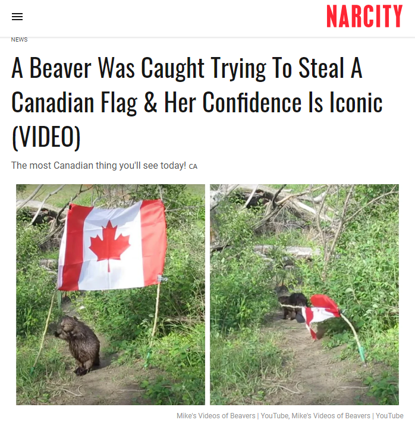
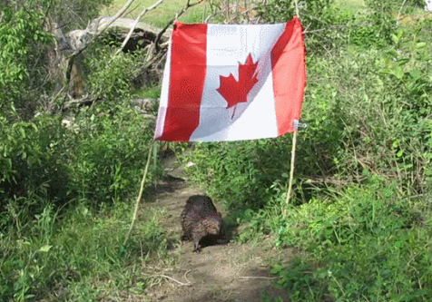

# 无标题

**链接地址:** http://mp.weixin.qq.com/s?__biz=MzIzODc2NzU4NA==&mid=2247577877&idx=4&sn=b2d33dd758a9938e71449124f936c9d8&chksm=e937ad9ade40248cf1aae42cef2bca68563529a79136462ab0627502bb4064b9f2c49d564cdc&mpshare=1&scene=2&srcid=0624TsTllfw0B7nZJwJ2O45h&sharer_sharetime=1624490464992&sharer_shareid=be1c8edd6c93eec155a61c876e41d26a#rd
**作者:** 晓晨
**获取时间:** 2025/8/28 19:45:25
**图片数量:** 15

---

## 原始HTML内容

<section style="text-align: center;line-height: 2em;" data-mpa-powered-by="yiban.io">说起加拿大国兽--河狸！</section><section style="text-align: center;line-height: 2em;">这个动物一直是神一样的存在～</section><section style="text-align: center;line-height: 2em;">别看TA们平时懒洋洋的</section><section style="text-align: center;line-height: 2em;">但是调皮起来一点都不含糊。</section><section style="text-align: center;line-height: 2em;"> </section>

<section style="text-align: center;line-height: 2em;"> </section><section style="text-align: center;line-height: 2em;">今年2月的时候</section><section style="text-align: center;line-height: 2em;">多伦多TTC地铁站</section><section style="text-align: center;line-height: 2em;">就闯入了一只河狸</section><section style="text-align: center;line-height: 2em;">（回顾：<a target="_blank" href="http://mp.weixin.qq.com/s?__biz=MjM5MDEzNzY2NQ==&amp;mid=2652811645&amp;idx=5&amp;sn=ffcfd74b4b673f9c023f2acc930236ab&amp;chksm=bda37d538ad4f4453dd46a03f48112463dac19bf21a1afb95a9bff9ecdd5c6c8efe42aa1c68f&amp;scene=21#wechat_redirect" data-itemshowtype="0" tab="innerlink" data-linktype="2">多伦多地铁出现了一只加拿大国兽！一度关闭</a>）</section><section style="text-align: center;line-height: 2em;">结果地铁站一度关闭！</section><section style="text-align: center;line-height: 2em;">后来城市管理，警察</section><section style="text-align: center;line-height: 2em;">和动物控制部门合作救出这只河狸，</section><section style="text-align: center;line-height: 2em;"><strong>并把TA护送回附近森林。</strong></section><section style="text-align: center;line-height: 2em;"><strong> </strong></section>

<section style="text-align: center;line-height: 2em;"> </section><section style="text-align: center;line-height: 2em;">而现在。。。</section><section style="text-align: center;line-height: 2em;">就在加拿大国庆节即将到来之际</section>
又有一只“国兽”秒变&nbsp;<strong>戏精！</strong>
<section style="text-align: center;line-height: 2em;">把一面加拿大旗给偷跑了</section><section style="text-align: center;line-height: 2em;">而且全程被拍~</section>

<section style="text-align: center;line-height: 2em;"> </section><section style="text-align: center;line-height: 2em;">事情是这样的。。。 </section><section style="text-align: center;line-height: 2em;"> </section><section style="text-align: center;line-height: 2em;">加拿大萨斯卡通摄影师Mike Digout</section><section style="text-align: center;line-height: 2em;">有个<strong>专门拍摄海狸日常</strong>的YouTube频道</section><section style="text-align: center;line-height: 2em;">他在6月19日意外捕捉到这一有趣时刻～</section><section style="text-align: center;line-height: 2em;"> </section>

<section style="text-align: center;line-height: 2em;"> </section><section style="text-align: center;line-height: 2em;"> </section><section style="text-align: center;line-height: 2em;">这是海狸的名字叫做Spud</section><section style="text-align: center;line-height: 2em;">本来，他是希望拍</section><section style="text-align: center;line-height: 2em;">海狸在撑起的旗下行走的视频～</section><section style="text-align: center;line-height: 2em;"> </section>
结果。。。

 
<section style="text-align: center;line-height: 2em;">人家戏精上身你们感受一下~</section><section style="text-align: center;line-height: 2em;">我撩，我撩，我撩撩撩</section><section style="text-align: center;line-height: 2em;"> </section><section style="text-align: center;line-height: 2em;"></section><section style="text-align: center;line-height: 2em;"> </section><section style="text-align: center;line-height: 2em;">海狸宝宝 </section><section style="text-align: center;line-height: 2em;">貌似对偷走这面旗很感兴趣</section><section style="text-align: center;line-height: 2em;"> </section>

 

好像够不着！？

 

 

有了，我拔！

 

 

嘿哟嘿哟拔旗帜， 嘿哟嘿哟拔不动。 

 

 

我咬~咬来咬去咬不动 

 

 

成功了！ 

 

 

我跑，我跑，我跑跑跑~

 

 
<section style="text-align: center;line-height: 2em;">不得不说</section><section style="text-align: center;line-height: 2em;"><strong>Oh Canada！</strong></section><section style="text-align: center;line-height: 2em;">加拿大的“神兽”</section><section style="text-align: center;line-height: 2em;">真的是太萌了~</section><section style="margin-right: 8px;margin-left: 8px;font-family: -apple-system, BlinkMacSystemFont, &quot;Helvetica Neue&quot;, &quot;PingFang SC&quot;, &quot;Hiragino Sans GB&quot;, &quot;Microsoft YaHei UI&quot;, &quot;Microsoft YaHei&quot;, Arial, sans-serif;letter-spacing: 0.544px;white-space: normal;font-size: 15px;background-color: rgb(255, 255, 255);text-align: center;line-height: 2em;"> </section><section style="margin-right: 8px;margin-left: 8px;font-family: -apple-system, BlinkMacSystemFont, &quot;Helvetica Neue&quot;, &quot;PingFang SC&quot;, &quot;Hiragino Sans GB&quot;, &quot;Microsoft YaHei UI&quot;, &quot;Microsoft YaHei&quot;, Arial, sans-serif;letter-spacing: 0.544px;white-space: normal;font-size: 15px;background-color: rgb(255, 255, 255);text-align: center;line-height: 2em;">---更多新鲜事快关注爆料君↓↓---</section><section style="margin-right: 8px;margin-left: 8px;font-family: -apple-system, BlinkMacSystemFont, &quot;Helvetica Neue&quot;, &quot;PingFang SC&quot;, &quot;Hiragino Sans GB&quot;, &quot;Microsoft YaHei UI&quot;, &quot;Microsoft YaHei&quot;, Arial, sans-serif;letter-spacing: 0.544px;white-space: normal;font-size: 15px;background-color: rgb(255, 255, 255);text-align: center;line-height: 2em;"></section><section style="margin-right: 8px;margin-left: 8px;font-family: -apple-system, BlinkMacSystemFont, &quot;Helvetica Neue&quot;, &quot;PingFang SC&quot;, &quot;Hiragino Sans GB&quot;, &quot;Microsoft YaHei UI&quot;, &quot;Microsoft YaHei&quot;, Arial, sans-serif;letter-spacing: 0.544px;white-space: normal;font-size: 15px;background-color: rgb(255, 255, 255);text-align: right;line-height: 2em;">我知道你<strong>在看</strong>哟</section><section style="text-align: center;line-height: 2em;"> </section>

---

## 纯文本内容

说起加拿大国兽--河狸！这个动物一直是神一样的存在～别看TA们平时懒洋洋的但是调皮起来一点都不含糊。今年2月的时候多伦多TTC地铁站就闯入了一只河狸（回顾：多伦多地铁出现了一只加拿大国兽！一度关闭）结果地铁站一度关闭！后来城市管理，警察和动物控制部门合作救出这只河狸，并把TA护送回附近森林。而现在。。。就在加拿大国庆节即将到来之际又有一只“国兽”秒变 戏精！把一面加拿大旗给偷跑了而且全程被拍~事情是这样的。。。加拿大萨斯卡通摄影师Mike Digout有个专门拍摄海狸日常的YouTube频道他在6月19日意外捕捉到这一有趣时刻～这是海狸的名字叫做Spud本来，他是希望拍海狸在撑起的旗下行走的视频～结果。。。人家戏精上身你们感受一下~我撩，我撩，我撩撩撩海狸宝宝貌似对偷走这面旗很感兴趣好像够不着！？有了，我拔！嘿哟嘿哟拔旗帜， 嘿哟嘿哟拔不动。我咬~咬来咬去咬不动成功了！我跑，我跑，我跑跑跑~不得不说Oh Canada！加拿大的“神兽”真的是太萌了~---更多新鲜事快关注爆料君↓↓---我知道你在看哟

---

## 图片列表

-  (原始链接: https://mmbiz.qpic.cn/mmbiz_gif/4kibCXA1QiblQbEGdBCibZWUUFCpSU9osL2aEiaYYxab93uicfbcCPvUx3EMXSZG1Ch1Gia9FK392NrkYBLXpXVkBlEg/640?wx_fmt=gif)
-  (原始链接: https://mmbiz.qpic.cn/mmbiz_png/4kibCXA1QiblQbEGdBCibZWUUFCpSU9osL2iaK4DhHW2vepkRGMUrv59XXn2fjhx5dj4Vc5OKawv8tAjURA2bt1VfA/640?wx_fmt=png)
-  (原始链接: https://mmbiz.qpic.cn/mmbiz_png/4kibCXA1QiblQbEGdBCibZWUUFCpSU9osL2EWic2WO4eqUvXoY89c2u89u16DEY50G3G8VqJaicyySC5AosozoiarDHw/640?wx_fmt=png)
-  (原始链接: https://mmbiz.qpic.cn/mmbiz_gif/4kibCXA1QiblQbEGdBCibZWUUFCpSU9osL2dtrzicQ9hPOdUGgseyReKevh0GBOWxVElicb1zqSgQ6uNOBuMPjicB3fA/640?wx_fmt=gif)
-  (原始链接: https://mmbiz.qpic.cn/mmbiz_gif/4kibCXA1QiblQbEGdBCibZWUUFCpSU9osL2Qj6zJwsWAWSdhlj79jG6AuHVIvoQjgUhwo8XBBr23KErYJh0WTVoOg/640?wx_fmt=gif)
-  (原始链接: https://mmbiz.qpic.cn/mmbiz_png/4kibCXA1QiblQbEGdBCibZWUUFCpSU9osL25VXibn8Zib9Cia0WzajXiaic0XgVq3xwCPRP9dFO9JnSzaHehQjNt5b3pGA/640?wx_fmt=png)
-  (原始链接: https://mmbiz.qpic.cn/mmbiz_gif/4kibCXA1QiblQbEGdBCibZWUUFCpSU9osL2HV0yR0EXtBTysIAvoiaH5eDCQj6hjNRyBtp56ibBica7rMicB2oTfnKVpw/640?wx_fmt=gif)
-  (原始链接: https://mmbiz.qpic.cn/mmbiz_gif/4kibCXA1QiblQbEGdBCibZWUUFCpSU9osL2x1tSdP0h5wwT6EbV44yibPgPcGjoqibsPcQmtdxUw5dUCmdJd8jicibdlQ/640?wx_fmt=gif)
-  (原始链接: https://mmbiz.qpic.cn/mmbiz_gif/4kibCXA1QiblQbEGdBCibZWUUFCpSU9osL2DEcEmiaicgWlX8Xbt3RsdzJumiazTsNCZnzA4rPhvH9OJrDicUnHfj8Azg/640?wx_fmt=gif)
-  (原始链接: https://mmbiz.qpic.cn/mmbiz_gif/4kibCXA1QiblQbEGdBCibZWUUFCpSU9osL2BabrTsZpOjnJueCxtL2D6xn6nSGT908un1IMloas3sYhk9xrMp8CXg/640?wx_fmt=gif)
-  (原始链接: https://mmbiz.qpic.cn/mmbiz_gif/4kibCXA1QiblQbEGdBCibZWUUFCpSU9osL2dYnB3EBEmY4sTMvXnoBDHwSGxh9pibiaCiasBPpwYMVkzzzQibWaf2Gic6g/640?wx_fmt=gif)
-  (原始链接: https://mmbiz.qpic.cn/mmbiz_gif/4kibCXA1QiblQbEGdBCibZWUUFCpSU9osL29z2w0YJU7rm3y0spzhNZKlBAIRjfxqQz03zysO0cX9iaQHyQgrxd7Eg/640?wx_fmt=gif)
-  (原始链接: https://mmbiz.qpic.cn/mmbiz_png/4kibCXA1QiblQbEGdBCibZWUUFCpSU9osL2t1kOl4jTg7llFn8JkWEmQ4k2ZyBYbVUvnwFX0th7T6xUwHY1fYRnsg/640?wx_fmt=png)
-  (原始链接: https://mmbiz.qpic.cn/mmbiz_jpg/4kibCXA1QiblQP96CmKKHiccCtN9hgqhnJnEAsGhopCweCK5o2HJIBGcjRHwcEsWp5X5FsGPoqzkfoJuia3lXg5IyQ/640?wx_fmt=jpeg)
-  (原始链接: https://mmbiz.qpic.cn/mmbiz_png/4kibCXA1QiblQug50tXk99ru2wcTEJdUcnE6FE2kKqbsbbo0kHUo6G2z4754u4kZVMQasLnU1iaXGSJc9j0hw7ibow/640?wx_fmt=png)
