# 无标题

**链接地址:** http://mp.weixin.qq.com/s?__biz=MjM5MDEzNzY2NQ==&mid=2652821614&idx=1&sn=f4509a3f1ec009481b0f7c048caec939&chksm=bda314408ad49d56c582dd71040d904a56ea91dd315a16cd0edd1451feca855464cf36e6521e&mpshare=1&scene=2&srcid=0702WO9XxSDBkM4RzgisuiAp&sharer_sharetime=1625173435506&sharer_shareid=be1c8edd6c93eec155a61c876e41d26a#rd
**作者:** 晓晨
**获取时间:** 2025/8/28 19:44:59
**图片数量:** 30

---

## 原始HTML内容

<section style="text-align: center;line-height: 2em;margin-left: 16px;margin-right: 16px;">+++上方是广告+++ </section><section style="text-align: center;line-height: 2em;margin-left: 16px;margin-right: 16px;"> </section><section style="text-align: left;line-height: 2em;margin-left: 16px;margin-right: 16px;">今天是加拿大国庆日假期。</section><section style="text-align: left;line-height: 2em;margin-left: 16px;margin-right: 16px;"><strong> </strong></section><section style="text-align: left;line-height: 2em;margin-left: 16px;margin-right: 16px;">从今天开始，加拿大又有一些重要新政法规正式开始实施了。这些新规中有不少和大家生活息息相关。<strong>开车超速危险驾驶</strong><strong>将面对更严厉的惩罚，新税实施4类东西</strong><strong>价格大涨</strong><strong>，还有</strong><strong>加拿大入境新规</strong><strong>马上生效，符合资格的留学生也可以免隔离......</strong>一起来了解下。</section><section style="text-align: left;line-height: 2em;margin-left: 16px;margin-right: 16px;"> </section><section style="text-align: center;line-height: 2em;margin-left: 16px;margin-right: 16px;"></section><section style="text-align: center;line-height: 2em;margin-left: 16px;margin-right: 16px;"> </section><section style="text-align: center;line-height: 2em;margin-left: 16px;margin-right: 16px;"> </section><section style="text-align: center;line-height: 2em;margin-left: 16px;margin-right: 16px;"><strong>安省危险驾驶新法实施</strong></section><section style="text-align: center;line-height: 2em;margin-left: 16px;margin-right: 16px;"><strong>超速被罚更严</strong></section><section style="line-height: 2em;margin-left: 16px;margin-right: 16px;"> </section><section style="line-height: 2em;margin-left: 16px;margin-right: 16px;">多伦多老司机们注意！从今天2021年7月1日开始，安省正式实施新危险驾驶法。<strong>千万别狂超速，否则会很惨。</strong> </section><section style="line-height: 2em;margin-left: 16px;margin-right: 16px;"> </section><section style="line-height: 2em;margin-left: 16px;margin-right: 16px;">据CTV报道，安省已对司机在一些道路上的超速标准进行更改，<strong>超速40km</strong><strong>就会面临特技驾驶（stunt driving）指控，</strong>而此前的标准是超速50km。</section><section style="line-height: 2em;margin-left: 16px;margin-right: 16px;"><strong> </strong></section><section style="line-height: 2em;margin-left: 16px;margin-right: 16px;">而且一旦被抓到特技驾驶，<strong>马上吊销驾照</strong>！被定罪者<strong>最短1年，重者终生不得驾驶。</strong></section><section style="text-align: center;line-height: 2em;margin-left: 16px;margin-right: 16px;"> </section><section style="text-align: center;line-height: 2em;margin-left: 16px;margin-right: 16px;"></section><section style="line-height: 2em;margin-left: 16px;margin-right: 16px;"> </section><section style="line-height: 2em;margin-left: 16px;margin-right: 16px;">这些变化是根据《让安大略人更安全法案》做出的，于今天（7月1日）起已经生效。</section><section style="line-height: 2em;margin-left: 16px;margin-right: 16px;"> </section><section style="line-height: 2em;margin-left: 16px;margin-right: 16px;"><strong>在限速为80km以下的道路上</strong>，超速40km就会被起诉！不过在80km或更高的道路或高速上规则保持不变。</section><section style="line-height: 2em;margin-left: 16px;margin-right: 16px;"> </section><section style="line-height: 2em;margin-left: 16px;margin-right: 16px;"></section><section style="line-height: 2em;margin-left: 16px;margin-right: 16px;"> </section><section style="line-height: 2em;margin-left: 16px;margin-right: 16px;">而因超速被抓到特技驾驶的司机也将面临更严厉的处罚。<strong>超速司机将被马上吊销驾驶执照30天以及14天的车辆扣押，</strong>此前的惩罚是一周。</section><section style="line-height: 2em;margin-left: 16px;margin-right: 16px;"> </section><section style="line-height: 2em;margin-left: 16px;margin-right: 16px;">本次新规对初犯特技驾驶的司机就给出了相当严厉的惩罚。一旦被定罪将面临： </section><ul class="list-paddingleft-2" style="list-style-type: disc;margin-left: 16px;margin-right: 16px;"><li style="color: rgb(0, 0, 0);font-weight: bold;">
<strong>最低罚款$2,000（最高$10,000元）</strong>
</li><li>
最长六个月的监禁。
</li><li style="font-weight: bold;">
<strong>扣六分。</strong>
</li><li>
驾照吊销至少一年，最长三年。
</li><li>
需要参加驾驶员教育课程。
</li></ul><section style="line-height: 2em;margin-left: 16px;margin-right: 16px;"> </section><section style="line-height: 2em;margin-left: 16px;margin-right: 16px;"></section><section style="line-height: 2em;margin-left: 16px;margin-right: 16px;">安省政府对因特技驾驶而<strong>被定罪的司机</strong>还实施逐步升级的定罪和驾照吊销措施。</section><ul class="list-paddingleft-2" style="width: 577.747px;margin-left: 16px;margin-right: 16px;"><li>
第1次初犯，至少一到三年
</li><li>
第2次犯，至少三到十年
</li><li>
第3次犯，终身吊销驾照，但日后可根据法规减少日期
</li><li style="font-weight: bold;">
<strong>对于第4次及更多的违规行为，将终身吊销驾照。</strong>
</li></ul><section style="line-height: 2em;margin-left: 16px;margin-right: 16px;"> </section><section style="line-height: 2em;margin-left: 16px;margin-right: 16px;">这个新法案是鉴于从2021年1月到5月底，与去年同期相比<strong>多伦多赛车和特技驾驶增加了90%的情况而立的新法。</strong></section><section style="text-align: center;line-height: 2em;margin-left: 16px;margin-right: 16px;"> </section><section style="text-align: center;line-height: 2em;margin-left: 16px;margin-right: 16px;"></section><section style="text-align: center;line-height: 2em;margin-left: 16px;margin-right: 16px;"> </section><section style="text-align: left;line-height: 2em;margin-left: 16px;margin-right: 16px;">而且，<strong>不要以为超速不超过40km就没事。</strong>安省警官Sal Carchidi在接受CBC采访时表示，新规主要虽然是针对住宅区街道的，但在多车道的道路也要重视，<strong>别以为在四车道的宽敞道路就可以开快些</strong>。</section><section style="text-align: left;line-height: 2em;margin-left: 16px;margin-right: 16px;"></section><section style="line-height: 2em;margin-left: 16px;margin-right: 16px;">他表示，任何贴着的限速的速度就是最高限速，<strong>别以为超过5km，超过10km就没事，</strong>当然尤其不能超过40km，否则后果很严重。</section><section style="line-height: 2em;margin-left: 16px;margin-right: 16px;"></section><section style="text-align: left;line-height: 2em;margin-left: 16px;margin-right: 16px;"> </section><section style="text-align: left;line-height: 2em;margin-left: 16px;margin-right: 16px;"> </section><section style="text-align: center;line-height: 2em;margin-left: 16px;margin-right: 16px;"><strong>加拿大永久居民旅行证</strong></section><section style="text-align: center;line-height: 2em;margin-left: 16px;margin-right: 16px;"><strong>只能在网上申请</strong></section><section style="text-align: left;line-height: 2em;margin-left: 16px;margin-right: 16px;"> </section><section style="text-align: left;line-height: 2em;margin-left: 16px;margin-right: 16px;">据加拿大移民局官网6月23日更新，在加拿大境外的永久居民如果需要申请旅行证（PRTD），从今天7月1日起在当地签证中心关闭的情况下只能通过网上申请。</section><section style="text-align: left;line-height: 2em;margin-left: 16px;margin-right: 16px;"> </section><section style="text-align: center;line-height: 2em;margin-left: 16px;margin-right: 16px;"> </section><section style="text-align: left;line-height: 2em;margin-left: 16px;margin-right: 16px;"> </section><section style="text-align: left;line-height: 2em;margin-left: 16px;margin-right: 16px;">加拿大驻中国签证中心近日也在官网宣布，自2021年6月1日起，申请人申请永久居民旅行证件的签证，<strong>需要通过邮件发送至加拿大移民、难民及公民部进行递交。</strong></section><section style="text-align: left;line-height: 2em;margin-left: 16px;margin-right: 16px;"> </section><section style="text-align: center;line-height: 2em;margin-left: 16px;margin-right: 16px;"></section><section style="text-align: left;line-height: 2em;margin-left: 16px;margin-right: 16px;"> </section><section style="text-align: left;line-height: 2em;margin-left: 16px;margin-right: 16px;">由于此更新流程的宽限期为一个月，所以<strong>从今天2021年7月1日起，永久居民旅行证件的签证申请将不再通过签证申请中心递交。</strong></section><section style="text-align: left;line-height: 2em;margin-left: 16px;margin-right: 16px;"> </section><section style="text-align: left;line-height: 2em;margin-left: 16px;margin-right: 16px;">申请步骤如下：</section><section style="text-align: left;line-height: 2em;margin-left: 16px;margin-right: 16px;">1.下载并按照说明指南，并按步骤完成申请。</section><section style="text-align: left;line-height: 2em;margin-left: 16px;margin-right: 16px;">2. 请将材料清单中所需资料扫描成电子版。</section><section style="text-align: left;line-height: 2em;margin-left: 16px;margin-right: 16px;">3. <strong>完整填写并扫描永久居民旅行证件申请表[IMM 5524]。</strong></section><section style="text-align: left;line-height: 2em;margin-left: 16px;margin-right: 16px;">4. 支付费用并获取收据凭证。</section><section style="text-align: left;line-height: 2em;margin-left: 16px;margin-right: 16px;">5. 如果已买好机票， 请附上已确认的航班机票，或前往加拿大的行程计划。材料应该明确体现以下内容</section><ul class="list-paddingleft-2" style="list-style-type: disc;margin-left: 16px;margin-right: 16px;"><li><section style="margin-left: 16px;margin-right: 16px;text-align: left;line-height: 2em;">航班信息</section></li><li><section style="margin-left: 16px;margin-right: 16px;text-align: left;line-height: 2em;">旅行日期</section></li><li><section style="margin-left: 16px;margin-right: 16px;text-align: left;line-height: 2em;">入境加拿大的机场信息</section></li></ul><section style="text-align: left;line-height: 2em;margin-left: 16px;margin-right: 16px;">6. 请将以下内容通过邮件发送至 IRCC.COVIDPRTD-TVRPCOVID.IRCC@cic.gc.ca</section><ul class="list-paddingleft-2" style="list-style-type: disc;margin-left: 16px;margin-right: 16px;"><li style="font-weight: bold;"><section style="margin-left: 16px;margin-right: 16px;text-align: left;line-height: 2em;"><strong>邮件标题注明“PRTD application: [申请人姓名]”</strong></section></li><li><section style="margin-left: 16px;margin-right: 16px;text-align: left;line-height: 2em;">扫描好的电子版申请表</section></li><li><section style="margin-left: 16px;margin-right: 16px;text-align: left;line-height: 2em;">辅助材料的电子版（包括相关旅行信息）</section></li><li><section style="margin-left: 16px;margin-right: 16px;text-align: left;line-height: 2em;">费用支付凭证</section></li><li><section style="margin-left: 16px;margin-right: 16px;text-align: left;line-height: 2em;">一份”出入境表“体现在递交申请前5年的旅行记录。这份文件应由申请人所在地的公安局出具，此项仅适用于中国护照持有者。此文件必须附有英语或者法语的翻译件。</section></li></ul><section style="text-align: left;line-height: 2em;margin-left: 16px;margin-right: 16px;">7. 申请一旦被批准，<strong>签证处将会发送一封“递交护照通知信”到电子邮箱。</strong></section><section style="text-align: left;line-height: 2em;margin-left: 16px;margin-right: 16px;"><strong> </strong></section><section style="text-align: center;line-height: 2em;margin-left: 16px;margin-right: 16px;"><strong style="padding: 0px 0.5em;"></strong></section><section style="text-align: left;line-height: 2em;margin-left: 16px;margin-right: 16px;"> </section><section style="text-align: left;line-height: 2em;margin-left: 16px;margin-right: 16px;">今天起证实生效的电子申请旅行证的新规，简化了材料，同时也降低了丢失邮寄重要材料的风险。可以说是个好消息！</section><section style="text-align: left;line-height: 2em;margin-left: 16px;margin-right: 16px;"> </section><section style="text-align: left;line-height: 2em;margin-left: 16px;margin-right: 16px;">加拿大签证中心官网参考链接：https://visa.vfsglobal.com/chn/zh/can/news/prtd-process</section><section style="text-align: left;line-height: 2em;margin-left: 16px;margin-right: 16px;">加拿大移民局相关网址：https://www.canada.ca/en/immigration-refugees-citizenship/services/coronavirus-covid19/permanent-residents.html#outsidecanada</section><section style="text-align: left;line-height: 2em;margin-left: 16px;margin-right: 16px;"> </section><section style="text-align: center;line-height: 2em;margin-left: 16px;margin-right: 16px;"><strong>电商平台正式加新税</strong></section><section style="text-align: center;line-height: 2em;margin-left: 16px;margin-right: 16px;"><strong>4类东西可能更贵了</strong></section><section style="text-align: left;line-height: 2em;margin-left: 16px;margin-right: 16px;"> </section><section style="text-align: left;line-height: 2em;margin-left: 16px;margin-right: 16px;">加拿大联邦政府于4月19日公布的新预算案，其中重要一项就是对<strong>面向加拿大消费者的电商网购平台征收新的销售税GST/HST。</strong></section><section style="text-align: left;line-height: 2em;margin-left: 16px;margin-right: 16px;"><strong> </strong></section><section style="text-align: center;line-height: 2em;margin-left: 16px;margin-right: 16px;"><strong style="padding: 0px 0.5em;"></strong></section><section style="text-align: left;line-height: 2em;margin-left: 16px;margin-right: 16px;"> </section><section style="text-align: left;line-height: 2em;margin-left: 16px;margin-right: 16px;">这个新的税项从今天7月1日起正式实施。<strong>受影响的包括在线平台和电子商务仓库等。</strong></section><section style="text-align: left;line-height: 2em;margin-left: 16px;margin-right: 16px;"> </section><section style="text-align: left;line-height: 2em;margin-left: 16px;margin-right: 16px;">而这些新税可能会直接影响加拿大人平时购买的各种商品服务的价格，因为这些东西成本攀升。受影响的包括4类东西：</section><section style="text-align: left;line-height: 2em;margin-left: 16px;margin-right: 16px;"> </section><section style="text-align: left;line-height: 2em;margin-left: 16px;margin-right: 16px;">1，<strong>亚马逊（Amazon）加拿大站点将于今天起征收服务税/销售税（GST/HST）。</strong></section><section style="text-align: left;line-height: 2em;margin-left: 16px;margin-right: 16px;"> </section><section style="text-align: left;line-height: 2em;margin-left: 16px;margin-right: 16px;"><strong>亚马逊对加拿大站点卖家提供的服务要收税了。</strong>这包括在亚马逊上“我要开店”费用；广告费和亚马逊物流 (FBA) 服务费（如取件及包装费和运费）等。</section><section style="text-align: left;line-height: 2em;margin-left: 16px;margin-right: 16px;"> </section><section style="text-align: center;line-height: 2em;margin-left: 16px;margin-right: 16px;"></section><section style="text-align: left;line-height: 2em;margin-left: 16px;margin-right: 16px;"> </section><section style="text-align: left;line-height: 2em;margin-left: 16px;margin-right: 16px;">虽然这个是针对买家的新税收，但预计可能最终会转嫁到消费者身上。</section><section style="text-align: left;line-height: 2em;margin-left: 16px;margin-right: 16px;"> </section><section style="text-align: left;line-height: 2em;margin-left: 16px;margin-right: 16px;">2，<strong>Netflix等视频服务、Prime、Disney 和其他视频流服务。</strong></section><section style="text-align: left;line-height: 2em;margin-left: 16px;margin-right: 16px;"> </section><section style="text-align: left;line-height: 2em;margin-left: 16px;margin-right: 16px;">从2021年7月1日起，在加拿大可用的国际流媒体服务将要交付GST/HST消费税。这意味着，包括：<strong>Netflix、Amazon Prime Video、Disney等视频服务公司收费可能会涨。</strong></section><section style="text-align: left;line-height: 2em;margin-left: 16px;margin-right: 16px;"><strong> </strong></section><section style="text-align: center;line-height: 2em;margin-left: 16px;margin-right: 16px;"></section><section style="text-align: left;line-height: 2em;margin-left: 16px;margin-right: 16px;"> </section><section style="text-align: left;line-height: 2em;margin-left: 16px;margin-right: 16px;">但 Crave等加拿大本地服务将不会受到影响。目前尚不清楚所有这些服务是否会马上提高订阅成本以平衡新税，但Netflix已经确认价格会上涨。</section><section style="text-align: left;line-height: 2em;margin-left: 16px;margin-right: 16px;"> </section><section style="text-align: left;line-height: 2em;margin-left: 16px;margin-right: 16px;">3，<strong>Spotify 等音乐流媒体服务</strong></section><section style="text-align: left;line-height: 2em;margin-left: 16px;margin-right: 16px;"> </section><section style="text-align: left;line-height: 2em;margin-left: 16px;margin-right: 16px;">和视频服务一样，音乐流媒体也面临“数字销售税”的征收。非加拿大音乐流媒体须支付GST/HST。</section><section style="text-align: left;line-height: 2em;margin-left: 16px;margin-right: 16px;"> </section><section style="text-align: left;line-height: 2em;margin-left: 16px;margin-right: 16px;"><strong>这将影响Spotify和Amazon Music等。</strong>目前尚不清楚这些服务是否会马上涨价以应对数字销售税，专家认为这是可能的。</section><section style="text-align: left;line-height: 2em;margin-left: 16px;margin-right: 16px;"> </section><section style="text-align: center;line-height: 2em;margin-left: 16px;margin-right: 16px;"></section><section style="text-align: left;line-height: 2em;margin-left: 16px;margin-right: 16px;"> </section><section style="text-align: left;line-height: 2em;margin-left: 16px;margin-right: 16px;">至于Apple苹果公司音乐服务，虽然它不是一家加拿大公司，但该公司自2019年以来，一直自愿为Apple Music和iTunes收取和支付GST/HST，因此其价格不太可能受税收变化影响。</section><section style="text-align: left;line-height: 2em;margin-left: 16px;margin-right: 16px;"> </section><section style="text-align: left;line-height: 2em;margin-left: 16px;margin-right: 16px;">4，<strong>手机应用程式App</strong></section><section style="text-align: left;line-height: 2em;margin-left: 16px;margin-right: 16px;"> </section><section style="text-align: left;line-height: 2em;margin-left: 16px;margin-right: 16px;">数字销售税还将涵盖非加拿大分销平台运营商，<strong>例如 Google Play。</strong>不过Apple App Store则不太可能受影响。</section><section style="text-align: left;line-height: 2em;margin-left: 16px;margin-right: 16px;"><strong> </strong></section><section style="text-align: center;padding: 0px 0.5em;line-height: 2em;margin-left: 16px;margin-right: 16px;"></section><section style="text-align: center;line-height: 2em;margin-left: 16px;margin-right: 16px;"> </section><section style="text-align: center;line-height: 2em;margin-left: 16px;margin-right: 16px;"><strong>加拿大药物定价新法</strong></section><section style="text-align: center;line-height: 2em;margin-left: 16px;margin-right: 16px;"><strong>被延至7月1日生效</strong></section><section style="text-align: left;line-height: 2em;margin-left: 16px;margin-right: 16px;"> </section><section style="text-align: left;line-height: 2em;margin-left: 16px;margin-right: 16px;">加拿大卫生部今年1月就表示，由于新冠疫情影响，<strong>原定1月1日起实施的药品定价制度须</strong><strong>推迟至7月1日生效</strong><strong>。</strong></section><section style="text-align: left;line-height: 2em;margin-left: 16px;margin-right: 16px;"><strong> </strong></section><section style="text-align: left;line-height: 2em;margin-left: 16px;margin-right: 16px;"><strong></strong></section><section style="text-align: center;line-height: 2em;margin-left: 16px;margin-right: 16px;"> </section><section style="text-align: left;line-height: 2em;margin-left: 16px;margin-right: 16px;">卫生部发言人Geoffroy Legault-Thivierge说，专利药品法规的修正案本来计划于1月1日生效，但由于大流行给制药商带来新的挑战，故将生效日推迟到7月1日。</section><section style="text-align: left;line-height: 2em;margin-left: 16px;margin-right: 16px;"> </section><section style="text-align: center;line-height: 2em;margin-left: 16px;margin-right: 16px;"></section><section style="text-align: left;line-height: 2em;margin-left: 16px;margin-right: 16px;"> </section><section style="text-align: left;line-height: 2em;margin-left: 16px;margin-right: 16px;">这项新法规主要是让专利药物价格审查委员会（Patented Medicine Prices Review Board）能够更多参考世界其他国家的药物价格，而不只是与药价最高的美国和瑞士做比较<strong>，以制定出更合理的药物定价。</strong></section><section style="text-align: left;line-height: 2em;margin-left: 16px;margin-right: 16px;"><strong> </strong></section><section style="text-align: left;line-height: 2em;margin-left: 16px;margin-right: 16px;"><strong></strong></section><section style="text-align: left;line-height: 2em;margin-left: 16px;margin-right: 16px;"> </section><section style="text-align: left;line-height: 2em;margin-left: 16px;margin-right: 16px;">加拿大卫生部表示，这个新规可能在未来10年为国民节省多达$130亿元专利药物开支。</section><section style="text-align: left;line-height: 2em;margin-left: 16px;margin-right: 16px;"> </section><section style="line-height: 2em;margin-left: 16px;margin-right: 16px;text-align: center;"><strong>欧盟取消旅行限制</strong></section><section style="line-height: 2em;margin-left: 16px;margin-right: 16px;text-align: center;"><strong><strong style="font-size: 18px;text-align: center;white-space: normal;">加拿大人有望</strong>去欧洲</strong><strong style="font-size: 18px;">免隔离旅游</strong></section><section style="line-height: 2em;margin-left: 16px;margin-right: 16px;"> </section><section style="line-height: 2em;margin-left: 16px;margin-right: 16px;">就在今天，<strong>欧盟刚刚取消对加拿大等10个国家的旅行限制，</strong>建议其成员国开始逐步取消对加拿大人的旅行限制，为前往该地区的非必要旅行敞开大门。</section><section style="line-height: 2em;margin-left: 16px;margin-right: 16px;"> </section><section style="line-height: 2em;margin-left: 16px;margin-right: 16px;">据Global News报道，加拿大是欧盟7月1日宣布应允许出于非必要目的前往该地区的10个国家之一。另外国家还包括阿塞拜疆、亚美尼亚、约旦、黑山等。</section>
 

<section style="line-height: 2em;margin-left: 16px;margin-right: 16px;"> </section><section style="line-height: 2em;margin-left: 16px;margin-right: 16px;">新该公告使该名单上的免旅行限制国家总数达到 23 个。但是，由<strong style="font-size: 16px;">欧盟成员国有权最终决定是否开始向游客重新开放边境</strong>及其过程。</section><section style="line-height: 2em;margin-left: 16px;margin-right: 16px;"> </section><section style="line-height: 2em;margin-left: 16px;margin-right: 16px;text-align: center;"></section><section style="line-height: 2em;margin-left: 16px;margin-right: 16px;"> </section><section style="line-height: 2em;margin-left: 16px;margin-right: 16px;">欧盟理事会于2020年6月30 日（几乎整整一年前）首次通过了关于逐步取消非必要旅行限制的建议。该列表每两周审查一次，以确定是否应该更改建议。</section><section style="line-height: 2em;margin-left: 16px;margin-right: 16px;"> </section><section style="line-height: 2em;margin-left: 16px;margin-right: 16px;">就在一个多月前，即5月20日，鉴于世界各地正在进行的疫苗接种工作，委员会开始改变其建议。<strong>该组织对完全接种疫苗的人实行了一些豁免，并开始放宽取消限制的标准。</strong></section><section style="line-height: 2em;margin-left: 16px;margin-right: 16px;"></section><section style="line-height: 2em;margin-left: 16px;margin-right: 16px;"> </section><section style="line-height: 2em;margin-left: 16px;margin-right: 16px;text-align: center;"></section><section style="line-height: 2em;margin-left: 16px;margin-right: 16px;"> </section><section style="line-height: 2em;margin-left: 16px;margin-right: 16px;">欧盟此前推出内部疫苗护照计划，<strong>允许成员国在彼此的之间更自由地旅行，</strong>并有朝一日可以让完全接种了疫苗的加拿大人也可以更轻松地去欧洲旅游。</section><section style="line-height: 2em;margin-left: 16px;margin-right: 16px;"> </section><section style="line-height: 2em;margin-left: 16px;margin-right: 16px;">但有一个问题：并非所有加拿大批准的 COVID-19 疫苗目前都被该计划认可。</section><section style="line-height: 2em;margin-left: 16px;margin-right: 16px;"> </section><section style="line-height: 2em;margin-left: 16px;margin-right: 16px;">加拿大已经批准了与欧盟相同的所有疫苗：Moderna、Pfizer、AstraZeneca 和 Janssen (Johnson &amp; Johnson)。</section><section style="line-height: 2em;margin-left: 16px;margin-right: 16px;"> </section><section style="line-height: 2em;margin-left: 16px;margin-right: 16px;">然而，<strong>加拿大给民众打的阿斯利康疫苗包括欧洲制造的阿斯利康和印度制造的同类产品——&nbsp;Covishield</strong>，但欧盟只批准了欧洲制造的版本。</section><section style="line-height: 2em;margin-left: 16px;margin-right: 16px;"> </section><section style="line-height: 2em;margin-left: 16px;margin-right: 16px;">这意味着，如果欧洲护照计划扩展到国际旅行者，那么接种过一剂 Covishield疫苗的加拿大人在前往欧盟的旅行时可能会遇到障碍。</section><section style="line-height: 2em;margin-left: 16px;margin-right: 16px;"> </section><section style="line-height: 2em;margin-left: 16px;margin-right: 16px;">根据政府数据，在加拿大有<strong>272,000人接种的是Covishield疫苗</strong>。</section><section style="line-height: 2em;margin-left: 16px;margin-right: 16px;"> </section>

<section style="line-height: 2em;margin-left: 16px;margin-right: 16px;"> </section><section style="line-height: 2em;margin-left: 16px;margin-right: 16px;">6月18日，特鲁多 表示，联邦政府“正在与各省合作，建立国家疫苗接种状况证明，该证明将在加拿大各地很容易被接受。为需要国际旅行的人打造的世界。”<strong>预计疫苗证明可能会“在秋季”提供。</strong></section><section style="line-height: 2em;margin-left: 16px;margin-right: 16px;"> </section><section style="line-height: 2em;margin-left: 16px;margin-right: 16px;">在接下来的几周内，将有更多关于加拿大人将被允许访问欧洲的详细信息。</section><section style="text-align: left;line-height: 2em;margin-left: 16px;margin-right: 16px;"> </section><section style="text-align: center;line-height: 2em;margin-left: 16px;margin-right: 16px;"><strong>7月5日</strong><strong style="font-size: 18px;">入境新规实施</strong></section><section style="text-align: center;line-height: 2em;margin-left: 16px;margin-right: 16px;"><strong style="font-size: 18px;">部分留学生也能免隔离</strong></section><section style="text-align: left;line-height: 2em;margin-left: 16px;margin-right: 16px;"> </section><section style="text-align: left;line-height: 2em;margin-left: 16px;margin-right: 16px;">加拿大联邦政府6月21日宣布将重开国门，实施放松入境旅客的边境措施第一阶段，<strong>从下周一7月5日开始，完全接种疫苗的入境者可免除隔离。</strong></section><section style="text-align: left;line-height: 2em;margin-left: 16px;margin-right: 16px;"><strong> </strong></section><section style="text-align: center;line-height: 2em;margin-left: 16px;margin-right: 16px;"><strong></strong></section><section style="text-align: left;line-height: 2em;margin-left: 16px;margin-right: 16px;"> </section><section style="text-align: left;line-height: 2em;margin-left: 16px;margin-right: 16px;">之前宣布的免隔离有两个条件，<strong>第一阶段只限于加拿大公民和PR永久移民，并且也只限于卫生部认可的四款疫。</strong></section><section style="text-align: center;line-height: 2em;margin-left: 16px;margin-right: 16px;"> </section><section style="text-align: center;line-height: 2em;margin-left: 16px;margin-right: 16px;"></section><section style="text-align: center;line-height: 2em;margin-left: 16px;margin-right: 16px;"> </section><section style="text-align: left;line-height: 2em;margin-left: 16px;margin-right: 16px;">但6月25日加拿大政府<strong>更新了入境加拿大旅行者的隔离赦免要求</strong>。旅行者，包括<strong>留学生，和临时工签者</strong>只要符合条件，也有资格豁免隔离和测试。</section><section style="text-align: left;line-height: 2em;margin-left: 16px;margin-right: 16px;"> </section><section style="text-align: left;line-height: 2em;margin-left: 16px;margin-right: 16px;">需要满足以下条件：</section><ul class="list-paddingleft-2" style="list-style-type: square;margin-left: 16px;margin-right: 16px;"><li style="font-size: 16px;"><section style="line-height: 2em;">有资格进入加拿大</section></li><li style="font-size: 16px;"><section style="line-height: 2em;">无症状</section></li><li style="font-size: 16px;"><section style="line-height: 2em;">满足加拿大政府对<strong>完全接种疫苗</strong>的旅客的要求</section></li><li style="font-size: 16px;"><section style="line-height: 2em;">满足所有其他入境要求，包括在抵达前在 ArriveCAN 中输入信息</section><section style="line-height: 2em;"> </section></li></ul><section style="line-height: 2em;margin-left: 16px;margin-right: 16px;">要被视为完全接种疫苗，旅行者必须在进入加拿大前<strong>至少 14 天接种了加拿大政府接受的疫苗或组合。</strong>（相关新闻：<a target="_blank" href="http://mp.weixin.qq.com/s?__biz=MjM5MDEzNzY2NQ==&amp;mid=2652820657&amp;idx=1&amp;sn=f38bb76a0ca69e8f4bb35fd11664a636&amp;chksm=bda3189f8ad491897530281b0890446703d18dc75e04af6b68bc00913adae82db5e3ddca06a2&amp;scene=21#wechat_redirect" data-itemshowtype="0" tab="innerlink" data-linktype="2">7月5日起加拿大完全接种者入境免隔离</a>）</section><section style="text-align: left;line-height: 2em;margin-left: 16px;margin-right: 16px;"> </section><section style="text-align: left;line-height: 2em;margin-left: 16px;margin-right: 16px;">目前，加拿大政府接受的疫苗只有四款：<strong>辉瑞、莫德纳、阿斯利康和强生。</strong></section><section style="text-align: left;line-height: 2em;margin-left: 16px;margin-right: 16px;"><strong> </strong></section><section style="text-align: center;line-height: 2em;padding: 0px 0.5em;margin-left: 16px;margin-right: 16px;"></section><section style="text-align: center;line-height: 2em;padding: 0px 0.5em;margin-left: 16px;margin-right: 16px;"> </section><section style="text-align: left;line-height: 2em;margin-left: 16px;margin-right: 16px;">完全接种疫苗的旅行者还必须没有任何新冠症状，持有其疫苗接种文件的纸质或数字副本，<strong>并在抵达加拿大之前通过ArriveCAN手机程序</strong>以电子方式提供COVID-19相关信息。（相关新闻：<a target="_blank" href="http://mp.weixin.qq.com/s?__biz=MzIzODc2NzU4NA==&amp;mid=2247577877&amp;idx=7&amp;sn=32285adf5de302cd1172526029c0c5fa&amp;chksm=e937ad9ade40248c26c3f4192d49d24db8bfe95e6475ea42e6b8a278cbd628ca71b7561ffaed&amp;scene=21#wechat_redirect" data-itemshowtype="0" tab="innerlink" data-linktype="2">出境或入境加拿大的人都要下载这个软件！一分钟带你了解ArriveCAN</a>）</section><section style="text-align: left;line-height: 2em;margin-left: 16px;margin-right: 16px;"> </section><section style="text-align: center;line-height: 2em;margin-left: 16px;margin-right: 16px;"><strong style="padding-right: 0.5em;padding-left: 0.5em;font-size: 16px;text-align: center;white-space: normal;"></strong></section><section style="text-align: left;line-height: 2em;margin-left: 16px;margin-right: 16px;"> </section><section style="text-align: left;line-height: 2em;margin-left: 16px;margin-right: 16px;">如果无法在手机上下载 ArriveCAN 应用程序，或在旅行时没有手机也有办法。加拿大公共卫生署 (PHAC) 表示，<strong>可以在抵达加拿大之前的 72 小时内在ArriveCAN 网站</strong>（https://arrivecan.cbsa-asfc.cloud-nuage.canada.ca/privacy）输入信息，然后打印出来或截屏，随身携带。</section><section style="text-align: left;line-height: 2em;margin-left: 16px;margin-right: 16px;"> </section><section style="text-align: center;line-height: 2em;margin-left: 16px;margin-right: 16px;"><strong>下半年即将实施新规早知道</strong></section><section style="text-align: left;line-height: 2em;margin-left: 16px;margin-right: 16px;"> </section><section style="text-align: left;line-height: 2em;margin-left: 16px;margin-right: 16px;">除了上述几大重要变化之外，接下去半年内也会有一些重要新规变化。</section><section style="text-align: left;line-height: 2em;margin-left: 16px;margin-right: 16px;"> </section><section style="text-align: left;line-height: 2em;margin-left: 16px;margin-right: 16px;">1，12月29日起，<strong>加拿大联邦最低工资上调至$15/小时</strong>。</section><section style="text-align: left;line-height: 2em;margin-left: 16px;margin-right: 16px;"> </section><section style="text-align: left;line-height: 2em;margin-left: 16px;margin-right: 16px;">加拿大就业和社会发展部于昨天（6月30日）宣布：加拿大联邦最低工资上涨将于 2021年12月29日生效。</section><section style="text-align: left;line-height: 2em;margin-left: 16px;margin-right: 16px;"> </section><section style="text-align: center;line-height: 2em;margin-left: 16px;margin-right: 16px;"></section><section style="text-align: left;line-height: 2em;margin-left: 16px;margin-right: 16px;"> </section><section style="text-align: left;line-height: 2em;margin-left: 16px;margin-right: 16px;">2，2022年1月1日起，<strong>多伦多海外买家税很有可能正式实施。</strong></section><section style="text-align: left;line-height: 2em;margin-left: 16px;margin-right: 16px;"> </section><section style="text-align: left;line-height: 2em;margin-left: 16px;margin-right: 16px;">这项针对外国投资者征收1％的空置税，对非加拿大公民或永久居民购房者购买的被认为是“空置”的房产征收1%的空置税。</section><section style="text-align: left;line-height: 2em;margin-left: 16px;margin-right: 16px;"> </section><section style="text-align: left;line-height: 2em;margin-left: 16px;margin-right: 16px;">3，<strong>“奢侈品”新税比如豪车，游艇，私人飞机，2022年初征收。</strong></section><section style="text-align: left;line-height: 2em;margin-left: 16px;margin-right: 16px;"> </section><section style="text-align: left;line-height: 2em;margin-left: 16px;margin-right: 16px;">价值<strong style="font-size: 16px;text-align: left;white-space: normal;">超过$100,000的豪车，私人飞机以及价值超过$250,000的船，</strong>从2022年初起要交税了。</section><section style="text-align: left;line-height: 2em;margin-left: 16px;margin-right: 16px;"> </section><section style="text-align: left;line-height: 2em;margin-left: 16px;margin-right: 16px;"><strong>再见2021年前半年，你好2021年后半年！</strong></section><section style="text-align: left;line-height: 2em;margin-left: 16px;margin-right: 16px;"> </section><section style="text-align: left;line-height: 2em;margin-left: 16px;margin-right: 16px;">这半年我们的生活发生了很多变化，随着加拿大疫苗接种势头喜人，祝愿下半年我们能迎来渐渐复原的生活。</section><section style="text-align: left;line-height: 2em;margin-left: 16px;margin-right: 16px;"> </section><section style="text-align: center;line-height: 2em;margin-left: 16px;margin-right: 16px;">另外，想必大家都有个小小的心愿。。。</section><section style="text-align: center;line-height: 2em;margin-left: 16px;margin-right: 16px;"></section><section style="text-align: left;line-height: 2em;margin-left: 16px;margin-right: 16px;"> </section><section style="text-align: center;line-height: 2em;margin-left: 16px;margin-right: 16px;"><strong>Happy Canada Day！</strong></section><section style="text-align: left;line-height: 2em;margin-left: 16px;margin-right: 16px;"> </section>
+++下方是广告+++

<a target="_blank" href="https://mp.weixin.qq.com/s?__biz=MjM5MDEzNzY2NQ==&amp;mid=2652821060&amp;idx=4&amp;sn=a7d23bba4f50f0f10e9d9ec60b77a017&amp;scene=21&amp;token=1618611921&amp;lang=zh_CN#wechat_redirect" textvalue="你已选中了添加链接的内容" tab="innerlink" data-linktype="1"></a>

 

+++全加拿大华人都在关注超级生活，就差你了+++ 
<section class="mp_profile_iframe_wrp"><mpprofile class="js_uneditable custom_select_card mp_profile_iframe" data-pluginname="mpprofile" data-id="MjM5MDEzNzY2NQ==" data-headimg="http://mmbiz.qpic.cn/mmbiz_png/szJas1pFaJd64rVWKaIiadk6ZAicIgsRBZZos2CozQMDqEJYXmIiaz7iaP79OuNevWd7CRx4Q8teicnWsqEnYPibNeicw/0?wx_fmt=png" data-nickname="超级生活" data-alias="superlifeca" data-signature="sUperLIFE.ca 加拿大最受欢迎的门户时尚生活网，移民留学生分享精彩生活的平台，集最热点的资讯，吃喝玩乐，消费，购物，时尚，旅游，房产，生活......" data-from="1"></mpprofile></section>
<strong style="letter-spacing: 0.544px;">喜欢就狠点两下吧</strong><strong style="letter-spacing: 0.544px;"></strong> 
<section style="text-align: left;line-height: 2em;margin-left: 16px;margin-right: 16px;"> </section>

---

## 纯文本内容

+++上方是广告+++今天是加拿大国庆日假期。从今天开始，加拿大又有一些重要新政法规正式开始实施了。这些新规中有不少和大家生活息息相关。开车超速危险驾驶将面对更严厉的惩罚，新税实施4类东西价格大涨，还有加拿大入境新规马上生效，符合资格的留学生也可以免隔离......一起来了解下。安省危险驾驶新法实施超速被罚更严多伦多老司机们注意！从今天2021年7月1日开始，安省正式实施新危险驾驶法。千万别狂超速，否则会很惨。据CTV报道，安省已对司机在一些道路上的超速标准进行更改，超速40km就会面临特技驾驶（stunt driving）指控，而此前的标准是超速50km。而且一旦被抓到特技驾驶，马上吊销驾照！被定罪者最短1年，重者终生不得驾驶。这些变化是根据《让安大略人更安全法案》做出的，于今天（7月1日）起已经生效。在限速为80km以下的道路上，超速40km就会被起诉！不过在80km或更高的道路或高速上规则保持不变。而因超速被抓到特技驾驶的司机也将面临更严厉的处罚。超速司机将被马上吊销驾驶执照30天以及14天的车辆扣押，此前的惩罚是一周。本次新规对初犯特技驾驶的司机就给出了相当严厉的惩罚。一旦被定罪将面临：最低罚款$2,000（最高$10,000元）最长六个月的监禁。扣六分。驾照吊销至少一年，最长三年。需要参加驾驶员教育课程。安省政府对因特技驾驶而被定罪的司机还实施逐步升级的定罪和驾照吊销措施。第1次初犯，至少一到三年第2次犯，至少三到十年第3次犯，终身吊销驾照，但日后可根据法规减少日期对于第4次及更多的违规行为，将终身吊销驾照。这个新法案是鉴于从2021年1月到5月底，与去年同期相比多伦多赛车和特技驾驶增加了90%的情况而立的新法。而且，不要以为超速不超过40km就没事。安省警官Sal Carchidi在接受CBC采访时表示，新规主要虽然是针对住宅区街道的，但在多车道的道路也要重视，别以为在四车道的宽敞道路就可以开快些。他表示，任何贴着的限速的速度就是最高限速，别以为超过5km，超过10km就没事，当然尤其不能超过40km，否则后果很严重。加拿大永久居民旅行证只能在网上申请据加拿大移民局官网6月23日更新，在加拿大境外的永久居民如果需要申请旅行证（PRTD），从今天7月1日起在当地签证中心关闭的情况下只能通过网上申请。加拿大驻中国签证中心近日也在官网宣布，自2021年6月1日起，申请人申请永久居民旅行证件的签证，需要通过邮件发送至加拿大移民、难民及公民部进行递交。由于此更新流程的宽限期为一个月，所以从今天2021年7月1日起，永久居民旅行证件的签证申请将不再通过签证申请中心递交。申请步骤如下：1.下载并按照说明指南，并按步骤完成申请。2. 请将材料清单中所需资料扫描成电子版。3. 完整填写并扫描永久居民旅行证件申请表[IMM 5524]。4. 支付费用并获取收据凭证。5. 如果已买好机票， 请附上已确认的航班机票，或前往加拿大的行程计划。材料应该明确体现以下内容航班信息旅行日期入境加拿大的机场信息6. 请将以下内容通过邮件发送至 IRCC.COVIDPRTD-TVRPCOVID.IRCC@cic.gc.ca邮件标题注明“PRTD application: [申请人姓名]”扫描好的电子版申请表辅助材料的电子版（包括相关旅行信息）费用支付凭证一份”出入境表“体现在递交申请前5年的旅行记录。这份文件应由申请人所在地的公安局出具，此项仅适用于中国护照持有者。此文件必须附有英语或者法语的翻译件。7. 申请一旦被批准，签证处将会发送一封“递交护照通知信”到电子邮箱。今天起证实生效的电子申请旅行证的新规，简化了材料，同时也降低了丢失邮寄重要材料的风险。可以说是个好消息！加拿大签证中心官网参考链接：https://visa.vfsglobal.com/chn/zh/can/news/prtd-process加拿大移民局相关网址：https://www.canada.ca/en/immigration-refugees-citizenship/services/coronavirus-covid19/permanent-residents.html#outsidecanada电商平台正式加新税4类东西可能更贵了加拿大联邦政府于4月19日公布的新预算案，其中重要一项就是对面向加拿大消费者的电商网购平台征收新的销售税GST/HST。这个新的税项从今天7月1日起正式实施。受影响的包括在线平台和电子商务仓库等。而这些新税可能会直接影响加拿大人平时购买的各种商品服务的价格，因为这些东西成本攀升。受影响的包括4类东西：1，亚马逊（Amazon）加拿大站点将于今天起征收服务税/销售税（GST/HST）。亚马逊对加拿大站点卖家提供的服务要收税了。这包括在亚马逊上“我要开店”费用；广告费和亚马逊物流 (FBA) 服务费（如取件及包装费和运费）等。虽然这个是针对买家的新税收，但预计可能最终会转嫁到消费者身上。2，Netflix等视频服务、Prime、Disney 和其他视频流服务。从2021年7月1日起，在加拿大可用的国际流媒体服务将要交付GST/HST消费税。这意味着，包括：Netflix、Amazon Prime Video、Disney等视频服务公司收费可能会涨。但 Crave等加拿大本地服务将不会受到影响。目前尚不清楚所有这些服务是否会马上提高订阅成本以平衡新税，但Netflix已经确认价格会上涨。3，Spotify 等音乐流媒体服务和视频服务一样，音乐流媒体也面临“数字销售税”的征收。非加拿大音乐流媒体须支付GST/HST。这将影响Spotify和Amazon Music等。目前尚不清楚这些服务是否会马上涨价以应对数字销售税，专家认为这是可能的。至于Apple苹果公司音乐服务，虽然它不是一家加拿大公司，但该公司自2019年以来，一直自愿为Apple Music和iTunes收取和支付GST/HST，因此其价格不太可能受税收变化影响。4，手机应用程式App数字销售税还将涵盖非加拿大分销平台运营商，例如 Google Play。不过Apple App Store则不太可能受影响。加拿大药物定价新法被延至7月1日生效加拿大卫生部今年1月就表示，由于新冠疫情影响，原定1月1日起实施的药品定价制度须推迟至7月1日生效。卫生部发言人Geoffroy Legault-Thivierge说，专利药品法规的修正案本来计划于1月1日生效，但由于大流行给制药商带来新的挑战，故将生效日推迟到7月1日。这项新法规主要是让专利药物价格审查委员会（Patented Medicine Prices Review Board）能够更多参考世界其他国家的药物价格，而不只是与药价最高的美国和瑞士做比较，以制定出更合理的药物定价。加拿大卫生部表示，这个新规可能在未来10年为国民节省多达$130亿元专利药物开支。欧盟取消旅行限制加拿大人有望去欧洲免隔离旅游就在今天，欧盟刚刚取消对加拿大等10个国家的旅行限制，建议其成员国开始逐步取消对加拿大人的旅行限制，为前往该地区的非必要旅行敞开大门。据Global News报道，加拿大是欧盟7月1日宣布应允许出于非必要目的前往该地区的10个国家之一。另外国家还包括阿塞拜疆、亚美尼亚、约旦、黑山等。新该公告使该名单上的免旅行限制国家总数达到 23 个。但是，由欧盟成员国有权最终决定是否开始向游客重新开放边境及其过程。欧盟理事会于2020年6月30 日（几乎整整一年前）首次通过了关于逐步取消非必要旅行限制的建议。该列表每两周审查一次，以确定是否应该更改建议。就在一个多月前，即5月20日，鉴于世界各地正在进行的疫苗接种工作，委员会开始改变其建议。该组织对完全接种疫苗的人实行了一些豁免，并开始放宽取消限制的标准。欧盟此前推出内部疫苗护照计划，允许成员国在彼此的之间更自由地旅行，并有朝一日可以让完全接种了疫苗的加拿大人也可以更轻松地去欧洲旅游。但有一个问题：并非所有加拿大批准的 COVID-19 疫苗目前都被该计划认可。加拿大已经批准了与欧盟相同的所有疫苗：Moderna、Pfizer、AstraZeneca 和 Janssen (Johnson & Johnson)。然而，加拿大给民众打的阿斯利康疫苗包括欧洲制造的阿斯利康和印度制造的同类产品—— Covishield，但欧盟只批准了欧洲制造的版本。这意味着，如果欧洲护照计划扩展到国际旅行者，那么接种过一剂 Covishield疫苗的加拿大人在前往欧盟的旅行时可能会遇到障碍。根据政府数据，在加拿大有272,000人接种的是Covishield疫苗。6月18日，特鲁多 表示，联邦政府“正在与各省合作，建立国家疫苗接种状况证明，该证明将在加拿大各地很容易被接受。为需要国际旅行的人打造的世界。”预计疫苗证明可能会“在秋季”提供。在接下来的几周内，将有更多关于加拿大人将被允许访问欧洲的详细信息。7月5日入境新规实施部分留学生也能免隔离加拿大联邦政府6月21日宣布将重开国门，实施放松入境旅客的边境措施第一阶段，从下周一7月5日开始，完全接种疫苗的入境者可免除隔离。之前宣布的免隔离有两个条件，第一阶段只限于加拿大公民和PR永久移民，并且也只限于卫生部认可的四款疫。但6月25日加拿大政府更新了入境加拿大旅行者的隔离赦免要求。旅行者，包括留学生，和临时工签者只要符合条件，也有资格豁免隔离和测试。需要满足以下条件：有资格进入加拿大无症状满足加拿大政府对完全接种疫苗的旅客的要求满足所有其他入境要求，包括在抵达前在 ArriveCAN 中输入信息要被视为完全接种疫苗，旅行者必须在进入加拿大前至少 14 天接种了加拿大政府接受的疫苗或组合。（相关新闻：7月5日起加拿大完全接种者入境免隔离）目前，加拿大政府接受的疫苗只有四款：辉瑞、莫德纳、阿斯利康和强生。完全接种疫苗的旅行者还必须没有任何新冠症状，持有其疫苗接种文件的纸质或数字副本，并在抵达加拿大之前通过ArriveCAN手机程序以电子方式提供COVID-19相关信息。（相关新闻：出境或入境加拿大的人都要下载这个软件！一分钟带你了解ArriveCAN）如果无法在手机上下载 ArriveCAN 应用程序，或在旅行时没有手机也有办法。加拿大公共卫生署 (PHAC) 表示，可以在抵达加拿大之前的 72 小时内在ArriveCAN 网站（https://arrivecan.cbsa-asfc.cloud-nuage.canada.ca/privacy）输入信息，然后打印出来或截屏，随身携带。下半年即将实施新规早知道除了上述几大重要变化之外，接下去半年内也会有一些重要新规变化。1，12月29日起，加拿大联邦最低工资上调至$15/小时。加拿大就业和社会发展部于昨天（6月30日）宣布：加拿大联邦最低工资上涨将于 2021年12月29日生效。2，2022年1月1日起，多伦多海外买家税很有可能正式实施。这项针对外国投资者征收1％的空置税，对非加拿大公民或永久居民购房者购买的被认为是“空置”的房产征收1%的空置税。3，“奢侈品”新税比如豪车，游艇，私人飞机，2022年初征收。价值超过$100,000的豪车，私人飞机以及价值超过$250,000的船，从2022年初起要交税了。再见2021年前半年，你好2021年后半年！这半年我们的生活发生了很多变化，随着加拿大疫苗接种势头喜人，祝愿下半年我们能迎来渐渐复原的生活。另外，想必大家都有个小小的心愿。。。Happy Canada Day！+++下方是广告++++++全加拿大华人都在关注超级生活，就差你了+++喜欢就狠点两下吧

---

## 图片列表

-  (原始链接: https://mmbiz.qpic.cn/mmbiz_png/szJas1pFaJeH1CibEdwjo1ay468ph8xUsrWEGckiaGKYaOOIEEg3iaVt7uC3dwFD7hSyz3m6A5MMI67nebhmib9JicQ/640?wx_fmt=png)
-  (原始链接: https://mmbiz.qpic.cn/mmbiz_jpg/4kibCXA1QiblQNcIDCAickOcNutWw9I1kH1tIrqK4GDKHPSzicvu62ox1SKgssibSWxKNNo5NeOvfDfgiaTvu5kKI98g/640?wx_fmt=jpeg)
- 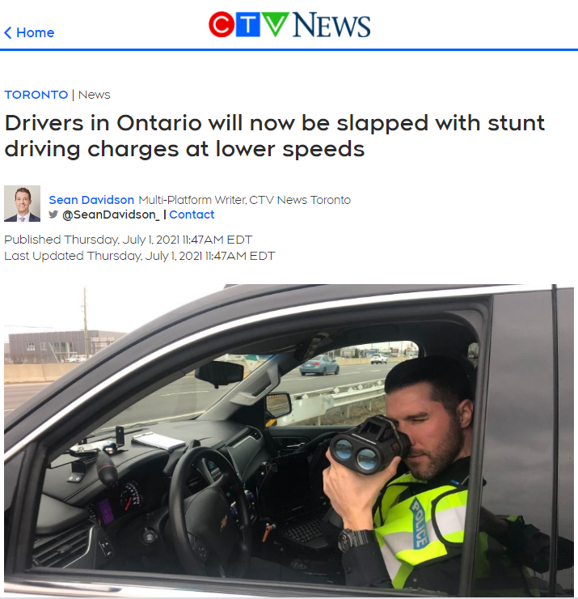 (原始链接: https://mmbiz.qpic.cn/mmbiz_png/4kibCXA1QiblQNcIDCAickOcNutWw9I1kH1Iw1XOQbYzta4vof2nAxDqhyt6rq731UkWCgvic2VyAycNEibMw5JcBvw/640?wx_fmt=png)
- 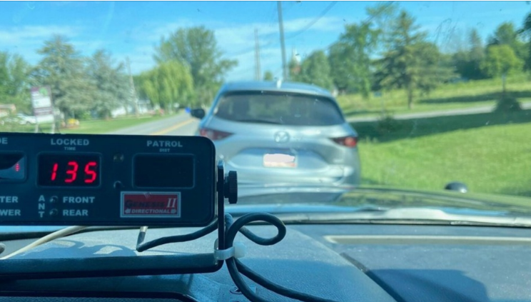 (原始链接: https://mmbiz.qpic.cn/mmbiz_png/4kibCXA1QiblQNcIDCAickOcNutWw9I1kH1QTYDQU6eQ6IGTwxeera66YZ1RffFqiciaW2zt0PZdg8sYdMEuvWib446g/640?wx_fmt=png)
- 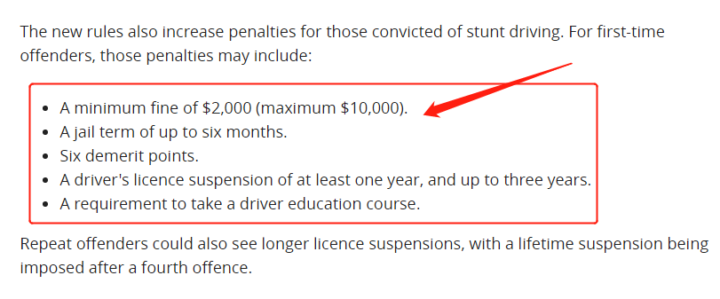 (原始链接: https://mmbiz.qpic.cn/mmbiz_png/szJas1pFaJeH1CibEdwjo1ay468ph8xUsH003fQatCzDhZ42V1WEbw3ib4xZn2IYpa1tAWibiaBJxzRvIAgI38fMXg/640?wx_fmt=png)
- 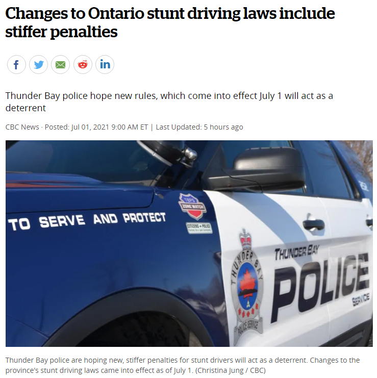 (原始链接: https://mmbiz.qpic.cn/mmbiz_png/szJas1pFaJeH1CibEdwjo1ay468ph8xUsJKzescsib6iaOYsG7ttC1ZCZ5GIPwicJg5vJJfEodxUp18flhKqTV7oKA/640?wx_fmt=png)
- 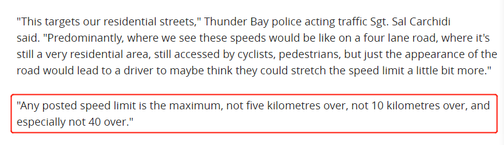 (原始链接: https://mmbiz.qpic.cn/mmbiz_png/szJas1pFaJeH1CibEdwjo1ay468ph8xUsnuumSsnMk3OWImJGTKGeDoLp28yexQKicLEjBSFgOTYLEhF3EbOv7Kw/640?wx_fmt=png)
- 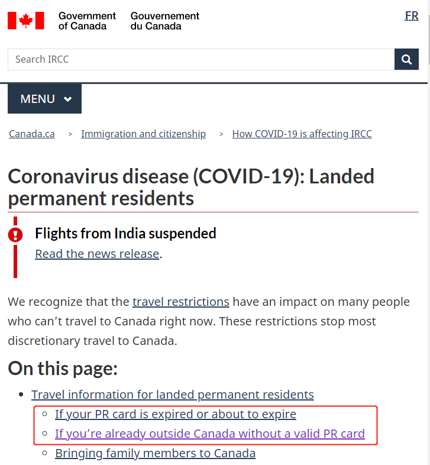 (原始链接: https://mmbiz.qpic.cn/mmbiz_png/4kibCXA1QiblQNcIDCAickOcNutWw9I1kH152N7Zs9FznlI2FpohbVu0V31IuVxoB755SsSnlc2l2YxYbSVKhoolA/640?wx_fmt=png)
- 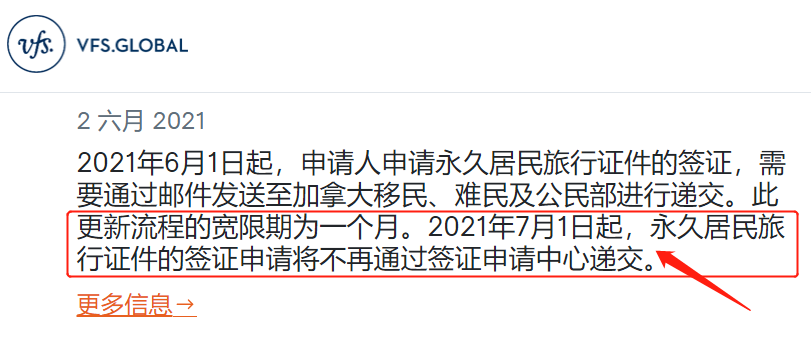 (原始链接: https://mmbiz.qpic.cn/mmbiz_png/4kibCXA1QiblQNcIDCAickOcNutWw9I1kH1L2uCZEP6ia4icYSgnpjl3XtpRrN2PRs49P2V6VibAbG56gaf7M6RicvMvA/640?wx_fmt=png)
- 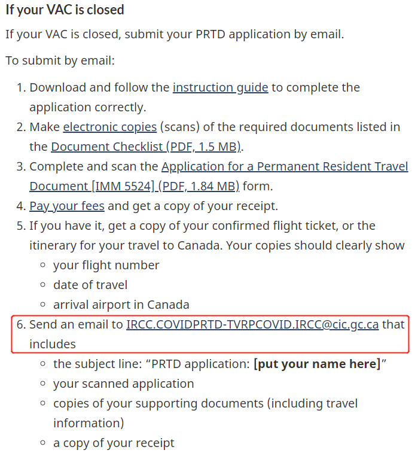 (原始链接: https://mmbiz.qpic.cn/mmbiz_png/4kibCXA1QiblQNcIDCAickOcNutWw9I1kH1c4SCO5oYMkywicXQdHl2kkyzl4PoGDRQfsHDGnLj6o44vyy3qwPWaIg/640?wx_fmt=png)
- 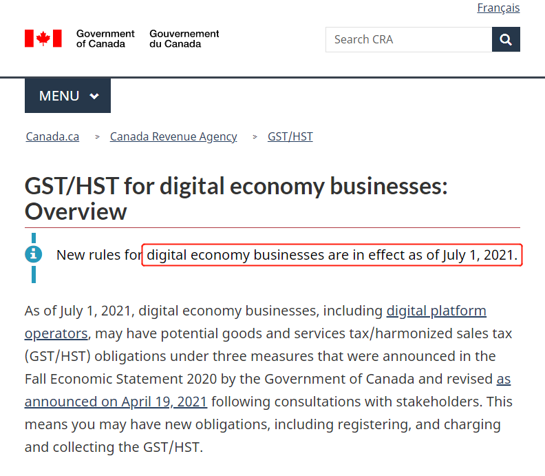 (原始链接: https://mmbiz.qpic.cn/mmbiz_png/4kibCXA1QiblQNcIDCAickOcNutWw9I1kH17vWN5tIXr1yvllPBvY4YQMn33DuBgKcl7DgDYyLlWQ8picECIichgXicA/640?wx_fmt=png)
-  (原始链接: https://mmbiz.qpic.cn/mmbiz_png/4kibCXA1QiblQNcIDCAickOcNutWw9I1kH1LyiaPkNbeEHNPAOxWxFowmVuHHfm5I3DNbsa7uf0ibZ3OnFWbFF1ESKg/640?wx_fmt=png)
-  (原始链接: https://mmbiz.qpic.cn/mmbiz_png/4kibCXA1QiblQNcIDCAickOcNutWw9I1kH1WEI3g0uX5v4w7lh8cDsyEoGKJ8XKYxEzj8ZNC3Et9ypGbUCoQHib3bQ/640?wx_fmt=png)
-  (原始链接: https://mmbiz.qpic.cn/mmbiz_jpg/4kibCXA1QiblQNcIDCAickOcNutWw9I1kH1ia6v98puA4HBO6W6ibHzI2A6VLEcuV0eV4CeaTxL3spib4mibAAsficM8aw/640?wx_fmt=jpeg)
-  (原始链接: https://mmbiz.qpic.cn/mmbiz_jpg/4kibCXA1QiblQNcIDCAickOcNutWw9I1kH1icjvesGwaZ39NxsNSM0L4ic7d4IsqEzwBrNag4gyjG7XrBU8UQxicicaTQ/640?wx_fmt=jpeg)
- 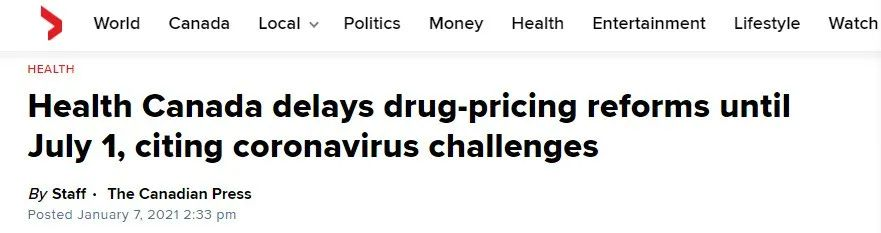 (原始链接: https://mmbiz.qpic.cn/mmbiz_jpg/4kibCXA1QiblQNcIDCAickOcNutWw9I1kH1GLQROPZcwrUhh0pcF3rpRHghB9QQZxIdXmW6G2m7Eja6z8KbqQicNGA/640?wx_fmt=jpeg)
- 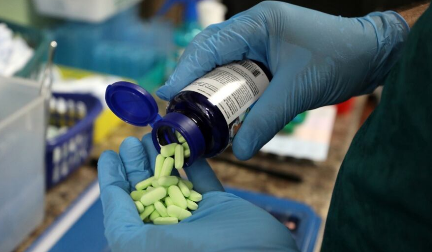 (原始链接: https://mmbiz.qpic.cn/mmbiz_png/4kibCXA1QiblQNcIDCAickOcNutWw9I1kH1kZlu40F5bTkE8aMqhOvQxDBIfzs9kstHZnJ1iagBQvjo5tP2N0Dqv7A/640?wx_fmt=png)
- 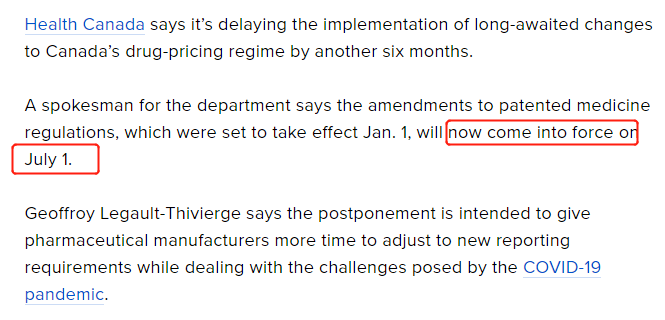 (原始链接: https://mmbiz.qpic.cn/mmbiz_png/4kibCXA1QiblQNcIDCAickOcNutWw9I1kH1WzYib0IxnP7QXe1bCzpb0oSTZnd4eaqONSPKibcKttAgxMxlD5f9Gicsw/640?wx_fmt=png)
- 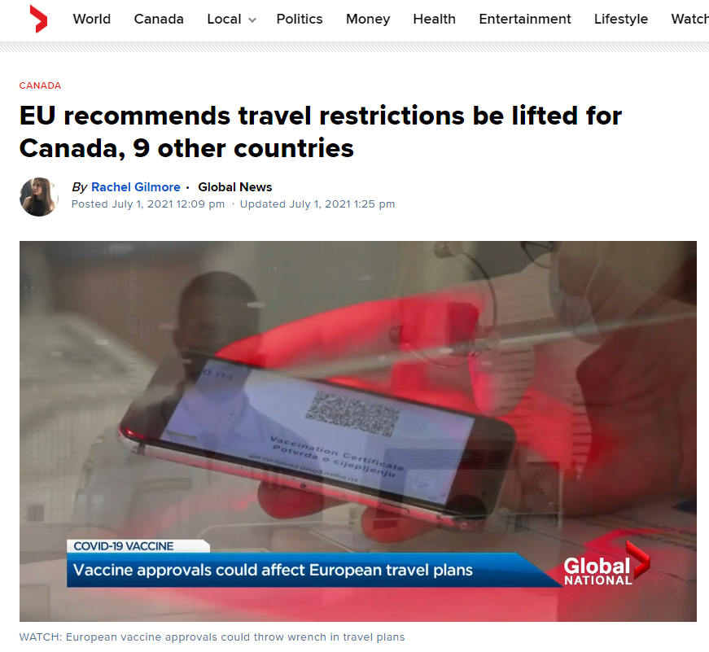 (原始链接: https://mmbiz.qpic.cn/mmbiz_png/szJas1pFaJeH1CibEdwjo1ay468ph8xUs9KgbgbYvGOqwyNpRSiaKGd8Fz3WicEvOvwQpeu44icuShXz0hJTPkfbJQ/640?wx_fmt=png)
- 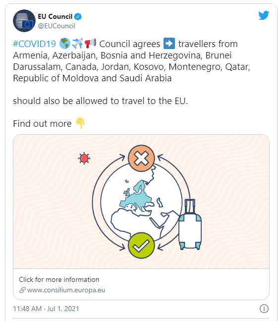 (原始链接: https://mmbiz.qpic.cn/mmbiz_png/szJas1pFaJeH1CibEdwjo1ay468ph8xUsKndicM8LBicLxBP1BHCQdpseYtnNSMEVa6iasI820YfGdEDCOrP6K92BQ/640?wx_fmt=png)
- 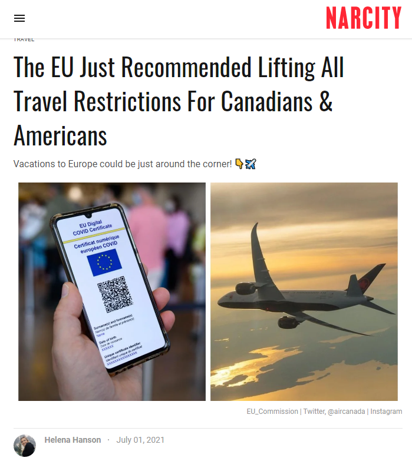 (原始链接: https://mmbiz.qpic.cn/mmbiz_png/szJas1pFaJeH1CibEdwjo1ay468ph8xUsPn4JiciaWuIFa9EqtK1icv3J3wibqib1FVQDvVuicBFv0q9w7KsW0EQTK6wA/640?wx_fmt=png)
- 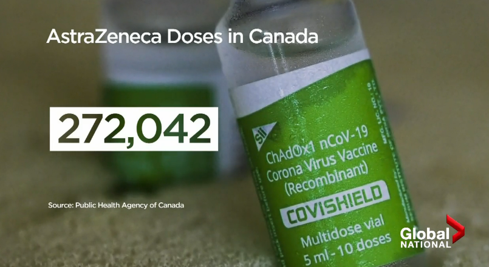 (原始链接: https://mmbiz.qpic.cn/mmbiz_png/szJas1pFaJeH1CibEdwjo1ay468ph8xUsibsF2bEgtuiaE3ic9qWCdh0bLWYX91hF08CYVnNQpHTLaZafNLLQVUXsA/640?wx_fmt=png)
- 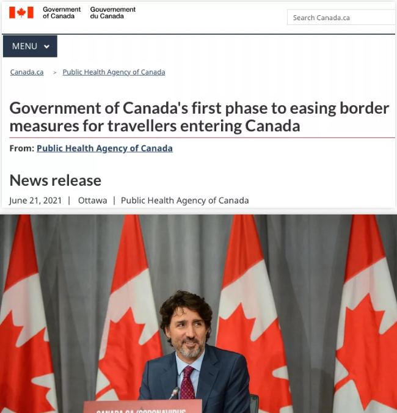 (原始链接: https://mmbiz.qpic.cn/mmbiz_png/4kibCXA1QiblQNcIDCAickOcNutWw9I1kH1hXFv3fplD9DCibAZXgAzCiaXYZJ9Qo46ibLveGEOmk4s5ndTjknMZck4g/640?wx_fmt=png)
- 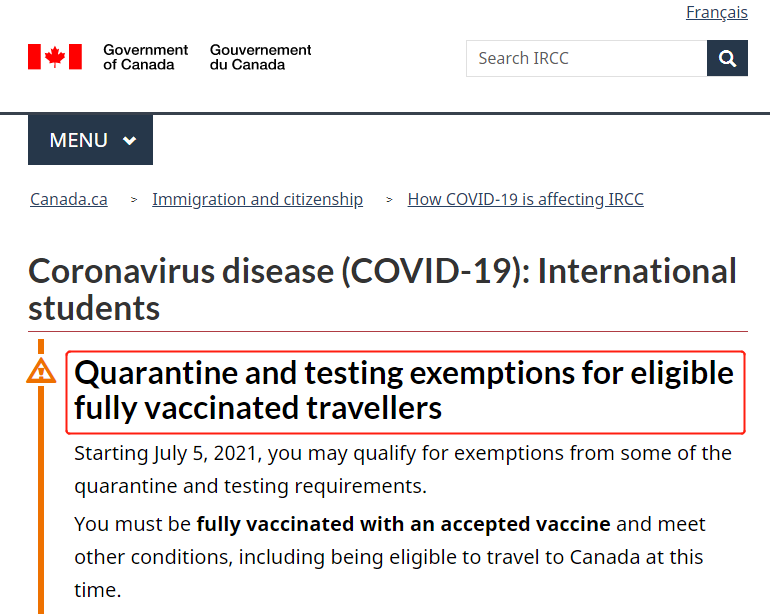 (原始链接: https://mmbiz.qpic.cn/mmbiz_png/szJas1pFaJeH1CibEdwjo1ay468ph8xUssn7BvDSPJ5AUNm4pRvYPhO6wVAdV8GKsTXX5iaabK8gkhEMEdCJcLLA/640?wx_fmt=png)
- 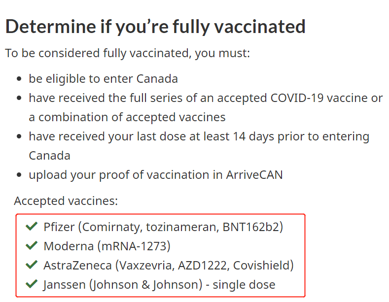 (原始链接: https://mmbiz.qpic.cn/mmbiz_png/szJas1pFaJeH1CibEdwjo1ay468ph8xUszKicPk0eOSIoVk7BibH33cqxyrplKXjHibwsc0Zib7Ezg0L6aKiaDC230Tg/640?wx_fmt=png)
- 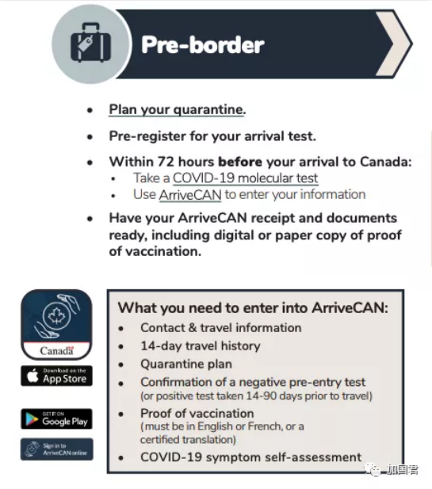 (原始链接: https://mmbiz.qpic.cn/mmbiz_png/4kibCXA1QiblQNcIDCAickOcNutWw9I1kH1w8JrlLQibhiaPSMSkXQPKns5RiajBb3VcmcLicQkcgrXe9ymK46PGjsGNg/640?wx_fmt=png)
- 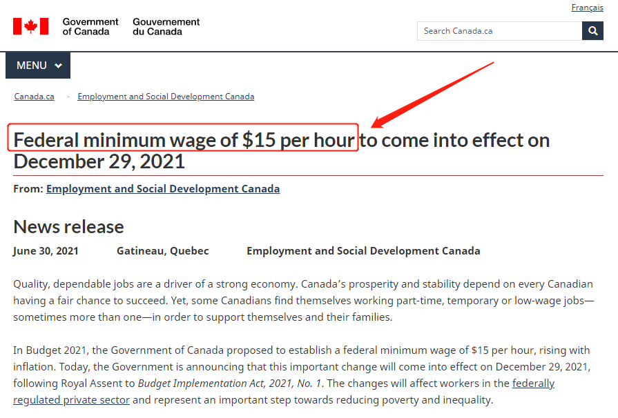 (原始链接: https://mmbiz.qpic.cn/mmbiz_png/4kibCXA1QiblQNcIDCAickOcNutWw9I1kH1SpedNm4jw0DNzdIJO0e7c17Xx3IVXS0ickReQe7ZU7icblDrWMGsVyWg/640?wx_fmt=png)
-  (原始链接: https://mmbiz.qpic.cn/mmbiz_gif/4kibCXA1QiblQNcIDCAickOcNutWw9I1kH1hicLSkgWn6jia29GpRNOcSBSUlVgujyf11kuAsLvN7PuHGjglHr9Mbkg/640?wx_fmt=gif)
-  (原始链接: https://mmbiz.qpic.cn/mmbiz_jpg/szJas1pFaJeH1CibEdwjo1ay468ph8xUsJrkQc6AJFstoq3CQZovQVHoh7rMZNbNMZXqYwQA8fCZq6JbRUdw4Xg/640?wx_fmt=jpeg)
-  (原始链接: https://mmbiz.qpic.cn/mmbiz_png/szJas1pFaJdux7mbDaq4CpWoWAUe3fNIlVYWrSfV7acu1tNBibI1icqvrlqkkqWdELW157V8YZVNxH7MLYksFHcA/640?wx_fmt=png)
