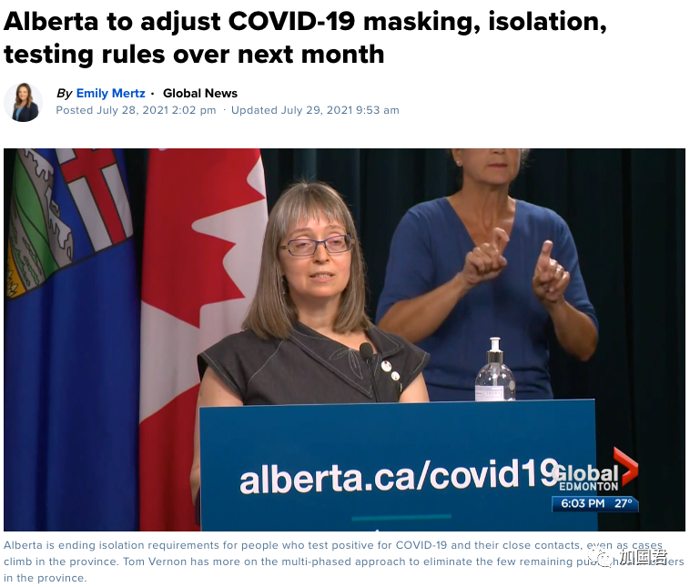
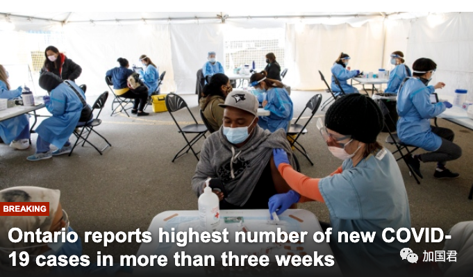
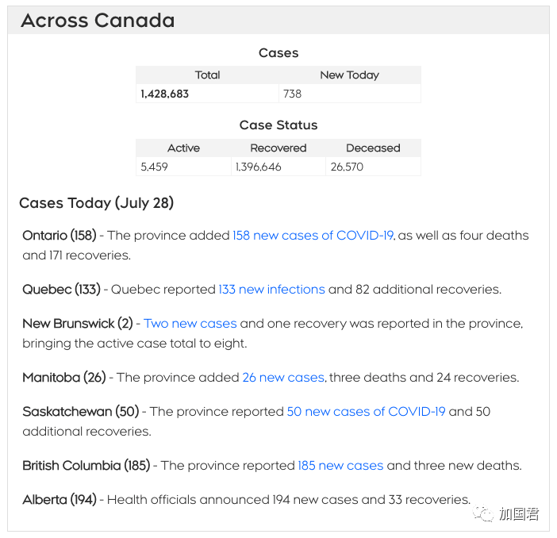
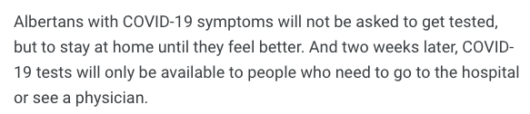
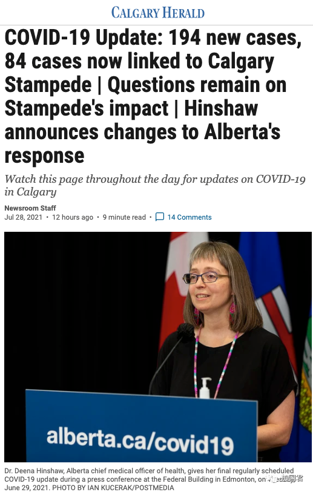
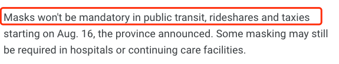
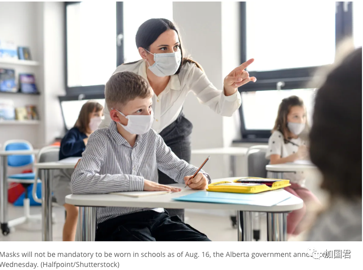
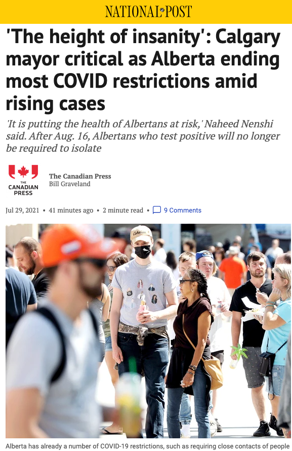
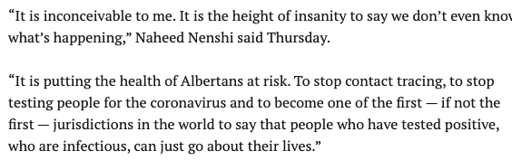
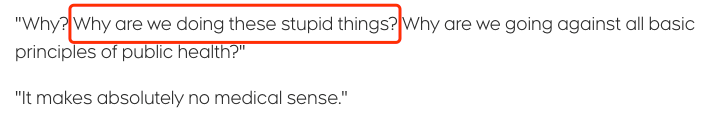

# 无标题

**链接地址:** http://mp.weixin.qq.com/s?__biz=MjM5MDEzNzY2NQ==&mid=2652823617&idx=1&sn=660ec59d74e57ab1e371989e7b86d50a&chksm=bda32c6f8ad4a5797cdb616e02fdf9f48a6a1b488847ebc03bcda4ab1997cec34145894af9e6&mpshare=1&scene=2&srcid=07302UXeTJur0OLG9SLRtc1k&sharer_sharetime=1627596139803&sharer_shareid=be1c8edd6c93eec155a61c876e41d26a#rd
**作者:** 丁其
**获取时间:** 2025/8/28 19:43:43
**图片数量:** 14

---

## 原始HTML内容

+++上方是广告+++

 

加拿大四大省份近日疫情大幅反弹，安省今天大反弹新增218例，破3周新高，而阿尔伯塔省宣布分两个阶段修改新冠规则，无症状和轻症状人士不需检测，从8月16日起，不但取消口罩禁令，阳性确诊者也不需强制要求隔离，可以满大街跑，卡尔加里市长怒斥：这绝对是疯出新高度。

 

 
<section style="caret-color: rgb(51, 51, 51);font-family: -apple-system, BlinkMacSystemFont, &quot;Helvetica Neue&quot;, &quot;PingFang SC&quot;, &quot;Hiragino Sans GB&quot;, &quot;Microsoft YaHei UI&quot;, &quot;Microsoft YaHei&quot;, Arial, sans-serif;letter-spacing: 0.544px;white-space: normal;text-size-adjust: auto;line-height: 2em;">安省今天新增218例，不但比昨天录得大幅飙升，还创下过去三个星期的新高。</section><section style="caret-color: rgb(51, 51, 51);font-family: -apple-system, BlinkMacSystemFont, &quot;Helvetica Neue&quot;, &quot;PingFang SC&quot;, &quot;Hiragino Sans GB&quot;, &quot;Microsoft YaHei UI&quot;, &quot;Microsoft YaHei&quot;, Arial, sans-serif;letter-spacing: 0.544px;white-space: normal;text-size-adjust: auto;line-height: 2em;"> </section><section style="caret-color: rgb(51, 51, 51);font-family: -apple-system, BlinkMacSystemFont, &quot;Helvetica Neue&quot;, &quot;PingFang SC&quot;, &quot;Hiragino Sans GB&quot;, &quot;Microsoft YaHei UI&quot;, &quot;Microsoft YaHei&quot;, Arial, sans-serif;letter-spacing: 0.544px;white-space: normal;text-size-adjust: auto;line-height: 2em;"></section><section style="caret-color: rgb(51, 51, 51);font-family: -apple-system, BlinkMacSystemFont, &quot;Helvetica Neue&quot;, &quot;PingFang SC&quot;, &quot;Hiragino Sans GB&quot;, &quot;Microsoft YaHei UI&quot;, &quot;Microsoft YaHei&quot;, Arial, sans-serif;letter-spacing: 0.544px;white-space: normal;text-size-adjust: auto;line-height: 2em;"> </section><section style="caret-color: rgb(51, 51, 51);font-family: -apple-system, BlinkMacSystemFont, &quot;Helvetica Neue&quot;, &quot;PingFang SC&quot;, &quot;Hiragino Sans GB&quot;, &quot;Microsoft YaHei UI&quot;, &quot;Microsoft YaHei&quot;, Arial, sans-serif;letter-spacing: 0.544px;white-space: normal;text-size-adjust: auto;line-height: 2em;">安省新增破3个星期新高</section><section style="caret-color: rgb(51, 51, 51);font-family: -apple-system, BlinkMacSystemFont, &quot;Helvetica Neue&quot;, &quot;PingFang SC&quot;, &quot;Hiragino Sans GB&quot;, &quot;Microsoft YaHei UI&quot;, &quot;Microsoft YaHei&quot;, Arial, sans-serif;letter-spacing: 0.544px;white-space: normal;text-size-adjust: auto;line-height: 2em;"> </section><section style="caret-color: rgb(51, 51, 51);font-family: -apple-system, BlinkMacSystemFont, &quot;Helvetica Neue&quot;, &quot;PingFang SC&quot;, &quot;Hiragino Sans GB&quot;, &quot;Microsoft YaHei UI&quot;, &quot;Microsoft YaHei&quot;, Arial, sans-serif;letter-spacing: 0.544px;white-space: normal;text-size-adjust: auto;line-height: 2em;">新增超过10例卫生区有8个，比昨天增加2个：</section><ol class="list-paddingleft-2" style="caret-color: rgb(51, 51, 51);font-family: -apple-system, BlinkMacSystemFont, &quot;Helvetica Neue&quot;, &quot;PingFang SC&quot;, &quot;Hiragino Sans GB&quot;, &quot;Microsoft YaHei UI&quot;, &quot;Microsoft YaHei&quot;, Arial, sans-serif;letter-spacing: 0.544px;white-space: normal;text-size-adjust: auto;"><li>
多伦多：38例
</li><li>
皮尔区：38例
</li><li>
哈密尔顿：25例
</li><li>
滑铁卢：19例
</li><li>
布鲁斯半岛：13例
</li><li>
荷顿区：12例
</li><li>
约克区：10例
</li><li>
伦敦：10例
</li></ol><section style="caret-color: rgb(51, 51, 51);font-family: -apple-system, BlinkMacSystemFont, &quot;Helvetica Neue&quot;, &quot;PingFang SC&quot;, &quot;Hiragino Sans GB&quot;, &quot;Microsoft YaHei UI&quot;, &quot;Microsoft YaHei&quot;, Arial, sans-serif;letter-spacing: 0.544px;white-space: normal;text-size-adjust: auto;line-height: 2em;"> </section><section style="caret-color: rgb(51, 51, 51);font-family: -apple-system, BlinkMacSystemFont, &quot;Helvetica Neue&quot;, &quot;PingFang SC&quot;, &quot;Hiragino Sans GB&quot;, &quot;Microsoft YaHei UI&quot;, &quot;Microsoft YaHei&quot;, Arial, sans-serif;letter-spacing: 0.544px;white-space: normal;text-size-adjust: auto;line-height: 2em;">安省卫生厅周三确认了218例新病例，另有 3 例死亡。这是自 7 月 6 日以来三个多星期以来的最高新增病例数。 </section><section style="caret-color: rgb(51, 51, 51);font-family: -apple-system, BlinkMacSystemFont, &quot;Helvetica Neue&quot;, &quot;PingFang SC&quot;, &quot;Hiragino Sans GB&quot;, &quot;Microsoft YaHei UI&quot;, &quot;Microsoft YaHei&quot;, Arial, sans-serif;letter-spacing: 0.544px;white-space: normal;text-size-adjust: auto;line-height: 2em;"> </section><section style="caret-color: rgb(51, 51, 51);font-family: -apple-system, BlinkMacSystemFont, &quot;Helvetica Neue&quot;, &quot;PingFang SC&quot;, &quot;Hiragino Sans GB&quot;, &quot;Microsoft YaHei UI&quot;, &quot;Microsoft YaHei&quot;, Arial, sans-serif;letter-spacing: 0.544px;white-space: normal;text-size-adjust: auto;line-height: 2em;">在过去三天中，新增病例的7天滚动平均数都在上升，今天是165，与上周四155例相比，上升了6% 。</section><section style="caret-color: rgb(51, 51, 51);font-family: -apple-system, BlinkMacSystemFont, &quot;Helvetica Neue&quot;, &quot;PingFang SC&quot;, &quot;Hiragino Sans GB&quot;, &quot;Microsoft YaHei UI&quot;, &quot;Microsoft YaHei&quot;, Arial, sans-serif;letter-spacing: 0.544px;white-space: normal;text-size-adjust: auto;line-height: 2em;"> </section>
加拿大周四全国新增738例，与7月初低位相比已经翻倍。

 

 

其中以阿尔伯塔省新增最多，不过，阿省却成为加拿大第一个宣布对阳性确诊者不强制隔离的省份，将新冠当做流感般对待。
<section style="caret-color: rgb(51, 51, 51);font-family: -apple-system, BlinkMacSystemFont, &quot;Helvetica Neue&quot;, &quot;PingFang SC&quot;, &quot;Hiragino Sans GB&quot;, &quot;Microsoft YaHei UI&quot;, &quot;Microsoft YaHei&quot;, Arial, sans-serif;letter-spacing: 0.544px;white-space: normal;text-size-adjust: auto;line-height: 2em;"> </section>
由于大约四分之三的符合条件的人接种了至少一剂疫苗，阿尔伯塔省根据建议分阶段更改一些关于口罩和隔离规则，

 

第一阶段：轻症不检测，密切接种者不跟踪 

 

第一阶段从7月28日周四开始，密切接触者将不再收到暴露在接触追踪者的通知，也不会在法律上要求密切接触者隔离，尽管仍然建议这样做。

 

任何检测呈阳性的人都会收到通知，但紧密接触者将不再收到通知，这个责任将落在那些检测呈阳性的人身上。

 

在第一阶段，将不再建议对接触者进行无症状检测，但仍可对出现症状的人进行检测。

 

有症状的人可以在需要做出治疗护理决定时进行检测，但欣肖指出，不但没症状不需检测，症状较轻的人也不需要接受检测。

 

第二阶段：确诊不隔离，取消口罩令

 

第二阶段从8 月16日起，阿省将进一步取消措施，届时，不会强制要求对病毒检测呈阳性的人进行隔离，不过仍“强烈建议”隔离。

 

新闻稿称，有任何呼吸道感染症状的人仍应留在家中，直到症状消失。

 

 

阿省不会要求有COVID-19 症状的人接受检测，而是待在家里直到感觉好转。两周后，只有需要去医院或看医生的人才能进行 COVID-19 检测。

 

随着隔离支持结束，隔离酒店也将关闭。

 

阿省首席卫生官欣肖（Deena Hinshaw）博士周三解释说，做出这些改变的部分原因是为了更好地管理公共卫生资源。

 

欣肖博士说：“新冠疫情尚未结束……新冠病毒不会被消除，我们需要学会忍受它。”

 

阿省首席卫生官补充说：“新冠并不是我们面临的唯一威胁。”

 

 

阿省周四是加拿大新增最多的省份，共有194例，其中84例与月初的牛仔节有关。 

 

欣肖博士在新闻发布会上说，虽然最近 COVID-19 病例的增加引起了一些焦虑，但疫苗接种率的提高正在减轻了严重后果的威胁和卫生保健系统的压力。

 

因此，阿省将开始制定类似于流感和其他传染病的新冠协议。

 

8月16日起实施第二阶段将会取消口罩令，不过，在急症和医疗护理设施内。

 

 

而乘坐公共交通工具、出租车或拼车时，不再强制戴口罩。 

 

 

欣肖博士说，一旦学生返回学校，就不需要普遍戴口罩，但可以将口罩用作应对呼吸道疾病临时爆发干预措施。

 

卡尔加里市长：疯出新高度

 

对于在病例不断增加的情况下却结束了大多数 COVID 限制，卡尔加里市长批评这是疯的新高。

 

 

卡尔加里市长今天（7月29日）说：“这对我来说是不可思议的。说我们甚至不知道发生了什么，这绝对是疯出新的高度。”

 

 

这使阿尔伯塔人的健康处于危险之中，停止密切接触者追踪，停止对人们进行病毒检测，并成为世界上其中一个（如果不是第一个）司法管辖区之一，让检测呈阳性、具有传染性的人可以继续他们的生活。”

 

专家：愚蠢

 

阿尔伯塔大学重症监护系名誉教授诺埃尔·吉布尼 (Noel Gibney) 表示，阿省的这个计划留下了太多悬而未决的问题。

 

 

吉布尼怒斥道：“为什么？为什么我们要做这些愚蠢的事情？为什么我们要违背公共卫生的所有基本原则？”

 

“这绝对没有医学意义。”

 

ICU医生：小孩受到影响

 

ICU重症监护室医生达伦·马克兰 (Darren Markland) 医生告诉 CTV 新闻，这些变化将特别影响小孩。

 

马克兰说医生说：“这会产生影响，尤其是不想戴口罩年幼的孩子中，没有接种疫苗而出现症状，有时虽然自己没影响，但会不断传播病毒。”

 

口罩令取消，阳性确诊者不强制隔离，可以满大街跑，包括到超市购物或餐馆吃饭，怕吗？

 

特别是9月开学以后，学校不戴口罩，而12岁以下小孩目前有不符合接种资格。 

 

加拿大第一个省份带头迈出如此大的步伐，其他省份，包括安省会跟随吗？

 
<section style="margin-right: 8px;margin-left: 8px;font-family: -apple-system, BlinkMacSystemFont, &quot;Helvetica Neue&quot;, &quot;PingFang SC&quot;, &quot;Hiragino Sans GB&quot;, &quot;Microsoft YaHei UI&quot;, &quot;Microsoft YaHei&quot;, Arial, sans-serif;letter-spacing: 0.544px;white-space: normal;text-size-adjust: auto;background-color: rgb(255, 255, 255);color: rgb(160, 160, 160);font-size: 15px;text-align: center;line-height: 2em;">+++我是可以点的广告+++ </section>
<a target="_blank" href="https://mp.weixin.qq.com/s?__biz=MjM5MDEzNzY2NQ==&amp;mid=2652821060&amp;idx=4&amp;sn=a7d23bba4f50f0f10e9d9ec60b77a017&amp;scene=21#wechat_redirect" textvalue="你已选中了添加链接的内容" tab="innerlink" data-linktype="1" style="cursor: pointer;"></a>
<section style="margin-right: 8px;margin-left: 8px;font-family: -apple-system, BlinkMacSystemFont, &quot;Helvetica Neue&quot;, &quot;PingFang SC&quot;, &quot;Hiragino Sans GB&quot;, &quot;Microsoft YaHei UI&quot;, &quot;Microsoft YaHei&quot;, Arial, sans-serif;letter-spacing: 0.544px;white-space: normal;text-size-adjust: auto;background-color: rgb(255, 255, 255);color: rgb(160, 160, 160);font-size: 15px;text-align: center;line-height: 2em;"> </section><section style="margin-right: 8px;margin-left: 8px;font-family: -apple-system, BlinkMacSystemFont, &quot;Helvetica Neue&quot;, &quot;PingFang SC&quot;, &quot;Hiragino Sans GB&quot;, &quot;Microsoft YaHei UI&quot;, &quot;Microsoft YaHei&quot;, Arial, sans-serif;letter-spacing: 0.544px;white-space: normal;text-size-adjust: auto;background-color: rgb(255, 255, 255);color: rgb(160, 160, 160);font-size: 15px;text-align: center;line-height: 2em;">+++全加拿大华人都在关注超级生活，就差你了+++</section><section style="margin-right: 8px;margin-left: 8px;font-family: -apple-system, BlinkMacSystemFont, &quot;Helvetica Neue&quot;, &quot;PingFang SC&quot;, &quot;Hiragino Sans GB&quot;, &quot;Microsoft YaHei UI&quot;, &quot;Microsoft YaHei&quot;, Arial, sans-serif;letter-spacing: 0.544px;white-space: normal;text-size-adjust: auto;background-color: rgb(255, 255, 255);color: rgb(160, 160, 160);font-size: 15px;text-align: center;line-height: 2em;"></section><section style="margin-right: 8px;margin-left: 8px;font-family: -apple-system, BlinkMacSystemFont, &quot;Helvetica Neue&quot;, &quot;PingFang SC&quot;, &quot;Hiragino Sans GB&quot;, &quot;Microsoft YaHei UI&quot;, &quot;Microsoft YaHei&quot;, Arial, sans-serif;letter-spacing: 0.544px;white-space: normal;text-size-adjust: auto;background-color: rgb(255, 255, 255);color: rgb(160, 160, 160);font-size: 15px;text-align: right;line-height: 2em;"><strong style="letter-spacing: 0.544px;">喜欢就狠点两下吧</strong><strong style="letter-spacing: 0.544px;"></strong></section>

---

## 纯文本内容

+++上方是广告+++加拿大四大省份近日疫情大幅反弹，安省今天大反弹新增218例，破3周新高，而阿尔伯塔省宣布分两个阶段修改新冠规则，无症状和轻症状人士不需检测，从8月16日起，不但取消口罩禁令，阳性确诊者也不需强制要求隔离，可以满大街跑，卡尔加里市长怒斥：这绝对是疯出新高度。安省今天新增218例，不但比昨天录得大幅飙升，还创下过去三个星期的新高。安省新增破3个星期新高新增超过10例卫生区有8个，比昨天增加2个：多伦多：38例皮尔区：38例哈密尔顿：25例滑铁卢：19例布鲁斯半岛：13例荷顿区：12例约克区：10例伦敦：10例安省卫生厅周三确认了218例新病例，另有 3 例死亡。这是自 7 月 6 日以来三个多星期以来的最高新增病例数。在过去三天中，新增病例的7天滚动平均数都在上升，今天是165，与上周四155例相比，上升了6% 。加拿大周四全国新增738例，与7月初低位相比已经翻倍。其中以阿尔伯塔省新增最多，不过，阿省却成为加拿大第一个宣布对阳性确诊者不强制隔离的省份，将新冠当做流感般对待。由于大约四分之三的符合条件的人接种了至少一剂疫苗，阿尔伯塔省根据建议分阶段更改一些关于口罩和隔离规则，第一阶段：轻症不检测，密切接种者不跟踪第一阶段从7月28日周四开始，密切接触者将不再收到暴露在接触追踪者的通知，也不会在法律上要求密切接触者隔离，尽管仍然建议这样做。任何检测呈阳性的人都会收到通知，但紧密接触者将不再收到通知，这个责任将落在那些检测呈阳性的人身上。在第一阶段，将不再建议对接触者进行无症状检测，但仍可对出现症状的人进行检测。有症状的人可以在需要做出治疗护理决定时进行检测，但欣肖指出，不但没症状不需检测，症状较轻的人也不需要接受检测。第二阶段：确诊不隔离，取消口罩令第二阶段从8 月16日起，阿省将进一步取消措施，届时，不会强制要求对病毒检测呈阳性的人进行隔离，不过仍“强烈建议”隔离。新闻稿称，有任何呼吸道感染症状的人仍应留在家中，直到症状消失。阿省不会要求有COVID-19 症状的人接受检测，而是待在家里直到感觉好转。两周后，只有需要去医院或看医生的人才能进行 COVID-19 检测。随着隔离支持结束，隔离酒店也将关闭。阿省首席卫生官欣肖（Deena Hinshaw）博士周三解释说，做出这些改变的部分原因是为了更好地管理公共卫生资源。欣肖博士说：“新冠疫情尚未结束……新冠病毒不会被消除，我们需要学会忍受它。”阿省首席卫生官补充说：“新冠并不是我们面临的唯一威胁。”阿省周四是加拿大新增最多的省份，共有194例，其中84例与月初的牛仔节有关。欣肖博士在新闻发布会上说，虽然最近 COVID-19 病例的增加引起了一些焦虑，但疫苗接种率的提高正在减轻了严重后果的威胁和卫生保健系统的压力。因此，阿省将开始制定类似于流感和其他传染病的新冠协议。8月16日起实施第二阶段将会取消口罩令，不过，在急症和医疗护理设施内。而乘坐公共交通工具、出租车或拼车时，不再强制戴口罩。欣肖博士说，一旦学生返回学校，就不需要普遍戴口罩，但可以将口罩用作应对呼吸道疾病临时爆发干预措施。卡尔加里市长：疯出新高度对于在病例不断增加的情况下却结束了大多数 COVID 限制，卡尔加里市长批评这是疯的新高。卡尔加里市长今天（7月29日）说：“这对我来说是不可思议的。说我们甚至不知道发生了什么，这绝对是疯出新的高度。”这使阿尔伯塔人的健康处于危险之中，停止密切接触者追踪，停止对人们进行病毒检测，并成为世界上其中一个（如果不是第一个）司法管辖区之一，让检测呈阳性、具有传染性的人可以继续他们的生活。”专家：愚蠢阿尔伯塔大学重症监护系名誉教授诺埃尔·吉布尼 (Noel Gibney) 表示，阿省的这个计划留下了太多悬而未决的问题。吉布尼怒斥道：“为什么？为什么我们要做这些愚蠢的事情？为什么我们要违背公共卫生的所有基本原则？”“这绝对没有医学意义。”ICU医生：小孩受到影响ICU重症监护室医生达伦·马克兰 (Darren Markland) 医生告诉 CTV 新闻，这些变化将特别影响小孩。马克兰说医生说：“这会产生影响，尤其是不想戴口罩年幼的孩子中，没有接种疫苗而出现症状，有时虽然自己没影响，但会不断传播病毒。”口罩令取消，阳性确诊者不强制隔离，可以满大街跑，包括到超市购物或餐馆吃饭，怕吗？特别是9月开学以后，学校不戴口罩，而12岁以下小孩目前有不符合接种资格。加拿大第一个省份带头迈出如此大的步伐，其他省份，包括安省会跟随吗？+++我是可以点的广告++++++全加拿大华人都在关注超级生活，就差你了+++喜欢就狠点两下吧

---

## 图片列表

-  (原始链接: https://mmbiz.qpic.cn/mmbiz_png/szJas1pFaJdFxRqk8dtpHsbHgQhic34iczniaC7NL9IGeHMXnTlY3u5afIe4s4Pibgg8fT7jY5xesbDupyiboR9ATUg/640?wx_fmt=png)
-  (原始链接: https://mmbiz.qpic.cn/mmbiz_png/icDcCacWsN1UQtdexnf3m04FKjcYdKTKeDwv6Hbqh4FVzBMF5hQE8ibd9Rhu7iaXG4YqOzdtO7HCy2qslkEeFKElg/640?wx_fmt=png)
-  (原始链接: https://mmbiz.qpic.cn/mmbiz_png/icDcCacWsN1UQtdexnf3m04FKjcYdKTKejw94nq7fdgFsIaZLlwg89OBLEsG454icibicVLPCxDBaslkuCyB0v1y9A/640?wx_fmt=png)
-  (原始链接: https://mmbiz.qpic.cn/mmbiz_png/icDcCacWsN1UQtdexnf3m04FKjcYdKTKe5CpTdoEtIUNH3Jj7WaD0NTjPXvO0eicxPAY3W5ykL0jkj1msNy9QXtQ/640?wx_fmt=png)
-  (原始链接: https://mmbiz.qpic.cn/mmbiz_png/szJas1pFaJeUlyql9F68uuoHjCMOppfUyUPVnAgFW0ibe2Qrwe0qoz7j1OibIsUHB2gepKJEV995CBNsnbZgNZAw/640?wx_fmt=png)
-  (原始链接: https://mmbiz.qpic.cn/mmbiz_png/icDcCacWsN1UQtdexnf3m04FKjcYdKTKe3XMzTcKC7tVz1lqe7KGhI0GibQG4eJxffURzYXzgDpq4BVQicYeOKT7g/640?wx_fmt=png)
-  (原始链接: https://mmbiz.qpic.cn/mmbiz_png/szJas1pFaJeUlyql9F68uuoHjCMOppfUZ7OZ84WWqXqCwzraKXCQzKh4Dej75nsibWHMbCrZ0ic5unZLfdjlmG1w/640?wx_fmt=png)
-  (原始链接: https://mmbiz.qpic.cn/mmbiz_png/icDcCacWsN1UQtdexnf3m04FKjcYdKTKeoL9OYW82VDh7J0N8j2E8BSoicdRJbaH4jrBFAEXZmQhuLTgttAXgwEQ/640?wx_fmt=png)
-  (原始链接: https://mmbiz.qpic.cn/mmbiz_png/szJas1pFaJeUlyql9F68uuoHjCMOppfUBjVEQMe15ps6WeJNAdhUj5c0w0QQuFayy4cEibGNq1N4B7GiaTh8lIEg/640?wx_fmt=png)
-  (原始链接: https://mmbiz.qpic.cn/mmbiz_png/szJas1pFaJeUlyql9F68uuoHjCMOppfUAqiceLNywWn9kCTiaOicK0e1dEjX6CBwG6kwibwibdFPseTco6NpwsQvzkA/640?wx_fmt=png)
-  (原始链接: https://mmbiz.qpic.cn/mmbiz_png/szJas1pFaJeUlyql9F68uuoHjCMOppfUMzR4StKdiaVf9Ar9nT24EtSicILao4c4rqC8lD04ATPsIreJia9UAUiaPg/640?wx_fmt=png)
-  (原始链接: https://mmbiz.qpic.cn/mmbiz_jpg/szJas1pFaJdFxRqk8dtpHsbHgQhic34iczlhM5dEdnLUkQBKBpA0KA5GcZ0wvjvs24DYfgn8zPHx8EAv9wfNy8nw/640?wx_fmt=jpeg)
-  (原始链接: https://mmbiz.qpic.cn/mmbiz_gif/szJas1pFaJdUFDPEKnLrCyGC4WgrAvl6lSC2beZFt6icTnXfebnRzcRialMg5VZujw1AhX9ribkSDQNZZukk8HX9w/640?wx_fmt=gif)
-  (原始链接: https://mmbiz.qpic.cn/mmbiz_png/szJas1pFaJdux7mbDaq4CpWoWAUe3fNIlVYWrSfV7acu1tNBibI1icqvrlqkkqWdELW157V8YZVNxH7MLYksFHcA/640?wx_fmt=png)
