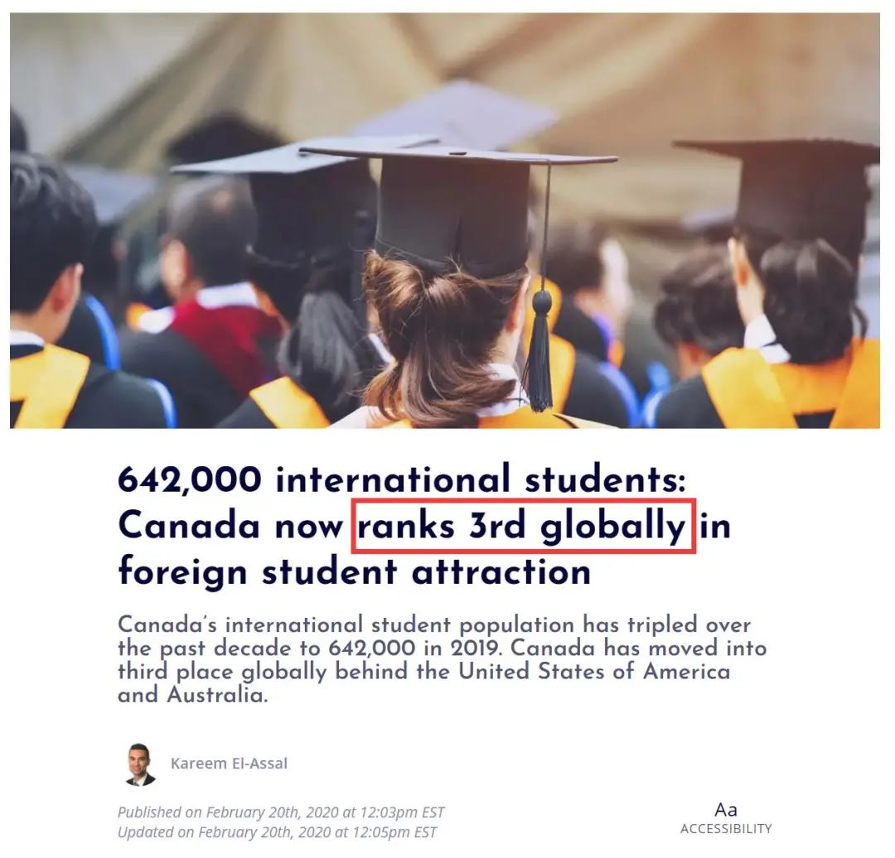
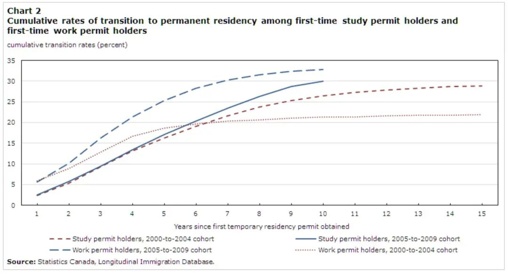
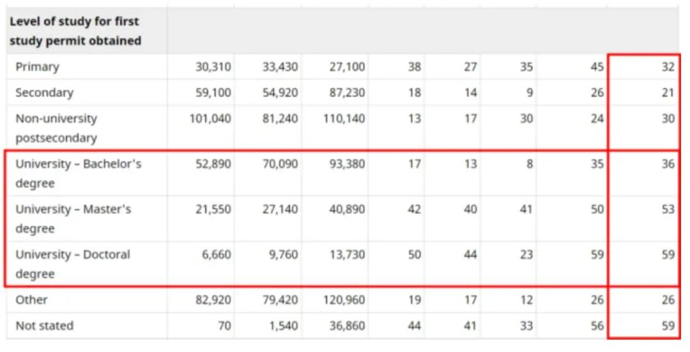
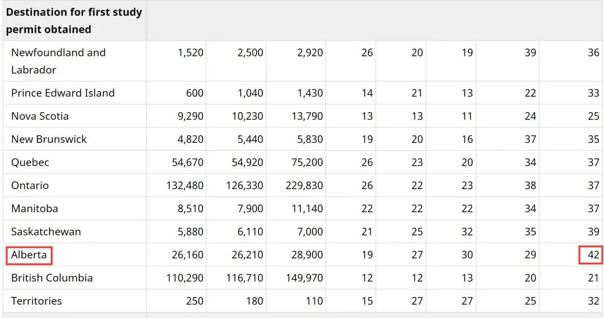
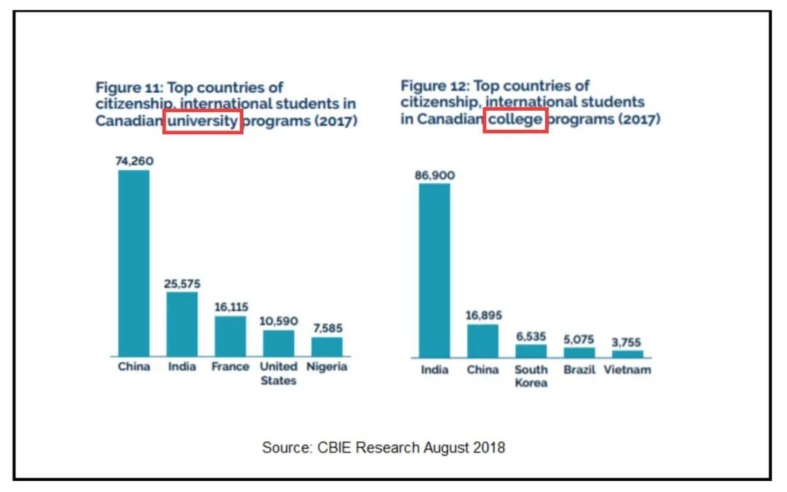

# 无标题

**链接地址:** http://mp.weixin.qq.com/s?__biz=MzUyNzA2NTAwNg==&mid=2247487232&idx=1&sn=171fdc4655d1ae4157b2df55a7fd5eb5&chksm=fa0405c1cd738cd7b215d1b7179d12ffc4f13e3f7722067109c528e44bcc0c67a85c3b22a994&mpshare=1&scene=2&srcid=0830U5TWD1ty6WGt1rdQ4FRh&sharer_sharetime=1630294756066&sharer_shareid=be1c8edd6c93eec155a61c876e41d26a#rd
**作者:** 
**获取时间:** 2025/8/28 19:41:46
**图片数量:** 22

---

## 原始HTML内容

<section style="box-sizing: border-box;font-size: 16px;"><section style="text-align: center;margin-top: 10px;margin-bottom: 10px;box-sizing: border-box;" powered-by="xiumi.us"><section style="max-width: 100%;vertical-align: middle;display: inline-block;line-height: 0;box-sizing: border-box;"></section></section><section style="margin-top: 10px;margin-right: 0%;margin-left: 0%;box-sizing: border-box;" powered-by="xiumi.us"><section style="display: inline-block;width: 100%;vertical-align: top;box-sizing: border-box;"><section style="box-sizing: border-box;" powered-by="xiumi.us"><section style="display: flex;flex-flow: row nowrap;margin: 10px 0%;box-sizing: border-box;"><section style="display: inline-block;vertical-align: middle;width: auto;min-width: 10%;max-width: 100%;flex: 0 0 auto;height: auto;align-self: center;box-sizing: border-box;"><section style="margin-top: 10px;margin-bottom: 10px;text-align: center;box-sizing: border-box;" powered-by="xiumi.us"><section style="background-color: rgb(68, 68, 68);display: inline-block;width: 2.5em;height: 2.5em;line-height: 2.5em;border-radius: 100%;margin-left: auto;margin-right: auto;font-size: 18px;color: rgb(255, 255, 255);font-family: Optima-Regular, PingFangTC-light;box-sizing: border-box;">
<strong style="box-sizing: border-box;">01</strong>
</section></section></section><section style="display: inline-block;vertical-align: middle;width: auto;align-self: center;flex: 0 0 auto;min-width: 10%;max-width: 100%;height: auto;box-sizing: border-box;"><section style="transform: translate3d(10px, 0px, 0px);-webkit-transform: translate3d(10px, 0px, 0px);-moz-transform: translate3d(10px, 0px, 0px);-o-transform: translate3d(10px, 0px, 0px);box-sizing: border-box;" powered-by="xiumi.us"><section style="font-family: Optima-Regular, PingFangTC-light;box-sizing: border-box;">
<strong style="box-sizing: border-box;">加拿大成为世界第三大国际学生目的地</strong>
</section></section><section style="margin-top: 3px;margin-right: 0%;margin-left: 0%;transform: translate3d(-10px, 0px, 0px);box-sizing: border-box;" powered-by="xiumi.us"><section style="background-color: rgb(68, 68, 68);height: 1px;box-sizing: border-box;"><section><svg viewBox="0 0 1 1" style="float:left;line-height:0;width:0;vertical-align:top;"></svg></section></section></section></section></section></section></section></section><section style="font-size: 14px;padding-right: 15px;padding-left: 15px;letter-spacing: 1px;box-sizing: border-box;" powered-by="xiumi.us">
 

说起曾经加拿大在许多国人<strong style="box-sizing: border-box;">心中的印象</strong>，纯净的自然风景，寒冷多雪的冬天以及绯红的枫叶可能是排名前三的<strong style="box-sizing: border-box;">关键词</strong>。

 
</section><section style="height: auto;box-sizing: border-box;" powered-by="xiumi.us"><section style="display: flex;flex-flow: row nowrap;margin-right: 0%;margin-bottom: 10px;margin-left: 0%;box-sizing: border-box;"><section style="display: inline-block;vertical-align: bottom;width: auto;flex: 100 100 0%;align-self: flex-end;height: auto;border-bottom: 1px solid rgb(250, 91, 71);border-bottom-right-radius: 0px;box-sizing: border-box;"><section style="text-align: center;margin-top: 10px;margin-bottom: 10px;box-sizing: border-box;" powered-by="xiumi.us"><section style="max-width: 100%;vertical-align: middle;display: inline-block;line-height: 0;border-style: solid;border-width: 7px;border-color: rgb(255, 241, 239);box-sizing: border-box;"></section></section></section><section style="display: inline-block;vertical-align: bottom;width: auto;flex: 100 100 0%;align-self: flex-end;height: auto;margin-left: 10px;border-width: 0px 0px 1px;border-bottom-style: solid;border-bottom-right-radius: 0px;border-bottom-color: rgb(250, 91, 71);box-sizing: border-box;"><section style="text-align: center;margin-top: 10px;margin-bottom: 10px;box-sizing: border-box;" powered-by="xiumi.us"><section style="max-width: 100%;vertical-align: middle;display: inline-block;line-height: 0;border-style: solid;border-width: 7px;border-color: rgb(255, 241, 239);box-sizing: border-box;"></section></section></section></section></section><section style="font-size: 14px;padding-right: 15px;padding-left: 15px;letter-spacing: 1px;box-sizing: border-box;" powered-by="xiumi.us">
 

然而随着《小留学生》和《别了，温哥华》等多部描写加拿大华侨生活的电视连续剧的热播，中国人在<strong style="box-sizing: border-box;">加拿大留学生和移民的生活</strong>逐渐走入了大家的视野。

 
</section><section style="text-align: center;margin-top: 10px;margin-bottom: 10px;box-sizing: border-box;" powered-by="xiumi.us"><section style="max-width: 100%;vertical-align: middle;display: inline-block;line-height: 0;box-sizing: border-box;"></section></section><section style="font-size: 14px;padding-right: 15px;padding-left: 15px;letter-spacing: 1px;box-sizing: border-box;" powered-by="xiumi.us">
 

就在2019年，<strong style="box-sizing: border-box;">加拿大成为了世界第三大的国际留学生求学目的地</strong>，同时间容纳着来自全球100多个国家的64.2万名留学生在加拿大生活学习。

 

根据加拿大移民局 (IRCC) 的数据，2019 年加拿大的国际学生人数比上一年增长了13%，而在过去的20 年里，<strong style="box-sizing: border-box;">加拿大的国际学生人数增长了六倍</strong>。

 
</section><section style="text-align: center;margin-top: 10px;margin-bottom: 10px;box-sizing: border-box;" powered-by="xiumi.us"><section style="max-width: 100%;vertical-align: middle;display: inline-block;line-height: 0;box-sizing: border-box;"></section></section><section style="font-size: 14px;padding-right: 15px;padding-left: 15px;letter-spacing: 1px;box-sizing: border-box;" powered-by="xiumi.us">
 

然而，并不是所有的加拿大留学生都选择在毕业后移民加拿大；相反，根据加拿大统计局（Statistics Canada）的数据显示，在<strong style="box-sizing: border-box;">加国留学后移民的人数不及1/3</strong>，而近些年更是有着急剧减少的趋势。

 

为什么？以优质社会福利和舒适生活节奏闻名的加拿大为什么留不住毕业生人才？今天，我们将揭晓这背后的辛秘。

 
</section><section style="font-size: 14px;padding-right: 15px;padding-left: 15px;letter-spacing: 1px;box-sizing: border-box;" powered-by="xiumi.us">
 
</section><section style="margin-top: 10px;margin-right: 0%;margin-left: 0%;box-sizing: border-box;" powered-by="xiumi.us"><section style="display: inline-block;width: 100%;vertical-align: top;box-sizing: border-box;"><section style="box-sizing: border-box;" powered-by="xiumi.us"><section style="display: flex;flex-flow: row nowrap;margin: 10px 0%;box-sizing: border-box;"><section style="display: inline-block;vertical-align: middle;width: auto;min-width: 10%;max-width: 100%;flex: 0 0 auto;height: auto;align-self: center;box-sizing: border-box;"><section style="margin-top: 10px;margin-bottom: 10px;text-align: center;box-sizing: border-box;" powered-by="xiumi.us"><section style="background-color: rgb(68, 68, 68);display: inline-block;width: 2.5em;height: 2.5em;line-height: 2.5em;border-radius: 100%;margin-left: auto;margin-right: auto;font-size: 18px;color: rgb(255, 255, 255);font-family: Optima-Regular, PingFangTC-light;box-sizing: border-box;">
<strong style="box-sizing: border-box;">02</strong>
</section></section></section><section style="display: inline-block;vertical-align: middle;width: auto;align-self: center;flex: 0 0 auto;min-width: 10%;max-width: 100%;height: auto;box-sizing: border-box;"><section style="transform: translate3d(10px, 0px, 0px);-webkit-transform: translate3d(10px, 0px, 0px);-moz-transform: translate3d(10px, 0px, 0px);-o-transform: translate3d(10px, 0px, 0px);box-sizing: border-box;" powered-by="xiumi.us"><section style="font-family: Optima-Regular, PingFangTC-light;box-sizing: border-box;">
<strong style="box-sizing: border-box;">影响留学生移民成功率的几大因素</strong>
</section></section><section style="margin-top: 3px;margin-right: 0%;margin-left: 0%;transform: translate3d(-10px, 0px, 0px);box-sizing: border-box;" powered-by="xiumi.us"><section style="background-color: rgb(68, 68, 68);height: 1px;box-sizing: border-box;"><section><svg viewBox="0 0 1 1" style="float:left;line-height:0;width:0;vertical-align:top;"></svg></section></section></section></section></section></section></section></section><section style="text-align: center;margin-top: 10px;margin-bottom: 10px;box-sizing: border-box;" powered-by="xiumi.us"><section style="max-width: 100%;vertical-align: middle;display: inline-block;line-height: 0;box-sizing: border-box;"></section></section><section style="font-size: 14px;padding-right: 15px;padding-left: 15px;letter-spacing: 1px;box-sizing: border-box;" powered-by="xiumi.us">
 

根据加拿大统计局的数据显示，在2005-2009年期间抵加首次获得学签的35万多名留学生中，有<strong style="box-sizing: border-box;">仅32%在10年内成为PR</strong>。这就意味着，<strong style="box-sizing: border-box;">近七成留学生并没有选择在加拿大继续工作生活</strong>。

 

而其中，<strong style="box-sizing: border-box;">留学生的年龄、教育水平、目的地省份以及薪水等因素</strong>，也大大影响了留学生是否计划毕业后申请移民的意愿。

 

 
</section><section style="text-align: left;justify-content: flex-start;margin: 10px 0%;box-sizing: border-box;" powered-by="xiumi.us"><section style="display: inline-block;vertical-align: middle;width: auto;line-height: 0;min-width: 10%;max-width: 100%;height: auto;align-self: center;box-sizing: border-box;"><section style="transform: rotateZ(45deg);-webkit-transform: rotateZ(45deg);-moz-transform: rotateZ(45deg);-o-transform: rotateZ(45deg);box-sizing: border-box;" powered-by="xiumi.us"><section style="text-align: center;margin-right: 0%;margin-left: 0%;box-sizing: border-box;"><section style="display: inline-block;vertical-align: top;overflow: hidden;height: 4px;width: 15px;background-color: rgb(213, 9, 9);border-width: 0px;border-radius: 10px;border-style: none;border-color: rgb(62, 62, 62);box-shadow: rgb(0, 0, 0) 0px 0px 0px;box-sizing: border-box;"><section><svg viewBox="0 0 1 1" style="float:left;line-height:0;width:0;vertical-align:top;"></svg></section></section></section></section><section style="transform: rotateZ(315deg);-webkit-transform: rotateZ(315deg);-moz-transform: rotateZ(315deg);-o-transform: rotateZ(315deg);box-sizing: border-box;" powered-by="xiumi.us"><section style="text-align: center;margin: 4px 0% 5px;justify-content: center;box-sizing: border-box;"><section style="display: inline-block;vertical-align: top;overflow: hidden;height: 4px;width: 14px;background-color: rgb(81, 36, 169);border-width: 0px;border-radius: 10px;border-style: none;border-color: rgb(62, 62, 62);box-sizing: border-box;"><section><svg viewBox="0 0 1 1" style="float:left;line-height:0;width:0;vertical-align:top;"></svg></section></section></section></section></section><section style="display: inline-block;vertical-align: middle;width: auto;min-width: 10%;max-width: 100%;height: auto;align-self: center;box-sizing: border-box;"><section style="margin-right: 0%;margin-left: 0%;justify-content: flex-start;box-sizing: border-box;" powered-by="xiumi.us"><section style="text-align: center;font-size: 18px;color: rgb(102, 102, 102);letter-spacing: 1px;line-height: 2;font-family: Optima-Regular, PingFangTC-light;box-sizing: border-box;">
<strong style="box-sizing: border-box;">“大龄”留学生更愿意“留下”</strong>
</section></section></section></section><section style="font-size: 14px;padding-right: 15px;padding-left: 15px;letter-spacing: 1px;box-sizing: border-box;" powered-by="xiumi.us">
 

根据报告显示，按照初次留学的年龄开始计算，在0-17岁、18-24岁、25-34岁、35-44岁、45-44岁和55岁及以上六个年龄组中，<strong style="box-sizing: border-box;">PR转换率最高的年龄段为35-44岁</strong>，其中约有一半的留学生选择移民加拿大。而他们中大部分申请者<strong style="box-sizing: border-box;">拥有不止一个专科及以上学历</strong>。

 
</section><section style="text-align: center;margin-top: 10px;margin-bottom: 10px;box-sizing: border-box;" powered-by="xiumi.us"><section style="max-width: 100%;vertical-align: middle;display: inline-block;line-height: 0;box-sizing: border-box;"></section></section><section style="font-size: 14px;padding-right: 15px;padding-left: 15px;letter-spacing: 1px;box-sizing: border-box;" powered-by="xiumi.us">
 

令人惊讶的是，<strong style="box-sizing: border-box;">越早进入加拿大进行学习和生活适应的留学生们，却越不倾向于留在加拿大继续生活</strong>。PR转换率最低的年龄段为17岁以下年龄的留学生——他们中只有约1/4获得了移民身份。

 

由此可见，大龄留学生的PR转化率更高。虽然他们在申请学签和移民时都没有什么优势，但是拿到PR的成功率却比小留学生高得多。 

 

 
</section><section style="text-align: left;justify-content: flex-start;margin: 10px 0%;box-sizing: border-box;" powered-by="xiumi.us"><section style="display: inline-block;vertical-align: middle;width: auto;line-height: 0;min-width: 10%;max-width: 100%;height: auto;align-self: center;box-sizing: border-box;"><section style="transform: rotateZ(45deg);-webkit-transform: rotateZ(45deg);-moz-transform: rotateZ(45deg);-o-transform: rotateZ(45deg);box-sizing: border-box;" powered-by="xiumi.us"><section style="text-align: center;margin-right: 0%;margin-left: 0%;box-sizing: border-box;"><section style="display: inline-block;width: 15px;height: 4px;vertical-align: top;overflow: hidden;background-color: rgb(213, 9, 9);border-width: 0px;border-radius: 10px;border-style: none;border-color: rgb(62, 62, 62);box-shadow: rgb(0, 0, 0) 0px 0px 0px;box-sizing: border-box;"><section><svg viewBox="0 0 1 1" style="float:left;line-height:0;width:0;vertical-align:top;"></svg></section></section></section></section><section style="transform: rotateZ(315deg);-webkit-transform: rotateZ(315deg);-moz-transform: rotateZ(315deg);-o-transform: rotateZ(315deg);box-sizing: border-box;" powered-by="xiumi.us"><section style="text-align: center;margin: 4px 0% 5px;justify-content: center;box-sizing: border-box;"><section style="display: inline-block;width: 14px;height: 4px;vertical-align: top;overflow: hidden;background-color: rgb(81, 36, 169);border-width: 0px;border-radius: 10px;border-style: none;border-color: rgb(62, 62, 62);box-sizing: border-box;"><section><svg viewBox="0 0 1 1" style="float:left;line-height:0;width:0;vertical-align:top;"></svg></section></section></section></section></section><section style="display: inline-block;vertical-align: middle;width: auto;min-width: 10%;max-width: 100%;height: auto;align-self: center;box-sizing: border-box;"><section style="margin-right: 0%;margin-left: 0%;justify-content: flex-start;box-sizing: border-box;" powered-by="xiumi.us"><section style="text-align: center;font-size: 18px;color: rgb(102, 102, 102);letter-spacing: 1px;line-height: 2;font-family: Optima-Regular, PingFangTC-light;box-sizing: border-box;">
<strong style="box-sizing: border-box;">高学历留学生更愿意留下</strong>
</section></section></section></section><section style="font-size: 14px;padding-right: 15px;padding-left: 15px;letter-spacing: 1px;box-sizing: border-box;" powered-by="xiumi.us">
 

另外，加拿大统计局的数据也解释了另一个大家关心的话题：到底<strong style="box-sizing: border-box;">学历</strong>是否会影响留学生申请移民的意愿。答案也是肯定的。相较于本科学位，<strong style="box-sizing: border-box;">研究生或更高学历的留学生PR转化率更高</strong>。

 
</section><section style="text-align: center;margin-top: 10px;margin-bottom: 10px;box-sizing: border-box;" powered-by="xiumi.us"><section style="max-width: 100%;vertical-align: middle;display: inline-block;line-height: 0;box-sizing: border-box;"></section></section><section style="font-size: 14px;padding-right: 15px;padding-left: 15px;letter-spacing: 1px;box-sizing: border-box;" powered-by="xiumi.us">
 

53%的研究生毕业生和59%的博士毕业生在首次获得学签的10年内成为PR，而<strong style="box-sizing: border-box;">本科毕业生的这一比例仅为为36%</strong>。

 

 
</section><section style="text-align: left;justify-content: flex-start;margin: 10px 0%;box-sizing: border-box;" powered-by="xiumi.us"><section style="display: inline-block;vertical-align: middle;width: auto;line-height: 0;min-width: 10%;max-width: 100%;height: auto;align-self: center;box-sizing: border-box;"><section style="transform: rotateZ(45deg);-webkit-transform: rotateZ(45deg);-moz-transform: rotateZ(45deg);-o-transform: rotateZ(45deg);box-sizing: border-box;" powered-by="xiumi.us"><section style="text-align: center;margin-right: 0%;margin-left: 0%;box-sizing: border-box;"><section style="display: inline-block;width: 15px;height: 4px;vertical-align: top;overflow: hidden;background-color: rgb(213, 9, 9);border-width: 0px;border-radius: 10px;border-style: none;border-color: rgb(62, 62, 62);box-shadow: rgb(0, 0, 0) 0px 0px 0px;box-sizing: border-box;"><section><svg viewBox="0 0 1 1" style="float:left;line-height:0;width:0;vertical-align:top;"></svg></section></section></section></section><section style="transform: rotateZ(315deg);-webkit-transform: rotateZ(315deg);-moz-transform: rotateZ(315deg);-o-transform: rotateZ(315deg);box-sizing: border-box;" powered-by="xiumi.us"><section style="text-align: center;margin: 4px 0% 5px;justify-content: center;box-sizing: border-box;"><section style="display: inline-block;width: 14px;height: 4px;vertical-align: top;overflow: hidden;background-color: rgb(81, 36, 169);border-width: 0px;border-radius: 10px;border-style: none;border-color: rgb(62, 62, 62);box-sizing: border-box;"><section><svg viewBox="0 0 1 1" style="float:left;line-height:0;width:0;vertical-align:top;"></svg></section></section></section></section></section><section style="display: inline-block;vertical-align: middle;width: auto;min-width: 10%;max-width: 100%;height: auto;align-self: center;box-sizing: border-box;"><section style="margin-right: 0%;margin-left: 0%;justify-content: flex-start;box-sizing: border-box;" powered-by="xiumi.us"><section style="text-align: center;font-size: 18px;color: rgb(102, 102, 102);letter-spacing: 1px;line-height: 2;font-family: Optima-Regular, PingFangTC-light;box-sizing: border-box;">
<strong style="box-sizing: border-box;">阿省的留学生移民最多</strong>
</section></section></section></section><section style="text-align: center;margin-top: 10px;margin-bottom: 10px;box-sizing: border-box;" powered-by="xiumi.us"><section style="max-width: 100%;vertical-align: middle;display: inline-block;line-height: 0;box-sizing: border-box;"></section></section><section style="font-size: 14px;padding-right: 15px;padding-left: 15px;letter-spacing: 1px;box-sizing: border-box;" powered-by="xiumi.us">
 

另外，求学目的地也极大地影响了留学生的移民意愿。加拿大留学生拿到PR比例最高的省份为<strong style="box-sizing: border-box;">阿省（42%）</strong>，排名第二的是萨省（39%），其次是安省、魁省和曼省并列第三（37%）。PR转化率最低的为BC省（21%）。 

 
</section><section style="text-align: center;margin-top: 10px;margin-bottom: 10px;box-sizing: border-box;" powered-by="xiumi.us"><section style="max-width: 100%;vertical-align: middle;display: inline-block;line-height: 0;box-sizing: border-box;"></section></section><section style="font-size: 14px;padding-right: 15px;padding-left: 15px;letter-spacing: 1px;box-sizing: border-box;" powered-by="xiumi.us">
 

毕业留学生由于通常较为缺乏工作经验，因此曾经每个省独立的<strong style="box-sizing: border-box;">省提名移民政策（Provincial Nominee Program，PNP）</strong>成为他们考虑最多的移民项目。而不同省份针对留学毕业生移民考核的标准不同，因此也<strong style="box-sizing: border-box;">影响着移民成功的概率与申请意愿</strong>。

 

这一数据对于想在毕业后移民的留学生在选择学校和就业目的地省份时，具有一定的参考性。

 

 
</section><section style="text-align: left;justify-content: flex-start;margin: 10px 0%;box-sizing: border-box;" powered-by="xiumi.us"><section style="display: inline-block;vertical-align: middle;width: auto;line-height: 0;min-width: 10%;max-width: 100%;height: auto;align-self: center;box-sizing: border-box;"><section style="transform: rotateZ(45deg);-webkit-transform: rotateZ(45deg);-moz-transform: rotateZ(45deg);-o-transform: rotateZ(45deg);box-sizing: border-box;" powered-by="xiumi.us"><section style="text-align: center;margin-right: 0%;margin-left: 0%;box-sizing: border-box;"><section style="display: inline-block;width: 15px;height: 4px;vertical-align: top;overflow: hidden;background-color: rgb(213, 9, 9);border-width: 0px;border-radius: 10px;border-style: none;border-color: rgb(62, 62, 62);box-shadow: rgb(0, 0, 0) 0px 0px 0px;box-sizing: border-box;"><section><svg viewBox="0 0 1 1" style="float:left;line-height:0;width:0;vertical-align:top;"></svg></section></section></section></section><section style="transform: rotateZ(315deg);-webkit-transform: rotateZ(315deg);-moz-transform: rotateZ(315deg);-o-transform: rotateZ(315deg);box-sizing: border-box;" powered-by="xiumi.us"><section style="text-align: center;margin: 4px 0% 5px;justify-content: center;box-sizing: border-box;"><section style="display: inline-block;width: 14px;height: 4px;vertical-align: top;overflow: hidden;background-color: rgb(81, 36, 169);border-width: 0px;border-radius: 10px;border-style: none;border-color: rgb(62, 62, 62);box-sizing: border-box;"><section><svg viewBox="0 0 1 1" style="float:left;line-height:0;width:0;vertical-align:top;"></svg></section></section></section></section></section><section style="display: inline-block;vertical-align: middle;width: auto;min-width: 10%;max-width: 100%;height: auto;align-self: center;box-sizing: border-box;"><section style="margin-right: 0%;margin-left: 0%;justify-content: flex-start;box-sizing: border-box;" powered-by="xiumi.us"><section style="text-align: center;font-size: 18px;color: rgb(102, 102, 102);letter-spacing: 1px;line-height: 2;font-family: Optima-Regular, PingFangTC-light;box-sizing: border-box;">
<strong style="box-sizing: border-box;">高薪毕业生移民成功率更高</strong>
</section></section></section></section><section style="font-size: 14px;padding-right: 15px;padding-left: 15px;letter-spacing: 1px;box-sizing: border-box;" powered-by="xiumi.us">
 

虽然大多数移民项目对于留学毕业生的薪资和职位要求较为宽松，但<strong style="box-sizing: border-box;">薪水的高低</strong>也对移民的成功率和移民意愿造成了极大影响。

 

报告显示，年收入超过5万加元的留学毕业生中，有87%成功移民。相比之下，<strong style="box-sizing: border-box;">年收入低于2万加元的留学毕业生中只有46%留了下来</strong>。

 

（为什么这个数字高于总转化率43%，因为还有一部分留学生没有顺利在加拿大的学校毕业……）

 

加拿大在2020年的平均个人年收入为$62,900（约合人民币32.5万元），而最低个人年收入为$24,900（约合人民币12.9万元）。

 

对于即使年收入低于最低收入却还拥有移民通道的加拿大留学毕业生来说，<strong style="box-sizing: border-box;">仍然有57%的中国留学生们选择了和加拿大说“拜拜”</strong>。

 
</section><section style="margin-top: 10px;margin-right: 0%;margin-left: 0%;box-sizing: border-box;" powered-by="xiumi.us"><section style="display: inline-block;width: 100%;vertical-align: top;box-sizing: border-box;"><section style="box-sizing: border-box;" powered-by="xiumi.us"><section style="display: flex;flex-flow: row nowrap;margin: 10px 0%;box-sizing: border-box;"><section style="display: inline-block;vertical-align: middle;width: auto;min-width: 10%;max-width: 100%;flex: 0 0 auto;height: auto;align-self: center;box-sizing: border-box;"><section style="margin-top: 10px;margin-bottom: 10px;text-align: center;box-sizing: border-box;" powered-by="xiumi.us"><section style="background-color: rgb(68, 68, 68);display: inline-block;width: 2.5em;height: 2.5em;line-height: 2.5em;border-radius: 100%;margin-left: auto;margin-right: auto;font-size: 18px;color: rgb(255, 255, 255);font-family: Optima-Regular, PingFangTC-light;box-sizing: border-box;">
<strong style="box-sizing: border-box;">03</strong>
</section></section></section><section style="display: inline-block;vertical-align: middle;width: auto;align-self: center;flex: 0 0 auto;min-width: 10%;max-width: 100%;height: auto;box-sizing: border-box;"><section style="transform: translate3d(10px, 0px, 0px);-webkit-transform: translate3d(10px, 0px, 0px);-moz-transform: translate3d(10px, 0px, 0px);-o-transform: translate3d(10px, 0px, 0px);box-sizing: border-box;" powered-by="xiumi.us"><section style="font-family: Optima-Regular, PingFangTC-light;box-sizing: border-box;">
<strong style="box-sizing: border-box;">近6成中国留学生们不愿留下</strong>
</section></section><section style="margin-top: 3px;margin-right: 0%;margin-left: 0%;transform: translate3d(-10px, 0px, 0px);box-sizing: border-box;" powered-by="xiumi.us"><section style="background-color: rgb(68, 68, 68);height: 1px;box-sizing: border-box;"><section><svg viewBox="0 0 1 1" style="float:left;line-height:0;width:0;vertical-align:top;"></svg></section></section></section></section></section></section></section></section><section style="font-size: 14px;padding-right: 15px;padding-left: 15px;letter-spacing: 1px;box-sizing: border-box;" powered-by="xiumi.us">
 

当然，其中有部分留学生们选择继续到其他国家学习深造或者奋斗事业。但<strong style="box-sizing: border-box;">大部分中国毕业生们已经不再把一张枫叶卡作为自己海外生活的一个</strong><strong style="box-sizing: border-box;">“小目标”</strong>。

 
</section><section style="text-align: center;margin-top: 10px;margin-bottom: 10px;box-sizing: border-box;" powered-by="xiumi.us"><section style="max-width: 100%;vertical-align: middle;display: inline-block;line-height: 0;box-sizing: border-box;"></section></section><section style="font-size: 14px;padding-right: 15px;padding-left: 15px;letter-spacing: 1px;box-sizing: border-box;" powered-by="xiumi.us">
 

他们纷纷选择回到祖国发展事业生活安居，而且近年来<strong style="box-sizing: border-box;">这个趋势正在加剧</strong>。这和近些年中国在经济、科技、文化等各项领域突飞猛进的发展息息相关。

 

便捷高效的生活节奏、广阔的职业发展空间和不断提升的生活品质都为中国留学生回国提供了坚实的基础。

 

在10个加拿大留学生来源国中，<strong style="box-sizing: border-box;">PR转化率排名</strong>从高到低依次为： 

 

1. 尼日利亚 67%

2. 印度 66%

3. 越南 53%

<strong style="box-sizing: border-box;">4. 中国 43%</strong>

5. 法国 23%

6. 美国 19%

7. 巴西 17%

8. 墨西哥 16%

9. 韩国 14%

10. 日本 8%
</section><section style="text-align: center;margin-top: 10px;margin-bottom: 10px;box-sizing: border-box;" powered-by="xiumi.us"><section style="max-width: 100%;vertical-align: middle;display: inline-block;line-height: 0;box-sizing: border-box;"></section></section><section style="font-size: 14px;padding-right: 15px;padding-left: 15px;letter-spacing: 1px;box-sizing: border-box;" powered-by="xiumi.us">
 

中国作为仅次于印度的<strong style="box-sizing: border-box;">加拿大第二大留学生来源国</strong>，在移民转化率上却仅<strong style="box-sizing: border-box;">排名第四</strong>。这样的数据让加拿大移民局看了很是捉急：我们辛辛苦苦培养了这么多年的人才居然说走就走，<strong style="box-sizing: border-box;">那可不行！给我拉回来！</strong>

 
</section><section style="margin-top: 10px;margin-right: 0%;margin-left: 0%;box-sizing: border-box;" powered-by="xiumi.us"><section style="display: inline-block;width: 100%;vertical-align: top;box-sizing: border-box;"><section style="box-sizing: border-box;" powered-by="xiumi.us"><section style="display: flex;flex-flow: row nowrap;margin: 10px 0%;box-sizing: border-box;"><section style="display: inline-block;vertical-align: middle;width: auto;min-width: 10%;max-width: 100%;flex: 0 0 auto;height: auto;align-self: center;box-sizing: border-box;"><section style="margin-top: 10px;margin-bottom: 10px;text-align: center;box-sizing: border-box;" powered-by="xiumi.us"><section style="background-color: rgb(68, 68, 68);display: inline-block;width: 2.5em;height: 2.5em;line-height: 2.5em;border-radius: 100%;margin-left: auto;margin-right: auto;font-size: 18px;color: rgb(255, 255, 255);font-family: Optima-Regular, PingFangTC-light;box-sizing: border-box;">
<strong style="box-sizing: border-box;">04</strong>
</section></section></section><section style="display: inline-block;vertical-align: middle;width: auto;align-self: center;flex: 0 0 auto;min-width: 10%;max-width: 100%;height: auto;box-sizing: border-box;"><section style="transform: translate3d(10px, 0px, 0px);-webkit-transform: translate3d(10px, 0px, 0px);-moz-transform: translate3d(10px, 0px, 0px);-o-transform: translate3d(10px, 0px, 0px);box-sizing: border-box;" powered-by="xiumi.us"><section style="font-family: Optima-Regular, PingFangTC-light;box-sizing: border-box;">
<strong style="box-sizing: border-box;">加拿大希望把留学生留下</strong>
</section></section><section style="margin-top: 3px;margin-right: 0%;margin-left: 0%;transform: translate3d(-10px, 0px, 0px);box-sizing: border-box;" powered-by="xiumi.us"><section style="background-color: rgb(68, 68, 68);height: 1px;box-sizing: border-box;"><section><svg viewBox="0 0 1 1" style="float:left;line-height:0;width:0;vertical-align:top;"></svg></section></section></section></section></section></section></section></section><section style="font-size: 14px;padding-right: 15px;padding-left: 15px;letter-spacing: 1px;box-sizing: border-box;" powered-by="xiumi.us">
 

一直以来，加拿大都将留学生视为<strong style="box-sizing: border-box;">引进新移民，招募人才库</strong>的重点目标群体。因为他们通过在加拿大的学习生活已经熟悉了本地的语言和文化，能够更加<strong style="box-sizing: border-box;">高效地参与加拿大本地的经济与社会建设</strong>。

 
</section><section style="text-align: center;margin-top: 10px;margin-bottom: 10px;box-sizing: border-box;" powered-by="xiumi.us"><section style="max-width: 100%;vertical-align: middle;display: inline-block;line-height: 0;box-sizing: border-box;"></section></section><section style="font-size: 14px;padding-right: 15px;padding-left: 15px;letter-spacing: 1px;box-sizing: border-box;" powered-by="xiumi.us">
 

尽管2020年因为疫情的关系加拿大批准的新移民数量爆减，但已经承诺下三年120万+新移民KPI的移民局不敢怠慢，不仅在今年推出了<strong style="box-sizing: border-box;">Temporary resident to permanent resident pathway (TR to PR pathway)&nbsp;</strong>这样对留学毕业生极具诱惑力的移民项目，还在处理移民申请的<strong style="box-sizing: border-box;">速率上进行了飞跃的提升</strong>。

 

加拿大移民部长门迪奇诺（Marco E. L. Mendicino）透露，加拿大移民局在过去的6月处理了共45,100份移民申请，这是加拿大移民局<strong style="box-sizing: border-box;">迄今在一个月内评估的最高数字！</strong>仅过去一个月，加拿大就迎来了<strong style="box-sizing: border-box;">35,600名</strong>新永久居民！

 
</section><section style="text-align: center;margin-top: 10px;margin-bottom: 10px;box-sizing: border-box;" powered-by="xiumi.us"><section style="max-width: 100%;vertical-align: middle;display: inline-block;line-height: 0;box-sizing: border-box;"></section></section><section style="font-size: 14px;padding-right: 15px;padding-left: 15px;letter-spacing: 1px;box-sizing: border-box;" powered-by="xiumi.us">
 

加拿大移民局希望用这样的诚意打动各种专业和学历的留学毕业生人才，<strong style="box-sizing: border-box;">几乎是快要把“毕业送移民”这样的口号打到公屏上了</strong>，希望这样的“优惠政策”可以挽留住毕业生们的心。

 
<section class="mp_profile_iframe_wrp"><mpprofile class="js_uneditable custom_select_card mp_profile_iframe" data-pluginname="mpprofile" data-id="MzUyNzA2NTAwNg==" data-headimg="http://mmbiz.qpic.cn/mmbiz_png/904kUibXm7Y6gq02PdSyzYZvibpBf0icbsnWtqW39AwrqqK8DRQdfwaE8UtUmwOd05nWcoYKrorN7ZuRngiaFhPlibQ/0?wx_fmt=png" data-nickname="新时代留学移民法律事务所" data-alias="" data-signature="加拿大移民顾问监管委员会会员/加拿大注册持牌移民顾问" data-from="0"></mpprofile></section>
 

如果你在加拿大留学并计划在毕业后留在加拿大，欢迎关注我们的公众号：<strong style="box-sizing: border-box;">新时代留学移民法律事务所</strong>，咨询我们的持牌移民顾问，帮你制定<strong style="box-sizing: border-box;">最快捷也是最适合你的留学移民方案</strong>！
</section><section style="font-size: 14px;padding-right: 15px;padding-left: 15px;letter-spacing: 1px;box-sizing: border-box;" powered-by="xiumi.us">
 
</section><section style="font-size: 14px;padding-right: 15px;padding-left: 15px;letter-spacing: 1px;box-sizing: border-box;" powered-by="xiumi.us">
 
</section><section style="text-align: center;margin-top: 10px;margin-bottom: 10px;box-sizing: border-box;" powered-by="xiumi.us"><section style="max-width: 100%;vertical-align: middle;display: inline-block;line-height: 0;box-sizing: border-box;"></section></section><section style="text-align: center;margin-top: 10px;margin-bottom: 10px;box-sizing: border-box;" powered-by="xiumi.us"><section style="max-width: 100%;vertical-align: middle;display: inline-block;line-height: 0;box-sizing: border-box;"></section></section>

<section style="box-sizing: border-box;" powered-by="xiumi.us">
 
</section><section style="margin: 10px 0%;box-sizing: border-box;" powered-by="xiumi.us"><section style="display: inline-block;width: 100%;vertical-align: top;box-shadow: rgb(0, 0, 0) 0px 0px 0px;background-color: rgb(241, 241, 241);padding: 10px;box-sizing: border-box;"><section style="text-align: center;justify-content: center;box-sizing: border-box;" powered-by="xiumi.us"><section style="display: inline-block;width: 100%;vertical-align: top;background-color: rgb(255, 255, 255);padding: 20px 10px;height: auto;box-shadow: rgb(198, 198, 198) 0px 0px 2px;border-width: 0px;border-radius: 6px;border-style: none;border-color: rgb(62, 62, 62);overflow: hidden;box-sizing: border-box;"><section style="text-align: justify;color: rgb(189, 189, 189);box-sizing: border-box;" powered-by="xiumi.us"><strong style="box-sizing: border-box;">猜你想看</strong></section><section style="text-align: justify;box-sizing: border-box;" powered-by="xiumi.us">
 
</section><section style="box-sizing: border-box;" powered-by="xiumi.us"><section style="display: flex;flex-flow: row nowrap;margin-right: 0%;margin-left: 0%;box-sizing: border-box;"><section style="display: inline-block;vertical-align: top;width: auto;flex: 100 100 0%;align-self: flex-start;height: auto;box-shadow: rgb(0, 0, 0) 0px 0px 0px;border-bottom: 1px dashed rgba(106, 106, 106, 0.25);border-bottom-right-radius: 0px;margin-right: 10px;box-sizing: border-box;"><section style="text-align: justify;font-size: 14px;box-sizing: border-box;" powered-by="xiumi.us">
<a target="_blank" href="http://mp.weixin.qq.com/s?__biz=MzUyNzA2NTAwNg==&amp;mid=2247487203&amp;idx=1&amp;sn=80588a665d009ad31905ded5bd31c968&amp;chksm=fa040422cd738d34f66c5572baeb0a6f467eab92fabadfb8c37f5a6a298a9c9fa9c3cc6ace6a&amp;scene=21#wechat_redirect" textvalue="EE材料递交时间恢复到60天内，定居资金要求有调整！" data-itemshowtype="0" tab="innerlink" data-linktype="2">EE材料递交时间恢复到60天内，定居资金要求有调整！</a>
</section></section><section style="display: inline-block;vertical-align: top;width: auto;flex: 20 20 0%;align-self: flex-start;height: auto;border-width: 0px;margin-left: 5px;box-sizing: border-box;"><section style="margin-right: 0%;margin-left: 0%;box-sizing: border-box;" powered-by="xiumi.us"><section style="max-width: 100%;vertical-align: middle;display: inline-block;line-height: 0;box-shadow: rgb(0, 0, 0) 0px 0px 0px;box-sizing: border-box;"><a target="_blank" href="http://mp.weixin.qq.com/s?__biz=MzUyNzA2NTAwNg==&amp;mid=2247487203&amp;idx=1&amp;sn=80588a665d009ad31905ded5bd31c968&amp;chksm=fa040422cd738d34f66c5572baeb0a6f467eab92fabadfb8c37f5a6a298a9c9fa9c3cc6ace6a&amp;scene=21#wechat_redirect" textvalue="你已选中了添加链接的内容" data-itemshowtype="0" tab="innerlink" data-linktype="1"></a></section></section></section></section></section><section style="text-align: justify;box-sizing: border-box;" powered-by="xiumi.us">
 
</section><section style="box-sizing: border-box;" powered-by="xiumi.us"><section style="display: flex;flex-flow: row nowrap;box-sizing: border-box;"><section style="display: inline-block;vertical-align: top;width: auto;flex: 100 100 0%;align-self: flex-start;height: auto;box-shadow: rgb(0, 0, 0) 0px 0px 0px;border-bottom: 1px dashed rgba(106, 106, 106, 0.25);border-bottom-right-radius: 0px;margin-right: 10px;box-sizing: border-box;"><section style="text-align: justify;font-size: 14px;box-sizing: border-box;" powered-by="xiumi.us">
<a target="_blank" href="http://mp.weixin.qq.com/s?__biz=MzUyNzA2NTAwNg==&amp;mid=2247486827&amp;idx=1&amp;sn=ad512684b256b78f8120b6ef489a3fee&amp;chksm=fa0407aacd738ebcb0f06404ca092f522fbe37e899e77e739212c3f860faa78eadca0fafb70b&amp;scene=21#wechat_redirect" textvalue="准备就绪！加拿大9万工签持有者及毕业的国际留学生全部拿PR！" data-itemshowtype="0" tab="innerlink" data-linktype="2">准备就绪！加拿大9万工签持有者及毕业的国际留学生全部拿PR！</a>
</section></section><section style="display: inline-block;vertical-align: top;width: auto;flex: 20 20 0%;align-self: flex-start;height: auto;border-width: 0px;margin-left: 5px;box-sizing: border-box;"><section style="margin-right: 0%;margin-left: 0%;box-sizing: border-box;" powered-by="xiumi.us"><section style="max-width: 100%;vertical-align: middle;display: inline-block;line-height: 0;box-shadow: rgb(0, 0, 0) 0px 0px 0px;box-sizing: border-box;"><a target="_blank" href="http://mp.weixin.qq.com/s?__biz=MzUyNzA2NTAwNg==&amp;mid=2247486827&amp;idx=1&amp;sn=ad512684b256b78f8120b6ef489a3fee&amp;chksm=fa0407aacd738ebcb0f06404ca092f522fbe37e899e77e739212c3f860faa78eadca0fafb70b&amp;scene=21#wechat_redirect" textvalue="你已选中了添加链接的内容" data-itemshowtype="0" tab="innerlink" data-linktype="1"></a></section></section></section></section></section><section style="text-align: justify;box-sizing: border-box;" powered-by="xiumi.us">
 
</section><section style="box-sizing: border-box;" powered-by="xiumi.us"><section style="display: flex;flex-flow: row nowrap;margin-right: 0%;margin-left: 0%;box-sizing: border-box;"><section style="display: inline-block;vertical-align: top;width: auto;flex: 100 100 0%;align-self: flex-start;height: auto;box-shadow: rgb(0, 0, 0) 0px 0px 0px;border-bottom: 1px dashed rgba(106, 106, 106, 0.25);border-bottom-right-radius: 0px;margin-right: 10px;box-sizing: border-box;"><section style="text-align: justify;font-size: 14px;box-sizing: border-box;" powered-by="xiumi.us">
<a target="_blank" href="http://mp.weixin.qq.com/s?__biz=MzUyNzA2NTAwNg==&amp;mid=2247486929&amp;idx=1&amp;sn=831a143923ee9d91869439b591e18cba&amp;chksm=fa040710cd738e06c19174d14ac8e57e168cecb9716cfcab05604e2f97cb33e81c178dc955f5&amp;scene=21#wechat_redirect" textvalue="5.6新政或将增加名额！你准备好了吗？" data-itemshowtype="0" tab="innerlink" data-linktype="2">5.6新政或将增加名额！你准备好了吗？</a>

 
</section></section><section style="display: inline-block;vertical-align: top;width: auto;flex: 20 20 0%;align-self: flex-start;height: auto;border-width: 0px;margin-left: 5px;box-sizing: border-box;"><section style="margin-right: 0%;margin-left: 0%;box-sizing: border-box;" powered-by="xiumi.us"><section style="max-width: 100%;vertical-align: middle;display: inline-block;line-height: 0;box-sizing: border-box;"><a target="_blank" href="http://mp.weixin.qq.com/s?__biz=MzUyNzA2NTAwNg==&amp;mid=2247486929&amp;idx=1&amp;sn=831a143923ee9d91869439b591e18cba&amp;chksm=fa040710cd738e06c19174d14ac8e57e168cecb9716cfcab05604e2f97cb33e81c178dc955f5&amp;scene=21#wechat_redirect" textvalue="你已选中了添加链接的内容" data-itemshowtype="0" tab="innerlink" data-linktype="1"></a></section></section></section></section></section></section></section></section></section><section style="box-sizing: border-box;" powered-by="xiumi.us">
 
</section><section style="padding-right: 15px;padding-left: 15px;font-size: 12px;color: rgb(121, 121, 121);box-sizing: border-box;" powered-by="xiumi.us">
<strong style="box-sizing: border-box;">参考信息：</strong>CIC News，Statistics Canada，加拿大留学生问吧，5.1 Canada， 温哥华港湾

 

https://www150.statcan.gc.ca/n1/pub/36-28-0001/2021006/article/00002-eng.htm
</section><section style="text-align: center;margin-top: 10px;margin-bottom: 10px;box-sizing: border-box;" powered-by="xiumi.us"><section style="max-width: 100%;vertical-align: middle;display: inline-block;line-height: 0;box-sizing: border-box;"></section></section><section style="text-align: center;margin-top: 10px;margin-bottom: 10px;box-sizing: border-box;" powered-by="xiumi.us"><section style="max-width: 100%;vertical-align: middle;display: inline-block;line-height: 0;box-sizing: border-box;"></section></section><section style="box-sizing: border-box;" powered-by="xiumi.us">
 
</section><section style="box-sizing: border-box;" powered-by="xiumi.us">
 
</section></section>
 

---

## 纯文本内容

01加拿大成为世界第三大国际学生目的地说起曾经加拿大在许多国人心中的印象，纯净的自然风景，寒冷多雪的冬天以及绯红的枫叶可能是排名前三的关键词。然而随着《小留学生》和《别了，温哥华》等多部描写加拿大华侨生活的电视连续剧的热播，中国人在加拿大留学生和移民的生活逐渐走入了大家的视野。就在2019年，加拿大成为了世界第三大的国际留学生求学目的地，同时间容纳着来自全球100多个国家的64.2万名留学生在加拿大生活学习。根据加拿大移民局 (IRCC) 的数据，2019 年加拿大的国际学生人数比上一年增长了13%，而在过去的20 年里，加拿大的国际学生人数增长了六倍。然而，并不是所有的加拿大留学生都选择在毕业后移民加拿大；相反，根据加拿大统计局（Statistics Canada）的数据显示，在加国留学后移民的人数不及1/3，而近些年更是有着急剧减少的趋势。为什么？以优质社会福利和舒适生活节奏闻名的加拿大为什么留不住毕业生人才？今天，我们将揭晓这背后的辛秘。02影响留学生移民成功率的几大因素根据加拿大统计局的数据显示，在2005-2009年期间抵加首次获得学签的35万多名留学生中，有仅32%在10年内成为PR。这就意味着，近七成留学生并没有选择在加拿大继续工作生活。而其中，留学生的年龄、教育水平、目的地省份以及薪水等因素，也大大影响了留学生是否计划毕业后申请移民的意愿。“大龄”留学生更愿意“留下”根据报告显示，按照初次留学的年龄开始计算，在0-17岁、18-24岁、25-34岁、35-44岁、45-44岁和55岁及以上六个年龄组中，PR转换率最高的年龄段为35-44岁，其中约有一半的留学生选择移民加拿大。而他们中大部分申请者拥有不止一个专科及以上学历。令人惊讶的是，越早进入加拿大进行学习和生活适应的留学生们，却越不倾向于留在加拿大继续生活。PR转换率最低的年龄段为17岁以下年龄的留学生——他们中只有约1/4获得了移民身份。由此可见，大龄留学生的PR转化率更高。虽然他们在申请学签和移民时都没有什么优势，但是拿到PR的成功率却比小留学生高得多。高学历留学生更愿意留下另外，加拿大统计局的数据也解释了另一个大家关心的话题：到底学历是否会影响留学生申请移民的意愿。答案也是肯定的。相较于本科学位，研究生或更高学历的留学生PR转化率更高。53%的研究生毕业生和59%的博士毕业生在首次获得学签的10年内成为PR，而本科毕业生的这一比例仅为为36%。阿省的留学生移民最多另外，求学目的地也极大地影响了留学生的移民意愿。加拿大留学生拿到PR比例最高的省份为阿省（42%），排名第二的是萨省（39%），其次是安省、魁省和曼省并列第三（37%）。PR转化率最低的为BC省（21%）。毕业留学生由于通常较为缺乏工作经验，因此曾经每个省独立的省提名移民政策（Provincial Nominee Program，PNP）成为他们考虑最多的移民项目。而不同省份针对留学毕业生移民考核的标准不同，因此也影响着移民成功的概率与申请意愿。这一数据对于想在毕业后移民的留学生在选择学校和就业目的地省份时，具有一定的参考性。高薪毕业生移民成功率更高虽然大多数移民项目对于留学毕业生的薪资和职位要求较为宽松，但薪水的高低也对移民的成功率和移民意愿造成了极大影响。报告显示，年收入超过5万加元的留学毕业生中，有87%成功移民。相比之下，年收入低于2万加元的留学毕业生中只有46%留了下来。（为什么这个数字高于总转化率43%，因为还有一部分留学生没有顺利在加拿大的学校毕业……）加拿大在2020年的平均个人年收入为$62,900（约合人民币32.5万元），而最低个人年收入为$24,900（约合人民币12.9万元）。对于即使年收入低于最低收入却还拥有移民通道的加拿大留学毕业生来说，仍然有57%的中国留学生们选择了和加拿大说“拜拜”。03近6成中国留学生们不愿留下当然，其中有部分留学生们选择继续到其他国家学习深造或者奋斗事业。但大部分中国毕业生们已经不再把一张枫叶卡作为自己海外生活的一个“小目标”。他们纷纷选择回到祖国发展事业生活安居，而且近年来这个趋势正在加剧。这和近些年中国在经济、科技、文化等各项领域突飞猛进的发展息息相关。便捷高效的生活节奏、广阔的职业发展空间和不断提升的生活品质都为中国留学生回国提供了坚实的基础。在10个加拿大留学生来源国中，PR转化率排名从高到低依次为：1. 尼日利亚 67%2. 印度 66%3. 越南 53%4. 中国 43%5. 法国 23%6. 美国 19%7. 巴西 17%8. 墨西哥 16%9. 韩国 14%10. 日本 8%中国作为仅次于印度的加拿大第二大留学生来源国，在移民转化率上却仅排名第四。这样的数据让加拿大移民局看了很是捉急：我们辛辛苦苦培养了这么多年的人才居然说走就走，那可不行！给我拉回来！04加拿大希望把留学生留下一直以来，加拿大都将留学生视为引进新移民，招募人才库的重点目标群体。因为他们通过在加拿大的学习生活已经熟悉了本地的语言和文化，能够更加高效地参与加拿大本地的经济与社会建设。尽管2020年因为疫情的关系加拿大批准的新移民数量爆减，但已经承诺下三年120万+新移民KPI的移民局不敢怠慢，不仅在今年推出了Temporary resident to permanent resident pathway (TR to PR pathway) 这样对留学毕业生极具诱惑力的移民项目，还在处理移民申请的速率上进行了飞跃的提升。加拿大移民部长门迪奇诺（Marco E. L. Mendicino）透露，加拿大移民局在过去的6月处理了共45,100份移民申请，这是加拿大移民局迄今在一个月内评估的最高数字！仅过去一个月，加拿大就迎来了35,600名新永久居民！加拿大移民局希望用这样的诚意打动各种专业和学历的留学毕业生人才，几乎是快要把“毕业送移民”这样的口号打到公屏上了，希望这样的“优惠政策”可以挽留住毕业生们的心。如果你在加拿大留学并计划在毕业后留在加拿大，欢迎关注我们的公众号：新时代留学移民法律事务所，咨询我们的持牌移民顾问，帮你制定最快捷也是最适合你的留学移民方案！猜你想看EE材料递交时间恢复到60天内，定居资金要求有调整！准备就绪！加拿大9万工签持有者及毕业的国际留学生全部拿PR！5.6新政或将增加名额！你准备好了吗？参考信息：CIC News，Statistics Canada，加拿大留学生问吧，5.1 Canada， 温哥华港湾https://www150.statcan.gc.ca/n1/pub/36-28-0001/2021006/article/00002-eng.htm

---

## 图片列表

-  (原始链接: https://mmbiz.qpic.cn/mmbiz_jpg/904kUibXm7Y7ntb0Oj1hSPxgRUV8a3BMqPyZQX2y8DosOicicPXHmT5fUA3ylhFiatNCyGmsXiam7j6iaLSTYtiajI4xA/640?wx_fmt=jpeg)
-  (原始链接: https://mmbiz.qpic.cn/mmbiz_jpg/904kUibXm7Y7ntb0Oj1hSPxgRUV8a3BMqP84Cj53icyBRN8SAUicz0EJapqiap6JaHu4Bhx58r5iaGTh4OZEAZ1KYCw/640?wx_fmt=jpeg)
-  (原始链接: https://mmbiz.qpic.cn/mmbiz_jpg/904kUibXm7Y7ntb0Oj1hSPxgRUV8a3BMqcGTiciciaXajnz206034Ju9ibGiblZiccuj9FnR1vCt8n2yQ0sGLNH2SmFcw/640?wx_fmt=jpeg)
-  (原始链接: https://mmbiz.qpic.cn/mmbiz_jpg/904kUibXm7Y7ntb0Oj1hSPxgRUV8a3BMqm9w7ArOlfrHmZDvGfOQDUXD3lpedCkFFgcfib51gYeRvDMBKmhgtgwA/640?wx_fmt=jpeg)
-  (原始链接: https://mmbiz.qpic.cn/mmbiz_jpg/904kUibXm7Y7ntb0Oj1hSPxgRUV8a3BMq5cbScNMfUanb2HvX42fMvtxFN6Kgu1nMt7u6WPovu2ZzPwUQciaJHQA/640?wx_fmt=jpeg)
-  (原始链接: https://mmbiz.qpic.cn/mmbiz_jpg/904kUibXm7Y7ntb0Oj1hSPxgRUV8a3BMqXvqjVIvdZEneFyiaPzH9Kd7KWJJAL1wnoP1QF6KyUNd5ddmswkdup5w/640?wx_fmt=jpeg)
-  (原始链接: https://mmbiz.qpic.cn/mmbiz_jpg/904kUibXm7Y7ntb0Oj1hSPxgRUV8a3BMqhrNKZm1VRTclGV7sCbQ4RicUaKyogcaK40eMmyl8YYIMQmlALAdKULQ/640?wx_fmt=jpeg)
-  (原始链接: https://mmbiz.qpic.cn/mmbiz_jpg/904kUibXm7Y7ntb0Oj1hSPxgRUV8a3BMqSKMUB4OTes8sCKQiaJJicGNBgPGF6HBlRjFtrvZIsv5JODl7qfWBWjbA/640?wx_fmt=jpeg)
-  (原始链接: https://mmbiz.qpic.cn/mmbiz_jpg/904kUibXm7Y7ntb0Oj1hSPxgRUV8a3BMqGcwKAZIBUiaL5EHpBZOZ6JsAXez5eo09NQXM4gaJDeron8scXCD3CCQ/640?wx_fmt=jpeg)
-  (原始链接: https://mmbiz.qpic.cn/mmbiz_jpg/904kUibXm7Y7ntb0Oj1hSPxgRUV8a3BMqBdBUbU48cgh1XTyWruCO7MgQfBFrOcnQCoWNKC3hyltdjILJglWIkw/640?wx_fmt=jpeg)
-  (原始链接: https://mmbiz.qpic.cn/mmbiz_jpg/904kUibXm7Y7ntb0Oj1hSPxgRUV8a3BMqdVxYOh6icIlibyGgIwTf9nUBlNVpzwibfQpw3pnXL6lg8Cic5wfuBtr0mg/640?wx_fmt=jpeg)
-  (原始链接: https://mmbiz.qpic.cn/mmbiz_jpg/904kUibXm7Y7ntb0Oj1hSPxgRUV8a3BMqibib7UVDVYsH0oVicw6NuhUO6cz41G8d5CZwGkObej0oia0cjB0R0Wtgrw/640?wx_fmt=jpeg)
-  (原始链接: https://mmbiz.qpic.cn/mmbiz_jpg/904kUibXm7Y7ntb0Oj1hSPxgRUV8a3BMqic47ZcicnNkibEogXs72mtQMqynLnDmJlPV3aem5JvncxQ6Vz5CTaPXWA/640?wx_fmt=jpeg)
-  (原始链接: https://mmbiz.qpic.cn/mmbiz_png/904kUibXm7Y7ntb0Oj1hSPxgRUV8a3BMqVDhD1HwOibmJ7a4rtA7s3QDurehlVbsWCCsnw1gx1SunialibxuqiaVW0A/640?wx_fmt=png)
-  (原始链接: https://mmbiz.qpic.cn/mmbiz_jpg/904kUibXm7Y7ntb0Oj1hSPxgRUV8a3BMqeqnax7OtjwyrLyS4pfJAul2c8Xkc69ncITDpZW6NFLfZ4fbibzvKb9w/640?wx_fmt=jpeg)
-  (原始链接: https://mmbiz.qpic.cn/mmbiz_jpg/904kUibXm7Y7ntb0Oj1hSPxgRUV8a3BMql450Vyuc96ib8X4aqia4eh5zqPkYichxPkHIomIOTPJebb6hwytibw3Obw/640?wx_fmt=jpeg)
-  (原始链接: https://mmbiz.qpic.cn/mmbiz_jpg/904kUibXm7Y7ntb0Oj1hSPxgRUV8a3BMqSBp12v5VIfkFib2gDBANC7msq5icnbQXg0LHpz81GHcFETict7eOKrPTw/640?wx_fmt=jpeg)
-  (原始链接: https://mmbiz.qpic.cn/mmbiz_png/904kUibXm7Y7ntb0Oj1hSPxgRUV8a3BMqHIvtvULxDxjSmI2icGyGBcSzMZSEObWhal5eDicdjADROO2XfVE0TnwA/640?wx_fmt=png)
-  (原始链接: https://mmbiz.qpic.cn/mmbiz_jpg/904kUibXm7Y7ntb0Oj1hSPxgRUV8a3BMq714wjuSYkibAZCrHW7JWltOzVcorL03PrhicUQ5HmrY54NFx6iakNfBAw/640?wx_fmt=jpeg)
-  (原始链接: https://mmbiz.qpic.cn/mmbiz_jpg/904kUibXm7Y7ntb0Oj1hSPxgRUV8a3BMqyBddmtibBLKMJwBv9hSQ64h7bhqtuQy8MGMvicnWFXaOt8uEjRicN9iazg/640?wx_fmt=jpeg)
-  (原始链接: https://mmbiz.qpic.cn/mmbiz_jpg/904kUibXm7Y7ntb0Oj1hSPxgRUV8a3BMqE7NvlTKJd4RNiaicVyX7q7tswVc1MkwIRLlWh8ZW5YTEYzQDlaGwLHiaQ/640?wx_fmt=jpeg)
-  (原始链接: https://mmbiz.qpic.cn/mmbiz_jpg/904kUibXm7Y7ntb0Oj1hSPxgRUV8a3BMqtSXGqYnh0BkHeHL43XIPNHuI3V6JjqZj3bibxOKcQOJJmia5WXcMM6jw/640?wx_fmt=jpeg)
