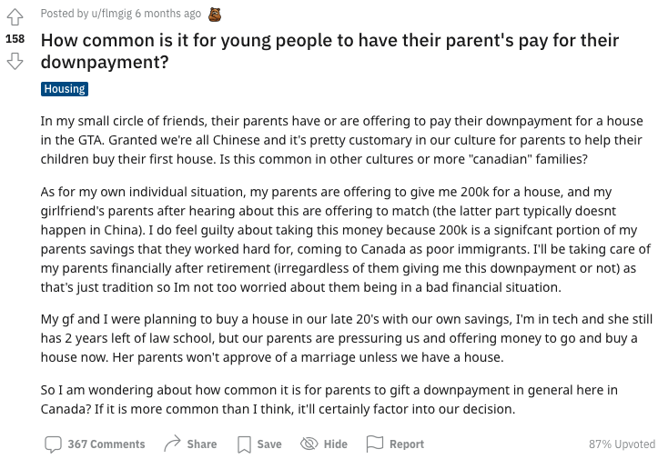
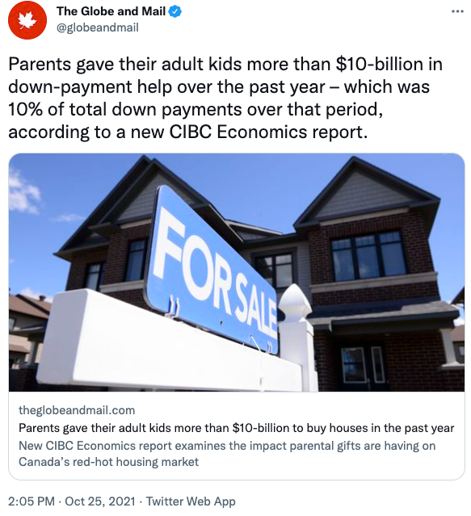
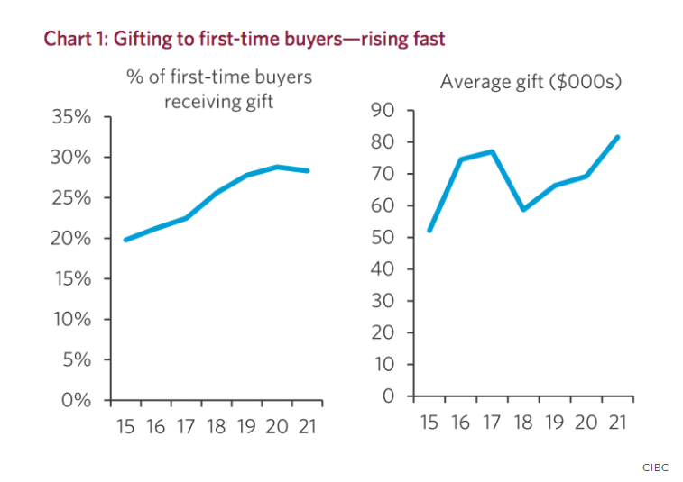
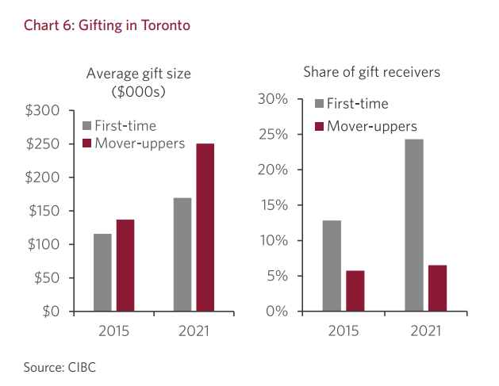

# 无标题

**链接地址:** http://mp.weixin.qq.com/s?__biz=MjM5MDEzNzY2NQ==&mid=2652829793&idx=1&sn=5f58e2dfb988b58de4ceeb2f097c797f&chksm=bda3344f8ad4bd5953afea0c132c7c26d5d49b20aaf37ec803a350582a225dfaf1938bc1b8da&mpshare=1&scene=2&srcid=10263PbQ2cOVNXuDV7iN0Wuy&sharer_sharetime=1635201491856&sharer_shareid=be1c8edd6c93eec155a61c876e41d26a#rd
**作者:** 凯龙
**获取时间:** 2025/8/28 19:41:12
**图片数量:** 12

---

## 原始HTML内容

<a target="_blank" href="https://mp.weixin.qq.com/s?__biz=MzIwNTc2ODIyOQ==&amp;mid=2247498627&amp;idx=2&amp;sn=38a3c7a143ecfc59f5d3bc48d01b2b37&amp;scene=21#wechat_redirect" textvalue="你已选中了添加链接的内容" tab="innerlink" data-linktype="1"></a>

----------以上可点击广告----------

加拿大房地产市场火热的其中秘诀是父母帮助首次购房者支付首付。

 

在加拿大，啃老有多普遍？

 

先看看Redidit论坛上一名华人网友自己的啃老故事。

 

这名华人说道：“在我社交的小圈子里，很多人的父母已经或正在提议帮助孩子出在大多伦多买房的首付。当然啦，我们都是华人，而且在我们的文化中，父母帮助孩子买第一套房子是很正常的。但就是搞不懂，这在其他文化或更多“加拿大”家庭中是否常见？”

 

这名网友说了他的例子：“至于我自己的情况，我爸妈主动提出给我$20万买房子，我女朋友爸妈听说后也说要给一样的金额。我确实对拿这笔钱有点内疚，因为$20w也是是我父母毕生积蓄的很大一部分，他们努力工作，以第一代贫穷移民的身份来到加拿大。所以退休后我肯定会在经济上照顾我的父母（不管他们是否给我这笔首付），因为这只是传统，所以我不太担心他们的财务状况不佳。”

 

“女朋友和我计划在我们20多岁的时候用自己的积蓄买房子，我在IT行业，她还有 2 年就法学院毕业了，但我们的父母却施加压力让我们现在就买房，他们给钱，而且除非我们有房子，否则她父母不会同意结婚。”

 

“所以我想知道，在加拿大一般来说父母送首付的情况有多普遍？如果这比我想象的更常见，那么这肯定会影响我们的决定。”

 

 

其实，加拿大啃老真的越来越普遍，因为加拿大房价越来越高，年轻人只能是望而却步，越来越多的首次购房者需要从父母那里获得首付或全款的资助。

 

多伦多这个资助的平均数字也已经突破了$13万加币，这对年轻人的父母来说压力也越来越大。

 

 

 

据加拿大帝国商业银行CIBC Economics 周一发布的一份报告，过去一年中，加拿大父母在为孩子提供了超过 100 亿元的首付帮助，占同期总首付的 10%。

 

在多伦多首次购房的人平均首付受父母资助的金额超过$13万加币。而那些豪宅买家（Move-up buyers ）获得更多，为了购买更大更昂贵的房屋的人收到父母亲人的资助接近$20万加币。

 

在温哥华则更高，为帮助孩子购买第一套住房，温哥华父母平均给了 180,000加元，而要购买更大更豪华住宅的人平均获得父母了34万加元。

 

根据数据显示，加拿大全国在2015年时首次购房者收到父母资助的比例大概是20%左右，而到了2021年，这个数字上升到了30%。这其中多伦多的增加比例最为明显。

 

 

 

多伦多2015年时，这个数字还是13%，到了2021年首次购房者收到父母资助的比例已经为25%，6年内上涨12%。

 

 

 

就父母资助的金额来说，加拿大的新购房者平均获得父母资助金额是$8.2万加币，而多伦多拥有全国最高的房地产价格，所以在多伦多平均资助金额已经超过了$13万加币。

 

 

 

加拿大全国换新房的平均父母资助金额大概是$12800加币，而在多伦多这个数字已经接近$20万加币了。

 

 

 

根据该报告，平均首付收到的资助金额的高低跟房价有关，并且随着时间的推移而波动。

 

报告中写道：“事实上，在过去五年中，资助的平均规模增长已经超过了房价通货膨胀。这个数字达到了平均每年增长9.7%，这比房价增长高整整两个百分点。”

 

 

 

据估计，在过去的一年里，加拿大购房者收到了超过$100亿加币的首付资助“礼物”，占同期首付总额的10%。

 

 

 

大量资金从父母流向成年子女所引发的一个关键问题是：这些钱从哪里来？&nbsp;

 

CIBC 的报告称，这主要是为了节省开支。使用信用监测公司 Equifax 的数据显示，加拿大全国有 5.5% 的父母借贷为孩子提供首付。而多伦多和温哥华的父母就负债累累，去年，多伦多和温哥华分别有近 10% 和 14% 的父母负债为子女以提供首付。

 

CIBC 发现，在大流行中，虽然首次购房者获得父母帮助并支付首付的比例没有变化。然而，在过去 18 个月的经济封锁期间，父母们节省储存的现金都给了孩子当首付礼物。

 

CIBC 的报告称，这可能解释了最近提供的父母帮助孩子购房数量增加的原因。

 

无论是中国还是加拿大都是一样，为了孩子，付出一切，老了也要借钱给孩子买房，可怜天下父母心！

 
<section style="margin-right: 16px;margin-left: 16px;white-space: normal;outline: 0px;max-width: 100%;font-family: -apple-system, BlinkMacSystemFont, &quot;Helvetica Neue&quot;, &quot;PingFang SC&quot;, &quot;Hiragino Sans GB&quot;, &quot;Microsoft YaHei UI&quot;, &quot;Microsoft YaHei&quot;, Arial, sans-serif;letter-spacing: 0.544px;min-height: 1em;background-color: rgb(255, 255, 255);text-align: center;line-height: 2em;box-sizing: border-box !important;overflow-wrap: break-word !important;">+++全加拿大华人都在关注超级生活，就差你了+++</section><section style="margin-right: 16px;margin-left: 16px;white-space: normal;outline: 0px;max-width: 100%;font-family: -apple-system, BlinkMacSystemFont, &quot;Helvetica Neue&quot;, &quot;PingFang SC&quot;, &quot;Hiragino Sans GB&quot;, &quot;Microsoft YaHei UI&quot;, &quot;Microsoft YaHei&quot;, Arial, sans-serif;letter-spacing: 0.544px;min-height: 1em;background-color: rgb(255, 255, 255);text-align: center;line-height: 2em;box-sizing: border-box !important;overflow-wrap: break-word !important;"></section><section style="margin-right: 16px;margin-left: 16px;white-space: normal;outline: 0px;max-width: 100%;font-family: -apple-system, BlinkMacSystemFont, &quot;Helvetica Neue&quot;, &quot;PingFang SC&quot;, &quot;Hiragino Sans GB&quot;, &quot;Microsoft YaHei UI&quot;, &quot;Microsoft YaHei&quot;, Arial, sans-serif;letter-spacing: 0.544px;min-height: 1em;background-color: rgb(255, 255, 255);text-align: right;line-height: 2em;box-sizing: border-box !important;overflow-wrap: break-word !important;">&nbsp; &nbsp; &nbsp; &nbsp; &nbsp; &nbsp; &nbsp; &nbsp; &nbsp; &nbsp; &nbsp; &nbsp; &nbsp; &nbsp; &nbsp; &nbsp; &nbsp; &nbsp; &nbsp; &nbsp; &nbsp; &nbsp; &nbsp;&nbsp;喜欢就狠点下吧</section>

---

## 纯文本内容

----------以上可点击广告----------加拿大房地产市场火热的其中秘诀是父母帮助首次购房者支付首付。在加拿大，啃老有多普遍？先看看Redidit论坛上一名华人网友自己的啃老故事。这名华人说道：“在我社交的小圈子里，很多人的父母已经或正在提议帮助孩子出在大多伦多买房的首付。当然啦，我们都是华人，而且在我们的文化中，父母帮助孩子买第一套房子是很正常的。但就是搞不懂，这在其他文化或更多“加拿大”家庭中是否常见？”这名网友说了他的例子：“至于我自己的情况，我爸妈主动提出给我$20万买房子，我女朋友爸妈听说后也说要给一样的金额。我确实对拿这笔钱有点内疚，因为$20w也是是我父母毕生积蓄的很大一部分，他们努力工作，以第一代贫穷移民的身份来到加拿大。所以退休后我肯定会在经济上照顾我的父母（不管他们是否给我这笔首付），因为这只是传统，所以我不太担心他们的财务状况不佳。”“女朋友和我计划在我们20多岁的时候用自己的积蓄买房子，我在IT行业，她还有 2 年就法学院毕业了，但我们的父母却施加压力让我们现在就买房，他们给钱，而且除非我们有房子，否则她父母不会同意结婚。”“所以我想知道，在加拿大一般来说父母送首付的情况有多普遍？如果这比我想象的更常见，那么这肯定会影响我们的决定。”其实，加拿大啃老真的越来越普遍，因为加拿大房价越来越高，年轻人只能是望而却步，越来越多的首次购房者需要从父母那里获得首付或全款的资助。多伦多这个资助的平均数字也已经突破了$13万加币，这对年轻人的父母来说压力也越来越大。据加拿大帝国商业银行CIBC Economics 周一发布的一份报告，过去一年中，加拿大父母在为孩子提供了超过 100 亿元的首付帮助，占同期总首付的 10%。在多伦多首次购房的人平均首付受父母资助的金额超过$13万加币。而那些豪宅买家（Move-up buyers ）获得更多，为了购买更大更昂贵的房屋的人收到父母亲人的资助接近$20万加币。在温哥华则更高，为帮助孩子购买第一套住房，温哥华父母平均给了 180,000加元，而要购买更大更豪华住宅的人平均获得父母了34万加元。根据数据显示，加拿大全国在2015年时首次购房者收到父母资助的比例大概是20%左右，而到了2021年，这个数字上升到了30%。这其中多伦多的增加比例最为明显。多伦多2015年时，这个数字还是13%，到了2021年首次购房者收到父母资助的比例已经为25%，6年内上涨12%。就父母资助的金额来说，加拿大的新购房者平均获得父母资助金额是$8.2万加币，而多伦多拥有全国最高的房地产价格，所以在多伦多平均资助金额已经超过了$13万加币。加拿大全国换新房的平均父母资助金额大概是$12800加币，而在多伦多这个数字已经接近$20万加币了。根据该报告，平均首付收到的资助金额的高低跟房价有关，并且随着时间的推移而波动。报告中写道：“事实上，在过去五年中，资助的平均规模增长已经超过了房价通货膨胀。这个数字达到了平均每年增长9.7%，这比房价增长高整整两个百分点。”据估计，在过去的一年里，加拿大购房者收到了超过$100亿加币的首付资助“礼物”，占同期首付总额的10%。大量资金从父母流向成年子女所引发的一个关键问题是：这些钱从哪里来？ CIBC 的报告称，这主要是为了节省开支。使用信用监测公司 Equifax 的数据显示，加拿大全国有 5.5% 的父母借贷为孩子提供首付。而多伦多和温哥华的父母就负债累累，去年，多伦多和温哥华分别有近 10% 和 14% 的父母负债为子女以提供首付。CIBC 发现，在大流行中，虽然首次购房者获得父母帮助并支付首付的比例没有变化。然而，在过去 18 个月的经济封锁期间，父母们节省储存的现金都给了孩子当首付礼物。CIBC 的报告称，这可能解释了最近提供的父母帮助孩子购房数量增加的原因。无论是中国还是加拿大都是一样，为了孩子，付出一切，老了也要借钱给孩子买房，可怜天下父母心！+++全加拿大华人都在关注超级生活，就差你了+++                                              喜欢就狠点下吧

---

## 图片列表

-  (原始链接: https://mmbiz.qpic.cn/mmbiz_jpg/szJas1pFaJffLb75t9BCfT9NPD80W7tuR7go4djEomwNYO4ks0UiaQ5V9KCrnibM27IkyicbbWCqLicRqvftIL9RCw/640?wx_fmt=jpeg)
-  (原始链接: https://mmbiz.qpic.cn/mmbiz_png/szJas1pFaJffLb75t9BCfT9NPD80W7tuSibmp0juTtoicX9piajDGvJ8hniaTANSbhMS6AQiaeyADGjO6fc1Hv0aM9w/640?wx_fmt=png)
-  (原始链接: https://mmbiz.qpic.cn/mmbiz_png/szJas1pFaJffLb75t9BCfT9NPD80W7tuSfTL788Rg6Zial4picWDNBojaLGPXCF7rO4vRCoO8ujicZTB3GfLqLnGA/640?wx_fmt=png)
-  (原始链接: https://mmbiz.qpic.cn/mmbiz_png/X9ZwD6DyyJAOj6QPo1d5iaUicrOxtTDhhMdOklTvHHibLUTjevKxpvfTAkUibe90v2AED4mSG8mMR1iaSmWRqjpnusg/640?wx_fmt=png)
-  (原始链接: https://mmbiz.qpic.cn/mmbiz_png/X9ZwD6DyyJAOj6QPo1d5iaUicrOxtTDhhM4vs4Rd7LJQCdun939W88LQf3Y6hxuQystWT04RMHdLwhHMadib1rdDg/640?wx_fmt=png)
-  (原始链接: https://mmbiz.qpic.cn/mmbiz_jpg/X9ZwD6DyyJAOj6QPo1d5iaUicrOxtTDhhMwORwIpjVWRLULLoUm17PayoRGQLyDE9KAEJXTu2s5gXuDm8Fv5jlvA/640?wx_fmt=jpeg)
-  (原始链接: https://mmbiz.qpic.cn/mmbiz_jpg/X9ZwD6DyyJAOj6QPo1d5iaUicrOxtTDhhM7vXpJrUHfKnbRNQFd0vt2liar2GiaYkR8WdexNlm689PDozxZ8cQ6qfA/640?wx_fmt=jpeg)
-  (原始链接: https://mmbiz.qpic.cn/mmbiz_jpg/X9ZwD6DyyJAOj6QPo1d5iaUicrOxtTDhhMS00r079THobZkyduNTqJvrmOibWaATyiaxUib8VxQEKLB7NcGibpj1Ir4g/640?wx_fmt=jpeg)
-  (原始链接: https://mmbiz.qpic.cn/mmbiz_jpg/X9ZwD6DyyJAOj6QPo1d5iaUicrOxtTDhhMLohTPkNLC4PGoNa8vajZtcibdl1CfB20yNFSzViaoVpiaK4Xpm7t4iclMA/640?wx_fmt=jpeg)
-  (原始链接: https://mmbiz.qpic.cn/mmbiz_png/X9ZwD6DyyJAOj6QPo1d5iaUicrOxtTDhhMUsLcJKyiaVUqAib6DI6cmMp6cCxAv6Jf4st6KJdlvGDPtYsI5ibGFiciazQ/640?wx_fmt=png)
-  (原始链接: https://mmbiz.qpic.cn/mmbiz_gif/szJas1pFaJciafpfjOBz8frgHmpJ4qlKKk76KbuUlPOdJ89eVxMjeudj7VjeoS5xib6sXYhPHnwP6PiadxYVypibQg/640?wx_fmt=gif)
-  (原始链接: https://mmbiz.qpic.cn/mmbiz_png/szJas1pFaJdux7mbDaq4CpWoWAUe3fNIlVYWrSfV7acu1tNBibI1icqvrlqkkqWdELW157V8YZVNxH7MLYksFHcA/640?wx_fmt=png)
