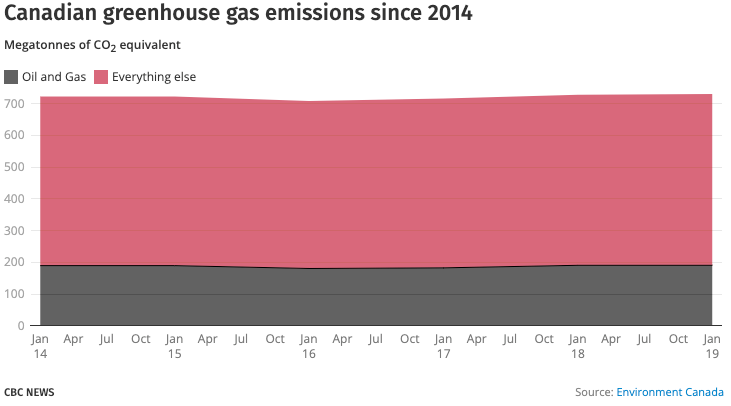
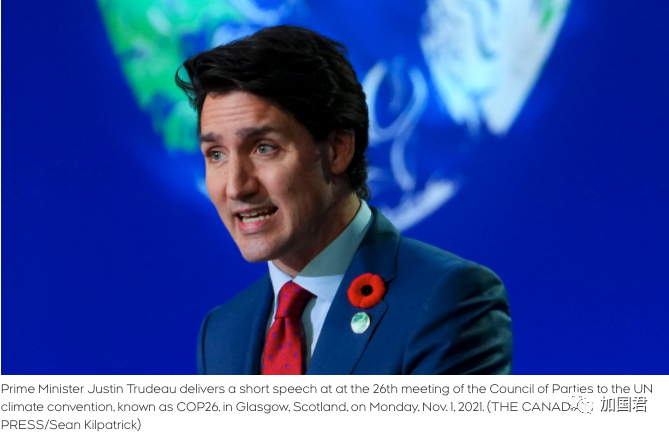

# 无标题

**链接地址:** http://mp.weixin.qq.com/s?__biz=MzI2ODYyODQ0OA==&mid=2247542013&idx=1&sn=1a7992ca7e7075465159dbd57f9437a5&chksm=eaeedc72dd9955644c5c6c15ccc46cb837cb6e356bf9ed04212c3f24e0a546d7067e0eb31090&mpshare=1&scene=2&srcid=1103LteydS9ZOJkxN5fQ5dAh&sharer_sharetime=1635886015434&sharer_shareid=be1c8edd6c93eec155a61c876e41d26a#rd
**作者:** 丁其
**获取时间:** 2025/8/28 19:41:02
**图片数量:** 16

---

## 原始HTML内容

安省今天新增331例，比昨天422例有所回落。

 

 

其中约克区44例，多伦多42例，皮尔区36例。 

 

安省34个卫生区的疫情数字如下：

 

 

正在欧洲参加COP26气候峰会的总理特鲁多刚刚宣布加拿大石油和天然气行业的减排细节。

 

 

特鲁多称：“刚刚宣布：我们承诺到 2030 年将石油和天然气行业的甲烷排放量减少至少 75%。加拿大是作为第一个做出这一承诺的国家，我们呼吁其他能源生产商与我们一起做需要的事情，现在就要解决甲烷排放问题。”

 

 

加拿大总理特鲁多昨天在苏格兰举行的 COP26峰会上已经宣布，加拿大将对石油和天然气行业的排放量设定一个硬性上限。

 

 
<h1 style="line-height: 2em;margin-left: 16px;margin-right: 16px;">联合国COP26气候峰会今天在苏格兰格拉斯哥举行，特鲁多宣布，加拿大不但在严格限制碳排，还将限制石油和天然气行业的排放量。</h1>
 

特鲁多称这一承诺是“一项重大承诺”，应该会激励其他资源丰富的国家大幅控制自己的排放量，并表示准备遏制加拿大其中一个最大工业的增长，以帮助世界将全球平均气温升高控制在1.5 摄氏度。

 

 

特鲁多在聚集在其他世界领导人面前发表两分钟的讲话时说：“我们今天将限制石油和天然气行业的排放量，并确保到 2050 年达到净零排放所需的速度和规模的减少。”

 

特鲁多继续说道：“对于一个主要石油和天然气生产国来说，这不是一件小事。这是绝对必要迈出的一大步。”

 

2019 年，加拿大石油和天然气部门的温室气体排放量为 191 兆吨，占该国总排放量的 26%。加拿大第二大排放源是运输部门，排放量为 186 兆吨。

 

图：加拿大2014-2019温室气体排放 

 

自 1990 年以来，石油和天然气行业的排放量几乎翻了一番，这一增长主要归因于油砂行业的急剧扩张。

 

代表石油和天然气利益的游说团体加拿大石油生产商协会 (CAPP) 认为，加拿大占世界温室气体排放量的不到 1.5%，全球气候变化的努力应该针对煤炭，而煤炭仍然占全球所有排放量的一半。

 

在 COP26 全体会议上，特鲁多还提出了建立全球最低排放价格的想法，为加拿大等开征碳税的国家提供公平竞争环境。

 

 

特鲁多说，加拿大“不顾国内政治上的强烈反对”和在法庭上进行了长达一年的斗争，推动开征碳税，因为“科学很清楚——我们必须做得更多、更快。”

 

特鲁多说：“这是一个有意义的污染价格，旨在不仅让生活更清洁，而且让加拿大人的生活更负担得起。”

 

“我呼吁其他国家也这样做。正如我们在全球范围内同意最低公司税一样，我们必须共同努力确保不再在世界任何地方自由污染。这意味着建立一个共同的最低定价标准污染。”

 

 

特鲁多还指出，加拿大已承诺提供 53 亿加元帮助低收入和中等收入国家进行减排和减缓努力，其中高达 10 亿元的资金专门用于帮助各国从煤炭转型。

 

特鲁多2015年上任以来，已经开始征收碳税，并且每年递增，到2030年，碳税将大幅增加至每吨 170加元，这将使其成为世界上碳价格最高的国家之一。

 

过去几年，加拿大物价已经不断大幅上升，碳税开征将加速运输成本的上升，每吨170元的碳税将会导致汽油价格每升上涨37.57分；加拿大寒冬必不可少的家庭取暖所需的天然气等成本也将上涨。

 

 

所以，对于特鲁多今天宣布石油和天然气行业减排75%的承诺，有网友开始不断评论了。

 

 

“总理先生，你家是怎么供暖的？”

 

 

“迫不及待地想你解决汽油价格飞涨而没有人能够负担得起上班的问题。也很迫切向知道您提供有关每个人如何买得起新车以及他们如何能够在整个冬天运行和充电的解决方案。”

 

 

“要加税吗？”

 
<section style="margin-right: 16px;margin-left: 16px;outline: 0px;max-width: 100%;letter-spacing: 0.544px;white-space: normal;min-height: 1em;color: rgb(160, 160, 160);font-size: 15px;background-color: rgb(255, 255, 255);font-family: -apple-system-font, BlinkMacSystemFont, &quot;Helvetica Neue&quot;, &quot;PingFang SC&quot;, &quot;Hiragino Sans GB&quot;, &quot;Microsoft YaHei UI&quot;, &quot;Microsoft YaHei&quot;, Arial, sans-serif;text-align: center;line-height: 2em;box-sizing: border-box !important;overflow-wrap: break-word !important;">------------下方是广告-----------</section><section style="margin-right: 16px;margin-left: 16px;outline: 0px;max-width: 100%;letter-spacing: 0.544px;white-space: normal;font-family: -apple-system, system-ui, &quot;Helvetica Neue&quot;, &quot;PingFang SC&quot;, &quot;Hiragino Sans GB&quot;, &quot;Microsoft YaHei UI&quot;, &quot;Microsoft YaHei&quot;, Arial, sans-serif;background-color: rgb(255, 255, 255);text-align: center;box-sizing: border-box !important;overflow-wrap: break-word !important;"></section><section style="margin-right: 16px;margin-left: 16px;outline: 0px;max-width: 100%;letter-spacing: 0.544px;white-space: normal;min-height: 1em;color: rgb(160, 160, 160);background-color: rgb(255, 255, 255);font-family: -apple-system-font, BlinkMacSystemFont, &quot;Helvetica Neue&quot;, &quot;PingFang SC&quot;, &quot;Hiragino Sans GB&quot;, &quot;Microsoft YaHei UI&quot;, &quot;Microsoft YaHei&quot;, Arial, sans-serif;font-size: 16px;text-align: center;line-height: 2em;box-sizing: border-box !important;overflow-wrap: break-word !important;"> </section><section style="margin-right: 16px;margin-left: 16px;outline: 0px;max-width: 100%;letter-spacing: 0.544px;white-space: normal;min-height: 1em;color: rgb(160, 160, 160);background-color: rgb(255, 255, 255);font-family: -apple-system-font, BlinkMacSystemFont, &quot;Helvetica Neue&quot;, &quot;PingFang SC&quot;, &quot;Hiragino Sans GB&quot;, &quot;Microsoft YaHei UI&quot;, &quot;Microsoft YaHei&quot;, Arial, sans-serif;font-size: 16px;text-align: center;line-height: 2em;box-sizing: border-box !important;overflow-wrap: break-word !important;">---大家快来关注加国君↓↓---</section><section style="margin-right: 16px;margin-left: 16px;outline: 0px;max-width: 100%;letter-spacing: 0.544px;white-space: normal;min-height: 1em;color: rgb(160, 160, 160);font-size: 15px;background-color: rgb(255, 255, 255);font-family: -apple-system-font, system-ui, &quot;Helvetica Neue&quot;, &quot;PingFang SC&quot;, &quot;Hiragino Sans GB&quot;, &quot;Microsoft YaHei UI&quot;, &quot;Microsoft YaHei&quot;, Arial, sans-serif;text-align: center;line-height: 2em;box-sizing: border-box !important;overflow-wrap: break-word !important;"></section><section style="margin-right: 16px;margin-left: 16px;outline: 0px;max-width: 100%;letter-spacing: 0.544px;white-space: normal;min-height: 1em;color: rgb(160, 160, 160);font-size: 15px;background-color: rgb(255, 255, 255);font-family: -apple-system-font, BlinkMacSystemFont, &quot;Helvetica Neue&quot;, &quot;PingFang SC&quot;, &quot;Hiragino Sans GB&quot;, &quot;Microsoft YaHei UI&quot;, &quot;Microsoft YaHei&quot;, Arial, sans-serif;text-align: right;line-height: 2em;box-sizing: border-box !important;overflow-wrap: break-word !important;"><strong style="outline: 0px;max-width: 100%;font-size: 16px;letter-spacing: 0.544px;box-sizing: border-box !important;overflow-wrap: break-word !important;">喜欢点个“在看” ↓↓</strong></section>

---

## 纯文本内容

安省今天新增331例，比昨天422例有所回落。其中约克区44例，多伦多42例，皮尔区36例。安省34个卫生区的疫情数字如下：正在欧洲参加COP26气候峰会的总理特鲁多刚刚宣布加拿大石油和天然气行业的减排细节。特鲁多称：“刚刚宣布：我们承诺到 2030 年将石油和天然气行业的甲烷排放量减少至少 75%。加拿大是作为第一个做出这一承诺的国家，我们呼吁其他能源生产商与我们一起做需要的事情，现在就要解决甲烷排放问题。”加拿大总理特鲁多昨天在苏格兰举行的 COP26峰会上已经宣布，加拿大将对石油和天然气行业的排放量设定一个硬性上限。联合国COP26气候峰会今天在苏格兰格拉斯哥举行，特鲁多宣布，加拿大不但在严格限制碳排，还将限制石油和天然气行业的排放量。特鲁多称这一承诺是“一项重大承诺”，应该会激励其他资源丰富的国家大幅控制自己的排放量，并表示准备遏制加拿大其中一个最大工业的增长，以帮助世界将全球平均气温升高控制在1.5 摄氏度。特鲁多在聚集在其他世界领导人面前发表两分钟的讲话时说：“我们今天将限制石油和天然气行业的排放量，并确保到 2050 年达到净零排放所需的速度和规模的减少。”特鲁多继续说道：“对于一个主要石油和天然气生产国来说，这不是一件小事。这是绝对必要迈出的一大步。”2019 年，加拿大石油和天然气部门的温室气体排放量为 191 兆吨，占该国总排放量的 26%。加拿大第二大排放源是运输部门，排放量为 186 兆吨。图：加拿大2014-2019温室气体排放自 1990 年以来，石油和天然气行业的排放量几乎翻了一番，这一增长主要归因于油砂行业的急剧扩张。代表石油和天然气利益的游说团体加拿大石油生产商协会 (CAPP) 认为，加拿大占世界温室气体排放量的不到 1.5%，全球气候变化的努力应该针对煤炭，而煤炭仍然占全球所有排放量的一半。在 COP26 全体会议上，特鲁多还提出了建立全球最低排放价格的想法，为加拿大等开征碳税的国家提供公平竞争环境。特鲁多说，加拿大“不顾国内政治上的强烈反对”和在法庭上进行了长达一年的斗争，推动开征碳税，因为“科学很清楚——我们必须做得更多、更快。”特鲁多说：“这是一个有意义的污染价格，旨在不仅让生活更清洁，而且让加拿大人的生活更负担得起。”“我呼吁其他国家也这样做。正如我们在全球范围内同意最低公司税一样，我们必须共同努力确保不再在世界任何地方自由污染。这意味着建立一个共同的最低定价标准污染。”特鲁多还指出，加拿大已承诺提供 53 亿加元帮助低收入和中等收入国家进行减排和减缓努力，其中高达 10 亿元的资金专门用于帮助各国从煤炭转型。特鲁多2015年上任以来，已经开始征收碳税，并且每年递增，到2030年，碳税将大幅增加至每吨 170加元，这将使其成为世界上碳价格最高的国家之一。过去几年，加拿大物价已经不断大幅上升，碳税开征将加速运输成本的上升，每吨170元的碳税将会导致汽油价格每升上涨37.57分；加拿大寒冬必不可少的家庭取暖所需的天然气等成本也将上涨。所以，对于特鲁多今天宣布石油和天然气行业减排75%的承诺，有网友开始不断评论了。“总理先生，你家是怎么供暖的？”“迫不及待地想你解决汽油价格飞涨而没有人能够负担得起上班的问题。也很迫切向知道您提供有关每个人如何买得起新车以及他们如何能够在整个冬天运行和充电的解决方案。”“要加税吗？”------------下方是广告--------------大家快来关注加国君↓↓---喜欢点个“在看” ↓↓

---

## 图片列表

-  (原始链接: https://mmbiz.qpic.cn/mmbiz_png/icDcCacWsN1VKDjgyliaLFB3ZkKOcuvrv92vLu1um8YRdiaib3rqibAGwMOficYlbBIM1zZLKzRlE2SiawbgibLuaiaV7ibg/640?wx_fmt=png)
-  (原始链接: https://mmbiz.qpic.cn/mmbiz_png/icDcCacWsN1VKDjgyliaLFB3ZkKOcuvrv9Pv5tEJKGwN6Wf0NAd3mahKIxrY0KJyaARO0fRicFOuu4kVdOrc407QA/640?wx_fmt=png)
-  (原始链接: https://mmbiz.qpic.cn/mmbiz_png/icDcCacWsN1VKDjgyliaLFB3ZkKOcuvrv9aKVYWl0LqOuiboUicdym7ot3jjFfkFVvNKVlD56fnSYNibWDaMBwB3Plw/640?wx_fmt=png)
-  (原始链接: https://mmbiz.qpic.cn/mmbiz_png/icDcCacWsN1VKDjgyliaLFB3ZkKOcuvrv9f2lRBbmaISaWS8ibJFua3IY3BQ9TQib6tmriaARKaNMyygwutDuo91DJg/640?wx_fmt=png)
-  (原始链接: https://mmbiz.qpic.cn/mmbiz_png/icDcCacWsN1VKDjgyliaLFB3ZkKOcuvrv9R9vUDibntFxzuHd67WLAplPy9Kvfk0TYrBYnkhf5PNibIiaGj9oRIiaZ0w/640?wx_fmt=png)
-  (原始链接: https://mmbiz.qpic.cn/mmbiz_png/icDcCacWsN1WLRomtDx0d6FUebLRSMEm5Em7RUBJCCm2c3cwzMIaxs5XXIht5ZOg8GhdFqQ4rkYos0FkqcCoakA/640?wx_fmt=png)
-  (原始链接: https://mmbiz.qpic.cn/mmbiz_png/icDcCacWsN1WLRomtDx0d6FUebLRSMEm5C56sCB8jOXxyibIesBib0pgCLFMGAMq4WupfjBYjTua3OeAG5aRRoDbA/640?wx_fmt=png)
-  (原始链接: https://mmbiz.qpic.cn/mmbiz_png/szJas1pFaJeHfS7FxiarVOkbarbUXsE6O63vR5xgZjAaSkWr1g323FMom9Xibdq4Wh2reHLicWbX5M2SXtgR4ABAw/640?wx_fmt=png)
-  (原始链接: https://mmbiz.qpic.cn/mmbiz_png/icDcCacWsN1WLRomtDx0d6FUebLRSMEm5uyDQqFYo0WLYjAM7KiczicJOvhgas4r2yicE3DczsCiaHaKVSjxQic00vyg/640?wx_fmt=png)
-  (原始链接: https://mmbiz.qpic.cn/mmbiz_png/icDcCacWsN1WLRomtDx0d6FUebLRSMEm5NWYx5Niafmabcico6NnwSvpqWMXUKcgYOsR8Fc9dnZQKYO8j7nTHDFIw/640?wx_fmt=png)
-  (原始链接: https://mmbiz.qpic.cn/mmbiz_png/icDcCacWsN1VKDjgyliaLFB3ZkKOcuvrv92dBgEyottKOKaDnAFoFI2ma8SGvTlaJWyWEOzHGT44dMlerh6Ewibpg/640?wx_fmt=png)
-  (原始链接: https://mmbiz.qpic.cn/mmbiz_png/icDcCacWsN1VKDjgyliaLFB3ZkKOcuvrv9WasmXDkrZnDR5W9VGwia3CO4KaJSmQr3dTPF8GQhqu3ZaFq5mf6AsqA/640?wx_fmt=png)
-  (原始链接: https://mmbiz.qpic.cn/mmbiz_png/icDcCacWsN1VKDjgyliaLFB3ZkKOcuvrv9KeD6dpibtsU3nVNjtyEyadwu3423WicAKfoUQPJ3euk0fRlSN0N3zfyA/640?wx_fmt=png)
-  (原始链接: https://mmbiz.qpic.cn/mmbiz_png/icDcCacWsN1VKDjgyliaLFB3ZkKOcuvrv991spkhTh3PnIag0UopDXgTJanOZHHRauxunJK4EwKrpRLSh2yWziciaw/640?wx_fmt=png)
-  (原始链接: https://mmbiz.qpic.cn/mmbiz_jpg/icDcCacWsN1WqFIQkOgDOCJeQyx5GErf8Q0PjulRsV401zibQPjnxibahGmHnLBm8gaYo0Mzshe4vN22lGlwfpN0w/640?wx_fmt=jpeg)
-  (原始链接: https://mmbiz.qpic.cn/mmbiz_jpg/icDcCacWsN1UfuVe5mmtBBvvB08BYhC4VDdleW5ykgKfQSY29ib5NByGTYSvMSw6HmDpYI5utbL0cgwAIxkqDU3Q/640?wx_fmt=jpeg)
