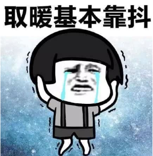
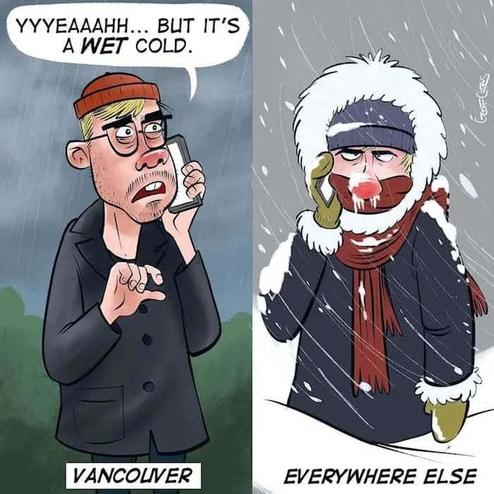
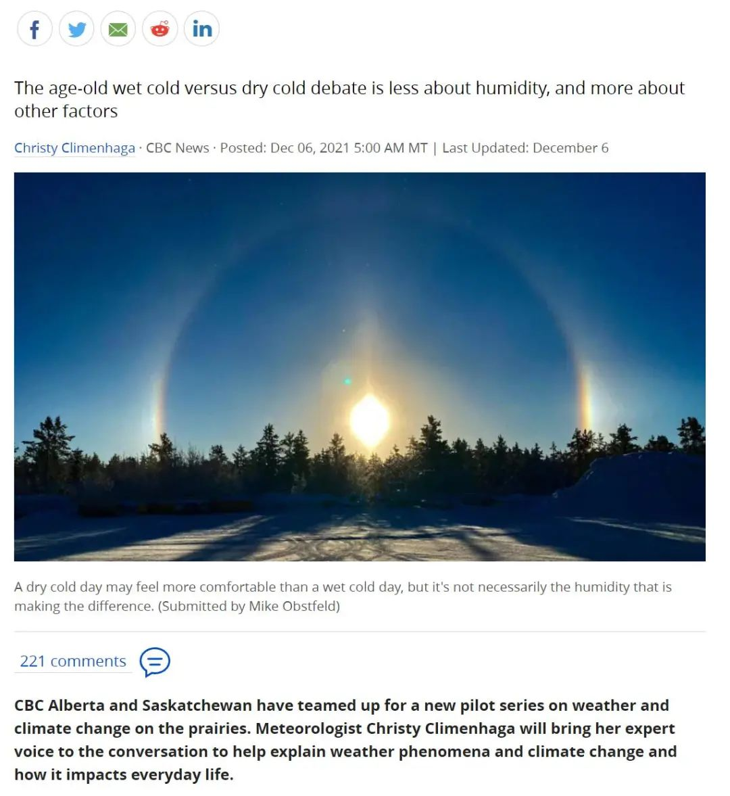
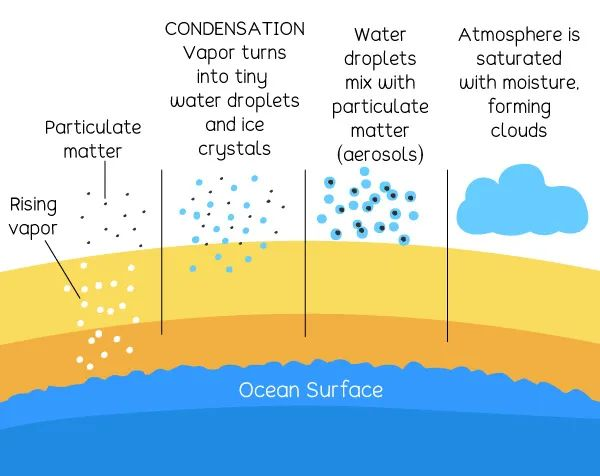
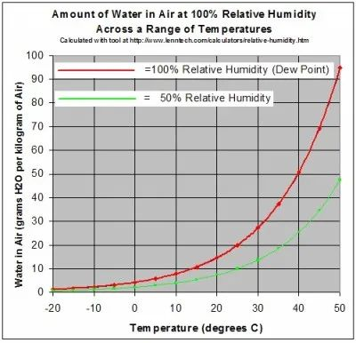
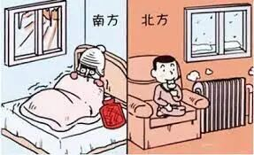
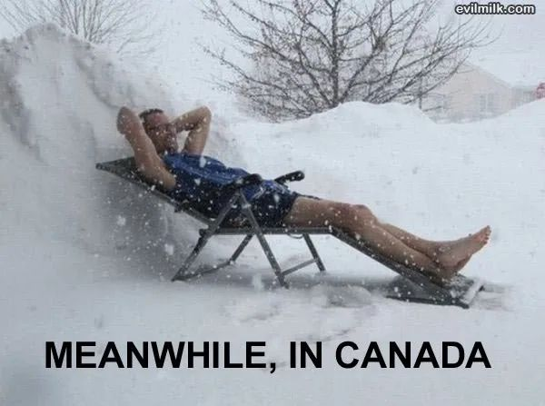
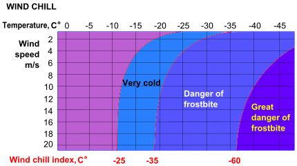
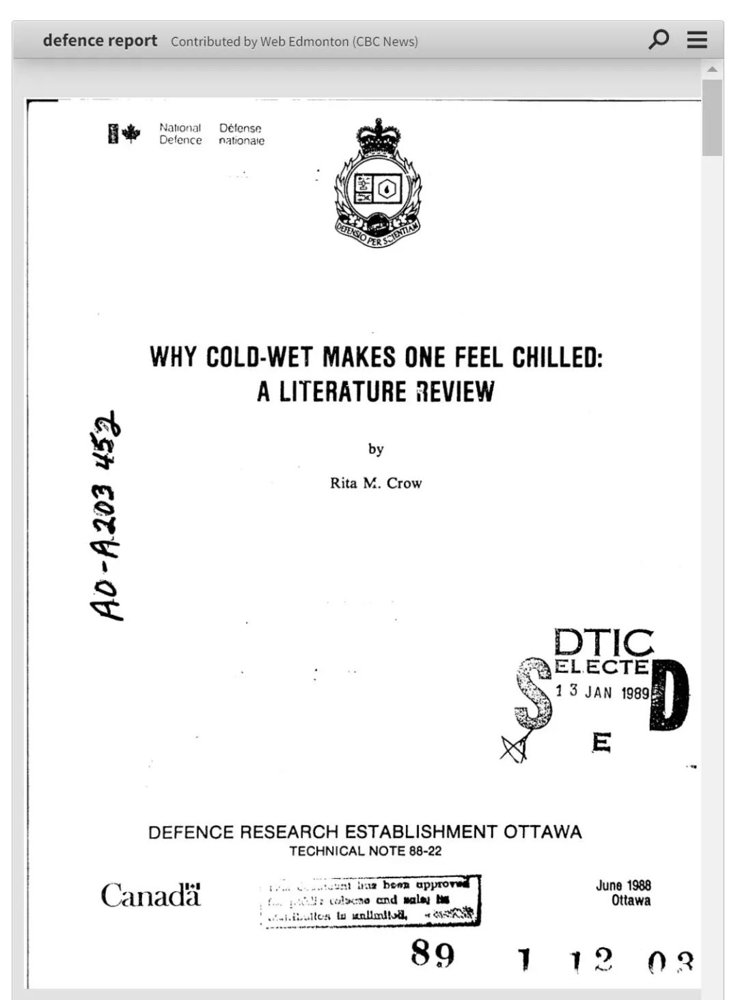

# 无标题

**链接地址:** http://mp.weixin.qq.com/s?__biz=MzI2ODYyODQ0OA==&mid=2247543770&idx=4&sn=7a7f3e7539ec20ac72f6fee47eaf56a7&chksm=eaeed355dd995a4397ea10aacd455f0be8a0a2b73da8f6ad78d476b9dad3f767d51a5ed4759b&mpshare=1&scene=2&srcid=1208vJ2NwornZ5SbqgjoLG8Z&sharer_sharetime=1638957881916&sharer_shareid=be1c8edd6c93eec155a61c876e41d26a#rd
**作者:** 妮娜
**获取时间:** 2025/8/28 19:40:50
**图片数量:** 14

---

## 原始HTML内容

<section style="box-sizing: border-box;font-size: 16px;"><section style="margin: 10px 0%;box-sizing: border-box;" powered-by="xiumi.us"><section style="font-size: 15px;letter-spacing: 0px;line-height: 2;padding-right: 15px;padding-left: 15px;box-sizing: border-box;">
<strong style="box-sizing: border-box;">“魔法攻击” vs “物理攻击”，到底哪家强？</strong>

 

每年一到冬天，一个经典的<strong style="box-sizing: border-box;">“湿冷 vs 干冷”</strong>到底哪个更冷的话题，总会成为北方人和南方人争论不休的<strong style="box-sizing: border-box;">“掰头”核心</strong>，其程度已经不亚于“甜咸粽子”的南北之争。

 
</section></section><section style="text-align: center;margin-top: 10px;margin-bottom: 10px;box-sizing: border-box;" powered-by="xiumi.us"><section style="max-width: 100%;vertical-align: middle;display: inline-block;line-height: 0;width: 50%;height: auto;box-sizing: border-box;"></section></section><section style="margin: 10px 0%;box-sizing: border-box;" powered-by="xiumi.us"><section style="font-size: 15px;letter-spacing: 0px;line-height: 2;padding-right: 15px;padding-left: 15px;box-sizing: border-box;">
 

最低温度可以达到零下三十多度的中国北方要不是集中供暖扛着，也不会这么轻易就在网络舆论上被形容成<strong style="box-sizing: border-box;">“魔法攻击”</strong>的湿冷打败。

 

然而对于寒冷的争议并非<strong style="box-sizing: border-box;">中国特色</strong>！作为各地都标配了过冬取暖设备的加拿大人们来说，“湿冷”和“干冷”也是沿海地区和内陆地区的居民们<strong style="box-sizing: border-box;">日常“掰头”</strong>的话题之一！

 
</section></section><section style="text-align: center;margin-top: 10px;margin-bottom: 10px;box-sizing: border-box;" powered-by="xiumi.us"><section style="max-width: 100%;vertical-align: middle;display: inline-block;line-height: 0;width: 60%;height: auto;box-sizing: border-box;"></section></section><section style="margin: 10px 0%;box-sizing: border-box;" powered-by="xiumi.us"><section style="font-size: 15px;letter-spacing: 0px;line-height: 2;padding-right: 15px;padding-left: 15px;box-sizing: border-box;">
 

不过，近期加拿大广播公司在阿尔伯塔省和萨斯喀彻温省联手开展了一个关于草原省天气和气候变化的新试点项目。

 

气象学家克里斯蒂·克里门哈（Christy Climenhaga）从专业的角度进行了科研，以帮助解释天气现象和气候变化以及它们如何影响加拿大人的日常生活。

 
</section></section><section style="text-align: center;margin-top: 10px;margin-bottom: 10px;box-sizing: border-box;" powered-by="xiumi.us"><section style="max-width: 100%;vertical-align: middle;display: inline-block;line-height: 0;width: 90%;height: auto;box-sizing: border-box;"></section></section><section style="margin: 10px 0%;box-sizing: border-box;" powered-by="xiumi.us"><section style="font-size: 15px;letter-spacing: 0px;line-height: 2;padding-right: 15px;padding-left: 15px;box-sizing: border-box;">
 

特别是针对大家长期以来争论不休的议题《“湿冷”和“干冷”到底哪个攻击力更强？》进行了论述。然而得出的结论却让人<strong style="box-sizing: border-box;">惊愕的同时又表示可以理解</strong>。

 
</section></section><section style="text-align: center;margin-top: 10px;margin-bottom: 10px;box-sizing: border-box;" powered-by="xiumi.us"><section style="max-width: 100%;vertical-align: middle;display: inline-block;line-height: 0;width: 50%;height: auto;box-sizing: border-box;"></section></section><section style="margin: 10px 0%;box-sizing: border-box;" powered-by="xiumi.us"><section style="font-size: 15px;letter-spacing: 0px;line-height: 2;padding-right: 15px;padding-left: 15px;box-sizing: border-box;">
 

所以，到底“魔法攻击”和“物力攻击”哪家强？答案是：<strong style="box-sizing: border-box;">一样强</strong><strong style="box-sizing: border-box;">！</strong>

 

 

<strong style="box-sizing: border-box;">低温下，空气中的水份含量可忽略不计</strong>

 

众所周知，空气由多种不同的气体组成，包括氮气、氧气和二氧化碳。当然，空气中也包含由于参与水循环而不断变化形态的<strong style="box-sizing: border-box;">水蒸气</strong>。

 

对于常见的湿度概念，所谓绝对湿度是不考虑温度的特定体积空气中水蒸气的质量。而相对湿度是你在每日天气预报中看到的那个数值——它将空气中水蒸气的浓度视为<strong style="box-sizing: border-box;">饱和时的水蒸气浓度的百分比</strong>。&nbsp;

 
</section></section><section style="text-align: center;margin-top: 10px;margin-bottom: 10px;box-sizing: border-box;" powered-by="xiumi.us"><section style="max-width: 100%;vertical-align: middle;display: inline-block;line-height: 0;width: 90%;height: auto;box-sizing: border-box;"></section></section><section style="margin: 10px 0%;box-sizing: border-box;" powered-by="xiumi.us"><section style="font-size: 15px;letter-spacing: 0px;line-height: 2;padding-right: 15px;padding-left: 15px;box-sizing: border-box;">
 

对于炎热的夏天而言，相对湿度的不同让人体的感受截然不同：20%湿度下的30℃比90%湿度下的30℃明显好过很多。

 

那是因为高湿度的暖空气中含有较多的水蒸气，因此人体很难<strong style="box-sizing: border-box;">通过汗液排出体内多余的热量</strong>。如果人体的排汗过程受到阻碍，体温的升高将会让你感到十分难受。 

 

但当气温下降时，水蒸气与相对湿度的关系发生变化。因为当空气充分冷却并且相对湿度为100%时，就会发生<strong style="box-sizing: border-box;">冷凝（Condensation）</strong>。&nbsp;

 
</section></section><section style="text-align: center;margin-top: 10px;margin-bottom: 10px;box-sizing: border-box;" powered-by="xiumi.us"><section style="max-width: 100%;vertical-align: middle;display: inline-block;line-height: 0;width: 90%;height: auto;box-sizing: border-box;"></section></section><section style="margin: 10px 0%;box-sizing: border-box;" powered-by="xiumi.us"><section style="font-size: 15px;letter-spacing: 0px;line-height: 2;padding-right: 15px;padding-left: 15px;box-sizing: border-box;">
 

冷凝是水蒸气变成液体的过程。这些水滴构成了我们看到的云，当这些水滴聚集到足够大和足够重时，它们就会以雨或雪的形式落下。

 

因此，遇冷空气中的相对湿度会保持上升，并且<strong style="box-sizing: border-box;">很容易就达到饱和</strong>。在寒冷的温度下，即使在相对较高的湿度下，每千克空气中的水分子数量也会大量减少。&nbsp;

 
</section></section><section style="text-align: center;margin-top: 10px;margin-bottom: 10px;box-sizing: border-box;" powered-by="xiumi.us"><section style="max-width: 100%;vertical-align: middle;display: inline-block;line-height: 0;width: 90%;height: auto;box-sizing: border-box;"></section></section><section style="margin: 10px 0%;box-sizing: border-box;" powered-by="xiumi.us"><section style="font-size: 15px;letter-spacing: 0px;line-height: 2;padding-right: 15px;padding-left: 15px;box-sizing: border-box;">
 

大卫·菲利普斯（David Phillips）是加拿大环境与气候变化部的高级气候学家。他解释说，当气温降到-20℃时，在一公斤（1000g）几乎饱湿度饱和的空气中，也只有<strong style="box-sizing: border-box;">大约0.5g的水</strong>。&nbsp;

 

此时，“空气中的可以忽略不计的水分子的数量已经不足以将热量从你的身体里带走。” 所以，在其他气候条件相同的情况下，无论是干燥还是“湿润”的冷空气，带<strong style="box-sizing: border-box;">给你身体的感受是差不多的</strong>。 

 
</section></section><section style="text-align: center;margin-top: 10px;margin-bottom: 10px;box-sizing: border-box;" powered-by="xiumi.us"><section style="max-width: 100%;vertical-align: middle;display: inline-block;line-height: 0;box-sizing: border-box;"></section></section><section style="margin: 10px 0%;box-sizing: border-box;" powered-by="xiumi.us"><section style="font-size: 15px;letter-spacing: 0px;line-height: 2;padding-right: 15px;padding-left: 15px;box-sizing: border-box;">
 

看到这里，生活在海边和南方的小伙伴们就要纳闷：“道理我都懂，但是我不管！南方的湿冷就是更冷，我<strong style="box-sizing: border-box;">不接受反驳</strong>！”

 

没错，湿冷的冬天确实不太好过。但<strong style="box-sizing: border-box;">“罪魁祸首”却不是“湿”</strong>。

 

 

<strong style="box-sizing: border-box;">“湿度”为风寒背了锅</strong>

 

比如加拿大滨海地区的居民们需要在–2℃时开始佩戴耳罩来保护他们的耳朵，但居住在草原三省的居民们不到–10℃都不会考虑戴上围巾。&nbsp;

 
</section></section><section style="text-align: center;margin-top: 10px;margin-bottom: 10px;box-sizing: border-box;" powered-by="xiumi.us"><section style="max-width: 100%;vertical-align: middle;display: inline-block;line-height: 0;width: 60%;height: auto;box-sizing: border-box;"></section></section><section style="margin: 10px 0%;box-sizing: border-box;" powered-by="xiumi.us"><section style="font-size: 15px;letter-spacing: 0px;line-height: 2;padding-right: 15px;padding-left: 15px;box-sizing: border-box;">
 

两个地域由于处于截然不同的自然地理环境，空气流动带来的<strong style="box-sizing: border-box;">风速和风向差异所造成的风寒（wind chill）</strong>在体感温度上扮演着更重要的角色。

 
</section></section><section style="text-align: center;margin-top: 10px;margin-bottom: 10px;box-sizing: border-box;" powered-by="xiumi.us"><section style="max-width: 100%;vertical-align: middle;display: inline-block;line-height: 0;width: 90%;height: auto;box-sizing: border-box;"></section></section><section style="margin: 10px 0%;box-sizing: border-box;" powered-by="xiumi.us"><section style="font-size: 15px;letter-spacing: 0px;line-height: 2;padding-right: 15px;padding-left: 15px;box-sizing: border-box;">
 

风寒效应是一种因风所引起使<strong style="box-sizing: border-box;">体感温度较实际气温低的现象</strong>。在寒冷气候中，迅速带走你体温的已经不是空气中的“湿度”，而是空气的流动。

 

<strong style="box-sizing: border-box;">用通俗易懂的话来说，就是：风大更冷。</strong>

 

另外，对比起大草原平坦开阔的地貌，处于海边和水域丰沛地区的民众，在冬季通常会遭遇到更多阴天和雨雪天气，这阻止了阳光的直射带来的<strong style="box-sizing: border-box;">热辐射效应</strong>。同样温度下的阳光直射处和背阴处体感温差也有着较大区别。

 

<strong style="box-sizing: border-box;">用通俗易懂的话来说，就是：太阳底下更暖。</strong>
</section></section><section style="box-sizing: border-box;" powered-by="xiumi.us"><section style="align-items: center;display: flex;margin-top: 15px;margin-bottom: 15px;box-sizing: border-box;"><section style="display: inline-block;vertical-align: bottom;width: auto;flex: 1 0 1px;box-sizing: border-box;"><section style="box-sizing: border-box;" powered-by="xiumi.us"><section style="align-items: center;display: flex;box-sizing: border-box;"><section style="display: inline-block;vertical-align: bottom;width: auto;flex: 1 1 auto;box-shadow: rgba(0, 0, 0, 0) 0px 0px 0px;box-sizing: border-box;"><section style="margin-top: 0.5em;margin-bottom: 0.5em;box-sizing: border-box;" powered-by="xiumi.us"><section style="background-color: rgb(159, 208, 238);height: 1px;box-sizing: border-box;"><section><svg viewBox="0 0 1 1" style="float:left;line-height:0;width:0;vertical-align:top;"></svg></section></section></section></section><section style="display: inline-block;vertical-align: bottom;width: auto;flex: 0 0 auto;box-shadow: rgba(0, 0, 0, 0) 0px 0px 0px;line-height: 0;letter-spacing: 0px;box-sizing: border-box;"><section style="text-align: center;box-sizing: border-box;" powered-by="xiumi.us"><section style="display: inline-block;width: 9px;height: 9px;vertical-align: top;overflow: hidden;border-width: 1px;border-radius: 100px;border-style: solid;border-color: rgb(159, 208, 238);box-shadow: rgba(0, 0, 0, 0) 1px 1px 0px inset;line-height: 0;letter-spacing: 0px;box-sizing: border-box;"><section style="text-align: justify;box-sizing: border-box;" powered-by="xiumi.us">
 
</section></section></section></section></section></section></section><section style="display: inline-block;vertical-align: bottom;width: auto;flex: 0 1 auto;padding-right: 10px;padding-left: 10px;box-sizing: border-box;"><section style="text-align: center;box-sizing: border-box;" powered-by="xiumi.us"><section style="display: inline-block;width: 40px;height: 40px;vertical-align: top;overflow: hidden;box-shadow: rgb(0, 0, 0) 0px 0px 0px;box-sizing: border-box;"><section style="margin-right: 0%;margin-left: 0%;box-sizing: border-box;" powered-by="xiumi.us"><section style="max-width: 100%;vertical-align: middle;display: inline-block;line-height: 0;width: 90%;box-shadow: rgb(0, 0, 0) 0px 0px 0px;box-sizing: border-box;"></section></section></section></section></section><section style="display: inline-block;vertical-align: bottom;width: auto;flex: 1 0 1px;box-sizing: border-box;"><section style="box-sizing: border-box;" powered-by="xiumi.us"><section style="align-items: center;display: flex;transform: rotateY(180deg);-webkit-transform: rotateY(180deg);-moz-transform: rotateY(180deg);-o-transform: rotateY(180deg);box-sizing: border-box;"><section style="display: inline-block;vertical-align: bottom;width: auto;flex: 1 1 auto;box-sizing: border-box;"><section style="margin-top: 0.5em;margin-bottom: 0.5em;box-sizing: border-box;" powered-by="xiumi.us"><section style="background-color: rgb(159, 208, 238);height: 1px;box-sizing: border-box;"><section><svg viewBox="0 0 1 1" style="float:left;line-height:0;width:0;vertical-align:top;"></svg></section></section></section></section><section style="display: inline-block;vertical-align: bottom;width: auto;flex: 0 0 auto;box-shadow: transparent 0px 0px 0px;line-height: 0;letter-spacing: 0px;box-sizing: border-box;"><section style="text-align: center;box-sizing: border-box;" powered-by="xiumi.us"><section style="display: inline-block;width: 9px;height: 9px;vertical-align: top;overflow: hidden;border-width: 1px;border-radius: 100px;border-style: solid;border-color: rgb(159, 208, 238);box-shadow: rgba(0, 0, 0, 0) 1px 1px 0px inset;line-height: 0;letter-spacing: 0px;box-sizing: border-box;"><section style="text-align: justify;box-sizing: border-box;" powered-by="xiumi.us">
 
</section></section></section></section></section></section></section></section></section><section style="margin: 10px 0%;box-sizing: border-box;" powered-by="xiumi.us"><section style="font-size: 15px;letter-spacing: 0px;line-height: 2;padding-right: 15px;padding-left: 15px;box-sizing: border-box;">
 

<strong style="box-sizing: border-box;">加拿大人不会被“湿冷”打败！</strong>

 
</section></section><section style="text-align: center;margin-top: 10px;margin-bottom: 10px;box-sizing: border-box;" powered-by="xiumi.us"><section style="max-width: 100%;vertical-align: middle;display: inline-block;line-height: 0;width: 90%;height: auto;box-sizing: border-box;"></section></section><section style="margin: 10px 0%;box-sizing: border-box;" powered-by="xiumi.us"><section style="font-size: 15px;letter-spacing: 0px;line-height: 2;padding-right: 15px;padding-left: 15px;box-sizing: border-box;">
 

其实加拿大人对于“干冷”和“湿冷”的研究可以追溯到<strong style="box-sizing: border-box;">1950</strong>年代。当时渥太华的研究机构针对低温环境中的湿度进行了体感测试。

 

1988年渥太华国防研究机构对研究论文中进行了审核。根据该报告，“研究人员没有发现在低温情况下低湿度和高湿度下人们的生理反应有<strong style="box-sizing: border-box;">任何显著差异</strong>。”

 
</section></section><section style="text-align: center;margin-top: 10px;margin-bottom: 10px;box-sizing: border-box;" powered-by="xiumi.us"><section style="max-width: 100%;vertical-align: middle;display: inline-block;line-height: 0;box-sizing: border-box;"></section></section><section style="margin: 10px 0%;box-sizing: border-box;" powered-by="xiumi.us"><section style="font-size: 15px;letter-spacing: 0px;line-height: 2;padding-right: 15px;padding-left: 15px;box-sizing: border-box;">
 

看来，这么多年“湿冷”的<strong style="box-sizing: border-box;">“湿”默默背下的锅</strong>也得以正式地沉冤昭雪啦！等下次海边和南方居住的朋友们再嚷嚷着“湿冷更冷”的时候，请记得把今天新学到的小知识传授给他。

 

另外，对染加拿大的小伙伴们总体<strong style="box-sizing: border-box;">“抗寒buff”</strong>已经叠满，但是室外活动时还请多注意保暖。该穿的<strong style="box-sizing: border-box;">“chill cool”</strong>可千万不能忘哦！

 

 

<strong style="box-sizing: border-box;">文章参考来源：</strong>

https://www.cbc.ca/news/canada/edmonton/the-science-says-there-s-no-difference-between-a-dry-or-a-wet-cold-sorry-1.6268564

 
<section style="margin-right: 16px;margin-left: 16px;white-space: normal;outline: 0px;max-width: 100%;letter-spacing: 0.544px;color: rgb(160, 160, 160);background-color: rgb(255, 255, 255);font-family: -apple-system-font, BlinkMacSystemFont, &quot;Helvetica Neue&quot;, &quot;PingFang SC&quot;, &quot;Hiragino Sans GB&quot;, &quot;Microsoft YaHei UI&quot;, &quot;Microsoft YaHei&quot;, Arial, sans-serif;font-size: 16px;text-align: center;line-height: 2em;box-sizing: border-box !important;overflow-wrap: break-word !important;">---大家快来关注加国君↓↓---</section><section style="margin-right: 16px;margin-left: 16px;white-space: normal;outline: 0px;max-width: 100%;letter-spacing: 0.544px;color: rgb(160, 160, 160);font-size: 15px;background-color: rgb(255, 255, 255);font-family: -apple-system-font, system-ui, &quot;Helvetica Neue&quot;, &quot;PingFang SC&quot;, &quot;Hiragino Sans GB&quot;, &quot;Microsoft YaHei UI&quot;, &quot;Microsoft YaHei&quot;, Arial, sans-serif;text-align: center;line-height: 2em;box-sizing: border-box !important;overflow-wrap: break-word !important;"></section><section style="margin-right: 16px;margin-left: 16px;white-space: normal;outline: 0px;max-width: 100%;letter-spacing: 0.544px;color: rgb(160, 160, 160);font-size: 15px;background-color: rgb(255, 255, 255);font-family: -apple-system-font, BlinkMacSystemFont, &quot;Helvetica Neue&quot;, &quot;PingFang SC&quot;, &quot;Hiragino Sans GB&quot;, &quot;Microsoft YaHei UI&quot;, &quot;Microsoft YaHei&quot;, Arial, sans-serif;text-align: right;line-height: 2em;box-sizing: border-box !important;overflow-wrap: break-word !important;"><strong style="outline: 0px;max-width: 100%;font-size: 16px;letter-spacing: 0.544px;box-sizing: border-box !important;overflow-wrap: break-word !important;">喜欢点个“在看” ↓↓</strong></section>
  
</section></section></section>

---

## 纯文本内容

“魔法攻击” vs “物理攻击”，到底哪家强？每年一到冬天，一个经典的“湿冷 vs 干冷”到底哪个更冷的话题，总会成为北方人和南方人争论不休的“掰头”核心，其程度已经不亚于“甜咸粽子”的南北之争。最低温度可以达到零下三十多度的中国北方要不是集中供暖扛着，也不会这么轻易就在网络舆论上被形容成“魔法攻击”的湿冷打败。然而对于寒冷的争议并非中国特色！作为各地都标配了过冬取暖设备的加拿大人们来说，“湿冷”和“干冷”也是沿海地区和内陆地区的居民们日常“掰头”的话题之一！不过，近期加拿大广播公司在阿尔伯塔省和萨斯喀彻温省联手开展了一个关于草原省天气和气候变化的新试点项目。气象学家克里斯蒂·克里门哈（Christy Climenhaga）从专业的角度进行了科研，以帮助解释天气现象和气候变化以及它们如何影响加拿大人的日常生活。特别是针对大家长期以来争论不休的议题《“湿冷”和“干冷”到底哪个攻击力更强？》进行了论述。然而得出的结论却让人惊愕的同时又表示可以理解。所以，到底“魔法攻击”和“物力攻击”哪家强？答案是：一样强！低温下，空气中的水份含量可忽略不计众所周知，空气由多种不同的气体组成，包括氮气、氧气和二氧化碳。当然，空气中也包含由于参与水循环而不断变化形态的水蒸气。对于常见的湿度概念，所谓绝对湿度是不考虑温度的特定体积空气中水蒸气的质量。而相对湿度是你在每日天气预报中看到的那个数值——它将空气中水蒸气的浓度视为饱和时的水蒸气浓度的百分比。 对于炎热的夏天而言，相对湿度的不同让人体的感受截然不同：20%湿度下的30℃比90%湿度下的30℃明显好过很多。那是因为高湿度的暖空气中含有较多的水蒸气，因此人体很难通过汗液排出体内多余的热量。如果人体的排汗过程受到阻碍，体温的升高将会让你感到十分难受。但当气温下降时，水蒸气与相对湿度的关系发生变化。因为当空气充分冷却并且相对湿度为100%时，就会发生冷凝（Condensation）。 冷凝是水蒸气变成液体的过程。这些水滴构成了我们看到的云，当这些水滴聚集到足够大和足够重时，它们就会以雨或雪的形式落下。因此，遇冷空气中的相对湿度会保持上升，并且很容易就达到饱和。在寒冷的温度下，即使在相对较高的湿度下，每千克空气中的水分子数量也会大量减少。 大卫·菲利普斯（David Phillips）是加拿大环境与气候变化部的高级气候学家。他解释说，当气温降到-20℃时，在一公斤（1000g）几乎饱湿度饱和的空气中，也只有大约0.5g的水。 此时，“空气中的可以忽略不计的水分子的数量已经不足以将热量从你的身体里带走。” 所以，在其他气候条件相同的情况下，无论是干燥还是“湿润”的冷空气，带给你身体的感受是差不多的。看到这里，生活在海边和南方的小伙伴们就要纳闷：“道理我都懂，但是我不管！南方的湿冷就是更冷，我不接受反驳！”没错，湿冷的冬天确实不太好过。但“罪魁祸首”却不是“湿”。“湿度”为风寒背了锅比如加拿大滨海地区的居民们需要在–2℃时开始佩戴耳罩来保护他们的耳朵，但居住在草原三省的居民们不到–10℃都不会考虑戴上围巾。 两个地域由于处于截然不同的自然地理环境，空气流动带来的风速和风向差异所造成的风寒（wind chill）在体感温度上扮演着更重要的角色。风寒效应是一种因风所引起使体感温度较实际气温低的现象。在寒冷气候中，迅速带走你体温的已经不是空气中的“湿度”，而是空气的流动。用通俗易懂的话来说，就是：风大更冷。另外，对比起大草原平坦开阔的地貌，处于海边和水域丰沛地区的民众，在冬季通常会遭遇到更多阴天和雨雪天气，这阻止了阳光的直射带来的热辐射效应。同样温度下的阳光直射处和背阴处体感温差也有着较大区别。用通俗易懂的话来说，就是：太阳底下更暖。加拿大人不会被“湿冷”打败！其实加拿大人对于“干冷”和“湿冷”的研究可以追溯到1950年代。当时渥太华的研究机构针对低温环境中的湿度进行了体感测试。1988年渥太华国防研究机构对研究论文中进行了审核。根据该报告，“研究人员没有发现在低温情况下低湿度和高湿度下人们的生理反应有任何显著差异。”看来，这么多年“湿冷”的“湿”默默背下的锅也得以正式地沉冤昭雪啦！等下次海边和南方居住的朋友们再嚷嚷着“湿冷更冷”的时候，请记得把今天新学到的小知识传授给他。另外，对染加拿大的小伙伴们总体“抗寒buff”已经叠满，但是室外活动时还请多注意保暖。该穿的“chill cool”可千万不能忘哦！文章参考来源：https://www.cbc.ca/news/canada/edmonton/the-science-says-there-s-no-difference-between-a-dry-or-a-wet-cold-sorry-1.6268564---大家快来关注加国君↓↓---喜欢点个“在看” ↓↓

---

## 图片列表

-  (原始链接: https://mmbiz.qpic.cn/mmbiz_png/4kibCXA1QiblQqemM4tgPJ1UMHxlGU2s4BEjPA6cHGU9It8JOcmM9CNDq2QtkSVGiahNHVRU7aXnib1o3n2v7ULJrg/640?wx_fmt=png)
-  (原始链接: https://mmbiz.qpic.cn/mmbiz_jpg/4kibCXA1QiblQqemM4tgPJ1UMHxlGU2s4BBe13qcLc9ib5Syprs5icXdYxbLrW8I3MhHpNrl745sYJN0EIybE0SiaOQ/640?wx_fmt=jpeg)
-  (原始链接: https://mmbiz.qpic.cn/mmbiz_jpg/4kibCXA1QiblQqemM4tgPJ1UMHxlGU2s4Bicmut3bkAYIxIqc1Atr6DjGbad9R9iaiaOJIpRtkmc4d5kgRAZBwq2Mxw/640?wx_fmt=jpeg)
-  (原始链接: https://mmbiz.qpic.cn/mmbiz_jpg/4kibCXA1QiblQqemM4tgPJ1UMHxlGU2s4BqrMtoic5mCCewtUO5K0GvAYOiboWFPq37k1XtnSeHzeUGpSc6wuaTCpA/640?wx_fmt=jpeg)
-  (原始链接: https://mmbiz.qpic.cn/mmbiz_jpg/4kibCXA1QiblQqemM4tgPJ1UMHxlGU2s4BFRH9DV33hX3a3eWpJVpReYJrR2k9SbUeT7psurnyjvJf0FL5cGWiaHQ/640?wx_fmt=jpeg)
-  (原始链接: https://mmbiz.qpic.cn/mmbiz_jpg/4kibCXA1QiblQqemM4tgPJ1UMHxlGU2s4B4kym7DURyqJNrotsxcYvfU33WTMbLZLVrvzibApW7jCXC2u6jAVMiaag/640?wx_fmt=jpeg)
-  (原始链接: https://mmbiz.qpic.cn/mmbiz_jpg/4kibCXA1QiblQqemM4tgPJ1UMHxlGU2s4BMErK1zWsXPgbSFOxSGBW537H4iaY3rUIiaGiczIiblWD4vByyibIIPPUXwA/640?wx_fmt=jpeg)
-  (原始链接: https://mmbiz.qpic.cn/mmbiz_jpg/4kibCXA1QiblQqemM4tgPJ1UMHxlGU2s4BFpC13HrST7acZkfibjHppah1oUwKSXiaeUQLnucBd8IH0ldxVVAjnFSg/640?wx_fmt=jpeg)
-  (原始链接: https://mmbiz.qpic.cn/mmbiz_jpg/4kibCXA1QiblQqemM4tgPJ1UMHxlGU2s4BqOmSSbbYiabFKEyqVWic6bs8HJNgBUPuuSbEQquJn0UBIruwpP7XgzkA/640?wx_fmt=jpeg)
-  (原始链接: https://mmbiz.qpic.cn/mmbiz_png/4kibCXA1QiblQqemM4tgPJ1UMHxlGU2s4BdlRSorkHia9COYuVorQS82erje5W4sOiauM0NhXhoDrSHaLj1wvrlNeQ/640?wx_fmt=png)
-  (原始链接: https://mmbiz.qpic.cn/mmbiz_gif/Qbib272GpK2cZ6tl0my4TDnDtgwEMBCg1pCKXlnsx2CAT558p5MQQZNVibEFpOWUibzfSwCfZ7osD28gibGgXQ67vQ/640?wx_fmt=gif)
-  (原始链接: https://mmbiz.qpic.cn/mmbiz_jpg/4kibCXA1QiblQqemM4tgPJ1UMHxlGU2s4BicQMvwGicMibhLV5QhIBkepz0vAowv6YIr8ABBx4qXGQ4jxShByf6N8PQ/640?wx_fmt=jpeg)
-  (原始链接: https://mmbiz.qpic.cn/mmbiz_jpg/4kibCXA1QiblQqemM4tgPJ1UMHxlGU2s4BAXheDIgYz4CrpKeB9cc3O5mSDup9mnaU28yJn7YRKpP2DrJ0XTaolQ/640?wx_fmt=jpeg)
-  (原始链接: https://mmbiz.qpic.cn/mmbiz_jpg/icDcCacWsN1UfuVe5mmtBBvvB08BYhC4VDdleW5ykgKfQSY29ib5NByGTYSvMSw6HmDpYI5utbL0cgwAIxkqDU3Q/640?wx_fmt=jpeg)
