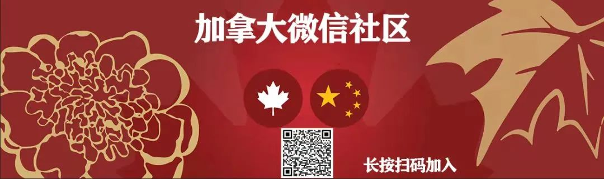
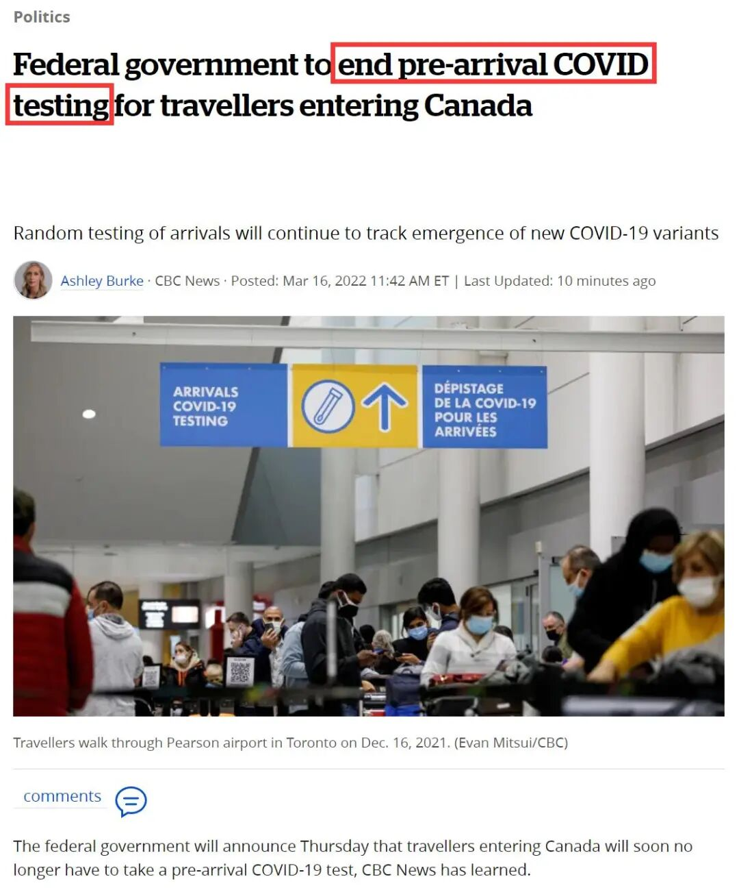
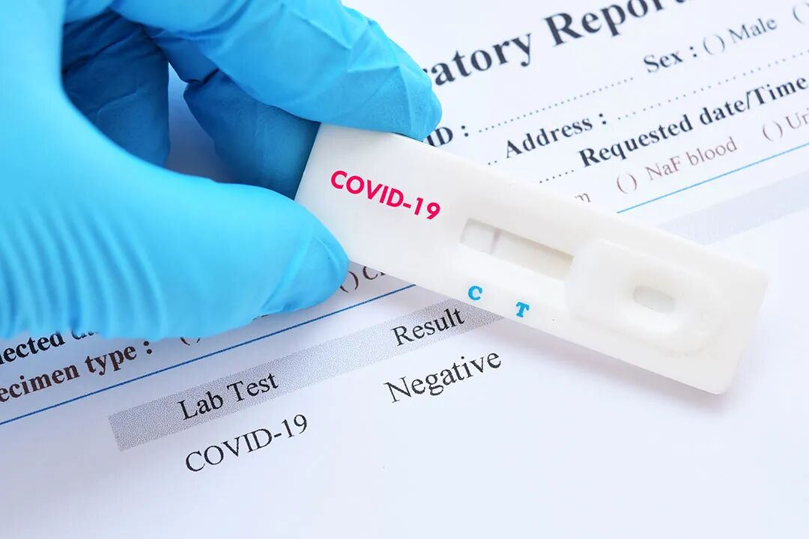
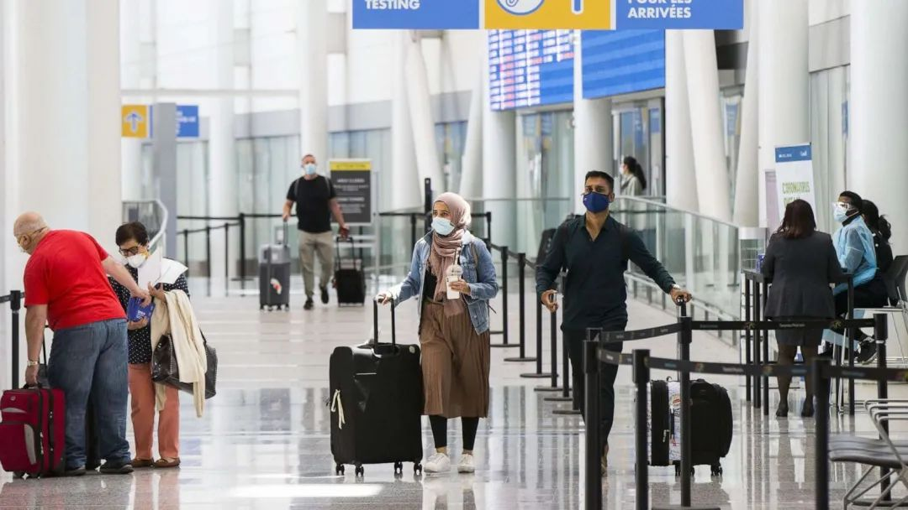
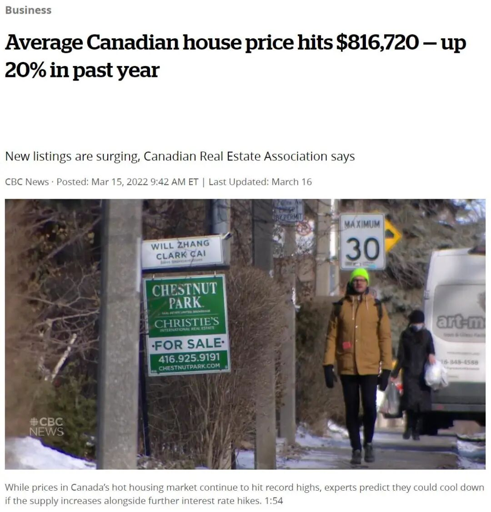
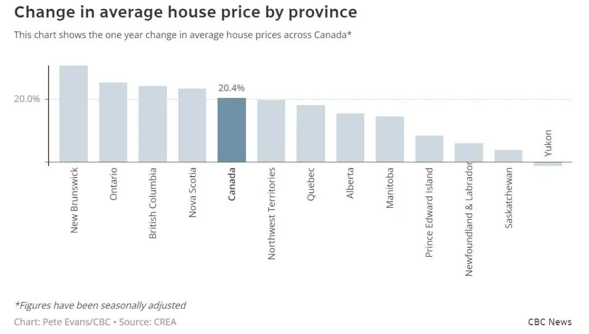
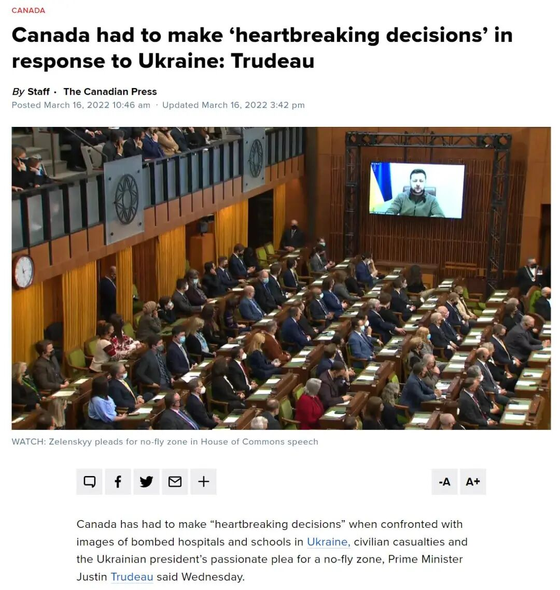
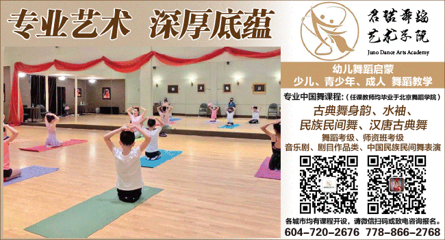
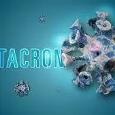
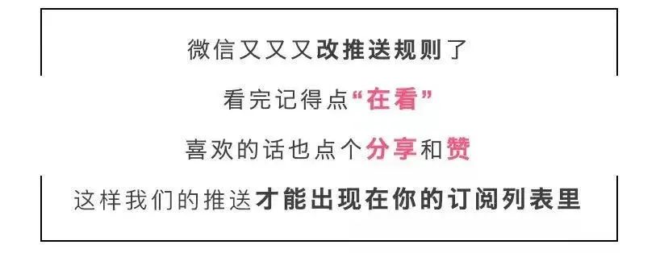

# 无标题

**链接地址:** http://mp.weixin.qq.com/s?__biz=MzU5OTQ2NjAwNw==&mid=2247496384&idx=1&sn=ff2c38d99d31e48af73d0c4499620e52&chksm=feb63bb8c9c1b2aeaa0680eabafbcce3dfae3bcd549549362fa9c25abf55ad67daf61a510ddf&mpshare=1&scene=2&srcid=0317lXT9B2Vtvf7lEqB6AwEX&sharer_sharetime=1647469063792&sharer_shareid=be1c8edd6c93eec155a61c876e41d26a#rd
**作者:** 加拿大一站式体验
**获取时间:** 2025/8/28 19:39:59
**图片数量:** 28

---

## 原始HTML内容

<section style="box-sizing: border-box;font-size: 16px;"><section style="text-align: center;margin-top: 10px;margin-bottom: 10px;box-sizing: border-box;" powered-by="xiumi.us"><section style="max-width: 100%;vertical-align: middle;display: inline-block;line-height: 0;box-sizing: border-box;"></section></section><section style="text-align: center;margin-top: 10px;margin-bottom: 10px;box-sizing: border-box;" powered-by="xiumi.us"></section><section style="text-align: center;margin-top: 10px;margin-bottom: 10px;box-sizing: border-box;" powered-by="xiumi.us"><section style="max-width: 100%;vertical-align: middle;display: inline-block;line-height: 0;box-sizing: border-box;"></section></section><section style="box-sizing: border-box;" powered-by="xiumi.us">
 
</section><section style="margin-top: 10px;margin-right: 0%;margin-left: 0%;box-sizing: border-box;" powered-by="xiumi.us"><section style="display: inline-block;width: 100%;vertical-align: top;box-sizing: border-box;"><section style="box-sizing: border-box;" powered-by="xiumi.us"><section style="display: flex;flex-flow: row nowrap;margin: 10px 0%;box-sizing: border-box;"><section style="display: inline-block;vertical-align: middle;width: auto;min-width: 10%;max-width: 100%;flex: 0 0 auto;height: auto;align-self: center;box-sizing: border-box;"><section style="margin-top: 10px;margin-bottom: 10px;text-align: center;box-sizing: border-box;" powered-by="xiumi.us"><section style="background-color: rgb(68, 68, 68);display: inline-block;width: 2.5em;height: 2.5em;line-height: 2.5em;border-radius: 100%;margin-left: auto;margin-right: auto;font-size: 18px;color: rgb(255, 255, 255);font-family: Optima-Regular, PingFangTC-light;box-sizing: border-box;">
<strong style="box-sizing: border-box;">01</strong>
</section></section></section><section style="display: inline-block;vertical-align: middle;width: auto;align-self: center;flex: 0 0 auto;min-width: 10%;max-width: 100%;height: auto;box-sizing: border-box;"><section style="transform: translate3d(10px, 0px, 0px);-webkit-transform: translate3d(10px, 0px, 0px);-moz-transform: translate3d(10px, 0px, 0px);-o-transform: translate3d(10px, 0px, 0px);box-sizing: border-box;" powered-by="xiumi.us"><section style="font-family: Optima-Regular, PingFangTC-light;box-sizing: border-box;">
<strong style="box-sizing: border-box;">加拿大取消抵达前的新冠检测</strong>
</section></section><section style="margin-top: 3px;margin-right: 0%;margin-left: 0%;transform: translate3d(-10px, 0px, 0px);box-sizing: border-box;" powered-by="xiumi.us"><section style="background-color: rgb(68, 68, 68);height: 1px;box-sizing: border-box;"><section><svg viewBox="0 0 1 1" style="float:left;line-height:0;width:0;vertical-align:top;"></svg></section></section></section></section></section></section></section></section><section style="font-size: 14px;padding-right: 15px;padding-left: 15px;letter-spacing: 1px;box-sizing: border-box;" powered-by="xiumi.us">
 

很快，大多数进入加拿大的旅客将<strong style="box-sizing: border-box;">不必出示新冠检测呈阴性的证明</strong>！

 

预计联邦政府最早将于明天宣布，进入加拿大的旅客将不再需要进行抵达前的强制性新冠检测要求。知情人士证实，<strong style="box-sizing: border-box;">加拿大正在取消机场和陆路过境点的检测要求</strong>。

 
</section><section style="text-align: center;margin-top: 10px;margin-bottom: 10px;box-sizing: border-box;" powered-by="xiumi.us"><section style="max-width: 100%;vertical-align: middle;display: inline-block;line-height: 0;width: 90%;height: auto;box-sizing: border-box;"></section></section><section style="font-size: 14px;padding-right: 15px;padding-left: 15px;letter-spacing: 1px;box-sizing: border-box;" powered-by="xiumi.us">
 

目前加拿大规定：任何入境加拿大的人——目前仅限于加拿大公民、永久居民和完全接种疫苗的外国人，必须提供过去24小时药房提供的快速检测阴性证明或者过去72小时内在加拿大境外进行的阴性分子（例如 PCR）检测。另外在抵达前10至180天进行的分子检测呈阳性也是可以接受的。

 

这样的规定一直<strong style="box-sizing: border-box;">遭到旅游业人士、航空公司的抵触</strong>。

 

旅游业一直在游说政府放宽这些测试要求。医疗和地方商界领袖在卡尔加里举行圆桌会议，<strong style="box-sizing: border-box;">呼吁政府在4月1日或之前完全取消对完全接种疫苗的旅行者的出发前检测</strong>。

 
</section><section style="text-align: center;margin-top: 10px;margin-bottom: 10px;box-sizing: border-box;" powered-by="xiumi.us"><section style="max-width: 100%;vertical-align: middle;display: inline-block;line-height: 0;width: 90%;height: auto;box-sizing: border-box;"></section></section><section style="font-size: 14px;padding-right: 15px;padding-left: 15px;letter-spacing: 1px;box-sizing: border-box;" powered-by="xiumi.us">
 

旅行者抱怨在国外寻找经批准的测试设施既昂贵又麻烦。一些<strong style="box-sizing: border-box;">PCR检测的成本超过200元</strong>，而抗原检测的成本通常远低于100元。 

 

现在这可能变为现实。多家媒体今天都报道，<strong style="box-sizing: border-box;">新规定将于4月1日开始实施</strong>。

 

卫生部长、交通部长和旅游部长将于明天（3月17日周四）宣布<strong style="box-sizing: border-box;">最新放宽大流行旅行限制的消息</strong>。进入加拿大的旅客将不再需要进行抵达前的新冠测试。 

 
</section><section style="text-align: center;margin-top: 10px;margin-bottom: 10px;box-sizing: border-box;" powered-by="xiumi.us"><section style="max-width: 100%;vertical-align: middle;display: inline-block;line-height: 0;width: 90%;height: auto;box-sizing: border-box;"></section></section><section style="font-size: 14px;padding-right: 15px;padding-left: 15px;letter-spacing: 1px;box-sizing: border-box;" powered-by="xiumi.us">
 

但加拿大政府将继续对抵达加拿大的旅客进行随机测试，以识别和跟踪变异病毒。政府一直在<strong style="box-sizing: border-box;">花费数百万元对进入加拿大的已接种疫苗的旅行者进行随机测试</strong>。 

 

传染病专家 Zain Chagla 博士在上个月的新闻发布会上说，由于奥密克戎变种已经在加拿大传播，因此<strong style="box-sizing: border-box;">抵达前和抵达后的检测是不必要的浪费</strong>。

 
</section><section style="text-align: center;margin-top: 10px;margin-bottom: 10px;box-sizing: border-box;" powered-by="xiumi.us"><section style="max-width: 100%;vertical-align: middle;display: inline-block;line-height: 0;box-sizing: border-box;"></section></section><section style="font-size: 14px;padding-right: 15px;padding-left: 15px;letter-spacing: 1px;box-sizing: border-box;" powered-by="xiumi.us">
 

消息人士还称，政府对从加拿大出发的国内和国际航班、VIA铁路和洛基山观光火车车以及游轮的疫苗强制令目前仍然有效。

 
</section><section style="margin-top: 10px;margin-right: 0%;margin-left: 0%;box-sizing: border-box;" powered-by="xiumi.us"><section style="display: inline-block;width: 100%;vertical-align: top;box-sizing: border-box;"><section style="box-sizing: border-box;" powered-by="xiumi.us"><section style="display: flex;flex-flow: row nowrap;margin: 10px 0%;box-sizing: border-box;"><section style="display: inline-block;vertical-align: middle;width: auto;min-width: 10%;max-width: 100%;flex: 0 0 auto;height: auto;align-self: center;box-sizing: border-box;"><section style="margin-top: 10px;margin-bottom: 10px;text-align: center;box-sizing: border-box;" powered-by="xiumi.us"><section style="background-color: rgb(68, 68, 68);display: inline-block;width: 2.5em;height: 2.5em;line-height: 2.5em;border-radius: 100%;margin-left: auto;margin-right: auto;font-size: 18px;color: rgb(255, 255, 255);font-family: Optima-Regular, PingFangTC-light;box-sizing: border-box;">
<strong style="box-sizing: border-box;">02</strong>
</section></section></section><section style="display: inline-block;vertical-align: middle;width: auto;align-self: center;flex: 0 0 auto;min-width: 10%;max-width: 100%;height: auto;box-sizing: border-box;"><section style="transform: translate3d(10px, 0px, 0px);-webkit-transform: translate3d(10px, 0px, 0px);-moz-transform: translate3d(10px, 0px, 0px);-o-transform: translate3d(10px, 0px, 0px);box-sizing: border-box;" powered-by="xiumi.us"><section style="font-family: Optima-Regular, PingFangTC-light;box-sizing: border-box;">
<strong style="box-sizing: border-box;">2月份住宅平均价高达816,720元刷新纪录</strong>
</section></section><section style="margin-top: 3px;margin-right: 0%;margin-left: 0%;transform: translate3d(-10px, 0px, 0px);box-sizing: border-box;" powered-by="xiumi.us"><section style="background-color: rgb(68, 68, 68);height: 1px;box-sizing: border-box;"><section><svg viewBox="0 0 1 1" style="float:left;line-height:0;width:0;vertical-align:top;"></svg></section></section></section></section></section></section></section></section><section style="font-size: 14px;padding-right: 15px;padding-left: 15px;letter-spacing: 1px;box-sizing: border-box;" powered-by="xiumi.us">
根据加拿大地产协会（Canadian Real Estate Association/CREA）发佈2月份的地房屋销售数据显示：加拿大平均住宅价格<strong style="box-sizing: border-box;">达到破纪录的816,720元高位水平</strong>，<strong style="box-sizing: border-box;">平均售价较去年上涨了20%</strong>。

 

这是今年2月份有史以来，房屋销售第二个繁忙的月份，<strong style="box-sizing: border-box;">仅次于去年创下的历史最高纪录</strong>。

 
</section><section style="text-align: center;margin-top: 10px;margin-bottom: 10px;box-sizing: border-box;" powered-by="xiumi.us"><section style="max-width: 100%;vertical-align: middle;display: inline-block;line-height: 0;width: 90%;height: auto;box-sizing: border-box;"></section></section><section style="font-size: 14px;padding-right: 15px;padding-left: 15px;letter-spacing: 1px;box-sizing: border-box;" powered-by="xiumi.us">
 

加拿大地产协会指出： 

 

二月份约有58,209间房屋易手，而在下半月新挂牌房屋数量激增，此种现象表明了<strong style="box-sizing: border-box;">3月的强劲销售势头</strong>，将会延续发展下去；

 

加拿大平均住宅价格达到破纪录的816,720元高位，<strong style="box-sizing: border-box;">实际上较去年水平上涨了20%</strong>。

 
</section><section style="text-align: center;margin-top: 10px;margin-bottom: 10px;box-sizing: border-box;" powered-by="xiumi.us"><section style="max-width: 100%;vertical-align: middle;display: inline-block;line-height: 0;box-sizing: border-box;"></section></section><section style="font-size: 14px;padding-right: 15px;padding-left: 15px;letter-spacing: 1px;box-sizing: border-box;" powered-by="xiumi.us">
 

导致上述情形，主要是受到多伦多和温哥华等热门市场销售情况的影响。

 

根据指数显示：<strong style="box-sizing: border-box;">仅在2月份，该指数就增长了3.5%</strong>，也是有记录以来的最大单月涨幅。

 

&nbsp;此外，有经纪学家认为：今年（2022年）可能加息多达6次，这将使得央行利率升至2%。满地可银行（BMO）经济学家卡西奇（Robert Kavcic）指出：未来几个月房地产市场情况将会更加明朗，而目前对价格上涨的预期，以及锁定低利率的最后努力，对购房起到实际的需求。

 
</section><section style="text-align: center;margin-top: 10px;margin-bottom: 10px;box-sizing: border-box;" powered-by="xiumi.us"><section style="max-width: 100%;vertical-align: middle;display: inline-block;line-height: 0;width: 90%;height: auto;box-sizing: border-box;"></section></section><section style="font-size: 14px;padding-right: 15px;padding-left: 15px;letter-spacing: 1px;box-sizing: border-box;" powered-by="xiumi.us">
 

2020年和2021年，很多人都信誓旦旦地认为加拿大房价会下跌，甚至是暴跌。两年过去了，加拿大住房供给短缺，<strong style="box-sizing: border-box;">房贷利率处于历史低位</strong>，加拿大房地产市场一片火热，房价飙升，需求旺盛，<strong style="box-sizing: border-box;">很多购房者担心加拿大房价还会继续上涨</strong>。

 

雅虎和Maru Public Opinion的最新调查显示，绝大多数加拿大人（68%）认为明后两年房价将逐步上涨，只有32%的受访者认为房地产市场的泡沫会破，<strong style="box-sizing: border-box;">其中67%的人相信泡沫破灭的时间会是2022年</strong>。

 
</section><section style="text-align: center;margin-top: 10px;margin-bottom: 10px;box-sizing: border-box;" powered-by="xiumi.us"><section style="max-width: 100%;vertical-align: middle;display: inline-block;line-height: 0;width: 90%;height: auto;box-sizing: border-box;"></section></section><section style="font-size: 14px;padding-right: 15px;padding-left: 15px;letter-spacing: 1px;box-sizing: border-box;" powered-by="xiumi.us">
 

明年加拿大房价会不会继续上涨？有可能趋稳甚至是下跌吗？

 

我们不能排除这种可能性，但可能性也不高。现在<strong style="box-sizing: border-box;">购房需求这么高，供给却严重不足</strong>，至少2023年之前房价都不太可能会下跌。假如说2022年房价下跌的话，最有可能发生在三季度或四季度，但即使下跌，跌幅也不会太深。

 

此外，去年房价涨幅很大，<strong style="box-sizing: border-box;">平均涨幅估计高达18.6%</strong>，房价想要回落到疫情前的水平跌幅会有点吓人。当然了，住房市场可能会出现类似股市的波动，但如果加拿大房价明年大跌，可能的原因会是<strong style="box-sizing: border-box;">加拿大经济出现了更深层次的问题</strong>。

 
</section><section style="text-align: center;margin-top: 10px;margin-bottom: 10px;box-sizing: border-box;" powered-by="xiumi.us"><section style="max-width: 100%;vertical-align: middle;display: inline-block;line-height: 0;box-sizing: border-box;"></section></section><section style="font-size: 14px;padding-right: 15px;padding-left: 15px;letter-spacing: 1px;box-sizing: border-box;" powered-by="xiumi.us">
 
</section><section style="margin-top: 10px;margin-right: 0%;margin-left: 0%;box-sizing: border-box;" powered-by="xiumi.us"><section style="display: inline-block;width: 100%;vertical-align: top;box-sizing: border-box;"><section style="box-sizing: border-box;" powered-by="xiumi.us"><section style="display: flex;flex-flow: row nowrap;margin: 10px 0%;box-sizing: border-box;"><section style="display: inline-block;vertical-align: middle;width: auto;min-width: 10%;max-width: 100%;flex: 0 0 auto;height: auto;align-self: center;box-sizing: border-box;"><section style="margin-top: 10px;margin-bottom: 10px;text-align: center;box-sizing: border-box;" powered-by="xiumi.us"><section style="background-color: rgb(68, 68, 68);display: inline-block;width: 2.5em;height: 2.5em;line-height: 2.5em;border-radius: 100%;margin-left: auto;margin-right: auto;font-size: 18px;color: rgb(255, 255, 255);font-family: Optima-Regular, PingFangTC-light;box-sizing: border-box;">
<strong style="box-sizing: border-box;">03</strong>
</section></section></section><section style="display: inline-block;vertical-align: middle;width: auto;align-self: center;flex: 0 0 auto;min-width: 10%;max-width: 100%;height: auto;box-sizing: border-box;"><section style="transform: translate3d(10px, 0px, 0px);-webkit-transform: translate3d(10px, 0px, 0px);-moz-transform: translate3d(10px, 0px, 0px);-o-transform: translate3d(10px, 0px, 0px);box-sizing: border-box;" powered-by="xiumi.us"><section style="font-family: Optima-Regular, PingFangTC-light;box-sizing: border-box;">
<strong style="box-sizing: border-box;">杜鲁多被加入禁入境俄罗斯的黑名单</strong>
</section></section><section style="margin-top: 3px;margin-right: 0%;margin-left: 0%;transform: translate3d(-10px, 0px, 0px);box-sizing: border-box;" powered-by="xiumi.us"><section style="background-color: rgb(68, 68, 68);height: 1px;box-sizing: border-box;"><section><svg viewBox="0 0 1 1" style="float:left;line-height:0;width:0;vertical-align:top;"></svg></section></section></section></section></section></section></section></section><section style="font-size: 14px;padding-right: 15px;padding-left: 15px;letter-spacing: 1px;box-sizing: border-box;" powered-by="xiumi.us">
俄罗斯外交部周二宣布，它已将加拿大总理杜鲁多、外交部长梅兰妮·乔利和国防部长阿尼塔·阿南德列入黑名单，<strong style="box-sizing: border-box;">禁止他们进入俄罗斯</strong>。

 

其他联邦政党领导人--临时保守党领导人康迪斯·贝尔根（Candice Bergen）、新民主党领导人贾格米特·辛格（Jagmeet Singh）、魁北克集团领导人伊夫·弗朗索瓦·布兰切（Yves-François Blanchet）和绿党议会领导人伊丽莎白·梅（Elizabeth May）—也已被告知他们不能踏上俄罗斯的土地。

 
</section><section style="text-align: center;margin-top: 10px;margin-bottom: 10px;box-sizing: border-box;" powered-by="xiumi.us"><section style="max-width: 100%;vertical-align: middle;display: inline-block;line-height: 0;width: 90%;height: auto;box-sizing: border-box;"></section></section><section style="font-size: 14px;padding-right: 15px;padding-left: 15px;letter-spacing: 1px;box-sizing: border-box;" powered-by="xiumi.us">
 

来自各党派的数百名国会议员和各乌克兰裔加拿大人团体的领导人--包括乌克兰裔加拿大人大会（UCC）主席亚历山德拉·奇奇--也被列入<strong style="box-sizing: border-box;">俄罗斯的黑名单</strong>。

 

此举是对加拿大在俄乌战争后对该国采取立场的回应。 

 

与其他西方大国一起，加拿大对俄罗斯总统普京、他的亲密政治盟友、高级政府领导人以及控制俄罗斯工业和其他海外实体的亿万富翁寡头实施了制裁。

 
</section><section style="text-align: center;margin-top: 10px;margin-bottom: 10px;box-sizing: border-box;" powered-by="xiumi.us"><section style="max-width: 100%;vertical-align: middle;display: inline-block;line-height: 0;width: 90%;height: auto;box-sizing: border-box;"></section></section><section style="font-size: 14px;padding-right: 15px;padding-left: 15px;letter-spacing: 1px;box-sizing: border-box;" powered-by="xiumi.us">
 

加拿大和英国等盟国还带头将俄罗斯的金融机构与全球经济脱钩，同时<strong style="box-sizing: border-box;">限制俄罗斯的出口并对其进口产品征收高额关税</strong>。

 

俄罗斯外交部在一份声明中说，现在禁止这么多加拿大人，是因为<strong style="box-sizing: border-box;">渥太华官方有恐俄症的愤怒</strong>。 

 

外交部表示，“这一步骤是被迫采取的，是对加拿大现政权令人发指敌意的回应，它已经考验我们的耐心这么久了。每一次恐俄主义的攻击，无论是<strong style="box-sizing: border-box;">对俄罗斯外交使团的攻击、关闭领空</strong>，还是渥太华为损害加拿大利益而实际切断双边经济关系，都将不可避免地得到决定性的、不一定对称的回击”。

 
</section><section style="text-align: center;margin-top: 10px;margin-bottom: 10px;box-sizing: border-box;" powered-by="xiumi.us"><section style="max-width: 100%;vertical-align: middle;display: inline-block;line-height: 0;width: 90%;height: auto;box-sizing: border-box;"></section></section><section style="font-size: 14px;padding-right: 15px;padding-left: 15px;letter-spacing: 1px;box-sizing: border-box;" powered-by="xiumi.us">
 

杜鲁多的一位发言人在一份声明中说，总理对加拿大被列入俄罗斯黑名单的新情况<strong style="box-sizing: border-box;">并不感到困扰</strong>。

 

"我们感兴趣的来自俄罗斯的唯一回应是立即结束在乌克兰的战争。在那之前，加拿大和我们的盟友将继续对普京及其在俄罗斯和白俄罗斯的帮凶实施破坏性制裁，"该发言人说。

 

当被问及被俄罗斯禁止入境的问题时，乔利说她 "不感到惊讶"，面对普京她<strong style="box-sizing: border-box;"> "不会退缩"</strong>。

 
</section><section style="text-align: center;margin-top: 10px;margin-bottom: 10px;box-sizing: border-box;" powered-by="xiumi.us"><section style="max-width: 100%;vertical-align: middle;display: inline-block;line-height: 0;box-sizing: border-box;"></section></section><section style="font-size: 14px;padding-right: 15px;padding-left: 15px;letter-spacing: 1px;box-sizing: border-box;" powered-by="xiumi.us">
 

"我认为我们需要做的是继续<strong style="box-sizing: border-box;">每一天，每一周宣布新的制裁</strong>。我们知道我们必须做得更多，我们知道我们的制裁必须真正针对普京本人，我们已经做到了。”乔利说。

 

除了周二禁止杜鲁多之外，俄罗斯还将美国总统拜登、美国国务卿安东尼·布林肯、拜登的儿子亨特、前总统候选人希拉里·克林顿等人列入了黑名单。 

 
</section><section style="text-align: center;margin-top: 10px;margin-bottom: 10px;box-sizing: border-box;" powered-by="xiumi.us"><section style="max-width: 100%;vertical-align: middle;display: inline-block;line-height: 0;box-sizing: border-box;"></section></section><section style="text-align: center;margin-top: 10px;margin-bottom: 10px;box-sizing: border-box;" powered-by="xiumi.us"><section style="max-width: 100%;vertical-align: middle;display: inline-block;line-height: 0;box-sizing: border-box;"></section></section><section style="box-sizing: border-box;" powered-by="xiumi.us">
 
</section><section style="margin: 10px 0%;box-sizing: border-box;" powered-by="xiumi.us"><section style="display: inline-block;width: 100%;vertical-align: top;box-shadow: rgb(0, 0, 0) 0px 0px 0px;background-color: rgb(241, 241, 241);padding: 10px;box-sizing: border-box;"><section style="text-align: center;justify-content: center;box-sizing: border-box;" powered-by="xiumi.us"><section style="display: inline-block;width: 100%;vertical-align: top;background-color: rgb(255, 255, 255);padding: 20px 10px;height: auto;box-shadow: rgb(198, 198, 198) 0px 0px 2px;border-width: 0px;border-radius: 6px;border-style: none;border-color: rgb(62, 62, 62);overflow: hidden;box-sizing: border-box;"><section style="color: rgb(189, 189, 189);text-align: justify;box-sizing: border-box;" powered-by="xiumi.us">
<strong style="box-sizing: border-box;">猜你想看</strong>
</section><section style="text-align: justify;box-sizing: border-box;" powered-by="xiumi.us">
 
</section><section style="box-sizing: border-box;" powered-by="xiumi.us"><section style="display: flex;flex-flow: row nowrap;margin-right: 0%;margin-left: 0%;box-sizing: border-box;"><section style="display: inline-block;vertical-align: top;width: auto;flex: 100 100 0%;align-self: flex-start;height: auto;box-shadow: rgb(0, 0, 0) 0px 0px 0px;border-bottom: 1px dashed rgba(106, 106, 106, 0.25);border-bottom-right-radius: 0px;margin-right: 10px;box-sizing: border-box;"><section style="font-size: 14px;box-sizing: border-box;" powered-by="xiumi.us">
<a target="_blank" href="http://mp.weixin.qq.com/s?__biz=MzU5OTQ2NjAwNw==&amp;mid=2247496350&amp;idx=1&amp;sn=0b2e3d3d5bd0c10132b996d73bcd10d9&amp;chksm=feb63be6c9c1b2f082c3dbff919fb740fdde697b0985c7d314fd5b65a9193fa7e27c1ee8dc13&amp;scene=21#wechat_redirect" textvalue="全球新一波疫情爆发，新变种发威，多国沦陷 | 全面上涨！卑诗调加最低薪资至15.65元 | 加拿大油价飙升！明天起打车+…" linktype="text" imgurl="" imgdata="null" data-itemshowtype="0" tab="innerlink" data-linktype="2">全球新一波疫情爆发，新变种发威，多国沦陷 | 全面上涨！卑诗调加最低薪资至15.65元 | 加拿大油价飙升！明天起打车+…</a>
</section></section><section style="display: inline-block;vertical-align: top;width: auto;flex: 20 20 0%;align-self: flex-start;height: auto;border-width: 0px;margin-left: 5px;box-sizing: border-box;"><section style="margin-right: 0%;margin-left: 0%;box-sizing: border-box;" powered-by="xiumi.us"><section style="max-width: 100%;vertical-align: middle;display: inline-block;line-height: 0;box-shadow: rgb(0, 0, 0) 0px 0px 0px;box-sizing: border-box;"><a target="_blank" href="http://mp.weixin.qq.com/s?__biz=MzU5OTQ2NjAwNw==&amp;mid=2247496350&amp;idx=1&amp;sn=0b2e3d3d5bd0c10132b996d73bcd10d9&amp;chksm=feb63be6c9c1b2f082c3dbff919fb740fdde697b0985c7d314fd5b65a9193fa7e27c1ee8dc13&amp;scene=21#wechat_redirect" textvalue="你已选中了添加链接的内容" linktype="text" imgurl="" imgdata="null" data-itemshowtype="0" tab="innerlink" data-linktype="1"></a></section></section></section></section></section><section style="text-align: justify;box-sizing: border-box;" powered-by="xiumi.us">
 
</section><section style="box-sizing: border-box;" powered-by="xiumi.us"><section style="display: flex;flex-flow: row nowrap;margin-right: 0%;margin-left: 0%;box-sizing: border-box;"><section style="display: inline-block;vertical-align: top;width: auto;flex: 100 100 0%;align-self: flex-start;height: auto;box-shadow: rgb(0, 0, 0) 0px 0px 0px;border-bottom: 1px dashed rgba(106, 106, 106, 0.25);border-bottom-right-radius: 0px;margin-right: 10px;box-sizing: border-box;"><section style="font-size: 14px;box-sizing: border-box;" powered-by="xiumi.us">
<a target="_blank" href="http://mp.weixin.qq.com/s?__biz=MzU5OTQ2NjAwNw==&amp;mid=2247496274&amp;idx=1&amp;sn=a50aa02c11ebec910f893a447e8ec64a&amp;chksm=feb63b2ac9c1b23c51541f360fca17507dede54abaff1813fe8149fbf7071843f173dfc1400b&amp;scene=21#wechat_redirect" textvalue="每人$30,000！加拿大非常规难民审批成本高到惊人 | 疫情第一年加拿大离婚人数创47年最低 | 卑诗2月创2.1万新…" linktype="text" imgurl="" imgdata="null" data-itemshowtype="0" tab="innerlink" data-linktype="2">每人$30,000！加拿大非常规难民审批成本高到惊人 | 疫情第一年加拿大离婚人数创47年最低 | 卑诗2月创2.1万新…</a>
</section></section><section style="display: inline-block;vertical-align: top;width: auto;flex: 20 20 0%;align-self: flex-start;height: auto;border-width: 0px;margin-left: 5px;box-sizing: border-box;"><section style="margin-right: 0%;margin-left: 0%;box-sizing: border-box;" powered-by="xiumi.us"><section style="max-width: 100%;vertical-align: middle;display: inline-block;line-height: 0;box-shadow: rgb(0, 0, 0) 0px 0px 0px;box-sizing: border-box;"><a target="_blank" href="http://mp.weixin.qq.com/s?__biz=MzU5OTQ2NjAwNw==&amp;mid=2247496274&amp;idx=1&amp;sn=a50aa02c11ebec910f893a447e8ec64a&amp;chksm=feb63b2ac9c1b23c51541f360fca17507dede54abaff1813fe8149fbf7071843f173dfc1400b&amp;scene=21#wechat_redirect" textvalue="你已选中了添加链接的内容" linktype="text" imgurl="" imgdata="null" data-itemshowtype="0" tab="innerlink" data-linktype="1"></a></section></section></section></section></section><section style="text-align: justify;box-sizing: border-box;" powered-by="xiumi.us">
 
</section><section style="box-sizing: border-box;" powered-by="xiumi.us"><section style="display: flex;flex-flow: row nowrap;box-sizing: border-box;"><section style="display: inline-block;vertical-align: top;width: auto;flex: 100 100 0%;align-self: flex-start;height: auto;box-shadow: rgb(0, 0, 0) 0px 0px 0px;border-bottom: 1px dashed rgba(106, 106, 106, 0.25);border-bottom-right-radius: 0px;margin-right: 10px;box-sizing: border-box;"><section style="font-size: 14px;text-align: justify;box-sizing: border-box;" powered-by="xiumi.us">
<a target="_blank" href="http://mp.weixin.qq.com/s?__biz=MzU5OTQ2NjAwNw==&amp;mid=2247496241&amp;idx=1&amp;sn=08693b827f6dbf6a9646d602f59ad99a&amp;chksm=feb63b49c9c1b25f6837cfeab9893fb15b609c45d440729197aede08b3b270963add2d086110&amp;scene=21#wechat_redirect" textvalue="警钟敲响，Deltacron噩梦成真，已登陆北美 | 油价飙升，加国小偷转行偷油了 |&nbsp;加拿大二月份失业率降至5.5%…" linktype="text" imgurl="" imgdata="null" data-itemshowtype="0" tab="innerlink" data-linktype="2">警钟敲响，Deltacron噩梦成真，已登陆北美 | 油价飙升，加国小偷转行偷油了 |&nbsp;加拿大二月份失业率降至5.5%…</a>
</section></section><section style="display: inline-block;vertical-align: top;width: auto;flex: 20 20 0%;align-self: flex-start;height: auto;border-width: 0px;margin-left: 5px;box-sizing: border-box;"><section style="margin-right: 0%;margin-left: 0%;box-sizing: border-box;" powered-by="xiumi.us"><section style="max-width: 100%;vertical-align: middle;display: inline-block;line-height: 0;box-shadow: rgb(0, 0, 0) 0px 0px 0px;box-sizing: border-box;"><a target="_blank" href="http://mp.weixin.qq.com/s?__biz=MzU5OTQ2NjAwNw==&amp;mid=2247496241&amp;idx=1&amp;sn=08693b827f6dbf6a9646d602f59ad99a&amp;chksm=feb63b49c9c1b25f6837cfeab9893fb15b609c45d440729197aede08b3b270963add2d086110&amp;scene=21#wechat_redirect" textvalue="你已选中了添加链接的内容" linktype="text" imgurl="" imgdata="null" data-itemshowtype="0" tab="innerlink" data-linktype="1"></a></section></section></section></section></section></section></section></section></section><section style="box-sizing: border-box;" powered-by="xiumi.us">
 
</section><section style="font-size: 14px;padding-right: 15px;padding-left: 15px;letter-spacing: 1px;box-sizing: border-box;" powered-by="xiumi.us">
 

<strong style="box-sizing: border-box;">文章信息来源：</strong>

 

 

https://www.cbc.ca/news/politics/federal-government-to-drop-pre-departure-testing-1.6386763

 
<section style="box-sizing: border-box;">
https://globalnews.ca/news/8687177/canada-pre-arrival-covid-testing-travellers/

 

https://www.cbc.ca/news/business/crea-housing-february-1.6385274

 

https://globalnews.ca/news/8683818/justin-trudeau-313-other-canadians-banned-from-russia/

 

https://globalnews.ca/news/8683605/ukraine-russia-canada-latest-sanctions/

 

加国都市生活、加人加事、加国无忧、多伦多华人资讯

 

 
</section></section><section style="text-align: center;margin-top: 10px;margin-bottom: 10px;box-sizing: border-box;" powered-by="xiumi.us"><section style="max-width: 100%;vertical-align: middle;display: inline-block;line-height: 0;box-sizing: border-box;"></section></section><section style="text-align: center;margin-top: 10px;margin-bottom: 10px;box-sizing: border-box;" powered-by="xiumi.us"><section style="max-width: 100%;vertical-align: middle;display: inline-block;line-height: 0;box-sizing: border-box;"></section></section><section style="text-align: center;margin-top: 10px;margin-bottom: 10px;box-sizing: border-box;" powered-by="xiumi.us"><section style="max-width: 100%;vertical-align: middle;display: inline-block;line-height: 0;box-sizing: border-box;"></section></section><section style="text-align: center;margin-top: 10px;margin-bottom: 10px;box-sizing: border-box;" powered-by="xiumi.us"><section style="max-width: 100%;vertical-align: middle;display: inline-block;line-height: 0;box-sizing: border-box;"></section></section><section style="text-align: center;margin-top: 10px;margin-bottom: 10px;box-sizing: border-box;" powered-by="xiumi.us"><section style="max-width: 100%;vertical-align: middle;display: inline-block;line-height: 0;box-sizing: border-box;"></section></section><section style="box-sizing: border-box;" powered-by="xiumi.us">
 
</section><section style="font-size: 12px;color: rgb(0, 0, 0);text-align: center;padding-right: 15px;padding-left: 15px;box-sizing: border-box;" powered-by="xiumi.us">
Presented by
</section><section style="box-sizing: border-box;" powered-by="xiumi.us">
 
</section><section style="text-align: center;margin-top: 10px;margin-bottom: 10px;box-sizing: border-box;" powered-by="xiumi.us"><section style="max-width: 100%;vertical-align: middle;display: inline-block;line-height: 0;box-sizing: border-box;"></section></section><section style="box-sizing: border-box;" powered-by="xiumi.us">
👆

<strong style="box-sizing: border-box;">&nbsp;长期招聘小编&nbsp;</strong>

<strong style="box-sizing: border-box;">&nbsp;感兴趣者请扫码应聘&nbsp;</strong>

 

- ABOUT -

 

本地资讯 | 留学移民 | 吃喝玩乐 | 求职宝典

 

一站式平台

 

- SAY HI -

 

商务合作微信: Canadapros

 
</section><section style="text-align: center;margin-top: 10px;margin-bottom: 10px;box-sizing: border-box;" powered-by="xiumi.us"><section style="max-width: 100%;vertical-align: middle;display: inline-block;line-height: 0;box-sizing: border-box;"></section></section><section style="box-sizing: border-box;" powered-by="xiumi.us">
 
</section></section>
 

---

## 纯文本内容

01加拿大取消抵达前的新冠检测很快，大多数进入加拿大的旅客将不必出示新冠检测呈阴性的证明！预计联邦政府最早将于明天宣布，进入加拿大的旅客将不再需要进行抵达前的强制性新冠检测要求。知情人士证实，加拿大正在取消机场和陆路过境点的检测要求。目前加拿大规定：任何入境加拿大的人——目前仅限于加拿大公民、永久居民和完全接种疫苗的外国人，必须提供过去24小时药房提供的快速检测阴性证明或者过去72小时内在加拿大境外进行的阴性分子（例如 PCR）检测。另外在抵达前10至180天进行的分子检测呈阳性也是可以接受的。这样的规定一直遭到旅游业人士、航空公司的抵触。旅游业一直在游说政府放宽这些测试要求。医疗和地方商界领袖在卡尔加里举行圆桌会议，呼吁政府在4月1日或之前完全取消对完全接种疫苗的旅行者的出发前检测。旅行者抱怨在国外寻找经批准的测试设施既昂贵又麻烦。一些PCR检测的成本超过200元，而抗原检测的成本通常远低于100元。现在这可能变为现实。多家媒体今天都报道，新规定将于4月1日开始实施。卫生部长、交通部长和旅游部长将于明天（3月17日周四）宣布最新放宽大流行旅行限制的消息。进入加拿大的旅客将不再需要进行抵达前的新冠测试。但加拿大政府将继续对抵达加拿大的旅客进行随机测试，以识别和跟踪变异病毒。政府一直在花费数百万元对进入加拿大的已接种疫苗的旅行者进行随机测试。传染病专家 Zain Chagla 博士在上个月的新闻发布会上说，由于奥密克戎变种已经在加拿大传播，因此抵达前和抵达后的检测是不必要的浪费。消息人士还称，政府对从加拿大出发的国内和国际航班、VIA铁路和洛基山观光火车车以及游轮的疫苗强制令目前仍然有效。022月份住宅平均价高达816,720元刷新纪录根据加拿大地产协会（Canadian Real Estate Association/CREA）发佈2月份的地房屋销售数据显示：加拿大平均住宅价格达到破纪录的816,720元高位水平，平均售价较去年上涨了20%。这是今年2月份有史以来，房屋销售第二个繁忙的月份，仅次于去年创下的历史最高纪录。加拿大地产协会指出：二月份约有58,209间房屋易手，而在下半月新挂牌房屋数量激增，此种现象表明了3月的强劲销售势头，将会延续发展下去；加拿大平均住宅价格达到破纪录的816,720元高位，实际上较去年水平上涨了20%。导致上述情形，主要是受到多伦多和温哥华等热门市场销售情况的影响。根据指数显示：仅在2月份，该指数就增长了3.5%，也是有记录以来的最大单月涨幅。 此外，有经纪学家认为：今年（2022年）可能加息多达6次，这将使得央行利率升至2%。满地可银行（BMO）经济学家卡西奇（Robert Kavcic）指出：未来几个月房地产市场情况将会更加明朗，而目前对价格上涨的预期，以及锁定低利率的最后努力，对购房起到实际的需求。2020年和2021年，很多人都信誓旦旦地认为加拿大房价会下跌，甚至是暴跌。两年过去了，加拿大住房供给短缺，房贷利率处于历史低位，加拿大房地产市场一片火热，房价飙升，需求旺盛，很多购房者担心加拿大房价还会继续上涨。雅虎和Maru Public Opinion的最新调查显示，绝大多数加拿大人（68%）认为明后两年房价将逐步上涨，只有32%的受访者认为房地产市场的泡沫会破，其中67%的人相信泡沫破灭的时间会是2022年。明年加拿大房价会不会继续上涨？有可能趋稳甚至是下跌吗？我们不能排除这种可能性，但可能性也不高。现在购房需求这么高，供给却严重不足，至少2023年之前房价都不太可能会下跌。假如说2022年房价下跌的话，最有可能发生在三季度或四季度，但即使下跌，跌幅也不会太深。此外，去年房价涨幅很大，平均涨幅估计高达18.6%，房价想要回落到疫情前的水平跌幅会有点吓人。当然了，住房市场可能会出现类似股市的波动，但如果加拿大房价明年大跌，可能的原因会是加拿大经济出现了更深层次的问题。03杜鲁多被加入禁入境俄罗斯的黑名单俄罗斯外交部周二宣布，它已将加拿大总理杜鲁多、外交部长梅兰妮·乔利和国防部长阿尼塔·阿南德列入黑名单，禁止他们进入俄罗斯。其他联邦政党领导人--临时保守党领导人康迪斯·贝尔根（Candice Bergen）、新民主党领导人贾格米特·辛格（Jagmeet Singh）、魁北克集团领导人伊夫·弗朗索瓦·布兰切（Yves-François Blanchet）和绿党议会领导人伊丽莎白·梅（Elizabeth May）—也已被告知他们不能踏上俄罗斯的土地。来自各党派的数百名国会议员和各乌克兰裔加拿大人团体的领导人--包括乌克兰裔加拿大人大会（UCC）主席亚历山德拉·奇奇--也被列入俄罗斯的黑名单。此举是对加拿大在俄乌战争后对该国采取立场的回应。与其他西方大国一起，加拿大对俄罗斯总统普京、他的亲密政治盟友、高级政府领导人以及控制俄罗斯工业和其他海外实体的亿万富翁寡头实施了制裁。加拿大和英国等盟国还带头将俄罗斯的金融机构与全球经济脱钩，同时限制俄罗斯的出口并对其进口产品征收高额关税。俄罗斯外交部在一份声明中说，现在禁止这么多加拿大人，是因为渥太华官方有恐俄症的愤怒。外交部表示，“这一步骤是被迫采取的，是对加拿大现政权令人发指敌意的回应，它已经考验我们的耐心这么久了。每一次恐俄主义的攻击，无论是对俄罗斯外交使团的攻击、关闭领空，还是渥太华为损害加拿大利益而实际切断双边经济关系，都将不可避免地得到决定性的、不一定对称的回击”。杜鲁多的一位发言人在一份声明中说，总理对加拿大被列入俄罗斯黑名单的新情况并不感到困扰。"我们感兴趣的来自俄罗斯的唯一回应是立即结束在乌克兰的战争。在那之前，加拿大和我们的盟友将继续对普京及其在俄罗斯和白俄罗斯的帮凶实施破坏性制裁，"该发言人说。当被问及被俄罗斯禁止入境的问题时，乔利说她 "不感到惊讶"，面对普京她 "不会退缩"。"我认为我们需要做的是继续每一天，每一周宣布新的制裁。我们知道我们必须做得更多，我们知道我们的制裁必须真正针对普京本人，我们已经做到了。”乔利说。除了周二禁止杜鲁多之外，俄罗斯还将美国总统拜登、美国国务卿安东尼·布林肯、拜登的儿子亨特、前总统候选人希拉里·克林顿等人列入了黑名单。猜你想看全球新一波疫情爆发，新变种发威，多国沦陷 | 全面上涨！卑诗调加最低薪资至15.65元 | 加拿大油价飙升！明天起打车+…每人$30,000！加拿大非常规难民审批成本高到惊人 | 疫情第一年加拿大离婚人数创47年最低 | 卑诗2月创2.1万新…警钟敲响，Deltacron噩梦成真，已登陆北美 | 油价飙升，加国小偷转行偷油了 | 加拿大二月份失业率降至5.5%…文章信息来源：https://www.cbc.ca/news/politics/federal-government-to-drop-pre-departure-testing-1.6386763https://globalnews.ca/news/8687177/canada-pre-arrival-covid-testing-travellers/https://www.cbc.ca/news/business/crea-housing-february-1.6385274https://globalnews.ca/news/8683818/justin-trudeau-313-other-canadians-banned-from-russia/https://globalnews.ca/news/8683605/ukraine-russia-canada-latest-sanctions/加国都市生活、加人加事、加国无忧、多伦多华人资讯Presented by👆 长期招聘小编  感兴趣者请扫码应聘 - ABOUT -本地资讯 | 留学移民 | 吃喝玩乐 | 求职宝典一站式平台- SAY HI -商务合作微信: Canadapros

---

## 图片列表

-  (原始链接: https://mmbiz.qpic.cn/mmbiz_jpg/Mvb870zkymg3vUuKic1EQpPyh1yBjVTmPtXqZ6oNO5I46ZiarvbE73rtsic7qoAiaEOvsqneibQ80ANKqWicFKqhxMDQ/640?wx_fmt=jpeg)
-  (原始链接: https://mmbiz.qpic.cn/mmbiz_jpg/Mvb870zkymggJiaqfAXibdzPcicNMRdXbicTtdP2Qicia3VX4eHlY30aQBQ1Wl7AlAYumvoCPbt6OOsa7EyUXv4xY89Q/640?wx_fmt=jpeg)
-  (原始链接: https://mmbiz.qpic.cn/mmbiz_jpg/Mvb870zkymg3vUuKic1EQpPyh1yBjVTmP4DUuicalVP0iadRHyrnwJCrp9Y2cls7cl4SEdKp6PfiaeHtfqIXJQhbOQ/640?wx_fmt=jpeg)
-  (原始链接: https://mmbiz.qpic.cn/mmbiz_jpg/Mvb870zkymg3vUuKic1EQpPyh1yBjVTmPkSdvjhCHJFzfHYVMsQPq9yvagvibbeE4yrYFfL22nSJ6uxcQRuhIUgA/640?wx_fmt=jpeg)
-  (原始链接: https://mmbiz.qpic.cn/mmbiz_jpg/Mvb870zkymg3vUuKic1EQpPyh1yBjVTmP6a86F0BysoPZeTc0LZWCq6C9v2yvo5J5lMRDxlgcCWCu91pvJZWaUQ/640?wx_fmt=jpeg)
-  (原始链接: https://mmbiz.qpic.cn/mmbiz_jpg/Mvb870zkymg3vUuKic1EQpPyh1yBjVTmPJ6aN29FdvrL45pudqeLOgicsia9q5CbEvLE9AVGI9rJ5icm7X9icNoF0mw/640?wx_fmt=jpeg)
-  (原始链接: https://mmbiz.qpic.cn/mmbiz_jpg/Mvb870zkymg3vUuKic1EQpPyh1yBjVTmPSHkEIjRKR6kod990zoP1guS07CHeOicYIqteHaYAtW4RwbZR8g702xw/640?wx_fmt=jpeg)
-  (原始链接: https://mmbiz.qpic.cn/mmbiz_jpg/Mvb870zkymg3vUuKic1EQpPyh1yBjVTmPpOCLMJTa95CDm8h42iaI1HASTvicFnu9rT67ic0WoniakP17TeR2MJ0lQA/640?wx_fmt=jpeg)
-  (原始链接: https://mmbiz.qpic.cn/mmbiz_gif/Mvb870zkymg3vUuKic1EQpPyh1yBjVTmP5WbDCVicKmyibYPYXZIkhkicKOELo1zpLEFUuibgU9oZXEVICYsCteZu8A/640?wx_fmt=gif)
-  (原始链接: https://mmbiz.qpic.cn/mmbiz_jpg/Mvb870zkymg3vUuKic1EQpPyh1yBjVTmP99TDrIQJLkicZyjUovACLdj4ZQwPKUmtibTibKMiarEsB1b85jM28eqcNA/640?wx_fmt=jpeg)
-  (原始链接: https://mmbiz.qpic.cn/mmbiz_jpg/Mvb870zkymg3vUuKic1EQpPyh1yBjVTmPbwAcyQ2tLOlSrYnqjOU7fiaglVTAhmUv6USrXKBqHiatsQUdNibgiaUGSg/640?wx_fmt=jpeg)
-  (原始链接: https://mmbiz.qpic.cn/mmbiz_jpg/Mvb870zkymg3vUuKic1EQpPyh1yBjVTmPSCJAOEZ4sP0eKDcx3RAfl7g1NgXDib6w4WRt1A0nJG0yggBcEBJhEKA/640?wx_fmt=jpeg)
-  (原始链接: https://mmbiz.qpic.cn/mmbiz_jpg/Mvb870zkymg3vUuKic1EQpPyh1yBjVTmPx6YFbWEFP4aOX8oAaXSp5M0hpuVe37PbGD8oNFiaERSeaMANEOdc6BA/640?wx_fmt=jpeg)
-  (原始链接: https://mmbiz.qpic.cn/mmbiz_jpg/Mvb870zkymg3vUuKic1EQpPyh1yBjVTmPPxJjOgicb0lRaAzkkNoF6jbBgwRbFm3Y9ibiarQMC4IEkqXyM6gmNKaYw/640?wx_fmt=jpeg)
-  (原始链接: https://mmbiz.qpic.cn/mmbiz_jpg/Mvb870zkymg3vUuKic1EQpPyh1yBjVTmPtVQewhBJ88BzC2uQkADCd9AFtwz27gkyHmzMPE8fUwOzSrtZQvq4eg/640?wx_fmt=jpeg)
-  (原始链接: https://mmbiz.qpic.cn/mmbiz_jpg/Mvb870zkymg3vUuKic1EQpPyh1yBjVTmP8vSW9GZK2eJToibiafzMichTMW8tRsB6WIBuicJCQBHuogH16V1QR2ib1JQ/640?wx_fmt=jpeg)
-  (原始链接: https://mmbiz.qpic.cn/mmbiz_png/Mvb870zkymg3vUuKic1EQpPyh1yBjVTmPnUhmsFvAo48WMaVKZlJWdibZrjPSrQ5Zt5vMpeAKyBpZib8liaCNUvpOw/640?wx_fmt=png)
-  (原始链接: https://mmbiz.qpic.cn/mmbiz_gif/Mvb870zkymg3vUuKic1EQpPyh1yBjVTmPJaxJb0NC9XOwLkI6Ozicl8WL1gUw2CGSTAxfzpjB8vhwbKeuG8ovk8w/640?wx_fmt=gif)
-  (原始链接: https://mmbiz.qpic.cn/mmbiz_jpg/Mvb870zkymg3vUuKic1EQpPyh1yBjVTmPrsjnLbUW893QVNL2SxTV1LPKIZn9g8dXozHfrt7AB7F5sSKUIpsOsg/640?wx_fmt=jpeg)
-  (原始链接: https://mmbiz.qpic.cn/mmbiz_jpg/Mvb870zkymg3vUuKic1EQpPyh1yBjVTmPD0icGLMWK3Ikkx1YltSeKQMxQicQkGRnLgucgOm6o3bQTAodCjBUDdicQ/640?wx_fmt=jpeg)
-  (原始链接: https://mmbiz.qpic.cn/mmbiz_jpg/Mvb870zkymg3vUuKic1EQpPyh1yBjVTmP6DxiaAJCCWuRAtpAavfNfyFG94C2zHvpmm9ibHg4CUpKBwibgh2gtLj4Q/640?wx_fmt=jpeg)
-  (原始链接: https://mmbiz.qpic.cn/mmbiz_jpg/Mvb870zkymg3vUuKic1EQpPyh1yBjVTmP5NwXsKvOoWtlnBpKjS1GZWEq5SBsdrch1t0riaddX9ibGZechYOVbibeA/640?wx_fmt=jpeg)
-  (原始链接: https://mmbiz.qpic.cn/mmbiz_jpg/Mvb870zkymg3vUuKic1EQpPyh1yBjVTmPL4lqcgDKMtibvaiaIiazM41jQb9F4r2DcFOEc5k0zEbVha9T6ViclBCk4Q/640?wx_fmt=jpeg)
-  (原始链接: https://mmbiz.qpic.cn/mmbiz_jpg/Mvb870zkymg3vUuKic1EQpPyh1yBjVTmPicxeO4DRSdA6ZYkpsFqeZ9xxibbHpjxU1tC60snwgvooPYIKYg08g3DQ/640?wx_fmt=jpeg)
-  (原始链接: https://mmbiz.qpic.cn/mmbiz_jpg/Mvb870zkymg3vUuKic1EQpPyh1yBjVTmPgu0YcJRElAibteQqSD3xjswbtBxTC0SlhZJ6yFul0ZpXqjI6FKB3Cicg/640?wx_fmt=jpeg)
-  (原始链接: https://mmbiz.qpic.cn/mmbiz_png/Mvb870zkymg3vUuKic1EQpPyh1yBjVTmPawvWHP3omjFrvthHZoNGDsFzbxCV4OhtuaQsx1ZcxDvLRvYqGVft3w/640?wx_fmt=png)
-  (原始链接: https://mmbiz.qpic.cn/mmbiz_jpg/Mvb870zkymg3vUuKic1EQpPyh1yBjVTmPzBqrVgTlEnjKffmJHtsA3rH29GBdOQTIKBaB3eHLwj2rh5A0O0lHSQ/640?wx_fmt=jpeg)
-  (原始链接: https://mmbiz.qpic.cn/mmbiz_jpg/Mvb870zkymg3vUuKic1EQpPyh1yBjVTmPwCTsy1nP7Cs7icdRNBCMbtFHv2HrfKbECO95a7WKrGr7GugyC98XtBg/640?wx_fmt=jpeg)
