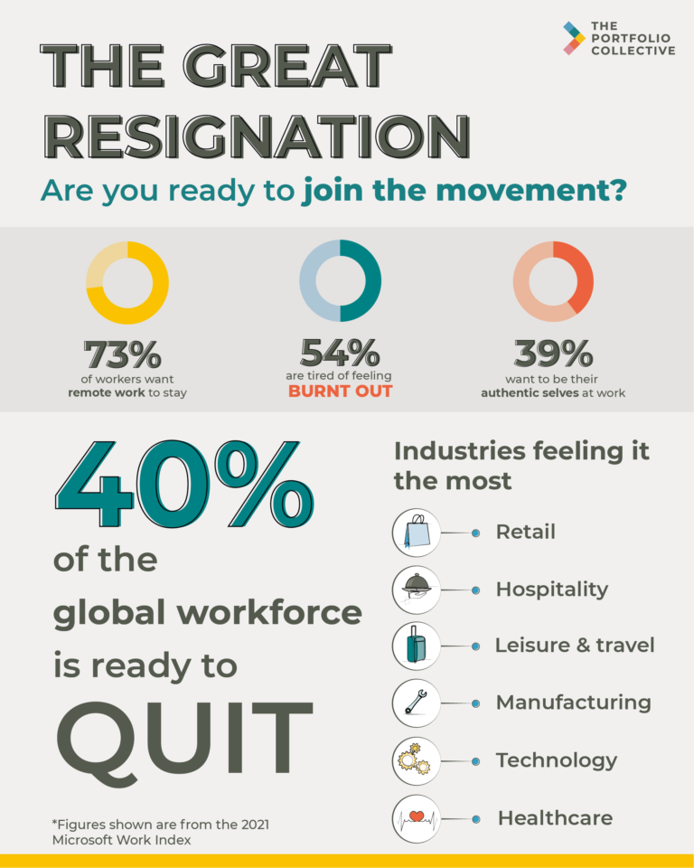
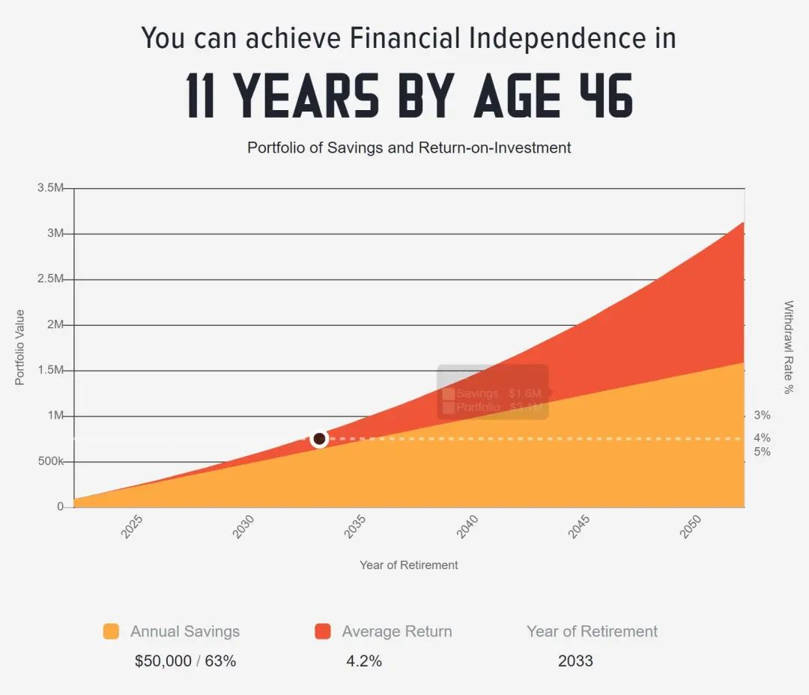

# 无标题

**链接地址:** http://mp.weixin.qq.com/s?__biz=MzI4NDYyNjAwNw==&mid=2247485702&idx=1&sn=d9749804bb67f76fa2ea2edd804f0907&chksm=ebf9d43edc8e5d283e31332567d271c3e75d3200caa9783c5b7b2ae9e84a83c309f18f15847e&mpshare=1&scene=2&srcid=03176ScM3h3wch7ikRcxbhfI&sharer_sharetime=1647468087122&sharer_shareid=be1c8edd6c93eec155a61c876e41d26a#rd
**作者:** 关注我们
**获取时间:** 2025/8/28 19:40:22
**图片数量:** 16

---

## 原始HTML内容

<section style="box-sizing: border-box;font-size: 16px;"><section style="box-sizing: border-box;" powered-by="xiumi.us"><section style="display: flex;flex-flow: row nowrap;text-align: left;justify-content: flex-start;margin-top: 10px;margin-bottom: 10px;box-sizing: border-box;"><section style="display: inline-block;vertical-align: middle;width: auto;min-width: 10%;max-width: 100%;height: auto;align-self: center;box-sizing: border-box;"><section style="text-align: center;justify-content: center;box-sizing: border-box;" powered-by="xiumi.us"><section style="display: inline-block;width: 15px;height: 15px;vertical-align: top;overflow: hidden;background-color: rgb(195, 218, 241);box-shadow: rgb(255, 226, 196) -8px 12px 0px;box-sizing: border-box;"><section><svg viewBox="0 0 1 1" style="float:left;line-height:0;width:0;vertical-align:top;"></svg></section></section></section></section><section style="display: inline-block;vertical-align: middle;width: auto;border-bottom: 1px solid rgb(195, 218, 241);border-bottom-right-radius: 0px;min-width: 10%;max-width: 100%;flex: 0 0 auto;height: auto;align-self: center;box-sizing: border-box;"><section style="margin-top: 10px;margin-bottom: 10px;text-align: center;justify-content: center;box-sizing: border-box;" powered-by="xiumi.us"><section style="text-align: justify;color: rgb(175, 207, 238);font-size: 17px;box-sizing: border-box;">
<strong style="box-sizing: border-box;">点击蓝字 关注我们</strong>
</section></section></section></section></section><section style="box-sizing: border-box;" powered-by="xiumi.us">
 
</section><section style="text-align: center;margin-top: 20px;justify-content: center;box-sizing: border-box;" powered-by="xiumi.us"><section style="max-width: 100%;vertical-align: middle;display: inline-block;line-height: 0;width: 100%;height: auto;border-style: solid;border-width: 0px;border-color: rgb(62, 62, 62);box-sizing: border-box;"></section></section><section style="margin-bottom: 10px;box-sizing: border-box;" powered-by="xiumi.us"><section style="display: inline-block;width: 100%;vertical-align: top;background-color: rgb(242, 249, 255);padding: 32px;box-sizing: border-box;"><section style="text-align: center;justify-content: center;box-sizing: border-box;" powered-by="xiumi.us"><section style="text-align: justify;font-size: 14px;color: rgb(95, 104, 117);line-height: 2;letter-spacing: 2px;box-sizing: border-box;">
近年来的疫情改变了大家的生活方式，也促使过往高速运转的打工人们闲下来开始<strong style="box-sizing: border-box;">思考工作的意义</strong>。

 

<strong style="box-sizing: border-box;">慷慨的失业补助和宽松的货币政策</strong>给打工人们以向老板大胆说“NO”的底气，一场名为<strong style="box-sizing: border-box;">“大辞职潮”（the Great Resignation）</strong>的活动席卷了北美。 

 
</section></section><section style="text-align: center;margin-top: 10px;margin-bottom: 10px;box-sizing: border-box;" powered-by="xiumi.us"><section style="max-width: 100%;vertical-align: middle;display: inline-block;line-height: 0;box-sizing: border-box;"></section></section><section style="text-align: center;justify-content: center;box-sizing: border-box;" powered-by="xiumi.us"><section style="text-align: justify;font-size: 14px;color: rgb(95, 104, 117);line-height: 2;letter-spacing: 2px;box-sizing: border-box;">
 

通过工作赚来的钱到底多少才够？只要我降低自己的花销，是否可以达到<strong style="box-sizing: border-box;">提前退休</strong>，享受人生的目的呢？于是，一种被称为<strong style="box-sizing: border-box;">“FIRE”</strong>的生活模式走入了大家的视野。

 

<strong style="box-sizing: border-box;">何为“FIRE”？不要误会，这可不是老板“炒鱿鱼”的意思。</strong>
</section></section></section></section><section style="box-sizing: border-box;" powered-by="xiumi.us">
 
</section><section style="box-sizing: border-box;" powered-by="xiumi.us"><section style="display: flex;flex-flow: row nowrap;text-align: right;justify-content: flex-end;margin-top: 10px;margin-bottom: 10px;box-sizing: border-box;"><section style="display: inline-block;vertical-align: bottom;width: auto;border-bottom: 1px solid rgb(175, 207, 238);border-bottom-right-radius: 0px;align-self: flex-end;flex: 0 0 auto;min-width: 10%;max-width: 100%;height: auto;box-sizing: border-box;"><section style="margin-bottom: 7px;box-sizing: border-box;" powered-by="xiumi.us"><section style="text-align: justify;color: rgb(175, 207, 238);box-sizing: border-box;">
<strong style="box-sizing: border-box;">\&nbsp; 什么是“FIRE”</strong>？
</section></section></section><section style="display: inline-block;vertical-align: bottom;width: auto;min-width: 10%;max-width: 100%;height: auto;align-self: flex-end;box-sizing: border-box;"><section style="justify-content: flex-end;box-sizing: border-box;" powered-by="xiumi.us"><section style="display: inline-block;width: 15px;height: 15px;vertical-align: top;overflow: hidden;background-color: rgb(195, 218, 241);box-sizing: border-box;"><section><svg viewBox="0 0 1 1" style="float:left;line-height:0;width:0;vertical-align:top;"></svg></section></section></section></section><section style="display: inline-block;vertical-align: bottom;width: auto;min-width: 10%;max-width: 100%;height: auto;align-self: flex-end;box-sizing: border-box;"><section style="text-align: center;justify-content: center;box-sizing: border-box;" powered-by="xiumi.us"><section style="display: inline-block;width: 15px;height: 15px;vertical-align: top;overflow: hidden;background-color: rgb(255, 226, 196);box-sizing: border-box;"><section><svg viewBox="0 0 1 1" style="float:left;line-height:0;width:0;vertical-align:top;"></svg></section></section></section></section><section style="display: inline-block;vertical-align: bottom;width: auto;min-width: 10%;max-width: 100%;height: auto;align-self: flex-end;box-sizing: border-box;"><section style="text-align: left;justify-content: flex-start;box-sizing: border-box;" powered-by="xiumi.us"><section style="display: inline-block;width: 15px;height: 15px;vertical-align: top;overflow: hidden;background-color: rgb(195, 218, 241);box-sizing: border-box;"><section><svg viewBox="0 0 1 1" style="float:left;line-height:0;width:0;vertical-align:top;"></svg></section></section></section></section></section></section><section style="text-align: center;justify-content: center;box-sizing: border-box;" powered-by="xiumi.us"><section style="display: inline-block;width: 76%;vertical-align: top;height: auto;box-sizing: border-box;"><section style="margin-top: 10px;margin-bottom: 10px;box-sizing: border-box;" powered-by="xiumi.us"><section style="max-width: 100%;vertical-align: middle;display: inline-block;line-height: 0;width: 100%;height: auto;border-style: solid;border-width: 30px;border-color: rgb(242, 249, 255);box-sizing: border-box;"></section></section><section style="text-align: justify;box-sizing: border-box;" powered-by="xiumi.us">
 
</section><section style="justify-content: center;box-sizing: border-box;" powered-by="xiumi.us"><section style="text-align: left;color: rgb(95, 104, 117);font-size: 12px;line-height: 2;letter-spacing: 2px;box-sizing: border-box;">
FIRE运动最早起源于美国，是英语<strong style="box-sizing: border-box;">“Financial Independence Retire Early”</strong>的首字母缩写，中文翻译为“<strong style="box-sizing: border-box;">财务独立，提早退休”</strong>。简单说，就是年轻的时候通过极简生活拼命攒钱，快速积累财富，当<strong style="box-sizing: border-box;">攒够一年生活费的25倍后</strong>，就可以每年靠4%的利息收入，躺平退休。
</section></section><section style="text-align: justify;box-sizing: border-box;" powered-by="xiumi.us">
 
</section><section style="transform: rotateZ(45deg);-webkit-transform: rotateZ(45deg);-moz-transform: rotateZ(45deg);-o-transform: rotateZ(45deg);box-sizing: border-box;" powered-by="xiumi.us"><section style="box-sizing: border-box;"><section style="display: inline-block;width: 18px;height: 18px;vertical-align: top;overflow: hidden;border-style: solid;border-width: 0px 3px 3px 0px;border-color: rgb(62, 62, 62) rgb(175, 207, 238) rgb(175, 207, 238) rgb(62, 62, 62);box-sizing: border-box;"><section><svg viewBox="0 0 1 1" style="float:left;line-height:0;width:0;vertical-align:top;"></svg></section></section></section></section><section style="text-align: justify;box-sizing: border-box;" powered-by="xiumi.us">
 
</section></section></section><section style="text-align: center;margin-top: 20px;justify-content: center;box-sizing: border-box;" powered-by="xiumi.us"><section style="max-width: 100%;vertical-align: middle;display: inline-block;line-height: 0;width: 100%;height: auto;border-style: solid;border-width: 0px;border-color: rgb(62, 62, 62);box-sizing: border-box;"></section></section><section style="margin-bottom: 10px;box-sizing: border-box;" powered-by="xiumi.us"><section style="display: inline-block;width: 100%;vertical-align: top;background-color: rgb(242, 249, 255);padding: 32px;box-sizing: border-box;"><section style="text-align: center;justify-content: center;box-sizing: border-box;" powered-by="xiumi.us"><section style="text-align: justify;font-size: 14px;color: rgb(95, 104, 117);line-height: 2;letter-spacing: 2px;box-sizing: border-box;">
疫情以来，BadaB Consulting Inc. 也接到了不少来自于大家的咨询：<strong style="box-sizing: border-box;">“我想FIRE，可行吗？”</strong>问出这样问题的朋友们大多是处于事业上升期，没有严重家庭负担的生存状态。那么，对于他们来说，FIRE的想法到底靠谱吗？

 
</section></section><section style="text-align: center;margin-top: 10px;margin-bottom: 10px;box-sizing: border-box;" powered-by="xiumi.us"><section style="max-width: 100%;vertical-align: middle;display: inline-block;line-height: 0;box-sizing: border-box;"></section></section><section style="text-align: center;justify-content: center;box-sizing: border-box;" powered-by="xiumi.us"><section style="text-align: justify;font-size: 14px;color: rgb(95, 104, 117);line-height: 2;letter-spacing: 2px;box-sizing: border-box;">
 

我们十分理解大家想要提前退休的想法。每个人的个人情况和职业规划不同，我们不能笼统地给出大家都适用的建议。但FIRE状态看上去虽然美好，操作起来却<strong style="box-sizing: border-box;">到处是坑</strong>！别怪BadaB给你们泼凉水，<strong style="box-sizing: border-box;">FIRE并不适合大多数人！</strong>
</section></section></section></section><section style="box-sizing: border-box;" powered-by="xiumi.us">
 
</section><section style="box-sizing: border-box;" powered-by="xiumi.us">
 
</section><section style="margin-top: 30px;margin-bottom: 10px;box-sizing: border-box;" powered-by="xiumi.us"><section style="display: inline-block;width: 100%;vertical-align: top;background-color: rgb(242, 249, 255);box-sizing: border-box;"><section style="margin-top: -20px;text-align: right;justify-content: flex-end;box-sizing: border-box;" powered-by="xiumi.us"><section style="display: inline-block;vertical-align: bottom;width: auto;min-width: 10%;max-width: 100%;height: auto;align-self: flex-end;border-bottom: 3px solid rgb(175, 207, 238);border-bottom-right-radius: 0px;padding-right: 13px;box-sizing: border-box;"><section style="text-align: justify;color: rgb(175, 207, 238);font-size: 30px;box-sizing: border-box;" powered-by="xiumi.us">
<strong style="box-sizing: border-box;">01</strong>
</section></section><section style="display: inline-block;vertical-align: bottom;width: auto;min-width: 10%;max-width: 100%;height: auto;align-self: flex-end;background-color: rgb(175, 207, 238);padding: 5px 12px;box-sizing: border-box;"><section style="color: rgb(255, 255, 255);font-size: 17px;box-sizing: border-box;" powered-by="xiumi.us">
<strong style="box-sizing: border-box;">考验周密的职业规划</strong>
</section></section></section></section></section><section style="margin-top: 10px;margin-bottom: 10px;box-sizing: border-box;" powered-by="xiumi.us"><section style="display: inline-block;width: 100%;vertical-align: top;background-color: rgb(242, 249, 255);padding: 20px;box-sizing: border-box;"><section style="text-align: left;margin-top: 15px;justify-content: flex-start;box-sizing: border-box;" powered-by="xiumi.us"><section style="max-width: 100%;vertical-align: middle;display: inline-block;line-height: 0;width: 90%;height: auto;border-style: solid;border-width: 21px;border-color: rgb(255, 255, 255);box-sizing: border-box;"></section></section><section style="box-sizing: border-box;" powered-by="xiumi.us">
 
</section><section style="text-align: center;justify-content: center;box-sizing: border-box;" powered-by="xiumi.us"><section style="text-align: justify;font-size: 14px;color: rgb(95, 104, 117);line-height: 2;letter-spacing: 2px;padding-right: 10px;padding-left: 10px;box-sizing: border-box;">
想要达到FIRE的生活状态，最关键的就是要尽早累积到大量财富。如果你是通过工资赚取绝大部分生活开销，那么一份<strong style="box-sizing: border-box;">严谨可执行的职业规划</strong>则对你能达到FIRE的目标的最关键选项目。

 

受限于经验、人脉和技能的累积，大部分的人职业成长曲线决定了<strong style="box-sizing: border-box;">事业的中前期并不会带给他们带来最丰厚的回报</strong>，而过早退休在<strong style="box-sizing: border-box;">经济上来说是非常“吃亏”选择</strong>。

 

另一些朋友可能会乐观地想：“我现在职业上升劲头很足，工资水平两年就翻一番，按照这个发展势头下去，离提前退休也不远了。”但一个熟悉的词汇<strong style="box-sizing: border-box;">“职场天花板”</strong>相信你一定听说过。

 

一个人的职业规划做得再好，也难免受到<strong style="box-sizing: border-box;">时代发展，经济周期和突发“黑天鹅”事件</strong>的影响。而这些事件的发生对于个人的学识和眼界终究是难以预料的。如果把“提前退休”作为职业规划的终极目标，那迎接你的可能是<strong style="box-sizing: border-box;">一次又一次的失望</strong>。
</section></section><section style="box-sizing: border-box;" powered-by="xiumi.us">
 
</section></section></section><section style="box-sizing: border-box;" powered-by="xiumi.us">
 
</section><section style="margin-top: 30px;margin-bottom: 10px;box-sizing: border-box;" powered-by="xiumi.us"><section style="display: inline-block;width: 100%;vertical-align: top;background-color: rgb(242, 249, 255);box-sizing: border-box;"><section style="margin-top: -20px;text-align: right;justify-content: flex-end;box-sizing: border-box;" powered-by="xiumi.us"><section style="display: inline-block;vertical-align: bottom;width: auto;min-width: 10%;max-width: 100%;height: auto;align-self: flex-end;border-bottom: 3px solid rgb(175, 207, 238);border-bottom-right-radius: 0px;padding-right: 13px;box-sizing: border-box;"><section style="text-align: justify;color: rgb(175, 207, 238);font-size: 30px;box-sizing: border-box;" powered-by="xiumi.us">
<strong style="box-sizing: border-box;">02</strong>
</section></section><section style="display: inline-block;vertical-align: bottom;width: auto;min-width: 10%;max-width: 100%;height: auto;align-self: flex-end;background-color: rgb(175, 207, 238);padding: 5px 12px;box-sizing: border-box;"><section style="color: rgb(255, 255, 255);font-size: 17px;box-sizing: border-box;" powered-by="xiumi.us">
<strong style="box-sizing: border-box;">极强的理财能力</strong>
</section></section></section></section></section><section style="margin-top: 10px;margin-bottom: 10px;box-sizing: border-box;" powered-by="xiumi.us"><section style="display: inline-block;width: 100%;vertical-align: top;background-color: rgb(242, 249, 255);padding: 20px;box-sizing: border-box;"><section style="text-align: left;margin-top: 15px;justify-content: flex-start;box-sizing: border-box;" powered-by="xiumi.us"><section style="max-width: 100%;vertical-align: middle;display: inline-block;line-height: 0;width: 90%;height: auto;border-style: solid;border-width: 21px;border-color: rgb(255, 255, 255);box-sizing: border-box;"></section></section><section style="box-sizing: border-box;" powered-by="xiumi.us">
 
</section><section style="text-align: center;justify-content: center;box-sizing: border-box;" powered-by="xiumi.us"><section style="text-align: justify;font-size: 14px;color: rgb(95, 104, 117);line-height: 2;letter-spacing: 2px;padding-right: 10px;padding-left: 10px;box-sizing: border-box;">
疫情初期，宽松的货币政策为大家带来丰厚的理财收益，也给“躺平一族”们塑造了<strong style="box-sizing: border-box;">“买啥都赚”的错觉</strong>。

 

然而近期在战争局势、加息预期和高通胀的多重夹击下，许多人已经被<strong style="box-sizing: border-box;">“不亏就好”</strong>的残酷现实狠狠地上了一课。

 
</section></section><section style="text-align: center;margin-top: 10px;margin-bottom: 10px;box-sizing: border-box;" powered-by="xiumi.us"><section style="max-width: 100%;vertical-align: middle;display: inline-block;line-height: 0;box-sizing: border-box;"></section></section><section style="text-align: center;justify-content: center;box-sizing: border-box;" powered-by="xiumi.us"><section style="text-align: justify;font-size: 14px;color: rgb(95, 104, 117);line-height: 2;letter-spacing: 2px;padding-right: 10px;padding-left: 10px;box-sizing: border-box;">
 

在经济发展强劲且通胀控制平缓的日子里，FIRE计划中<strong style="box-sizing: border-box;">“用每年4%收益生活”</strong>的想法或许得以实施，然而一旦突发状况和重大变故来临，你的<strong style="box-sizing: border-box;">FIRE计划抗风险能力</strong>就会受到严峻考验。

 

加拿大今年1月和美国今年2月的通胀率分别达到了5.1%和7.9%，且在材料和能源价格飙涨和战争局势的影响下，这样<strong style="box-sizing: border-box;">高的通胀率预期会持续较长时间难以回落</strong>。这让理财收益率大幅下降的“FIRE一族”压力倍增。

 

如果通过投资收益回报已不足以涵盖日常生活的花销，需要动用本金填补花销空缺的FIRE一族就不得不面临在<strong style="box-sizing: border-box;">“高龄”重回职场的问题</strong>，这样糟糕的情况一定不是大家想要经历的。
</section></section><section style="box-sizing: border-box;" powered-by="xiumi.us">
 
</section></section></section><section style="box-sizing: border-box;" powered-by="xiumi.us">
 
</section><section style="margin-top: 30px;margin-bottom: 10px;box-sizing: border-box;" powered-by="xiumi.us"><section style="display: inline-block;width: 100%;vertical-align: top;background-color: rgb(242, 249, 255);box-sizing: border-box;"><section style="margin-top: -20px;text-align: right;justify-content: flex-end;box-sizing: border-box;" powered-by="xiumi.us"><section style="display: inline-block;vertical-align: bottom;width: auto;min-width: 10%;max-width: 100%;height: auto;align-self: flex-end;border-bottom: 3px solid rgb(175, 207, 238);border-bottom-right-radius: 0px;padding-right: 13px;box-sizing: border-box;"><section style="text-align: justify;color: rgb(175, 207, 238);font-size: 30px;box-sizing: border-box;" powered-by="xiumi.us">
<strong style="box-sizing: border-box;">03</strong>
</section></section><section style="display: inline-block;vertical-align: bottom;width: auto;min-width: 10%;max-width: 100%;height: auto;align-self: flex-end;background-color: rgb(175, 207, 238);padding: 5px 12px;box-sizing: border-box;"><section style="color: rgb(255, 255, 255);font-size: 17px;box-sizing: border-box;" powered-by="xiumi.us">
<strong style="box-sizing: border-box;">控制消费，你能做到吗？</strong>
</section></section></section></section></section><section style="margin-top: 10px;margin-bottom: 10px;box-sizing: border-box;" powered-by="xiumi.us"><section style="display: inline-block;width: 100%;vertical-align: top;background-color: rgb(242, 249, 255);padding: 20px;box-sizing: border-box;"><section style="text-align: left;margin-top: 15px;justify-content: flex-start;box-sizing: border-box;" powered-by="xiumi.us"><section style="max-width: 100%;vertical-align: middle;display: inline-block;line-height: 0;width: 90%;height: auto;border-style: solid;border-width: 21px;border-color: rgb(255, 255, 255);box-sizing: border-box;"></section></section><section style="box-sizing: border-box;" powered-by="xiumi.us">
 
</section><section style="text-align: center;justify-content: center;box-sizing: border-box;" powered-by="xiumi.us"><section style="text-align: justify;font-size: 14px;color: rgb(95, 104, 117);line-height: 2;letter-spacing: 2px;padding-right: 10px;padding-left: 10px;box-sizing: border-box;">
疫情期间的居家隔离政策，为我们<strong style="box-sizing: border-box;">摒弃掉了许多日常消费习惯</strong>。不需要出门于是减少了服饰的购买，不能够见朋友于是削减的社交娱乐花费，不能出国于是把每年奖励自己的那一趟旅游基金也存储了起来。一些朋友们发现：哈，原来我一个月花这么少的钱也可以活得不错嘛！

 

于是他们用疫情期间的花销开始计算起自己的FIRE计划，惊喜地发觉自己只要<strong style="box-sizing: border-box;">不出门，不社交，不旅游</strong>，35岁前就可以完成提前退休的梦想。但事实是这样的吗？

 

疫情终究会过去，正常娱乐社交的生活模式也会回来。当年轻的你迈入<strong style="box-sizing: border-box;">下一阶段的人生</strong>，需要满足新的爱好和追求，为车贷房贷烦恼，为将来子女的教育储蓄，为突如其来的生理疾病和突发状况埋单，你还能够如此自信潇洒地提前退休吗？

 

因此，FIRE的倡导者和实践者也往往是<strong style="box-sizing: border-box;">家庭生活压力较小的年轻一族</strong>，还没有被生活狠狠按在地上捶打过的他们用自己过往在家庭，社会和学校包容下的生活阅历去错误<strong style="box-sizing: border-box;">低估</strong>了未来生活中会遇到的挫折挑战。

 

极简的生活态度可能会随着年龄和阅历的增长而改变。像<strong style="box-sizing: border-box;">“苦行僧”般</strong>快速攒钱退休往往意味着今后的人生也要延续这样朴素的生活方式，还没有真正见识过这个大千世界的大家真的能坚持住吗？
</section></section><section style="box-sizing: border-box;" powered-by="xiumi.us">
 
</section></section></section><section style="box-sizing: border-box;" powered-by="xiumi.us">
 
</section><section style="margin-top: 30px;margin-bottom: 10px;box-sizing: border-box;" powered-by="xiumi.us"><section style="display: inline-block;width: 100%;vertical-align: top;background-color: rgb(242, 249, 255);box-sizing: border-box;"><section style="margin-top: -20px;text-align: right;justify-content: flex-end;box-sizing: border-box;" powered-by="xiumi.us"><section style="display: inline-block;vertical-align: bottom;width: auto;min-width: 10%;max-width: 100%;height: auto;align-self: flex-end;border-bottom: 3px solid rgb(175, 207, 238);border-bottom-right-radius: 0px;padding-right: 13px;box-sizing: border-box;"><section style="text-align: justify;color: rgb(175, 207, 238);font-size: 30px;box-sizing: border-box;" powered-by="xiumi.us">
<strong style="box-sizing: border-box;">04</strong>
</section></section><section style="display: inline-block;vertical-align: bottom;width: auto;min-width: 10%;max-width: 100%;height: auto;align-self: flex-end;background-color: rgb(175, 207, 238);padding: 5px 12px;box-sizing: border-box;"><section style="color: rgb(255, 255, 255);font-size: 17px;box-sizing: border-box;" powered-by="xiumi.us">
<strong style="box-sizing: border-box;">“后悔药”可不是那么好吃的</strong>
</section></section></section></section></section><section style="margin-top: 10px;margin-bottom: 10px;box-sizing: border-box;" powered-by="xiumi.us"><section style="display: inline-block;width: 100%;vertical-align: top;background-color: rgb(242, 249, 255);padding: 20px;box-sizing: border-box;"><section style="text-align: left;margin-top: 15px;justify-content: flex-start;box-sizing: border-box;" powered-by="xiumi.us"><section style="max-width: 100%;vertical-align: middle;display: inline-block;line-height: 0;width: 90%;height: auto;border-style: solid;border-width: 21px;border-color: rgb(255, 255, 255);box-sizing: border-box;"></section></section><section style="box-sizing: border-box;" powered-by="xiumi.us">
 
</section><section style="text-align: center;justify-content: center;box-sizing: border-box;" powered-by="xiumi.us"><section style="text-align: justify;font-size: 14px;color: rgb(95, 104, 117);line-height: 2;letter-spacing: 2px;padding-right: 10px;padding-left: 10px;box-sizing: border-box;">
任何的计划都面临执行上失败的风险，FIRE当然也包括在其中。那么，一旦财政吃紧让你你无法坚持实施FIRE计划，拯救你与水火之中的<strong style="box-sizing: border-box;">“Plan B”</strong>又是什么呢？

 

每当我们问出这个问题，听到最多的答案永远是：“大不了重回职场！”可是，<strong style="box-sizing: border-box;">职场可真不是那么好回的</strong>。

 

在别人努力积累经验和人脉的时候，你轻松地在家中“躺平”。这些年的<strong style="box-sizing: border-box;">“职业真空期”</strong>让你跟不上产业发展日新月异的脚步，远远地被竞争激烈的职场所狠狠抛弃。

 

没钱不可怕，可怕的是赚不到钱。<strong style="box-sizing: border-box;">保持自己赚钱的能力很重要</strong>，尤其是在当下物价飙升，疫情反复的时期。“提早躺平享受人生”的想法固然美好，但控制好自己抵御风险的能力更是生活的基本。
</section></section><section style="box-sizing: border-box;" powered-by="xiumi.us">
 
</section></section></section><section style="box-sizing: border-box;" powered-by="xiumi.us">
 
</section><section style="box-sizing: border-box;" powered-by="xiumi.us">
 
</section><section style="box-sizing: border-box;" powered-by="xiumi.us"><section style="display: flex;flex-flow: row nowrap;text-align: right;justify-content: flex-end;margin-top: 10px;margin-bottom: 10px;box-sizing: border-box;"><section style="display: inline-block;vertical-align: bottom;width: auto;border-bottom: 1px solid rgb(175, 207, 238);border-bottom-right-radius: 0px;align-self: flex-end;flex: 0 0 auto;min-width: 10%;max-width: 100%;height: auto;box-sizing: border-box;"><section style="margin-bottom: 7px;box-sizing: border-box;" powered-by="xiumi.us"><section style="text-align: justify;color: rgb(175, 207, 238);box-sizing: border-box;">
<strong style="box-sizing: border-box;">\ 提前退休，也不是不行！</strong>
</section></section></section><section style="display: inline-block;vertical-align: bottom;width: auto;min-width: 10%;max-width: 100%;height: auto;align-self: flex-end;box-sizing: border-box;"><section style="justify-content: flex-end;box-sizing: border-box;" powered-by="xiumi.us"><section style="display: inline-block;width: 15px;height: 15px;vertical-align: top;overflow: hidden;background-color: rgb(195, 218, 241);box-sizing: border-box;"><section><svg viewBox="0 0 1 1" style="float:left;line-height:0;width:0;vertical-align:top;"></svg></section></section></section></section><section style="display: inline-block;vertical-align: bottom;width: auto;min-width: 10%;max-width: 100%;height: auto;align-self: flex-end;box-sizing: border-box;"><section style="text-align: center;justify-content: center;box-sizing: border-box;" powered-by="xiumi.us"><section style="display: inline-block;width: 15px;height: 15px;vertical-align: top;overflow: hidden;background-color: rgb(255, 226, 196);box-sizing: border-box;"><section><svg viewBox="0 0 1 1" style="float:left;line-height:0;width:0;vertical-align:top;"></svg></section></section></section></section><section style="display: inline-block;vertical-align: bottom;width: auto;min-width: 10%;max-width: 100%;height: auto;align-self: flex-end;box-sizing: border-box;"><section style="text-align: left;justify-content: flex-start;box-sizing: border-box;" powered-by="xiumi.us"><section style="display: inline-block;width: 15px;height: 15px;vertical-align: top;overflow: hidden;background-color: rgb(195, 218, 241);box-sizing: border-box;"><section><svg viewBox="0 0 1 1" style="float:left;line-height:0;width:0;vertical-align:top;"></svg></section></section></section></section></section></section><section style="text-align: center;justify-content: center;box-sizing: border-box;" powered-by="xiumi.us"><section style="display: inline-block;width: 76%;vertical-align: top;height: auto;box-sizing: border-box;"><section style="margin-top: 10px;margin-bottom: 10px;box-sizing: border-box;" powered-by="xiumi.us"><section style="max-width: 100%;vertical-align: middle;display: inline-block;line-height: 0;width: 100%;height: auto;border-style: solid;border-width: 30px;border-color: rgb(242, 249, 255);box-sizing: border-box;"></section></section><section style="text-align: justify;box-sizing: border-box;" powered-by="xiumi.us">
 
</section><section style="justify-content: center;box-sizing: border-box;" powered-by="xiumi.us"><section style="text-align: left;color: rgb(95, 104, 117);font-size: 14px;line-height: 2;letter-spacing: 2px;box-sizing: border-box;">
那么，FIRE计划就完全不可行吗？<strong style="box-sizing: border-box;">不尽然</strong>。其实对于<strong style="box-sizing: border-box;">部分事业黄金发展期在青年时期，或者可以通过稳定被动收入满足生活需求的人群</strong>来说是可以考虑FIRE计划的。

 

如果你需要专业职业规划师的中肯建议，欢迎联系我们安排最适合你的<strong style="box-sizing: border-box;">一对一的职业规划咨询</strong>。如果你对职业规划的话题感兴趣，也请在<strong style="box-sizing: border-box;">留言栏</strong>中向我们提供你想了解的信息，我们会在今后的栏目中给出大家更多的建议。

 

工作不是生活的全部，能够过上<strong style="box-sizing: border-box;">事业成功又能享受生活</strong>的人生才是大部分人所追求的终极目标。BadaB在这里祝愿各位读者朋友们能早日实现理想中工作生活状态，享受一个精彩又富足的幸福人生！
</section></section><section style="text-align: justify;box-sizing: border-box;" powered-by="xiumi.us">
 
</section><section style="transform: rotateZ(45deg);-webkit-transform: rotateZ(45deg);-moz-transform: rotateZ(45deg);-o-transform: rotateZ(45deg);box-sizing: border-box;" powered-by="xiumi.us"><section style="box-sizing: border-box;"><section style="display: inline-block;width: 18px;height: 18px;vertical-align: top;overflow: hidden;border-style: solid;border-width: 0px 3px 3px 0px;border-color: rgb(62, 62, 62) rgb(175, 207, 238) rgb(175, 207, 238) rgb(62, 62, 62);box-sizing: border-box;"><section><svg viewBox="0 0 1 1" style="float:left;line-height:0;width:0;vertical-align:top;"></svg></section></section></section></section><section style="text-align: justify;box-sizing: border-box;" powered-by="xiumi.us">
 
</section></section></section><section style="box-sizing: border-box;" powered-by="xiumi.us">
 
</section><section style="margin: 10px 0%;box-sizing: border-box;" powered-by="xiumi.us"><section style="display: inline-block;width: 100%;vertical-align: top;background-color: rgba(255, 174, 174, 0.13);padding-right: 10px;padding-left: 10px;box-sizing: border-box;"><section style="box-sizing: border-box;" powered-by="xiumi.us"><section style="display: flex;flex-flow: row nowrap;margin: -5px 0%;text-align: center;justify-content: center;box-sizing: border-box;"><section style="display: inline-block;width: auto;vertical-align: middle;min-width: 10%;max-width: 100%;flex: 0 0 auto;height: auto;border-style: solid;border-width: 1px;border-color: rgb(237, 128, 15);padding: 4px;background-color: rgb(255, 255, 255);box-shadow: rgb(255, 255, 255) 0px 0px 0px inset;align-self: center;box-sizing: border-box;"><section style="display: inline-block;width: 100%;vertical-align: top;border-width: 0px;background-color: rgba(255, 174, 174, 0.13);padding-right: 10px;padding-left: 10px;box-sizing: border-box;" powered-by="xiumi.us"><section style="color: rgb(106, 106, 106);letter-spacing: 1px;box-sizing: border-box;" powered-by="xiumi.us">
<strong style="box-sizing: border-box;">关于我们</strong>
</section></section></section></section></section></section></section><section style="box-sizing: border-box;" powered-by="xiumi.us">
 
</section><section style="text-align: center;margin: 10px 0%;box-sizing: border-box;" powered-by="xiumi.us"><section style="display: inline-block;width: 90%;vertical-align: top;border-style: solid;border-width: 2px;border-color: rgb(237, 128, 15);letter-spacing: 0px;padding: 10px;box-sizing: border-box;"><section style="box-sizing: border-box;" powered-by="xiumi.us"><section style="display: inline-block;vertical-align: middle;width: 40%;box-sizing: border-box;"><section style="margin-right: 0%;margin-left: 0%;box-sizing: border-box;" powered-by="xiumi.us"><section style="max-width: 100%;vertical-align: middle;display: inline-block;line-height: 0;border-width: 0px;width: 100%;box-sizing: border-box;"></section></section></section><section style="display: inline-block;vertical-align: middle;width: 60%;padding-left: 10px;box-sizing: border-box;"><section style="margin-right: 0%;margin-bottom: 5px;margin-left: 0%;box-sizing: border-box;" powered-by="xiumi.us"><section style="display: inline-block;border-width: 2px;border-style: solid;border-color: rgb(237, 128, 15);padding: 0.1em 0.3em;background-color: rgb(237, 128, 15);color: rgb(255, 255, 255);font-size: 12px;box-sizing: border-box;">
<strong style="box-sizing: border-box;">Ada&nbsp; Tai</strong>
</section></section><section style="margin-right: 0%;margin-left: 0%;box-sizing: border-box;" powered-by="xiumi.us"><section style="font-size: 13px;box-sizing: border-box;">
<strong style="box-sizing: border-box;">MBA, CPHR, SHRM-SCP</strong>
</section></section><section style="box-sizing: border-box;" powered-by="xiumi.us"><section style="display: inline-block;vertical-align: middle;width: 10%;border-width: 0px;box-sizing: border-box;"><section style="margin: 5px 0%;text-align: left;font-size: 0px;box-sizing: border-box;" powered-by="xiumi.us"><section style="padding: 4px;display: inline-block;background-color: rgb(237, 128, 15);box-sizing: border-box;"><section style="border-color: rgba(255, 255, 255, 0);width: 1.6em;height: 1.6em;border-style: solid;border-width: 1px;text-align: center;line-height: 1.5em;color: rgb(255, 255, 255);box-sizing: border-box;">
 
</section></section></section></section><section style="display: inline-block;vertical-align: middle;width: 90%;box-sizing: border-box;"><section style="font-size: 12px;text-align: justify;box-sizing: border-box;" powered-by="xiumi.us">
修改简历与求职信
</section></section></section><section style="box-sizing: border-box;" powered-by="xiumi.us"><section style="display: inline-block;vertical-align: middle;width: 10%;box-sizing: border-box;"><section style="margin: 5px 0%;text-align: left;font-size: 0px;box-sizing: border-box;" powered-by="xiumi.us"><section style="padding: 4px;display: inline-block;background-color: rgb(237, 128, 15);box-sizing: border-box;"><section style="border-color: rgba(255, 255, 255, 0);width: 1.6em;height: 1.6em;border-style: solid;border-width: 1px;text-align: center;line-height: 1.5em;color: rgb(255, 255, 255);box-sizing: border-box;">
 
</section></section></section></section><section style="display: inline-block;vertical-align: middle;width: 90%;box-sizing: border-box;"><section style="font-size: 12px;text-align: justify;box-sizing: border-box;" powered-by="xiumi.us">
培训面试
</section></section></section><section style="box-sizing: border-box;" powered-by="xiumi.us"><section style="display: inline-block;vertical-align: middle;width: 10%;border-width: 0px;box-sizing: border-box;"><section style="margin: 5px 0%;text-align: left;font-size: 0px;box-sizing: border-box;" powered-by="xiumi.us"><section style="padding: 4px;display: inline-block;background-color: rgb(237, 128, 15);box-sizing: border-box;"><section style="border-color: rgba(255, 255, 255, 0);width: 1.6em;height: 1.6em;border-style: solid;border-width: 1px;text-align: center;line-height: 1.5em;color: rgb(255, 255, 255);box-sizing: border-box;">
 
</section></section></section></section><section style="display: inline-block;vertical-align: middle;width: 90%;box-sizing: border-box;"><section style="font-size: 12px;text-align: justify;box-sizing: border-box;" powered-by="xiumi.us">
建立LinkedIn Profile
</section></section></section><section style="box-sizing: border-box;" powered-by="xiumi.us"><section style="display: inline-block;vertical-align: middle;width: 10%;box-sizing: border-box;"><section style="margin: 5px 0%;text-align: left;font-size: 0px;box-sizing: border-box;" powered-by="xiumi.us"><section style="padding: 4px;display: inline-block;background-color: rgb(237, 128, 15);box-sizing: border-box;"><section style="border-color: rgba(255, 255, 255, 0);width: 1.6em;height: 1.6em;border-style: solid;border-width: 1px;text-align: center;line-height: 1.5em;color: rgb(255, 255, 255);box-sizing: border-box;">
 
</section></section></section></section><section style="display: inline-block;vertical-align: middle;width: 90%;box-sizing: border-box;"><section style="font-size: 12px;text-align: justify;box-sizing: border-box;" powered-by="xiumi.us">
职业评估与规划、社交培训
</section></section></section><section style="box-sizing: border-box;" powered-by="xiumi.us"><section style="display: inline-block;vertical-align: middle;width: 10%;box-sizing: border-box;"><section style="margin: 5px 0%;text-align: left;font-size: 0px;box-sizing: border-box;" powered-by="xiumi.us"><section style="padding: 4px;display: inline-block;background-color: rgb(237, 128, 15);box-sizing: border-box;"><section style="border-color: rgba(255, 255, 255, 0);width: 1.6em;height: 1.6em;border-style: solid;border-width: 1px;text-align: center;line-height: 1.5em;color: rgb(255, 255, 255);box-sizing: border-box;">
 
</section></section></section></section><section style="display: inline-block;vertical-align: middle;width: 90%;box-sizing: border-box;"><section style="font-size: 12px;text-align: justify;box-sizing: border-box;" powered-by="xiumi.us">
求职、职场文化等多种讲座
</section></section></section></section></section></section></section><section style="margin: 20px 0%;box-sizing: border-box;" powered-by="xiumi.us"><section style="letter-spacing: 2px;font-size: 14px;color: rgba(51, 51, 51, 0.61);padding-right: 20px;padding-left: 20px;line-height: 2;box-sizing: border-box;">
 

Ada Tai 毕业于埃尔伯塔大学工商管理硕士学位,并拥有加拿大和美国“注册人力资源管理师”资格证。十几年来 Ada 一直在不同的领域从事人力资源的管理工作。在最近的几年时间里，Ada与她的团队BadaB Consulting Inc. 已成功帮助超过500名不同年龄和职业背景的求职者找到心仪的工作，并帮助他们克服职场困难，向理想的职业成长方向稳步前进。
</section></section><section style="box-sizing: border-box;" powered-by="xiumi.us">
 
</section><section style="box-sizing: border-box;" powered-by="xiumi.us"><section style="display: flex;flex-flow: row nowrap;margin: 10px 0%;box-sizing: border-box;"><section style="display: inline-block;vertical-align: middle;width: auto;flex: 0 0 0%;align-self: center;height: auto;box-sizing: border-box;"><section style="text-align: center;box-sizing: border-box;" powered-by="xiumi.us"><section style="display: inline-block;width: 90px;height: 150px;vertical-align: top;overflow: hidden;border-style: solid;border-width: 4px;border-color: rgb(255, 226, 196);box-sizing: border-box;"><section><svg viewBox="0 0 1 1" style="float:left;line-height:0;width:0;vertical-align:top;"></svg></section></section></section></section><section style="display: inline-block;vertical-align: middle;width: auto;flex: 89.2857 89.2857 0%;align-self: center;height: auto;background-color: rgb(255, 255, 255);margin-left: -65px;box-sizing: border-box;"><section style="box-sizing: border-box;" powered-by="xiumi.us"><section style="display: flex;flex-flow: row nowrap;box-sizing: border-box;"><section style="display: inline-block;vertical-align: middle;width: auto;padding-right: 5px;flex: 0 0 0%;height: auto;align-self: center;box-sizing: border-box;"><section style="box-sizing: border-box;" powered-by="xiumi.us"><section style="display: flex;flex-flow: row nowrap;box-sizing: border-box;"><section style="display: inline-block;width: 120px;vertical-align: top;flex: 0 0 auto;height: auto;align-self: flex-start;box-sizing: border-box;"><section style="text-align: center;margin-right: 0%;margin-left: 0%;box-sizing: border-box;" powered-by="xiumi.us"><section style="max-width: 100%;vertical-align: middle;display: inline-block;line-height: 0;width: 100%;border-color: rgba(118, 178, 124, 0);border-width: 5px;border-style: solid;box-shadow: rgb(0, 0, 0) 0px 0px 0px;box-sizing: border-box;"></section></section></section></section></section></section><section style="display: inline-block;vertical-align: middle;width: auto;padding-left: 5px;flex: 100 100 0%;height: auto;align-self: center;box-sizing: border-box;"><section style="margin-right: 0%;margin-left: 0%;box-sizing: border-box;" powered-by="xiumi.us"><section style="color: rgb(121, 121, 121);font-size: 12px;box-sizing: border-box;">
微信号 : badab101

新浪微博：BadaB_Consulting

LinkedIn：BadaB Consulting Inc.

Facebook：BadaB Consulting Inc.

YouTube:&nbsp;BadaB Consulting Inc.

Website：www.badab101.com
</section></section></section></section></section></section></section></section><section style="box-sizing: border-box;" powered-by="xiumi.us">
 
</section><section style="margin: 10px 0%;box-sizing: border-box;" powered-by="xiumi.us"><section style="display: inline-block;width: 100%;vertical-align: top;box-shadow: rgb(0, 0, 0) 0px 0px 0px;background-color: rgb(241, 241, 241);padding: 10px;box-sizing: border-box;"><section style="text-align: center;justify-content: center;box-sizing: border-box;" powered-by="xiumi.us"><section style="display: inline-block;width: 100%;vertical-align: top;background-color: rgb(255, 255, 255);padding: 20px 10px;height: auto;box-shadow: rgb(198, 198, 198) 0px 0px 2px;border-width: 0px;border-radius: 6px;border-style: none;border-color: rgb(62, 62, 62);overflow: hidden;box-sizing: border-box;"><section style="color: rgb(189, 189, 189);text-align: justify;box-sizing: border-box;" powered-by="xiumi.us"><strong style="box-sizing: border-box;">猜你想看</strong></section><section style="box-sizing: border-box;" powered-by="xiumi.us">
 
</section><section style="box-sizing: border-box;" powered-by="xiumi.us"><section style="display: flex;flex-flow: row nowrap;margin-right: 0%;margin-left: 0%;box-sizing: border-box;"><section style="display: inline-block;vertical-align: top;width: auto;flex: 100 100 0%;align-self: flex-start;height: auto;box-shadow: rgb(0, 0, 0) 0px 0px 0px;border-bottom: 1px dashed rgba(106, 106, 106, 0.25);border-bottom-right-radius: 0px;margin-right: 10px;box-sizing: border-box;"><section style="font-size: 14px;box-sizing: border-box;" powered-by="xiumi.us">
<a target="_blank" href="http://mp.weixin.qq.com/s?__biz=MzI4NDYyNjAwNw==&amp;mid=2247485470&amp;idx=1&amp;sn=fdcb5f8d25fe691e3e1e46f3b8cf43a1&amp;chksm=ebf9d526dc8e5c305bb1bc56f99cac7c60843655eefd443cfb78d0b5422f1d36de6ec19553fc&amp;scene=21#wechat_redirect" textvalue="转码热，读研潮？职业再规划切忌乱投医！不是泼冷水，“预防针”我们先给你备好。" linktype="text" imgurl="" imgdata="null" data-itemshowtype="0" tab="innerlink" data-linktype="2">转码热，读研潮？职业再规划切忌乱投医！不是泼冷水，“预防针”我们先给你备好。</a>
</section></section><section style="display: inline-block;vertical-align: top;width: auto;flex: 20 20 0%;align-self: flex-start;height: auto;border-width: 0px;margin-left: 5px;box-sizing: border-box;"><section style="margin-right: 0%;margin-left: 0%;box-sizing: border-box;" powered-by="xiumi.us"><section style="max-width: 100%;vertical-align: middle;display: inline-block;line-height: 0;box-shadow: rgb(0, 0, 0) 0px 0px 0px;box-sizing: border-box;"><a target="_blank" href="http://mp.weixin.qq.com/s?__biz=MzI4NDYyNjAwNw==&amp;mid=2247485470&amp;idx=1&amp;sn=fdcb5f8d25fe691e3e1e46f3b8cf43a1&amp;chksm=ebf9d526dc8e5c305bb1bc56f99cac7c60843655eefd443cfb78d0b5422f1d36de6ec19553fc&amp;scene=21#wechat_redirect" textvalue="你已选中了添加链接的内容" linktype="text" imgurl="" imgdata="null" data-itemshowtype="0" tab="innerlink" data-linktype="1"></a></section></section></section></section></section><section style="box-sizing: border-box;" powered-by="xiumi.us">
 
</section><section style="box-sizing: border-box;" powered-by="xiumi.us"><section style="display: flex;flex-flow: row nowrap;box-sizing: border-box;"><section style="display: inline-block;vertical-align: top;width: auto;flex: 100 100 0%;align-self: flex-start;height: auto;box-shadow: rgb(0, 0, 0) 0px 0px 0px;border-bottom: 1px dashed rgba(106, 106, 106, 0.25);border-bottom-right-radius: 0px;margin-right: 10px;box-sizing: border-box;"><section style="font-size: 14px;box-sizing: border-box;" powered-by="xiumi.us">
<a target="_blank" href="http://mp.weixin.qq.com/s?__biz=MzI4NDYyNjAwNw==&amp;mid=2247485408&amp;idx=1&amp;sn=b6ece5bb891744555f7c039c4db39c71&amp;chksm=ebf9dad8dc8e53ce42d982bb01157e05367be8a81910a0d34365abe31b1510d8c5e81f4594f8&amp;scene=21#wechat_redirect" textvalue="年终加薪好时节，别错过！再“抠门”的老板都无法拒绝的加薪绝招！" linktype="text" imgurl="" imgdata="null" data-itemshowtype="0" tab="innerlink" data-linktype="2">年终加薪好时节，别错过！再“抠门”的老板都无法拒绝的加薪绝招！</a>
</section></section><section style="display: inline-block;vertical-align: top;width: auto;flex: 20 20 0%;align-self: flex-start;height: auto;border-width: 0px;margin-left: 5px;box-sizing: border-box;"><section style="margin-right: 0%;margin-left: 0%;box-sizing: border-box;" powered-by="xiumi.us"><section style="max-width: 100%;vertical-align: middle;display: inline-block;line-height: 0;box-shadow: rgb(0, 0, 0) 0px 0px 0px;box-sizing: border-box;"><a target="_blank" href="http://mp.weixin.qq.com/s?__biz=MzI4NDYyNjAwNw==&amp;mid=2247485408&amp;idx=1&amp;sn=b6ece5bb891744555f7c039c4db39c71&amp;chksm=ebf9dad8dc8e53ce42d982bb01157e05367be8a81910a0d34365abe31b1510d8c5e81f4594f8&amp;scene=21#wechat_redirect" textvalue="你已选中了添加链接的内容" linktype="text" imgurl="" imgdata="null" data-itemshowtype="0" tab="innerlink" data-linktype="1"></a></section></section></section></section></section><section style="box-sizing: border-box;" powered-by="xiumi.us">
 
</section><section style="box-sizing: border-box;" powered-by="xiumi.us"><section style="display: flex;flex-flow: row nowrap;margin-right: 0%;margin-left: 0%;box-sizing: border-box;"><section style="display: inline-block;vertical-align: top;width: auto;flex: 100 100 0%;align-self: flex-start;height: auto;box-shadow: rgb(0, 0, 0) 0px 0px 0px;border-bottom: 1px dashed rgba(106, 106, 106, 0.25);border-bottom-right-radius: 0px;margin-right: 10px;box-sizing: border-box;"><section style="font-size: 14px;box-sizing: border-box;" powered-by="xiumi.us">
<a target="_blank" href="http://mp.weixin.qq.com/s?__biz=MzI4NDYyNjAwNw==&amp;mid=2247485334&amp;idx=1&amp;sn=7120eef98172f505e0c8db81c92a5173&amp;chksm=ebf9daaedc8e53b8db3dded078a2478763a8a8590a8ffc0b4bffb4ed2c9a81b493d1f8298cae&amp;scene=21#wechat_redirect" textvalue="加国疫后“辞职潮”来临！不是躺平，是跳槽！五大要点帮你平稳过度跳槽期！" linktype="text" imgurl="" imgdata="null" data-itemshowtype="0" tab="innerlink" data-linktype="2">加国疫后“辞职潮”来临！不是躺平，是跳槽！五大要点帮你平稳过度跳槽期！</a>
</section></section><section style="display: inline-block;vertical-align: top;width: auto;flex: 20 20 0%;align-self: flex-start;height: auto;border-width: 0px;margin-left: 5px;box-sizing: border-box;"><section style="margin-right: 0%;margin-left: 0%;box-sizing: border-box;" powered-by="xiumi.us"><section style="max-width: 100%;vertical-align: middle;display: inline-block;line-height: 0;box-sizing: border-box;"><a target="_blank" href="http://mp.weixin.qq.com/s?__biz=MzI4NDYyNjAwNw==&amp;mid=2247485334&amp;idx=1&amp;sn=7120eef98172f505e0c8db81c92a5173&amp;chksm=ebf9daaedc8e53b8db3dded078a2478763a8a8590a8ffc0b4bffb4ed2c9a81b493d1f8298cae&amp;scene=21#wechat_redirect" textvalue="你已选中了添加链接的内容" linktype="text" imgurl="" imgdata="null" data-itemshowtype="0" tab="innerlink" data-linktype="1"></a></section></section></section></section></section></section></section></section></section></section>
 

---

## 纯文本内容

点击蓝字 关注我们近年来的疫情改变了大家的生活方式，也促使过往高速运转的打工人们闲下来开始思考工作的意义。慷慨的失业补助和宽松的货币政策给打工人们以向老板大胆说“NO”的底气，一场名为“大辞职潮”（the Great Resignation）的活动席卷了北美。通过工作赚来的钱到底多少才够？只要我降低自己的花销，是否可以达到提前退休，享受人生的目的呢？于是，一种被称为“FIRE”的生活模式走入了大家的视野。何为“FIRE”？不要误会，这可不是老板“炒鱿鱼”的意思。\  什么是“FIRE”？FIRE运动最早起源于美国，是英语“Financial Independence Retire Early”的首字母缩写，中文翻译为“财务独立，提早退休”。简单说，就是年轻的时候通过极简生活拼命攒钱，快速积累财富，当攒够一年生活费的25倍后，就可以每年靠4%的利息收入，躺平退休。疫情以来，BadaB Consulting Inc. 也接到了不少来自于大家的咨询：“我想FIRE，可行吗？”问出这样问题的朋友们大多是处于事业上升期，没有严重家庭负担的生存状态。那么，对于他们来说，FIRE的想法到底靠谱吗？我们十分理解大家想要提前退休的想法。每个人的个人情况和职业规划不同，我们不能笼统地给出大家都适用的建议。但FIRE状态看上去虽然美好，操作起来却到处是坑！别怪BadaB给你们泼凉水，FIRE并不适合大多数人！01考验周密的职业规划想要达到FIRE的生活状态，最关键的就是要尽早累积到大量财富。如果你是通过工资赚取绝大部分生活开销，那么一份严谨可执行的职业规划则对你能达到FIRE的目标的最关键选项目。受限于经验、人脉和技能的累积，大部分的人职业成长曲线决定了事业的中前期并不会带给他们带来最丰厚的回报，而过早退休在经济上来说是非常“吃亏”选择。另一些朋友可能会乐观地想：“我现在职业上升劲头很足，工资水平两年就翻一番，按照这个发展势头下去，离提前退休也不远了。”但一个熟悉的词汇“职场天花板”相信你一定听说过。一个人的职业规划做得再好，也难免受到时代发展，经济周期和突发“黑天鹅”事件的影响。而这些事件的发生对于个人的学识和眼界终究是难以预料的。如果把“提前退休”作为职业规划的终极目标，那迎接你的可能是一次又一次的失望。02极强的理财能力疫情初期，宽松的货币政策为大家带来丰厚的理财收益，也给“躺平一族”们塑造了“买啥都赚”的错觉。然而近期在战争局势、加息预期和高通胀的多重夹击下，许多人已经被“不亏就好”的残酷现实狠狠地上了一课。在经济发展强劲且通胀控制平缓的日子里，FIRE计划中“用每年4%收益生活”的想法或许得以实施，然而一旦突发状况和重大变故来临，你的FIRE计划抗风险能力就会受到严峻考验。加拿大今年1月和美国今年2月的通胀率分别达到了5.1%和7.9%，且在材料和能源价格飙涨和战争局势的影响下，这样高的通胀率预期会持续较长时间难以回落。这让理财收益率大幅下降的“FIRE一族”压力倍增。如果通过投资收益回报已不足以涵盖日常生活的花销，需要动用本金填补花销空缺的FIRE一族就不得不面临在“高龄”重回职场的问题，这样糟糕的情况一定不是大家想要经历的。03控制消费，你能做到吗？疫情期间的居家隔离政策，为我们摒弃掉了许多日常消费习惯。不需要出门于是减少了服饰的购买，不能够见朋友于是削减的社交娱乐花费，不能出国于是把每年奖励自己的那一趟旅游基金也存储了起来。一些朋友们发现：哈，原来我一个月花这么少的钱也可以活得不错嘛！于是他们用疫情期间的花销开始计算起自己的FIRE计划，惊喜地发觉自己只要不出门，不社交，不旅游，35岁前就可以完成提前退休的梦想。但事实是这样的吗？疫情终究会过去，正常娱乐社交的生活模式也会回来。当年轻的你迈入下一阶段的人生，需要满足新的爱好和追求，为车贷房贷烦恼，为将来子女的教育储蓄，为突如其来的生理疾病和突发状况埋单，你还能够如此自信潇洒地提前退休吗？因此，FIRE的倡导者和实践者也往往是家庭生活压力较小的年轻一族，还没有被生活狠狠按在地上捶打过的他们用自己过往在家庭，社会和学校包容下的生活阅历去错误低估了未来生活中会遇到的挫折挑战。极简的生活态度可能会随着年龄和阅历的增长而改变。像“苦行僧”般快速攒钱退休往往意味着今后的人生也要延续这样朴素的生活方式，还没有真正见识过这个大千世界的大家真的能坚持住吗？04“后悔药”可不是那么好吃的任何的计划都面临执行上失败的风险，FIRE当然也包括在其中。那么，一旦财政吃紧让你你无法坚持实施FIRE计划，拯救你与水火之中的“Plan B”又是什么呢？每当我们问出这个问题，听到最多的答案永远是：“大不了重回职场！”可是，职场可真不是那么好回的。在别人努力积累经验和人脉的时候，你轻松地在家中“躺平”。这些年的“职业真空期”让你跟不上产业发展日新月异的脚步，远远地被竞争激烈的职场所狠狠抛弃。没钱不可怕，可怕的是赚不到钱。保持自己赚钱的能力很重要，尤其是在当下物价飙升，疫情反复的时期。“提早躺平享受人生”的想法固然美好，但控制好自己抵御风险的能力更是生活的基本。\ 提前退休，也不是不行！那么，FIRE计划就完全不可行吗？不尽然。其实对于部分事业黄金发展期在青年时期，或者可以通过稳定被动收入满足生活需求的人群来说是可以考虑FIRE计划的。如果你需要专业职业规划师的中肯建议，欢迎联系我们安排最适合你的一对一的职业规划咨询。如果你对职业规划的话题感兴趣，也请在留言栏中向我们提供你想了解的信息，我们会在今后的栏目中给出大家更多的建议。工作不是生活的全部，能够过上事业成功又能享受生活的人生才是大部分人所追求的终极目标。BadaB在这里祝愿各位读者朋友们能早日实现理想中工作生活状态，享受一个精彩又富足的幸福人生！关于我们Ada  TaiMBA, CPHR, SHRM-SCP修改简历与求职信培训面试建立LinkedIn Profile职业评估与规划、社交培训求职、职场文化等多种讲座Ada Tai 毕业于埃尔伯塔大学工商管理硕士学位,并拥有加拿大和美国“注册人力资源管理师”资格证。十几年来 Ada 一直在不同的领域从事人力资源的管理工作。在最近的几年时间里，Ada与她的团队BadaB Consulting Inc. 已成功帮助超过500名不同年龄和职业背景的求职者找到心仪的工作，并帮助他们克服职场困难，向理想的职业成长方向稳步前进。微信号 : badab101新浪微博：BadaB_ConsultingLinkedIn：BadaB Consulting Inc.Facebook：BadaB Consulting Inc.YouTube: BadaB Consulting Inc.Website：www.badab101.com猜你想看转码热，读研潮？职业再规划切忌乱投医！不是泼冷水，“预防针”我们先给你备好。年终加薪好时节，别错过！再“抠门”的老板都无法拒绝的加薪绝招！加国疫后“辞职潮”来临！不是躺平，是跳槽！五大要点帮你平稳过度跳槽期！

---

## 图片列表

-  (原始链接: https://mmbiz.qpic.cn/mmbiz_jpg/cY0qSDjdkFevicNfWlKh5CXIDZicLN6LeGbX5MBTEeve118eicqlZ51pfyib0qc02z1gaaHQChJwER2XhnSJrciak3Q/640?wx_fmt=jpeg)
-  (原始链接: https://mmbiz.qpic.cn/mmbiz_png/cY0qSDjdkFevicNfWlKh5CXIDZicLN6LeGoy3AyB2UibibsWGsRDyG8ibdfmwBvLKZvPJccnb7arRMMcFg5M0DP2QJg/640?wx_fmt=png)
-  (原始链接: https://mmbiz.qpic.cn/mmbiz_png/cY0qSDjdkFevicNfWlKh5CXIDZicLN6LeG2GLum2XLYlA2Z9aXeJabIksHeADhSc3AFTlpHP5ht5ic2ESia9DG90BQ/640?wx_fmt=png)
-  (原始链接: https://mmbiz.qpic.cn/mmbiz_jpg/cY0qSDjdkFevicNfWlKh5CXIDZicLN6LeGHEE5kPsMkB0XjghT9ic3ziaH5wcOmnDpMzSE6Qoma0ntDGchOUo0jvfQ/640?wx_fmt=jpeg)
-  (原始链接: https://mmbiz.qpic.cn/mmbiz_jpg/cY0qSDjdkFevicNfWlKh5CXIDZicLN6LeGnzIB9dem4NMRRNqvibm1IkOEgEHN0caKJR4jynDCJcV2F496vg5hmBA/640?wx_fmt=jpeg)
-  (原始链接: https://mmbiz.qpic.cn/mmbiz_jpg/cY0qSDjdkFevicNfWlKh5CXIDZicLN6LeGfYa8ptQNBDqYoLhPR2OKdf9dkj0GBoX0XwiaqSAFoLPiaiayGCVm5o5Nw/640?wx_fmt=jpeg)
-  (原始链接: https://mmbiz.qpic.cn/mmbiz_jpg/cY0qSDjdkFevicNfWlKh5CXIDZicLN6LeGBRpYd8icOuSIicP0dlzia2UUxg6evfHhn9XyDByMXAEr5iaWwVIJAaHulA/640?wx_fmt=jpeg)
-  (原始链接: https://mmbiz.qpic.cn/mmbiz_jpg/cY0qSDjdkFevicNfWlKh5CXIDZicLN6LeGIeYYaLM8XKcecy6HBnoXMxJ7r67vewfSOfsibricqB3e8uMshAc2NIZQ/640?wx_fmt=jpeg)
-  (原始链接: https://mmbiz.qpic.cn/mmbiz_jpg/cY0qSDjdkFevicNfWlKh5CXIDZicLN6LeGbyzks8QjqiakzyUibxicLXgjRMb0AWassfqV06PuLurEQulXNgsVUCjCg/640?wx_fmt=jpeg)
-  (原始链接: https://mmbiz.qpic.cn/mmbiz_jpg/cY0qSDjdkFevicNfWlKh5CXIDZicLN6LeGHVAhPqI979PJcZqxSDoXbFJibl1VR6TD0LFOWA34J3cxwTLMwWKoFDQ/640?wx_fmt=jpeg)
-  (原始链接: https://mmbiz.qpic.cn/mmbiz_jpg/cY0qSDjdkFevicNfWlKh5CXIDZicLN6LeGD9KY7Cic01pJmIt9Sfn0Sib3b531Dc95vGjrfMU8iaZmcQQ6BfV2xsoTA/640?wx_fmt=jpeg)
-  (原始链接: https://mmbiz.qpic.cn/mmbiz_jpg/cY0qSDjdkFevicNfWlKh5CXIDZicLN6LeGO0BNws7suAIEfj2kjbSfuB17lsOJkujdx9RfrKomMXFCuWZFHrJGicA/640?wx_fmt=jpeg)
-  (原始链接: https://mmbiz.qpic.cn/mmbiz_jpg/cY0qSDjdkFevicNfWlKh5CXIDZicLN6LeG8QSZKwaqUicOlO4I9ZNnQQ4GR1I9uatpGZ1fB15Yscrvx4Km6TCuJNA/640?wx_fmt=jpeg)
-  (原始链接: https://mmbiz.qpic.cn/mmbiz_jpg/cY0qSDjdkFevicNfWlKh5CXIDZicLN6LeGGSkkVm7xrUNvHRZKg6ACwJqoibSmSUUtuFmtNl6S5m3MxLGZExsH2pg/640?wx_fmt=jpeg)
-  (原始链接: https://mmbiz.qpic.cn/mmbiz_jpg/cY0qSDjdkFevicNfWlKh5CXIDZicLN6LeGf9eLEAp02X0jibfVbvIDiaHqbjQT0jicKvaX4CwelSSvPxNwKJw0cQeNg/640?wx_fmt=jpeg)
-  (原始链接: https://mmbiz.qpic.cn/mmbiz_jpg/cY0qSDjdkFevicNfWlKh5CXIDZicLN6LeGPBm74iaxmWKv6iaOEicIRksq6zRvfiaHfyXPcALdbaW28lWibUTu6WMpEvQ/640?wx_fmt=jpeg)
