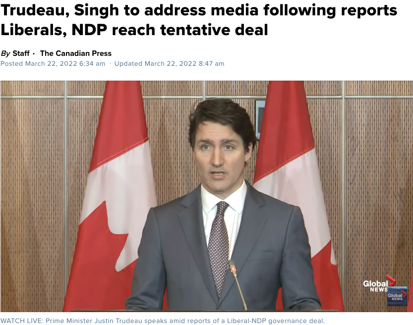
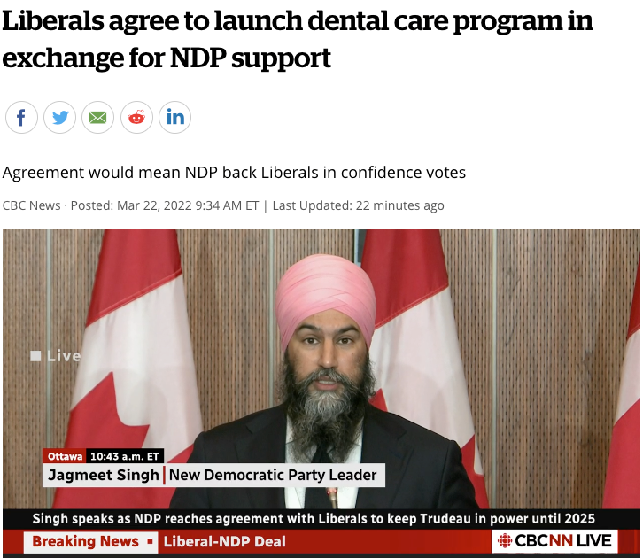
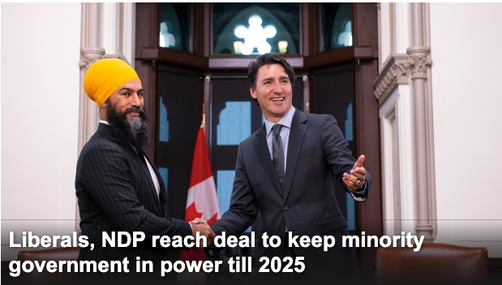
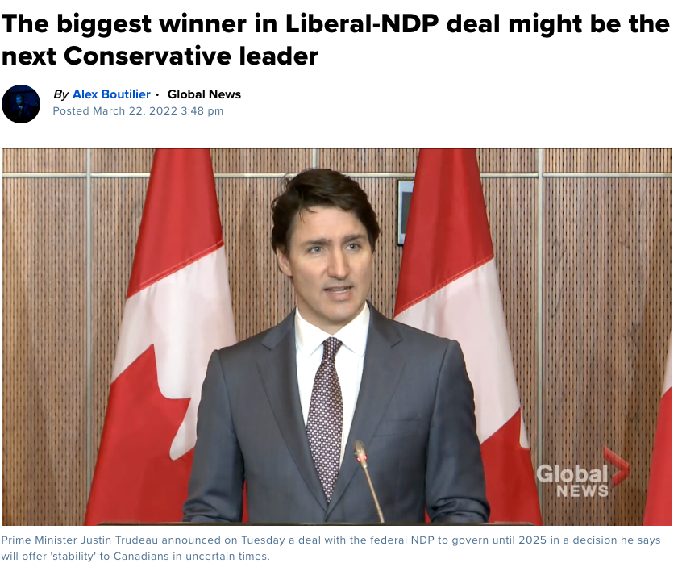

# 无标题

**链接地址:** http://mp.weixin.qq.com/s?__biz=MzI2ODYyODQ0OA==&mid=2247548643&idx=1&sn=675846dce492c1ef67f50d87b8fa7742&chksm=eaeec66cdd994f7a96e57efbcbed62faca8e72a2f0a029343e05ec978a1dd645dc5a15a84359&mpshare=1&scene=2&srcid=0323uV7GInjKEBl9Kaon3ZEN&sharer_sharetime=1647982558677&sharer_shareid=77848a6b3852ae4dcb6c74ffee84743c#rd
**作者:** 丁其
**获取时间:** 2025/8/28 19:39:22
**图片数量:** 7

---

## 原始HTML内容

 

加拿大总理贾斯汀·特鲁多（Justin Trudeau）今天（3月22日）宣布，自由党已与联邦新民主党（NDP）达成协议，有了NDP支持，这样可以保证自由党可以“稳定”将执政至2025 年，期间将会优先实施两党共同同意的内容，包括低收入家庭免费牙医，启动全国药保计划，解决住房危机以及带薪病假等等。 

 

 

特鲁多在周二早上的新闻发布会上说：“今天，我宣布自由党已与新民主党达成一项为加拿大人带来成果的协议。”

 

特鲁多表示，该协议是一项“信心与供给”协议，即日生效，并一直持续至2025年。

 

 

作为回报，特鲁多自由党政府已同意为低收入家庭启动一项新的牙科保健计划，以换取新民主党对自由党政府的支持。

 

一、立即实施牙科保健福利

 

特鲁多承诺，将为低收入加拿大人推出一项全新的牙科保健计划。

 

拟议牙医福利计划将从今年开始分三个阶段实施：&nbsp;

 

1、2022 年：12 岁以下开始实施

2、2023 年：扩大到 18 岁以下、老年人和残疾人。

3、2025 年：全面实施

 

政府表示，牙科计划是新民主党 2021 年竞选平台的重要组成部分，年收入低于 70,000 加元的家庭将不需要支付共付额（co-pays），7万-9万收入的家庭则需要支付部分牙医费用。

 

$9万以上家庭则不做考虑。 

 

 

二、启动全国药保 

 

特鲁多政府承诺，在 2023 年底之前通过《加拿大药品保健法》（Canada Pharmacare Act），在协议结束前，责成国家药品管理局（National Drug Agency ）制定国家基本药物处方集和大宗采购计划，继续朝着全民国家药品保健计划迈进。

 

三、加强医疗系统

 

政府表示，认识到由于大流行导致卫生系统捉襟见肘，各方意识到在不久的将来需要额外的持续投资来应对这些压力。

 

联邦政府将与各省和地区合作，确定如何共同为加拿大人提供更好的医疗服务，包括更多的初级保健医生和护士、心理健康支持、居家养老和更好的数据。

 

四、制定长期护理法

 

制定《安全长期护理法》（ Safe Long-Term Care Act ），以确保老年人无论身在何处都能得到应有的护理。

 

五、住房福利：发500加元 

 

1、将快速房屋计划（Rapid Housing Initiative）再延长一年。

 

2、将租赁建筑融资计划（Rental Construction Financing Initiative ）重新聚焦于经济适用房，政府同时将经济适用房定义为平均市场租金 (AMR）80% 或以下。

 

3、继续推出住房加速基金（Housing Accelerator Fund）。

 

4、2023 年底将实施购房者权利法案（Homebuyer’s Bill of Rights）并解决住房市场金融化问题。

 

5、制定加拿大住房福利金（Canada Housing Benefit ），2022 年向加拿大住房福利金一次性充值 500 加元，如果生活成本挑战仍然存在，该福利将在未来几年内更新。

 
<section style="text-align: center;margin-left: 16px;margin-right: 16px;"></section>
 

六、推出儿童托儿法 

 

2022 年底前，联邦政府将引入《早期学习和儿童托儿法》（Early Learning and Child Care Act），确保儿童托儿协议拥有长期受保护的资金，优先考虑非营利和公共场所，从而为家庭提供高质量、负担得起的儿童托儿机会。

 

七、共同应对气候危机

 

至于气候方面，两党在气候变化问题上大体一致，新民主党计划保持自由党的碳税政策。

 

政府表示将继续采取措施，到 2030 年实现比 2005 年水平显著减排。继续寻找进一步加快实现不迟于 2050 年实现净零排放的途径。

 

联邦政府今天将推进家庭能源效率计划，以提高加拿大人的能源负担能力并减少排放，投资以支持包括低层和多单元住宅公寓在内的多种节能计划。

 

八、10天带薪病假

 

确保在 2022 年尽快开始为所有受联邦监管的工人提供 10 天的带薪病假。

 

特鲁多今天表示，该协议是一项“信心与供给”协议，即日生效，并一直持续至2025年。

 

“这份供给和信任协议从今天开始，将一直持续到 2025 年任期结束。这意味着，在这个不确定的时期，联邦政府可以在可预测和稳定的情况下运作，提出预算并且落实执行，并为加拿大人服务&nbsp;。”

 

今天，特鲁多宣布与NDP结盟，可以让自由党掌权到 2025 年，有分析指，最大赢家可能是保守党下一个领导人，而不是NDP新民主党。

 

 

因为保守党已经决定在今年9月10日选出新党领，无论谁成为下一个保守党领袖，现在可以在三年时间准备下一次大选，重建保守党，筹集资金并在更广泛的选民之间建立基础。

 

对于少数党领袖来说，时间是一种难得的奢侈。例如，刚刚下台的奥图尔（Erin O'Toole）只有一年的时间，前任保守党领谢尔（Andrew Scheer） 大约有一年半的时间。

 

10年前的自由党也是一样，斯蒂芬·迪翁（Stephane Dion）和迈克尔·伊格纳蒂夫（Michael Ignatieff）领导的自由党在哈珀（Stephen Harper）少数党政府期间也有类似的遭遇。

 

所以，下一任保守党领袖可能有更多时间在大选前整理好自己的政党。

 

特鲁多告诉记者，他仍打算带领自由党参加2025 年的下一次选举，届时，结果会如何呢？

 

今天，自由党和NDP达成协议，宣布今年起实施低收入家庭牙医免费，年收入9万以上家庭不符合资格，福利没份，交税就更多，中产今天哭晕了吗？

 

------------下方是广告-----------

 

---大家快来关注加国君↓↓---

<strong style="outline: 0px;max-width: 100%;font-size: 16px;letter-spacing: 0.544px;box-sizing: border-box !important;overflow-wrap: break-word !important;">喜欢点个“在看” ↓↓</strong>

 

---

## 纯文本内容

加拿大总理贾斯汀·特鲁多（Justin Trudeau）今天（3月22日）宣布，自由党已与联邦新民主党（NDP）达成协议，有了NDP支持，这样可以保证自由党可以“稳定”将执政至2025 年，期间将会优先实施两党共同同意的内容，包括低收入家庭免费牙医，启动全国药保计划，解决住房危机以及带薪病假等等。特鲁多在周二早上的新闻发布会上说：“今天，我宣布自由党已与新民主党达成一项为加拿大人带来成果的协议。”特鲁多表示，该协议是一项“信心与供给”协议，即日生效，并一直持续至2025年。作为回报，特鲁多自由党政府已同意为低收入家庭启动一项新的牙科保健计划，以换取新民主党对自由党政府的支持。一、立即实施牙科保健福利特鲁多承诺，将为低收入加拿大人推出一项全新的牙科保健计划。拟议牙医福利计划将从今年开始分三个阶段实施： 1、2022 年：12 岁以下开始实施2、2023 年：扩大到 18 岁以下、老年人和残疾人。3、2025 年：全面实施政府表示，牙科计划是新民主党 2021 年竞选平台的重要组成部分，年收入低于 70,000 加元的家庭将不需要支付共付额（co-pays），7万-9万收入的家庭则需要支付部分牙医费用。$9万以上家庭则不做考虑。二、启动全国药保特鲁多政府承诺，在 2023 年底之前通过《加拿大药品保健法》（Canada Pharmacare Act），在协议结束前，责成国家药品管理局（National Drug Agency ）制定国家基本药物处方集和大宗采购计划，继续朝着全民国家药品保健计划迈进。三、加强医疗系统政府表示，认识到由于大流行导致卫生系统捉襟见肘，各方意识到在不久的将来需要额外的持续投资来应对这些压力。联邦政府将与各省和地区合作，确定如何共同为加拿大人提供更好的医疗服务，包括更多的初级保健医生和护士、心理健康支持、居家养老和更好的数据。四、制定长期护理法制定《安全长期护理法》（ Safe Long-Term Care Act ），以确保老年人无论身在何处都能得到应有的护理。五、住房福利：发500加元1、将快速房屋计划（Rapid Housing Initiative）再延长一年。2、将租赁建筑融资计划（Rental Construction Financing Initiative ）重新聚焦于经济适用房，政府同时将经济适用房定义为平均市场租金 (AMR）80% 或以下。3、继续推出住房加速基金（Housing Accelerator Fund）。4、2023 年底将实施购房者权利法案（Homebuyer’s Bill of Rights）并解决住房市场金融化问题。5、制定加拿大住房福利金（Canada Housing Benefit ），2022 年向加拿大住房福利金一次性充值 500 加元，如果生活成本挑战仍然存在，该福利将在未来几年内更新。六、推出儿童托儿法2022 年底前，联邦政府将引入《早期学习和儿童托儿法》（Early Learning and Child Care Act），确保儿童托儿协议拥有长期受保护的资金，优先考虑非营利和公共场所，从而为家庭提供高质量、负担得起的儿童托儿机会。七、共同应对气候危机至于气候方面，两党在气候变化问题上大体一致，新民主党计划保持自由党的碳税政策。政府表示将继续采取措施，到 2030 年实现比 2005 年水平显著减排。继续寻找进一步加快实现不迟于 2050 年实现净零排放的途径。联邦政府今天将推进家庭能源效率计划，以提高加拿大人的能源负担能力并减少排放，投资以支持包括低层和多单元住宅公寓在内的多种节能计划。八、10天带薪病假确保在 2022 年尽快开始为所有受联邦监管的工人提供 10 天的带薪病假。特鲁多今天表示，该协议是一项“信心与供给”协议，即日生效，并一直持续至2025年。“这份供给和信任协议从今天开始，将一直持续到 2025 年任期结束。这意味着，在这个不确定的时期，联邦政府可以在可预测和稳定的情况下运作，提出预算并且落实执行，并为加拿大人服务 。”今天，特鲁多宣布与NDP结盟，可以让自由党掌权到 2025 年，有分析指，最大赢家可能是保守党下一个领导人，而不是NDP新民主党。因为保守党已经决定在今年9月10日选出新党领，无论谁成为下一个保守党领袖，现在可以在三年时间准备下一次大选，重建保守党，筹集资金并在更广泛的选民之间建立基础。对于少数党领袖来说，时间是一种难得的奢侈。例如，刚刚下台的奥图尔（Erin O'Toole）只有一年的时间，前任保守党领谢尔（Andrew Scheer） 大约有一年半的时间。10年前的自由党也是一样，斯蒂芬·迪翁（Stephane Dion）和迈克尔·伊格纳蒂夫（Michael Ignatieff）领导的自由党在哈珀（Stephen Harper）少数党政府期间也有类似的遭遇。所以，下一任保守党领袖可能有更多时间在大选前整理好自己的政党。特鲁多告诉记者，他仍打算带领自由党参加2025 年的下一次选举，届时，结果会如何呢？今天，自由党和NDP达成协议，宣布今年起实施低收入家庭牙医免费，年收入9万以上家庭不符合资格，福利没份，交税就更多，中产今天哭晕了吗？------------下方是广告--------------大家快来关注加国君↓↓---喜欢点个“在看” ↓↓

---

## 图片列表

-  (原始链接: https://mmbiz.qpic.cn/mmbiz_png/icDcCacWsN1Vib7sLiaxlRXtWqVABYVdPpgpt9cuoaeNqGsHyRqDo2hjt4piaFOMLquQ23hFFQucy2YV0yLJicbcUWw/640?wx_fmt=png)
-  (原始链接: https://mmbiz.qpic.cn/mmbiz_png/icDcCacWsN1Vib7sLiaxlRXtWqVABYVdPpgzic3UQNy8YwabsVmPgGfR2L83NWI2wBM0uOktbTDeHeJprcAh8vibicMA/640?wx_fmt=png)
-  (原始链接: https://mmbiz.qpic.cn/mmbiz_png/icDcCacWsN1Vib7sLiaxlRXtWqVABYVdPpgTfLGEvp2jkSqkD7qC6aWR40hTibNedk7zHnqzicoHPfA2XEOeUpr5MVg/640?wx_fmt=png)
-  (原始链接: https://mmbiz.qpic.cn/mmbiz_png/icDcCacWsN1Vib7sLiaxlRXtWqVABYVdPpg7ZC9dOJymllQTASBZzR50aIZu32dXTZAHWibo5CtEpIEZgI0a56RZLg/640?wx_fmt=png)
-  (原始链接: https://mmbiz.qpic.cn/mmbiz_png/icDcCacWsN1Vib7sLiaxlRXtWqVABYVdPpgHSfO6h6PuVicQwKauNnf5dBWuP4TzPlzrRxO975W4EvBra4NLcHrh4Q/640?wx_fmt=png)
-  (原始链接: https://mmbiz.qpic.cn/mmbiz_jpg/icDcCacWsN1WqFIQkOgDOCJeQyx5GErf8Q0PjulRsV401zibQPjnxibahGmHnLBm8gaYo0Mzshe4vN22lGlwfpN0w/640?wx_fmt=jpeg)
-  (原始链接: https://mmbiz.qpic.cn/mmbiz_jpg/icDcCacWsN1UfuVe5mmtBBvvB08BYhC4VDdleW5ykgKfQSY29ib5NByGTYSvMSw6HmDpYI5utbL0cgwAIxkqDU3Q/640?wx_fmt=jpeg)
