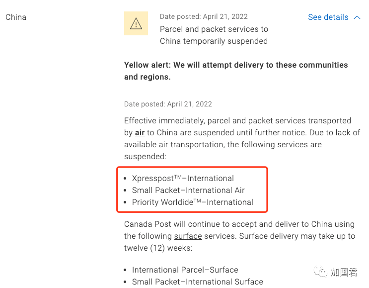
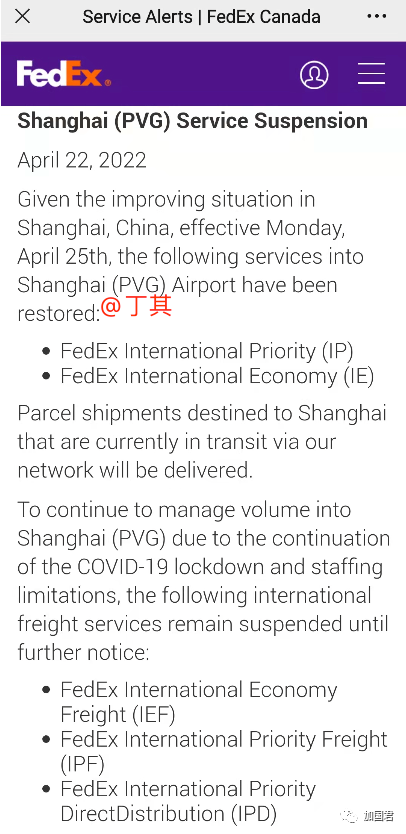

# 无标题

**链接地址:** http://mp.weixin.qq.com/s?__biz=MzI2ODYyODQ0OA==&mid=2247549941&idx=1&sn=991d6d3293b135e2cdd223b927993dec&chksm=eaeefb7add99726c548227e9b9479333896c0ffa9c1bdead34a22bcf876d259e034f538dd8de&mpshare=1&scene=2&srcid=0424j2QXi3UFCpJXACraYFVZ&sharer_sharetime=1650742178728&sharer_shareid=77848a6b3852ae4dcb6c74ffee84743c#rd
**作者:** 丁其
**获取时间:** 2025/8/28 19:39:09
**图片数量:** 5

---

## 原始HTML内容

 

加拿大邮政局4月21日发出黄色警告，称从即日起，空运至中国的包裹服务暂停，直至另行通知。而Fexdex加拿大则宣布下周一起宣布恢复2项服务

 

 

 

 

加拿大邮政局（Canada Post）周四在官网发出通告，表示空运到中国的包裹服务将会临时暂停。

 

加拿大邮政发出一份黄色警告，即日起，空运至中国的包裹服务（parcel and packet services&nbsp;）暂停，直至另行通知。&nbsp;

 

邮政局还表示，由于缺乏可用的航空运输，以下服务暂停：

 

1、XpresspostTM-国际

2、小包-国际空运

3、Priority WorldideTM–国际

 

 

加拿大邮政表示，以下2项平邮服务接收和送递到中国仍然继续，时间长达12周：  

1、国际包裹 -&nbsp;平邮

2、小件包裹-国际平邮

 

联邦快递加拿大（Fexdex Canada）周五也发出通告，后天周一起恢复上海机场服务

 

联邦快递加拿大表示：鉴于中国上海的情况有所好转，自 4 月 25 日星期一起，以下2项进入上海 (PVG) 机场的服务已恢复：

 

1、国际优先 (IP)

2、国际经济 (IE)

 

联邦快递表示，目前正在通过我们的网络中转的发往上海的包裹将被交付。

 

由于 COVID-19 的持续封锁和人员限制，为了继续管理进入上海 (PVG) 的货运量，以下三项国际货运服务将暂停，直至另行通知：

 

1、国际经济货运 (IEF)

2、国际优先货运 (IPF)

3、国际优先直接配送 (IPD)

 

 

 

 

https://www.canadapost-postescanada.ca/cpc/en/our-company/news-and-media/service-alerts.page

 
<section style="margin-right: 16px;margin-left: 16px;outline: 0px;max-width: 100%;letter-spacing: 0.544px;white-space: normal;background-color: rgb(255, 255, 255);color: rgb(160, 160, 160);font-size: 15px;font-family: -apple-system-font, BlinkMacSystemFont, &quot;Helvetica Neue&quot;, &quot;PingFang SC&quot;, &quot;Hiragino Sans GB&quot;, &quot;Microsoft YaHei UI&quot;, &quot;Microsoft YaHei&quot;, Arial, sans-serif;text-align: center;line-height: 2em;box-sizing: border-box !important;overflow-wrap: break-word !important;">------------下方是广告-----------</section><section style="margin-right: 16px;margin-bottom: 0em;margin-left: 16px;outline: 0px;max-width: 100%;color: rgb(34, 34, 34);letter-spacing: 0.544px;white-space: normal;background-color: rgb(255, 255, 255);font-family: -apple-system, system-ui, &quot;Helvetica Neue&quot;, &quot;PingFang SC&quot;, &quot;Hiragino Sans GB&quot;, &quot;Microsoft YaHei UI&quot;, &quot;Microsoft YaHei&quot;, Arial, sans-serif;text-align: center;line-height: 2em;box-sizing: border-box !important;overflow-wrap: break-word !important;"></section><section style="margin-right: 16px;margin-left: 16px;outline: 0px;max-width: 100%;letter-spacing: 0.544px;white-space: normal;background-color: rgb(255, 255, 255);color: rgb(160, 160, 160);font-family: -apple-system-font, BlinkMacSystemFont, &quot;Helvetica Neue&quot;, &quot;PingFang SC&quot;, &quot;Hiragino Sans GB&quot;, &quot;Microsoft YaHei UI&quot;, &quot;Microsoft YaHei&quot;, Arial, sans-serif;font-size: 16px;text-align: center;line-height: 2em;box-sizing: border-box !important;overflow-wrap: break-word !important;"> </section><section style="margin-right: 16px;margin-left: 16px;outline: 0px;max-width: 100%;letter-spacing: 0.544px;white-space: normal;background-color: rgb(255, 255, 255);color: rgb(160, 160, 160);font-family: -apple-system-font, BlinkMacSystemFont, &quot;Helvetica Neue&quot;, &quot;PingFang SC&quot;, &quot;Hiragino Sans GB&quot;, &quot;Microsoft YaHei UI&quot;, &quot;Microsoft YaHei&quot;, Arial, sans-serif;font-size: 16px;text-align: center;line-height: 2em;box-sizing: border-box !important;overflow-wrap: break-word !important;">---大家快来关注加国君↓↓---</section><section style="margin-right: 16px;margin-bottom: 0em;margin-left: 16px;outline: 0px;max-width: 100%;letter-spacing: 0.544px;white-space: normal;background-color: rgb(255, 255, 255);color: rgb(160, 160, 160);font-size: 15px;font-family: -apple-system-font, system-ui, &quot;Helvetica Neue&quot;, &quot;PingFang SC&quot;, &quot;Hiragino Sans GB&quot;, &quot;Microsoft YaHei UI&quot;, &quot;Microsoft YaHei&quot;, Arial, sans-serif;text-align: center;line-height: 2em;box-sizing: border-box !important;overflow-wrap: break-word !important;"></section><section style="margin-right: 16px;margin-bottom: 0em;margin-left: 16px;outline: 0px;max-width: 100%;letter-spacing: 0.544px;white-space: normal;background-color: rgb(255, 255, 255);color: rgb(160, 160, 160);font-size: 15px;font-family: -apple-system-font, BlinkMacSystemFont, &quot;Helvetica Neue&quot;, &quot;PingFang SC&quot;, &quot;Hiragino Sans GB&quot;, &quot;Microsoft YaHei UI&quot;, &quot;Microsoft YaHei&quot;, Arial, sans-serif;text-align: right;line-height: 2em;box-sizing: border-box !important;overflow-wrap: break-word !important;"><strong style="outline: 0px;max-width: 100%;font-size: 16px;letter-spacing: 0.544px;box-sizing: border-box !important;overflow-wrap: break-word !important;">喜欢点个“在看” ↓↓</strong></section>
 

 

---

## 纯文本内容

加拿大邮政局4月21日发出黄色警告，称从即日起，空运至中国的包裹服务暂停，直至另行通知。而Fexdex加拿大则宣布下周一起宣布恢复2项服务加拿大邮政局（Canada Post）周四在官网发出通告，表示空运到中国的包裹服务将会临时暂停。加拿大邮政发出一份黄色警告，即日起，空运至中国的包裹服务（parcel and packet services ）暂停，直至另行通知。 邮政局还表示，由于缺乏可用的航空运输，以下服务暂停：1、XpresspostTM-国际2、小包-国际空运3、Priority WorldideTM–国际加拿大邮政表示，以下2项平邮服务接收和送递到中国仍然继续，时间长达12周：1、国际包裹 - 平邮2、小件包裹-国际平邮联邦快递加拿大（Fexdex Canada）周五也发出通告，后天周一起恢复上海机场服务联邦快递加拿大表示：鉴于中国上海的情况有所好转，自 4 月 25 日星期一起，以下2项进入上海 (PVG) 机场的服务已恢复：1、国际优先 (IP)2、国际经济 (IE)联邦快递表示，目前正在通过我们的网络中转的发往上海的包裹将被交付。由于 COVID-19 的持续封锁和人员限制，为了继续管理进入上海 (PVG) 的货运量，以下三项国际货运服务将暂停，直至另行通知：1、国际经济货运 (IEF)2、国际优先货运 (IPF)3、国际优先直接配送 (IPD)https://www.canadapost-postescanada.ca/cpc/en/our-company/news-and-media/service-alerts.page------------下方是广告--------------大家快来关注加国君↓↓---喜欢点个“在看” ↓↓

---

## 图片列表

-  (原始链接: https://mmbiz.qpic.cn/mmbiz_jpg/icDcCacWsN1URHIBPAC8l5gMc8M7ADS233dR5c3D0aJNbhrwmdHwEJwiaokMEtvByF9se9mMe4rel6oCwjJ0JEbg/640?wx_fmt=jpeg)
-  (原始链接: https://mmbiz.qpic.cn/mmbiz_png/icDcCacWsN1URHIBPAC8l5gMc8M7ADS231wriaRYcbbIEDI2qz3j2yicePPswhyWibIfUSUWsj9icLjKvlCMo0kKw6Q/640?wx_fmt=png)
-  (原始链接: https://mmbiz.qpic.cn/mmbiz_png/icDcCacWsN1URHIBPAC8l5gMc8M7ADS23c186GgicwM8pZGTiaDSibhxCLeEAjPBjlpzc7sOgPribopgoztdktrPyEw/640?wx_fmt=png)
-  (原始链接: https://mmbiz.qpic.cn/mmbiz_jpg/icDcCacWsN1WqFIQkOgDOCJeQyx5GErf8Q0PjulRsV401zibQPjnxibahGmHnLBm8gaYo0Mzshe4vN22lGlwfpN0w/640?wx_fmt=jpeg)
-  (原始链接: https://mmbiz.qpic.cn/mmbiz_jpg/icDcCacWsN1UfuVe5mmtBBvvB08BYhC4VDdleW5ykgKfQSY29ib5NByGTYSvMSw6HmDpYI5utbL0cgwAIxkqDU3Q/640?wx_fmt=jpeg)
