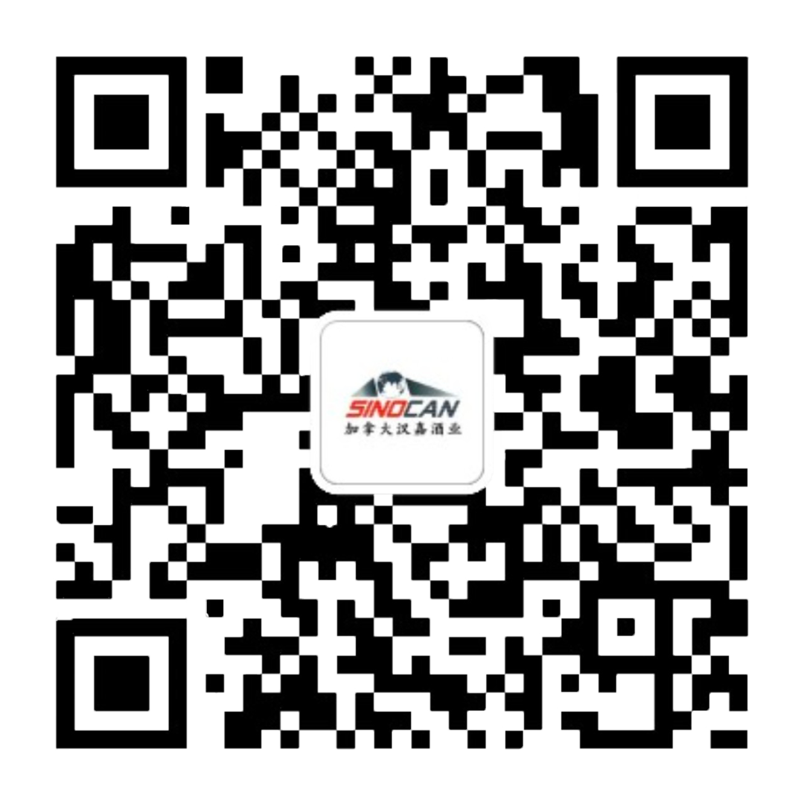

# 无标题

**链接地址:** http://mp.weixin.qq.com/s?__biz=MzIyMzU4OTc0MQ==&mid=2247488496&idx=1&sn=e00f1ea6f07776c6b02e68cce000b0d6&chksm=e81ab7f2df6d3ee4a15113ec0b8547fb05631cc620e2bef08c21771c06f7872ab1b63fb427b0&mpshare=1&scene=2&srcid=0608xKD52umAaSubqQ4BMib1&sharer_sharetime=1654642519969&sharer_shareid=77848a6b3852ae4dcb6c74ffee84743c#rd
**作者:** Iris Zhang
**获取时间:** 2025/8/28 19:38:32
**图片数量:** 2

---

## 原始HTML内容

<section style="box-sizing: border-box;font-style: normal;font-weight: 400;text-align: justify;font-size: 16px;"><section style="box-sizing: border-box;" powered-by="xiumi.us"><section style="display: flex;flex-flow: row nowrap;text-align: left;justify-content: flex-start;margin: 10px 0px;box-sizing: border-box;"><section style="display: inline-block;vertical-align: middle;width: auto;min-width: 10%;max-width: 100%;height: auto;align-self: center;box-sizing: border-box;"><section style="text-align: center;justify-content: center;box-sizing: border-box;" powered-by="xiumi.us"><section style="display: inline-block;width: 15px;height: 15px;vertical-align: top;overflow: hidden;background-color: rgb(60, 50, 95);box-shadow: rgb(206, 198, 178) -8px 12px 0px;box-sizing: border-box;"> <section><svg viewBox="0 0 1 1" style="float:left;line-height:0;width:0;vertical-align:top;"></svg></section></section></section></section><section style="display: inline-block;vertical-align: middle;width: auto;min-width: 10%;max-width: 100%;height: auto;align-self: center;box-sizing: border-box;"><section style="color: rgb(114, 145, 169);font-size: 19px;text-align: justify;box-sizing: border-box;" powered-by="xiumi.us">
<strong style="box-sizing: border-box;">在招岗位</strong>
</section><section style="opacity: 1;box-sizing: border-box;" powered-by="xiumi.us"><section style="color: rgb(114, 145, 169);font-size: 14px;text-align: justify;box-sizing: border-box;">
业务发展管理
</section></section></section><section style="display: inline-block;vertical-align: middle;width: auto;align-self: center;flex: 100 100 0%;height: auto;box-sizing: border-box;"><section style="margin: 0px 0%;text-align: center;justify-content: center;box-sizing: border-box;" powered-by="xiumi.us"><section style="background-color: rgb(114, 145, 169);height: 1px;box-sizing: border-box;"><section><svg viewBox="0 0 1 1" style="float:left;line-height:0;width:0;vertical-align:top;"></svg></section></section></section></section></section></section><section style="margin: 0px 0px -20px;box-sizing: border-box;" powered-by="xiumi.us"><section style="box-sizing: border-box;">
 
</section></section><section style="text-align: center;margin: 10px 0px 0px;justify-content: center;box-sizing: border-box;" powered-by="xiumi.us"><section style="max-width: 100%;vertical-align: middle;display: inline-block;line-height: 0;width: 100%;height: auto;box-sizing: border-box;"></section></section><section style="box-sizing: border-box;" powered-by="xiumi.us">
 
</section><section style="box-sizing: border-box;" powered-by="xiumi.us"><section style="text-align: left;justify-content: flex-start;display: flex;flex-flow: row nowrap;margin: 0px 0px 10px;box-sizing: border-box;"><section style="display: inline-block;width: 100%;vertical-align: top;align-self: flex-start;flex: 0 0 auto;background-color: rgb(239, 245, 249);padding: 25px;box-sizing: border-box;"><section style="box-sizing: border-box;" powered-by="xiumi.us"><section style="justify-content: flex-start;display: flex;flex-flow: row nowrap;margin: 0px 0px 10px;box-sizing: border-box;"><section style="display: inline-block;vertical-align: middle;width: auto;align-self: center;flex: 0 0 auto;min-width: 10%;max-width: 100%;height: auto;box-sizing: border-box;"><section style="font-size: 19px;margin: 0px 0%;text-align: center;justify-content: center;box-sizing: border-box;" powered-by="xiumi.us"><section style="display: inline-block;border-width: 1px;border-style: solid;border-color: rgb(60, 50, 95);background-color: rgb(60, 50, 95);width: 1.8em;height: 1.8em;line-height: 1.8em;border-radius: 100%;margin-left: auto;margin-right: auto;font-size: 16px;color: rgb(248, 247, 242);box-sizing: border-box;">
<strong style="box-sizing: border-box;">职</strong>
</section></section><section style="font-size: 19px;margin: 0px 0%;text-align: center;box-sizing: border-box;" powered-by="xiumi.us"><section style="display: inline-block;border-width: 1px;border-style: solid;border-color: rgb(60, 50, 95);background-color: rgb(60, 50, 95);width: 1.8em;height: 1.8em;line-height: 1.8em;border-radius: 100%;margin-left: auto;margin-right: auto;font-size: 16px;color: rgb(248, 247, 242);box-sizing: border-box;">
<strong style="box-sizing: border-box;">介</strong>
</section></section></section><section style="display: inline-block;vertical-align: middle;width: auto;align-self: center;flex: 0 0 auto;min-width: 10%;max-width: 100%;height: auto;box-sizing: border-box;"><section style="font-size: 19px;margin: 0px 0%;text-align: center;box-sizing: border-box;" powered-by="xiumi.us"><section style="display: inline-block;border-width: 1px;border-style: solid;border-color: rgb(60, 50, 95);background-color: rgb(60, 50, 95);width: 1.8em;height: 1.8em;line-height: 1.8em;border-radius: 100%;margin-left: auto;margin-right: auto;font-size: 16px;color: rgb(248, 247, 242);box-sizing: border-box;">
<strong style="box-sizing: border-box;">位</strong>
</section></section><section style="font-size: 19px;margin: 0px 0%;text-align: center;box-sizing: border-box;" powered-by="xiumi.us"><section style="display: inline-block;border-width: 1px;border-style: solid;border-color: rgb(60, 50, 95);background-color: rgb(60, 50, 95);width: 1.8em;height: 1.8em;line-height: 1.8em;border-radius: 100%;margin-left: auto;margin-right: auto;font-size: 16px;color: rgb(248, 247, 242);box-sizing: border-box;">
<strong style="box-sizing: border-box;">绍</strong>
</section></section></section><section style="display: inline-block;vertical-align: middle;width: auto;min-width: 10%;max-width: 100%;flex: 0 0 auto;height: auto;align-self: center;box-sizing: border-box;"><section style="text-align: justify;box-sizing: border-box;" powered-by="xiumi.us">
&nbsp; &nbsp; INTRODUCTION
</section></section></section></section><section style="text-align: center;justify-content: center;margin: 0px;box-sizing: border-box;" powered-by="xiumi.us"><section style="background-color: rgb(206, 198, 178);height: 3px;box-sizing: border-box;"><section><svg viewBox="0 0 1 1" style="float:left;line-height:0;width:0;vertical-align:top;"></svg></section></section></section><section style="text-align: center;justify-content: center;margin: 0px;box-sizing: border-box;" powered-by="xiumi.us"><section style="text-align: justify;color: rgb(206, 198, 178);font-size: 12px;box-sizing: border-box;">
Business Development Associate
</section></section><section style="text-align: justify;box-sizing: border-box;" powered-by="xiumi.us">
 
</section><section style="text-align: justify;box-sizing: border-box;" powered-by="xiumi.us">
Sinocan Supply Inc.正在为处于埃德蒙顿的全职业务发展管理岗位招聘。作为合适人选，您需要识别，评估和执行增长机会，与业务合作伙伴发展和保持关系，确保业务符合监管机构的要求，并监督销售渠道的绩效。您还负责管理日常业务运营，包括数据分析，物流协调，库存管理和报告编写。

 

理想的候选人必须能够在企业家文化中蓬勃发展，适应灵活的工作时间，并且中英双语流利。
</section></section></section></section><section style="box-sizing: border-box;" powered-by="xiumi.us">
 
</section><section style="box-sizing: border-box;" powered-by="xiumi.us"><section style="text-align: center;justify-content: center;display: flex;flex-flow: row nowrap;margin: 10px 0px;box-sizing: border-box;"><section style="display: inline-block;width: 89%;vertical-align: top;align-self: flex-start;flex: 0 0 auto;height: auto;box-sizing: border-box;"><section style="height: auto;box-sizing: border-box;" powered-by="xiumi.us"><section style="text-align: left;justify-content: flex-start;display: flex;flex-flow: row nowrap;margin: 10px 0px;box-sizing: border-box;"><section style="display: inline-block;vertical-align: middle;width: auto;align-self: center;flex: 0 0 auto;min-width: 10%;max-width: 100%;height: auto;box-sizing: border-box;"><section style="font-size: 19px;margin: 0px 0%;justify-content: flex-start;box-sizing: border-box;" powered-by="xiumi.us"><section style="display: inline-block;border-width: 1px;border-style: solid;border-color: rgb(60, 50, 95);background-color: rgb(60, 50, 95);text-align: center;width: 1.8em;height: 1.8em;line-height: 1.8em;border-radius: 100%;margin-left: auto;margin-right: auto;font-size: 16px;color: rgb(248, 247, 242);box-sizing: border-box;">
<strong style="box-sizing: border-box;">工</strong>
</section></section><section style="font-size: 19px;margin: 0px 0%;justify-content: flex-start;box-sizing: border-box;" powered-by="xiumi.us"><section style="display: inline-block;border-width: 1px;border-style: solid;border-color: rgb(60, 50, 95);background-color: rgb(60, 50, 95);text-align: center;width: 1.8em;height: 1.8em;line-height: 1.8em;border-radius: 100%;margin-left: auto;margin-right: auto;font-size: 16px;color: rgb(248, 247, 242);box-sizing: border-box;">
<strong style="box-sizing: border-box;">职</strong>
</section></section></section><section style="display: inline-block;vertical-align: middle;width: auto;align-self: center;flex: 0 0 auto;min-width: 10%;max-width: 100%;height: auto;box-sizing: border-box;"><section style="font-size: 19px;margin: 0px 0%;justify-content: flex-start;box-sizing: border-box;" powered-by="xiumi.us"><section style="display: inline-block;border-width: 1px;border-style: solid;border-color: rgb(60, 50, 95);background-color: rgb(60, 50, 95);text-align: center;width: 1.8em;height: 1.8em;line-height: 1.8em;border-radius: 100%;margin-left: auto;margin-right: auto;font-size: 16px;color: rgb(248, 247, 242);box-sizing: border-box;">
<strong style="box-sizing: border-box;">作</strong>
</section></section><section style="font-size: 19px;margin: 0px 0%;justify-content: flex-start;box-sizing: border-box;" powered-by="xiumi.us"><section style="display: inline-block;border-width: 1px;border-style: solid;border-color: rgb(60, 50, 95);background-color: rgb(60, 50, 95);text-align: center;width: 1.8em;height: 1.8em;line-height: 1.8em;border-radius: 100%;margin-left: auto;margin-right: auto;font-size: 16px;color: rgb(248, 247, 242);box-sizing: border-box;">
<strong style="box-sizing: border-box;">责</strong>
</section></section></section><section style="display: inline-block;vertical-align: middle;width: auto;min-width: 10%;max-width: 100%;flex: 0 0 auto;height: auto;align-self: center;box-sizing: border-box;"><section style="text-align: justify;box-sizing: border-box;" powered-by="xiumi.us">
&nbsp; &nbsp;JOB DUTIES
</section></section></section></section><section style="justify-content: center;margin: 0px;box-sizing: border-box;" powered-by="xiumi.us"><section style="background-color: rgb(206, 198, 178);height: 3px;box-sizing: border-box;"><section><svg viewBox="0 0 1 1" style="float:left;line-height:0;width:0;vertical-align:top;"></svg></section></section></section><section style="justify-content: center;margin: 0px;box-sizing: border-box;" powered-by="xiumi.us"><section style="text-align: justify;color: rgb(206, 198, 178);font-size: 12px;box-sizing: border-box;">
Business Development Associate
</section></section><section style="text-align: justify;box-sizing: border-box;" powered-by="xiumi.us">
 
</section><section style="margin: 0px 0px 10px;box-sizing: border-box;" powered-by="xiumi.us"><section style="text-align: justify;line-height: 1.8;box-sizing: border-box;"><ol class="list-paddingleft-1" style="list-style-type: decimal;box-sizing: border-box;"><li style="box-sizing: border-box;">
收集，处理和分析销售与库存数据，以监控绩效，促进运营并提出策略。
</li><li style="box-sizing: border-box;">
与海外供应商，货运代理和艾伯塔省和不列颠哥伦比亚省的本地仓库协调物流。
</li><li style="box-sizing: border-box;">
审查监管并提交申请文件到各省酒局并确保遵守AGLC，BCLDB和LCBO等监管机构的相关规定。
</li><li style="box-sizing: border-box;">
与供应商，机构买家，零售商和最终客户建立并保持良好的关系和报价
</li><li style="box-sizing: border-box;">
发起市场营销活动并从事市场营销材料的开发。
</li><li style="box-sizing: border-box;">
根据供应商的要求编写性能和合规报告。
</li><li style="box-sizing: border-box;">
提议，参加，协调和记录营销活动。
</li><li style="box-sizing: border-box;">
负责一定的选品工作
</li><li style="box-sizing: border-box;">
定期出差和拜访零售商
</li><li style="box-sizing: border-box;">
其他行政管理职
</li></ol></section></section></section></section></section><section style="box-sizing: border-box;" powered-by="xiumi.us">
 
</section><section style="box-sizing: border-box;" powered-by="xiumi.us"><section style="text-align: left;justify-content: flex-start;display: flex;flex-flow: row nowrap;margin: 0px 0px 10px;box-sizing: border-box;"><section style="display: inline-block;width: 100%;vertical-align: top;align-self: flex-start;flex: 0 0 auto;background-color: rgb(239, 245, 249);padding: 25px;box-sizing: border-box;"><section style="box-sizing: border-box;" powered-by="xiumi.us"><section style="justify-content: flex-start;display: flex;flex-flow: row nowrap;margin: 0px 0px 10px;box-sizing: border-box;"><section style="display: inline-block;vertical-align: middle;width: auto;align-self: center;flex: 0 0 auto;min-width: 10%;max-width: 100%;height: auto;box-sizing: border-box;"><section style="font-size: 19px;margin: 0px 0%;text-align: center;justify-content: center;box-sizing: border-box;" powered-by="xiumi.us"><section style="display: inline-block;border-width: 1px;border-style: solid;border-color: rgb(60, 50, 95);background-color: rgb(60, 50, 95);width: 1.8em;height: 1.8em;line-height: 1.8em;border-radius: 100%;margin-left: auto;margin-right: auto;font-size: 16px;color: rgb(248, 247, 242);box-sizing: border-box;">
<strong style="box-sizing: border-box;">工</strong>
</section></section><section style="font-size: 19px;margin: 0px 0%;text-align: center;box-sizing: border-box;" powered-by="xiumi.us"><section style="display: inline-block;border-width: 1px;border-style: solid;border-color: rgb(60, 50, 95);background-color: rgb(60, 50, 95);width: 1.8em;height: 1.8em;line-height: 1.8em;border-radius: 100%;margin-left: auto;margin-right: auto;font-size: 16px;color: rgb(248, 247, 242);box-sizing: border-box;">
<strong style="box-sizing: border-box;">要</strong>
</section></section></section><section style="display: inline-block;vertical-align: middle;width: auto;align-self: center;flex: 0 0 auto;min-width: 10%;max-width: 100%;height: auto;box-sizing: border-box;"><section style="font-size: 19px;margin: 0px 0%;text-align: center;box-sizing: border-box;" powered-by="xiumi.us"><section style="display: inline-block;border-width: 1px;border-style: solid;border-color: rgb(60, 50, 95);background-color: rgb(60, 50, 95);width: 1.8em;height: 1.8em;line-height: 1.8em;border-radius: 100%;margin-left: auto;margin-right: auto;font-size: 16px;color: rgb(248, 247, 242);box-sizing: border-box;">
<strong style="box-sizing: border-box;">作</strong>
</section></section><section style="font-size: 19px;margin: 0px 0%;text-align: center;box-sizing: border-box;" powered-by="xiumi.us"><section style="display: inline-block;border-width: 1px;border-style: solid;border-color: rgb(60, 50, 95);background-color: rgb(60, 50, 95);width: 1.8em;height: 1.8em;line-height: 1.8em;border-radius: 100%;margin-left: auto;margin-right: auto;font-size: 16px;color: rgb(248, 247, 242);box-sizing: border-box;">
<strong style="box-sizing: border-box;">求</strong>
</section></section></section><section style="display: inline-block;vertical-align: middle;width: auto;min-width: 10%;max-width: 100%;flex: 0 0 auto;height: auto;align-self: center;box-sizing: border-box;"><section style="text-align: justify;box-sizing: border-box;" powered-by="xiumi.us">
&nbsp; &nbsp;JOB REQUIREMENTS
</section></section></section></section><section style="text-align: center;justify-content: center;margin: 0px;box-sizing: border-box;" powered-by="xiumi.us"><section style="background-color: rgb(206, 198, 178);height: 3px;box-sizing: border-box;"><section><svg viewBox="0 0 1 1" style="float:left;line-height:0;width:0;vertical-align:top;"></svg></section></section></section><section style="text-align: center;justify-content: center;margin: 0px;box-sizing: border-box;" powered-by="xiumi.us"><section style="text-align: justify;color: rgb(206, 198, 178);font-size: 12px;box-sizing: border-box;">
Business Development Associate
</section></section><section style="text-align: justify;box-sizing: border-box;" powered-by="xiumi.us">
 
</section><section style="text-align: justify;line-height: 1.8;box-sizing: border-box;" powered-by="xiumi.us"><ol class="list-paddingleft-1" style="list-style-type: decimal;box-sizing: border-box;"><li style="box-sizing: border-box;">
必须持有大学本科学位。 
</li><li style="box-sizing: border-box;">
必须掌握流利的中英双语交流能力。 
</li><li style="box-sizing: border-box;">
必须熟练运用Microsoft Excel和Word。 
</li><li style="box-sizing: border-box;">
必须持有有效的5类驾驶执照。
</li><li style="box-sizing: border-box;">
建议拥有销售行业或办公室文秘的经验
</li><li style="box-sizing: border-box;">
建议持有WSET 1级证书
</li></ol></section></section></section></section><section style="margin: 0px 0px -10px;box-sizing: border-box;" powered-by="xiumi.us"><section style="box-sizing: border-box;">
 
</section></section><section style="box-sizing: border-box;" powered-by="xiumi.us"><section style="text-align: left;justify-content: flex-start;display: flex;flex-flow: row nowrap;margin: 0px 0px 10px;box-sizing: border-box;"><section style="display: inline-block;width: 100%;vertical-align: top;align-self: flex-start;flex: 0 0 auto;padding: 25px;box-sizing: border-box;"><section style="box-sizing: border-box;" powered-by="xiumi.us"><section style="justify-content: flex-start;display: flex;flex-flow: row nowrap;margin: 0px 0px 10px;box-sizing: border-box;"><section style="display: inline-block;vertical-align: middle;width: auto;align-self: center;flex: 0 0 auto;min-width: 10%;max-width: 100%;height: auto;box-sizing: border-box;"><section style="font-size: 19px;margin: 0px 0%;text-align: center;justify-content: center;box-sizing: border-box;" powered-by="xiumi.us"><section style="display: inline-block;border-width: 1px;border-style: solid;border-color: rgb(60, 50, 95);background-color: rgb(60, 50, 95);width: 1.8em;height: 1.8em;line-height: 1.8em;border-radius: 100%;margin-left: auto;margin-right: auto;font-size: 16px;color: rgb(248, 247, 242);box-sizing: border-box;">
<strong style="box-sizing: border-box;">关</strong>
</section></section><section style="font-size: 19px;margin: 0px 0%;text-align: center;box-sizing: border-box;" powered-by="xiumi.us"><section style="display: inline-block;border-width: 1px;border-style: solid;border-color: rgb(60, 50, 95);background-color: rgb(60, 50, 95);width: 1.8em;height: 1.8em;line-height: 1.8em;border-radius: 100%;margin-left: auto;margin-right: auto;font-size: 16px;color: rgb(248, 247, 242);box-sizing: border-box;">
<strong style="box-sizing: border-box;">我</strong>
</section></section></section><section style="display: inline-block;vertical-align: middle;width: auto;align-self: center;flex: 0 0 auto;min-width: 10%;max-width: 100%;height: auto;box-sizing: border-box;"><section style="font-size: 19px;margin: 0px 0%;text-align: center;box-sizing: border-box;" powered-by="xiumi.us"><section style="display: inline-block;border-width: 1px;border-style: solid;border-color: rgb(60, 50, 95);background-color: rgb(60, 50, 95);width: 1.8em;height: 1.8em;line-height: 1.8em;border-radius: 100%;margin-left: auto;margin-right: auto;font-size: 16px;color: rgb(248, 247, 242);box-sizing: border-box;">
<strong style="box-sizing: border-box;">于</strong>
</section></section><section style="font-size: 19px;margin: 0px 0%;text-align: center;box-sizing: border-box;" powered-by="xiumi.us"><section style="display: inline-block;border-width: 1px;border-style: solid;border-color: rgb(60, 50, 95);background-color: rgb(60, 50, 95);width: 1.8em;height: 1.8em;line-height: 1.8em;border-radius: 100%;margin-left: auto;margin-right: auto;font-size: 16px;color: rgb(248, 247, 242);box-sizing: border-box;">
<strong style="box-sizing: border-box;">们</strong>
</section></section></section><section style="display: inline-block;vertical-align: middle;width: auto;min-width: 10%;max-width: 100%;flex: 0 0 auto;height: auto;align-self: center;box-sizing: border-box;"><section style="text-align: justify;box-sizing: border-box;" powered-by="xiumi.us">
&nbsp; &nbsp; ABOUT US
</section></section></section></section><section style="text-align: center;justify-content: center;margin: 0px;box-sizing: border-box;" powered-by="xiumi.us"><section style="background-color: rgb(206, 198, 178);height: 3px;box-sizing: border-box;"><section><svg viewBox="0 0 1 1" style="float:left;line-height:0;width:0;vertical-align:top;"></svg></section></section></section><section style="text-align: justify;box-sizing: border-box;" powered-by="xiumi.us">
 
</section><section style="text-align: justify;box-sizing: border-box;" powered-by="xiumi.us">
Sinocan Supply Inc.是加拿大领先的国际贸易公司，目前最成熟的业务为酒精饮料的进口和分销。我们已经是中国各大白酒制造商的加拿大合作伙伴，同时汇集了来自世界上最优质产区的完善的葡萄酒组合，日本清酒的业务也正在稳定发展中。
</section></section></section></section><section style="margin: -10px 0px 0px;box-sizing: border-box;" powered-by="xiumi.us"><section style="box-sizing: border-box;">
 
</section></section><section style="box-sizing: border-box;" powered-by="xiumi.us"><section style="margin: 10px 0px;text-align: left;justify-content: flex-start;display: flex;flex-flow: row nowrap;box-sizing: border-box;"><section style="display: inline-block;width: 100%;vertical-align: top;background-position: 0% 33.4519%;background-repeat: no-repeat;background-size: 100%;background-attachment: scroll;padding: 8px;flex: 0 0 auto;height: auto;align-self: flex-start;background-image: url(&quot;https://mmbiz.qpic.cn/mmbiz_png/7CNdqYbqvBIsZoLOJDWpZM6wCJ3uqc4VIXicrG5URLyNpwmuWjfoM796eehGCwiblqgfxODzj1rwviaK6gRaqiaKog/640?wx_fmt=png&quot;);box-sizing: border-box;"><section style="height: auto;box-sizing: border-box;" powered-by="xiumi.us"><section style="text-align: center;justify-content: center;margin: 10px 0px;display: flex;flex-flow: row nowrap;box-sizing: border-box;"><section style="display: inline-block;vertical-align: middle;width: 50px;align-self: center;flex: 0 0 auto;height: auto;box-sizing: border-box;"><section style="margin: 0.5em 0px;box-sizing: border-box;" powered-by="xiumi.us"><section style="background-color: rgb(255, 255, 255);height: 1px;box-sizing: border-box;"><section><svg viewBox="0 0 1 1" style="float:left;line-height:0;width:0;vertical-align:top;"></svg></section></section></section></section><section style="display: inline-block;vertical-align: middle;width: auto;align-self: center;min-width: 10%;max-width: 100%;flex: 0 0 auto;height: auto;box-sizing: border-box;"><section style="color: rgb(255, 255, 255);text-align: justify;box-sizing: border-box;" powered-by="xiumi.us">
✦
</section></section><section style="display: inline-block;vertical-align: top;width: auto;min-width: 10%;max-width: 100%;flex: 0 0 auto;height: auto;align-self: flex-start;box-sizing: border-box;"><section style="color: rgb(255, 255, 255);font-size: 28px;text-align: justify;box-sizing: border-box;" powered-by="xiumi.us">
<strong style="box-sizing: border-box;">简历投递</strong>
</section></section><section style="display: inline-block;vertical-align: middle;width: auto;align-self: center;min-width: 10%;max-width: 100%;flex: 0 0 auto;height: auto;box-sizing: border-box;"><section style="color: rgb(255, 255, 255);text-align: right;box-sizing: border-box;" powered-by="xiumi.us">
✦
</section></section><section style="display: inline-block;vertical-align: middle;width: 50px;align-self: center;flex: 0 0 auto;height: auto;box-sizing: border-box;"><section style="margin: 0.5em 0px;box-sizing: border-box;" powered-by="xiumi.us"><section style="background-color: rgb(255, 255, 255);height: 1px;box-sizing: border-box;"><section><svg viewBox="0 0 1 1" style="float:left;line-height:0;width:0;vertical-align:top;"></svg></section></section></section></section></section></section></section></section></section><section style="box-sizing: border-box;" powered-by="xiumi.us">
 
</section><section style="color: rgb(62, 62, 62);box-sizing: border-box;" powered-by="xiumi.us">
<strong style="box-sizing: border-box;">请发送简历与cover letter至：</strong>

info@sinocansupply.com

 

<strong style="box-sizing: border-box;">邮件标题请注明：</strong>

Business Development Associate - [Applicant Name]
</section><section style="box-sizing: border-box;" powered-by="xiumi.us">
 
</section><section style="box-sizing: border-box;" powered-by="xiumi.us"><section style="text-align: center;justify-content: center;display: flex;flex-flow: row nowrap;margin: 10px 0px;box-sizing: border-box;"><section style="display: inline-block;vertical-align: middle;width: 33%;align-self: center;flex: 0 0 auto;height: auto;border-bottom: 1px solid rgb(95, 145, 183);border-bottom-right-radius: 0px;box-sizing: border-box;"><section style="box-sizing: border-box;" powered-by="xiumi.us"><section style="justify-content: center;display: flex;flex-flow: row nowrap;box-sizing: border-box;"><section style="display: inline-block;vertical-align: bottom;width: auto;min-width: 10%;max-width: 100%;flex: 0 0 auto;height: auto;margin: 0px;padding: 0px 7px 0px 0px;align-self: flex-end;box-sizing: border-box;"><section style="margin-top: 10px;margin-bottom: 10px;box-sizing: border-box;" powered-by="xiumi.us"><section style="max-width: 100%;vertical-align: middle;display: inline-block;line-height: 0;box-sizing: border-box;"></section></section></section><section style="display: inline-block;vertical-align: bottom;width: auto;align-self: flex-end;flex: 100 100 0%;height: auto;box-sizing: border-box;"><section style="text-align: right;justify-content: flex-end;box-sizing: border-box;" powered-by="xiumi.us"><section style="display: inline-block;width: 8px;height: 8px;vertical-align: top;overflow: hidden;background-color: rgb(214, 72, 87);box-sizing: border-box;"><section><svg viewBox="0 0 1 1" style="float:left;line-height:0;width:0;vertical-align:top;"></svg></section></section></section></section></section></section></section><section style="display: inline-block;vertical-align: middle;width: auto;min-width: 10%;max-width: 100%;flex: 0 0 auto;height: auto;align-self: center;margin: 0px 0px 0px 20px;box-sizing: border-box;"><section style="margin: 0px 0px 10px;box-sizing: border-box;" powered-by="xiumi.us"><section style="text-align: justify;font-size: 22px;color: rgb(95, 145, 183);box-sizing: border-box;">
<strong style="box-sizing: border-box;">汉嘉酒业</strong>
</section></section><section style="justify-content: center;margin: 0px;box-sizing: border-box;" powered-by="xiumi.us"><section style="font-size: 14px;box-sizing: border-box;">
http://www.sinocansupply.com

Email: info@sinocansupply.com
</section></section></section></section></section><section style="box-sizing: border-box;" powered-by="xiumi.us">
 
</section></section>

---

## 纯文本内容

在招岗位业务发展管理职介位绍    INTRODUCTIONBusiness Development AssociateSinocan Supply Inc.正在为处于埃德蒙顿的全职业务发展管理岗位招聘。作为合适人选，您需要识别，评估和执行增长机会，与业务合作伙伴发展和保持关系，确保业务符合监管机构的要求，并监督销售渠道的绩效。您还负责管理日常业务运营，包括数据分析，物流协调，库存管理和报告编写。理想的候选人必须能够在企业家文化中蓬勃发展，适应灵活的工作时间，并且中英双语流利。工职作责   JOB DUTIESBusiness Development Associate收集，处理和分析销售与库存数据，以监控绩效，促进运营并提出策略。与海外供应商，货运代理和艾伯塔省和不列颠哥伦比亚省的本地仓库协调物流。审查监管并提交申请文件到各省酒局并确保遵守AGLC，BCLDB和LCBO等监管机构的相关规定。与供应商，机构买家，零售商和最终客户建立并保持良好的关系和报价发起市场营销活动并从事市场营销材料的开发。根据供应商的要求编写性能和合规报告。提议，参加，协调和记录营销活动。负责一定的选品工作定期出差和拜访零售商其他行政管理职工要作求   JOB REQUIREMENTSBusiness Development Associate必须持有大学本科学位。必须掌握流利的中英双语交流能力。必须熟练运用Microsoft Excel和Word。必须持有有效的5类驾驶执照。建议拥有销售行业或办公室文秘的经验建议持有WSET 1级证书关我于们    ABOUT USSinocan Supply Inc.是加拿大领先的国际贸易公司，目前最成熟的业务为酒精饮料的进口和分销。我们已经是中国各大白酒制造商的加拿大合作伙伴，同时汇集了来自世界上最优质产区的完善的葡萄酒组合，日本清酒的业务也正在稳定发展中。✦简历投递✦请发送简历与cover letter至：info@sinocansupply.com邮件标题请注明：Business Development Associate - [Applicant Name]汉嘉酒业http://www.sinocansupply.comEmail: info@sinocansupply.com

---

## 图片列表

-  (原始链接: https://mmbiz.qpic.cn/mmbiz_png/7CNdqYbqvBIsZoLOJDWpZM6wCJ3uqc4VFibteG9mYNGbdibJSMA6vEvHnVeohudmkf5JbialuvoFEmOBlvaVrxFNQ/640?wx_fmt=png)
-  (原始链接: https://mmbiz.qpic.cn/mmbiz_png/7CNdqYbqvBIsZoLOJDWpZM6wCJ3uqc4VGhDfKlAY8m5bh93xKg0DIcxTacSvLAmKb39czXibm6NawVX4iaG1D3EA/640?wx_fmt=png)
