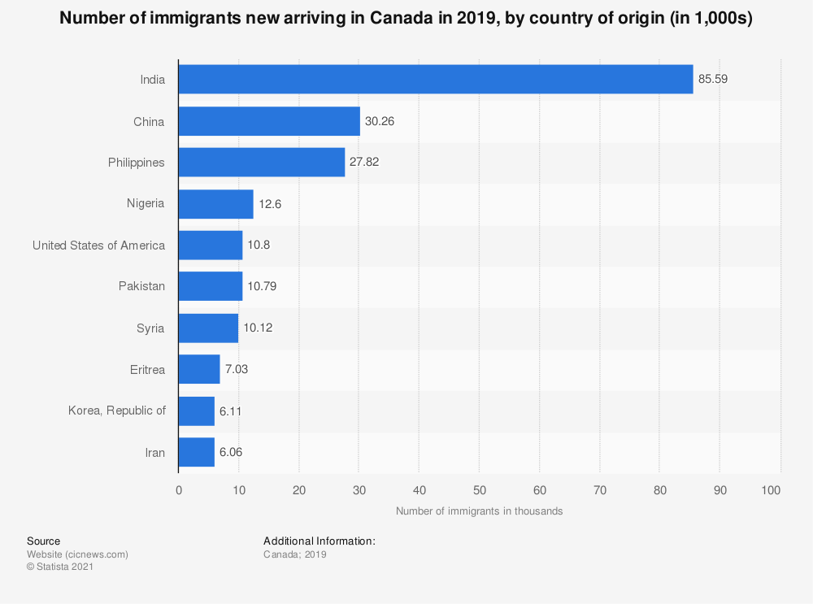
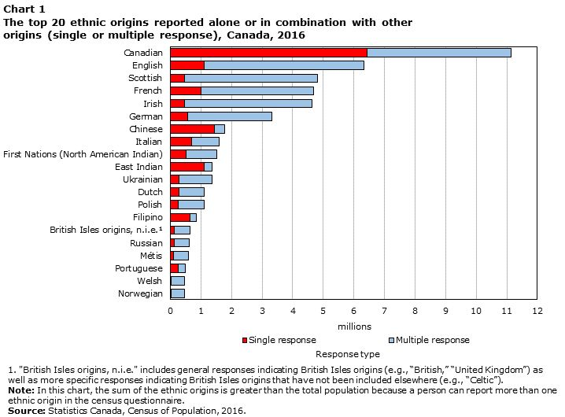
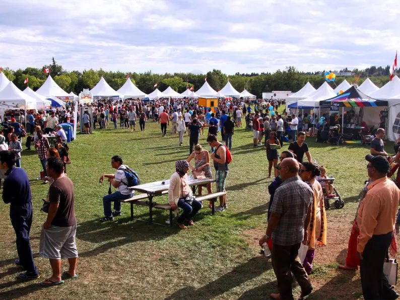

# 无标题

**链接地址:** http://mp.weixin.qq.com/s?__biz=MzI4NDYyNjAwNw==&mid=2247485622&idx=1&sn=71a97d7d2b3387455dec8b8ba34865f4&chksm=ebf9d58edc8e5c98355908a1ab6663200c0a75e952a51f35daa207b2e19cc69fecb3d90320e0&mpshare=1&scene=2&srcid=0702VVfdd74xZgBT3e5T7ASN&sharer_sharetime=1656702968162&sharer_shareid=77848a6b3852ae4dcb6c74ffee84743c#rd
**作者:** 关注我们
**获取时间:** 2025/8/28 19:38:24
**图片数量:** 35

---

## 原始HTML内容

<section style="box-sizing: border-box;font-size: 16px;"><section style="box-sizing: border-box;" powered-by="xiumi.us"><section style="text-align: center;justify-content: center;margin: 10px 0%;display: flex;flex-flow: row nowrap;box-sizing: border-box;"><section style="display: inline-block;width: auto;vertical-align: top;background-color: rgb(255, 246, 232);flex: 100 100 0%;height: auto;padding-right: 22px;align-self: flex-start;margin-left: 17px;box-sizing: border-box;"><section style="box-sizing: border-box;" powered-by="xiumi.us"><section style="display: flex;flex-flow: row nowrap;margin-right: 0%;margin-left: 0%;text-align: left;justify-content: flex-start;box-sizing: border-box;"><section style="display: inline-block;vertical-align: middle;width: auto;flex: 0 0 0%;height: auto;align-self: center;line-height: 0;border-width: 0px;box-sizing: border-box;"><section style="text-align: center;justify-content: center;transform: translate3d(-18px, 0px, 0px);margin-right: 0%;margin-left: 0%;box-sizing: border-box;" powered-by="xiumi.us"><section style="display: inline-block;width: 38px;height: 38px;vertical-align: top;overflow: hidden;background-color: rgb(237, 128, 15);box-sizing: border-box;"><section style="margin-top: 17px;margin-right: 0%;margin-left: 0%;box-sizing: border-box;" powered-by="xiumi.us"><section style="color: rgb(255, 255, 255);line-height: 0.1;font-size: 17px;box-sizing: border-box;">
 
</section></section></section></section></section><section style="display: inline-block;vertical-align: middle;width: auto;flex: 0 0 auto;align-self: center;min-width: 10%;max-width: 100%;height: auto;box-sizing: border-box;"><section style="margin-top: 18px;margin-right: 0%;margin-left: 0%;text-align: center;justify-content: center;box-sizing: border-box;" powered-by="xiumi.us"><section style="color: rgb(237, 128, 15);font-size: 14px;line-height: 1.2;box-sizing: border-box;">
<strong style="box-sizing: border-box;">点击蓝字 关注我们</strong>
</section></section><section style="margin-right: 0%;margin-bottom: 9px;margin-left: 0%;text-align: center;justify-content: center;box-sizing: border-box;" powered-by="xiumi.us"><section style="font-size: 12px;color: rgb(236, 215, 182);text-align: left;line-height: 1;box-sizing: border-box;">
 
</section></section></section></section></section></section></section></section><section style="box-sizing: border-box;" powered-by="xiumi.us">
 
</section><section style="text-align: center;margin-top: 10px;margin-right: 0%;margin-left: 0%;box-sizing: border-box;" powered-by="xiumi.us"><section style="display: inline-block;width: 86%;height: 33px;vertical-align: top;overflow: hidden;background-color: rgb(255, 246, 232);box-sizing: border-box;"><section><svg viewBox="0 0 1 1" style="float:left;line-height:0;width:0;vertical-align:top;"></svg></section></section></section><section style="text-align: center;margin: 6px 0%;box-sizing: border-box;" powered-by="xiumi.us"><section style="max-width: 100%;vertical-align: middle;display: inline-block;line-height: 0;box-sizing: border-box;"></section></section><section style="margin-right: 0%;margin-bottom: 10px;margin-left: 0%;text-align: center;justify-content: center;box-sizing: border-box;" powered-by="xiumi.us"><section style="display: inline-block;width: 86%;vertical-align: top;background-color: rgba(255, 211, 143, 0.12);padding: 30px;height: auto;box-sizing: border-box;"><section style="box-sizing: border-box;" powered-by="xiumi.us"><section style="color: rgb(129, 105, 68);text-align: justify;box-sizing: border-box;">
这几天，BadaB Counsulting在朋友圈看到了一位在加拿大工作的华人员工的<strong style="box-sizing: border-box;">吐槽</strong>：
</section></section></section></section><section style="box-sizing: border-box;" powered-by="xiumi.us">
 
</section><section style="box-sizing: border-box;" powered-by="xiumi.us"><section style="display: inline-block;vertical-align: top;width: 20%;box-sizing: border-box;"><section style="font-size: 21px;text-align: left;box-sizing: border-box;" powered-by="xiumi.us"><section style="box-sizing: border-box;margin: auto;width: 3em;height: 3em;vertical-align: top;background-position: center center;background-repeat: no-repeat;background-size: cover;display: inline-block;background-image: url(&quot;https://mmbiz.qpic.cn/mmbiz_jpg/cY0qSDjdkFfR54b4tnUeyKjdOciaNIDFDXDoInBrKkkdELtmq8qVVp4GEt7oPJu6acd2QcKQHaibdeWR9l7w31uA/640?wx_fmt=jpeg&quot;);"><section style="height: 100%;overflow: hidden;line-height: 0;vertical-align: middle;max-width: 100%;box-sizing: border-box;"></section></section></section></section><section style="display: inline-block;vertical-align: top;width: 80%;padding-right: 10px;padding-left: 10px;line-height: 2;box-sizing: border-box;"><section style="color: rgb(94, 126, 163);box-sizing: border-box;" powered-by="xiumi.us">
<strong style="box-sizing: border-box;">小L</strong>
</section><section style="font-size: 15px;box-sizing: border-box;" powered-by="xiumi.us">
气死我了！印度老板除夕不放假就算了，还给我安排好多任务，害我加班到晚上7点多，差点错过和家人吃年夜饭！怎么会有这么没有“人情味儿”的老板，印度人都不过年的吗？

 
</section><section style="text-align: left;margin-top: 10px;margin-bottom: 10px;box-sizing: border-box;" powered-by="xiumi.us"><section style="max-width: 100%;vertical-align: middle;display: inline-block;line-height: 0;width: 61%;border-width: 0px;box-sizing: border-box;"></section></section><section style="box-sizing: border-box;" powered-by="xiumi.us"><section style="display: inline-block;vertical-align: top;width: 89%;box-sizing: border-box;"><section style="margin-right: 0%;margin-left: 0%;box-sizing: border-box;" powered-by="xiumi.us"><section style="color: rgb(157, 164, 176);box-sizing: border-box;">
26分钟前
</section></section></section><section style="display: inline-block;vertical-align: top;width: 11%;box-sizing: border-box;"><section style="text-align: right;margin-top: -6px;margin-right: 0%;margin-left: 0%;box-sizing: border-box;" powered-by="xiumi.us"><section style="width: 85%;display: inline-block;vertical-align: middle;line-height: 0;box-sizing: border-box;"></section></section></section></section><section style="display: inline-block;width: 100%;vertical-align: top;box-sizing: border-box;" powered-by="xiumi.us"><section style="margin-right: 0%;margin-bottom: -2px;margin-left: 0%;text-align: left;line-height: 0.8;transform: translate3d(18px, 0px, 0px);font-size: 14px;box-sizing: border-box;" powered-by="xiumi.us"><section style="width: 0px;display: inline-block;border-bottom: 0.8em solid rgb(239, 239, 247);border-left: 0.7em solid transparent !important;border-right: 0.7em solid transparent !important;box-sizing: border-box;"><section><svg viewBox="0 0 1 1" style="float:left;line-height:0;width:0;vertical-align:top;"></svg></section></section></section><section style="margin-right: 0%;margin-left: 0%;box-sizing: border-box;" powered-by="xiumi.us"><section style="display: inline-block;width: 100%;border-width: 1px;border-style: solid;border-color: transparent;padding: 2px 5px;background-color: rgb(239, 239, 247);box-sizing: border-box;"><section style="margin-top: 0.5em;margin-bottom: 0.5em;box-sizing: border-box;" powered-by="xiumi.us"><section style="float: left;text-align: right;width: 11%;padding-right: 5px;line-height: 1.6;box-sizing: border-box;"><section style="margin-top: -6px;margin-right: 0%;margin-left: 0%;text-align: center;box-sizing: border-box;" powered-by="xiumi.us"><section style="width: 69%;display: inline-block;vertical-align: middle;line-height: 0;box-sizing: border-box;"></section></section></section><section style="margin-right: 0%;margin-left: 0%;box-sizing: border-box;" powered-by="xiumi.us"><section style="line-height: 1.6;color: rgb(114, 150, 188);box-sizing: border-box;">
kaki，Mandy，罗iii…
</section></section><section style="clear: both;box-sizing: border-box;"><section><svg viewBox="0 0 1 1" style="float:left;line-height:0;width:0;vertical-align:top;"></svg></section></section></section></section></section></section></section></section><section style="box-sizing: border-box;" powered-by="xiumi.us">
 
</section><section style="box-sizing: border-box;" powered-by="xiumi.us">
 
</section><section style="margin-right: 0%;margin-bottom: 10px;margin-left: 0%;text-align: center;justify-content: center;box-sizing: border-box;" powered-by="xiumi.us"><section style="display: inline-block;width: 86%;vertical-align: top;background-color: rgba(255, 211, 143, 0.12);padding: 30px;height: auto;box-sizing: border-box;"><section style="box-sizing: border-box;" powered-by="xiumi.us"><section style="color: rgb(129, 105, 68);text-align: justify;box-sizing: border-box;">
这条Post引起了朋友们的争议：

 

一部分人认为这位老板没有体谅到华人员工的文化习俗，也没有展示出对多元文化和员工的尊重，这种<strong style="box-sizing: border-box;">做法确实欠妥</strong>；

 

而一部分人认为除夕不是加拿大的法定节假日，即使华人员工也不应在这天拥有“免加班”的特权，这种<strong style="box-sizing: border-box;">做法无可厚非</strong>。

 

那么，同样作为在北美职场打拼的华人朋友们，你们怎么看待这场<strong style="box-sizing: border-box;">由“多元文化”引发的争议</strong>呢？

 
</section></section><section style="margin-top: 10px;margin-bottom: 10px;box-sizing: border-box;" powered-by="xiumi.us"><section style="max-width: 100%;vertical-align: middle;display: inline-block;line-height: 0;box-sizing: border-box;"></section></section><section style="box-sizing: border-box;" powered-by="xiumi.us"><section style="color: rgb(129, 105, 68);text-align: justify;box-sizing: border-box;">
 

在急着下结论之前，我们不妨来思考一下小L同学在吐槽中提到的最后一个问题：<strong style="box-sizing: border-box;">“印度人都不过年的吗？”</strong> 

 

对啊，我们在加拿大生活这么多年，身边一同工作的印度同事和同学数量不少，但我们对他们的文化习俗到底又了解多少呢？<strong style="box-sizing: border-box;">印度的新年到底是在啥时候</strong>？
</section></section></section></section><section style="box-sizing: border-box;" powered-by="xiumi.us">
 
</section><section style="transform: scale(0.85);-webkit-transform: scale(0.85);-moz-transform: scale(0.85);-o-transform: scale(0.85);transform-origin: center center;-webkit-transform-origin: center center;-moz-transform-origin: center center;-o-transform-origin: center center;margin-top: -61px;margin-bottom: -61px;box-sizing: border-box;" powered-by="xiumi.us"><section style="margin: 10px 0%;box-sizing: border-box;"><section style="display: inline-block;width: 100%;vertical-align: top;padding: 10px;border-width: 0px;background-position: 50% 50%;background-repeat: no-repeat;background-size: cover;background-attachment: scroll;box-shadow: rgb(0, 0, 0) 0px 0px 0px;background-image: url(&quot;https://mmbiz.qpic.cn/mmbiz_jpg/cY0qSDjdkFfR54b4tnUeyKjdOciaNIDFDqSV6iaoHtbkxlpzXIPUTQUXFzgYGe8VtOiczjdFBXpUZvf81t1ME1PSg/640?wx_fmt=jpeg&quot;);box-sizing: border-box;"><section style="text-align: center;font-size: 2px;margin-top: 10px;margin-right: 0%;margin-left: 0%;box-sizing: border-box;" powered-by="xiumi.us"><section style="display: inline-block;width: 36px;height: 18px;vertical-align: top;overflow: hidden;line-height: 0;box-sizing: border-box;"><section style="margin-top: 2px;margin-right: 0%;margin-left: 0%;box-sizing: border-box;" powered-by="xiumi.us"><section style="max-width: 100%;vertical-align: middle;display: inline-block;line-height: 0;width: 100%;box-sizing: border-box;"></section></section></section></section><section style="text-align: center;margin-right: 0%;margin-bottom: 20px;margin-left: 0%;box-sizing: border-box;" powered-by="xiumi.us"><section style="display: inline-block;min-width: 10%;max-width: 100%;vertical-align: top;box-sizing: border-box;"><section style="margin-right: 0%;margin-left: 0%;box-sizing: border-box;" powered-by="xiumi.us"><section style="background-image: linear-gradient(90deg, rgba(201, 156, 107, 0) 0%, rgb(201, 156, 107) 40%, rgb(201, 156, 107) 60%, rgba(201, 156, 107, 0) 100%);height: 1px;box-sizing: border-box;"><section><svg viewBox="0 0 1 1" style="float:left;line-height:0;width:0;vertical-align:top;"></svg></section></section></section><section style="margin-top: 7px;margin-right: 0%;margin-left: 0%;box-sizing: border-box;" powered-by="xiumi.us"><section style="font-size: 17px;color: rgb(129, 105, 68);line-height: 1;letter-spacing: 3px;padding-right: 25px;padding-left: 25px;box-sizing: border-box;">
<strong style="box-sizing: border-box;">印度排灯节</strong>
</section></section><section style="margin-right: 0%;margin-bottom: 3px;margin-left: 0%;font-size: 13px;box-sizing: border-box;" powered-by="xiumi.us"><section style="font-size: 10px;color: rgb(201, 156, 107);box-sizing: border-box;">
<em style="box-sizing: border-box;">Diwali</em>
</section></section><section style="margin-right: 0%;margin-left: 0%;box-sizing: border-box;" powered-by="xiumi.us"><section style="background-image: linear-gradient(90deg, rgba(201, 156, 107, 0) 0%, rgb(201, 156, 107) 40%, rgb(201, 156, 107) 60%, rgba(201, 156, 107, 0) 100%);height: 1px;box-sizing: border-box;"><section><svg viewBox="0 0 1 1" style="float:left;line-height:0;width:0;vertical-align:top;"></svg></section></section></section></section></section><section style="display: inline-block;width: 100%;vertical-align: top;border-width: 1px;border-style: solid;border-color: rgb(201, 156, 107);line-height: 0;background-color: rgba(243, 229, 207, 0.62);box-sizing: border-box;" powered-by="xiumi.us"><section style="margin-right: 0%;margin-left: 0%;box-sizing: border-box;" powered-by="xiumi.us"><section style="display: inline-block;vertical-align: top;width: 50%;box-sizing: border-box;"><section style="text-align: left;transform: translate3d(-1px, 0px, 0px);margin-top: -1px;margin-right: 0%;margin-left: 0%;box-sizing: border-box;" powered-by="xiumi.us"><section style="display: inline-block;width: 10px;height: 10px;vertical-align: top;overflow: hidden;line-height: 0;box-sizing: border-box;"><section style="text-align: center;margin-right: 0%;margin-left: 0%;box-sizing: border-box;" powered-by="xiumi.us"><section style="max-width: 100%;vertical-align: middle;display: inline-block;line-height: 0;box-sizing: border-box;"></section></section></section></section></section><section style="display: inline-block;vertical-align: top;width: 50%;border-width: 0px;box-sizing: border-box;"><section style="text-align: right;transform: translate3d(1px, 0px, 0px);margin-top: -1px;margin-right: 0%;margin-left: 0%;box-sizing: border-box;" powered-by="xiumi.us"><section style="display: inline-block;width: 10px;height: 10px;vertical-align: top;overflow: hidden;border-width: 0px;line-height: 0;box-sizing: border-box;"><section style="text-align: center;margin-right: 0%;margin-left: 0%;box-sizing: border-box;" powered-by="xiumi.us"><section style="max-width: 100%;vertical-align: middle;display: inline-block;line-height: 0;box-sizing: border-box;"></section></section></section></section></section></section><section style="display: inline-block;width: 100%;vertical-align: top;box-sizing: border-box;" powered-by="xiumi.us"><section style="text-align: center;margin-top: 10px;margin-bottom: 10px;box-sizing: border-box;" powered-by="xiumi.us"><section style="max-width: 100%;vertical-align: middle;display: inline-block;line-height: 0;width: 90%;height: auto;box-sizing: border-box;"></section></section><section style="margin: 7px 0%;box-sizing: border-box;" powered-by="xiumi.us"><section style="color: rgb(168, 123, 69);padding-right: 20px;padding-left: 20px;line-height: 1.6;font-size: 14px;box-sizing: border-box;">
 

排灯节（Diwali）是<strong style="box-sizing: border-box;">印度教传统文化中最重要的节日</strong>，也是<strong style="box-sizing: border-box;">印度历的新年</strong>。这个节日有各种不同的译名，比如光明节、斩妖节等等。在这个节日中，人们会点起油灯与蜡烛祈福，并且像华人庆祝春节一样张灯结彩、通宵燃放焰火，让灯光和烟火照亮黑暗的夜晚。排灯节在<strong style="box-sizing: border-box;">每年公历10月举行</strong>，于印度历七月后半月的第十三天开始，<strong style="box-sizing: border-box;">持续五天时间</strong>。

 
</section></section><section style="text-align: center;margin-top: 10px;margin-bottom: 10px;box-sizing: border-box;" powered-by="xiumi.us"><section style="max-width: 100%;vertical-align: middle;display: inline-block;line-height: 0;width: 90%;height: auto;box-sizing: border-box;"></section></section></section><section style="margin-right: 0%;margin-left: 0%;transform: rotateX(180deg);box-sizing: border-box;" powered-by="xiumi.us"><section style="display: inline-block;vertical-align: top;width: 50%;box-sizing: border-box;"><section style="text-align: left;transform: translate3d(-1px, 0px, 0px);margin-top: -1px;margin-right: 0%;margin-left: 0%;box-sizing: border-box;" powered-by="xiumi.us"><section style="display: inline-block;width: 10px;height: 10px;vertical-align: top;overflow: hidden;line-height: 0;box-sizing: border-box;"><section style="text-align: center;margin-right: 0%;margin-left: 0%;box-sizing: border-box;" powered-by="xiumi.us"><section style="max-width: 100%;vertical-align: middle;display: inline-block;line-height: 0;box-sizing: border-box;"></section></section></section></section></section><section style="display: inline-block;vertical-align: top;width: 50%;border-width: 0px;box-sizing: border-box;"><section style="text-align: right;transform: translate3d(1px, 0px, 0px);margin-top: -1px;margin-right: 0%;margin-left: 0%;box-sizing: border-box;" powered-by="xiumi.us"><section style="display: inline-block;width: 10px;height: 10px;vertical-align: top;overflow: hidden;border-width: 0px;line-height: 0;box-sizing: border-box;"><section style="text-align: center;margin-right: 0%;margin-left: 0%;box-sizing: border-box;" powered-by="xiumi.us"><section style="max-width: 100%;vertical-align: middle;display: inline-block;line-height: 0;box-sizing: border-box;"></section></section></section></section></section></section></section></section></section></section><section style="box-sizing: border-box;" powered-by="xiumi.us">
 
</section><section style="margin-right: 0%;margin-bottom: 10px;margin-left: 0%;text-align: center;justify-content: center;box-sizing: border-box;" powered-by="xiumi.us"><section style="display: inline-block;width: 86%;vertical-align: top;background-color: rgba(255, 211, 143, 0.12);padding: 30px;height: auto;box-sizing: border-box;"><section style="box-sizing: border-box;" powered-by="xiumi.us"><section style="color: rgb(129, 105, 68);text-align: justify;box-sizing: border-box;">
众所周知，加拿大是世界上<strong style="box-sizing: border-box;">最欢迎接纳移民的国家</strong>之一。根据加拿大统计局的数字显示，2019年，加拿大接纳了约8.5万名印度移民。<strong style="box-sizing: border-box;">印度长期位居加拿大移民来源国排行榜榜首</strong>。

 
</section></section><section style="margin-top: 10px;margin-bottom: 10px;box-sizing: border-box;" powered-by="xiumi.us"><section style="max-width: 100%;vertical-align: middle;display: inline-block;line-height: 0;box-sizing: border-box;"></section></section><section style="text-align: justify;font-size: 12px;color: rgb(180, 180, 180);box-sizing: border-box;" powered-by="xiumi.us">
图表来源：

https://www.statista.com/statistics/1171597/new-immigrants-canada-country
</section><section style="box-sizing: border-box;" powered-by="xiumi.us"><section style="color: rgb(129, 105, 68);text-align: justify;box-sizing: border-box;">
 

而位居第二的中国，只在2019年向加拿大输送了约3万名中国移民，<strong style="box-sizing: border-box;">数量远低于印度</strong>。也就是说在我们的工作生活中，<strong style="box-sizing: border-box;">遇到印度同事或同学的概率甚至是大于遇到中国同事或同学的概率</strong>的。

 

但是，如果你没有特别亲密的印度朋友，你可能会惊奇地发现，自己对<strong style="box-sizing: border-box;">印度的文化习俗和节日特色知之甚少</strong>。
</section></section></section></section><section style="box-sizing: border-box;" powered-by="xiumi.us">
 
</section><section style="margin: 10px 0%;box-sizing: border-box;" powered-by="xiumi.us"><section style="display: inline-block;vertical-align: top;width: 50%;box-sizing: border-box;"><section style="text-align: center;margin-right: 0%;margin-left: 0%;justify-content: center;box-sizing: border-box;" powered-by="xiumi.us"><section style="max-width: 100%;vertical-align: middle;display: inline-block;line-height: 0;width: 86%;height: auto;box-sizing: border-box;"></section></section><section style="text-align: center;font-size: 14px;box-sizing: border-box;" powered-by="xiumi.us">
<strong style="box-sizing: border-box;">蒙古族</strong><strong style="box-sizing: border-box;">摔跤</strong>
</section><section style="box-sizing: border-box;" powered-by="xiumi.us">
 
</section><section style="text-align: center;margin-right: 0%;margin-left: 0%;justify-content: center;box-sizing: border-box;" powered-by="xiumi.us"><section style="max-width: 100%;vertical-align: middle;display: inline-block;line-height: 0;width: 86%;height: auto;box-sizing: border-box;"></section></section><section style="text-align: center;font-size: 12px;box-sizing: border-box;" powered-by="xiumi.us">
<strong style="box-sizing: border-box;">朝鲜族婚俗</strong>
</section><section style="box-sizing: border-box;" powered-by="xiumi.us">
 
</section></section><section style="display: inline-block;vertical-align: top;width: 50%;box-sizing: border-box;"><section style="box-sizing: border-box;" powered-by="xiumi.us">
 
</section><section style="box-sizing: border-box;" powered-by="xiumi.us">
 
</section><section style="text-align: center;margin-right: 0%;margin-left: 0%;justify-content: center;box-sizing: border-box;" powered-by="xiumi.us"><section style="max-width: 100%;vertical-align: middle;display: inline-block;line-height: 0;width: 86%;height: auto;box-sizing: border-box;"></section></section><section style="text-align: center;font-size: 12px;box-sizing: border-box;" powered-by="xiumi.us">
<strong style="box-sizing: border-box;">傣族泼水节</strong>
</section><section style="box-sizing: border-box;" powered-by="xiumi.us">
 
</section><section style="text-align: center;margin-right: 0%;margin-left: 0%;justify-content: center;box-sizing: border-box;" powered-by="xiumi.us"><section style="max-width: 100%;vertical-align: middle;display: inline-block;line-height: 0;width: 86%;height: auto;box-sizing: border-box;"></section></section><section style="text-align: center;font-size: 12px;box-sizing: border-box;" powered-by="xiumi.us">
<strong style="box-sizing: border-box;">藏族祭祀舞蹈</strong>
</section><section style="box-sizing: border-box;" powered-by="xiumi.us">
 
</section></section></section><section style="margin-right: 0%;margin-bottom: 10px;margin-left: 0%;text-align: center;justify-content: center;box-sizing: border-box;" powered-by="xiumi.us"><section style="display: inline-block;width: 86%;vertical-align: top;background-color: rgba(255, 211, 143, 0.12);padding: 30px;height: auto;box-sizing: border-box;"><section style="box-sizing: border-box;" powered-by="xiumi.us"><section style="color: rgb(129, 105, 68);text-align: justify;box-sizing: border-box;">
因为我们大部分在国内长大的朋友，除非生长在少数民族聚集的区域，几乎接受的都是以<strong style="box-sizing: border-box;">汉族大一统</strong>文化思想作为主体的教育体系。

 

这样的教育模式增强了我们的民族自豪感和文化自信心，但也让拥有主流文化背景的我们形成了一种<strong style="box-sizing: border-box;">对其他族裔文化缺乏了解和参与的状态</strong>。
</section></section></section></section><section style="box-sizing: border-box;" powered-by="xiumi.us">
 
</section><section style="text-align: center;margin-top: 10px;margin-bottom: 10px;box-sizing: border-box;" powered-by="xiumi.us"><section style="max-width: 100%;vertical-align: middle;display: inline-block;line-height: 0;width: 90%;height: auto;box-sizing: border-box;"></section></section><section style="font-size: 12px;color: rgb(180, 180, 180);padding-right: 20px;padding-left: 20px;box-sizing: border-box;" powered-by="xiumi.us">
图表来源：

https://www12.statcan.gc.ca/census-recensement/2016/as-sa/98-200-x/2016016/98-200-x2016016-eng.cfm
</section><section style="box-sizing: border-box;" powered-by="xiumi.us">
 
</section><section style="margin-right: 0%;margin-bottom: 10px;margin-left: 0%;text-align: center;justify-content: center;box-sizing: border-box;" powered-by="xiumi.us"><section style="display: inline-block;width: 86%;vertical-align: top;background-color: rgba(255, 211, 143, 0.12);padding: 30px;height: auto;box-sizing: border-box;"><section style="box-sizing: border-box;" powered-by="xiumi.us"><section style="color: rgb(129, 105, 68);text-align: justify;box-sizing: border-box;">
而加拿大作为一个除本国主流文化及族群之外，其他文化族群<strong style="box-sizing: border-box;">占比超过40%</strong>的国家，对于多元文化的认同和接纳程度相当之高。

 

每年7月底到8月初，阿省都会举办声势浩大的以庆祝世界多元文化为主题的<strong style="box-sizing: border-box;">Heritage Festival（民俗文化节）</strong>。在为期三天的活动中，来自世界各地的加拿大移民们会组织各类表演活动去自豪地宣扬本民族或国家的文化特色。
</section></section></section></section><section style="box-sizing: border-box;" powered-by="xiumi.us">
 
</section><section style="margin: 10px 0%;box-sizing: border-box;" powered-by="xiumi.us"><section style="text-align: center;font-size: 18px;color: rgb(218, 87, 12);text-shadow: rgb(255, 211, 171) 0px 1.8px, rgb(255, 211, 171) 1.3px 1.3px, rgb(255, 211, 171) 1.8px 0px, rgb(255, 211, 171) 1.3px -1.3px, rgb(255, 211, 171) 0px -1.8px, rgb(255, 211, 171) -1.3px -1.3px, rgb(255, 211, 171) -1.8px 0px, rgb(255, 211, 171) -1.3px 1.3px;letter-spacing: 3px;line-height: 1.8;box-sizing: border-box;">
<strong style="box-sizing: border-box;">Heritage Festival</strong>
</section></section><section style="margin: 10px 0%;box-sizing: border-box;" powered-by="xiumi.us"><section style="display: inline-block;width: 100%;vertical-align: top;border-width: 1px;border-style: solid;border-color: rgba(116, 159, 238, 0.1);box-sizing: border-box;"><section style="box-sizing: border-box;" powered-by="xiumi.us"><section style="display: flex;flex-flow: row nowrap;margin: 20px 0%;box-sizing: border-box;"><section style="display: inline-block;vertical-align: top;width: auto;flex: 100 100 0%;align-self: stretch;height: auto;padding-right: 10px;padding-left: 10px;border-width: 0px;box-sizing: border-box;"><section style="text-align: center;margin: -10px 0%;box-sizing: border-box;" powered-by="xiumi.us"><section style="max-width: 100%;vertical-align: middle;display: inline-block;line-height: 0;border-width: 0px;border-radius: 5px;border-style: none;border-color: rgb(62, 62, 62);overflow: hidden;box-sizing: border-box;"></section></section></section><section style="display: inline-block;vertical-align: top;width: auto;align-self: stretch;flex: 100 100 0%;border-left: 1px solid rgba(116, 159, 238, 0.1);border-bottom-left-radius: 0px;padding-right: 10px;padding-left: 10px;box-sizing: border-box;"><section style="text-align: center;margin: -10px 0%;box-sizing: border-box;" powered-by="xiumi.us"><section style="max-width: 100%;vertical-align: middle;display: inline-block;line-height: 0;border-width: 0px;border-radius: 5px;border-style: none;border-color: rgb(62, 62, 62);overflow: hidden;box-sizing: border-box;"></section></section></section></section></section><section style="box-sizing: border-box;" powered-by="xiumi.us"><section style="display: flex;flex-flow: row nowrap;box-sizing: border-box;"><section style="display: inline-block;vertical-align: top;width: auto;flex: 100 100 0%;align-self: flex-start;height: auto;padding-right: 20px;padding-left: 20px;box-sizing: border-box;"><section style="margin-right: 0%;margin-left: 0%;box-sizing: border-box;" powered-by="xiumi.us"><section style="background-color: rgba(116, 159, 238, 0.1);height: 1px;box-sizing: border-box;"><section><svg viewBox="0 0 1 1" style="float:left;line-height:0;width:0;vertical-align:top;"></svg></section></section></section></section><section style="display: inline-block;vertical-align: top;width: auto;align-self: flex-start;flex: 100 100 0%;padding-right: 20px;padding-left: 20px;box-sizing: border-box;"><section style="margin-right: 0%;margin-left: 0%;box-sizing: border-box;" powered-by="xiumi.us"><section style="background-color: rgba(116, 159, 238, 0.1);height: 1px;box-sizing: border-box;"><section><svg viewBox="0 0 1 1" style="float:left;line-height:0;width:0;vertical-align:top;"></svg></section></section></section></section></section></section><section style="box-sizing: border-box;" powered-by="xiumi.us"><section style="display: flex;flex-flow: row nowrap;margin: 20px 0%;box-sizing: border-box;"><section style="display: inline-block;vertical-align: top;width: auto;flex: 100 100 0%;align-self: stretch;height: auto;padding-right: 10px;padding-left: 10px;border-width: 0px;box-sizing: border-box;"><section style="text-align: center;margin: -10px 0%;box-sizing: border-box;" powered-by="xiumi.us"><section style="max-width: 100%;vertical-align: middle;display: inline-block;line-height: 0;border-width: 0px;border-radius: 5px;border-style: none;border-color: rgb(62, 62, 62);overflow: hidden;box-sizing: border-box;"></section></section></section><section style="display: inline-block;vertical-align: top;width: auto;align-self: stretch;flex: 100 100 0%;border-left: 1px solid rgba(116, 159, 238, 0.1);border-bottom-left-radius: 0px;padding-right: 10px;padding-left: 10px;box-sizing: border-box;"><section style="text-align: center;margin: -10px 0%;box-sizing: border-box;" powered-by="xiumi.us"><section style="max-width: 100%;vertical-align: middle;display: inline-block;line-height: 0;border-width: 0px;border-radius: 5px;border-style: none;border-color: rgb(62, 62, 62);overflow: hidden;box-sizing: border-box;"></section></section></section></section></section></section></section><section style="font-size: 12px;color: rgb(180, 180, 180);padding-right: 20px;padding-left: 20px;box-sizing: border-box;" powered-by="xiumi.us">
图片来源：

https://en.wikipedia.org/wiki/Edmonton_Heritage_Festival
</section><section style="box-sizing: border-box;" powered-by="xiumi.us">
 
</section><section style="margin-right: 0%;margin-bottom: 10px;margin-left: 0%;text-align: center;justify-content: center;box-sizing: border-box;" powered-by="xiumi.us"><section style="display: inline-block;width: 86%;vertical-align: top;background-color: rgba(255, 211, 143, 0.12);padding: 30px;height: auto;box-sizing: border-box;"><section style="box-sizing: border-box;" powered-by="xiumi.us"><section style="color: rgb(129, 105, 68);text-align: justify;box-sizing: border-box;">
然而，我们所接受的学校教育或日常生活的实践，很少对我们应该如何和各个种族、文化和宗教等背景的人群进行融洽沟通进行正确的指导，也<strong style="box-sizing: border-box;">给我们的职场交流造成了一些“小困扰”</strong>。 

 

你可能根本无法准确说出你上司来自的国家和ta信仰的宗教，也一直读错所接待客户的以Y开头的复杂姓氏，甚至会给根本不过圣诞节的同事送去在他们文化中完全禁忌的圣诞礼物。而这些你或许<strong style="box-sizing: border-box;">意识不到的“错误”</strong>，却在<strong style="box-sizing: border-box;">暗地中影响着你的职场表现和晋升道路</strong>。

 

这也成为许多华人朋友们感到<strong style="box-sizing: border-box;">难以融入职场环境的一大因素</strong>。因为，他们只想要融入加拿大所谓的主流职场文化，却<strong style="box-sizing: border-box;">选择性忽略了</strong><strong style="box-sizing: border-box;">占据了超过40%劳动力市场的多元文化</strong>。

 

那么，我们要怎么提高职场中的<strong style="box-sizing: border-box;">“多元文化情商”</strong>，去减少那些不必要的尴尬和误会呢？
</section></section></section></section><section style="box-sizing: border-box;" powered-by="xiumi.us">
 
</section><section style="box-sizing: border-box;" powered-by="xiumi.us"><section style="display: flex;flex-flow: row nowrap;margin: 10px 0% 20px;box-sizing: border-box;"><section style="display: inline-block;width: auto;vertical-align: top;background-color: rgba(255, 255, 255, 0);border-style: solid;border-width: 1px;border-color: rgb(221, 183, 124);box-shadow: rgba(255, 211, 143, 0.12) 8px 8px 0px;flex: 100 100 0%;align-self: flex-start;height: auto;margin-right: 10px;margin-left: 12px;box-sizing: border-box;"><section style="margin: 20px 0% 10px;text-align: left;justify-content: flex-start;transform: translate3d(-13px, 0px, 0px);-webkit-transform: translate3d(-13px, 0px, 0px);-moz-transform: translate3d(-13px, 0px, 0px);-o-transform: translate3d(-13px, 0px, 0px);box-sizing: border-box;" powered-by="xiumi.us"><section style="display: inline-block;width: auto;vertical-align: top;box-shadow: rgb(0, 0, 0) 0px 0px 0px;background-color: rgb(236, 143, 30);padding-right: 21px;padding-left: 21px;min-width: 10%;max-width: 100%;height: auto;box-sizing: border-box;"><section style="margin: 14px 0% 1px;text-align: center;justify-content: center;box-sizing: border-box;" powered-by="xiumi.us"><section style="color: rgb(255, 246, 232);box-sizing: border-box;">
<strong style="box-sizing: border-box;">1.&nbsp;对他人的文化习俗表示尊重，多加了解</strong>
</section></section><section style="margin-right: 0%;margin-bottom: 9px;margin-left: 0%;opacity: 0.35;text-align: center;justify-content: center;box-sizing: border-box;" powered-by="xiumi.us"><section style="font-size: 12px;color: rgb(255, 246, 232);text-align: left;line-height: 1;box-sizing: border-box;">
 
</section></section></section></section><section style="margin: 18px 0% 25px;box-sizing: border-box;" powered-by="xiumi.us"><section style="color: rgb(129, 105, 68);padding-right: 25px;padding-left: 25px;font-size: 14px;box-sizing: border-box;">
首先，尊重是互相的。想要你的同事尊重你的文化背景，你也要对他们的文化背景<strong style="box-sizing: border-box;">有意识地</strong>加以了解及尊重。每逢重大的民族节日或纪念日，<strong style="box-sizing: border-box;">社交媒体上各类的宣传</strong>可以稍加留意。在此时为你的同事们送去一句简单的节日祝福，都可以让你的<strong style="box-sizing: border-box;">形象在他们心中获得加分</strong>。 

 

这里，我们列举几个重要的国际和加拿大会举办的<strong style="box-sizing: border-box;">多元文化节日或纪念日</strong>，欢迎参照下方列表进行更多了解：
</section></section><section style="margin: 18px 0% 25px;box-sizing: border-box;" powered-by="xiumi.us"><section style="color: rgb(129, 105, 68);padding-right: 25px;padding-left: 25px;font-size: 12px;line-height: 1;box-sizing: border-box;">
January 11 

<strong style="box-sizing: border-box;">Sir John A. Macdonald Day</strong>

 

February

<strong style="box-sizing: border-box;">Black History Month （进行中）</strong>
</section></section><section style="text-align: center;margin-top: 10px;margin-bottom: 10px;box-sizing: border-box;" powered-by="xiumi.us"><section style="max-width: 100%;vertical-align: middle;display: inline-block;line-height: 0;width: 90%;height: auto;box-sizing: border-box;"></section></section><section style="margin: 18px 0% 25px;box-sizing: border-box;" powered-by="xiumi.us"><section style="color: rgb(129, 105, 68);padding-right: 25px;padding-left: 25px;font-size: 14px;line-height: 1;box-sizing: border-box;">
 

February 15

<strong style="box-sizing: border-box;">National Flag of Canada Day&nbsp;</strong>

 

March

<strong style="box-sizing: border-box;">Irish Heritage Month</strong>

 

March 8

<strong style="box-sizing: border-box;">International Women's Day</strong>

 

March 21

<strong style="box-sizing: border-box;">International Day for the Elimination of Racial Discrimination</strong>

 

May

<strong style="box-sizing: border-box;">Asian Heritage Month</strong>

<strong style="box-sizing: border-box;">Canadian Jewish Heritage Month</strong>

 

May 5

<strong style="box-sizing: border-box;">Dutch Heritage Day</strong>

 

May 24

<strong style="box-sizing: border-box;">Victoria Day</strong>

 

June

<strong style="box-sizing: border-box;">National Indigenous History Month</strong>

<strong style="box-sizing: border-box;">Italian Heritage Month</strong>

<strong style="box-sizing: border-box;">Filipino Heritage Month</strong>

<strong style="box-sizing: border-box;">Portuguese Heritage Month</strong>

<strong style="box-sizing: border-box;">Launch of Pride Season</strong>

 

June 21

<strong style="box-sizing: border-box;">National Indigenous Peoples Day</strong>

 

June 24

<strong style="box-sizing: border-box;">Saint-Jean-Baptiste Day</strong>

 

June 27

<strong style="box-sizing: border-box;">Canadian Multiculturalism Day</strong>

 

July 1

<strong style="box-sizing: border-box;">Canada Day</strong>

 

August 15

<strong style="box-sizing: border-box;">National Acadian Day</strong>

 

September 30

<strong style="box-sizing: border-box;">National Day for Truth and Reconciliation</strong>

 

October

<strong style="box-sizing: border-box;">German Heritage Month</strong>

<strong style="box-sizing: border-box;">Canadian Islamic History Month</strong>

<strong style="box-sizing: border-box;">Latin American Heritage Month</strong>

<strong style="box-sizing: border-box;">Women's History Month</strong>

 

November 11

<strong style="box-sizing: border-box;">Remembrance Day</strong>

 

November 20 – 26

<strong style="box-sizing: border-box;">Canada History Week</strong>

 

December 3

<strong style="box-sizing: border-box;">International Day of Persons with Disabilities</strong>

 

 

完整列表请参考：

https://www.canada.ca/en/canadian-heritage/services/important-commemorative-days.html

 
</section></section></section></section></section><section style="box-sizing: border-box;" powered-by="xiumi.us"><section style="display: flex;flex-flow: row nowrap;margin: 10px 0% 20px;box-sizing: border-box;"><section style="display: inline-block;width: auto;vertical-align: top;background-color: rgba(255, 255, 255, 0);border-style: solid;border-width: 1px;border-color: rgb(221, 183, 124);box-shadow: rgba(255, 211, 143, 0.12) 8px 8px 0px;flex: 100 100 0%;align-self: flex-start;height: auto;margin-right: 10px;margin-left: 12px;box-sizing: border-box;"><section style="margin: 20px 0% 10px;text-align: left;justify-content: flex-start;transform: translate3d(-13px, 0px, 0px);-webkit-transform: translate3d(-13px, 0px, 0px);-moz-transform: translate3d(-13px, 0px, 0px);-o-transform: translate3d(-13px, 0px, 0px);box-sizing: border-box;" powered-by="xiumi.us"><section style="display: inline-block;width: auto;vertical-align: top;box-shadow: rgb(0, 0, 0) 0px 0px 0px;background-color: rgb(236, 143, 30);padding-right: 21px;padding-left: 21px;min-width: 10%;max-width: 100%;height: auto;box-sizing: border-box;"><section style="margin: 14px 0% 1px;text-align: center;justify-content: center;box-sizing: border-box;" powered-by="xiumi.us"><section style="color: rgb(255, 246, 232);box-sizing: border-box;">
<strong style="box-sizing: border-box;">2.&nbsp;积极参加公司组织的多元文化活动</strong>
</section></section><section style="margin-right: 0%;margin-bottom: 9px;margin-left: 0%;opacity: 0.35;text-align: center;justify-content: center;box-sizing: border-box;" powered-by="xiumi.us"><section style="font-size: 12px;color: rgb(255, 246, 232);text-align: left;line-height: 1;box-sizing: border-box;">
 
</section></section></section></section><section style="margin: 18px 0% 25px;box-sizing: border-box;" powered-by="xiumi.us"><section style="color: rgb(129, 105, 68);padding-right: 25px;padding-left: 25px;font-size: 14px;box-sizing: border-box;">
在加拿大的许多公司中，尤其是族裔组成比较复杂的企业，都会开展倡导<strong style="box-sizing: border-box;">文化多元或给多元族裔庆祝重大节日的活动</strong>。不要认为这些活动和自己没有关系而选择不予加入或敷衍了事。多了解一下其他族裔的文化对自己没有坏处。
</section></section><section style="text-align: center;margin-top: 10px;margin-bottom: 10px;box-sizing: border-box;" powered-by="xiumi.us"><section style="max-width: 100%;vertical-align: middle;display: inline-block;line-height: 0;width: 90%;height: auto;box-sizing: border-box;"></section></section><section style="box-sizing: border-box;" powered-by="xiumi.us">
 
</section></section></section></section><section style="box-sizing: border-box;" powered-by="xiumi.us"><section style="display: flex;flex-flow: row nowrap;margin: 10px 0% 20px;box-sizing: border-box;"><section style="display: inline-block;width: auto;vertical-align: top;border-style: solid;border-width: 1px;border-color: rgb(221, 183, 124);box-shadow: rgba(255, 211, 143, 0.12) 8px 8px 0px;flex: 100 100 0%;align-self: flex-start;height: auto;margin-right: 10px;margin-left: 12px;box-sizing: border-box;"><section style="background-color: rgba(255, 255, 255, 0);margin: 20px 0% 10px;text-align: left;justify-content: flex-start;transform: translate3d(-13px, 0px, 0px);box-sizing: border-box;" powered-by="xiumi.us"><section style="display: inline-block;width: auto;vertical-align: top;box-shadow: rgb(0, 0, 0) 0px 0px 0px;background-color: rgb(236, 143, 30);padding-right: 21px;padding-left: 21px;min-width: 10%;max-width: 100%;height: auto;box-sizing: border-box;"><section style="margin: 14px 0% 1px;text-align: center;justify-content: center;box-sizing: border-box;" powered-by="xiumi.us"><section style="color: rgb(255, 246, 232);box-sizing: border-box;">
<strong style="box-sizing: border-box;">3. 在日常交流中输出自己的文化背景</strong>
</section></section><section style="margin-right: 0%;margin-bottom: 9px;margin-left: 0%;opacity: 0.35;text-align: center;justify-content: center;box-sizing: border-box;" powered-by="xiumi.us"><section style="font-size: 12px;color: rgb(255, 246, 232);text-align: left;line-height: 1;box-sizing: border-box;">
 
</section></section></section></section><section style="margin: 18px 0% 25px;box-sizing: border-box;" powered-by="xiumi.us"><section style="color: rgb(129, 105, 68);padding-right: 25px;padding-left: 25px;font-size: 14px;box-sizing: border-box;">
许多华人员工为了融入加拿大的企业环境，总是试图<strong style="box-sizing: border-box;">完全模仿西方主流价值观的特征</strong>。他们会逼着自己去看并不感兴趣的冰球比赛，强迫自己用刀叉吃不合胃口的食物，甚至为自己的口语带有口音而感到羞愧…

 

但实际上，你的行为举止中蕴含的民族特色恰巧是你个人特质的一部分。这些特色融汇成为了加拿大多彩的多元文化，是被整个社会所包容和提倡的。

 

我们应该在日常和同事的交流沟通中<strong style="box-sizing: border-box;">勇敢自信地展示出自己的文化背景</strong>，向他们自豪地“安利”我们的各类文化特色，让你在同事们心中的形象变得鲜活饱满，印象深刻。

 
</section></section><section style="background-color: rgba(255, 255, 255, 0);text-align: center;margin-top: 10px;margin-bottom: 10px;box-sizing: border-box;" powered-by="xiumi.us"><section style="max-width: 100%;vertical-align: middle;display: inline-block;line-height: 0;width: 90%;height: auto;box-sizing: border-box;"></section></section><section style="background-color: rgba(255, 255, 255, 0);box-sizing: border-box;" powered-by="xiumi.us">
 
</section></section></section></section><section style="box-sizing: border-box;" powered-by="xiumi.us"><section style="display: flex;flex-flow: row nowrap;margin: 10px 0% 20px;box-sizing: border-box;"><section style="display: inline-block;width: auto;vertical-align: top;background-color: rgba(255, 255, 255, 0);border-style: solid;border-width: 1px;border-color: rgb(221, 183, 124);box-shadow: rgba(255, 211, 143, 0.12) 8px 8px 0px;flex: 100 100 0%;align-self: flex-start;height: auto;margin-right: 10px;margin-left: 12px;box-sizing: border-box;"><section style="margin: 20px 0% 10px;text-align: left;justify-content: flex-start;transform: translate3d(-13px, 0px, 0px);-webkit-transform: translate3d(-13px, 0px, 0px);-moz-transform: translate3d(-13px, 0px, 0px);-o-transform: translate3d(-13px, 0px, 0px);box-sizing: border-box;" powered-by="xiumi.us"><section style="display: inline-block;width: auto;vertical-align: top;box-shadow: rgb(0, 0, 0) 0px 0px 0px;background-color: rgb(236, 143, 30);padding-right: 21px;padding-left: 21px;min-width: 10%;max-width: 100%;height: auto;box-sizing: border-box;"><section style="margin: 14px 0% 1px;text-align: center;justify-content: center;box-sizing: border-box;" powered-by="xiumi.us"><section style="color: rgb(255, 246, 232);box-sizing: border-box;">
<strong style="box-sizing: border-box;">4. 向上司或雇主提前告知你的节日安排</strong>
</section></section><section style="margin-right: 0%;margin-bottom: 9px;margin-left: 0%;opacity: 0.35;text-align: center;justify-content: center;box-sizing: border-box;" powered-by="xiumi.us"><section style="font-size: 12px;color: rgb(255, 246, 232);text-align: left;line-height: 1;box-sizing: border-box;">
 
</section></section></section></section><section style="margin: 18px 0% 25px;box-sizing: border-box;" powered-by="xiumi.us"><section style="color: rgb(129, 105, 68);padding-right: 25px;padding-left: 25px;font-size: 14px;box-sizing: border-box;">
在一个背景多元的企业中，你的上司或雇主是很难了解和顾及到每一位员工的宗教、文化和个人背景的。那么要怎样让他们知道自己的这部分信息呢？答案很简单：<strong style="box-sizing: border-box;">勇敢地说出来</strong>。

 

为了避免本文开头小L所描述的情况在职场中发生，员工们也可以<strong style="box-sizing: border-box;">在节假日或特殊日期前提前告知上司或雇主你的安排</strong>。你不需要以正式的方式进行通知，而是可以从闲聊中透露或节日祝福的传递中表达出活动安排的情况。除非事发紧急，<strong style="box-sizing: border-box;">绝大部分公司都能做到在情感上的通融</strong>。

 
</section></section><section style="text-align: center;margin-top: 10px;margin-bottom: 10px;box-sizing: border-box;" powered-by="xiumi.us"><section style="max-width: 100%;vertical-align: middle;display: inline-block;line-height: 0;width: 90%;height: auto;box-sizing: border-box;"></section></section><section style="box-sizing: border-box;" powered-by="xiumi.us">
 
</section></section></section></section><section style="box-sizing: border-box;" powered-by="xiumi.us"><section style="display: flex;flex-flow: row nowrap;margin: 10px 0% 20px;box-sizing: border-box;"><section style="display: inline-block;width: auto;vertical-align: top;background-color: rgba(255, 255, 255, 0);border-style: solid;border-width: 1px;border-color: rgb(221, 183, 124);box-shadow: rgba(255, 211, 143, 0.12) 8px 8px 0px;flex: 100 100 0%;align-self: flex-start;height: auto;margin-right: 10px;margin-left: 12px;box-sizing: border-box;"><section style="margin: 20px 0% 10px;text-align: left;justify-content: flex-start;transform: translate3d(-13px, 0px, 0px);-webkit-transform: translate3d(-13px, 0px, 0px);-moz-transform: translate3d(-13px, 0px, 0px);-o-transform: translate3d(-13px, 0px, 0px);box-sizing: border-box;" powered-by="xiumi.us"><section style="display: inline-block;width: auto;vertical-align: top;box-shadow: rgb(0, 0, 0) 0px 0px 0px;background-color: rgb(236, 143, 30);padding-right: 21px;padding-left: 21px;min-width: 10%;max-width: 100%;height: auto;box-sizing: border-box;"><section style="margin: 14px 0% 1px;text-align: center;justify-content: center;box-sizing: border-box;" powered-by="xiumi.us"><section style="color: rgb(255, 246, 232);box-sizing: border-box;">
<strong style="box-sizing: border-box;">5. 请包容，不要“玻璃心”</strong>
</section></section><section style="margin-right: 0%;margin-bottom: 9px;margin-left: 0%;opacity: 0.35;text-align: center;justify-content: center;box-sizing: border-box;" powered-by="xiumi.us"><section style="font-size: 12px;color: rgb(255, 246, 232);text-align: left;line-height: 1;box-sizing: border-box;">
 
</section></section></section></section><section style="margin: 18px 0% 25px;box-sizing: border-box;" powered-by="xiumi.us"><section style="color: rgb(129, 105, 68);padding-right: 25px;padding-left: 25px;font-size: 14px;box-sizing: border-box;">
在一个多元文化的办公环境中工作，难免会遇到不同文化之间对于<strong style="box-sizing: border-box;">特定事物或行为的含义冲突</strong>。

 

比如在即将到来的3月17日爱尔兰国庆节（St. Patrick's Day），你的爱尔兰裔同事可能会送来一顶满怀祝福的<strong style="box-sizing: border-box;">“绿帽子”</strong>。放心，他绝对不是要内涵你的意思，因为绿色作为爱尔兰国旗的颜色之一，在他们的文化中代表的是对生命的敬意。

 

纵使你无法接受自己像他们一样戴上“绿帽子”或穿着“绿毛衣”走上大街，但请尽可能地去<strong style="box-sizing: border-box;">感受多元文化的魅力</strong>，发自内心地去包容和尊重他族的文化背景。

 
</section></section><section style="text-align: center;margin-top: 10px;margin-bottom: 10px;box-sizing: border-box;" powered-by="xiumi.us"><section style="max-width: 100%;vertical-align: middle;display: inline-block;line-height: 0;width: 90%;height: auto;box-sizing: border-box;"></section></section><section style="box-sizing: border-box;" powered-by="xiumi.us">
 
</section></section></section></section><section style="box-sizing: border-box;" powered-by="xiumi.us">
 
</section><section style="margin-right: 0%;margin-bottom: 10px;margin-left: 0%;text-align: center;justify-content: center;box-sizing: border-box;" powered-by="xiumi.us"><section style="display: inline-block;width: 86%;vertical-align: top;background-color: rgba(255, 211, 143, 0.12);padding: 30px;height: auto;box-sizing: border-box;"><section style="box-sizing: border-box;" powered-by="xiumi.us"><section style="color: rgb(129, 105, 68);text-align: justify;box-sizing: border-box;">
今天是2月15日，也是<strong style="box-sizing: border-box;">加拿大的国旗日（National&nbsp;Flag of Canada Day）</strong>。1965年2月15日中午时分，加拿大<strong style="box-sizing: border-box;">红白枫叶旗</strong>首次在国会山升起。

 
</section></section><section style="margin-top: 10px;margin-bottom: 10px;box-sizing: border-box;" powered-by="xiumi.us"><section style="max-width: 100%;vertical-align: middle;display: inline-block;line-height: 0;box-sizing: border-box;"></section></section><section style="box-sizing: border-box;" powered-by="xiumi.us"><section style="color: rgb(129, 105, 68);text-align: justify;box-sizing: border-box;">
 

这面国旗反映了加拿大引以为豪的<strong style="box-sizing: border-box;">共同价值观——平等、自由和包容</strong>。让我们在庆祝加拿大国旗日的同时，也一起来庆祝我们中华民族的传统佳节<strong style="box-sizing: border-box;">元宵节</strong>吧！
</section></section></section></section><section style="box-sizing: border-box;" powered-by="xiumi.us">
 
</section><section style="margin: 10px 0%;box-sizing: border-box;" powered-by="xiumi.us"><section style="display: inline-block;width: 100%;vertical-align: top;padding: 19px;background-color: rgb(255, 241, 237);box-sizing: border-box;"><section style="text-align: center;justify-content: center;box-sizing: border-box;" powered-by="xiumi.us"><section style="display: inline-block;width: 100%;vertical-align: top;height: auto;padding-right: 30px;padding-left: 30px;background-color: rgba(255, 255, 255, 0);border-width: 1px;border-style: solid;border-color: rgb(233, 55, 36);overflow: hidden;box-sizing: border-box;"><section style="transform: perspective(0px);-webkit-transform: perspective(0px);-moz-transform: perspective(0px);-o-transform: perspective(0px);transform-style: flat;box-sizing: border-box;" powered-by="xiumi.us"><section style="transform: translate3d(36px, 0px, 0px) rotateX(180deg) rotateY(180deg);-webkit-transform: translate3d(36px, 0px, 0px) rotateX(180deg) rotateY(180deg);-moz-transform: translate3d(36px, 0px, 0px) rotateX(180deg) rotateY(180deg);-o-transform: translate3d(36px, 0px, 0px) rotateX(180deg) rotateY(180deg);text-align: left;justify-content: flex-start;box-sizing: border-box;"><section style="display: inline-block;width: auto;vertical-align: top;min-width: 10%;max-width: 100%;height: auto;box-sizing: border-box;"><section style="box-sizing: border-box;" powered-by="xiumi.us"><section style="display: flex;flex-flow: row nowrap;box-sizing: border-box;"><section style="display: inline-block;width: auto;vertical-align: top;flex: 0 0 0%;height: auto;align-self: flex-start;border-style: solid;border-width: 1px 1px 0px;border-radius: 55px 55px 0px 0px;border-color: rgb(233, 55, 36) rgb(233, 55, 36) rgb(62, 62, 62);line-height: 0;padding-top: 4px;padding-right: 4px;padding-left: 4px;box-sizing: border-box;"><section style="text-align: center;box-sizing: border-box;" powered-by="xiumi.us"><section style="display: inline-block;width: 8px;height: 4px;vertical-align: top;overflow: hidden;border-width: 1px 1px 0px;border-radius: 75px 75px 0px 0px;border-style: solid;border-color: rgb(233, 55, 36) rgb(233, 55, 36) rgb(62, 62, 62);box-sizing: border-box;"><section><svg viewBox="0 0 1 1" style="float:left;line-height:0;width:0;vertical-align:top;"></svg></section></section></section></section></section></section><section style="box-sizing: border-box;" powered-by="xiumi.us"><section style="display: flex;flex-flow: row nowrap;box-sizing: border-box;"><section style="display: inline-block;vertical-align: bottom;width: auto;flex: 0 0 0%;height: auto;align-self: flex-end;border-style: solid;border-width: 1px 1px 0px;border-radius: 55px 55px 0px 0px;border-color: rgb(233, 55, 36) rgb(233, 55, 36) rgb(62, 62, 62);line-height: 0;padding-top: 4px;padding-right: 4px;padding-left: 4px;box-sizing: border-box;"><section style="box-sizing: border-box;" powered-by="xiumi.us"><section style="display: flex;flex-flow: row nowrap;box-sizing: border-box;"><section style="display: inline-block;width: auto;vertical-align: top;flex: 0 0 0%;height: auto;align-self: flex-start;border-style: solid;border-width: 1px 1px 0px;border-radius: 55px 55px 0px 0px;border-color: rgb(233, 55, 36) rgb(233, 55, 36) rgb(62, 62, 62);line-height: 0;padding-top: 4px;padding-right: 4px;padding-left: 4px;box-sizing: border-box;"><section style="text-align: center;box-sizing: border-box;" powered-by="xiumi.us"><section style="display: inline-block;width: 8px;height: 4px;vertical-align: top;overflow: hidden;border-width: 1px 1px 0px;border-radius: 75px 75px 0px 0px;border-style: solid;border-color: rgb(233, 55, 36) rgb(233, 55, 36) rgb(62, 62, 62);box-sizing: border-box;"><section><svg viewBox="0 0 1 1" style="float:left;line-height:0;width:0;vertical-align:top;"></svg></section></section></section></section></section></section></section><section style="display: inline-block;vertical-align: bottom;width: auto;flex: 0 0 0%;height: auto;align-self: flex-end;border-style: solid;border-width: 1px 1px 0px;border-radius: 55px 55px 0px 0px;border-color: rgb(233, 55, 36) rgb(233, 55, 36) rgb(62, 62, 62);line-height: 0;padding-top: 4px;padding-right: 4px;padding-left: 4px;box-sizing: border-box;"><section style="text-align: center;box-sizing: border-box;" powered-by="xiumi.us"><section style="display: inline-block;width: 8px;height: 4px;vertical-align: top;overflow: hidden;border-width: 1px 1px 0px;border-radius: 75px 75px 0px 0px;border-style: solid;border-color: rgb(233, 55, 36) rgb(233, 55, 36) rgb(62, 62, 62);box-sizing: border-box;"><section><svg viewBox="0 0 1 1" style="float:left;line-height:0;width:0;vertical-align:top;"></svg></section></section></section></section></section></section></section></section></section><section style="margin: 10px 0% 20px;justify-content: center;box-sizing: border-box;" powered-by="xiumi.us"><section style="max-width: 100%;vertical-align: middle;display: inline-block;line-height: 0;box-sizing: border-box;"></section></section><section style="justify-content: center;margin: 10px 0%;box-sizing: border-box;" powered-by="xiumi.us"><section style="display: inline-block;vertical-align: middle;width: 14.28%;align-self: center;box-sizing: border-box;"><section style="margin-top: 0.5em;margin-bottom: 0.5em;box-sizing: border-box;" powered-by="xiumi.us"><section style="background-color: rgb(233, 55, 36);height: 1px;box-sizing: border-box;"><section><svg viewBox="0 0 1 1" style="float:left;line-height:0;width:0;vertical-align:top;"></svg></section></section></section></section><section style="display: inline-block;vertical-align: middle;width: auto;min-width: 10%;max-width: 100%;height: auto;line-height: 0;align-self: center;box-sizing: border-box;"><section style="transform: rotateZ(45deg);-webkit-transform: rotateZ(45deg);-moz-transform: rotateZ(45deg);-o-transform: rotateZ(45deg);box-sizing: border-box;" powered-by="xiumi.us"><section style="box-sizing: border-box;"><section style="display: inline-block;width: 10px;height: 10px;vertical-align: top;overflow: hidden;border-style: solid;border-width: 1px;border-color: rgb(233, 55, 36);box-sizing: border-box;"><section><svg viewBox="0 0 1 1" style="float:left;line-height:0;width:0;vertical-align:top;"></svg></section></section></section></section><section style="transform: rotateZ(45deg);-webkit-transform: rotateZ(45deg);-moz-transform: rotateZ(45deg);-o-transform: rotateZ(45deg);box-sizing: border-box;" powered-by="xiumi.us"><section style="margin-top: -4px;margin-right: 0%;margin-left: 0%;box-sizing: border-box;"><section style="display: inline-block;width: 10px;height: 10px;vertical-align: top;overflow: hidden;border-style: solid;border-width: 1px;border-color: rgb(233, 55, 36);box-sizing: border-box;"><section><svg viewBox="0 0 1 1" style="float:left;line-height:0;width:0;vertical-align:top;"></svg></section></section></section></section></section><section style="display: inline-block;vertical-align: middle;width: auto;min-width: 10%;max-width: 100%;height: auto;margin-right: 10px;align-self: center;box-sizing: border-box;"><section style="font-size: 19px;margin-right: 0%;margin-left: 0%;box-sizing: border-box;" powered-by="xiumi.us"><section style="display: inline-block;border-width: 1px;border-style: solid;border-color: rgb(233, 55, 36);background-color: rgb(233, 55, 36);width: 1.8em;height: 1.8em;line-height: 1.8em;border-radius: 100%;margin-left: auto;margin-right: auto;color: rgb(255, 255, 255);box-sizing: border-box;">
<strong style="box-sizing: border-box;">元</strong>
</section></section></section><section style="display: inline-block;vertical-align: middle;width: auto;min-width: 10%;max-width: 100%;height: auto;margin-right: 10px;align-self: center;box-sizing: border-box;"><section style="font-size: 19px;margin-right: 0%;margin-left: 0%;box-sizing: border-box;" powered-by="xiumi.us"><section style="display: inline-block;border-width: 1px;border-style: solid;border-color: rgb(233, 55, 36);background-color: rgb(233, 55, 36);width: 1.8em;height: 1.8em;line-height: 1.8em;border-radius: 100%;margin-left: auto;margin-right: auto;color: rgb(255, 255, 255);box-sizing: border-box;">
<strong style="box-sizing: border-box;">宵</strong>
</section></section></section><section style="display: inline-block;vertical-align: middle;width: auto;min-width: 10%;max-width: 100%;height: auto;align-self: center;box-sizing: border-box;"><section style="font-size: 19px;margin-right: 0%;margin-left: 0%;box-sizing: border-box;" powered-by="xiumi.us"><section style="display: inline-block;border-width: 1px;border-style: solid;border-color: rgb(233, 55, 36);background-color: rgb(233, 55, 36);width: 1.8em;height: 1.8em;line-height: 1.8em;border-radius: 100%;margin-left: auto;margin-right: auto;color: rgb(255, 255, 255);box-sizing: border-box;">
<strong style="box-sizing: border-box;">节</strong>
</section></section></section><section style="display: inline-block;vertical-align: middle;width: auto;min-width: 10%;max-width: 100%;height: auto;line-height: 0;align-self: center;box-sizing: border-box;"><section style="transform: rotateZ(45deg);-webkit-transform: rotateZ(45deg);-moz-transform: rotateZ(45deg);-o-transform: rotateZ(45deg);box-sizing: border-box;" powered-by="xiumi.us"><section style="box-sizing: border-box;"><section style="display: inline-block;width: 10px;height: 10px;vertical-align: top;overflow: hidden;border-style: solid;border-width: 1px;border-color: rgb(233, 55, 36);box-sizing: border-box;"><section><svg viewBox="0 0 1 1" style="float:left;line-height:0;width:0;vertical-align:top;"></svg></section></section></section></section><section style="transform: rotateZ(45deg);-webkit-transform: rotateZ(45deg);-moz-transform: rotateZ(45deg);-o-transform: rotateZ(45deg);box-sizing: border-box;" powered-by="xiumi.us"><section style="margin-top: -4px;margin-right: 0%;margin-left: 0%;box-sizing: border-box;"><section style="display: inline-block;width: 10px;height: 10px;vertical-align: top;overflow: hidden;border-style: solid;border-width: 1px;border-color: rgb(233, 55, 36);box-sizing: border-box;"><section><svg viewBox="0 0 1 1" style="float:left;line-height:0;width:0;vertical-align:top;"></svg></section></section></section></section></section><section style="display: inline-block;vertical-align: middle;width: 14.28%;align-self: center;box-sizing: border-box;"><section style="margin-top: 0.5em;margin-bottom: 0.5em;box-sizing: border-box;" powered-by="xiumi.us"><section style="background-color: rgb(233, 55, 36);height: 1px;box-sizing: border-box;"><section><svg viewBox="0 0 1 1" style="float:left;line-height:0;width:0;vertical-align:top;"></svg></section></section></section></section></section><section style="opacity: 1;margin-right: 0%;margin-bottom: 10px;margin-left: 0%;box-sizing: border-box;" powered-by="xiumi.us"><section style="color: rgb(233, 55, 36);font-size: 12px;box-sizing: border-box;">
<strong style="box-sizing: border-box;">The Lantern Festival</strong>
</section></section><section style="text-align: justify;box-sizing: border-box;" powered-by="xiumi.us">
 
</section><section style="margin-right: 0%;margin-left: 0%;justify-content: center;box-sizing: border-box;" powered-by="xiumi.us"><section style="color: rgb(62, 62, 62);text-align: justify;box-sizing: border-box;">
<strong style="box-sizing: border-box;">BadaB Consulting 祝愿各位</strong>

 

<strong style="box-sizing: border-box;">心想事成，</strong>

<strong style="box-sizing: border-box;">万事如意，</strong>

<strong style="box-sizing: border-box;">合家美满，</strong>

<strong style="box-sizing: border-box;">元宵快乐！</strong>
</section></section><section style="text-align: left;justify-content: flex-start;transform: translate3d(-36px, 0px, 0px);margin-top: 20px;margin-right: 0%;margin-left: 0%;box-sizing: border-box;" powered-by="xiumi.us"><section style="display: inline-block;width: auto;vertical-align: top;min-width: 10%;max-width: 100%;height: auto;box-sizing: border-box;"><section style="box-sizing: border-box;" powered-by="xiumi.us"><section style="display: flex;flex-flow: row nowrap;box-sizing: border-box;"><section style="display: inline-block;width: auto;vertical-align: top;flex: 0 0 0%;height: auto;align-self: flex-start;border-style: solid;border-width: 1px 1px 0px;border-radius: 55px 55px 0px 0px;border-color: rgb(233, 55, 36) rgb(233, 55, 36) rgb(62, 62, 62);line-height: 0;padding-top: 4px;padding-right: 4px;padding-left: 4px;box-sizing: border-box;"><section style="text-align: center;box-sizing: border-box;" powered-by="xiumi.us"><section style="display: inline-block;width: 8px;height: 4px;vertical-align: top;overflow: hidden;border-width: 1px 1px 0px;border-radius: 75px 75px 0px 0px;border-style: solid;border-color: rgb(233, 55, 36) rgb(233, 55, 36) rgb(62, 62, 62);box-sizing: border-box;"><section><svg viewBox="0 0 1 1" style="float:left;line-height:0;width:0;vertical-align:top;"></svg></section></section></section></section></section></section><section style="box-sizing: border-box;" powered-by="xiumi.us"><section style="display: flex;flex-flow: row nowrap;box-sizing: border-box;"><section style="display: inline-block;vertical-align: bottom;width: auto;flex: 0 0 0%;height: auto;align-self: flex-end;border-style: solid;border-width: 1px 1px 0px;border-radius: 55px 55px 0px 0px;border-color: rgb(233, 55, 36) rgb(233, 55, 36) rgb(62, 62, 62);line-height: 0;padding-top: 4px;padding-right: 4px;padding-left: 4px;box-sizing: border-box;"><section style="box-sizing: border-box;" powered-by="xiumi.us"><section style="display: flex;flex-flow: row nowrap;box-sizing: border-box;"><section style="display: inline-block;width: auto;vertical-align: top;flex: 0 0 0%;height: auto;align-self: flex-start;border-style: solid;border-width: 1px 1px 0px;border-radius: 55px 55px 0px 0px;border-color: rgb(233, 55, 36) rgb(233, 55, 36) rgb(62, 62, 62);line-height: 0;padding-top: 4px;padding-right: 4px;padding-left: 4px;box-sizing: border-box;"><section style="text-align: center;box-sizing: border-box;" powered-by="xiumi.us"><section style="display: inline-block;width: 8px;height: 4px;vertical-align: top;overflow: hidden;border-width: 1px 1px 0px;border-radius: 75px 75px 0px 0px;border-style: solid;border-color: rgb(233, 55, 36) rgb(233, 55, 36) rgb(62, 62, 62);box-sizing: border-box;"><section><svg viewBox="0 0 1 1" style="float:left;line-height:0;width:0;vertical-align:top;"></svg></section></section></section></section></section></section></section><section style="display: inline-block;vertical-align: bottom;width: auto;flex: 0 0 0%;height: auto;align-self: flex-end;border-style: solid;border-width: 1px 1px 0px;border-radius: 55px 55px 0px 0px;border-color: rgb(233, 55, 36) rgb(233, 55, 36) rgb(62, 62, 62);line-height: 0;padding-top: 4px;padding-right: 4px;padding-left: 4px;box-sizing: border-box;"><section style="text-align: center;box-sizing: border-box;" powered-by="xiumi.us"><section style="display: inline-block;width: 8px;height: 4px;vertical-align: top;overflow: hidden;border-width: 1px 1px 0px;border-radius: 75px 75px 0px 0px;border-style: solid;border-color: rgb(233, 55, 36) rgb(233, 55, 36) rgb(62, 62, 62);box-sizing: border-box;"><section><svg viewBox="0 0 1 1" style="float:left;line-height:0;width:0;vertical-align:top;"></svg></section></section></section></section></section></section></section></section></section></section></section></section><section style="box-sizing: border-box;" powered-by="xiumi.us">
 
</section><section style="box-sizing: border-box;" powered-by="xiumi.us">
 
</section><section style="margin: 10px 0%;box-sizing: border-box;" powered-by="xiumi.us"><section style="display: inline-block;width: 100%;vertical-align: top;background-color: rgba(255, 174, 174, 0.13);padding-right: 10px;padding-left: 10px;box-sizing: border-box;"><section style="box-sizing: border-box;" powered-by="xiumi.us"><section style="display: flex;flex-flow: row nowrap;margin: -5px 0%;text-align: center;justify-content: center;box-sizing: border-box;"><section style="display: inline-block;width: auto;vertical-align: middle;min-width: 10%;max-width: 100%;flex: 0 0 auto;height: auto;border-style: solid;border-width: 1px;border-color: rgb(237, 128, 15);padding: 4px;background-color: rgb(255, 255, 255);box-shadow: rgb(255, 255, 255) 0px 0px 0px inset;align-self: center;box-sizing: border-box;"><section style="display: inline-block;width: 100%;vertical-align: top;border-width: 0px;background-color: rgba(255, 174, 174, 0.13);padding-right: 10px;padding-left: 10px;box-sizing: border-box;" powered-by="xiumi.us"><section style="color: rgb(106, 106, 106);letter-spacing: 1px;box-sizing: border-box;" powered-by="xiumi.us">
<strong style="box-sizing: border-box;">关于我们</strong>
</section></section></section></section></section></section></section><section style="box-sizing: border-box;" powered-by="xiumi.us">
 
</section><section style="text-align: center;margin: 10px 0%;box-sizing: border-box;" powered-by="xiumi.us"><section style="display: inline-block;width: 90%;vertical-align: top;border-style: solid;border-width: 2px;border-color: rgb(237, 128, 15);letter-spacing: 0px;padding: 10px;box-sizing: border-box;"><section style="box-sizing: border-box;" powered-by="xiumi.us"><section style="display: inline-block;vertical-align: middle;width: 40%;box-sizing: border-box;"><section style="margin-right: 0%;margin-left: 0%;box-sizing: border-box;" powered-by="xiumi.us"><section style="max-width: 100%;vertical-align: middle;display: inline-block;line-height: 0;border-width: 0px;width: 100%;box-sizing: border-box;"></section></section></section><section style="display: inline-block;vertical-align: middle;width: 60%;padding-left: 10px;box-sizing: border-box;"><section style="margin-right: 0%;margin-bottom: 5px;margin-left: 0%;box-sizing: border-box;" powered-by="xiumi.us"><section style="display: inline-block;border-width: 2px;border-style: solid;border-color: rgb(237, 128, 15);padding: 0.1em 0.3em;background-color: rgb(237, 128, 15);color: rgb(255, 255, 255);font-size: 12px;box-sizing: border-box;">
<strong style="box-sizing: border-box;">Ada&nbsp; Tai</strong>
</section></section><section style="margin-right: 0%;margin-left: 0%;box-sizing: border-box;" powered-by="xiumi.us"><section style="font-size: 13px;box-sizing: border-box;">
<strong style="box-sizing: border-box;">MBA, CPHR, SHRM-SCP</strong>
</section></section><section style="box-sizing: border-box;" powered-by="xiumi.us"><section style="display: inline-block;vertical-align: middle;width: 10%;border-width: 0px;box-sizing: border-box;"><section style="margin: 5px 0%;text-align: left;font-size: 0px;box-sizing: border-box;" powered-by="xiumi.us"><section style="padding: 4px;display: inline-block;background-color: rgb(237, 128, 15);box-sizing: border-box;"><section style="border-color: rgba(255, 255, 255, 0);width: 1.6em;height: 1.6em;border-style: solid;border-width: 1px;text-align: center;line-height: 1.5em;color: rgb(255, 255, 255);box-sizing: border-box;">
 
</section></section></section></section><section style="display: inline-block;vertical-align: middle;width: 90%;box-sizing: border-box;"><section style="font-size: 12px;text-align: justify;box-sizing: border-box;" powered-by="xiumi.us">
修改简历与求职信
</section></section></section><section style="box-sizing: border-box;" powered-by="xiumi.us"><section style="display: inline-block;vertical-align: middle;width: 10%;box-sizing: border-box;"><section style="margin: 5px 0%;text-align: left;font-size: 0px;box-sizing: border-box;" powered-by="xiumi.us"><section style="padding: 4px;display: inline-block;background-color: rgb(237, 128, 15);box-sizing: border-box;"><section style="border-color: rgba(255, 255, 255, 0);width: 1.6em;height: 1.6em;border-style: solid;border-width: 1px;text-align: center;line-height: 1.5em;color: rgb(255, 255, 255);box-sizing: border-box;">
 
</section></section></section></section><section style="display: inline-block;vertical-align: middle;width: 90%;box-sizing: border-box;"><section style="font-size: 12px;text-align: justify;box-sizing: border-box;" powered-by="xiumi.us">
培训面试
</section></section></section><section style="box-sizing: border-box;" powered-by="xiumi.us"><section style="display: inline-block;vertical-align: middle;width: 10%;border-width: 0px;box-sizing: border-box;"><section style="margin: 5px 0%;text-align: left;font-size: 0px;box-sizing: border-box;" powered-by="xiumi.us"><section style="padding: 4px;display: inline-block;background-color: rgb(237, 128, 15);box-sizing: border-box;"><section style="border-color: rgba(255, 255, 255, 0);width: 1.6em;height: 1.6em;border-style: solid;border-width: 1px;text-align: center;line-height: 1.5em;color: rgb(255, 255, 255);box-sizing: border-box;">
 
</section></section></section></section><section style="display: inline-block;vertical-align: middle;width: 90%;box-sizing: border-box;"><section style="font-size: 12px;text-align: justify;box-sizing: border-box;" powered-by="xiumi.us">
建立LinkedIn Profile
</section></section></section><section style="box-sizing: border-box;" powered-by="xiumi.us"><section style="display: inline-block;vertical-align: middle;width: 10%;box-sizing: border-box;"><section style="margin: 5px 0%;text-align: left;font-size: 0px;box-sizing: border-box;" powered-by="xiumi.us"><section style="padding: 4px;display: inline-block;background-color: rgb(237, 128, 15);box-sizing: border-box;"><section style="border-color: rgba(255, 255, 255, 0);width: 1.6em;height: 1.6em;border-style: solid;border-width: 1px;text-align: center;line-height: 1.5em;color: rgb(255, 255, 255);box-sizing: border-box;">
 
</section></section></section></section><section style="display: inline-block;vertical-align: middle;width: 90%;box-sizing: border-box;"><section style="font-size: 12px;text-align: justify;box-sizing: border-box;" powered-by="xiumi.us">
职业评估与规划、社交培训
</section></section></section><section style="box-sizing: border-box;" powered-by="xiumi.us"><section style="display: inline-block;vertical-align: middle;width: 10%;box-sizing: border-box;"><section style="margin: 5px 0%;text-align: left;font-size: 0px;box-sizing: border-box;" powered-by="xiumi.us"><section style="padding: 4px;display: inline-block;background-color: rgb(237, 128, 15);box-sizing: border-box;"><section style="border-color: rgba(255, 255, 255, 0);width: 1.6em;height: 1.6em;border-style: solid;border-width: 1px;text-align: center;line-height: 1.5em;color: rgb(255, 255, 255);box-sizing: border-box;">
 
</section></section></section></section><section style="display: inline-block;vertical-align: middle;width: 90%;box-sizing: border-box;"><section style="font-size: 12px;text-align: justify;box-sizing: border-box;" powered-by="xiumi.us">
求职、职场文化等多种讲座
</section></section></section></section></section></section></section><section style="margin: 20px 0%;box-sizing: border-box;" powered-by="xiumi.us"><section style="letter-spacing: 2px;font-size: 14px;color: rgba(51, 51, 51, 0.61);padding-right: 20px;padding-left: 20px;line-height: 2;box-sizing: border-box;">
 

Ada Tai 毕业于埃尔伯塔大学工商管理硕士学位,并拥有加拿大和美国“注册人力资源管理师”资格证。十几年来 Ada 一直在不同的领域从事人力资源的管理工作。在最近的几年时间里，Ada与她的团队BadaB Consulting Inc. 已成功帮助超过500名不同年龄和职业背景的求职者找到心仪的工作，并帮助他们克服职场困难，向理想的职业成长方向稳步前进。
</section></section><section style="box-sizing: border-box;" powered-by="xiumi.us">
 
</section><section style="box-sizing: border-box;" powered-by="xiumi.us"><section style="display: flex;flex-flow: row nowrap;margin: 10px 0%;box-sizing: border-box;"><section style="display: inline-block;vertical-align: middle;width: auto;flex: 0 0 0%;align-self: center;height: auto;box-sizing: border-box;"><section style="text-align: center;box-sizing: border-box;" powered-by="xiumi.us"><section style="display: inline-block;width: 90px;height: 150px;vertical-align: top;overflow: hidden;border-style: solid;border-width: 4px;border-color: rgb(255, 226, 196);box-sizing: border-box;"><section><svg viewBox="0 0 1 1" style="float:left;line-height:0;width:0;vertical-align:top;"></svg></section></section></section></section><section style="display: inline-block;vertical-align: middle;width: auto;flex: 89.2857 89.2857 0%;align-self: center;height: auto;background-color: rgb(255, 255, 255);margin-left: -65px;box-sizing: border-box;"><section style="box-sizing: border-box;" powered-by="xiumi.us"><section style="display: flex;flex-flow: row nowrap;box-sizing: border-box;"><section style="display: inline-block;vertical-align: middle;width: auto;padding-right: 5px;flex: 0 0 0%;height: auto;align-self: center;box-sizing: border-box;"><section style="box-sizing: border-box;" powered-by="xiumi.us"><section style="display: flex;flex-flow: row nowrap;box-sizing: border-box;"><section style="display: inline-block;width: 120px;vertical-align: top;flex: 0 0 auto;height: auto;align-self: flex-start;box-sizing: border-box;"><section style="text-align: center;margin-right: 0%;margin-left: 0%;box-sizing: border-box;" powered-by="xiumi.us"><section style="max-width: 100%;vertical-align: middle;display: inline-block;line-height: 0;width: 100%;border-color: rgba(118, 178, 124, 0);border-width: 5px;border-style: solid;box-shadow: rgb(0, 0, 0) 0px 0px 0px;box-sizing: border-box;"></section></section></section></section></section></section><section style="display: inline-block;vertical-align: middle;width: auto;padding-left: 5px;flex: 100 100 0%;height: auto;align-self: center;box-sizing: border-box;"><section style="margin-right: 0%;margin-left: 0%;box-sizing: border-box;" powered-by="xiumi.us"><section style="color: rgb(121, 121, 121);font-size: 12px;box-sizing: border-box;">
微信号 : badab101

新浪微博：BadaB_Consulting

LinkedIn：BadaB Consulting Inc.

Facebook：BadaB Consulting Inc.

YouTube:&nbsp;BadaB Consulting Inc.

Website：www.badab101.com
</section></section></section></section></section></section></section></section><section style="box-sizing: border-box;" powered-by="xiumi.us">
 
</section><section style="margin: 10px 0%;box-sizing: border-box;" powered-by="xiumi.us"><section style="display: inline-block;width: 100%;vertical-align: top;box-shadow: rgb(0, 0, 0) 0px 0px 0px;background-color: rgb(241, 241, 241);padding: 10px;box-sizing: border-box;"><section style="text-align: center;justify-content: center;box-sizing: border-box;" powered-by="xiumi.us"><section style="display: inline-block;width: 100%;vertical-align: top;background-color: rgb(255, 255, 255);padding: 20px 10px;height: auto;box-shadow: rgb(198, 198, 198) 0px 0px 2px;border-width: 0px;border-radius: 6px;border-style: none;border-color: rgb(62, 62, 62);overflow: hidden;box-sizing: border-box;"><section style="color: rgb(189, 189, 189);text-align: justify;box-sizing: border-box;" powered-by="xiumi.us"><strong style="box-sizing: border-box;">猜你想看</strong></section><section style="text-align: justify;box-sizing: border-box;" powered-by="xiumi.us">
 
</section><section style="box-sizing: border-box;" powered-by="xiumi.us"><section style="display: flex;flex-flow: row nowrap;margin-right: 0%;margin-left: 0%;box-sizing: border-box;"><section style="display: inline-block;vertical-align: top;width: auto;flex: 100 100 0%;align-self: flex-start;height: auto;box-shadow: rgb(0, 0, 0) 0px 0px 0px;border-bottom: 1px dashed rgba(106, 106, 106, 0.25);border-bottom-right-radius: 0px;margin-right: 10px;box-sizing: border-box;"><section style="font-size: 14px;box-sizing: border-box;" powered-by="xiumi.us">
<a target="_blank" href="http://mp.weixin.qq.com/s?__biz=MzI4NDYyNjAwNw==&amp;mid=2247485538&amp;idx=1&amp;sn=77ab1d6e29340b3b1bdd802e58dbd7d8&amp;chksm=ebf9d55adc8e5c4c88b1f517a7be3e0f0b686766bd91184c1a401ce6bfb38a17b62d864dfd45&amp;scene=21#wechat_redirect" textvalue="跟风“考证”值得吗？看看哪些证书才是职场的“敲门金砖”？" linktype="text" imgurl="" imgdata="null" data-itemshowtype="0" tab="innerlink" data-linktype="2">跟风“考证”值得吗？看看哪些证书才是职场的“敲门金砖”？</a>
</section></section><section style="display: inline-block;vertical-align: top;width: auto;flex: 20 20 0%;align-self: flex-start;height: auto;border-width: 0px;margin-left: 5px;box-sizing: border-box;"><section style="margin-right: 0%;margin-left: 0%;box-sizing: border-box;" powered-by="xiumi.us"><section style="max-width: 100%;vertical-align: middle;display: inline-block;line-height: 0;box-sizing: border-box;"><a target="_blank" href="http://mp.weixin.qq.com/s?__biz=MzI4NDYyNjAwNw==&amp;mid=2247485538&amp;idx=1&amp;sn=77ab1d6e29340b3b1bdd802e58dbd7d8&amp;chksm=ebf9d55adc8e5c4c88b1f517a7be3e0f0b686766bd91184c1a401ce6bfb38a17b62d864dfd45&amp;scene=21#wechat_redirect" textvalue="你已选中了添加链接的内容" linktype="text" imgurl="" imgdata="null" data-itemshowtype="0" tab="innerlink" data-linktype="1"></a></section></section></section></section></section><section style="box-sizing: border-box;" powered-by="xiumi.us">
 
</section><section style="box-sizing: border-box;" powered-by="xiumi.us"><section style="display: flex;flex-flow: row nowrap;margin-right: 0%;margin-left: 0%;box-sizing: border-box;"><section style="display: inline-block;vertical-align: top;width: auto;flex: 100 100 0%;align-self: flex-start;height: auto;box-shadow: rgb(0, 0, 0) 0px 0px 0px;border-bottom: 1px dashed rgba(106, 106, 106, 0.25);border-bottom-right-radius: 0px;margin-right: 10px;box-sizing: border-box;"><section style="font-size: 14px;box-sizing: border-box;" powered-by="xiumi.us">
<a target="_blank" href="http://mp.weixin.qq.com/s?__biz=MzI4NDYyNjAwNw==&amp;mid=2247485470&amp;idx=1&amp;sn=fdcb5f8d25fe691e3e1e46f3b8cf43a1&amp;chksm=ebf9d526dc8e5c305bb1bc56f99cac7c60843655eefd443cfb78d0b5422f1d36de6ec19553fc&amp;scene=21#wechat_redirect" textvalue="转码热，读研潮？职业再规划切忌乱投医！不是泼冷水，“预防针”我们先给你备好。" linktype="text" imgurl="" imgdata="null" data-itemshowtype="0" tab="innerlink" data-linktype="2">转码热，读研潮？职业再规划切忌乱投医！不是泼冷水，“预防针”我们先给你备好。</a>
</section></section><section style="display: inline-block;vertical-align: top;width: auto;flex: 20 20 0%;align-self: flex-start;height: auto;border-width: 0px;margin-left: 5px;box-sizing: border-box;"><section style="margin-right: 0%;margin-left: 0%;box-sizing: border-box;" powered-by="xiumi.us"><section style="max-width: 100%;vertical-align: middle;display: inline-block;line-height: 0;box-shadow: rgb(0, 0, 0) 0px 0px 0px;box-sizing: border-box;"><a target="_blank" href="http://mp.weixin.qq.com/s?__biz=MzI4NDYyNjAwNw==&amp;mid=2247485470&amp;idx=1&amp;sn=fdcb5f8d25fe691e3e1e46f3b8cf43a1&amp;chksm=ebf9d526dc8e5c305bb1bc56f99cac7c60843655eefd443cfb78d0b5422f1d36de6ec19553fc&amp;scene=21#wechat_redirect" textvalue="你已选中了添加链接的内容" linktype="text" imgurl="" imgdata="null" data-itemshowtype="0" tab="innerlink" data-linktype="1"></a></section></section></section></section></section><section style="box-sizing: border-box;" powered-by="xiumi.us">
 
</section><section style="box-sizing: border-box;" powered-by="xiumi.us"><section style="display: flex;flex-flow: row nowrap;box-sizing: border-box;"><section style="display: inline-block;vertical-align: top;width: auto;flex: 100 100 0%;align-self: flex-start;height: auto;box-shadow: rgb(0, 0, 0) 0px 0px 0px;border-bottom: 1px dashed rgba(106, 106, 106, 0.25);border-bottom-right-radius: 0px;margin-right: 10px;box-sizing: border-box;"><section style="font-size: 14px;box-sizing: border-box;" powered-by="xiumi.us">
<a target="_blank" href="http://mp.weixin.qq.com/s?__biz=MzI4NDYyNjAwNw==&amp;mid=2247485408&amp;idx=1&amp;sn=b6ece5bb891744555f7c039c4db39c71&amp;chksm=ebf9dad8dc8e53ce42d982bb01157e05367be8a81910a0d34365abe31b1510d8c5e81f4594f8&amp;scene=21#wechat_redirect" textvalue="年终加薪好时节，别错过！再“抠门”的老板都无法拒绝的加薪绝招！" linktype="text" imgurl="" imgdata="null" data-itemshowtype="0" tab="innerlink" data-linktype="2">年终加薪好时节，别错过！再“抠门”的老板都无法拒绝的加薪绝招！</a>
</section></section><section style="display: inline-block;vertical-align: top;width: auto;flex: 20 20 0%;align-self: flex-start;height: auto;border-width: 0px;margin-left: 5px;box-sizing: border-box;"><section style="margin-right: 0%;margin-left: 0%;box-sizing: border-box;" powered-by="xiumi.us"><section style="max-width: 100%;vertical-align: middle;display: inline-block;line-height: 0;box-shadow: rgb(0, 0, 0) 0px 0px 0px;box-sizing: border-box;"><a target="_blank" href="http://mp.weixin.qq.com/s?__biz=MzI4NDYyNjAwNw==&amp;mid=2247485408&amp;idx=1&amp;sn=b6ece5bb891744555f7c039c4db39c71&amp;chksm=ebf9dad8dc8e53ce42d982bb01157e05367be8a81910a0d34365abe31b1510d8c5e81f4594f8&amp;scene=21#wechat_redirect" textvalue="你已选中了添加链接的内容" linktype="text" imgurl="" imgdata="null" data-itemshowtype="0" tab="innerlink" data-linktype="1"></a></section></section></section></section></section></section></section></section></section></section>
 

---

## 纯文本内容

点击蓝字 关注我们这几天，BadaB Counsulting在朋友圈看到了一位在加拿大工作的华人员工的吐槽：小L气死我了！印度老板除夕不放假就算了，还给我安排好多任务，害我加班到晚上7点多，差点错过和家人吃年夜饭！怎么会有这么没有“人情味儿”的老板，印度人都不过年的吗？26分钟前kaki，Mandy，罗iii…这条Post引起了朋友们的争议：一部分人认为这位老板没有体谅到华人员工的文化习俗，也没有展示出对多元文化和员工的尊重，这种做法确实欠妥；而一部分人认为除夕不是加拿大的法定节假日，即使华人员工也不应在这天拥有“免加班”的特权，这种做法无可厚非。那么，同样作为在北美职场打拼的华人朋友们，你们怎么看待这场由“多元文化”引发的争议呢？在急着下结论之前，我们不妨来思考一下小L同学在吐槽中提到的最后一个问题：“印度人都不过年的吗？”对啊，我们在加拿大生活这么多年，身边一同工作的印度同事和同学数量不少，但我们对他们的文化习俗到底又了解多少呢？印度的新年到底是在啥时候？印度排灯节Diwali排灯节（Diwali）是印度教传统文化中最重要的节日，也是印度历的新年。这个节日有各种不同的译名，比如光明节、斩妖节等等。在这个节日中，人们会点起油灯与蜡烛祈福，并且像华人庆祝春节一样张灯结彩、通宵燃放焰火，让灯光和烟火照亮黑暗的夜晚。排灯节在每年公历10月举行，于印度历七月后半月的第十三天开始，持续五天时间。众所周知，加拿大是世界上最欢迎接纳移民的国家之一。根据加拿大统计局的数字显示，2019年，加拿大接纳了约8.5万名印度移民。印度长期位居加拿大移民来源国排行榜榜首。图表来源：https://www.statista.com/statistics/1171597/new-immigrants-canada-country而位居第二的中国，只在2019年向加拿大输送了约3万名中国移民，数量远低于印度。也就是说在我们的工作生活中，遇到印度同事或同学的概率甚至是大于遇到中国同事或同学的概率的。但是，如果你没有特别亲密的印度朋友，你可能会惊奇地发现，自己对印度的文化习俗和节日特色知之甚少。蒙古族摔跤朝鲜族婚俗傣族泼水节藏族祭祀舞蹈因为我们大部分在国内长大的朋友，除非生长在少数民族聚集的区域，几乎接受的都是以汉族大一统文化思想作为主体的教育体系。这样的教育模式增强了我们的民族自豪感和文化自信心，但也让拥有主流文化背景的我们形成了一种对其他族裔文化缺乏了解和参与的状态。图表来源：https://www12.statcan.gc.ca/census-recensement/2016/as-sa/98-200-x/2016016/98-200-x2016016-eng.cfm而加拿大作为一个除本国主流文化及族群之外，其他文化族群占比超过40%的国家，对于多元文化的认同和接纳程度相当之高。每年7月底到8月初，阿省都会举办声势浩大的以庆祝世界多元文化为主题的Heritage Festival（民俗文化节）。在为期三天的活动中，来自世界各地的加拿大移民们会组织各类表演活动去自豪地宣扬本民族或国家的文化特色。Heritage Festival图片来源：https://en.wikipedia.org/wiki/Edmonton_Heritage_Festival然而，我们所接受的学校教育或日常生活的实践，很少对我们应该如何和各个种族、文化和宗教等背景的人群进行融洽沟通进行正确的指导，也给我们的职场交流造成了一些“小困扰”。你可能根本无法准确说出你上司来自的国家和ta信仰的宗教，也一直读错所接待客户的以Y开头的复杂姓氏，甚至会给根本不过圣诞节的同事送去在他们文化中完全禁忌的圣诞礼物。而这些你或许意识不到的“错误”，却在暗地中影响着你的职场表现和晋升道路。这也成为许多华人朋友们感到难以融入职场环境的一大因素。因为，他们只想要融入加拿大所谓的主流职场文化，却选择性忽略了占据了超过40%劳动力市场的多元文化。那么，我们要怎么提高职场中的“多元文化情商”，去减少那些不必要的尴尬和误会呢？1. 对他人的文化习俗表示尊重，多加了解首先，尊重是互相的。想要你的同事尊重你的文化背景，你也要对他们的文化背景有意识地加以了解及尊重。每逢重大的民族节日或纪念日，社交媒体上各类的宣传可以稍加留意。在此时为你的同事们送去一句简单的节日祝福，都可以让你的形象在他们心中获得加分。这里，我们列举几个重要的国际和加拿大会举办的多元文化节日或纪念日，欢迎参照下方列表进行更多了解：January 11Sir John A. Macdonald DayFebruaryBlack History Month （进行中）February 15National Flag of Canada Day MarchIrish Heritage MonthMarch 8International Women's DayMarch 21International Day for the Elimination of Racial DiscriminationMayAsian Heritage MonthCanadian Jewish Heritage MonthMay 5Dutch Heritage DayMay 24Victoria DayJuneNational Indigenous History MonthItalian Heritage MonthFilipino Heritage MonthPortuguese Heritage MonthLaunch of Pride SeasonJune 21National Indigenous Peoples DayJune 24Saint-Jean-Baptiste DayJune 27Canadian Multiculturalism DayJuly 1Canada DayAugust 15National Acadian DaySeptember 30National Day for Truth and ReconciliationOctoberGerman Heritage MonthCanadian Islamic History MonthLatin American Heritage MonthWomen's History MonthNovember 11Remembrance DayNovember 20 – 26Canada History WeekDecember 3International Day of Persons with Disabilities完整列表请参考：https://www.canada.ca/en/canadian-heritage/services/important-commemorative-days.html2. 积极参加公司组织的多元文化活动在加拿大的许多公司中，尤其是族裔组成比较复杂的企业，都会开展倡导文化多元或给多元族裔庆祝重大节日的活动。不要认为这些活动和自己没有关系而选择不予加入或敷衍了事。多了解一下其他族裔的文化对自己没有坏处。3. 在日常交流中输出自己的文化背景许多华人员工为了融入加拿大的企业环境，总是试图完全模仿西方主流价值观的特征。他们会逼着自己去看并不感兴趣的冰球比赛，强迫自己用刀叉吃不合胃口的食物，甚至为自己的口语带有口音而感到羞愧…但实际上，你的行为举止中蕴含的民族特色恰巧是你个人特质的一部分。这些特色融汇成为了加拿大多彩的多元文化，是被整个社会所包容和提倡的。我们应该在日常和同事的交流沟通中勇敢自信地展示出自己的文化背景，向他们自豪地“安利”我们的各类文化特色，让你在同事们心中的形象变得鲜活饱满，印象深刻。4. 向上司或雇主提前告知你的节日安排在一个背景多元的企业中，你的上司或雇主是很难了解和顾及到每一位员工的宗教、文化和个人背景的。那么要怎样让他们知道自己的这部分信息呢？答案很简单：勇敢地说出来。为了避免本文开头小L所描述的情况在职场中发生，员工们也可以在节假日或特殊日期前提前告知上司或雇主你的安排。你不需要以正式的方式进行通知，而是可以从闲聊中透露或节日祝福的传递中表达出活动安排的情况。除非事发紧急，绝大部分公司都能做到在情感上的通融。5. 请包容，不要“玻璃心”在一个多元文化的办公环境中工作，难免会遇到不同文化之间对于特定事物或行为的含义冲突。比如在即将到来的3月17日爱尔兰国庆节（St. Patrick's Day），你的爱尔兰裔同事可能会送来一顶满怀祝福的“绿帽子”。放心，他绝对不是要内涵你的意思，因为绿色作为爱尔兰国旗的颜色之一，在他们的文化中代表的是对生命的敬意。纵使你无法接受自己像他们一样戴上“绿帽子”或穿着“绿毛衣”走上大街，但请尽可能地去感受多元文化的魅力，发自内心地去包容和尊重他族的文化背景。今天是2月15日，也是加拿大的国旗日（National Flag of Canada Day）。1965年2月15日中午时分，加拿大红白枫叶旗首次在国会山升起。这面国旗反映了加拿大引以为豪的共同价值观——平等、自由和包容。让我们在庆祝加拿大国旗日的同时，也一起来庆祝我们中华民族的传统佳节元宵节吧！元宵节The Lantern FestivalBadaB Consulting 祝愿各位心想事成，万事如意，合家美满，元宵快乐！关于我们Ada  TaiMBA, CPHR, SHRM-SCP修改简历与求职信培训面试建立LinkedIn Profile职业评估与规划、社交培训求职、职场文化等多种讲座Ada Tai 毕业于埃尔伯塔大学工商管理硕士学位,并拥有加拿大和美国“注册人力资源管理师”资格证。十几年来 Ada 一直在不同的领域从事人力资源的管理工作。在最近的几年时间里，Ada与她的团队BadaB Consulting Inc. 已成功帮助超过500名不同年龄和职业背景的求职者找到心仪的工作，并帮助他们克服职场困难，向理想的职业成长方向稳步前进。微信号 : badab101新浪微博：BadaB_ConsultingLinkedIn：BadaB Consulting Inc.Facebook：BadaB Consulting Inc.YouTube: BadaB Consulting Inc.Website：www.badab101.com猜你想看跟风“考证”值得吗？看看哪些证书才是职场的“敲门金砖”？转码热，读研潮？职业再规划切忌乱投医！不是泼冷水，“预防针”我们先给你备好。年终加薪好时节，别错过！再“抠门”的老板都无法拒绝的加薪绝招！

---

## 图片列表

-  (原始链接: https://mmbiz.qpic.cn/mmbiz_jpg/cY0qSDjdkFfR54b4tnUeyKjdOciaNIDFDYWoMibvetJphib3Q6ekMfQ6KTNG9qZW3XNYkSmKHOYr9ydfYkb0lPIsQ/640?wx_fmt=jpeg)
-  (原始链接: https://mmbiz.qpic.cn/mmbiz_jpg/cY0qSDjdkFfR54b4tnUeyKjdOciaNIDFDXDoInBrKkkdELtmq8qVVp4GEt7oPJu6acd2QcKQHaibdeWR9l7w31uA/640?wx_fmt=jpeg)
-  (原始链接: https://mmbiz.qpic.cn/mmbiz_jpg/cY0qSDjdkFfR54b4tnUeyKjdOciaNIDFDLyeibtZO7qNCOT0cIlLibhSJmibNxMicYiaJwrRxOEbDh2uP1R1abrdkZfA/640?wx_fmt=jpeg)
-  (原始链接: https://mmbiz.qpic.cn/mmbiz_png/cY0qSDjdkFfR54b4tnUeyKjdOciaNIDFDEDUO8QF80uk8vDavYBn7o914hG1TaGCQnqd17lrUvWFic418CBicE3gg/640?wx_fmt=png)
-  (原始链接: https://mmbiz.qpic.cn/mmbiz_png/cY0qSDjdkFfR54b4tnUeyKjdOciaNIDFDpvx1I2o3lOCj6TQ2f9EHlnJY33SD528sjUicn2AIj92Na8Hkj92hLlg/640?wx_fmt=png)
-  (原始链接: https://mmbiz.qpic.cn/mmbiz_jpg/cY0qSDjdkFfR54b4tnUeyKjdOciaNIDFDRhsWmbhMUaww5lAnbiam2DZ7Lsk6mWibF0GBIkphp1CemNNAuJh2SHicg/640?wx_fmt=jpeg)
-  (原始链接: https://mmbiz.qpic.cn/mmbiz_svg/JiavaWZxX4YtR0vEfbZicCaSicibps2kmG3NvcCg0icYFGcA940WI6dHvKrROic6D5HoXxicAT0mGT2ME9Cjcq8xu8RAdDyzcByGs6H/640?wx_fmt=svg)
-  (原始链接: https://mmbiz.qpic.cn/mmbiz_svg/JiavaWZxX4YtR0vEfbZicCaSicibps2kmG3NIfVxWIM2IOVyDsme1UL2xYz5t5VOsFMiaEuSFB6qzlkCuDMYdugmJaib0SYkoRPACb/640?wx_fmt=svg)
-  (原始链接: https://mmbiz.qpic.cn/mmbiz_svg/JiavaWZxX4YtR0vEfbZicCaSicibps2kmG3NaIRcrE7QdZh8uHFpUPu4YxO8XMZUdiciczApLdSjebREUmkzYG3dicNAwricWtPg6Xcv/640?wx_fmt=svg)
-  (原始链接: https://mmbiz.qpic.cn/mmbiz_jpg/cY0qSDjdkFfR54b4tnUeyKjdOciaNIDFDdPP9eR41Siau6ZNutPjSn3LYCu3IiciaF6TtlpeSlKP6P9A6NxNHZliaVw/640?wx_fmt=jpeg)
-  (原始链接: https://mmbiz.qpic.cn/mmbiz_jpg/cY0qSDjdkFfR54b4tnUeyKjdOciaNIDFDguhco1Trdf4PwgyYM6MlcPU2HF5O6ajKugkc7ic8ibKhoRqWH4icPdouw/640?wx_fmt=jpeg)
-  (原始链接: https://mmbiz.qpic.cn/mmbiz_svg/JiavaWZxX4YtR0vEfbZicCaSicibps2kmG3NyWzoibRibmuwQ3c2u3OA0NgOIFSLjNvmDxgeAE1hLiciauQwn3xtpcDI6Ww8Co23sbSK/640?wx_fmt=svg)
-  (原始链接: https://mmbiz.qpic.cn/mmbiz_svg/JiavaWZxX4YtR0vEfbZicCaSicibps2kmG3N4wV8L3jeQ4eThj2hxp65iaaw6bKJ5IunJnRe5HgGhYgPQZPTGcHHsGpdxPXpiaJsjP/640?wx_fmt=svg)
-  (原始链接: https://mmbiz.qpic.cn/mmbiz_png/cY0qSDjdkFfR54b4tnUeyKjdOciaNIDFDC9pXDpuK4uZ3PicQsyibtRkkESvMOrAPr2RX2ysTRlZvSeoLzpB4b4MQ/640?wx_fmt=png)
-  (原始链接: https://mmbiz.qpic.cn/mmbiz_jpg/cY0qSDjdkFfR54b4tnUeyKjdOciaNIDFDSGGnyLV7Glqhx02EUCvIM32My3J50P64JaEIL27ghhemuQOabqDm2g/640?wx_fmt=jpeg)
-  (原始链接: https://mmbiz.qpic.cn/mmbiz_jpg/cY0qSDjdkFfR54b4tnUeyKjdOciaNIDFDmHGXIJOhaYvgsic3T5tymAPYRTfGS3oypG3z7Yr5htvbb2ricct7NdVw/640?wx_fmt=jpeg)
-  (原始链接: https://mmbiz.qpic.cn/mmbiz_jpg/cY0qSDjdkFfR54b4tnUeyKjdOciaNIDFDsGmiajA6dZibdBQEuC2ibU2vZIibUyZ8BHpFibrV9yKiaygHUPC5JEWkVzMg/640?wx_fmt=jpeg)
-  (原始链接: https://mmbiz.qpic.cn/mmbiz_jpg/cY0qSDjdkFfR54b4tnUeyKjdOciaNIDFDKs7x875nWahRrVRMgk1jic2z6kiaeVicKqAbefp4O3TAEictswazibYKwag/640?wx_fmt=jpeg)
-  (原始链接: https://mmbiz.qpic.cn/mmbiz_png/cY0qSDjdkFfR54b4tnUeyKjdOciaNIDFDO1oywlm7qu0BR4pIBUvia1QL4DTprzyiaoJibVOHMAcb65Vpyma0rbicGg/640?wx_fmt=gif)
-  (原始链接: https://mmbiz.qpic.cn/mmbiz_jpg/cY0qSDjdkFfR54b4tnUeyKjdOciaNIDFDXujtPFBnHNUNcDAfau8cNHqqHACbuNyQLxhNcTHfWR3awLH3RXMbfQ/640?wx_fmt=jpeg)
-  (原始链接: https://mmbiz.qpic.cn/mmbiz_jpg/cY0qSDjdkFfR54b4tnUeyKjdOciaNIDFDprIkiaWvblgdMxAoOBJFd1uqAuetBkgrfRaZ2C21pY1lZmyE51dtkcA/640?wx_fmt=jpeg)
-  (原始链接: https://mmbiz.qpic.cn/mmbiz_jpg/cY0qSDjdkFfR54b4tnUeyKjdOciaNIDFDZx1fjcwRkqWv7aGicu49DBibibytIbbXeWSpnDNjPhOsmeE9X8KFo54fg/640?wx_fmt=jpeg)
-  (原始链接: https://mmbiz.qpic.cn/mmbiz_jpg/cY0qSDjdkFfR54b4tnUeyKjdOciaNIDFDMLsUuUtXRHBPLYia0hmQQrcmU8A4ico3C6csxPFoA04gxd1XXjOSgzhQ/640?wx_fmt=jpeg)
-  (原始链接: https://mmbiz.qpic.cn/mmbiz_jpg/cY0qSDjdkFfR54b4tnUeyKjdOciaNIDFDIzLkgUia3OJWTFbibzKjoQXMrJkMyInXW5SEVm0bmfoiaJWJPA47thFyg/640?wx_fmt=jpeg)
-  (原始链接: https://mmbiz.qpic.cn/mmbiz_jpg/cY0qSDjdkFfR54b4tnUeyKjdOciaNIDFDpHUQFvqCv40TrxVpuAud4zT3h5zXIdIJicGBUV494ncruPOWIsccWqg/640?wx_fmt=jpeg)
-  (原始链接: https://mmbiz.qpic.cn/mmbiz_jpg/cY0qSDjdkFfR54b4tnUeyKjdOciaNIDFDIQibs4wbu4lz8Nr0W9BhR7V6g4IIUXDDtZseQibGicrLEg3TEsAHrH0Hw/640?wx_fmt=jpeg)
-  (原始链接: https://mmbiz.qpic.cn/mmbiz_jpg/cY0qSDjdkFfR54b4tnUeyKjdOciaNIDFDdKD6ydDq7SdQkJsHgn67NKzIbIibeYkic32JkJhcUOjLhAGgfOH0uDnw/640?wx_fmt=jpeg)
-  (原始链接: https://mmbiz.qpic.cn/mmbiz_jpg/cY0qSDjdkFfR54b4tnUeyKjdOciaNIDFD3FgP6JpibQjIM7rahln71CwYcsXkPkFiaS0xibckWHLvkkLHPdVMZGIww/640?wx_fmt=jpeg)
-  (原始链接: https://mmbiz.qpic.cn/mmbiz_jpg/cY0qSDjdkFfR54b4tnUeyKjdOciaNIDFDia54vKSo2RKKHbsiadE8mF5VSoVhTbwD3QUZafxpERljc8HDQcicgaaTg/640?wx_fmt=jpeg)
-  (原始链接: https://mmbiz.qpic.cn/mmbiz_jpg/cY0qSDjdkFfR54b4tnUeyKjdOciaNIDFD9dxRkPgNjhBHZ2r8KOpfDHkcUxcuQWwDbLt4Dcmu69gwOz42ibvDraw/640?wx_fmt=jpeg)
-  (原始链接: https://mmbiz.qpic.cn/mmbiz_jpg/cY0qSDjdkFfR54b4tnUeyKjdOciaNIDFDHlwkoXUZavlX7z1Cq5YmAF1NnpW8nxtYjAdUKIQWsknib6mJT4fBibsA/640?wx_fmt=jpeg)
-  (原始链接: https://mmbiz.qpic.cn/mmbiz_jpg/cY0qSDjdkFfR54b4tnUeyKjdOciaNIDFDTBH2miamcXsN5LoibGSI6VxLo81xVmL6wHdetpciaE2iaZfl7nu4icMToqg/640?wx_fmt=jpeg)
-  (原始链接: https://mmbiz.qpic.cn/mmbiz_jpg/cY0qSDjdkFfR54b4tnUeyKjdOciaNIDFDSjxiccqOPLuuE6Aes8WVhJXWBiaMhQHlicN2xDnGVvFh9X6J5YrwiaHO0A/640?wx_fmt=jpeg)
-  (原始链接: https://mmbiz.qpic.cn/mmbiz_jpg/cY0qSDjdkFfR54b4tnUeyKjdOciaNIDFDYZZTh7LyXJwuQqzI4kXm26iawmjvRX3HW7Q24cMdqLjWAiavQz06kNWQ/640?wx_fmt=jpeg)
-  (原始链接: https://mmbiz.qpic.cn/mmbiz_jpg/cY0qSDjdkFfR54b4tnUeyKjdOciaNIDFD0ibQX07ic2ZyrzslwibibtskKhTCjXzzcLicib7uib2XsrymPoZCDutBsFoOg/640?wx_fmt=jpeg)
