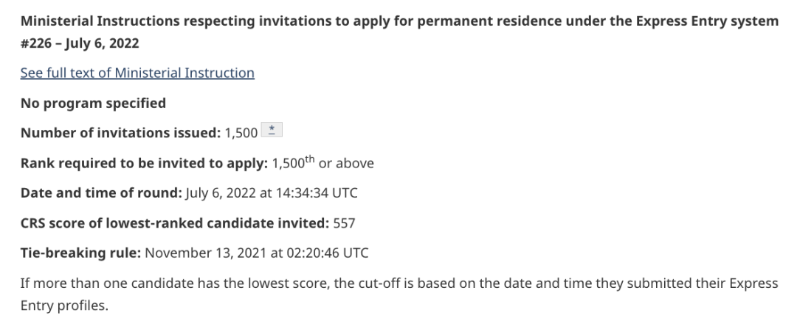
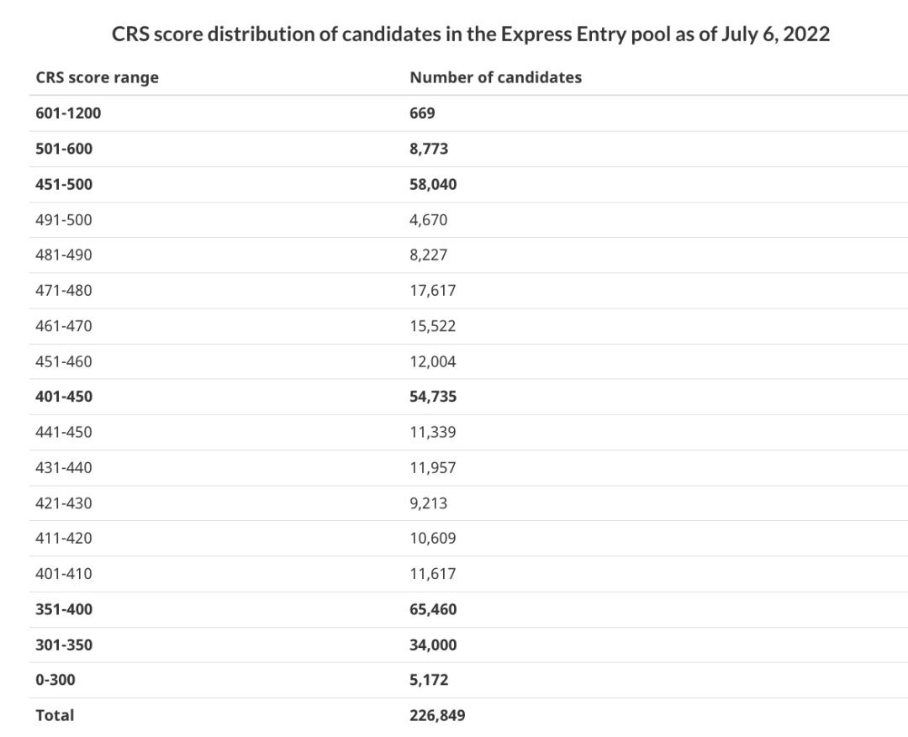
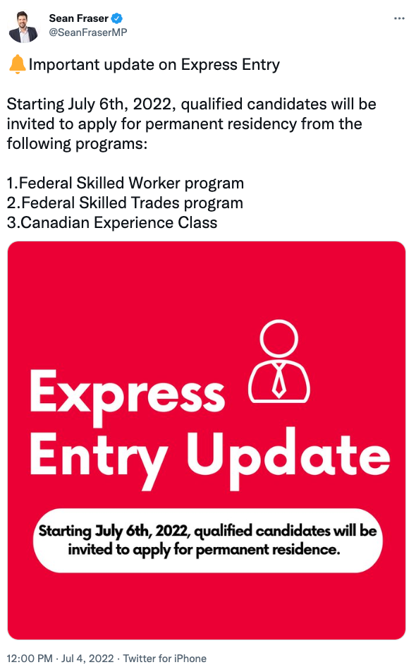
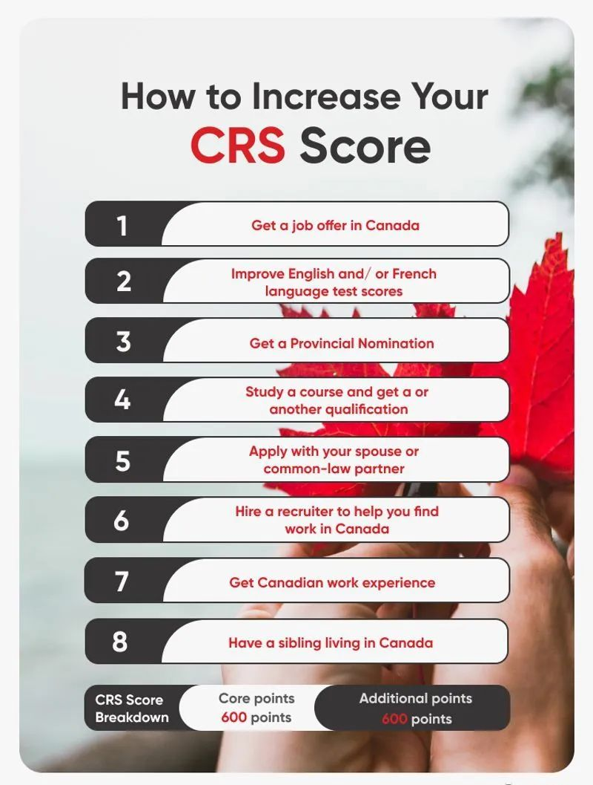

# 无标题

**链接地址:** http://mp.weixin.qq.com/s?__biz=MzUyNzA2NTAwNg==&mid=2247490221&idx=1&sn=69e79df7bc62e73cd520ac625c73819b&chksm=fa04106ccd73997a1e750a4ea69564fbb23b6254606948e5043f95ba577301f9b5e1d27c4326&mpshare=1&scene=2&srcid=0707mB2b7l6JFg10c0hHtN8S&sharer_sharetime=1657141816461&sharer_shareid=77848a6b3852ae4dcb6c74ffee84743c#rd
**作者:** 你身边的签证专家
**获取时间:** 2025/8/28 19:37:17
**图片数量:** 20

---

## 原始HTML内容

<section style="box-sizing: border-box;font-style: normal;font-weight: 400;text-align: justify;font-size: 16px;"><section style="text-align: center;margin-top: 10px;margin-bottom: 10px;box-sizing: border-box;" powered-by="xiumi.us"><section style="max-width: 100%;vertical-align: middle;display: inline-block;line-height: 0;box-sizing: border-box;"></section></section><section style="text-align: center;margin-top: 10px;margin-bottom: 10px;box-sizing: border-box;" powered-by="xiumi.us"></section>
 
<section style="font-size: 19px;text-align: center;margin: 10px 0px 3px;box-sizing: border-box;" powered-by="xiumi.us"><section style="display: inline-block;border-width: 1px;border-style: solid;border-color: rgb(188, 65, 65);background-color: rgb(188, 65, 65);width: 1.8em;height: 1.8em;line-height: 1.8em;border-radius: 100%;margin-left: auto;margin-right: auto;font-size: 16px;color: rgb(255, 255, 255);box-sizing: border-box;">
<strong style="box-sizing: border-box;">1</strong>
</section></section><section style="text-align: center;margin: 0px;box-sizing: border-box;" powered-by="xiumi.us"><section style="display: inline-block;width: 0px;height: 0px;vertical-align: top;overflow: hidden;border-style: solid;border-width: 9px 6px 0px;border-color: rgb(188, 65, 65) rgba(255, 255, 255, 0) rgba(255, 255, 255, 0);box-sizing: border-box;"><svg viewBox="0 0 1 1" style="float:left;line-height:0;width:0;vertical-align:top;"></svg></section></section><section style="margin: 0px 0px 10px;text-align: center;justify-content: center;display: flex;flex-flow: row nowrap;box-sizing: border-box;" powered-by="xiumi.us"><section style="display: inline-block;width: auto;vertical-align: middle;background-color: rgba(109, 155, 209, 0.1);min-width: 10%;max-width: 100%;flex: 0 0 auto;height: auto;align-self: center;padding: 12px;margin: 0px;box-sizing: border-box;"><section style="color: rgb(109, 155, 209);text-align: justify;box-sizing: border-box;" powered-by="xiumi.us">
<strong style="box-sizing: border-box;">没有期待，就没有伤害！</strong>
</section></section></section><section style="font-size: 14px;padding: 0px 15px;letter-spacing: 1px;box-sizing: border-box;" powered-by="xiumi.us">
 

自从今年5月份加拿大移民部部长肖恩·弗雷泽（Sean Fraser）公布了快速通道（Express Entry）抽签邀请将于今年7月6日回归的好消息以后，新时代留学移民法律事务所和客户朋友们一直对这个事件保持着<strong style="box-sizing: border-box;">高度关注</strong>。

 
</section><section style="text-align: center;margin-top: 10px;margin-bottom: 10px;box-sizing: border-box;" powered-by="xiumi.us"><section style="max-width: 100%;vertical-align: middle;display: inline-block;line-height: 0;width: 90%;height: auto;box-sizing: border-box;"></section></section><section style="font-size: 14px;padding: 0px 15px;letter-spacing: 1px;box-sizing: border-box;" powered-by="xiumi.us">
 

而就在刚刚，我们终于迎来了这个<strong style="box-sizing: border-box;">万众瞩目</strong>的时刻！加拿大移民局官网发布了最新的抽选人数和分数！

 
</section><section style="text-align: center;margin-top: 10px;margin-bottom: 10px;box-sizing: border-box;" powered-by="xiumi.us"><section style="max-width: 100%;vertical-align: middle;display: inline-block;line-height: 0;box-sizing: border-box;"></section></section><section style="font-size: 14px;padding: 0px 15px;letter-spacing: 1px;box-sizing: border-box;" powered-by="xiumi.us">
 

加拿大移民部本轮邀请了<strong style="box-sizing: border-box;">共1500名</strong>快速通道申请人申请永久居留权（PR）。综合排名系统(CRS)的分数线<strong style="box-sizing: border-box;">高达557分！再创历史新高！</strong>

<strong style="box-sizing: border-box;"> </strong>
<section class="channels_iframe_wrp wxw_wechannel_card_not_horizontal"><mpvideosnap class="js_uneditable custom_select_card channels_iframe videosnap_video_iframe" data-pluginname="videosnap" data-id="export/UzFfAgtgekIEAQAAAAAArSw3GbYyxAAAAAstQy6ubaLX4KHWvLEZgBPElZJsf15YQpCDzNPgMIuyepNzUMfBOT1nbV5tJQKh" data-url="https://findermp.video.qq.com/251/20304/stodownload?encfilekey=oibeqyX228riaCwo9STVsGLM5YtWluFOonDK7RIb69qhYQgpAgDWIH4EAyg5FHHMyDxxbcicwVylzV5hoE4lMqicIsjORtURFSJHNXDL0JQia5ic7q63WBtaYcU5t0ql5Wc7gLtey5awMV8SQ&amp;adaptivelytrans=0&amp;bizid=1023&amp;dotrans=0&amp;hy=HK&amp;idx=1&amp;m=ef3ff5f6d490e2041668a9817a4e6bc7&amp;token=AxricY7RBHdWSoSicTwbYPy5WaHSLLabsXBPiccoXV0ZXBeB1lxu7YqwA9UjmAPLEwjJNNWf1TeTbs" data-headimgurl="http://wx.qlogo.cn/finderhead/PiajxSqBRaEI4vQJr3aa81ehxKpzshj4t6ZWzDxwztBic5fr9nVMt20g/0" data-username="v2_060000231003b20faec8c7eb811fc3d1ca06ec31b07726617828a16cbc88a282c95def3c7c6d@finder" data-nickname="Zoe说加拿大" data-desc="快速通道终于抽签了！557分，1500人上岸" data-nonceid="6470501331883808268" data-type="video" data-width="1080" data-height="1440"></mpvideosnap></section>
对于这个<strong style="box-sizing: border-box;">“雷声大，雨点稀”</strong>的结果。新时代认为是<strong style="box-sizing: border-box;">“情理之中”</strong>的，算不上大跌眼镜，对于极高的邀请分数我们之前也做出过合理预测，给客户朋友们打好了预防针。

 
</section><section style="text-align: center;margin-top: 10px;margin-bottom: 10px;box-sizing: border-box;" powered-by="xiumi.us"><section style="max-width: 100%;vertical-align: middle;display: inline-block;line-height: 0;width: 50%;height: auto;box-sizing: border-box;"></section></section><section style="font-size: 14px;padding: 0px 15px;letter-spacing: 1px;box-sizing: border-box;" powered-by="xiumi.us">
 

结合目前EE入池的情况，451-600的分段已经累积超过6万人，光500分以上的人数有9442人！那么即使开启抽签，分数线是一定会高于500分的，<strong style="box-sizing: border-box;">甚至持续到年底都很有可能会多次出现500分以上的高分！</strong>

 
</section><section style="text-align: center;margin-top: 10px;margin-bottom: 10px;box-sizing: border-box;" powered-by="xiumi.us"><section style="max-width: 100%;vertical-align: middle;display: inline-block;line-height: 0;width: 90%;height: auto;box-sizing: border-box;"></section></section><section style="font-size: 14px;padding: 0px 15px;letter-spacing: 1px;box-sizing: border-box;" powered-by="xiumi.us">
 

另外，根据年初出台的2022-2024移民计划书，今年<strong style="box-sizing: border-box;">CEC的名额会比往年减半</strong>，再加上乌克兰难民的涌入和移民系统整体审核陷入严重积压状态。刚刚恢复邀请其人数设置也难以一次性反弹到疫情前的平均水平，<strong style="box-sizing: border-box;">即每轮邀请3000-4000人次</strong>。

 

虽然在广大申请者等待如此长的时间后一次只放出1500个名额显得<strong style="box-sizing: border-box;">十分抠门</strong>，但好在移民局没有推翻自己许下的承诺。只要快速通道的抽签按每两周一次的正常速率开始运转，那么分数线的下降也就是迟迟迟早的事。

 
</section><section style="text-align: center;margin-top: 10px;margin-bottom: 10px;box-sizing: border-box;" powered-by="xiumi.us"><section style="max-width: 100%;vertical-align: middle;display: inline-block;line-height: 0;box-sizing: border-box;"></section></section><section style="font-size: 14px;padding: 0px 15px;letter-spacing: 1px;box-sizing: border-box;" powered-by="xiumi.us">
 
</section>
 
<section style="font-size: 19px;text-align: center;margin: 10px 0px 3px;box-sizing: border-box;" powered-by="xiumi.us"><section style="display: inline-block;border-width: 1px;border-style: solid;border-color: rgb(188, 65, 65);background-color: rgb(188, 65, 65);width: 1.8em;height: 1.8em;line-height: 1.8em;border-radius: 100%;margin-left: auto;margin-right: auto;font-size: 16px;color: rgb(255, 255, 255);box-sizing: border-box;">
<strong style="box-sizing: border-box;">2</strong>
</section></section><section style="text-align: center;margin: 0px;box-sizing: border-box;" powered-by="xiumi.us"><section style="display: inline-block;width: 0px;height: 0px;vertical-align: top;overflow: hidden;border-style: solid;border-width: 9px 6px 0px;border-color: rgb(188, 65, 65) rgba(255, 255, 255, 0) rgba(255, 255, 255, 0);box-sizing: border-box;"><svg viewBox="0 0 1 1" style="float:left;line-height:0;width:0;vertical-align:top;"></svg></section></section><section style="margin: 0px 0px 10px;text-align: center;justify-content: center;display: flex;flex-flow: row nowrap;box-sizing: border-box;" powered-by="xiumi.us"><section style="display: inline-block;width: auto;vertical-align: middle;background-color: rgba(109, 155, 209, 0.1);min-width: 10%;max-width: 100%;flex: 0 0 auto;height: auto;align-self: center;padding: 12px;margin: 0px;box-sizing: border-box;"><section style="color: rgb(109, 155, 209);text-align: justify;box-sizing: border-box;" powered-by="xiumi.us">
<strong style="box-sizing: border-box;">快速通道为什么会暂停？</strong>
</section></section></section><section style="font-size: 14px;padding: 0px 15px;letter-spacing: 1px;box-sizing: border-box;" powered-by="xiumi.us">
 

关注加拿大移民的朋友一定对快速通道的重开<strong style="box-sizing: border-box;">期待万分</strong>。

 

由于疫情边境关闭原因，加拿大移民部于2020年12月<strong style="box-sizing: border-box;">暂停</strong>了联邦技术工人计划 (FSWP) 的邀请，而2021年9月份起，由于加拿大移民申请人数的过度积压，移民部也<strong style="box-sizing: border-box;">暂停</strong>了加拿大经验类（CEC）的邀请。

 
</section><section style="text-align: center;margin-top: 10px;margin-bottom: 10px;box-sizing: border-box;" powered-by="xiumi.us"><section style="max-width: 100%;vertical-align: middle;display: inline-block;line-height: 0;width: 90%;height: auto;box-sizing: border-box;"></section></section><section style="font-size: 14px;padding: 0px 15px;letter-spacing: 1px;box-sizing: border-box;" powered-by="xiumi.us">
 

但是，<strong style="box-sizing: border-box;">快速通道长期以来一直都是部分待移民朋友们的首选</strong>，因为这个项目无需雇主担保！无需Job offer！只要分数达到最低邀请分数，<strong style="box-sizing: border-box;">全程6个月即可枫叶卡的审批！</strong>

 

在EE停邀的这段时间里，新时代和客户朋友们也经历了一段<strong style="box-sizing: border-box;">煎熬的时期</strong>。不过新时代坚信，EE作为加拿大最成熟也是高效审核经济类移民的途径之一，在后疫情时代加拿大对于移民需求量高居不下的阶段，必将<strong style="box-sizing: border-box;">被移民部重新捡起作为吸纳人才的利器</strong>。

 
</section><section style="text-align: center;margin-top: 10px;margin-bottom: 10px;box-sizing: border-box;" powered-by="xiumi.us"><section style="max-width: 100%;vertical-align: middle;display: inline-block;line-height: 0;width: 90%;height: auto;box-sizing: border-box;"></section></section><section style="font-size: 14px;padding: 0px 15px;letter-spacing: 1px;box-sizing: border-box;" powered-by="xiumi.us">
 

EE作为直属于联邦的移民项目，不经过省提名环节，主要有三个类别：<strong style="box-sizing: border-box;">联邦技术工人类(FSW)、加拿大经验类(CEC)和联邦技能工人类(FST)</strong>。 

 

<strong style="box-sizing: border-box;">FSW</strong>类无需雇主offer，仅凭借申请人自身打分就可以，申请人以高分取胜，比较适合在加拿大境外的申请人;

 

<strong style="box-sizing: border-box;">CEC</strong>类别适合拥有加拿大教育背景的留学生，以及在加拿大境内持临时工作签证的申请人，因为该类别要求申请人必须具备一年加拿大工作经验;

 

<strong style="box-sizing: border-box;">FST</strong>类适用于具备加拿大技工资质的技能工人，需要有加拿大当地雇主offer。

 

那么，EE到底是通过什么标准对候选人进行筛选的呢？
</section>
 
<section style="font-size: 19px;text-align: center;margin: 10px 0px 3px;box-sizing: border-box;" powered-by="xiumi.us"><section style="display: inline-block;border-width: 1px;border-style: solid;border-color: rgb(188, 65, 65);background-color: rgb(188, 65, 65);width: 1.8em;height: 1.8em;line-height: 1.8em;border-radius: 100%;margin-left: auto;margin-right: auto;font-size: 16px;color: rgb(255, 255, 255);box-sizing: border-box;">
<strong style="box-sizing: border-box;">3</strong>
</section></section><section style="text-align: center;margin: 0px;box-sizing: border-box;" powered-by="xiumi.us"><section style="display: inline-block;width: 0px;height: 0px;vertical-align: top;overflow: hidden;border-style: solid;border-width: 9px 6px 0px;border-color: rgb(188, 65, 65) rgba(255, 255, 255, 0) rgba(255, 255, 255, 0);box-sizing: border-box;"><svg viewBox="0 0 1 1" style="float:left;line-height:0;width:0;vertical-align:top;"></svg></section></section><section style="margin: 0px 0px 10px;text-align: center;justify-content: center;display: flex;flex-flow: row nowrap;box-sizing: border-box;" powered-by="xiumi.us"><section style="display: inline-block;width: auto;vertical-align: middle;background-color: rgba(109, 155, 209, 0.1);min-width: 10%;max-width: 100%;flex: 0 0 auto;height: auto;align-self: center;padding: 12px;margin: 0px;box-sizing: border-box;"><section style="color: rgb(109, 155, 209);text-align: justify;box-sizing: border-box;" powered-by="xiumi.us">
<strong style="box-sizing: border-box;">如何提高自己的CRS分数</strong>
</section></section></section><section style="font-size: 14px;padding: 0px 15px;letter-spacing: 1px;box-sizing: border-box;" powered-by="xiumi.us">
 

加拿大联邦技术移民中的“综合评分系统”，英文全称<strong style="box-sizing: border-box;">“Comprehensive Ranking System”（简称CRS）</strong>，是申请EE过程中最重要的、直接决定申请资格的评分系统。

 
</section><section style="text-align: center;margin-top: 10px;margin-bottom: 10px;box-sizing: border-box;" powered-by="xiumi.us"><section style="max-width: 100%;vertical-align: middle;display: inline-block;line-height: 0;width: 90%;height: auto;box-sizing: border-box;"></section></section><section style="font-size: 14px;padding: 0px 15px;letter-spacing: 1px;box-sizing: border-box;" powered-by="xiumi.us">
 

CRS总分<strong style="box-sizing: border-box;">1200分</strong>，包括：

 

<strong style="box-sizing: border-box;">600分“核心分数”</strong>

包括年龄、学历、工作经验、语言成绩

 

<strong style="box-sizing: border-box;">600分“附加分数”</strong>

包括雇主担保，省提名，加拿大学习经历，是否在加拿大有兄弟姐妹，以及法语能力等。

 

通常申请人在“核心分数”中拿到460分左右就可以确保收到邀请，“附加分数”大部分人是不需要的。但是由于EE太久没有邀请而导致池中<strong style="box-sizing: border-box;">高分人群大量积压</strong>，所以过去稳过的分数今年都只有坐冷板凳的份儿啦！

 

结合目前池中候选人的分数分布和每轮邀请人数，我们预测今年EE的邀请分数也很可能将会一直维持在480分以上，因此想要赶快上岸的朋友们一定要<strong style="box-sizing: border-box;">尽可能地提高自己的CRS分数</strong>：

 
</section><section style="text-align: center;margin-top: 10px;margin-bottom: 10px;box-sizing: border-box;" powered-by="xiumi.us"><section style="max-width: 100%;vertical-align: middle;display: inline-block;line-height: 0;box-sizing: border-box;"></section></section><section style="font-size: 14px;padding: 0px 15px;letter-spacing: 1px;box-sizing: border-box;" powered-by="xiumi.us">
 
</section><section style="margin-top: 10px;margin-bottom: 10px;text-align: center;box-sizing: border-box;" powered-by="xiumi.us"><section style="padding-left: 1em;padding-right: 1em;display: inline-block;box-sizing: border-box;">
<strong style="box-sizing: border-box;">EE申请提分小技巧</strong>
 </section><section style="border-width: 1px;border-style: solid;border-color: rgb(192, 200, 209);margin-top: -1em;padding: 20px 10px 10px;background-color: rgb(239, 239, 239);box-sizing: border-box;"><section style="font-size: 19px;margin: 10px 0px 3px;box-sizing: border-box;" powered-by="xiumi.us"><section style="display: inline-block;border-width: 1px;border-style: solid;border-color: rgb(188, 65, 65);background-color: rgb(188, 65, 65);width: 1.8em;height: 1.8em;line-height: 1.8em;border-radius: 100%;margin-left: auto;margin-right: auto;font-size: 16px;color: rgb(255, 255, 255);box-sizing: border-box;">
1
</section></section><section style="margin: 0px;box-sizing: border-box;" powered-by="xiumi.us"><section style="display: inline-block;width: 0px;height: 0px;vertical-align: top;overflow: hidden;border-style: solid;border-width: 9px 6px 0px;border-color: rgb(188, 65, 65) rgba(255, 255, 255, 0) rgba(255, 255, 255, 0);box-sizing: border-box;"><svg viewBox="0 0 1 1" style="float:left;line-height:0;width:0;vertical-align:top;"></svg></section></section><section style="margin: 0px;box-sizing: border-box;" powered-by="xiumi.us"><section style="text-align: justify;font-size: 12px;padding: 0px 15px;box-sizing: border-box;">
首先<strong style="box-sizing: border-box;">英语</strong><strong style="box-sizing: border-box;">成绩</strong>很重要，其他条件相同的情况下，G类雅思考到8777能比7777高出26分。那么上述条件的申请人就有机会达到460+；很多境内的申请人也可以考思培，拿到同等分数。
</section></section><section style="justify-content: center;margin: 0px 0px 10px;display: flex;flex-flow: row nowrap;box-sizing: border-box;" powered-by="xiumi.us"><section style="display: inline-block;width: 14%;vertical-align: top;flex: 0 0 auto;height: auto;align-self: flex-start;box-sizing: border-box;"><section style="margin: 0.5em 0px;box-sizing: border-box;" powered-by="xiumi.us"><section style="background-color: rgb(188, 65, 65);height: 4px;box-sizing: border-box;"><svg viewBox="0 0 1 1" style="float:left;line-height:0;width:0;vertical-align:top;"></svg></section></section></section></section><section style="text-align: justify;box-sizing: border-box;" powered-by="xiumi.us">
 
</section><section style="font-size: 19px;margin: 10px 0px 3px;box-sizing: border-box;" powered-by="xiumi.us"><section style="display: inline-block;border-width: 1px;border-style: solid;border-color: rgb(188, 65, 65);background-color: rgb(188, 65, 65);width: 1.8em;height: 1.8em;line-height: 1.8em;border-radius: 100%;margin-left: auto;margin-right: auto;font-size: 16px;color: rgb(255, 255, 255);box-sizing: border-box;">
2
</section></section><section style="margin: 0px;box-sizing: border-box;" powered-by="xiumi.us"><section style="display: inline-block;width: 0px;height: 0px;vertical-align: top;overflow: hidden;border-style: solid;border-width: 9px 6px 0px;border-color: rgb(188, 65, 65) rgba(255, 255, 255, 0) rgba(255, 255, 255, 0);box-sizing: border-box;"><svg viewBox="0 0 1 1" style="float:left;line-height:0;width:0;vertical-align:top;"></svg></section></section><section style="margin: 0px;box-sizing: border-box;" powered-by="xiumi.us"><section style="text-align: justify;font-size: 12px;padding: 0px 15px;box-sizing: border-box;">
第二个就是<strong style="box-sizing: border-box;">考</strong><strong style="box-sizing: border-box;">法语</strong>，学习法语并通过一定的考试也可以为EE加分；
</section></section><section style="justify-content: center;margin: 0px 0px 10px;display: flex;flex-flow: row nowrap;box-sizing: border-box;" powered-by="xiumi.us"><section style="display: inline-block;width: 14%;vertical-align: top;flex: 0 0 auto;height: auto;align-self: flex-start;box-sizing: border-box;"><section style="margin: 0.5em 0px;box-sizing: border-box;" powered-by="xiumi.us"><section style="background-color: rgb(188, 65, 65);height: 4px;box-sizing: border-box;"><svg viewBox="0 0 1 1" style="float:left;line-height:0;width:0;vertical-align:top;"></svg></section></section></section></section><section style="text-align: justify;box-sizing: border-box;" powered-by="xiumi.us">
 
</section><section style="font-size: 19px;margin: 10px 0px 3px;box-sizing: border-box;" powered-by="xiumi.us"><section style="display: inline-block;border-width: 1px;border-style: solid;border-color: rgb(188, 65, 65);background-color: rgb(188, 65, 65);width: 1.8em;height: 1.8em;line-height: 1.8em;border-radius: 100%;margin-left: auto;margin-right: auto;font-size: 16px;color: rgb(255, 255, 255);box-sizing: border-box;">
3
</section></section><section style="margin: 0px;box-sizing: border-box;" powered-by="xiumi.us"><section style="display: inline-block;width: 0px;height: 0px;vertical-align: top;overflow: hidden;border-style: solid;border-width: 9px 6px 0px;border-color: rgb(188, 65, 65) rgba(255, 255, 255, 0) rgba(255, 255, 255, 0);box-sizing: border-box;"><svg viewBox="0 0 1 1" style="float:left;line-height:0;width:0;vertical-align:top;"></svg></section></section><section style="margin: 0px;box-sizing: border-box;" powered-by="xiumi.us"><section style="text-align: justify;font-size: 12px;padding: 0px 15px;box-sizing: border-box;">
第三个是积累<strong style="box-sizing: border-box;">工作经验</strong>；境内累积工作时间越长，拥有的分数就越高；
</section></section><section style="justify-content: center;margin: 0px 0px 10px;display: flex;flex-flow: row nowrap;box-sizing: border-box;" powered-by="xiumi.us"><section style="display: inline-block;width: 14%;vertical-align: top;flex: 0 0 auto;height: auto;align-self: flex-start;box-sizing: border-box;"><section style="margin: 0.5em 0px;box-sizing: border-box;" powered-by="xiumi.us"><section style="background-color: rgb(188, 65, 65);height: 4px;box-sizing: border-box;"><svg viewBox="0 0 1 1" style="float:left;line-height:0;width:0;vertical-align:top;"></svg></section></section></section></section><section style="text-align: justify;box-sizing: border-box;" powered-by="xiumi.us">
 
</section><section style="font-size: 19px;margin: 10px 0px 3px;box-sizing: border-box;" powered-by="xiumi.us"><section style="display: inline-block;border-width: 1px;border-style: solid;border-color: rgb(188, 65, 65);background-color: rgb(188, 65, 65);width: 1.8em;height: 1.8em;line-height: 1.8em;border-radius: 100%;margin-left: auto;margin-right: auto;font-size: 16px;color: rgb(255, 255, 255);box-sizing: border-box;">
4
</section></section><section style="margin: 0px;box-sizing: border-box;" powered-by="xiumi.us"><section style="display: inline-block;width: 0px;height: 0px;vertical-align: top;overflow: hidden;border-style: solid;border-width: 9px 6px 0px;border-color: rgb(188, 65, 65) rgba(255, 255, 255, 0) rgba(255, 255, 255, 0);box-sizing: border-box;"><svg viewBox="0 0 1 1" style="float:left;line-height:0;width:0;vertical-align:top;"></svg></section></section><section style="margin: 0px;box-sizing: border-box;" powered-by="xiumi.us"><section style="text-align: justify;font-size: 12px;padding: 0px 15px;box-sizing: border-box;">
第四个是<strong style="box-sizing: border-box;">提升学历</strong>；可以考虑继续读diploma或者研究生等更高的学历来为自己加分，另外，本科双学位也是有额外加分的；
</section></section><section style="justify-content: center;margin: 0px 0px 10px;display: flex;flex-flow: row nowrap;box-sizing: border-box;" powered-by="xiumi.us"><section style="display: inline-block;width: 14%;vertical-align: top;flex: 0 0 auto;height: auto;align-self: flex-start;box-sizing: border-box;"><section style="margin: 0.5em 0px;box-sizing: border-box;" powered-by="xiumi.us"><section style="background-color: rgb(188, 65, 65);height: 4px;box-sizing: border-box;"><svg viewBox="0 0 1 1" style="float:left;line-height:0;width:0;vertical-align:top;"></svg></section></section></section></section><section style="text-align: justify;box-sizing: border-box;" powered-by="xiumi.us">
 
</section><section style="font-size: 19px;margin: 10px 0px 3px;box-sizing: border-box;" powered-by="xiumi.us"><section style="display: inline-block;border-width: 1px;border-style: solid;border-color: rgb(188, 65, 65);background-color: rgb(188, 65, 65);width: 1.8em;height: 1.8em;line-height: 1.8em;border-radius: 100%;margin-left: auto;margin-right: auto;font-size: 16px;color: rgb(255, 255, 255);box-sizing: border-box;">
5
</section></section><section style="margin: 0px;box-sizing: border-box;" powered-by="xiumi.us"><section style="display: inline-block;width: 0px;height: 0px;vertical-align: top;overflow: hidden;border-style: solid;border-width: 9px 6px 0px;border-color: rgb(188, 65, 65) rgba(255, 255, 255, 0) rgba(255, 255, 255, 0);box-sizing: border-box;"><svg viewBox="0 0 1 1" style="float:left;line-height:0;width:0;vertical-align:top;"></svg></section></section><section style="margin: 0px;box-sizing: border-box;" powered-by="xiumi.us"><section style="text-align: justify;font-size: 12px;padding: 0px 15px;box-sizing: border-box;">
第五就是<strong style="box-sizing: border-box;">LMIA加分</strong>；LMIA作为海外劳工批文，不仅能帮助境内申请人继续获得2年的桥梁工签，还可以在快速通道中（EE）加50分；对于很多有境内工作经验，但是工签快要到期还在苦苦等待抽签的朋友是很不错的选择；根据今年的新政策，旅游签在境内也可以申请LMIA，各位陪读家长也可以考虑通过这个项目快速拿到枫叶卡！
</section></section><section style="justify-content: center;margin: 0px 0px 10px;display: flex;flex-flow: row nowrap;box-sizing: border-box;" powered-by="xiumi.us"><section style="display: inline-block;width: 14%;vertical-align: top;flex: 0 0 auto;height: auto;align-self: flex-start;box-sizing: border-box;"><section style="margin: 0.5em 0px;box-sizing: border-box;" powered-by="xiumi.us"><section style="background-color: rgb(188, 65, 65);height: 4px;box-sizing: border-box;"><svg viewBox="0 0 1 1" style="float:left;line-height:0;width:0;vertical-align:top;"></svg></section></section></section></section><section style="text-align: justify;box-sizing: border-box;" powered-by="xiumi.us">
 
</section><section style="margin-top: 10px;margin-bottom: 10px;box-sizing: border-box;" powered-by="xiumi.us"><section style="max-width: 100%;vertical-align: middle;display: inline-block;line-height: 0;box-sizing: border-box;"></section></section><section style="text-align: justify;box-sizing: border-box;" powered-by="xiumi.us">
 
</section><section style="font-size: 19px;margin: 10px 0px 3px;box-sizing: border-box;" powered-by="xiumi.us"><section style="display: inline-block;border-width: 1px;border-style: solid;border-color: rgb(188, 65, 65);background-color: rgb(188, 65, 65);width: 1.8em;height: 1.8em;line-height: 1.8em;border-radius: 100%;margin-left: auto;margin-right: auto;font-size: 16px;color: rgb(255, 255, 255);box-sizing: border-box;">
6
</section></section><section style="margin: 0px;box-sizing: border-box;" powered-by="xiumi.us"><section style="display: inline-block;width: 0px;height: 0px;vertical-align: top;overflow: hidden;border-style: solid;border-width: 9px 6px 0px;border-color: rgb(188, 65, 65) rgba(255, 255, 255, 0) rgba(255, 255, 255, 0);box-sizing: border-box;"><svg viewBox="0 0 1 1" style="float:left;line-height:0;width:0;vertical-align:top;"></svg></section></section><section style="margin: 0px;box-sizing: border-box;" powered-by="xiumi.us"><section style="text-align: justify;font-size: 12px;padding: 0px 15px;box-sizing: border-box;">
第六就是<strong style="box-sizing: border-box;">省提名加分</strong>；在EE通道中里也可以叠加雇主担保的省提名（PNP），直接获得600的加分，绕开CEC停抽导致的分数暴涨，更快获得邀请，而且申请人被抽中后审批时间也短，能快速获得枫叶卡。
</section></section><section style="justify-content: center;margin: 0px 0px 10px;display: flex;flex-flow: row nowrap;box-sizing: border-box;" powered-by="xiumi.us"><section style="display: inline-block;width: 14%;vertical-align: top;flex: 0 0 auto;height: auto;align-self: flex-start;box-sizing: border-box;"><section style="margin: 0.5em 0px;box-sizing: border-box;" powered-by="xiumi.us"><section style="background-color: rgb(188, 65, 65);height: 4px;box-sizing: border-box;"><svg viewBox="0 0 1 1" style="float:left;line-height:0;width:0;vertical-align:top;"></svg></section></section></section></section><section style="text-align: justify;box-sizing: border-box;" powered-by="xiumi.us">
 
</section></section></section><section style="font-size: 14px;padding: 0px 15px;letter-spacing: 1px;box-sizing: border-box;" powered-by="xiumi.us">
 
</section><section style="font-size: 14px;padding: 0px 15px;letter-spacing: 1px;box-sizing: border-box;" powered-by="xiumi.us">
目前，“大赦2.0”通道的细节尚未公布。虽然恢复抽签的快速通道邀请分数高得没眼看，但对于职业背景不属于稀缺岗位，又实在没有办法走省提名通道的申请者们来说，快速通道的这几个项目依然是大家<strong style="box-sizing: border-box;">最主流的选择</strong>。

 
<section class="channels_iframe_wrp wxw_wechannel_card_not_horizontal"><mpvideosnap class="js_uneditable custom_select_card channels_iframe videosnap_video_iframe" data-pluginname="videosnap" data-id="export/UzFfAgtgekIEAQAAAAAAWPglQ0XsywAAAAstQy6ubaLX4KHWvLEZgBPE95EcLwdNBpn-zNPgMIv0hyiryHz6vgQZ8uLoGLGr" data-url="https://findermp.video.qq.com/251/20350/stodownload?encfilekey=XGocBFxVWK5dcyOOqpEU4yzyhTS7AsF75LjhWT7O2jou7yfTicULfkK7bcTNT5lJVehShWicEqcLHxa0ItVpNibpkaKWN3opndQfXtHzk61B0icnRR6YRRsvxRl7Cq5GIricUBaosFO7nTzicHSOjGeib6sLQTA0J97eEKvmsrvnicVTw7qqrmoKfcmAcw&amp;adaptivelytrans=0&amp;bizid=1023&amp;dotrans=0&amp;hy=HK&amp;idx=1&amp;m=339e80f2110459951c458e58cb355f37&amp;token=AxricY7RBHdWSoSicTwbYPy4LKFAcvJCfM5VgxwUmsTXGGFEScnEjJ1mHlUAeOqUgfGURyKZvrNicg" data-headimgurl="http://wx.qlogo.cn/finderhead/PiajxSqBRaEI4vQJr3aa81ehxKpzshj4t6ZWzDxwztBic5fr9nVMt20g/0" data-username="v2_060000231003b20faec8c7eb811fc3d1ca06ec31b07726617828a16cbc88a282c95def3c7c6d@finder" data-nickname="Zoe说加拿大" data-desc="#加拿大#快速通道" data-nonceid="14605924158100894935" data-type="video" data-width="720" data-height="960"></mpvideosnap></section>
请大家保持耐心，关注新时代推出的最新政策解读。邀请分数高总好过完全不抽签。但如果你保持观望还没有入池，那<strong style="box-sizing: border-box;">分数再低也轮不到你</strong>。请有计划申请快速通道的小伙伴们赶快联系我们，抓紧时间入池吧！

 

<strong style="box-sizing: border-box;">机会只留给有准备已入池的人！</strong>
</section><section style="font-size: 14px;padding: 0px 15px;letter-spacing: 1px;box-sizing: border-box;" powered-by="xiumi.us">
 
</section><section style="margin: 10px 0%;text-align: center;justify-content: center;display: flex;flex-flow: row nowrap;box-sizing: border-box;" powered-by="xiumi.us"><section style="display: inline-block;width: 100%;vertical-align: top;box-shadow: rgb(0, 0, 0) 0px 0px 0px;background-color: rgb(241, 241, 241);padding: 10px;align-self: flex-start;flex: 0 0 auto;box-sizing: border-box;"><section style="justify-content: center;display: flex;flex-flow: row nowrap;box-sizing: border-box;" powered-by="xiumi.us"><section style="display: inline-block;width: 100%;vertical-align: top;background-color: rgb(255, 255, 255);padding: 20px 10px;flex: 0 0 auto;height: auto;box-shadow: rgb(198, 198, 198) 0px 0px 2px;border-width: 0px;border-radius: 6px;border-style: none;border-color: rgb(62, 62, 62);overflow: hidden;align-self: flex-start;box-sizing: border-box;"><section style="color: rgb(189, 189, 189);text-align: justify;box-sizing: border-box;" powered-by="xiumi.us">
<strong style="box-sizing: border-box;">阅读更多</strong>
</section><section style="text-align: justify;box-sizing: border-box;" powered-by="xiumi.us">
 
</section><section style="display: flex;flex-flow: row nowrap;margin: 0px 0%;justify-content: center;box-sizing: border-box;" powered-by="xiumi.us"><section style="display: inline-block;vertical-align: top;width: auto;flex: 100 100 0%;align-self: flex-start;height: auto;box-shadow: rgb(0, 0, 0) 0px 0px 0px;border-bottom: 1px dashed rgba(106, 106, 106, 0.25);border-bottom-right-radius: 0px;margin: 0px 10px 0px 0px;box-sizing: border-box;"><section style="font-size: 14px;text-align: justify;box-sizing: border-box;" powered-by="xiumi.us">
<a target="_blank" href="http://mp.weixin.qq.com/s?__biz=MzUyNzA2NTAwNg==&amp;mid=2247490175&amp;idx=1&amp;sn=f0ef69ea89555eb5247649c0f92885f6&amp;chksm=fa0410becd7399a8c83ba6f1ca55954ffd912f02fe6a2c763bf7ac19e6fd1765729041d9620e&amp;scene=21#wechat_redirect" textvalue="“大赦2.0”新政更多细节首披露！时间节点、职业清单、抽签模式…“重点”多到划不过来啦！…" linktype="text" imgurl="" imgdata="null" data-itemshowtype="0" tab="innerlink" data-linktype="2">“大赦2.0”新政更多细节首披露！时间节点、职业清单、抽签模式…“重点”多到划不过来啦！…</a>
</section></section><section style="display: inline-block;vertical-align: top;width: auto;flex: 20 20 0%;align-self: flex-start;height: auto;border-width: 0px;margin: 0px 0px 0px 5px;box-sizing: border-box;"><section style="margin: 0px 0%;box-sizing: border-box;" powered-by="xiumi.us"><section style="max-width: 100%;vertical-align: middle;display: inline-block;line-height: 0;box-shadow: rgb(0, 0, 0) 0px 0px 0px;box-sizing: border-box;"><a target="_blank" href="http://mp.weixin.qq.com/s?__biz=MzUyNzA2NTAwNg==&amp;mid=2247490175&amp;idx=1&amp;sn=f0ef69ea89555eb5247649c0f92885f6&amp;chksm=fa0410becd7399a8c83ba6f1ca55954ffd912f02fe6a2c763bf7ac19e6fd1765729041d9620e&amp;scene=21#wechat_redirect" textvalue="你已选中了添加链接的内容" linktype="text" imgurl="" imgdata="null" data-itemshowtype="0" tab="innerlink" data-linktype="1"></a></section></section></section></section><section style="text-align: justify;box-sizing: border-box;" powered-by="xiumi.us">
 
</section><section style="display: flex;flex-flow: row nowrap;margin: 0px 0%;justify-content: center;box-sizing: border-box;" powered-by="xiumi.us"><section style="display: inline-block;vertical-align: top;width: auto;flex: 100 100 0%;align-self: flex-start;height: auto;box-shadow: rgb(0, 0, 0) 0px 0px 0px;border-bottom: 1px dashed rgba(106, 106, 106, 0.25);border-bottom-right-radius: 0px;margin: 0px 10px 0px 0px;box-sizing: border-box;"><section style="font-size: 14px;text-align: justify;box-sizing: border-box;" powered-by="xiumi.us">
<a target="_blank" href="http://mp.weixin.qq.com/s?__biz=MzUyNzA2NTAwNg==&amp;mid=2247490130&amp;idx=1&amp;sn=6d96a3cfe1e376f4bf84ace04167817d&amp;chksm=fa041093cd7399859f62f7e35c7b3973b09e5fd97d9f9bf68683fc68a0edcc9e86641b0ea601&amp;scene=21#wechat_redirect" textvalue="喜大普奔！加拿大移民部长官宣：留学生毕业工签再延18个月！" linktype="text" imgurl="" imgdata="null" data-itemshowtype="0" tab="innerlink" data-linktype="2">喜大普奔！加拿大移民部长官宣：留学生毕业工签再延18个月！ </a>
</section></section><section style="display: inline-block;vertical-align: top;width: auto;flex: 20 20 0%;align-self: flex-start;height: auto;border-width: 0px;margin: 0px 0px 0px 5px;box-sizing: border-box;"><section style="margin: 0px 0%;box-sizing: border-box;" powered-by="xiumi.us"><section style="max-width: 100%;vertical-align: middle;display: inline-block;line-height: 0;box-shadow: rgb(0, 0, 0) 0px 0px 0px;box-sizing: border-box;"><a target="_blank" href="http://mp.weixin.qq.com/s?__biz=MzUyNzA2NTAwNg==&amp;mid=2247490130&amp;idx=1&amp;sn=6d96a3cfe1e376f4bf84ace04167817d&amp;chksm=fa041093cd7399859f62f7e35c7b3973b09e5fd97d9f9bf68683fc68a0edcc9e86641b0ea601&amp;scene=21#wechat_redirect" textvalue="你已选中了添加链接的内容" linktype="text" imgurl="" imgdata="null" data-itemshowtype="0" tab="innerlink" data-linktype="1"></a></section></section></section></section><section style="text-align: justify;box-sizing: border-box;" powered-by="xiumi.us">
 
</section><section style="display: flex;flex-flow: row nowrap;margin: 0px 0%;justify-content: center;box-sizing: border-box;" powered-by="xiumi.us"><section style="display: inline-block;vertical-align: top;width: auto;flex: 100 100 0%;align-self: flex-start;height: auto;box-shadow: rgb(0, 0, 0) 0px 0px 0px;border-bottom: 1px dashed rgba(106, 106, 106, 0.25);border-bottom-right-radius: 0px;margin: 0px 10px 0px 0px;box-sizing: border-box;"><section style="font-size: 14px;text-align: justify;box-sizing: border-box;" powered-by="xiumi.us">
<a target="_blank" href="http://mp.weixin.qq.com/s?__biz=MzUyNzA2NTAwNg==&amp;mid=2247490081&amp;idx=1&amp;sn=0529e05511e2f194f512c124d1d5fcf7&amp;chksm=fa0410e0cd7399f657fd5455c618fe5fe0c82a537b0cf74440eb73ca7e68c67e8d4cd68d499c&amp;scene=21#wechat_redirect" textvalue="终于等到了！加拿大联邦快速通道7月6日重磅回归！" linktype="text" imgurl="" imgdata="null" data-itemshowtype="0" tab="innerlink" data-linktype="2">终于等到了！加拿大联邦快速通道7月6日重磅回归！</a>
</section></section><section style="display: inline-block;vertical-align: top;width: auto;flex: 20 20 0%;align-self: flex-start;height: auto;border-width: 0px;margin: 0px 0px 0px 5px;box-sizing: border-box;"><section style="margin: 0px 0%;box-sizing: border-box;" powered-by="xiumi.us"><section style="max-width: 100%;vertical-align: middle;display: inline-block;line-height: 0;box-shadow: rgb(0, 0, 0) 0px 0px 0px;box-sizing: border-box;"><a target="_blank" href="http://mp.weixin.qq.com/s?__biz=MzUyNzA2NTAwNg==&amp;mid=2247490081&amp;idx=1&amp;sn=0529e05511e2f194f512c124d1d5fcf7&amp;chksm=fa0410e0cd7399f657fd5455c618fe5fe0c82a537b0cf74440eb73ca7e68c67e8d4cd68d499c&amp;scene=21#wechat_redirect" textvalue="你已选中了添加链接的内容" linktype="text" imgurl="" imgdata="null" data-itemshowtype="0" tab="innerlink" data-linktype="1"></a></section></section></section></section></section></section></section></section><section style="font-size: 14px;padding: 0px 15px;letter-spacing: 1px;box-sizing: border-box;" powered-by="xiumi.us">
 
</section><section style="text-align: center;margin-top: 10px;margin-bottom: 10px;box-sizing: border-box;" powered-by="xiumi.us"><section style="max-width: 100%;vertical-align: middle;display: inline-block;line-height: 0;box-sizing: border-box;"></section></section><section style="text-align: center;margin-top: 10px;margin-bottom: 10px;box-sizing: border-box;" powered-by="xiumi.us"><section style="max-width: 100%;vertical-align: middle;display: inline-block;line-height: 0;box-sizing: border-box;"></section></section><section style="text-align: center;margin-top: 10px;margin-bottom: 10px;box-sizing: border-box;" powered-by="xiumi.us"><section style="max-width: 100%;vertical-align: middle;display: inline-block;line-height: 0;box-sizing: border-box;"></section></section><section style="padding: 0px 15px;font-size: 12px;color: rgb(121, 121, 121);box-sizing: border-box;" powered-by="xiumi.us">
<strong style="box-sizing: border-box;">参考信息：</strong>

<strong style="box-sizing: border-box;">https://www.cicnews.com/2022/07/express-entry-canada-expected-to-invite-fswp-and-cec-candidates-today-0726782.html#gs.51usb9</strong>
</section><section style="text-align: center;margin-top: 10px;margin-bottom: 10px;box-sizing: border-box;" powered-by="xiumi.us"><section style="max-width: 100%;vertical-align: middle;display: inline-block;line-height: 0;box-sizing: border-box;"></section></section><section style="text-align: center;margin-top: 10px;margin-bottom: 10px;box-sizing: border-box;" powered-by="xiumi.us"><section style="max-width: 100%;vertical-align: middle;display: inline-block;line-height: 0;box-sizing: border-box;"></section></section></section>
 

---

## 纯文本内容

1没有期待，就没有伤害！自从今年5月份加拿大移民部部长肖恩·弗雷泽（Sean Fraser）公布了快速通道（Express Entry）抽签邀请将于今年7月6日回归的好消息以后，新时代留学移民法律事务所和客户朋友们一直对这个事件保持着高度关注。而就在刚刚，我们终于迎来了这个万众瞩目的时刻！加拿大移民局官网发布了最新的抽选人数和分数！加拿大移民部本轮邀请了共1500名快速通道申请人申请永久居留权（PR）。综合排名系统(CRS)的分数线高达557分！再创历史新高！对于这个“雷声大，雨点稀”的结果。新时代认为是“情理之中”的，算不上大跌眼镜，对于极高的邀请分数我们之前也做出过合理预测，给客户朋友们打好了预防针。结合目前EE入池的情况，451-600的分段已经累积超过6万人，光500分以上的人数有9442人！那么即使开启抽签，分数线是一定会高于500分的，甚至持续到年底都很有可能会多次出现500分以上的高分！另外，根据年初出台的2022-2024移民计划书，今年CEC的名额会比往年减半，再加上乌克兰难民的涌入和移民系统整体审核陷入严重积压状态。刚刚恢复邀请其人数设置也难以一次性反弹到疫情前的平均水平，即每轮邀请3000-4000人次。虽然在广大申请者等待如此长的时间后一次只放出1500个名额显得十分抠门，但好在移民局没有推翻自己许下的承诺。只要快速通道的抽签按每两周一次的正常速率开始运转，那么分数线的下降也就是迟迟迟早的事。2快速通道为什么会暂停？关注加拿大移民的朋友一定对快速通道的重开期待万分。由于疫情边境关闭原因，加拿大移民部于2020年12月暂停了联邦技术工人计划 (FSWP) 的邀请，而2021年9月份起，由于加拿大移民申请人数的过度积压，移民部也暂停了加拿大经验类（CEC）的邀请。但是，快速通道长期以来一直都是部分待移民朋友们的首选，因为这个项目无需雇主担保！无需Job offer！只要分数达到最低邀请分数，全程6个月即可枫叶卡的审批！在EE停邀的这段时间里，新时代和客户朋友们也经历了一段煎熬的时期。不过新时代坚信，EE作为加拿大最成熟也是高效审核经济类移民的途径之一，在后疫情时代加拿大对于移民需求量高居不下的阶段，必将被移民部重新捡起作为吸纳人才的利器。EE作为直属于联邦的移民项目，不经过省提名环节，主要有三个类别：联邦技术工人类(FSW)、加拿大经验类(CEC)和联邦技能工人类(FST)。FSW类无需雇主offer，仅凭借申请人自身打分就可以，申请人以高分取胜，比较适合在加拿大境外的申请人;CEC类别适合拥有加拿大教育背景的留学生，以及在加拿大境内持临时工作签证的申请人，因为该类别要求申请人必须具备一年加拿大工作经验;FST类适用于具备加拿大技工资质的技能工人，需要有加拿大当地雇主offer。那么，EE到底是通过什么标准对候选人进行筛选的呢？3如何提高自己的CRS分数加拿大联邦技术移民中的“综合评分系统”，英文全称“Comprehensive Ranking System”（简称CRS），是申请EE过程中最重要的、直接决定申请资格的评分系统。CRS总分1200分，包括：600分“核心分数”包括年龄、学历、工作经验、语言成绩600分“附加分数”包括雇主担保，省提名，加拿大学习经历，是否在加拿大有兄弟姐妹，以及法语能力等。通常申请人在“核心分数”中拿到460分左右就可以确保收到邀请，“附加分数”大部分人是不需要的。但是由于EE太久没有邀请而导致池中高分人群大量积压，所以过去稳过的分数今年都只有坐冷板凳的份儿啦！结合目前池中候选人的分数分布和每轮邀请人数，我们预测今年EE的邀请分数也很可能将会一直维持在480分以上，因此想要赶快上岸的朋友们一定要尽可能地提高自己的CRS分数：EE申请提分小技巧 1首先英语成绩很重要，其他条件相同的情况下，G类雅思考到8777能比7777高出26分。那么上述条件的申请人就有机会达到460+；很多境内的申请人也可以考思培，拿到同等分数。2第二个就是考法语，学习法语并通过一定的考试也可以为EE加分；3第三个是积累工作经验；境内累积工作时间越长，拥有的分数就越高；4第四个是提升学历；可以考虑继续读diploma或者研究生等更高的学历来为自己加分，另外，本科双学位也是有额外加分的；5第五就是LMIA加分；LMIA作为海外劳工批文，不仅能帮助境内申请人继续获得2年的桥梁工签，还可以在快速通道中（EE）加50分；对于很多有境内工作经验，但是工签快要到期还在苦苦等待抽签的朋友是很不错的选择；根据今年的新政策，旅游签在境内也可以申请LMIA，各位陪读家长也可以考虑通过这个项目快速拿到枫叶卡！6第六就是省提名加分；在EE通道中里也可以叠加雇主担保的省提名（PNP），直接获得600的加分，绕开CEC停抽导致的分数暴涨，更快获得邀请，而且申请人被抽中后审批时间也短，能快速获得枫叶卡。目前，“大赦2.0”通道的细节尚未公布。虽然恢复抽签的快速通道邀请分数高得没眼看，但对于职业背景不属于稀缺岗位，又实在没有办法走省提名通道的申请者们来说，快速通道的这几个项目依然是大家最主流的选择。请大家保持耐心，关注新时代推出的最新政策解读。邀请分数高总好过完全不抽签。但如果你保持观望还没有入池，那分数再低也轮不到你。请有计划申请快速通道的小伙伴们赶快联系我们，抓紧时间入池吧！机会只留给有准备已入池的人！阅读更多“大赦2.0”新政更多细节首披露！时间节点、职业清单、抽签模式…“重点”多到划不过来啦！…喜大普奔！加拿大移民部长官宣：留学生毕业工签再延18个月！终于等到了！加拿大联邦快速通道7月6日重磅回归！参考信息：https://www.cicnews.com/2022/07/express-entry-canada-expected-to-invite-fswp-and-cec-candidates-today-0726782.html#gs.51usb9

---

## 图片列表

-  (原始链接: https://mmbiz.qpic.cn/mmbiz_jpg/904kUibXm7Y7F2EUrY7U8l1k9PezBFB2jhTx8UlDWibyZZzlCqpWv81uBSedicwDu7D8Msmu5wH3U1DalFibkxKPqw/640?wx_fmt=jpeg)
-  (原始链接: https://mmbiz.qpic.cn/mmbiz_jpg/904kUibXm7Y4EC3q40NfCb7jaWhWbgfxibgpavj9rH4EqdQFpzyVg6N8TNSVOsgAOuvg1OSL9ec8ZyRicEzu8Tib7A/640?wx_fmt=jpeg)
-  (原始链接: https://mmbiz.qpic.cn/mmbiz_jpg/904kUibXm7Y7F2EUrY7U8l1k9PezBFB2jAWcn8nlU0afib3AXDuicDORsYV6VRQMxEmrU3h9Lkz2PbsibQ32fdNMwg/640?wx_fmt=jpeg)
-  (原始链接: https://mmbiz.qpic.cn/mmbiz_png/904kUibXm7Y7F2EUrY7U8l1k9PezBFB2jj5nSv7DTKHCNc3NaFhxibs35Ziag1ZgwmDLWPGdgKeHEhbVuGgicH8TlA/640?wx_fmt=png)
-  (原始链接: https://mmbiz.qpic.cn/mmbiz_png/904kUibXm7Y7F2EUrY7U8l1k9PezBFB2jlaVFnDibfkLx40YA5SMxPPpowbUK8eK83pHmfuW4TFkkxEdlVjkvV6A/640?wx_fmt=png)
-  (原始链接: https://mmbiz.qpic.cn/mmbiz_png/904kUibXm7Y7F2EUrY7U8l1k9PezBFB2jOywR8NvqXnKicdPQJ992I0sHshLvQ1tEoguTFNt1u6JQEudC8jPBqicQ/640?wx_fmt=png)
-  (原始链接: https://mmbiz.qpic.cn/mmbiz_png/904kUibXm7Y7F2EUrY7U8l1k9PezBFB2jiccmp5ibSqJMxPrjmJR8iaGFZlxgQ9XNG1VicTyKCxNoA94RNDqhgp3ibHw/640?wx_fmt=png)
-  (原始链接: https://mmbiz.qpic.cn/mmbiz_jpg/904kUibXm7Y7F2EUrY7U8l1k9PezBFB2jZkPTib5GCguuWiagSZTJbZAOMwafoj70X7DJXGiaMWibWx2NaiaKTQOyFiaA/640?wx_fmt=jpeg)
-  (原始链接: https://mmbiz.qpic.cn/mmbiz_png/904kUibXm7Y7F2EUrY7U8l1k9PezBFB2jibMulMGz0Vib9f9yrV3FDZTodO7MdAugMRbxtSsfukMlORaE8hupbqlA/640?wx_fmt=png)
-  (原始链接: https://mmbiz.qpic.cn/mmbiz_jpg/904kUibXm7Y7F2EUrY7U8l1k9PezBFB2jHzJbYlbxib660ncDYYvs6Fab7xwQaMF9ricxgrV1Cz5XEL6UJm5rFvtw/640?wx_fmt=jpeg)
-  (原始链接: https://mmbiz.qpic.cn/mmbiz_jpg/904kUibXm7Y7F2EUrY7U8l1k9PezBFB2jmhjXGDIOwaOXL08ZpyVrBBPdOVJeFmbXTnTgiafkicgglTlTmTO6y18g/640?wx_fmt=jpeg)
-  (原始链接: https://mmbiz.qpic.cn/mmbiz_png/904kUibXm7Y7F2EUrY7U8l1k9PezBFB2jBkG4pLiaeECDBTa1Ws5l4ZHBJZQPg1J42CnBFEXnLibTx7icuqwG69a2A/640?wx_fmt=png)
-  (原始链接: https://mmbiz.qpic.cn/mmbiz_jpg/904kUibXm7Y7F2EUrY7U8l1k9PezBFB2jJxzPytCBgjSGbkZam11RKgzqIk5VicLDVhiaoe2kS82NFeLxE5m3GOicA/640?wx_fmt=jpeg)
-  (原始链接: https://mmbiz.qpic.cn/mmbiz_jpg/904kUibXm7Y7F2EUrY7U8l1k9PezBFB2jV38TwnhyHLmyiamdZc9MZwpFj6c8iadNC3Ve8UxTd6KLfWfCHTugdQ1g/640?wx_fmt=jpeg)
-  (原始链接: https://mmbiz.qpic.cn/mmbiz_jpg/904kUibXm7Y7F2EUrY7U8l1k9PezBFB2j8fhibgwzhJcIySa8haVEExNzWe3GCHxSSePyTfCWAK7FYdTNGPy4kOw/640?wx_fmt=jpeg)
-  (原始链接: https://mmbiz.qpic.cn/mmbiz_jpg/904kUibXm7Y7F2EUrY7U8l1k9PezBFB2jicId2bL8DZicrysUxw4OHkK7Jv0bUTkAREKe9zSN2C7icZjHXpVGGgmpw/640?wx_fmt=jpeg)
-  (原始链接: https://mmbiz.qpic.cn/mmbiz_jpg/904kUibXm7Y7F2EUrY7U8l1k9PezBFB2jNyQicDLTrzLH7VqTGcH78BBqoVypXeqMLalTEw0067Lyjbb2raPQIDA/640?wx_fmt=jpeg)
-  (原始链接: https://mmbiz.qpic.cn/mmbiz_jpg/904kUibXm7Y7F2EUrY7U8l1k9PezBFB2jicBIGe3j8aP09j9LVVEjEsGPibQXJGm1r2wjLz3tK5ia7FgzMGicNg96hw/640?wx_fmt=jpeg)
-  (原始链接: https://mmbiz.qpic.cn/mmbiz_jpg/904kUibXm7Y7F2EUrY7U8l1k9PezBFB2jOF3RYFMQSWh2qMEDYmyTO1kz7aHKT7BOTAd88eBuNZ75jYnumQY4qg/640?wx_fmt=jpeg)
-  (原始链接: https://mmbiz.qpic.cn/mmbiz_jpg/904kUibXm7Y7F2EUrY7U8l1k9PezBFB2jTCHBKBibtCPoMbfPib8mgOkmcWZFOjYeOqSwX0mUH7QlEbZIYZ9ibdjjg/640?wx_fmt=jpeg)
