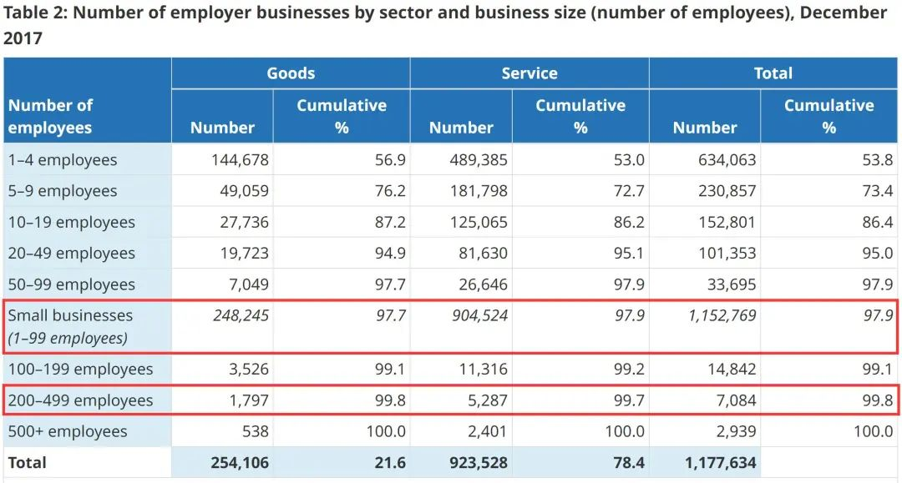

# 无标题

**链接地址:** http://mp.weixin.qq.com/s?__biz=MzI4NDYyNjAwNw==&mid=2247486117&idx=1&sn=728a5644a917bf5f7e1f4ec0776246fc&chksm=ebf9d79ddc8e5e8b25ba1c5f0f3625a43029b72eb72117f55c4d6183e9ce71e9e0c6818989e9&mpshare=1&scene=2&srcid=0716d9sNLRvlB3ul0MJtgKtg&sharer_sharetime=1657944709838&sharer_shareid=77848a6b3852ae4dcb6c74ffee84743c#rd
**作者:** 关注我们
**获取时间:** 2025/8/28 19:36:57
**图片数量:** 22

---

## 原始HTML内容

<section style="box-sizing: border-box;font-style: normal;font-weight: 400;text-align: justify;font-size: 16px;"><section style="text-align: left;justify-content: flex-start;display: flex;flex-flow: row nowrap;margin: 10px 0px;box-sizing: border-box;" powered-by="xiumi.us"><section style="display: inline-block;vertical-align: top;width: auto;align-self: flex-start;flex: 0 0 auto;min-width: 5%;max-width: 100%;height: auto;background-color: rgb(236, 143, 30);box-sizing: border-box;"><section style="text-align: justify;box-sizing: border-box;" powered-by="xiumi.us">
 
</section></section><section style="display: inline-block;vertical-align: top;width: auto;min-width: 5%;max-width: 100%;flex: 0 0 auto;height: auto;box-sizing: border-box;"><section style="margin: 0px;text-align: center;box-sizing: border-box;" powered-by="xiumi.us"><section style="width: 100%;height: 5px;background-color: rgba(237, 146, 15, 0.1);box-sizing: border-box;"><svg viewBox="0 0 1 1" style="float:left;line-height:0;width:0;vertical-align:top;"></svg></section></section><section style="transform: translate3d(12px, 0px, 0px);-webkit-transform: translate3d(12px, 0px, 0px);-moz-transform: translate3d(12px, 0px, 0px);-o-transform: translate3d(12px, 0px, 0px);margin: 6px 0px 0px;box-sizing: border-box;" powered-by="xiumi.us"><section style="font-size: 17px;box-sizing: border-box;">
<strong style="box-sizing: border-box;">点击蓝字&nbsp; 关注我们</strong>
</section></section></section></section>
 
<section style="text-align: center;margin: 10px 0px 20px;box-sizing: border-box;" powered-by="xiumi.us"><section style="max-width: 100%;vertical-align: middle;display: inline-block;line-height: 0;box-sizing: border-box;"></section></section>
 
<section style="text-align: left;justify-content: flex-start;display: flex;flex-flow: row nowrap;margin: 10px 0px 0px;box-sizing: border-box;" powered-by="xiumi.us"><section style="display: inline-block;vertical-align: top;width: auto;align-self: stretch;flex: 0 0 auto;min-width: 5%;max-width: 100%;height: auto;background-color: rgb(236, 143, 30);padding: 10px;box-sizing: border-box;"><section style="text-align: center;box-sizing: border-box;" powered-by="xiumi.us"><section style="font-size: 28px;color: rgb(255, 255, 255);box-sizing: border-box;">
<strong style="box-sizing: border-box;">1</strong>
</section></section></section><section style="display: inline-block;vertical-align: top;width: auto;min-width: 5%;max-width: 100%;flex: 0 0 auto;height: auto;box-sizing: border-box;"><section style="justify-content: flex-start;display: flex;flex-flow: row nowrap;box-sizing: border-box;" powered-by="xiumi.us"><section style="display: inline-block;width: 100%;vertical-align: top;align-self: flex-start;flex: 0 0 auto;background-color: rgba(237, 146, 15, 0.1);padding: 0px 16px;box-sizing: border-box;"><section style="margin: 4px 0px;box-sizing: border-box;" powered-by="xiumi.us"><section style="text-align: justify;font-size: 12px;color: rgb(121, 121, 121);box-sizing: border-box;">
Part.1
</section></section></section></section><section style="transform: translate3d(14px, 0px, 0px);-webkit-transform: translate3d(14px, 0px, 0px);-moz-transform: translate3d(14px, 0px, 0px);-o-transform: translate3d(14px, 0px, 0px);margin: 5px 0px 0px;box-sizing: border-box;" powered-by="xiumi.us"><section style="text-align: justify;font-size: 18px;box-sizing: border-box;">
<strong style="box-sizing: border-box;">小王到底该怎么选择？</strong>
</section></section></section></section><section style="text-align: left;justify-content: flex-start;display: flex;flex-flow: row nowrap;margin: 0px 0px 10px;box-sizing: border-box;" powered-by="xiumi.us"><section style="display: inline-block;width: 100%;vertical-align: top;align-self: flex-start;flex: 0 0 auto;border-style: solid;border-width: 0px 1px 1px 0px;border-color: rgb(62, 62, 62) rgba(237, 146, 15, 0.1) rgba(237, 146, 15, 0.1) rgb(62, 62, 62);padding: 27px;box-sizing: border-box;"><section style="text-align: justify;font-size: 14px;line-height: 2;letter-spacing: 2px;box-sizing: border-box;" powered-by="xiumi.us">
近来，Ada收到了一位老客户小王的咨询。作为应届毕业生的他遇到了一个非常典型的“毕业生选择题”——<strong style="box-sizing: border-box;">“大厂”还是“小厂”</strong>。让我们先来仔细分析一下这则案例：

 
</section><section style="margin: 20px 0px 10px;box-sizing: border-box;" powered-by="xiumi.us"><section style="max-width: 100%;vertical-align: middle;display: inline-block;line-height: 0;width: 86%;height: auto;box-sizing: border-box;"></section></section><section style="text-align: right;margin: 20px 0px 10px;box-sizing: border-box;" powered-by="xiumi.us"><section style="max-width: 100%;vertical-align: middle;display: inline-block;line-height: 0;width: 86%;height: auto;box-sizing: border-box;"></section></section><section style="text-align: justify;font-size: 14px;line-height: 2;letter-spacing: 2px;box-sizing: border-box;" powered-by="xiumi.us">
 
</section><section style="justify-content: flex-start;display: flex;flex-flow: row nowrap;margin: 0px 0px 10px;box-sizing: border-box;" powered-by="xiumi.us"><section style="display: inline-block;width: 100%;vertical-align: top;align-self: flex-start;flex: 0 0 auto;padding: 32px;box-sizing: border-box;"><section style="justify-content: flex-start;display: flex;flex-flow: row nowrap;transform: translate3d(-31px, 0px, 0px);-webkit-transform: translate3d(-31px, 0px, 0px);-moz-transform: translate3d(-31px, 0px, 0px);-o-transform: translate3d(-31px, 0px, 0px);box-sizing: border-box;" powered-by="xiumi.us"><section style="display: inline-block;width: 72px;vertical-align: top;align-self: flex-start;flex: 0 0 auto;border-style: solid;border-width: 3px 0px;border-color: rgb(236, 143, 30) rgb(62, 62, 62);height: auto;box-sizing: border-box;"><section style="margin: -10px 0px -19px;transform: translate3d(11px, 0px, 0px);-webkit-transform: translate3d(11px, 0px, 0px);-moz-transform: translate3d(11px, 0px, 0px);-o-transform: translate3d(11px, 0px, 0px);box-sizing: border-box;" powered-by="xiumi.us"><section style="display: inline-block;width: 14px;height: 36px;vertical-align: top;overflow: hidden;border-style: solid;border-width: 0px 3px;border-color: rgb(62, 62, 62) rgb(236, 143, 30);box-sizing: border-box;"><svg viewBox="0 0 1 1" style="float:left;line-height:0;width:0;vertical-align:top;"></svg></section></section></section></section><section style="text-align: justify;box-sizing: border-box;" powered-by="xiumi.us">
 
</section><section style="text-align: justify;box-sizing: border-box;" powered-by="xiumi.us">
小王今年春天刚刚从阿尔伯塔大学商学院的金融专业本科毕业，GPA3.7且拥有CO-OP经验的他已经拿到加国某著名银行非入门职位的job offer。这样的“梦幻开局”对于留学毕业生们来说已是可望而不可及，但令小王头痛的却是另一个工作邀约：

 

小王的舅舅在本省经营一家小型私人企业。舅舅许诺小王一毕业就offer他一个企业中层管理岗位，起薪和股权激励都比银行的工作更为诱人，但小王并不了解企业的运营状况，也不清楚这层人际关系到底会成为自己事业起航的助推还是阻碍。

 
</section><section style="transform: perspective(0px);-webkit-transform: perspective(0px);-moz-transform: perspective(0px);-o-transform: perspective(0px);transform-style: flat;box-sizing: border-box;" powered-by="xiumi.us"><section style="justify-content: flex-start;display: flex;flex-flow: row nowrap;transform: translate3d(28px, 0px, 0px) rotateX(180deg) rotateY(180deg);-webkit-transform: translate3d(28px, 0px, 0px) rotateX(180deg) rotateY(180deg);-moz-transform: translate3d(28px, 0px, 0px) rotateX(180deg) rotateY(180deg);-o-transform: translate3d(28px, 0px, 0px) rotateX(180deg) rotateY(180deg);margin: 15px 0px 0px;box-sizing: border-box;"><section style="display: inline-block;width: 72px;vertical-align: top;align-self: flex-start;flex: 0 0 auto;border-style: solid;border-width: 3px 0px;border-color: rgb(236, 143, 30) rgb(62, 62, 62);height: auto;box-sizing: border-box;"><section style="margin: -10px 0px -19px;transform: translate3d(11px, 0px, 0px);-webkit-transform: translate3d(11px, 0px, 0px);-moz-transform: translate3d(11px, 0px, 0px);-o-transform: translate3d(11px, 0px, 0px);box-sizing: border-box;" powered-by="xiumi.us"><section style="display: inline-block;width: 14px;height: 36px;vertical-align: top;overflow: hidden;border-style: solid;border-width: 0px 3px;border-color: rgb(62, 62, 62) rgb(236, 143, 30);box-sizing: border-box;"><svg viewBox="0 0 1 1" style="float:left;line-height:0;width:0;vertical-align:top;"></svg></section></section></section></section></section></section></section><section style="text-align: center;margin: 10px 0px;box-sizing: border-box;" powered-by="xiumi.us"><section style="max-width: 100%;vertical-align: middle;display: inline-block;line-height: 0;border-width: 0px;border-radius: 450px;border-style: none;border-color: rgb(62, 62, 62);overflow: hidden;width: 36%;height: auto;box-sizing: border-box;"></section></section><section style="text-align: justify;font-size: 14px;line-height: 2;letter-spacing: 2px;box-sizing: border-box;" powered-by="xiumi.us">
 

<strong style="box-sizing: border-box;">如果你是小王，你会选择哪个Offer呢？</strong>

 

所谓“大厂”，即<strong style="box-sizing: border-box;">职员数量多、公司规模大、就业待遇好、企业知名度高的公司</strong>。通常来说，大部分毕业生的就业期望一定是瞄准着大型知名企业的，因为大厂可以为毕业生们提供的<strong style="box-sizing: border-box;">资薪福利，学习机会和晋升空间</strong>确实是无可比拟的。

 
</section><section style="display: flex;flex-flow: row nowrap;margin: 10px 0%;justify-content: flex-start;box-sizing: border-box;" powered-by="xiumi.us"><section style="display: inline-block;vertical-align: top;width: auto;flex: 0 0 0%;align-self: stretch;height: auto;background-position: 50% 50%;background-repeat: no-repeat;background-size: 100% 100%;background-attachment: scroll;background-image: url(&quot;https://mmbiz.qpic.cn/mmbiz_png/cY0qSDjdkFcLxHpLicL4bribuYBVpw3IanHXyLBX36s0eCcxtzBtnI9WhMqeUuMtrH5f95gSVXyEUiaupPzcpTt2A/640?wx_fmt=png&quot;);box-sizing: border-box;"><section style="text-align: center;box-sizing: border-box;" powered-by="xiumi.us"><section style="display: inline-block;width: 15px;height: 15px;vertical-align: top;overflow: hidden;box-sizing: border-box;"><svg viewBox="0 0 1 1" style="float:left;line-height:0;width:0;vertical-align:top;"></svg></section></section></section><section style="display: inline-block;vertical-align: top;width: auto;flex: 100 100 0%;align-self: stretch;height: auto;box-sizing: border-box;"><section style="text-align: justify;justify-content: flex-start;display: flex;flex-flow: row nowrap;box-sizing: border-box;" powered-by="xiumi.us"><section style="display: inline-block;width: 100%;vertical-align: top;border-width: 7px;border-style: solid;border-color: rgb(255, 254, 251);box-shadow: rgb(218, 203, 158) 0px 0px 10px;align-self: flex-start;flex: 0 0 auto;box-sizing: border-box;"><section style="text-align: center;margin: 0px 0%;box-sizing: border-box;" powered-by="xiumi.us"><section style="max-width: 100%;vertical-align: middle;display: inline-block;line-height: 0;box-shadow: rgb(0, 0, 0) 0px 0px 0px;box-sizing: border-box;"></section></section></section></section></section><section style="display: inline-block;vertical-align: top;width: auto;flex: 0 0 0%;align-self: stretch;height: auto;background-position: 50% 50%;background-repeat: no-repeat;background-size: 100% 100%;background-attachment: scroll;background-image: url(&quot;https://mmbiz.qpic.cn/mmbiz_png/cY0qSDjdkFcLxHpLicL4bribuYBVpw3Ianx7taDuIgpQJpIN2BtoO9284xF5iaBKia4h8MFp3PVqOfNdRmgy3w5gZA/640?wx_fmt=png&quot;);box-sizing: border-box;"><section style="text-align: center;box-sizing: border-box;" powered-by="xiumi.us"><section style="display: inline-block;width: 15px;height: 15px;vertical-align: top;overflow: hidden;box-sizing: border-box;"><svg viewBox="0 0 1 1" style="float:left;line-height:0;width:0;vertical-align:top;"></svg></section></section></section></section><section style="text-align: justify;font-size: 14px;line-height: 2;letter-spacing: 2px;box-sizing: border-box;" powered-by="xiumi.us">
 

如果我们今天的文章是把进大厂的好处给大家罗列一遍，读者朋友们肯定要批评 BadaB<strong style="box-sizing: border-box;"> “水文章”</strong>了。进入大厂的优势显而易见，但是，真正进入大厂就职的打工人到底又有多少呢？

 

 
</section><section style="justify-content: flex-start;display: flex;flex-flow: row nowrap;margin: 10px 0px 0px;box-sizing: border-box;" powered-by="xiumi.us"><section style="display: inline-block;vertical-align: top;width: auto;align-self: stretch;flex: 0 0 auto;min-width: 5%;max-width: 100%;height: auto;background-color: rgb(236, 143, 30);padding: 10px;box-sizing: border-box;"><section style="text-align: center;box-sizing: border-box;" powered-by="xiumi.us"><section style="font-size: 28px;color: rgb(255, 255, 255);box-sizing: border-box;">
<strong style="box-sizing: border-box;">2</strong>
</section></section></section><section style="display: inline-block;vertical-align: top;width: auto;min-width: 5%;max-width: 100%;flex: 0 0 auto;height: auto;box-sizing: border-box;"><section style="justify-content: flex-start;display: flex;flex-flow: row nowrap;box-sizing: border-box;" powered-by="xiumi.us"><section style="display: inline-block;width: 100%;vertical-align: top;align-self: flex-start;flex: 0 0 auto;background-color: rgba(237, 146, 15, 0.1);padding: 0px 16px;box-sizing: border-box;"><section style="margin: 4px 0px;box-sizing: border-box;" powered-by="xiumi.us"><section style="text-align: justify;font-size: 12px;color: rgb(121, 121, 121);box-sizing: border-box;">
Part.2
</section></section></section></section><section style="transform: translate3d(14px, 0px, 0px);-webkit-transform: translate3d(14px, 0px, 0px);-moz-transform: translate3d(14px, 0px, 0px);-o-transform: translate3d(14px, 0px, 0px);margin: 5px 0px 0px;box-sizing: border-box;" powered-by="xiumi.us"><section style="text-align: justify;font-size: 18px;box-sizing: border-box;">
<strong style="box-sizing: border-box;">进大厂的“幸存者偏差”</strong>
</section></section></section></section><section style="text-align: justify;font-size: 14px;line-height: 2;letter-spacing: 2px;box-sizing: border-box;" powered-by="xiumi.us">
 

根据加拿大政府官方网站的数据显示，截至2019年，加拿大小企业（少于99位员工）雇佣了840万人，<strong style="box-sizing: border-box;">占加国就业人口的68.8%</strong>。中型企业（100到499位员工）雇佣了240万人，占就业人口的19.7%，而大型企业（超过500位员工）雇佣了140万人，只<strong style="box-sizing: border-box;">占加国就业人口的11.5%</strong>。

 

而对于咱们语言和人际关系都不占优势的应届留学毕业生朋友们来说，刨除继续深造的，回国就业的，暂时没有就业计划的，和专业限制，能拿到优渥Package进<strong style="box-sizing: border-box;">所谓“大厂”的概率，其实比你想象得小多了</strong>。

 
</section><section style="text-align: center;margin-top: 10px;margin-bottom: 10px;box-sizing: border-box;" powered-by="xiumi.us"><section style="max-width: 100%;vertical-align: middle;display: inline-block;line-height: 0;box-sizing: border-box;"></section></section><section style="text-align: justify;font-size: 14px;line-height: 2;letter-spacing: 2px;box-sizing: border-box;" powered-by="xiumi.us">
 

大厂的招牌有多么闪耀，打工人们的就业难度就多么现实。“<strong style="box-sizing: border-box;">幸存者偏差”</strong>让我们产生了周围人都<strong style="box-sizing: border-box;">涌入大厂的“错觉”</strong>，但事实上绝大部分的毕业生们其实是进入了加拿大<strong style="box-sizing: border-box;">占据企业总数99.8%的中小型公司</strong>（Small and&nbsp;medium-sized&nbsp;enterprises， <strong style="box-sizing: border-box;">SMEs</strong>）。

 

 
</section><section style="justify-content: flex-start;display: flex;flex-flow: row nowrap;margin: 10px 0px 0px;box-sizing: border-box;" powered-by="xiumi.us"><section style="display: inline-block;vertical-align: top;width: auto;align-self: stretch;flex: 0 0 auto;min-width: 5%;max-width: 100%;height: auto;background-color: rgb(236, 143, 30);padding: 10px;box-sizing: border-box;"><section style="text-align: center;box-sizing: border-box;" powered-by="xiumi.us"><section style="font-size: 28px;color: rgb(255, 255, 255);box-sizing: border-box;">
<strong style="box-sizing: border-box;">3</strong>
</section></section></section><section style="display: inline-block;vertical-align: top;width: auto;min-width: 5%;max-width: 100%;flex: 0 0 auto;height: auto;box-sizing: border-box;"><section style="justify-content: flex-start;display: flex;flex-flow: row nowrap;box-sizing: border-box;" powered-by="xiumi.us"><section style="display: inline-block;width: 100%;vertical-align: top;align-self: flex-start;flex: 0 0 auto;background-color: rgba(237, 146, 15, 0.1);padding: 0px 16px;box-sizing: border-box;"><section style="margin: 4px 0px;box-sizing: border-box;" powered-by="xiumi.us"><section style="text-align: justify;font-size: 12px;color: rgb(121, 121, 121);box-sizing: border-box;">
Part.3
</section></section></section></section><section style="transform: translate3d(14px, 0px, 0px);-webkit-transform: translate3d(14px, 0px, 0px);-moz-transform: translate3d(14px, 0px, 0px);-o-transform: translate3d(14px, 0px, 0px);margin: 5px 0px 0px;box-sizing: border-box;" powered-by="xiumi.us"><section style="text-align: justify;font-size: 18px;box-sizing: border-box;">
<strong style="box-sizing: border-box;">进入中小型企业应该怎么做？</strong>
</section></section></section></section><section style="text-align: justify;font-size: 14px;line-height: 2;letter-spacing: 2px;box-sizing: border-box;" powered-by="xiumi.us">
 

所以，进入中小型企业绝对不意味着人生的失败，而是<strong style="box-sizing: border-box;">非常正常</strong>的现象。在小公司事业起航就注定意味着输在起跑线上吗？当然不是！今天 BadaB 就来和大家聊聊<strong style="box-sizing: border-box;">如何在中小型企业中最大化自己的职业提升进程</strong>！

 

 

<strong style="box-sizing: border-box;"><em style="box-sizing: border-box;">1. 选对公司</em></strong>

 

选对<strong style="box-sizing: border-box;">“潜力股”</strong>的成长型公司非常重要。小型公司之所以小，有可能是因为创立不久尚在成长当中。但如果一个公司成立多年都因为<strong style="box-sizing: border-box;">“致命”的原因</strong>无法发展壮大，那你可就要思考好进入这家公司的风险了。

 
</section><section style="text-align: center;margin-top: 10px;margin-bottom: 10px;box-sizing: border-box;" powered-by="xiumi.us"><section style="max-width: 100%;vertical-align: middle;display: inline-block;line-height: 0;box-sizing: border-box;"></section></section><section style="text-align: justify;font-size: 14px;line-height: 2;letter-spacing: 2px;box-sizing: border-box;" powered-by="xiumi.us">
 

同样，如果你机敏地挑中了那家<strong style="box-sizing: border-box;">爆发潜力无限</strong>的小公司。带给你个人成长和财富的回报也是极其丰厚的。公司体量的大小不是最重要的，带给你的<strong style="box-sizing: border-box;">成长空间的大小</strong>才是你最需要考察的方向。

 

<strong style="box-sizing: border-box;"><em style="box-sizing: border-box;">2. 各种技能学起来</em></strong>

 

小型公司由于职位数量有限，大部分岗位都需要<strong style="box-sizing: border-box;">分摊一些其他岗位的事务</strong>，这不仅能帮助你学习和锻炼复合技能，也是推动着你<strong style="box-sizing: border-box;">发掘和拓宽自己就业面</strong>的好机会！

 
</section><section style="text-align: center;margin-top: 10px;margin-bottom: 10px;box-sizing: border-box;" powered-by="xiumi.us"><section style="max-width: 100%;vertical-align: middle;display: inline-block;line-height: 0;box-sizing: border-box;"></section></section><section style="text-align: justify;font-size: 14px;line-height: 2;letter-spacing: 2px;box-sizing: border-box;" powered-by="xiumi.us">
 

千万不要以<strong style="box-sizing: border-box;">“老板只付我一份工资”</strong>的想法去逃避提升自己的<strong style="box-sizing: border-box;">横向领域技能</strong>。这些在企业运行中实际非常有用的技能都将是帮助你在简历上大大加分的武器！

 

 

<strong style="box-sizing: border-box;"><em style="box-sizing: border-box;">3. 积极维护更紧密的职场人际关系</em></strong>

 

小型公司的人员流动通常较大公司要缓慢许多，这有利于你去建立<strong style="box-sizing: border-box;">更紧密牢固的社交关系网络</strong>，也更容易让你去深入了解每个人的技能专长和做事方式。

 
</section><section style="text-align: center;margin-top: 10px;margin-bottom: 10px;box-sizing: border-box;" powered-by="xiumi.us"><section style="max-width: 100%;vertical-align: middle;display: inline-block;line-height: 0;box-sizing: border-box;"></section></section><section style="text-align: justify;font-size: 14px;line-height: 2;letter-spacing: 2px;box-sizing: border-box;" powered-by="xiumi.us">
 

千万别小瞧这些和你一起打拼的战友。相信你也听说过一些<strong style="box-sizing: border-box;">“团队跳槽”和“创业成功”</strong>的案例。如果你的工作团队中有能力出众的队友Carry，在向他学习的同时别忘记把他<strong style="box-sizing: border-box;">纳入自己坚固的人脉网络</strong>，靠谱队友带我“飞”或许不是梦。

 

 

<strong style="box-sizing: border-box;"><em style="box-sizing: border-box;">4. 我“佛”故我在</em></strong>

 

虽然 BadaB 的目的是鼓励大家积极进行职业提升，但不可否认的是，根据个人的<strong style="box-sizing: border-box;">能力，性格和特长</strong>的不同，客观事实上并不是每一个人都对<strong style="box-sizing: border-box;">“当上总经理，出任CEO，走上人生巅峰之路”</strong>报以追求（不然职场得多卷啊！）。

 
</section><section style="text-align: center;margin-top: 10px;margin-bottom: 10px;box-sizing: border-box;" powered-by="xiumi.us"><section style="max-width: 100%;vertical-align: middle;display: inline-block;line-height: 0;box-sizing: border-box;"></section></section><section style="text-align: justify;font-size: 14px;line-height: 2;letter-spacing: 2px;box-sizing: border-box;" powered-by="xiumi.us">
 

<strong style="box-sizing: border-box;">“既来之，则安之”</strong>也不失为一种人生哲学。如果你享受现在小圈层中的<strong style="box-sizing: border-box;">Work-Life Balance，较小的竞争压力和亲和简单的人际关系</strong>，留在中小型企业稳步提升也是一个不错的选择。

 

 

<strong style="box-sizing: border-box;"><em style="box-sizing: border-box;">5. 和公司一起成长</em></strong>

 

公司越小，你的所作所为对企业成长的影响就更加明显，也越容易成为<strong style="box-sizing: border-box;">核心团队成员</strong>，同时越不容易遭受职场竞争带来的人员流失。如果你的个人能力和团队协作够硬，依然有机会踏上迅速成长的<strong style="box-sizing: border-box;">行业“独角兽”快车</strong>。

 
</section><section style="text-align: center;margin-top: 10px;margin-bottom: 10px;box-sizing: border-box;" powered-by="xiumi.us"><section style="max-width: 100%;vertical-align: middle;display: inline-block;line-height: 0;box-sizing: border-box;"></section></section><section style="text-align: justify;font-size: 14px;line-height: 2;letter-spacing: 2px;box-sizing: border-box;" powered-by="xiumi.us">
 

虽然押对宝，年纪轻轻就<strong style="box-sizing: border-box;">“财富自由”的都市传说</strong>只是极少数，但如果能带领着中小企业一步步升级打怪，从小做大，从弱变强，也不失为一种<strong style="box-sizing: border-box;">“充满人生成就感”</strong>的选项。

 

 

<strong style="box-sizing: border-box;"><em style="box-sizing: border-box;">6. 选对时机跳槽</em></strong>

 

没有在毕业后的第一份工作就有幸被大厂挑中，并不代表你今后的人生都和大厂失之交臂。你完全可以充分利用好在中小型企业工作的时光，努力学习技能，积攒经验和人脉。在合适的时机，用<strong style="box-sizing: border-box;">亮眼的业绩</strong>重新发起对大型企业的追击。

 

在你广泛提升自我职场竞争力的同时，你会发现比起毕业时仅凭一张毕业成绩单，已经拥有<strong style="box-sizing: border-box;">丰富就业经验和职场人脉的你反而能够更加胸有成竹地将这张梦想中的大厂Offer收入囊中</strong>。

 
</section><section style="text-align: center;margin-top: 10px;margin-bottom: 10px;box-sizing: border-box;" powered-by="xiumi.us"><section style="max-width: 100%;vertical-align: middle;display: inline-block;line-height: 0;box-sizing: border-box;"></section></section><section style="text-align: justify;font-size: 14px;line-height: 2;letter-spacing: 2px;box-sizing: border-box;" powered-by="xiumi.us">
 

关于<strong style="box-sizing: border-box;">如何在加拿大跳槽</strong>，我们在之前的文章中曾经详细地解析过，感兴趣的朋友们请点击下方链接学起来哦！

 
</section><section style="margin: 10px 0%;text-align: center;justify-content: center;display: flex;flex-flow: row nowrap;box-sizing: border-box;" powered-by="xiumi.us"><section style="display: inline-block;width: 100%;vertical-align: top;box-shadow: rgb(0, 0, 0) 0px 0px 0px;background-color: rgb(241, 241, 241);padding: 10px;align-self: flex-start;flex: 0 0 auto;box-sizing: border-box;"><section style="justify-content: center;display: flex;flex-flow: row nowrap;box-sizing: border-box;" powered-by="xiumi.us"><section style="display: inline-block;width: 100%;vertical-align: top;background-color: rgb(255, 255, 255);padding: 20px 10px;flex: 0 0 auto;height: auto;box-shadow: rgb(198, 198, 198) 0px 0px 2px;border-width: 0px;border-radius: 6px;border-style: none;border-color: rgb(62, 62, 62);overflow: hidden;align-self: flex-start;box-sizing: border-box;"><section style="display: flex;flex-flow: row nowrap;margin: 0px 0%;justify-content: center;box-sizing: border-box;" powered-by="xiumi.us"><section style="display: inline-block;vertical-align: top;width: auto;flex: 100 100 0%;align-self: flex-start;height: auto;box-shadow: rgb(0, 0, 0) 0px 0px 0px;border-bottom: 1px dashed rgba(106, 106, 106, 0.25);border-bottom-right-radius: 0px;margin: 0px 10px 0px 0px;box-sizing: border-box;"><section style="font-size: 14px;text-align: justify;box-sizing: border-box;" powered-by="xiumi.us">
<a target="_blank" href="http://mp.weixin.qq.com/s?__biz=MzI4NDYyNjAwNw==&amp;mid=2247485334&amp;idx=1&amp;sn=7120eef98172f505e0c8db81c92a5173&amp;chksm=ebf9daaedc8e53b8db3dded078a2478763a8a8590a8ffc0b4bffb4ed2c9a81b493d1f8298cae&amp;scene=21#wechat_redirect" textvalue="不是躺平，是跳槽！五大要点帮你平稳过度跳槽期！……" linktype="text" imgurl="" imgdata="null" data-itemshowtype="0" tab="innerlink" data-linktype="2">不是躺平，是跳槽！五大要点帮你平稳过度跳槽期！……</a>
</section></section><section style="display: inline-block;vertical-align: top;width: auto;flex: 20 20 0%;align-self: flex-start;height: auto;border-width: 0px;margin: 0px 0px 0px 5px;box-sizing: border-box;"><section style="margin: 0px 0%;box-sizing: border-box;" powered-by="xiumi.us"><section style="max-width: 100%;vertical-align: middle;display: inline-block;line-height: 0;box-shadow: rgb(0, 0, 0) 0px 0px 0px;box-sizing: border-box;"><a target="_blank" href="http://mp.weixin.qq.com/s?__biz=MzI4NDYyNjAwNw==&amp;mid=2247485334&amp;idx=1&amp;sn=7120eef98172f505e0c8db81c92a5173&amp;chksm=ebf9daaedc8e53b8db3dded078a2478763a8a8590a8ffc0b4bffb4ed2c9a81b493d1f8298cae&amp;scene=21#wechat_redirect" textvalue="你已选中了添加链接的内容" linktype="text" imgurl="" imgdata="null" data-itemshowtype="0" tab="innerlink" data-linktype="1"></a></section></section></section></section></section></section></section></section><section style="text-align: justify;font-size: 14px;line-height: 2;letter-spacing: 2px;box-sizing: border-box;" powered-by="xiumi.us">
 
</section><section style="text-align: center;justify-content: center;margin: 10px 0%;display: flex;flex-flow: row nowrap;box-sizing: border-box;" powered-by="xiumi.us"><section style="display: inline-block;vertical-align: middle;width: auto;flex: 100 100 0%;height: auto;align-self: center;margin: 0px 10px 0px 0px;box-sizing: border-box;"><section style="transform: scale(0.7);-webkit-transform: scale(0.7);-moz-transform: scale(0.7);-o-transform: scale(0.7);transform-origin: center center;-webkit-transform-origin: center center;-moz-transform-origin: center center;-o-transform-origin: center center;margin: 0px -24px;max-width: unset !important;box-sizing: border-box;" powered-by="xiumi.us"><section style="margin: 0.5em 0px;box-sizing: border-box;"><section style="background-color: rgb(252, 210, 125);height: 2px;box-sizing: border-box;"><svg viewBox="0 0 1 1" style="float:left;line-height:0;width:0;vertical-align:top;"></svg></section></section></section></section><section style="display: inline-block;vertical-align: top;width: auto;line-height: 0;flex: 0 0 0%;height: auto;align-self: flex-start;box-sizing: border-box;"><section style="text-align: right;justify-content: flex-end;display: flex;flex-flow: row nowrap;box-sizing: border-box;" powered-by="xiumi.us"><section style="display: inline-block;width: 10px;vertical-align: top;border-bottom: 2px solid rgb(236, 143, 30);border-bottom-right-radius: 0px;flex: 0 0 auto;height: auto;align-self: flex-start;box-sizing: border-box;"><section style="transform: rotateZ(24deg);-webkit-transform: rotateZ(24deg);-moz-transform: rotateZ(24deg);-o-transform: rotateZ(24deg);box-sizing: border-box;" powered-by="xiumi.us"><section style="margin: 0px 0% 8px;box-sizing: border-box;"><section style="background-color: rgb(236, 143, 30);height: 2px;box-sizing: border-box;"><svg viewBox="0 0 1 1" style="float:left;line-height:0;width:0;vertical-align:top;"></svg></section></section></section></section></section></section><section style="display: inline-block;vertical-align: middle;width: auto;min-width: 10%;max-width: 100%;flex: 0 0 auto;height: auto;line-height: 0;align-self: center;box-sizing: border-box;"><section style="transform: rotateZ(328deg) scale(0.6);-webkit-transform: rotateZ(328deg) scale(0.6);-moz-transform: rotateZ(328deg) scale(0.6);-o-transform: rotateZ(328deg) scale(0.6);transform-origin: center center;-webkit-transform-origin: center center;-moz-transform-origin: center center;-o-transform-origin: center center;margin: -20px -19px;max-width: unset !important;box-sizing: border-box;" powered-by="xiumi.us"><section style="justify-content: center;margin: 14px 0% 11px;transform: translate3d(5px, 0px, 0px);-webkit-transform: translate3d(5px, 0px, 0px);-moz-transform: translate3d(5px, 0px, 0px);-o-transform: translate3d(5px, 0px, 0px);display: flex;flex-flow: row nowrap;box-sizing: border-box;"><section style="display: inline-block;width: auto;vertical-align: top;min-width: 10%;max-width: 100%;flex: 0 0 auto;height: auto;line-height: 0;border-width: 0px;align-self: flex-start;box-sizing: border-box;"><section style="box-sizing: border-box;" powered-by="xiumi.us"><section style="display: inline-block;width: 51px;height: 47px;vertical-align: top;overflow: hidden;border-style: solid;border-width: 3px;border-radius: 100%;border-color: rgb(252, 210, 125) rgba(255, 255, 255, 0) rgb(252, 210, 125) rgb(252, 210, 125);box-sizing: border-box;"><svg viewBox="0 0 1 1" style="float:left;line-height:0;width:0;vertical-align:top;"></svg></section></section><section style="transform: rotateZ(348deg);-webkit-transform: rotateZ(348deg);-moz-transform: rotateZ(348deg);-o-transform: rotateZ(348deg);box-sizing: border-box;" powered-by="xiumi.us"><section style="margin: -37px 0% 0px;transform: translate3d(-12px, 0px, 0px);-webkit-transform: translate3d(-12px, 0px, 0px);-moz-transform: translate3d(-12px, 0px, 0px);-o-transform: translate3d(-12px, 0px, 0px);box-sizing: border-box;"><section style="display: inline-block;width: 71px;height: 42px;vertical-align: top;overflow: hidden;border-style: solid;border-width: 3px;border-radius: 100%;border-color: rgb(252, 210, 125) rgb(252, 210, 125) rgba(255, 255, 255, 0) rgba(255, 255, 255, 0);box-sizing: border-box;"><svg viewBox="0 0 1 1" style="float:left;line-height:0;width:0;vertical-align:top;"></svg></section></section></section></section></section></section></section><section style="display: inline-block;vertical-align: middle;width: auto;flex: 100 100 0%;height: auto;align-self: center;margin: 0px 0px 0px 10px;box-sizing: border-box;"><section style="transform: scale(0.7);-webkit-transform: scale(0.7);-moz-transform: scale(0.7);-o-transform: scale(0.7);transform-origin: center center;-webkit-transform-origin: center center;-moz-transform-origin: center center;-o-transform-origin: center center;margin: 0px -24px;max-width: unset !important;box-sizing: border-box;" powered-by="xiumi.us"><section style="margin: 0.5em 0px;box-sizing: border-box;"><section style="background-color: rgb(252, 210, 125);height: 2px;box-sizing: border-box;"><svg viewBox="0 0 1 1" style="float:left;line-height:0;width:0;vertical-align:top;"></svg></section></section></section></section></section><section style="text-align: justify;font-size: 14px;line-height: 2;letter-spacing: 2px;box-sizing: border-box;" powered-by="xiumi.us">
 

对金字招牌大厂的那种崇拜可以理解，但现实生活中<strong style="box-sizing: border-box;">能进入大型知名企业工作的毕业生毕竟是少数</strong>。大部分人是没有小王CO-OP经验，3.7GPA和拥有私企舅舅这样光环加持的。<strong style="box-sizing: border-box;">拿到一份儿像样Offer就已经算谢天谢地</strong>或许才是大部分毕业生面临的现状。

 

千万不要认为自己没有在毕业时有幸进入大型知名企业任职就是前途灰暗，自暴自弃。也不用好高骛远地和周围人攀比。你的人生<strong style="box-sizing: border-box;">还有无数次的机会向心仪的职位和企业发起冲刺</strong>。

 

只要你愿意<strong style="box-sizing: border-box;">坚持不懈地提升自己的职场竞争力</strong>，无论在哪里，你都可以为自己打造出一条勇往直前，逆风翻盘的<strong style="box-sizing: border-box;">精彩职业生涯</strong>！
</section></section></section><section style="margin: 10px 0%;text-align: left;justify-content: flex-start;display: flex;flex-flow: row nowrap;box-sizing: border-box;" powered-by="xiumi.us"><section style="display: inline-block;width: 100%;vertical-align: top;background-color: rgb(249, 245, 239);padding: 8px;box-shadow: rgb(207, 207, 207) 0.707107px 0.707107px 2px;align-self: flex-start;flex: 0 0 auto;box-sizing: border-box;"><section style="text-align: justify;box-sizing: border-box;" powered-by="xiumi.us">
 
</section><section style="text-align: center;margin: 0px 0% 20px;justify-content: center;display: flex;flex-flow: row nowrap;box-sizing: border-box;" powered-by="xiumi.us"><section style="display: inline-block;vertical-align: middle;width: 41%;align-self: center;flex: 0 0 auto;box-sizing: border-box;"><section style="justify-content: center;display: flex;flex-flow: row nowrap;box-sizing: border-box;" powered-by="xiumi.us"><section style="display: inline-block;vertical-align: top;width: 50%;box-shadow: rgb(0, 0, 0) 0px 0px 0px;align-self: flex-start;flex: 0 0 auto;box-sizing: border-box;"><section style="margin: 0px 0%;box-sizing: border-box;" powered-by="xiumi.us"><section style="padding: 4px;display: inline-block;background-color: rgb(237, 128, 15);box-sizing: border-box;"><section style="border-color: rgb(255, 255, 255);width: 1.6em;height: 1.6em;border-style: solid;border-width: 1px;font-size: 28px;line-height: 1.5em;color: rgb(255, 255, 255);box-sizing: border-box;">
號
</section></section></section></section><section style="display: inline-block;vertical-align: top;width: 50%;align-self: flex-start;flex: 0 0 auto;box-sizing: border-box;"><section style="margin: 0px 0%;box-sizing: border-box;" powered-by="xiumi.us"><section style="padding: 4px;display: inline-block;background-color: rgb(237, 128, 15);box-sizing: border-box;"><section style="border-color: white;width: 1.6em;height: 1.6em;border-style: solid;border-width: 1px;font-size: 28px;line-height: 1.5em;color: rgb(255, 255, 255);box-sizing: border-box;">
外
</section></section></section></section></section></section><section style="display: inline-block;vertical-align: middle;width: 59%;align-self: center;flex: 0 0 auto;box-sizing: border-box;"><section style="line-height: 1.4;box-sizing: border-box;" powered-by="xiumi.us">
<strong style="box-sizing: border-box;">小红书，</strong><strong style="font-size: 18px;color: rgb(180, 38, 30);box-sizing: border-box;">我们来啦！</strong>
</section></section></section><section style="text-align: justify;box-sizing: border-box;" powered-by="xiumi.us">
 
</section><section style="text-align: justify;padding: 0px 15px;box-sizing: border-box;" powered-by="xiumi.us">
久等了，加拿大的朋友们！BadaB Consulting Inc. 终于入驻小红书啦！<strong style="box-sizing: border-box;">（小红书ID：5288561530）</strong>
</section><section style="text-align: center;margin-top: 10px;margin-bottom: 10px;box-sizing: border-box;" powered-by="xiumi.us"><section style="max-width: 100%;vertical-align: middle;display: inline-block;line-height: 0;box-shadow: rgb(0, 0, 0) 0px 0px 0px;box-sizing: border-box;"></section></section><section style="text-align: center;font-size: 12px;color: rgb(180, 180, 180);box-sizing: border-box;" powered-by="xiumi.us">
扫描二维码即刻关注我们吧！
</section><section style="color: rgb(62, 62, 62);text-align: center;box-sizing: border-box;" powered-by="xiumi.us">
 

<strong style="box-sizing: border-box;">如果你需要一对一</strong>

<strong style="box-sizing: border-box;">职业规划和系统的建议，</strong>

<strong style="box-sizing: border-box;">请找我们！</strong>

 

<strong style="box-sizing: border-box;"></strong><strong style="box-sizing: border-box;">如果你需要修改简历和cover letter，</strong>

<strong style="box-sizing: border-box;">培训面试，建立LinkedIn主页</strong><strong style="box-sizing: border-box;"></strong>

<strong style="box-sizing: border-box;">请找我们！</strong>

 

<strong style="box-sizing: border-box;">如果你需要来自</strong>

<strong style="box-sizing: border-box;">人力资源顾问的</strong><strong style="box-sizing: border-box;">模拟面试，</strong>

<strong style="box-sizing: border-box;">请找我们！</strong>

 
</section><section style="justify-content: flex-start;display: flex;flex-flow: row nowrap;margin: 10px 0px;box-sizing: border-box;" powered-by="xiumi.us"><section style="display: inline-block;vertical-align: middle;width: auto;align-self: center;flex: 100 100 0%;padding: 0px 0px 0px 10px;height: auto;box-sizing: border-box;"><section style="transform: rotateZ(357deg);-webkit-transform: rotateZ(357deg);-moz-transform: rotateZ(357deg);-o-transform: rotateZ(357deg);box-sizing: border-box;" powered-by="xiumi.us"><section style="justify-content: flex-start;display: flex;flex-flow: row nowrap;box-sizing: border-box;"><section style="display: inline-block;width: 100%;vertical-align: top;align-self: flex-start;flex: 0 0 auto;box-sizing: border-box;"><section style="text-align: center;margin: 10px 0px -10px;isolation: isolate;box-sizing: border-box;" powered-by="xiumi.us"><section style="max-width: 100%;vertical-align: middle;display: inline-block;line-height: 0;width: 23px;height: auto;box-sizing: border-box;"></section></section><section style="text-align: center;justify-content: center;display: flex;flex-flow: row nowrap;margin: 0px 0px 10px;box-sizing: border-box;" powered-by="xiumi.us"><section style="display: inline-block;width: 100%;vertical-align: top;align-self: flex-start;flex: 0 0 auto;background-color: rgb(255, 255, 255);padding: 15px 15px 20px;height: auto;box-shadow: rgb(147, 147, 147) 0px 0px 5px;box-sizing: border-box;"><section style="margin: 0px 0px 20px;box-sizing: border-box;" powered-by="xiumi.us"><section style="max-width: 100%;vertical-align: middle;display: inline-block;line-height: 0;box-sizing: border-box;"></section></section></section></section></section></section></section></section><section style="display: inline-block;vertical-align: middle;width: 45%;align-self: center;flex: 0 0 auto;padding: 0px;height: auto;margin: 0px -15px;z-index: 3;box-sizing: border-box;"><section style="transform: rotateZ(5deg);-webkit-transform: rotateZ(5deg);-moz-transform: rotateZ(5deg);-o-transform: rotateZ(5deg);box-sizing: border-box;" powered-by="xiumi.us"><section style="justify-content: flex-start;display: flex;flex-flow: row nowrap;box-sizing: border-box;"><section style="display: inline-block;width: 100%;vertical-align: top;align-self: flex-start;flex: 0 0 auto;box-sizing: border-box;"><section style="text-align: center;margin: 10px 0px -10px;isolation: isolate;box-sizing: border-box;" powered-by="xiumi.us"><section style="max-width: 100%;vertical-align: middle;display: inline-block;line-height: 0;width: 23px;height: auto;box-sizing: border-box;"></section></section><section style="text-align: center;justify-content: center;display: flex;flex-flow: row nowrap;margin: 0px 0px 10px;box-sizing: border-box;" powered-by="xiumi.us"><section style="display: inline-block;width: 100%;vertical-align: top;align-self: flex-start;flex: 0 0 auto;background-color: rgb(255, 255, 255);padding: 17px 17px 20px;height: auto;box-shadow: rgb(147, 147, 147) 0px 0px 5px;box-sizing: border-box;"><section style="margin: 0px 0px 20px;box-sizing: border-box;" powered-by="xiumi.us"><section style="max-width: 100%;vertical-align: middle;display: inline-block;line-height: 0;box-sizing: border-box;"></section></section></section></section></section></section></section></section><section style="display: inline-block;vertical-align: middle;width: auto;align-self: center;flex: 100 100 0%;height: auto;padding: 0px 10px 0px 0px;box-sizing: border-box;"><section style="transform: rotateZ(357deg);-webkit-transform: rotateZ(357deg);-moz-transform: rotateZ(357deg);-o-transform: rotateZ(357deg);box-sizing: border-box;" powered-by="xiumi.us"><section style="justify-content: flex-start;display: flex;flex-flow: row nowrap;box-sizing: border-box;"><section style="display: inline-block;width: 100%;vertical-align: top;align-self: flex-start;flex: 0 0 auto;box-sizing: border-box;"><section style="text-align: center;margin: 10px 0px -10px;isolation: isolate;box-sizing: border-box;" powered-by="xiumi.us"><section style="max-width: 100%;vertical-align: middle;display: inline-block;line-height: 0;width: 23px;height: auto;box-sizing: border-box;"></section></section><section style="text-align: center;justify-content: center;display: flex;flex-flow: row nowrap;margin: 0px 0px 10px;box-sizing: border-box;" powered-by="xiumi.us"><section style="display: inline-block;width: 100%;vertical-align: top;align-self: flex-start;flex: 0 0 auto;background-color: rgb(255, 255, 255);padding: 15px 15px 20px;height: auto;box-shadow: rgb(147, 147, 147) 0px 0px 5px;box-sizing: border-box;"><section style="margin: 0px 0px 20px;box-sizing: border-box;" powered-by="xiumi.us"><section style="max-width: 100%;vertical-align: middle;display: inline-block;line-height: 0;box-sizing: border-box;"></section></section></section></section></section></section></section></section></section><section style="color: rgb(62, 62, 62);text-align: center;box-sizing: border-box;" powered-by="xiumi.us">
 
</section><section style="text-align: justify;padding: 0px 15px;box-sizing: border-box;" powered-by="xiumi.us">
BadaB会不定期地在小红书主页上更新大家最想了解的<strong style="box-sizing: border-box;">北美职场经验和建议</strong>，还有一些<strong style="box-sizing: border-box;">内部的岗位招聘信</strong>息哦~希望找工作和就业中的打工人们关注我学起来！<strong style="box-sizing: border-box;">让我们一起在职场中乘风破浪，披荆斩棘吧！</strong>
</section><section style="text-align: justify;box-sizing: border-box;" powered-by="xiumi.us">
 
</section></section></section>
 
<section style="margin: 10px 0%;text-align: left;justify-content: flex-start;display: flex;flex-flow: row nowrap;box-sizing: border-box;" powered-by="xiumi.us"><section style="display: inline-block;width: 100%;vertical-align: top;background-color: rgba(255, 174, 174, 0.13);padding: 0px 10px;align-self: flex-start;flex: 0 0 auto;box-sizing: border-box;"><section style="display: flex;flex-flow: row nowrap;margin: -5px 0%;text-align: center;justify-content: center;box-sizing: border-box;" powered-by="xiumi.us"><section style="display: inline-block;width: auto;vertical-align: middle;min-width: 10%;max-width: 100%;flex: 0 0 auto;height: auto;border-style: solid;border-width: 1px;border-color: rgb(237, 128, 15);padding: 4px;background-color: rgb(255, 255, 255);box-shadow: rgb(255, 255, 255) 0px 0px 0px inset;align-self: center;box-sizing: border-box;"><section style="justify-content: center;display: flex;flex-flow: row nowrap;box-sizing: border-box;" powered-by="xiumi.us"><section style="display: inline-block;width: 100%;vertical-align: top;border-width: 0px;background-color: rgba(255, 174, 174, 0.13);padding: 0px 10px;align-self: flex-start;flex: 0 0 auto;box-sizing: border-box;"><section style="color: rgb(106, 106, 106);letter-spacing: 1px;text-align: justify;box-sizing: border-box;" powered-by="xiumi.us">
<strong style="box-sizing: border-box;">关于我们</strong>
</section></section></section></section></section></section></section>
 
<section style="text-align: center;margin: 10px 0%;justify-content: center;display: flex;flex-flow: row nowrap;box-sizing: border-box;" powered-by="xiumi.us"><section style="display: inline-block;width: 90%;vertical-align: top;border-style: solid;border-width: 2px;border-color: rgb(237, 128, 15);letter-spacing: 0px;padding: 10px;align-self: flex-start;flex: 0 0 auto;box-sizing: border-box;"><section style="justify-content: center;display: flex;flex-flow: row nowrap;box-sizing: border-box;" powered-by="xiumi.us"><section style="display: inline-block;vertical-align: middle;width: 40%;padding: 0px;align-self: center;flex: 0 0 auto;box-sizing: border-box;"><section style="margin: 0px 0%;box-sizing: border-box;" powered-by="xiumi.us"><section style="max-width: 100%;vertical-align: middle;display: inline-block;line-height: 0;border-width: 0px;width: 100%;box-sizing: border-box;"></section></section></section><section style="display: inline-block;vertical-align: middle;width: 60%;padding: 0px 0px 0px 10px;align-self: center;flex: 0 0 auto;box-sizing: border-box;"><section style="margin: 0px 0% 5px;box-sizing: border-box;" powered-by="xiumi.us"><section style="display: inline-block;border-width: 2px;border-style: solid;border-color: rgb(237, 128, 15);padding: 0.1em 0.3em;background-color: rgb(237, 128, 15);color: rgb(255, 255, 255);font-size: 12px;box-sizing: border-box;">
<strong style="box-sizing: border-box;">Ada&nbsp; Tai</strong>
</section></section><section style="margin: 0px 0%;box-sizing: border-box;" powered-by="xiumi.us"><section style="font-size: 13px;box-sizing: border-box;">
<strong style="box-sizing: border-box;">MBA, CPHR, SHRM-SCP</strong>
</section></section><section style="justify-content: center;display: flex;flex-flow: row nowrap;box-sizing: border-box;" powered-by="xiumi.us"><section style="display: inline-block;vertical-align: middle;width: 10%;border-width: 0px;align-self: center;flex: 0 0 auto;box-sizing: border-box;"><section style="margin: 5px 0%;text-align: left;font-size: 0px;box-sizing: border-box;" powered-by="xiumi.us"><section style="padding: 4px;display: inline-block;background-color: rgb(237, 128, 15);box-sizing: border-box;"><section style="border-color: rgba(255, 255, 255, 0);width: 1.6em;height: 1.6em;border-style: solid;border-width: 1px;text-align: center;line-height: 1.5em;color: rgb(255, 255, 255);box-sizing: border-box;">
 
</section></section></section></section><section style="display: inline-block;vertical-align: middle;width: 90%;align-self: center;flex: 0 0 auto;box-sizing: border-box;"><section style="font-size: 12px;text-align: justify;box-sizing: border-box;" powered-by="xiumi.us">
修改简历与求职信
</section></section></section><section style="justify-content: center;display: flex;flex-flow: row nowrap;box-sizing: border-box;" powered-by="xiumi.us"><section style="display: inline-block;vertical-align: middle;width: 10%;align-self: center;flex: 0 0 auto;box-sizing: border-box;"><section style="margin: 5px 0%;text-align: left;font-size: 0px;box-sizing: border-box;" powered-by="xiumi.us"><section style="padding: 4px;display: inline-block;background-color: rgb(237, 128, 15);box-sizing: border-box;"><section style="border-color: rgba(255, 255, 255, 0);width: 1.6em;height: 1.6em;border-style: solid;border-width: 1px;text-align: center;line-height: 1.5em;color: rgb(255, 255, 255);box-sizing: border-box;">
 
</section></section></section></section><section style="display: inline-block;vertical-align: middle;width: 90%;align-self: center;flex: 0 0 auto;box-sizing: border-box;"><section style="font-size: 12px;text-align: justify;box-sizing: border-box;" powered-by="xiumi.us">
培训面试
</section></section></section><section style="justify-content: center;display: flex;flex-flow: row nowrap;box-sizing: border-box;" powered-by="xiumi.us"><section style="display: inline-block;vertical-align: middle;width: 10%;border-width: 0px;align-self: center;flex: 0 0 auto;box-sizing: border-box;"><section style="margin: 5px 0%;text-align: left;font-size: 0px;box-sizing: border-box;" powered-by="xiumi.us"><section style="padding: 4px;display: inline-block;background-color: rgb(237, 128, 15);box-sizing: border-box;"><section style="border-color: rgba(255, 255, 255, 0);width: 1.6em;height: 1.6em;border-style: solid;border-width: 1px;text-align: center;line-height: 1.5em;color: rgb(255, 255, 255);box-sizing: border-box;">
 
</section></section></section></section><section style="display: inline-block;vertical-align: middle;width: 90%;align-self: center;flex: 0 0 auto;box-sizing: border-box;"><section style="font-size: 12px;text-align: justify;box-sizing: border-box;" powered-by="xiumi.us">
建立LinkedIn Profile
</section></section></section><section style="justify-content: center;display: flex;flex-flow: row nowrap;box-sizing: border-box;" powered-by="xiumi.us"><section style="display: inline-block;vertical-align: middle;width: 10%;align-self: center;flex: 0 0 auto;box-sizing: border-box;"><section style="margin: 5px 0%;text-align: left;font-size: 0px;box-sizing: border-box;" powered-by="xiumi.us"><section style="padding: 4px;display: inline-block;background-color: rgb(237, 128, 15);box-sizing: border-box;"><section style="border-color: rgba(255, 255, 255, 0);width: 1.6em;height: 1.6em;border-style: solid;border-width: 1px;text-align: center;line-height: 1.5em;color: rgb(255, 255, 255);box-sizing: border-box;">
 
</section></section></section></section><section style="display: inline-block;vertical-align: middle;width: 90%;align-self: center;flex: 0 0 auto;box-sizing: border-box;"><section style="font-size: 12px;text-align: justify;box-sizing: border-box;" powered-by="xiumi.us">
职业评估与规划、社交培训
</section></section></section><section style="justify-content: center;display: flex;flex-flow: row nowrap;box-sizing: border-box;" powered-by="xiumi.us"><section style="display: inline-block;vertical-align: middle;width: 10%;align-self: center;flex: 0 0 auto;box-sizing: border-box;"><section style="margin: 5px 0%;text-align: left;font-size: 0px;box-sizing: border-box;" powered-by="xiumi.us"><section style="padding: 4px;display: inline-block;background-color: rgb(237, 128, 15);box-sizing: border-box;"><section style="border-color: rgba(255, 255, 255, 0);width: 1.6em;height: 1.6em;border-style: solid;border-width: 1px;text-align: center;line-height: 1.5em;color: rgb(255, 255, 255);box-sizing: border-box;">
 
</section></section></section></section><section style="display: inline-block;vertical-align: middle;width: 90%;align-self: center;flex: 0 0 auto;box-sizing: border-box;"><section style="font-size: 12px;text-align: justify;box-sizing: border-box;" powered-by="xiumi.us">
求职、职场文化等多种讲座
</section></section></section></section></section></section></section><section style="margin: 20px 0%;box-sizing: border-box;" powered-by="xiumi.us"><section style="letter-spacing: 2px;font-size: 14px;color: rgba(51, 51, 51, 0.61);padding: 0px 20px;line-height: 2;box-sizing: border-box;">
 

Ada Tai 毕业于埃尔伯塔大学工商管理硕士学位,并拥有加拿大和美国“注册人力资源管理师”资格证。十几年来 Ada 一直在不同的领域从事人力资源的管理工作。在最近的几年时间里，Ada与她的团队BadaB Consulting Inc. 已成功帮助超过500名不同年龄和职业背景的求职者找到心仪的工作，并帮助他们克服职场困难，向理想的职业成长方向稳步前进。
</section></section>
 
<section style="display: flex;flex-flow: row nowrap;margin: 10px 0%;text-align: left;justify-content: flex-start;box-sizing: border-box;" powered-by="xiumi.us"><section style="display: inline-block;vertical-align: middle;width: auto;flex: 0 0 0%;align-self: center;height: auto;box-sizing: border-box;"><section style="text-align: center;box-sizing: border-box;" powered-by="xiumi.us"><section style="display: inline-block;width: 90px;height: 150px;vertical-align: top;overflow: hidden;border-style: solid;border-width: 4px;border-color: rgb(255, 226, 196);box-sizing: border-box;"><svg viewBox="0 0 1 1" style="float:left;line-height:0;width:0;vertical-align:top;"></svg></section></section></section><section style="display: inline-block;vertical-align: middle;width: auto;flex: 89.2857 89.2857 0%;align-self: center;height: auto;background-color: rgb(255, 255, 255);margin: 0px 0px 0px -65px;box-sizing: border-box;"><section style="display: flex;flex-flow: row nowrap;text-align: justify;justify-content: flex-start;box-sizing: border-box;" powered-by="xiumi.us"><section style="display: inline-block;vertical-align: middle;width: auto;padding: 0px 5px 0px 0px;flex: 0 0 0%;height: auto;align-self: center;box-sizing: border-box;"><section style="display: flex;flex-flow: row nowrap;justify-content: flex-start;box-sizing: border-box;" powered-by="xiumi.us"><section style="display: inline-block;width: 120px;vertical-align: top;flex: 0 0 auto;height: auto;align-self: flex-start;box-sizing: border-box;"><section style="text-align: center;margin: 0px 0%;box-sizing: border-box;" powered-by="xiumi.us"><section style="max-width: 100%;vertical-align: middle;display: inline-block;line-height: 0;width: 100%;border-color: rgba(118, 178, 124, 0);border-width: 5px;border-style: solid;box-shadow: rgb(0, 0, 0) 0px 0px 0px;box-sizing: border-box;"></section></section></section></section></section><section style="display: inline-block;vertical-align: middle;width: auto;padding: 0px 0px 0px 5px;flex: 100 100 0%;height: auto;align-self: center;box-sizing: border-box;"><section style="margin: 0px 0%;box-sizing: border-box;" powered-by="xiumi.us"><section style="color: rgb(121, 121, 121);font-size: 12px;box-sizing: border-box;">
微信号 : badab101

新浪微博：BadaB_Consulting

LinkedIn：BadaB Consulting Inc.

Facebook：BadaB Consulting Inc.

YouTube:&nbsp;BadaB Consulting Inc.

Website：www.badab101.com
</section></section></section></section></section></section></section>
 

---

## 纯文本内容

点击蓝字  关注我们1Part.1小王到底该怎么选择？近来，Ada收到了一位老客户小王的咨询。作为应届毕业生的他遇到了一个非常典型的“毕业生选择题”——“大厂”还是“小厂”。让我们先来仔细分析一下这则案例：小王今年春天刚刚从阿尔伯塔大学商学院的金融专业本科毕业，GPA3.7且拥有CO-OP经验的他已经拿到加国某著名银行非入门职位的job offer。这样的“梦幻开局”对于留学毕业生们来说已是可望而不可及，但令小王头痛的却是另一个工作邀约：小王的舅舅在本省经营一家小型私人企业。舅舅许诺小王一毕业就offer他一个企业中层管理岗位，起薪和股权激励都比银行的工作更为诱人，但小王并不了解企业的运营状况，也不清楚这层人际关系到底会成为自己事业起航的助推还是阻碍。如果你是小王，你会选择哪个Offer呢？所谓“大厂”，即职员数量多、公司规模大、就业待遇好、企业知名度高的公司。通常来说，大部分毕业生的就业期望一定是瞄准着大型知名企业的，因为大厂可以为毕业生们提供的资薪福利，学习机会和晋升空间确实是无可比拟的。如果我们今天的文章是把进大厂的好处给大家罗列一遍，读者朋友们肯定要批评 BadaB “水文章”了。进入大厂的优势显而易见，但是，真正进入大厂就职的打工人到底又有多少呢？2Part.2进大厂的“幸存者偏差”根据加拿大政府官方网站的数据显示，截至2019年，加拿大小企业（少于99位员工）雇佣了840万人，占加国就业人口的68.8%。中型企业（100到499位员工）雇佣了240万人，占就业人口的19.7%，而大型企业（超过500位员工）雇佣了140万人，只占加国就业人口的11.5%。而对于咱们语言和人际关系都不占优势的应届留学毕业生朋友们来说，刨除继续深造的，回国就业的，暂时没有就业计划的，和专业限制，能拿到优渥Package进所谓“大厂”的概率，其实比你想象得小多了。大厂的招牌有多么闪耀，打工人们的就业难度就多么现实。“幸存者偏差”让我们产生了周围人都涌入大厂的“错觉”，但事实上绝大部分的毕业生们其实是进入了加拿大占据企业总数99.8%的中小型公司（Small and medium-sized enterprises， SMEs）。3Part.3进入中小型企业应该怎么做？所以，进入中小型企业绝对不意味着人生的失败，而是非常正常的现象。在小公司事业起航就注定意味着输在起跑线上吗？当然不是！今天 BadaB 就来和大家聊聊如何在中小型企业中最大化自己的职业提升进程！1. 选对公司选对“潜力股”的成长型公司非常重要。小型公司之所以小，有可能是因为创立不久尚在成长当中。但如果一个公司成立多年都因为“致命”的原因无法发展壮大，那你可就要思考好进入这家公司的风险了。同样，如果你机敏地挑中了那家爆发潜力无限的小公司。带给你个人成长和财富的回报也是极其丰厚的。公司体量的大小不是最重要的，带给你的成长空间的大小才是你最需要考察的方向。2. 各种技能学起来小型公司由于职位数量有限，大部分岗位都需要分摊一些其他岗位的事务，这不仅能帮助你学习和锻炼复合技能，也是推动着你发掘和拓宽自己就业面的好机会！千万不要以“老板只付我一份工资”的想法去逃避提升自己的横向领域技能。这些在企业运行中实际非常有用的技能都将是帮助你在简历上大大加分的武器！3. 积极维护更紧密的职场人际关系小型公司的人员流动通常较大公司要缓慢许多，这有利于你去建立更紧密牢固的社交关系网络，也更容易让你去深入了解每个人的技能专长和做事方式。千万别小瞧这些和你一起打拼的战友。相信你也听说过一些“团队跳槽”和“创业成功”的案例。如果你的工作团队中有能力出众的队友Carry，在向他学习的同时别忘记把他纳入自己坚固的人脉网络，靠谱队友带我“飞”或许不是梦。4. 我“佛”故我在虽然 BadaB 的目的是鼓励大家积极进行职业提升，但不可否认的是，根据个人的能力，性格和特长的不同，客观事实上并不是每一个人都对“当上总经理，出任CEO，走上人生巅峰之路”报以追求（不然职场得多卷啊！）。“既来之，则安之”也不失为一种人生哲学。如果你享受现在小圈层中的Work-Life Balance，较小的竞争压力和亲和简单的人际关系，留在中小型企业稳步提升也是一个不错的选择。5. 和公司一起成长公司越小，你的所作所为对企业成长的影响就更加明显，也越容易成为核心团队成员，同时越不容易遭受职场竞争带来的人员流失。如果你的个人能力和团队协作够硬，依然有机会踏上迅速成长的行业“独角兽”快车。虽然押对宝，年纪轻轻就“财富自由”的都市传说只是极少数，但如果能带领着中小企业一步步升级打怪，从小做大，从弱变强，也不失为一种“充满人生成就感”的选项。6. 选对时机跳槽没有在毕业后的第一份工作就有幸被大厂挑中，并不代表你今后的人生都和大厂失之交臂。你完全可以充分利用好在中小型企业工作的时光，努力学习技能，积攒经验和人脉。在合适的时机，用亮眼的业绩重新发起对大型企业的追击。在你广泛提升自我职场竞争力的同时，你会发现比起毕业时仅凭一张毕业成绩单，已经拥有丰富就业经验和职场人脉的你反而能够更加胸有成竹地将这张梦想中的大厂Offer收入囊中。关于如何在加拿大跳槽，我们在之前的文章中曾经详细地解析过，感兴趣的朋友们请点击下方链接学起来哦！不是躺平，是跳槽！五大要点帮你平稳过度跳槽期！……对金字招牌大厂的那种崇拜可以理解，但现实生活中能进入大型知名企业工作的毕业生毕竟是少数。大部分人是没有小王CO-OP经验，3.7GPA和拥有私企舅舅这样光环加持的。拿到一份儿像样Offer就已经算谢天谢地或许才是大部分毕业生面临的现状。千万不要认为自己没有在毕业时有幸进入大型知名企业任职就是前途灰暗，自暴自弃。也不用好高骛远地和周围人攀比。你的人生还有无数次的机会向心仪的职位和企业发起冲刺。只要你愿意坚持不懈地提升自己的职场竞争力，无论在哪里，你都可以为自己打造出一条勇往直前，逆风翻盘的精彩职业生涯！號外小红书，我们来啦！久等了，加拿大的朋友们！BadaB Consulting Inc. 终于入驻小红书啦！（小红书ID：5288561530）扫描二维码即刻关注我们吧！如果你需要一对一职业规划和系统的建议，请找我们！如果你需要修改简历和cover letter，培训面试，建立LinkedIn主页请找我们！如果你需要来自人力资源顾问的模拟面试，请找我们！BadaB会不定期地在小红书主页上更新大家最想了解的北美职场经验和建议，还有一些内部的岗位招聘信息哦~希望找工作和就业中的打工人们关注我学起来！让我们一起在职场中乘风破浪，披荆斩棘吧！关于我们Ada  TaiMBA, CPHR, SHRM-SCP修改简历与求职信培训面试建立LinkedIn Profile职业评估与规划、社交培训求职、职场文化等多种讲座Ada Tai 毕业于埃尔伯塔大学工商管理硕士学位,并拥有加拿大和美国“注册人力资源管理师”资格证。十几年来 Ada 一直在不同的领域从事人力资源的管理工作。在最近的几年时间里，Ada与她的团队BadaB Consulting Inc. 已成功帮助超过500名不同年龄和职业背景的求职者找到心仪的工作，并帮助他们克服职场困难，向理想的职业成长方向稳步前进。微信号 : badab101新浪微博：BadaB_ConsultingLinkedIn：BadaB Consulting Inc.Facebook：BadaB Consulting Inc.YouTube: BadaB Consulting Inc.Website：www.badab101.com

---

## 图片列表

-  (原始链接: https://mmbiz.qpic.cn/mmbiz_png/cY0qSDjdkFcLxHpLicL4bribuYBVpw3Ian1xCmXtaaaZ2BuSBsujenXGftNV9eJvMcyWy12XtHFFOY6ibVQXznZeQ/640?wx_fmt=png)
-  (原始链接: https://mmbiz.qpic.cn/mmbiz_jpg/cY0qSDjdkFcLxHpLicL4bribuYBVpw3IanDezZzqIXkhm66tjv4R2SLlHCpyckpTFUl5n1HFQFZCibpTVsDtYEB5w/640?wx_fmt=jpeg)
-  (原始链接: https://mmbiz.qpic.cn/mmbiz_jpg/cY0qSDjdkFcLxHpLicL4bribuYBVpw3IanAvWmiaCgCjJ6KjO3ugdK84phqqU8KhHMq3Vz539wKWA36qL84heLOuA/640?wx_fmt=jpeg)
-  (原始链接: https://mmbiz.qpic.cn/mmbiz_jpg/cY0qSDjdkFcLxHpLicL4bribuYBVpw3IanibNTMYylJKiaJabKzTVYVpvj1mh4txXv7Ansy85615P0J3O8vaIVGaXw/640?wx_fmt=jpeg)
-  (原始链接: https://mmbiz.qpic.cn/mmbiz_jpg/cY0qSDjdkFcLxHpLicL4bribuYBVpw3IanoLoOSuMR1YichnnJptTCJibOS72u293iaOzPKW8GnrLwTcZztdr6j9gZg/640?wx_fmt=jpeg)
-  (原始链接: https://mmbiz.qpic.cn/mmbiz_jpg/cY0qSDjdkFcLxHpLicL4bribuYBVpw3IanQ3JI01TibGetx9XoXCKW9JgLwB8ls3hDk1aciaYTFpU1ic0HF1VYmAETA/640?wx_fmt=jpeg)
-  (原始链接: https://mmbiz.qpic.cn/mmbiz_jpg/cY0qSDjdkFcLxHpLicL4bribuYBVpw3IancrnxJHtvl5Kku24qzkHM3CFapcDuxxOs7JbzdWokgROp9kKPye6xuA/640?wx_fmt=jpeg)
-  (原始链接: https://mmbiz.qpic.cn/mmbiz_jpg/cY0qSDjdkFcLxHpLicL4bribuYBVpw3Ianc5Wrfrb9Sfb2z2uOR0IbmAUE2fOicFNSY3mWz7Ncfp9DYQRJzV6UeWg/640?wx_fmt=jpeg)
-  (原始链接: https://mmbiz.qpic.cn/mmbiz_jpg/cY0qSDjdkFcLxHpLicL4bribuYBVpw3IancrnxJHtvl5Kku24qzkHM3CFapcDuxxOs7JbzdWokgROp9kKPye6xuA/640?wx_fmt=jpeg)
-  (原始链接: https://mmbiz.qpic.cn/mmbiz_jpg/cY0qSDjdkFcLxHpLicL4bribuYBVpw3IangzG1v7DQ5miaTwniaxoGz5iaUK6TTomM2MlnD9gzSyfrAFibD4znUYt4PQ/640?wx_fmt=jpeg)
-  (原始链接: https://mmbiz.qpic.cn/mmbiz_jpg/cY0qSDjdkFcLxHpLicL4bribuYBVpw3IaniastqMicKTp3VOa0ialdP34SpI0CGZC1hYshtSu35x0pAaZIZQXElfQsA/640?wx_fmt=jpeg)
-  (原始链接: https://mmbiz.qpic.cn/mmbiz_jpg/cY0qSDjdkFcLxHpLicL4bribuYBVpw3IanVXXAs4GEGZDlxFmo438y58PS6fMAzvSFuJEGsgtOzIeHM13rlMpuGg/640?wx_fmt=jpeg)
-  (原始链接: https://mmbiz.qpic.cn/mmbiz_jpg/cY0qSDjdkFcLxHpLicL4bribuYBVpw3IanAHh980FRiaHt3WwQib0RyqFumJzwuibWTTagDhYZk6r5WInCsH4OSLPnw/640?wx_fmt=jpeg)
-  (原始链接: https://mmbiz.qpic.cn/mmbiz_png/cY0qSDjdkFcLxHpLicL4bribuYBVpw3IanmmAjiavbZg1kTcWmGSJuibnldaLiapvZQeiaGgh4NicjXDe0owVGBEOXL8w/640?wx_fmt=png)
-  (原始链接: https://mmbiz.qpic.cn/mmbiz_png/cY0qSDjdkFcLxHpLicL4bribuYBVpw3IanSYC4Zib5z5ciceZC3Yl5kBhpmayjbZ6sEGxkgqWIDsFCoezVdUPCzavQ/640?wx_fmt=png)
-  (原始链接: https://mmbiz.qpic.cn/mmbiz_jpg/cY0qSDjdkFcLxHpLicL4bribuYBVpw3IanVToibiczt8WibopzwTsGGzyOsWPqWIbb7fEibyIeyBXCsaqjHEycKO2coA/640?wx_fmt=jpeg)
-  (原始链接: https://mmbiz.qpic.cn/mmbiz_png/cY0qSDjdkFcLxHpLicL4bribuYBVpw3IanSYC4Zib5z5ciceZC3Yl5kBhpmayjbZ6sEGxkgqWIDsFCoezVdUPCzavQ/640?wx_fmt=png)
-  (原始链接: https://mmbiz.qpic.cn/mmbiz_jpg/cY0qSDjdkFcLxHpLicL4bribuYBVpw3Ian99kgaIlUrh4DTQ4EzrKAYHxsWZJUZLzxdpZXrqS2IHicibwDLGoLeoqw/640?wx_fmt=jpeg)
-  (原始链接: https://mmbiz.qpic.cn/mmbiz_png/cY0qSDjdkFcLxHpLicL4bribuYBVpw3IanSYC4Zib5z5ciceZC3Yl5kBhpmayjbZ6sEGxkgqWIDsFCoezVdUPCzavQ/640?wx_fmt=png)
-  (原始链接: https://mmbiz.qpic.cn/mmbiz_jpg/cY0qSDjdkFcLxHpLicL4bribuYBVpw3IanLhcXG0jOExD3XRiaPFve8TI7DoMlyso6ibk0unqicSgAMtq52uClo53Rw/640?wx_fmt=jpeg)
-  (原始链接: https://mmbiz.qpic.cn/mmbiz_jpg/cY0qSDjdkFcLxHpLicL4bribuYBVpw3IanRxXBY97SibOTH3lDgexmGoGbZFJ63KbPcsj4NicyNoicHYXWiaRez5UCUg/640?wx_fmt=jpeg)
-  (原始链接: https://mmbiz.qpic.cn/mmbiz_jpg/cY0qSDjdkFcLxHpLicL4bribuYBVpw3Ian8g27dsmRyKWVgGNjaVsebdJGq9Bch7nRmJjL0EnZv8LsVbFcNUKfyA/640?wx_fmt=jpeg)
