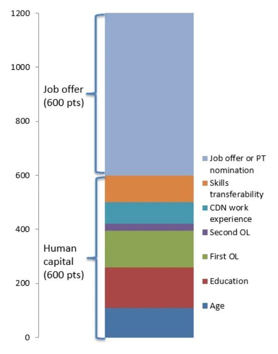

# 无标题

**链接地址:** http://mp.weixin.qq.com/s?__biz=MzUyNzA2NTAwNg==&mid=2247490325&idx=1&sn=d3b5867a6319d7e5be04ec65a79e8bc0&chksm=fa0411d4cd7398c268c172efd9d6aabeba1b3c8963ae2c1feffc9bd226b8c4691011311af595&mpshare=1&scene=2&srcid=07225UKBZAAVWixsDTwrGtxV&sharer_sharetime=1658461657667&sharer_shareid=77848a6b3852ae4dcb6c74ffee84743c#rd
**作者:** 你身边的签证专家
**获取时间:** 2025/8/28 19:36:07
**图片数量:** 21

---

## 原始HTML内容

<section style="box-sizing: border-box;font-style: normal;font-weight: 400;text-align: justify;font-size: 16px;"><section style="text-align: center;margin-top: 10px;margin-bottom: 10px;box-sizing: border-box;" powered-by="xiumi.us"><section style="max-width: 100%;vertical-align: middle;display: inline-block;line-height: 0;box-sizing: border-box;"></section></section><section style="text-align: center;margin-top: 10px;margin-bottom: 10px;box-sizing: border-box;" powered-by="xiumi.us"></section>
 
<section style="margin-top: 10px;margin-bottom: 10px;text-align: center;box-sizing: border-box;" powered-by="xiumi.us"><section style="padding-left: 1em;padding-right: 1em;display: inline-block;box-sizing: border-box;">
<strong style="box-sizing: border-box;">最新情报</strong>
 </section><section style="border-width: 1px;border-style: solid;border-color: rgb(192, 200, 209);margin-top: -1em;padding: 20px 10px 10px;background-color: rgb(239, 239, 239);box-sizing: border-box;"><section style="text-align: justify;box-sizing: border-box;" powered-by="xiumi.us">
 
</section><section style="font-size: 14px;padding: 0px 15px;letter-spacing: 1px;text-align: justify;box-sizing: border-box;" powered-by="xiumi.us">
今天（2022年7月20日），加拿大移民部发布了快速通道（Express Entry, EE）恢复邀请以来的第二轮抽签，结果如下： 

 
</section><section style="margin-top: 10px;margin-bottom: 10px;box-sizing: border-box;" powered-by="xiumi.us"><section style="max-width: 100%;vertical-align: middle;display: inline-block;line-height: 0;width: 90%;height: auto;box-sizing: border-box;"></section></section><section style="font-size: 14px;padding: 0px 15px;letter-spacing: 1px;text-align: justify;box-sizing: border-box;" powered-by="xiumi.us">
 

<strong style="box-sizing: border-box;">好消息</strong>是：相较上次#226轮共1500的邀请人数，该轮人数增加250人，达到1750人。说明恢复邀抽签后的EE有逐渐提速，朝着疫情前每轮常规邀请3000人+的方向进步。

 

<strong style="box-sizing: border-box;">坏消息</strong>是：542分的邀请分数线对于大部分申请者来说依然可望不可及。按照池中待捞人数及每轮邀请的频率和配额，到今年年底邀请分数依然会保持在480分+的高分区间。想要尽快上岸的朋友们请尽可能地做好提分措施。

 

不知道这个邀请结果是否符合大家的预期呢？对于加拿大移民部近期的花样操作有什么想要<strong style="box-sizing: border-box;">吐槽</strong>的，也欢迎在留言框中和我们<strong>分享</strong>哦~
</section><section style="text-align: justify;box-sizing: border-box;" powered-by="xiumi.us">
 
</section></section></section>
 
<section style="font-size: 19px;text-align: center;margin: 10px 0px 3px;box-sizing: border-box;" powered-by="xiumi.us"><section style="display: inline-block;border-width: 1px;border-style: solid;border-color: rgb(188, 65, 65);background-color: rgb(188, 65, 65);width: 1.8em;height: 1.8em;line-height: 1.8em;border-radius: 100%;margin-left: auto;margin-right: auto;font-size: 16px;color: rgb(255, 255, 255);box-sizing: border-box;">
<strong style="box-sizing: border-box;">1</strong>
</section></section><section style="text-align: center;margin: 0px;box-sizing: border-box;" powered-by="xiumi.us"><section style="display: inline-block;width: 0px;height: 0px;vertical-align: top;overflow: hidden;border-style: solid;border-width: 9px 6px 0px;border-color: rgb(188, 65, 65) rgba(255, 255, 255, 0) rgba(255, 255, 255, 0);box-sizing: border-box;"><svg viewBox="0 0 1 1" style="float:left;line-height:0;width:0;vertical-align:top;"></svg></section></section><section style="margin: 0px;box-sizing: border-box;" powered-by="xiumi.us"><section style="text-align: center;box-sizing: border-box;">
<strong style="box-sizing: border-box;">快速通道也要按职业抽签了？</strong>
</section></section><section style="text-align: center;justify-content: center;margin: 0px 0px 10px;display: flex;flex-flow: row nowrap;box-sizing: border-box;" powered-by="xiumi.us"><section style="display: inline-block;width: 14%;vertical-align: top;flex: 0 0 auto;height: auto;align-self: flex-start;box-sizing: border-box;"><section style="margin: 0.5em 0px;box-sizing: border-box;" powered-by="xiumi.us"><section style="background-color: rgb(188, 65, 65);height: 4px;box-sizing: border-box;"><svg viewBox="0 0 1 1" style="float:left;line-height:0;width:0;vertical-align:top;"></svg></section></section></section></section><section style="font-size: 14px;padding: 0px 15px;letter-spacing: 1px;box-sizing: border-box;" powered-by="xiumi.us">
 

前阵子新时代推出了对于“大赦2.0政策”的先导解读，感叹<strong style="box-sizing: border-box;">“按职获邀”的时代</strong>即将来临。

 
</section><section style="margin: 10px 0%;text-align: center;justify-content: center;display: flex;flex-flow: row nowrap;box-sizing: border-box;" powered-by="xiumi.us"><section style="display: inline-block;width: 100%;vertical-align: top;box-shadow: rgb(0, 0, 0) 0px 0px 0px;background-color: rgb(241, 241, 241);padding: 10px;align-self: flex-start;flex: 0 0 auto;box-sizing: border-box;"><section style="justify-content: center;display: flex;flex-flow: row nowrap;box-sizing: border-box;" powered-by="xiumi.us"><section style="display: inline-block;width: 100%;vertical-align: top;background-color: rgb(255, 255, 255);padding: 20px 10px;flex: 0 0 auto;height: auto;box-shadow: rgb(198, 198, 198) 0px 0px 2px;border-width: 0px;border-radius: 6px;border-style: none;border-color: rgb(62, 62, 62);overflow: hidden;align-self: flex-start;box-sizing: border-box;"><section style="display: flex;flex-flow: row nowrap;margin: 0px 0%;justify-content: center;box-sizing: border-box;" powered-by="xiumi.us"><section style="display: inline-block;vertical-align: top;width: auto;flex: 100 100 0%;align-self: flex-start;height: auto;box-shadow: rgb(0, 0, 0) 0px 0px 0px;border-bottom: 1px dashed rgba(106, 106, 106, 0.25);border-bottom-right-radius: 0px;margin: 0px 10px 0px 0px;box-sizing: border-box;"><section style="font-size: 14px;text-align: justify;box-sizing: border-box;" powered-by="xiumi.us">
<a target="_blank" href="http://mp.weixin.qq.com/s?__biz=MzUyNzA2NTAwNg==&amp;mid=2247490175&amp;idx=1&amp;sn=f0ef69ea89555eb5247649c0f92885f6&amp;chksm=fa0410becd7399a8c83ba6f1ca55954ffd912f02fe6a2c763bf7ac19e6fd1765729041d9620e&amp;scene=21#wechat_redirect" textvalue="“大赦2.0”新政更多细节首披露！时间节点、职业清单、抽签模式…“重点”多到划不过来啦！" linktype="text" imgurl="" imgdata="null" data-itemshowtype="0" tab="innerlink" data-linktype="2">“大赦2.0”新政更多细节首披露！时间节点、职业清单、抽签模式…“重点”多到划不过来啦！</a>
</section></section><section style="display: inline-block;vertical-align: top;width: auto;flex: 20 20 0%;align-self: flex-start;height: auto;border-width: 0px;margin: 0px 0px 0px 5px;box-sizing: border-box;"><section style="margin: 0px 0%;box-sizing: border-box;" powered-by="xiumi.us"><section style="max-width: 100%;vertical-align: middle;display: inline-block;line-height: 0;box-shadow: rgb(0, 0, 0) 0px 0px 0px;box-sizing: border-box;"><a target="_blank" href="http://mp.weixin.qq.com/s?__biz=MzUyNzA2NTAwNg==&amp;mid=2247490175&amp;idx=1&amp;sn=f0ef69ea89555eb5247649c0f92885f6&amp;chksm=fa0410becd7399a8c83ba6f1ca55954ffd912f02fe6a2c763bf7ac19e6fd1765729041d9620e&amp;scene=21#wechat_redirect" textvalue="你已选中了添加链接的内容" linktype="text" imgurl="" imgdata="null" data-itemshowtype="0" tab="innerlink" data-linktype="1"></a></section></section></section></section><section style="text-align: justify;box-sizing: border-box;" powered-by="xiumi.us">
 
</section><section style="display: flex;flex-flow: row nowrap;margin: 0px 0%;justify-content: center;box-sizing: border-box;" powered-by="xiumi.us"><section style="display: inline-block;vertical-align: top;width: auto;flex: 100 100 0%;align-self: flex-start;height: auto;box-shadow: rgb(0, 0, 0) 0px 0px 0px;border-bottom: 1px dashed rgba(106, 106, 106, 0.25);border-bottom-right-radius: 0px;margin: 0px 10px 0px 0px;box-sizing: border-box;"><section style="font-size: 14px;text-align: justify;box-sizing: border-box;" powered-by="xiumi.us">
<a target="_blank" href="http://mp.weixin.qq.com/s?__biz=MzUyNzA2NTAwNg==&amp;mid=2247489934&amp;idx=1&amp;sn=eac456313a022c5b7eacf88587359005&amp;chksm=fa04134fcd739a5948e04b159af9471f60be85912030496c5afeefb0d84b98df0b060163e689&amp;scene=21#wechat_redirect" textvalue="加拿大“新版大赦”即将重启，或将永久开放！近期加国移民利好新政有点多~" linktype="text" imgurl="" imgdata="null" data-itemshowtype="0" tab="innerlink" data-linktype="2">加拿大“新版大赦”即将重启，或将永久开放！近期加国移民利好新政有点多~</a>
</section></section><section style="display: inline-block;vertical-align: top;width: auto;flex: 20 20 0%;align-self: flex-start;height: auto;border-width: 0px;margin: 0px 0px 0px 5px;box-sizing: border-box;"><section style="margin: 0px 0%;box-sizing: border-box;" powered-by="xiumi.us"><section style="max-width: 100%;vertical-align: middle;display: inline-block;line-height: 0;box-shadow: rgb(0, 0, 0) 0px 0px 0px;box-sizing: border-box;"><a target="_blank" href="http://mp.weixin.qq.com/s?__biz=MzUyNzA2NTAwNg==&amp;mid=2247489934&amp;idx=1&amp;sn=eac456313a022c5b7eacf88587359005&amp;chksm=fa04134fcd739a5948e04b159af9471f60be85912030496c5afeefb0d84b98df0b060163e689&amp;scene=21#wechat_redirect" textvalue="你已选中了添加链接的内容" linktype="text" imgurl="" imgdata="null" data-itemshowtype="0" tab="innerlink" data-linktype="1"></a></section></section></section></section></section></section></section></section><section style="font-size: 14px;padding: 0px 15px;letter-spacing: 1px;box-sizing: border-box;" powered-by="xiumi.us">
 

然而另一边，本来就被申请积压搞得焦头烂额的加拿大移民部居然还嫌不够热闹，近日又爆出即将对刚刚恢复抽签的快速通道（Express Entry）下狠手——拟在<strong style="box-sizing: border-box;">明年第一季度推出针对职业的定向邀请</strong>。

 

7月19日，CICNews爆料加拿大移民部的一位发言人在电子邮件中提到，移民部计划在2023年第一季度<strong style="box-sizing: border-box;">根据劳动市场目标</strong>开始为候选人举行快速通道抽签。

 
</section><section style="text-align: center;margin-top: 10px;margin-bottom: 10px;box-sizing: border-box;" powered-by="xiumi.us"><section style="max-width: 100%;vertical-align: middle;display: inline-block;line-height: 0;width: 90%;height: auto;box-sizing: border-box;"></section></section><section style="font-size: 14px;padding: 0px 15px;letter-spacing: 1px;box-sizing: border-box;" powered-by="xiumi.us">
 

在这份电子邮件中，该位发言人表示：目前项目的改革已经进入计划阶段，移民部的官员将在C-19法案的基础上最大化移民部甄选候选人的效率，他们将走访一些区域级的移民办公室，根据当地劳动力市场的需求去进行邀请的调整，并准备在<strong style="box-sizing: border-box;">2023年第一季度就开始实施第一轮的定向邀请</strong>。

 
</section>
 
<section style="font-size: 19px;text-align: center;margin: 10px 0px 3px;box-sizing: border-box;" powered-by="xiumi.us"><section style="display: inline-block;border-width: 1px;border-style: solid;border-color: rgb(188, 65, 65);background-color: rgb(188, 65, 65);width: 1.8em;height: 1.8em;line-height: 1.8em;border-radius: 100%;margin-left: auto;margin-right: auto;font-size: 16px;color: rgb(255, 255, 255);box-sizing: border-box;">
<strong style="box-sizing: border-box;">2</strong>
</section></section><section style="text-align: center;margin: 0px;box-sizing: border-box;" powered-by="xiumi.us"><section style="display: inline-block;width: 0px;height: 0px;vertical-align: top;overflow: hidden;border-style: solid;border-width: 9px 6px 0px;border-color: rgb(188, 65, 65) rgba(255, 255, 255, 0) rgba(255, 255, 255, 0);box-sizing: border-box;"><svg viewBox="0 0 1 1" style="float:left;line-height:0;width:0;vertical-align:top;"></svg></section></section><section style="margin: 0px;box-sizing: border-box;" powered-by="xiumi.us"><section style="text-align: center;box-sizing: border-box;">
<strong style="box-sizing: border-box;">什么是C-19法案？</strong>
</section></section><section style="text-align: center;justify-content: center;margin: 0px 0px 10px;display: flex;flex-flow: row nowrap;box-sizing: border-box;" powered-by="xiumi.us"><section style="display: inline-block;width: 14%;vertical-align: top;flex: 0 0 auto;height: auto;align-self: flex-start;box-sizing: border-box;"><section style="margin: 0.5em 0px;box-sizing: border-box;" powered-by="xiumi.us"><section style="background-color: rgb(188, 65, 65);height: 4px;box-sizing: border-box;"><svg viewBox="0 0 1 1" style="float:left;line-height:0;width:0;vertical-align:top;"></svg></section></section></section></section><section style="font-size: 14px;padding: 0px 15px;letter-spacing: 1px;box-sizing: border-box;" powered-by="xiumi.us">
 

加拿大参议院<strong style="box-sizing: border-box;">6月23日以56票支持、16反对的结果通过了C-19法案</strong>。该法案中对快速通道改革的内容，也在加拿大引发了<strong style="box-sizing: border-box;">广泛的争议</strong>。在新规影响下，未来快速通道可能<strong style="box-sizing: border-box;">不再以综合排名系统（CRS）分数为衡量申请者的唯一标准</strong>，也要看申请者的能力是否是加拿大的当下之需。

 
</section><section style="text-align: center;margin-top: 10px;margin-bottom: 10px;box-sizing: border-box;" powered-by="xiumi.us"><section style="max-width: 100%;vertical-align: middle;display: inline-block;line-height: 0;width: 90%;height: auto;box-sizing: border-box;"></section></section><section style="font-size: 14px;padding: 0px 15px;letter-spacing: 1px;box-sizing: border-box;" powered-by="xiumi.us">
 

该法案允许移民部长根据支持区域经济需求的标准邀请快速入境候选人。例如它允许移民部根据候选人的<strong style="box-sizing: border-box;">职业、语言或教育程度</strong>对特定群体发起邀请。

 

C-19法案提出，可以授权移民部长继续细化排名依据，在现有的移民大类别（Class）下建立小类别（Categories），为这些小类别的移民项目制定<strong style="box-sizing: border-box;">独特的审查规则</strong>。通过这种方式来加强政府对快速通道系统的审核能力，以便从永久居民申请中选出更多符合加拿大经济和劳动力需求的人才。

 
</section><section style="text-align: center;margin-top: 10px;margin-bottom: 10px;box-sizing: border-box;" powered-by="xiumi.us"><section style="max-width: 100%;vertical-align: middle;display: inline-block;line-height: 0;box-sizing: border-box;"></section></section><section style="font-size: 14px;padding: 0px 15px;letter-spacing: 1px;box-sizing: border-box;" powered-by="xiumi.us">
 

新立法还规定，部长必须参与公众咨询过程，并每年向议会报告抽签细节，包括各项工作的目标等。

 
</section>
 
<section style="font-size: 19px;text-align: center;margin: 10px 0px 3px;box-sizing: border-box;" powered-by="xiumi.us"><section style="display: inline-block;border-width: 1px;border-style: solid;border-color: rgb(188, 65, 65);background-color: rgb(188, 65, 65);width: 1.8em;height: 1.8em;line-height: 1.8em;border-radius: 100%;margin-left: auto;margin-right: auto;font-size: 16px;color: rgb(255, 255, 255);box-sizing: border-box;">
<strong style="box-sizing: border-box;">3</strong>
</section></section><section style="text-align: center;margin: 0px;box-sizing: border-box;" powered-by="xiumi.us"><section style="display: inline-block;width: 0px;height: 0px;vertical-align: top;overflow: hidden;border-style: solid;border-width: 9px 6px 0px;border-color: rgb(188, 65, 65) rgba(255, 255, 255, 0) rgba(255, 255, 255, 0);box-sizing: border-box;"><svg viewBox="0 0 1 1" style="float:left;line-height:0;width:0;vertical-align:top;"></svg></section></section><section style="margin: 0px;box-sizing: border-box;" powered-by="xiumi.us"><section style="text-align: center;box-sizing: border-box;">
<strong style="box-sizing: border-box;">为什么要更改快速通道邀请规则？</strong> 
</section></section><section style="text-align: center;justify-content: center;margin: 0px 0px 10px;display: flex;flex-flow: row nowrap;box-sizing: border-box;" powered-by="xiumi.us"><section style="display: inline-block;width: 14%;vertical-align: top;flex: 0 0 auto;height: auto;align-self: flex-start;box-sizing: border-box;"><section style="margin: 0.5em 0px;box-sizing: border-box;" powered-by="xiumi.us"><section style="background-color: rgb(188, 65, 65);height: 4px;box-sizing: border-box;"><svg viewBox="0 0 1 1" style="float:left;line-height:0;width:0;vertical-align:top;"></svg></section></section></section></section><section style="font-size: 14px;padding: 0px 15px;letter-spacing: 1px;box-sizing: border-box;" powered-by="xiumi.us">
 

移民部长肖恩·弗雷泽（Sean Fraser）在最近的采访中解释到，如果不对当前的邀请规则和评分系统进行修改，快速入境项目<strong style="box-sizing: border-box;">不允许</strong>移民部根据加拿大劳动力市场的表现去定制申请邀请(ITA) 以更高效地吸纳人才。

 

弗雷泽表示：目前加拿大快速通道申请出现一个状况，即<strong style="box-sizing: border-box;">大量申请者都集中在特定领域</strong>，而该领域在加拿大并没有很高的就业缺口。因此当前的快速通道系统并不能为加拿大的劳动力市场带来他们所需要的人才。

 

另外，弗雷泽在此前的采访中也提到了，目前对于部分移民项目的改革是为了让新移民朋友们能够更好地从<strong style="box-sizing: border-box;">职业、语言和家庭背景</strong>等方面去融入他们居住的社区并取得成功，而不是为了更高的移民分数把自己塞在不合适的岗位和城镇中。

 
</section><section style="text-align: center;margin-top: 10px;margin-bottom: 10px;box-sizing: border-box;" powered-by="xiumi.us"><section style="max-width: 100%;vertical-align: middle;display: inline-block;line-height: 0;width: 90%;height: auto;box-sizing: border-box;"></section></section><section style="font-size: 14px;padding: 0px 15px;letter-spacing: 1px;box-sizing: border-box;" powered-by="xiumi.us">
 

前段时间，媒体爆料出加拿大因为高居不下的生活成本难以留住年轻移民群体，<strong style="box-sizing: border-box;">超30%的新移民计划在获取身份后搬家的新闻</strong>。

 

弗雷泽希望通过这样的改革去提高新移民获取身份后的<strong style="box-sizing: border-box;">保留率（retention rates）</strong>，而不是一拿到移民就立马更换城市和工作，甚至把加拿大身份当成移民他国的跳板。是“希望”把大家带来了加拿大，他希望这里永远都是带给大家希望的地方。

 
</section><section style="text-align: center;margin-top: 10px;margin-bottom: 10px;box-sizing: border-box;" powered-by="xiumi.us"><section style="max-width: 100%;vertical-align: middle;display: inline-block;line-height: 0;width: 90%;height: auto;box-sizing: border-box;"></section></section><section style="font-size: 14px;padding: 0px 15px;letter-spacing: 1px;box-sizing: border-box;" powered-by="xiumi.us">
 

弗雷泽还表示新的改革会更<strong style="box-sizing: border-box;">加透明化筛选过程</strong>。对C-19法案的早期批评之一是法案可能允许特殊利益集团游说政府邀请某种类型的快速通道候选人。这就是为什么目前又引入了一项<strong style="box-sizing: border-box;">修正案</strong>，要求部长与利益相关者进行公众协商，以获取有关如何举行抽奖以支持经济目标的信息。

 

“如果我坐在渥太华的办公室里就开始鲁莽地决定哪些地区和哪些部门应该从这项新政策中受益，我将走上一条<strong style="box-sizing: border-box;">非常危险的道路</strong>，”弗雷泽说。他认为移民部对快速通道项目的改革需要建立在和当地社区的劳动参与者充分沟通的基础上。移民部需要与省级和地区级的移民办公室进行接触，仔细审查到底不同区域需要的是哪些人才。

 
</section>
 
<section style="font-size: 19px;text-align: center;margin: 10px 0px 3px;box-sizing: border-box;" powered-by="xiumi.us"><section style="display: inline-block;border-width: 1px;border-style: solid;border-color: rgb(188, 65, 65);background-color: rgb(188, 65, 65);width: 1.8em;height: 1.8em;line-height: 1.8em;border-radius: 100%;margin-left: auto;margin-right: auto;font-size: 16px;color: rgb(255, 255, 255);box-sizing: border-box;">
<strong style="box-sizing: border-box;">4</strong>
</section></section><section style="text-align: center;margin: 0px;box-sizing: border-box;" powered-by="xiumi.us"><section style="display: inline-block;width: 0px;height: 0px;vertical-align: top;overflow: hidden;border-style: solid;border-width: 9px 6px 0px;border-color: rgb(188, 65, 65) rgba(255, 255, 255, 0) rgba(255, 255, 255, 0);box-sizing: border-box;"><svg viewBox="0 0 1 1" style="float:left;line-height:0;width:0;vertical-align:top;"></svg></section></section><section style="margin: 0px;box-sizing: border-box;" powered-by="xiumi.us"><section style="text-align: center;box-sizing: border-box;">
<strong style="box-sizing: border-box;">大改革早有征兆</strong>
</section></section><section style="text-align: center;justify-content: center;margin: 0px 0px 10px;display: flex;flex-flow: row nowrap;box-sizing: border-box;" powered-by="xiumi.us"><section style="display: inline-block;width: 14%;vertical-align: top;flex: 0 0 auto;height: auto;align-self: flex-start;box-sizing: border-box;"><section style="margin: 0.5em 0px;box-sizing: border-box;" powered-by="xiumi.us"><section style="background-color: rgb(188, 65, 65);height: 4px;box-sizing: border-box;"><svg viewBox="0 0 1 1" style="float:left;line-height:0;width:0;vertical-align:top;"></svg></section></section></section></section><section style="font-size: 14px;padding: 0px 15px;letter-spacing: 1px;box-sizing: border-box;" powered-by="xiumi.us">
 

对于快速通道改革的传闻从新移民部长肖恩·弗雷泽上任时就已传出。而C-19法案的落地更是<strong style="box-sizing: border-box;">极大推动了改革的实施</strong>。

 

过去快速通道采用的<strong style="box-sizing: border-box;">综合评分系统标准</strong>，Comprehensive Ranking System（简称“CRS”），在对紧缺职业需求上无法做出有效的筛选，而评分标准下赤果果的<strong style="box-sizing: border-box;">“学历歧视”和“语言歧视”</strong>更是让奋斗在一线的蓝领和从事紧缺职业的人士倍感不公。

 
</section><section style="text-align: center;margin-top: 10px;margin-bottom: 10px;box-sizing: border-box;" powered-by="xiumi.us"><section style="max-width: 100%;vertical-align: middle;display: inline-block;line-height: 0;width: 90%;height: auto;box-sizing: border-box;"></section></section><section style="text-align: center;margin-top: 10px;margin-bottom: 10px;box-sizing: border-box;" powered-by="xiumi.us"><section style="max-width: 100%;vertical-align: middle;display: inline-block;line-height: 0;width: 90%;height: auto;box-sizing: border-box;"></section></section><section style="font-size: 14px;padding: 0px 15px;letter-spacing: 1px;box-sizing: border-box;" powered-by="xiumi.us">
 

按照计划，今年下半年<strong style="box-sizing: border-box;">NOC 2021 新版职业划分列表</strong>将正式投入运用。随着NOC职业列表重塑，移民部的目的很可能就是<strong style="box-sizing: border-box;">给不同职业划分权重</strong>，由此进入“按职业抽签”的时代。

 

从大趋势看，EE重开后的逆天高分邀请<strong style="box-sizing: border-box;">只是一个开始</strong>。在改革实施后，如果你的职业不在邀请名单上，很可能仅凭冲高分都没有办法收到邀请！

 

类比同样的移民国家，如澳洲，在2000年左右的时候移民方式和加拿大类似；然而现在则要求<strong style="box-sizing: border-box;">只有特定职业</strong>才可能获得移民邀请。随着海外英语主导移民国家如澳洲、美国、英国、新西兰的逐渐饱和，想要移民的申请人们都半主动半被迫地将目光投向加拿大；再加上具有语言优势的印度新移民的强烈竞(内)争(卷)，一切都昭示了<strong style="box-sizing: border-box;">移民加拿大的难度会越来越高</strong>。

 
</section>
 
<section style="font-size: 19px;text-align: center;margin: 10px 0px 3px;box-sizing: border-box;" powered-by="xiumi.us"><section style="display: inline-block;border-width: 1px;border-style: solid;border-color: rgb(188, 65, 65);background-color: rgb(188, 65, 65);width: 1.8em;height: 1.8em;line-height: 1.8em;border-radius: 100%;margin-left: auto;margin-right: auto;font-size: 16px;color: rgb(255, 255, 255);box-sizing: border-box;">
<strong style="box-sizing: border-box;">5</strong>
</section></section><section style="text-align: center;margin: 0px;box-sizing: border-box;" powered-by="xiumi.us"><section style="display: inline-block;width: 0px;height: 0px;vertical-align: top;overflow: hidden;border-style: solid;border-width: 9px 6px 0px;border-color: rgb(188, 65, 65) rgba(255, 255, 255, 0) rgba(255, 255, 255, 0);box-sizing: border-box;"><svg viewBox="0 0 1 1" style="float:left;line-height:0;width:0;vertical-align:top;"></svg></section></section><section style="margin: 0px;box-sizing: border-box;" powered-by="xiumi.us"><section style="text-align: center;box-sizing: border-box;">
<strong style="box-sizing: border-box;">我没有从事紧缺职业，怎么办？</strong>
</section></section><section style="text-align: center;justify-content: center;margin: 0px 0px 10px;display: flex;flex-flow: row nowrap;box-sizing: border-box;" powered-by="xiumi.us"><section style="display: inline-block;width: 14%;vertical-align: top;flex: 0 0 auto;height: auto;align-self: flex-start;box-sizing: border-box;"><section style="margin: 0.5em 0px;box-sizing: border-box;" powered-by="xiumi.us"><section style="background-color: rgb(188, 65, 65);height: 4px;box-sizing: border-box;"><svg viewBox="0 0 1 1" style="float:left;line-height:0;width:0;vertical-align:top;"></svg></section></section></section></section><section style="font-size: 14px;padding: 0px 15px;letter-spacing: 1px;box-sizing: border-box;" powered-by="xiumi.us">
 

IT类职业、医护类职业、具备法语语言能力的申请人短期内应该不必感到担忧，但是从事一些非紧缺职业的申请人就要注意了：如果你的职业不在被定向邀请范围，进入常规邀请的候选池将面临<strong style="box-sizing: border-box;">更长的邀请周期，更少的邀请名额和更高的邀请分数</strong>，这意味着你可能<strong style="box-sizing: border-box;">很难通过快速通道成功上岸</strong>。

 

定向邀请最令人担忧的是邀请条件可能会根据加拿大劳动力市场的需求<strong style="box-sizing: border-box;">不定期轮换</strong>，这对于想通过留学后拿到毕业工签，积累一定工作经验再走CEC的申请人来说不是一个好消息，因为很难判断从留学到入池这么长的时间内，目标职业是否还在被邀请之列。

 
<section class="mp_profile_iframe_wrp"><mpprofile class="js_uneditable custom_select_card mp_profile_iframe" data-pluginname="mpprofile" data-id="MzUyNzA2NTAwNg==" data-headimg="http://mmbiz.qpic.cn/mmbiz_png/904kUibXm7Y6gq02PdSyzYZvibpBf0icbsnWtqW39AwrqqK8DRQdfwaE8UtUmwOd05nWcoYKrorN7ZuRngiaFhPlibQ/0?wx_fmt=png" data-nickname="新时代留学移民法律事务所" data-alias="" data-signature="加拿大移民顾问监管委员会会员/加拿大注册持牌移民顾问" data-from="0"></mpprofile></section>
 

所以目前能入池的客户朋友们请尽快入池，抓紧改革实施前的窗口期。还在上学的客户朋友们也请把眼光放长远，<strong style="box-sizing: border-box;">提前做好自己的职业规划</strong>。<strong style="box-sizing: border-box;">不同职业在加拿大的拿卡体验可谓天差地别！</strong>

 

如果你认为自己的目前分数和职业不太有被打捞上岸的希望，也欢迎联系我们帮你进行<strong style="box-sizing: border-box;">系统又专业的移民方案规划</strong>。留在加拿大的方式比你想象的多，只要你不放弃，<strong style="box-sizing: border-box;">一定有一条路适合你</strong>！

 
</section><section style="margin: 10px 0%;text-align: center;justify-content: center;display: flex;flex-flow: row nowrap;box-sizing: border-box;" powered-by="xiumi.us"><section style="display: inline-block;width: 100%;vertical-align: top;box-shadow: rgb(0, 0, 0) 0px 0px 0px;background-color: rgb(241, 241, 241);padding: 10px;align-self: flex-start;flex: 0 0 auto;box-sizing: border-box;"><section style="justify-content: center;display: flex;flex-flow: row nowrap;box-sizing: border-box;" powered-by="xiumi.us"><section style="display: inline-block;width: 100%;vertical-align: top;background-color: rgb(255, 255, 255);padding: 20px 10px;flex: 0 0 auto;height: auto;box-shadow: rgb(198, 198, 198) 0px 0px 2px;border-width: 0px;border-radius: 6px;border-style: none;border-color: rgb(62, 62, 62);overflow: hidden;align-self: flex-start;box-sizing: border-box;"><section style="color: rgb(189, 189, 189);text-align: justify;box-sizing: border-box;" powered-by="xiumi.us">
<strong style="box-sizing: border-box;">阅读更多</strong>
</section><section style="text-align: justify;box-sizing: border-box;" powered-by="xiumi.us">
 
</section><section style="display: flex;flex-flow: row nowrap;margin: 0px 0%;justify-content: center;box-sizing: border-box;" powered-by="xiumi.us"><section style="display: inline-block;vertical-align: top;width: auto;flex: 100 100 0%;align-self: flex-start;height: auto;box-shadow: rgb(0, 0, 0) 0px 0px 0px;border-bottom: 1px dashed rgba(106, 106, 106, 0.25);border-bottom-right-radius: 0px;margin: 0px 10px 0px 0px;box-sizing: border-box;"><section style="font-size: 14px;text-align: justify;box-sizing: border-box;" powered-by="xiumi.us">
<a target="_blank" href="http://mp.weixin.qq.com/s?__biz=MzUyNzA2NTAwNg==&amp;mid=2247490221&amp;idx=1&amp;sn=69e79df7bc62e73cd520ac625c73819b&amp;chksm=fa04106ccd73997a1e750a4ea69564fbb23b6254606948e5043f95ba577301f9b5e1d27c4326&amp;scene=21#wechat_redirect" textvalue="“雷声大，雨点稀”，加国快速通道正式重启，史高557分数线，仅1500人上岸！" linktype="text" imgurl="" imgdata="null" data-itemshowtype="0" tab="innerlink" data-linktype="2">“雷声大，雨点稀”，加国快速通道正式重启，史高557分数线，仅1500人上岸！</a>
</section></section><section style="display: inline-block;vertical-align: top;width: auto;flex: 20 20 0%;align-self: flex-start;height: auto;border-width: 0px;margin: 0px 0px 0px 5px;box-sizing: border-box;"><section style="margin: 0px 0%;box-sizing: border-box;" powered-by="xiumi.us"><section style="max-width: 100%;vertical-align: middle;display: inline-block;line-height: 0;box-shadow: rgb(0, 0, 0) 0px 0px 0px;box-sizing: border-box;"><a target="_blank" href="http://mp.weixin.qq.com/s?__biz=MzUyNzA2NTAwNg==&amp;mid=2247490221&amp;idx=1&amp;sn=69e79df7bc62e73cd520ac625c73819b&amp;chksm=fa04106ccd73997a1e750a4ea69564fbb23b6254606948e5043f95ba577301f9b5e1d27c4326&amp;scene=21#wechat_redirect" textvalue="你已选中了添加链接的内容" linktype="text" imgurl="" imgdata="null" data-itemshowtype="0" tab="innerlink" data-linktype="1"></a></section></section></section></section><section style="text-align: justify;box-sizing: border-box;" powered-by="xiumi.us">
 
</section><section style="display: flex;flex-flow: row nowrap;margin: 0px 0%;justify-content: center;box-sizing: border-box;" powered-by="xiumi.us"><section style="display: inline-block;vertical-align: top;width: auto;flex: 100 100 0%;align-self: flex-start;height: auto;box-shadow: rgb(0, 0, 0) 0px 0px 0px;border-bottom: 1px dashed rgba(106, 106, 106, 0.25);border-bottom-right-radius: 0px;margin: 0px 10px 0px 0px;box-sizing: border-box;"><section style="font-size: 14px;text-align: justify;box-sizing: border-box;" powered-by="xiumi.us">
<a target="_blank" href="http://mp.weixin.qq.com/s?__biz=MzUyNzA2NTAwNg==&amp;mid=2247490081&amp;idx=1&amp;sn=0529e05511e2f194f512c124d1d5fcf7&amp;chksm=fa0410e0cd7399f657fd5455c618fe5fe0c82a537b0cf74440eb73ca7e68c67e8d4cd68d499c&amp;scene=21#wechat_redirect" textvalue="终于等到了！加拿大联邦快速通道7月6日重磅回归！" linktype="text" imgurl="" imgdata="null" data-itemshowtype="0" tab="innerlink" data-linktype="2">终于等到了！加拿大联邦快速通道7月6日重磅回归！</a>
</section></section><section style="display: inline-block;vertical-align: top;width: auto;flex: 20 20 0%;align-self: flex-start;height: auto;border-width: 0px;margin: 0px 0px 0px 5px;box-sizing: border-box;"><section style="margin: 0px 0%;box-sizing: border-box;" powered-by="xiumi.us"><section style="max-width: 100%;vertical-align: middle;display: inline-block;line-height: 0;box-shadow: rgb(0, 0, 0) 0px 0px 0px;box-sizing: border-box;"><a target="_blank" href="http://mp.weixin.qq.com/s?__biz=MzUyNzA2NTAwNg==&amp;mid=2247490081&amp;idx=1&amp;sn=0529e05511e2f194f512c124d1d5fcf7&amp;chksm=fa0410e0cd7399f657fd5455c618fe5fe0c82a537b0cf74440eb73ca7e68c67e8d4cd68d499c&amp;scene=21#wechat_redirect" textvalue="你已选中了添加链接的内容" linktype="text" imgurl="" imgdata="null" data-itemshowtype="0" tab="innerlink" data-linktype="1"></a></section></section></section></section></section></section></section></section><section style="text-align: center;margin-top: 10px;margin-bottom: 10px;box-sizing: border-box;" powered-by="xiumi.us"><section style="max-width: 100%;vertical-align: middle;display: inline-block;line-height: 0;width: 100%;height: auto;box-sizing: border-box;"></section></section><section style="text-align: center;margin-top: 10px;margin-bottom: 10px;box-sizing: border-box;" powered-by="xiumi.us"><section style="max-width: 100%;vertical-align: middle;display: inline-block;line-height: 0;box-sizing: border-box;"></section></section><section style="text-align: center;margin-top: 10px;margin-bottom: 10px;box-sizing: border-box;" powered-by="xiumi.us"><section style="max-width: 100%;vertical-align: middle;display: inline-block;line-height: 0;box-sizing: border-box;"></section></section><section style="text-align: center;margin-top: 10px;margin-bottom: 10px;box-sizing: border-box;" powered-by="xiumi.us"><section style="max-width: 100%;vertical-align: middle;display: inline-block;line-height: 0;box-sizing: border-box;"></section></section><section style="text-align: center;margin-top: 10px;margin-bottom: 10px;box-sizing: border-box;" powered-by="xiumi.us"><section style="max-width: 100%;vertical-align: middle;display: inline-block;line-height: 0;box-sizing: border-box;"></section></section><section style="padding: 0px 15px;font-size: 12px;color: rgb(121, 121, 121);box-sizing: border-box;" powered-by="xiumi.us">
<strong style="box-sizing: border-box;">参考信息：</strong>

 

https://www.cicnews.com/2022/07/canada-plans-to-hold-targeted-express-entry-draws-in-early-2023-0729167.html#gs.694jbx
</section><section style="text-align: center;margin-top: 10px;margin-bottom: 10px;box-sizing: border-box;" powered-by="xiumi.us"><section style="max-width: 100%;vertical-align: middle;display: inline-block;line-height: 0;box-sizing: border-box;"></section></section><section style="text-align: center;margin-top: 10px;margin-bottom: 10px;box-sizing: border-box;" powered-by="xiumi.us"><section style="max-width: 100%;vertical-align: middle;display: inline-block;line-height: 0;box-sizing: border-box;"></section></section></section>
 

---

## 纯文本内容

最新情报 今天（2022年7月20日），加拿大移民部发布了快速通道（Express Entry, EE）恢复邀请以来的第二轮抽签，结果如下：好消息是：相较上次#226轮共1500的邀请人数，该轮人数增加250人，达到1750人。说明恢复邀抽签后的EE有逐渐提速，朝着疫情前每轮常规邀请3000人+的方向进步。坏消息是：542分的邀请分数线对于大部分申请者来说依然可望不可及。按照池中待捞人数及每轮邀请的频率和配额，到今年年底邀请分数依然会保持在480分+的高分区间。想要尽快上岸的朋友们请尽可能地做好提分措施。不知道这个邀请结果是否符合大家的预期呢？对于加拿大移民部近期的花样操作有什么想要吐槽的，也欢迎在留言框中和我们分享哦~1快速通道也要按职业抽签了？前阵子新时代推出了对于“大赦2.0政策”的先导解读，感叹“按职获邀”的时代即将来临。“大赦2.0”新政更多细节首披露！时间节点、职业清单、抽签模式…“重点”多到划不过来啦！加拿大“新版大赦”即将重启，或将永久开放！近期加国移民利好新政有点多~然而另一边，本来就被申请积压搞得焦头烂额的加拿大移民部居然还嫌不够热闹，近日又爆出即将对刚刚恢复抽签的快速通道（Express Entry）下狠手——拟在明年第一季度推出针对职业的定向邀请。7月19日，CICNews爆料加拿大移民部的一位发言人在电子邮件中提到，移民部计划在2023年第一季度根据劳动市场目标开始为候选人举行快速通道抽签。在这份电子邮件中，该位发言人表示：目前项目的改革已经进入计划阶段，移民部的官员将在C-19法案的基础上最大化移民部甄选候选人的效率，他们将走访一些区域级的移民办公室，根据当地劳动力市场的需求去进行邀请的调整，并准备在2023年第一季度就开始实施第一轮的定向邀请。2什么是C-19法案？加拿大参议院6月23日以56票支持、16反对的结果通过了C-19法案。该法案中对快速通道改革的内容，也在加拿大引发了广泛的争议。在新规影响下，未来快速通道可能不再以综合排名系统（CRS）分数为衡量申请者的唯一标准，也要看申请者的能力是否是加拿大的当下之需。该法案允许移民部长根据支持区域经济需求的标准邀请快速入境候选人。例如它允许移民部根据候选人的职业、语言或教育程度对特定群体发起邀请。C-19法案提出，可以授权移民部长继续细化排名依据，在现有的移民大类别（Class）下建立小类别（Categories），为这些小类别的移民项目制定独特的审查规则。通过这种方式来加强政府对快速通道系统的审核能力，以便从永久居民申请中选出更多符合加拿大经济和劳动力需求的人才。新立法还规定，部长必须参与公众咨询过程，并每年向议会报告抽签细节，包括各项工作的目标等。3为什么要更改快速通道邀请规则？移民部长肖恩·弗雷泽（Sean Fraser）在最近的采访中解释到，如果不对当前的邀请规则和评分系统进行修改，快速入境项目不允许移民部根据加拿大劳动力市场的表现去定制申请邀请(ITA) 以更高效地吸纳人才。弗雷泽表示：目前加拿大快速通道申请出现一个状况，即大量申请者都集中在特定领域，而该领域在加拿大并没有很高的就业缺口。因此当前的快速通道系统并不能为加拿大的劳动力市场带来他们所需要的人才。另外，弗雷泽在此前的采访中也提到了，目前对于部分移民项目的改革是为了让新移民朋友们能够更好地从职业、语言和家庭背景等方面去融入他们居住的社区并取得成功，而不是为了更高的移民分数把自己塞在不合适的岗位和城镇中。前段时间，媒体爆料出加拿大因为高居不下的生活成本难以留住年轻移民群体，超30%的新移民计划在获取身份后搬家的新闻。弗雷泽希望通过这样的改革去提高新移民获取身份后的保留率（retention rates），而不是一拿到移民就立马更换城市和工作，甚至把加拿大身份当成移民他国的跳板。是“希望”把大家带来了加拿大，他希望这里永远都是带给大家希望的地方。弗雷泽还表示新的改革会更加透明化筛选过程。对C-19法案的早期批评之一是法案可能允许特殊利益集团游说政府邀请某种类型的快速通道候选人。这就是为什么目前又引入了一项修正案，要求部长与利益相关者进行公众协商，以获取有关如何举行抽奖以支持经济目标的信息。“如果我坐在渥太华的办公室里就开始鲁莽地决定哪些地区和哪些部门应该从这项新政策中受益，我将走上一条非常危险的道路，”弗雷泽说。他认为移民部对快速通道项目的改革需要建立在和当地社区的劳动参与者充分沟通的基础上。移民部需要与省级和地区级的移民办公室进行接触，仔细审查到底不同区域需要的是哪些人才。4大改革早有征兆对于快速通道改革的传闻从新移民部长肖恩·弗雷泽上任时就已传出。而C-19法案的落地更是极大推动了改革的实施。过去快速通道采用的综合评分系统标准，Comprehensive Ranking System（简称“CRS”），在对紧缺职业需求上无法做出有效的筛选，而评分标准下赤果果的“学历歧视”和“语言歧视”更是让奋斗在一线的蓝领和从事紧缺职业的人士倍感不公。按照计划，今年下半年NOC 2021 新版职业划分列表将正式投入运用。随着NOC职业列表重塑，移民部的目的很可能就是给不同职业划分权重，由此进入“按职业抽签”的时代。从大趋势看，EE重开后的逆天高分邀请只是一个开始。在改革实施后，如果你的职业不在邀请名单上，很可能仅凭冲高分都没有办法收到邀请！类比同样的移民国家，如澳洲，在2000年左右的时候移民方式和加拿大类似；然而现在则要求只有特定职业才可能获得移民邀请。随着海外英语主导移民国家如澳洲、美国、英国、新西兰的逐渐饱和，想要移民的申请人们都半主动半被迫地将目光投向加拿大；再加上具有语言优势的印度新移民的强烈竞(内)争(卷)，一切都昭示了移民加拿大的难度会越来越高。5我没有从事紧缺职业，怎么办？IT类职业、医护类职业、具备法语语言能力的申请人短期内应该不必感到担忧，但是从事一些非紧缺职业的申请人就要注意了：如果你的职业不在被定向邀请范围，进入常规邀请的候选池将面临更长的邀请周期，更少的邀请名额和更高的邀请分数，这意味着你可能很难通过快速通道成功上岸。定向邀请最令人担忧的是邀请条件可能会根据加拿大劳动力市场的需求不定期轮换，这对于想通过留学后拿到毕业工签，积累一定工作经验再走CEC的申请人来说不是一个好消息，因为很难判断从留学到入池这么长的时间内，目标职业是否还在被邀请之列。所以目前能入池的客户朋友们请尽快入池，抓紧改革实施前的窗口期。还在上学的客户朋友们也请把眼光放长远，提前做好自己的职业规划。不同职业在加拿大的拿卡体验可谓天差地别！如果你认为自己的目前分数和职业不太有被打捞上岸的希望，也欢迎联系我们帮你进行系统又专业的移民方案规划。留在加拿大的方式比你想象的多，只要你不放弃，一定有一条路适合你！阅读更多“雷声大，雨点稀”，加国快速通道正式重启，史高557分数线，仅1500人上岸！终于等到了！加拿大联邦快速通道7月6日重磅回归！参考信息：https://www.cicnews.com/2022/07/canada-plans-to-hold-targeted-express-entry-draws-in-early-2023-0729167.html#gs.694jbx

---

## 图片列表

-  (原始链接: https://mmbiz.qpic.cn/mmbiz_jpg/904kUibXm7Y5UorQIcTxjvMibGCLdw061DGPLTmpvAia04FiaajeryhQEXJIQU3ezeDKGZE8gVuUqq2KVE8nu9pgxw/640?wx_fmt=jpeg)
-  (原始链接: https://mmbiz.qpic.cn/mmbiz_jpg/904kUibXm7Y4EC3q40NfCb7jaWhWbgfxibgpavj9rH4EqdQFpzyVg6N8TNSVOsgAOuvg1OSL9ec8ZyRicEzu8Tib7A/640?wx_fmt=jpeg)
-  (原始链接: https://mmbiz.qpic.cn/mmbiz_png/904kUibXm7Y5UorQIcTxjvMibGCLdw061DTsSuibgWGRg72QuvMfLnG7N8D1ROgE5aC9ic8Mx1Y6WSKqOI5WwQ9OQQ/640?wx_fmt=png)
-  (原始链接: https://mmbiz.qpic.cn/mmbiz_jpg/904kUibXm7Y5UorQIcTxjvMibGCLdw061Dia5yVYcO4vibfOznYln4Iice9SjXD1vianQEjqIpJibMKJz8W9XvwehMFsA/640?wx_fmt=jpeg)
-  (原始链接: https://mmbiz.qpic.cn/mmbiz_jpg/904kUibXm7Y5UorQIcTxjvMibGCLdw061DgNuIdwbmJlbBgtKy6iaEiag0sUHv5qKyldibPH8H0eCUXkzibibiaCFpSHZw/640?wx_fmt=jpeg)
-  (原始链接: https://mmbiz.qpic.cn/mmbiz_jpg/904kUibXm7Y5UorQIcTxjvMibGCLdw061DHnNsQXnUibqAGA2YV21m25R6BKret7we1xvQicmwibiaZJyTKYkxzv2SxA/640?wx_fmt=jpeg)
-  (原始链接: https://mmbiz.qpic.cn/mmbiz_jpg/904kUibXm7Y5UorQIcTxjvMibGCLdw061DXiaKNCt0TgMAVfFfakLQHoQgf53weNamCu1ar3sHCkEzMqTtHBEsQ0w/640?wx_fmt=jpeg)
-  (原始链接: https://mmbiz.qpic.cn/mmbiz_png/904kUibXm7Y5UorQIcTxjvMibGCLdw061Ds48YibGC8sZZuOfW05PgeWwP4SDlXX9gLwhk4sXbyUahdxvic2uFS4ibw/640?wx_fmt=png)
-  (原始链接: https://mmbiz.qpic.cn/mmbiz_jpg/904kUibXm7Y5UorQIcTxjvMibGCLdw061D2M11GLSdwf1SjaKdpE8y6118TLfuicicrWu6MbYeeBJNEKGplP9Eibh9A/640?wx_fmt=jpeg)
-  (原始链接: https://mmbiz.qpic.cn/mmbiz_jpg/904kUibXm7Y5UorQIcTxjvMibGCLdw061DVaicXHTxHRSqbvqsePibMZzpGSCfNqtSrdpxRXSRsQvdvOKYGOPIxtXw/640?wx_fmt=jpeg)
-  (原始链接: https://mmbiz.qpic.cn/mmbiz_png/904kUibXm7Y5UorQIcTxjvMibGCLdw061DQ4icgbLL10DC1e1LwJSPgknOxkSicuia137qVeNgwWpQqmicjTTzF56YRA/640?wx_fmt=png)
-  (原始链接: https://mmbiz.qpic.cn/mmbiz_jpg/904kUibXm7Y5UorQIcTxjvMibGCLdw061DicsEW9Kn8ACX82OVickG0u3pK4kn1rKmUTRqVnwx59ng2ibps6TyuKxkw/640?wx_fmt=jpeg)
-  (原始链接: https://mmbiz.qpic.cn/mmbiz_png/904kUibXm7Y5UorQIcTxjvMibGCLdw061DnJDRX4U87lWNmgGHpiaEIdTDTnN0UhO2qeSSjFKicrZIZP0d5Gjdj9Ug/640?wx_fmt=png)
-  (原始链接: https://mmbiz.qpic.cn/mmbiz_jpg/904kUibXm7Y5UorQIcTxjvMibGCLdw061DSVEvpsDziao5qqhlDMa1ToRibibsMafrfOPUZ56K79A2ItNAvP6BFibV8Q/640?wx_fmt=jpeg)
-  (原始链接: https://mmbiz.qpic.cn/mmbiz_png/904kUibXm7Y5UorQIcTxjvMibGCLdw061DK9EREoPlHIk3mwaU7YvWmt84ryONxTcVjp8VAZ4zhMv6I41A9gzNCg/640?wx_fmt=png)
-  (原始链接: https://mmbiz.qpic.cn/mmbiz_png/904kUibXm7Y5UorQIcTxjvMibGCLdw061D3g23q1ia3pP6p4AYDFQfjJeicO61fxwQ4dsia1HM5XpXYLibADKiaibpdicUw/640?wx_fmt=png)
-  (原始链接: https://mmbiz.qpic.cn/mmbiz_jpg/904kUibXm7Y5UorQIcTxjvMibGCLdw061DLkqZ62rJKZsHA5TljOgyInQfn9ovKgsoqw4F6jcBABUhibF8H4fdb3A/640?wx_fmt=jpeg)
-  (原始链接: https://mmbiz.qpic.cn/mmbiz_jpg/904kUibXm7Y5UorQIcTxjvMibGCLdw061DPJTdTlHEh5nmDvuwW0oMTPwdsrWquUgpCUdlk1luPfegpXmvGnbP8A/640?wx_fmt=jpeg)
-  (原始链接: https://mmbiz.qpic.cn/mmbiz_jpg/904kUibXm7Y5UorQIcTxjvMibGCLdw061DUudNb9SZMEFDA1p8ZFMPz8hfcHDB6h2RabwGlic1hOibg7ick9ht2o5YQ/640?wx_fmt=jpeg)
-  (原始链接: https://mmbiz.qpic.cn/mmbiz_jpg/904kUibXm7Y5UorQIcTxjvMibGCLdw061DFV4SFzhna3lCKeUIa2msBuMeqJJGkV0eibpB6w4GAjg6lX4ibEVoYBfg/640?wx_fmt=jpeg)
-  (原始链接: https://mmbiz.qpic.cn/mmbiz_jpg/904kUibXm7Y5UorQIcTxjvMibGCLdw061Dv7rjYQOOxhMr89WBgHhdnSZemRJvuLHiaOPyq4H58PpS1dfqicRibcQuA/640?wx_fmt=jpeg)
