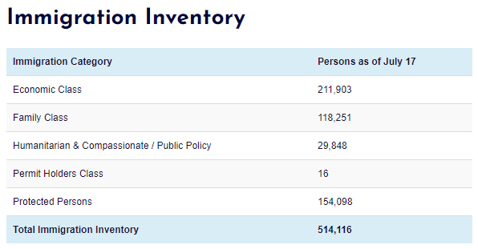
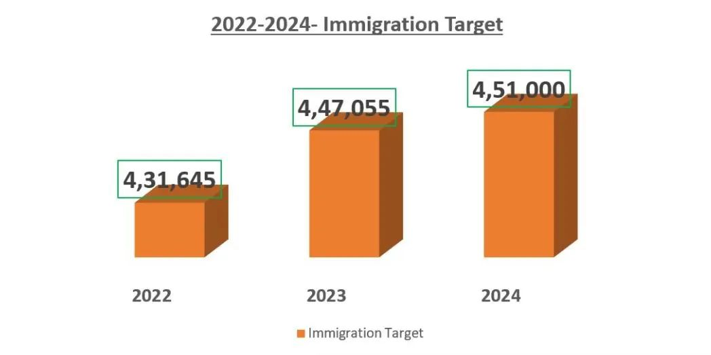

# 无标题

**链接地址:** http://mp.weixin.qq.com/s?__biz=MzUyNzA2NTAwNg==&mid=2247490371&idx=1&sn=3b43895bd6ae762dd4eb2415e71b6882&chksm=fa041182cd739894384267b3856a73d905083625e5d2f604e082b88395a59be76b720d1b6cca&mpshare=1&scene=2&srcid=0724UEFjci7flQmlLoNtsyrm&sharer_sharetime=1658623174837&sharer_shareid=77848a6b3852ae4dcb6c74ffee84743c#rd
**作者:** 你身边的签证专家
**获取时间:** 2025/8/28 19:35:49
**图片数量:** 20

---

## 原始HTML内容

<section style="box-sizing: border-box;font-style: normal;font-weight: 400;text-align: justify;font-size: 16px;"><section style="text-align: center;margin-top: 10px;margin-bottom: 10px;box-sizing: border-box;" powered-by="xiumi.us"><section style="max-width: 100%;vertical-align: middle;display: inline-block;line-height: 0;box-sizing: border-box;"></section></section><section style="text-align: center;margin-top: 10px;margin-bottom: 10px;box-sizing: border-box;" powered-by="xiumi.us"></section>
 
<section style="font-size: 19px;text-align: center;margin: 10px 0px 3px;box-sizing: border-box;" powered-by="xiumi.us"><section style="display: inline-block;border-width: 1px;border-style: solid;border-color: rgb(188, 65, 65);background-color: rgb(188, 65, 65);width: 1.8em;height: 1.8em;line-height: 1.8em;border-radius: 100%;margin-left: auto;margin-right: auto;font-size: 16px;color: rgb(255, 255, 255);box-sizing: border-box;">
<strong style="box-sizing: border-box;">1</strong>
</section></section><section style="text-align: center;margin: 0px;box-sizing: border-box;" powered-by="xiumi.us"><section style="display: inline-block;width: 0px;height: 0px;vertical-align: top;overflow: hidden;border-style: solid;border-width: 9px 6px 0px;border-color: rgb(188, 65, 65) rgba(255, 255, 255, 0) rgba(255, 255, 255, 0);box-sizing: border-box;"><svg viewBox="0 0 1 1" style="float:left;line-height:0;width:0;vertical-align:top;"></svg></section></section><section style="margin: 0px;box-sizing: border-box;" powered-by="xiumi.us"><section style="text-align: center;box-sizing: border-box;">
<strong style="box-sizing: border-box;">加拿大移民部积压申请270万份</strong>
</section></section><section style="text-align: center;justify-content: center;margin: 0px 0px 10px;display: flex;flex-flow: row nowrap;box-sizing: border-box;" powered-by="xiumi.us"><section style="display: inline-block;width: 14%;vertical-align: top;flex: 0 0 auto;height: auto;align-self: flex-start;box-sizing: border-box;"><section style="margin: 0.5em 0px;box-sizing: border-box;" powered-by="xiumi.us"><section style="background-color: rgb(188, 65, 65);height: 4px;box-sizing: border-box;"><svg viewBox="0 0 1 1" style="float:left;line-height:0;width:0;vertical-align:top;"></svg></section></section></section></section>
 
<section style="font-size: 14px;padding: 0px 15px;letter-spacing: 1px;box-sizing: border-box;" powered-by="xiumi.us">
近期CICNews爆料，根据加拿大移民部刚刚公布的库存数据，目前<strong style="box-sizing: border-box;">待审理的各项申请已经累积到了270万份</strong>！<strong style="box-sizing: border-box;">单月新增30万份</strong>！

 
</section><section style="text-align: center;margin-top: 10px;margin-bottom: 10px;box-sizing: border-box;" powered-by="xiumi.us"><section style="max-width: 100%;vertical-align: middle;display: inline-block;line-height: 0;width: 90%;height: auto;box-sizing: border-box;"></section></section><section style="font-size: 14px;padding: 0px 15px;letter-spacing: 1px;box-sizing: border-box;" powered-by="xiumi.us">
 

每年的七、八月都是加拿大移民、留学、签证的申请旺季，很多人都会选择在这个时候出国。加上疫情前两年一些推迟出国的人群，加拿大移民部在<strong style="box-sizing: border-box;">今年夏季显得格外繁忙</strong>。

 

好在虽然申请积压的总数在上升，刚刚重开快速通道项目抽签的经济类移民却迎来了<strong style="box-sizing: border-box;">积压的减少</strong>。目前，快速通道是移民部承诺<strong style="box-sizing: border-box;">重点清库存</strong>的对象。

 
</section><section style="text-align: center;margin-top: 10px;margin-bottom: 10px;box-sizing: border-box;" powered-by="xiumi.us"><section style="max-width: 100%;vertical-align: middle;display: inline-block;line-height: 0;width: 90%;height: auto;box-sizing: border-box;"></section></section><section style="font-size: 14px;padding: 0px 15px;letter-spacing: 1px;box-sizing: border-box;" powered-by="xiumi.us">
 

其中，CEC类别从六月份的6,088份下降到了5,195份。FSW类别从六月份的25,081减少到了18,127份，是移民局当下的<strong style="box-sizing: border-box;">重点优先审理项目</strong>。

 

快速通道在本月已经迎来了两次新的邀请，移民局早在先前承诺，一旦恢复邀请，审批速度将重新<strong style="box-sizing: border-box;">回到六个月的标准审批时间内</strong>。为了达到更高的审批效率，加拿大联邦政府更是在去年年底拨款<strong style="box-sizing: border-box;">8500万加元</strong>去增派移民部门的人手和更新电子申请系统。

 

目前，各经济类移民项目对比先前均有所下降，<strong style="box-sizing: border-box;">快速通道审批提速感人</strong>。但这并不是移民部近期给我们带来的唯一好消息。

 

 
</section><section style="font-size: 19px;text-align: center;margin: 10px 0px 3px;box-sizing: border-box;" powered-by="xiumi.us"><section style="display: inline-block;border-width: 1px;border-style: solid;border-color: rgb(188, 65, 65);background-color: rgb(188, 65, 65);width: 1.8em;height: 1.8em;line-height: 1.8em;border-radius: 100%;margin-left: auto;margin-right: auto;font-size: 16px;color: rgb(255, 255, 255);box-sizing: border-box;">
<strong style="box-sizing: border-box;">2</strong>
</section></section><section style="text-align: center;margin: 0px;box-sizing: border-box;" powered-by="xiumi.us"><section style="display: inline-block;width: 0px;height: 0px;vertical-align: top;overflow: hidden;border-style: solid;border-width: 9px 6px 0px;border-color: rgb(188, 65, 65) rgba(255, 255, 255, 0) rgba(255, 255, 255, 0);box-sizing: border-box;"><svg viewBox="0 0 1 1" style="float:left;line-height:0;width:0;vertical-align:top;"></svg></section></section><section style="margin: 0px;box-sizing: border-box;" powered-by="xiumi.us"><section style="text-align: center;box-sizing: border-box;">
<strong style="box-sizing: border-box;">加拿大移民年配额有望超过50万！</strong>
</section></section><section style="text-align: center;justify-content: center;margin: 0px 0px 10px;display: flex;flex-flow: row nowrap;box-sizing: border-box;" powered-by="xiumi.us"><section style="display: inline-block;width: 14%;vertical-align: top;flex: 0 0 auto;height: auto;align-self: flex-start;box-sizing: border-box;"><section style="margin: 0.5em 0px;box-sizing: border-box;" powered-by="xiumi.us"><section style="background-color: rgb(188, 65, 65);height: 4px;box-sizing: border-box;"><svg viewBox="0 0 1 1" style="float:left;line-height:0;width:0;vertical-align:top;"></svg></section></section></section></section>
 
<section style="text-align: center;margin-top: 10px;margin-bottom: 10px;box-sizing: border-box;" powered-by="xiumi.us"><section style="max-width: 100%;vertical-align: middle;display: inline-block;line-height: 0;width: 90%;height: auto;box-sizing: border-box;"></section></section><section style="font-size: 14px;padding: 0px 15px;letter-spacing: 1px;box-sizing: border-box;" powered-by="xiumi.us">
 

在近日的全球技术会议（Collision）中，加拿大移民部长肖恩·弗雷泽（Sean Fraser）分享了他对于加拿大未来迎接更多新永久居民的看法。

 
</section><section style="text-align: center;margin-top: 10px;margin-bottom: 10px;box-sizing: border-box;" powered-by="xiumi.us"><section style="max-width: 100%;vertical-align: middle;display: inline-block;line-height: 0;box-sizing: border-box;"></section></section><section style="font-size: 14px;padding: 0px 15px;letter-spacing: 1px;box-sizing: border-box;" powered-by="xiumi.us">
 

会议中，他立下了一个看似不可能完成的flag：移民部长在任期间，<strong style="box-sizing: border-box;">必须要将加拿大移民配额提升至每年500,000人</strong>！

 

弗雷泽在会议中信心满满地表示，<strong style="box-sizing: border-box;">移民配额迟早会超过50万人</strong>，但配额增加需要以谨慎的方式进行，以<strong style="box-sizing: border-box;">契合全国各地社区的用人需求</strong>。他认为，自己必须成为首位将加拿大移民配额提升至50万的移民部长。

 

每年50万的移民配额不是一个小数目，要知道加拿大是一个总人口还不到4000万的国家。那么，加拿大<strong style="box-sizing: border-box;">目前每年会迎来多少新移民</strong>呢？

 
</section><section style="text-align: center;margin-top: 10px;margin-bottom: 10px;box-sizing: border-box;" powered-by="xiumi.us"><section style="max-width: 100%;vertical-align: middle;display: inline-block;line-height: 0;width: 90%;height: auto;box-sizing: border-box;"></section></section><section style="font-size: 14px;padding: 0px 15px;letter-spacing: 1px;box-sizing: border-box;" powered-by="xiumi.us">
 

在疫情之前，加拿大每年会迎来超过34万新移民，但由于疫情期间的旅行限制和加拿大移民局无法全面复工审理申请，新移民的数量在2020年有所下降。

 

2020年10月，加拿大宣布从2021年起将每年迎接<strong style="box-sizing: border-box;">超过40万新移民来支持疫情后的经济复苏</strong>，最终的结果是这一年有405,000名新移民登陆加拿大。

 
</section><section style="text-align: center;margin-top: 10px;margin-bottom: 10px;box-sizing: border-box;" powered-by="xiumi.us"><section style="max-width: 100%;vertical-align: middle;display: inline-block;line-height: 0;width: 90%;height: auto;box-sizing: border-box;"></section></section><section style="font-size: 14px;padding: 0px 15px;letter-spacing: 1px;box-sizing: border-box;" powered-by="xiumi.us">
 

2022年2月，弗雷泽提交了2022-2024年加拿大移民配额计划。计划表示2022年加拿大的目标是迎接43万新移民，<strong style="box-sizing: border-box;">到2024年，加拿大将迎来45万新移民</strong>。

 

 
</section><section style="font-size: 19px;text-align: center;margin: 10px 0px 3px;box-sizing: border-box;" powered-by="xiumi.us"><section style="display: inline-block;border-width: 1px;border-style: solid;border-color: rgb(188, 65, 65);background-color: rgb(188, 65, 65);width: 1.8em;height: 1.8em;line-height: 1.8em;border-radius: 100%;margin-left: auto;margin-right: auto;font-size: 16px;color: rgb(255, 255, 255);box-sizing: border-box;">
<strong style="box-sizing: border-box;">3</strong>
</section></section><section style="text-align: center;margin: 0px;box-sizing: border-box;" powered-by="xiumi.us"><section style="display: inline-block;width: 0px;height: 0px;vertical-align: top;overflow: hidden;border-style: solid;border-width: 9px 6px 0px;border-color: rgb(188, 65, 65) rgba(255, 255, 255, 0) rgba(255, 255, 255, 0);box-sizing: border-box;"><svg viewBox="0 0 1 1" style="float:left;line-height:0;width:0;vertical-align:top;"></svg></section></section><section style="margin: 0px;box-sizing: border-box;" powered-by="xiumi.us"><section style="text-align: center;box-sizing: border-box;">
<strong style="box-sizing: border-box;">2023-2025年移民配额计划</strong>
</section></section><section style="text-align: center;justify-content: center;margin: 0px 0px 10px;display: flex;flex-flow: row nowrap;box-sizing: border-box;" powered-by="xiumi.us"><section style="display: inline-block;width: 14%;vertical-align: top;flex: 0 0 auto;height: auto;align-self: flex-start;box-sizing: border-box;"><section style="margin: 0.5em 0px;box-sizing: border-box;" powered-by="xiumi.us"><section style="background-color: rgb(188, 65, 65);height: 4px;box-sizing: border-box;"><svg viewBox="0 0 1 1" style="float:left;line-height:0;width:0;vertical-align:top;"></svg></section></section></section></section><section style="font-size: 14px;padding: 0px 15px;letter-spacing: 1px;box-sizing: border-box;" powered-by="xiumi.us">
 

弗雷泽将于今年11月1日再次公布最新的移民配额，也就是<strong style="box-sizing: border-box;">2023-2025年的移民计划</strong>。

 

对于是否正在努力将今年的移民目标提高到50万以上，弗雷泽表示，“成为一个将移民配额提升至50万人的移民部长并不是一件值得骄傲的事。对我来说更重要的是通过<strong style="box-sizing: border-box;">接纳更多移民来满足加拿大各个社区的需求</strong>，并让移民申请人们有更多机会通过我们的移民系统成功来到加拿大。”

 
</section><section style="text-align: center;margin-top: 10px;margin-bottom: 10px;box-sizing: border-box;" powered-by="xiumi.us"><section style="max-width: 100%;vertical-align: middle;display: inline-block;line-height: 0;width: 90%;height: auto;box-sizing: border-box;"></section></section><section style="font-size: 14px;padding: 0px 15px;letter-spacing: 1px;box-sizing: border-box;" powered-by="xiumi.us">
 

我认为我们迟早会达到这一目标，因为我们<strong style="box-sizing: border-box;">对于新移民的需求是非常大</strong>的，同时这里也有非常多的机会。

 

在不超过社区接纳能力的范围内尽可能接纳更多的新移民，这将成为加拿大发展的巨大战略优势。目前加拿大也在为迎接新移民的到来做努力。

 

 
</section><section style="font-size: 19px;text-align: center;margin: 10px 0px 3px;box-sizing: border-box;" powered-by="xiumi.us"><section style="display: inline-block;border-width: 1px;border-style: solid;border-color: rgb(188, 65, 65);background-color: rgb(188, 65, 65);width: 1.8em;height: 1.8em;line-height: 1.8em;border-radius: 100%;margin-left: auto;margin-right: auto;font-size: 16px;color: rgb(255, 255, 255);box-sizing: border-box;">
<strong style="box-sizing: border-box;">4</strong>
</section></section><section style="text-align: center;margin: 0px;box-sizing: border-box;" powered-by="xiumi.us"><section style="display: inline-block;width: 0px;height: 0px;vertical-align: top;overflow: hidden;border-style: solid;border-width: 9px 6px 0px;border-color: rgb(188, 65, 65) rgba(255, 255, 255, 0) rgba(255, 255, 255, 0);box-sizing: border-box;"><svg viewBox="0 0 1 1" style="float:left;line-height:0;width:0;vertical-align:top;"></svg></section></section><section style="margin: 0px;box-sizing: border-box;" powered-by="xiumi.us"><section style="text-align: center;box-sizing: border-box;">
<strong style="box-sizing: border-box;">安省增加省提名移民配额</strong>
</section></section><section style="text-align: center;justify-content: center;margin: 0px 0px 10px;display: flex;flex-flow: row nowrap;box-sizing: border-box;" powered-by="xiumi.us"><section style="display: inline-block;width: 14%;vertical-align: top;flex: 0 0 auto;height: auto;align-self: flex-start;box-sizing: border-box;"><section style="margin: 0.5em 0px;box-sizing: border-box;" powered-by="xiumi.us"><section style="background-color: rgb(188, 65, 65);height: 4px;box-sizing: border-box;"><svg viewBox="0 0 1 1" style="float:left;line-height:0;width:0;vertical-align:top;"></svg></section></section></section></section><section style="font-size: 14px;padding: 0px 15px;letter-spacing: 1px;box-sizing: border-box;" powered-by="xiumi.us">
 

6月28日，安省移民办公室公布了2022年的全年移民规划：<strong style="box-sizing: border-box;">安省的省提名移民配额</strong>（Ontario Immigrant Nominee Program简称OINP）在2022年为9750人！因为人口众多、经济强劲，安省自2007年引进省提名方式以来，其配额一直是与BC省并驾齐驱，<strong style="box-sizing: border-box;">是全加拿大省提名人数最多的省份之一</strong>。

 
</section><section style="text-align: center;margin-top: 10px;margin-bottom: 10px;box-sizing: border-box;" powered-by="xiumi.us"><section style="max-width: 100%;vertical-align: middle;display: inline-block;line-height: 0;width: 90%;height: auto;box-sizing: border-box;"></section></section><section style="font-size: 14px;padding: 0px 15px;letter-spacing: 1px;box-sizing: border-box;" powered-by="xiumi.us">
 

2020年，安省的省提名配额开始为7350人，后来实际邀请人增加到8054人。2021年，联邦政府先是分给安省8600个名额，后来又追加了400个，邀请总数达到了9000人。

 

而今年，安省再次提升至9750个名额，增幅超过8%。对比2021年的8,600个，足足多出了1,150个！再加上年底增加几百个名额，今年安省省提名配额将破万，<strong style="box-sizing: border-box;">创下历史新纪录</strong>。

 

加拿大各省的省提名移民项目，以其丰富的通道设置和灵活的审核标准著称。虽然申请方式和周期略有不同，但依然是面向<strong style="box-sizing: border-box;">留学生毕业后顺利拿到加拿大永居最主流的途径之一</strong>。

 
</section><section style="text-align: center;margin-top: 10px;margin-bottom: 10px;box-sizing: border-box;" powered-by="xiumi.us"><section style="max-width: 100%;vertical-align: middle;display: inline-block;line-height: 0;width: 90%;height: auto;box-sizing: border-box;"></section></section><section style="font-size: 14px;padding: 0px 15px;letter-spacing: 1px;box-sizing: border-box;" powered-by="xiumi.us">
 

如今安省大幅度地提升省提名移民的配额，给加拿大各省争取更多的名额开了一个好头。作为人口长期净流入且劳动力缺口巨大的BC省，加国联邦政府在近期也<strong style="box-sizing: border-box;">极有可能会给予配额上的倾斜</strong>。

 

虽然省提名创立的初衷是为了以更优惠的条件为加拿大<strong style="box-sizing: border-box;">偏远地区吸纳人才</strong>，但疫后加国各地区间分布极端不均的劳动力市场紧缺问题却也在极其现实地推动着这个项目进行配额调整。

 
</section><section style="text-align: center;margin-top: 10px;margin-bottom: 10px;box-sizing: border-box;" powered-by="xiumi.us"><section style="max-width: 100%;vertical-align: middle;display: inline-block;line-height: 0;box-sizing: border-box;"></section></section><section style="font-size: 14px;padding: 0px 15px;letter-spacing: 1px;box-sizing: border-box;" powered-by="xiumi.us">
 

如果移民部长弗雷泽的50万移民配额计划得以顺利实施，那么在人口基数大且劳动力缺口也大省份投递省提名项目的申请者<strong style="box-sizing: border-box;">极有可能是最大受益者</strong>。<strong style="box-sizing: border-box;">根据区域特点按需规划邀请也是移民部长此次改革的重心</strong>，而各省提名移民项目刚好就是实施该计划的最佳渠道。

 
<section class="mp_profile_iframe_wrp"><mpprofile class="js_uneditable custom_select_card mp_profile_iframe" data-pluginname="mpprofile" data-id="MzUyNzA2NTAwNg==" data-headimg="http://mmbiz.qpic.cn/mmbiz_png/904kUibXm7Y6gq02PdSyzYZvibpBf0icbsnWtqW39AwrqqK8DRQdfwaE8UtUmwOd05nWcoYKrorN7ZuRngiaFhPlibQ/0?wx_fmt=png" data-nickname="新时代留学移民法律事务所" data-alias="" data-signature="加拿大移民顾问监管委员会会员/加拿大注册持牌移民顾问" data-from="0"></mpprofile></section>
 

如果你对加拿大各省的省提名项目感兴趣，想要规划一条完整可行的申请道路，欢迎联系<strong style="box-sizing: border-box;">新时代留学移民法律事务所</strong>，预定来自持牌移民顾问的一对一专业咨询！

 
</section><section style="margin: 10px 0%;text-align: center;justify-content: center;display: flex;flex-flow: row nowrap;box-sizing: border-box;" powered-by="xiumi.us"><section style="display: inline-block;width: 100%;vertical-align: top;box-shadow: rgb(0, 0, 0) 0px 0px 0px;background-color: rgb(241, 241, 241);padding: 10px;align-self: flex-start;flex: 0 0 auto;box-sizing: border-box;"><section style="justify-content: center;display: flex;flex-flow: row nowrap;box-sizing: border-box;" powered-by="xiumi.us"><section style="display: inline-block;width: 100%;vertical-align: top;background-color: rgb(255, 255, 255);padding: 20px 10px;flex: 0 0 auto;height: auto;box-shadow: rgb(198, 198, 198) 0px 0px 2px;border-width: 0px;border-radius: 6px;border-style: none;border-color: rgb(62, 62, 62);overflow: hidden;align-self: flex-start;box-sizing: border-box;"><section style="color: rgb(189, 189, 189);text-align: justify;box-sizing: border-box;" powered-by="xiumi.us">
<strong style="box-sizing: border-box;">阅读更多</strong>
</section><section style="text-align: justify;box-sizing: border-box;" powered-by="xiumi.us">
 
</section><section style="display: flex;flex-flow: row nowrap;margin: 0px 0%;justify-content: center;box-sizing: border-box;" powered-by="xiumi.us"><section style="display: inline-block;vertical-align: top;width: auto;flex: 100 100 0%;align-self: flex-start;height: auto;box-shadow: rgb(0, 0, 0) 0px 0px 0px;border-bottom: 1px dashed rgba(106, 106, 106, 0.25);border-bottom-right-radius: 0px;margin: 0px 10px 0px 0px;box-sizing: border-box;"><section style="font-size: 14px;text-align: justify;box-sizing: border-box;" powered-by="xiumi.us">
<a target="_blank" href="http://mp.weixin.qq.com/s?__biz=MzUyNzA2NTAwNg==&amp;mid=2247490221&amp;idx=1&amp;sn=69e79df7bc62e73cd520ac625c73819b&amp;chksm=fa04106ccd73997a1e750a4ea69564fbb23b6254606948e5043f95ba577301f9b5e1d27c4326&amp;scene=21#wechat_redirect" textvalue="“雷声大，雨点稀”，加国快速通道正式重启，史高557分数线，仅1500人上岸！" linktype="text" imgurl="" imgdata="null" data-itemshowtype="0" tab="innerlink" data-linktype="2">“雷声大，雨点稀”，加国快速通道正式重启，史高557分数线，仅1500人上岸！</a>
</section></section><section style="display: inline-block;vertical-align: top;width: auto;flex: 20 20 0%;align-self: flex-start;height: auto;border-width: 0px;margin: 0px 0px 0px 5px;box-sizing: border-box;"><section style="margin: 0px 0%;box-sizing: border-box;" powered-by="xiumi.us"><section style="max-width: 100%;vertical-align: middle;display: inline-block;line-height: 0;box-shadow: rgb(0, 0, 0) 0px 0px 0px;box-sizing: border-box;"><a target="_blank" href="http://mp.weixin.qq.com/s?__biz=MzUyNzA2NTAwNg==&amp;mid=2247490221&amp;idx=1&amp;sn=69e79df7bc62e73cd520ac625c73819b&amp;chksm=fa04106ccd73997a1e750a4ea69564fbb23b6254606948e5043f95ba577301f9b5e1d27c4326&amp;scene=21#wechat_redirect" textvalue="你已选中了添加链接的内容" linktype="text" imgurl="" imgdata="null" data-itemshowtype="0" tab="innerlink" data-linktype="1"></a></section></section></section></section><section style="text-align: justify;box-sizing: border-box;" powered-by="xiumi.us">
 
</section><section style="display: flex;flex-flow: row nowrap;margin: 0px 0%;justify-content: center;box-sizing: border-box;" powered-by="xiumi.us"><section style="display: inline-block;vertical-align: top;width: auto;flex: 100 100 0%;align-self: flex-start;height: auto;box-shadow: rgb(0, 0, 0) 0px 0px 0px;border-bottom: 1px dashed rgba(106, 106, 106, 0.25);border-bottom-right-radius: 0px;margin: 0px 10px 0px 0px;box-sizing: border-box;"><section style="font-size: 14px;text-align: justify;box-sizing: border-box;" powered-by="xiumi.us">
<a target="_blank" href="http://mp.weixin.qq.com/s?__biz=MzUyNzA2NTAwNg==&amp;mid=2247490325&amp;idx=1&amp;sn=d3b5867a6319d7e5be04ec65a79e8bc0&amp;chksm=fa0411d4cd7398c268c172efd9d6aabeba1b3c8963ae2c1feffc9bd226b8c4691011311af595&amp;scene=21#wechat_redirect" textvalue="快速通道大改革！明年第一季度拟进行职业定向邀请！~" linktype="text" imgurl="" imgdata="null" data-itemshowtype="0" tab="innerlink" data-linktype="2">快速通道大改革！明年第一季度拟进行职业定向邀请！~</a>
</section></section><section style="display: inline-block;vertical-align: top;width: auto;flex: 20 20 0%;align-self: flex-start;height: auto;border-width: 0px;margin: 0px 0px 0px 5px;box-sizing: border-box;"><section style="margin: 0px 0%;box-sizing: border-box;" powered-by="xiumi.us"><section style="max-width: 100%;vertical-align: middle;display: inline-block;line-height: 0;box-shadow: rgb(0, 0, 0) 0px 0px 0px;box-sizing: border-box;"><a target="_blank" href="http://mp.weixin.qq.com/s?__biz=MzUyNzA2NTAwNg==&amp;mid=2247490325&amp;idx=1&amp;sn=d3b5867a6319d7e5be04ec65a79e8bc0&amp;chksm=fa0411d4cd7398c268c172efd9d6aabeba1b3c8963ae2c1feffc9bd226b8c4691011311af595&amp;scene=21#wechat_redirect" textvalue="你已选中了添加链接的内容" linktype="text" imgurl="" imgdata="null" data-itemshowtype="0" tab="innerlink" data-linktype="1"></a></section></section></section></section><section style="text-align: justify;box-sizing: border-box;" powered-by="xiumi.us">
 
</section><section style="display: flex;flex-flow: row nowrap;margin: 0px 0%;justify-content: center;box-sizing: border-box;" powered-by="xiumi.us"><section style="display: inline-block;vertical-align: top;width: auto;flex: 100 100 0%;align-self: flex-start;height: auto;box-shadow: rgb(0, 0, 0) 0px 0px 0px;border-bottom: 1px dashed rgba(106, 106, 106, 0.25);border-bottom-right-radius: 0px;margin: 0px 10px 0px 0px;box-sizing: border-box;"><section style="font-size: 14px;text-align: justify;box-sizing: border-box;" powered-by="xiumi.us">
<a target="_blank" href="http://mp.weixin.qq.com/s?__biz=MzUyNzA2NTAwNg==&amp;mid=2247490130&amp;idx=1&amp;sn=6d96a3cfe1e376f4bf84ace04167817d&amp;chksm=fa041093cd7399859f62f7e35c7b3973b09e5fd97d9f9bf68683fc68a0edcc9e86641b0ea601&amp;scene=21#wechat_redirect" textvalue="喜大普奔！加拿大移民部长官宣：留学生毕业工签再延18个月！" linktype="text" imgurl="" imgdata="null" data-itemshowtype="0" tab="innerlink" data-linktype="2">喜大普奔！加拿大移民部长官宣：留学生毕业工签再延18个月！ </a>
</section></section><section style="display: inline-block;vertical-align: top;width: auto;flex: 20 20 0%;align-self: flex-start;height: auto;border-width: 0px;margin: 0px 0px 0px 5px;box-sizing: border-box;"><section style="margin: 0px 0%;box-sizing: border-box;" powered-by="xiumi.us"><section style="max-width: 100%;vertical-align: middle;display: inline-block;line-height: 0;box-shadow: rgb(0, 0, 0) 0px 0px 0px;box-sizing: border-box;"><a target="_blank" href="http://mp.weixin.qq.com/s?__biz=MzUyNzA2NTAwNg==&amp;mid=2247490130&amp;idx=1&amp;sn=6d96a3cfe1e376f4bf84ace04167817d&amp;chksm=fa041093cd7399859f62f7e35c7b3973b09e5fd97d9f9bf68683fc68a0edcc9e86641b0ea601&amp;scene=21#wechat_redirect" textvalue="你已选中了添加链接的内容" linktype="text" imgurl="" imgdata="null" data-itemshowtype="0" tab="innerlink" data-linktype="1"></a></section></section></section></section></section></section></section></section><section style="text-align: center;margin-top: 10px;margin-bottom: 10px;box-sizing: border-box;" powered-by="xiumi.us"><section style="max-width: 100%;vertical-align: middle;display: inline-block;line-height: 0;box-sizing: border-box;"></section></section><section style="text-align: center;margin-top: 10px;margin-bottom: 10px;box-sizing: border-box;" powered-by="xiumi.us"><section style="max-width: 100%;vertical-align: middle;display: inline-block;line-height: 0;box-sizing: border-box;"></section></section><section style="text-align: center;margin-top: 10px;margin-bottom: 10px;box-sizing: border-box;" powered-by="xiumi.us"><section style="max-width: 100%;vertical-align: middle;display: inline-block;line-height: 0;box-sizing: border-box;"></section></section><section style="padding: 0px 15px;font-size: 12px;color: rgb(121, 121, 121);box-sizing: border-box;" powered-by="xiumi.us">
<strong style="box-sizing: border-box;">参考信息：</strong>

<strong style="box-sizing: border-box;">https://www.cicnews.com/2022/06/will-canada-welcome-over-500000-new-immigrants-per-year-0626644.html#gs.6nv0dn</strong>
</section><section style="text-align: center;margin-top: 10px;margin-bottom: 10px;box-sizing: border-box;" powered-by="xiumi.us"><section style="max-width: 100%;vertical-align: middle;display: inline-block;line-height: 0;box-sizing: border-box;"></section></section><section style="text-align: center;margin-top: 10px;margin-bottom: 10px;box-sizing: border-box;" powered-by="xiumi.us"><section style="max-width: 100%;vertical-align: middle;display: inline-block;line-height: 0;box-sizing: border-box;"></section></section></section>
 

---

## 纯文本内容

1加拿大移民部积压申请270万份近期CICNews爆料，根据加拿大移民部刚刚公布的库存数据，目前待审理的各项申请已经累积到了270万份！单月新增30万份！每年的七、八月都是加拿大移民、留学、签证的申请旺季，很多人都会选择在这个时候出国。加上疫情前两年一些推迟出国的人群，加拿大移民部在今年夏季显得格外繁忙。好在虽然申请积压的总数在上升，刚刚重开快速通道项目抽签的经济类移民却迎来了积压的减少。目前，快速通道是移民部承诺重点清库存的对象。其中，CEC类别从六月份的6,088份下降到了5,195份。FSW类别从六月份的25,081减少到了18,127份，是移民局当下的重点优先审理项目。快速通道在本月已经迎来了两次新的邀请，移民局早在先前承诺，一旦恢复邀请，审批速度将重新回到六个月的标准审批时间内。为了达到更高的审批效率，加拿大联邦政府更是在去年年底拨款8500万加元去增派移民部门的人手和更新电子申请系统。目前，各经济类移民项目对比先前均有所下降，快速通道审批提速感人。但这并不是移民部近期给我们带来的唯一好消息。2加拿大移民年配额有望超过50万！在近日的全球技术会议（Collision）中，加拿大移民部长肖恩·弗雷泽（Sean Fraser）分享了他对于加拿大未来迎接更多新永久居民的看法。会议中，他立下了一个看似不可能完成的flag：移民部长在任期间，必须要将加拿大移民配额提升至每年500,000人！弗雷泽在会议中信心满满地表示，移民配额迟早会超过50万人，但配额增加需要以谨慎的方式进行，以契合全国各地社区的用人需求。他认为，自己必须成为首位将加拿大移民配额提升至50万的移民部长。每年50万的移民配额不是一个小数目，要知道加拿大是一个总人口还不到4000万的国家。那么，加拿大目前每年会迎来多少新移民呢？在疫情之前，加拿大每年会迎来超过34万新移民，但由于疫情期间的旅行限制和加拿大移民局无法全面复工审理申请，新移民的数量在2020年有所下降。2020年10月，加拿大宣布从2021年起将每年迎接超过40万新移民来支持疫情后的经济复苏，最终的结果是这一年有405,000名新移民登陆加拿大。2022年2月，弗雷泽提交了2022-2024年加拿大移民配额计划。计划表示2022年加拿大的目标是迎接43万新移民，到2024年，加拿大将迎来45万新移民。32023-2025年移民配额计划弗雷泽将于今年11月1日再次公布最新的移民配额，也就是2023-2025年的移民计划。对于是否正在努力将今年的移民目标提高到50万以上，弗雷泽表示，“成为一个将移民配额提升至50万人的移民部长并不是一件值得骄傲的事。对我来说更重要的是通过接纳更多移民来满足加拿大各个社区的需求，并让移民申请人们有更多机会通过我们的移民系统成功来到加拿大。”我认为我们迟早会达到这一目标，因为我们对于新移民的需求是非常大的，同时这里也有非常多的机会。在不超过社区接纳能力的范围内尽可能接纳更多的新移民，这将成为加拿大发展的巨大战略优势。目前加拿大也在为迎接新移民的到来做努力。4安省增加省提名移民配额6月28日，安省移民办公室公布了2022年的全年移民规划：安省的省提名移民配额（Ontario Immigrant Nominee Program简称OINP）在2022年为9750人！因为人口众多、经济强劲，安省自2007年引进省提名方式以来，其配额一直是与BC省并驾齐驱，是全加拿大省提名人数最多的省份之一。2020年，安省的省提名配额开始为7350人，后来实际邀请人增加到8054人。2021年，联邦政府先是分给安省8600个名额，后来又追加了400个，邀请总数达到了9000人。而今年，安省再次提升至9750个名额，增幅超过8%。对比2021年的8,600个，足足多出了1,150个！再加上年底增加几百个名额，今年安省省提名配额将破万，创下历史新纪录。加拿大各省的省提名移民项目，以其丰富的通道设置和灵活的审核标准著称。虽然申请方式和周期略有不同，但依然是面向留学生毕业后顺利拿到加拿大永居最主流的途径之一。如今安省大幅度地提升省提名移民的配额，给加拿大各省争取更多的名额开了一个好头。作为人口长期净流入且劳动力缺口巨大的BC省，加国联邦政府在近期也极有可能会给予配额上的倾斜。虽然省提名创立的初衷是为了以更优惠的条件为加拿大偏远地区吸纳人才，但疫后加国各地区间分布极端不均的劳动力市场紧缺问题却也在极其现实地推动着这个项目进行配额调整。如果移民部长弗雷泽的50万移民配额计划得以顺利实施，那么在人口基数大且劳动力缺口也大省份投递省提名项目的申请者极有可能是最大受益者。根据区域特点按需规划邀请也是移民部长此次改革的重心，而各省提名移民项目刚好就是实施该计划的最佳渠道。如果你对加拿大各省的省提名项目感兴趣，想要规划一条完整可行的申请道路，欢迎联系新时代留学移民法律事务所，预定来自持牌移民顾问的一对一专业咨询！阅读更多“雷声大，雨点稀”，加国快速通道正式重启，史高557分数线，仅1500人上岸！快速通道大改革！明年第一季度拟进行职业定向邀请！~喜大普奔！加拿大移民部长官宣：留学生毕业工签再延18个月！参考信息：https://www.cicnews.com/2022/06/will-canada-welcome-over-500000-new-immigrants-per-year-0626644.html#gs.6nv0dn

---

## 图片列表

-  (原始链接: https://mmbiz.qpic.cn/mmbiz_jpg/904kUibXm7Y5xGPp1HXicqVNjF8b7vib3XduP5bDicOk5E5vBWHbR9ZgEBAcclOpSdeDYoeeah0nqCvXXVAdCkJoBg/640?wx_fmt=jpeg)
-  (原始链接: https://mmbiz.qpic.cn/mmbiz_jpg/904kUibXm7Y4EC3q40NfCb7jaWhWbgfxibgpavj9rH4EqdQFpzyVg6N8TNSVOsgAOuvg1OSL9ec8ZyRicEzu8Tib7A/640?wx_fmt=jpeg)
-  (原始链接: https://mmbiz.qpic.cn/mmbiz_jpg/904kUibXm7Y5xGPp1HXicqVNjF8b7vib3XdJia6lGvDcrattp3Antn7VghfFY9IMqfrSMT6PqQUnDK4m7G9tUXEiaaQ/640?wx_fmt=jpeg)
-  (原始链接: https://mmbiz.qpic.cn/mmbiz_png/904kUibXm7Y5xGPp1HXicqVNjF8b7vib3XdVzy14KLQupNX4pyoztQGibLLydicnvqKiapdXiarUe0R6rticpdQ9DbhfBw/640?wx_fmt=png)
-  (原始链接: https://mmbiz.qpic.cn/mmbiz_jpg/904kUibXm7Y5xGPp1HXicqVNjF8b7vib3XdEibDUIFyMRnCaISkHX0jZr3FK7epBYZ0rMeEduD7dKPJgDx5w0UkqXQ/640?wx_fmt=jpeg)
-  (原始链接: https://mmbiz.qpic.cn/mmbiz_png/904kUibXm7Y5xGPp1HXicqVNjF8b7vib3XdNxd7BW0HvNcGQ3vmXlW5GLhZicHbs8TWX46wbdBnuBOmLzb3dicTD3rw/640?wx_fmt=png)
-  (原始链接: https://mmbiz.qpic.cn/mmbiz_jpg/904kUibXm7Y5xGPp1HXicqVNjF8b7vib3Xdk1WcucHZNjA9OKEegSyLRPuDqYn7mTSHFWhNhf21icASYDiaUW60WvNA/640?wx_fmt=jpeg)
-  (原始链接: https://mmbiz.qpic.cn/mmbiz_jpg/904kUibXm7Y5xGPp1HXicqVNjF8b7vib3XduIgkP3ubp00hyKPMVZd3p8PEF5W3TcD8wuXNmQQIEIBF897kP0kCpQ/640?wx_fmt=jpeg)
-  (原始链接: https://mmbiz.qpic.cn/mmbiz_png/904kUibXm7Y5xGPp1HXicqVNjF8b7vib3XdRLUibChzA0KBNa3sfqcBkxZWcEbezUAVWORKZ8Zx8jIT13bEzbkeKYg/640?wx_fmt=png)
-  (原始链接: https://mmbiz.qpic.cn/mmbiz_jpg/904kUibXm7Y5xGPp1HXicqVNjF8b7vib3Xdl6yl1ksAuOqXmAJp6ichVHGHgSzf6XzX6yMS7Bq8zhvpiagMPbDJMRFw/640?wx_fmt=jpeg)
-  (原始链接: https://mmbiz.qpic.cn/mmbiz_jpg/904kUibXm7Y5xGPp1HXicqVNjF8b7vib3XdGrVB4ODvTXMHAH87iaJU8ULa9ScjfEUsALF67IYD7AlYovmGicovzYUw/640?wx_fmt=jpeg)
-  (原始链接: https://mmbiz.qpic.cn/mmbiz_png/904kUibXm7Y5xGPp1HXicqVNjF8b7vib3XdaCsWpegBR00pqD2iaycPm9yAgnfJ31Nwj9VtVyS9Cpl4IP7b503NOiaw/640?wx_fmt=png)
-  (原始链接: https://mmbiz.qpic.cn/mmbiz_jpg/904kUibXm7Y5xGPp1HXicqVNjF8b7vib3XdaeM5uib92jmcCJJqy6SbZZKDGn2al1zicoFNRZ95C7AjnDNyaVMGXyicQ/640?wx_fmt=jpeg)
-  (原始链接: https://mmbiz.qpic.cn/mmbiz_jpg/904kUibXm7Y5xGPp1HXicqVNjF8b7vib3XdxoAc80PoH9Bh0h1Mn5MnBPw14dve9DMKtYoq71hgrHtu1kQTsPicONA/640?wx_fmt=jpeg)
-  (原始链接: https://mmbiz.qpic.cn/mmbiz_jpg/904kUibXm7Y5xGPp1HXicqVNjF8b7vib3XdFjzniaEQcZgdcgQdly16FyQ4rMU31IKYbInq7lChcicj0CfYKBwGtBbQ/640?wx_fmt=jpeg)
-  (原始链接: https://mmbiz.qpic.cn/mmbiz_jpg/904kUibXm7Y5xGPp1HXicqVNjF8b7vib3XdRRZbaHWr8nCibFXMcTqMTddx7TRC8vnKQTlJmybvPaXicLLxhic7sYibNQ/640?wx_fmt=jpeg)
-  (原始链接: https://mmbiz.qpic.cn/mmbiz_jpg/904kUibXm7Y5xGPp1HXicqVNjF8b7vib3Xd10mmSpmGC5A9k9zibOP7399QL3MknJyZ3cw7b7w6hibrLohriccibH7sXw/640?wx_fmt=jpeg)
-  (原始链接: https://mmbiz.qpic.cn/mmbiz_jpg/904kUibXm7Y5xGPp1HXicqVNjF8b7vib3XdX3yAbF6dSAzcwFskfGVAZw5s1JX0jr5vpAOHbX1FQfkwMH5GLMq7QQ/640?wx_fmt=jpeg)
-  (原始链接: https://mmbiz.qpic.cn/mmbiz_jpg/904kUibXm7Y5xGPp1HXicqVNjF8b7vib3XdJdwrum0lzmlNxxsJua7sdtZSTM2WeYFBMj0pbdqBqUQH3qukyy1Wag/640?wx_fmt=jpeg)
-  (原始链接: https://mmbiz.qpic.cn/mmbiz_jpg/904kUibXm7Y5xGPp1HXicqVNjF8b7vib3XdS1SNkHWLuEzcnYT5tcoEyg8kMFZXsqKehswzVpADop33Stch6jDLsA/640?wx_fmt=jpeg)
