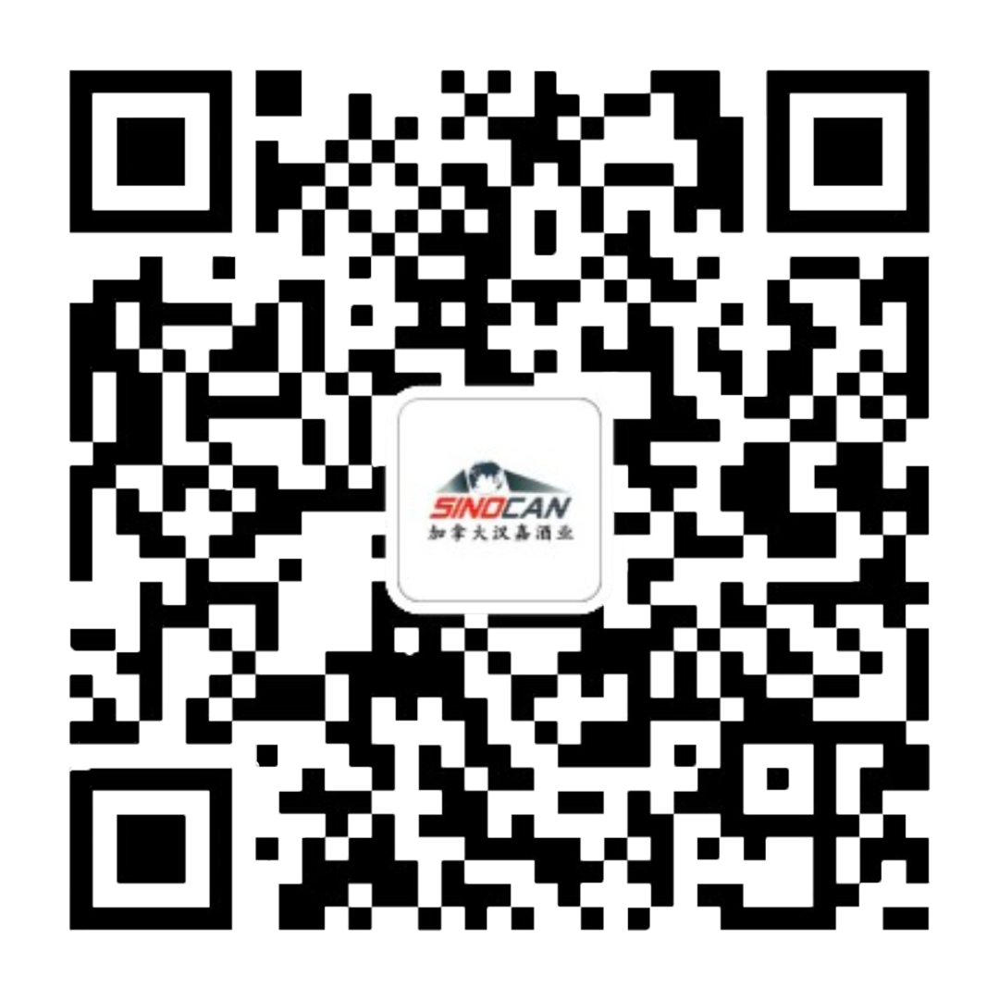

# 无标题

**链接地址:** http://mp.weixin.qq.com/s?__biz=MzIyMzU4OTc0MQ==&mid=2247488924&idx=1&sn=3ac4eea43d924f78f49f64073dbb238d&chksm=e81ab19edf6d3888d1bcd094e6f980d185162b6437dc4ecce15fc84dd4b999ef05ce31ac0069&mpshare=1&scene=2&srcid=0730HWyiR3fkdUexGxfPI4zD&sharer_sharetime=1659132503893&sharer_shareid=77848a6b3852ae4dcb6c74ffee84743c#rd
**作者:** 欢迎转发
**获取时间:** 2025/8/28 19:35:07
**图片数量:** 3

---

## 原始HTML内容

<section style="box-sizing: border-box;font-style: normal;font-weight: 400;text-align: justify;font-size: 16px;"><section style="display: flex;flex-flow: row nowrap;margin: 10px 0px;text-align: left;justify-content: flex-start;box-sizing: border-box;" powered-by="xiumi.us"><section style="display: inline-block;vertical-align: bottom;width: auto;min-width: 10%;max-width: 100%;flex: 0 0 auto;height: auto;align-self: flex-end;margin: 0px;border-left: 0px solid rgb(62, 62, 62);border-bottom-left-radius: 0px;box-sizing: border-box;"><section style="transform: perspective(0px);transform-style: flat;box-sizing: border-box;" powered-by="xiumi.us"><section style="margin: 0px;transform: rotateX(180deg);box-sizing: border-box;"><section style="display: inline-block;width: 48%;height: 10px;vertical-align: top;overflow: hidden;background-color: rgb(231, 217, 203);box-sizing: border-box;"><svg viewBox="0 0 1 1" style="float:left;line-height:0;width:0;vertical-align:top;"></svg></section></section></section><section style="margin: 7px 0px 0px;box-sizing: border-box;" powered-by="xiumi.us"><section style="font-size: 18px;text-align: justify;box-sizing: border-box;">
<strong style="box-sizing: border-box;">点击</strong><strong style="box-sizing: border-box;">蓝字 关注我们</strong>
</section></section></section><section style="display: inline-block;vertical-align: bottom;width: auto;min-width: 10%;max-width: 100%;flex: 0 0 auto;height: auto;align-self: flex-end;box-sizing: border-box;"><svg viewBox="0 0 1 1" style="float:left;line-height:0;width:0;vertical-align:top;"></svg></section></section>
 
<section style="text-align: center;justify-content: center;margin: 10px 0% 0px;display: flex;flex-flow: row nowrap;box-sizing: border-box;" powered-by="xiumi.us"><section style="display: inline-block;width: auto;vertical-align: top;min-width: 10%;max-width: 100%;flex: 0 0 auto;height: auto;align-self: flex-start;box-sizing: border-box;"><section style="justify-content: center;display: flex;flex-flow: row nowrap;box-sizing: border-box;" powered-by="xiumi.us"><section style="display: inline-block;vertical-align: bottom;width: auto;flex: 100 100 0%;height: auto;align-self: flex-end;line-height: 0;box-sizing: border-box;"><section style="box-sizing: border-box;" powered-by="xiumi.us"><section style="display: inline-block;width: 2px;height: 6px;vertical-align: top;overflow: hidden;background-color: rgb(192, 221, 237);box-sizing: border-box;"><svg viewBox="0 0 1 1" style="float:left;line-height:0;width:0;vertical-align:top;"></svg></section></section></section><section style="display: inline-block;vertical-align: bottom;width: auto;flex: 100 100 0%;height: auto;align-self: flex-end;line-height: 0;box-sizing: border-box;"><section style="box-sizing: border-box;" powered-by="xiumi.us"><section style="display: inline-block;width: 2px;height: 10px;vertical-align: top;overflow: hidden;background-color: rgb(192, 221, 237);box-sizing: border-box;"><svg viewBox="0 0 1 1" style="float:left;line-height:0;width:0;vertical-align:top;"></svg></section></section></section><section style="display: inline-block;vertical-align: bottom;width: auto;flex: 100 100 0%;height: auto;align-self: flex-end;line-height: 0;box-sizing: border-box;"><section style="box-sizing: border-box;" powered-by="xiumi.us"><section style="display: inline-block;width: 2px;height: 12px;vertical-align: top;overflow: hidden;background-color: rgb(192, 221, 237);box-sizing: border-box;"><svg viewBox="0 0 1 1" style="float:left;line-height:0;width:0;vertical-align:top;"></svg></section></section></section><section style="display: inline-block;vertical-align: bottom;width: auto;flex: 100 100 0%;height: auto;align-self: flex-end;line-height: 0;box-sizing: border-box;"><section style="box-sizing: border-box;" powered-by="xiumi.us"><section style="display: inline-block;width: 2px;height: 6px;vertical-align: top;overflow: hidden;background-color: rgb(192, 221, 237);box-sizing: border-box;"><svg viewBox="0 0 1 1" style="float:left;line-height:0;width:0;vertical-align:top;"></svg></section></section></section></section><section style="margin: 13px 0% 10px;box-sizing: border-box;" powered-by="xiumi.us"><section style="font-size: 23px;line-height: 1;text-align: justify;color: rgb(102, 117, 149);box-sizing: border-box;">
<strong style="box-sizing: border-box;">在招岗位</strong>
</section></section></section></section><section style="text-align: center;color: rgb(79, 79, 79);box-sizing: border-box;" powered-by="xiumi.us">
市场推广业务代表

市场推广业务代表助理
</section><section style="display: flex;flex-flow: row nowrap;text-align: center;justify-content: center;margin: 10px 0% 0px;box-sizing: border-box;" powered-by="xiumi.us"><section style="display: inline-block;vertical-align: top;width: auto;flex: 0 0 0%;height: auto;align-self: flex-start;border-width: 0px;box-sizing: border-box;"><section style="box-sizing: border-box;" powered-by="xiumi.us"><section style="display: inline-block;width: 33px;height: 25px;vertical-align: top;overflow: hidden;border-style: solid;border-width: 2px;border-radius: 50%;border-color: rgb(231, 217, 203) rgba(255, 255, 255, 0) rgba(255, 255, 255, 0);box-sizing: border-box;"><svg viewBox="0 0 1 1" style="float:left;line-height:0;width:0;vertical-align:top;"></svg></section></section></section><section style="display: inline-block;vertical-align: top;width: auto;flex: 0 0 0%;height: auto;align-self: flex-start;border-width: 0px;margin: -16px 0px 0px -10px;box-sizing: border-box;"><section style="box-sizing: border-box;" powered-by="xiumi.us"><section style="display: inline-block;width: 33px;height: 25px;vertical-align: top;overflow: hidden;border-style: solid;border-width: 2px;border-radius: 50%;border-color: rgba(255, 255, 255, 0) rgba(255, 255, 255, 0) rgb(231, 217, 203);box-sizing: border-box;"><svg viewBox="0 0 1 1" style="float:left;line-height:0;width:0;vertical-align:top;"></svg></section></section></section><section style="display: inline-block;vertical-align: top;width: auto;flex: 0 0 0%;height: auto;align-self: flex-start;border-width: 0px;margin: 0px 0px 0px -10px;box-sizing: border-box;"><section style="box-sizing: border-box;" powered-by="xiumi.us"><section style="display: inline-block;width: 33px;height: 25px;vertical-align: top;overflow: hidden;border-style: solid;border-width: 2px;border-radius: 50%;border-color: rgb(231, 217, 203) rgba(255, 255, 255, 0) rgba(255, 255, 255, 0);box-sizing: border-box;"><svg viewBox="0 0 1 1" style="float:left;line-height:0;width:0;vertical-align:top;"></svg></section></section></section><section style="display: inline-block;vertical-align: top;width: auto;flex: 0 0 0%;height: auto;align-self: flex-start;border-width: 0px;margin: -16px 0px 0px -10px;box-sizing: border-box;"><section style="box-sizing: border-box;" powered-by="xiumi.us"><section style="display: inline-block;width: 33px;height: 25px;vertical-align: top;overflow: hidden;border-style: solid;border-width: 2px;border-radius: 50%;border-color: rgba(255, 255, 255, 0) rgba(255, 255, 255, 0) rgb(231, 217, 203);box-sizing: border-box;"><svg viewBox="0 0 1 1" style="float:left;line-height:0;width:0;vertical-align:top;"></svg></section></section></section><section style="display: inline-block;vertical-align: top;width: auto;flex: 0 0 0%;height: auto;align-self: flex-start;border-width: 0px;margin: 0px 0px 0px -10px;box-sizing: border-box;"><section style="box-sizing: border-box;" powered-by="xiumi.us"><section style="display: inline-block;width: 33px;height: 25px;vertical-align: top;overflow: hidden;border-style: solid;border-width: 2px;border-radius: 50%;border-color: rgb(231, 217, 203) rgba(255, 255, 255, 0) rgba(255, 255, 255, 0);box-sizing: border-box;"><svg viewBox="0 0 1 1" style="float:left;line-height:0;width:0;vertical-align:top;"></svg></section></section></section><section style="display: inline-block;vertical-align: top;width: auto;flex: 0 0 0%;height: auto;align-self: flex-start;border-width: 0px;margin: -16px 0px 0px -10px;box-sizing: border-box;"><section style="box-sizing: border-box;" powered-by="xiumi.us"><section style="display: inline-block;width: 33px;height: 25px;vertical-align: top;overflow: hidden;border-style: solid;border-width: 2px;border-radius: 50%;border-color: rgba(255, 255, 255, 0) rgba(255, 255, 255, 0) rgb(231, 217, 203);box-sizing: border-box;"><svg viewBox="0 0 1 1" style="float:left;line-height:0;width:0;vertical-align:top;"></svg></section></section></section></section>
 
<section style="text-align: center;margin-top: 10px;margin-bottom: 10px;box-sizing: border-box;" powered-by="xiumi.us"><section style="max-width: 100%;vertical-align: middle;display: inline-block;line-height: 0;width: 90%;height: auto;box-sizing: border-box;"></section></section><section style="transform: rotateZ(45deg);box-sizing: border-box;" powered-by="xiumi.us"><section style="text-align: center;margin: 20px 0px;box-sizing: border-box;"><section style="display: inline-block;width: 18px;height: 18px;vertical-align: top;overflow: hidden;border-style: solid;border-width: 0px 3px 3px 0px;border-color: rgb(62, 62, 62) rgb(231, 217, 203) rgb(231, 217, 203) rgb(62, 62, 62);box-sizing: border-box;"><svg viewBox="0 0 1 1" style="float:left;line-height:0;width:0;vertical-align:top;"></svg></section></section></section><section style="margin: 10px 0px -11px;text-align: left;transform: translate3d(28px, 0px, 0px);-webkit-transform: translate3d(28px, 0px, 0px);-moz-transform: translate3d(28px, 0px, 0px);-o-transform: translate3d(28px, 0px, 0px);box-sizing: border-box;" powered-by="xiumi.us"><section style="text-align: justify;color: rgb(231, 217, 203);box-sizing: border-box;">
&nbsp; //&nbsp;&nbsp;
</section></section><section style="text-align: left;justify-content: flex-start;display: flex;flex-flow: row nowrap;margin: 0px 0px 10px;box-sizing: border-box;" powered-by="xiumi.us"><section style="display: inline-block;width: 100%;vertical-align: top;align-self: flex-start;flex: 0 0 auto;border-style: solid;border-width: 1px;border-color: rgb(102, 117, 149);padding: 28px;box-shadow: rgb(102, 117, 149) 4px 4px 0px;box-sizing: border-box;"><section style="margin: 10px 0px;justify-content: flex-start;display: flex;flex-flow: row nowrap;box-sizing: border-box;" powered-by="xiumi.us"><section style="display: inline-block;vertical-align: bottom;width: auto;min-width: 10%;max-width: 100%;flex: 0 0 auto;height: auto;margin: 0px;align-self: flex-end;border-bottom: 3px solid rgb(102, 117, 149);border-bottom-right-radius: 0px;padding: 0px 13px 0px 0px;box-sizing: border-box;"><svg viewBox="0 0 1 1" style="float:left;line-height:0;width:0;vertical-align:top;"></svg></section><section style="display: inline-block;vertical-align: bottom;width: auto;min-width: 10%;max-width: 100%;flex: 0 0 auto;height: auto;align-self: flex-end;background-color: rgb(102, 117, 149);padding: 5px 12px;margin: 0px;box-sizing: border-box;"><section style="color: rgb(255, 255, 255);font-size: 20px;text-align: justify;box-sizing: border-box;" powered-by="xiumi.us">
<strong style="box-sizing: border-box;">职位介绍</strong>
</section><section style="opacity: 0.55;box-sizing: border-box;" powered-by="xiumi.us"><section style="color: rgb(231, 217, 203);font-size: 12px;text-align: justify;box-sizing: border-box;">
<strong style="box-sizing: border-box;">INTRODUCTION</strong>
</section></section></section></section><section style="text-align: justify;color: rgb(79, 79, 79);line-height: 1.8;box-sizing: border-box;" powered-by="xiumi.us">
加拿大汉嘉酒业有限公司（Sinocan Supply）正在为大温地区的全职<strong style="box-sizing: border-box;">“市场推广业务代表”</strong>及<strong style="box-sizing: border-box;">“市场推广业务代表助理”</strong>二个岗位招聘，作为合适人选，您如果曾有<strong style="box-sizing: border-box;">Liquor Store上班经验</strong>、或者熟悉<strong style="box-sizing: border-box;">中国白酒</strong>，<strong style="box-sizing: border-box;">企业销售工作、经纪人经历</strong>，将会优先考虑，具体要求如下：
</section></section></section>
 

 
<section style="display: flex;flex-flow: row nowrap;margin: 0px 0%;text-align: left;justify-content: flex-start;box-sizing: border-box;" powered-by="xiumi.us"><section style="display: inline-block;width: auto;vertical-align: bottom;line-height: 0;min-width: 10%;max-width: 100%;flex: 0 0 auto;height: auto;align-self: flex-end;box-sizing: border-box;"><section style="margin: 10px 0% 0px;box-sizing: border-box;" powered-by="xiumi.us"><section style="font-size: 20px;color: rgb(102, 117, 149);padding: 0px 19px;box-sizing: border-box;">
<strong style="box-sizing: border-box;">工作职责</strong>
</section></section><section style="margin: 3px 0% 0px;box-sizing: border-box;" powered-by="xiumi.us"><section style="font-size: 19px;color: rgb(231, 217, 203);line-height: 1;padding: 0px 20px;box-sizing: border-box;">
<strong style="box-sizing: border-box;">JOB DUTIES</strong>
</section></section><section style="text-align: right;justify-content: flex-end;margin: -8px 0% 0px;transform: translate3d(20px, 0px, 0px);display: flex;flex-flow: row nowrap;box-sizing: border-box;" powered-by="xiumi.us"><section style="display: inline-block;width: 72px;vertical-align: top;flex: 0 0 auto;height: auto;align-self: flex-start;box-sizing: border-box;"><section style="transform: rotateZ(315deg);box-sizing: border-box;" powered-by="xiumi.us"><section style="margin: 0px 0% 8px;box-sizing: border-box;"><section style="background-color: rgb(102, 117, 149);height: 1px;box-sizing: border-box;"><svg viewBox="0 0 1 1" style="float:left;line-height:0;width:0;vertical-align:top;"></svg></section></section></section></section></section><section style="transform: perspective(0px);transform-style: flat;box-sizing: border-box;" powered-by="xiumi.us"><section style="display: flex;flex-flow: row nowrap;justify-content: flex-start;transform: translate3d(14px, 0px, 0px) rotateX(180deg) rotateY(180deg);margin: 0px 0% 10px;box-sizing: border-box;"><section style="display: inline-block;vertical-align: top;width: auto;line-height: 0;flex: 0 0 0%;height: auto;align-self: flex-start;margin: 0px 5px 0px 0px;box-sizing: border-box;"><section style="text-align: center;box-sizing: border-box;" powered-by="xiumi.us"><section style="display: inline-block;width: 10px;height: 10px;vertical-align: top;overflow: hidden;border-style: solid;border-width: 5px 0px 0px 5px;border-radius: 47px 0px 0px;border-color: rgb(231, 217, 203) rgb(62, 62, 62) rgb(62, 62, 62) rgb(231, 217, 203);box-sizing: border-box;"><svg viewBox="0 0 1 1" style="float:left;line-height:0;width:0;vertical-align:top;"></svg></section></section><section style="text-align: center;box-sizing: border-box;" powered-by="xiumi.us"><section style="display: inline-block;width: 10px;height: 10px;vertical-align: top;overflow: hidden;background-color: rgb(231, 217, 203);box-sizing: border-box;"><svg viewBox="0 0 1 1" style="float:left;line-height:0;width:0;vertical-align:top;"></svg></section></section></section><section style="display: inline-block;vertical-align: top;width: auto;line-height: 0;flex: 0 0 0%;height: auto;align-self: flex-start;box-sizing: border-box;"><section style="text-align: center;box-sizing: border-box;" powered-by="xiumi.us"><section style="display: inline-block;width: 10px;height: 10px;vertical-align: top;overflow: hidden;border-style: solid;border-width: 5px 0px 0px 5px;border-radius: 47px 0px 0px;border-color: rgb(231, 217, 203) rgb(62, 62, 62) rgb(62, 62, 62) rgb(231, 217, 203);box-sizing: border-box;"><svg viewBox="0 0 1 1" style="float:left;line-height:0;width:0;vertical-align:top;"></svg></section></section><section style="text-align: center;box-sizing: border-box;" powered-by="xiumi.us"><section style="display: inline-block;width: 10px;height: 10px;vertical-align: top;overflow: hidden;background-color: rgb(231, 217, 203);box-sizing: border-box;"><svg viewBox="0 0 1 1" style="float:left;line-height:0;width:0;vertical-align:top;"></svg></section></section></section></section></section></section></section><section style="display: flex;flex-flow: row nowrap;text-align: center;justify-content: center;margin: 10px 0px;box-sizing: border-box;" powered-by="xiumi.us"><section style="display: inline-block;width: 76%;vertical-align: top;flex: 0 0 auto;align-self: flex-start;height: auto;box-sizing: border-box;"><section style="text-align: justify;color: rgb(79, 79, 79);line-height: 1.6;box-sizing: border-box;" powered-by="xiumi.us">
1. 建立和保持与BCLDB的良好关系，完成BC Liquor的上架和销售指标。

 

2.在公司的指导下做好已有流通渠道的产品推广工作，完成下达的销售指标，计划和落实新品牌推广营销活动。

 

3.定期拜访客户、了解客户需求，建立客户走访计划并上报公司领导，进行一周工作总结，制定一周工作计划，定时向公司领导汇报。

 

4.关注其他经销商，其他品牌、其他客户在大温地区的市场动向、及时将市场信息反馈至公司。

 

5.协助并发展新产品在大温区域的铺货率，在维护现有客户的基础上，积极主动开发新客户，不断积累客户资源。

 

6.融入华人侨社活动，推广中国品牌白酒，介绍汉嘉酒业有限公司企业文化。
</section></section></section>
 
<section style="display: flex;flex-flow: row nowrap;text-align: center;justify-content: center;margin: 10px 0% 0px;box-sizing: border-box;" powered-by="xiumi.us"><section style="display: inline-block;vertical-align: top;width: auto;flex: 0 0 0%;height: auto;align-self: flex-start;border-width: 0px;box-sizing: border-box;"><section style="box-sizing: border-box;" powered-by="xiumi.us"><section style="display: inline-block;width: 33px;height: 25px;vertical-align: top;overflow: hidden;border-style: solid;border-width: 2px;border-radius: 50%;border-color: rgb(231, 217, 203) rgba(255, 255, 255, 0) rgba(255, 255, 255, 0);box-sizing: border-box;"><svg viewBox="0 0 1 1" style="float:left;line-height:0;width:0;vertical-align:top;"></svg></section></section></section><section style="display: inline-block;vertical-align: top;width: auto;flex: 0 0 0%;height: auto;align-self: flex-start;border-width: 0px;margin: -16px 0px 0px -10px;box-sizing: border-box;"><section style="box-sizing: border-box;" powered-by="xiumi.us"><section style="display: inline-block;width: 33px;height: 25px;vertical-align: top;overflow: hidden;border-style: solid;border-width: 2px;border-radius: 50%;border-color: rgba(255, 255, 255, 0) rgba(255, 255, 255, 0) rgb(231, 217, 203);box-sizing: border-box;"><svg viewBox="0 0 1 1" style="float:left;line-height:0;width:0;vertical-align:top;"></svg></section></section></section><section style="display: inline-block;vertical-align: top;width: auto;flex: 0 0 0%;height: auto;align-self: flex-start;border-width: 0px;margin: 0px 0px 0px -10px;box-sizing: border-box;"><section style="box-sizing: border-box;" powered-by="xiumi.us"><section style="display: inline-block;width: 33px;height: 25px;vertical-align: top;overflow: hidden;border-style: solid;border-width: 2px;border-radius: 50%;border-color: rgb(231, 217, 203) rgba(255, 255, 255, 0) rgba(255, 255, 255, 0);box-sizing: border-box;"><svg viewBox="0 0 1 1" style="float:left;line-height:0;width:0;vertical-align:top;"></svg></section></section></section><section style="display: inline-block;vertical-align: top;width: auto;flex: 0 0 0%;height: auto;align-self: flex-start;border-width: 0px;margin: -16px 0px 0px -10px;box-sizing: border-box;"><section style="box-sizing: border-box;" powered-by="xiumi.us"><section style="display: inline-block;width: 33px;height: 25px;vertical-align: top;overflow: hidden;border-style: solid;border-width: 2px;border-radius: 50%;border-color: rgba(255, 255, 255, 0) rgba(255, 255, 255, 0) rgb(231, 217, 203);box-sizing: border-box;"><svg viewBox="0 0 1 1" style="float:left;line-height:0;width:0;vertical-align:top;"></svg></section></section></section><section style="display: inline-block;vertical-align: top;width: auto;flex: 0 0 0%;height: auto;align-self: flex-start;border-width: 0px;margin: 0px 0px 0px -10px;box-sizing: border-box;"><section style="box-sizing: border-box;" powered-by="xiumi.us"><section style="display: inline-block;width: 33px;height: 25px;vertical-align: top;overflow: hidden;border-style: solid;border-width: 2px;border-radius: 50%;border-color: rgb(231, 217, 203) rgba(255, 255, 255, 0) rgba(255, 255, 255, 0);box-sizing: border-box;"><svg viewBox="0 0 1 1" style="float:left;line-height:0;width:0;vertical-align:top;"></svg></section></section></section><section style="display: inline-block;vertical-align: top;width: auto;flex: 0 0 0%;height: auto;align-self: flex-start;border-width: 0px;margin: -16px 0px 0px -10px;box-sizing: border-box;"><section style="box-sizing: border-box;" powered-by="xiumi.us"><section style="display: inline-block;width: 33px;height: 25px;vertical-align: top;overflow: hidden;border-style: solid;border-width: 2px;border-radius: 50%;border-color: rgba(255, 255, 255, 0) rgba(255, 255, 255, 0) rgb(231, 217, 203);box-sizing: border-box;"><svg viewBox="0 0 1 1" style="float:left;line-height:0;width:0;vertical-align:top;"></svg></section></section></section></section>
 
<section style="display: flex;flex-flow: row nowrap;margin: 0px 0px 10px;text-align: left;justify-content: flex-start;box-sizing: border-box;" powered-by="xiumi.us"><section style="display: inline-block;vertical-align: top;width: auto;flex: 0 0 auto;align-self: flex-start;min-width: 10%;max-width: 100%;height: auto;box-sizing: border-box;"><section style="margin: 0px;box-sizing: border-box;" powered-by="xiumi.us"><section style="font-size: 67px;color: rgb(231, 217, 203);text-align: justify;box-sizing: border-box;">
“
</section></section></section><section style="display: inline-block;vertical-align: top;width: auto;flex: 100 100 0%;align-self: flex-start;height: auto;padding: 0px 23px 0px 17px;box-sizing: border-box;"><section style="display: flex;flex-flow: row nowrap;margin: 10px 0px;text-align: justify;justify-content: flex-start;box-sizing: border-box;" powered-by="xiumi.us"><section style="display: inline-block;width: auto;vertical-align: top;flex: 0 0 auto;align-self: flex-start;min-width: 10%;max-width: 100%;height: auto;background-color: rgb(102, 117, 149);padding: 0px 11px;box-sizing: border-box;"><section style="color: rgb(255, 255, 255);font-size: 12px;box-sizing: border-box;" powered-by="xiumi.us">
JOB REQUIREMENTS
</section></section></section><section style="margin: 0px 0px 10px;box-sizing: border-box;" powered-by="xiumi.us"><section style="font-size: 20px;text-align: justify;color: rgb(102, 117, 149);box-sizing: border-box;">
<strong style="box-sizing: border-box;">工作要求</strong>
</section></section><section style="margin: 10px 0px 20px;box-sizing: border-box;" powered-by="xiumi.us"><section style="text-align: justify;color: rgb(79, 79, 79);line-height: 1.8;box-sizing: border-box;">
1. 持有大学本科以上学位。

2. 掌握流利的中英双语交流能力。

3. 熟练运用Microsoft Excel和Word。

4. 持有有效的5类驾驶执照。
</section></section><section style="margin: 0.5em 0px;transform: translate3d(-30px, 0px, 0px);box-sizing: border-box;" powered-by="xiumi.us"><section style="background-color: rgb(145, 175, 202);height: 1px;box-sizing: border-box;"><svg viewBox="0 0 1 1" style="float:left;line-height:0;width:0;vertical-align:top;"></svg></section></section></section></section>
 
<section style="margin: 30px 0px 10px;text-align: left;justify-content: flex-start;display: flex;flex-flow: row nowrap;box-sizing: border-box;" powered-by="xiumi.us"><section style="display: inline-block;width: 100%;vertical-align: top;background-color: rgb(242, 249, 255);align-self: flex-start;flex: 0 0 auto;box-sizing: border-box;"><section style="margin: -20px 0px 0px;text-align: right;justify-content: flex-end;display: flex;flex-flow: row nowrap;box-sizing: border-box;" powered-by="xiumi.us"><section style="display: inline-block;vertical-align: bottom;width: auto;min-width: 10%;max-width: 100%;flex: 0 0 auto;height: auto;margin: 0px;align-self: flex-end;border-bottom: 3px solid rgb(102, 117, 149);border-bottom-right-radius: 0px;padding: 0px 13px 0px 0px;box-sizing: border-box;"><svg viewBox="0 0 1 1" style="float:left;line-height:0;width:0;vertical-align:top;"></svg></section><section style="display: inline-block;vertical-align: bottom;width: auto;min-width: 10%;max-width: 100%;flex: 0 0 auto;height: auto;align-self: flex-end;background-color: rgb(102, 117, 149);padding: 5px 12px;margin: 0px;box-sizing: border-box;"><section style="color: rgb(255, 255, 255);font-size: 20px;text-align: justify;box-sizing: border-box;" powered-by="xiumi.us">
<strong style="box-sizing: border-box;">关于我们</strong>
</section><section style="opacity: 0.55;box-sizing: border-box;" powered-by="xiumi.us"><section style="color: rgb(255, 255, 255);font-size: 12px;text-align: justify;box-sizing: border-box;">
<strong style="box-sizing: border-box;">ABOUT US</strong>
</section></section></section></section></section></section><section style="margin: 0px 0%;box-sizing: border-box;" powered-by="xiumi.us"><section style="display: inline-block;width: 96%;border-width: 1px;border-style: solid;border-color: rgba(0, 0, 0, 0);padding: 20px;background-color: rgba(0, 0, 0, 0);box-shadow: rgba(0, 0, 0, 0) 0px 0px 0px;height: auto;box-sizing: border-box;"><section style="color: rgb(79, 79, 79);line-height: 1.8;box-sizing: border-box;" powered-by="xiumi.us">
汉嘉酒业有限公司是加拿大领先的<strong style="box-sizing: border-box;">国际贸易公司</strong>，目前最成熟的业务为<strong style="box-sizing: border-box;">中国白酒的进口和加拿大各省的分销</strong>。我们已经是中国各大白酒制造商的<strong style="box-sizing: border-box;">加拿大经销商</strong>，同时还有来自世界上最优质产区的<strong style="box-sizing: border-box;">葡萄酒产品</strong>，<strong style="box-sizing: border-box;">日本清酒</strong>的业务也正在稳定发展中。
</section></section></section><section style="margin: 20px 0% 0px;text-align: left;justify-content: flex-start;display: flex;flex-flow: row nowrap;box-sizing: border-box;" powered-by="xiumi.us"><section style="display: inline-block;vertical-align: middle;width: 50%;padding: 0px;border-width: 0px;align-self: center;flex: 0 0 auto;box-sizing: border-box;"><section style="text-align: right;transform: translate3d(75px, 0px, 0px);-webkit-transform: translate3d(75px, 0px, 0px);-moz-transform: translate3d(75px, 0px, 0px);-o-transform: translate3d(75px, 0px, 0px);box-sizing: border-box;" powered-by="xiumi.us"><section style="display: inline-block;width: 150px;height: 150px;vertical-align: top;overflow: hidden;background-image: linear-gradient(135deg, rgba(171, 220, 200, 0.4) 10%, rgba(3, 150, 255, 0.4) 100%);border-radius: 100%;border-width: 1px;border-style: dashed;border-color: rgba(118, 178, 124, 0);padding: 0px;box-sizing: border-box;"><section style="text-align: center;justify-content: center;display: flex;flex-flow: row nowrap;box-sizing: border-box;" powered-by="xiumi.us"><section style="display: inline-block;vertical-align: middle;width: 50%;padding: 0px;align-self: center;flex: 0 0 auto;box-sizing: border-box;"><section style="font-size: 18px;color: rgb(33, 54, 81);text-align: right;box-sizing: border-box;" powered-by="xiumi.us">
 

<strong style="box-sizing: border-box;">简历投递</strong>
</section><section style="font-size: 12px;color: rgb(33, 54, 81);text-align: right;box-sizing: border-box;" powered-by="xiumi.us">
 
</section></section><section style="display: inline-block;vertical-align: middle;width: 50%;padding: 0px;align-self: center;flex: 0 0 auto;box-sizing: border-box;"><section style="box-sizing: border-box;" powered-by="xiumi.us"><section style="display: inline-block;width: 45px;height: 150px;vertical-align: top;overflow: hidden;box-sizing: border-box;"><section style="text-align: justify;box-sizing: border-box;" powered-by="xiumi.us">
 
</section></section></section></section></section></section></section></section><section style="display: inline-block;vertical-align: middle;width: 50%;padding: 0px;align-self: center;flex: 0 0 auto;box-sizing: border-box;"><section style="box-sizing: border-box;" powered-by="xiumi.us"><section style="display: inline-block;width: 150px;height: 200px;vertical-align: top;overflow: hidden;box-sizing: border-box;"><section style="font-size: 66px;margin: 0px 0%;box-sizing: border-box;" powered-by="xiumi.us"><section style="display: inline-block;vertical-align: top;box-sizing: border-box;"><section style="box-sizing: border-box;width: 1.5em;height: 3em;border-radius: 0px 3em 3em 0px;background-position: center center;background-repeat: no-repeat;background-size: cover;border-width: 0px;background-image: url(&quot;https://mmbiz.qpic.cn/mmbiz_png/7CNdqYbqvBK06P1msFfPYOLAlUVLvMeUExMsIzrrxricOx4FSDNlkIjGKjSsPkWtsGia0N5GjCE7pIf1SUtcSklA/640?wx_fmt=png&quot;);"><section style="width: 100%;height: 100%;overflow: hidden;line-height: 0;max-width: 100%;box-sizing: border-box;"></section></section></section></section></section></section></section></section>
 
<section style="text-align: center;color: rgb(79, 79, 79);box-sizing: border-box;" powered-by="xiumi.us">
<strong style="box-sizing: border-box;">请发送中英文简历与cover letter至：</strong>

info@sinocansupply.com

<strong style="box-sizing: border-box;">邮件标题请注明：</strong>

BC Sales Representative - [Applicant Name]
</section>
 

 
<section style="text-align: center;justify-content: center;display: flex;flex-flow: row nowrap;margin: 10px 0px;box-sizing: border-box;" powered-by="xiumi.us"><section style="display: inline-block;vertical-align: middle;width: 33%;align-self: center;flex: 0 0 auto;height: auto;border-bottom: 1px solid rgb(95, 145, 183);border-bottom-right-radius: 0px;box-sizing: border-box;"><section style="justify-content: center;display: flex;flex-flow: row nowrap;box-sizing: border-box;" powered-by="xiumi.us"><section style="display: inline-block;vertical-align: bottom;width: auto;min-width: 10%;max-width: 100%;flex: 0 0 auto;height: auto;margin: 0px;padding: 0px 7px 0px 0px;align-self: flex-end;box-sizing: border-box;"><section style="margin-top: 10px;margin-bottom: 10px;box-sizing: border-box;" powered-by="xiumi.us"><section style="max-width: 100%;vertical-align: middle;display: inline-block;line-height: 0;box-sizing: border-box;"></section></section></section><section style="display: inline-block;vertical-align: bottom;width: auto;align-self: flex-end;flex: 100 100 0%;height: auto;box-sizing: border-box;"><section style="text-align: right;box-sizing: border-box;" powered-by="xiumi.us"><section style="display: inline-block;width: 8px;height: 8px;vertical-align: top;overflow: hidden;background-color: rgb(231, 217, 203);box-sizing: border-box;"><svg viewBox="0 0 1 1" style="float:left;line-height:0;width:0;vertical-align:top;"></svg></section></section></section></section></section><section style="display: inline-block;vertical-align: middle;width: auto;min-width: 10%;max-width: 100%;flex: 0 0 auto;height: auto;align-self: center;margin: 0px 0px 0px 20px;box-sizing: border-box;"><section style="margin: 0px 0px 10px;box-sizing: border-box;" powered-by="xiumi.us"><section style="text-align: justify;font-size: 22px;color: rgb(102, 117, 149);box-sizing: border-box;">
<strong style="box-sizing: border-box;">汉嘉酒业</strong>
</section></section><section style="margin: 0px;box-sizing: border-box;" powered-by="xiumi.us"><section style="font-size: 14px;box-sizing: border-box;">
http://www.sinocansupply.com

Email: info@sinocansupply.com
</section></section></section></section>
 
</section>

---

## 纯文本内容

点击蓝字 关注我们在招岗位市场推广业务代表市场推广业务代表助理  //  职位介绍INTRODUCTION加拿大汉嘉酒业有限公司（Sinocan Supply）正在为大温地区的全职“市场推广业务代表”及“市场推广业务代表助理”二个岗位招聘，作为合适人选，您如果曾有Liquor Store上班经验、或者熟悉中国白酒，企业销售工作、经纪人经历，将会优先考虑，具体要求如下：工作职责JOB DUTIES1. 建立和保持与BCLDB的良好关系，完成BC Liquor的上架和销售指标。2.在公司的指导下做好已有流通渠道的产品推广工作，完成下达的销售指标，计划和落实新品牌推广营销活动。3.定期拜访客户、了解客户需求，建立客户走访计划并上报公司领导，进行一周工作总结，制定一周工作计划，定时向公司领导汇报。4.关注其他经销商，其他品牌、其他客户在大温地区的市场动向、及时将市场信息反馈至公司。5.协助并发展新产品在大温区域的铺货率，在维护现有客户的基础上，积极主动开发新客户，不断积累客户资源。6.融入华人侨社活动，推广中国品牌白酒，介绍汉嘉酒业有限公司企业文化。“JOB REQUIREMENTS工作要求1. 持有大学本科以上学位。2. 掌握流利的中英双语交流能力。3. 熟练运用Microsoft Excel和Word。4. 持有有效的5类驾驶执照。关于我们ABOUT US汉嘉酒业有限公司是加拿大领先的国际贸易公司，目前最成熟的业务为中国白酒的进口和加拿大各省的分销。我们已经是中国各大白酒制造商的加拿大经销商，同时还有来自世界上最优质产区的葡萄酒产品，日本清酒的业务也正在稳定发展中。简历投递请发送中英文简历与cover letter至：info@sinocansupply.com邮件标题请注明：BC Sales Representative - [Applicant Name]汉嘉酒业http://www.sinocansupply.comEmail: info@sinocansupply.com

---

## 图片列表

-  (原始链接: https://mmbiz.qpic.cn/mmbiz_png/7CNdqYbqvBK06P1msFfPYOLAlUVLvMeUZoicCDB8UMj67vZuu9Biba6SCQibkLhcmMAKtg1WcLzLwNeCFDOJrFeicw/640?wx_fmt=png)
-  (原始链接: https://mmbiz.qpic.cn/mmbiz_png/7CNdqYbqvBK06P1msFfPYOLAlUVLvMeUExMsIzrrxricOx4FSDNlkIjGKjSsPkWtsGia0N5GjCE7pIf1SUtcSklA/640?wx_fmt=png)
-  (原始链接: https://mmbiz.qpic.cn/mmbiz_png/7CNdqYbqvBK06P1msFfPYOLAlUVLvMeUJWQAMJVZBDI8TqsmrFh2NkB6XW4hf8UpQqwUG2icvhtyGhjuwnb4kkg/640?wx_fmt=png)
