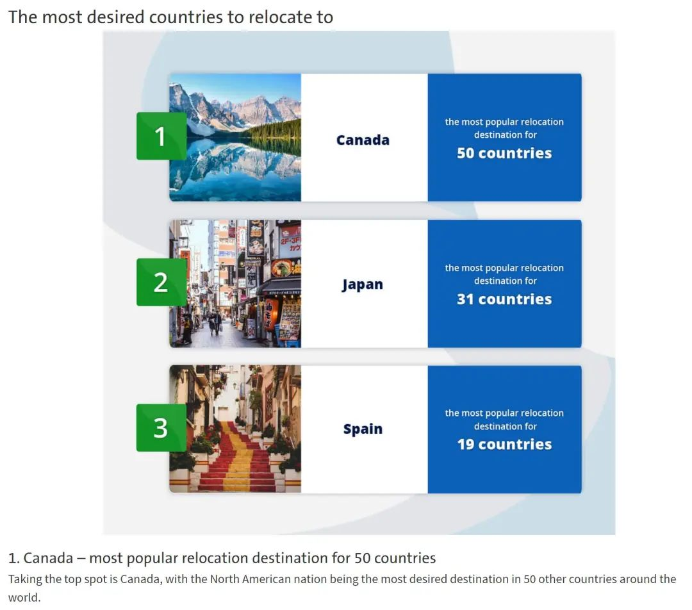

# 无标题

**链接地址:** http://mp.weixin.qq.com/s?__biz=MzUyNzA2NTAwNg==&mid=2247490610&idx=1&sn=78c1c26ba988dbfbe74ccd955b329e53&chksm=fa0416f3cd739fe58bb1f65a84105a12ae0eab642c7410be7c0a2ffffd48477def6eadef4365&mpshare=1&scene=2&srcid=0818dcHt7SKdumE8Ha0j2uan&sharer_sharetime=1660777761973&sharer_shareid=77848a6b3852ae4dcb6c74ffee84743c#rd
**作者:** 你身边的签证专家
**获取时间:** 2025/8/28 19:33:40
**图片数量:** 22

---

## 原始HTML内容

<section style="box-sizing: border-box;font-style: normal;font-weight: 400;text-align: justify;font-size: 16px;"><section style="text-align: center;margin-top: 10px;margin-bottom: 10px;box-sizing: border-box;" powered-by="xiumi.us"><section style="max-width: 100%;vertical-align: middle;display: inline-block;line-height: 0;box-sizing: border-box;"></section></section><section style="text-align: center;margin-top: 10px;margin-bottom: 10px;box-sizing: border-box;" powered-by="xiumi.us"></section>
 
<section style="font-size: 19px;text-align: center;margin: 10px 0px 3px;box-sizing: border-box;" powered-by="xiumi.us"><section style="display: inline-block;border-width: 1px;border-style: solid;border-color: rgb(188, 65, 65);background-color: rgb(188, 65, 65);width: 1.8em;height: 1.8em;line-height: 1.8em;border-radius: 100%;margin-left: auto;margin-right: auto;font-size: 16px;color: rgb(255, 255, 255);box-sizing: border-box;">
<strong style="box-sizing: border-box;">1</strong>
</section></section><section style="text-align: center;margin: 0px;box-sizing: border-box;" powered-by="xiumi.us"><section style="display: inline-block;width: 0px;height: 0px;vertical-align: top;overflow: hidden;border-style: solid;border-width: 9px 6px 0px;border-color: rgb(188, 65, 65) rgba(255, 255, 255, 0) rgba(255, 255, 255, 0);box-sizing: border-box;"><svg viewBox="0 0 1 1" style="float:left;line-height:0;width:0;vertical-align:top;"></svg></section></section><section style="margin: 0px;box-sizing: border-box;" powered-by="xiumi.us"><section style="text-align: center;box-sizing: border-box;">
<strong style="box-sizing: border-box;">中国也是大家心仪“移民目的地”！</strong>
</section></section><section style="text-align: center;justify-content: center;margin: 0px 0px 10px;display: flex;flex-flow: row nowrap;box-sizing: border-box;" powered-by="xiumi.us"><section style="display: inline-block;width: 14%;vertical-align: top;flex: 0 0 auto;height: auto;align-self: flex-start;box-sizing: border-box;"><section style="margin: 0.5em 0px;box-sizing: border-box;" powered-by="xiumi.us"><section style="background-color: rgb(188, 65, 65);height: 4px;box-sizing: border-box;"><svg viewBox="0 0 1 1" style="float:left;line-height:0;width:0;vertical-align:top;"></svg></section></section></section></section>
 
<section style="font-size: 14px;padding: 0px 15px;letter-spacing: 1px;box-sizing: border-box;" powered-by="xiumi.us">
 

如果你可以住在世界上的任何地方，你会选择去哪里？澳大利亚一家市场调研公司Compare the Market的最新研究分析了<strong style="box-sizing: border-box;">全世界人们最想搬到哪个国家</strong>。

 

 

 

据悉，这份报告是由来自不同国家的人使用英语在google搜索引擎上的搜索记录得出。其中，加拿大<strong style="box-sizing: border-box;">吸引了来自全球其他50个国家的居民</strong>，<strong style="box-sizing: border-box;">排名第一</strong>，是大多数人眼中的梦想家园。

 
</section><section style="text-align: center;margin-top: 10px;margin-bottom: 10px;box-sizing: border-box;" powered-by="xiumi.us"><section style="max-width: 100%;vertical-align: middle;display: inline-block;line-height: 0;width: 90%;height: auto;box-sizing: border-box;"></section></section><section style="font-size: 14px;padding: 0px 15px;letter-spacing: 1px;box-sizing: border-box;" powered-by="xiumi.us">
 

作为世界第一大经济体，美国并没有出现在前24名的榜单上。<strong style="box-sizing: border-box;">没有一个国家的人把美国列为首选搬迁国</strong>，<strong>而且美国人首选的搬迁国是中国</strong>。有趣的是，想要移民中国的人有很多都来自发达国家，如丹麦、挪威、瑞士等，此外还有柬埔寨、克罗地亚、埃及、墨西哥等国家。

 

自改革开放以来，中国经济就取得了巨大成就。放眼世界，中国的经济增长速度是独一无二的，<strong>现在已经是世界第二大经济体</strong>。正是中国经济的快速发展趋势，让<strong style="box-sizing: border-box;">很多外国人看好中国</strong>。越来越多的外国企业来华投资，各种世界名牌产品在中国开花结果。对于外国老板来说，中国就是一个聚宝盆，有让他们<strong style="box-sizing: border-box;">大展宏图的机遇</strong>。

 
</section><section style="text-align: center;margin-top: 10px;margin-bottom: 10px;box-sizing: border-box;" powered-by="xiumi.us"><section style="max-width: 100%;vertical-align: middle;display: inline-block;line-height: 0;width: 90%;height: auto;box-sizing: border-box;"></section></section><section style="font-size: 14px;padding: 0px 15px;letter-spacing: 1px;box-sizing: border-box;" powered-by="xiumi.us">
 

其次，中国可以为他们提供非常高质量的就业机会。如今的中国企业需要大量的国际贸易专业人才，以及大量的创新技术研发人才。来到中国，这意味着他们可以大显身手，<strong style="box-sizing: border-box;">享受优待</strong>。

 
</section><section style="font-size: 19px;text-align: center;margin: 10px 0px 3px;box-sizing: border-box;" powered-by="xiumi.us"><section style="display: inline-block;border-width: 1px;border-style: solid;border-color: rgb(188, 65, 65);background-color: rgb(188, 65, 65);width: 1.8em;height: 1.8em;line-height: 1.8em;border-radius: 100%;margin-left: auto;margin-right: auto;font-size: 16px;color: rgb(255, 255, 255);box-sizing: border-box;">
<strong style="box-sizing: border-box;">2</strong>
</section></section><section style="text-align: center;margin: 0px;box-sizing: border-box;" powered-by="xiumi.us"><section style="display: inline-block;width: 0px;height: 0px;vertical-align: top;overflow: hidden;border-style: solid;border-width: 9px 6px 0px;border-color: rgb(188, 65, 65) rgba(255, 255, 255, 0) rgba(255, 255, 255, 0);box-sizing: border-box;"><svg viewBox="0 0 1 1" style="float:left;line-height:0;width:0;vertical-align:top;"></svg></section></section><section style="margin: 0px;box-sizing: border-box;" powered-by="xiumi.us"><section style="text-align: center;box-sizing: border-box;">
<strong style="box-sizing: border-box;">中国绿卡，有办法拿了！</strong>
</section></section><section style="text-align: center;justify-content: center;margin: 0px 0px 10px;display: flex;flex-flow: row nowrap;box-sizing: border-box;" powered-by="xiumi.us"><section style="display: inline-block;width: 14%;vertical-align: top;flex: 0 0 auto;height: auto;align-self: flex-start;box-sizing: border-box;"><section style="margin: 0.5em 0px;box-sizing: border-box;" powered-by="xiumi.us"><section style="background-color: rgb(188, 65, 65);height: 4px;box-sizing: border-box;"><svg viewBox="0 0 1 1" style="float:left;line-height:0;width:0;vertical-align:top;"></svg></section></section></section></section><section style="font-size: 14px;padding: 0px 15px;letter-spacing: 1px;box-sizing: border-box;" powered-by="xiumi.us">
 

就在最近，又有一条关于<strong>抢人才</strong>的消息刷爆了整个华人圈，并引发了国内网友的激烈讨论：<strong style="box-sizing: border-box;">外籍华人博士可以直接申请在华永久居住权！</strong>

 

中国作为人口大国，过去几乎没有把引入外籍移民作为一项战略举措，此次针对高学历外籍华人提供了标准化的PR政策，<strong style="box-sizing: border-box;">堪称一次重大突破</strong>！

 
</section><section style="text-align: center;margin-top: 10px;margin-bottom: 10px;box-sizing: border-box;" powered-by="xiumi.us"><section style="max-width: 100%;vertical-align: middle;display: inline-block;line-height: 0;width: 90%;height: auto;box-sizing: border-box;"></section></section><section style="font-size: 14px;padding: 0px 15px;letter-spacing: 1px;box-sizing: border-box;" powered-by="xiumi.us">
 

2022年随着全球疫情的消退，一场轰轰烈烈的<strong style="box-sizing: border-box;">“抢人大战”</strong>在全球范围内打响了！

 
</section><section style="text-align: center;margin-top: 10px;margin-bottom: 10px;box-sizing: border-box;" powered-by="xiumi.us"><section style="max-width: 100%;vertical-align: middle;display: inline-block;line-height: 0;box-sizing: border-box;"></section></section><section style="font-size: 14px;padding: 0px 15px;letter-spacing: 1px;box-sizing: border-box;" powered-by="xiumi.us">
 
</section><section style="font-size: 19px;text-align: center;margin: 10px 0px 3px;box-sizing: border-box;" powered-by="xiumi.us"><section style="display: inline-block;border-width: 1px;border-style: solid;border-color: rgb(188, 65, 65);background-color: rgb(188, 65, 65);width: 1.8em;height: 1.8em;line-height: 1.8em;border-radius: 100%;margin-left: auto;margin-right: auto;font-size: 16px;color: rgb(255, 255, 255);box-sizing: border-box;">
<strong style="box-sizing: border-box;">3</strong>
</section></section><section style="text-align: center;margin: 0px;box-sizing: border-box;" powered-by="xiumi.us"><section style="display: inline-block;width: 0px;height: 0px;vertical-align: top;overflow: hidden;border-style: solid;border-width: 9px 6px 0px;border-color: rgb(188, 65, 65) rgba(255, 255, 255, 0) rgba(255, 255, 255, 0);box-sizing: border-box;"><svg viewBox="0 0 1 1" style="float:left;line-height:0;width:0;vertical-align:top;"></svg></section></section><section style="margin: 0px;box-sizing: border-box;" powered-by="xiumi.us"><section style="text-align: center;box-sizing: border-box;">
<strong style="box-sizing: border-box;">中国绿卡的申请条件又放宽了</strong>
</section></section><section style="text-align: center;justify-content: center;margin: 0px 0px 10px;display: flex;flex-flow: row nowrap;box-sizing: border-box;" powered-by="xiumi.us"><section style="display: inline-block;width: 14%;vertical-align: top;flex: 0 0 auto;height: auto;align-self: flex-start;box-sizing: border-box;"><section style="margin: 0.5em 0px;box-sizing: border-box;" powered-by="xiumi.us"><section style="background-color: rgb(188, 65, 65);height: 4px;box-sizing: border-box;"><svg viewBox="0 0 1 1" style="float:left;line-height:0;width:0;vertical-align:top;"></svg></section></section></section></section><section style="font-size: 14px;padding: 0px 15px;letter-spacing: 1px;box-sizing: border-box;" powered-by="xiumi.us">
 

2022年8月11日，中国国家移民管理局的官方公众号发布了一则推文，是关于外籍华人博士申请<strong style="box-sizing: border-box;">在华永久居留的答疑</strong>。

 

这篇推文里详细介绍了外籍华人博士申请在华永久居留，也就是俗称的<strong style="box-sizing: border-box;">“中国绿卡”</strong>的条件。

 
</section><section style="text-align: center;margin-top: 10px;margin-bottom: 10px;box-sizing: border-box;" powered-by="xiumi.us"><section style="max-width: 100%;vertical-align: middle;display: inline-block;line-height: 0;width: 90%;height: auto;box-sizing: border-box;"></section></section><section style="font-size: 14px;padding: 0px 15px;letter-spacing: 1px;box-sizing: border-box;" powered-by="xiumi.us">
 

最重要的三个条件就是：<strong style="box-sizing: border-box;">外籍华人证明，中国工作的证明，博士学位证明</strong>。

 

如果这三个条件都具备了，申请中国绿卡应该就是<strong style="box-sizing: border-box;">水到渠成</strong>的事情了。

 
</section><section style="text-align: center;margin-top: 10px;margin-bottom: 10px;box-sizing: border-box;" powered-by="xiumi.us"><section style="max-width: 100%;vertical-align: middle;display: inline-block;line-height: 0;width: 90%;height: auto;box-sizing: border-box;"></section></section><section style="font-size: 14px;padding: 0px 15px;letter-spacing: 1px;box-sizing: border-box;" powered-by="xiumi.us">
 

其实这个也不是最新出台的规定。早在2019年就国家移民管理局就开始在全国推广《12条移民与出入境便利政策》，里面规定：<strong style="box-sizing: border-box;">“在中国境内工作的外籍华人，具有博士研究生学历或在国家重点发展区域连续工作满4年、每年实际居住不少于6个月”</strong>就可以申请永久居留。

 
</section><section style="text-align: center;margin-top: 10px;margin-bottom: 10px;box-sizing: border-box;" powered-by="xiumi.us"><section style="max-width: 100%;vertical-align: middle;display: inline-block;line-height: 0;width: 90%;height: auto;box-sizing: border-box;"></section></section><section style="font-size: 14px;padding: 0px 15px;letter-spacing: 1px;box-sizing: border-box;" powered-by="xiumi.us">
 

但这次相比于之前在居住时间上有所放宽，可以说是稍稍降低了中国绿卡的申请门槛。

 

众所周知，<strong style="box-sizing: border-box;">中国绿卡是世界上最难拿的</strong>。我国真正开始实行<strong>“绿卡申请”</strong>制度，是在2004年，推出了<strong>《外国人在中国永久居留审批管理办法》</strong>。

 

 
</section><section style="font-size: 19px;text-align: center;margin: 10px 0px 3px;box-sizing: border-box;" powered-by="xiumi.us"><section style="display: inline-block;border-width: 1px;border-style: solid;border-color: rgb(188, 65, 65);background-color: rgb(188, 65, 65);width: 1.8em;height: 1.8em;line-height: 1.8em;border-radius: 100%;margin-left: auto;margin-right: auto;font-size: 16px;color: rgb(255, 255, 255);box-sizing: border-box;">
<strong style="box-sizing: border-box;">4</strong>
</section></section><section style="text-align: center;margin: 0px;box-sizing: border-box;" powered-by="xiumi.us"><section style="display: inline-block;width: 0px;height: 0px;vertical-align: top;overflow: hidden;border-style: solid;border-width: 9px 6px 0px;border-color: rgb(188, 65, 65) rgba(255, 255, 255, 0) rgba(255, 255, 255, 0);box-sizing: border-box;"><svg viewBox="0 0 1 1" style="float:left;line-height:0;width:0;vertical-align:top;"></svg></section></section><section style="margin: 0px;box-sizing: border-box;" powered-by="xiumi.us"><section style="text-align: center;box-sizing: border-box;">
<strong style="box-sizing: border-box;">中国绿卡，世界最难拿！！！</strong>
</section></section><section style="text-align: center;justify-content: center;margin: 0px 0px 10px;display: flex;flex-flow: row nowrap;box-sizing: border-box;" powered-by="xiumi.us"><section style="display: inline-block;width: 14%;vertical-align: top;flex: 0 0 auto;height: auto;align-self: flex-start;box-sizing: border-box;"><section style="margin: 0.5em 0px;box-sizing: border-box;" powered-by="xiumi.us"><section style="background-color: rgb(188, 65, 65);height: 4px;box-sizing: border-box;"><svg viewBox="0 0 1 1" style="float:left;line-height:0;width:0;vertical-align:top;"></svg></section></section></section></section><section style="font-size: 14px;padding: 0px 15px;letter-spacing: 1px;box-sizing: border-box;" powered-by="xiumi.us">
 

从2004年到2013年这10年时间里，中国一共发放了7356张绿卡，<strong style="box-sizing: border-box;">平均一年700多张</strong>。这些年虽然数量有所提升，但估计总数也只有2万多张。而目前长期居住在中国的外国人数量达到了72万人左右，如果加上那些短期居留的人，人数超过百万。

 

这样的数据对比很直观说明了<strong style="box-sizing: border-box;">中国绿卡的申请难度</strong>，但我国的绿卡申请制度也不是铁板一块，随着时代的发展，也在做出调整，尤其是在对一些国际优秀人才的处理上，开始<strong>逐渐降低门槛</strong>。

 
</section><section style="text-align: center;margin-top: 10px;margin-bottom: 10px;box-sizing: border-box;" powered-by="xiumi.us"><section style="max-width: 100%;vertical-align: middle;display: inline-block;line-height: 0;width: 90%;height: auto;box-sizing: border-box;"></section></section><section style="font-size: 14px;padding: 0px 15px;letter-spacing: 1px;box-sizing: border-box;" powered-by="xiumi.us">
 

<strong style="box-sizing: border-box;">“一卡在手，走遍神州。”</strong>申请到中国“绿卡”后，外籍人士在中国境内办理金融、教育、医疗、交通、税收和社会保险、诉讼等事务都能更加便捷。

 

而最近出台的这个外籍华人博士可以申请绿卡的政策，将更好地解决这个问题。这些华人不用放弃原来的国籍，也可以在中国长期居住，<strong style="box-sizing: border-box;">没有了后顾之忧</strong>。

 

 
</section><section style="font-size: 19px;text-align: center;margin: 10px 0px 3px;box-sizing: border-box;" powered-by="xiumi.us"><section style="display: inline-block;border-width: 1px;border-style: solid;border-color: rgb(188, 65, 65);background-color: rgb(188, 65, 65);width: 1.8em;height: 1.8em;line-height: 1.8em;border-radius: 100%;margin-left: auto;margin-right: auto;font-size: 16px;color: rgb(255, 255, 255);box-sizing: border-box;">
<strong style="box-sizing: border-box;">5</strong>
</section></section><section style="text-align: center;margin: 0px;box-sizing: border-box;" powered-by="xiumi.us"><section style="display: inline-block;width: 0px;height: 0px;vertical-align: top;overflow: hidden;border-style: solid;border-width: 9px 6px 0px;border-color: rgb(188, 65, 65) rgba(255, 255, 255, 0) rgba(255, 255, 255, 0);box-sizing: border-box;"><svg viewBox="0 0 1 1" style="float:left;line-height:0;width:0;vertical-align:top;"></svg></section></section><section style="margin: 0px;box-sizing: border-box;" powered-by="xiumi.us"><section style="text-align: center;box-sizing: border-box;">
<strong style="box-sizing: border-box;">申请时需提交材料概览</strong>
</section></section><section style="text-align: center;justify-content: center;margin: 0px 0px 10px;display: flex;flex-flow: row nowrap;box-sizing: border-box;" powered-by="xiumi.us"><section style="display: inline-block;width: 14%;vertical-align: top;flex: 0 0 auto;height: auto;align-self: flex-start;box-sizing: border-box;"><section style="margin: 0.5em 0px;box-sizing: border-box;" powered-by="xiumi.us"><section style="background-color: rgb(188, 65, 65);height: 4px;box-sizing: border-box;"><svg viewBox="0 0 1 1" style="float:left;line-height:0;width:0;vertical-align:top;"></svg></section></section></section></section><section style="font-size: 14px;padding: 0px 15px;letter-spacing: 1px;box-sizing: border-box;" powered-by="xiumi.us">
 

1、《外国人在中国永久居留申请表》、本人证件照；

 

2、有效护照资料页和居留许可复印件；

 

3、外籍华人证明（即加入外国国籍证明与中国户籍注销证明，或地级市侨务管理部门出具的外籍华人证明函件等证明材料）；

 

4、博士学位证书，国外高校毕业的需提供教育部留学服务中心出具的认证；

 

5、工作单位《企业营业执照》副本、工作单位出具的在职证明、《外国人工作许可证》复印件；

 

6、经中国驻外使领馆认证的境外无犯罪记录证明；

 

7、体检证明（由我国政府指定卫生检疫部门出具或者外国卫生医疗机构签发并经我驻外使领馆认证，证明出具时间应在受理之日前6个月内）；

 

8、翻译（有关材料是外文的，应翻译为中文并加盖翻译公司印章）。

 
</section><section style="font-size: 19px;text-align: center;margin: 10px 0px 3px;box-sizing: border-box;" powered-by="xiumi.us"><section style="display: inline-block;border-width: 1px;border-style: solid;border-color: rgb(188, 65, 65);background-color: rgb(188, 65, 65);width: 1.8em;height: 1.8em;line-height: 1.8em;border-radius: 100%;margin-left: auto;margin-right: auto;font-size: 16px;color: rgb(255, 255, 255);box-sizing: border-box;">
<strong style="box-sizing: border-box;">6</strong>
</section></section><section style="text-align: center;margin: 0px;box-sizing: border-box;" powered-by="xiumi.us"><section style="display: inline-block;width: 0px;height: 0px;vertical-align: top;overflow: hidden;border-style: solid;border-width: 9px 6px 0px;border-color: rgb(188, 65, 65) rgba(255, 255, 255, 0) rgba(255, 255, 255, 0);box-sizing: border-box;"><svg viewBox="0 0 1 1" style="float:left;line-height:0;width:0;vertical-align:top;"></svg></section></section><section style="margin: 0px;box-sizing: border-box;" powered-by="xiumi.us"><section style="text-align: center;box-sizing: border-box;">
<strong style="box-sizing: border-box;">华人博士能享受哪些便利？</strong>
</section></section><section style="text-align: center;justify-content: center;margin: 0px 0px 10px;display: flex;flex-flow: row nowrap;box-sizing: border-box;" powered-by="xiumi.us"><section style="display: inline-block;width: 14%;vertical-align: top;flex: 0 0 auto;height: auto;align-self: flex-start;box-sizing: border-box;"><section style="margin: 0.5em 0px;box-sizing: border-box;" powered-by="xiumi.us"><section style="background-color: rgb(188, 65, 65);height: 4px;box-sizing: border-box;"><svg viewBox="0 0 1 1" style="float:left;line-height:0;width:0;vertical-align:top;"></svg></section></section></section></section><section style="font-size: 14px;padding: 0px 15px;letter-spacing: 1px;box-sizing: border-box;" powered-by="xiumi.us">
 

1. 具有博士学位、在中国境内工作的外籍华人，可向公安机关出入境管理部门申请在华永久居留，其外籍配偶和未成年子女可随同申请。该政策在全国范围内实施，无地域限制。

 

2. 相比于其它任职类绿卡申请要简单，申请材料中并没有要求一定要提供具有一定年限的居留许可。

 
</section><section style="display: flex;flex-flow: row nowrap;text-align: center;justify-content: center;margin: 10px 0% 0px;box-sizing: border-box;" powered-by="xiumi.us"><section style="display: inline-block;vertical-align: top;width: auto;flex: 0 0 0%;height: auto;align-self: flex-start;border-width: 0px;box-sizing: border-box;"><section style="box-sizing: border-box;" powered-by="xiumi.us"><section style="display: inline-block;width: 33px;height: 25px;vertical-align: top;overflow: hidden;border-style: solid;border-width: 2px;border-radius: 50%;border-color: rgb(241, 215, 196) rgba(255, 255, 255, 0) rgba(255, 255, 255, 0);box-sizing: border-box;"><svg viewBox="0 0 1 1" style="float:left;line-height:0;width:0;vertical-align:top;"></svg></section></section></section><section style="display: inline-block;vertical-align: top;width: auto;flex: 0 0 0%;height: auto;align-self: flex-start;border-width: 0px;margin: -16px 0px 0px -10px;box-sizing: border-box;"><section style="box-sizing: border-box;" powered-by="xiumi.us"><section style="display: inline-block;width: 33px;height: 25px;vertical-align: top;overflow: hidden;border-style: solid;border-width: 2px;border-radius: 50%;border-color: rgba(255, 255, 255, 0) rgba(255, 255, 255, 0) rgb(241, 215, 196);box-sizing: border-box;"><svg viewBox="0 0 1 1" style="float:left;line-height:0;width:0;vertical-align:top;"></svg></section></section></section><section style="display: inline-block;vertical-align: top;width: auto;flex: 0 0 0%;height: auto;align-self: flex-start;border-width: 0px;margin: 0px 0px 0px -10px;box-sizing: border-box;"><section style="box-sizing: border-box;" powered-by="xiumi.us"><section style="display: inline-block;width: 33px;height: 25px;vertical-align: top;overflow: hidden;border-style: solid;border-width: 2px;border-radius: 50%;border-color: rgb(241, 215, 196) rgba(255, 255, 255, 0) rgba(255, 255, 255, 0);box-sizing: border-box;"><svg viewBox="0 0 1 1" style="float:left;line-height:0;width:0;vertical-align:top;"></svg></section></section></section><section style="display: inline-block;vertical-align: top;width: auto;flex: 0 0 0%;height: auto;align-self: flex-start;border-width: 0px;margin: -16px 0px 0px -10px;box-sizing: border-box;"><section style="box-sizing: border-box;" powered-by="xiumi.us"><section style="display: inline-block;width: 33px;height: 25px;vertical-align: top;overflow: hidden;border-style: solid;border-width: 2px;border-radius: 50%;border-color: rgba(255, 255, 255, 0) rgba(255, 255, 255, 0) rgb(241, 215, 196);box-sizing: border-box;"><svg viewBox="0 0 1 1" style="float:left;line-height:0;width:0;vertical-align:top;"></svg></section></section></section><section style="display: inline-block;vertical-align: top;width: auto;flex: 0 0 0%;height: auto;align-self: flex-start;border-width: 0px;margin: 0px 0px 0px -10px;box-sizing: border-box;"><section style="box-sizing: border-box;" powered-by="xiumi.us"><section style="display: inline-block;width: 33px;height: 25px;vertical-align: top;overflow: hidden;border-style: solid;border-width: 2px;border-radius: 50%;border-color: rgb(241, 215, 196) rgba(255, 255, 255, 0) rgba(255, 255, 255, 0);box-sizing: border-box;"><svg viewBox="0 0 1 1" style="float:left;line-height:0;width:0;vertical-align:top;"></svg></section></section></section><section style="display: inline-block;vertical-align: top;width: auto;flex: 0 0 0%;height: auto;align-self: flex-start;border-width: 0px;margin: -16px 0px 0px -10px;box-sizing: border-box;"><section style="box-sizing: border-box;" powered-by="xiumi.us"><section style="display: inline-block;width: 33px;height: 25px;vertical-align: top;overflow: hidden;border-style: solid;border-width: 2px;border-radius: 50%;border-color: rgba(255, 255, 255, 0) rgba(255, 255, 255, 0) rgb(241, 215, 196);box-sizing: border-box;"><svg viewBox="0 0 1 1" style="float:left;line-height:0;width:0;vertical-align:top;"></svg></section></section></section></section><section style="font-size: 14px;padding: 0px 15px;letter-spacing: 1px;box-sizing: border-box;" powered-by="xiumi.us">
 

 

整体来看，想要在不投资、不满足居住条件、亲属关系的条件下申请中国绿卡，<strong style="box-sizing: border-box;">拥有博士学历是关键</strong>！

 

在竞争激烈，至内卷的国内就业市场，海归博士非常受欢迎，很多城市都为他们出台了优惠政策，无数企业和雇主对他们都青睐有加，甚至<strong style="box-sizing: border-box;">“直接打钱”</strong>。

 

众所周知，很多人读博是为了去学校做老师（终身教授），而海归博士在评职称时比本土博士更有优势，并且享受更优惠的家属安置福利。在某高校教师岗位的招聘文件中，海外博士和国内博士的安家费、科研经费<strong style="box-sizing: border-box;">相差至少5万元</strong>。

 
</section><section style="text-align: center;margin-top: 10px;margin-bottom: 10px;box-sizing: border-box;" powered-by="xiumi.us"><section style="max-width: 100%;vertical-align: middle;display: inline-block;line-height: 0;width: 90%;height: auto;box-sizing: border-box;"></section></section><section style="font-size: 14px;padding: 0px 15px;letter-spacing: 1px;box-sizing: border-box;" powered-by="xiumi.us">
 

除了天价安家费，近年来，各大城市对留学生归国落户的态度都非常积极开放，对海外高端人才的“抢人大战”也日趋激烈。根据深圳市出台的<strong style="box-sizing: border-box;">“孔雀计划”</strong>，海外高层次人才可以享受<strong>80万至150万元的奖励补贴</strong>，政策待遇惠及居留和出入境、落户、子女入学、配偶就业、医疗保险等方面。

 
</section><section style="text-align: center;margin-top: 10px;margin-bottom: 10px;box-sizing: border-box;" powered-by="xiumi.us"><section style="max-width: 100%;vertical-align: middle;display: inline-block;line-height: 0;width: 90%;height: auto;box-sizing: border-box;"></section></section><section style="font-size: 14px;padding: 0px 15px;letter-spacing: 1px;box-sizing: border-box;" powered-by="xiumi.us">
 

留学人员回国后，能在一年内享受国家给予的<strong>购买免税汽车优惠政策</strong>，可以免除所购汽车零部件中的进口关税和车辆购置税。一般情况下，两者加起来约占整车价格的15%，不同车型，费用不同，总体优惠费用在0.71万至15.21万元。

 
</section><section style="text-align: center;margin-top: 10px;margin-bottom: 10px;box-sizing: border-box;" powered-by="xiumi.us"><section style="max-width: 100%;vertical-align: middle;display: inline-block;line-height: 0;box-sizing: border-box;"></section></section><section style="font-size: 14px;padding: 0px 15px;letter-spacing: 1px;box-sizing: border-box;" powered-by="xiumi.us">
 

为了鼓励海外人才回国创业，各地还出台了回国留学人员的创业优惠政策，包括：可申请最高十万元的无偿资助; 可申请科技部、北京市的一些中小企业创新基金等，一般<strong style="box-sizing: border-box;">有20万至45万元不等</strong>。

 

<strong style="box-sizing: border-box;">人才是衡量一个国家综合国力的重要指标</strong>，综合国力竞争说到底是人才竞争。国家移民管理局此举，为吸引外籍高层次人才来华创新创业、工作居留提供便利政策支持。

 
</section><section style="margin: 10px 0%;text-align: left;justify-content: flex-start;display: flex;flex-flow: row nowrap;box-sizing: border-box;" powered-by="xiumi.us"><section style="display: inline-block;width: 100%;vertical-align: top;background-color: rgb(216, 202, 160);line-height: 0;align-self: flex-start;flex: 0 0 auto;box-sizing: border-box;"><section style="text-align: justify;justify-content: flex-start;display: flex;flex-flow: row nowrap;box-sizing: border-box;" powered-by="xiumi.us"><section style="display: inline-block;width: 100%;vertical-align: top;background-position: 0% 0%;background-repeat: repeat;background-size: 1.56658%;background-attachment: scroll;padding: 0px;align-self: flex-start;flex: 0 0 auto;background-image: url(&quot;https://mmbiz.qpic.cn/mmbiz_png/904kUibXm7Y6eLoNIic8Wrokd1ibDytPoqMda4GTsSA1ZvjKN4oJaqAxszfyEPQwwnFYmicLldL11fZNFhpnMmb7RA/640?wx_fmt=png&quot;);box-sizing: border-box;"><section style="text-align: center;box-sizing: border-box;" powered-by="xiumi.us"><section style="display: inline-block;width: 100%;height: 11px;vertical-align: top;overflow: hidden;background-color: rgba(255, 255, 255, 0);box-sizing: border-box;"><svg viewBox="0 0 1 1" style="float:left;line-height:0;width:0;vertical-align:top;"></svg></section></section></section></section></section></section><section style="font-size: 14px;padding: 0px 15px;letter-spacing: 1px;box-sizing: border-box;" powered-by="xiumi.us"><section> </section><section class="channels_iframe_wrp wxw_wechannel_card_not_horizontal"><mpvideosnap class="js_uneditable custom_select_card channels_iframe videosnap_video_iframe" data-pluginname="videosnap" data-id="export/UzFfAgtgekIEAQAAAAAAfpUrezr1eAAAAAstQy6ubaLX4KHWvLEZgBPEu5EIViEBLceCzNPgMIs9RHEgF2DAfBlqU48fOEdO" data-url="https://findermp.video.qq.com/251/20350/stodownload?encfilekey=Cvvj5Ix3eexKX1zo1IZZBrQomawdVfSQBkYiaDuXtpMBIh5KZ1O7JTwc1IgywmOFSTgfYdeABb8Nibp83HhPuNVQ26nfVHs3g1vYSfQJ2SevqkzA6g4sGUovyInpLQibd13NdusPImFcfofUpmRPAD8NHTS6b1TdDBpzDeQibMEAyPE&amp;adaptivelytrans=0&amp;bizid=1023&amp;dotrans=0&amp;hy=HK&amp;idx=1&amp;m=38fb9c635b2cfece303a82f8dd375742&amp;token=AxricY7RBHdU3FRuaqvWq69rOIM5AuwpfRPkrmtJOtYdsVcWKszv3tZSjDDk2B60Y1KVhaxUOSmg" data-headimgurl="http://wx.qlogo.cn/finderhead/PiajxSqBRaEI4vQJr3aa81ehxKpzshj4t6ZWzDxwztBic5fr9nVMt20g/0" data-username="v2_060000231003b20faec8c7eb811fc3d1ca06ec31b07726617828a16cbc88a282c95def3c7c6d@finder" data-nickname="Zoe说加拿大" data-desc="终于可以返工啦～～你收到临时工签许可了吗？##加拿大 #加拿大生活" data-nonceid="8449018168582508534" data-type="video" data-width="1072" data-height="1440"></mpvideosnap></section>
 

心动了吗？屏幕前的各位小伙伴们，看来还是要好好学习提升自己的学历含金量呀！人生<strong style="box-sizing: border-box;">“重在折腾”</strong>，希望各位都可以为自己的人生增加更多选择的<strong>可能性</strong>！<strong style="box-sizing: border-box;">关注新时代留学移民法律事务所，获取更多新鲜有趣的留学移民小知识！</strong>

 
<section style="box-sizing: border-box;font-style: normal;font-weight: 400;text-align: justify;font-size: 16px;"><section style="will-change: transform;box-sizing: border-box;" powered-by="xiumi.us"><section style="margin: 10px 0%;text-align: center;justify-content: center;display: flex;flex-flow: row nowrap;box-sizing: border-box;"><section style="display: inline-block;width: 100%;vertical-align: top;box-shadow: rgb(0, 0, 0) 0px 0px 0px;background-color: rgb(241, 241, 241);padding: 10px;align-self: flex-start;flex: 0 0 auto;box-sizing: border-box;"><section style="justify-content: center;display: flex;flex-flow: row nowrap;box-sizing: border-box;" powered-by="xiumi.us"><section style="display: inline-block;width: 100%;vertical-align: top;background-color: rgb(255, 255, 255);padding: 20px 10px;flex: 0 0 auto;height: auto;box-shadow: rgb(198, 198, 198) 0px 0px 2px;border-width: 0px;border-radius: 6px;border-style: none;border-color: rgb(62, 62, 62);overflow: hidden;align-self: flex-start;box-sizing: border-box;"><section style="color: rgb(189, 189, 189);text-align: justify;box-sizing: border-box;" powered-by="xiumi.us">
<strong style="box-sizing: border-box;">阅读更多</strong>
</section><section style="text-align: justify;box-sizing: border-box;" powered-by="xiumi.us">
 
</section><section style="display: flex;flex-flow: row nowrap;margin: 0px 0%;justify-content: center;box-sizing: border-box;" powered-by="xiumi.us"><section style="display: inline-block;vertical-align: top;width: auto;flex: 100 100 0%;align-self: flex-start;height: auto;box-shadow: rgb(0, 0, 0) 0px 0px 0px;border-bottom: 1px dashed rgba(106, 106, 106, 0.25);border-bottom-right-radius: 0px;margin: 0px 10px 0px 0px;box-sizing: border-box;"><section style="font-size: 14px;text-align: justify;box-sizing: border-box;" powered-by="xiumi.us">
<a target="_blank" href="http://mp.weixin.qq.com/s?__biz=MzUyNzA2NTAwNg==&amp;mid=2247490560&amp;idx=1&amp;sn=34968551e3c692e30afa7c9a1c01fb0b&amp;chksm=fa0416c1cd739fd7a338882014ab67d0a3b98fcd59a41a146f4b93eb216aa70d31da0698c540&amp;scene=21#wechat_redirect" textvalue="好消息！加拿大全民牙科保健计划终于来了！直接发钱，年底实施！" linktype="text" imgurl="" imgdata="null" data-itemshowtype="0" tab="innerlink" data-linktype="2">好消息！加拿大全民牙科保健计划终于来了！直接发钱，年底实施！</a>
</section></section><section style="display: inline-block;vertical-align: top;width: auto;flex: 20 20 0%;align-self: flex-start;height: auto;border-width: 0px;margin: 0px 0px 0px 5px;box-sizing: border-box;"><section style="margin: 0px 0%;box-sizing: border-box;" powered-by="xiumi.us"><section style="max-width: 100%;vertical-align: middle;display: inline-block;line-height: 0;box-shadow: rgb(0, 0, 0) 0px 0px 0px;box-sizing: border-box;"><a target="_blank" href="http://mp.weixin.qq.com/s?__biz=MzUyNzA2NTAwNg==&amp;mid=2247490560&amp;idx=1&amp;sn=34968551e3c692e30afa7c9a1c01fb0b&amp;chksm=fa0416c1cd739fd7a338882014ab67d0a3b98fcd59a41a146f4b93eb216aa70d31da0698c540&amp;scene=21#wechat_redirect" textvalue="你已选中了添加链接的内容" linktype="text" imgurl="" imgdata="null" data-itemshowtype="0" tab="innerlink" data-linktype="1"></a></section></section></section></section><section style="text-align: justify;box-sizing: border-box;" powered-by="xiumi.us">
 
</section><section style="display: flex;flex-flow: row nowrap;margin: 0px 0%;justify-content: center;box-sizing: border-box;" powered-by="xiumi.us"><section style="display: inline-block;vertical-align: top;width: auto;flex: 100 100 0%;align-self: flex-start;height: auto;box-shadow: rgb(0, 0, 0) 0px 0px 0px;border-bottom: 1px dashed rgba(106, 106, 106, 0.25);border-bottom-right-radius: 0px;margin: 0px 10px 0px 0px;box-sizing: border-box;"><section style="font-size: 14px;text-align: justify;box-sizing: border-box;" powered-by="xiumi.us">
<a target="_blank" href="http://mp.weixin.qq.com/s?__biz=MzUyNzA2NTAwNg==&amp;mid=2247490457&amp;idx=1&amp;sn=16f7c882170fb381a747f3cb968dd8e0&amp;chksm=fa041158cd73984e609273268f9507c4a8b592cb13594976a230a00e47744cee19c09922db60&amp;scene=21#wechat_redirect" textvalue="喜大普奔！加国毕业工签续签18个月政策正式出台！全套攻略赶快收藏！" linktype="text" imgurl="" imgdata="null" data-itemshowtype="0" tab="innerlink" data-linktype="2">喜大普奔！加国毕业工签续签18个月政策正式出台！全套攻略赶快收藏！</a>
</section></section><section style="display: inline-block;vertical-align: top;width: auto;flex: 20 20 0%;align-self: flex-start;height: auto;border-width: 0px;margin: 0px 0px 0px 5px;box-sizing: border-box;"><section style="margin: 0px 0%;box-sizing: border-box;" powered-by="xiumi.us"><section style="max-width: 100%;vertical-align: middle;display: inline-block;line-height: 0;box-shadow: rgb(0, 0, 0) 0px 0px 0px;box-sizing: border-box;"><a target="_blank" href="http://mp.weixin.qq.com/s?__biz=MzUyNzA2NTAwNg==&amp;mid=2247490457&amp;idx=1&amp;sn=16f7c882170fb381a747f3cb968dd8e0&amp;chksm=fa041158cd73984e609273268f9507c4a8b592cb13594976a230a00e47744cee19c09922db60&amp;scene=21#wechat_redirect" textvalue="你已选中了添加链接的内容" linktype="text" imgurl="" imgdata="null" data-itemshowtype="0" tab="innerlink" data-linktype="1"></a></section></section></section></section><section style="text-align: justify;box-sizing: border-box;" powered-by="xiumi.us">
 
</section><section style="display: flex;flex-flow: row nowrap;margin: 0px 0%;justify-content: center;box-sizing: border-box;" powered-by="xiumi.us"><section style="display: inline-block;vertical-align: top;width: auto;flex: 100 100 0%;align-self: flex-start;height: auto;box-shadow: rgb(0, 0, 0) 0px 0px 0px;border-bottom: 1px dashed rgba(106, 106, 106, 0.25);border-bottom-right-radius: 0px;margin: 0px 10px 0px 0px;box-sizing: border-box;"><section style="font-size: 14px;text-align: justify;box-sizing: border-box;" powered-by="xiumi.us">
<a target="_blank" href="http://mp.weixin.qq.com/s?__biz=MzUyNzA2NTAwNg==&amp;mid=2247490420&amp;idx=1&amp;sn=9bc87bcb2774fda6e93d291d2c5e8168&amp;chksm=fa0411b5cd7398a36a4b8ee9376cee7c056f910e2b34e753633e95f1e0c3a52a8e9fdda2b5cf&amp;scene=21#wechat_redirect" textvalue="阿省也加入“抢移民”大战！加国四省联名上书联邦政府要求增加移民名额！" linktype="text" imgurl="" imgdata="null" data-itemshowtype="0" tab="innerlink" data-linktype="2">阿省也加入“抢移民”大战！加国四省联名上书联邦政府要求增加移民名额！</a>
</section></section><section style="display: inline-block;vertical-align: top;width: auto;flex: 20 20 0%;align-self: flex-start;height: auto;border-width: 0px;margin: 0px 0px 0px 5px;box-sizing: border-box;"><section style="margin: 0px 0%;box-sizing: border-box;" powered-by="xiumi.us"><section style="max-width: 100%;vertical-align: middle;display: inline-block;line-height: 0;box-shadow: rgb(0, 0, 0) 0px 0px 0px;box-sizing: border-box;"><a target="_blank" href="http://mp.weixin.qq.com/s?__biz=MzUyNzA2NTAwNg==&amp;mid=2247490420&amp;idx=1&amp;sn=9bc87bcb2774fda6e93d291d2c5e8168&amp;chksm=fa0411b5cd7398a36a4b8ee9376cee7c056f910e2b34e753633e95f1e0c3a52a8e9fdda2b5cf&amp;scene=21#wechat_redirect" textvalue="你已选中了添加链接的内容" linktype="text" imgurl="" imgdata="null" data-itemshowtype="0" tab="innerlink" data-linktype="1"></a></section></section></section></section></section></section></section></section></section></section>
 
</section><section style="text-align: center;margin-top: 10px;margin-bottom: 10px;box-sizing: border-box;" powered-by="xiumi.us"><section style="max-width: 100%;vertical-align: middle;display: inline-block;line-height: 0;box-sizing: border-box;"></section></section><section style="text-align: center;margin-top: 10px;margin-bottom: 10px;box-sizing: border-box;" powered-by="xiumi.us"><section style="max-width: 100%;vertical-align: middle;display: inline-block;line-height: 0;box-sizing: border-box;"></section></section><section style="text-align: center;margin-top: 10px;margin-bottom: 10px;box-sizing: border-box;" powered-by="xiumi.us"><section style="max-width: 100%;vertical-align: middle;display: inline-block;line-height: 0;box-sizing: border-box;"></section></section><section style="padding: 0px 15px;font-size: 12px;color: rgb(121, 121, 121);box-sizing: border-box;" powered-by="xiumi.us">
<strong style="box-sizing: border-box;"> </strong>
</section><section style="text-align: center;margin-top: 10px;margin-bottom: 10px;box-sizing: border-box;" powered-by="xiumi.us"><section style="max-width: 100%;vertical-align: middle;display: inline-block;line-height: 0;box-sizing: border-box;"></section></section><section style="text-align: center;margin-top: 10px;margin-bottom: 10px;box-sizing: border-box;" powered-by="xiumi.us"><section style="max-width: 100%;vertical-align: middle;display: inline-block;line-height: 0;box-sizing: border-box;"></section></section></section>
 

---

## 纯文本内容

1中国也是大家心仪“移民目的地”！如果你可以住在世界上的任何地方，你会选择去哪里？澳大利亚一家市场调研公司Compare the Market的最新研究分析了全世界人们最想搬到哪个国家。据悉，这份报告是由来自不同国家的人使用英语在google搜索引擎上的搜索记录得出。其中，加拿大吸引了来自全球其他50个国家的居民，排名第一，是大多数人眼中的梦想家园。作为世界第一大经济体，美国并没有出现在前24名的榜单上。没有一个国家的人把美国列为首选搬迁国，而且美国人首选的搬迁国是中国。有趣的是，想要移民中国的人有很多都来自发达国家，如丹麦、挪威、瑞士等，此外还有柬埔寨、克罗地亚、埃及、墨西哥等国家。自改革开放以来，中国经济就取得了巨大成就。放眼世界，中国的经济增长速度是独一无二的，现在已经是世界第二大经济体。正是中国经济的快速发展趋势，让很多外国人看好中国。越来越多的外国企业来华投资，各种世界名牌产品在中国开花结果。对于外国老板来说，中国就是一个聚宝盆，有让他们大展宏图的机遇。其次，中国可以为他们提供非常高质量的就业机会。如今的中国企业需要大量的国际贸易专业人才，以及大量的创新技术研发人才。来到中国，这意味着他们可以大显身手，享受优待。2中国绿卡，有办法拿了！就在最近，又有一条关于抢人才的消息刷爆了整个华人圈，并引发了国内网友的激烈讨论：外籍华人博士可以直接申请在华永久居住权！中国作为人口大国，过去几乎没有把引入外籍移民作为一项战略举措，此次针对高学历外籍华人提供了标准化的PR政策，堪称一次重大突破！2022年随着全球疫情的消退，一场轰轰烈烈的“抢人大战”在全球范围内打响了！3中国绿卡的申请条件又放宽了2022年8月11日，中国国家移民管理局的官方公众号发布了一则推文，是关于外籍华人博士申请在华永久居留的答疑。这篇推文里详细介绍了外籍华人博士申请在华永久居留，也就是俗称的“中国绿卡”的条件。最重要的三个条件就是：外籍华人证明，中国工作的证明，博士学位证明。如果这三个条件都具备了，申请中国绿卡应该就是水到渠成的事情了。其实这个也不是最新出台的规定。早在2019年就国家移民管理局就开始在全国推广《12条移民与出入境便利政策》，里面规定：“在中国境内工作的外籍华人，具有博士研究生学历或在国家重点发展区域连续工作满4年、每年实际居住不少于6个月”就可以申请永久居留。但这次相比于之前在居住时间上有所放宽，可以说是稍稍降低了中国绿卡的申请门槛。众所周知，中国绿卡是世界上最难拿的。我国真正开始实行“绿卡申请”制度，是在2004年，推出了《外国人在中国永久居留审批管理办法》。4中国绿卡，世界最难拿！！！从2004年到2013年这10年时间里，中国一共发放了7356张绿卡，平均一年700多张。这些年虽然数量有所提升，但估计总数也只有2万多张。而目前长期居住在中国的外国人数量达到了72万人左右，如果加上那些短期居留的人，人数超过百万。这样的数据对比很直观说明了中国绿卡的申请难度，但我国的绿卡申请制度也不是铁板一块，随着时代的发展，也在做出调整，尤其是在对一些国际优秀人才的处理上，开始逐渐降低门槛。“一卡在手，走遍神州。”申请到中国“绿卡”后，外籍人士在中国境内办理金融、教育、医疗、交通、税收和社会保险、诉讼等事务都能更加便捷。而最近出台的这个外籍华人博士可以申请绿卡的政策，将更好地解决这个问题。这些华人不用放弃原来的国籍，也可以在中国长期居住，没有了后顾之忧。5申请时需提交材料概览1、《外国人在中国永久居留申请表》、本人证件照；2、有效护照资料页和居留许可复印件；3、外籍华人证明（即加入外国国籍证明与中国户籍注销证明，或地级市侨务管理部门出具的外籍华人证明函件等证明材料）；4、博士学位证书，国外高校毕业的需提供教育部留学服务中心出具的认证；5、工作单位《企业营业执照》副本、工作单位出具的在职证明、《外国人工作许可证》复印件；6、经中国驻外使领馆认证的境外无犯罪记录证明；7、体检证明（由我国政府指定卫生检疫部门出具或者外国卫生医疗机构签发并经我驻外使领馆认证，证明出具时间应在受理之日前6个月内）；8、翻译（有关材料是外文的，应翻译为中文并加盖翻译公司印章）。6华人博士能享受哪些便利？1. 具有博士学位、在中国境内工作的外籍华人，可向公安机关出入境管理部门申请在华永久居留，其外籍配偶和未成年子女可随同申请。该政策在全国范围内实施，无地域限制。2. 相比于其它任职类绿卡申请要简单，申请材料中并没有要求一定要提供具有一定年限的居留许可。整体来看，想要在不投资、不满足居住条件、亲属关系的条件下申请中国绿卡，拥有博士学历是关键！在竞争激烈，至内卷的国内就业市场，海归博士非常受欢迎，很多城市都为他们出台了优惠政策，无数企业和雇主对他们都青睐有加，甚至“直接打钱”。众所周知，很多人读博是为了去学校做老师（终身教授），而海归博士在评职称时比本土博士更有优势，并且享受更优惠的家属安置福利。在某高校教师岗位的招聘文件中，海外博士和国内博士的安家费、科研经费相差至少5万元。除了天价安家费，近年来，各大城市对留学生归国落户的态度都非常积极开放，对海外高端人才的“抢人大战”也日趋激烈。根据深圳市出台的“孔雀计划”，海外高层次人才可以享受80万至150万元的奖励补贴，政策待遇惠及居留和出入境、落户、子女入学、配偶就业、医疗保险等方面。留学人员回国后，能在一年内享受国家给予的购买免税汽车优惠政策，可以免除所购汽车零部件中的进口关税和车辆购置税。一般情况下，两者加起来约占整车价格的15%，不同车型，费用不同，总体优惠费用在0.71万至15.21万元。为了鼓励海外人才回国创业，各地还出台了回国留学人员的创业优惠政策，包括：可申请最高十万元的无偿资助; 可申请科技部、北京市的一些中小企业创新基金等，一般有20万至45万元不等。人才是衡量一个国家综合国力的重要指标，综合国力竞争说到底是人才竞争。国家移民管理局此举，为吸引外籍高层次人才来华创新创业、工作居留提供便利政策支持。心动了吗？屏幕前的各位小伙伴们，看来还是要好好学习提升自己的学历含金量呀！人生“重在折腾”，希望各位都可以为自己的人生增加更多选择的可能性！关注新时代留学移民法律事务所，获取更多新鲜有趣的留学移民小知识！阅读更多好消息！加拿大全民牙科保健计划终于来了！直接发钱，年底实施！喜大普奔！加国毕业工签续签18个月政策正式出台！全套攻略赶快收藏！阿省也加入“抢移民”大战！加国四省联名上书联邦政府要求增加移民名额！

---

## 图片列表

-  (原始链接: https://mmbiz.qpic.cn/mmbiz_jpg/904kUibXm7Y6eLoNIic8Wrokd1ibDytPoqMt6W00lkPN002TMKyA8g4E9eT7SibskHmtzjQuKSV5oUPUKJnlvibWfMA/640?wx_fmt=jpeg)
-  (原始链接: https://mmbiz.qpic.cn/mmbiz_jpg/904kUibXm7Y4EC3q40NfCb7jaWhWbgfxibgpavj9rH4EqdQFpzyVg6N8TNSVOsgAOuvg1OSL9ec8ZyRicEzu8Tib7A/640?wx_fmt=jpeg)
-  (原始链接: https://mmbiz.qpic.cn/mmbiz_jpg/904kUibXm7Y6eLoNIic8Wrokd1ibDytPoqMliaDUbuef0k8gesGBMGQ7zoia6Uv6Y0csWcgZGwicuIBgiafUIrBUPEofw/640?wx_fmt=jpeg)
-  (原始链接: https://mmbiz.qpic.cn/mmbiz_jpg/904kUibXm7Y6eLoNIic8Wrokd1ibDytPoqMNhe704cAAP1dunuPdD4ib1H3gxVdutktj4RzshPShOBsooXJ2GUrnDQ/640?wx_fmt=jpeg)
-  (原始链接: https://mmbiz.qpic.cn/mmbiz_jpg/904kUibXm7Y6eLoNIic8Wrokd1ibDytPoqMEHZgg3IicdzfhZLL8DM0oTEWrEz9gyCVDWBweM64mRibB1FibOK5Iq1UA/640?wx_fmt=jpeg)
-  (原始链接: https://mmbiz.qpic.cn/mmbiz_png/904kUibXm7Y6eLoNIic8Wrokd1ibDytPoqMEDsiccJ5ibGx3GlCs0Jhckk0cUbb8feGo9PiaFXlZcHPXiaibdWnmIJicxtA/640?wx_fmt=png)
-  (原始链接: https://mmbiz.qpic.cn/mmbiz_png/904kUibXm7Y6eLoNIic8Wrokd1ibDytPoqM9AeEc7xztrm9msicuzjpukDLmsqqKRUwIqTI8gwwl4mziaZn7rdhTGjA/640?wx_fmt=png)
-  (原始链接: https://mmbiz.qpic.cn/mmbiz_jpg/904kUibXm7Y6eLoNIic8Wrokd1ibDytPoqM4n6JMticMiaoS9amHrCMjqIK8yN1oicc1BuJWMMwecickX02iab33M715cg/640?wx_fmt=jpeg)
-  (原始链接: https://mmbiz.qpic.cn/mmbiz_jpg/904kUibXm7Y6eLoNIic8Wrokd1ibDytPoqMJ8Y7l4M1ytQVewNgnSqq2oqqB4X0sticX78Zp0MXJ8CQbibD9CzX1UmA/640?wx_fmt=jpeg)
-  (原始链接: https://mmbiz.qpic.cn/mmbiz_jpg/904kUibXm7Y6eLoNIic8Wrokd1ibDytPoqMo6pgj8eJqy7ye1pEZF9XUAWGVBHer8ebGibub0YEu9PQibjPoEtbibdDA/640?wx_fmt=jpeg)
-  (原始链接: https://mmbiz.qpic.cn/mmbiz_png/904kUibXm7Y6eLoNIic8Wrokd1ibDytPoqMDQSWicePZ9jPoVwKCLKkcmenf63zKaNRpQW7ic5WFGMhyW31rNmcGVQQ/640?wx_fmt=png)
-  (原始链接: https://mmbiz.qpic.cn/mmbiz_jpg/904kUibXm7Y6eLoNIic8Wrokd1ibDytPoqMNaWKgOqImVBBko9hNmCfsWSv8iaZTnkQeZOvt3Qibic8gUPiaKBU7NgLHg/640?wx_fmt=jpeg)
-  (原始链接: https://mmbiz.qpic.cn/mmbiz_jpg/904kUibXm7Y6eLoNIic8Wrokd1ibDytPoqMd6jfNiaxDdVFCpL9lEJHUtTQXib9tvJTo6TG0U6bqsdlaupewib4cZOqg/640?wx_fmt=jpeg)
-  (原始链接: https://mmbiz.qpic.cn/mmbiz_png/904kUibXm7Y6eLoNIic8Wrokd1ibDytPoqMzhD62hhGzQpwFF8ahTeFQibia2GonNdZ2VHibr7SyNia62LOQOyy55KkJA/640?wx_fmt=png)
-  (原始链接: https://mmbiz.qpic.cn/mmbiz_jpg/904kUibXm7Y6eLoNIic8Wrokd1ibDytPoqMrmVaibmef38gVsvyLSIicODUq7bgMaicZ2cnpz6EicWaTzLsN16SjibepEw/640?wx_fmt=jpeg)
-  (原始链接: https://mmbiz.qpic.cn/mmbiz_jpg/904kUibXm7Y6eLoNIic8Wrokd1ibDytPoqMp5uAStdtHsrEaJHXxSDQ5hnh4jUUzqxbsbngkszbXZI9Aer0fh7Y7Q/640?wx_fmt=jpeg)
-  (原始链接: https://mmbiz.qpic.cn/mmbiz_jpg/904kUibXm7Y6eLoNIic8Wrokd1ibDytPoqMEibFb8A2vbD7INua0hKJEAibv5xIBqClvJon1ic4RNaW7eHcr5PfDrFOw/640?wx_fmt=jpeg)
-  (原始链接: https://mmbiz.qpic.cn/mmbiz_jpg/904kUibXm7Y6eLoNIic8Wrokd1ibDytPoqMcIaLdhicPfYWaBBfoMu53zPIcTtjQyexbo1GicuPnV2Mq6cIEiclD02Vw/640?wx_fmt=jpeg)
-  (原始链接: https://mmbiz.qpic.cn/mmbiz_jpg/904kUibXm7Y6eLoNIic8Wrokd1ibDytPoqMGh5fZSRmHrUteguicCXiaVQqTbRf5Bldq3SjlVOJOGkydCbHt6RsqjWg/640?wx_fmt=jpeg)
-  (原始链接: https://mmbiz.qpic.cn/mmbiz_jpg/904kUibXm7Y6eLoNIic8Wrokd1ibDytPoqMtt54CgBdULibpfw4diaInyPBVZRmw8Sx6tzFS3xWvFCrcU0jqxx19vHg/640?wx_fmt=jpeg)
-  (原始链接: https://mmbiz.qpic.cn/mmbiz_jpg/904kUibXm7Y6eLoNIic8Wrokd1ibDytPoqMJrgcNnSNpcrWTF9PfiaZa9FDlMN1hiaxFBAvLw3lFmuib8Uyx2roZETLA/640?wx_fmt=jpeg)
-  (原始链接: https://mmbiz.qpic.cn/mmbiz_jpg/904kUibXm7Y6eLoNIic8Wrokd1ibDytPoqMB69IU8HBF3QZQ8jibLs2evyyw70sJKuNb0gvfroX6gGibXXHlIONbXlg/640?wx_fmt=jpeg)
