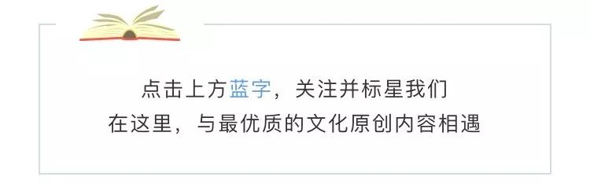
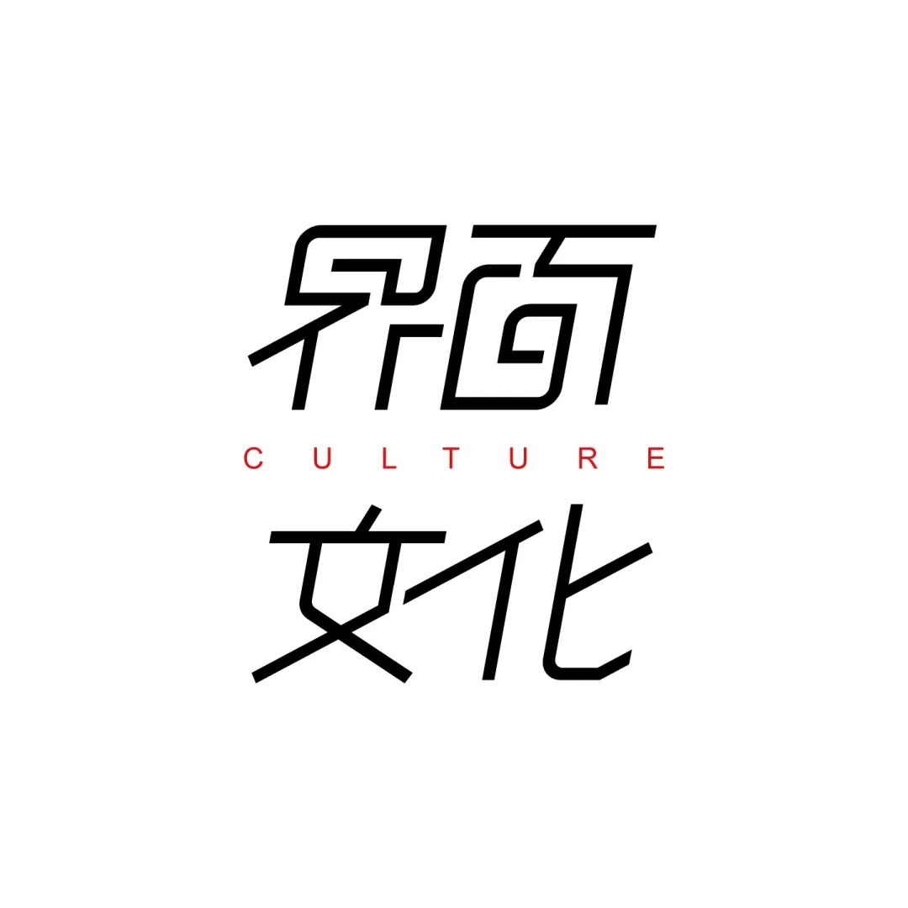
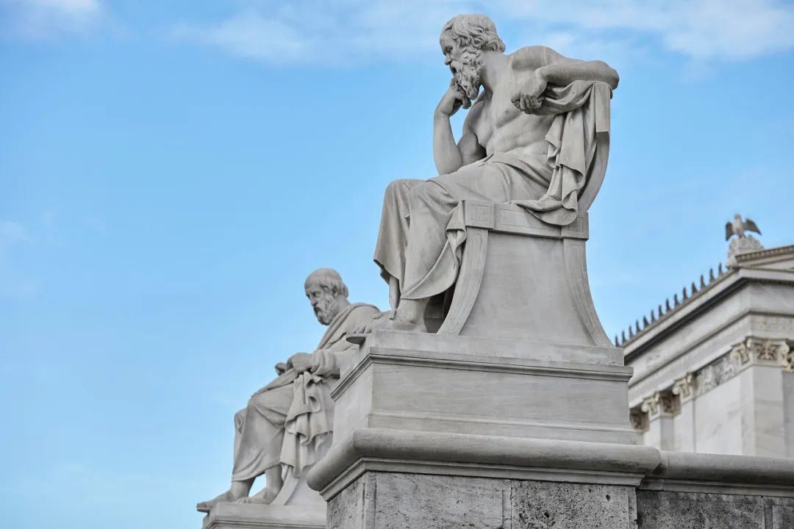
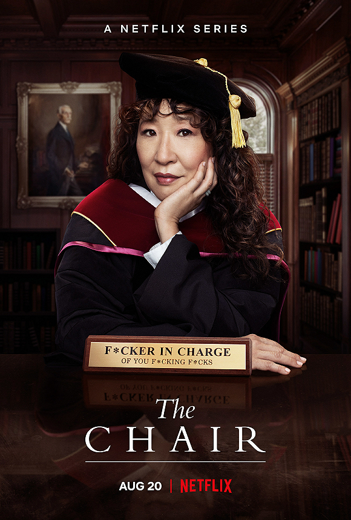
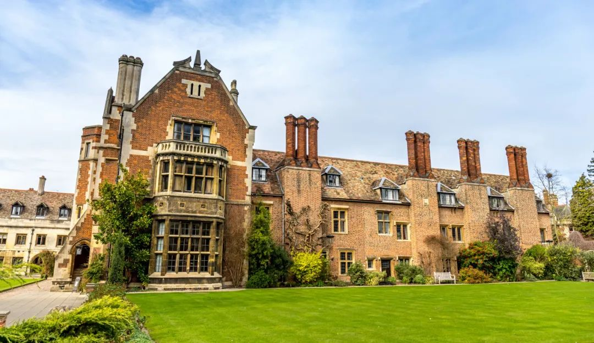
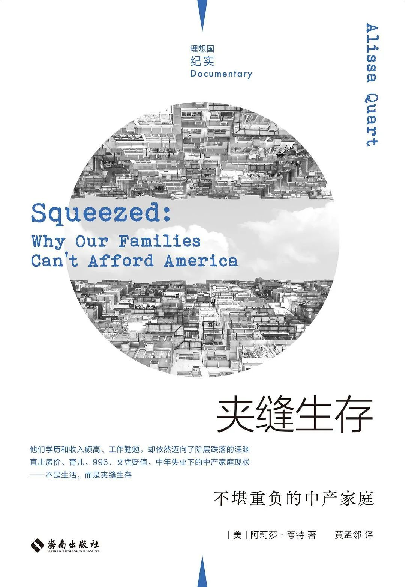
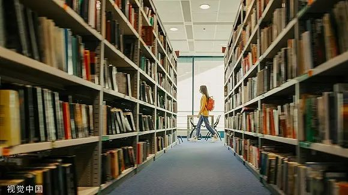
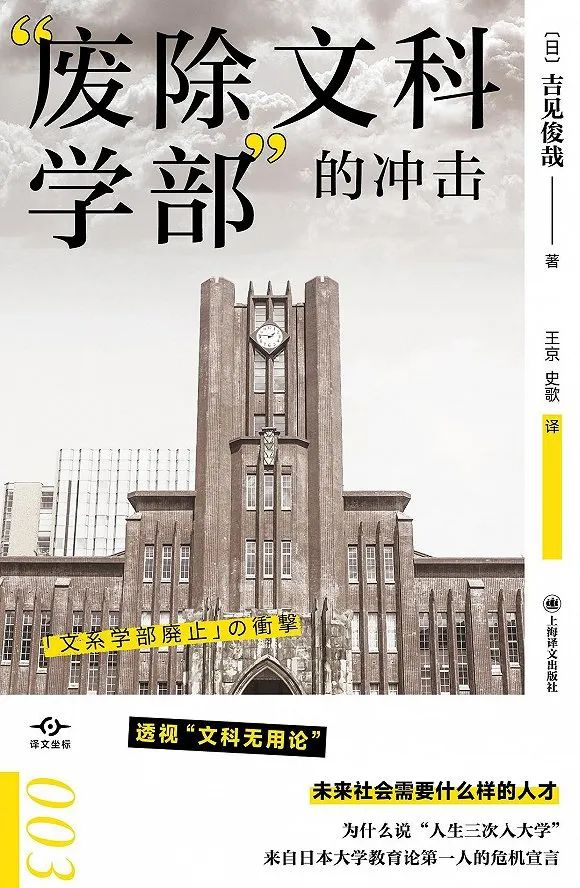
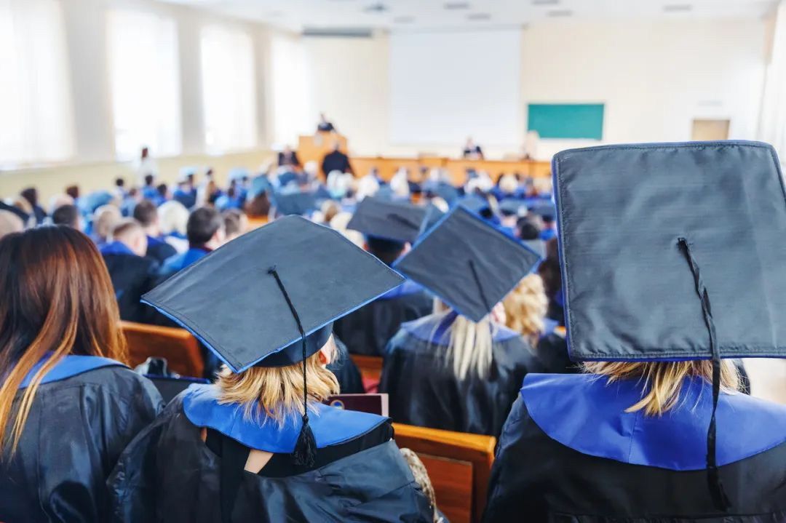

# 无标题

**链接地址:** http://mp.weixin.qq.com/s?__biz=MzI3NzUyMTE3NA==&mid=2247517885&idx=1&sn=bde59875f0955f6ab04b64929b350725&chksm=eb6630c4dc11b9d26180baf292ef7f2e88373ca1aba83b5243a3ca3dd5ff6aec3d27e5ac388b&mpshare=1&scene=2&srcid=0825NzU9ZGxUth8zVzIFmn2W&sharer_sharetime=1661380040099&sharer_shareid=77848a6b3852ae4dcb6c74ffee84743c#rd
**作者:** 界面文化组
**获取时间:** 2025/8/28 19:32:53
**图片数量:** 10

---

## 原始HTML内容

 
<section style="box-sizing: border-box;font-style: normal;font-weight: 400;text-align: justify;font-size: 16px;"><section style="text-align: center;margin-top: 10px;margin-bottom: 10px;font-size: 42px;box-sizing: border-box;" powered-by="xiumi.us"><section style="display: inline-block;vertical-align: top;padding: 0.4em 0px;box-sizing: border-box;"><section style="width: 3.8em;height: 3.8em;border-width: 4px;border-style: solid;border-color: rgb(255, 202, 0);box-sizing: border-box;"><svg viewBox="0 0 1 1" style="float:left;line-height:0;width:0;vertical-align:top;"></svg></section><section style="width: 3.8em;height: 3.8em;margin-top: -4.1em;margin-left: 0.3em;box-shadow: rgb(255, 202, 0) 0px 0px 10px;background-position: center center;background-repeat: no-repeat;background-size: cover;background-image: url(&quot;https://mmbiz.qpic.cn/mmbiz_jpg/eVgFJeI3G7Xj0iad9ib9VQBdIAyweqhTfjq9KeuxwEDPqGNqphKPG3tia10vf2GMpo45oY5Pva74lz5UFiak68t5Fg/640?wx_fmt=jpeg&quot;);box-sizing: border-box;"><section style="width: 100%;height: 100%;overflow: hidden;line-height: 0;max-width: 100%;box-sizing: border-box;"></section></section></section></section>
 
<section style="box-sizing: border-box;" powered-by="xiumi.us"><section style="font-size: 14px;padding: 0px 6px;line-height: 1.8;letter-spacing: 1.2px;box-sizing: border-box;">
<strong style="box-sizing: border-box;">采写 | 林子人</strong>

<strong style="box-sizing: border-box;">编辑 | 黄月</strong>
</section></section>
 
<section style="margin: 10px 0px;text-align: left;justify-content: flex-start;display: flex;flex-flow: row nowrap;box-sizing: border-box;" powered-by="xiumi.us"><section style="display: inline-block;width: 100%;vertical-align: top;background-color: rgba(236, 240, 245, 0.7);padding: 29px;align-self: flex-start;flex: 0 0 auto;box-sizing: border-box;"><section style="text-align: center;margin: 0px;box-sizing: border-box;" powered-by="xiumi.us"><section style="text-align: justify;font-size: 15px;line-height: 1.8;letter-spacing: 1.2px;box-sizing: border-box;">
“文科危机”的说法在很大程度上已是老生常谈。文科“无用”且没有“钱途”——此类认知与大学文科专业被裁撤、经费被缩减一道成为近十多年来“文科衰落”这一全球性现象的重要注脚。专业的裁撤也通常被学生及家长视为一个重要风向标，影响一代年轻人的专业选择和未来的就业选择。

 

今年八月，安徽省大中专毕业生就业指导平台发布的一项数据显示，多个文科专业就业率未达60%，或将面临停招风险，包括法学、贸易经济、阿拉伯语、金融学-国际金融以及英语-翻译等等专业。

 

一是“文科无用”的呼声和专业裁撤的现实，另一面则是近年来诸如陈嘉映、项飙、罗翔、戴锦华等人文社科学者的走红和社科类书籍的畅销。人们似乎一边吐槽“学不懂理科才学文科”“学文科找不到工作也赚不到钱”，一边又越来越仰仗借助人文社科知识和理论去解释、理解当下。

 

希腊雅典的苏格拉底和柏拉图雕像（图片来源：图虫）

 

“文科危机”实际上与人类社会发展范式变迁息息相关。界面文化（ID：booksandfun）在梳理相关数据、文献的基础上，采访了两位资深人文学科教授，分别是哲学学者何怀宏和历史学者许纪霖，既尝试追溯现代大学的发展历程，也探讨了“文科衰落”的肇因、文科区别于理科的特殊价值，以及文科乃至大学的未来。
</section></section></section></section></section>
 
<section style="box-sizing: border-box;font-style: normal;font-weight: 400;text-align: justify;font-size: 16px;"><section style="text-align: left;justify-content: flex-start;display: flex;flex-flow: row nowrap;margin: 20px 0px 10px;box-sizing: border-box;" powered-by="xiumi.us"><section style="display: inline-block;width: auto;vertical-align: top;align-self: flex-start;flex: 0 0 auto;background-color: rgb(241, 96, 32);padding: 10px;min-width: 10%;max-width: 100%;height: auto;box-sizing: border-box;"><section style="text-align: right;justify-content: flex-end;display: flex;flex-flow: row nowrap;margin: -22px 0px 0px;transform: translate3d(22px, 0px, 0px);box-sizing: border-box;" powered-by="xiumi.us"><section style="display: inline-block;vertical-align: bottom;width: auto;align-self: flex-end;flex: 0 0 auto;min-width: 10%;max-width: 100%;height: auto;margin: 0px 0px 0px 10px;box-sizing: border-box;"><section style="transform: translate3d(-6px, 0px, 0px);margin: 0px;box-sizing: border-box;" powered-by="xiumi.us"><section style="display: inline-block;width: 19px;height: 19px;vertical-align: top;overflow: hidden;border-width: 0px;border-radius: 80px;border-style: none;border-color: rgb(62, 62, 62);background-color: rgb(252, 221, 0);box-sizing: border-box;"><svg viewBox="0 0 1 1" style="float:left;line-height:0;width:0;vertical-align:top;"></svg></section></section></section><section style="display: inline-block;vertical-align: bottom;width: auto;min-width: 10%;max-width: 100%;flex: 0 0 auto;height: auto;align-self: flex-end;box-sizing: border-box;"><section style="text-align: left;margin: 0px;box-sizing: border-box;" powered-by="xiumi.us"><section style="display: inline-block;width: 9px;height: 9px;vertical-align: top;overflow: hidden;border-width: 0px;border-radius: 80px;border-style: none;border-color: rgb(62, 62, 62);background-color: rgb(209, 223, 72);box-sizing: border-box;"><svg viewBox="0 0 1 1" style="float:left;line-height:0;width:0;vertical-align:top;"></svg></section></section></section></section><section style="box-sizing: border-box;" powered-by="xiumi.us"><section style="text-align: justify;color: rgb(255, 255, 255);font-size: 17px;line-height: 1.8;letter-spacing: 1.2px;box-sizing: border-box;">
<strong style="box-sizing: border-box;">“文科衰落”</strong><strong style="letter-spacing: 1.2px;font-family: mp-quote, -apple-system-font, BlinkMacSystemFont, &quot;Helvetica Neue&quot;, &quot;PingFang SC&quot;, &quot;Hiragino Sans GB&quot;, &quot;Microsoft YaHei UI&quot;, &quot;Microsoft YaHei&quot;, Arial, sans-serif;box-sizing: border-box;">是全球现象，</strong>

<strong style="letter-spacing: 1.2px;font-family: mp-quote, -apple-system-font, BlinkMacSystemFont, &quot;Helvetica Neue&quot;, &quot;PingFang SC&quot;, &quot;Hiragino Sans GB&quot;, &quot;Microsoft YaHei UI&quot;, &quot;Microsoft YaHei&quot;, Arial, sans-serif;box-sizing: border-box;">中国文科或已走出“至暗时刻”</strong>
</section></section></section></section>
 
<section style="box-sizing: border-box;" powered-by="xiumi.us"><section style="line-height: 1.8;letter-spacing: 1.2px;padding: 0px 4px;box-sizing: border-box;">
在中国网友热议“三年内就业率未达60%的专业停招”的同时，一些英国作家则对英国大学取消人文学科学位的趋势表示了担忧。7月，<a target="_blank" href="http://mp.weixin.qq.com/s?__biz=MzI3NzUyMTE3NA==&amp;mid=2247516389&amp;idx=1&amp;sn=a53a8759cf533d7251bd9abe98ec1989&amp;chksm=eb66369cdc11bf8a9b79fb79ac0f65289fce0fb7bb300eb41c169d6ee0a28c12591e1497354a&amp;scene=21#wechat_redirect" textvalue="英国雪菲尔哈伦大学宣布将从2023年起取消英语文学学位" linktype="text" imgurl="" imgdata="null" data-itemshowtype="0" tab="innerlink" data-linktype="2">英国雪菲尔哈伦大学宣布将从2023年起取消英语文学学位</a>，相关课程将合并至英语学位，不再单独开课。坎布里亚大学已于2021年采取了类似做法。据英国大学招生申请机构UCAS统计，2012-2021年间，报考英语研究相关专业的学生从9480人降至6435人，畅销书《埃塞克斯之蛇》作者莎拉·佩里（Sarah Perry）认为，轻视人文学科教育已成为整个英国教育系统的通病。英国高等及继续教育大臣米歇尔·唐兰（Michelle Donelan）则表示，“那些无法让学生找到工作或继续深造的课程，对花费了大量精力的学生和纳税人来说，都是一种失败。”

 

在那些最激进地用市场化原则决定公共资金分配方式的国家，某些学科因“不适合学术市场的原理”或“从其前景来看无法获得回报”而消失，法国学者克里斯托夫·夏尔勒（Christophe Charle）和雅克·韦尔热（Jacques Verger）在《大学的历史》一书中分析了这一现象。2008年金融危机造成的财政紧缩让一些澳大利亚大学放弃了整个人文学科或部分社会科学学科；加拿大蒙特利尔大学早在1999年就取消了比较文学、中世纪研究甚至是地质学的课程。

 

去年，Netflix美剧《英文系主任》罕见地聚焦美国大学校园中的文科教授，<a target="_blank" href="http://mp.weixin.qq.com/s?__biz=MzI3NzUyMTE3NA==&amp;mid=2247508519&amp;idx=1&amp;sn=4a42ae8e5dc46c0f0a29e282ca540942&amp;chksm=eb66145edc119d48608fce3fd450c4e3251b99cc7b2dfd13988ca382c01f8b12dc77fb2390bf&amp;scene=21#wechat_redirect" textvalue="南京大学外国语学院英语系教授但汉松在接受界面文化采访时表示" linktype="text" imgurl="" imgdata="null" data-itemshowtype="0" tab="innerlink" data-linktype="2">南京大学外国语学院英语系教授但汉松在接受界面文化采访时表示</a>，该剧在合理的戏剧夸张中呈现了很多符合美国大学英文系实际生存状况的敏感话题，比如自2008年之后包括英文系在内的整个文科所面对的，由经费削减带来的“末日感”。

 

Netlix美剧《英文系主任》海报（图片来源：豆瓣）

 

目光回到亚洲，新近译介出版的《“废除文科学部”的冲击》一书向中国读者介绍了2015年曾在日本引起轩然大波的一次文科恐慌。当年6月，日本文部科学省发布了《关于国立大学法人等组织及业务的整体调整》，被日本国内外诸多媒体解读为“文部科学省要废除文科学部”。虽然文部科学省随后表示该政策系文字错误，并非针对人文社会专业，但在《“废除文科学部”的冲击》作者、前东京大学副校长吉见俊哉看来，这股文科恐慌早在2004年就已在暗暗发酵——彼时，国立大学法人化造成了“挣钱的理科”和“不挣钱的文科”这一对立，大学全盘接受了“教育必须服务于经济发展”这一前提。

 

知识体系的构成、偏好和价值取向与时代需求息息相关，郑州大学哲学学院特聘首席教授何怀宏认为，文科的弱化是传统社会进入现代社会几乎必然会出现的一个世界性现象。我们剖析“文科衰落”的根源，需要从大学的历史开始讲起。大学诞生于13世纪初的意大利、法国和英国，从创办伊始，它就是一个集合教师与学生，以便保证确定数量学科的高水平教育的学术共同体和教育机构。尽管其形式在持续变化更替，但大学从16世纪开始，特别是在19-20世纪，逐渐遍布全球，成为高等教育的代名词。

 

吉见俊哉指出，中世纪大学教育的根基是“博雅”（Liberal Arts），其字面含义是“自由之学”，与之对立的是神学、法学、医学这三种“有用之学”。中世纪的“博雅”既包含理科也包含文科，而文理分离出现于民族国家兴起、资本主义以产业革命为契机迅猛发展的18世纪末之后。

 

英国剑桥大学彭布罗克学院的旧法庭，是该大学第三古老的学院（图片来源：图虫）

 

随着产业革命和机械技术的发展，不断涌现的发明创造不仅彻底改变了社会，也彻底改变了我们对知识体系的认知。随着资本主义迅猛发展、欧洲各国激烈竞争，振兴科学具有了发展工业和军事技术的实际意义，理科与工科的学科制度化也顺势出现。人们开始普遍认为理科主导社会进步，文科则被排挤到被动接受变化的位置，通过质疑和批判以科学技术为主导的社会确立自身地位。何怀宏认为，现代意义的文理分科（人文学科、社会科学、理科和工科）正是为了适应现代社会对经济发展、物质生活水平提高的追求，这一追求几乎肯定会导致“重理轻文”，甚至“重工轻理”的情况。

 

“后发国家”为了追赶欧美国家达成的物质文明成就，发展科学技术、培养相关人才的需求更加迫切。吉见俊哉指出，日本大学政策对文科的轻视始于二战后日本政府致力振兴理工科的政策导向。早在人们热议“废除文科学部”之前，在被称为“旧帝国大学”的大型国立大学中，理科就已占据了压倒性的优势——约七成教员是理科教员，法学部、经济学部、文科部等狭义的文科教员只有一成。

 

1952年起，中国学习苏联模式，发起高校院系改革。华东师范大学历史系教授许纪霖告诉界面文化，民国时期中国大学多为文理兼重的综合性大学，但在1952年院系改革后，大量综合性大学被拆分为专科学院，在培养技术类专业人才上倾注大量资源，这对文科是一次“毁灭性打击”。90年代以后，中国高等教育重新开始重视建设综合性大学。根据他的观察，中国高校的“文科危机”也正是始于90年代，差不多持续了20年。“那时整个社会很浮躁，无论是年轻人还是家长在选择专业的时候首先考虑赚钱的热门专业，那就是首选理工科，然后是文科中的管理学、金融学、会计学这些专业。”

 

图片来源：图虫

 

但许纪霖认为，文科已走出谷底，特别是这三四年的时间里，文科招生情况在变好。他注意到，被称为“985大学里最没用的学科”的文史哲专业，正在录取越来越多的第一志愿考生，录取分数也水涨船高。以他任教的华东师范大学历史系为例，2020年该系在上海的录取分数是华师大文科第二高，本科生和研究生中也出现了不少从其他专业转到历史系的学生。

 

许纪霖称，文科走出“至暗时刻”有多方面的原因。第一，这些年中国社会，特别是一二线城市出现了一批中产阶级家庭，这些家庭出身的孩子不再以“赚钱”——而是以“兴趣”——为导向选择专业：

 
<section style="white-space: normal;margin: 0px 16px;padding: 0px;box-sizing: border-box;"><strong>“以史学为例，《百家讲坛》起了很大的作用，历史变得有趣了。过去有‘文学青年’，现在也有‘史学青年’了，图书市场还出版了那么多有趣的历史书，年轻人觉得很过瘾，就想学历史。然后是游戏，游戏中有大量历史相关内容。最重要的是，这个社会开始变得不那么肤浅，开始有内涵了。90后、00后出现了一批真的喜欢文科的年轻人，我当然不是说这些人很多，但已经不是个例。”</strong></section>
 

不少高校，特别是致力于建设一流大学的综合性大学，也在加强对文科建设的投入——除了出于为学生提供更全面的通识教育的考量，一些大学还认为“文科投入少见效快”，能快速帮助学校提升大学排名。根据许纪霖的观察，近年来清华大学、浙江大学和上海交通大学这三所原本以工科见长的大学也开始注重发展文科，如今这三所大学的文科已发展得相当不错。“文科当然有很多问题，但我并不认为如今它的危机感在加深，”他说。
</section></section></section>
 
<section style="box-sizing: border-box;font-style: normal;font-weight: 400;text-align: justify;font-size: 16px;"><section style="text-align: left;justify-content: flex-start;display: flex;flex-flow: row nowrap;margin: 20px 0px 10px;box-sizing: border-box;" powered-by="xiumi.us"><section style="display: inline-block;width: auto;vertical-align: top;align-self: flex-start;flex: 0 0 auto;background-color: rgb(241, 96, 32);padding: 10px;min-width: 10%;max-width: 100%;height: auto;box-sizing: border-box;"><section style="text-align: right;justify-content: flex-end;display: flex;flex-flow: row nowrap;margin: -22px 0px 0px;transform: translate3d(22px, 0px, 0px);box-sizing: border-box;" powered-by="xiumi.us"><section style="display: inline-block;vertical-align: bottom;width: auto;align-self: flex-end;flex: 0 0 auto;min-width: 10%;max-width: 100%;height: auto;margin: 0px 0px 0px 10px;box-sizing: border-box;"><section style="transform: translate3d(-6px, 0px, 0px);margin: 0px;box-sizing: border-box;" powered-by="xiumi.us"><section style="display: inline-block;width: 19px;height: 19px;vertical-align: top;overflow: hidden;border-width: 0px;border-radius: 80px;border-style: none;border-color: rgb(62, 62, 62);background-color: rgb(252, 221, 0);box-sizing: border-box;"><svg viewBox="0 0 1 1" style="float:left;line-height:0;width:0;vertical-align:top;"></svg></section></section></section><section style="display: inline-block;vertical-align: bottom;width: auto;min-width: 10%;max-width: 100%;flex: 0 0 auto;height: auto;align-self: flex-end;box-sizing: border-box;"><section style="text-align: left;margin: 0px;box-sizing: border-box;" powered-by="xiumi.us"><section style="display: inline-block;width: 9px;height: 9px;vertical-align: top;overflow: hidden;border-width: 0px;border-radius: 80px;border-style: none;border-color: rgb(62, 62, 62);background-color: rgb(209, 223, 72);box-sizing: border-box;"><svg viewBox="0 0 1 1" style="float:left;line-height:0;width:0;vertical-align:top;"></svg></section></section></section></section><section style="box-sizing: border-box;" powered-by="xiumi.us"><section style="text-align: justify;color: rgb(255, 255, 255);font-size: 17px;line-height: 1.8;letter-spacing: 1.2px;box-sizing: border-box;">
<strong style="box-sizing: border-box;">何为“有用”：</strong>

<strong style="box-sizing: border-box;">衡量文科价值不应只看经济回报</strong>
</section></section></section></section>
 
<section style="box-sizing: border-box;" powered-by="xiumi.us"><section style="line-height: 1.8;letter-spacing: 1.2px;padding: 0px 4px;box-sizing: border-box;">
从社会角度来说，文科在加强创新能力（或者更直白说创造经济价值）方面有其局限性；从个人的角度来说，读文科所能带来的回报——无论是经济回报还是声望——似乎也越来越有限。

 

爱尔兰“千禧一代”作家萨莉·鲁尼（Sally Rooney）最新小说<a target="_blank" href="http://mp.weixin.qq.com/s?__biz=MzI3NzUyMTE3NA==&amp;mid=2247515689&amp;idx=1&amp;sn=5a3692533cdfc6ad9112d4cb57e78271&amp;chksm=eb660850dc11814641bd1257485a4814d9d98e5befb7c1c65509f8818cc2fdf19924a30a1eee&amp;scene=21#wechat_redirect" textvalue="《美丽的世界，你在哪里》" linktype="text" imgurl="" imgdata="null" data-itemshowtype="0" tab="innerlink" data-linktype="2">《美丽的世界，你在哪里》</a>中有这样一段对话，发生在蓝领工人费利克斯和杂志编辑艾琳之间：得知艾琳的税前收入是两万镑一年，费利克斯惊诧地表示自己挣得都比她多，他感叹了一会，忍不住又问，“你上大学就为了这个？”艾琳不失自尊地回答，“不，我上大学是为了学习。”她是文学专业的硕士毕业生。

 

文科毕业生更容易沦为“高学历穷人”，似乎已经成为了某种现实。美国作家阿丽莎·夸特（Alissa Quart）的纪实作品《夹缝生存：不堪重负的中产家庭》记录了几位人文学科兼职教师的心酸故事：他们有着满腹诗书和光鲜的学历，承担了很大一部分教学任务，却难以进入终身教职体系；他们在贫困线上挣扎，甚至需要食品券养家糊口。夸特指出，他们是教育重心和就业部门岗位向技术转移、人文学科不断衰落的牺牲品：

 
<section style="white-space: normal;margin: 0px 16px;padding: 0px;box-sizing: border-box;"><strong>“过去，拥有人文学科的学位能给人带来声望，而今这种尊重已经基本消失了，这个学位证书在人们眼中可能只是一项过时的荣誉……在过去十年中，教育机构一直在积极地拥抱科学。甚至大学管理层也可能不再支持人文学科，说他们争取不到经济资源，或者入学率太低。整体上大学对于教育的态度也一直在向职业化靠拢。”</strong></section>
 

《夹缝生存：不堪重负的中产家庭》 [美]阿莉莎·夸特 著 黄孟邻 译 理想国·海南出版社 2021-9&nbsp;

 

在科技创新的时代需求面前，文科是否毫无价值、已被抛弃？何怀宏认为，文科的价值在于从最基本的角度来思考人与世界的关系，表达人类的思想、感情，以及总结历史上的经验教训。文科或许对物质成就没有什么直接的用途——相反还在不断反思和批判物质成就——但这正是文科在调整人类价值取向上的独特价值，“如果我们只是追求单一的物质进步，人类可能会出大问题。优秀的文科学者必须是反思和批评型的。”

 

何怀宏表示，文科在当今的社会形势下规模缩小是必然的，这个领域实际上也只需要那些有天赋、有独立思考能力、对宏大问题有好奇心且对财富没有过强执念的人。他同时指出，刚进入大学校园的年轻人无论是何专业，都应该修习一些文科课程，让自己成为一个更完整的人：

 
<section style="white-space: normal;margin: 0px 16px;padding: 0px;box-sizing: border-box;"><strong>“文科，尤其是人文学科有一个好处，可以弥补一些整个人类文化或教养方面的空白，消除一些盲点。如果大学本科很快就投入到一个专门的、技术化的领域，容易一下子钻进人和物的关系里，变得单纯而偏执。但有时候我们也要想一想，人到底怎样才算人，人和物的根本关系是什么。思考这些大问题，你会把你的专业领域的知识和整个人类的知识体系连接起来，找到它的位置，获得智慧和洞见。”</strong></section>
 

刚进入大学校园的年轻人无论是何专业，都应该修习一些文科课程

 

在许纪霖看来，如果说理科（科学）与工科（技术）的目标是了解自然界，找到让自然界为我所用的方法，那么文科就是了解“社会是什么、人生是什么”的学科；更重要的是，文科（特别是文史哲）试图解决“ought to be”的问题，即探讨意义应该是什么，而科学恰恰对此无能为力。他在采访中说：

 
<section style="white-space: normal;margin: 0px 16px;padding: 0px;box-sizing: border-box;"><strong>“为什么文科有魅力，这些年很多年轻人很喜欢文史哲，是因为今天是一个意义失落的时代。个别年轻人觉得活着很苦闷，对生活中的意义感特别有关怀，觉得没有意义的生活过不下去。这部分年轻人——虽然人数不多，但绝对数量也不少——会选择文科，因为人文学科的目的就是回答意义的问题。所以文科是不可能被毁灭的，人内心永远有这些问题存在。”</strong></section>
 

“文科也许无用但有价值，因此不能轻易抛弃”的论调看似很有道理，但吉见俊哉提醒我们保持警惕。因为这种说法证明了文科相关者已经接受了“文科对创新无用”的“常识”，反而令文科难以与一切取决于“是否能赚钱”的新自由主义大潮相抗争。

 

一种更恰当的理解文科的方式是意识到它包含着与所谓“创新”完全不同维度的价值。“何为价值”是19世纪后半叶以降形成的“文科”最为关心的根本问题，现代社会“价值”的相对化是文科形成的前提。文科的存在意义是思索在历史进程中不断变化的人类社会所应当珍视的价值和意义，其“有用”之处正在于审视原有的、占据社会主流的价值尺度，创造出新的价值尺度。吉见俊哉在《废除文科学部的冲击》一书中写到：

 
<section style="white-space: normal;margin: 0px 16px;padding: 0px;box-sizing: border-box;"><strong>“文科的知性活动，致力在全体性的长时段中观察对象。这一时期较短也是20年、30年、50年，有时候甚至会达到100年、1000年。这正是文科的最大特点，因此，文科的学问能够在长时段中创造出价值，贡献出‘有用’的东西……为了创造出新的价值尺度，就必须对现有的价值尺度，即那些被大家视为天经地义的东西，抱有怀疑态度，对之进行深刻反思，冷静批评，从而发现不同价值尺度存在的可能性。如果不能对经济增长或是新增长战略这样似乎不证自明的目的和价值提出疑问，从超越其自明性的视角出发思考问题，就无法产生新的创造性。在这方面，文科不可或缺。”</strong></section>
 

《“废除文科学部”的冲击》 [日]吉见俊哉 著 王京 史歌 译 上海译文出版社 2022-8

 

《后资本主义时代》作者广井良典认为，资本主义在约400年的发展历程中即将抵达极限，老龄化、少子化、不平等、零增长、阶级固化等一系列问题皆为表征。根据他的观察，当下科学和知识的发展方向及其体现的价值观和自然观越来越关注个人与他者关系、人与人之间的合作——这意味着我们正处于吉见俊哉所说的，全新价值尺度酝酿形成的时期，可以预见的是，文科将在这之中发挥重要作用。这也解释了社会科学的魅力为何在今天被重新发现——既有的价值尺度难以解释社会现实和个体生活，而认识自己、认识世界往往是发现新的价值和意义，推动变革的起点。
</section></section></section>
 
<section style="box-sizing: border-box;font-style: normal;font-weight: 400;text-align: justify;font-size: 16px;"><section style="text-align: left;justify-content: flex-start;display: flex;flex-flow: row nowrap;margin: 20px 0px 10px;box-sizing: border-box;" powered-by="xiumi.us"><section style="display: inline-block;width: auto;vertical-align: top;align-self: flex-start;flex: 0 0 auto;background-color: rgb(241, 96, 32);padding: 10px;min-width: 10%;max-width: 100%;height: auto;box-sizing: border-box;"><section style="text-align: right;justify-content: flex-end;display: flex;flex-flow: row nowrap;margin: -22px 0px 0px;transform: translate3d(22px, 0px, 0px);box-sizing: border-box;" powered-by="xiumi.us"><section style="display: inline-block;vertical-align: bottom;width: auto;align-self: flex-end;flex: 0 0 auto;min-width: 10%;max-width: 100%;height: auto;margin: 0px 0px 0px 10px;box-sizing: border-box;"><section style="transform: translate3d(-6px, 0px, 0px);margin: 0px;box-sizing: border-box;" powered-by="xiumi.us"><section style="display: inline-block;width: 19px;height: 19px;vertical-align: top;overflow: hidden;border-width: 0px;border-radius: 80px;border-style: none;border-color: rgb(62, 62, 62);background-color: rgb(252, 221, 0);box-sizing: border-box;"><svg viewBox="0 0 1 1" style="float:left;line-height:0;width:0;vertical-align:top;"></svg></section></section></section><section style="display: inline-block;vertical-align: bottom;width: auto;min-width: 10%;max-width: 100%;flex: 0 0 auto;height: auto;align-self: flex-end;box-sizing: border-box;"><section style="text-align: left;margin: 0px;box-sizing: border-box;" powered-by="xiumi.us"><section style="display: inline-block;width: 9px;height: 9px;vertical-align: top;overflow: hidden;border-width: 0px;border-radius: 80px;border-style: none;border-color: rgb(62, 62, 62);background-color: rgb(209, 223, 72);box-sizing: border-box;"><svg viewBox="0 0 1 1" style="float:left;line-height:0;width:0;vertical-align:top;"></svg></section></section></section></section><section style="box-sizing: border-box;" powered-by="xiumi.us"><section style="text-align: justify;color: rgb(255, 255, 255);font-size: 17px;line-height: 1.8;letter-spacing: 1.2px;box-sizing: border-box;">
<strong style="box-sizing: border-box;">“复数”的大学： </strong>

<strong style="box-sizing: border-box;">学科建设和专业选择都应眼光长远</strong>
</section></section></section></section>
 
<section style="box-sizing: border-box;" powered-by="xiumi.us"><section style="line-height: 1.8;letter-spacing: 1.2px;padding: 0px 4px;box-sizing: border-box;">
“文科衰落”实际上也与大学办学愿景的摇摆取舍相关：大学，到底是一个传道解惑、拓展知识边界的学术共同体，还是一个教授技能、为年轻人做就业准备的场所？如果是前者，作为人类知识体系的重要组成部分，文科显然应在高等教育中有一席之地；如果是后者，难以在短期产生直接经济回报的文科则更有可能被边缘化。

 

何怀宏和许纪霖都认为，大学不是只有一个目的、一种办学形式。“理想的大学其实是复数的，”何怀宏说，“有些大学可以很坦率地承认‘我的主要目标就是帮助学生找到心仪的工作，获得很好的收入’，一些大学重视本科教育，还有的大学重视建立全面的知识体系，要让学生在知识上有所深造，其中部分大学可能在这个层次上达到世界先进水平。不过，哪怕是在技术性的大学里，最好也有一些以知识本身为目的的老师，在本专业内专精，学生从他们那里也能获得更多。”许纪霖认为，目前部分高校盲目追求建设综合性大学，反而偏离了自己正确的办学方向，但对综合性大学而言，“如果仅仅想着为年轻人就业来考虑和设计，也违背了一个综合性大学的使命，所以根本没有一个所谓的大学的通用标准。”

 

中国人民大学教育学院副教授张伟曾在接受媒体采访时指出，从2020年安徽省高校初次就业率统计数据来看，“和大家想象的不同，有暂停招生风险的并非文史哲这样的纯文科专业，反而更多的是一些应用型的社会科学正在面临就业困境。”在何怀宏看来，这反映了近年来部分高校在社会科学学科建设方面存在过度扩张的现象。如果盲目追随就业形势，在师资准备不足的情况下建立学科或院系，很难给予学生优质的教育体验，学科的发展前景也将是有限的。

 

如果盲目追随就业形势，高校学科的发展前景也将十分有限。（图片来源：图虫）

 

事实上，即使是定位于职业发展的高校，盲目追逐就业形势恐怕也往往事倍功半。美国《大西洋月刊》资深编辑与撰稿人埃伦·拉佩尔·谢尔（Ellen Ruppel Shell）指出，虽然用职业培训帮助个人跟上市场不断变化的需求、提升就业能力几乎是美国人的共识，但职业培训是否真的能达到这一目的是存疑的。2012年的一项美国研究比较了未接受特殊培训的求职者和接受过培训的求职者，发现他们的就业历史相似，但后者收入略低。

 

谢尔认为，工作培训不仅似乎没有提升个人的就业前景，反而对其造成了某种负面影响，即导致某个细分劳动力市场的供需失衡——“如果太多人接受了某个特定工种的培训，当他们大量涌入就业市场时，该工种的工资就会下降。”她的研究得出结论，根据所谓“行业要求”来调整教学是危险的，也许和从事职业教育相比，社区学院实现高等教育的初衷——鼓励批判性思维和培养终身学习的能力——能更好地帮助人们为充满不确定性的未来做好准备。

 

对面临专业选择的学生来说，也应当眼光长远。曾有人工智能专家告诉许纪霖，人工智能技术发展迅速，时下最热门的一些专业如金融、会计、管理、工程等，都存在被人工智能替代的风险，但人工智能难以攻克的领域是那些与人的情感和欲望相关的领域：

 
<section style="white-space: normal;margin: 0px 16px;padding: 0px;box-sizing: border-box;"><strong>“在可预见的未来——这个未来并不那么遥远，恐怕十年以后就能看到——我们以为很热门的专业就会被人工智能替代。恰恰是传统、古老的人文学科是无法替代的。人工智能无法回答意义的问题，它不靠计算，无法转化为数据，靠的是人的沉思、体验、领悟和启示。从长远来看，谁更有失业风险，一目了然。但一般人太短视，只看到眼前，看不到新潮流的出现。”</strong></section>
 

吉见俊哉认为，在社会环境变化速度日益加快的当下，大学应积极打破学科界限，从单一、闭塞的专业知识学习过渡到不同领域的专业知识交互组合学习的教育模式，鼓励更多的学生采取“主修+辅修”或“双主修”的“二刀流”方式完成学业，“尤其是‘哲学’，我认为作为辅修专业，‘哲学’是最佳选择。”打破学科壁垒在培养更全面多元的人才的同时，也在促进学术研究领域不断拓展。许纪霖指出，近年来以“XX研究”为代表的交叉学科在国内外高校已成重要趋势，交叉学科涌现出很多一流研究成果，如复旦大学组建跨越自然科学和人文学科的研究团队，通过基因测试判断曹操墓的真伪，“这样的研究既要有历史知识，也要有基因技术。”

 

九月将至，新的学年即将开始，一批新生将怀揣对未来的憧憬与忐忑踏入大学校园。许纪霖为年轻人提供了十分朴实的建议——让兴趣指导自己的选择，选择最感兴趣的专业，你才会愿意投入，才会活得开心。“不同的年轻人有不同的想法，最忌讳的是千万不要相信那些给你一个明确统一标准答案的人，我可以很负责地告诉你TA一定是对你不负责任的，这样的建议一定不要相信。”他说。

 
<section style="box-sizing: border-box;font-style: normal;font-weight: 400;text-align: justify;font-size: 16px;"><section style="transform: translate3d(0px, 0px, 0px);-webkit-transform: translate3d(0px, 0px, 0px);-moz-transform: translate3d(0px, 0px, 0px);-o-transform: translate3d(0px, 0px, 0px);text-align: center;box-sizing: border-box;" powered-by="xiumi.us"><section style="display: inline-block;width: 100%;vertical-align: top;overflow-y: auto;height: 240px;padding: 10px;background-color: rgb(239, 237, 237);box-shadow: rgb(0, 0, 0) 0px 0px 0px;box-sizing: border-box;"><section style="overflow-x: hidden;box-sizing: border-box;"><section style="box-sizing: border-box;" powered-by="xiumi.us"><section style="margin: 0px 0% 5px;box-sizing: border-box;"><section style="font-size: 14px;color: rgb(8, 8, 7);line-height: 1.8;box-sizing: border-box;">
<strong style="box-sizing: border-box;">参考资料：</strong>

[日]吉见俊哉.《“废除文科学部”的冲击》.上海译文出版社.2022.

[法]克里斯托夫·夏尔勒、[法]雅克·维尔热.《大学的历史——从12世纪到21世纪》.华东师范大学出版社.2021.

[美]埃伦·拉佩尔·谢尔.《工作：巨变时代的现状、挑战与未来》.北京时代华文书局.2021.

[美]阿莉莎·夸特.《夹缝生存：不堪重负的中产家庭》.海南出版社.2021.

[日]广井良典.《后资本主义时代》.四川人民出版社.2021.

《这个省重磅官宣：“3年内就业率未达60%的专业停招”！多个文科专业“高危”》，澎湃新闻

https://m.thepaper.cn/baijiahao_19316071

《3年内未达60%就停招 就业率决定专业设置合理吗？》，天目新闻

https://baijiahao.baidu.com/s?id=1740466088128637898&amp;wfr=spider&amp;for=pc

《劳伦·格罗夫就“堕胎草药”言论道歉，“大眼睛”画家玛格丽特·基恩逝世｜文化周报》，界面文化

https://www.jiemian.com/article/7680477.html

《萨莉·鲁尼的爱与失落：现实黯淡，出路难寻，美丽的世界你在哪里？》，界面文化

https://www.jiemian.com/article/7579796.html

《学者但汉松谈美剧&lt;英文系主任&gt;：中美两国大学英文系的共通点是“浓厚的末日感” | 专访》，界面文化

https://www.jiemian.com/article/6563905.html
</section></section></section></section></section></section></section>
 
</section></section></section>
本文为独家原创内容，采写：林子人，编辑：黄月，未经界面文化（ID：booksandfun）授权不得转载。

---

## 纯文本内容

采写 | 林子人编辑 | 黄月“文科危机”的说法在很大程度上已是老生常谈。文科“无用”且没有“钱途”——此类认知与大学文科专业被裁撤、经费被缩减一道成为近十多年来“文科衰落”这一全球性现象的重要注脚。专业的裁撤也通常被学生及家长视为一个重要风向标，影响一代年轻人的专业选择和未来的就业选择。今年八月，安徽省大中专毕业生就业指导平台发布的一项数据显示，多个文科专业就业率未达60%，或将面临停招风险，包括法学、贸易经济、阿拉伯语、金融学-国际金融以及英语-翻译等等专业。一是“文科无用”的呼声和专业裁撤的现实，另一面则是近年来诸如陈嘉映、项飙、罗翔、戴锦华等人文社科学者的走红和社科类书籍的畅销。人们似乎一边吐槽“学不懂理科才学文科”“学文科找不到工作也赚不到钱”，一边又越来越仰仗借助人文社科知识和理论去解释、理解当下。希腊雅典的苏格拉底和柏拉图雕像（图片来源：图虫）“文科危机”实际上与人类社会发展范式变迁息息相关。界面文化（ID：booksandfun）在梳理相关数据、文献的基础上，采访了两位资深人文学科教授，分别是哲学学者何怀宏和历史学者许纪霖，既尝试追溯现代大学的发展历程，也探讨了“文科衰落”的肇因、文科区别于理科的特殊价值，以及文科乃至大学的未来。“文科衰落”是全球现象，中国文科或已走出“至暗时刻”在中国网友热议“三年内就业率未达60%的专业停招”的同时，一些英国作家则对英国大学取消人文学科学位的趋势表示了担忧。7月，英国雪菲尔哈伦大学宣布将从2023年起取消英语文学学位，相关课程将合并至英语学位，不再单独开课。坎布里亚大学已于2021年采取了类似做法。据英国大学招生申请机构UCAS统计，2012-2021年间，报考英语研究相关专业的学生从9480人降至6435人，畅销书《埃塞克斯之蛇》作者莎拉·佩里（Sarah Perry）认为，轻视人文学科教育已成为整个英国教育系统的通病。英国高等及继续教育大臣米歇尔·唐兰（Michelle Donelan）则表示，“那些无法让学生找到工作或继续深造的课程，对花费了大量精力的学生和纳税人来说，都是一种失败。”在那些最激进地用市场化原则决定公共资金分配方式的国家，某些学科因“不适合学术市场的原理”或“从其前景来看无法获得回报”而消失，法国学者克里斯托夫·夏尔勒（Christophe Charle）和雅克·韦尔热（Jacques Verger）在《大学的历史》一书中分析了这一现象。2008年金融危机造成的财政紧缩让一些澳大利亚大学放弃了整个人文学科或部分社会科学学科；加拿大蒙特利尔大学早在1999年就取消了比较文学、中世纪研究甚至是地质学的课程。去年，Netflix美剧《英文系主任》罕见地聚焦美国大学校园中的文科教授，南京大学外国语学院英语系教授但汉松在接受界面文化采访时表示，该剧在合理的戏剧夸张中呈现了很多符合美国大学英文系实际生存状况的敏感话题，比如自2008年之后包括英文系在内的整个文科所面对的，由经费削减带来的“末日感”。Netlix美剧《英文系主任》海报（图片来源：豆瓣）目光回到亚洲，新近译介出版的《“废除文科学部”的冲击》一书向中国读者介绍了2015年曾在日本引起轩然大波的一次文科恐慌。当年6月，日本文部科学省发布了《关于国立大学法人等组织及业务的整体调整》，被日本国内外诸多媒体解读为“文部科学省要废除文科学部”。虽然文部科学省随后表示该政策系文字错误，并非针对人文社会专业，但在《“废除文科学部”的冲击》作者、前东京大学副校长吉见俊哉看来，这股文科恐慌早在2004年就已在暗暗发酵——彼时，国立大学法人化造成了“挣钱的理科”和“不挣钱的文科”这一对立，大学全盘接受了“教育必须服务于经济发展”这一前提。知识体系的构成、偏好和价值取向与时代需求息息相关，郑州大学哲学学院特聘首席教授何怀宏认为，文科的弱化是传统社会进入现代社会几乎必然会出现的一个世界性现象。我们剖析“文科衰落”的根源，需要从大学的历史开始讲起。大学诞生于13世纪初的意大利、法国和英国，从创办伊始，它就是一个集合教师与学生，以便保证确定数量学科的高水平教育的学术共同体和教育机构。尽管其形式在持续变化更替，但大学从16世纪开始，特别是在19-20世纪，逐渐遍布全球，成为高等教育的代名词。吉见俊哉指出，中世纪大学教育的根基是“博雅”（Liberal Arts），其字面含义是“自由之学”，与之对立的是神学、法学、医学这三种“有用之学”。中世纪的“博雅”既包含理科也包含文科，而文理分离出现于民族国家兴起、资本主义以产业革命为契机迅猛发展的18世纪末之后。英国剑桥大学彭布罗克学院的旧法庭，是该大学第三古老的学院（图片来源：图虫）随着产业革命和机械技术的发展，不断涌现的发明创造不仅彻底改变了社会，也彻底改变了我们对知识体系的认知。随着资本主义迅猛发展、欧洲各国激烈竞争，振兴科学具有了发展工业和军事技术的实际意义，理科与工科的学科制度化也顺势出现。人们开始普遍认为理科主导社会进步，文科则被排挤到被动接受变化的位置，通过质疑和批判以科学技术为主导的社会确立自身地位。何怀宏认为，现代意义的文理分科（人文学科、社会科学、理科和工科）正是为了适应现代社会对经济发展、物质生活水平提高的追求，这一追求几乎肯定会导致“重理轻文”，甚至“重工轻理”的情况。“后发国家”为了追赶欧美国家达成的物质文明成就，发展科学技术、培养相关人才的需求更加迫切。吉见俊哉指出，日本大学政策对文科的轻视始于二战后日本政府致力振兴理工科的政策导向。早在人们热议“废除文科学部”之前，在被称为“旧帝国大学”的大型国立大学中，理科就已占据了压倒性的优势——约七成教员是理科教员，法学部、经济学部、文科部等狭义的文科教员只有一成。1952年起，中国学习苏联模式，发起高校院系改革。华东师范大学历史系教授许纪霖告诉界面文化，民国时期中国大学多为文理兼重的综合性大学，但在1952年院系改革后，大量综合性大学被拆分为专科学院，在培养技术类专业人才上倾注大量资源，这对文科是一次“毁灭性打击”。90年代以后，中国高等教育重新开始重视建设综合性大学。根据他的观察，中国高校的“文科危机”也正是始于90年代，差不多持续了20年。“那时整个社会很浮躁，无论是年轻人还是家长在选择专业的时候首先考虑赚钱的热门专业，那就是首选理工科，然后是文科中的管理学、金融学、会计学这些专业。”图片来源：图虫但许纪霖认为，文科已走出谷底，特别是这三四年的时间里，文科招生情况在变好。他注意到，被称为“985大学里最没用的学科”的文史哲专业，正在录取越来越多的第一志愿考生，录取分数也水涨船高。以他任教的华东师范大学历史系为例，2020年该系在上海的录取分数是华师大文科第二高，本科生和研究生中也出现了不少从其他专业转到历史系的学生。许纪霖称，文科走出“至暗时刻”有多方面的原因。第一，这些年中国社会，特别是一二线城市出现了一批中产阶级家庭，这些家庭出身的孩子不再以“赚钱”——而是以“兴趣”——为导向选择专业：“以史学为例，《百家讲坛》起了很大的作用，历史变得有趣了。过去有‘文学青年’，现在也有‘史学青年’了，图书市场还出版了那么多有趣的历史书，年轻人觉得很过瘾，就想学历史。然后是游戏，游戏中有大量历史相关内容。最重要的是，这个社会开始变得不那么肤浅，开始有内涵了。90后、00后出现了一批真的喜欢文科的年轻人，我当然不是说这些人很多，但已经不是个例。”不少高校，特别是致力于建设一流大学的综合性大学，也在加强对文科建设的投入——除了出于为学生提供更全面的通识教育的考量，一些大学还认为“文科投入少见效快”，能快速帮助学校提升大学排名。根据许纪霖的观察，近年来清华大学、浙江大学和上海交通大学这三所原本以工科见长的大学也开始注重发展文科，如今这三所大学的文科已发展得相当不错。“文科当然有很多问题，但我并不认为如今它的危机感在加深，”他说。何为“有用”：衡量文科价值不应只看经济回报从社会角度来说，文科在加强创新能力（或者更直白说创造经济价值）方面有其局限性；从个人的角度来说，读文科所能带来的回报——无论是经济回报还是声望——似乎也越来越有限。爱尔兰“千禧一代”作家萨莉·鲁尼（Sally Rooney）最新小说《美丽的世界，你在哪里》中有这样一段对话，发生在蓝领工人费利克斯和杂志编辑艾琳之间：得知艾琳的税前收入是两万镑一年，费利克斯惊诧地表示自己挣得都比她多，他感叹了一会，忍不住又问，“你上大学就为了这个？”艾琳不失自尊地回答，“不，我上大学是为了学习。”她是文学专业的硕士毕业生。文科毕业生更容易沦为“高学历穷人”，似乎已经成为了某种现实。美国作家阿丽莎·夸特（Alissa Quart）的纪实作品《夹缝生存：不堪重负的中产家庭》记录了几位人文学科兼职教师的心酸故事：他们有着满腹诗书和光鲜的学历，承担了很大一部分教学任务，却难以进入终身教职体系；他们在贫困线上挣扎，甚至需要食品券养家糊口。夸特指出，他们是教育重心和就业部门岗位向技术转移、人文学科不断衰落的牺牲品：“过去，拥有人文学科的学位能给人带来声望，而今这种尊重已经基本消失了，这个学位证书在人们眼中可能只是一项过时的荣誉……在过去十年中，教育机构一直在积极地拥抱科学。甚至大学管理层也可能不再支持人文学科，说他们争取不到经济资源，或者入学率太低。整体上大学对于教育的态度也一直在向职业化靠拢。”《夹缝生存：不堪重负的中产家庭》[美]阿莉莎·夸特 著 黄孟邻 译理想国·海南出版社 2021-9 在科技创新的时代需求面前，文科是否毫无价值、已被抛弃？何怀宏认为，文科的价值在于从最基本的角度来思考人与世界的关系，表达人类的思想、感情，以及总结历史上的经验教训。文科或许对物质成就没有什么直接的用途——相反还在不断反思和批判物质成就——但这正是文科在调整人类价值取向上的独特价值，“如果我们只是追求单一的物质进步，人类可能会出大问题。优秀的文科学者必须是反思和批评型的。”何怀宏表示，文科在当今的社会形势下规模缩小是必然的，这个领域实际上也只需要那些有天赋、有独立思考能力、对宏大问题有好奇心且对财富没有过强执念的人。他同时指出，刚进入大学校园的年轻人无论是何专业，都应该修习一些文科课程，让自己成为一个更完整的人：“文科，尤其是人文学科有一个好处，可以弥补一些整个人类文化或教养方面的空白，消除一些盲点。如果大学本科很快就投入到一个专门的、技术化的领域，容易一下子钻进人和物的关系里，变得单纯而偏执。但有时候我们也要想一想，人到底怎样才算人，人和物的根本关系是什么。思考这些大问题，你会把你的专业领域的知识和整个人类的知识体系连接起来，找到它的位置，获得智慧和洞见。”刚进入大学校园的年轻人无论是何专业，都应该修习一些文科课程在许纪霖看来，如果说理科（科学）与工科（技术）的目标是了解自然界，找到让自然界为我所用的方法，那么文科就是了解“社会是什么、人生是什么”的学科；更重要的是，文科（特别是文史哲）试图解决“ought to be”的问题，即探讨意义应该是什么，而科学恰恰对此无能为力。他在采访中说：“为什么文科有魅力，这些年很多年轻人很喜欢文史哲，是因为今天是一个意义失落的时代。个别年轻人觉得活着很苦闷，对生活中的意义感特别有关怀，觉得没有意义的生活过不下去。这部分年轻人——虽然人数不多，但绝对数量也不少——会选择文科，因为人文学科的目的就是回答意义的问题。所以文科是不可能被毁灭的，人内心永远有这些问题存在。”“文科也许无用但有价值，因此不能轻易抛弃”的论调看似很有道理，但吉见俊哉提醒我们保持警惕。因为这种说法证明了文科相关者已经接受了“文科对创新无用”的“常识”，反而令文科难以与一切取决于“是否能赚钱”的新自由主义大潮相抗争。一种更恰当的理解文科的方式是意识到它包含着与所谓“创新”完全不同维度的价值。“何为价值”是19世纪后半叶以降形成的“文科”最为关心的根本问题，现代社会“价值”的相对化是文科形成的前提。文科的存在意义是思索在历史进程中不断变化的人类社会所应当珍视的价值和意义，其“有用”之处正在于审视原有的、占据社会主流的价值尺度，创造出新的价值尺度。吉见俊哉在《废除文科学部的冲击》一书中写到：“文科的知性活动，致力在全体性的长时段中观察对象。这一时期较短也是20年、30年、50年，有时候甚至会达到100年、1000年。这正是文科的最大特点，因此，文科的学问能够在长时段中创造出价值，贡献出‘有用’的东西……为了创造出新的价值尺度，就必须对现有的价值尺度，即那些被大家视为天经地义的东西，抱有怀疑态度，对之进行深刻反思，冷静批评，从而发现不同价值尺度存在的可能性。如果不能对经济增长或是新增长战略这样似乎不证自明的目的和价值提出疑问，从超越其自明性的视角出发思考问题，就无法产生新的创造性。在这方面，文科不可或缺。”《“废除文科学部”的冲击》[日]吉见俊哉 著 王京 史歌 译上海译文出版社 2022-8《后资本主义时代》作者广井良典认为，资本主义在约400年的发展历程中即将抵达极限，老龄化、少子化、不平等、零增长、阶级固化等一系列问题皆为表征。根据他的观察，当下科学和知识的发展方向及其体现的价值观和自然观越来越关注个人与他者关系、人与人之间的合作——这意味着我们正处于吉见俊哉所说的，全新价值尺度酝酿形成的时期，可以预见的是，文科将在这之中发挥重要作用。这也解释了社会科学的魅力为何在今天被重新发现——既有的价值尺度难以解释社会现实和个体生活，而认识自己、认识世界往往是发现新的价值和意义，推动变革的起点。“复数”的大学：学科建设和专业选择都应眼光长远“文科衰落”实际上也与大学办学愿景的摇摆取舍相关：大学，到底是一个传道解惑、拓展知识边界的学术共同体，还是一个教授技能、为年轻人做就业准备的场所？如果是前者，作为人类知识体系的重要组成部分，文科显然应在高等教育中有一席之地；如果是后者，难以在短期产生直接经济回报的文科则更有可能被边缘化。何怀宏和许纪霖都认为，大学不是只有一个目的、一种办学形式。“理想的大学其实是复数的，”何怀宏说，“有些大学可以很坦率地承认‘我的主要目标就是帮助学生找到心仪的工作，获得很好的收入’，一些大学重视本科教育，还有的大学重视建立全面的知识体系，要让学生在知识上有所深造，其中部分大学可能在这个层次上达到世界先进水平。不过，哪怕是在技术性的大学里，最好也有一些以知识本身为目的的老师，在本专业内专精，学生从他们那里也能获得更多。”许纪霖认为，目前部分高校盲目追求建设综合性大学，反而偏离了自己正确的办学方向，但对综合性大学而言，“如果仅仅想着为年轻人就业来考虑和设计，也违背了一个综合性大学的使命，所以根本没有一个所谓的大学的通用标准。”中国人民大学教育学院副教授张伟曾在接受媒体采访时指出，从2020年安徽省高校初次就业率统计数据来看，“和大家想象的不同，有暂停招生风险的并非文史哲这样的纯文科专业，反而更多的是一些应用型的社会科学正在面临就业困境。”在何怀宏看来，这反映了近年来部分高校在社会科学学科建设方面存在过度扩张的现象。如果盲目追随就业形势，在师资准备不足的情况下建立学科或院系，很难给予学生优质的教育体验，学科的发展前景也将是有限的。如果盲目追随就业形势，高校学科的发展前景也将十分有限。（图片来源：图虫）事实上，即使是定位于职业发展的高校，盲目追逐就业形势恐怕也往往事倍功半。美国《大西洋月刊》资深编辑与撰稿人埃伦·拉佩尔·谢尔（Ellen Ruppel Shell）指出，虽然用职业培训帮助个人跟上市场不断变化的需求、提升就业能力几乎是美国人的共识，但职业培训是否真的能达到这一目的是存疑的。2012年的一项美国研究比较了未接受特殊培训的求职者和接受过培训的求职者，发现他们的就业历史相似，但后者收入略低。谢尔认为，工作培训不仅似乎没有提升个人的就业前景，反而对其造成了某种负面影响，即导致某个细分劳动力市场的供需失衡——“如果太多人接受了某个特定工种的培训，当他们大量涌入就业市场时，该工种的工资就会下降。”她的研究得出结论，根据所谓“行业要求”来调整教学是危险的，也许和从事职业教育相比，社区学院实现高等教育的初衷——鼓励批判性思维和培养终身学习的能力——能更好地帮助人们为充满不确定性的未来做好准备。对面临专业选择的学生来说，也应当眼光长远。曾有人工智能专家告诉许纪霖，人工智能技术发展迅速，时下最热门的一些专业如金融、会计、管理、工程等，都存在被人工智能替代的风险，但人工智能难以攻克的领域是那些与人的情感和欲望相关的领域：“在可预见的未来——这个未来并不那么遥远，恐怕十年以后就能看到——我们以为很热门的专业就会被人工智能替代。恰恰是传统、古老的人文学科是无法替代的。人工智能无法回答意义的问题，它不靠计算，无法转化为数据，靠的是人的沉思、体验、领悟和启示。从长远来看，谁更有失业风险，一目了然。但一般人太短视，只看到眼前，看不到新潮流的出现。”吉见俊哉认为，在社会环境变化速度日益加快的当下，大学应积极打破学科界限，从单一、闭塞的专业知识学习过渡到不同领域的专业知识交互组合学习的教育模式，鼓励更多的学生采取“主修+辅修”或“双主修”的“二刀流”方式完成学业，“尤其是‘哲学’，我认为作为辅修专业，‘哲学’是最佳选择。”打破学科壁垒在培养更全面多元的人才的同时，也在促进学术研究领域不断拓展。许纪霖指出，近年来以“XX研究”为代表的交叉学科在国内外高校已成重要趋势，交叉学科涌现出很多一流研究成果，如复旦大学组建跨越自然科学和人文学科的研究团队，通过基因测试判断曹操墓的真伪，“这样的研究既要有历史知识，也要有基因技术。”九月将至，新的学年即将开始，一批新生将怀揣对未来的憧憬与忐忑踏入大学校园。许纪霖为年轻人提供了十分朴实的建议——让兴趣指导自己的选择，选择最感兴趣的专业，你才会愿意投入，才会活得开心。“不同的年轻人有不同的想法，最忌讳的是千万不要相信那些给你一个明确统一标准答案的人，我可以很负责地告诉你TA一定是对你不负责任的，这样的建议一定不要相信。”他说。参考资料：[日]吉见俊哉.《“废除文科学部”的冲击》.上海译文出版社.2022.[法]克里斯托夫·夏尔勒、[法]雅克·维尔热.《大学的历史——从12世纪到21世纪》.华东师范大学出版社.2021.[美]埃伦·拉佩尔·谢尔.《工作：巨变时代的现状、挑战与未来》.北京时代华文书局.2021.[美]阿莉莎·夸特.《夹缝生存：不堪重负的中产家庭》.海南出版社.2021.[日]广井良典.《后资本主义时代》.四川人民出版社.2021.《这个省重磅官宣：“3年内就业率未达60%的专业停招”！多个文科专业“高危”》，澎湃新闻https://m.thepaper.cn/baijiahao_19316071《3年内未达60%就停招 就业率决定专业设置合理吗？》，天目新闻https://baijiahao.baidu.com/s?id=1740466088128637898&wfr=spider&for=pc《劳伦·格罗夫就“堕胎草药”言论道歉，“大眼睛”画家玛格丽特·基恩逝世｜文化周报》，界面文化https://www.jiemian.com/article/7680477.html《萨莉·鲁尼的爱与失落：现实黯淡，出路难寻，美丽的世界你在哪里？》，界面文化https://www.jiemian.com/article/7579796.html《学者但汉松谈美剧<英文系主任>：中美两国大学英文系的共通点是“浓厚的末日感” | 专访》，界面文化https://www.jiemian.com/article/6563905.html本文为独家原创内容，采写：林子人，编辑：黄月，未经界面文化（ID：booksandfun）授权不得转载。

---

## 图片列表

-  (原始链接: https://mmbiz.qpic.cn/mmbiz_jpg/eVgFJeI3G7W4uUib5eDo75gOFFb55xrxCPsl7mj8kG8YF3ZtIL1IRyePnBB6kjcPx2oKogLcsKbqFjR2TQjz59Q/640?wx_fmt=jpeg)
-  (原始链接: https://mmbiz.qpic.cn/mmbiz_jpg/eVgFJeI3G7Xj0iad9ib9VQBdIAyweqhTfjq9KeuxwEDPqGNqphKPG3tia10vf2GMpo45oY5Pva74lz5UFiak68t5Fg/640?wx_fmt=jpeg)
-  (原始链接: https://mmbiz.qpic.cn/mmbiz_jpg/eVgFJeI3G7Xj0iad9ib9VQBdIAyweqhTfjtibSiaeSdq32aWtyJU90bIgYXV6Pj3H9QL60iaydnICaZAOq0MmJticbbA/640?wx_fmt=jpeg)
-  (原始链接: https://mmbiz.qpic.cn/mmbiz_png/eVgFJeI3G7Xj0iad9ib9VQBdIAyweqhTfjs0aBPUuPkzfexichGfpaEyqMNnWU5m0ibIeV1BWwyeLySiasf4ouWwAicg/640?wx_fmt=png)
-  (原始链接: https://mmbiz.qpic.cn/mmbiz_jpg/eVgFJeI3G7Xj0iad9ib9VQBdIAyweqhTfjwTzy2iaHzNqzpyzqm9riao5w7eUiaxywEkEPObApt6ZJgLvibkFiaYm3Avw/640?wx_fmt=jpeg)
-  (原始链接: https://mmbiz.qpic.cn/mmbiz_jpg/eVgFJeI3G7Xj0iad9ib9VQBdIAyweqhTfj6muwp2fvlqBguc83930c4f5CV1AblqsvEObhicHjmn5yIl0FmRko7hw/640?wx_fmt=jpeg)
-  (原始链接: https://mmbiz.qpic.cn/mmbiz_jpg/eVgFJeI3G7Xj0iad9ib9VQBdIAyweqhTfjebT0CZKaIjRo1u4CZrXLfvqibAgwPRbFmOsDNcT7dtic83afLn8I3yKg/640?wx_fmt=jpeg)
-  (原始链接: https://mmbiz.qpic.cn/mmbiz_jpg/eVgFJeI3G7Xj0iad9ib9VQBdIAyweqhTfjIkAqz98Uia8vWI4Ys8b7T0l5Evd53ahmypj9MpT3ib47TMm5vI7jngdA/640?wx_fmt=jpeg)
-  (原始链接: https://mmbiz.qpic.cn/mmbiz_jpg/eVgFJeI3G7Xj0iad9ib9VQBdIAyweqhTfjUYtqgwW9zsymBVRaEFiatiaDHVM8IlQOyJAC6VUCQ5rbdtbsY9ibdKS2g/640?wx_fmt=jpeg)
-  (原始链接: https://mmbiz.qpic.cn/mmbiz_jpg/eVgFJeI3G7Xj0iad9ib9VQBdIAyweqhTfjcAOU9DlB3iaSb9TmXvySSp1oFCdBXRcabC0kURk3WGb5rCAPYodGe8Q/640?wx_fmt=jpeg)
