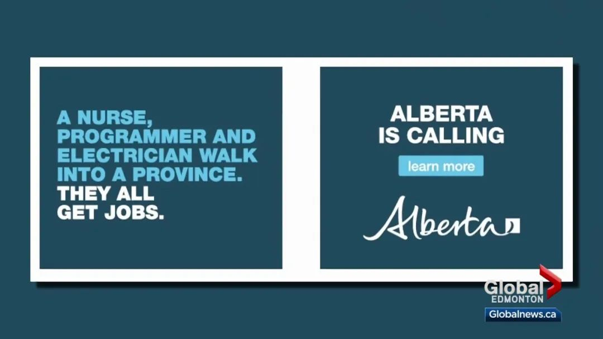
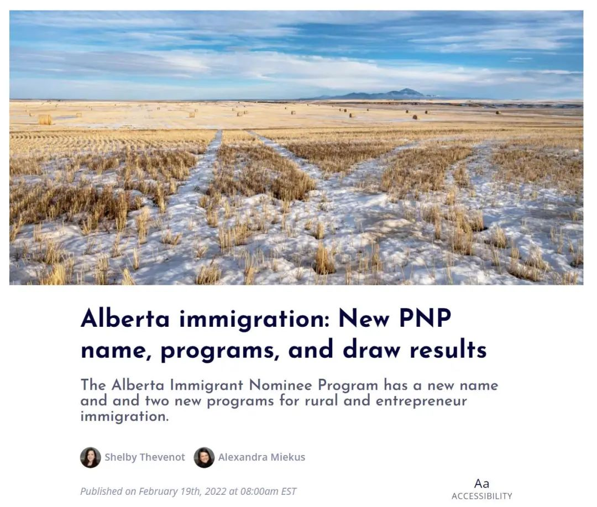

# 无标题

**链接地址:** http://mp.weixin.qq.com/s?__biz=MzUyNzA2NTAwNg==&mid=2247490672&idx=1&sn=ca65a425d0c7a81c2e083acb498c12c7&chksm=fa0416b1cd739fa7cddd4533904a7d37c0d862601a732fd168c3262311f36cbd6ec679264dff&mpshare=1&scene=2&srcid=0827p7TY0MF0Jg2KB6mM6fPB&sharer_sharetime=1661548527485&sharer_shareid=77848a6b3852ae4dcb6c74ffee84743c#rd
**作者:** 你身边的签证专家
**获取时间:** 2025/8/28 19:32:39
**图片数量:** 22

---

## 原始HTML内容

<section style="box-sizing: border-box;font-style: normal;font-weight: 400;text-align: justify;font-size: 16px;"><section style="text-align: center;margin-top: 10px;margin-bottom: 10px;box-sizing: border-box;" powered-by="xiumi.us"><section style="max-width: 100%;vertical-align: middle;display: inline-block;line-height: 0;box-sizing: border-box;"></section></section><section style="text-align: center;margin-top: 10px;margin-bottom: 10px;box-sizing: border-box;" powered-by="xiumi.us"></section>
 
<section style="font-size: 19px;text-align: center;margin: 10px 0px 3px;box-sizing: border-box;" powered-by="xiumi.us"><section style="display: inline-block;border-width: 1px;border-style: solid;border-color: rgb(188, 65, 65);background-color: rgb(188, 65, 65);width: 1.8em;height: 1.8em;line-height: 1.8em;border-radius: 100%;margin-left: auto;margin-right: auto;font-size: 16px;color: rgb(255, 255, 255);box-sizing: border-box;">
<strong style="box-sizing: border-box;">1</strong>
</section></section><section style="text-align: center;margin: 0px;box-sizing: border-box;" powered-by="xiumi.us"><section style="display: inline-block;width: 0px;height: 0px;vertical-align: top;overflow: hidden;border-style: solid;border-width: 9px 6px 0px;border-color: rgb(188, 65, 65) rgba(255, 255, 255, 0) rgba(255, 255, 255, 0);box-sizing: border-box;"><svg viewBox="0 0 1 1" style="float:left;line-height:0;width:0;vertical-align:top;"></svg></section></section><section style="margin: 0px 0px 10px;text-align: center;justify-content: center;display: flex;flex-flow: row nowrap;box-sizing: border-box;" powered-by="xiumi.us"><section style="display: inline-block;width: auto;vertical-align: middle;background-color: rgba(109, 155, 209, 0.1);min-width: 10%;max-width: 100%;flex: 0 0 auto;height: auto;align-self: center;padding: 12px;margin: 0px;box-sizing: border-box;"><section style="color: rgb(109, 155, 209);text-align: justify;box-sizing: border-box;" powered-by="xiumi.us">
<strong style="box-sizing: border-box;">增加配额，甚至从邻省“抢人”！</strong>
</section></section></section><section style="font-size: 14px;padding: 0px 15px;letter-spacing: 1px;box-sizing: border-box;" powered-by="xiumi.us">
 

<strong style="box-sizing: border-box;">“缺人缺疯了”</strong>，成为加拿大近期各大媒体上频频出现的关键字。根据加拿大统计局上周发布的7月份就业报告显示，在过去12个月中，有创纪录的30万名加拿大人退休，<strong style="box-sizing: border-box;">比去年同期增长了近30%</strong>。

 

加拿大老龄化和劳动力紧缺的现象严重，在疫情和通货膨胀的的夹击下显得尤为突出。每年40多万的移民配额已经<strong style="box-sizing: border-box;">完全不能满足加拿大经济发展的需求</strong>。

 
</section><section style="text-align: center;margin-top: 10px;margin-bottom: 10px;box-sizing: border-box;" powered-by="xiumi.us"><section style="max-width: 100%;vertical-align: middle;display: inline-block;line-height: 0;width: 90%;height: auto;box-sizing: border-box;"></section></section><section style="font-size: 14px;padding: 0px 15px;letter-spacing: 1px;box-sizing: border-box;" powered-by="xiumi.us">
 

7月26日晚上，安大略省、阿尔伯塔省、萨斯喀彻温省和曼尼托巴省<strong style="box-sizing: border-box;">四大省的移民厅长联名写信给特鲁多联邦政府</strong>，要求获得更多关于吸引新移民控制权，希望能够抢到更多更符合当地经济发展需求的人才。

 

然而，光要求增加移民配额还不够。目前加拿大每个省份都在遭遇<strong style="box-sizing: border-box;">连续创新高的职位空缺</strong>！虽然联邦政府在加快移民登陆的步伐，但面对亟待解决的问题，一些省份已经开始想办法<strong style="box-sizing: border-box;">从其他省“抢人”</strong>！

 

<strong style="box-sizing: border-box;">没错！就是这么直接！</strong>

 

 
</section><section style="font-size: 19px;text-align: center;margin: 10px 0px 3px;box-sizing: border-box;" powered-by="xiumi.us"><section style="display: inline-block;border-width: 1px;border-style: solid;border-color: rgb(188, 65, 65);background-color: rgb(188, 65, 65);width: 1.8em;height: 1.8em;line-height: 1.8em;border-radius: 100%;margin-left: auto;margin-right: auto;font-size: 16px;color: rgb(255, 255, 255);box-sizing: border-box;">
<strong style="box-sizing: border-box;">2</strong>
</section></section><section style="text-align: center;margin: 0px;box-sizing: border-box;" powered-by="xiumi.us"><section style="display: inline-block;width: 0px;height: 0px;vertical-align: top;overflow: hidden;border-style: solid;border-width: 9px 6px 0px;border-color: rgb(188, 65, 65) rgba(255, 255, 255, 0) rgba(255, 255, 255, 0);box-sizing: border-box;"><svg viewBox="0 0 1 1" style="float:left;line-height:0;width:0;vertical-align:top;"></svg></section></section><section style="margin: 0px 0px 10px;text-align: center;justify-content: center;display: flex;flex-flow: row nowrap;box-sizing: border-box;" powered-by="xiumi.us"><section style="display: inline-block;width: auto;vertical-align: middle;background-color: rgba(109, 155, 209, 0.1);min-width: 10%;max-width: 100%;flex: 0 0 auto;height: auto;align-self: center;padding: 12px;margin: 0px;box-sizing: border-box;"><section style="color: rgb(109, 155, 209);text-align: justify;box-sizing: border-box;" powered-by="xiumi.us">
<strong style="box-sizing: border-box;">阿尔伯塔省人才招募新政</strong>
</section></section></section><section style="font-size: 14px;padding: 0px 15px;letter-spacing: 1px;box-sizing: border-box;" powered-by="xiumi.us">
 

一项旨在吸引专业人才的新推介活动将对外宣传阿尔伯塔省，这个加拿大最适宜生活、工作和安家的省份。今日在多伦多和温哥华地区推出的<strong style="box-sizing: border-box;">“阿尔伯塔在召唤”（Alberta is Calling）</strong>活动旨在吸引有技术、有学历而且有闯劲的人才将事业移至阿省，在这里共创未来。（不愧是加国前移民部长，深谙人才的重要性。这亲自下场“抢人”的狠劲儿真是其他省长学不来的~）

 
</section><section style="text-align: center;margin-top: 10px;margin-bottom: 10px;box-sizing: border-box;" powered-by="xiumi.us"><section style="max-width: 100%;vertical-align: middle;display: inline-block;line-height: 0;width: 90%;height: auto;box-sizing: border-box;"></section></section><section style="font-size: 14px;padding: 0px 15px;letter-spacing: 1px;box-sizing: border-box;" powered-by="xiumi.us">
 

这项活动将重点宣传阿省在<strong style="box-sizing: border-box;">生活成本、职业发展和生活方式</strong>等方面的诸多优势，包括：

 
</section><section style="transform: scale(0.9);-webkit-transform: scale(0.9);-moz-transform: scale(0.9);-o-transform: scale(0.9);transform-origin: center center;-webkit-transform-origin: center center;-moz-transform-origin: center center;-o-transform-origin: center center;margin-top: -10px;margin-bottom: -10px;box-sizing: border-box;" powered-by="xiumi.us"><section style="margin-top: 10px;margin-bottom: 10px;box-sizing: border-box;"><section style="display: inline-block;width: 100%;border-width: 2px;border-style: dashed;border-color: rgb(192, 200, 209);padding: 10px;background-color: rgb(239, 239, 239);box-sizing: border-box;"><section style="padding: 0px 15px;box-sizing: border-box;" powered-by="xiumi.us">
● 全加拿大最高的平均薪资和最低的税收 

● 以较低的成本即可在大城市购置房屋 

● 平均通勤时间更短 

● 在新兴及发展迅速的领域有很多就业机会 

● 方便前往举世闻名的山地自然公园，全年可享远足、滑雪、骑车的乐趣，每年的日照时间超过300天。
</section></section></section></section><section style="font-size: 14px;padding: 0px 15px;letter-spacing: 1px;box-sizing: border-box;" powered-by="xiumi.us">
 

<strong style="box-sizing: border-box;">活动网站：</strong><em style="box-sizing: border-box;">albertaiscalling.ca</em>

 
</section><section style="text-align: center;margin-top: 10px;margin-bottom: 10px;box-sizing: border-box;" powered-by="xiumi.us"><section style="max-width: 100%;vertical-align: middle;display: inline-block;line-height: 0;width: 90%;height: auto;box-sizing: border-box;"></section></section>
 
<section style="text-align: left;justify-content: flex-start;display: flex;flex-flow: row nowrap;box-sizing: border-box;" powered-by="xiumi.us"><section style="display: inline-block;width: 100%;vertical-align: top;align-self: flex-start;flex: 0 0 auto;box-sizing: border-box;"><section style="text-align: center;box-sizing: border-box;" powered-by="xiumi.us"><section style="display: inline-block;width: 300px;height: 180px;vertical-align: top;overflow: hidden;box-sizing: border-box;"><section style="margin: 0px 0%;opacity: 0.1;box-sizing: border-box;" powered-by="xiumi.us"><section style="max-width: 100%;vertical-align: middle;display: inline-block;line-height: 0;width: 90%;box-sizing: border-box;"></section></section></section></section><section style="margin: -140px 0% 0px;transform: translate3d(1px, 0px, 0px);-webkit-transform: translate3d(1px, 0px, 0px);-moz-transform: translate3d(1px, 0px, 0px);-o-transform: translate3d(1px, 0px, 0px);box-sizing: border-box;" powered-by="xiumi.us"><section style="line-height: 1.8;padding: 0px 15px;text-align: justify;box-sizing: border-box;">
<em style="box-sizing: border-box;">“阿省的复苏计划有效地促进了经济发展，有些行业现在出现了技术劳动力短缺的问题。幸运的是，阿省拥有加拿大最好的发展机遇和最高的生活质量，我们很高兴能够向全体国民介绍阿省，用事实推荐自己。这项活动将向加拿大主要城市的居民展示阿省的美好生活。”</em>

 

—— 阿省长杰森·康尼（Jason Kenney）

 
</section></section></section></section><section style="font-size: 14px;padding: 0px 15px;letter-spacing: 1px;box-sizing: border-box;" powered-by="xiumi.us">
 

在过去三年中，阿省在影视、科技、农业、可再生能源、航空和物流等领域都有所发展。这种多元发展意味着求职者有更多机会扩充技能并在所选领域取得成功。这项耗资260万加元（$2.6 million）的活动将在社交媒体和其他网络平台、电台<strong style="box-sizing: border-box;">以及温哥华和多伦多的人流密集之处大力开展宣传</strong>。（非常直球偷塔的行为咯~阿省政府的X操作，妙哇~）

 
</section><section style="text-align: center;margin-top: 10px;margin-bottom: 10px;box-sizing: border-box;" powered-by="xiumi.us"><section style="max-width: 100%;vertical-align: middle;display: inline-block;line-height: 0;width: 90%;height: auto;box-sizing: border-box;"></section></section><section style="font-size: 14px;padding: 0px 15px;letter-spacing: 1px;box-sizing: border-box;" powered-by="xiumi.us">
 

推介活动分为两个阶段，今日启动的是第一阶段，第二阶段将在九月中旬推出。该活动在两个市场都额外采用了可增强影响力的策略。 

 
</section><section style="text-align: center;margin-top: 10px;margin-bottom: 10px;box-sizing: border-box;" powered-by="xiumi.us"><section style="max-width: 100%;vertical-align: middle;display: inline-block;line-height: 0;box-sizing: border-box;"></section></section><section style="font-size: 14px;padding: 0px 15px;letter-spacing: 1px;box-sizing: border-box;" powered-by="xiumi.us">
 
</section>
 
<section style="font-size: 19px;text-align: center;margin: 10px 0px 3px;box-sizing: border-box;" powered-by="xiumi.us"><section style="display: inline-block;border-width: 1px;border-style: solid;border-color: rgb(188, 65, 65);background-color: rgb(188, 65, 65);width: 1.8em;height: 1.8em;line-height: 1.8em;border-radius: 100%;margin-left: auto;margin-right: auto;font-size: 16px;color: rgb(255, 255, 255);box-sizing: border-box;">
<strong style="box-sizing: border-box;">3</strong>
</section></section><section style="text-align: center;margin: 0px;box-sizing: border-box;" powered-by="xiumi.us"><section style="display: inline-block;width: 0px;height: 0px;vertical-align: top;overflow: hidden;border-style: solid;border-width: 9px 6px 0px;border-color: rgb(188, 65, 65) rgba(255, 255, 255, 0) rgba(255, 255, 255, 0);box-sizing: border-box;"><svg viewBox="0 0 1 1" style="float:left;line-height:0;width:0;vertical-align:top;"></svg></section></section><section style="margin: 0px 0px 10px;text-align: center;justify-content: center;display: flex;flex-flow: row nowrap;box-sizing: border-box;" powered-by="xiumi.us"><section style="display: inline-block;width: auto;vertical-align: middle;background-color: rgba(109, 155, 209, 0.1);min-width: 10%;max-width: 100%;flex: 0 0 auto;height: auto;align-self: center;padding: 12px;margin: 0px;box-sizing: border-box;"><section style="color: rgb(109, 155, 209);text-align: justify;box-sizing: border-box;" powered-by="xiumi.us">
<strong style="box-sizing: border-box;">加国移民“性价比”最高省份</strong>
</section></section></section><section style="font-size: 14px;padding: 0px 15px;letter-spacing: 1px;box-sizing: border-box;" powered-by="xiumi.us">
 

<strong style="box-sizing: border-box;">工作很好找</strong>

阿省目前的岗位空缺率较高，有超过100,000个职缺。78%的阿省企业表示人才短缺限制了其满足市场需求的能力。阿省2022年的<strong style="box-sizing: border-box;">就业增长为全加拿大最高</strong>。2021年12月至2022年7月期间，阿省的就业岗位增加了68,200个，然而安大略省和卑诗省尽管人口更多，就业岗位也仅分别增加了47,800个和45,400个。

 
</section><section style="text-align: center;margin-top: 10px;margin-bottom: 10px;box-sizing: border-box;" powered-by="xiumi.us"><section style="max-width: 100%;vertical-align: middle;display: inline-block;line-height: 0;width: 90%;height: auto;box-sizing: border-box;"></section></section><section style="font-size: 14px;padding: 0px 15px;letter-spacing: 1px;box-sizing: border-box;" powered-by="xiumi.us">
 

<strong style="box-sizing: border-box;">人均收入全国最高</strong>

阿省的每周平均收入为1,251加元（2022年5月数据），为<strong style="box-sizing: border-box;">全国最高</strong>（第二高的是安省，每周1,197加元，第三为卑诗省，每周1,159加元）。根据加拿大统计局在2022年3月发布的《2020年加拿大收入调查》，阿省家庭在2020年的税后收入中位数为104,000加元，比安省高出逾7,000加元，比卑诗省高出近10,000加元。

 

<strong style="box-sizing: border-box;">住房便宜</strong>

与温哥华和多伦多相比，阿省的住房更便宜。根据2022年3月发布的《Demographia国际住房可负担性》研究报告，埃德蒙顿和卡尔加里在全球92座主要城市中，<strong style="box-sizing: border-box;">住房可负担程度名列前十</strong>。

 
</section><section style="text-align: center;margin-top: 10px;margin-bottom: 10px;box-sizing: border-box;" powered-by="xiumi.us"><section style="max-width: 100%;vertical-align: middle;display: inline-block;line-height: 0;width: 90%;height: auto;box-sizing: border-box;"></section></section><section style="font-size: 14px;padding: 0px 15px;letter-spacing: 1px;box-sizing: border-box;" powered-by="xiumi.us">
 

根据加拿大房地产协会（CREA）的数据，过去三年中，埃德蒙顿的平均房屋售价为383,000加元，只有大温哥华的34%，大多伦多的38%。卡尔加里的平均房屋售价为484,000加元，<strong style="box-sizing: border-box;">相当于大温哥华的43%，大多伦多的48%</strong>。

 
</section><section style="text-align: center;margin-top: 10px;margin-bottom: 10px;box-sizing: border-box;" powered-by="xiumi.us"><section style="max-width: 100%;vertical-align: middle;display: inline-block;line-height: 0;width: 90%;height: auto;box-sizing: border-box;"></section></section><section style="font-size: 14px;padding: 0px 15px;letter-spacing: 1px;box-sizing: border-box;" powered-by="xiumi.us">
 

<strong style="box-sizing: border-box;">平均房租低</strong>

CREA的数据显示，阿省的房价也明显更加稳定：在过去10年间，埃德蒙顿的房价上涨了18%，卡尔加里则上涨了21%。同期，温哥华的房价上涨了52%，多伦多更是上涨了135%。

 

根据CMHC在2021年2月发布的《租房市场报告》，<strong style="box-sizing: border-box;">阿省的租金更易负担</strong>。在过去三年间ˉ埃德蒙顿的平均房租是温哥华的71%，多伦多的79%。卡尔加里的平均房租是温哥华的74%，多伦多的82%。

 

<strong style="box-sizing: border-box;">阿省的税费低</strong>

阿省的家庭通常缴纳较低的个税（2022年数据，以家庭年收入为75,000加元、150,000加元和 300,000加元为例）。

 

与卑诗省相比，一户有两个孩子的阿省家庭平均将分别少交1,400加元、4,900加元和 13,100加元的税金。与安省相比，一户有两个孩子的阿省家庭平均将分别少交3,800加元、8,700加元和 20,700加元的税金。

 

另外，<strong style="box-sizing: border-box;">阿省没有省级销售税、工资税和医保费</strong>。 

 
</section><section style="text-align: center;margin-top: 10px;margin-bottom: 10px;box-sizing: border-box;" powered-by="xiumi.us"><section style="max-width: 100%;vertical-align: middle;display: inline-block;line-height: 0;width: 90%;height: auto;box-sizing: border-box;"></section></section><section style="font-size: 14px;padding: 0px 15px;letter-spacing: 1px;box-sizing: border-box;" powered-by="xiumi.us">
 

<strong style="box-sizing: border-box;">通勤时间短</strong>

埃德蒙顿和卡尔加里的上班族通勤时间更短。根据2016年的人口普查，埃德蒙顿和卡尔加里的人均通勤时间（单程）为25.9分钟和26.5分钟。相比之下，多伦多为34.0分钟，温哥华为29.7分钟。2022年前三个月，<strong style="box-sizing: border-box;">阿省的省际净移入人口为加拿大最高</strong>，达5,351人。卡尔加里在Economic Intelligence Unit<strong style="box-sizing: border-box;">最新的宜居城市排行榜中全球排名第三</strong>。

 

 
</section><section style="font-size: 19px;text-align: center;margin: 10px 0px 3px;box-sizing: border-box;" powered-by="xiumi.us"><section style="display: inline-block;border-width: 1px;border-style: solid;border-color: rgb(188, 65, 65);background-color: rgb(188, 65, 65);width: 1.8em;height: 1.8em;line-height: 1.8em;border-radius: 100%;margin-left: auto;margin-right: auto;font-size: 16px;color: rgb(255, 255, 255);box-sizing: border-box;">
<strong style="box-sizing: border-box;">4</strong>
</section></section><section style="text-align: center;margin: 0px;box-sizing: border-box;" powered-by="xiumi.us"><section style="display: inline-block;width: 0px;height: 0px;vertical-align: top;overflow: hidden;border-style: solid;border-width: 9px 6px 0px;border-color: rgb(188, 65, 65) rgba(255, 255, 255, 0) rgba(255, 255, 255, 0);box-sizing: border-box;"><svg viewBox="0 0 1 1" style="float:left;line-height:0;width:0;vertical-align:top;"></svg></section></section><section style="margin: 0px 0px 10px;text-align: center;justify-content: center;display: flex;flex-flow: row nowrap;box-sizing: border-box;" powered-by="xiumi.us"><section style="display: inline-block;width: auto;vertical-align: middle;background-color: rgba(109, 155, 209, 0.1);min-width: 10%;max-width: 100%;flex: 0 0 auto;height: auto;align-self: center;padding: 12px;margin: 0px;box-sizing: border-box;"><section style="color: rgb(109, 155, 209);text-align: justify;box-sizing: border-box;" powered-by="xiumi.us">
<strong style="box-sizing: border-box;">阿省省提名移民政策概览</strong>
</section></section></section><section style="font-size: 14px;padding: 0px 15px;letter-spacing: 1px;box-sizing: border-box;" powered-by="xiumi.us">
 

<strong style="box-sizing: border-box;">阿省省提名(以下简称AAIP)</strong>也是加拿大各省份中<strong style="box-sizing: border-box;">最早一批与联邦移民部(IRCC)签署省提名协议的省份之一</strong>。由于AAIP历史较长，加上本省拥有较强经济实力，所以省提名项目历经多年不断动态更新，吸引世界各地新移民，从而适应本省的经济和社区发展现实情况。

 

今年年初，阿省的移民政策迎来<strong style="box-sizing: border-box;">重大改革</strong>。

 
</section><section style="text-align: center;margin-top: 10px;margin-bottom: 10px;box-sizing: border-box;" powered-by="xiumi.us"><section style="max-width: 100%;vertical-align: middle;display: inline-block;line-height: 0;width: 90%;height: auto;box-sizing: border-box;"></section></section><section style="font-size: 14px;padding: 0px 15px;letter-spacing: 1px;box-sizing: border-box;" powered-by="xiumi.us">
 

2022年2月16日，阿尔伯塔省提名移民计划Alberta Immigrant Nominee Program (AINP) 更名为<strong style="box-sizing: border-box;">阿尔伯塔省优势移民计划</strong>Alberta Advantage Immigration Program（AAIP）。

 

与此同时，阿省还推出了两个新的移民类别：<strong style="box-sizing: border-box;">农村复兴移民Rural Renewal Stream和农村企业家移民Rural Entrepreneur Stream</strong>。

 

该移民计划还进行了其他几项更改。

 
</section><section style="text-align: center;margin-top: 10px;margin-bottom: 10px;box-sizing: border-box;" powered-by="xiumi.us"><section style="max-width: 100%;vertical-align: middle;display: inline-block;line-height: 0;width: 90%;height: auto;box-sizing: border-box;"></section></section><section style="font-size: 14px;padding: 0px 15px;letter-spacing: 1px;box-sizing: border-box;" powered-by="xiumi.us">
 

<strong style="box-sizing: border-box;">三个企业家移民</strong>类别的名称发生了变化：

 
<ul class="list-paddingleft-1" style="list-style-type: disc;box-sizing: border-box;"><li style="box-sizing: border-box;">
<em style="box-sizing: border-box;"><strong style="box-sizing: border-box;">国际毕业生企业家移民现在变更为毕业生企业家移民；</strong></em>
</li><li style="box-sizing: border-box;">
<em style="box-sizing: border-box;"><strong style="box-sizing: border-box;">外国毕业生创投移民现在变更为外国毕业生企业家移民；</strong></em>
</li><li style="box-sizing: border-box;">
<em style="box-sizing: border-box;"><strong style="box-sizing: border-box;">自雇农场主移民现在变更为农场移民。</strong></em>
</li></ul>
 

使用阿省在线门户网站提交申请并需要延期提名的候选人现在<strong style="box-sizing: border-box;">必须在门户网站中提交申请</strong>。现有移民类别和途径的申请条件没有改变。所有其他的决策后流程也保持不变。

 
</section><section style="text-align: center;margin-top: 10px;margin-bottom: 10px;box-sizing: border-box;" powered-by="xiumi.us"><section style="max-width: 100%;vertical-align: middle;display: inline-block;line-height: 0;width: 90%;height: auto;box-sizing: border-box;"></section></section><section style="font-size: 14px;padding: 0px 15px;letter-spacing: 1px;box-sizing: border-box;" powered-by="xiumi.us">
 

AAIP阿省优势移民是一个经济类移民项目，由<strong style="box-sizing: border-box;">阿尔伯塔省和加拿大联邦政府</strong><strong style="box-sizing: border-box;">协作</strong><strong style="box-sizing: border-box;">管理</strong>，旨在促进提名的新移民在阿省永久居留。被提名人必须具备填补当地职位空缺的技能，或者计划在阿省购买或创办企业。

 

另外随着疫情逐渐趋向缓和，阿省移民部门在2022年5月1日<strong style="box-sizing: border-box;">删除了81个被拒绝申请LMIA的职业列表</strong>，从而标志着阿省经济正式进入疫情后复苏阶段！ 

 
</section><section style="margin-top: 10px;margin-bottom: 10px;box-sizing: border-box;" powered-by="xiumi.us"><section style="width: 100%;text-align: left;box-sizing: border-box;"><section style="display: inline-block;vertical-align: top;max-width: 100%;border-radius: 3px 3px 0px 0px;margin-right: 3px;background-color: rgb(188, 65, 65);color: rgb(255, 255, 255);font-size: 18px;padding-left: 6px;padding-right: 6px;box-sizing: border-box;">
<strong style="box-sizing: border-box;">阅读更多</strong>
</section> </section><section style="width: 100%;font-size: 0px;margin-top: -2px;box-sizing: border-box;"><section style="display: inline-block;vertical-align: top;width: 100%;margin-right: -6px;border-bottom: 2px solid rgb(188, 65, 65);box-sizing: border-box;"><svg viewBox="0 0 1 1" style="float:left;line-height:0;width:0;vertical-align:top;"></svg></section><section style="display: inline-block;vertical-align: top;margin-top: -2px;width: 6px;height: 6px;border-radius: 50%;background-color: rgb(188, 65, 65);box-sizing: border-box;"><svg viewBox="0 0 1 1" style="float:left;line-height:0;width:0;vertical-align:top;"></svg></section></section></section><section style="margin: 10px 0%;text-align: left;justify-content: flex-start;display: flex;flex-flow: row nowrap;box-sizing: border-box;" powered-by="xiumi.us"><section style="display: inline-block;width: 100%;vertical-align: top;background-position: 55.6015% 33.1154%;background-repeat: repeat;background-size: 100.637%;background-attachment: scroll;padding: 30px;align-self: flex-start;flex: 0 0 auto;background-image: url(&quot;https://mmbiz.qpic.cn/mmbiz_jpg/904kUibXm7Y4zoaCQZOek0jO05Ukfy6F3TygNlPWQaIxNpb39w7YK4DY8l46JUYx6TaflNj5TLHzZ4sMuT159VQ/640?wx_fmt=jpeg&quot;);box-sizing: border-box;"><section style="text-align: justify;justify-content: flex-start;display: flex;flex-flow: row nowrap;box-sizing: border-box;" powered-by="xiumi.us"><section style="display: inline-block;width: 100%;vertical-align: top;background-color: rgba(188, 65, 65, 0.22);padding: 10px;border-width: 0px;border-style: none;border-color: rgb(62, 62, 62);align-self: flex-start;flex: 0 0 auto;box-sizing: border-box;"><section style="text-align: center;color: rgb(255, 255, 255);font-size: 14px;box-sizing: border-box;" powered-by="xiumi.us">
<a target="_blank" href="http://mp.weixin.qq.com/s?__biz=MzUyNzA2NTAwNg==&amp;mid=2247490420&amp;idx=1&amp;sn=9bc87bcb2774fda6e93d291d2c5e8168&amp;chksm=fa0411b5cd7398a36a4b8ee9376cee7c056f910e2b34e753633e95f1e0c3a52a8e9fdda2b5cf&amp;scene=21#wechat_redirect" textvalue="阿省也加入“抢移民”大战！加国四省联名上书联邦政府要求增加移民名额！" linktype="text" imgurl="" imgdata="null" data-itemshowtype="0" tab="innerlink" style="color: rgb(255, 255, 255);" data-linktype="2"><strong style="box-sizing: border-box;">阿省也加入“抢移民”大战！加国四省联名上书联邦政府要求增加移民名额！</strong></a>
</section></section></section></section></section><section style="margin: 10px 0%;text-align: left;justify-content: flex-start;display: flex;flex-flow: row nowrap;box-sizing: border-box;" powered-by="xiumi.us"><section style="display: inline-block;width: 100%;vertical-align: top;background-position: 55.6015% 33.1154%;background-repeat: repeat;background-size: 100.637%;background-attachment: scroll;padding: 30px;align-self: flex-start;flex: 0 0 auto;background-image: url(&quot;https://mmbiz.qpic.cn/mmbiz_jpg/904kUibXm7Y4zoaCQZOek0jO05Ukfy6F3xhtYujbJZdewFHicia52zQnHNbztEorz6LMgYRvAH3cc2REY5G9HDTrw/640?wx_fmt=jpeg&quot;);box-sizing: border-box;"><section style="text-align: justify;justify-content: flex-start;display: flex;flex-flow: row nowrap;box-sizing: border-box;" powered-by="xiumi.us"><section style="display: inline-block;width: 100%;vertical-align: top;background-color: rgba(188, 65, 65, 0.22);padding: 10px;border-width: 0px;border-style: none;border-color: rgb(62, 62, 62);align-self: flex-start;flex: 0 0 auto;box-sizing: border-box;"><section style="text-align: center;color: rgb(255, 255, 255);font-size: 14px;box-sizing: border-box;" powered-by="xiumi.us">
<a target="_blank" href="http://mp.weixin.qq.com/s?__biz=MzUyNzA2NTAwNg==&amp;mid=2247489481&amp;idx=1&amp;sn=6b0a4589da97ebf3a20eb91031d028ce&amp;chksm=fa041d08cd73941edc75f09f8bde59c708b7a8168ebafe791eaecfb04e56565a1e43ce75f897&amp;scene=21#wechat_redirect" textvalue="全面放开接收“海外劳工”，阿省率先取消LMIA工签“岗位黑名单”！" linktype="text" imgurl="" imgdata="null" data-itemshowtype="0" tab="innerlink" style="color: rgb(255, 255, 255);" data-linktype="2"><strong style="box-sizing: border-box;">全面放开接收“海外劳工”，阿省率先取消LMIA工签“岗位黑名单”！</strong></a>
</section></section></section></section></section><section style="margin: 10px 0%;text-align: left;justify-content: flex-start;display: flex;flex-flow: row nowrap;box-sizing: border-box;" powered-by="xiumi.us"><section style="display: inline-block;width: 100%;vertical-align: top;background-position: 55.6015% 33.1154%;background-repeat: repeat;background-size: 100.637%;background-attachment: scroll;padding: 30px;align-self: flex-start;flex: 0 0 auto;background-image: url(&quot;https://mmbiz.qpic.cn/mmbiz_jpg/904kUibXm7Y4zoaCQZOek0jO05Ukfy6F3OgA0KD8jCsVHHtpuyoIa2LsOY3NpKqdGiap3Gpw3njvSHzF1AOibWEvw/640?wx_fmt=jpeg&quot;);box-sizing: border-box;"><section style="text-align: justify;justify-content: flex-start;display: flex;flex-flow: row nowrap;box-sizing: border-box;" powered-by="xiumi.us"><section style="display: inline-block;width: 100%;vertical-align: top;background-color: rgba(188, 65, 65, 0.22);padding: 10px;border-width: 0px;border-style: none;border-color: rgb(62, 62, 62);align-self: flex-start;flex: 0 0 auto;box-sizing: border-box;"><section style="text-align: left;color: rgb(255, 255, 255);font-size: 14px;box-sizing: border-box;" powered-by="xiumi.us">
<a target="_blank" href="http://mp.weixin.qq.com/s?__biz=MzUyNzA2NTAwNg==&amp;mid=2247489131&amp;idx=1&amp;sn=b2880c0eabd68f58f0e42a877ce4e7c1&amp;chksm=fa041caacd7395bca727ea624d7d745d76c74de279e00055c74d44e1a404a9131838c90d32bc&amp;scene=21#wechat_redirect" textvalue="从“AINP”到&quot;AAIP&quot;！阿省省提名正式改名，两个新移民项目推出！" linktype="text" imgurl="" imgdata="null" data-itemshowtype="0" tab="innerlink" style="color: rgb(255, 255, 255);" data-linktype="2"><strong style="box-sizing: border-box;">从“AINP”到"AAIP"！阿省省提名正式改名，两个新移民项目推出！</strong></a>
</section></section></section></section></section><section style="margin: 10px 0%;text-align: left;justify-content: flex-start;display: flex;flex-flow: row nowrap;box-sizing: border-box;" powered-by="xiumi.us"><section style="display: inline-block;width: 100%;vertical-align: top;background-position: 55.6015% 33.1154%;background-repeat: repeat;background-size: 100.637%;background-attachment: scroll;padding: 30px;align-self: flex-start;flex: 0 0 auto;background-image: url(&quot;https://mmbiz.qpic.cn/mmbiz_jpg/904kUibXm7Y4zoaCQZOek0jO05Ukfy6F3wx80bWuPrD1QWFriaQwtDwG6MaEOq43dXgLIGksib0NuKFLxlIkyQXcg/640?wx_fmt=jpeg&quot;);box-sizing: border-box;"><section style="text-align: justify;justify-content: flex-start;display: flex;flex-flow: row nowrap;box-sizing: border-box;" powered-by="xiumi.us"><section style="display: inline-block;width: 100%;vertical-align: top;background-color: rgba(188, 65, 65, 0.22);padding: 10px;border-width: 0px;border-style: none;border-color: rgb(62, 62, 62);align-self: flex-start;flex: 0 0 auto;box-sizing: border-box;"><section style="text-align: left;color: rgb(255, 255, 255);font-size: 14px;box-sizing: border-box;" powered-by="xiumi.us">
<a target="_blank" href="http://mp.weixin.qq.com/s?__biz=MzUyNzA2NTAwNg==&amp;mid=2247489108&amp;idx=1&amp;sn=5c9abe5a8b6007d2cdd1be1119e21508&amp;chksm=fa041c95cd739583f868b3440508474b3472be3a9e676e3aa522a92fbd1d10a4c29fbf076828&amp;scene=21#wechat_redirect" textvalue="阿省“乡镇振兴”和“乡镇企业家”双移民通道全新开启，满足你田园牧歌的梦想！" linktype="text" imgurl="" imgdata="null" data-itemshowtype="0" tab="innerlink" style="color: rgb(255, 255, 255);" data-linktype="2"><strong style="box-sizing: border-box;">阿省“乡镇振兴”和“乡镇企业家”双移民通道全新开启，满足你田园牧歌的梦想！</strong></a>
</section></section></section></section></section><section style="font-size: 14px;padding: 0px 15px;letter-spacing: 1px;box-sizing: border-box;" powered-by="xiumi.us">
 
</section><section style="font-size: 19px;text-align: center;margin: 10px 0px 3px;box-sizing: border-box;" powered-by="xiumi.us"><section style="display: inline-block;border-width: 1px;border-style: solid;border-color: rgb(188, 65, 65);background-color: rgb(188, 65, 65);width: 1.8em;height: 1.8em;line-height: 1.8em;border-radius: 100%;margin-left: auto;margin-right: auto;font-size: 16px;color: rgb(255, 255, 255);box-sizing: border-box;">
<strong style="box-sizing: border-box;">5</strong>
</section></section><section style="text-align: center;margin: 0px;box-sizing: border-box;" powered-by="xiumi.us"><section style="display: inline-block;width: 0px;height: 0px;vertical-align: top;overflow: hidden;border-style: solid;border-width: 9px 6px 0px;border-color: rgb(188, 65, 65) rgba(255, 255, 255, 0) rgba(255, 255, 255, 0);box-sizing: border-box;"><svg viewBox="0 0 1 1" style="float:left;line-height:0;width:0;vertical-align:top;"></svg></section></section><section style="margin: 0px 0px 10px;text-align: center;justify-content: center;display: flex;flex-flow: row nowrap;box-sizing: border-box;" powered-by="xiumi.us"><section style="display: inline-block;width: auto;vertical-align: middle;background-color: rgba(109, 155, 209, 0.1);min-width: 10%;max-width: 100%;flex: 0 0 auto;height: auto;align-self: center;padding: 12px;margin: 0px;box-sizing: border-box;"><section style="color: rgb(109, 155, 209);text-align: justify;box-sizing: border-box;" powered-by="xiumi.us">
<strong style="box-sizing: border-box;">AAIP热门技术类项目介绍</strong>
</section></section></section><section style="font-size: 14px;padding: 0px 15px;letter-spacing: 1px;box-sizing: border-box;" powered-by="xiumi.us">
 

<strong style="box-sizing: border-box;">一、阿省机遇类别(AOS)</strong>

 

该项目于2018年6月14日正式实施，以取代之前的雇主驱动类和战略招聘类。该AOS类别对申请人语言、学历、工作经验以及与所学专业的对口程度均提升了要求。AOS类别明确要求所有申请人在提交申请时需持有合法工签，并在符合阿省要求的<strong style="box-sizing: border-box;">职业工作(阿省境内)</strong>；从2020年11月1日开始，对于享有LMIA豁免的毕业工签持有者，必须从阿省专上院校毕业。

 

 

<strong style="box-sizing: border-box;">二、阿省EE类别</strong>

 

该项目跟AOS类别是同一天推出的，主要为了跟联邦EE政策的对接。AAIP在联邦EE池子中筛选合格候选人，被选中的候选人将收到AAIP的<strong style="box-sizing: border-box;">邀请函(NOI)</strong>。

 

虽然该项目要求CRS<strong style="box-sizing: border-box;">门槛分数仅300分</strong>，但AAIP在EE池子里邀请候选人时，将着重筛选那些与阿省关系密切的候选人，比如：

 
<ol class="list-paddingleft-1" style="list-style-type: decimal;box-sizing: border-box;"><li style="box-sizing: border-box;">
<em style="box-sizing: border-box;"><strong style="box-sizing: border-box;">获得阿省雇主工作Offer；</strong></em>
</li><li style="box-sizing: border-box;">
<em style="box-sizing: border-box;"><strong style="box-sizing: border-box;">在加拿大专上院校甚至阿省专上院校毕业的留学生；</strong></em>
</li><li style="box-sizing: border-box;">
<em style="box-sizing: border-box;"><strong style="box-sizing: border-box;">在阿省有近亲(具有加拿大公民或PR身份)定居的申请人。</strong></em>
</li></ol>
 

从近年的历次邀请可以看出AAIP EE类别每轮最低分数基本都在300-400分区间，貌似不高，但实际上AAIP对于邀请怎样背景条件的申请人拥有相当大的<strong style="box-sizing: border-box;">自由裁量权</strong>，即便部分申请人EE CRS分数在300-400分这一区间，但若没有AAIP认可的与阿省所谓的<strong style="box-sizing: border-box;">“紧密关联”</strong>，也可能收不到邀请信！

 

2022年1月13日AAIP官宣的<strong style="box-sizing: border-box;">“加速科技通道/Accelerated Tech Pathway”</strong>实质并非一个全新的移民项目，它其实是依附于AAIP省提名EE类别项目而存在的。阿省当前面临对于技术类人才的急切需求，因为在过去两年的疫情影响下AAIP-EE类别项目平均审理时间达到9个月，所以AAIP特别设立这个快速审理通道就是希望能加快对合格申请人的审理。仔细看该通道的要求，它明确要求申请人须有一份<strong style="box-sizing: border-box;">阿省雇主签发的工作Offer</strong>，或正在为符合上述条件的阿省雇主工作，同时还需要满足原来AAIP-EE类别项目的要求。

 
</section><section style="margin: 10px 0%;text-align: left;justify-content: flex-start;display: flex;flex-flow: row nowrap;box-sizing: border-box;" powered-by="xiumi.us"><section style="display: inline-block;width: 100%;vertical-align: top;background-color: rgb(216, 202, 160);line-height: 0;align-self: flex-start;flex: 0 0 auto;box-sizing: border-box;"><section style="text-align: justify;justify-content: flex-start;display: flex;flex-flow: row nowrap;box-sizing: border-box;" powered-by="xiumi.us"><section style="display: inline-block;width: 100%;vertical-align: top;background-position: 0% 0%;background-repeat: repeat;background-size: 1.56658%;background-attachment: scroll;padding: 0px;align-self: flex-start;flex: 0 0 auto;background-image: url(&quot;https://mmbiz.qpic.cn/mmbiz_png/904kUibXm7Y4zoaCQZOek0jO05Ukfy6F3dROjtib9dcc0X9I7QFmqCiaQJnIzH0TdsPFpB5r6utkc0h4wBatyou1Q/640?wx_fmt=png&quot;);box-sizing: border-box;"><section style="text-align: center;box-sizing: border-box;" powered-by="xiumi.us"><section style="display: inline-block;width: 100%;height: 11px;vertical-align: top;overflow: hidden;background-color: rgba(255, 255, 255, 0);box-sizing: border-box;"><svg viewBox="0 0 1 1" style="float:left;line-height:0;width:0;vertical-align:top;"></svg></section></section></section></section></section></section><section style="text-align: center;margin-top: 10px;margin-bottom: 10px;box-sizing: border-box;" powered-by="xiumi.us"><section style="max-width: 100%;vertical-align: middle;display: inline-block;line-height: 0;box-sizing: border-box;"></section></section><section style="font-size: 14px;padding: 0px 15px;letter-spacing: 1px;box-sizing: border-box;" powered-by="xiumi.us">
 

阿省省提名项目众多，申请要求和审批步骤也有较大差异。如果你对成为阿省的永久居民感兴趣，想要了解自己到底最适合哪个省提名移民项目，欢迎扫描上图<strong style="box-sizing: border-box;">新时代留学移民法律事务所的微信号二维码</strong>，和专业负责的加国持牌移民顾问预约一对一的咨询服务。枫叶国之路，即刻扬帆起航！

 
</section><section style="text-align: center;margin-top: 10px;margin-bottom: 10px;box-sizing: border-box;" powered-by="xiumi.us"><section style="max-width: 100%;vertical-align: middle;display: inline-block;line-height: 0;box-sizing: border-box;"></section></section><section style="text-align: center;margin-top: 10px;margin-bottom: 10px;box-sizing: border-box;" powered-by="xiumi.us"><section style="max-width: 100%;vertical-align: middle;display: inline-block;line-height: 0;box-sizing: border-box;"></section></section><section style="text-align: center;margin-top: 10px;margin-bottom: 10px;box-sizing: border-box;" powered-by="xiumi.us"><section style="max-width: 100%;vertical-align: middle;display: inline-block;line-height: 0;box-sizing: border-box;"></section></section><section style="text-align: center;margin-top: 10px;margin-bottom: 10px;box-sizing: border-box;" powered-by="xiumi.us"><section style="max-width: 100%;vertical-align: middle;display: inline-block;line-height: 0;box-sizing: border-box;"></section></section><section style="text-align: center;margin-top: 10px;margin-bottom: 10px;box-sizing: border-box;" powered-by="xiumi.us"><section style="max-width: 100%;vertical-align: middle;display: inline-block;line-height: 0;box-sizing: border-box;"></section></section></section>
 

---

## 纯文本内容

1增加配额，甚至从邻省“抢人”！“缺人缺疯了”，成为加拿大近期各大媒体上频频出现的关键字。根据加拿大统计局上周发布的7月份就业报告显示，在过去12个月中，有创纪录的30万名加拿大人退休，比去年同期增长了近30%。加拿大老龄化和劳动力紧缺的现象严重，在疫情和通货膨胀的的夹击下显得尤为突出。每年40多万的移民配额已经完全不能满足加拿大经济发展的需求。7月26日晚上，安大略省、阿尔伯塔省、萨斯喀彻温省和曼尼托巴省四大省的移民厅长联名写信给特鲁多联邦政府，要求获得更多关于吸引新移民控制权，希望能够抢到更多更符合当地经济发展需求的人才。然而，光要求增加移民配额还不够。目前加拿大每个省份都在遭遇连续创新高的职位空缺！虽然联邦政府在加快移民登陆的步伐，但面对亟待解决的问题，一些省份已经开始想办法从其他省“抢人”！没错！就是这么直接！2阿尔伯塔省人才招募新政一项旨在吸引专业人才的新推介活动将对外宣传阿尔伯塔省，这个加拿大最适宜生活、工作和安家的省份。今日在多伦多和温哥华地区推出的“阿尔伯塔在召唤”（Alberta is Calling）活动旨在吸引有技术、有学历而且有闯劲的人才将事业移至阿省，在这里共创未来。（不愧是加国前移民部长，深谙人才的重要性。这亲自下场“抢人”的狠劲儿真是其他省长学不来的~）这项活动将重点宣传阿省在生活成本、职业发展和生活方式等方面的诸多优势，包括：● 全加拿大最高的平均薪资和最低的税收● 以较低的成本即可在大城市购置房屋● 平均通勤时间更短● 在新兴及发展迅速的领域有很多就业机会● 方便前往举世闻名的山地自然公园，全年可享远足、滑雪、骑车的乐趣，每年的日照时间超过300天。活动网站：albertaiscalling.ca“阿省的复苏计划有效地促进了经济发展，有些行业现在出现了技术劳动力短缺的问题。幸运的是，阿省拥有加拿大最好的发展机遇和最高的生活质量，我们很高兴能够向全体国民介绍阿省，用事实推荐自己。这项活动将向加拿大主要城市的居民展示阿省的美好生活。”—— 阿省长杰森·康尼（Jason Kenney）在过去三年中，阿省在影视、科技、农业、可再生能源、航空和物流等领域都有所发展。这种多元发展意味着求职者有更多机会扩充技能并在所选领域取得成功。这项耗资260万加元（$2.6 million）的活动将在社交媒体和其他网络平台、电台以及温哥华和多伦多的人流密集之处大力开展宣传。（非常直球偷塔的行为咯~阿省政府的X操作，妙哇~）推介活动分为两个阶段，今日启动的是第一阶段，第二阶段将在九月中旬推出。该活动在两个市场都额外采用了可增强影响力的策略。3加国移民“性价比”最高省份工作很好找阿省目前的岗位空缺率较高，有超过100,000个职缺。78%的阿省企业表示人才短缺限制了其满足市场需求的能力。阿省2022年的就业增长为全加拿大最高。2021年12月至2022年7月期间，阿省的就业岗位增加了68,200个，然而安大略省和卑诗省尽管人口更多，就业岗位也仅分别增加了47,800个和45,400个。人均收入全国最高阿省的每周平均收入为1,251加元（2022年5月数据），为全国最高（第二高的是安省，每周1,197加元，第三为卑诗省，每周1,159加元）。根据加拿大统计局在2022年3月发布的《2020年加拿大收入调查》，阿省家庭在2020年的税后收入中位数为104,000加元，比安省高出逾7,000加元，比卑诗省高出近10,000加元。住房便宜与温哥华和多伦多相比，阿省的住房更便宜。根据2022年3月发布的《Demographia国际住房可负担性》研究报告，埃德蒙顿和卡尔加里在全球92座主要城市中，住房可负担程度名列前十。根据加拿大房地产协会（CREA）的数据，过去三年中，埃德蒙顿的平均房屋售价为383,000加元，只有大温哥华的34%，大多伦多的38%。卡尔加里的平均房屋售价为484,000加元，相当于大温哥华的43%，大多伦多的48%。平均房租低CREA的数据显示，阿省的房价也明显更加稳定：在过去10年间，埃德蒙顿的房价上涨了18%，卡尔加里则上涨了21%。同期，温哥华的房价上涨了52%，多伦多更是上涨了135%。根据CMHC在2021年2月发布的《租房市场报告》，阿省的租金更易负担。在过去三年间ˉ埃德蒙顿的平均房租是温哥华的71%，多伦多的79%。卡尔加里的平均房租是温哥华的74%，多伦多的82%。阿省的税费低阿省的家庭通常缴纳较低的个税（2022年数据，以家庭年收入为75,000加元、150,000加元和 300,000加元为例）。与卑诗省相比，一户有两个孩子的阿省家庭平均将分别少交1,400加元、4,900加元和 13,100加元的税金。与安省相比，一户有两个孩子的阿省家庭平均将分别少交3,800加元、8,700加元和 20,700加元的税金。另外，阿省没有省级销售税、工资税和医保费。通勤时间短埃德蒙顿和卡尔加里的上班族通勤时间更短。根据2016年的人口普查，埃德蒙顿和卡尔加里的人均通勤时间（单程）为25.9分钟和26.5分钟。相比之下，多伦多为34.0分钟，温哥华为29.7分钟。2022年前三个月，阿省的省际净移入人口为加拿大最高，达5,351人。卡尔加里在Economic Intelligence Unit最新的宜居城市排行榜中全球排名第三。4阿省省提名移民政策概览阿省省提名(以下简称AAIP)也是加拿大各省份中最早一批与联邦移民部(IRCC)签署省提名协议的省份之一。由于AAIP历史较长，加上本省拥有较强经济实力，所以省提名项目历经多年不断动态更新，吸引世界各地新移民，从而适应本省的经济和社区发展现实情况。今年年初，阿省的移民政策迎来重大改革。2022年2月16日，阿尔伯塔省提名移民计划Alberta Immigrant Nominee Program (AINP) 更名为阿尔伯塔省优势移民计划Alberta Advantage Immigration Program（AAIP）。与此同时，阿省还推出了两个新的移民类别：农村复兴移民Rural Renewal Stream和农村企业家移民Rural Entrepreneur Stream。该移民计划还进行了其他几项更改。三个企业家移民类别的名称发生了变化：国际毕业生企业家移民现在变更为毕业生企业家移民；外国毕业生创投移民现在变更为外国毕业生企业家移民；自雇农场主移民现在变更为农场移民。使用阿省在线门户网站提交申请并需要延期提名的候选人现在必须在门户网站中提交申请。现有移民类别和途径的申请条件没有改变。所有其他的决策后流程也保持不变。AAIP阿省优势移民是一个经济类移民项目，由阿尔伯塔省和加拿大联邦政府协作管理，旨在促进提名的新移民在阿省永久居留。被提名人必须具备填补当地职位空缺的技能，或者计划在阿省购买或创办企业。另外随着疫情逐渐趋向缓和，阿省移民部门在2022年5月1日删除了81个被拒绝申请LMIA的职业列表，从而标志着阿省经济正式进入疫情后复苏阶段！阅读更多 阿省也加入“抢移民”大战！加国四省联名上书联邦政府要求增加移民名额！全面放开接收“海外劳工”，阿省率先取消LMIA工签“岗位黑名单”！从“AINP”到"AAIP"！阿省省提名正式改名，两个新移民项目推出！阿省“乡镇振兴”和“乡镇企业家”双移民通道全新开启，满足你田园牧歌的梦想！5AAIP热门技术类项目介绍一、阿省机遇类别(AOS)该项目于2018年6月14日正式实施，以取代之前的雇主驱动类和战略招聘类。该AOS类别对申请人语言、学历、工作经验以及与所学专业的对口程度均提升了要求。AOS类别明确要求所有申请人在提交申请时需持有合法工签，并在符合阿省要求的职业工作(阿省境内)；从2020年11月1日开始，对于享有LMIA豁免的毕业工签持有者，必须从阿省专上院校毕业。二、阿省EE类别该项目跟AOS类别是同一天推出的，主要为了跟联邦EE政策的对接。AAIP在联邦EE池子中筛选合格候选人，被选中的候选人将收到AAIP的邀请函(NOI)。虽然该项目要求CRS门槛分数仅300分，但AAIP在EE池子里邀请候选人时，将着重筛选那些与阿省关系密切的候选人，比如：获得阿省雇主工作Offer；在加拿大专上院校甚至阿省专上院校毕业的留学生；在阿省有近亲(具有加拿大公民或PR身份)定居的申请人。从近年的历次邀请可以看出AAIP EE类别每轮最低分数基本都在300-400分区间，貌似不高，但实际上AAIP对于邀请怎样背景条件的申请人拥有相当大的自由裁量权，即便部分申请人EE CRS分数在300-400分这一区间，但若没有AAIP认可的与阿省所谓的“紧密关联”，也可能收不到邀请信！2022年1月13日AAIP官宣的“加速科技通道/Accelerated Tech Pathway”实质并非一个全新的移民项目，它其实是依附于AAIP省提名EE类别项目而存在的。阿省当前面临对于技术类人才的急切需求，因为在过去两年的疫情影响下AAIP-EE类别项目平均审理时间达到9个月，所以AAIP特别设立这个快速审理通道就是希望能加快对合格申请人的审理。仔细看该通道的要求，它明确要求申请人须有一份阿省雇主签发的工作Offer，或正在为符合上述条件的阿省雇主工作，同时还需要满足原来AAIP-EE类别项目的要求。阿省省提名项目众多，申请要求和审批步骤也有较大差异。如果你对成为阿省的永久居民感兴趣，想要了解自己到底最适合哪个省提名移民项目，欢迎扫描上图新时代留学移民法律事务所的微信号二维码，和专业负责的加国持牌移民顾问预约一对一的咨询服务。枫叶国之路，即刻扬帆起航！

---

## 图片列表

-  (原始链接: https://mmbiz.qpic.cn/mmbiz_jpg/904kUibXm7Y4zoaCQZOek0jO05Ukfy6F3LG4jCef8OTYnBnshCeUpibqsncqasm4LiaGUQKbY51t5AYX9C8WN00oA/640?wx_fmt=jpeg)
-  (原始链接: https://mmbiz.qpic.cn/mmbiz_jpg/904kUibXm7Y4EC3q40NfCb7jaWhWbgfxibgpavj9rH4EqdQFpzyVg6N8TNSVOsgAOuvg1OSL9ec8ZyRicEzu8Tib7A/640?wx_fmt=jpeg)
-  (原始链接: https://mmbiz.qpic.cn/mmbiz_jpg/904kUibXm7Y4zoaCQZOek0jO05Ukfy6F3A08tdckB1rfN7Lzb2as7zuUsIKk7TQtiaDQMUjdSdyfOAzyWvp5V8Sg/640?wx_fmt=jpeg)
-  (原始链接: https://mmbiz.qpic.cn/mmbiz_jpg/904kUibXm7Y4zoaCQZOek0jO05Ukfy6F3PSFvjtiap64QH8ibvkjTcA10SIwVF637ibaMgiaKa1giachYJFUEgGWc8tQ/640?wx_fmt=jpeg)
-  (原始链接: https://mmbiz.qpic.cn/mmbiz_jpg/904kUibXm7Y4zoaCQZOek0jO05Ukfy6F3LhTRZQ2N2Q3xIomxSiaX1M5Mf9QvVF6CcYutYLcbPYe7n5cVmtqm4yA/640?wx_fmt=jpeg)
-  (原始链接: https://mmbiz.qpic.cn/mmbiz_svg/3Lqm1xHojtb9g3JLYPgbOyVHImv6J8icN3VrlWIaibBMhYpZh9D6w61cotyXeqv6ynZ59LShfuEg4vICNFf11fDYppJFHAPtVn/640?wx_fmt=svg)
-  (原始链接: https://mmbiz.qpic.cn/mmbiz_jpg/904kUibXm7Y4zoaCQZOek0jO05Ukfy6F3l7AIN5ozB00DWkNmUljfJAiaejowNSnTNtt0bXReW9TD6ibMxbvHraWQ/640?wx_fmt=jpeg)
-  (原始链接: https://mmbiz.qpic.cn/mmbiz_png/904kUibXm7Y4zoaCQZOek0jO05Ukfy6F3NGxIru9V1khPLHVF87qOcYZKpK5lTnibXmu5s4ia1fjs0yvYV0lDwpVA/640?wx_fmt=png)
-  (原始链接: https://mmbiz.qpic.cn/mmbiz_jpg/904kUibXm7Y4zoaCQZOek0jO05Ukfy6F3rBhwOKJ49dVsgmiap7JPLq7siav6hQKftylI0WQC0tk29byrQ7EkL6gA/640?wx_fmt=jpeg)
-  (原始链接: https://mmbiz.qpic.cn/mmbiz_jpg/904kUibXm7Y4zoaCQZOek0jO05Ukfy6F3yTwVkpmEWQBlmghWLMHREjHNCfYknJ1PVr193mS81Xttuw14UTmDOA/640?wx_fmt=jpeg)
-  (原始链接: https://mmbiz.qpic.cn/mmbiz_jpg/904kUibXm7Y4zoaCQZOek0jO05Ukfy6F3Blu83oEBicicfQy7icu2a5UpibjHGPg9SGNIZHJVqic9IBicb3prnfoWWLAg/640?wx_fmt=jpeg)
-  (原始链接: https://mmbiz.qpic.cn/mmbiz_jpg/904kUibXm7Y4zoaCQZOek0jO05Ukfy6F3ytf1mj2VAHf2nMTzTnXeLMdmjG0CicHcFY6auFXlBv1ehbqzbRWSPBQ/640?wx_fmt=jpeg)
-  (原始链接: https://mmbiz.qpic.cn/mmbiz_jpg/904kUibXm7Y4zoaCQZOek0jO05Ukfy6F3tmm6YCTh3jFpTIHCAe03Hhnapg277CTs8FocJvvI2wakbeEuoKiasyw/640?wx_fmt=jpeg)
-  (原始链接: https://mmbiz.qpic.cn/mmbiz_jpg/904kUibXm7Y4zoaCQZOek0jO05Ukfy6F31ertEOr75EO2pMHSviatz0arrIiaat4GI3NiaAYQTUI2gAicU2qP1PfhQg/640?wx_fmt=jpeg)
-  (原始链接: https://mmbiz.qpic.cn/mmbiz_jpg/904kUibXm7Y4zoaCQZOek0jO05Ukfy6F3ZUvKUZyR3picEy2iaqnNSHzaNGJJzJKVib5EibAicqTEYqH85UR950NDtsg/640?wx_fmt=jpeg)
-  (原始链接: https://mmbiz.qpic.cn/mmbiz_png/904kUibXm7Y4zoaCQZOek0jO05Ukfy6F309b8v57FPpGlpOtlT7LvubtYEAycx1TchCwyf4KeI0p0O2nCHr0Srg/640?wx_fmt=png)
-  (原始链接: https://mmbiz.qpic.cn/mmbiz_png/904kUibXm7Y4zoaCQZOek0jO05Ukfy6F3U5WNbKMGSjCVp4RzELv7tt3KibLl7FVGH9OKb5sgGeadW6euP031CYg/640?wx_fmt=png)
-  (原始链接: https://mmbiz.qpic.cn/mmbiz_jpg/904kUibXm7Y4zoaCQZOek0jO05Ukfy6F3gwbFQR6Aic6FgNCVicibneSvHtAvyGXicaeicSPU5EuyAia6OSpVkT63VRQg/640?wx_fmt=jpeg)
-  (原始链接: https://mmbiz.qpic.cn/mmbiz_jpg/904kUibXm7Y4zoaCQZOek0jO05Ukfy6F37hKMefHFLHGlp9NCMGJpYGiarQNvseK5vMgVot9OIxtFbRG5B1xHQCw/640?wx_fmt=jpeg)
-  (原始链接: https://mmbiz.qpic.cn/mmbiz_jpg/904kUibXm7Y4zoaCQZOek0jO05Ukfy6F3ibMBeqdEwaT43qkIyTb5B5BOUjG14iakCLBQ2kDyQ6ht2T9gGIBXBdgQ/640?wx_fmt=jpeg)
-  (原始链接: https://mmbiz.qpic.cn/mmbiz_jpg/904kUibXm7Y4zoaCQZOek0jO05Ukfy6F33OyrperqWc6GINhwFMwxGbFNoHnxDF9hBrGcpBzg7aCXIf489ibFlbA/640?wx_fmt=jpeg)
-  (原始链接: https://mmbiz.qpic.cn/mmbiz_jpg/904kUibXm7Y4zoaCQZOek0jO05Ukfy6F3vm8YIjBRvWFlcsqNCg8xEFlicNRgVia8EBe6efMxUSWBKU12ibCSGSnPw/640?wx_fmt=jpeg)
