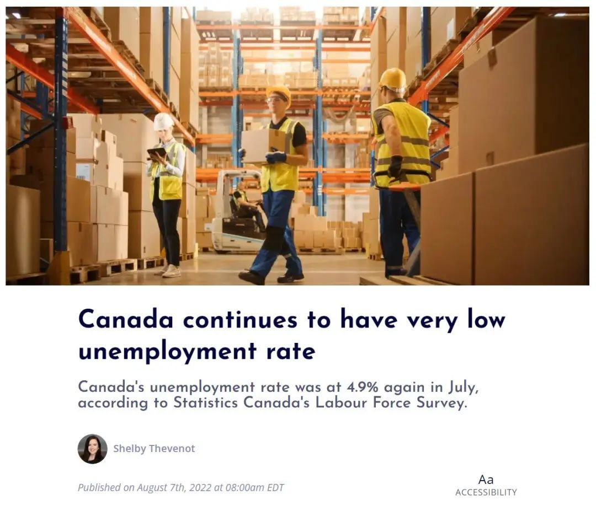
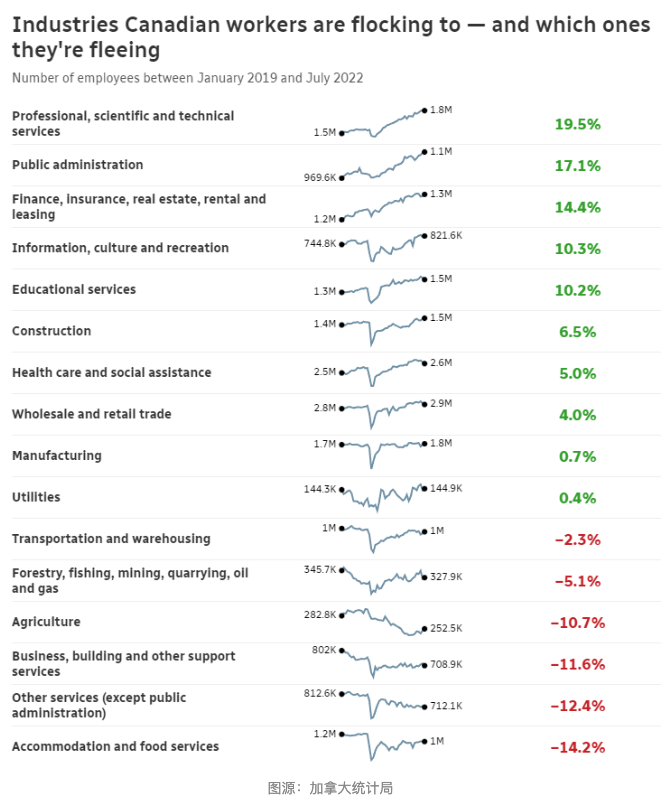
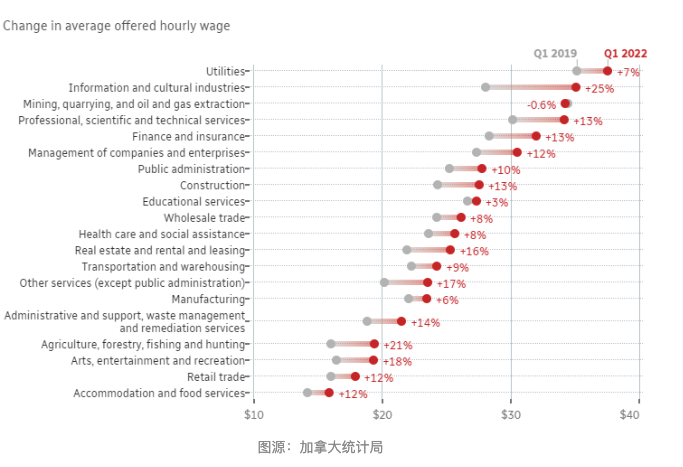
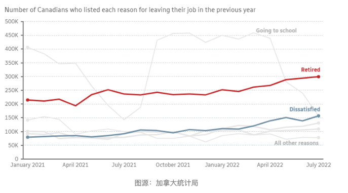
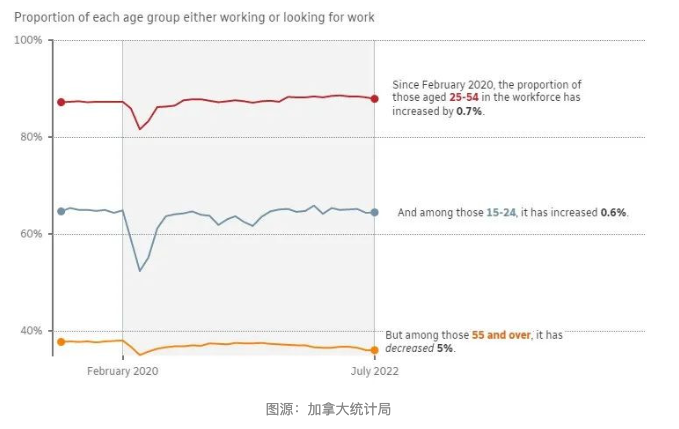
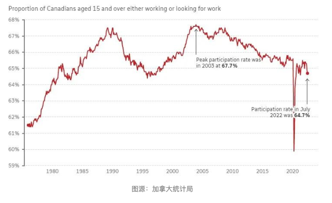

# 无标题

**链接地址:** http://mp.weixin.qq.com/s?__biz=MzUyNzA2NTAwNg==&mid=2247490766&idx=1&sn=77f778bb9826c7161251a1aa58f940e2&chksm=fa04160fcd739f19abe160337817105ddfbd600b69a6cf5e425ab01770163460113190284b07&mpshare=1&scene=2&srcid=0827iDSgsdtL0kGNKhQbXmzp&sharer_sharetime=1661548779726&sharer_shareid=77848a6b3852ae4dcb6c74ffee84743c#rd
**作者:** 你身边的签证专家
**获取时间:** 2025/8/28 19:31:48
**图片数量:** 22

---

## 原始HTML内容

<section style="box-sizing: border-box;font-style: normal;font-weight: 400;text-align: justify;font-size: 16px;"><section style="text-align: center;margin-top: 10px;margin-bottom: 10px;box-sizing: border-box;" powered-by="xiumi.us"><section style="max-width: 100%;vertical-align: middle;display: inline-block;line-height: 0;box-sizing: border-box;"></section></section><section style="text-align: center;margin-top: 10px;margin-bottom: 10px;box-sizing: border-box;" powered-by="xiumi.us"></section><section style="font-size: 14px;padding: 0px 15px;letter-spacing: 1px;box-sizing: border-box;" powered-by="xiumi.us">
 

 
</section><section style="font-size: 19px;text-align: center;margin: 10px 0px 3px;box-sizing: border-box;" powered-by="xiumi.us"><section style="display: inline-block;width: 1.8em;height: 1.8em;line-height: 1.8em;border-radius: 100%;margin-left: auto;margin-right: auto;font-size: 16px;color: rgb(255, 255, 255);border-width: 1px;border-style: solid;border-color: rgb(188, 65, 65);background-color: rgb(188, 65, 65);box-sizing: border-box;">
<strong style="box-sizing: border-box;">1</strong>
</section></section><section style="text-align: center;margin: 0px;box-sizing: border-box;" powered-by="xiumi.us"><section style="display: inline-block;vertical-align: top;overflow: hidden;height: 0px;width: 0px;border-style: solid;border-width: 9px 6px 0px;border-color: rgb(188, 65, 65) rgba(255, 255, 255, 0) rgba(255, 255, 255, 0);box-sizing: border-box;"><svg viewBox="0 0 1 1" style="float:left;line-height:0;width:0;vertical-align:top;"></svg></section></section><section style="margin: 0px 0px 10px;text-align: center;justify-content: center;display: flex;flex-flow: row nowrap;box-sizing: border-box;" powered-by="xiumi.us"><section style="display: inline-block;width: auto;vertical-align: middle;background-color: rgba(109, 155, 209, 0.1);min-width: 10%;max-width: 100%;flex: 0 0 auto;height: auto;align-self: center;padding: 12px;margin: 0px;box-sizing: border-box;"><section style="color: rgb(109, 155, 209);text-align: justify;box-sizing: border-box;" powered-by="xiumi.us">
<strong style="box-sizing: border-box;">加国就业市场出现严重紧缺</strong>
</section></section></section><section style="font-size: 14px;padding: 0px 15px;letter-spacing: 1px;box-sizing: border-box;" powered-by="xiumi.us">
 

劳动力的紧缺，正严重掣肘着加拿大经济和社会发展。然而，人才紧缺的加拿大劳动力市场近年来却出现了<strong style="box-sizing: border-box;">严重发展不均</strong>的问题，一些行业竞争激烈；而一些行业，雇主为招人已经<strong style="box-sizing: border-box;">愁白了头</strong>。 

 

根据加拿大统计局报告，全国失业率已经<strong style="box-sizing: border-box;">连续第二个月达到4.9%的历史最低水平</strong>，为1970年以来的<strong style="box-sizing: border-box;">最</strong><strong style="box-sizing: border-box;">低纪录</strong>。

 
</section><section style="text-align: center;margin-top: 10px;margin-bottom: 10px;box-sizing: border-box;" powered-by="xiumi.us"><section style="max-width: 100%;vertical-align: middle;display: inline-block;line-height: 0;width: 90%;height: auto;box-sizing: border-box;"></section></section><section style="font-size: 14px;padding: 0px 15px;letter-spacing: 1px;box-sizing: border-box;" powered-by="xiumi.us">
 

在6月发布的《加拿大的移民优势：主要雇主调查》报告显示，“80%接受调查的雇主表示，在寻找技术工人方面有困难。<strong style="box-sizing: border-box;">每个省和地区都存在人工短缺</strong>，但在安大略省、魁北克省和卑诗省最为明显。”

 

“雇主们正在努力填补技术岗位。技能短缺在计算机科学、工程和信息技术等领域最为普遍。雇主们也在努力寻找建筑工人、水管工、电工和其他技术行业工人。” 

 
</section><section style="font-size: 19px;text-align: center;margin: 10px 0px 3px;box-sizing: border-box;" powered-by="xiumi.us"><section style="display: inline-block;border-width: 1px;border-style: solid;border-color: rgb(188, 65, 65);background-color: rgb(188, 65, 65);width: 1.8em;height: 1.8em;line-height: 1.8em;border-radius: 100%;margin-left: auto;margin-right: auto;font-size: 16px;color: rgb(255, 255, 255);box-sizing: border-box;">
<strong style="box-sizing: border-box;">2</strong>
</section></section><section style="text-align: center;margin: 0px;box-sizing: border-box;" powered-by="xiumi.us"><section style="display: inline-block;width: 0px;height: 0px;vertical-align: top;overflow: hidden;border-style: solid;border-width: 9px 6px 0px;border-color: rgb(188, 65, 65) rgba(255, 255, 255, 0) rgba(255, 255, 255, 0);box-sizing: border-box;"><svg viewBox="0 0 1 1" style="float:left;line-height:0;width:0;vertical-align:top;"></svg></section></section><section style="margin: 0px 0px 10px;text-align: center;justify-content: center;display: flex;flex-flow: row nowrap;box-sizing: border-box;" powered-by="xiumi.us"><section style="display: inline-block;width: auto;vertical-align: middle;background-color: rgba(109, 155, 209, 0.1);min-width: 10%;max-width: 100%;flex: 0 0 auto;height: auto;align-self: center;padding: 12px;margin: 0px;box-sizing: border-box;"><section style="color: rgb(109, 155, 209);text-align: justify;box-sizing: border-box;" powered-by="xiumi.us">
<strong style="box-sizing: border-box;">加国各行业从业人数大变革</strong>
</section></section></section><section style="font-size: 14px;padding: 0px 15px;letter-spacing: 1px;box-sizing: border-box;" powered-by="xiumi.us">
 

据CBC News报道，从加拿大统计局的数据可以分析出，受到过去两年疫情和经济变革的影响，以及几十年来一直在发生着的人口变化推动，目前劳动力格局出现了转变。 

 

首先，就业者在行业选择方面出现<strong style="box-sizing: border-box;">明显迁移</strong>。

 

加拿大统计局数据证实了工人在行业之间的迁移：从服务业和食品行业的工作转到技术、金融和房地产等可能<strong style="box-sizing: border-box;">更有利可图的领域</strong>。

 
</section><section style="text-align: center;margin-top: 10px;margin-bottom: 10px;box-sizing: border-box;" powered-by="xiumi.us"><section style="max-width: 100%;vertical-align: middle;display: inline-block;line-height: 0;width: 90%;height: auto;box-sizing: border-box;"></section></section><section style="font-size: 14px;padding: 0px 15px;letter-spacing: 1px;box-sizing: border-box;" powered-by="xiumi.us">
加拿大工人涌向的行业&amp;他们正在逃离的行业

 

上图显示了工人向公共行政和房地产，以及食品服务等部门的巨大转变。麦吉尔大学的劳工经济学家Fabian Lange说，似乎许多工人正在向<strong style="box-sizing: border-box;">薪酬和福利更好的行业涌入</strong>。

 

“我们看到来自住宿和餐饮服务行业的人，他们不会直接进入金融、保险、房地产行业，但他们可能会进入制造业或健康咨询行业，”他说。

 
</section><section style="text-align: center;margin-top: 10px;margin-bottom: 10px;box-sizing: border-box;" powered-by="xiumi.us"><section style="max-width: 100%;vertical-align: middle;display: inline-block;line-height: 0;box-sizing: border-box;"></section></section><section style="font-size: 14px;padding: 0px 15px;letter-spacing: 1px;box-sizing: border-box;" powered-by="xiumi.us">
 

“他们将过渡到工资阶梯更高、质量更好的工作。而那些从事高质量工作的人往往会<strong style="box-sizing: border-box;">将自己进一步提升到更高的工作等级上</strong>。”

 
</section><section style="font-size: 19px;text-align: center;margin: 10px 0px 3px;box-sizing: border-box;" powered-by="xiumi.us"><section style="display: inline-block;border-width: 1px;border-style: solid;border-color: rgb(188, 65, 65);background-color: rgb(188, 65, 65);width: 1.8em;height: 1.8em;line-height: 1.8em;border-radius: 100%;margin-left: auto;margin-right: auto;font-size: 16px;color: rgb(255, 255, 255);box-sizing: border-box;">
<strong style="box-sizing: border-box;">3</strong>
</section></section><section style="text-align: center;margin: 0px;box-sizing: border-box;" powered-by="xiumi.us"><section style="display: inline-block;width: 0px;height: 0px;vertical-align: top;overflow: hidden;border-style: solid;border-width: 9px 6px 0px;border-color: rgb(188, 65, 65) rgba(255, 255, 255, 0) rgba(255, 255, 255, 0);box-sizing: border-box;"><svg viewBox="0 0 1 1" style="float:left;line-height:0;width:0;vertical-align:top;"></svg></section></section><section style="margin: 0px 0px 10px;text-align: center;justify-content: center;display: flex;flex-flow: row nowrap;box-sizing: border-box;" powered-by="xiumi.us"><section style="display: inline-block;width: auto;vertical-align: middle;background-color: rgba(109, 155, 209, 0.1);min-width: 10%;max-width: 100%;flex: 0 0 auto;height: auto;align-self: center;padding: 12px;margin: 0px;box-sizing: border-box;"><section style="color: rgb(109, 155, 209);text-align: justify;box-sizing: border-box;" powered-by="xiumi.us">
<strong style="box-sizing: border-box;">高薪高门槛行业吸引人才</strong>
</section></section></section><section style="font-size: 14px;padding: 0px 15px;letter-spacing: 1px;box-sizing: border-box;" powered-by="xiumi.us">
 

在劳动力市场紧张的情况下，某些行业，例如技术和信息服务等行业，其时薪大幅增加。
</section><section style="text-align: center;margin-top: 10px;margin-bottom: 10px;box-sizing: border-box;" powered-by="xiumi.us"><section style="max-width: 100%;vertical-align: middle;display: inline-block;line-height: 0;width: 90%;height: auto;box-sizing: border-box;"></section></section><section style="font-size: 14px;padding: 0px 15px;letter-spacing: 1px;box-sizing: border-box;" powered-by="xiumi.us">
疫情期各行各业薪水暴涨 

 

与此同时，<strong style="box-sizing: border-box;">制造业、食品服务和零售等其他领域的工资继续滞后</strong>。

 

兰格说，事实上，考虑到生活成本的上涨，其中一些行业的<strong style="box-sizing: border-box;">平均工资在大流行期间出现了下降</strong>。

 
</section><section style="text-align: center;margin-top: 10px;margin-bottom: 10px;box-sizing: border-box;" powered-by="xiumi.us"><section style="max-width: 100%;vertical-align: middle;display: inline-block;line-height: 0;width: 90%;height: auto;box-sizing: border-box;"></section></section><section style="font-size: 14px;padding: 0px 15px;letter-spacing: 1px;box-sizing: border-box;" powered-by="xiumi.us">
 

他说，至少从供需的角度来看，某些行业的持续低工资令人惊讶。

 

他表示， “工人应该在这个劳动力市场上处于强势地位，我们应该在薪酬中看到这一点。但我们还没有看到薪酬有多大增加。”

 
</section><section style="font-size: 19px;text-align: center;margin: 10px 0px 3px;box-sizing: border-box;" powered-by="xiumi.us"><section style="display: inline-block;border-width: 1px;border-style: solid;border-color: rgb(188, 65, 65);background-color: rgb(188, 65, 65);width: 1.8em;height: 1.8em;line-height: 1.8em;border-radius: 100%;margin-left: auto;margin-right: auto;font-size: 16px;color: rgb(255, 255, 255);box-sizing: border-box;">
<strong style="box-sizing: border-box;">4</strong>
</section></section><section style="text-align: center;margin: 0px;box-sizing: border-box;" powered-by="xiumi.us"><section style="display: inline-block;width: 0px;height: 0px;vertical-align: top;overflow: hidden;border-style: solid;border-width: 9px 6px 0px;border-color: rgb(188, 65, 65) rgba(255, 255, 255, 0) rgba(255, 255, 255, 0);box-sizing: border-box;"><svg viewBox="0 0 1 1" style="float:left;line-height:0;width:0;vertical-align:top;"></svg></section></section><section style="margin: 0px 0px 10px;text-align: center;justify-content: center;display: flex;flex-flow: row nowrap;box-sizing: border-box;" powered-by="xiumi.us"><section style="display: inline-block;width: auto;vertical-align: middle;background-color: rgba(109, 155, 209, 0.1);min-width: 10%;max-width: 100%;flex: 0 0 auto;height: auto;align-self: center;padding: 12px;margin: 0px;box-sizing: border-box;"><section style="color: rgb(109, 155, 209);text-align: justify;box-sizing: border-box;" powered-by="xiumi.us">
<strong style="box-sizing: border-box;">劳方市场引领“辞职潮”</strong>
</section></section></section><section style="text-align: center;margin-top: 10px;margin-bottom: 10px;box-sizing: border-box;" powered-by="xiumi.us"><section style="max-width: 100%;vertical-align: middle;display: inline-block;line-height: 0;width: 90%;height: auto;box-sizing: border-box;"></section></section><section style="font-size: 14px;padding: 0px 15px;letter-spacing: 1px;box-sizing: border-box;" powered-by="xiumi.us">
 

数据还表明，越来越多的工人因为不满意而离职，当然，他们的底气在于，现在就业市场上有其他选择。

 

上个月，因为这个原因离职的工人数量<strong style="box-sizing: border-box;">比2021年7月增加了近一倍</strong>，远远超过了上学或退休等其他的原因。

 
</section><section style="font-size: 19px;text-align: center;margin: 10px 0px 3px;box-sizing: border-box;" powered-by="xiumi.us"><section style="display: inline-block;border-width: 1px;border-style: solid;border-color: rgb(188, 65, 65);background-color: rgb(188, 65, 65);width: 1.8em;height: 1.8em;line-height: 1.8em;border-radius: 100%;margin-left: auto;margin-right: auto;font-size: 16px;color: rgb(255, 255, 255);box-sizing: border-box;">
<strong style="box-sizing: border-box;">5</strong>
</section></section><section style="text-align: center;margin: 0px;box-sizing: border-box;" powered-by="xiumi.us"><section style="display: inline-block;width: 0px;height: 0px;vertical-align: top;overflow: hidden;border-style: solid;border-width: 9px 6px 0px;border-color: rgb(188, 65, 65) rgba(255, 255, 255, 0) rgba(255, 255, 255, 0);box-sizing: border-box;"><svg viewBox="0 0 1 1" style="float:left;line-height:0;width:0;vertical-align:top;"></svg></section></section><section style="margin: 0px 0px 10px;text-align: center;justify-content: center;display: flex;flex-flow: row nowrap;box-sizing: border-box;" powered-by="xiumi.us"><section style="display: inline-block;width: auto;vertical-align: middle;background-color: rgba(109, 155, 209, 0.1);min-width: 10%;max-width: 100%;flex: 0 0 auto;height: auto;align-self: center;padding: 12px;margin: 0px;box-sizing: border-box;"><section style="color: rgb(109, 155, 209);text-align: justify;box-sizing: border-box;" powered-by="xiumi.us">
<strong style="box-sizing: border-box;">“婴儿潮”工人提早退休</strong>
</section></section></section><section style="font-size: 14px;padding: 0px 15px;letter-spacing: 1px;box-sizing: border-box;" powered-by="xiumi.us">
 

兰格认为，大流行的出现，似乎已促使一些<strong style="box-sizing: border-box;">老年人从业者提前退出就业市场</strong>。

 
</section><section style="text-align: center;margin-top: 10px;margin-bottom: 10px;box-sizing: border-box;" powered-by="xiumi.us"><section style="max-width: 100%;vertical-align: middle;display: inline-block;line-height: 0;width: 90%;height: auto;box-sizing: border-box;"></section></section><section style="font-size: 14px;padding: 0px 15px;letter-spacing: 1px;box-sizing: border-box;" powered-by="xiumi.us">
 

如图片所示，大流行似乎已经促使一些老年人提前离职。

 

他说：“我认为这与大流行有关，从某种意义上说，人们被迫选择提前退休。他们原计划可能是在63岁时退休，但大流行在2020年3月来袭。”

 
</section>
 
<section style="font-size: 19px;text-align: center;margin: 10px 0px 3px;box-sizing: border-box;" powered-by="xiumi.us"><section style="display: inline-block;border-width: 1px;border-style: solid;border-color: rgb(188, 65, 65);background-color: rgb(188, 65, 65);width: 1.8em;height: 1.8em;line-height: 1.8em;border-radius: 100%;margin-left: auto;margin-right: auto;font-size: 16px;color: rgb(255, 255, 255);box-sizing: border-box;">
<strong style="box-sizing: border-box;">6</strong>
</section></section><section style="text-align: center;margin: 0px;box-sizing: border-box;" powered-by="xiumi.us"><section style="display: inline-block;width: 0px;height: 0px;vertical-align: top;overflow: hidden;border-style: solid;border-width: 9px 6px 0px;border-color: rgb(188, 65, 65) rgba(255, 255, 255, 0) rgba(255, 255, 255, 0);box-sizing: border-box;"><svg viewBox="0 0 1 1" style="float:left;line-height:0;width:0;vertical-align:top;"></svg></section></section><section style="margin: 0px 0px 10px;text-align: center;justify-content: center;display: flex;flex-flow: row nowrap;box-sizing: border-box;" powered-by="xiumi.us"><section style="display: inline-block;width: auto;vertical-align: middle;background-color: rgba(109, 155, 209, 0.1);min-width: 10%;max-width: 100%;flex: 0 0 auto;height: auto;align-self: center;padding: 12px;margin: 0px;box-sizing: border-box;"><section style="color: rgb(109, 155, 209);text-align: justify;box-sizing: border-box;" powered-by="xiumi.us">
<strong style="box-sizing: border-box;">加拿大的劳动力数量正在稳步下降</strong>
</section></section></section><section style="text-align: center;margin-top: 10px;margin-bottom: 10px;box-sizing: border-box;" powered-by="xiumi.us"><section style="max-width: 100%;vertical-align: middle;display: inline-block;line-height: 0;width: 90%;height: auto;box-sizing: border-box;"></section></section><section style="font-size: 14px;padding: 0px 15px;letter-spacing: 1px;box-sizing: border-box;" powered-by="xiumi.us">
人口结构的变化，也是拉低劳动力市场参与率的主要因素。 

 

BMO最近的一份报告研究了该国人口老龄化对劳动力的影响，并强调这一趋势<strong style="box-sizing: border-box;">早在大流行之前就已经开始</strong>了。

 

报告称，“劳动力持续的缓慢下降几乎完全是潜在人口统计的函数，即退休年龄组中人口的比例迅速上升，与因其他原因退出劳动力市场的人关系不大”。

 
</section><section style="text-align: center;margin-top: 10px;margin-bottom: 10px;box-sizing: border-box;" powered-by="xiumi.us"><section style="max-width: 100%;vertical-align: middle;display: inline-block;line-height: 0;width: 90%;height: auto;box-sizing: border-box;"></section></section><section style="font-size: 14px;padding: 0px 15px;letter-spacing: 1px;box-sizing: border-box;" powered-by="xiumi.us">
 

报告指出，流行病似乎至少通过提前退休、生活方式改变和工作转换造成了劳动力市场一些额外的干扰。”

 

该报告的结论是，从长远来看，“人口对劳动力供应的拖累<strong style="box-sizing: border-box;">将在未来几年持续存在</strong>”。

 

加拿大解决劳动力短缺和人口结构的一大方针就是<strong style="box-sizing: border-box;">增加新移民的数量</strong>。而且，兢兢业业的新移民为加拿大劳动力市场做出的<strong style="box-sizing: border-box;">贡献是巨大</strong>的。

 

根据加拿大统计局2006年至2019年间的劳动力研究，截止到2013年年末，加拿大新移民的参与率和就业率已开始<strong style="box-sizing: border-box;">高于加拿大出生的公民</strong>。

 
</section><section style="text-align: center;margin-top: 10px;margin-bottom: 10px;box-sizing: border-box;" powered-by="xiumi.us"><section style="max-width: 100%;vertical-align: middle;display: inline-block;line-height: 0;width: 90%;height: auto;box-sizing: border-box;"></section></section><section style="font-size: 14px;padding: 0px 15px;letter-spacing: 1px;box-sizing: border-box;" powered-by="xiumi.us">
 

而据加拿大移民网站报道，2022年上半年加拿大移民人数飙升至231625人，比去年同期增长59.8%。加拿大移民、难民和公民部（IRCC）的最新数据显示，今年上半年开始的这一趋势，如果能持续到2022年的剩余时间，今年将会有<strong style="box-sizing: border-box;">463250名新的永久居民来到加拿大</strong>。

 
</section><section style="font-size: 19px;text-align: center;margin: 10px 0px 3px;box-sizing: border-box;" powered-by="xiumi.us"><section style="display: inline-block;border-width: 1px;border-style: solid;border-color: rgb(188, 65, 65);background-color: rgb(188, 65, 65);width: 1.8em;height: 1.8em;line-height: 1.8em;border-radius: 100%;margin-left: auto;margin-right: auto;font-size: 16px;color: rgb(255, 255, 255);box-sizing: border-box;">
<strong style="box-sizing: border-box;">7</strong>
</section></section><section style="text-align: center;margin: 0px;box-sizing: border-box;" powered-by="xiumi.us"><section style="display: inline-block;width: 0px;height: 0px;vertical-align: top;overflow: hidden;border-style: solid;border-width: 9px 6px 0px;border-color: rgb(188, 65, 65) rgba(255, 255, 255, 0) rgba(255, 255, 255, 0);box-sizing: border-box;"><svg viewBox="0 0 1 1" style="float:left;line-height:0;width:0;vertical-align:top;"></svg></section></section><section style="margin: 0px 0px 10px;text-align: center;justify-content: center;display: flex;flex-flow: row nowrap;box-sizing: border-box;" powered-by="xiumi.us"><section style="display: inline-block;width: auto;vertical-align: middle;background-color: rgba(109, 155, 209, 0.1);min-width: 10%;max-width: 100%;flex: 0 0 auto;height: auto;align-self: center;padding: 12px;margin: 0px;box-sizing: border-box;"><section style="color: rgb(109, 155, 209);text-align: justify;box-sizing: border-box;" powered-by="xiumi.us">
<strong style="box-sizing: border-box;">加国移民政策和劳动力市场挂钩</strong>
</section></section></section><section style="font-size: 14px;padding: 0px 15px;letter-spacing: 1px;box-sizing: border-box;" powered-by="xiumi.us">
 
</section><section style="font-size: 14px;padding: 0px 15px;letter-spacing: 1px;box-sizing: border-box;" powered-by="xiumi.us">
为了更好地调节加拿大本地就业市场环境，加拿大移民部于六月释放出的信息，他们将于今年秋天推出<strong style="box-sizing: border-box;">“大赦2.0”版本的移民新政</strong>。

 

该审核机制以更快地适应劳动力市场需求和区域经济优先事项的变化。将根据劳动力市场短缺推出<strong style="box-sizing: border-box;">基于职业的定向邀请措施，或增加额外的加分</strong>。目标职业包括卫生服务、护理人员、农业、制造业、服务业、贸易和运输等。 

 
</section><section style="text-align: center;margin-top: 10px;margin-bottom: 10px;box-sizing: border-box;" powered-by="xiumi.us"><section style="max-width: 100%;vertical-align: middle;display: inline-block;line-height: 0;width: 90%;height: auto;box-sizing: border-box;"></section></section><section style="font-size: 14px;padding: 0px 15px;letter-spacing: 1px;box-sizing: border-box;" powered-by="xiumi.us">
 

同时，移民部也计划在2023年第一季度根据劳动市场目标开始为候选人举行根据职位的<strong style="box-sizing: border-box;">定向快速通道抽签</strong>。未来快速通道可能不再以综合排名系统（CRS）分数为衡量申请者的唯一标准，也要看申请者的<strong style="box-sizing: border-box;">工作领域和技能是否是加拿大的当下之需</strong>。

 
</section><section style="text-align: center;margin-top: 10px;margin-bottom: 10px;box-sizing: border-box;" powered-by="xiumi.us"><section style="max-width: 100%;vertical-align: middle;display: inline-block;line-height: 0;box-sizing: border-box;"></section></section><section style="font-size: 14px;padding: 0px 15px;letter-spacing: 1px;box-sizing: border-box;" powered-by="xiumi.us">
 

加拿大移民部愿意为了配合加国劳动力紧缺的状态逐步升高移民配额，这对于广大申请者们来说无疑是一个好消息。但年内即将推出的政策改革也将加国移民的大方向<strong style="box-sizing: border-box;">和劳动力市场的紧缺深度绑定在一起</strong>，这对于部分申请者来说或许需要<strong style="box-sizing: border-box;">在项目选择和申请策略上做出及时调整</strong>。

 
<section class="channels_iframe_wrp wxw_wechannel_card_not_horizontal"><mpvideosnap class="js_uneditable custom_select_card channels_iframe videosnap_video_iframe" data-pluginname="videosnap" data-id="export/UzFfAgtgekIEAQAAAAAAfpUrezr1eAAAAAstQy6ubaLX4KHWvLEZgBPEu5EIViEBLceCzNPgMIs9RHEgF2DAfBlqU48fOEdO" data-url="https://findermp.video.qq.com/251/20350/stodownload?encfilekey=Cvvj5Ix3eexKX1zo1IZZBrQomawdVfSQBkYiaDuXtpMBIh5KZ1O7JTwc1IgywmOFSTgfYdeABb8Nibp83HhPuNVQ26nfVHs3g1vYSfQJ2SevqkzA6g4sGUovyInpLQibd13NdusPImFcfofUpmRPAD8NHTS6b1TdDBpzDeQibMEAyPE&amp;adaptivelytrans=0&amp;bizid=1023&amp;dotrans=0&amp;hy=HK&amp;idx=1&amp;m=38fb9c635b2cfece303a82f8dd375742&amp;token=cztXnd9GyrFo4NADCjjUVNxQhWrVvmwta8tLWjtQhVHjszDWQKe2LgOGrLkxjF3NcQQaHRM4exY" data-headimgurl="http://wx.qlogo.cn/finderhead/PiajxSqBRaEI4vQJr3aa81ehxKpzshj4t6ZWzDxwztBic5fr9nVMt20g/0" data-username="v2_060000231003b20faec8c7eb811fc3d1ca06ec31b07726617828a16cbc88a282c95def3c7c6d@finder" data-nickname="Zoe说加拿大" data-desc="终于可以返工啦～～你收到临时工签许可了吗？##加拿大 #加拿大生活" data-nonceid="8449018168582508534" data-type="video" data-width="1072" data-height="1440"></mpvideosnap></section>
我们会在今后的文章中第一时间为广大客户朋友们进行权威的政策分析，帮助你掌握加国移民的最新动态。欢迎关注新时代留学移民的<strong style="box-sizing: border-box;">公众号和视频号</strong>，扫码联系我们的加拿大<strong style="box-sizing: border-box;">持牌移民顾问</strong>，为您一对一量身定做<strong style="box-sizing: border-box;">最稳妥、最高效</strong>的留学移民计划！

 
</section><section style="margin: 10px 0%;text-align: center;justify-content: center;display: flex;flex-flow: row nowrap;box-sizing: border-box;" powered-by="xiumi.us"><section style="display: inline-block;width: 100%;vertical-align: top;box-shadow: rgb(0, 0, 0) 0px 0px 0px;background-color: rgb(241, 241, 241);padding: 10px;align-self: flex-start;flex: 0 0 auto;box-sizing: border-box;"><section style="justify-content: center;display: flex;flex-flow: row nowrap;box-sizing: border-box;" powered-by="xiumi.us"><section style="display: inline-block;width: 100%;vertical-align: top;background-color: rgb(255, 255, 255);padding: 20px 10px;flex: 0 0 auto;height: auto;box-shadow: rgb(198, 198, 198) 0px 0px 2px;border-width: 0px;border-radius: 6px;border-style: none;border-color: rgb(62, 62, 62);overflow: hidden;align-self: flex-start;box-sizing: border-box;"><section style="color: rgb(189, 189, 189);text-align: justify;box-sizing: border-box;" powered-by="xiumi.us">
<strong style="box-sizing: border-box;">阅读更多</strong>
</section><section style="text-align: justify;box-sizing: border-box;" powered-by="xiumi.us">
 
</section><section style="display: flex;flex-flow: row nowrap;margin: 0px 0%;justify-content: center;box-sizing: border-box;" powered-by="xiumi.us"><section style="display: inline-block;vertical-align: top;width: auto;flex: 100 100 0%;align-self: flex-start;height: auto;box-shadow: rgb(0, 0, 0) 0px 0px 0px;border-bottom: 1px dashed rgba(106, 106, 106, 0.25);border-bottom-right-radius: 0px;margin: 0px 10px 0px 0px;box-sizing: border-box;"><section style="font-size: 14px;text-align: justify;box-sizing: border-box;" powered-by="xiumi.us">
<a target="_blank" href="http://mp.weixin.qq.com/s?__biz=MzUyNzA2NTAwNg==&amp;mid=2247490717&amp;idx=1&amp;sn=981c06a19aebffb1f9bef92484c7d6f9&amp;chksm=fa04165ccd739f4a676945fc2a98f7da8cd8e27c9f6798e4c25b421b54d9094daf8f8d851997&amp;scene=21#wechat_redirect" textvalue="46万！加拿大移民部今年预超额完成移民指标！下半年项目审批再提速！" linktype="text" imgurl="" imgdata="null" data-itemshowtype="0" tab="innerlink" data-linktype="2">46万！加拿大移民部今年预超额完成移民指标！下半年项目审批再提速！</a>
</section></section><section style="display: inline-block;vertical-align: top;width: auto;flex: 20 20 0%;align-self: flex-start;height: auto;border-width: 0px;margin: 0px 0px 0px 5px;box-sizing: border-box;"><section style="margin: 0px 0%;box-sizing: border-box;" powered-by="xiumi.us"><section style="max-width: 100%;vertical-align: middle;display: inline-block;line-height: 0;box-shadow: rgb(0, 0, 0) 0px 0px 0px;box-sizing: border-box;"><a target="_blank" href="http://mp.weixin.qq.com/s?__biz=MzUyNzA2NTAwNg==&amp;mid=2247490717&amp;idx=1&amp;sn=981c06a19aebffb1f9bef92484c7d6f9&amp;chksm=fa04165ccd739f4a676945fc2a98f7da8cd8e27c9f6798e4c25b421b54d9094daf8f8d851997&amp;scene=21#wechat_redirect" textvalue="你已选中了添加链接的内容" linktype="text" imgurl="" imgdata="null" data-itemshowtype="0" tab="innerlink" data-linktype="1"></a></section></section></section></section><section style="text-align: justify;box-sizing: border-box;" powered-by="xiumi.us">
 
</section><section style="display: flex;flex-flow: row nowrap;margin: 0px 0%;justify-content: center;box-sizing: border-box;" powered-by="xiumi.us"><section style="display: inline-block;vertical-align: top;width: auto;flex: 100 100 0%;align-self: flex-start;height: auto;box-shadow: rgb(0, 0, 0) 0px 0px 0px;border-bottom: 1px dashed rgba(106, 106, 106, 0.25);border-bottom-right-radius: 0px;margin: 0px 10px 0px 0px;box-sizing: border-box;"><section style="font-size: 14px;text-align: justify;box-sizing: border-box;" powered-by="xiumi.us">
<a target="_blank" href="http://mp.weixin.qq.com/s?__biz=MzUyNzA2NTAwNg==&amp;mid=2247490610&amp;idx=1&amp;sn=78c1c26ba988dbfbe74ccd955b329e53&amp;chksm=fa0416f3cd739fe58bb1f65a84105a12ae0eab642c7410be7c0a2ffffd48477def6eadef4365&amp;scene=21#wechat_redirect" textvalue="重大利好！外籍华人博士可直接申请中国绿卡！申请条件？利好政策？全攻略看过来！" linktype="text" imgurl="" imgdata="null" data-itemshowtype="0" tab="innerlink" data-linktype="2">重大利好！外籍华人博士可直接申请中国绿卡！申请条件？利好政策？全攻略看过来！</a>
</section></section><section style="display: inline-block;vertical-align: top;width: auto;flex: 20 20 0%;align-self: flex-start;height: auto;border-width: 0px;margin: 0px 0px 0px 5px;box-sizing: border-box;"><section style="margin: 0px 0%;box-sizing: border-box;" powered-by="xiumi.us"><section style="max-width: 100%;vertical-align: middle;display: inline-block;line-height: 0;box-shadow: rgb(0, 0, 0) 0px 0px 0px;box-sizing: border-box;"><a target="_blank" href="http://mp.weixin.qq.com/s?__biz=MzUyNzA2NTAwNg==&amp;mid=2247490610&amp;idx=1&amp;sn=78c1c26ba988dbfbe74ccd955b329e53&amp;chksm=fa0416f3cd739fe58bb1f65a84105a12ae0eab642c7410be7c0a2ffffd48477def6eadef4365&amp;scene=21#wechat_redirect" textvalue="你已选中了添加链接的内容" linktype="text" imgurl="" imgdata="null" data-itemshowtype="0" tab="innerlink" data-linktype="1"></a></section></section></section></section><section style="text-align: justify;box-sizing: border-box;" powered-by="xiumi.us">
 
</section><section style="display: flex;flex-flow: row nowrap;margin: 0px 0%;justify-content: center;box-sizing: border-box;" powered-by="xiumi.us"><section style="display: inline-block;vertical-align: top;width: auto;flex: 100 100 0%;align-self: flex-start;height: auto;box-shadow: rgb(0, 0, 0) 0px 0px 0px;border-bottom: 1px dashed rgba(106, 106, 106, 0.25);border-bottom-right-radius: 0px;margin: 0px 10px 0px 0px;box-sizing: border-box;"><section style="font-size: 14px;text-align: justify;box-sizing: border-box;" powered-by="xiumi.us">
<a target="_blank" href="http://mp.weixin.qq.com/s?__biz=MzUyNzA2NTAwNg==&amp;mid=2247490560&amp;idx=1&amp;sn=34968551e3c692e30afa7c9a1c01fb0b&amp;chksm=fa0416c1cd739fd7a338882014ab67d0a3b98fcd59a41a146f4b93eb216aa70d31da0698c540&amp;scene=21#wechat_redirect" textvalue="好消息！加拿大全民牙科保健计划终于来了！直接发钱，年底实施！" linktype="text" imgurl="" imgdata="null" data-itemshowtype="0" tab="innerlink" data-linktype="2">好消息！加拿大全民牙科保健计划终于来了！直接发钱，年底实施！</a>
</section></section><section style="display: inline-block;vertical-align: top;width: auto;flex: 20 20 0%;align-self: flex-start;height: auto;border-width: 0px;margin: 0px 0px 0px 5px;box-sizing: border-box;"><section style="margin: 0px 0%;box-sizing: border-box;" powered-by="xiumi.us"><section style="max-width: 100%;vertical-align: middle;display: inline-block;line-height: 0;box-shadow: rgb(0, 0, 0) 0px 0px 0px;box-sizing: border-box;"><a target="_blank" href="http://mp.weixin.qq.com/s?__biz=MzUyNzA2NTAwNg==&amp;mid=2247490560&amp;idx=1&amp;sn=34968551e3c692e30afa7c9a1c01fb0b&amp;chksm=fa0416c1cd739fd7a338882014ab67d0a3b98fcd59a41a146f4b93eb216aa70d31da0698c540&amp;scene=21#wechat_redirect" textvalue="你已选中了添加链接的内容" linktype="text" imgurl="" imgdata="null" data-itemshowtype="0" tab="innerlink" data-linktype="1"></a></section></section></section></section></section></section></section></section><section style="text-align: center;margin-top: 10px;margin-bottom: 10px;box-sizing: border-box;" powered-by="xiumi.us"><section style="max-width: 100%;vertical-align: middle;display: inline-block;line-height: 0;box-sizing: border-box;"></section></section><section style="text-align: center;margin-top: 10px;margin-bottom: 10px;box-sizing: border-box;" powered-by="xiumi.us"><section style="max-width: 100%;vertical-align: middle;display: inline-block;line-height: 0;box-sizing: border-box;"></section></section><section style="text-align: center;margin-top: 10px;margin-bottom: 10px;box-sizing: border-box;" powered-by="xiumi.us"><section style="max-width: 100%;vertical-align: middle;display: inline-block;line-height: 0;box-sizing: border-box;"></section></section><section style="padding: 0px 15px;font-size: 12px;color: rgb(121, 121, 121);box-sizing: border-box;" powered-by="xiumi.us">
<strong style="box-sizing: border-box;">参考信息：</strong>

<strong style="box-sizing: border-box;">https://www.cicnews.com/2022/08/canada-continues-to-have-very-low-unemployment-rate-0829824.html#gs.9opumr</strong>

今日加拿大
</section><section style="text-align: center;margin-top: 10px;margin-bottom: 10px;box-sizing: border-box;" powered-by="xiumi.us"><section style="max-width: 100%;vertical-align: middle;display: inline-block;line-height: 0;box-sizing: border-box;"></section></section><section style="text-align: center;margin-top: 10px;margin-bottom: 10px;box-sizing: border-box;" powered-by="xiumi.us"><section style="max-width: 100%;vertical-align: middle;display: inline-block;line-height: 0;box-sizing: border-box;"></section></section></section>
 

---

## 纯文本内容

1加国就业市场出现严重紧缺劳动力的紧缺，正严重掣肘着加拿大经济和社会发展。然而，人才紧缺的加拿大劳动力市场近年来却出现了严重发展不均的问题，一些行业竞争激烈；而一些行业，雇主为招人已经愁白了头。根据加拿大统计局报告，全国失业率已经连续第二个月达到4.9%的历史最低水平，为1970年以来的最低纪录。在6月发布的《加拿大的移民优势：主要雇主调查》报告显示，“80%接受调查的雇主表示，在寻找技术工人方面有困难。每个省和地区都存在人工短缺，但在安大略省、魁北克省和卑诗省最为明显。”“雇主们正在努力填补技术岗位。技能短缺在计算机科学、工程和信息技术等领域最为普遍。雇主们也在努力寻找建筑工人、水管工、电工和其他技术行业工人。”2加国各行业从业人数大变革据CBC News报道，从加拿大统计局的数据可以分析出，受到过去两年疫情和经济变革的影响，以及几十年来一直在发生着的人口变化推动，目前劳动力格局出现了转变。首先，就业者在行业选择方面出现明显迁移。加拿大统计局数据证实了工人在行业之间的迁移：从服务业和食品行业的工作转到技术、金融和房地产等可能更有利可图的领域。加拿大工人涌向的行业&他们正在逃离的行业上图显示了工人向公共行政和房地产，以及食品服务等部门的巨大转变。麦吉尔大学的劳工经济学家Fabian Lange说，似乎许多工人正在向薪酬和福利更好的行业涌入。“我们看到来自住宿和餐饮服务行业的人，他们不会直接进入金融、保险、房地产行业，但他们可能会进入制造业或健康咨询行业，”他说。“他们将过渡到工资阶梯更高、质量更好的工作。而那些从事高质量工作的人往往会将自己进一步提升到更高的工作等级上。”3高薪高门槛行业吸引人才在劳动力市场紧张的情况下，某些行业，例如技术和信息服务等行业，其时薪大幅增加。疫情期各行各业薪水暴涨与此同时，制造业、食品服务和零售等其他领域的工资继续滞后。兰格说，事实上，考虑到生活成本的上涨，其中一些行业的平均工资在大流行期间出现了下降。他说，至少从供需的角度来看，某些行业的持续低工资令人惊讶。他表示， “工人应该在这个劳动力市场上处于强势地位，我们应该在薪酬中看到这一点。但我们还没有看到薪酬有多大增加。”4劳方市场引领“辞职潮”数据还表明，越来越多的工人因为不满意而离职，当然，他们的底气在于，现在就业市场上有其他选择。上个月，因为这个原因离职的工人数量比2021年7月增加了近一倍，远远超过了上学或退休等其他的原因。5“婴儿潮”工人提早退休兰格认为，大流行的出现，似乎已促使一些老年人从业者提前退出就业市场。如图片所示，大流行似乎已经促使一些老年人提前离职。他说：“我认为这与大流行有关，从某种意义上说，人们被迫选择提前退休。他们原计划可能是在63岁时退休，但大流行在2020年3月来袭。”6加拿大的劳动力数量正在稳步下降人口结构的变化，也是拉低劳动力市场参与率的主要因素。BMO最近的一份报告研究了该国人口老龄化对劳动力的影响，并强调这一趋势早在大流行之前就已经开始了。报告称，“劳动力持续的缓慢下降几乎完全是潜在人口统计的函数，即退休年龄组中人口的比例迅速上升，与因其他原因退出劳动力市场的人关系不大”。报告指出，流行病似乎至少通过提前退休、生活方式改变和工作转换造成了劳动力市场一些额外的干扰。”该报告的结论是，从长远来看，“人口对劳动力供应的拖累将在未来几年持续存在”。加拿大解决劳动力短缺和人口结构的一大方针就是增加新移民的数量。而且，兢兢业业的新移民为加拿大劳动力市场做出的贡献是巨大的。根据加拿大统计局2006年至2019年间的劳动力研究，截止到2013年年末，加拿大新移民的参与率和就业率已开始高于加拿大出生的公民。而据加拿大移民网站报道，2022年上半年加拿大移民人数飙升至231625人，比去年同期增长59.8%。加拿大移民、难民和公民部（IRCC）的最新数据显示，今年上半年开始的这一趋势，如果能持续到2022年的剩余时间，今年将会有463250名新的永久居民来到加拿大。7加国移民政策和劳动力市场挂钩为了更好地调节加拿大本地就业市场环境，加拿大移民部于六月释放出的信息，他们将于今年秋天推出“大赦2.0”版本的移民新政。该审核机制以更快地适应劳动力市场需求和区域经济优先事项的变化。将根据劳动力市场短缺推出基于职业的定向邀请措施，或增加额外的加分。目标职业包括卫生服务、护理人员、农业、制造业、服务业、贸易和运输等。同时，移民部也计划在2023年第一季度根据劳动市场目标开始为候选人举行根据职位的定向快速通道抽签。未来快速通道可能不再以综合排名系统（CRS）分数为衡量申请者的唯一标准，也要看申请者的工作领域和技能是否是加拿大的当下之需。加拿大移民部愿意为了配合加国劳动力紧缺的状态逐步升高移民配额，这对于广大申请者们来说无疑是一个好消息。但年内即将推出的政策改革也将加国移民的大方向和劳动力市场的紧缺深度绑定在一起，这对于部分申请者来说或许需要在项目选择和申请策略上做出及时调整。我们会在今后的文章中第一时间为广大客户朋友们进行权威的政策分析，帮助你掌握加国移民的最新动态。欢迎关注新时代留学移民的公众号和视频号，扫码联系我们的加拿大持牌移民顾问，为您一对一量身定做最稳妥、最高效的留学移民计划！阅读更多46万！加拿大移民部今年预超额完成移民指标！下半年项目审批再提速！重大利好！外籍华人博士可直接申请中国绿卡！申请条件？利好政策？全攻略看过来！好消息！加拿大全民牙科保健计划终于来了！直接发钱，年底实施！参考信息：https://www.cicnews.com/2022/08/canada-continues-to-have-very-low-unemployment-rate-0829824.html#gs.9opumr今日加拿大

---

## 图片列表

-  (原始链接: https://mmbiz.qpic.cn/mmbiz_jpg/904kUibXm7Y4b3F8m9KpWvlfP3aIyz0WsszZqIUGOibrCJwp9Yn2AJkt7Ofy6lkHscN00pXRQukOKU8qria7cft9Q/640?wx_fmt=jpeg)
-  (原始链接: https://mmbiz.qpic.cn/mmbiz_jpg/904kUibXm7Y4EC3q40NfCb7jaWhWbgfxibgpavj9rH4EqdQFpzyVg6N8TNSVOsgAOuvg1OSL9ec8ZyRicEzu8Tib7A/640?wx_fmt=jpeg)
-  (原始链接: https://mmbiz.qpic.cn/mmbiz_jpg/904kUibXm7Y4b3F8m9KpWvlfP3aIyz0WsFqJrn4AiapYrIgt1FyEb0BGrQTdccmxTq5hv8LAZibnia7DcKLd4zdPyg/640?wx_fmt=jpeg)
-  (原始链接: https://mmbiz.qpic.cn/mmbiz_png/904kUibXm7Y4b3F8m9KpWvlfP3aIyz0Wsib38EoRicLXJJF0n8vBGicy9CZtPJQqV4NKaMtVeJSmYszy0UME9ALhFw/640?wx_fmt=png)
-  (原始链接: https://mmbiz.qpic.cn/mmbiz_png/904kUibXm7Y4b3F8m9KpWvlfP3aIyz0Ws2dR1LjiaicXuxjy2slnZEYrfuiaibicNABjgZBzhA6xoxd73ral4ewyoK4Q/640?wx_fmt=png)
-  (原始链接: https://mmbiz.qpic.cn/mmbiz_png/904kUibXm7Y4b3F8m9KpWvlfP3aIyz0WstVhyrETTnKb4r7iamibVxl42sZ6n2hUqlgibv1u55VVicxzSRHibAiaicYABA/640?wx_fmt=png)
-  (原始链接: https://mmbiz.qpic.cn/mmbiz_jpg/904kUibXm7Y4b3F8m9KpWvlfP3aIyz0WsAy8l3o8TkvzCq1mSz2xzD2MGKzrUuo3JCUArGZ6YaZftsA15anicBTQ/640?wx_fmt=jpeg)
-  (原始链接: https://mmbiz.qpic.cn/mmbiz_png/904kUibXm7Y4b3F8m9KpWvlfP3aIyz0WsNiabm53PlTZrW7tTiaLRia14EL8DQ3icdjnMiaMFF6EnUeDfbStedfsutSQ/640?wx_fmt=png)
-  (原始链接: https://mmbiz.qpic.cn/mmbiz_png/904kUibXm7Y4b3F8m9KpWvlfP3aIyz0WsYReGvWTJqqIx3sgeB0icxPTZ2U2lkGaleyLE5ykuK8b43o6NKRF1Q4w/640?wx_fmt=png)
-  (原始链接: https://mmbiz.qpic.cn/mmbiz_png/904kUibXm7Y4b3F8m9KpWvlfP3aIyz0WsQ6vy9BuQa8poaxnt6Fnhx7XTEVzecicrPfSdGv6ibWTdZHbiaib4sZDerA/640?wx_fmt=png)
-  (原始链接: https://mmbiz.qpic.cn/mmbiz_jpg/904kUibXm7Y4b3F8m9KpWvlfP3aIyz0WskvEnCwUiammdxypDyFfUAuHTBhuicU1mUT0fOO054np4jQK1eUMSE08w/640?wx_fmt=jpeg)
-  (原始链接: https://mmbiz.qpic.cn/mmbiz_jpg/904kUibXm7Y4b3F8m9KpWvlfP3aIyz0Ws5nr38dwjIpdeemGuBPibEujPj7BveelicRSicM3BiaE8VRMoH6LK0qYE5Q/640?wx_fmt=jpeg)
-  (原始链接: https://mmbiz.qpic.cn/mmbiz_jpg/904kUibXm7Y4b3F8m9KpWvlfP3aIyz0WsIP65Q1UhXGJgd7tTOcCU3EXTS7fRopgZm7sICPpKC2UZDMUulv7Lkw/640?wx_fmt=jpeg)
-  (原始链接: https://mmbiz.qpic.cn/mmbiz_png/904kUibXm7Y4b3F8m9KpWvlfP3aIyz0WsibzHhibfiamicnjACBsZFKvaETKiaT8BfdiazibgGRNLFTmb4S3Wf4nI7wxfA/640?wx_fmt=png)
-  (原始链接: https://mmbiz.qpic.cn/mmbiz_jpg/904kUibXm7Y4b3F8m9KpWvlfP3aIyz0WsqcdHQ73A0AiamHo5cPFAN4v97tiaWEEsW9RsiaubSIFpwSDutb5CzkR5g/640?wx_fmt=jpeg)
-  (原始链接: https://mmbiz.qpic.cn/mmbiz_jpg/904kUibXm7Y4b3F8m9KpWvlfP3aIyz0Ws6EOL2uf9Oaex8JOzxykxZX7KrQicbrouNYDibzPqWnIDVvIzp7l4fkqQ/640?wx_fmt=jpeg)
-  (原始链接: https://mmbiz.qpic.cn/mmbiz_jpg/904kUibXm7Y4b3F8m9KpWvlfP3aIyz0WsrOQPxRUcsnibAtjQfk8906sw7qhvWdGVf6Rh8KUTGxicDwa5seQcGTFg/640?wx_fmt=jpeg)
-  (原始链接: https://mmbiz.qpic.cn/mmbiz_jpg/904kUibXm7Y4b3F8m9KpWvlfP3aIyz0WshHO3ebHJKgZ8cVEsgRFcDibqYdNTCDl2jcc2hOfibyLBCUyQo2BeYuBQ/640?wx_fmt=jpeg)
-  (原始链接: https://mmbiz.qpic.cn/mmbiz_jpg/904kUibXm7Y4b3F8m9KpWvlfP3aIyz0WsUBjhyaFNKauBZibVkH8JgGLelfD3iaGiaX7HlRjkmghnnibRHobdJBPuNA/640?wx_fmt=jpeg)
-  (原始链接: https://mmbiz.qpic.cn/mmbiz_jpg/904kUibXm7Y4b3F8m9KpWvlfP3aIyz0WsVWPpfcuiawbhvxkqQMR5vibl4NBYe3EAZ3VChBDQQXU0pz5mWNj1v2Cw/640?wx_fmt=jpeg)
-  (原始链接: https://mmbiz.qpic.cn/mmbiz_jpg/904kUibXm7Y4b3F8m9KpWvlfP3aIyz0Wsf2R0RFKnmODiak0WBJLyibC7rxYqFNmEIEk8mXmjnMcwo46RWCiareX4g/640?wx_fmt=jpeg)
-  (原始链接: https://mmbiz.qpic.cn/mmbiz_jpg/904kUibXm7Y4b3F8m9KpWvlfP3aIyz0WsBjQmJZ3iaiaXlFoR5iaT8U4t3660ibo6P0QycialyehvoqfociavhkP4bcyQ/640?wx_fmt=jpeg)
