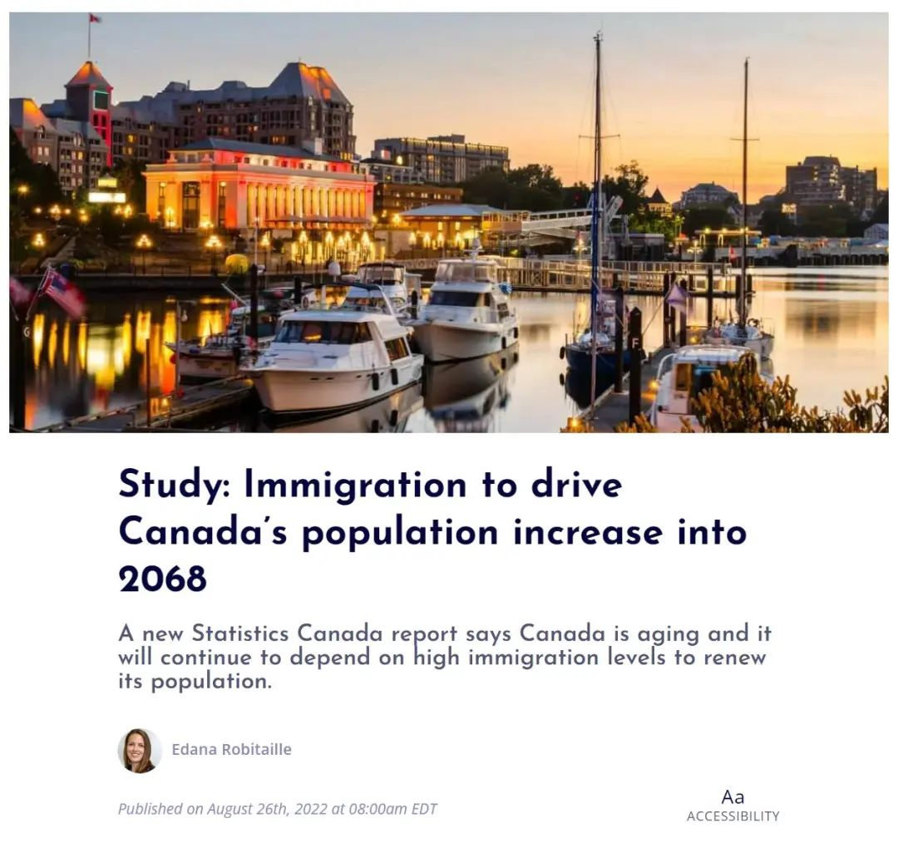
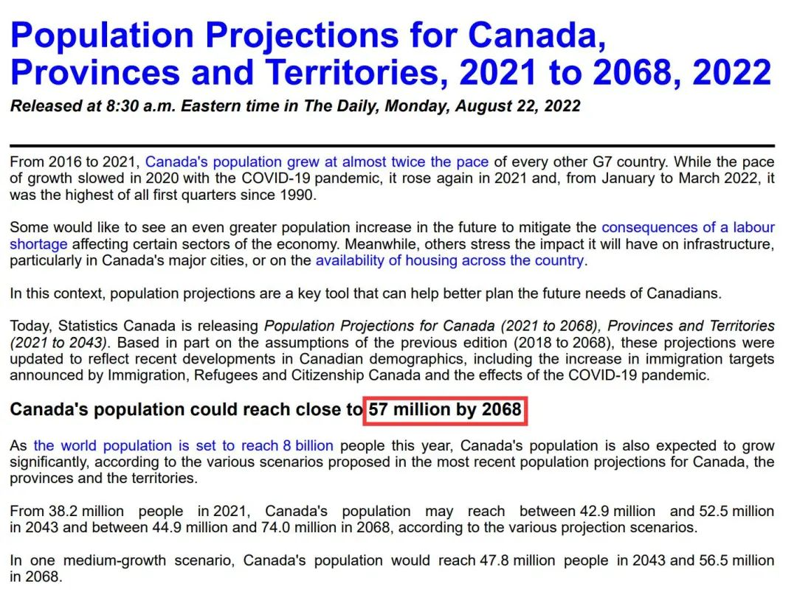
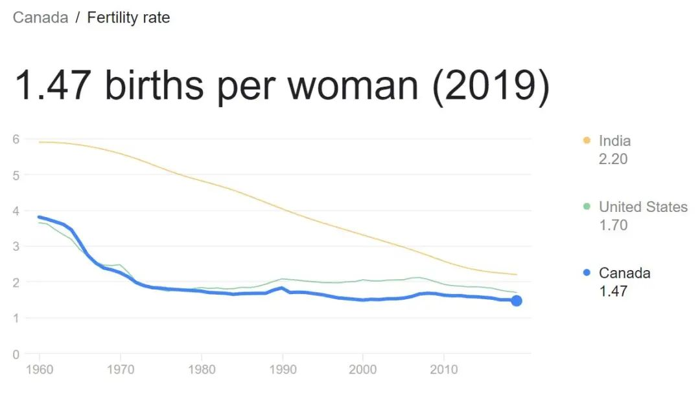
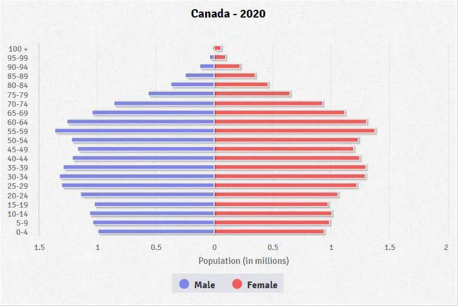
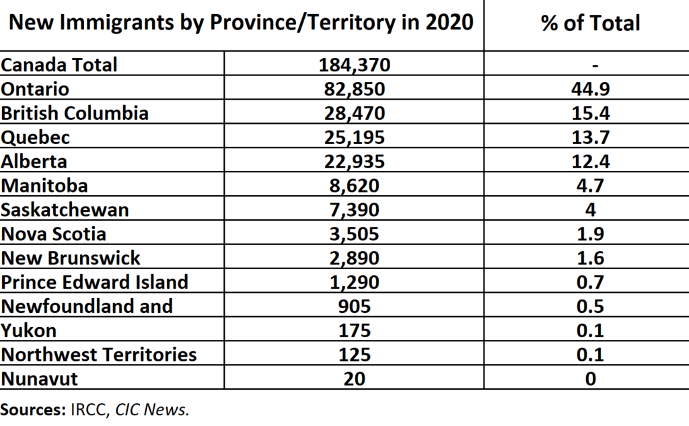
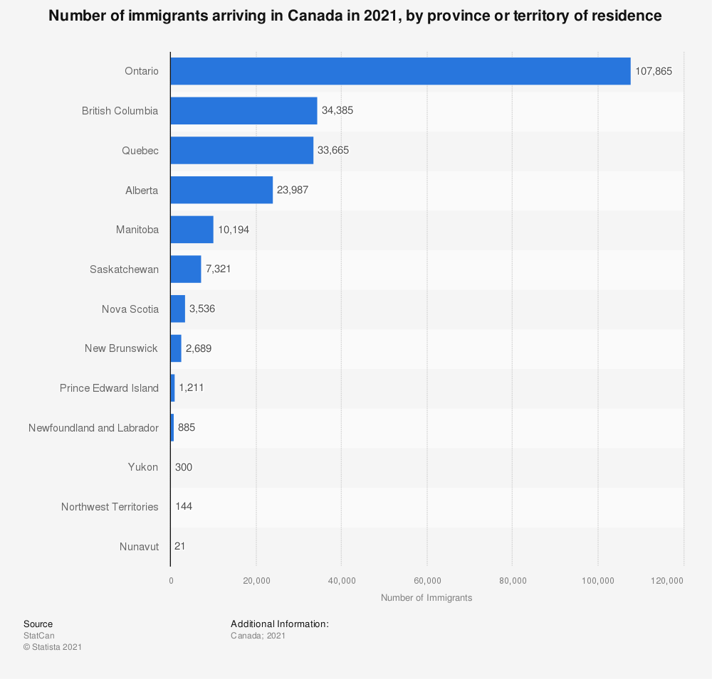
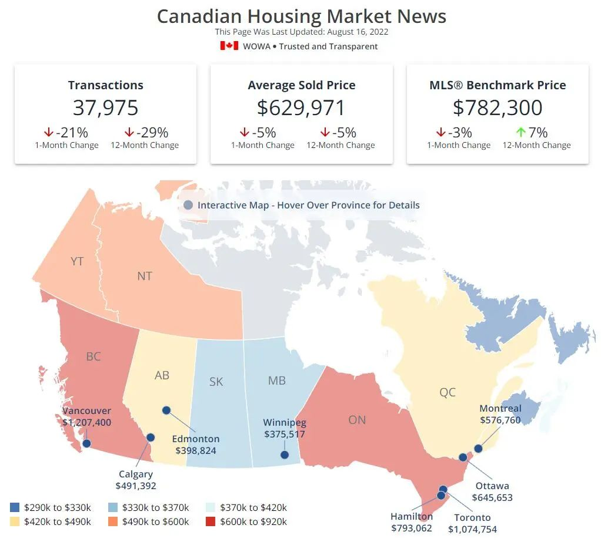

# 无标题

**链接地址:** http://mp.weixin.qq.com/s?__biz=MzUyNzA2NTAwNg==&mid=2247490799&idx=1&sn=95a99fba8ea6f3df2d29965f9c0297b3&chksm=fa04162ecd739f387f3f63c602ec6a117f4a648e9f3f71a3e80541327782750384d504ba33a8&mpshare=1&scene=2&srcid=0831KnwA7fXieJAWJZPmhffg&sharer_sharetime=1661909698310&sharer_shareid=77848a6b3852ae4dcb6c74ffee84743c#rd
**作者:** 你身边的签证专家
**获取时间:** 2025/8/28 19:31:29
**图片数量:** 28

---

## 原始HTML内容

<section style="box-sizing: border-box;font-size: 16px;"><section style="text-align: center;margin-top: 10px;margin-bottom: 10px;box-sizing: border-box;" powered-by="xiumi.us"><section style="max-width: 100%;vertical-align: middle;display: inline-block;line-height: 0;box-sizing: border-box;"></section></section><section style="text-align: center;margin-top: 10px;margin-bottom: 10px;box-sizing: border-box;" powered-by="xiumi.us"></section>
 
<section style="font-size: 14px;padding-right: 15px;padding-left: 15px;letter-spacing: 1px;box-sizing: border-box;" powered-by="xiumi.us">
加拿大的人口和劳动力问题，一直是一个严重影响加国联邦政府制定移民计划和配额的重要指标。同时，这也深刻地影响着加国移民申请者的<strong style="box-sizing: border-box;">申请目标和策略</strong>。

 

近期，加拿大统计局发布了一份人口报告预测更是在移民圈中引起了广泛讨论：加拿大人口在未来几十年将迅速增长，并对住房和医疗保健需求产生巨大影响！此时<strong style="box-sizing: border-box;">移民加拿大到底是一个好选择吗</strong>？成为许多移民者心中的疑问。

 
</section><section style="text-align: center;margin-top: 10px;margin-bottom: 10px;box-sizing: border-box;" powered-by="xiumi.us"><section style="max-width: 100%;vertical-align: middle;display: inline-block;line-height: 0;width: 90%;height: auto;box-sizing: border-box;"></section></section><section style="font-size: 14px;padding-right: 15px;padding-left: 15px;letter-spacing: 1px;box-sizing: border-box;" powered-by="xiumi.us">
 

今天，<strong style="box-sizing: border-box;">新时代留学移民法律事务所</strong>就将带着各位客户朋友们细心解读一遍，隐藏在这些数据背后的人口、劳动力、区域、房价和医疗等方面的发展趋势。让我们废话不多说，赶快开始吸收今日的<strong style="box-sizing: border-box;">干货</strong>。

 

 
</section><section style="text-align: center;justify-content: center;display: flex;flex-flow: row nowrap;box-sizing: border-box;" powered-by="xiumi.us"><section style="display: inline-block;width: auto;vertical-align: top;align-self: flex-start;flex: 0 0 auto;min-width: 5%;max-width: 100%;height: auto;box-sizing: border-box;"><section style="text-align: left;justify-content: flex-start;display: flex;flex-flow: row nowrap;margin-top: 10px;box-sizing: border-box;" powered-by="xiumi.us"><section style="display: inline-block;vertical-align: middle;width: auto;align-self: center;flex: 0 0 auto;min-width: 5%;max-width: 100%;height: auto;box-sizing: border-box;"><section style="transform: scale(0.55);-webkit-transform: scale(0.55);-moz-transform: scale(0.55);-o-transform: scale(0.55);transform-origin: center center;-webkit-transform-origin: center center;-moz-transform-origin: center center;-o-transform-origin: center center;margin-top: -7px;margin-bottom: -7px;box-sizing: border-box;" powered-by="xiumi.us"><section style="font-size: 19px;margin-right: 0%;margin-left: 0%;text-align: center;box-sizing: border-box;"><section style="display: inline-block;border-width: 1px;border-style: solid;border-color: rgb(212, 216, 234);background-color: rgb(212, 216, 234);width: 1.8em;height: 1.8em;line-height: 1.8em;border-radius: 100%;margin-left: auto;margin-right: auto;font-size: 12px;color: rgb(255, 255, 255);box-sizing: border-box;">
 
</section></section></section></section><section style="display: inline-block;vertical-align: middle;width: auto;align-self: center;flex: 100 100 0%;height: auto;box-sizing: border-box;"><section style="margin-top: 0.5em;margin-bottom: 0.5em;box-sizing: border-box;" powered-by="xiumi.us"><section style="border-top: 1px dashed rgb(212, 216, 234);box-sizing: border-box;"><svg viewBox="0 0 1 1" style="float:left;line-height:0;width:0;vertical-align:top;"></svg></section></section></section><section style="display: inline-block;vertical-align: middle;width: auto;align-self: center;flex: 0 0 auto;min-width: 5%;max-width: 100%;height: auto;box-sizing: border-box;"><section style="transform: scale(0.55);-webkit-transform: scale(0.55);-moz-transform: scale(0.55);-o-transform: scale(0.55);transform-origin: center center;-webkit-transform-origin: center center;-moz-transform-origin: center center;-o-transform-origin: center center;margin-top: -7px;margin-bottom: -7px;box-sizing: border-box;" powered-by="xiumi.us"><section style="font-size: 19px;margin-right: 0%;margin-left: 0%;text-align: center;box-sizing: border-box;"><section style="display: inline-block;border-width: 1px;border-style: solid;border-color: rgb(249, 205, 207);background-color: rgb(249, 205, 207);width: 1.8em;height: 1.8em;line-height: 1.8em;border-radius: 100%;margin-left: auto;margin-right: auto;font-size: 12px;color: rgb(255, 255, 255);box-sizing: border-box;">
 
</section></section></section></section></section><section style="margin-top: 3px;margin-bottom: 3px;box-sizing: border-box;" powered-by="xiumi.us"><section style="text-align: justify;color: rgb(161, 167, 195);box-sizing: border-box;">
<strong style="box-sizing: border-box;">加国人口在未来数十年迎来显著增长</strong>
</section></section><section style="text-align: left;justify-content: flex-start;display: flex;flex-flow: row nowrap;margin-bottom: 10px;box-sizing: border-box;" powered-by="xiumi.us"><section style="display: inline-block;vertical-align: middle;width: auto;align-self: center;flex: 0 0 auto;min-width: 5%;max-width: 100%;height: auto;box-sizing: border-box;"><section style="transform: scale(0.55);-webkit-transform: scale(0.55);-moz-transform: scale(0.55);-o-transform: scale(0.55);transform-origin: center center;-webkit-transform-origin: center center;-moz-transform-origin: center center;-o-transform-origin: center center;margin-top: -7px;margin-bottom: -7px;box-sizing: border-box;" powered-by="xiumi.us"><section style="font-size: 19px;margin-right: 0%;margin-left: 0%;text-align: center;box-sizing: border-box;"><section style="display: inline-block;border-width: 1px;border-style: solid;border-color: rgb(249, 205, 207);background-color: rgb(249, 205, 207);width: 1.8em;height: 1.8em;line-height: 1.8em;border-radius: 100%;margin-left: auto;margin-right: auto;font-size: 12px;color: rgb(255, 255, 255);box-sizing: border-box;">
 
</section></section></section></section><section style="display: inline-block;vertical-align: middle;width: auto;align-self: center;flex: 100 100 0%;height: auto;box-sizing: border-box;"><section style="margin-top: 0.5em;margin-bottom: 0.5em;box-sizing: border-box;" powered-by="xiumi.us"><section style="border-top: 1px dashed rgb(212, 216, 234);box-sizing: border-box;"><svg viewBox="0 0 1 1" style="float:left;line-height:0;width:0;vertical-align:top;"></svg></section></section></section><section style="display: inline-block;vertical-align: middle;width: auto;align-self: center;flex: 0 0 auto;min-width: 5%;max-width: 100%;height: auto;box-sizing: border-box;"><section style="transform: scale(0.55);-webkit-transform: scale(0.55);-moz-transform: scale(0.55);-o-transform: scale(0.55);transform-origin: center center;-webkit-transform-origin: center center;-moz-transform-origin: center center;-o-transform-origin: center center;margin-top: -7px;margin-bottom: -7px;box-sizing: border-box;" powered-by="xiumi.us"><section style="font-size: 19px;margin-right: 0%;margin-left: 0%;text-align: center;box-sizing: border-box;"><section style="display: inline-block;border-width: 1px;border-style: solid;border-color: rgb(212, 216, 234);background-color: rgb(212, 216, 234);width: 1.8em;height: 1.8em;line-height: 1.8em;border-radius: 100%;margin-left: auto;margin-right: auto;font-size: 12px;color: rgb(255, 255, 255);box-sizing: border-box;">
 
</section></section></section></section></section></section></section><section style="font-size: 14px;padding-right: 15px;padding-left: 15px;letter-spacing: 1px;box-sizing: border-box;" powered-by="xiumi.us">
 

由于今年世界人口将会达到80亿，根据加拿大各省及地区最新人口预测中提出的方案可见，<strong style="box-sizing: border-box;">加拿大的人口也将会顺势出现大幅增长</strong>。

 

该统计数据预测：在中等增长的情况下，加拿大人口将在2043年达到4780万，<strong style="box-sizing: border-box;">到2068年达到5650万</strong>。在不同条件下到，2068年，加拿大的人口可能增长到<strong style="box-sizing: border-box;">4490万至7400万</strong>之间。

 
</section><section style="text-align: center;margin-top: 10px;margin-bottom: 10px;box-sizing: border-box;" powered-by="xiumi.us"><section style="max-width: 100%;vertical-align: middle;display: inline-block;line-height: 0;width: 90%;height: auto;box-sizing: border-box;"></section></section><section style="font-size: 14px;padding-right: 15px;padding-left: 15px;letter-spacing: 1px;box-sizing: border-box;" powered-by="xiumi.us">
 

有一些人希望看到未来有更大规模的人口增长，从而减轻影响某些经济部门的劳动力短缺和基础设施建设造成的影响。特别是对加拿大的一些主要城市，还会对全国的住房供应产生影响，在这种情况下，人口预测结果是一个很关键工具，可以帮助我们更好地<strong style="box-sizing: border-box;">规划加拿大人的未来需求</strong>。

 

 
</section><section style="text-align: center;justify-content: center;display: flex;flex-flow: row nowrap;box-sizing: border-box;" powered-by="xiumi.us"><section style="display: inline-block;width: auto;vertical-align: top;align-self: flex-start;flex: 0 0 auto;min-width: 5%;max-width: 100%;height: auto;box-sizing: border-box;"><section style="text-align: left;justify-content: flex-start;display: flex;flex-flow: row nowrap;margin-top: 10px;box-sizing: border-box;" powered-by="xiumi.us"><section style="display: inline-block;vertical-align: middle;width: auto;align-self: center;flex: 0 0 auto;min-width: 5%;max-width: 100%;height: auto;box-sizing: border-box;"><section style="transform: scale(0.55);-webkit-transform: scale(0.55);-moz-transform: scale(0.55);-o-transform: scale(0.55);transform-origin: center center;-webkit-transform-origin: center center;-moz-transform-origin: center center;-o-transform-origin: center center;margin-top: -7px;margin-bottom: -7px;box-sizing: border-box;" powered-by="xiumi.us"><section style="font-size: 19px;margin-right: 0%;margin-left: 0%;text-align: center;box-sizing: border-box;"><section style="display: inline-block;border-width: 1px;border-style: solid;border-color: rgb(212, 216, 234);background-color: rgb(212, 216, 234);width: 1.8em;height: 1.8em;line-height: 1.8em;border-radius: 100%;margin-left: auto;margin-right: auto;font-size: 12px;color: rgb(255, 255, 255);box-sizing: border-box;">
 
</section></section></section></section><section style="display: inline-block;vertical-align: middle;width: auto;align-self: center;flex: 100 100 0%;height: auto;box-sizing: border-box;"><section style="margin-top: 0.5em;margin-bottom: 0.5em;box-sizing: border-box;" powered-by="xiumi.us"><section style="border-top: 1px dashed rgb(212, 216, 234);box-sizing: border-box;"><svg viewBox="0 0 1 1" style="float:left;line-height:0;width:0;vertical-align:top;"></svg></section></section></section><section style="display: inline-block;vertical-align: middle;width: auto;align-self: center;flex: 0 0 auto;min-width: 5%;max-width: 100%;height: auto;box-sizing: border-box;"><section style="transform: scale(0.55);-webkit-transform: scale(0.55);-moz-transform: scale(0.55);-o-transform: scale(0.55);transform-origin: center center;-webkit-transform-origin: center center;-moz-transform-origin: center center;-o-transform-origin: center center;margin-top: -7px;margin-bottom: -7px;box-sizing: border-box;" powered-by="xiumi.us"><section style="font-size: 19px;margin-right: 0%;margin-left: 0%;text-align: center;box-sizing: border-box;"><section style="display: inline-block;border-width: 1px;border-style: solid;border-color: rgb(249, 205, 207);background-color: rgb(249, 205, 207);width: 1.8em;height: 1.8em;line-height: 1.8em;border-radius: 100%;margin-left: auto;margin-right: auto;font-size: 12px;color: rgb(255, 255, 255);box-sizing: border-box;">
 
</section></section></section></section></section><section style="margin-top: 3px;margin-bottom: 3px;box-sizing: border-box;" powered-by="xiumi.us"><section style="text-align: justify;color: rgb(161, 167, 195);box-sizing: border-box;">
<strong style="box-sizing: border-box;">移民仍是人口增长的主要动力</strong>
</section></section><section style="text-align: left;justify-content: flex-start;display: flex;flex-flow: row nowrap;margin-bottom: 10px;box-sizing: border-box;" powered-by="xiumi.us"><section style="display: inline-block;vertical-align: middle;width: auto;align-self: center;flex: 0 0 auto;min-width: 5%;max-width: 100%;height: auto;box-sizing: border-box;"><section style="transform: scale(0.55);-webkit-transform: scale(0.55);-moz-transform: scale(0.55);-o-transform: scale(0.55);transform-origin: center center;-webkit-transform-origin: center center;-moz-transform-origin: center center;-o-transform-origin: center center;margin-top: -7px;margin-bottom: -7px;box-sizing: border-box;" powered-by="xiumi.us"><section style="font-size: 19px;margin-right: 0%;margin-left: 0%;text-align: center;box-sizing: border-box;"><section style="display: inline-block;border-width: 1px;border-style: solid;border-color: rgb(249, 205, 207);background-color: rgb(249, 205, 207);width: 1.8em;height: 1.8em;line-height: 1.8em;border-radius: 100%;margin-left: auto;margin-right: auto;font-size: 12px;color: rgb(255, 255, 255);box-sizing: border-box;">
 
</section></section></section></section><section style="display: inline-block;vertical-align: middle;width: auto;align-self: center;flex: 100 100 0%;height: auto;box-sizing: border-box;"><section style="margin-top: 0.5em;margin-bottom: 0.5em;box-sizing: border-box;" powered-by="xiumi.us"><section style="border-top: 1px dashed rgb(212, 216, 234);box-sizing: border-box;"><svg viewBox="0 0 1 1" style="float:left;line-height:0;width:0;vertical-align:top;"></svg></section></section></section><section style="display: inline-block;vertical-align: middle;width: auto;align-self: center;flex: 0 0 auto;min-width: 5%;max-width: 100%;height: auto;box-sizing: border-box;"><section style="transform: scale(0.55);-webkit-transform: scale(0.55);-moz-transform: scale(0.55);-o-transform: scale(0.55);transform-origin: center center;-webkit-transform-origin: center center;-moz-transform-origin: center center;-o-transform-origin: center center;margin-top: -7px;margin-bottom: -7px;box-sizing: border-box;" powered-by="xiumi.us"><section style="font-size: 19px;margin-right: 0%;margin-left: 0%;text-align: center;box-sizing: border-box;"><section style="display: inline-block;border-width: 1px;border-style: solid;border-color: rgb(212, 216, 234);background-color: rgb(212, 216, 234);width: 1.8em;height: 1.8em;line-height: 1.8em;border-radius: 100%;margin-left: auto;margin-right: auto;font-size: 12px;color: rgb(255, 255, 255);box-sizing: border-box;">
 
</section></section></section></section></section></section></section><section style="font-size: 14px;padding-right: 15px;padding-left: 15px;letter-spacing: 1px;box-sizing: border-box;" powered-by="xiumi.us">
 

如果加拿大的人口在未来继续增加，主要来源将会是新移民的加入。预计在未来几十年内，移民仍然相当重要。这意味着，加拿大将继续依赖高移民水平来更新其人口，特别是在生育率持续下降的背景下，自然增长（出生人数减去死亡人数）预计将会在未来几年减少，这都是<strong style="box-sizing: border-box;">人口老龄化和加拿大夫妇的低生育率带来的结果</strong>。

 
</section><section style="text-align: center;margin-top: 10px;margin-bottom: 10px;box-sizing: border-box;" powered-by="xiumi.us"><section style="max-width: 100%;vertical-align: middle;display: inline-block;line-height: 0;width: 90%;height: auto;box-sizing: border-box;"></section></section><section style="font-size: 14px;padding-right: 15px;padding-left: 15px;letter-spacing: 1px;box-sizing: border-box;" powered-by="xiumi.us">
 

2020年，加拿大平均<strong style="box-sizing: border-box;">每名妇女生产的孩子数量为1.4个</strong>，<strong style="box-sizing: border-box;">达到历史最低水平</strong>，在中等增长的情况下，未来几年加拿大的这种自然增长将继续减少，甚至在2049年和2058年之间会有<strong style="box-sizing: border-box;">短暂时期成为负数。</strong>

 

由于2020年开始边境关闭，加拿大移民减少了一半，使<strong style="box-sizing: border-box;">人口增长达到第一次世界大战以来的最低水平</strong>，然而，这种情况是暂时的，国际移民在2021年出现反弹，占该年<strong style="box-sizing: border-box;">全国人口增长的87.4%</strong>！

 

说加拿大人口增长全靠移民这话一点不假。 

 

 
</section><section style="text-align: center;justify-content: center;display: flex;flex-flow: row nowrap;box-sizing: border-box;" powered-by="xiumi.us"><section style="display: inline-block;width: auto;vertical-align: top;align-self: flex-start;flex: 0 0 auto;min-width: 5%;max-width: 100%;height: auto;box-sizing: border-box;"><section style="text-align: left;justify-content: flex-start;display: flex;flex-flow: row nowrap;margin-top: 10px;box-sizing: border-box;" powered-by="xiumi.us"><section style="display: inline-block;vertical-align: middle;width: auto;align-self: center;flex: 0 0 auto;min-width: 5%;max-width: 100%;height: auto;box-sizing: border-box;"><section style="transform: scale(0.55);-webkit-transform: scale(0.55);-moz-transform: scale(0.55);-o-transform: scale(0.55);transform-origin: center center;-webkit-transform-origin: center center;-moz-transform-origin: center center;-o-transform-origin: center center;margin-top: -7px;margin-bottom: -7px;box-sizing: border-box;" powered-by="xiumi.us"><section style="font-size: 19px;margin-right: 0%;margin-left: 0%;text-align: center;box-sizing: border-box;"><section style="display: inline-block;border-width: 1px;border-style: solid;border-color: rgb(212, 216, 234);background-color: rgb(212, 216, 234);width: 1.8em;height: 1.8em;line-height: 1.8em;border-radius: 100%;margin-left: auto;margin-right: auto;font-size: 12px;color: rgb(255, 255, 255);box-sizing: border-box;">
 
</section></section></section></section><section style="display: inline-block;vertical-align: middle;width: auto;align-self: center;flex: 100 100 0%;height: auto;box-sizing: border-box;"><section style="margin-top: 0.5em;margin-bottom: 0.5em;box-sizing: border-box;" powered-by="xiumi.us"><section style="border-top: 1px dashed rgb(212, 216, 234);box-sizing: border-box;"><svg viewBox="0 0 1 1" style="float:left;line-height:0;width:0;vertical-align:top;"></svg></section></section></section><section style="display: inline-block;vertical-align: middle;width: auto;align-self: center;flex: 0 0 auto;min-width: 5%;max-width: 100%;height: auto;box-sizing: border-box;"><section style="transform: scale(0.55);-webkit-transform: scale(0.55);-moz-transform: scale(0.55);-o-transform: scale(0.55);transform-origin: center center;-webkit-transform-origin: center center;-moz-transform-origin: center center;-o-transform-origin: center center;margin-top: -7px;margin-bottom: -7px;box-sizing: border-box;" powered-by="xiumi.us"><section style="font-size: 19px;margin-right: 0%;margin-left: 0%;text-align: center;box-sizing: border-box;"><section style="display: inline-block;border-width: 1px;border-style: solid;border-color: rgb(249, 205, 207);background-color: rgb(249, 205, 207);width: 1.8em;height: 1.8em;line-height: 1.8em;border-radius: 100%;margin-left: auto;margin-right: auto;font-size: 12px;color: rgb(255, 255, 255);box-sizing: border-box;">
 
</section></section></section></section></section><section style="margin-top: 3px;margin-bottom: 3px;box-sizing: border-box;" powered-by="xiumi.us"><section style="text-align: justify;color: rgb(161, 167, 195);box-sizing: border-box;">
<strong style="box-sizing: border-box;">老龄化仍然是严重社会问题</strong>
</section></section><section style="text-align: left;justify-content: flex-start;display: flex;flex-flow: row nowrap;margin-bottom: 10px;box-sizing: border-box;" powered-by="xiumi.us"><section style="display: inline-block;vertical-align: middle;width: auto;align-self: center;flex: 0 0 auto;min-width: 5%;max-width: 100%;height: auto;box-sizing: border-box;"><section style="transform: scale(0.55);-webkit-transform: scale(0.55);-moz-transform: scale(0.55);-o-transform: scale(0.55);transform-origin: center center;-webkit-transform-origin: center center;-moz-transform-origin: center center;-o-transform-origin: center center;margin-top: -7px;margin-bottom: -7px;box-sizing: border-box;" powered-by="xiumi.us"><section style="font-size: 19px;margin-right: 0%;margin-left: 0%;text-align: center;box-sizing: border-box;"><section style="display: inline-block;border-width: 1px;border-style: solid;border-color: rgb(249, 205, 207);background-color: rgb(249, 205, 207);width: 1.8em;height: 1.8em;line-height: 1.8em;border-radius: 100%;margin-left: auto;margin-right: auto;font-size: 12px;color: rgb(255, 255, 255);box-sizing: border-box;">
 
</section></section></section></section><section style="display: inline-block;vertical-align: middle;width: auto;align-self: center;flex: 100 100 0%;height: auto;box-sizing: border-box;"><section style="margin-top: 0.5em;margin-bottom: 0.5em;box-sizing: border-box;" powered-by="xiumi.us"><section style="border-top: 1px dashed rgb(212, 216, 234);box-sizing: border-box;"><svg viewBox="0 0 1 1" style="float:left;line-height:0;width:0;vertical-align:top;"></svg></section></section></section><section style="display: inline-block;vertical-align: middle;width: auto;align-self: center;flex: 0 0 auto;min-width: 5%;max-width: 100%;height: auto;box-sizing: border-box;"><section style="transform: scale(0.55);-webkit-transform: scale(0.55);-moz-transform: scale(0.55);-o-transform: scale(0.55);transform-origin: center center;-webkit-transform-origin: center center;-moz-transform-origin: center center;-o-transform-origin: center center;margin-top: -7px;margin-bottom: -7px;box-sizing: border-box;" powered-by="xiumi.us"><section style="font-size: 19px;margin-right: 0%;margin-left: 0%;text-align: center;box-sizing: border-box;"><section style="display: inline-block;border-width: 1px;border-style: solid;border-color: rgb(212, 216, 234);background-color: rgb(212, 216, 234);width: 1.8em;height: 1.8em;line-height: 1.8em;border-radius: 100%;margin-left: auto;margin-right: auto;font-size: 12px;color: rgb(255, 255, 255);box-sizing: border-box;">
 
</section></section></section></section></section></section></section><section style="font-size: 14px;padding-right: 15px;padding-left: 15px;letter-spacing: 1px;box-sizing: border-box;" powered-by="xiumi.us">
 

统计局在报告中说：劳动力老龄化带来的挑战包括<strong style="box-sizing: border-box;">技能转移、留住有经验的员工和劳动力更新</strong>。统计局表示，这种趋势可以通过移民来减缓，但移民的增加—即使是大量移民—也不会显著抑制这种趋势。 

 

加拿大统计局还表示，<strong style="box-sizing: border-box;">不仅加拿大的劳动力正在显著老龄化，整个人口也是如此</strong>。

 
</section><section style="text-align: center;margin-top: 10px;margin-bottom: 10px;box-sizing: border-box;" powered-by="xiumi.us"><section style="max-width: 100%;vertical-align: middle;display: inline-block;line-height: 0;width: 90%;height: auto;box-sizing: border-box;"></section></section><section style="font-size: 14px;padding-right: 15px;padding-left: 15px;letter-spacing: 1px;box-sizing: border-box;" powered-by="xiumi.us">
 

在中等增长的预测情况下，加拿大的平均年龄将从2021年的41.7岁增加到2043年的44.1岁，到2068年将达到45.1岁，在中等增长的情况下，65岁及以上人口的比例从2021年的18.5%增加到2043年的23.1%和2068年的25.9%，85岁及以上的人口在同一时期可能增加两倍多，从2021年的87.1万增加到2068年的320万。

 
</section><section style="text-align: center;margin-top: 10px;margin-bottom: 10px;box-sizing: border-box;" powered-by="xiumi.us"><section style="max-width: 100%;vertical-align: middle;display: inline-block;line-height: 0;width: 90%;height: auto;box-sizing: border-box;"></section></section><section style="font-size: 14px;padding-right: 15px;padding-left: 15px;letter-spacing: 1px;box-sizing: border-box;" powered-by="xiumi.us">
 

虽然在一些有利于增加移民、降低预期寿命和提高生育率的预测假设中不太明显，但人口老龄化仍然是一个现实，因此<strong style="box-sizing: border-box;">在未来50年似乎是不可避免的</strong>。 

 

 
</section><section style="text-align: center;justify-content: center;display: flex;flex-flow: row nowrap;box-sizing: border-box;" powered-by="xiumi.us"><section style="display: inline-block;width: auto;vertical-align: top;align-self: flex-start;flex: 0 0 auto;min-width: 5%;max-width: 100%;height: auto;box-sizing: border-box;"><section style="text-align: left;justify-content: flex-start;display: flex;flex-flow: row nowrap;margin-top: 10px;box-sizing: border-box;" powered-by="xiumi.us"><section style="display: inline-block;vertical-align: middle;width: auto;align-self: center;flex: 0 0 auto;min-width: 5%;max-width: 100%;height: auto;box-sizing: border-box;"><section style="transform: scale(0.55);-webkit-transform: scale(0.55);-moz-transform: scale(0.55);-o-transform: scale(0.55);transform-origin: center center;-webkit-transform-origin: center center;-moz-transform-origin: center center;-o-transform-origin: center center;margin-top: -7px;margin-bottom: -7px;box-sizing: border-box;" powered-by="xiumi.us"><section style="font-size: 19px;margin-right: 0%;margin-left: 0%;text-align: center;box-sizing: border-box;"><section style="display: inline-block;border-width: 1px;border-style: solid;border-color: rgb(212, 216, 234);background-color: rgb(212, 216, 234);width: 1.8em;height: 1.8em;line-height: 1.8em;border-radius: 100%;margin-left: auto;margin-right: auto;font-size: 12px;color: rgb(255, 255, 255);box-sizing: border-box;">
 
</section></section></section></section><section style="display: inline-block;vertical-align: middle;width: auto;align-self: center;flex: 100 100 0%;height: auto;box-sizing: border-box;"><section style="margin-top: 0.5em;margin-bottom: 0.5em;box-sizing: border-box;" powered-by="xiumi.us"><section style="border-top: 1px dashed rgb(212, 216, 234);box-sizing: border-box;"><svg viewBox="0 0 1 1" style="float:left;line-height:0;width:0;vertical-align:top;"></svg></section></section></section><section style="display: inline-block;vertical-align: middle;width: auto;align-self: center;flex: 0 0 auto;min-width: 5%;max-width: 100%;height: auto;box-sizing: border-box;"><section style="transform: scale(0.55);-webkit-transform: scale(0.55);-moz-transform: scale(0.55);-o-transform: scale(0.55);transform-origin: center center;-webkit-transform-origin: center center;-moz-transform-origin: center center;-o-transform-origin: center center;margin-top: -7px;margin-bottom: -7px;box-sizing: border-box;" powered-by="xiumi.us"><section style="font-size: 19px;margin-right: 0%;margin-left: 0%;text-align: center;box-sizing: border-box;"><section style="display: inline-block;border-width: 1px;border-style: solid;border-color: rgb(249, 205, 207);background-color: rgb(249, 205, 207);width: 1.8em;height: 1.8em;line-height: 1.8em;border-radius: 100%;margin-left: auto;margin-right: auto;font-size: 12px;color: rgb(255, 255, 255);box-sizing: border-box;">
 
</section></section></section></section></section><section style="margin-top: 3px;margin-bottom: 3px;box-sizing: border-box;" powered-by="xiumi.us"><section style="text-align: justify;color: rgb(161, 167, 195);box-sizing: border-box;">
<strong style="box-sizing: border-box;">区域的变化趋势</strong>
</section></section><section style="text-align: left;justify-content: flex-start;display: flex;flex-flow: row nowrap;margin-bottom: 10px;box-sizing: border-box;" powered-by="xiumi.us"><section style="display: inline-block;vertical-align: middle;width: auto;align-self: center;flex: 0 0 auto;min-width: 5%;max-width: 100%;height: auto;box-sizing: border-box;"><section style="transform: scale(0.55);-webkit-transform: scale(0.55);-moz-transform: scale(0.55);-o-transform: scale(0.55);transform-origin: center center;-webkit-transform-origin: center center;-moz-transform-origin: center center;-o-transform-origin: center center;margin-top: -7px;margin-bottom: -7px;box-sizing: border-box;" powered-by="xiumi.us"><section style="font-size: 19px;margin-right: 0%;margin-left: 0%;text-align: center;box-sizing: border-box;"><section style="display: inline-block;border-width: 1px;border-style: solid;border-color: rgb(249, 205, 207);background-color: rgb(249, 205, 207);width: 1.8em;height: 1.8em;line-height: 1.8em;border-radius: 100%;margin-left: auto;margin-right: auto;font-size: 12px;color: rgb(255, 255, 255);box-sizing: border-box;">
 
</section></section></section></section><section style="display: inline-block;vertical-align: middle;width: auto;align-self: center;flex: 100 100 0%;height: auto;box-sizing: border-box;"><section style="margin-top: 0.5em;margin-bottom: 0.5em;box-sizing: border-box;" powered-by="xiumi.us"><section style="border-top: 1px dashed rgb(212, 216, 234);box-sizing: border-box;"><svg viewBox="0 0 1 1" style="float:left;line-height:0;width:0;vertical-align:top;"></svg></section></section></section><section style="display: inline-block;vertical-align: middle;width: auto;align-self: center;flex: 0 0 auto;min-width: 5%;max-width: 100%;height: auto;box-sizing: border-box;"><section style="transform: scale(0.55);-webkit-transform: scale(0.55);-moz-transform: scale(0.55);-o-transform: scale(0.55);transform-origin: center center;-webkit-transform-origin: center center;-moz-transform-origin: center center;-o-transform-origin: center center;margin-top: -7px;margin-bottom: -7px;box-sizing: border-box;" powered-by="xiumi.us"><section style="font-size: 19px;margin-right: 0%;margin-left: 0%;text-align: center;box-sizing: border-box;"><section style="display: inline-block;border-width: 1px;border-style: solid;border-color: rgb(212, 216, 234);background-color: rgb(212, 216, 234);width: 1.8em;height: 1.8em;line-height: 1.8em;border-radius: 100%;margin-left: auto;margin-right: auto;font-size: 12px;color: rgb(255, 255, 255);box-sizing: border-box;">
 
</section></section></section></section></section></section></section><section style="font-size: 14px;padding-right: 15px;padding-left: 15px;letter-spacing: 1px;box-sizing: border-box;" powered-by="xiumi.us">
 

根据加拿大统计局公布的2021年春季人口普查数据显示，加拿大人口为36991981人。其中，2730万人居住在全国41个城市中心区域。

 

加拿大上一次人口普查是在2016年，5年来人口数量增加了约180万，<strong style="box-sizing: border-box;">人口增加的主要因素是大量移民</strong>。
</section><section style="text-align: center;margin-top: 10px;margin-bottom: 10px;box-sizing: border-box;" powered-by="xiumi.us"><section style="max-width: 100%;vertical-align: middle;display: inline-block;line-height: 0;width: 90%;height: auto;box-sizing: border-box;"></section></section><section style="font-size: 14px;padding-right: 15px;padding-left: 15px;letter-spacing: 1px;box-sizing: border-box;" powered-by="xiumi.us">
 

<strong style="box-sizing: border-box;">多伦多依然是加拿大人口最多的城市</strong>，居民总数为6202225人，占全国人口的六分之一。蒙特利尔和温哥华的人口分别为4291732人和2642825人。<strong style="box-sizing: border-box;">这三个城市的人口数量占全国人口的三分之一</strong>。

 

然而，加拿大一些地区的<strong style="box-sizing: border-box;">人口可能会减少</strong>，因为在低增长假设中，移民会相对减少，而在纽芬兰省和拉布拉多省的所有假设中，<strong style="box-sizing: border-box;">人口都呈下降趋势</strong>。

 
</section><section style="text-align: center;margin-top: 10px;margin-bottom: 10px;box-sizing: border-box;" powered-by="xiumi.us"><section style="max-width: 100%;vertical-align: middle;display: inline-block;line-height: 0;width: 90%;height: auto;box-sizing: border-box;"></section></section><section style="font-size: 14px;padding-right: 15px;padding-left: 15px;letter-spacing: 1px;box-sizing: border-box;" powered-by="xiumi.us">
 

自大流行疫情开始以来，省级移民的持续变化可能有利于某些省份的增长，包括爱德华王子岛、新斯科舍、纽宾士域省、魁北克和不列颠哥伦比亚，然而，很难预测这些新的移民模式是否会在未来很长一段时间内持续进行下去。 

 
</section><section style="text-align: center;margin-top: 10px;margin-bottom: 10px;box-sizing: border-box;" powered-by="xiumi.us"><section style="max-width: 100%;vertical-align: middle;display: inline-block;line-height: 0;box-sizing: border-box;"></section></section><section style="text-align: center;margin-top: 10px;margin-bottom: 10px;box-sizing: border-box;" powered-by="xiumi.us"><section style="max-width: 100%;vertical-align: middle;display: inline-block;line-height: 0;box-sizing: border-box;"></section></section><section style="font-size: 14px;padding-right: 15px;padding-left: 15px;letter-spacing: 1px;box-sizing: border-box;" powered-by="xiumi.us">
 
</section><section style="text-align: center;justify-content: center;display: flex;flex-flow: row nowrap;box-sizing: border-box;" powered-by="xiumi.us"><section style="display: inline-block;width: auto;vertical-align: top;align-self: flex-start;flex: 0 0 auto;min-width: 5%;max-width: 100%;height: auto;box-sizing: border-box;"><section style="text-align: left;justify-content: flex-start;display: flex;flex-flow: row nowrap;margin-top: 10px;box-sizing: border-box;" powered-by="xiumi.us"><section style="display: inline-block;vertical-align: middle;width: auto;align-self: center;flex: 0 0 auto;min-width: 5%;max-width: 100%;height: auto;box-sizing: border-box;"><section style="transform: scale(0.55);-webkit-transform: scale(0.55);-moz-transform: scale(0.55);-o-transform: scale(0.55);transform-origin: center center;-webkit-transform-origin: center center;-moz-transform-origin: center center;-o-transform-origin: center center;margin-top: -7px;margin-bottom: -7px;box-sizing: border-box;" powered-by="xiumi.us"><section style="font-size: 19px;margin-right: 0%;margin-left: 0%;text-align: center;box-sizing: border-box;"><section style="display: inline-block;border-width: 1px;border-style: solid;border-color: rgb(212, 216, 234);background-color: rgb(212, 216, 234);width: 1.8em;height: 1.8em;line-height: 1.8em;border-radius: 100%;margin-left: auto;margin-right: auto;font-size: 12px;color: rgb(255, 255, 255);box-sizing: border-box;">
 
</section></section></section></section><section style="display: inline-block;vertical-align: middle;width: auto;align-self: center;flex: 100 100 0%;height: auto;box-sizing: border-box;"><section style="margin-top: 0.5em;margin-bottom: 0.5em;box-sizing: border-box;" powered-by="xiumi.us"><section style="border-top: 1px dashed rgb(212, 216, 234);box-sizing: border-box;"><svg viewBox="0 0 1 1" style="float:left;line-height:0;width:0;vertical-align:top;"></svg></section></section></section><section style="display: inline-block;vertical-align: middle;width: auto;align-self: center;flex: 0 0 auto;min-width: 5%;max-width: 100%;height: auto;box-sizing: border-box;"><section style="transform: scale(0.55);-webkit-transform: scale(0.55);-moz-transform: scale(0.55);-o-transform: scale(0.55);transform-origin: center center;-webkit-transform-origin: center center;-moz-transform-origin: center center;-o-transform-origin: center center;margin-top: -7px;margin-bottom: -7px;box-sizing: border-box;" powered-by="xiumi.us"><section style="font-size: 19px;margin-right: 0%;margin-left: 0%;text-align: center;box-sizing: border-box;"><section style="display: inline-block;border-width: 1px;border-style: solid;border-color: rgb(249, 205, 207);background-color: rgb(249, 205, 207);width: 1.8em;height: 1.8em;line-height: 1.8em;border-radius: 100%;margin-left: auto;margin-right: auto;font-size: 12px;color: rgb(255, 255, 255);box-sizing: border-box;">
 
</section></section></section></section></section><section style="margin-top: 3px;margin-bottom: 3px;box-sizing: border-box;" powered-by="xiumi.us"><section style="text-align: justify;color: rgb(161, 167, 195);box-sizing: border-box;">
<strong style="box-sizing: border-box;">预计亚省人口增长最快</strong>
</section></section><section style="text-align: left;justify-content: flex-start;display: flex;flex-flow: row nowrap;margin-bottom: 10px;box-sizing: border-box;" powered-by="xiumi.us"><section style="display: inline-block;vertical-align: middle;width: auto;align-self: center;flex: 0 0 auto;min-width: 5%;max-width: 100%;height: auto;box-sizing: border-box;"><section style="transform: scale(0.55);-webkit-transform: scale(0.55);-moz-transform: scale(0.55);-o-transform: scale(0.55);transform-origin: center center;-webkit-transform-origin: center center;-moz-transform-origin: center center;-o-transform-origin: center center;margin-top: -7px;margin-bottom: -7px;box-sizing: border-box;" powered-by="xiumi.us"><section style="font-size: 19px;margin-right: 0%;margin-left: 0%;text-align: center;box-sizing: border-box;"><section style="display: inline-block;border-width: 1px;border-style: solid;border-color: rgb(249, 205, 207);background-color: rgb(249, 205, 207);width: 1.8em;height: 1.8em;line-height: 1.8em;border-radius: 100%;margin-left: auto;margin-right: auto;font-size: 12px;color: rgb(255, 255, 255);box-sizing: border-box;">
 
</section></section></section></section><section style="display: inline-block;vertical-align: middle;width: auto;align-self: center;flex: 100 100 0%;height: auto;box-sizing: border-box;"><section style="margin-top: 0.5em;margin-bottom: 0.5em;box-sizing: border-box;" powered-by="xiumi.us"><section style="border-top: 1px dashed rgb(212, 216, 234);box-sizing: border-box;"><svg viewBox="0 0 1 1" style="float:left;line-height:0;width:0;vertical-align:top;"></svg></section></section></section><section style="display: inline-block;vertical-align: middle;width: auto;align-self: center;flex: 0 0 auto;min-width: 5%;max-width: 100%;height: auto;box-sizing: border-box;"><section style="transform: scale(0.55);-webkit-transform: scale(0.55);-moz-transform: scale(0.55);-o-transform: scale(0.55);transform-origin: center center;-webkit-transform-origin: center center;-moz-transform-origin: center center;-o-transform-origin: center center;margin-top: -7px;margin-bottom: -7px;box-sizing: border-box;" powered-by="xiumi.us"><section style="font-size: 19px;margin-right: 0%;margin-left: 0%;text-align: center;box-sizing: border-box;"><section style="display: inline-block;border-width: 1px;border-style: solid;border-color: rgb(212, 216, 234);background-color: rgb(212, 216, 234);width: 1.8em;height: 1.8em;line-height: 1.8em;border-radius: 100%;margin-left: auto;margin-right: auto;font-size: 12px;color: rgb(255, 255, 255);box-sizing: border-box;">
 
</section></section></section></section></section></section></section><section style="font-size: 14px;padding-right: 15px;padding-left: 15px;letter-spacing: 1px;box-sizing: border-box;" powered-by="xiumi.us">
 

按统计局的预测，<strong style="box-sizing: border-box;">亚伯塔省将成为全国人口增长最快的省</strong>，到2043年，该省的人口预计将比现在增加31%至61%。按某些假设情况的预测，<strong style="box-sizing: border-box;">亚省人口将超过卑诗省</strong>。

 

西安大略大学Ivey商学院教授、智慧繁荣研究所（Smart Prosperity Institute）高级董事迈克·莫法特（Mike Moffatt）表示说：“亚伯塔省为不断增长的人口建造足够住房方面，做得相当不错。在过去的几十年里，<strong style="box-sizing: border-box;">亚省的增长非常迅速，他们能够保证住房供应</strong>。”

 
</section><section style="text-align: center;margin-top: 10px;margin-bottom: 10px;box-sizing: border-box;" powered-by="xiumi.us"><section style="max-width: 100%;vertical-align: middle;display: inline-block;line-height: 0;width: 90%;height: auto;box-sizing: border-box;"></section></section><section style="font-size: 14px;padding-right: 15px;padding-left: 15px;letter-spacing: 1px;box-sizing: border-box;" powered-by="xiumi.us">
 

他说，该省在土地使用和环境方面一直存在问题，但仅从数量的角度看，他们能够跟上发展的需求。

 

根据统计局的预测，到2043年，卑诗省、安省和萨斯喀彻温省的人口将增长14%至40%。同期，曼尼托巴省的人口将增长11%至40%；魁北克省的人口将增长12%至19%。

 

莫法特表示，鉴于<strong style="box-sizing: border-box;">安省和卑诗省的住房短缺情况最为严重</strong>，该两省需要做更多工作，以应对即将到来的人口增长。

 
</section><section style="text-align: center;margin-top: 10px;margin-bottom: 10px;box-sizing: border-box;" powered-by="xiumi.us"><section style="max-width: 100%;vertical-align: middle;display: inline-block;line-height: 0;width: 90%;height: auto;box-sizing: border-box;"></section></section><section style="font-size: 14px;padding-right: 15px;padding-left: 15px;letter-spacing: 1px;box-sizing: border-box;" powered-by="xiumi.us">
 

“我认为，大多数省份在适应人口增长方面应该没太大问题。我担心的主要是安省和卑诗省。”他说。

 

按统计局的预测，到2043年，加拿大大西洋地区的人口变化介于下降1.5%至增加16%之间；至于加拿大的特区，人口增长预计在8%至28%之间。

 

 
</section><section style="text-align: center;justify-content: center;display: flex;flex-flow: row nowrap;box-sizing: border-box;" powered-by="xiumi.us"><section style="display: inline-block;width: auto;vertical-align: top;align-self: flex-start;flex: 0 0 auto;min-width: 5%;max-width: 100%;height: auto;box-sizing: border-box;"><section style="text-align: left;justify-content: flex-start;display: flex;flex-flow: row nowrap;margin-top: 10px;box-sizing: border-box;" powered-by="xiumi.us"><section style="display: inline-block;vertical-align: middle;width: auto;align-self: center;flex: 0 0 auto;min-width: 5%;max-width: 100%;height: auto;box-sizing: border-box;"><section style="transform: scale(0.55);-webkit-transform: scale(0.55);-moz-transform: scale(0.55);-o-transform: scale(0.55);transform-origin: center center;-webkit-transform-origin: center center;-moz-transform-origin: center center;-o-transform-origin: center center;margin-top: -7px;margin-bottom: -7px;box-sizing: border-box;" powered-by="xiumi.us"><section style="font-size: 19px;margin-right: 0%;margin-left: 0%;text-align: center;box-sizing: border-box;"><section style="display: inline-block;border-width: 1px;border-style: solid;border-color: rgb(212, 216, 234);background-color: rgb(212, 216, 234);width: 1.8em;height: 1.8em;line-height: 1.8em;border-radius: 100%;margin-left: auto;margin-right: auto;font-size: 12px;color: rgb(255, 255, 255);box-sizing: border-box;">
 
</section></section></section></section><section style="display: inline-block;vertical-align: middle;width: auto;align-self: center;flex: 100 100 0%;height: auto;box-sizing: border-box;"><section style="margin-top: 0.5em;margin-bottom: 0.5em;box-sizing: border-box;" powered-by="xiumi.us"><section style="border-top: 1px dashed rgb(212, 216, 234);box-sizing: border-box;"><svg viewBox="0 0 1 1" style="float:left;line-height:0;width:0;vertical-align:top;"></svg></section></section></section><section style="display: inline-block;vertical-align: middle;width: auto;align-self: center;flex: 0 0 auto;min-width: 5%;max-width: 100%;height: auto;box-sizing: border-box;"><section style="transform: scale(0.55);-webkit-transform: scale(0.55);-moz-transform: scale(0.55);-o-transform: scale(0.55);transform-origin: center center;-webkit-transform-origin: center center;-moz-transform-origin: center center;-o-transform-origin: center center;margin-top: -7px;margin-bottom: -7px;box-sizing: border-box;" powered-by="xiumi.us"><section style="font-size: 19px;margin-right: 0%;margin-left: 0%;text-align: center;box-sizing: border-box;"><section style="display: inline-block;border-width: 1px;border-style: solid;border-color: rgb(249, 205, 207);background-color: rgb(249, 205, 207);width: 1.8em;height: 1.8em;line-height: 1.8em;border-radius: 100%;margin-left: auto;margin-right: auto;font-size: 12px;color: rgb(255, 255, 255);box-sizing: border-box;">
 
</section></section></section></section></section><section style="margin-top: 3px;margin-bottom: 3px;box-sizing: border-box;" powered-by="xiumi.us"><section style="text-align: justify;color: rgb(161, 167, 195);box-sizing: border-box;">
<strong style="box-sizing: border-box;">房价会被新移民支撑住吗？</strong>
</section></section><section style="text-align: left;justify-content: flex-start;display: flex;flex-flow: row nowrap;margin-bottom: 10px;box-sizing: border-box;" powered-by="xiumi.us"><section style="display: inline-block;vertical-align: middle;width: auto;align-self: center;flex: 0 0 auto;min-width: 5%;max-width: 100%;height: auto;box-sizing: border-box;"><section style="transform: scale(0.55);-webkit-transform: scale(0.55);-moz-transform: scale(0.55);-o-transform: scale(0.55);transform-origin: center center;-webkit-transform-origin: center center;-moz-transform-origin: center center;-o-transform-origin: center center;margin-top: -7px;margin-bottom: -7px;box-sizing: border-box;" powered-by="xiumi.us"><section style="font-size: 19px;margin-right: 0%;margin-left: 0%;text-align: center;box-sizing: border-box;"><section style="display: inline-block;border-width: 1px;border-style: solid;border-color: rgb(249, 205, 207);background-color: rgb(249, 205, 207);width: 1.8em;height: 1.8em;line-height: 1.8em;border-radius: 100%;margin-left: auto;margin-right: auto;font-size: 12px;color: rgb(255, 255, 255);box-sizing: border-box;">
 
</section></section></section></section><section style="display: inline-block;vertical-align: middle;width: auto;align-self: center;flex: 100 100 0%;height: auto;box-sizing: border-box;"><section style="margin-top: 0.5em;margin-bottom: 0.5em;box-sizing: border-box;" powered-by="xiumi.us"><section style="border-top: 1px dashed rgb(212, 216, 234);box-sizing: border-box;"><svg viewBox="0 0 1 1" style="float:left;line-height:0;width:0;vertical-align:top;"></svg></section></section></section><section style="display: inline-block;vertical-align: middle;width: auto;align-self: center;flex: 0 0 auto;min-width: 5%;max-width: 100%;height: auto;box-sizing: border-box;"><section style="transform: scale(0.55);-webkit-transform: scale(0.55);-moz-transform: scale(0.55);-o-transform: scale(0.55);transform-origin: center center;-webkit-transform-origin: center center;-moz-transform-origin: center center;-o-transform-origin: center center;margin-top: -7px;margin-bottom: -7px;box-sizing: border-box;" powered-by="xiumi.us"><section style="font-size: 19px;margin-right: 0%;margin-left: 0%;text-align: center;box-sizing: border-box;"><section style="display: inline-block;border-width: 1px;border-style: solid;border-color: rgb(212, 216, 234);background-color: rgb(212, 216, 234);width: 1.8em;height: 1.8em;line-height: 1.8em;border-radius: 100%;margin-left: auto;margin-right: auto;font-size: 12px;color: rgb(255, 255, 255);box-sizing: border-box;">
 
</section></section></section></section></section></section></section><section style="font-size: 14px;padding-right: 15px;padding-left: 15px;letter-spacing: 1px;box-sizing: border-box;" powered-by="xiumi.us">
 

近期<strong style="box-sizing: border-box;">加拿大房市不仅降温，而且降温幅度还很大</strong>。数据显示，多伦多上月现房交易量同比暴跌47%，挂牌量跌近4%。加拿大统计局周一（8月22日）数据显示，7月全国房屋交易量环比仅升0.1%。环比升幅过去2年多最小，远低于同月7.6%的平均升幅水平。

 
</section><section style="text-align: center;margin-top: 10px;margin-bottom: 10px;box-sizing: border-box;" powered-by="xiumi.us"><section style="max-width: 100%;vertical-align: middle;display: inline-block;line-height: 0;width: 90%;height: auto;box-sizing: border-box;"></section></section><section style="font-size: 14px;padding-right: 15px;padding-left: 15px;letter-spacing: 1px;box-sizing: border-box;" powered-by="xiumi.us">
 

专家预计，<strong style="box-sizing: border-box;">当前房市放缓幅度有可能是过去40年之最，</strong>但由于移民人口增加，以及越来越多加国人选择独居或每户人头缩水导致户数增加，房市或免于全线崩溃。

 

RBC银行经济师弗里斯通（Carrie Freestone）认为，房市崩溃是指房价跌30%，市场需求荡然无存，但RBC预计这波房市降温过程中，<strong style="box-sizing: border-box;">房价只跌13%</strong>，不仅<strong style="box-sizing: border-box;">离30%全线崩溃门槛值差得还很远</strong>，<strong style="box-sizing: border-box;">甚至都无法完全抵销疫期涨幅</strong>。

 
</section><section style="text-align: center;margin-top: 10px;margin-bottom: 10px;box-sizing: border-box;" powered-by="xiumi.us"><section style="max-width: 100%;vertical-align: middle;display: inline-block;line-height: 0;width: 90%;height: auto;box-sizing: border-box;"></section></section><section style="font-size: 14px;padding-right: 15px;padding-left: 15px;letter-spacing: 1px;box-sizing: border-box;" powered-by="xiumi.us">
 

RBC最新报告显示，2016至2021年，加拿大每户人口缩水0.02，期间由于越来越多年轻人独立，或家庭规模缩水以及多代同堂户数增，<strong style="box-sizing: border-box;">全国新增近14万户</strong>。

 

专家认为，总体户数增，意味着住房需求增，房价因此面临上涨压力。加上联邦政府将2024年移民目标追至130万历史峰值，预计新增55.5万户，<strong style="box-sizing: border-box;">进一步带动住房需求，从而遏制房市下滑</strong>。

 
</section><section style="text-align: center;margin-top: 10px;margin-bottom: 10px;box-sizing: border-box;" powered-by="xiumi.us"><section style="max-width: 100%;vertical-align: middle;display: inline-block;line-height: 0;box-sizing: border-box;"></section></section><section style="font-size: 14px;padding-right: 15px;padding-left: 15px;letter-spacing: 1px;box-sizing: border-box;" powered-by="xiumi.us">
 
</section><section style="text-align: center;justify-content: center;display: flex;flex-flow: row nowrap;box-sizing: border-box;" powered-by="xiumi.us"><section style="display: inline-block;width: auto;vertical-align: top;align-self: flex-start;flex: 0 0 auto;min-width: 5%;max-width: 100%;height: auto;box-sizing: border-box;"><section style="text-align: left;justify-content: flex-start;display: flex;flex-flow: row nowrap;margin-top: 10px;box-sizing: border-box;" powered-by="xiumi.us"><section style="display: inline-block;vertical-align: middle;width: auto;align-self: center;flex: 0 0 auto;min-width: 5%;max-width: 100%;height: auto;box-sizing: border-box;"><section style="transform: scale(0.55);-webkit-transform: scale(0.55);-moz-transform: scale(0.55);-o-transform: scale(0.55);transform-origin: center center;-webkit-transform-origin: center center;-moz-transform-origin: center center;-o-transform-origin: center center;margin-top: -7px;margin-bottom: -7px;box-sizing: border-box;" powered-by="xiumi.us"><section style="font-size: 19px;margin-right: 0%;margin-left: 0%;text-align: center;box-sizing: border-box;"><section style="display: inline-block;border-width: 1px;border-style: solid;border-color: rgb(212, 216, 234);background-color: rgb(212, 216, 234);width: 1.8em;height: 1.8em;line-height: 1.8em;border-radius: 100%;margin-left: auto;margin-right: auto;font-size: 12px;color: rgb(255, 255, 255);box-sizing: border-box;">
 
</section></section></section></section><section style="display: inline-block;vertical-align: middle;width: auto;align-self: center;flex: 100 100 0%;height: auto;box-sizing: border-box;"><section style="margin-top: 0.5em;margin-bottom: 0.5em;box-sizing: border-box;" powered-by="xiumi.us"><section style="border-top: 1px dashed rgb(212, 216, 234);box-sizing: border-box;"><svg viewBox="0 0 1 1" style="float:left;line-height:0;width:0;vertical-align:top;"></svg></section></section></section><section style="display: inline-block;vertical-align: middle;width: auto;align-self: center;flex: 0 0 auto;min-width: 5%;max-width: 100%;height: auto;box-sizing: border-box;"><section style="transform: scale(0.55);-webkit-transform: scale(0.55);-moz-transform: scale(0.55);-o-transform: scale(0.55);transform-origin: center center;-webkit-transform-origin: center center;-moz-transform-origin: center center;-o-transform-origin: center center;margin-top: -7px;margin-bottom: -7px;box-sizing: border-box;" powered-by="xiumi.us"><section style="font-size: 19px;margin-right: 0%;margin-left: 0%;text-align: center;box-sizing: border-box;"><section style="display: inline-block;border-width: 1px;border-style: solid;border-color: rgb(249, 205, 207);background-color: rgb(249, 205, 207);width: 1.8em;height: 1.8em;line-height: 1.8em;border-radius: 100%;margin-left: auto;margin-right: auto;font-size: 12px;color: rgb(255, 255, 255);box-sizing: border-box;">
 
</section></section></section></section></section><section style="margin-top: 3px;margin-bottom: 3px;box-sizing: border-box;" powered-by="xiumi.us"><section style="text-align: justify;color: rgb(161, 167, 195);box-sizing: border-box;">
<strong style="box-sizing: border-box;">住房和医疗保健面临压力</strong>
</section></section><section style="text-align: left;justify-content: flex-start;display: flex;flex-flow: row nowrap;margin-bottom: 10px;box-sizing: border-box;" powered-by="xiumi.us"><section style="display: inline-block;vertical-align: middle;width: auto;align-self: center;flex: 0 0 auto;min-width: 5%;max-width: 100%;height: auto;box-sizing: border-box;"><section style="transform: scale(0.55);-webkit-transform: scale(0.55);-moz-transform: scale(0.55);-o-transform: scale(0.55);transform-origin: center center;-webkit-transform-origin: center center;-moz-transform-origin: center center;-o-transform-origin: center center;margin-top: -7px;margin-bottom: -7px;box-sizing: border-box;" powered-by="xiumi.us"><section style="font-size: 19px;margin-right: 0%;margin-left: 0%;text-align: center;box-sizing: border-box;"><section style="display: inline-block;border-width: 1px;border-style: solid;border-color: rgb(249, 205, 207);background-color: rgb(249, 205, 207);width: 1.8em;height: 1.8em;line-height: 1.8em;border-radius: 100%;margin-left: auto;margin-right: auto;font-size: 12px;color: rgb(255, 255, 255);box-sizing: border-box;">
 
</section></section></section></section><section style="display: inline-block;vertical-align: middle;width: auto;align-self: center;flex: 100 100 0%;height: auto;box-sizing: border-box;"><section style="margin-top: 0.5em;margin-bottom: 0.5em;box-sizing: border-box;" powered-by="xiumi.us"><section style="border-top: 1px dashed rgb(212, 216, 234);box-sizing: border-box;"><svg viewBox="0 0 1 1" style="float:left;line-height:0;width:0;vertical-align:top;"></svg></section></section></section><section style="display: inline-block;vertical-align: middle;width: auto;align-self: center;flex: 0 0 auto;min-width: 5%;max-width: 100%;height: auto;box-sizing: border-box;"><section style="transform: scale(0.55);-webkit-transform: scale(0.55);-moz-transform: scale(0.55);-o-transform: scale(0.55);transform-origin: center center;-webkit-transform-origin: center center;-moz-transform-origin: center center;-o-transform-origin: center center;margin-top: -7px;margin-bottom: -7px;box-sizing: border-box;" powered-by="xiumi.us"><section style="font-size: 19px;margin-right: 0%;margin-left: 0%;text-align: center;box-sizing: border-box;"><section style="display: inline-block;border-width: 1px;border-style: solid;border-color: rgb(212, 216, 234);background-color: rgb(212, 216, 234);width: 1.8em;height: 1.8em;line-height: 1.8em;border-radius: 100%;margin-left: auto;margin-right: auto;font-size: 12px;color: rgb(255, 255, 255);box-sizing: border-box;">
 
</section></section></section></section></section></section></section><section style="font-size: 14px;padding-right: 15px;padding-left: 15px;letter-spacing: 1px;box-sizing: border-box;" powered-by="xiumi.us">
统计局表示，人口增长可能对住房供应产生影响。去年6月，加拿大房贷和住房公司(CMHC）的一份报告预测，全国住房库存量<strong style="box-sizing: border-box;">在未来10年内将增加230万套</strong>，并称加拿大到2030年需要额外的350万套经济适用房。

 

据CTV News报导，西安大略大学Ivey商学院教授、智慧繁荣研究所（Smart Prosperity Institute）高级董事迈克·莫法特（Mike Moffatt）表示，该报告表明，加拿大的住房供应<strong style="box-sizing: border-box;">“不足以跟上不断增长的人口”</strong>。

 
</section><section style="text-align: center;margin-top: 10px;margin-bottom: 10px;box-sizing: border-box;" powered-by="xiumi.us"><section style="max-width: 100%;vertical-align: middle;display: inline-block;line-height: 0;width: 90%;height: auto;box-sizing: border-box;"></section></section><section style="font-size: 14px;padding-right: 15px;padding-left: 15px;letter-spacing: 1px;box-sizing: border-box;" powered-by="xiumi.us">
 

“我当然认为，我们应能够为即将到来的这种增长水平做好准备。但容纳这么多人绝对是一项挑战。”他说，“我们需确保以各种不同的价格范围建造房屋，<strong style="box-sizing: border-box;">以适应人口不断增长的需求</strong>。”

 

另外，统计局预测，到2068年，超过四分之一的加拿大人将年满65岁。这将给<strong style="box-sizing: border-box;">医疗保健系统带来巨大压力</strong>。

 

目前的长者人口比例是18.5%。按中等增长情况的预测，该比例在2043年将增加到23.1%，<strong style="box-sizing: border-box;">到2068年将增至25.9%</strong>。

 
</section><section style="text-align: center;margin-top: 10px;margin-bottom: 10px;box-sizing: border-box;" powered-by="xiumi.us"><section style="max-width: 100%;vertical-align: middle;display: inline-block;line-height: 0;width: 90%;height: auto;box-sizing: border-box;"></section></section><section style="font-size: 14px;padding-right: 15px;padding-left: 15px;letter-spacing: 1px;box-sizing: border-box;" powered-by="xiumi.us">
 

多伦多西奈山（Mount Sinai）医院老年病科主任萨米尔·辛哈（Samir Sinha）表示，加拿大的全民医疗保健系统诞生于<strong style="box-sizing: border-box;">1966年</strong>，当时加拿大人的平均年龄约为27岁，大多数人的寿命在70岁以下。也就是说，目前的医疗保健系统是<strong style="box-sizing: border-box;">围绕更年轻人口的需求设计</strong>的。 

 

纵使加拿大的医疗和养老福利全世界领先，但大批移民的入驻依然会为加国整体的福利政策增加更多压力。但介于生育率低下的现实，加国联邦政府不得不把<strong style="box-sizing: border-box;">大力提高青壮年新移民数量</strong>作为长期贯彻的人口目标以此来<strong style="box-sizing: border-box;">维护整个加国福利体系的运转</strong>。

 
</section><section style="text-align: center;justify-content: center;display: flex;flex-flow: row nowrap;margin-top: 10px;margin-bottom: 10px;box-sizing: border-box;" powered-by="xiumi.us"><section style="display: inline-block;vertical-align: middle;width: 11.1111%;align-self: center;flex: 0 0 auto;box-sizing: border-box;"><section style="transform: scale(0.55);-webkit-transform: scale(0.55);-moz-transform: scale(0.55);-o-transform: scale(0.55);transform-origin: center center;-webkit-transform-origin: center center;-moz-transform-origin: center center;-o-transform-origin: center center;margin-top: -7px;margin-bottom: -7px;box-sizing: border-box;" powered-by="xiumi.us"><section style="font-size: 19px;margin-right: 0%;margin-left: 0%;box-sizing: border-box;"><section style="display: inline-block;border-width: 1px;border-style: solid;border-color: rgb(212, 216, 234);background-color: rgb(212, 216, 234);width: 1.8em;height: 1.8em;line-height: 1.8em;border-radius: 100%;margin-left: auto;margin-right: auto;font-size: 12px;color: rgb(255, 255, 255);box-sizing: border-box;">
 
</section></section></section></section><section style="display: inline-block;vertical-align: middle;width: 11.1111%;align-self: center;box-sizing: border-box;"><section style="margin-top: 0.5em;margin-bottom: 0.5em;box-sizing: border-box;" powered-by="xiumi.us"><section style="border-top: 1px dashed rgb(212, 216, 234);box-sizing: border-box;"><svg viewBox="0 0 1 1" style="float:left;line-height:0;width:0;vertical-align:top;"></svg></section></section></section><section style="display: inline-block;vertical-align: middle;width: 11.1111%;align-self: center;flex: 0 0 auto;box-sizing: border-box;"><section style="transform: scale(0.55);-webkit-transform: scale(0.55);-moz-transform: scale(0.55);-o-transform: scale(0.55);transform-origin: center center;-webkit-transform-origin: center center;-moz-transform-origin: center center;-o-transform-origin: center center;margin-top: -7px;margin-bottom: -7px;box-sizing: border-box;" powered-by="xiumi.us"><section style="font-size: 19px;margin-right: 0%;margin-left: 0%;box-sizing: border-box;"><section style="display: inline-block;border-width: 1px;border-style: solid;border-color: rgb(249, 205, 207);background-color: rgb(249, 205, 207);width: 1.8em;height: 1.8em;line-height: 1.8em;border-radius: 100%;margin-left: auto;margin-right: auto;font-size: 12px;color: rgb(255, 255, 255);box-sizing: border-box;">
 
</section></section></section></section><section style="display: inline-block;vertical-align: middle;width: 11.1111%;align-self: center;box-sizing: border-box;"><section style="margin-top: 0.5em;margin-bottom: 0.5em;box-sizing: border-box;" powered-by="xiumi.us"><section style="border-top: 1px dashed rgb(212, 216, 234);box-sizing: border-box;"><svg viewBox="0 0 1 1" style="float:left;line-height:0;width:0;vertical-align:top;"></svg></section></section></section><section style="display: inline-block;vertical-align: middle;width: 11.1111%;align-self: center;box-sizing: border-box;"><section style="transform: scale(0.55);-webkit-transform: scale(0.55);-moz-transform: scale(0.55);-o-transform: scale(0.55);transform-origin: center center;-webkit-transform-origin: center center;-moz-transform-origin: center center;-o-transform-origin: center center;margin-top: -7px;margin-bottom: -7px;box-sizing: border-box;" powered-by="xiumi.us"><section style="font-size: 19px;margin-right: 0%;margin-left: 0%;box-sizing: border-box;"><section style="display: inline-block;border-width: 1px;border-style: solid;border-color: rgb(255, 239, 213);background-color: rgb(255, 239, 213);width: 1.8em;height: 1.8em;line-height: 1.8em;border-radius: 100%;margin-left: auto;margin-right: auto;font-size: 12px;color: rgb(255, 255, 255);box-sizing: border-box;">
 
</section></section></section></section><section style="display: inline-block;vertical-align: middle;width: 11.1111%;align-self: center;box-sizing: border-box;"><section style="margin-top: 0.5em;margin-bottom: 0.5em;box-sizing: border-box;" powered-by="xiumi.us"><section style="border-top: 1px dashed rgb(212, 216, 234);box-sizing: border-box;"><svg viewBox="0 0 1 1" style="float:left;line-height:0;width:0;vertical-align:top;"></svg></section></section></section><section style="display: inline-block;vertical-align: middle;width: 11.1111%;align-self: center;box-sizing: border-box;"><section style="transform: scale(0.55);-webkit-transform: scale(0.55);-moz-transform: scale(0.55);-o-transform: scale(0.55);transform-origin: center center;-webkit-transform-origin: center center;-moz-transform-origin: center center;-o-transform-origin: center center;margin-top: -7px;margin-bottom: -7px;box-sizing: border-box;" powered-by="xiumi.us"><section style="font-size: 19px;margin-right: 0%;margin-left: 0%;box-sizing: border-box;"><section style="display: inline-block;border-width: 1px;border-style: solid;border-color: rgb(212, 216, 234);background-color: rgb(212, 216, 234);width: 1.8em;height: 1.8em;line-height: 1.8em;border-radius: 100%;margin-left: auto;margin-right: auto;font-size: 12px;color: rgb(255, 255, 255);box-sizing: border-box;">
 
</section></section></section></section><section style="display: inline-block;vertical-align: middle;width: 11.1111%;align-self: center;box-sizing: border-box;"><section style="margin-top: 0.5em;margin-bottom: 0.5em;box-sizing: border-box;" powered-by="xiumi.us"><section style="border-top: 1px dashed rgb(212, 216, 234);box-sizing: border-box;"><svg viewBox="0 0 1 1" style="float:left;line-height:0;width:0;vertical-align:top;"></svg></section></section></section><section style="display: inline-block;vertical-align: middle;width: 11.1111%;align-self: center;box-sizing: border-box;"><section style="transform: scale(0.55);-webkit-transform: scale(0.55);-moz-transform: scale(0.55);-o-transform: scale(0.55);transform-origin: center center;-webkit-transform-origin: center center;-moz-transform-origin: center center;-o-transform-origin: center center;margin-top: -7px;margin-bottom: -7px;box-sizing: border-box;" powered-by="xiumi.us"><section style="font-size: 19px;box-sizing: border-box;"><section style="display: inline-block;border-width: 1px;border-style: solid;border-color: rgb(249, 205, 207);background-color: rgb(249, 205, 207);width: 1.8em;height: 1.8em;line-height: 1.8em;border-radius: 100%;margin-left: auto;margin-right: auto;font-size: 12px;color: rgb(255, 255, 255);box-sizing: border-box;">
 
</section></section></section></section></section><section style="font-size: 14px;padding-right: 15px;padding-left: 15px;letter-spacing: 1px;box-sizing: border-box;" powered-by="xiumi.us">
 

由此可见，未来几十年，<strong style="box-sizing: border-box;">移民仍然会是加拿大人口增长的主要来源</strong>，目前加拿大面临大量空缺职位和严重的老龄化，所以需要很多年轻劳动技术人才的加入，从而促进社会经济发展。

 

虽然未来对新移民的需求量不会缩减，但很难保证对新移民的限制和要求不会发生变化，移民政策瞬息万变，有移民想法的朋友们还是要<strong style="box-sizing: border-box;">抓紧时间行动起来</strong>。

 
</section><section style="text-align: center;margin-top: 10px;margin-bottom: 10px;box-sizing: border-box;" powered-by="xiumi.us"><section style="max-width: 100%;vertical-align: middle;display: inline-block;line-height: 0;box-sizing: border-box;"></section></section><section style="font-size: 14px;padding-right: 15px;padding-left: 15px;letter-spacing: 1px;box-sizing: border-box;" powered-by="xiumi.us">
 

请扫描二维码添加新时代留学移民法律事务所的<strong style="box-sizing: border-box;">微信号、公众号和视频号</strong>，和专业负责的持牌移民顾问定制最适合您的<strong style="box-sizing: border-box;">专属移民规划</strong>，铺平高效稳妥的加拿大移民之路！

 
</section><section style="margin: 10px 0%;text-align: center;justify-content: center;display: flex;flex-flow: row nowrap;box-sizing: border-box;" powered-by="xiumi.us"><section style="display: inline-block;width: 100%;vertical-align: top;box-shadow: rgb(0, 0, 0) 0px 0px 0px;background-color: rgb(241, 241, 241);padding: 10px;align-self: flex-start;flex: 0 0 auto;box-sizing: border-box;"><section style="justify-content: center;display: flex;flex-flow: row nowrap;box-sizing: border-box;" powered-by="xiumi.us"><section style="display: inline-block;width: 100%;vertical-align: top;background-color: rgb(255, 255, 255);padding: 20px 10px;flex: 0 0 auto;height: auto;box-shadow: rgb(198, 198, 198) 0px 0px 2px;border-width: 0px;border-radius: 6px;border-style: none;border-color: rgb(62, 62, 62);overflow: hidden;align-self: flex-start;box-sizing: border-box;"><section style="color: rgb(189, 189, 189);text-align: justify;box-sizing: border-box;" powered-by="xiumi.us">
<strong style="box-sizing: border-box;">阅读更多</strong>
</section><section style="text-align: justify;box-sizing: border-box;" powered-by="xiumi.us">
 
</section><section style="display: flex;flex-flow: row nowrap;margin-right: 0%;margin-left: 0%;justify-content: center;box-sizing: border-box;" powered-by="xiumi.us"><section style="display: inline-block;vertical-align: top;width: auto;flex: 100 100 0%;align-self: flex-start;height: auto;box-shadow: rgb(0, 0, 0) 0px 0px 0px;border-bottom: 1px dashed rgba(106, 106, 106, 0.25);border-bottom-right-radius: 0px;margin-right: 10px;box-sizing: border-box;"><section style="font-size: 14px;text-align: justify;box-sizing: border-box;" powered-by="xiumi.us">
<a target="_blank" href="http://mp.weixin.qq.com/s?__biz=MzUyNzA2NTAwNg==&amp;mid=2247490766&amp;idx=1&amp;sn=77f778bb9826c7161251a1aa58f940e2&amp;chksm=fa04160fcd739f19abe160337817105ddfbd600b69a6cf5e425ab01770163460113190284b07&amp;scene=21#wechat_redirect" textvalue="加拿大狂吸新移民补充劳动力空缺：这几大行业最吃香！薪水涨达25%！" linktype="text" imgurl="" imgdata="null" data-itemshowtype="0" tab="innerlink" data-linktype="2">加拿大狂吸新移民补充劳动力空缺：这几大行业最吃香！薪水涨达25%！</a>
</section></section><section style="display: inline-block;vertical-align: top;width: auto;flex: 20 20 0%;align-self: flex-start;height: auto;border-width: 0px;margin-left: 5px;box-sizing: border-box;"><section style="margin-right: 0%;margin-left: 0%;box-sizing: border-box;" powered-by="xiumi.us"><section style="max-width: 100%;vertical-align: middle;display: inline-block;line-height: 0;box-shadow: rgb(0, 0, 0) 0px 0px 0px;box-sizing: border-box;"><a target="_blank" href="http://mp.weixin.qq.com/s?__biz=MzUyNzA2NTAwNg==&amp;mid=2247490766&amp;idx=1&amp;sn=77f778bb9826c7161251a1aa58f940e2&amp;chksm=fa04160fcd739f19abe160337817105ddfbd600b69a6cf5e425ab01770163460113190284b07&amp;scene=21#wechat_redirect" textvalue="你已选中了添加链接的内容" linktype="text" imgurl="" imgdata="null" data-itemshowtype="0" tab="innerlink" data-linktype="1"></a></section></section></section></section><section style="text-align: justify;box-sizing: border-box;" powered-by="xiumi.us">
 
</section><section style="display: flex;flex-flow: row nowrap;margin-right: 0%;margin-left: 0%;justify-content: center;box-sizing: border-box;" powered-by="xiumi.us"><section style="display: inline-block;vertical-align: top;width: auto;flex: 100 100 0%;align-self: flex-start;height: auto;box-shadow: rgb(0, 0, 0) 0px 0px 0px;border-bottom: 1px dashed rgba(106, 106, 106, 0.25);border-bottom-right-radius: 0px;margin-right: 10px;box-sizing: border-box;"><section style="font-size: 14px;text-align: justify;box-sizing: border-box;" powered-by="xiumi.us">
<a target="_blank" href="http://mp.weixin.qq.com/s?__biz=MzUyNzA2NTAwNg==&amp;mid=2247490717&amp;idx=1&amp;sn=981c06a19aebffb1f9bef92484c7d6f9&amp;chksm=fa04165ccd739f4a676945fc2a98f7da8cd8e27c9f6798e4c25b421b54d9094daf8f8d851997&amp;scene=21#wechat_redirect" textvalue="46万！加拿大移民部今年预超额完成移民指标！下半年项目审批再提速！" linktype="text" imgurl="" imgdata="null" data-itemshowtype="0" tab="innerlink" data-linktype="2">46万！加拿大移民部今年预超额完成移民指标！下半年项目审批再提速！</a>
</section></section><section style="display: inline-block;vertical-align: top;width: auto;flex: 20 20 0%;align-self: flex-start;height: auto;border-width: 0px;margin-left: 5px;box-sizing: border-box;"><section style="margin-right: 0%;margin-left: 0%;box-sizing: border-box;" powered-by="xiumi.us"><section style="max-width: 100%;vertical-align: middle;display: inline-block;line-height: 0;box-shadow: rgb(0, 0, 0) 0px 0px 0px;box-sizing: border-box;"><a target="_blank" href="http://mp.weixin.qq.com/s?__biz=MzUyNzA2NTAwNg==&amp;mid=2247490717&amp;idx=1&amp;sn=981c06a19aebffb1f9bef92484c7d6f9&amp;chksm=fa04165ccd739f4a676945fc2a98f7da8cd8e27c9f6798e4c25b421b54d9094daf8f8d851997&amp;scene=21#wechat_redirect" textvalue="你已选中了添加链接的内容" linktype="text" imgurl="" imgdata="null" data-itemshowtype="0" tab="innerlink" data-linktype="1"></a></section></section></section></section><section style="text-align: justify;box-sizing: border-box;" powered-by="xiumi.us">
 
</section><section style="display: flex;flex-flow: row nowrap;margin-right: 0%;margin-left: 0%;justify-content: center;box-sizing: border-box;" powered-by="xiumi.us"><section style="display: inline-block;vertical-align: top;width: auto;flex: 100 100 0%;align-self: flex-start;height: auto;box-shadow: rgb(0, 0, 0) 0px 0px 0px;border-bottom: 1px dashed rgba(106, 106, 106, 0.25);border-bottom-right-radius: 0px;margin-right: 10px;box-sizing: border-box;"><section style="font-size: 14px;text-align: justify;box-sizing: border-box;" powered-by="xiumi.us">
<a target="_blank" href="http://mp.weixin.qq.com/s?__biz=MzUyNzA2NTAwNg==&amp;mid=2247490610&amp;idx=1&amp;sn=78c1c26ba988dbfbe74ccd955b329e53&amp;chksm=fa0416f3cd739fe58bb1f65a84105a12ae0eab642c7410be7c0a2ffffd48477def6eadef4365&amp;scene=21#wechat_redirect" textvalue="重大利好！外籍华人博士可直接申请中国绿卡！申请条件？利好政策？全攻略看过来！" linktype="text" imgurl="" imgdata="null" data-itemshowtype="0" tab="innerlink" data-linktype="2">重大利好！外籍华人博士可直接申请中国绿卡！申请条件？利好政策？全攻略看过来！</a>
</section></section><section style="display: inline-block;vertical-align: top;width: auto;flex: 20 20 0%;align-self: flex-start;height: auto;border-width: 0px;margin-left: 5px;box-sizing: border-box;"><section style="margin-right: 0%;margin-left: 0%;box-sizing: border-box;" powered-by="xiumi.us"><section style="max-width: 100%;vertical-align: middle;display: inline-block;line-height: 0;box-shadow: rgb(0, 0, 0) 0px 0px 0px;box-sizing: border-box;"><a target="_blank" href="http://mp.weixin.qq.com/s?__biz=MzUyNzA2NTAwNg==&amp;mid=2247490610&amp;idx=1&amp;sn=78c1c26ba988dbfbe74ccd955b329e53&amp;chksm=fa0416f3cd739fe58bb1f65a84105a12ae0eab642c7410be7c0a2ffffd48477def6eadef4365&amp;scene=21#wechat_redirect" textvalue="你已选中了添加链接的内容" linktype="text" imgurl="" imgdata="null" data-itemshowtype="0" tab="innerlink" data-linktype="1"></a></section></section></section></section></section></section></section></section><section style="text-align: center;margin-top: 10px;margin-bottom: 10px;box-sizing: border-box;" powered-by="xiumi.us"><section style="max-width: 100%;vertical-align: middle;display: inline-block;line-height: 0;width: 50%;height: auto;box-sizing: border-box;"></section></section><section style="text-align: center;margin-top: 10px;margin-bottom: 10px;box-sizing: border-box;" powered-by="xiumi.us"><section style="max-width: 100%;vertical-align: middle;display: inline-block;line-height: 0;box-sizing: border-box;"></section></section><section style="text-align: center;margin-top: 10px;margin-bottom: 10px;box-sizing: border-box;" powered-by="xiumi.us"><section style="max-width: 100%;vertical-align: middle;display: inline-block;line-height: 0;box-sizing: border-box;"></section></section><section style="text-align: center;margin-top: 10px;margin-bottom: 10px;box-sizing: border-box;" powered-by="xiumi.us"><section style="max-width: 100%;vertical-align: middle;display: inline-block;line-height: 0;box-sizing: border-box;"></section></section><section style="padding-right: 15px;padding-left: 15px;font-size: 12px;color: rgb(121, 121, 121);box-sizing: border-box;" powered-by="xiumi.us">
<strong style="box-sizing: border-box;">参考信息：</strong>

 

https://www150.statcan.gc.ca/n1/en/daily-quotidien/220822/dq220822b-eng.pdf?st=RtPtXdVH

 

https://www.cicnews.com/2022/08/study-immigration-to-drive-canadas-population-increase-into-2068-0830198.html#gs.a7e5o6

 
</section><section style="text-align: center;margin-top: 10px;margin-bottom: 10px;box-sizing: border-box;" powered-by="xiumi.us"><section style="max-width: 100%;vertical-align: middle;display: inline-block;line-height: 0;box-sizing: border-box;"></section></section><section style="text-align: center;margin-top: 10px;margin-bottom: 10px;box-sizing: border-box;" powered-by="xiumi.us"><section style="max-width: 100%;vertical-align: middle;display: inline-block;line-height: 0;box-sizing: border-box;"></section></section></section>
 

---

## 纯文本内容

加拿大的人口和劳动力问题，一直是一个严重影响加国联邦政府制定移民计划和配额的重要指标。同时，这也深刻地影响着加国移民申请者的申请目标和策略。近期，加拿大统计局发布了一份人口报告预测更是在移民圈中引起了广泛讨论：加拿大人口在未来几十年将迅速增长，并对住房和医疗保健需求产生巨大影响！此时移民加拿大到底是一个好选择吗？成为许多移民者心中的疑问。今天，新时代留学移民法律事务所就将带着各位客户朋友们细心解读一遍，隐藏在这些数据背后的人口、劳动力、区域、房价和医疗等方面的发展趋势。让我们废话不多说，赶快开始吸收今日的干货。加国人口在未来数十年迎来显著增长由于今年世界人口将会达到80亿，根据加拿大各省及地区最新人口预测中提出的方案可见，加拿大的人口也将会顺势出现大幅增长。该统计数据预测：在中等增长的情况下，加拿大人口将在2043年达到4780万，到2068年达到5650万。在不同条件下到，2068年，加拿大的人口可能增长到4490万至7400万之间。有一些人希望看到未来有更大规模的人口增长，从而减轻影响某些经济部门的劳动力短缺和基础设施建设造成的影响。特别是对加拿大的一些主要城市，还会对全国的住房供应产生影响，在这种情况下，人口预测结果是一个很关键工具，可以帮助我们更好地规划加拿大人的未来需求。移民仍是人口增长的主要动力如果加拿大的人口在未来继续增加，主要来源将会是新移民的加入。预计在未来几十年内，移民仍然相当重要。这意味着，加拿大将继续依赖高移民水平来更新其人口，特别是在生育率持续下降的背景下，自然增长（出生人数减去死亡人数）预计将会在未来几年减少，这都是人口老龄化和加拿大夫妇的低生育率带来的结果。2020年，加拿大平均每名妇女生产的孩子数量为1.4个，达到历史最低水平，在中等增长的情况下，未来几年加拿大的这种自然增长将继续减少，甚至在2049年和2058年之间会有短暂时期成为负数。由于2020年开始边境关闭，加拿大移民减少了一半，使人口增长达到第一次世界大战以来的最低水平，然而，这种情况是暂时的，国际移民在2021年出现反弹，占该年全国人口增长的87.4%！说加拿大人口增长全靠移民这话一点不假。老龄化仍然是严重社会问题统计局在报告中说：劳动力老龄化带来的挑战包括技能转移、留住有经验的员工和劳动力更新。统计局表示，这种趋势可以通过移民来减缓，但移民的增加—即使是大量移民—也不会显著抑制这种趋势。加拿大统计局还表示，不仅加拿大的劳动力正在显著老龄化，整个人口也是如此。在中等增长的预测情况下，加拿大的平均年龄将从2021年的41.7岁增加到2043年的44.1岁，到2068年将达到45.1岁，在中等增长的情况下，65岁及以上人口的比例从2021年的18.5%增加到2043年的23.1%和2068年的25.9%，85岁及以上的人口在同一时期可能增加两倍多，从2021年的87.1万增加到2068年的320万。虽然在一些有利于增加移民、降低预期寿命和提高生育率的预测假设中不太明显，但人口老龄化仍然是一个现实，因此在未来50年似乎是不可避免的。区域的变化趋势根据加拿大统计局公布的2021年春季人口普查数据显示，加拿大人口为36991981人。其中，2730万人居住在全国41个城市中心区域。加拿大上一次人口普查是在2016年，5年来人口数量增加了约180万，人口增加的主要因素是大量移民。多伦多依然是加拿大人口最多的城市，居民总数为6202225人，占全国人口的六分之一。蒙特利尔和温哥华的人口分别为4291732人和2642825人。这三个城市的人口数量占全国人口的三分之一。然而，加拿大一些地区的人口可能会减少，因为在低增长假设中，移民会相对减少，而在纽芬兰省和拉布拉多省的所有假设中，人口都呈下降趋势。自大流行疫情开始以来，省级移民的持续变化可能有利于某些省份的增长，包括爱德华王子岛、新斯科舍、纽宾士域省、魁北克和不列颠哥伦比亚，然而，很难预测这些新的移民模式是否会在未来很长一段时间内持续进行下去。预计亚省人口增长最快按统计局的预测，亚伯塔省将成为全国人口增长最快的省，到2043年，该省的人口预计将比现在增加31%至61%。按某些假设情况的预测，亚省人口将超过卑诗省。西安大略大学Ivey商学院教授、智慧繁荣研究所（Smart Prosperity Institute）高级董事迈克·莫法特（Mike Moffatt）表示说：“亚伯塔省为不断增长的人口建造足够住房方面，做得相当不错。在过去的几十年里，亚省的增长非常迅速，他们能够保证住房供应。”他说，该省在土地使用和环境方面一直存在问题，但仅从数量的角度看，他们能够跟上发展的需求。根据统计局的预测，到2043年，卑诗省、安省和萨斯喀彻温省的人口将增长14%至40%。同期，曼尼托巴省的人口将增长11%至40%；魁北克省的人口将增长12%至19%。莫法特表示，鉴于安省和卑诗省的住房短缺情况最为严重，该两省需要做更多工作，以应对即将到来的人口增长。“我认为，大多数省份在适应人口增长方面应该没太大问题。我担心的主要是安省和卑诗省。”他说。按统计局的预测，到2043年，加拿大大西洋地区的人口变化介于下降1.5%至增加16%之间；至于加拿大的特区，人口增长预计在8%至28%之间。房价会被新移民支撑住吗？近期加拿大房市不仅降温，而且降温幅度还很大。数据显示，多伦多上月现房交易量同比暴跌47%，挂牌量跌近4%。加拿大统计局周一（8月22日）数据显示，7月全国房屋交易量环比仅升0.1%。环比升幅过去2年多最小，远低于同月7.6%的平均升幅水平。专家预计，当前房市放缓幅度有可能是过去40年之最，但由于移民人口增加，以及越来越多加国人选择独居或每户人头缩水导致户数增加，房市或免于全线崩溃。RBC银行经济师弗里斯通（Carrie Freestone）认为，房市崩溃是指房价跌30%，市场需求荡然无存，但RBC预计这波房市降温过程中，房价只跌13%，不仅离30%全线崩溃门槛值差得还很远，甚至都无法完全抵销疫期涨幅。RBC最新报告显示，2016至2021年，加拿大每户人口缩水0.02，期间由于越来越多年轻人独立，或家庭规模缩水以及多代同堂户数增，全国新增近14万户。专家认为，总体户数增，意味着住房需求增，房价因此面临上涨压力。加上联邦政府将2024年移民目标追至130万历史峰值，预计新增55.5万户，进一步带动住房需求，从而遏制房市下滑。住房和医疗保健面临压力统计局表示，人口增长可能对住房供应产生影响。去年6月，加拿大房贷和住房公司(CMHC）的一份报告预测，全国住房库存量在未来10年内将增加230万套，并称加拿大到2030年需要额外的350万套经济适用房。据CTV News报导，西安大略大学Ivey商学院教授、智慧繁荣研究所（Smart Prosperity Institute）高级董事迈克·莫法特（Mike Moffatt）表示，该报告表明，加拿大的住房供应“不足以跟上不断增长的人口”。“我当然认为，我们应能够为即将到来的这种增长水平做好准备。但容纳这么多人绝对是一项挑战。”他说，“我们需确保以各种不同的价格范围建造房屋，以适应人口不断增长的需求。”另外，统计局预测，到2068年，超过四分之一的加拿大人将年满65岁。这将给医疗保健系统带来巨大压力。目前的长者人口比例是18.5%。按中等增长情况的预测，该比例在2043年将增加到23.1%，到2068年将增至25.9%。多伦多西奈山（Mount Sinai）医院老年病科主任萨米尔·辛哈（Samir Sinha）表示，加拿大的全民医疗保健系统诞生于1966年，当时加拿大人的平均年龄约为27岁，大多数人的寿命在70岁以下。也就是说，目前的医疗保健系统是围绕更年轻人口的需求设计的。纵使加拿大的医疗和养老福利全世界领先，但大批移民的入驻依然会为加国整体的福利政策增加更多压力。但介于生育率低下的现实，加国联邦政府不得不把大力提高青壮年新移民数量作为长期贯彻的人口目标以此来维护整个加国福利体系的运转。由此可见，未来几十年，移民仍然会是加拿大人口增长的主要来源，目前加拿大面临大量空缺职位和严重的老龄化，所以需要很多年轻劳动技术人才的加入，从而促进社会经济发展。虽然未来对新移民的需求量不会缩减，但很难保证对新移民的限制和要求不会发生变化，移民政策瞬息万变，有移民想法的朋友们还是要抓紧时间行动起来。请扫描二维码添加新时代留学移民法律事务所的微信号、公众号和视频号，和专业负责的持牌移民顾问定制最适合您的专属移民规划，铺平高效稳妥的加拿大移民之路！阅读更多加拿大狂吸新移民补充劳动力空缺：这几大行业最吃香！薪水涨达25%！46万！加拿大移民部今年预超额完成移民指标！下半年项目审批再提速！重大利好！外籍华人博士可直接申请中国绿卡！申请条件？利好政策？全攻略看过来！参考信息：https://www150.statcan.gc.ca/n1/en/daily-quotidien/220822/dq220822b-eng.pdf?st=RtPtXdVHhttps://www.cicnews.com/2022/08/study-immigration-to-drive-canadas-population-increase-into-2068-0830198.html#gs.a7e5o6

---

## 图片列表

-  (原始链接: https://mmbiz.qpic.cn/mmbiz_jpg/904kUibXm7Y5XeeAGCV3p1DL0k051821aqlX15eblCEas28SQictJV536DlXZ5psN0lV7kta9tic3vDa8R1WN6Glw/640?wx_fmt=jpeg)
-  (原始链接: https://mmbiz.qpic.cn/mmbiz_jpg/904kUibXm7Y4EC3q40NfCb7jaWhWbgfxibgpavj9rH4EqdQFpzyVg6N8TNSVOsgAOuvg1OSL9ec8ZyRicEzu8Tib7A/640?wx_fmt=jpeg)
-  (原始链接: https://mmbiz.qpic.cn/mmbiz_jpg/904kUibXm7Y5XeeAGCV3p1DL0k051821atYfiblqecKtazicMHrDumOxn2sS7HSTw33w7ib0KicTsZKRY9iavxdVvFNA/640?wx_fmt=jpeg)
-  (原始链接: https://mmbiz.qpic.cn/mmbiz_jpg/904kUibXm7Y5XeeAGCV3p1DL0k051821aHgC5dYpNKXR6vticlFSwD71PuSeZjkgnztdFHnq7DX3heX0bmqLkljw/640?wx_fmt=jpeg)
-  (原始链接: https://mmbiz.qpic.cn/mmbiz_jpg/904kUibXm7Y5XeeAGCV3p1DL0k051821aUXxBSMANpcnKWiansnw81Q9UtxaticlnbMhbSuicou2ymR2iaDicpbJdagA/640?wx_fmt=jpeg)
-  (原始链接: https://mmbiz.qpic.cn/mmbiz_jpg/904kUibXm7Y5XeeAGCV3p1DL0k051821arTcQlBVADuYuwHtBxp2p6ayasVEich9iah875wEMTp2X2q1ZDXzLJFSA/640?wx_fmt=jpeg)
-  (原始链接: https://mmbiz.qpic.cn/mmbiz_jpg/904kUibXm7Y5XeeAGCV3p1DL0k051821aEmHPNu8nZVruofZtk6cbRFEdCktkszrFwia96vEWt65wI1WmtYsA5Ng/640?wx_fmt=jpeg)
-  (原始链接: https://mmbiz.qpic.cn/mmbiz_png/904kUibXm7Y5XeeAGCV3p1DL0k051821agHS0fSg6XpfianDLdvrJciarvUEQevILJcfRXr3KdZD1bkG53TMEgPicA/640?wx_fmt=png)
-  (原始链接: https://mmbiz.qpic.cn/mmbiz_png/904kUibXm7Y5XeeAGCV3p1DL0k051821aA3LBt0fr4HXIoFlvNQpZrQSgE7iagXjtmUgNfIw2MP4rAcSCaWvPlww/640?wx_fmt=png)
-  (原始链接: https://mmbiz.qpic.cn/mmbiz_png/904kUibXm7Y5XeeAGCV3p1DL0k051821a1Y18P6fRQFKgcEy4k0TNCnStH3Z6iaF9KoOFcvmoLXDOJfrWNYAWCpA/640?wx_fmt=png)
-  (原始链接: https://mmbiz.qpic.cn/mmbiz_gif/904kUibXm7Y5XeeAGCV3p1DL0k051821aia0mk3NUDtknboibb3AufRqeuqojn51PB2XMX03pVawAjIh8E36Lol0A/640?wx_fmt=gif)
-  (原始链接: https://mmbiz.qpic.cn/mmbiz_jpg/904kUibXm7Y5XeeAGCV3p1DL0k051821a2YPUBnoJshmHSNmgawe7hBHYiaTpQPmoOictgtr1WwsXmjIIiamRibM88Q/640?wx_fmt=jpeg)
-  (原始链接: https://mmbiz.qpic.cn/mmbiz_jpg/904kUibXm7Y5XeeAGCV3p1DL0k051821aM9Ht75icZC8Muibc3f977K7TljtswVw4XOj0ibnxzjVEYMZZOvmpsSicSQ/640?wx_fmt=jpeg)
-  (原始链接: https://mmbiz.qpic.cn/mmbiz_jpg/904kUibXm7Y5XeeAGCV3p1DL0k051821aTOkSTqVcvUhibJIc3wG5tvqWr07M0zWoicZqiajdJznzNKxKMebquPr0g/640?wx_fmt=jpeg)
-  (原始链接: https://mmbiz.qpic.cn/mmbiz_jpg/904kUibXm7Y5XeeAGCV3p1DL0k051821av1UTVHaAibULLZqaoG1px96I6FxTN6woTjywib6zX1rfNr6hyArs2qLQ/640?wx_fmt=jpeg)
-  (原始链接: https://mmbiz.qpic.cn/mmbiz_jpg/904kUibXm7Y5XeeAGCV3p1DL0k051821aj8FePibXVhpFmEQYb0SSdubo51Fo7Avkg9mKfRNwjIdsTYn4dLGHGRw/640?wx_fmt=jpeg)
-  (原始链接: https://mmbiz.qpic.cn/mmbiz_jpg/904kUibXm7Y5XeeAGCV3p1DL0k051821agYmFAibPGhibdh5zADYicKibfHGRBeYiaQ1XYYczgDTI2jibfWoJ2WsS4WUw/640?wx_fmt=jpeg)
-  (原始链接: https://mmbiz.qpic.cn/mmbiz_jpg/904kUibXm7Y5XeeAGCV3p1DL0k051821aicJQswCgYCzlCyVSiafRuHaic0EnAFG8Y5Tup0hMsakphMnfZZbddZw0A/640?wx_fmt=jpeg)
-  (原始链接: https://mmbiz.qpic.cn/mmbiz_png/904kUibXm7Y5XeeAGCV3p1DL0k051821aPeXcmIqLPNqOnaxFIDHmvuBUkZJPKgXwuW2WBJpTsTMFlOvplnKqtQ/640?wx_fmt=png)
-  (原始链接: https://mmbiz.qpic.cn/mmbiz_jpg/904kUibXm7Y5XeeAGCV3p1DL0k051821aJbibiaEm7KsicltIIRxyrVgOQKL7js6GVdms79snSYldmXh1OE74CPbRw/640?wx_fmt=jpeg)
-  (原始链接: https://mmbiz.qpic.cn/mmbiz_jpg/904kUibXm7Y5XeeAGCV3p1DL0k051821aMJmIXt2bddv0KcqZJVbyxFqVHh815bMMhNE4AzGscKKU35VpQ5hGuA/640?wx_fmt=jpeg)
-  (原始链接: https://mmbiz.qpic.cn/mmbiz_jpg/904kUibXm7Y5XeeAGCV3p1DL0k051821atO9VNq6Pu2oiaylwXHuqrTxf79Xq8fS9eqSoLIaTnmG41KSRjgl6zhg/640?wx_fmt=jpeg)
-  (原始链接: https://mmbiz.qpic.cn/mmbiz_jpg/904kUibXm7Y5XeeAGCV3p1DL0k051821agBgjcUvodJAQjTQHtibqbjyPVXrmUzHibnYDnkehiciaGYiatWxwjLFjpEg/640?wx_fmt=jpeg)
-  (原始链接: https://mmbiz.qpic.cn/mmbiz_jpg/904kUibXm7Y5XeeAGCV3p1DL0k051821aHFiadlmiapMr0nunicyLvJ209cxL8h7YGLstSZpz7Fcmvvd3We5aV14OQ/640?wx_fmt=jpeg)
-  (原始链接: https://mmbiz.qpic.cn/mmbiz_jpg/904kUibXm7Y5XeeAGCV3p1DL0k051821aK2rWSBNAQByUbxfEaopMLI2ZJgzArpQcg4tYQdz4kCJdyZ1FuxPBYQ/640?wx_fmt=jpeg)
-  (原始链接: https://mmbiz.qpic.cn/mmbiz_jpg/904kUibXm7Y5XeeAGCV3p1DL0k051821ak3GPQqLWTu7c2X3Hv89BREt3UaBBvDmeDhJic5oIXiaLHlg6P1f293kw/640?wx_fmt=jpeg)
-  (原始链接: https://mmbiz.qpic.cn/mmbiz_jpg/904kUibXm7Y5XeeAGCV3p1DL0k051821a3bFRhQ8evOU3GU1auGv9RcMzgM5hAepaXLoQ88mYiadrgVkRcPVy3HQ/640?wx_fmt=jpeg)
-  (原始链接: https://mmbiz.qpic.cn/mmbiz_jpg/904kUibXm7Y5XeeAGCV3p1DL0k051821aia6Ca3L6Hd7lw5IxPsXSTQUQuicQBM20ETR7Bm2oTLO0rWNlR1J5fYEA/640?wx_fmt=jpeg)
