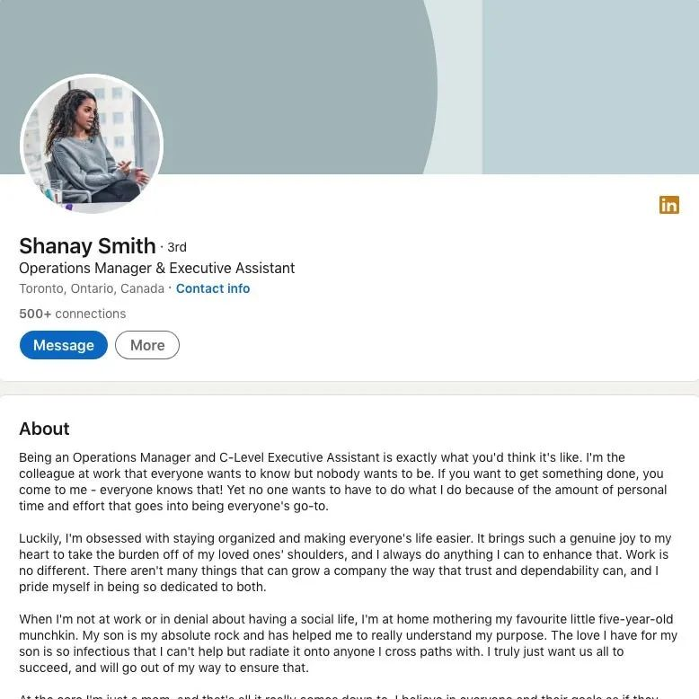

# 无标题

**链接地址:** http://mp.weixin.qq.com/s?__biz=MzI4NDYyNjAwNw==&mid=2247486473&idx=1&sn=b25968860c5cb4fdac1fd890044fd1b9&chksm=ebf9d131dc8e5827a037157d4642a66acf0cb0b7e351cecc767b5ed1fd1b9409b70614c75d4b&mpshare=1&scene=2&srcid=0924UMrW9XXsNbOFqHk7a0PF&sharer_sharetime=1663985906158&sharer_shareid=77848a6b3852ae4dcb6c74ffee84743c#rd
**作者:** 关注我们
**获取时间:** 2025/8/28 19:29:18
**图片数量:** 22

---

## 原始HTML内容

<section style="box-sizing: border-box;font-size: 16px;"><section style="text-align: left;justify-content: flex-start;display: flex;flex-flow: row nowrap;margin-top: 10px;margin-bottom: 10px;box-sizing: border-box;" powered-by="xiumi.us"><section style="display: inline-block;vertical-align: bottom;width: auto;align-self: flex-end;flex: 0 0 auto;min-width: 5%;max-width: 100%;height: auto;box-sizing: border-box;"><section style="box-sizing: border-box;" powered-by="xiumi.us"><section style="font-size: 12px;color: rgb(240, 244, 250);text-align: justify;box-sizing: border-box;">
 
</section></section></section><section style="display: inline-block;vertical-align: bottom;width: auto;align-self: flex-end;flex: 0 0 auto;min-width: 5%;max-width: 100%;height: auto;margin-left: 10px;box-sizing: border-box;"><section style="margin-bottom: 6px;box-sizing: border-box;" powered-by="xiumi.us"><section style="text-align: justify;color: rgb(237, 128, 15);box-sizing: border-box;">
<strong style="box-sizing: border-box;">点击蓝字 关注我们</strong>
</section></section><section style="box-sizing: border-box;" powered-by="xiumi.us"><section style="border-top: 1px dashed rgb(237, 128, 15);box-sizing: border-box;"><svg viewBox="0 0 1 1" style="float:left;line-height:0;width:0;vertical-align:top;"></svg></section></section></section></section>
 
<section style="text-align: left;justify-content: flex-start;display: flex;flex-flow: row nowrap;margin-top: 10px;margin-bottom: 10px;box-sizing: border-box;" powered-by="xiumi.us"><section style="display: inline-block;width: 100%;vertical-align: top;align-self: flex-start;flex: 0 0 auto;background-color: rgba(187, 222, 251, 0);padding: 27px;box-sizing: border-box;"><section style="text-align: center;box-sizing: border-box;" powered-by="xiumi.us"><section style="max-width: 100%;vertical-align: middle;display: inline-block;line-height: 0;box-sizing: border-box;"></section></section><section style="text-align: justify;box-sizing: border-box;" powered-by="xiumi.us">
 
</section><section style="margin-bottom: 8px;box-sizing: border-box;" powered-by="xiumi.us"><section style="border-top: 1px dashed rgb(161, 167, 195);box-sizing: border-box;"><svg viewBox="0 0 1 1" style="float:left;line-height:0;width:0;vertical-align:top;"></svg></section></section><section style="margin-bottom: 4px;box-sizing: border-box;" powered-by="xiumi.us"><section style="font-size: 12px;color: rgb(240, 244, 250);text-align: justify;box-sizing: border-box;">
<strong style="box-sizing: border-box;">如何安稳度过“试用期”？&nbsp;</strong>
</section></section><section style="text-align: justify;color: rgb(161, 167, 195);font-size: 20px;box-sizing: border-box;" powered-by="xiumi.us">
<strong style="box-sizing: border-box;">北美职场新手入职指南</strong>
</section><section style="text-align: justify;box-sizing: border-box;" powered-by="xiumi.us">
 
</section><section style="text-align: justify;font-size: 14px;color: rgb(84, 82, 82);line-height: 2;letter-spacing: 2px;box-sizing: border-box;" powered-by="xiumi.us">
金秋九月，是北美人力资源市场大幅流动的黄金时节。近期，BadaB 已经从客户朋友们那里收到了许多<strong style="box-sizing: border-box;">斩获理想职位新offer的好消息</strong>，特此在这里恭喜各位，预祝大家<strong style="background-color: rgba(186, 222, 251, 0);box-sizing: border-box;">披荆斩棘，入职顺利，大展拳脚，鹏程万里</strong>！

 

还没有收到job offer的朋友们也不要气馁。近期加拿大全国线上线下正在如火如荼地开展着<strong style="box-sizing: border-box;">各式求职招聘和职场社交活动</strong>。欢迎关注 BadaB 在每个月月底推出的<strong style="box-sizing: border-box;">下月求职招聘活动汇总</strong>，锁定优质就业机会。<strong style="box-sizing: border-box;">好工作千千万，总有一款适合你！</strong>
</section><section style="margin-bottom: 8px;box-sizing: border-box;" powered-by="xiumi.us"><section style="border-top: 1px dashed rgb(161, 167, 195);box-sizing: border-box;"><svg viewBox="0 0 1 1" style="float:left;line-height:0;width:0;vertical-align:top;"></svg></section></section><section style="text-align: justify;font-size: 14px;color: rgb(84, 82, 82);line-height: 2;letter-spacing: 2px;box-sizing: border-box;" powered-by="xiumi.us">
 
</section><section style="justify-content: flex-start;display: flex;flex-flow: row nowrap;box-sizing: border-box;" powered-by="xiumi.us"><section style="display: inline-block;vertical-align: top;width: auto;align-self: flex-start;flex: 100 100 0%;height: auto;box-sizing: border-box;"><section style="text-align: center;margin-top: 10px;margin-bottom: 10px;box-sizing: border-box;" powered-by="xiumi.us"><section style="max-width: 100%;vertical-align: middle;display: inline-block;line-height: 0;box-sizing: border-box;"></section></section></section><section style="display: inline-block;vertical-align: top;width: auto;align-self: flex-start;flex: 100 100 0%;height: auto;margin-left: 20px;box-sizing: border-box;"><section style="text-align: center;margin-top: 10px;margin-bottom: 10px;box-sizing: border-box;" powered-by="xiumi.us"><section style="max-width: 100%;vertical-align: middle;display: inline-block;line-height: 0;box-sizing: border-box;"></section></section></section></section><section style="justify-content: flex-start;display: flex;flex-flow: row nowrap;box-sizing: border-box;" powered-by="xiumi.us"><section style="display: inline-block;vertical-align: top;width: auto;align-self: flex-start;flex: 100 100 0%;height: auto;box-sizing: border-box;"><section style="text-align: center;margin-top: 10px;margin-bottom: 10px;box-sizing: border-box;" powered-by="xiumi.us"><section style="max-width: 100%;vertical-align: middle;display: inline-block;line-height: 0;box-sizing: border-box;"></section></section></section><section style="display: inline-block;vertical-align: top;width: auto;align-self: flex-start;flex: 100 100 0%;height: auto;margin-left: 20px;box-sizing: border-box;"><section style="text-align: center;margin-top: 10px;margin-bottom: 10px;box-sizing: border-box;" powered-by="xiumi.us"><section style="max-width: 100%;vertical-align: middle;display: inline-block;line-height: 0;box-sizing: border-box;"></section></section></section></section><section style="margin: 10px 0%;justify-content: flex-start;display: flex;flex-flow: row nowrap;box-sizing: border-box;" powered-by="xiumi.us"><section style="display: inline-block;width: 100%;vertical-align: top;background-position: 55.6015% 33.1154%;background-repeat: repeat;background-size: 100.637%;background-attachment: scroll;padding: 30px;align-self: flex-start;flex: 0 0 auto;background-image: url(&quot;https://mmbiz.qpic.cn/mmbiz_jpg/cY0qSDjdkFdt5LlAFJIIzRpH9YTlkJU1FR7kQGcpMPSuBEzod8sJmy31o6OPRHzicicpy8fudxdBE0fRC7twsgZw/640?wx_fmt=jpeg&quot;);box-sizing: border-box;"><section style="text-align: justify;justify-content: flex-start;display: flex;flex-flow: row nowrap;box-sizing: border-box;" powered-by="xiumi.us"><section style="display: inline-block;width: 100%;vertical-align: top;background-color: rgba(188, 65, 65, 0.22);padding: 10px;border-width: 0px;border-style: none;border-color: rgb(62, 62, 62);align-self: flex-start;flex: 0 0 auto;box-sizing: border-box;"><section style="text-align: center;color: rgb(255, 255, 255);font-size: 14px;box-sizing: border-box;" powered-by="xiumi.us">
<a target="_blank" href="http://mp.weixin.qq.com/s?__biz=MzI4NDYyNjAwNw==&amp;mid=2247486443&amp;idx=1&amp;sn=30cfcbaabe99c3c38d5cb5efafed2dbe&amp;chksm=ebf9d6d3dc8e5fc5c600926f1dc5bb0c5c8126f6ce27d74e6f49d72a66a8e663d0170cd72b81&amp;scene=21#wechat_redirect" textvalue="2022年9月埃德蒙顿求职招聘活动汇总" linktype="text" imgurl="" imgdata="null" data-itemshowtype="0" tab="innerlink" style="color: rgb(255, 255, 255);" data-linktype="2"><strong style="box-sizing: border-box;">2022年9月埃德蒙顿求职招聘活动汇总</strong></a>
</section></section></section></section></section><section style="text-align: center;font-size: 12px;color: rgba(0, 0, 0, 0.24);box-sizing: border-box;" powered-by="xiumi.us">
（点击文字阅读，上万新工作机会等着你！）
</section><section style="text-align: justify;font-size: 14px;color: rgb(84, 82, 82);line-height: 2;letter-spacing: 2px;box-sizing: border-box;" powered-by="xiumi.us">
 

对于求职中的各位来说，准备好简历和面试的重要性无需赘述。但很多人在拿到job offer后就放松了警惕，觉得只要按时去公司报道，自己的<strong style="box-sizing: border-box;">小饭碗就算是端稳</strong>了。

 

说到这，BadaB 可就要提醒各位打工人：仔细阅读一下自己工作合同上的<strong style="box-sizing: border-box;">“试用期（probation period）条款”</strong>？想要在新岗位上<strong style="box-sizing: border-box;">坐稳</strong>咱还有很长的路要走啊！

 
</section><section style="text-align: center;margin-top: 10px;margin-bottom: 10px;box-sizing: border-box;" powered-by="xiumi.us"><section style="max-width: 100%;vertical-align: middle;display: inline-block;line-height: 0;box-sizing: border-box;"></section></section><section style="text-align: justify;font-size: 14px;color: rgb(84, 82, 82);line-height: 2;letter-spacing: 2px;box-sizing: border-box;" powered-by="xiumi.us">
 

如何在入职时给公司的上司和同事们留下一个<strong style="box-sizing: border-box;">好印象</strong>？如何快速融入公司环境上手企业的制度？北美新人入职有哪些万万不可淌的雷区？今天咱的<strong style="box-sizing: border-box;">《北美职场新手入职指南》</strong>给你来划重点啦！
</section><section style="text-align: justify;box-sizing: border-box;" powered-by="xiumi.us">
 
</section><section style="margin-bottom: 8px;box-sizing: border-box;" powered-by="xiumi.us"><section style="border-top: 1px dashed rgb(161, 167, 195);box-sizing: border-box;"><svg viewBox="0 0 1 1" style="float:left;line-height:0;width:0;vertical-align:top;"></svg></section></section></section></section><section style="text-align: center;justify-content: center;display: flex;flex-flow: row nowrap;margin-top: 10px;margin-bottom: 10px;box-sizing: border-box;" powered-by="xiumi.us"><section style="display: inline-block;width: 91%;vertical-align: top;align-self: flex-start;flex: 0 0 auto;height: auto;box-sizing: border-box;"><section style="box-sizing: border-box;" powered-by="xiumi.us"><section style="font-size: 12px;color: rgb(237, 128, 15);text-align: justify;box-sizing: border-box;">
&nbsp;NO.1&nbsp; &nbsp; <strong style="box-sizing: border-box;">准备一段可长可短的自我介绍</strong>
</section></section><section style="text-align: justify;box-sizing: border-box;" powered-by="xiumi.us">
 
</section><section style="text-align: justify;font-size: 14px;color: rgb(84, 82, 82);line-height: 2;letter-spacing: 2px;box-sizing: border-box;" powered-by="xiumi.us">
当你收到offer的那一刻是否侥幸想过“终于可以和那段尴尬的自我介绍说再见了”？不要天真，新人入职阶段的你将有<strong style="box-sizing: border-box;">更多地机会向公司的同事们介绍自己</strong>。请准备好一段可长可短的自我介绍。相比起面试时对于个人才能和经历的凸显，入职个人介绍则需要稳重谦虚一些。相信我，你将有<strong style="box-sizing: border-box;">无数的机会需要用到它</strong>。

 
</section><section style="margin-top: 10px;margin-bottom: 10px;box-sizing: border-box;" powered-by="xiumi.us"><section style="max-width: 100%;vertical-align: middle;display: inline-block;line-height: 0;box-sizing: border-box;"></section></section><section style="text-align: justify;box-sizing: border-box;" powered-by="xiumi.us">
 
</section><section style="margin-bottom: 8px;box-sizing: border-box;" powered-by="xiumi.us"><section style="border-top: 1px dashed rgb(161, 167, 195);box-sizing: border-box;"><svg viewBox="0 0 1 1" style="float:left;line-height:0;width:0;vertical-align:top;"></svg></section></section></section></section><section style="text-align: center;justify-content: center;display: flex;flex-flow: row nowrap;margin-top: 10px;margin-bottom: 10px;box-sizing: border-box;" powered-by="xiumi.us"><section style="display: inline-block;width: 91%;vertical-align: top;align-self: flex-start;flex: 0 0 auto;height: auto;box-sizing: border-box;"><section style="box-sizing: border-box;" powered-by="xiumi.us"><section style="font-size: 12px;color: rgb(237, 128, 15);text-align: justify;box-sizing: border-box;">
&nbsp;NO.2&nbsp; &nbsp; <strong style="box-sizing: border-box;">比同事们穿着再正式一点</strong>
</section></section><section style="text-align: justify;box-sizing: border-box;" powered-by="xiumi.us">
 
</section><section style="text-align: justify;font-size: 14px;color: rgb(84, 82, 82);line-height: 2;letter-spacing: 2px;box-sizing: border-box;" powered-by="xiumi.us">
我的职位属性不需要每天出席重要场合见客户，那么作为职场新人的我是不是就可以在穿着上尽情放飞自我呢？当然不行！人靠衣装马靠鞍，<strong style="box-sizing: border-box;">大方得体的正式职业着装</strong>不仅能够体现你<strong style="box-sizing: border-box;">对这份工作和同事的的尊重</strong>，更重要的是时刻提醒你以最饱满上进的姿态去面对这个来之不易的工作机会，让你更加从容自信地进入工作状态。
</section><section style="text-align: justify;box-sizing: border-box;" powered-by="xiumi.us">
 
</section><section style="margin-bottom: 8px;box-sizing: border-box;" powered-by="xiumi.us"><section style="border-top: 1px dashed rgb(161, 167, 195);box-sizing: border-box;"><svg viewBox="0 0 1 1" style="float:left;line-height:0;width:0;vertical-align:top;"></svg></section></section></section></section><section style="text-align: center;justify-content: center;display: flex;flex-flow: row nowrap;margin-top: 10px;margin-bottom: 10px;box-sizing: border-box;" powered-by="xiumi.us"><section style="display: inline-block;width: 91%;vertical-align: top;align-self: flex-start;flex: 0 0 auto;height: auto;box-sizing: border-box;"><section style="box-sizing: border-box;" powered-by="xiumi.us"><section style="font-size: 12px;color: rgb(237, 128, 15);text-align: justify;box-sizing: border-box;">
&nbsp;NO.3&nbsp; &nbsp; <strong style="box-sizing: border-box;">比报道时间早到一点</strong>
</section></section><section style="text-align: justify;box-sizing: border-box;" powered-by="xiumi.us">
 
</section><section style="text-align: justify;font-size: 14px;color: rgb(84, 82, 82);line-height: 2;letter-spacing: 2px;box-sizing: border-box;" powered-by="xiumi.us">
一些职位的报道时间根据HR的安排，可能会比公司的正式上班时间稍晚一些。其实作为入职新人的你没有必要非要掐着表准点抵达，提前到公司<strong style="box-sizing: border-box;">熟悉工作环境，和同事认识一下</strong>也是一个不错的选择。请给自己布置一个小目标：在就职的前三天尽可能认全<strong style="box-sizing: border-box;">部门内所有同事的名字和职位</strong>吧！ 
</section><section style="text-align: justify;box-sizing: border-box;" powered-by="xiumi.us">
 
</section><section style="margin-bottom: 8px;box-sizing: border-box;" powered-by="xiumi.us"><section style="border-top: 1px dashed rgb(161, 167, 195);box-sizing: border-box;"><svg viewBox="0 0 1 1" style="float:left;line-height:0;width:0;vertical-align:top;"></svg></section></section></section></section><section style="text-align: center;justify-content: center;display: flex;flex-flow: row nowrap;margin-top: 10px;margin-bottom: 10px;box-sizing: border-box;" powered-by="xiumi.us"><section style="display: inline-block;width: 91%;vertical-align: top;align-self: flex-start;flex: 0 0 auto;height: auto;box-sizing: border-box;"><section style="box-sizing: border-box;" powered-by="xiumi.us"><section style="font-size: 12px;color: rgb(237, 128, 15);text-align: justify;box-sizing: border-box;">
&nbsp;NO.4&nbsp; &nbsp; <strong style="box-sizing: border-box;">和直属领导 1-on-1 正式会面</strong>
</section></section><section style="text-align: justify;box-sizing: border-box;" powered-by="xiumi.us">
 
</section><section style="text-align: justify;font-size: 14px;color: rgb(84, 82, 82);line-height: 2;letter-spacing: 2px;box-sizing: border-box;" powered-by="xiumi.us">
千万别在报道第一天，傻乎乎一屁股坐在自己工位上就开始闷头干活。如果有机会和直属领导<strong style="box-sizing: border-box;">面对面 1-on-1的正式谈话</strong>，请一定要抓住！和他明确项目小组的工作计划和目标，了解公司的规章制度、上司的管理方式、对新员工的要求…更重要的是仔细观察他<strong style="box-sizing: border-box;">为人处世的工作方式</strong>，将对你及时调整入职的工作状态有着绝佳的助推。

 
</section><section style="margin-top: 10px;margin-bottom: 10px;box-sizing: border-box;" powered-by="xiumi.us"><section style="max-width: 100%;vertical-align: middle;display: inline-block;line-height: 0;box-sizing: border-box;"></section></section><section style="text-align: justify;box-sizing: border-box;" powered-by="xiumi.us">
 
</section><section style="margin-bottom: 8px;box-sizing: border-box;" powered-by="xiumi.us"><section style="border-top: 1px dashed rgb(161, 167, 195);box-sizing: border-box;"><svg viewBox="0 0 1 1" style="float:left;line-height:0;width:0;vertical-align:top;"></svg></section></section></section></section>
 
<section style="margin-top: 10px;margin-bottom: 10px;text-align: center;box-sizing: border-box;" powered-by="xiumi.us"><section style="display: inline-block;text-align: left;width: 100%;box-sizing: border-box;"><section style="display: inline-block;padding: 3px 8px;margin-right: 0.5em;margin-left: 1em;border-radius: 4px;background-color: rgb(237, 128, 15);color: rgb(255, 255, 255);box-sizing: border-box;">
<strong style="box-sizing: border-box;">职场小知识</strong>
</section><section style="display: inline-block;padding: 3px 8px;border-radius: 1.2em;background-color: rgb(204, 204, 204);color: rgb(255, 255, 255);box-sizing: border-box;">
<strong style="box-sizing: border-box;">试用期会被随意“炒鱿鱼”吗？</strong>
</section><section style="border-width: 1px;border-style: solid;border-color: rgb(192, 200, 209);margin-top: -1em;padding: 20px 10px 10px;background-color: rgb(239, 239, 239);text-align: center;box-sizing: border-box;"><section style="text-align: justify;padding-right: 15px;padding-left: 15px;box-sizing: border-box;" powered-by="xiumi.us">
 

刚入职时职场新人们总在担心老板是不是可以随意拍板，毫不费力就把试用期员工炒了鱿鱼？

 

在普遍情况下，一个负责任的雇主想要在试用期内合理解雇新人，雇主需要提供证据以证实新人不适合该职位；同时还要有证据表明，雇主一旦发现新人的不足，要在试用期内对新人提出，并给予其改善的机会。若没有这样的证据，则<strong style="box-sizing: border-box;">有风险面临非法解雇的诉讼案</strong>。

 

所以，初入职场的毕业生新人没必要整日提心吊胆去恐惧自己是否会被无辜炒鱿鱼；而雇主也不要在对新人的能力判断不准确情况下随意辞退员工。虽然辞退试用期的员工<strong style="box-sizing: border-box;">不需要提前通知，也无需支付辞退费用</strong>，但在加拿大<strong style="box-sizing: border-box;">招聘和培训一个岗位的成本很高</strong>，为了节省这点补偿款来回折腾，可实在划不来！

 
</section></section></section></section>
 
<section style="text-align: center;justify-content: center;display: flex;flex-flow: row nowrap;margin-top: 10px;margin-bottom: 10px;box-sizing: border-box;" powered-by="xiumi.us"><section style="display: inline-block;width: 91%;vertical-align: top;align-self: flex-start;flex: 0 0 auto;height: auto;box-sizing: border-box;"><section style="margin-bottom: 8px;box-sizing: border-box;" powered-by="xiumi.us"><section style="border-top: 1px dashed rgb(161, 167, 195);box-sizing: border-box;"><svg viewBox="0 0 1 1" style="float:left;line-height:0;width:0;vertical-align:top;"></svg></section></section><section style="box-sizing: border-box;" powered-by="xiumi.us"><section style="font-size: 12px;color: rgb(237, 128, 15);text-align: justify;box-sizing: border-box;">
&nbsp;NO.5&nbsp; &nbsp; <strong style="box-sizing: border-box;">仔细研读入职文件/章程</strong>
</section></section><section style="text-align: justify;box-sizing: border-box;" powered-by="xiumi.us">
 
</section><section style="text-align: justify;font-size: 14px;color: rgb(84, 82, 82);line-height: 2;letter-spacing: 2px;box-sizing: border-box;" powered-by="xiumi.us">
一般入职的新人不会在工作的第一天就接到大量需要上手的工作，那么就要好好利用这个时间<strong style="box-sizing: border-box;">把入职文件和章程仔细过一遍</strong>。不能完全读懂记牢也没有关系，能<strong style="box-sizing: border-box;">做到心中有谱</strong>就好。这将快速帮助你掌握企业文化和工作理念。<strong style="box-sizing: border-box;">遇到问题也不要害怕请教同事</strong>，这也是一个帮助你了解公司人事环境和融入团队的好机会。
</section><section style="text-align: justify;box-sizing: border-box;" powered-by="xiumi.us">
 
</section><section style="margin-bottom: 8px;box-sizing: border-box;" powered-by="xiumi.us"><section style="border-top: 1px dashed rgb(161, 167, 195);box-sizing: border-box;"><svg viewBox="0 0 1 1" style="float:left;line-height:0;width:0;vertical-align:top;"></svg></section></section></section></section><section style="text-align: center;justify-content: center;display: flex;flex-flow: row nowrap;margin-top: 10px;margin-bottom: 10px;box-sizing: border-box;" powered-by="xiumi.us"><section style="display: inline-block;width: 91%;vertical-align: top;align-self: flex-start;flex: 0 0 auto;height: auto;box-sizing: border-box;"><section style="box-sizing: border-box;" powered-by="xiumi.us"><section style="font-size: 12px;color: rgb(237, 128, 15);text-align: justify;box-sizing: border-box;">
&nbsp;NO.6&nbsp; &nbsp; <strong style="box-sizing: border-box;">完成自己的入职计划</strong>
</section></section><section style="text-align: justify;box-sizing: border-box;" powered-by="xiumi.us">
 
</section><section style="text-align: justify;font-size: 14px;color: rgb(84, 82, 82);line-height: 2;letter-spacing: 2px;box-sizing: border-box;" powered-by="xiumi.us">
大型公司通常会为新员工设定需要履行的入职计划，这样只需要一步步完成项目就可以顺利“熬”过入职流程。但一些入职小企业的打工人们就没有这么幸运了：没有导师的带领，甚至入职流程都很混乱。这时候作为岗位新人就需要自己去<strong style="box-sizing: border-box;">记录和整理入职后的各项流程</strong>。<strong style="box-sizing: border-box;">养成多做记录和总结的好习惯</strong>，这样在述职过程中才会让你感到更加得心应手。

 
</section><section style="margin-top: 10px;margin-bottom: 10px;box-sizing: border-box;" powered-by="xiumi.us"><section style="max-width: 100%;vertical-align: middle;display: inline-block;line-height: 0;box-sizing: border-box;"></section></section><section style="margin-bottom: 8px;box-sizing: border-box;" powered-by="xiumi.us"><section style="border-top: 1px dashed rgb(161, 167, 195);box-sizing: border-box;"><svg viewBox="0 0 1 1" style="float:left;line-height:0;width:0;vertical-align:top;"></svg></section></section></section></section><section style="text-align: center;justify-content: center;display: flex;flex-flow: row nowrap;margin-top: 10px;margin-bottom: 10px;box-sizing: border-box;" powered-by="xiumi.us"><section style="display: inline-block;width: 91%;vertical-align: top;align-self: flex-start;flex: 0 0 auto;height: auto;box-sizing: border-box;"><section style="box-sizing: border-box;" powered-by="xiumi.us"><section style="font-size: 12px;color: rgb(237, 128, 15);text-align: justify;box-sizing: border-box;">
&nbsp;NO.7&nbsp;&nbsp;&nbsp;<strong style="box-sizing: border-box;">也适时给自己“喂点饼”</strong>
</section></section><section style="text-align: justify;box-sizing: border-box;" powered-by="xiumi.us">
 
</section><section style="text-align: justify;font-size: 14px;color: rgb(84, 82, 82);line-height: 2;letter-spacing: 2px;box-sizing: border-box;" powered-by="xiumi.us">
那些写在公司官网上装点门面的Vision &amp; Mission 和咱这些小兵小卒也有关系吗？当然！当你的导师、上司和同事都被繁忙的工作困住，抽不出时间来培训你的入职流程，要<strong style="box-sizing: border-box;">学会给自己“打鸡血”</strong>。能够获取一份新工作总归是一件令人激动的好事儿，请让这股正能量<strong style="box-sizing: border-box;">鼓励你提高职场表现，做出更长远的事业规划</strong>。
</section><section style="text-align: justify;box-sizing: border-box;" powered-by="xiumi.us">
 
</section><section style="margin-bottom: 8px;box-sizing: border-box;" powered-by="xiumi.us"><section style="border-top: 1px dashed rgb(161, 167, 195);box-sizing: border-box;"><svg viewBox="0 0 1 1" style="float:left;line-height:0;width:0;vertical-align:top;"></svg></section></section></section></section><section style="text-align: center;justify-content: center;display: flex;flex-flow: row nowrap;margin-top: 10px;margin-bottom: 10px;box-sizing: border-box;" powered-by="xiumi.us"><section style="display: inline-block;width: 91%;vertical-align: top;align-self: flex-start;flex: 0 0 auto;height: auto;box-sizing: border-box;"><section style="box-sizing: border-box;" powered-by="xiumi.us"><section style="font-size: 12px;color: rgb(237, 128, 15);text-align: justify;box-sizing: border-box;">
&nbsp;NO.8&nbsp; &nbsp; <strong style="box-sizing: border-box;">多听多看多学多做，多互动！</strong>
</section></section><section style="text-align: justify;box-sizing: border-box;" powered-by="xiumi.us">
 
</section><section style="text-align: justify;font-size: 14px;color: rgb(84, 82, 82);line-height: 2;letter-spacing: 2px;box-sizing: border-box;" powered-by="xiumi.us">
很多新入职的朋友总会进入一个误区：我需要多表现自己来<strong style="box-sizing: border-box;">尽力刷满自己的存在感</strong>。但其实，你需要的是尽快让自己成功融入团队，积极成为团队中不可分割的一分子。以<strong style="box-sizing: border-box;">谦逊务实的姿态去做好自己的本职工作</strong>，平稳度过自己的试用期才是职场新人们的生存之道呀！

 
</section><section style="margin-top: 10px;margin-bottom: 10px;box-sizing: border-box;" powered-by="xiumi.us"><section style="max-width: 100%;vertical-align: middle;display: inline-block;line-height: 0;box-sizing: border-box;"></section></section><section style="margin-bottom: 8px;box-sizing: border-box;" powered-by="xiumi.us"><section style="border-top: 1px dashed rgb(161, 167, 195);box-sizing: border-box;"><svg viewBox="0 0 1 1" style="float:left;line-height:0;width:0;vertical-align:top;"></svg></section></section></section></section><section style="margin-top: 20px;margin-right: 0%;margin-left: 0%;box-sizing: border-box;" powered-by="xiumi.us"><section style="padding-right: 20px;padding-left: 20px;font-size: 14px;color: rgb(121, 121, 121);line-height: 2;letter-spacing: 2px;box-sizing: border-box;">
 

想要了解更多关于<strong style="box-sizing: border-box;">《如何在加拿大度过新岗位的试用期》</strong>？请扫描下方二维码进入我们的20门在线求职网课进行学习：

 

<strong style="box-sizing: border-box;">第二模块第14章节</strong>

<strong style="box-sizing: border-box;">《The First 90 Days of Starting Your&nbsp;NEW JOB》</strong>

 
</section></section><section style="text-align: center;margin-top: 10px;margin-bottom: 10px;box-sizing: border-box;" powered-by="xiumi.us"><section style="max-width: 100%;vertical-align: middle;display: inline-block;line-height: 0;width: 50%;height: auto;box-sizing: border-box;"></section></section><section style="text-align: center;margin-top: 10px;margin-bottom: 10px;box-sizing: border-box;" powered-by="xiumi.us"><section style="max-width: 100%;vertical-align: middle;display: inline-block;line-height: 0;width: 90%;height: auto;box-sizing: border-box;"></section></section>
 

 
<section style="margin-top: 10px;margin-bottom: 10px;box-sizing: border-box;" powered-by="xiumi.us"><section style="width: 100%;text-align: left;box-sizing: border-box;"><section style="display: inline-block;vertical-align: top;max-width: 100%;border-radius: 3px 3px 0px 0px;margin-right: 3px;background-color: rgb(237, 128, 15);color: rgb(255, 255, 255);font-size: 18px;padding-left: 6px;padding-right: 6px;box-sizing: border-box;">
<strong style="box-sizing: border-box;">加国毕业生三部曲</strong>
</section> </section><section style="width: 100%;font-size: 0px;margin-top: -2px;box-sizing: border-box;"><section style="display: inline-block;vertical-align: top;width: 100%;margin-right: -6px;border-bottom: 2px solid rgb(237, 128, 15);box-sizing: border-box;"><svg viewBox="0 0 1 1" style="float:left;line-height:0;width:0;vertical-align:top;"></svg></section><section style="display: inline-block;vertical-align: top;margin-top: -2px;width: 6px;height: 6px;border-radius: 50%;background-color: rgb(237, 128, 15);box-sizing: border-box;"><svg viewBox="0 0 1 1" style="float:left;line-height:0;width:0;vertical-align:top;"></svg></section></section></section><section style="margin: 10px 0%;text-align: left;justify-content: flex-start;display: flex;flex-flow: row nowrap;box-sizing: border-box;" powered-by="xiumi.us"><section style="display: inline-block;width: 100%;vertical-align: top;background-position: 55.6015% 33.1154%;background-repeat: repeat;background-size: 100.637%;background-attachment: scroll;padding: 30px;align-self: flex-start;flex: 0 0 auto;background-image: url(&quot;https://mmbiz.qpic.cn/mmbiz_jpg/cY0qSDjdkFdt5LlAFJIIzRpH9YTlkJU18oxvP5JECyJzicLIn7GrFGBtTpB1wbLtn13UukhZ6kUHAEPeo1ke4Dw/640?wx_fmt=jpeg&quot;);box-sizing: border-box;"><section style="text-align: justify;justify-content: flex-start;display: flex;flex-flow: row nowrap;box-sizing: border-box;" powered-by="xiumi.us"><section style="display: inline-block;width: 100%;vertical-align: top;background-color: rgba(188, 65, 65, 0.22);padding: 10px;border-width: 0px;border-style: none;border-color: rgb(62, 62, 62);align-self: flex-start;flex: 0 0 auto;box-sizing: border-box;"><section style="text-align: center;color: rgb(255, 255, 255);font-size: 14px;box-sizing: border-box;" powered-by="xiumi.us">
<a target="_blank" href="http://mp.weixin.qq.com/s?__biz=MzI4NDYyNjAwNw==&amp;mid=2247486117&amp;idx=1&amp;sn=728a5644a917bf5f7e1f4ec0776246fc&amp;chksm=ebf9d79ddc8e5e8b25ba1c5f0f3625a43029b72eb72117f55c4d6183e9ce71e9e0c6818989e9&amp;scene=21#wechat_redirect" textvalue="没进“大厂”就一定输在起跑线上？进入中小企业的你也可以这样“逆风翻盘”！" linktype="text" imgurl="" imgdata="null" data-itemshowtype="0" tab="innerlink" style="color: rgb(255, 255, 255);" data-linktype="2"><strong style="box-sizing: border-box;">没进“大厂”就一定输在起跑线上？进入中小企业的你也可以这样“逆风翻盘”！</strong></a>
</section></section></section></section></section><section style="margin: 10px 0%;text-align: left;justify-content: flex-start;display: flex;flex-flow: row nowrap;box-sizing: border-box;" powered-by="xiumi.us"><section style="display: inline-block;width: 100%;vertical-align: top;background-position: 55.6015% 33.1154%;background-repeat: repeat;background-size: 100.637%;background-attachment: scroll;padding: 30px;align-self: flex-start;flex: 0 0 auto;background-image: url(&quot;https://mmbiz.qpic.cn/mmbiz_jpg/cY0qSDjdkFdt5LlAFJIIzRpH9YTlkJU1zPkvja9Ea2rP8YmQJ7osSUg5ahoMuicsDuTBEI3ibbzP8GV9JgGrWjOg/640?wx_fmt=jpeg&quot;);box-sizing: border-box;"><section style="text-align: justify;justify-content: flex-start;display: flex;flex-flow: row nowrap;box-sizing: border-box;" powered-by="xiumi.us"><section style="display: inline-block;width: 100%;vertical-align: top;background-color: rgba(188, 65, 65, 0.22);padding: 10px;border-width: 0px;border-style: none;border-color: rgb(62, 62, 62);align-self: flex-start;flex: 0 0 auto;box-sizing: border-box;"><section style="text-align: center;color: rgb(255, 255, 255);font-size: 14px;box-sizing: border-box;" powered-by="xiumi.us">
<a target="_blank" href="http://mp.weixin.qq.com/s?__biz=MzI4NDYyNjAwNw==&amp;mid=2247485987&amp;idx=1&amp;sn=15a549094265e02d66d5ff972b6352a3&amp;chksm=ebf9d71bdc8e5e0d21f43a162ab819dea01ee12bb0b5355b2f3abacf5adee5a288b9aa4a66cb&amp;scene=21#wechat_redirect" textvalue="“大城市 vs. 小城市”？刚毕业的我该怎么选？" linktype="text" imgurl="" imgdata="null" data-itemshowtype="0" tab="innerlink" style="color: rgb(255, 255, 255);" data-linktype="2"><strong style="box-sizing: border-box;">“大城市 vs. 小城市”？</strong></a>

<a target="_blank" href="http://mp.weixin.qq.com/s?__biz=MzI4NDYyNjAwNw==&amp;mid=2247485987&amp;idx=1&amp;sn=15a549094265e02d66d5ff972b6352a3&amp;chksm=ebf9d71bdc8e5e0d21f43a162ab819dea01ee12bb0b5355b2f3abacf5adee5a288b9aa4a66cb&amp;scene=21#wechat_redirect" textvalue="“大城市 vs. 小城市”？刚毕业的我该怎么选？" linktype="text" imgurl="" imgdata="null" data-itemshowtype="0" tab="innerlink" style="color: rgb(255, 255, 255);" data-linktype="2"><strong style="box-sizing: border-box;">刚毕业的我该怎么选？</strong></a>
</section></section></section></section></section><section style="margin: 10px 0%;text-align: left;justify-content: flex-start;display: flex;flex-flow: row nowrap;box-sizing: border-box;" powered-by="xiumi.us"><section style="display: inline-block;width: 100%;vertical-align: top;background-position: 55.6015% 33.1154%;background-repeat: repeat;background-size: 100.637%;background-attachment: scroll;padding: 30px;align-self: flex-start;flex: 0 0 auto;background-image: url(&quot;https://mmbiz.qpic.cn/mmbiz_jpg/cY0qSDjdkFdt5LlAFJIIzRpH9YTlkJU1yHCfZKHMZdvyEaL7iawzVO8eIoZdaSOicVhTmvBZlByes68aicA38RJMA/640?wx_fmt=jpeg&quot;);box-sizing: border-box;"><section style="text-align: justify;justify-content: flex-start;display: flex;flex-flow: row nowrap;box-sizing: border-box;" powered-by="xiumi.us"><section style="display: inline-block;width: 100%;vertical-align: top;background-color: rgba(188, 65, 65, 0.22);padding: 10px;border-width: 0px;border-style: none;border-color: rgb(62, 62, 62);align-self: flex-start;flex: 0 0 auto;box-sizing: border-box;"><section style="text-align: center;color: rgb(255, 255, 255);font-size: 14px;box-sizing: border-box;" powered-by="xiumi.us">
<a target="_blank" href="http://mp.weixin.qq.com/s?__biz=MzI4NDYyNjAwNw==&amp;mid=2247486289&amp;idx=1&amp;sn=d60c280650219a7e230bfcde943de96c&amp;chksm=ebf9d669dc8e5f7f92a9a21ba87b555994237e6936d209520ddd913f1b5494f562ec1ea249e9&amp;scene=21#wechat_redirect" textvalue="卷累了！“Gap Year”到底值不值？这份间隔年攻略请收好" linktype="text" imgurl="" imgdata="null" data-itemshowtype="0" tab="innerlink" style="color: rgb(255, 255, 255);" data-linktype="2"><strong style="box-sizing: border-box;">卷累了！“Gap Year”到底值不值？</strong></a>

<a target="_blank" href="http://mp.weixin.qq.com/s?__biz=MzI4NDYyNjAwNw==&amp;mid=2247486289&amp;idx=1&amp;sn=d60c280650219a7e230bfcde943de96c&amp;chksm=ebf9d669dc8e5f7f92a9a21ba87b555994237e6936d209520ddd913f1b5494f562ec1ea249e9&amp;scene=21#wechat_redirect" textvalue="卷累了！“Gap Year”到底值不值？这份间隔年攻略请收好" linktype="text" imgurl="" imgdata="null" data-itemshowtype="0" tab="innerlink" style="color: rgb(255, 255, 255);" data-linktype="2"><strong style="box-sizing: border-box;">这份间隔年攻略请收好</strong></a>
</section></section></section></section></section>
 
<section style="margin: 10px 0%;text-align: left;justify-content: flex-start;display: flex;flex-flow: row nowrap;box-sizing: border-box;" powered-by="xiumi.us"><section style="display: inline-block;width: 100%;vertical-align: top;background-color: rgb(249, 245, 239);padding: 8px;box-shadow: rgb(207, 207, 207) 0.707107px 0.707107px 2px;align-self: flex-start;flex: 0 0 auto;box-sizing: border-box;"><section style="text-align: justify;box-sizing: border-box;" powered-by="xiumi.us">
 
</section><section style="text-align: center;margin-right: 0%;margin-bottom: 20px;margin-left: 0%;justify-content: center;display: flex;flex-flow: row nowrap;box-sizing: border-box;" powered-by="xiumi.us"><section style="display: inline-block;vertical-align: middle;width: 41%;align-self: center;flex: 0 0 auto;box-sizing: border-box;"><section style="justify-content: center;display: flex;flex-flow: row nowrap;box-sizing: border-box;" powered-by="xiumi.us"><section style="display: inline-block;vertical-align: top;width: 50%;box-shadow: rgb(0, 0, 0) 0px 0px 0px;align-self: flex-start;flex: 0 0 auto;box-sizing: border-box;"><section style="margin-right: 0%;margin-left: 0%;box-sizing: border-box;" powered-by="xiumi.us"><section style="padding: 4px;display: inline-block;background-color: rgb(237, 128, 15);box-sizing: border-box;"><section style="border-color: rgb(255, 255, 255);width: 1.6em;height: 1.6em;border-style: solid;border-width: 1px;font-size: 28px;line-height: 1.5em;color: rgb(255, 255, 255);box-sizing: border-box;">
號
</section></section></section></section><section style="display: inline-block;vertical-align: top;width: 50%;align-self: flex-start;flex: 0 0 auto;box-sizing: border-box;"><section style="margin-right: 0%;margin-left: 0%;box-sizing: border-box;" powered-by="xiumi.us"><section style="padding: 4px;display: inline-block;background-color: rgb(237, 128, 15);box-sizing: border-box;"><section style="border-color: white;width: 1.6em;height: 1.6em;border-style: solid;border-width: 1px;font-size: 28px;line-height: 1.5em;color: rgb(255, 255, 255);box-sizing: border-box;">
外
</section></section></section></section></section></section><section style="display: inline-block;vertical-align: middle;width: 59%;align-self: center;flex: 0 0 auto;box-sizing: border-box;"><section style="line-height: 1.4;box-sizing: border-box;" powered-by="xiumi.us">
<strong style="box-sizing: border-box;">小红书，</strong><strong style="font-size: 18px;color: rgb(180, 38, 30);box-sizing: border-box;">我们来啦！</strong>
</section></section></section><section style="text-align: justify;box-sizing: border-box;" powered-by="xiumi.us">
 
</section><section style="text-align: justify;padding-right: 15px;padding-left: 15px;box-sizing: border-box;" powered-by="xiumi.us">
久等了，加拿大的朋友们！BadaB Consulting Inc. 终于入驻小红书啦！<strong style="box-sizing: border-box;">（小红书ID：5288561530）</strong>
</section><section style="text-align: center;margin-top: 10px;margin-bottom: 10px;box-sizing: border-box;" powered-by="xiumi.us"><section style="max-width: 100%;vertical-align: middle;display: inline-block;line-height: 0;box-shadow: rgb(0, 0, 0) 0px 0px 0px;box-sizing: border-box;"></section></section><section style="text-align: center;font-size: 12px;color: rgb(180, 180, 180);box-sizing: border-box;" powered-by="xiumi.us">
扫描二维码即刻关注我们吧！
</section><section style="color: rgb(62, 62, 62);text-align: center;box-sizing: border-box;" powered-by="xiumi.us">
 

<strong style="box-sizing: border-box;">如果你需要一对一</strong>

<strong style="box-sizing: border-box;">职业规划和系统的建议，</strong>

<strong style="box-sizing: border-box;">请找我们！</strong>

 

<strong style="box-sizing: border-box;"></strong><strong style="box-sizing: border-box;">如果你需要修改简历和cover letter，</strong>

<strong style="box-sizing: border-box;">培训面试，建立LinkedIn主页</strong><strong style="box-sizing: border-box;"></strong>

<strong style="box-sizing: border-box;">请找我们！</strong>

 

<strong style="box-sizing: border-box;">如果你需要来自</strong>

<strong style="box-sizing: border-box;">人力资源顾问的</strong><strong style="box-sizing: border-box;">模拟面试，</strong>

<strong style="box-sizing: border-box;">请找我们！</strong>

 
</section><section style="justify-content: flex-start;display: flex;flex-flow: row nowrap;margin-top: 10px;margin-bottom: 10px;box-sizing: border-box;" powered-by="xiumi.us"><section style="display: inline-block;vertical-align: middle;width: auto;align-self: center;flex: 100 100 0%;padding-left: 10px;height: auto;box-sizing: border-box;"><section style="transform: rotateZ(357deg);-webkit-transform: rotateZ(357deg);-moz-transform: rotateZ(357deg);-o-transform: rotateZ(357deg);box-sizing: border-box;" powered-by="xiumi.us"><section style="justify-content: flex-start;display: flex;flex-flow: row nowrap;box-sizing: border-box;"><section style="display: inline-block;width: 100%;vertical-align: top;align-self: flex-start;flex: 0 0 auto;box-sizing: border-box;"><section style="text-align: center;margin-top: 10px;margin-bottom: -10px;isolation: isolate;box-sizing: border-box;" powered-by="xiumi.us"><section style="max-width: 100%;vertical-align: middle;display: inline-block;line-height: 0;width: 23px;height: auto;box-sizing: border-box;"></section></section><section style="text-align: center;justify-content: center;display: flex;flex-flow: row nowrap;margin-bottom: 10px;box-sizing: border-box;" powered-by="xiumi.us"><section style="display: inline-block;width: 100%;vertical-align: top;align-self: flex-start;flex: 0 0 auto;background-color: rgb(255, 255, 255);padding: 15px 15px 20px;height: auto;box-shadow: rgb(147, 147, 147) 0px 0px 5px;box-sizing: border-box;"><section style="margin-bottom: 20px;box-sizing: border-box;" powered-by="xiumi.us"><section style="max-width: 100%;vertical-align: middle;display: inline-block;line-height: 0;box-sizing: border-box;"></section></section></section></section></section></section></section></section><section style="display: inline-block;vertical-align: middle;width: 45%;align-self: center;flex: 0 0 auto;height: auto;margin-right: -15px;margin-left: -15px;z-index: 3;box-sizing: border-box;"><section style="transform: rotateZ(5deg);-webkit-transform: rotateZ(5deg);-moz-transform: rotateZ(5deg);-o-transform: rotateZ(5deg);box-sizing: border-box;" powered-by="xiumi.us"><section style="justify-content: flex-start;display: flex;flex-flow: row nowrap;box-sizing: border-box;"><section style="display: inline-block;width: 100%;vertical-align: top;align-self: flex-start;flex: 0 0 auto;box-sizing: border-box;"><section style="text-align: center;margin-top: 10px;margin-bottom: -10px;isolation: isolate;box-sizing: border-box;" powered-by="xiumi.us"><section style="max-width: 100%;vertical-align: middle;display: inline-block;line-height: 0;width: 23px;height: auto;box-sizing: border-box;"></section></section><section style="text-align: center;justify-content: center;display: flex;flex-flow: row nowrap;margin-bottom: 10px;box-sizing: border-box;" powered-by="xiumi.us"><section style="display: inline-block;width: 100%;vertical-align: top;align-self: flex-start;flex: 0 0 auto;background-color: rgb(255, 255, 255);padding: 17px 17px 20px;height: auto;box-shadow: rgb(147, 147, 147) 0px 0px 5px;box-sizing: border-box;"><section style="margin-bottom: 20px;box-sizing: border-box;" powered-by="xiumi.us"><section style="max-width: 100%;vertical-align: middle;display: inline-block;line-height: 0;box-sizing: border-box;"></section></section></section></section></section></section></section></section><section style="display: inline-block;vertical-align: middle;width: auto;align-self: center;flex: 100 100 0%;height: auto;padding-right: 10px;box-sizing: border-box;"><section style="transform: rotateZ(357deg);-webkit-transform: rotateZ(357deg);-moz-transform: rotateZ(357deg);-o-transform: rotateZ(357deg);box-sizing: border-box;" powered-by="xiumi.us"><section style="justify-content: flex-start;display: flex;flex-flow: row nowrap;box-sizing: border-box;"><section style="display: inline-block;width: 100%;vertical-align: top;align-self: flex-start;flex: 0 0 auto;box-sizing: border-box;"><section style="text-align: center;margin-top: 10px;margin-bottom: -10px;isolation: isolate;box-sizing: border-box;" powered-by="xiumi.us"><section style="max-width: 100%;vertical-align: middle;display: inline-block;line-height: 0;width: 23px;height: auto;box-sizing: border-box;"></section></section><section style="text-align: center;justify-content: center;display: flex;flex-flow: row nowrap;margin-bottom: 10px;box-sizing: border-box;" powered-by="xiumi.us"><section style="display: inline-block;width: 100%;vertical-align: top;align-self: flex-start;flex: 0 0 auto;background-color: rgb(255, 255, 255);padding: 15px 15px 20px;height: auto;box-shadow: rgb(147, 147, 147) 0px 0px 5px;box-sizing: border-box;"><section style="margin-bottom: 20px;box-sizing: border-box;" powered-by="xiumi.us"><section style="max-width: 100%;vertical-align: middle;display: inline-block;line-height: 0;box-sizing: border-box;"></section></section></section></section></section></section></section></section></section><section style="color: rgb(62, 62, 62);text-align: center;box-sizing: border-box;" powered-by="xiumi.us">
 
</section><section style="text-align: justify;padding-right: 15px;padding-left: 15px;box-sizing: border-box;" powered-by="xiumi.us">
BadaB会不定期地在小红书主页上更新大家最想了解的<strong style="box-sizing: border-box;">北美职场经验和建议</strong>，还有一些<strong style="box-sizing: border-box;">内部的岗位招聘信</strong>息哦~希望找工作和就业中的打工人们关注我学起来！<strong style="box-sizing: border-box;">让我们一起在职场中乘风破浪，披荆斩棘吧！</strong>
</section><section style="text-align: justify;box-sizing: border-box;" powered-by="xiumi.us">
 
</section></section></section>
 
<section style="margin: 10px 0%;text-align: center;justify-content: center;display: flex;flex-flow: row nowrap;box-sizing: border-box;" powered-by="xiumi.us"><section style="display: inline-block;width: 100%;vertical-align: top;background-color: rgba(255, 174, 174, 0.13);padding-right: 10px;padding-left: 10px;align-self: flex-start;flex: 0 0 auto;box-sizing: border-box;"><section style="display: flex;flex-flow: row nowrap;margin: -5px 0%;justify-content: center;box-sizing: border-box;" powered-by="xiumi.us"><section style="display: inline-block;width: auto;vertical-align: middle;min-width: 10%;max-width: 100%;flex: 0 0 auto;height: auto;border-style: solid;border-width: 1px;border-color: rgb(237, 128, 15);padding: 4px;background-color: rgb(255, 255, 255);box-shadow: rgb(255, 255, 255) 0px 0px 0px inset;align-self: center;box-sizing: border-box;"><section style="justify-content: center;display: flex;flex-flow: row nowrap;box-sizing: border-box;" powered-by="xiumi.us"><section style="display: inline-block;width: 100%;vertical-align: top;border-width: 0px;background-color: rgba(255, 174, 174, 0.13);padding-right: 10px;padding-left: 10px;align-self: flex-start;flex: 0 0 auto;box-sizing: border-box;"><section style="color: rgb(106, 106, 106);letter-spacing: 1px;text-align: justify;box-sizing: border-box;" powered-by="xiumi.us">
<strong style="box-sizing: border-box;">关于我们</strong>
</section></section></section></section></section></section></section>
 
<section style="text-align: center;margin: 10px 0%;justify-content: center;display: flex;flex-flow: row nowrap;box-sizing: border-box;" powered-by="xiumi.us"><section style="display: inline-block;width: 90%;vertical-align: top;border-style: solid;border-width: 2px;border-color: rgb(237, 128, 15);letter-spacing: 0px;padding: 10px;align-self: flex-start;flex: 0 0 auto;box-sizing: border-box;"><section style="justify-content: center;display: flex;flex-flow: row nowrap;box-sizing: border-box;" powered-by="xiumi.us"><section style="display: inline-block;vertical-align: middle;width: 40%;align-self: center;flex: 0 0 auto;box-sizing: border-box;"><section style="margin-right: 0%;margin-left: 0%;box-sizing: border-box;" powered-by="xiumi.us"><section style="max-width: 100%;vertical-align: middle;display: inline-block;line-height: 0;border-width: 0px;width: 100%;box-sizing: border-box;"></section></section></section><section style="display: inline-block;vertical-align: middle;width: 60%;padding-left: 10px;align-self: center;flex: 0 0 auto;box-sizing: border-box;"><section style="margin-right: 0%;margin-bottom: 5px;margin-left: 0%;box-sizing: border-box;" powered-by="xiumi.us"><section style="display: inline-block;border-width: 2px;border-style: solid;border-color: rgb(237, 128, 15);padding: 0.1em 0.3em;background-color: rgb(237, 128, 15);color: rgb(255, 255, 255);font-size: 12px;box-sizing: border-box;">
<strong style="box-sizing: border-box;">Ada&nbsp; Tai</strong>
</section></section><section style="margin-right: 0%;margin-left: 0%;box-sizing: border-box;" powered-by="xiumi.us"><section style="font-size: 13px;box-sizing: border-box;">
<strong style="box-sizing: border-box;">MBA, CPHR, SHRM-SCP</strong>
</section></section><section style="justify-content: center;display: flex;flex-flow: row nowrap;box-sizing: border-box;" powered-by="xiumi.us"><section style="display: inline-block;vertical-align: middle;width: 10%;border-width: 0px;align-self: center;flex: 0 0 auto;box-sizing: border-box;"><section style="margin: 5px 0%;text-align: left;font-size: 0px;box-sizing: border-box;" powered-by="xiumi.us"><section style="padding: 4px;display: inline-block;background-color: rgb(237, 128, 15);box-sizing: border-box;"><section style="border-color: rgba(255, 255, 255, 0);width: 1.6em;height: 1.6em;border-style: solid;border-width: 1px;text-align: center;line-height: 1.5em;color: rgb(255, 255, 255);box-sizing: border-box;">
 
</section></section></section></section><section style="display: inline-block;vertical-align: middle;width: 90%;align-self: center;flex: 0 0 auto;box-sizing: border-box;"><section style="font-size: 12px;text-align: justify;box-sizing: border-box;" powered-by="xiumi.us">
修改简历与求职信
</section></section></section><section style="justify-content: center;display: flex;flex-flow: row nowrap;box-sizing: border-box;" powered-by="xiumi.us"><section style="display: inline-block;vertical-align: middle;width: 10%;align-self: center;flex: 0 0 auto;box-sizing: border-box;"><section style="margin: 5px 0%;text-align: left;font-size: 0px;box-sizing: border-box;" powered-by="xiumi.us"><section style="padding: 4px;display: inline-block;background-color: rgb(237, 128, 15);box-sizing: border-box;"><section style="border-color: rgba(255, 255, 255, 0);width: 1.6em;height: 1.6em;border-style: solid;border-width: 1px;text-align: center;line-height: 1.5em;color: rgb(255, 255, 255);box-sizing: border-box;">
 
</section></section></section></section><section style="display: inline-block;vertical-align: middle;width: 90%;align-self: center;flex: 0 0 auto;box-sizing: border-box;"><section style="font-size: 12px;text-align: justify;box-sizing: border-box;" powered-by="xiumi.us">
培训面试
</section></section></section><section style="justify-content: center;display: flex;flex-flow: row nowrap;box-sizing: border-box;" powered-by="xiumi.us"><section style="display: inline-block;vertical-align: middle;width: 10%;border-width: 0px;align-self: center;flex: 0 0 auto;box-sizing: border-box;"><section style="margin: 5px 0%;text-align: left;font-size: 0px;box-sizing: border-box;" powered-by="xiumi.us"><section style="padding: 4px;display: inline-block;background-color: rgb(237, 128, 15);box-sizing: border-box;"><section style="border-color: rgba(255, 255, 255, 0);width: 1.6em;height: 1.6em;border-style: solid;border-width: 1px;text-align: center;line-height: 1.5em;color: rgb(255, 255, 255);box-sizing: border-box;">
 
</section></section></section></section><section style="display: inline-block;vertical-align: middle;width: 90%;align-self: center;flex: 0 0 auto;box-sizing: border-box;"><section style="font-size: 12px;text-align: justify;box-sizing: border-box;" powered-by="xiumi.us">
建立LinkedIn Profile
</section></section></section><section style="justify-content: center;display: flex;flex-flow: row nowrap;box-sizing: border-box;" powered-by="xiumi.us"><section style="display: inline-block;vertical-align: middle;width: 10%;align-self: center;flex: 0 0 auto;box-sizing: border-box;"><section style="margin: 5px 0%;text-align: left;font-size: 0px;box-sizing: border-box;" powered-by="xiumi.us"><section style="padding: 4px;display: inline-block;background-color: rgb(237, 128, 15);box-sizing: border-box;"><section style="border-color: rgba(255, 255, 255, 0);width: 1.6em;height: 1.6em;border-style: solid;border-width: 1px;text-align: center;line-height: 1.5em;color: rgb(255, 255, 255);box-sizing: border-box;">
 
</section></section></section></section><section style="display: inline-block;vertical-align: middle;width: 90%;align-self: center;flex: 0 0 auto;box-sizing: border-box;"><section style="font-size: 12px;text-align: justify;box-sizing: border-box;" powered-by="xiumi.us">
职业评估与规划、社交培训
</section></section></section><section style="justify-content: center;display: flex;flex-flow: row nowrap;box-sizing: border-box;" powered-by="xiumi.us"><section style="display: inline-block;vertical-align: middle;width: 10%;align-self: center;flex: 0 0 auto;box-sizing: border-box;"><section style="margin: 5px 0%;text-align: left;font-size: 0px;box-sizing: border-box;" powered-by="xiumi.us"><section style="padding: 4px;display: inline-block;background-color: rgb(237, 128, 15);box-sizing: border-box;"><section style="border-color: rgba(255, 255, 255, 0);width: 1.6em;height: 1.6em;border-style: solid;border-width: 1px;text-align: center;line-height: 1.5em;color: rgb(255, 255, 255);box-sizing: border-box;">
 
</section></section></section></section><section style="display: inline-block;vertical-align: middle;width: 90%;align-self: center;flex: 0 0 auto;box-sizing: border-box;"><section style="font-size: 12px;text-align: justify;box-sizing: border-box;" powered-by="xiumi.us">
求职、职场文化等多种讲座
</section></section></section></section></section></section></section><section style="margin: 20px 0%;box-sizing: border-box;" powered-by="xiumi.us"><section style="letter-spacing: 2px;font-size: 14px;color: rgba(51, 51, 51, 0.61);padding-right: 20px;padding-left: 20px;line-height: 2;box-sizing: border-box;">
 

Ada Tai 毕业于埃尔伯塔大学工商管理硕士学位,并拥有加拿大和美国“注册人力资源管理师”资格证。十几年来 Ada 一直在不同的领域从事人力资源的管理工作。在最近的几年时间里，Ada与她的团队BadaB Consulting Inc. 已成功帮助超过500名不同年龄和职业背景的求职者找到心仪的工作，并帮助他们克服职场困难，向理想的职业成长方向稳步前进。
</section></section>
 
<section style="display: flex;flex-flow: row nowrap;margin: 10px 0%;text-align: center;justify-content: center;box-sizing: border-box;" powered-by="xiumi.us"><section style="display: inline-block;vertical-align: middle;width: auto;flex: 0 0 0%;align-self: center;height: auto;box-sizing: border-box;"><section style="box-sizing: border-box;" powered-by="xiumi.us"><section style="display: inline-block;width: 90px;height: 150px;vertical-align: top;overflow: hidden;border-style: solid;border-width: 4px;border-color: rgb(255, 226, 196);box-sizing: border-box;"><svg viewBox="0 0 1 1" style="float:left;line-height:0;width:0;vertical-align:top;"></svg></section></section></section><section style="display: inline-block;vertical-align: middle;width: auto;flex: 89.2857 89.2857 0%;align-self: center;height: auto;background-color: rgb(255, 255, 255);margin-left: -65px;box-sizing: border-box;"><section style="display: flex;flex-flow: row nowrap;justify-content: center;box-sizing: border-box;" powered-by="xiumi.us"><section style="display: inline-block;vertical-align: middle;width: auto;padding-right: 5px;flex: 0 0 0%;height: auto;align-self: center;box-sizing: border-box;"><section style="display: flex;flex-flow: row nowrap;justify-content: center;box-sizing: border-box;" powered-by="xiumi.us"><section style="display: inline-block;width: 120px;vertical-align: top;flex: 0 0 auto;height: auto;align-self: flex-start;box-sizing: border-box;"><section style="margin-right: 0%;margin-left: 0%;box-sizing: border-box;" powered-by="xiumi.us"><section style="max-width: 100%;vertical-align: middle;display: inline-block;line-height: 0;width: 100%;border-color: rgba(118, 178, 124, 0);border-width: 5px;border-style: solid;box-shadow: rgb(0, 0, 0) 0px 0px 0px;box-sizing: border-box;"></section></section></section></section></section><section style="display: inline-block;vertical-align: middle;width: auto;padding-left: 5px;flex: 100 100 0%;height: auto;align-self: center;box-sizing: border-box;"><section style="margin-right: 0%;margin-left: 0%;box-sizing: border-box;" powered-by="xiumi.us"><section style="color: rgb(121, 121, 121);font-size: 12px;text-align: justify;box-sizing: border-box;">
微信号 : badab101

新浪微博：BadaB_Consulting

小红书：5288561530

LinkedIn：BadaB Consulting Inc.

Facebook：BadaB Consulting Inc.

YouTube:&nbsp;BadaB Consulting Inc.

Website：www.badab101.com
</section></section></section></section></section></section></section>
 

---

## 纯文本内容

点击蓝字 关注我们如何安稳度过“试用期”？ 北美职场新手入职指南金秋九月，是北美人力资源市场大幅流动的黄金时节。近期，BadaB 已经从客户朋友们那里收到了许多斩获理想职位新offer的好消息，特此在这里恭喜各位，预祝大家披荆斩棘，入职顺利，大展拳脚，鹏程万里！还没有收到job offer的朋友们也不要气馁。近期加拿大全国线上线下正在如火如荼地开展着各式求职招聘和职场社交活动。欢迎关注 BadaB 在每个月月底推出的下月求职招聘活动汇总，锁定优质就业机会。好工作千千万，总有一款适合你！2022年9月埃德蒙顿求职招聘活动汇总（点击文字阅读，上万新工作机会等着你！）对于求职中的各位来说，准备好简历和面试的重要性无需赘述。但很多人在拿到job offer后就放松了警惕，觉得只要按时去公司报道，自己的小饭碗就算是端稳了。说到这，BadaB 可就要提醒各位打工人：仔细阅读一下自己工作合同上的“试用期（probation period）条款”？想要在新岗位上坐稳咱还有很长的路要走啊！如何在入职时给公司的上司和同事们留下一个好印象？如何快速融入公司环境上手企业的制度？北美新人入职有哪些万万不可淌的雷区？今天咱的《北美职场新手入职指南》给你来划重点啦！ NO.1    准备一段可长可短的自我介绍当你收到offer的那一刻是否侥幸想过“终于可以和那段尴尬的自我介绍说再见了”？不要天真，新人入职阶段的你将有更多地机会向公司的同事们介绍自己。请准备好一段可长可短的自我介绍。相比起面试时对于个人才能和经历的凸显，入职个人介绍则需要稳重谦虚一些。相信我，你将有无数的机会需要用到它。 NO.2    比同事们穿着再正式一点我的职位属性不需要每天出席重要场合见客户，那么作为职场新人的我是不是就可以在穿着上尽情放飞自我呢？当然不行！人靠衣装马靠鞍，大方得体的正式职业着装不仅能够体现你对这份工作和同事的的尊重，更重要的是时刻提醒你以最饱满上进的姿态去面对这个来之不易的工作机会，让你更加从容自信地进入工作状态。 NO.3    比报道时间早到一点一些职位的报道时间根据HR的安排，可能会比公司的正式上班时间稍晚一些。其实作为入职新人的你没有必要非要掐着表准点抵达，提前到公司熟悉工作环境，和同事认识一下也是一个不错的选择。请给自己布置一个小目标：在就职的前三天尽可能认全部门内所有同事的名字和职位吧！ NO.4    和直属领导 1-on-1 正式会面千万别在报道第一天，傻乎乎一屁股坐在自己工位上就开始闷头干活。如果有机会和直属领导面对面 1-on-1的正式谈话，请一定要抓住！和他明确项目小组的工作计划和目标，了解公司的规章制度、上司的管理方式、对新员工的要求…更重要的是仔细观察他为人处世的工作方式，将对你及时调整入职的工作状态有着绝佳的助推。职场小知识试用期会被随意“炒鱿鱼”吗？刚入职时职场新人们总在担心老板是不是可以随意拍板，毫不费力就把试用期员工炒了鱿鱼？在普遍情况下，一个负责任的雇主想要在试用期内合理解雇新人，雇主需要提供证据以证实新人不适合该职位；同时还要有证据表明，雇主一旦发现新人的不足，要在试用期内对新人提出，并给予其改善的机会。若没有这样的证据，则有风险面临非法解雇的诉讼案。所以，初入职场的毕业生新人没必要整日提心吊胆去恐惧自己是否会被无辜炒鱿鱼；而雇主也不要在对新人的能力判断不准确情况下随意辞退员工。虽然辞退试用期的员工不需要提前通知，也无需支付辞退费用，但在加拿大招聘和培训一个岗位的成本很高，为了节省这点补偿款来回折腾，可实在划不来！ NO.5    仔细研读入职文件/章程一般入职的新人不会在工作的第一天就接到大量需要上手的工作，那么就要好好利用这个时间把入职文件和章程仔细过一遍。不能完全读懂记牢也没有关系，能做到心中有谱就好。这将快速帮助你掌握企业文化和工作理念。遇到问题也不要害怕请教同事，这也是一个帮助你了解公司人事环境和融入团队的好机会。 NO.6    完成自己的入职计划大型公司通常会为新员工设定需要履行的入职计划，这样只需要一步步完成项目就可以顺利“熬”过入职流程。但一些入职小企业的打工人们就没有这么幸运了：没有导师的带领，甚至入职流程都很混乱。这时候作为岗位新人就需要自己去记录和整理入职后的各项流程。养成多做记录和总结的好习惯，这样在述职过程中才会让你感到更加得心应手。 NO.7   也适时给自己“喂点饼”那些写在公司官网上装点门面的Vision & Mission 和咱这些小兵小卒也有关系吗？当然！当你的导师、上司和同事都被繁忙的工作困住，抽不出时间来培训你的入职流程，要学会给自己“打鸡血”。能够获取一份新工作总归是一件令人激动的好事儿，请让这股正能量鼓励你提高职场表现，做出更长远的事业规划。 NO.8    多听多看多学多做，多互动！很多新入职的朋友总会进入一个误区：我需要多表现自己来尽力刷满自己的存在感。但其实，你需要的是尽快让自己成功融入团队，积极成为团队中不可分割的一分子。以谦逊务实的姿态去做好自己的本职工作，平稳度过自己的试用期才是职场新人们的生存之道呀！想要了解更多关于《如何在加拿大度过新岗位的试用期》？请扫描下方二维码进入我们的20门在线求职网课进行学习：第二模块第14章节《The First 90 Days of Starting Your NEW JOB》加国毕业生三部曲 没进“大厂”就一定输在起跑线上？进入中小企业的你也可以这样“逆风翻盘”！“大城市 vs. 小城市”？刚毕业的我该怎么选？卷累了！“Gap Year”到底值不值？这份间隔年攻略请收好號外小红书，我们来啦！久等了，加拿大的朋友们！BadaB Consulting Inc. 终于入驻小红书啦！（小红书ID：5288561530）扫描二维码即刻关注我们吧！如果你需要一对一职业规划和系统的建议，请找我们！如果你需要修改简历和cover letter，培训面试，建立LinkedIn主页请找我们！如果你需要来自人力资源顾问的模拟面试，请找我们！BadaB会不定期地在小红书主页上更新大家最想了解的北美职场经验和建议，还有一些内部的岗位招聘信息哦~希望找工作和就业中的打工人们关注我学起来！让我们一起在职场中乘风破浪，披荆斩棘吧！关于我们Ada  TaiMBA, CPHR, SHRM-SCP修改简历与求职信培训面试建立LinkedIn Profile职业评估与规划、社交培训求职、职场文化等多种讲座Ada Tai 毕业于埃尔伯塔大学工商管理硕士学位,并拥有加拿大和美国“注册人力资源管理师”资格证。十几年来 Ada 一直在不同的领域从事人力资源的管理工作。在最近的几年时间里，Ada与她的团队BadaB Consulting Inc. 已成功帮助超过500名不同年龄和职业背景的求职者找到心仪的工作，并帮助他们克服职场困难，向理想的职业成长方向稳步前进。微信号 : badab101新浪微博：BadaB_Consulting小红书：5288561530LinkedIn：BadaB Consulting Inc.Facebook：BadaB Consulting Inc.YouTube: BadaB Consulting Inc.Website：www.badab101.com

---

## 图片列表

-  (原始链接: https://mmbiz.qpic.cn/mmbiz_jpg/cY0qSDjdkFdt5LlAFJIIzRpH9YTlkJU1Yicia8ZeSy6vqqB18X4MUwUpWmyPGWEs3HhOB4BV0t3rb1iafkeFAtHeA/640?wx_fmt=jpeg)
-  (原始链接: https://mmbiz.qpic.cn/mmbiz_png/cY0qSDjdkFdt5LlAFJIIzRpH9YTlkJU1skE8JDiaKB55mcSvF81NS3WcZ3G9t22sZaatZqiaeMwFTicCAexGJ9v4g/640?wx_fmt=png)
-  (原始链接: https://mmbiz.qpic.cn/mmbiz_jpg/cY0qSDjdkFdt5LlAFJIIzRpH9YTlkJU1QO5ZX7HK2Q4hiaNTibMZCPeBYviaz3sQnpiaIibuZdQDQXicSUWtfricb0KvQ/640?wx_fmt=jpeg)
-  (原始链接: https://mmbiz.qpic.cn/mmbiz_jpg/cY0qSDjdkFdt5LlAFJIIzRpH9YTlkJU1P59AtXo7OZBl6QOd0ydkdGLRRPt0QEmJ5Tib0QPXRVVxO3CErkKscfw/640?wx_fmt=jpeg)
-  (原始链接: https://mmbiz.qpic.cn/mmbiz_jpg/cY0qSDjdkFdt5LlAFJIIzRpH9YTlkJU1ib8NoJUTW0U7CsicGNbe51IXFhzbB315sv1qZENIcf5qCxzPCZPMGONw/640?wx_fmt=jpeg)
-  (原始链接: https://mmbiz.qpic.cn/mmbiz_jpg/cY0qSDjdkFdt5LlAFJIIzRpH9YTlkJU1vawfYBicG2uWI5cvcuCKibHxTmBichMOlAGU2ibcbdobFYMFmariaxib8smQ/640?wx_fmt=jpeg)
-  (原始链接: https://mmbiz.qpic.cn/mmbiz_jpg/cY0qSDjdkFdt5LlAFJIIzRpH9YTlkJU1e2RFO9IVo5UFTlCEfeEnnPDc6QqbuNX2kumAo4qibFRLpT3GldiahyOg/640?wx_fmt=jpeg)
-  (原始链接: https://mmbiz.qpic.cn/mmbiz_jpg/cY0qSDjdkFdt5LlAFJIIzRpH9YTlkJU1jN6rwicibsCt9Cp6SZZnt9lKLSvJFaFzI3J7TIPzTXH39sAIw6qziaV7A/640?wx_fmt=jpeg)
-  (原始链接: https://mmbiz.qpic.cn/mmbiz_jpg/cY0qSDjdkFdt5LlAFJIIzRpH9YTlkJU19wJ7Rjds22QseFnPBS0ae2M8dI3F5FNqDuicaaV3OJ2eSrAMRfNOiclg/640?wx_fmt=jpeg)
-  (原始链接: https://mmbiz.qpic.cn/mmbiz_jpg/cY0qSDjdkFdt5LlAFJIIzRpH9YTlkJU11Z4VPgibfbASKX0wzhyMR9lD9jC0viatNw0qibCC8gWDuPQTKv038IVmQ/640?wx_fmt=jpeg)
-  (原始链接: https://mmbiz.qpic.cn/mmbiz_png/cY0qSDjdkFdt5LlAFJIIzRpH9YTlkJU1iapcLnNTD7Kn7ibkQibDRz199WNQmjetBo5oD8InRMOENUP8Q5S1GQlgg/640?wx_fmt=png)
-  (原始链接: https://mmbiz.qpic.cn/mmbiz_jpg/cY0qSDjdkFdt5LlAFJIIzRpH9YTlkJU13UIAnCicpcobZnAlmTdBZLQpn19xBD3l4mhSKE2VV0GRJr5w3fYQA0g/640?wx_fmt=jpeg)
-  (原始链接: https://mmbiz.qpic.cn/mmbiz_png/cY0qSDjdkFdt5LlAFJIIzRpH9YTlkJU1icTZS6oeY3rAibAGRlIAjzmLK3zT4wMxk0bXuW0zfnkeiczcluzrB2XkQ/640?wx_fmt=png)
-  (原始链接: https://mmbiz.qpic.cn/mmbiz_png/cY0qSDjdkFdt5LlAFJIIzRpH9YTlkJU1H80JmKUse4XPd01JDN6cH02a6rfhknts0UibBmbUqBljfDmmY4EfU0w/640?wx_fmt=png)
-  (原始链接: https://mmbiz.qpic.cn/mmbiz_png/cY0qSDjdkFdt5LlAFJIIzRpH9YTlkJU1lictK1iae8VibIJQH1ETw0liaiahEyUUsnS9yT0bkK2Kt4oHUKoS4ugQqfw/640?wx_fmt=png)
-  (原始链接: https://mmbiz.qpic.cn/mmbiz_jpg/cY0qSDjdkFdt5LlAFJIIzRpH9YTlkJU1UBlmxbAFePPAJurWPO5EyqPK9SH391Ekro5VNLJpvydnKXf0YkcZVQ/640?wx_fmt=jpeg)
-  (原始链接: https://mmbiz.qpic.cn/mmbiz_png/cY0qSDjdkFdt5LlAFJIIzRpH9YTlkJU1lictK1iae8VibIJQH1ETw0liaiahEyUUsnS9yT0bkK2Kt4oHUKoS4ugQqfw/640?wx_fmt=png)
-  (原始链接: https://mmbiz.qpic.cn/mmbiz_jpg/cY0qSDjdkFdt5LlAFJIIzRpH9YTlkJU1dqJQTDDbLjVWDTKel8MGcGAA266RjouoNwzFicGLRVUuKxtibkkK7aLA/640?wx_fmt=jpeg)
-  (原始链接: https://mmbiz.qpic.cn/mmbiz_png/cY0qSDjdkFdt5LlAFJIIzRpH9YTlkJU1lictK1iae8VibIJQH1ETw0liaiahEyUUsnS9yT0bkK2Kt4oHUKoS4ugQqfw/640?wx_fmt=png)
-  (原始链接: https://mmbiz.qpic.cn/mmbiz_jpg/cY0qSDjdkFdt5LlAFJIIzRpH9YTlkJU1xTB5KEjDOGffATk23yHITPBROctK7N9SIPevXzJdUwq4L7bzBj9azw/640?wx_fmt=jpeg)
-  (原始链接: https://mmbiz.qpic.cn/mmbiz_jpg/cY0qSDjdkFdt5LlAFJIIzRpH9YTlkJU1nFV5uhJr8NkZLGQy50g684xjEtw3ibzmu4V9MlHFws5ialibuVgiam3VLQ/640?wx_fmt=jpeg)
-  (原始链接: https://mmbiz.qpic.cn/mmbiz_jpg/cY0qSDjdkFdt5LlAFJIIzRpH9YTlkJU12OSqqIibzBv8baxrKAnOgqJs4gP8ZEdAMpYesdlEbnMIibv9huYthJJg/640?wx_fmt=jpeg)
