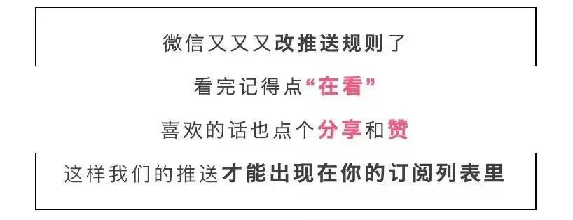

# 无标题

**链接地址:** http://mp.weixin.qq.com/s?__biz=MzUyNzA2NTAwNg==&mid=2247491404&idx=1&sn=dcf374d59a1fad5b39fadc042e874ad6&chksm=fa04158dcd739c9b2fab69ec4bfb42f21cdaf2d0643035fc1fd9172a140796bccdd2887bb922&mpshare=1&scene=2&srcid=1017d0KNh5MY2xMrdtVafCJg&sharer_sharetime=1665964841581&sharer_shareid=77848a6b3852ae4dcb6c74ffee84743c#rd
**作者:** 你身边的签证专家
**获取时间:** 2025/8/28 19:28:39
**图片数量:** 21

---

## 原始HTML内容

<section style="box-sizing: border-box;font-size: 16px;"><section style="text-align: center;margin-top: 10px;margin-bottom: 10px;box-sizing: border-box;" powered-by="xiumi.us"><section style="max-width: 100%;vertical-align: middle;display: inline-block;line-height: 0;box-sizing: border-box;"></section></section><section style="text-align: center;margin-top: 10px;margin-bottom: 10px;box-sizing: border-box;" powered-by="xiumi.us"></section><section style="text-align: center;margin-top: 10px;margin-bottom: 10px;box-sizing: border-box;" powered-by="xiumi.us"> </section><section class="channels_iframe_wrp wxw_wechannel_card_not_horizontal"><mpvideosnap class="js_uneditable custom_select_card channels_iframe videosnap_video_iframe" data-pluginname="videosnap" data-id="export/UzFfAgtgekIEAQAAAAAAdY04QxpCjAAAAAstQy6ubaLX4KHWvLEZgBPEuZFgemlWdJeCzNPgMIuG5Pr5khCmizaxpDOZ5Kq2" data-url="https://findermp.video.qq.com/251/20350/stodownload?encfilekey=Cvvj5Ix3eexKX1zo1IZZBrQomawdVfSQBkYiaDuXtpMA9ZZZCicYd54l2V5Slf0U2erofLmlYq203o7aNf9mSMORQMNc2CNnNU63qe3mdoEXnqNyib7C2ria6iam3gt5MumCxD9V7rZ6mo1dGeknnDR2wnB3Fa81lkCOOV95jdvkEsCY&amp;adaptivelytrans=0&amp;bizid=1023&amp;dotrans=0&amp;hy=HK&amp;idx=1&amp;m=8d18abdc089797039fa6d5d81525f084&amp;token=x5Y29zUxcibAPLvpRVaCicSM4zjia7n5LSb5EudRpjpRyFXibZVGCjAXN5sDDTeaSibzvm8m1JooLXrc" data-headimgurl="http://wx.qlogo.cn/finderhead/PiajxSqBRaEI4vQJr3aa81ehxKpzshj4t6ZWzDxwztBic5fr9nVMt20g/0" data-username="v2_060000231003b20faec8c7eb811fc3d1ca06ec31b07726617828a16cbc88a282c95def3c7c6d@finder" data-nickname="Zoe说加拿大" data-desc="2022加拿大父母团聚移民开始啦！" data-nonceid="16829050404049217685" data-type="video" data-width="1072" data-height="1440"></mpvideosnap></section><section style="font-size: 19px;text-align: center;margin-top: 10px;margin-bottom: 3px;box-sizing: border-box;" powered-by="xiumi.us"><section style="display: inline-block;border-width: 1px;border-style: solid;border-color: rgb(188, 65, 65);background-color: rgb(188, 65, 65);width: 1.8em;height: 1.8em;line-height: 1.8em;border-radius: 100%;margin-left: auto;margin-right: auto;font-size: 16px;color: rgb(255, 255, 255);box-sizing: border-box;">
<strong style="box-sizing: border-box;">1</strong>
</section></section><section style="text-align: center;box-sizing: border-box;" powered-by="xiumi.us"><section style="display: inline-block;width: 0px;height: 0px;vertical-align: top;overflow: hidden;border-style: solid;border-width: 9px 6px 0px;border-color: rgb(188, 65, 65) rgba(255, 255, 255, 0) rgba(255, 255, 255, 0);box-sizing: border-box;"><svg viewBox="0 0 1 1" style="float:left;line-height:0;width:0;vertical-align:top;"></svg></section></section><section style="margin-bottom: 10px;text-align: center;justify-content: center;display: flex;flex-flow: row nowrap;box-sizing: border-box;" powered-by="xiumi.us"><section style="display: inline-block;width: auto;vertical-align: middle;background-color: rgba(109, 155, 209, 0.1);min-width: 10%;max-width: 100%;flex: 0 0 auto;height: auto;align-self: center;padding: 12px;box-sizing: border-box;"><section style="color: rgb(109, 155, 209);text-align: justify;box-sizing: border-box;" powered-by="xiumi.us">
<strong style="box-sizing: border-box;">加国PGP项目本周开始抽签</strong> 
</section></section></section><section style="font-size: 14px;padding-right: 15px;padding-left: 15px;letter-spacing: 1px;box-sizing: border-box;" powered-by="xiumi.us">
 

加拿大移民部（IRCC）今天在推特上宣布<strong style="box-sizing: border-box;">父母祖父母移民项目（PGP）</strong>的最新消息，表示<strong style="box-sizing: border-box;">本周移民部将发出邀请信</strong>给申请担保父母祖父母移民的人士，这些人早在2020年已经提交了有意担保的表格。&nbsp; &nbsp;

 
</section><section style="text-align: center;margin-top: 10px;margin-bottom: 10px;box-sizing: border-box;" powered-by="xiumi.us"><section style="max-width: 100%;vertical-align: middle;display: inline-block;line-height: 0;width: 90%;height: auto;box-sizing: border-box;"></section></section><section style="font-size: 14px;padding-right: 15px;padding-left: 15px;letter-spacing: 1px;box-sizing: border-box;" powered-by="xiumi.us">
 

移民部在今天的新闻稿中说，家庭团聚在吸引、留住和融合移民方面发挥着重要作用。加拿大有一个非常慷慨的家庭担保移民项目，允许加拿大公民和永久居民选择将他们的父母和祖父母作为<strong style="box-sizing: border-box;">永久居民</strong>来到加拿大。

 
</section><section style="text-align: center;margin-top: 10px;margin-bottom: 10px;box-sizing: border-box;" powered-by="xiumi.us"><section style="max-width: 100%;vertical-align: middle;display: inline-block;line-height: 0;width: 90%;height: auto;box-sizing: border-box;"></section></section><section style="font-size: 14px;padding-right: 15px;padding-left: 15px;letter-spacing: 1px;box-sizing: border-box;" powered-by="xiumi.us">
 

国会议员Sonia Sidhu代表移民、难民和公民事务部部长Sean Fraser，与国会议员Shafqat Ali在安省宾顿市宣布，今年将继续接受<strong style="box-sizing: border-box;">多达1.5万份父母和祖父母项目的完整申请</strong>，让家庭团聚。本周，移民部将开始<strong style="box-sizing: border-box;">向23,100名感兴趣的担保人发出申请邀请</strong>（比目标邀请人数25,000名略低），这足以确保我们收到1.5万份申请的目标。邀请信将在<strong style="box-sizing: border-box;">这两周寄出</strong>。

 
</section><section style="text-align: center;margin-top: 10px;margin-bottom: 10px;box-sizing: border-box;" powered-by="xiumi.us"><section style="max-width: 100%;vertical-align: middle;display: inline-block;line-height: 0;width: 90%;height: auto;box-sizing: border-box;"></section></section><section style="font-size: 14px;padding-right: 15px;padding-left: 15px;letter-spacing: 1px;box-sizing: border-box;" powered-by="xiumi.us">
 

政府表示，由于还有2020年提交意向表格的人仍在待邀请的池中，移民部将从中<strong style="box-sizing: border-box;">随机选择发出申请邀请</strong>，而不是新开意向表格。

 

2021年也采用了同样的方法。任何在2020年提交了意向表格，但在2021年1月或2021年9月没有收到邀请的人，建议<strong style="box-sizing: border-box;">查看所提供的电子邮件账户</strong>。

 

 
</section><section style="font-size: 19px;text-align: center;margin-top: 10px;margin-bottom: 3px;box-sizing: border-box;" powered-by="xiumi.us"><section style="display: inline-block;border-width: 1px;border-style: solid;border-color: rgb(188, 65, 65);background-color: rgb(188, 65, 65);width: 1.8em;height: 1.8em;line-height: 1.8em;border-radius: 100%;margin-left: auto;margin-right: auto;font-size: 16px;color: rgb(255, 255, 255);box-sizing: border-box;">
<strong style="box-sizing: border-box;">2</strong>
</section></section><section style="text-align: center;box-sizing: border-box;" powered-by="xiumi.us"><section style="display: inline-block;width: 0px;height: 0px;vertical-align: top;overflow: hidden;border-style: solid;border-width: 9px 6px 0px;border-color: rgb(188, 65, 65) rgba(255, 255, 255, 0) rgba(255, 255, 255, 0);box-sizing: border-box;"><svg viewBox="0 0 1 1" style="float:left;line-height:0;width:0;vertical-align:top;"></svg></section></section><section style="margin-bottom: 10px;text-align: center;justify-content: center;display: flex;flex-flow: row nowrap;box-sizing: border-box;" powered-by="xiumi.us"><section style="display: inline-block;width: auto;vertical-align: middle;background-color: rgba(109, 155, 209, 0.1);min-width: 10%;max-width: 100%;flex: 0 0 auto;height: auto;align-self: center;padding: 12px;box-sizing: border-box;"><section style="color: rgb(109, 155, 209);text-align: justify;box-sizing: border-box;" powered-by="xiumi.us">
<strong style="box-sizing: border-box;">在新的电子平台提交申请</strong>
</section></section></section><section style="font-size: 14px;padding-right: 15px;padding-left: 15px;letter-spacing: 1px;box-sizing: border-box;" powered-by="xiumi.us">
 

与去年一样，受邀申请的人将使用移民部新推出的永久居留平台或代理永久居留平台，该平台允许通过<strong style="box-sizing: border-box;">电子方式提交申请</strong>。这是对加拿大移民制度现代化承诺的一部分，以加快和简化申请程序。

 

 
</section><section style="font-size: 19px;text-align: center;margin-top: 10px;margin-bottom: 3px;box-sizing: border-box;" powered-by="xiumi.us"><section style="display: inline-block;border-width: 1px;border-style: solid;border-color: rgb(188, 65, 65);background-color: rgb(188, 65, 65);width: 1.8em;height: 1.8em;line-height: 1.8em;border-radius: 100%;margin-left: auto;margin-right: auto;font-size: 16px;color: rgb(255, 255, 255);box-sizing: border-box;">
<strong style="box-sizing: border-box;">3</strong>
</section></section><section style="text-align: center;box-sizing: border-box;" powered-by="xiumi.us"><section style="display: inline-block;width: 0px;height: 0px;vertical-align: top;overflow: hidden;border-style: solid;border-width: 9px 6px 0px;border-color: rgb(188, 65, 65) rgba(255, 255, 255, 0) rgba(255, 255, 255, 0);box-sizing: border-box;"><svg viewBox="0 0 1 1" style="float:left;line-height:0;width:0;vertical-align:top;"></svg></section></section><section style="margin-bottom: 10px;text-align: center;justify-content: center;display: flex;flex-flow: row nowrap;box-sizing: border-box;" powered-by="xiumi.us"><section style="display: inline-block;width: auto;vertical-align: middle;background-color: rgba(109, 155, 209, 0.1);min-width: 10%;max-width: 100%;flex: 0 0 auto;height: auto;align-self: center;padding: 12px;box-sizing: border-box;"><section style="color: rgb(109, 155, 209);text-align: justify;box-sizing: border-box;" powered-by="xiumi.us">
<strong style="box-sizing: border-box;">收入要求继续放宽</strong>
</section></section></section><section style="font-size: 14px;padding-right: 15px;padding-left: 15px;letter-spacing: 1px;box-sizing: border-box;" powered-by="xiumi.us">
 

政府还表示，考虑到许多潜在的担保人在近年可能因为新冠疫情而遇到经济困难，因此将再次对父母和祖父母的<strong style="box-sizing: border-box;">担保收入放低要求</strong>。

 
</section><section style="text-align: center;margin-top: 10px;margin-bottom: 10px;box-sizing: border-box;" powered-by="xiumi.us"><section style="max-width: 100%;vertical-align: middle;display: inline-block;line-height: 0;width: 90%;height: auto;box-sizing: border-box;"></section></section><section style="font-size: 14px;padding-right: 15px;padding-left: 15px;letter-spacing: 1px;box-sizing: border-box;" powered-by="xiumi.us">
 

比如，邀请人的家庭是一家3口的小家庭，邀请父母2人来加拿大，那么这个家庭就是<strong style="box-sizing: border-box;">5人家庭</strong>，邀请人和配偶的收入总和需要超过图中的<strong style="box-sizing: border-box;">56,104加元</strong>。
</section><section style="font-size: 14px;padding-right: 15px;padding-left: 15px;letter-spacing: 1px;box-sizing: border-box;" powered-by="xiumi.us">
 

对于2020和2021纳税年度，担保人的收入要求<strong style="box-sizing: border-box;">将是最低必要收入</strong>，而不是最低必要收入加上30%，常规失业保险福利金（EI）和COVID-19临时福利（如加拿大紧急应对福利金）<strong style="box-sizing: border-box;">将被允许计入担保人的收入中</strong>。这些措施将确保担保者和申请人不会因大流行期间的暂时收入损失而受到不公平的惩罚。

 
</section><section style="text-align: center;margin-top: 10px;margin-bottom: 10px;box-sizing: border-box;" powered-by="xiumi.us"><section style="max-width: 100%;vertical-align: middle;display: inline-block;line-height: 0;width: 90%;height: auto;box-sizing: border-box;"></section></section><section style="font-size: 14px;padding-right: 15px;padding-left: 15px;letter-spacing: 1px;box-sizing: border-box;" powered-by="xiumi.us">
 

政府表示，希望与父母和祖父母在加拿大团聚，但今年没有获邀请的人，可以考虑让父母或祖父母申请<strong style="box-sizing: border-box;">超级签证。</strong>

 
</section><section style="font-size: 19px;text-align: center;margin-top: 10px;margin-bottom: 3px;box-sizing: border-box;" powered-by="xiumi.us"><section style="display: inline-block;border-width: 1px;border-style: solid;border-color: rgb(188, 65, 65);background-color: rgb(188, 65, 65);width: 1.8em;height: 1.8em;line-height: 1.8em;border-radius: 100%;margin-left: auto;margin-right: auto;font-size: 16px;color: rgb(255, 255, 255);box-sizing: border-box;">
<strong style="box-sizing: border-box;">4</strong>
</section></section><section style="text-align: center;box-sizing: border-box;" powered-by="xiumi.us"><section style="display: inline-block;width: 0px;height: 0px;vertical-align: top;overflow: hidden;border-style: solid;border-width: 9px 6px 0px;border-color: rgb(188, 65, 65) rgba(255, 255, 255, 0) rgba(255, 255, 255, 0);box-sizing: border-box;"><svg viewBox="0 0 1 1" style="float:left;line-height:0;width:0;vertical-align:top;"></svg></section></section><section style="margin-bottom: 10px;text-align: center;justify-content: center;display: flex;flex-flow: row nowrap;box-sizing: border-box;" powered-by="xiumi.us"><section style="display: inline-block;width: auto;vertical-align: middle;background-color: rgba(109, 155, 209, 0.1);min-width: 10%;max-width: 100%;flex: 0 0 auto;height: auto;align-self: center;padding: 12px;box-sizing: border-box;"><section style="color: rgb(109, 155, 209);text-align: justify;box-sizing: border-box;" powered-by="xiumi.us">
<strong style="box-sizing: border-box;">性价比超高的“超级签证”</strong> 
</section></section></section><section style="font-size: 14px;padding-right: 15px;padding-left: 15px;letter-spacing: 1px;box-sizing: border-box;" powered-by="xiumi.us">
 

这个不用参与靠人品抽签制度就可以帮助父母长辈来到加拿大的办法，<strong style="box-sizing: border-box;">获批迅速</strong>，申请门槛更低！还可以帮助家里的亲人迅速来到加拿大团聚，可是加拿大<strong style="box-sizing: border-box;">移民部官方推荐的哦！</strong>

 
</section><section style="text-align: center;margin-top: 10px;margin-bottom: 10px;box-sizing: border-box;" powered-by="xiumi.us"><section style="max-width: 100%;vertical-align: middle;display: inline-block;line-height: 0;width: 90%;height: auto;box-sizing: border-box;"></section></section><section style="font-size: 14px;padding-right: 15px;padding-left: 15px;letter-spacing: 1px;box-sizing: border-box;" powered-by="xiumi.us">
 

好消息是，从2022年7月4日起，超级签证入境最长可以<strong style="box-sizing: border-box;">停留5年</strong>，<strong style="box-sizing: border-box;">续签后最长可以停留2年</strong>，且没有官方说明不可多次续签。新政之后，公民或永久居民的父母在境内停留的时间被极大延长，让即使没有移民的父母们也能愉快享受在加拿大居住生活的幸福时光！

 
</section><section style="font-size: 19px;text-align: center;margin-top: 10px;margin-bottom: 3px;box-sizing: border-box;" powered-by="xiumi.us"><section style="display: inline-block;border-width: 1px;border-style: solid;border-color: rgb(188, 65, 65);background-color: rgb(188, 65, 65);width: 1.8em;height: 1.8em;line-height: 1.8em;border-radius: 100%;margin-left: auto;margin-right: auto;font-size: 16px;color: rgb(255, 255, 255);box-sizing: border-box;">
<strong style="box-sizing: border-box;">5</strong>
</section></section><section style="text-align: center;box-sizing: border-box;" powered-by="xiumi.us"><section style="display: inline-block;width: 0px;height: 0px;vertical-align: top;overflow: hidden;border-style: solid;border-width: 9px 6px 0px;border-color: rgb(188, 65, 65) rgba(255, 255, 255, 0) rgba(255, 255, 255, 0);box-sizing: border-box;"><svg viewBox="0 0 1 1" style="float:left;line-height:0;width:0;vertical-align:top;"></svg></section></section><section style="margin-bottom: 10px;text-align: center;justify-content: center;display: flex;flex-flow: row nowrap;box-sizing: border-box;" powered-by="xiumi.us"><section style="display: inline-block;width: auto;vertical-align: middle;background-color: rgba(109, 155, 209, 0.1);min-width: 10%;max-width: 100%;flex: 0 0 auto;height: auto;align-self: center;padding: 12px;box-sizing: border-box;"><section style="color: rgb(109, 155, 209);text-align: justify;box-sizing: border-box;" powered-by="xiumi.us">
<strong style="box-sizing: border-box;">加拿大“超级签证”为什么这么香？</strong> 
</section></section></section><section style="font-size: 14px;padding-right: 15px;padding-left: 15px;letter-spacing: 1px;box-sizing: border-box;" powered-by="xiumi.us">
 

十多年来，超级签证一直是加拿大永久居民和公民与他们的父母/祖父母团聚加拿大的<strong style="box-sizing: border-box;">热门选项</strong>。每年，加拿大移民、难民和公民部都会签发大约<strong style="box-sizing: border-box;">17,000张超级签证</strong>。

 

因为是长期居住的访客签证，除了申请人必须是加拿大永久居民或公民之外，还要提供充足的<strong style="box-sizing: border-box;">资金证明，以及提前购买医疗保险等</strong>。 
</section><section style="font-size: 14px;padding-right: 15px;padding-left: 15px;letter-spacing: 1px;box-sizing: border-box;" powered-by="xiumi.us">
 
</section><section style="text-align: center;margin-top: 10px;margin-bottom: 10px;box-sizing: border-box;" powered-by="xiumi.us"><section style="max-width: 100%;vertical-align: middle;display: inline-block;line-height: 0;width: 90%;height: auto;box-sizing: border-box;"></section></section><section style="font-size: 14px;padding-right: 15px;padding-left: 15px;letter-spacing: 1px;box-sizing: border-box;" powered-by="xiumi.us">
 
</section><section style="font-size: 14px;padding-right: 15px;padding-left: 15px;letter-spacing: 1px;box-sizing: border-box;" powered-by="xiumi.us">
超级签证一次可以最多居住5年的好处是完全碾压普通探亲签证的，特别适合来加拿大带孩子的老人，<strong style="box-sizing: border-box;">尤其是疫情期间</strong>，回国一次不容易，出入境尤其麻烦。 

 
</section><section style="text-align: center;margin-top: 10px;margin-bottom: 10px;box-sizing: border-box;" powered-by="xiumi.us"><section style="max-width: 100%;vertical-align: middle;display: inline-block;line-height: 0;width: 90%;height: auto;box-sizing: border-box;"></section></section><section style="font-size: 14px;padding-right: 15px;padding-left: 15px;letter-spacing: 1px;box-sizing: border-box;" powered-by="xiumi.us">
 
</section><section style="font-size: 14px;padding-right: 15px;padding-left: 15px;letter-spacing: 1px;box-sizing: border-box;" powered-by="xiumi.us">
新时代留学移民近期也收到许多朋友们的咨询，他们担心加拿大移民部官网上显示的<strong style="box-sizing: border-box;">113天审批周期</strong>会耽误家庭的行程计划，但其实我们的实操经验表明：新时代经手申请的超级签证审批周期<strong style="box-sizing: border-box;">只需要短短10-15天！</strong> 

 
</section><section style="margin: 20px 0% 5px;text-align: center;transform: translate3d(1px, 0px, 0px);-webkit-transform: translate3d(1px, 0px, 0px);-moz-transform: translate3d(1px, 0px, 0px);-o-transform: translate3d(1px, 0px, 0px);box-sizing: border-box;" powered-by="xiumi.us"><section style="font-size: 26px;font-family: Optima-Regular, PingFangTC-light;color: rgb(0, 0, 0);letter-spacing: 2px;line-height: 1;box-sizing: border-box;">
<strong style="box-sizing: border-box;"># 超级签证 #</strong>
</section></section><section style="text-align: center;justify-content: center;margin-top: 1px;margin-right: 0%;margin-left: 0%;display: flex;flex-flow: row nowrap;box-sizing: border-box;" powered-by="xiumi.us"><section style="display: inline-block;width: 100px;vertical-align: top;flex: 0 0 auto;height: auto;border-top: 0px solid rgb(43, 65, 110);border-top-left-radius: 0px;align-self: flex-start;line-height: 0;box-sizing: border-box;"><section style="margin-right: 0%;margin-bottom: 8px;margin-left: 0%;transform: translate3d(1px, 0px, 0px);box-sizing: border-box;" powered-by="xiumi.us"><section style="background-color: rgb(43, 65, 110);height: 1px;box-sizing: border-box;"><svg viewBox="0 0 1 1" style="float:left;line-height:0;width:0;vertical-align:top;"></svg></section></section></section></section><section style="text-align: center;margin: -24px 0% 10px;box-sizing: border-box;" powered-by="xiumi.us"><section style="display: inline-block;width: 46px;height: 33px;vertical-align: top;overflow: hidden;background-color: rgba(255, 174, 174, 0.13);border-width: 0px;border-radius: 206% 134% 167% 138%;border-style: none;border-color: rgb(62, 62, 62);box-sizing: border-box;"><svg viewBox="0 0 1 1" style="float:left;line-height:0;width:0;vertical-align:top;"></svg></section></section><section style="margin-top: 10px;margin-right: 0%;margin-left: 0%;justify-content: flex-start;display: flex;flex-flow: row nowrap;box-sizing: border-box;" powered-by="xiumi.us"><section style="display: inline-block;width: 100%;vertical-align: top;background-color: rgb(255, 244, 229);padding: 20px 20px 25px;box-shadow: rgb(0, 0, 0) 0px 0px 0px;align-self: flex-start;flex: 0 0 auto;box-sizing: border-box;"><section style="text-align: center;margin-top: 10px;margin-right: 0%;margin-left: 0%;justify-content: center;display: flex;flex-flow: row nowrap;box-sizing: border-box;" powered-by="xiumi.us"><section style="display: inline-block;width: 100%;vertical-align: top;border-width: 0px;border-radius: 8px;border-style: none;border-color: rgb(62, 62, 62);overflow: hidden;box-shadow: rgb(235, 198, 159) 0px 0px 6px;background-color: rgb(255, 255, 255);padding-bottom: 10px;flex: 0 0 auto;height: auto;align-self: flex-start;box-sizing: border-box;"><section style="justify-content: center;display: flex;flex-flow: row nowrap;box-sizing: border-box;" powered-by="xiumi.us"><section style="display: inline-block;width: 100%;vertical-align: top;box-shadow: rgb(0, 0, 0) 0px 0px 0px;padding: 5px 10px 10px;align-self: flex-start;flex: 0 0 auto;box-sizing: border-box;"><section style="margin-top: 10px;margin-bottom: 10px;box-sizing: border-box;" powered-by="xiumi.us"><section style="max-width: 100%;vertical-align: middle;display: inline-block;line-height: 0;box-sizing: border-box;"></section></section><section style="text-align: justify;box-sizing: border-box;" powered-by="xiumi.us">
 

<strong style="box-sizing: border-box;">近期更是疯狂提速中哦~</strong>

 
</section><section style="margin-top: 10px;margin-bottom: 10px;box-sizing: border-box;" powered-by="xiumi.us"><section style="max-width: 100%;vertical-align: middle;display: inline-block;line-height: 0;box-sizing: border-box;"></section></section></section></section></section></section></section></section><section style="box-sizing: border-box;" powered-by="xiumi.us"><section style="text-align: center;margin: -50px 0% 10px;box-sizing: border-box;"><section style="max-width: 100%;vertical-align: middle;display: inline-block;line-height: 0;box-shadow: rgb(0, 0, 0) 0px 0px 0px;box-sizing: border-box;"></section></section></section>
 
<section style="margin: 20px 0% 5px;text-align: center;transform: translate3d(1px, 0px, 0px);-webkit-transform: translate3d(1px, 0px, 0px);-moz-transform: translate3d(1px, 0px, 0px);-o-transform: translate3d(1px, 0px, 0px);box-sizing: border-box;" powered-by="xiumi.us"><section style="font-size: 26px;font-family: Optima-Regular, PingFangTC-light;color: rgb(0, 0, 0);letter-spacing: 2px;line-height: 1;box-sizing: border-box;">
<strong style="box-sizing: border-box;"># 用户好评 #</strong>
</section></section><section style="text-align: center;justify-content: center;margin-top: 1px;margin-right: 0%;margin-left: 0%;display: flex;flex-flow: row nowrap;box-sizing: border-box;" powered-by="xiumi.us"><section style="display: inline-block;width: 100px;vertical-align: top;flex: 0 0 auto;height: auto;border-top: 0px solid rgb(43, 65, 110);border-top-left-radius: 0px;align-self: flex-start;line-height: 0;box-sizing: border-box;"><section style="margin-right: 0%;margin-bottom: 8px;margin-left: 0%;transform: translate3d(1px, 0px, 0px);box-sizing: border-box;" powered-by="xiumi.us"><section style="background-color: rgb(43, 65, 110);height: 1px;box-sizing: border-box;"><svg viewBox="0 0 1 1" style="float:left;line-height:0;width:0;vertical-align:top;"></svg></section></section></section></section><section style="text-align: center;margin: -24px 0% 10px;box-sizing: border-box;" powered-by="xiumi.us"><section style="display: inline-block;width: 46px;height: 33px;vertical-align: top;overflow: hidden;background-color: rgba(255, 174, 174, 0.13);border-width: 0px;border-radius: 206% 134% 167% 138%;border-style: none;border-color: rgb(62, 62, 62);box-sizing: border-box;"><svg viewBox="0 0 1 1" style="float:left;line-height:0;width:0;vertical-align:top;"></svg></section></section><section style="text-align: center;margin-top: 10px;margin-bottom: 10px;box-sizing: border-box;" powered-by="xiumi.us"><section style="max-width: 100%;vertical-align: middle;display: inline-block;line-height: 0;width: 90%;height: auto;box-sizing: border-box;"></section></section><section style="margin: 10px 0%;text-align: left;justify-content: flex-start;display: flex;flex-flow: row nowrap;box-sizing: border-box;" powered-by="xiumi.us"><section style="display: inline-block;width: 100%;vertical-align: top;background-color: rgb(216, 202, 160);line-height: 0;align-self: flex-start;flex: 0 0 auto;box-sizing: border-box;"><section style="text-align: justify;justify-content: flex-start;display: flex;flex-flow: row nowrap;box-sizing: border-box;" powered-by="xiumi.us"><section style="display: inline-block;width: 100%;vertical-align: top;background-position: 0% 0%;background-repeat: repeat;background-size: 1.56658%;background-attachment: scroll;align-self: flex-start;flex: 0 0 auto;background-image: url(&quot;https://mmbiz.qpic.cn/mmbiz_png/904kUibXm7Y6dGdBOq4dDUWRqcudyCIyTpcibs6ZMpmggEynhQN56NmG65icArTWtOolXT0dt54ojBibjIgzau3jNw/640?wx_fmt=png&quot;);box-sizing: border-box;"><section style="text-align: center;box-sizing: border-box;" powered-by="xiumi.us"><section style="display: inline-block;width: 100%;height: 11px;vertical-align: top;overflow: hidden;background-color: rgba(255, 255, 255, 0);box-sizing: border-box;"><svg viewBox="0 0 1 1" style="float:left;line-height:0;width:0;vertical-align:top;"></svg></section></section></section></section></section></section><section style="font-size: 14px;padding-right: 15px;padding-left: 15px;letter-spacing: 1px;box-sizing: border-box;" powered-by="xiumi.us">
 

停滞了一年之久的父母团聚移民项目重开对于咱的客户们来说真是一个<strong style="box-sizing: border-box;">天大的好消息</strong>，请大家在未来两周内务必紧盯自己填写意愿书时提供的<strong style="box-sizing: border-box;">邮箱</strong>，中签后立刻联系我们准备材料的递交。

 

新时代要在这里预祝大家在本轮抽签中都能<strong style="box-sizing: border-box;">锦鲤附身</strong>，get一抽必中的好运气！

 
<section class="mp_profile_iframe_wrp"><mp-common-profile class="js_uneditable custom_select_card mp_profile_iframe" data-pluginname="mpprofile" data-id="MzUyNzA2NTAwNg==" data-headimg="http://mmbiz.qpic.cn/mmbiz_png/904kUibXm7Y6gq02PdSyzYZvibpBf0icbsnWtqW39AwrqqK8DRQdfwaE8UtUmwOd05nWcoYKrorN7ZuRngiaFhPlibQ/0?wx_fmt=png" data-nickname="新时代留学移民法律事务所" data-alias="" data-signature="加拿大移民顾问监管委员会会员/加拿大注册持牌移民顾问" data-from="0" data-is_biz_ban="0"></mp-common-profile></section>
就算没有中签也不要气馁，性价比超高的超级签证作为折衷方案也<strong style="box-sizing: border-box;">十分值得各位的申请</strong>。请有申请需求的朋友们扫描二维码添加新时代的持牌留学移民顾问，预定<strong style="box-sizing: border-box;">一对一的咨询服务</strong>，获取最专业最省心的帮助吧！

 
</section>
 
<section style="text-align: left;justify-content: flex-start;display: flex;flex-flow: row nowrap;margin-top: 10px;box-sizing: border-box;" powered-by="xiumi.us"><section style="display: inline-block;vertical-align: top;width: auto;align-self: stretch;flex: 0 0 auto;background-color: rgb(188, 65, 65);min-width: 5%;max-width: 100%;height: auto;padding-top: 9px;padding-right: 9px;padding-left: 20px;box-sizing: border-box;"><section style="text-align: justify;font-size: 18px;color: rgb(252, 252, 252);box-sizing: border-box;" powered-by="xiumi.us">
<strong style="box-sizing: border-box;">阅读更多</strong>
</section></section><section style="display: inline-block;vertical-align: top;width: auto;min-width: 5%;max-width: 100%;flex: 0 0 auto;height: auto;align-self: stretch;box-sizing: border-box;"><section style="box-sizing: border-box;" powered-by="xiumi.us"><section style="display: inline-block;width: 0px;height: 0px;vertical-align: top;overflow: hidden;border-style: solid;border-width: 45px 0px 0px 19px;border-color: rgba(255, 255, 255, 0) rgba(255, 255, 255, 0) rgba(255, 255, 255, 0) rgb(188, 65, 65);box-sizing: border-box;"><svg viewBox="0 0 1 1" style="float:left;line-height:0;width:0;vertical-align:top;"></svg></section></section></section></section><section style="margin-bottom: 10px;box-sizing: border-box;" powered-by="xiumi.us"><section style="background-color: rgb(188, 65, 65);height: 3px;box-sizing: border-box;"><svg viewBox="0 0 1 1" style="float:left;line-height:0;width:0;vertical-align:top;"></svg></section></section><section style="margin: 10px 0%;text-align: left;justify-content: flex-start;display: flex;flex-flow: row nowrap;box-sizing: border-box;" powered-by="xiumi.us"><section style="display: inline-block;width: 100%;vertical-align: top;background-position: 55.6015% 14.0672%;background-repeat: repeat;background-size: 100.637%;background-attachment: scroll;padding: 30px;align-self: flex-start;flex: 0 0 auto;background-image: url(&quot;https://mmbiz.qpic.cn/mmbiz_jpg/904kUibXm7Y6dGdBOq4dDUWRqcudyCIyTzBJ3ZBsqMrQ3Z8Dt5wr481T6BY4qb1bxSsR1rFToricMibDNOQibf9Hzg/640?wx_fmt=jpeg&quot;);box-sizing: border-box;"><section style="text-align: justify;justify-content: flex-start;display: flex;flex-flow: row nowrap;box-sizing: border-box;" powered-by="xiumi.us"><section style="display: inline-block;width: 100%;vertical-align: top;background-color: rgba(188, 65, 65, 0.22);padding: 10px;border-width: 0px;border-style: none;border-color: rgb(62, 62, 62);align-self: flex-start;flex: 0 0 auto;box-sizing: border-box;"><section style="text-align: center;color: rgb(255, 255, 255);font-size: 14px;box-sizing: border-box;" powered-by="xiumi.us">
<a target="_blank" href="http://mp.weixin.qq.com/s?__biz=MzUyNzA2NTAwNg==&amp;mid=2247491372&amp;idx=1&amp;sn=8a3b90ad3b9ab5191526659d93a443d6&amp;chksm=fa0415edcd739cfb9ee8927f6bdac778385631135aa49c1c3c95140bac0df03b225d8f419e60&amp;scene=21#wechat_redirect" textvalue="加拿大移民部本月忙翻，4大新政即将公布！EE猛降分，父母团聚，狂吸移民新配额正在路上！" linktype="text" imgurl="" imgdata="null" data-itemshowtype="0" tab="innerlink" style="color: rgb(255, 255, 255);" data-linktype="2"><strong style="box-sizing: border-box;">加拿大移民部本月忙翻，4大新政即将公布！EE猛降分，父母团聚，狂吸移民新配额正在路上！</strong></a>
</section></section></section></section></section><section style="margin: 10px 0%;text-align: left;justify-content: flex-start;display: flex;flex-flow: row nowrap;box-sizing: border-box;" powered-by="xiumi.us"><section style="display: inline-block;width: 100%;vertical-align: top;background-position: 55.6015% 33.1154%;background-repeat: repeat;background-size: 100.637%;background-attachment: scroll;padding: 30px;align-self: flex-start;flex: 0 0 auto;background-image: url(&quot;https://mmbiz.qpic.cn/mmbiz_jpg/904kUibXm7Y6dGdBOq4dDUWRqcudyCIyTG21j0NUfibcRTkVkGaYHyPImQBIAQozocia3ZVjEkBtGGyzqWyibLicORw/640?wx_fmt=jpeg&quot;);box-sizing: border-box;"><section style="text-align: justify;justify-content: flex-start;display: flex;flex-flow: row nowrap;box-sizing: border-box;" powered-by="xiumi.us"><section style="display: inline-block;width: 100%;vertical-align: top;background-color: rgba(188, 65, 65, 0.22);padding: 10px;border-width: 0px;border-style: none;border-color: rgb(62, 62, 62);align-self: flex-start;flex: 0 0 auto;box-sizing: border-box;"><section style="text-align: center;color: rgb(255, 255, 255);font-size: 14px;box-sizing: border-box;" powered-by="xiumi.us">
<a target="_blank" href="http://mp.weixin.qq.com/s?__biz=MzUyNzA2NTAwNg==&amp;mid=2247491343&amp;idx=1&amp;sn=7ce2a9d39456b1db6e9ccddfa04c6760&amp;chksm=fa0415cecd739cd842e49e462f9e7a901efff3d217a35322241c8453a597cf831c7498bc28a2&amp;scene=21#wechat_redirect" textvalue="加国留学生大型福利现场，读书打工两不误，学签还能自动续？" linktype="text" imgurl="" imgdata="null" data-itemshowtype="0" tab="innerlink" style="color: rgb(255, 255, 255);" data-linktype="2"><strong style="box-sizing: border-box;">加国留学生大型福利现场，读书打工两不误，学签还能自动续？</strong></a>
</section></section></section></section></section><section style="margin: 10px 0%;text-align: left;justify-content: flex-start;display: flex;flex-flow: row nowrap;box-sizing: border-box;" powered-by="xiumi.us"><section style="display: inline-block;width: 100%;vertical-align: top;background-position: 55.6015% 33.1154%;background-repeat: repeat;background-size: 100.637%;background-attachment: scroll;padding: 30px;align-self: flex-start;flex: 0 0 auto;background-image: url(&quot;https://mmbiz.qpic.cn/mmbiz_jpg/904kUibXm7Y6dGdBOq4dDUWRqcudyCIyTFia8icgnVoEulalnuaDEia2Hb9eev7qyeIJJhE7B3IRzicowsnwkm7eRVw/640?wx_fmt=jpeg&quot;);box-sizing: border-box;"><section style="text-align: justify;justify-content: flex-start;display: flex;flex-flow: row nowrap;box-sizing: border-box;" powered-by="xiumi.us"><section style="display: inline-block;width: 100%;vertical-align: top;background-color: rgba(188, 65, 65, 0.22);padding: 10px;border-width: 0px;border-style: none;border-color: rgb(62, 62, 62);align-self: flex-start;flex: 0 0 auto;box-sizing: border-box;"><section style="text-align: center;color: rgb(255, 255, 255);font-size: 14px;box-sizing: border-box;" powered-by="xiumi.us">
<a target="_blank" href="http://mp.weixin.qq.com/s?__biz=MzUyNzA2NTAwNg==&amp;mid=2247491313&amp;idx=1&amp;sn=a76a90fc720b6b97ae3d274c93b8741e&amp;chksm=fa041430cd739d26563705629436855c3121a1d7f65de08f72b8544064db1398c7c69035692a&amp;scene=21#wechat_redirect" textvalue="加国移民主流目的地大洗牌？！阿尔伯塔省成热门选择，“抢”收25%安省移民！" linktype="text" imgurl="" imgdata="null" data-itemshowtype="0" tab="innerlink" style="color: rgb(255, 255, 255);" data-linktype="2"><strong style="box-sizing: border-box;">加国移民主流目的地大洗牌？！阿尔伯塔省成热门选择，“抢”收25%安省移民！</strong></a>
</section></section></section></section></section><section style="margin: 10px 0%;text-align: left;justify-content: flex-start;display: flex;flex-flow: row nowrap;box-sizing: border-box;" powered-by="xiumi.us"><section style="display: inline-block;width: 100%;vertical-align: top;background-position: 55.6015% 14.0672%;background-repeat: repeat;background-size: 100.637%;background-attachment: scroll;padding: 30px;align-self: flex-start;flex: 0 0 auto;background-image: url(&quot;https://mmbiz.qpic.cn/mmbiz_jpg/904kUibXm7Y6dGdBOq4dDUWRqcudyCIyT9fFZSG5n1NtxB8gK7kZibnH63Pej0vsXL5O7ngUib0Hnn4Ej1hv6xudw/640?wx_fmt=jpeg&quot;);box-sizing: border-box;"><section style="text-align: justify;justify-content: flex-start;display: flex;flex-flow: row nowrap;box-sizing: border-box;" powered-by="xiumi.us"><section style="display: inline-block;width: 100%;vertical-align: top;background-color: rgba(188, 65, 65, 0.22);padding: 10px;border-width: 0px;border-style: none;border-color: rgb(62, 62, 62);align-self: flex-start;flex: 0 0 auto;box-sizing: border-box;"><section style="text-align: center;color: rgb(255, 255, 255);font-size: 14px;box-sizing: border-box;" powered-by="xiumi.us">
<a target="_blank" href="http://mp.weixin.qq.com/s?__biz=MzUyNzA2NTAwNg==&amp;mid=2247491274&amp;idx=1&amp;sn=9f5e27f12b17f8ea153e10701a9e45eb&amp;chksm=fa04140bcd739d1d3ca0e71489da99ff48a27e72f1a1e8340eb73d2e5570a32030eeb3174088&amp;scene=21#wechat_redirect" textvalue="加拿大BC&nbsp;PNP邀请暂停一个月，新版NOC系统将在11月16日重启！需要重新注册申请！" linktype="text" imgurl="" imgdata="null" data-itemshowtype="0" tab="innerlink" style="color: rgb(255, 255, 255);" data-linktype="2"><strong style="box-sizing: border-box;">加拿大BC PNP邀请暂停一个月，新版NOC系统将在11月16日重启！需要重新注册申请！</strong></a>
</section></section></section></section></section><section style="text-align: center;font-size: 12px;color: rgb(180, 180, 180);box-sizing: border-box;" powered-by="xiumi.us">
（点击文字阅读）
</section><section style="margin: 10px 0%;text-align: left;justify-content: flex-start;display: flex;flex-flow: row nowrap;box-sizing: border-box;" powered-by="xiumi.us"><section style="display: inline-block;width: 100%;vertical-align: top;background-color: rgb(216, 202, 160);line-height: 0;align-self: flex-start;flex: 0 0 auto;box-sizing: border-box;"><section style="text-align: justify;justify-content: flex-start;display: flex;flex-flow: row nowrap;box-sizing: border-box;" powered-by="xiumi.us"><section style="display: inline-block;width: 100%;vertical-align: top;background-position: 0% 0%;background-repeat: repeat;background-size: 1.56658%;background-attachment: scroll;align-self: flex-start;flex: 0 0 auto;background-image: url(&quot;https://mmbiz.qpic.cn/mmbiz_png/904kUibXm7Y6dGdBOq4dDUWRqcudyCIyTpcibs6ZMpmggEynhQN56NmG65icArTWtOolXT0dt54ojBibjIgzau3jNw/640?wx_fmt=png&quot;);box-sizing: border-box;"><section style="text-align: center;box-sizing: border-box;" powered-by="xiumi.us"><section style="display: inline-block;width: 100%;height: 11px;vertical-align: top;overflow: hidden;background-color: rgba(255, 255, 255, 0);box-sizing: border-box;"><svg viewBox="0 0 1 1" style="float:left;line-height:0;width:0;vertical-align:top;"></svg></section></section></section></section></section></section><section style="text-align: center;margin-top: 10px;margin-bottom: 10px;box-sizing: border-box;" powered-by="xiumi.us"><section style="max-width: 100%;vertical-align: middle;display: inline-block;line-height: 0;box-sizing: border-box;"></section></section><section style="text-align: center;margin-top: 10px;margin-bottom: 10px;box-sizing: border-box;" powered-by="xiumi.us"><section style="max-width: 100%;vertical-align: middle;display: inline-block;line-height: 0;box-sizing: border-box;"></section></section><section style="text-align: center;margin-top: 10px;margin-bottom: 10px;box-sizing: border-box;" powered-by="xiumi.us"><section style="max-width: 100%;vertical-align: middle;display: inline-block;line-height: 0;box-sizing: border-box;"></section></section><section style="text-align: center;margin-top: 10px;margin-bottom: 10px;box-sizing: border-box;" powered-by="xiumi.us"><section style="max-width: 100%;vertical-align: middle;display: inline-block;line-height: 0;box-sizing: border-box;"></section></section><section style="text-align: center;margin-top: 10px;margin-bottom: 10px;box-sizing: border-box;" powered-by="xiumi.us"><section style="max-width: 100%;vertical-align: middle;display: inline-block;line-height: 0;box-sizing: border-box;"></section></section><section style="padding-right: 15px;padding-left: 15px;font-size: 12px;color: rgb(121, 121, 121);box-sizing: border-box;" powered-by="xiumi.us">
<strong style="box-sizing: border-box;">参考信息：加国无忧</strong>
</section><section style="text-align: center;margin-top: 10px;margin-bottom: 10px;box-sizing: border-box;" powered-by="xiumi.us"><section style="max-width: 100%;vertical-align: middle;display: inline-block;line-height: 0;box-sizing: border-box;"></section></section><section style="text-align: center;margin-top: 10px;margin-bottom: 10px;box-sizing: border-box;" powered-by="xiumi.us"><section style="max-width: 100%;vertical-align: middle;display: inline-block;line-height: 0;box-sizing: border-box;"></section></section></section>
 

<mp-style-type data-value="3"></mp-style-type>

---

## 纯文本内容

1加国PGP项目本周开始抽签加拿大移民部（IRCC）今天在推特上宣布父母祖父母移民项目（PGP）的最新消息，表示本周移民部将发出邀请信给申请担保父母祖父母移民的人士，这些人早在2020年已经提交了有意担保的表格。   移民部在今天的新闻稿中说，家庭团聚在吸引、留住和融合移民方面发挥着重要作用。加拿大有一个非常慷慨的家庭担保移民项目，允许加拿大公民和永久居民选择将他们的父母和祖父母作为永久居民来到加拿大。国会议员Sonia Sidhu代表移民、难民和公民事务部部长Sean Fraser，与国会议员Shafqat Ali在安省宾顿市宣布，今年将继续接受多达1.5万份父母和祖父母项目的完整申请，让家庭团聚。本周，移民部将开始向23,100名感兴趣的担保人发出申请邀请（比目标邀请人数25,000名略低），这足以确保我们收到1.5万份申请的目标。邀请信将在这两周寄出。政府表示，由于还有2020年提交意向表格的人仍在待邀请的池中，移民部将从中随机选择发出申请邀请，而不是新开意向表格。2021年也采用了同样的方法。任何在2020年提交了意向表格，但在2021年1月或2021年9月没有收到邀请的人，建议查看所提供的电子邮件账户。2在新的电子平台提交申请与去年一样，受邀申请的人将使用移民部新推出的永久居留平台或代理永久居留平台，该平台允许通过电子方式提交申请。这是对加拿大移民制度现代化承诺的一部分，以加快和简化申请程序。3收入要求继续放宽政府还表示，考虑到许多潜在的担保人在近年可能因为新冠疫情而遇到经济困难，因此将再次对父母和祖父母的担保收入放低要求。比如，邀请人的家庭是一家3口的小家庭，邀请父母2人来加拿大，那么这个家庭就是5人家庭，邀请人和配偶的收入总和需要超过图中的56,104加元。对于2020和2021纳税年度，担保人的收入要求将是最低必要收入，而不是最低必要收入加上30%，常规失业保险福利金（EI）和COVID-19临时福利（如加拿大紧急应对福利金）将被允许计入担保人的收入中。这些措施将确保担保者和申请人不会因大流行期间的暂时收入损失而受到不公平的惩罚。政府表示，希望与父母和祖父母在加拿大团聚，但今年没有获邀请的人，可以考虑让父母或祖父母申请超级签证。4性价比超高的“超级签证”这个不用参与靠人品抽签制度就可以帮助父母长辈来到加拿大的办法，获批迅速，申请门槛更低！还可以帮助家里的亲人迅速来到加拿大团聚，可是加拿大移民部官方推荐的哦！好消息是，从2022年7月4日起，超级签证入境最长可以停留5年，续签后最长可以停留2年，且没有官方说明不可多次续签。新政之后，公民或永久居民的父母在境内停留的时间被极大延长，让即使没有移民的父母们也能愉快享受在加拿大居住生活的幸福时光！5加拿大“超级签证”为什么这么香？十多年来，超级签证一直是加拿大永久居民和公民与他们的父母/祖父母团聚加拿大的热门选项。每年，加拿大移民、难民和公民部都会签发大约17,000张超级签证。因为是长期居住的访客签证，除了申请人必须是加拿大永久居民或公民之外，还要提供充足的资金证明，以及提前购买医疗保险等。超级签证一次可以最多居住5年的好处是完全碾压普通探亲签证的，特别适合来加拿大带孩子的老人，尤其是疫情期间，回国一次不容易，出入境尤其麻烦。新时代留学移民近期也收到许多朋友们的咨询，他们担心加拿大移民部官网上显示的113天审批周期会耽误家庭的行程计划，但其实我们的实操经验表明：新时代经手申请的超级签证审批周期只需要短短10-15天！# 超级签证 #近期更是疯狂提速中哦~# 用户好评 #停滞了一年之久的父母团聚移民项目重开对于咱的客户们来说真是一个天大的好消息，请大家在未来两周内务必紧盯自己填写意愿书时提供的邮箱，中签后立刻联系我们准备材料的递交。新时代要在这里预祝大家在本轮抽签中都能锦鲤附身，get一抽必中的好运气！就算没有中签也不要气馁，性价比超高的超级签证作为折衷方案也十分值得各位的申请。请有申请需求的朋友们扫描二维码添加新时代的持牌留学移民顾问，预定一对一的咨询服务，获取最专业最省心的帮助吧！阅读更多加拿大移民部本月忙翻，4大新政即将公布！EE猛降分，父母团聚，狂吸移民新配额正在路上！加国留学生大型福利现场，读书打工两不误，学签还能自动续？加国移民主流目的地大洗牌？！阿尔伯塔省成热门选择，“抢”收25%安省移民！加拿大BC PNP邀请暂停一个月，新版NOC系统将在11月16日重启！需要重新注册申请！（点击文字阅读）参考信息：加国无忧

---

## 图片列表

-  (原始链接: https://mmbiz.qpic.cn/mmbiz_jpg/904kUibXm7Y6dGdBOq4dDUWRqcudyCIyTuicEFib7OFJmsKKiaHH3QcsOiaic6OrnTk7G9lzDCCQf1rlNAs73icnoj4fQ/640?wx_fmt=jpeg)
-  (原始链接: https://mmbiz.qpic.cn/mmbiz_jpg/904kUibXm7Y4EC3q40NfCb7jaWhWbgfxibgpavj9rH4EqdQFpzyVg6N8TNSVOsgAOuvg1OSL9ec8ZyRicEzu8Tib7A/640?wx_fmt=jpeg)
-  (原始链接: https://mmbiz.qpic.cn/mmbiz_jpg/904kUibXm7Y6dGdBOq4dDUWRqcudyCIyTDpwmxP17wLv7bNWo4SIIUCktJaWcycibcWuu9TPEt9IV6jib9vKibsUMw/640?wx_fmt=jpeg)
-  (原始链接: https://mmbiz.qpic.cn/mmbiz_jpg/904kUibXm7Y6dGdBOq4dDUWRqcudyCIyTPicYwVwUr2iaXxic04w5uXX9banZmSCenmDb8cTEzPhNunefYN6jUakQQ/640?wx_fmt=jpeg)
-  (原始链接: https://mmbiz.qpic.cn/mmbiz_jpg/904kUibXm7Y6dGdBOq4dDUWRqcudyCIyTHVyibC9VUvvnwibicJziaDqcZ2KIokINZ4PYk2bXIDNabmWSrZvibGSVpvw/640?wx_fmt=jpeg)
-  (原始链接: https://mmbiz.qpic.cn/mmbiz_jpg/904kUibXm7Y6dGdBOq4dDUWRqcudyCIyTjwLrA9PXr7WKHEkqfLBXhwTypj5OliaprI70MzlaVoIc3iblGFdZvSibA/640?wx_fmt=jpeg)
-  (原始链接: https://mmbiz.qpic.cn/mmbiz_jpg/904kUibXm7Y6dGdBOq4dDUWRqcudyCIyTTacqtDBbqHZwcXSQD90YdtCzfFcoaXPLjJF48AzL8dib6kaX31pxANQ/640?wx_fmt=jpeg)
-  (原始链接: https://mmbiz.qpic.cn/mmbiz_jpg/904kUibXm7Y6dGdBOq4dDUWRqcudyCIyTZ6iaUibnwZib6yxg7usEHYvvkU6XOPOJEhRSibJicuqaCWEE5UIEIkzNXgA/640?wx_fmt=jpeg)
-  (原始链接: https://mmbiz.qpic.cn/mmbiz_png/904kUibXm7Y6dGdBOq4dDUWRqcudyCIyTBphorNb1KPwcwTvcwia2LRhEkn9zVZholcIBysqhQUB4iccYeGYBeUOQ/640?wx_fmt=png)
-  (原始链接: https://mmbiz.qpic.cn/mmbiz_jpg/904kUibXm7Y6dGdBOq4dDUWRqcudyCIyTIPFiavZKCPU1hGDTgWaia11BXicx8vIia0ShP9NCWqP9Iol5ECsT2mcwkA/640?wx_fmt=jpeg)
-  (原始链接: https://mmbiz.qpic.cn/mmbiz_jpg/904kUibXm7Y6dGdBOq4dDUWRqcudyCIyT09KxQajibDxK2WnSOgib3EtDibabfZK2SdgJtZTOiafhIkkgN9KTbcZ7Sg/640?wx_fmt=jpeg)
-  (原始链接: https://mmbiz.qpic.cn/mmbiz_jpg/904kUibXm7Y6dGdBOq4dDUWRqcudyCIyTTXbqv82IcHb9y4ooJQIueTXqbrr24nsTtw3L7k3ldvVpl94pMZ1xyQ/640?wx_fmt=jpeg)
-  (原始链接: https://mmbiz.qpic.cn/mmbiz_png/904kUibXm7Y6dGdBOq4dDUWRqcudyCIyTT8qVEFxjxVqF1VslnpRkLFgL0rZ7ViaicRcl3XB2XkyniaCc7RFxWuhjg/640?wx_fmt=png)
-  (原始链接: https://mmbiz.qpic.cn/mmbiz_jpg/904kUibXm7Y6dGdBOq4dDUWRqcudyCIyTt9McEtb6RdxEOga2wfAxKgg0qdQHDBicCa8DfU8Ezz7nQHel3pnuGcg/640?wx_fmt=jpeg)
-  (原始链接: https://mmbiz.qpic.cn/mmbiz_png/904kUibXm7Y6dGdBOq4dDUWRqcudyCIyTAmw4T9TaDzyyNQQP0o6z1FgbzJzDqdQvUeS1IhK3ynNy1ySB6HdNlA/640?wx_fmt=png)
-  (原始链接: https://mmbiz.qpic.cn/mmbiz_png/904kUibXm7Y6dGdBOq4dDUWRqcudyCIyTeY6eUJfJmQg6tL2owEsBy4sM3xA7Tribw1ahTPsG6lUf0p8SUPIHBibQ/640?wx_fmt=png)
-  (原始链接: https://mmbiz.qpic.cn/mmbiz_jpg/904kUibXm7Y6dGdBOq4dDUWRqcudyCIyTmPKC94Gdra0VTOC2fmfpMTTU0rFdZGaRrADmWar94ejRib8mmMNXibxw/640?wx_fmt=jpeg)
-  (原始链接: https://mmbiz.qpic.cn/mmbiz_png/904kUibXm7Y6dGdBOq4dDUWRqcudyCIyTAC3JAfhocAL8qBkMaW36d1hzwGibFGH43nrWWGkdlUWjV1TRs4sHIkQ/640?wx_fmt=png)
-  (原始链接: https://mmbiz.qpic.cn/mmbiz_jpg/904kUibXm7Y6dGdBOq4dDUWRqcudyCIyTqg6ngL8DQCafAhh5ukdfCurdrg3DtPqgvjxrQ3rJ8jqYuYUEvL1Sng/640?wx_fmt=jpeg)
-  (原始链接: https://mmbiz.qpic.cn/mmbiz_jpg/904kUibXm7Y6dGdBOq4dDUWRqcudyCIyTFlkKsb8k31arsicwiaiclaiastXv1tibcJwWULETyGBhJCkXPasRZMljrKQ/640?wx_fmt=jpeg)
-  (原始链接: https://mmbiz.qpic.cn/mmbiz_jpg/904kUibXm7Y6dGdBOq4dDUWRqcudyCIyT697kzsoiaZ0C1nA0iaibgO9g9dFdjw7vuja1ib8ZRnaRuibereMNR3XNMpw/640?wx_fmt=jpeg)
