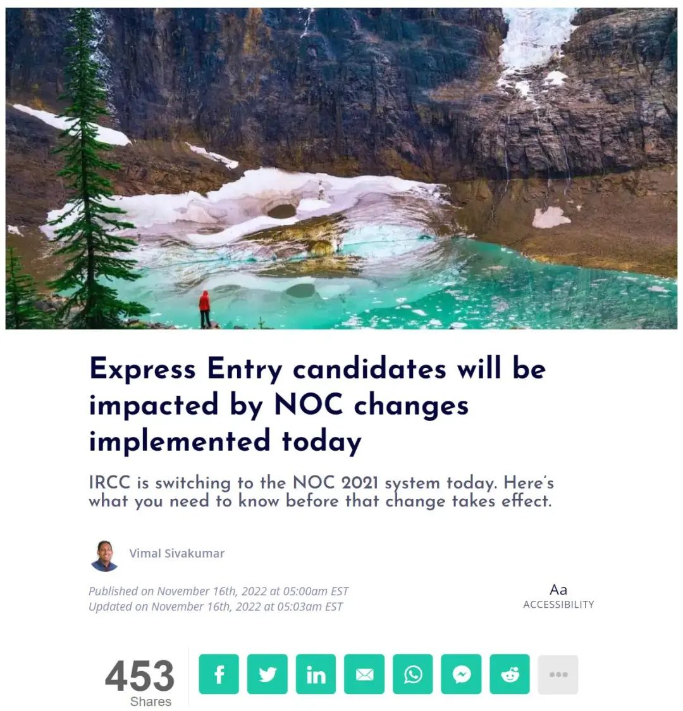
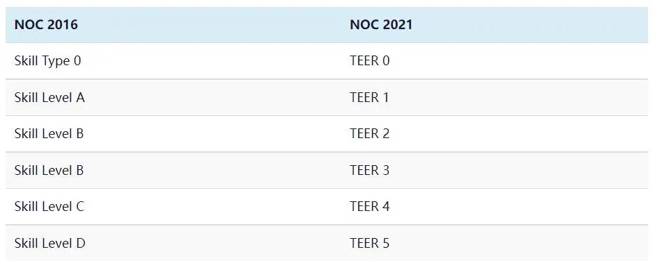
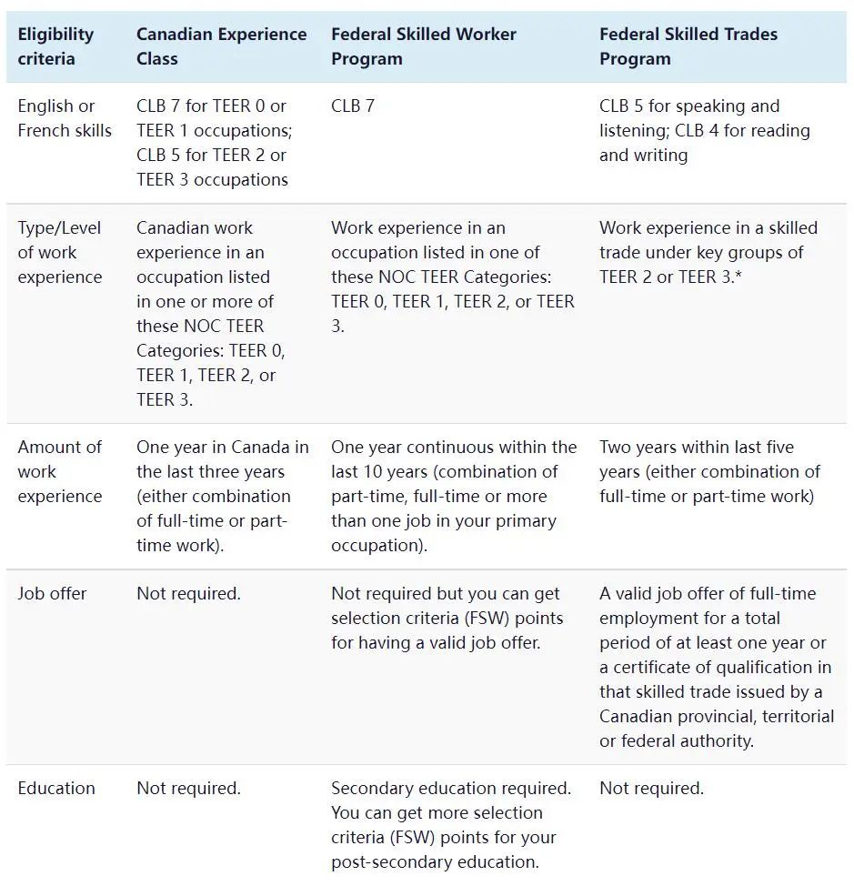
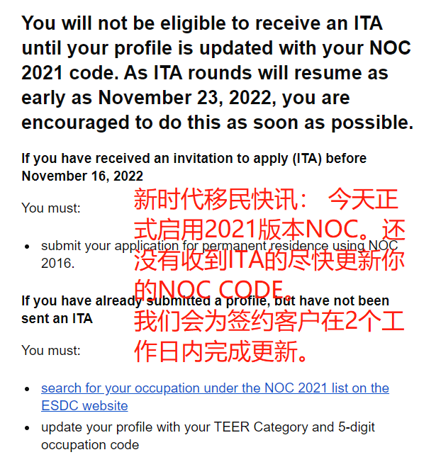

# 无标题

**链接地址:** http://mp.weixin.qq.com/s?__biz=MzUyNzA2NTAwNg==&mid=2247491811&idx=1&sn=bb54fb17f80eae743341a7d23ed40751&chksm=fa07ea22cd70633414cf7bc135bba1f4fd5186c5f41ef97f86542a443a1f947fc77432be1c56&mpshare=1&scene=2&srcid=1117DLpfFvWCBRWmj3nXMUGA&sharer_sharetime=1668649110775&sharer_shareid=77848a6b3852ae4dcb6c74ffee84743c#rd
**作者:** 你身边的签证专家
**获取时间:** 2025/8/28 19:25:47
**图片数量:** 23

---

## 原始HTML内容

<section style="box-sizing: border-box;font-size: 16px;"><section style="text-align: center;margin-top: 10px;margin-bottom: 10px;line-height: 0;box-sizing: border-box;" powered-by="xiumi.us"><section style="max-width: 100%;vertical-align: middle;display: inline-block;line-height: 0;box-sizing: border-box;"></section></section><section style="text-align: center;margin-top: 10px;margin-bottom: 10px;line-height: 0;box-sizing: border-box;" powered-by="xiumi.us"><section style="max-width: 100%;vertical-align: middle;display: inline-block;line-height: 0;box-sizing: border-box;"></section></section>
 
<section style="font-size: 19px;text-align: center;margin-top: 10px;margin-bottom: 3px;box-sizing: border-box;" powered-by="xiumi.us"><section style="display: inline-block;border-width: 1px;border-style: solid;border-color: rgb(188, 65, 65);background-color: rgb(188, 65, 65);width: 1.8em;height: 1.8em;line-height: 1.8em;border-radius: 100%;margin-left: auto;margin-right: auto;font-size: 16px;color: rgb(255, 255, 255);box-sizing: border-box;">
<strong style="box-sizing: border-box;">1</strong>
</section></section><section style="text-align: center;box-sizing: border-box;" powered-by="xiumi.us"><section style="display: inline-block;width: 0px;height: 0px;vertical-align: top;overflow: hidden;border-style: solid;border-width: 9px 6px 0px;border-color: rgb(188, 65, 65) rgba(255, 255, 255, 0) rgba(255, 255, 255, 0);box-sizing: border-box;"><svg viewBox="0 0 1 1" style="float:left;line-height:0;width:0;vertical-align:top;"></svg></section></section><section style="margin-bottom: 10px;text-align: center;justify-content: center;display: flex;flex-flow: row nowrap;box-sizing: border-box;" powered-by="xiumi.us"><section style="display: inline-block;width: auto;vertical-align: middle;background-color: rgba(109, 155, 209, 0.1);min-width: 10%;max-width: 100%;flex: 0 0 auto;height: auto;align-self: center;padding: 12px;box-sizing: border-box;"><section style="color: rgb(109, 155, 209);text-align: justify;box-sizing: border-box;" powered-by="xiumi.us">
<strong style="box-sizing: border-box;">2021版NOC加国国家职业代码今日更新</strong>
</section></section></section><section style="font-size: 14px;padding-right: 15px;padding-left: 15px;letter-spacing: 1px;box-sizing: border-box;" powered-by="xiumi.us">
 

申请技术移民的朋友们注意了，2021版NOC国家职业代码表已从<strong style="box-sizing: border-box;">今天11月16日（周三）</strong>正式启用。每10年，NOC代码表都会进行一次重大的结构修订，以确保及时反馈加拿大劳动力市场的情况。

 
</section><section style="text-align: center;margin-top: 10px;margin-bottom: 10px;line-height: 0;box-sizing: border-box;" powered-by="xiumi.us"><section style="max-width: 100%;vertical-align: middle;display: inline-block;line-height: 0;width: 90%;height: auto;box-sizing: border-box;"></section></section><section style="font-size: 14px;padding-right: 15px;padding-left: 15px;letter-spacing: 1px;box-sizing: border-box;" powered-by="xiumi.us">
 

因此，本次修订为加拿大就业和社会发展部(Employment and Social Development Canada)和加拿大统计局(Statistics Canada)如何对职业进行分类提供了一个<strong style="box-sizing: border-box;">新框架</strong>。

 
<section class="channels_iframe_wrp wxw_wechannel_card_not_horizontal"><mpvideosnap class="js_uneditable custom_select_card channels_iframe videosnap_video_iframe" data-pluginname="videosnap" data-id="export/UzFfAgtgekIEAQAAAAAAs3kClflZHwAAAAstQy6ubaLX4KHWvLEZgBPEpZEENBQmP8WBzNPgMIt2jTVnySQ1m7Fgx0gL4wj1" data-url="https://findermp.video.qq.com/251/20304/stodownload?encfilekey=oibeqyX228riaCwo9STVsGLM5YtWluFOonEEBfbRwkicYH9d8Te8kA4E8pbfPTUz0fe9iczSjnLu4icLqBWB2qWFtmMKCDQTZXfWic4sVUXaOtpbKbuzrfohMoglnum2osXjrOUjsyib59ntVM&amp;adaptivelytrans=0&amp;bizid=1023&amp;dotrans=0&amp;hy=HK&amp;idx=1&amp;m=684c50d3e3aa877db9a5a09d0c6e6207&amp;token=AxricY7RBHdVLGrtCQoCEgaf72L58INPvXiaibhuXQTDibtxicIfnfGlF19ZJ3g6EzYwISiadNp4Sh4MA" data-headimgurl="http://wx.qlogo.cn/finderhead/PiajxSqBRaEI4vQJr3aa81ehxKpzshj4t6ZWzDxwztBic5fr9nVMt20g/0" data-username="v2_060000231003b20faec8c7eb811fc3d1ca06ec31b07726617828a16cbc88a282c95def3c7c6d@finder" data-nickname="Zoe说加拿大" data-desc="" data-nonceid="11063511334556204902" data-type="video" data-authiconurl="https://dldir1v6.qq.com/weixin/checkresupdate/auth_icon_level1_ba9f2ea346de48a3ae0428273fc48117.png" data-width="1080" data-height="1440"></mpvideosnap></section>
 
</section>
 
<section style="font-size: 19px;text-align: center;margin-top: 10px;margin-bottom: 3px;box-sizing: border-box;" powered-by="xiumi.us"><section style="display: inline-block;border-width: 1px;border-style: solid;border-color: rgb(188, 65, 65);background-color: rgb(188, 65, 65);width: 1.8em;height: 1.8em;line-height: 1.8em;border-radius: 100%;margin-left: auto;margin-right: auto;font-size: 16px;color: rgb(255, 255, 255);box-sizing: border-box;">
<strong style="box-sizing: border-box;">2</strong>
</section></section><section style="text-align: center;box-sizing: border-box;" powered-by="xiumi.us"><section style="display: inline-block;width: 0px;height: 0px;vertical-align: top;overflow: hidden;border-style: solid;border-width: 9px 6px 0px;border-color: rgb(188, 65, 65) rgba(255, 255, 255, 0) rgba(255, 255, 255, 0);box-sizing: border-box;"><svg viewBox="0 0 1 1" style="float:left;line-height:0;width:0;vertical-align:top;"></svg></section></section><section style="margin-bottom: 10px;text-align: center;justify-content: center;display: flex;flex-flow: row nowrap;box-sizing: border-box;" powered-by="xiumi.us"><section style="display: inline-block;width: auto;vertical-align: middle;background-color: rgba(109, 155, 209, 0.1);min-width: 10%;max-width: 100%;flex: 0 0 auto;height: auto;align-self: center;padding: 12px;box-sizing: border-box;"><section style="color: rgb(109, 155, 209);text-align: justify;box-sizing: border-box;" powered-by="xiumi.us">
<strong style="box-sizing: border-box;">NOC2021年重大改革一览</strong>
</section></section></section><section style="font-size: 14px;padding-right: 15px;padding-left: 15px;letter-spacing: 1px;box-sizing: border-box;" powered-by="xiumi.us">
 

NOC 的重新设计包括从 4 位 NOC 代码格式转变为 <strong style="box-sizing: border-box;">5 位 NOC 代码格式</strong>，并将“技能级别”分类替换为<strong style="box-sizing: border-box;">培训、教育、经验和责任 (TEER) 的新分类</strong>。

 
</section><section style="text-align: center;margin-top: 10px;margin-bottom: 10px;line-height: 0;box-sizing: border-box;" powered-by="xiumi.us"><section style="max-width: 100%;vertical-align: middle;display: inline-block;line-height: 0;width: 90%;height: auto;box-sizing: border-box;"></section></section><section style="font-size: 14px;padding-right: 15px;padding-left: 15px;letter-spacing: 1px;box-sizing: border-box;" powered-by="xiumi.us">
 

新的<strong style="box-sizing: border-box;"> TEER 分类包含六个类别</strong>，与之前的技能水平分类相比，增加了一个类别，以更好地区分不同职业的正式培训和教育要求，从而在 NOC 内创造更精确的职业代码标准。 

 

此外，与通常需要完成短期大学或职业课程（少于 2 年）的其他职业相比，新的 TEER 分类将技术职业和专业行业（需要 2 年或更长时间的正规教育）置于不同的 TEER 中。

 
</section><section style="text-align: center;margin-top: 10px;margin-bottom: 10px;line-height: 0;box-sizing: border-box;" powered-by="xiumi.us"><section style="max-width: 100%;vertical-align: middle;display: inline-block;line-height: 0;width: 90%;height: auto;box-sizing: border-box;"></section></section><section style="font-size: 14px;padding-right: 15px;padding-left: 15px;letter-spacing: 1px;box-sizing: border-box;" powered-by="xiumi.us">
 

因此，与技能水平 B 和 C 正式相关的绝大多数职业组现在根据三个 TEER 类别（TEER 2、TE ER 3 和 TEER 4）重新分类。下表更详细地解释了新的 TEER 类别，以供进一步参考。如需更多信息，可查阅国家职业分类网页和 NOC 对照表。 

 

 

<strong style="box-sizing: border-box;">2021 NOC完整职业类别查询链接：</strong>

 

https://noc.esdc.gc.ca/Home/Welcome/4d655901c5a8499d8af705bb2a3aee03?GoCTemplateCulture=en-CA

 

<strong style="box-sizing: border-box;">加拿大Job bank上的可用信息也将同步更新</strong>，以及时反映NOC 2021的更新。<strong style="box-sizing: border-box;">劳动力市场影响评估 (LMIA) 申请处理不会受到过渡的影响</strong>，将同时显示 NOC 2016 和 NOC 2021 代码，直到内部系统更新为 5 位 NOC 2021 输入模式为止。

 
</section><section style="text-align: center;margin-top: 10px;margin-bottom: 10px;line-height: 0;box-sizing: border-box;" powered-by="xiumi.us"><section style="max-width: 100%;vertical-align: middle;display: inline-block;line-height: 0;box-sizing: border-box;"></section></section><section style="font-size: 14px;padding-right: 15px;padding-left: 15px;letter-spacing: 1px;box-sizing: border-box;" powered-by="xiumi.us">
 

 
</section><section style="font-size: 19px;text-align: center;margin-top: 10px;margin-bottom: 3px;box-sizing: border-box;" powered-by="xiumi.us"><section style="display: inline-block;border-width: 1px;border-style: solid;border-color: rgb(188, 65, 65);background-color: rgb(188, 65, 65);width: 1.8em;height: 1.8em;line-height: 1.8em;border-radius: 100%;margin-left: auto;margin-right: auto;font-size: 16px;color: rgb(255, 255, 255);box-sizing: border-box;">
<strong style="box-sizing: border-box;">3</strong>
</section></section><section style="text-align: center;box-sizing: border-box;" powered-by="xiumi.us"><section style="display: inline-block;width: 0px;height: 0px;vertical-align: top;overflow: hidden;border-style: solid;border-width: 9px 6px 0px;border-color: rgb(188, 65, 65) rgba(255, 255, 255, 0) rgba(255, 255, 255, 0);box-sizing: border-box;"><svg viewBox="0 0 1 1" style="float:left;line-height:0;width:0;vertical-align:top;"></svg></section></section><section style="margin-bottom: 10px;text-align: center;justify-content: center;display: flex;flex-flow: row nowrap;box-sizing: border-box;" powered-by="xiumi.us"><section style="display: inline-block;width: auto;vertical-align: middle;background-color: rgba(109, 155, 209, 0.1);min-width: 10%;max-width: 100%;flex: 0 0 auto;height: auto;align-self: center;padding: 12px;box-sizing: border-box;"><section style="color: rgb(109, 155, 209);text-align: justify;box-sizing: border-box;" powered-by="xiumi.us">
<strong style="box-sizing: border-box;">新的 TEER 分类规律</strong>
</section></section></section><section style="margin-top: 10px;margin-bottom: 10px;box-sizing: border-box;" powered-by="xiumi.us"><section style="display: inline-block;width: 100%;border-width: 2px;border-style: dashed;border-color: rgb(192, 200, 209);padding: 10px;background-color: rgb(239, 239, 239);border-radius: 0.7em;box-sizing: border-box;"><section style="font-size: 14px;padding-right: 15px;padding-left: 15px;box-sizing: border-box;" powered-by="xiumi.us">
 

<strong style="box-sizing: border-box;">TEER 0：</strong>管理职位。例如人力资源经理、工程经理等

 

<strong style="box-sizing: border-box;">TEER 1：</strong>通常需要大学学位(university degree)。例如护士、教师、记者等

 

<strong style="box-sizing: border-box;">TEER 2：</strong>通常需要大专文凭(college diploma )，或有2年或以上的学徒培训，或监管职位。例如零售业主管、管工、药剂师等

 

<strong style="box-sizing: border-box;">TEER 3：</strong>通常需要的大专文凭(college diploma )，或有少于 2 年的学徒培训，或超过6个月的在职培训。例如摄影师、行政助理、捕鱼工人等

 

<strong style="box-sizing: border-box;">TEER 4：</strong>通常需要高中文凭(high school diploma )，或数周的在职培训。例如调酒师、海鲜工厂工人、保姆等

 

<strong style="box-sizing: border-box;">TEER 5：</strong>通常需要短期工作经验且不需要正规教育。例如收银员、畜牧工人、清洁工等

 
</section></section></section>
 
<section style="text-align: center;margin-top: 10px;margin-bottom: 10px;line-height: 0;box-sizing: border-box;" powered-by="xiumi.us"><section style="max-width: 100%;vertical-align: middle;display: inline-block;line-height: 0;width: 90%;height: auto;box-sizing: border-box;"></section></section>
 
<section style="font-size: 14px;padding-right: 15px;padding-left: 15px;letter-spacing: 1px;box-sizing: border-box;" powered-by="xiumi.us">
 
</section><section style="font-size: 19px;text-align: center;margin-top: 10px;margin-bottom: 3px;box-sizing: border-box;" powered-by="xiumi.us"><section style="display: inline-block;border-width: 1px;border-style: solid;border-color: rgb(188, 65, 65);background-color: rgb(188, 65, 65);width: 1.8em;height: 1.8em;line-height: 1.8em;border-radius: 100%;margin-left: auto;margin-right: auto;font-size: 16px;color: rgb(255, 255, 255);box-sizing: border-box;">
<strong style="box-sizing: border-box;">4</strong>
</section></section><section style="text-align: center;box-sizing: border-box;" powered-by="xiumi.us"><section style="display: inline-block;width: 0px;height: 0px;vertical-align: top;overflow: hidden;border-style: solid;border-width: 9px 6px 0px;border-color: rgb(188, 65, 65) rgba(255, 255, 255, 0) rgba(255, 255, 255, 0);box-sizing: border-box;"><svg viewBox="0 0 1 1" style="float:left;line-height:0;width:0;vertical-align:top;"></svg></section></section><section style="margin-bottom: 10px;text-align: center;justify-content: center;display: flex;flex-flow: row nowrap;box-sizing: border-box;" powered-by="xiumi.us"><section style="display: inline-block;width: auto;vertical-align: middle;background-color: rgba(109, 155, 209, 0.1);min-width: 10%;max-width: 100%;flex: 0 0 auto;height: auto;align-self: center;padding: 12px;box-sizing: border-box;"><section style="color: rgb(109, 155, 209);text-align: justify;box-sizing: border-box;" powered-by="xiumi.us">
<strong style="box-sizing: border-box;">记得及时更新自己的Code</strong>
</section></section></section><section style="font-size: 14px;padding-right: 15px;padding-left: 15px;letter-spacing: 1px;box-sizing: border-box;" powered-by="xiumi.us">
 

<strong style="box-sizing: border-box;">新时代留学移民法律事务</strong><strong style="box-sizing: border-box;">所</strong>提醒申请<strong style="box-sizing: border-box;">技术移民</strong>的朋友们，尤其是申请<strong style="box-sizing: border-box;">CEC、FSW、FST这类通过EE快速通道递交移民申请的朋友们</strong>，务必注意以下几点：

 
</section><section style="text-align: center;margin-top: 10px;margin-bottom: 10px;line-height: 0;box-sizing: border-box;" powered-by="xiumi.us"><section style="max-width: 100%;vertical-align: middle;display: inline-block;line-height: 0;width: 90%;height: auto;box-sizing: border-box;"></section></section><section style="font-size: 14px;padding-right: 15px;padding-left: 15px;letter-spacing: 1px;box-sizing: border-box;" powered-by="xiumi.us">
 

1. 对于<strong style="box-sizing: border-box;">尚未入池EE</strong>但计划在今天或之后入池的申请人：将被要求在填写EE个人资料(EE Profile)时找到并提交符合NOC 2021 的职业代码。

 

2. 对于<strong style="box-sizing: border-box;">已入池EE但未收到邀请(ITA) </strong>的候选人：将会收到来自移民部的不同指示。在这种情况下，候选人最好在<strong style="box-sizing: border-box;">2022年11月23日</strong>，即<strong style="box-sizing: border-box;">下一轮的EE邀请前</strong>更新自己的NOC 2021职业代码。请候选人在加拿大就业和社会发展部(ESDC) 网站上搜索NOC 2021 列表，并使用其TEER 类别和五位数职业代码更新其个人资料。

 
</section><section style="text-align: left;margin-top: 10px;margin-bottom: 10px;line-height: 0;box-sizing: border-box;" powered-by="xiumi.us"><section style="max-width: 100%;vertical-align: middle;display: inline-block;line-height: 0;width: 61%;height: auto;border-style: solid;border-width: 12px;border-color: rgb(255, 255, 255);box-sizing: border-box;"></section></section><section style="text-align: right;margin-top: -86px;margin-bottom: 10px;line-height: 0;box-sizing: border-box;" powered-by="xiumi.us"><section style="max-width: 100%;vertical-align: middle;display: inline-block;line-height: 0;width: 61%;height: auto;border-style: solid;border-width: 12px;border-color: rgb(255, 255, 255);box-sizing: border-box;"></section></section><section style="text-align: left;margin-top: -86px;margin-bottom: 10px;line-height: 0;box-sizing: border-box;" powered-by="xiumi.us"><section style="max-width: 100%;vertical-align: middle;display: inline-block;line-height: 0;width: 61%;height: auto;border-style: solid;border-width: 12px;border-color: rgb(255, 255, 255);box-sizing: border-box;"></section></section><section style="font-size: 14px;padding-right: 15px;padding-left: 15px;letter-spacing: 1px;box-sizing: border-box;" powered-by="xiumi.us">
 

3.对于<strong style="box-sizing: border-box;">在11 月 16 日之前收到邀请(ITA) </strong>的申请人：都必须使用NOC 2016（即收到邀请时使用的NOC 代码）提交EE申请。

 

4. 对<strong style="box-sizing: border-box;">于非EE快速通道下的技术移民</strong>，比如各省省提名技术移民，则需要<strong style="box-sizing: border-box;">关注各省移民厅最新公告</strong>。如果尚未递交省提名申请，则在今后递交申请时需要使用最新的NOC 2021 职业代码。如果已经递交省提名申请，则仍沿用NOC 2016职业代码。

 
</section><section style="text-align: center;margin-top: 10px;margin-bottom: 10px;line-height: 0;box-sizing: border-box;" powered-by="xiumi.us"><section style="max-width: 100%;vertical-align: middle;display: inline-block;line-height: 0;box-sizing: border-box;"></section></section><section style="font-size: 14px;padding-right: 15px;padding-left: 15px;letter-spacing: 1px;box-sizing: border-box;" powered-by="xiumi.us">
 

 
</section><section style="font-size: 19px;text-align: center;margin-top: 10px;margin-bottom: 3px;box-sizing: border-box;" powered-by="xiumi.us"><section style="display: inline-block;border-width: 1px;border-style: solid;border-color: rgb(188, 65, 65);background-color: rgb(188, 65, 65);width: 1.8em;height: 1.8em;line-height: 1.8em;border-radius: 100%;margin-left: auto;margin-right: auto;font-size: 16px;color: rgb(255, 255, 255);box-sizing: border-box;">
<strong style="box-sizing: border-box;">5</strong>
</section></section><section style="text-align: center;box-sizing: border-box;" powered-by="xiumi.us"><section style="display: inline-block;width: 0px;height: 0px;vertical-align: top;overflow: hidden;border-style: solid;border-width: 9px 6px 0px;border-color: rgb(188, 65, 65) rgba(255, 255, 255, 0) rgba(255, 255, 255, 0);box-sizing: border-box;"><svg viewBox="0 0 1 1" style="float:left;line-height:0;width:0;vertical-align:top;"></svg></section></section><section style="margin-bottom: 10px;text-align: center;justify-content: center;display: flex;flex-flow: row nowrap;box-sizing: border-box;" powered-by="xiumi.us"><section style="display: inline-block;width: auto;vertical-align: middle;background-color: rgba(109, 155, 209, 0.1);min-width: 10%;max-width: 100%;flex: 0 0 auto;height: auto;align-self: center;padding: 12px;box-sizing: border-box;"><section style="color: rgb(109, 155, 209);text-align: justify;box-sizing: border-box;" powered-by="xiumi.us">
<strong style="box-sizing: border-box;">新增及删减职业</strong>
</section></section></section><section style="font-size: 14px;padding-right: 15px;padding-left: 15px;letter-spacing: 1px;box-sizing: border-box;" powered-by="xiumi.us">
 

根据之前IRCC发布的内部简报备忘录，共有<strong style="box-sizing: border-box;">16个新增职业</strong>从11月16日开始被纳入到EE快速通道，但是将有<strong style="box-sizing: border-box;">3个职业不再符合资格</strong>。

 
</section><section style="text-align: left;margin-top: 10px;margin-bottom: 10px;line-height: 0;box-sizing: border-box;" powered-by="xiumi.us"><section style="max-width: 100%;vertical-align: middle;display: inline-block;line-height: 0;width: 61%;height: auto;border-style: solid;border-width: 12px;border-color: rgb(255, 255, 255);box-sizing: border-box;"></section></section><section style="text-align: right;margin-top: -86px;margin-bottom: 10px;line-height: 0;box-sizing: border-box;" powered-by="xiumi.us"><section style="max-width: 100%;vertical-align: middle;display: inline-block;line-height: 0;width: 61%;height: auto;border-style: solid;border-width: 12px;border-color: rgb(255, 255, 255);box-sizing: border-box;"></section></section><section style="text-align: left;margin-top: -86px;margin-bottom: 10px;line-height: 0;box-sizing: border-box;" powered-by="xiumi.us"><section style="max-width: 100%;vertical-align: middle;display: inline-block;line-height: 0;width: 61%;height: auto;border-style: solid;border-width: 12px;border-color: rgb(255, 255, 255);box-sizing: border-box;"></section></section><section style="font-size: 14px;padding-right: 15px;padding-left: 15px;letter-spacing: 1px;box-sizing: border-box;" powered-by="xiumi.us">
 

<strong style="box-sizing: border-box;">16个EE新增职业：</strong> 

 

01.Payroll administrators; 

&nbsp;&nbsp;&nbsp;&nbsp;薪资管理员；

02.Dental assistants and dental laboratory assistants; 

&nbsp;&nbsp;&nbsp;&nbsp;牙科助理和牙科实验室助理；

03.Nurse aides, orderlies and patient service associates; 

&nbsp;&nbsp;&nbsp;&nbsp;护士助理、护理员和病人服务人员；

04.Pharmacy technical assistants and pharmacy assistants;

&nbsp;&nbsp;&nbsp;&nbsp;药房技术助理和药房助理；

05.Elementary and secondary school teacher assistants; 

&nbsp; &nbsp; 小学和中学教务助理； 

06.Sheriffs and bailiffs; 

&nbsp;&nbsp;&nbsp;&nbsp;治安官和法警；

07.Correctional service officers; 

&nbsp;&nbsp;&nbsp;&nbsp;惩教人员；

08.By-law enforcement and other regulatory officers; 

&nbsp;&nbsp;&nbsp;&nbsp;执法人员和其他监管人员；

09.Estheticians, electrologists and related occupations; 

&nbsp;&nbsp;&nbsp;&nbsp;美容师、电学家及相关职业；

10.Residential and commercial installers and servicers; 

&nbsp;&nbsp;&nbsp;&nbsp;住宅和商业安装商和服务商；

11.Pest controllers and fumigators; 

&nbsp;&nbsp;&nbsp;&nbsp;害虫控制专家；

12.Other repairers and servicers; 

&nbsp;&nbsp;&nbsp;&nbsp;其他维修商和服务商；

13.Transport truck drivers; 

&nbsp;&nbsp;&nbsp;&nbsp;运输卡车司机；

14.Bus drivers, subway operators and other transit operators; 

&nbsp;&nbsp;&nbsp;&nbsp;公交司机、地铁运营商和其它公交运营商；

15.Heavy equipment operators; and 

&nbsp;&nbsp;&nbsp;&nbsp;重型设备操作员；和

16.Aircraft assemblers and aircraft assembly inspectors 

&nbsp;&nbsp;&nbsp;&nbsp;飞机装配工和飞机装配检验员

 
</section><section style="text-align: center;margin-top: 10px;margin-bottom: 10px;line-height: 0;box-sizing: border-box;" powered-by="xiumi.us"><section style="max-width: 100%;vertical-align: middle;display: inline-block;line-height: 0;width: 75%;height: auto;box-sizing: border-box;"></section></section><section style="font-size: 14px;padding-right: 15px;padding-left: 15px;letter-spacing: 1px;box-sizing: border-box;" powered-by="xiumi.us">
 

<strong style="box-sizing: border-box;">3个即将被取消的EE职业</strong>

 

01.other performers; 

&nbsp;&nbsp;&nbsp;&nbsp;其他表演者；

02.program leaders and instructors in recreation, sport and fitness; and

&nbsp;&nbsp;&nbsp;&nbsp;娱乐、运动和健身方面的项目负责人和教练；和

03.tailors, dressmakers, furriers and milliners

&nbsp;&nbsp;&nbsp;&nbsp;裁缝、裁缝、毛皮商和女帽商

 

虽然以上3个职业将从EE快速通道中消失，但这些职业<strong style="box-sizing: border-box;">仍有机会被省提名移民项目接纳</strong> 

 
</section>
 
<section style="margin: 10px 0%;text-align: left;justify-content: flex-start;display: flex;flex-flow: row nowrap;box-sizing: border-box;" powered-by="xiumi.us"><section style="display: inline-block;width: 100%;vertical-align: top;background-color: rgb(216, 202, 160);line-height: 0;align-self: flex-start;flex: 0 0 auto;box-sizing: border-box;"><section style="text-align: justify;justify-content: flex-start;display: flex;flex-flow: row nowrap;box-sizing: border-box;" powered-by="xiumi.us"><section style="display: inline-block;width: 100%;vertical-align: top;background-position: 0% 0%;background-repeat: repeat;background-size: 1.56658%;background-attachment: scroll;align-self: flex-start;flex: 0 0 auto;background-image: url(&quot;https://mmbiz.qpic.cn/mmbiz_png/904kUibXm7Y6Y3sXP3BLQhcnUa8Ay1lLjke16g7BmicnP8AzJurtqZGDS0QWOo5LrDyBb8qFfXibxlcUJY2rRB75w/640?wx_fmt=png&quot;);box-sizing: border-box;"><section style="text-align: center;box-sizing: border-box;" powered-by="xiumi.us"><section style="display: inline-block;width: 100%;height: 11px;vertical-align: top;overflow: hidden;background-color: rgba(255, 255, 255, 0);box-sizing: border-box;"><svg viewBox="0 0 1 1" style="float:left;line-height:0;width:0;vertical-align:top;"></svg></section></section></section></section></section></section><section style="font-size: 14px;padding-right: 15px;padding-left: 15px;letter-spacing: 1px;box-sizing: border-box;" powered-by="xiumi.us">
 

2021版本的NOC系统更加重强调了<strong style="box-sizing: border-box;">“教育”和“培训”</strong>这两方面因素在职业划分中的考量，而非过往完全依赖技能和就业方向作为人才分类的标准。

 

这样的升级更有利于加拿大社会<strong style="box-sizing: border-box;">从教育阶段开始调整优化加拿大的就业市场。</strong>尽量避免<strong style="box-sizing: border-box;">“学历倒挂”</strong>（如大批本科或以上学历者竞争专科或以下学历要求工作）和<strong style="box-sizing: border-box;">学历、学科及职业严重分配不均现象</strong>（如计算机和金融行业毕业生人数远高于行业需求的过饱和现象）的产生。

 
</section><section style="text-align: center;margin-top: 10px;margin-bottom: 10px;line-height: 0;box-sizing: border-box;" powered-by="xiumi.us"><section style="max-width: 100%;vertical-align: middle;display: inline-block;line-height: 0;width: 90%;height: auto;box-sizing: border-box;"></section></section><section style="font-size: 14px;padding-right: 15px;padding-left: 15px;letter-spacing: 1px;box-sizing: border-box;" powered-by="xiumi.us">
 

而对于计划于今后通过工作经历申请加拿大移民的朋友们<strong style="box-sizing: border-box;">最具参考意义的</strong>，就是加拿大对于稀缺人才的引进制度，将来<strong style="box-sizing: border-box;">可能会往更加细分化的方向进行</strong>。

 

我们鼓励有加拿大移民意向的朋友们<strong style="box-sizing: border-box;">从教育阶段就尽早开始计划自己的求职方向</strong>，对加拿大人才市场和职业需求进行充分了解，结合自己的个人兴趣和就业意愿最大化利用移民政策为自己选择较高效的移民通道。

 
</section><section style="text-align: center;margin-top: 10px;margin-bottom: 10px;line-height: 0;box-sizing: border-box;" powered-by="xiumi.us"><section style="max-width: 100%;vertical-align: middle;display: inline-block;line-height: 0;width: 90%;height: auto;box-sizing: border-box;"></section></section><section style="font-size: 14px;padding-right: 15px;padding-left: 15px;letter-spacing: 1px;box-sizing: border-box;" powered-by="xiumi.us">
 

如果你对加拿大的职业选择和移民方向有任何疑问，都欢迎联系我们<strong style="box-sizing: border-box;">新时代留学移民法律事务所</strong>帮助你规划最完善，最快捷的<strong style="box-sizing: border-box;">“教育 - 求职 - 移民”一站式服务</strong>，让你不仅能够更快地拿到加拿大的枫叶卡，也更好地适应加国本地的职场生活。

 

<strong style="box-sizing: border-box;">移民不是终点，而是一个新的起点</strong>。

 

一份适合你，同时适合加拿大的工作，是你立足于加拿大的基础，也是延续你加国生活的长跑跑道。<strong style="box-sizing: border-box;">新时代留学移民</strong>希望我们的每一位客户都能在顺利落户的同时，开启幸福人生的新篇章！
</section><section style="font-size: 14px;padding-right: 15px;padding-left: 15px;letter-spacing: 1px;box-sizing: border-box;" powered-by="xiumi.us">
 
</section><section style="font-size: 14px;padding-right: 15px;padding-left: 15px;letter-spacing: 1px;box-sizing: border-box;" powered-by="xiumi.us">
 
</section><section style="text-align: left;justify-content: flex-start;display: flex;flex-flow: row nowrap;margin-top: 10px;box-sizing: border-box;" powered-by="xiumi.us"><section style="display: inline-block;vertical-align: top;width: auto;align-self: stretch;flex: 0 0 auto;background-color: rgb(188, 65, 65);min-width: 5%;max-width: 100%;height: auto;padding-top: 9px;padding-right: 9px;padding-left: 20px;box-sizing: border-box;"><section style="text-align: justify;font-size: 18px;color: rgb(252, 252, 252);box-sizing: border-box;" powered-by="xiumi.us">
<strong style="box-sizing: border-box;">阅读更多</strong>
</section></section><section style="display: inline-block;vertical-align: top;width: auto;min-width: 5%;max-width: 100%;flex: 0 0 auto;height: auto;align-self: stretch;box-sizing: border-box;"><section style="box-sizing: border-box;" powered-by="xiumi.us"><section style="display: inline-block;width: 0px;height: 0px;vertical-align: top;overflow: hidden;border-style: solid;border-width: 45px 0px 0px 19px;border-color: rgba(255, 255, 255, 0) rgba(255, 255, 255, 0) rgba(255, 255, 255, 0) rgb(188, 65, 65);box-sizing: border-box;"><svg viewBox="0 0 1 1" style="float:left;line-height:0;width:0;vertical-align:top;"></svg></section></section></section></section><section style="margin-bottom: 10px;box-sizing: border-box;" powered-by="xiumi.us"><section style="background-color: rgb(188, 65, 65);height: 3px;box-sizing: border-box;"><svg viewBox="0 0 1 1" style="float:left;line-height:0;width:0;vertical-align:top;"></svg></section></section><section style="margin: 10px 0%;text-align: left;justify-content: flex-start;display: flex;flex-flow: row nowrap;box-sizing: border-box;" powered-by="xiumi.us"><section style="display: inline-block;width: 100%;vertical-align: top;background-position: -26.3755% 52.8617%;background-repeat: repeat;background-size: 100.637%;background-attachment: scroll;padding: 30px;align-self: flex-start;flex: 0 0 auto;background-image: url(&quot;https://mmbiz.qpic.cn/mmbiz_jpg/904kUibXm7Y6Y3sXP3BLQhcnUa8Ay1lLjC6wNicAboiaVic8oKQ2rlGTDwXN4hSzeicjBibWwg3F9GHr1KxZqqsbTAlg/640?wx_fmt=jpeg&quot;);box-sizing: border-box;"><section style="text-align: justify;justify-content: flex-start;display: flex;flex-flow: row nowrap;box-sizing: border-box;" powered-by="xiumi.us"><section style="display: inline-block;width: 100%;vertical-align: top;background-color: rgba(188, 65, 65, 0.22);padding: 10px;border-width: 0px;border-style: none;border-color: rgb(62, 62, 62);align-self: flex-start;flex: 0 0 auto;box-sizing: border-box;"><section style="text-align: center;color: rgb(255, 255, 255);font-size: 14px;box-sizing: border-box;" powered-by="xiumi.us">
<a target="_blank" href="http://mp.weixin.qq.com/s?__biz=MzUyNzA2NTAwNg==&amp;mid=2247491772&amp;idx=1&amp;sn=2af85b162dd90b2f4af4fca48a497e0a&amp;chksm=fa07ea7dcd70636b9e49af3c20eec8c4a3e53cb0031aa5728655bcf96cdd7781e6619c222770&amp;scene=21#wechat_redirect" textvalue="加拿大移民EE快速通道分数跌至494，明年第一季度即将迎来“重大改革”！" linktype="text" imgurl="" imgdata="null" data-itemshowtype="0" tab="innerlink" style="color: rgb(255, 255, 255);" data-linktype="2"><strong style="box-sizing: border-box;">加拿大移民EE快速通道分数跌至494，明年第一季度即将迎来“重大改革”！</strong></a>
</section></section></section></section></section><section style="margin: 10px 0%;text-align: left;justify-content: flex-start;display: flex;flex-flow: row nowrap;box-sizing: border-box;" powered-by="xiumi.us"><section style="display: inline-block;width: 100%;vertical-align: top;background-position: 137.578% 27.8193%;background-repeat: repeat;background-size: 100.637%;background-attachment: scroll;padding: 30px;align-self: flex-start;flex: 0 0 auto;background-image: url(&quot;https://mmbiz.qpic.cn/mmbiz_jpg/904kUibXm7Y6Y3sXP3BLQhcnUa8Ay1lLjmZBMFjKLeaaFsiaFYT4sb94iaIE07zicwblJLGUjGLqwKgGCeK9mTnDjw/640?wx_fmt=jpeg&quot;);box-sizing: border-box;"><section style="text-align: justify;justify-content: flex-start;display: flex;flex-flow: row nowrap;box-sizing: border-box;" powered-by="xiumi.us"><section style="display: inline-block;width: 100%;vertical-align: top;background-color: rgba(188, 65, 65, 0.22);padding: 10px;border-width: 0px;border-style: none;border-color: rgb(62, 62, 62);align-self: flex-start;flex: 0 0 auto;box-sizing: border-box;"><section style="text-align: center;color: rgb(255, 255, 255);font-size: 14px;box-sizing: border-box;" powered-by="xiumi.us">
<a target="_blank" href="http://mp.weixin.qq.com/s?__biz=MzUyNzA2NTAwNg==&amp;mid=2247491739&amp;idx=1&amp;sn=26f7ed9e3bc578132ef7ce9dd771765b&amp;chksm=fa07ea5acd70634c7a4fe39e0cd7bbaa75887d69d4fd7dd540282a10d0ff374b9bb907d9de88&amp;scene=21#wechat_redirect" textvalue="黄金性价比！加拿大留学打工低成本高工资的城市推荐！" linktype="text" imgurl="" imgdata="null" data-itemshowtype="0" tab="innerlink" style="color: rgb(255, 255, 255);" data-linktype="2"><strong style="box-sizing: border-box;">黄金性价比！加拿大留学打工低成本高工资的城市推荐！</strong></a>
</section></section></section></section></section><section style="margin: 10px 0%;text-align: left;justify-content: flex-start;display: flex;flex-flow: row nowrap;box-sizing: border-box;" powered-by="xiumi.us"><section style="display: inline-block;width: 100%;vertical-align: top;background-position: 55.6015% 33.1154%;background-repeat: repeat;background-size: 100.637%;background-attachment: scroll;padding: 30px;align-self: flex-start;flex: 0 0 auto;background-image: url(&quot;https://mmbiz.qpic.cn/mmbiz_jpg/904kUibXm7Y6Y3sXP3BLQhcnUa8Ay1lLjlu8eJAA4Vq41Rkc4fLcicshNdaQY9mJMxjTPHXkmraibokqpMU7GBdSA/640?wx_fmt=jpeg&quot;);box-sizing: border-box;"><section style="text-align: justify;justify-content: flex-start;display: flex;flex-flow: row nowrap;box-sizing: border-box;" powered-by="xiumi.us"><section style="display: inline-block;width: 100%;vertical-align: top;background-color: rgba(188, 65, 65, 0.22);padding: 10px;border-width: 0px;border-style: none;border-color: rgb(62, 62, 62);align-self: flex-start;flex: 0 0 auto;box-sizing: border-box;"><section style="text-align: center;color: rgb(255, 255, 255);font-size: 14px;box-sizing: border-box;" powered-by="xiumi.us">
<a target="_blank" href="http://mp.weixin.qq.com/s?__biz=MzUyNzA2NTAwNg==&amp;mid=2247491674&amp;idx=1&amp;sn=a8da94523a70a1721034b273354cec37&amp;chksm=fa07ea9bcd70638df523cc586291f879b55bbcc6e4572f6b74ffedc3ac315bfdadb8ec7b239e&amp;scene=21#wechat_redirect" textvalue="严重缺人！加拿大军队破天荒允许永久居民入伍，大量高薪高福利职位待申！" linktype="text" imgurl="" imgdata="null" data-itemshowtype="0" tab="innerlink" style="color: rgb(255, 255, 255);" data-linktype="2"><strong style="box-sizing: border-box;">严重缺人！加拿大军队破天荒允许永久居民入伍，大量高薪高福利职位待申！</strong></a>
</section></section></section></section></section><section style="margin: 10px 0%;text-align: left;justify-content: flex-start;display: flex;flex-flow: row nowrap;box-sizing: border-box;" powered-by="xiumi.us"><section style="display: inline-block;width: 100%;vertical-align: top;background-position: 55.6015% 33.1154%;background-repeat: repeat;background-size: 100.637%;background-attachment: scroll;padding: 30px;align-self: flex-start;flex: 0 0 auto;background-image: url(&quot;https://mmbiz.qpic.cn/mmbiz_jpg/904kUibXm7Y6Y3sXP3BLQhcnUa8Ay1lLjsfVLGUOwfofXS2iaoNSxMI1pX3ZdxWG6zcEpSibSnX5MiczCqdwkwicRibQ/640?wx_fmt=jpeg&quot;);box-sizing: border-box;"><section style="text-align: justify;justify-content: flex-start;display: flex;flex-flow: row nowrap;box-sizing: border-box;" powered-by="xiumi.us"><section style="display: inline-block;width: 100%;vertical-align: top;background-color: rgba(188, 65, 65, 0.22);padding: 10px;border-width: 0px;border-style: none;border-color: rgb(62, 62, 62);align-self: flex-start;flex: 0 0 auto;box-sizing: border-box;"><section style="text-align: center;color: rgb(255, 255, 255);font-size: 14px;box-sizing: border-box;" powered-by="xiumi.us">
<a target="_blank" href="http://mp.weixin.qq.com/s?__biz=MzUyNzA2NTAwNg==&amp;mid=2247491647&amp;idx=1&amp;sn=5a46dec5bc0e903ed9b62691370e5c7e&amp;chksm=fa07eafecd7063e82f7b31da6c13d6007238fa5e60f00321c78c10f566833bd81ed0ab8af4fd&amp;scene=21#wechat_redirect" textvalue="移民申请神助攻，加拿大最抢手10个职位揭秘，薪水一年暴涨25%！" linktype="text" imgurl="" imgdata="null" data-itemshowtype="0" tab="innerlink" style="color: rgb(255, 255, 255);" data-linktype="2"><strong style="box-sizing: border-box;">移民申请神助攻，加拿大最抢手10个职位揭秘，薪水一年暴涨25%！</strong></a>
</section></section></section></section></section><section style="text-align: center;font-size: 12px;color: rgb(180, 180, 180);box-sizing: border-box;" powered-by="xiumi.us">
（点击文字阅读）
</section><section style="margin: 10px 0%;text-align: left;justify-content: flex-start;display: flex;flex-flow: row nowrap;box-sizing: border-box;" powered-by="xiumi.us"><section style="display: inline-block;width: 100%;vertical-align: top;background-color: rgb(216, 202, 160);line-height: 0;align-self: flex-start;flex: 0 0 auto;box-sizing: border-box;"><section style="text-align: justify;justify-content: flex-start;display: flex;flex-flow: row nowrap;box-sizing: border-box;" powered-by="xiumi.us"><section style="display: inline-block;width: 100%;vertical-align: top;background-position: 0% 0%;background-repeat: repeat;background-size: 1.56658%;background-attachment: scroll;align-self: flex-start;flex: 0 0 auto;background-image: url(&quot;https://mmbiz.qpic.cn/mmbiz_png/904kUibXm7Y6Y3sXP3BLQhcnUa8Ay1lLjke16g7BmicnP8AzJurtqZGDS0QWOo5LrDyBb8qFfXibxlcUJY2rRB75w/640?wx_fmt=png&quot;);box-sizing: border-box;"><section style="text-align: center;box-sizing: border-box;" powered-by="xiumi.us"><section style="display: inline-block;width: 100%;height: 11px;vertical-align: top;overflow: hidden;background-color: rgba(255, 255, 255, 0);box-sizing: border-box;"><svg viewBox="0 0 1 1" style="float:left;line-height:0;width:0;vertical-align:top;"></svg></section></section></section></section></section></section><section style="text-align: center;margin-top: 10px;margin-bottom: 10px;line-height: 0;box-sizing: border-box;" powered-by="xiumi.us"><section style="max-width: 100%;vertical-align: middle;display: inline-block;line-height: 0;box-sizing: border-box;"></section></section><section style="text-align: center;margin-top: 10px;margin-bottom: 10px;line-height: 0;box-sizing: border-box;" powered-by="xiumi.us"><section style="max-width: 100%;vertical-align: middle;display: inline-block;line-height: 0;box-sizing: border-box;"></section></section><section style="text-align: center;margin-top: 10px;margin-bottom: 10px;line-height: 0;box-sizing: border-box;" powered-by="xiumi.us"><section style="max-width: 100%;vertical-align: middle;display: inline-block;line-height: 0;box-sizing: border-box;"></section></section><section style="padding-right: 15px;padding-left: 15px;font-size: 12px;color: rgb(121, 121, 121);box-sizing: border-box;" powered-by="xiumi.us">
<strong style="box-sizing: border-box;">参考信息：</strong>

<strong style="box-sizing: border-box;">https://www.cicnews.com/2022/11/express-entry-candidates-will-be-impacted-by-noc-changes-implemented-today-1131758.html#gs.if9gm6</strong>
</section><section style="text-align: center;margin-top: 10px;margin-bottom: 10px;line-height: 0;box-sizing: border-box;" powered-by="xiumi.us"><section style="max-width: 100%;vertical-align: middle;display: inline-block;line-height: 0;box-sizing: border-box;"></section></section><section style="text-align: center;margin-top: 10px;margin-bottom: 10px;line-height: 0;box-sizing: border-box;" powered-by="xiumi.us"><section style="max-width: 100%;vertical-align: middle;display: inline-block;line-height: 0;box-sizing: border-box;"></section></section></section>
 

<mp-style-type data-value="3"></mp-style-type>

---

## 纯文本内容

12021版NOC加国国家职业代码今日更新申请技术移民的朋友们注意了，2021版NOC国家职业代码表已从今天11月16日（周三）正式启用。每10年，NOC代码表都会进行一次重大的结构修订，以确保及时反馈加拿大劳动力市场的情况。因此，本次修订为加拿大就业和社会发展部(Employment and Social Development Canada)和加拿大统计局(Statistics Canada)如何对职业进行分类提供了一个新框架。2NOC2021年重大改革一览NOC 的重新设计包括从 4 位 NOC 代码格式转变为 5 位 NOC 代码格式，并将“技能级别”分类替换为培训、教育、经验和责任 (TEER) 的新分类。新的 TEER 分类包含六个类别，与之前的技能水平分类相比，增加了一个类别，以更好地区分不同职业的正式培训和教育要求，从而在 NOC 内创造更精确的职业代码标准。此外，与通常需要完成短期大学或职业课程（少于 2 年）的其他职业相比，新的 TEER 分类将技术职业和专业行业（需要 2 年或更长时间的正规教育）置于不同的 TEER 中。因此，与技能水平 B 和 C 正式相关的绝大多数职业组现在根据三个 TEER 类别（TEER 2、TE ER 3 和 TEER 4）重新分类。下表更详细地解释了新的 TEER 类别，以供进一步参考。如需更多信息，可查阅国家职业分类网页和 NOC 对照表。2021 NOC完整职业类别查询链接：https://noc.esdc.gc.ca/Home/Welcome/4d655901c5a8499d8af705bb2a3aee03?GoCTemplateCulture=en-CA加拿大Job bank上的可用信息也将同步更新，以及时反映NOC 2021的更新。劳动力市场影响评估 (LMIA) 申请处理不会受到过渡的影响，将同时显示 NOC 2016 和 NOC 2021 代码，直到内部系统更新为 5 位 NOC 2021 输入模式为止。3新的 TEER 分类规律TEER 0：管理职位。例如人力资源经理、工程经理等TEER 1：通常需要大学学位(university degree)。例如护士、教师、记者等TEER 2：通常需要大专文凭(college diploma )，或有2年或以上的学徒培训，或监管职位。例如零售业主管、管工、药剂师等TEER 3：通常需要的大专文凭(college diploma )，或有少于 2 年的学徒培训，或超过6个月的在职培训。例如摄影师、行政助理、捕鱼工人等TEER 4：通常需要高中文凭(high school diploma )，或数周的在职培训。例如调酒师、海鲜工厂工人、保姆等TEER 5：通常需要短期工作经验且不需要正规教育。例如收银员、畜牧工人、清洁工等4记得及时更新自己的Code新时代留学移民法律事务所提醒申请技术移民的朋友们，尤其是申请CEC、FSW、FST这类通过EE快速通道递交移民申请的朋友们，务必注意以下几点：1. 对于尚未入池EE但计划在今天或之后入池的申请人：将被要求在填写EE个人资料(EE Profile)时找到并提交符合NOC 2021 的职业代码。2. 对于已入池EE但未收到邀请(ITA) 的候选人：将会收到来自移民部的不同指示。在这种情况下，候选人最好在2022年11月23日，即下一轮的EE邀请前更新自己的NOC 2021职业代码。请候选人在加拿大就业和社会发展部(ESDC) 网站上搜索NOC 2021 列表，并使用其TEER 类别和五位数职业代码更新其个人资料。3.对于在11 月 16 日之前收到邀请(ITA) 的申请人：都必须使用NOC 2016（即收到邀请时使用的NOC 代码）提交EE申请。4. 对于非EE快速通道下的技术移民，比如各省省提名技术移民，则需要关注各省移民厅最新公告。如果尚未递交省提名申请，则在今后递交申请时需要使用最新的NOC 2021 职业代码。如果已经递交省提名申请，则仍沿用NOC 2016职业代码。5新增及删减职业根据之前IRCC发布的内部简报备忘录，共有16个新增职业从11月16日开始被纳入到EE快速通道，但是将有3个职业不再符合资格。16个EE新增职业：01.Payroll administrators;    薪资管理员；02.Dental assistants and dental laboratory assistants;    牙科助理和牙科实验室助理；03.Nurse aides, orderlies and patient service associates;    护士助理、护理员和病人服务人员；04.Pharmacy technical assistants and pharmacy assistants;    药房技术助理和药房助理；05.Elementary and secondary school teacher assistants;    小学和中学教务助理；06.Sheriffs and bailiffs;    治安官和法警；07.Correctional service officers;    惩教人员；08.By-law enforcement and other regulatory officers;    执法人员和其他监管人员；09.Estheticians, electrologists and related occupations;    美容师、电学家及相关职业；10.Residential and commercial installers and servicers;    住宅和商业安装商和服务商；11.Pest controllers and fumigators;    害虫控制专家；12.Other repairers and servicers;    其他维修商和服务商；13.Transport truck drivers;    运输卡车司机；14.Bus drivers, subway operators and other transit operators;    公交司机、地铁运营商和其它公交运营商；15.Heavy equipment operators; and    重型设备操作员；和16.Aircraft assemblers and aircraft assembly inspectors    飞机装配工和飞机装配检验员3个即将被取消的EE职业01.other performers;    其他表演者；02.program leaders and instructors in recreation, sport and fitness; and    娱乐、运动和健身方面的项目负责人和教练；和03.tailors, dressmakers, furriers and milliners    裁缝、裁缝、毛皮商和女帽商虽然以上3个职业将从EE快速通道中消失，但这些职业仍有机会被省提名移民项目接纳2021版本的NOC系统更加重强调了“教育”和“培训”这两方面因素在职业划分中的考量，而非过往完全依赖技能和就业方向作为人才分类的标准。这样的升级更有利于加拿大社会从教育阶段开始调整优化加拿大的就业市场。尽量避免“学历倒挂”（如大批本科或以上学历者竞争专科或以下学历要求工作）和学历、学科及职业严重分配不均现象（如计算机和金融行业毕业生人数远高于行业需求的过饱和现象）的产生。而对于计划于今后通过工作经历申请加拿大移民的朋友们最具参考意义的，就是加拿大对于稀缺人才的引进制度，将来可能会往更加细分化的方向进行。我们鼓励有加拿大移民意向的朋友们从教育阶段就尽早开始计划自己的求职方向，对加拿大人才市场和职业需求进行充分了解，结合自己的个人兴趣和就业意愿最大化利用移民政策为自己选择较高效的移民通道。如果你对加拿大的职业选择和移民方向有任何疑问，都欢迎联系我们新时代留学移民法律事务所帮助你规划最完善，最快捷的“教育 - 求职 - 移民”一站式服务，让你不仅能够更快地拿到加拿大的枫叶卡，也更好地适应加国本地的职场生活。移民不是终点，而是一个新的起点。一份适合你，同时适合加拿大的工作，是你立足于加拿大的基础，也是延续你加国生活的长跑跑道。新时代留学移民希望我们的每一位客户都能在顺利落户的同时，开启幸福人生的新篇章！阅读更多加拿大移民EE快速通道分数跌至494，明年第一季度即将迎来“重大改革”！黄金性价比！加拿大留学打工低成本高工资的城市推荐！严重缺人！加拿大军队破天荒允许永久居民入伍，大量高薪高福利职位待申！移民申请神助攻，加拿大最抢手10个职位揭秘，薪水一年暴涨25%！（点击文字阅读）参考信息：https://www.cicnews.com/2022/11/express-entry-candidates-will-be-impacted-by-noc-changes-implemented-today-1131758.html#gs.if9gm6

---

## 图片列表

-  (原始链接: https://mmbiz.qpic.cn/mmbiz_jpg/904kUibXm7Y6Y3sXP3BLQhcnUa8Ay1lLjp6ucUibOcwNzJu15vzK0gr87WMWEYe8WUBZbELZH03aJicrbVHKup1oA/640?wx_fmt=jpeg)
-  (原始链接: https://mmbiz.qpic.cn/mmbiz_jpg/904kUibXm7Y6Y3sXP3BLQhcnUa8Ay1lLjVOSfsvALPfJwSianjzcdibbOT6libDMDt7OcXlvb4aDcbMgEDeictXnsTg/640?wx_fmt=jpeg)
-  (原始链接: https://mmbiz.qpic.cn/mmbiz_jpg/904kUibXm7Y6Y3sXP3BLQhcnUa8Ay1lLjOSLb2Eibiaa5Hibtd0ZicIzKe2UiakIyibtO00vbIiaPwLOickF4ibtVyLwoP5w/640?wx_fmt=jpeg)
-  (原始链接: https://mmbiz.qpic.cn/mmbiz_jpg/904kUibXm7Y6Y3sXP3BLQhcnUa8Ay1lLjtj69bTQwDgfa3f9c7PVric4XaRLYm5YFU4Eh6pcbNNiaFCf8lu0SxgSQ/640?wx_fmt=jpeg)
-  (原始链接: https://mmbiz.qpic.cn/mmbiz_jpg/904kUibXm7Y6Y3sXP3BLQhcnUa8Ay1lLjd62UHQXzerdTFY2ibibNHl36DkNRAUaILYn3SicF5udgYP3v5orkInzCQ/640?wx_fmt=jpeg)
-  (原始链接: https://mmbiz.qpic.cn/mmbiz_png/904kUibXm7Y6Y3sXP3BLQhcnUa8Ay1lLjLfjmpahbkbklKz6gcT1IedkhBbJ1Drp5z9JYxF4iaPBIqkoEtaGfmkw/640?wx_fmt=png)
-  (原始链接: https://mmbiz.qpic.cn/mmbiz_jpg/904kUibXm7Y6Y3sXP3BLQhcnUa8Ay1lLjLrkp77yqWZkcszHjDZAcjOEEkGCSIa1vvg0P2kQtC1Hbf2mSrLYyibQ/640?wx_fmt=jpeg)
-  (原始链接: https://mmbiz.qpic.cn/mmbiz_png/904kUibXm7Y6Y3sXP3BLQhcnUa8Ay1lLjh4wLwdVJiaPeCcECMwg0GTWZGia32RBtwt67XwLFP0t2snNbSGq4nGQw/640?wx_fmt=png)
-  (原始链接: https://mmbiz.qpic.cn/mmbiz_jpg/904kUibXm7Y6Y3sXP3BLQhcnUa8Ay1lLjyCYh8VjFo0lop5z2ZFkjX8nOjD4JkNKO2AWBTQrbjPnCcj9BibY4PPg/640?wx_fmt=jpeg)
-  (原始链接: https://mmbiz.qpic.cn/mmbiz_jpg/904kUibXm7Y6Y3sXP3BLQhcnUa8Ay1lLjzCScoOS1ogf5TDxTCXWNPSrQfWNns9k6ls7ZmFktWpelLwgv5C2HaA/640?wx_fmt=jpeg)
-  (原始链接: https://mmbiz.qpic.cn/mmbiz_jpg/904kUibXm7Y6Y3sXP3BLQhcnUa8Ay1lLj6dAeoL7tscoCjDHsapnkbHhZngJPnk2W26QNmI5SeAoClhwMCNibMYA/640?wx_fmt=jpeg)
-  (原始链接: https://mmbiz.qpic.cn/mmbiz_png/904kUibXm7Y6Y3sXP3BLQhcnUa8Ay1lLjbcEVlnDnYXIB0b7YicjBCAXbeOuUyY3XVFib3Cty3pYVpfHicGHsAQy6w/640?wx_fmt=png)
-  (原始链接: https://mmbiz.qpic.cn/mmbiz_jpg/904kUibXm7Y6Y3sXP3BLQhcnUa8Ay1lLjKjHsgxPu4KtBSanlwWicPnoweiaiagh46hkEbU0RjEhiaj9jc7cISD9mjw/640?wx_fmt=jpeg)
-  (原始链接: https://mmbiz.qpic.cn/mmbiz_jpg/904kUibXm7Y6Y3sXP3BLQhcnUa8Ay1lLjEjdribFBchcWusSLTbdaNfGbB7SsXFM6Ujz08Lw6wcu1jk0lCM3Iib0g/640?wx_fmt=jpeg)
-  (原始链接: https://mmbiz.qpic.cn/mmbiz_jpg/904kUibXm7Y6Y3sXP3BLQhcnUa8Ay1lLje6pTiaRuSPoxUEsiczkeFofUia4PiasOTUhNoicCCxbSQuMtpGQ9U0Glo3A/640?wx_fmt=jpeg)
-  (原始链接: https://mmbiz.qpic.cn/mmbiz_jpg/904kUibXm7Y6Y3sXP3BLQhcnUa8Ay1lLj3yjVyFLFNf8jhv7UT56sLSiaFJgic0FicGuMVcVgu1oo3qkdj8tBXCIDA/640?wx_fmt=jpeg)
-  (原始链接: https://mmbiz.qpic.cn/mmbiz_jpg/904kUibXm7Y6Y3sXP3BLQhcnUa8Ay1lLj22rNPXWNrAIVtj0lcffian9XwGicyicZFp9Ibw2XMxvNfMdqnRywRKaIg/640?wx_fmt=jpeg)
-  (原始链接: https://mmbiz.qpic.cn/mmbiz_jpg/904kUibXm7Y6Y3sXP3BLQhcnUa8Ay1lLjChYl8rQibCfiaicd6INllU3evVX7FX8hibf4EX7viaiaIkW8dILfWRjAwMQg/640?wx_fmt=jpeg)
-  (原始链接: https://mmbiz.qpic.cn/mmbiz_jpg/904kUibXm7Y6Y3sXP3BLQhcnUa8Ay1lLj35APP1ZMGrw1iadR2aW8zjkwqxYIkibJvXu7qVtGy1AjRRSsQKpW4Cog/640?wx_fmt=jpeg)
-  (原始链接: https://mmbiz.qpic.cn/mmbiz_png/904kUibXm7Y6Y3sXP3BLQhcnUa8Ay1lLjhT2AAAJKicnoeKWUVicTdpwj04M8EFyGcTs3m1UPNLRXpFTOe3htLGicA/640?wx_fmt=png)
-  (原始链接: https://mmbiz.qpic.cn/mmbiz_jpg/904kUibXm7Y6Y3sXP3BLQhcnUa8Ay1lLjx7xExFxFTp3PqJqqjefOGw6B3hCzicby9uoL8IptXibMfPB5byicP2xDQ/640?wx_fmt=jpeg)
-  (原始链接: https://mmbiz.qpic.cn/mmbiz_jpg/904kUibXm7Y6Y3sXP3BLQhcnUa8Ay1lLjmTGjeSEg3gcTnEbBrvJicNAWAXOF1C3w1GSXLHJ10Eexck79b3jCldQ/640?wx_fmt=jpeg)
-  (原始链接: https://mmbiz.qpic.cn/mmbiz_jpg/904kUibXm7Y6Y3sXP3BLQhcnUa8Ay1lLj97tx7qa1oTDv1tOicwUiblrkpBWQAv0kvL0W9yJ2w3YAw6j2Aeqzd05A/640?wx_fmt=jpeg)
