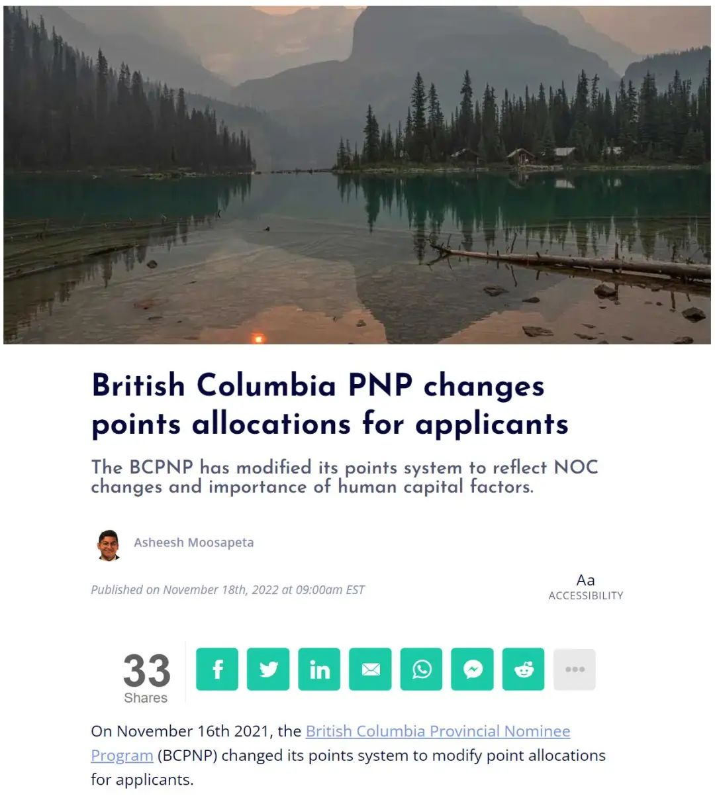
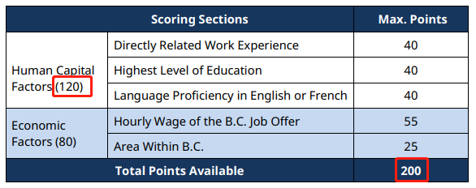
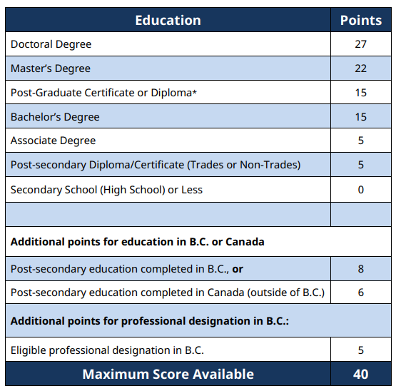
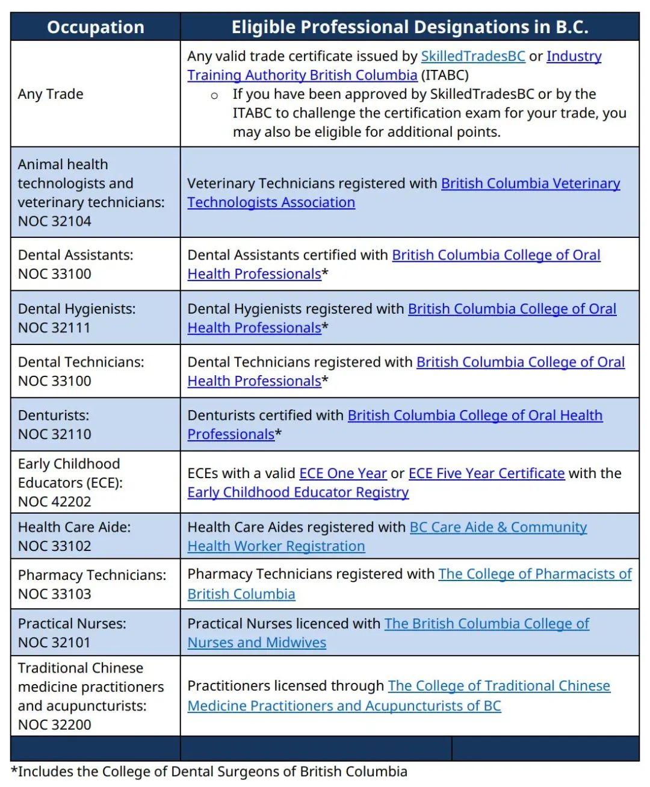
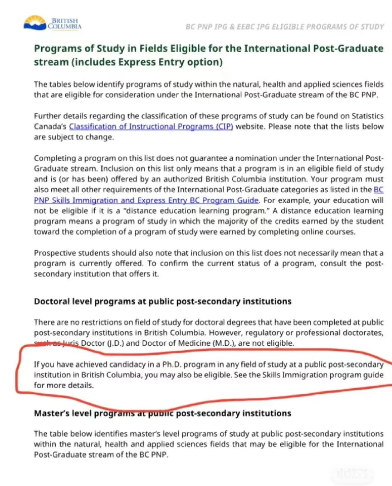
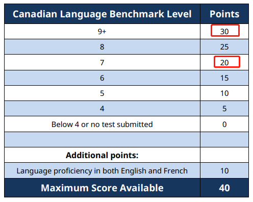
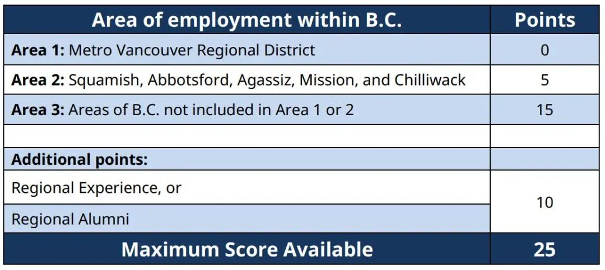
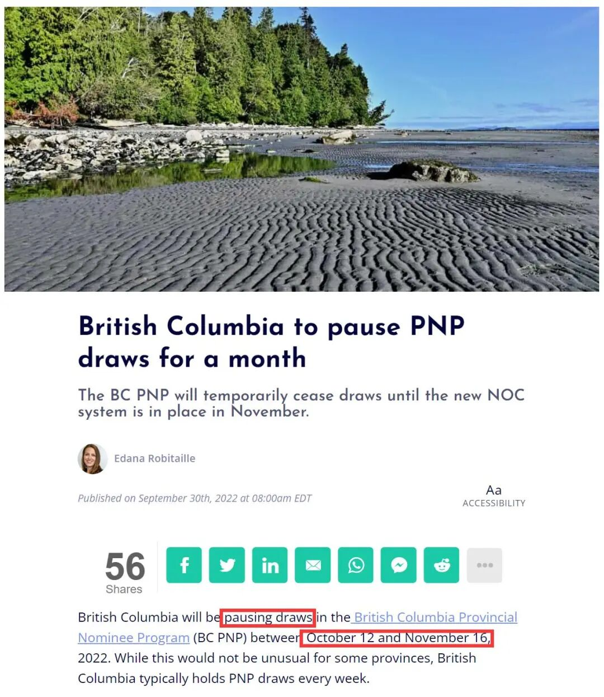

# 无标题

**链接地址:** http://mp.weixin.qq.com/s?__biz=MzUyNzA2NTAwNg==&mid=2247491840&idx=1&sn=0267c148ac7d5f1399002f54b2d22e70&chksm=fa07ebc1cd7062d71230c3f1d544f1f658316c438a1e9b936392a4fbd7a4a4db30e28d42764c&mpshare=1&scene=2&srcid=11195AzwBUdxSdmedBu0O9Qj&sharer_sharetime=1668816992054&sharer_shareid=77848a6b3852ae4dcb6c74ffee84743c#rd
**作者:** 你身边的签证专家
**获取时间:** 2025/8/28 19:25:16
**图片数量:** 18

---

## 原始HTML内容

<section style="box-sizing: border-box;font-size: 16px;"><section style="text-align: center;margin-top: 10px;margin-bottom: 10px;line-height: 0;box-sizing: border-box;" powered-by="xiumi.us"><section style="max-width: 100%;vertical-align: middle;display: inline-block;line-height: 0;box-sizing: border-box;"></section></section><section style="text-align: center;margin-top: 10px;margin-bottom: 10px;line-height: 0;box-sizing: border-box;" powered-by="xiumi.us"><section style="max-width: 100%;vertical-align: middle;display: inline-block;line-height: 0;box-sizing: border-box;"></section></section>
 
<section style="font-size: 19px;text-align: center;margin-top: 10px;margin-bottom: 3px;box-sizing: border-box;" powered-by="xiumi.us"><section style="display: inline-block;border-width: 1px;border-style: solid;border-color: rgb(188, 65, 65);background-color: rgb(188, 65, 65);width: 1.8em;height: 1.8em;line-height: 1.8em;border-radius: 100%;margin-left: auto;margin-right: auto;font-size: 16px;color: rgb(255, 255, 255);box-sizing: border-box;">
<strong style="box-sizing: border-box;">1</strong>
</section></section><section style="text-align: center;box-sizing: border-box;" powered-by="xiumi.us"><section style="display: inline-block;width: 0px;height: 0px;vertical-align: top;overflow: hidden;border-style: solid;border-width: 9px 6px 0px;border-color: rgb(188, 65, 65) rgba(255, 255, 255, 0) rgba(255, 255, 255, 0);box-sizing: border-box;"><svg viewBox="0 0 1 1" style="float:left;line-height:0;width:0;vertical-align:top;"></svg></section></section><section style="margin-bottom: 10px;text-align: center;justify-content: center;display: flex;flex-flow: row nowrap;box-sizing: border-box;" powered-by="xiumi.us"><section style="display: inline-block;width: auto;vertical-align: middle;background-color: rgba(109, 155, 209, 0.1);min-width: 10%;max-width: 100%;flex: 0 0 auto;height: auto;align-self: center;padding: 12px;box-sizing: border-box;"><section style="color: rgb(109, 155, 209);text-align: justify;box-sizing: border-box;" powered-by="xiumi.us">
<strong style="box-sizing: border-box;">BCPNP移民系统迎来重大改革</strong> 
</section></section></section><section style="font-size: 14px;padding-right: 15px;padding-left: 15px;letter-spacing: 1px;box-sizing: border-box;" powered-by="xiumi.us">
 

2021版加拿大职位代码于2022年11月16日在BC正式启用！<strong style="box-sizing: border-box;">BCPNP系统也随之更新了项目要求等细节</strong>。对于技术类提名项目，打分系统又一次有了<strong style="box-sizing: border-box;">大</strong><strong style="box-sizing: border-box;">大</strong><strong style="box-sizing: border-box;">大</strong>变动！对BCPNP项目感兴趣的朋友们请认真阅读吸收以下信息：

 
</section><section style="text-align: center;margin-top: 10px;margin-bottom: 10px;line-height: 0;box-sizing: border-box;" powered-by="xiumi.us"><section style="max-width: 100%;vertical-align: middle;display: inline-block;line-height: 0;width: 90%;height: auto;box-sizing: border-box;"></section></section><section style="font-size: 14px;padding-right: 15px;padding-left: 15px;letter-spacing: 1px;box-sizing: border-box;" powered-by="xiumi.us">
 

<strong style="box-sizing: border-box;">重点项目改革内容如下：</strong>

 

1. 采用新的国家职业代码<strong style="box-sizing: border-box;">NOC 2021</strong>（五位数）

2. BC省<strong style="box-sizing: border-box;">在读博士生可直接申请硕博类省提名</strong> ，无需毕业证，无需Job Offer，无需工作经验，取消对专业的要求（具体细节请查看评分标准变动3.学历） 

3. BC省公立大学的任教老师（university professors and lecturers）可以<strong style="box-sizing: border-box;">无需永久工作合同而申请技术工人类省提名</strong> 

4. <strong style="box-sizing: border-box;">最低家庭收入要求更新</strong> 

<strong style="box-sizing: border-box;"> </strong>
</section><section style="text-align: center;margin-top: 10px;margin-bottom: 10px;line-height: 0;box-sizing: border-box;" powered-by="xiumi.us"><section style="max-width: 100%;vertical-align: middle;display: inline-block;line-height: 0;box-sizing: border-box;"></section></section><section style="font-size: 14px;padding-right: 15px;padding-left: 15px;letter-spacing: 1px;box-sizing: border-box;" powered-by="xiumi.us">
<strong style="box-sizing: border-box;"> </strong>

<strong style="box-sizing: border-box;"> </strong>

<strong style="box-sizing: border-box;">评分标准的变化</strong>

<strong style="box-sizing: border-box;"> </strong>

<strong style="box-sizing: border-box;"> </strong>

<strong style="box-sizing: border-box;">变动 1</strong>

<strong style="box-sizing: border-box;">总分恢复到200满分</strong>

 
</section><section style="text-align: center;box-sizing: border-box;" powered-by="xiumi.us"><section style="max-width: 100%;vertical-align: middle;display: inline-block;line-height: 0;width: 90%;height: auto;box-sizing: border-box;"></section></section><section style="font-size: 14px;padding-right: 15px;padding-left: 15px;letter-spacing: 1px;box-sizing: border-box;" powered-by="xiumi.us">
 
<ul class="list-paddingleft-1"><li style="box-sizing: border-box;">
个人能力打分一共120分，比旧版高了40分。
</li><li style="box-sizing: border-box;">
经济因素只有80分，比旧版低了30分。 
</li></ul>
 

<strong style="box-sizing: border-box;">变动 2</strong>

<strong style="box-sizing: border-box;">职位</strong>

 

原先的职位高低打分，新系统里不再参与评分。 

 

 

<strong style="box-sizing: border-box;">变动 3</strong>

<strong style="box-sizing: border-box;">学历</strong> 
</section><section style="text-align: center;box-sizing: border-box;" powered-by="xiumi.us"><section style="max-width: 100%;vertical-align: middle;display: inline-block;line-height: 0;width: 90%;height: auto;box-sizing: border-box;"></section></section><section style="text-align: center;margin-top: 10px;margin-bottom: 10px;line-height: 0;box-sizing: border-box;" powered-by="xiumi.us"><section style="max-width: 100%;vertical-align: middle;display: inline-block;line-height: 0;width: 90%;height: auto;box-sizing: border-box;"></section></section><section style="font-size: 14px;padding-right: 15px;padding-left: 15px;letter-spacing: 1px;box-sizing: border-box;" powered-by="xiumi.us">
 

硕博学位得分增加，Trades diploma不再有额外加分，取消了海外学历认证ECA的加分；新增<strong style="box-sizing: border-box;">指定专业学历5分加分</strong>（包括热门的牙医助理、幼教、护士、中医针灸师等多个职位）。

 
</section><section style="text-align: center;margin-top: 10px;margin-bottom: 10px;line-height: 0;box-sizing: border-box;" powered-by="xiumi.us"><section style="max-width: 100%;vertical-align: middle;display: inline-block;line-height: 0;box-sizing: border-box;"></section></section><section style="font-size: 14px;padding-right: 15px;padding-left: 15px;letter-spacing: 1px;box-sizing: border-box;" powered-by="xiumi.us">
 

另外，硕博类提名项目取消了对于博士学位的专业要求，所有BC省公立大学的Phd Candidate，无需拿到毕业证就可以<strong style="box-sizing: border-box;">直接申请省提名</strong>。直接一步到位在上学期间顺利拿到BC省的永居身份，<strong style="box-sizing: border-box;">对学霸朋友们来说十分友好！</strong>

 

 

<strong style="box-sizing: border-box;">变动 4</strong>

<strong style="box-sizing: border-box;">英文水平</strong>

<strong style="box-sizing: border-box;"> </strong>
</section><section style="text-align: center;box-sizing: border-box;" powered-by="xiumi.us"><section style="max-width: 100%;vertical-align: middle;display: inline-block;line-height: 0;width: 90%;height: auto;box-sizing: border-box;"></section></section><section style="font-size: 14px;padding-right: 15px;padding-left: 15px;letter-spacing: 1px;box-sizing: border-box;" powered-by="xiumi.us">
 

 

<strong style="box-sizing: border-box;">英语分数比重增加！</strong>每提高一个level，多5分加分；如有法语，英法双语都能达到CLB4，可获得额外10分加分

 

 

<strong style="box-sizing: border-box;">变动 5</strong>

<strong style="box-sizing: border-box;">薪资</strong>

 

由原先的年薪评分转变为<strong style="box-sizing: border-box;">时薪评分</strong>，高薪offer势必优势更大！

 

<strong style="box-sizing: border-box;">变动 6</strong>

<strong style="box-sizing: border-box;">地理位置</strong>

<strong style="box-sizing: border-box;"> </strong>
</section><section style="text-align: center;margin-top: 10px;margin-bottom: 10px;line-height: 0;box-sizing: border-box;" powered-by="xiumi.us"><section style="max-width: 100%;vertical-align: middle;display: inline-block;line-height: 0;width: 90%;height: auto;box-sizing: border-box;"></section></section><section style="font-size: 14px;padding-right: 15px;padding-left: 15px;letter-spacing: 1px;box-sizing: border-box;" powered-by="xiumi.us">
 

 

重新划分BC区域，<strong style="box-sizing: border-box;">一共3个区域</strong>。

 

区域1：大温地区依旧没有分；

区域2：Squamish, Abbotsford, Aggasiz, Mission以及Chilliwack 5分；

区域3：在区域1、2以外的地方直接可获10分。另外若在区域2、3有指定学习和工作经验的，有机会获得10加分。

 

<strong style="box-sizing: border-box;">变动 7</strong>

<strong style="box-sizing: border-box;">工作经验</strong>

 

相关工作经验加分比重增加。

 
</section><section style="text-align: center;margin-top: 10px;margin-bottom: 10px;line-height: 0;box-sizing: border-box;" powered-by="xiumi.us"><section style="max-width: 100%;vertical-align: middle;display: inline-block;line-height: 0;box-sizing: border-box;"></section></section><section style="font-size: 14px;padding-right: 15px;padding-left: 15px;letter-spacing: 1px;box-sizing: border-box;" powered-by="xiumi.us">
 

 

最后<strong style="box-sizing: border-box;">无变化的内容</strong>包括：
<ul class="list-paddingleft-1"><li style="box-sizing: border-box;">
LMIA工签入境 +10分
</li><li style="box-sizing: border-box;">
BC省工作满1年 +10分

 
</li></ul></section><section style="margin: 10px 0%;text-align: left;justify-content: flex-start;display: flex;flex-flow: row nowrap;box-sizing: border-box;" powered-by="xiumi.us"><section style="display: inline-block;width: 100%;vertical-align: top;background-color: rgb(216, 202, 160);line-height: 0;align-self: flex-start;flex: 0 0 auto;box-sizing: border-box;"><section style="text-align: justify;justify-content: flex-start;display: flex;flex-flow: row nowrap;box-sizing: border-box;" powered-by="xiumi.us"><section style="display: inline-block;width: 100%;vertical-align: top;background-position: 0% 0%;background-repeat: repeat;background-size: 1.56658%;background-attachment: scroll;align-self: flex-start;flex: 0 0 auto;background-image: url(&quot;https://mmbiz.qpic.cn/mmbiz_png/904kUibXm7Y6cVrJvrE797hicIgIP8TFCvRWGkKV0mJSfNmuGiaTghI8TvicRe29wibwkmshZUykQe5E0xsTJ6U8m8g/640?wx_fmt=png&quot;);box-sizing: border-box;"><section style="text-align: center;box-sizing: border-box;" powered-by="xiumi.us"><section style="display: inline-block;width: 100%;height: 11px;vertical-align: top;overflow: hidden;background-color: rgba(255, 255, 255, 0);box-sizing: border-box;"><svg viewBox="0 0 1 1" style="float:left;line-height:0;width:0;vertical-align:top;"></svg></section></section></section></section></section></section><section style="font-size: 14px;padding-right: 15px;padding-left: 15px;letter-spacing: 1px;box-sizing: border-box;" powered-by="xiumi.us">
 

这次BCPNP项目改革较大，不少分支项目都有了细节更新。简单总结就是新的打分系统更倾向于<strong style="box-sizing: border-box;">有本地学习或工作经历，语言好，学历高，可以尽快入境，愿意去偏远地区工作生活的申请人</strong>。

 
</section><section style="font-size: 19px;text-align: center;margin-top: 10px;margin-bottom: 3px;box-sizing: border-box;" powered-by="xiumi.us"><section style="display: inline-block;border-width: 1px;border-style: solid;border-color: rgb(188, 65, 65);background-color: rgb(188, 65, 65);width: 1.8em;height: 1.8em;line-height: 1.8em;border-radius: 100%;margin-left: auto;margin-right: auto;font-size: 16px;color: rgb(255, 255, 255);box-sizing: border-box;">
<strong style="box-sizing: border-box;">2</strong>
</section></section><section style="text-align: center;box-sizing: border-box;" powered-by="xiumi.us"><section style="display: inline-block;width: 0px;height: 0px;vertical-align: top;overflow: hidden;border-style: solid;border-width: 9px 6px 0px;border-color: rgb(188, 65, 65) rgba(255, 255, 255, 0) rgba(255, 255, 255, 0);box-sizing: border-box;"><svg viewBox="0 0 1 1" style="float:left;line-height:0;width:0;vertical-align:top;"></svg></section></section><section style="margin-bottom: 10px;text-align: center;justify-content: center;display: flex;flex-flow: row nowrap;box-sizing: border-box;" powered-by="xiumi.us"><section style="display: inline-block;width: auto;vertical-align: middle;background-color: rgba(109, 155, 209, 0.1);min-width: 10%;max-width: 100%;flex: 0 0 auto;height: auto;align-self: center;padding: 12px;box-sizing: border-box;"><section style="color: rgb(109, 155, 209);text-align: justify;box-sizing: border-box;" powered-by="xiumi.us">
<strong style="box-sizing: border-box;">BCPNP未被邀请申请人请重新入池</strong> 
</section></section></section><section style="font-size: 14px;padding-right: 15px;padding-left: 15px;letter-spacing: 1px;box-sizing: border-box;" powered-by="xiumi.us">
 

2022年9月16日，BCPNP官网发布重要通知：加拿大移民、难民和公民部 (IRCC) 将切换到 2021 版国家职业分类 (NOC) 系统，即<strong style="box-sizing: border-box;"> NOC 2021</strong>。

 
</section><section style="margin: 10px 0%;text-align: left;justify-content: flex-start;display: flex;flex-flow: row nowrap;box-sizing: border-box;" powered-by="xiumi.us"><section style="display: inline-block;width: 100%;vertical-align: top;background-position: -26.3755% 52.8617%;background-repeat: repeat;background-size: 100.637%;background-attachment: scroll;padding: 30px;align-self: flex-start;flex: 0 0 auto;background-image: url(&quot;https://mmbiz.qpic.cn/mmbiz_jpg/904kUibXm7Y6cVrJvrE797hicIgIP8TFCvpsZWhNKVNkzN3tZWxj4vfG57ecxGjHibgZ7XaZuv2H0Zv23b2R0gYAw/640?wx_fmt=jpeg&quot;);box-sizing: border-box;"><section style="text-align: justify;justify-content: flex-start;display: flex;flex-flow: row nowrap;box-sizing: border-box;" powered-by="xiumi.us"><section style="display: inline-block;width: 100%;vertical-align: top;background-color: rgba(188, 65, 65, 0.22);padding: 10px;border-width: 0px;border-style: none;border-color: rgb(62, 62, 62);align-self: flex-start;flex: 0 0 auto;box-sizing: border-box;"><section style="text-align: center;color: rgb(255, 255, 255);font-size: 14px;box-sizing: border-box;" powered-by="xiumi.us">
<a target="_blank" href="http://mp.weixin.qq.com/s?__biz=MzUyNzA2NTAwNg==&amp;mid=2247491811&amp;idx=1&amp;sn=bb54fb17f80eae743341a7d23ed40751&amp;chksm=fa07ea22cd70633414cf7bc135bba1f4fd5186c5f41ef97f86542a443a1f947fc77432be1c56&amp;scene=21#wechat_redirect" textvalue="加拿大国家职业代码NOC2021今天正式启用！技术移民申请人请及时更新自己的信息！" linktype="text" imgurl="" imgdata="null" data-itemshowtype="0" tab="innerlink" style="color: rgb(255, 255, 255);" data-linktype="2"><strong style="box-sizing: border-box;">加拿大国家职业代码NOC2021今天正式启用！</strong></a>

<a target="_blank" href="http://mp.weixin.qq.com/s?__biz=MzUyNzA2NTAwNg==&amp;mid=2247491811&amp;idx=1&amp;sn=bb54fb17f80eae743341a7d23ed40751&amp;chksm=fa07ea22cd70633414cf7bc135bba1f4fd5186c5f41ef97f86542a443a1f947fc77432be1c56&amp;scene=21#wechat_redirect" textvalue="加拿大国家职业代码NOC2021今天正式启用！技术移民申请人请及时更新自己的信息！" linktype="text" imgurl="" imgdata="null" data-itemshowtype="0" tab="innerlink" style="color: rgb(255, 255, 255);" data-linktype="2"><strong style="box-sizing: border-box;">技术移民申请人请及时更新自己的信息！</strong></a>
</section></section></section></section></section><section style="text-align: center;font-size: 12px;color: rgb(180, 180, 180);box-sizing: border-box;" powered-by="xiumi.us">
（点击文字阅读）
</section><section style="font-size: 14px;padding-right: 15px;padding-left: 15px;letter-spacing: 1px;box-sizing: border-box;" powered-by="xiumi.us">
 

BC省提名在线系统于2022年10月12日到2022年11月16日之间暂停使用，但所有技术移民项目并未关停。2022年10月12日，是BC省移民厅最后一次根据旧版NOC邀请申请人。 

 
</section><section style="text-align: center;margin-top: 10px;margin-bottom: 10px;line-height: 0;box-sizing: border-box;" powered-by="xiumi.us"><section style="max-width: 100%;vertical-align: middle;display: inline-block;line-height: 0;width: 90%;height: auto;box-sizing: border-box;"></section></section><section style="font-size: 14px;padding-right: 15px;padding-left: 15px;letter-spacing: 1px;box-sizing: border-box;" powered-by="xiumi.us">
 

10月12日前收获邀请的申请人，BC省移民厅将继续根据原有 NOC 2016 版进行审理。最后一批收到邀请的申请人，依然有30天时间提交申请。

 

但2022年10月12日后，BC省移民厅<strong style="box-sizing: border-box;">已清空所有未被邀请的池内申请人。申请人需要在系统重启后，根据 NOC 2021版重新注册入池。</strong>

 

 
</section><section style="margin-top: 10px;margin-bottom: 10px;box-sizing: border-box;" powered-by="xiumi.us"><section style="width: 100%;text-align: left;box-sizing: border-box;"><section style="display: inline-block;vertical-align: top;max-width: 100%;border-radius: 3px 3px 0px 0px;margin-right: 3px;background-color: rgb(188, 65, 65);color: rgb(255, 255, 255);font-size: 18px;padding-left: 6px;padding-right: 6px;box-sizing: border-box;">
<strong style="box-sizing: border-box;">BCPNP专题 - 过往项目政策对比</strong>
</section> </section><section style="width: 100%;font-size: 0px;margin-top: -2px;box-sizing: border-box;"><section style="display: inline-block;vertical-align: top;width: 100%;margin-right: -6px;border-bottom: 2px solid rgb(188, 65, 65);box-sizing: border-box;"><svg viewBox="0 0 1 1" style="float:left;line-height:0;width:0;vertical-align:top;"></svg></section><section style="display: inline-block;vertical-align: top;margin-top: -2px;width: 6px;height: 6px;border-radius: 50%;background-color: rgb(188, 65, 65);box-sizing: border-box;"><svg viewBox="0 0 1 1" style="float:left;line-height:0;width:0;vertical-align:top;"></svg></section></section></section><section style="margin: 10px 0%;justify-content: flex-start;display: flex;flex-flow: row nowrap;box-sizing: border-box;" powered-by="xiumi.us"><section style="display: inline-block;width: 100%;vertical-align: top;background-position: 14.613% 18.0001%;background-repeat: repeat;background-size: 100.637%;background-attachment: scroll;padding: 30px;align-self: flex-start;flex: 0 0 auto;background-image: url(&quot;https://mmbiz.qpic.cn/mmbiz_jpg/904kUibXm7Y6cVrJvrE797hicIgIP8TFCvGbgfd9vpruqGQckdKJBUI0U74icsQAz93GgDtHiaALodP7zRibXsMvLyA/640?wx_fmt=jpeg&quot;);box-sizing: border-box;"><section style="justify-content: flex-start;display: flex;flex-flow: row nowrap;box-sizing: border-box;" powered-by="xiumi.us"><section style="display: inline-block;width: 100%;vertical-align: top;background-color: rgba(188, 65, 65, 0.5);padding: 10px;border-width: 0px;border-style: none;border-color: rgb(62, 62, 62);align-self: flex-start;flex: 0 0 auto;box-sizing: border-box;"><section style="text-align: center;color: rgb(255, 255, 255);font-size: 14px;box-sizing: border-box;" powered-by="xiumi.us">
<a target="_blank" href="http://mp.weixin.qq.com/s?__biz=MzUyNzA2NTAwNg==&amp;mid=2247487746&amp;idx=1&amp;sn=2664d9eef41c41b7645acb75746b899c&amp;chksm=fa041bc3cd7392d5e386fe9b02fe853700ff67007de64dc64533b45ebc82b87550e63f177e74&amp;scene=21#wechat_redirect" textvalue="“高龄”移民不是梦！无需工作和语言成绩！BCPNP国际研究毕业生了解一下？" linktype="text" imgurl="" imgdata="null" data-itemshowtype="0" tab="innerlink" style="text-decoration: underline;box-sizing: border-box;color: rgb(255, 255, 255);" data-linktype="2"><strong style="box-sizing: border-box;">“高龄”移民不是梦！无需工作和语言成绩！BCPNP国际研究毕业生了解一下？</strong></a>
</section></section></section></section></section><section style="margin: 10px 0%;justify-content: flex-start;display: flex;flex-flow: row nowrap;box-sizing: border-box;" powered-by="xiumi.us"><section style="display: inline-block;width: 100%;vertical-align: top;background-position: 55.6015% 33.1154%;background-repeat: repeat;background-size: 100.637%;background-attachment: scroll;padding: 30px;align-self: flex-start;flex: 0 0 auto;background-image: url(&quot;https://mmbiz.qpic.cn/mmbiz_jpg/904kUibXm7Y6cVrJvrE797hicIgIP8TFCvicib4PibVOR9WGkZrdNJXLbJmsFbjo2xsYGOZABBeia6Fk0RMIWc5afYsw/640?wx_fmt=jpeg&quot;);box-sizing: border-box;"><section style="justify-content: flex-start;display: flex;flex-flow: row nowrap;box-sizing: border-box;" powered-by="xiumi.us"><section style="display: inline-block;width: 100%;vertical-align: top;background-color: rgba(188, 65, 65, 0.5);padding: 10px;border-width: 0px;border-style: none;border-color: rgb(62, 62, 62);align-self: flex-start;flex: 0 0 auto;box-sizing: border-box;"><section style="text-align: center;color: rgb(255, 255, 255);font-size: 14px;box-sizing: border-box;" powered-by="xiumi.us">
<a target="_blank" href="http://mp.weixin.qq.com/s?__biz=MzUyNzA2NTAwNg==&amp;mid=2247488677&amp;idx=1&amp;sn=5b3c7c7e8656ff72387dc8bb12b0f5ba&amp;chksm=fa041e64cd73977276ff48a06d773c2ed3199bda1e81987ef90f2cb8650d7dcfc44426bb3704&amp;scene=21#wechat_redirect" textvalue="无需LMIA，80分封顶！加拿大BCPNP省提名技术类移民项目了解一下？" linktype="text" imgurl="" imgdata="null" data-itemshowtype="0" tab="innerlink" style="text-decoration: underline;box-sizing: border-box;color: rgb(255, 255, 255);" data-linktype="2"><strong style="box-sizing: border-box;">无需LMIA，80分封顶！加拿大BCPNP省提名技术类移民项目了解一下？</strong></a>
</section></section></section></section></section><section style="margin: 10px 0%;justify-content: flex-start;display: flex;flex-flow: row nowrap;box-sizing: border-box;" powered-by="xiumi.us"><section style="display: inline-block;width: 100%;vertical-align: top;background-position: 55.6015% 33.1154%;background-repeat: repeat;background-size: 100.637%;background-attachment: scroll;padding: 30px;align-self: flex-start;flex: 0 0 auto;background-image: url(&quot;https://mmbiz.qpic.cn/mmbiz_jpg/904kUibXm7Y6cVrJvrE797hicIgIP8TFCvwGFNFCMJO7aYjxuRSl2v2JOHzERx48G9vT5LHVnKP8qlOC6oM1Gykw/640?wx_fmt=jpeg&quot;);box-sizing: border-box;"><section style="justify-content: flex-start;display: flex;flex-flow: row nowrap;box-sizing: border-box;" powered-by="xiumi.us"><section style="display: inline-block;width: 100%;vertical-align: top;background-color: rgba(188, 65, 65, 0.5);padding: 10px;border-width: 0px;border-style: none;border-color: rgb(62, 62, 62);align-self: flex-start;flex: 0 0 auto;box-sizing: border-box;"><section style="text-align: center;color: rgb(255, 255, 255);font-size: 14px;box-sizing: border-box;" powered-by="xiumi.us">
<a target="_blank" href="http://mp.weixin.qq.com/s?__biz=MzUyNzA2NTAwNg==&amp;mid=2247489255&amp;idx=1&amp;sn=0c112af2cd8c39f75faf160275b3e8cb&amp;chksm=fa041c26cd739530856a2d8db2d7658628adb3e6a4bc2ffe1aeb1754b7570a701552c3290f16&amp;scene=21#wechat_redirect" textvalue="BCPNP收紧？取消紧缺职业加分！8大新政解读来啦！" linktype="text" imgurl="" imgdata="null" data-itemshowtype="0" tab="innerlink" style="text-decoration: underline;box-sizing: border-box;color: rgb(255, 255, 255);" data-linktype="2"><strong style="box-sizing: border-box;">BCPNP收紧？取消紧缺职业加分！</strong></a>

<a target="_blank" href="http://mp.weixin.qq.com/s?__biz=MzUyNzA2NTAwNg==&amp;mid=2247489255&amp;idx=1&amp;sn=0c112af2cd8c39f75faf160275b3e8cb&amp;chksm=fa041c26cd739530856a2d8db2d7658628adb3e6a4bc2ffe1aeb1754b7570a701552c3290f16&amp;scene=21#wechat_redirect" textvalue="BCPNP收紧？取消紧缺职业加分！8大新政解读来啦！" linktype="text" imgurl="" imgdata="null" data-itemshowtype="0" tab="innerlink" style="text-decoration: underline;box-sizing: border-box;color: rgb(255, 255, 255);" data-linktype="2"><strong style="box-sizing: border-box;">8大新政解读来啦！</strong></a>
</section></section></section></section></section><section style="font-size: 14px;padding-right: 15px;padding-left: 15px;letter-spacing: 1px;box-sizing: border-box;" powered-by="xiumi.us">
 
</section><section style="text-align: center;justify-content: center;display: flex;flex-flow: row nowrap;box-sizing: border-box;" powered-by="xiumi.us"><section style="display: inline-block;vertical-align: middle;width: 24px;border-style: solid;border-width: 1px 0px;border-color: rgb(194, 37, 35) rgb(62, 62, 62);flex: 0 0 auto;height: auto;align-self: center;box-sizing: border-box;"><section style="transform: translate3d(-8px, 0px, 0px);margin-top: 4px;margin-bottom: 4px;box-sizing: border-box;" powered-by="xiumi.us"><section style="background-color: rgb(194, 37, 35);height: 1px;box-sizing: border-box;"><svg viewBox="0 0 1 1" style="float:left;line-height:0;width:0;vertical-align:top;"></svg></section></section></section><section style="display: inline-block;vertical-align: middle;width: auto;align-self: center;min-width: 10%;max-width: 100%;flex: 0 0 auto;height: auto;box-sizing: border-box;"><section style="color: rgb(189, 52, 52);font-size: 23px;box-sizing: border-box;" powered-by="xiumi.us">
❖
</section></section><section style="display: inline-block;vertical-align: middle;width: 24px;border-style: solid;border-width: 1px 0px;border-color: rgb(194, 37, 35) rgb(62, 62, 62);flex: 0 0 auto;height: auto;align-self: center;box-sizing: border-box;"><section style="transform: translate3d(8px, 0px, 0px);margin-top: 4px;margin-bottom: 4px;box-sizing: border-box;" powered-by="xiumi.us"><section style="background-color: rgb(194, 37, 35);height: 1px;box-sizing: border-box;"><svg viewBox="0 0 1 1" style="float:left;line-height:0;width:0;vertical-align:top;"></svg></section></section></section></section><section style="font-size: 14px;padding-right: 15px;padding-left: 15px;letter-spacing: 1px;box-sizing: border-box;" powered-by="xiumi.us">
 

如果你对BCPNP项目感兴趣，想要了解更多申请细节，或是对新政修改有任何疑问，都请欢迎联系我们<strong style="box-sizing: border-box;">新时代留学移民法律事务所</strong>，为你量身定做最适合你也是最高效的留学移民方案！ 
</section><section style="font-size: 14px;padding-right: 15px;padding-left: 15px;letter-spacing: 1px;box-sizing: border-box;" powered-by="xiumi.us">
 
</section><section style="margin: 10px 0%;text-align: left;justify-content: flex-start;display: flex;flex-flow: row nowrap;box-sizing: border-box;" powered-by="xiumi.us"><section style="display: inline-block;width: 100%;vertical-align: top;background-color: rgb(216, 202, 160);line-height: 0;align-self: flex-start;flex: 0 0 auto;box-sizing: border-box;"><section style="text-align: justify;justify-content: flex-start;display: flex;flex-flow: row nowrap;box-sizing: border-box;" powered-by="xiumi.us"><section style="display: inline-block;width: 100%;vertical-align: top;background-position: 0% 0%;background-repeat: repeat;background-size: 1.56658%;background-attachment: scroll;align-self: flex-start;flex: 0 0 auto;background-image: url(&quot;https://mmbiz.qpic.cn/mmbiz_png/904kUibXm7Y6cVrJvrE797hicIgIP8TFCvRWGkKV0mJSfNmuGiaTghI8TvicRe29wibwkmshZUykQe5E0xsTJ6U8m8g/640?wx_fmt=png&quot;);box-sizing: border-box;"><section style="text-align: center;box-sizing: border-box;" powered-by="xiumi.us"><section style="display: inline-block;width: 100%;height: 11px;vertical-align: top;overflow: hidden;background-color: rgba(255, 255, 255, 0);box-sizing: border-box;"><svg viewBox="0 0 1 1" style="float:left;line-height:0;width:0;vertical-align:top;"></svg></section></section></section></section></section></section><section style="text-align: center;margin-top: 10px;margin-bottom: 10px;line-height: 0;box-sizing: border-box;" powered-by="xiumi.us"><section style="max-width: 100%;vertical-align: middle;display: inline-block;line-height: 0;box-sizing: border-box;"></section></section><section style="text-align: center;margin-top: 10px;margin-bottom: 10px;line-height: 0;box-sizing: border-box;" powered-by="xiumi.us"><section style="max-width: 100%;vertical-align: middle;display: inline-block;line-height: 0;box-sizing: border-box;"></section></section><section style="text-align: center;margin-top: 10px;margin-bottom: 10px;line-height: 0;box-sizing: border-box;" powered-by="xiumi.us"><section style="max-width: 100%;vertical-align: middle;display: inline-block;line-height: 0;box-sizing: border-box;"></section></section><section style="padding-right: 15px;padding-left: 15px;font-size: 12px;color: rgb(121, 121, 121);box-sizing: border-box;" powered-by="xiumi.us">
<strong style="box-sizing: border-box;">参考信息：</strong>

<strong style="box-sizing: border-box;">https://www.cicnews.com/2022/11/british-columbia-pnp-changes-points-allocations-for-applicants-1132006.html#gs.j5fah1</strong>
</section><section style="text-align: center;margin-top: 10px;margin-bottom: 10px;line-height: 0;box-sizing: border-box;" powered-by="xiumi.us"><section style="max-width: 100%;vertical-align: middle;display: inline-block;line-height: 0;box-sizing: border-box;"></section></section><section style="text-align: center;margin-top: 10px;margin-bottom: 10px;line-height: 0;box-sizing: border-box;" powered-by="xiumi.us"><section style="max-width: 100%;vertical-align: middle;display: inline-block;line-height: 0;box-sizing: border-box;"></section></section></section>
 

<mp-style-type data-value="3"></mp-style-type>

---

## 纯文本内容

1BCPNP移民系统迎来重大改革2021版加拿大职位代码于2022年11月16日在BC正式启用！BCPNP系统也随之更新了项目要求等细节。对于技术类提名项目，打分系统又一次有了大大大变动！对BCPNP项目感兴趣的朋友们请认真阅读吸收以下信息：重点项目改革内容如下：1. 采用新的国家职业代码NOC 2021（五位数）2. BC省在读博士生可直接申请硕博类省提名 ，无需毕业证，无需Job Offer，无需工作经验，取消对专业的要求（具体细节请查看评分标准变动3.学历）3. BC省公立大学的任教老师（university professors and lecturers）可以无需永久工作合同而申请技术工人类省提名4. 最低家庭收入要求更新评分标准的变化变动 1总分恢复到200满分个人能力打分一共120分，比旧版高了40分。经济因素只有80分，比旧版低了30分。变动 2职位原先的职位高低打分，新系统里不再参与评分。变动 3学历硕博学位得分增加，Trades diploma不再有额外加分，取消了海外学历认证ECA的加分；新增指定专业学历5分加分（包括热门的牙医助理、幼教、护士、中医针灸师等多个职位）。另外，硕博类提名项目取消了对于博士学位的专业要求，所有BC省公立大学的Phd Candidate，无需拿到毕业证就可以直接申请省提名。直接一步到位在上学期间顺利拿到BC省的永居身份，对学霸朋友们来说十分友好！变动 4英文水平英语分数比重增加！每提高一个level，多5分加分；如有法语，英法双语都能达到CLB4，可获得额外10分加分变动 5薪资由原先的年薪评分转变为时薪评分，高薪offer势必优势更大！变动 6地理位置重新划分BC区域，一共3个区域。区域1：大温地区依旧没有分；区域2：Squamish, Abbotsford, Aggasiz, Mission以及Chilliwack 5分；区域3：在区域1、2以外的地方直接可获10分。另外若在区域2、3有指定学习和工作经验的，有机会获得10加分。变动 7工作经验相关工作经验加分比重增加。最后无变化的内容包括：LMIA工签入境 +10分BC省工作满1年 +10分这次BCPNP项目改革较大，不少分支项目都有了细节更新。简单总结就是新的打分系统更倾向于有本地学习或工作经历，语言好，学历高，可以尽快入境，愿意去偏远地区工作生活的申请人。2BCPNP未被邀请申请人请重新入池2022年9月16日，BCPNP官网发布重要通知：加拿大移民、难民和公民部 (IRCC) 将切换到 2021 版国家职业分类 (NOC) 系统，即 NOC 2021。加拿大国家职业代码NOC2021今天正式启用！技术移民申请人请及时更新自己的信息！（点击文字阅读）BC省提名在线系统于2022年10月12日到2022年11月16日之间暂停使用，但所有技术移民项目并未关停。2022年10月12日，是BC省移民厅最后一次根据旧版NOC邀请申请人。10月12日前收获邀请的申请人，BC省移民厅将继续根据原有 NOC 2016 版进行审理。最后一批收到邀请的申请人，依然有30天时间提交申请。但2022年10月12日后，BC省移民厅已清空所有未被邀请的池内申请人。申请人需要在系统重启后，根据 NOC 2021版重新注册入池。BCPNP专题 - 过往项目政策对比 “高龄”移民不是梦！无需工作和语言成绩！BCPNP国际研究毕业生了解一下？无需LMIA，80分封顶！加拿大BCPNP省提名技术类移民项目了解一下？BCPNP收紧？取消紧缺职业加分！8大新政解读来啦！❖如果你对BCPNP项目感兴趣，想要了解更多申请细节，或是对新政修改有任何疑问，都请欢迎联系我们新时代留学移民法律事务所，为你量身定做最适合你也是最高效的留学移民方案！参考信息：https://www.cicnews.com/2022/11/british-columbia-pnp-changes-points-allocations-for-applicants-1132006.html#gs.j5fah1

---

## 图片列表

-  (原始链接: https://mmbiz.qpic.cn/mmbiz_jpg/904kUibXm7Y6cVrJvrE797hicIgIP8TFCvozNI4Ed6bib7eUiagNPIiabeibicg706EkOF9Q0EJvxrPxEdohfcGibtvr9g/640?wx_fmt=jpeg)
-  (原始链接: https://mmbiz.qpic.cn/mmbiz_jpg/904kUibXm7Y6cVrJvrE797hicIgIP8TFCvfRVlRQRxn2TE1MltWiaRxRAdzLupSyicyF1R2micsiaUQXIZFRIPibUicLLg/640?wx_fmt=jpeg)
-  (原始链接: https://mmbiz.qpic.cn/mmbiz_jpg/904kUibXm7Y6cVrJvrE797hicIgIP8TFCviaf24QtvbkYVoUvUWaRicGAVzBia9e2UTDmBeOWuyW0qpaDn7tE0LHf3g/640?wx_fmt=jpeg)
-  (原始链接: https://mmbiz.qpic.cn/mmbiz_png/904kUibXm7Y6cVrJvrE797hicIgIP8TFCvfZhmqLE4Oj6o41EX64jluXooc16c91RYhWlRKhlWibEloia3KQ5zKLnA/640?wx_fmt=png)
-  (原始链接: https://mmbiz.qpic.cn/mmbiz_png/904kUibXm7Y6cVrJvrE797hicIgIP8TFCvdcQhSUYgKoIcreCE7Kbde0IbTFNkJULEGp5ty76RU0BMRaGqqBJYbQ/640?wx_fmt=png)
-  (原始链接: https://mmbiz.qpic.cn/mmbiz_png/904kUibXm7Y6cVrJvrE797hicIgIP8TFCvleg9J7QP5B8uOziaKPvwTpjNTyzROPMp7zKRa1IRllHhxwgjSryeJLw/640?wx_fmt=png)
-  (原始链接: https://mmbiz.qpic.cn/mmbiz_jpg/904kUibXm7Y6cVrJvrE797hicIgIP8TFCvLvuqN7qnVgDPuNFIeY9qPSerqldUnic00Q0PNCVMkWLP1iaUaRmiaRSpw/640?wx_fmt=jpeg)
-  (原始链接: https://mmbiz.qpic.cn/mmbiz_jpg/904kUibXm7Y6cVrJvrE797hicIgIP8TFCvdDxhrTx3lf2ojhibr0DyqS6NQB9HUcQib9mMrDk7yaBXPohI1S5iaHKUg/640?wx_fmt=jpeg)
-  (原始链接: https://mmbiz.qpic.cn/mmbiz_png/904kUibXm7Y6cVrJvrE797hicIgIP8TFCvPb8nm1f6VJ1BmlaOp1zzYNd2bhsxh2CgzRntibjgmnhr3EiakExgiaCEw/640?wx_fmt=png)
-  (原始链接: https://mmbiz.qpic.cn/mmbiz_jpg/904kUibXm7Y6cVrJvrE797hicIgIP8TFCvRkGdxjm6XSXKIgyEHtvWvR7DUKLoZ0ZZodX351OicLY4U2oguGmB57A/640?wx_fmt=jpeg)
-  (原始链接: https://mmbiz.qpic.cn/mmbiz_png/904kUibXm7Y6cVrJvrE797hicIgIP8TFCvTE9jqjYbpYNxVMzYyQbvdHfibpbCMpbQ65HCXy7H50On2wSGNtx6icow/640?wx_fmt=png)
-  (原始链接: https://mmbiz.qpic.cn/mmbiz_jpg/904kUibXm7Y6cVrJvrE797hicIgIP8TFCvcCLya7ialMso3y6GYHZruMQg6Tuicy2ianm2FkPRCLEibg07UMQQQiaOCeA/640?wx_fmt=jpeg)
-  (原始链接: https://mmbiz.qpic.cn/mmbiz_png/904kUibXm7Y6cVrJvrE797hicIgIP8TFCvBRv7ScImsnIP5YPRtia3o470OggplLq0fLYNOiaFDavUJia8qFYrzsUicg/640?wx_fmt=png)
-  (原始链接: https://mmbiz.qpic.cn/mmbiz_jpg/904kUibXm7Y6cVrJvrE797hicIgIP8TFCvN4Ym4g1XS3HICRF68ANV9t28OUnlUM6mvz93VbcMibCl4pibaej3CsYQ/640?wx_fmt=jpeg)
-  (原始链接: https://mmbiz.qpic.cn/mmbiz_png/904kUibXm7Y6cVrJvrE797hicIgIP8TFCvJnMEZpzVp3IM4812ADHfQ7Nbic3maD3jQeHc35rDxIakv3wxOvTpmgQ/640?wx_fmt=png)
-  (原始链接: https://mmbiz.qpic.cn/mmbiz_jpg/904kUibXm7Y6cVrJvrE797hicIgIP8TFCvaVicWkqNOmThzqJuib50AmZWXM4xEwkY1UmSX6iaXVricbic5CvNQ1H2gdg/640?wx_fmt=jpeg)
-  (原始链接: https://mmbiz.qpic.cn/mmbiz_jpg/904kUibXm7Y6cVrJvrE797hicIgIP8TFCvibicjgVLz63muv1gGo0ZwgiaMGb8xb6DRktk5GxlcNOicC2eLKWroC8NXw/640?wx_fmt=jpeg)
-  (原始链接: https://mmbiz.qpic.cn/mmbiz_jpg/904kUibXm7Y6cVrJvrE797hicIgIP8TFCvKibMgweJCMqWF3qia1Cf2dOM6N6bYrBVnGGwTmlY1TqbJBegoOoAXRxw/640?wx_fmt=jpeg)
