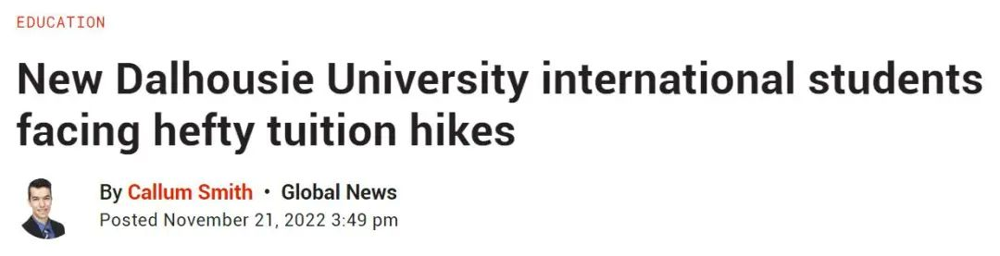
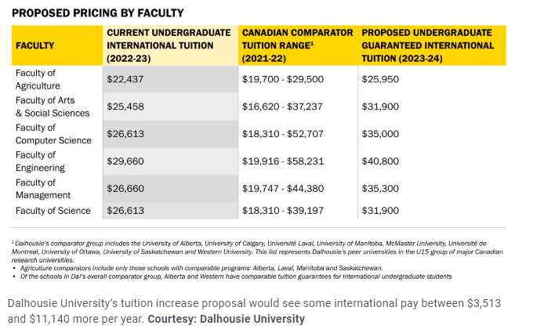
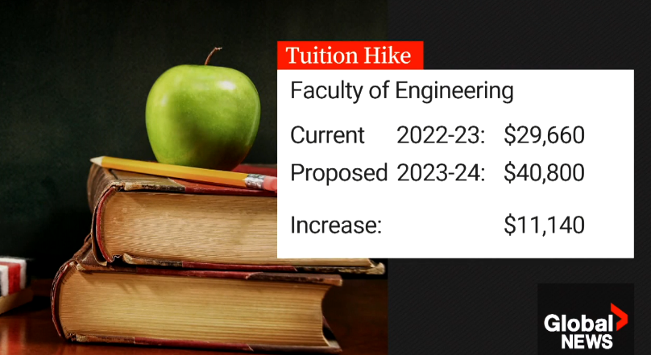
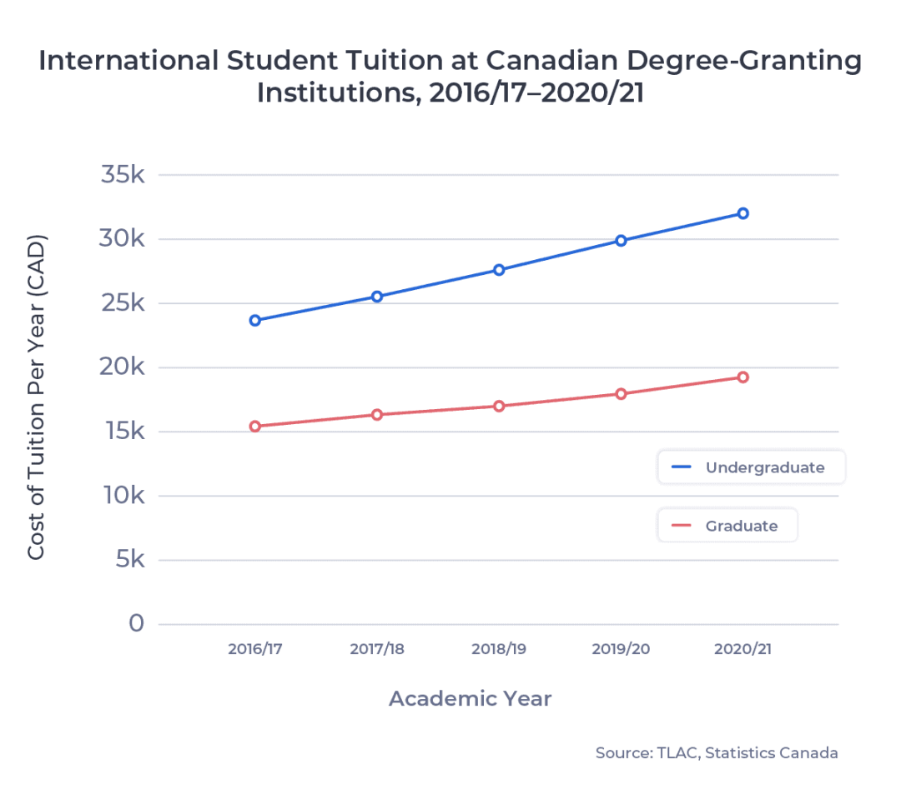
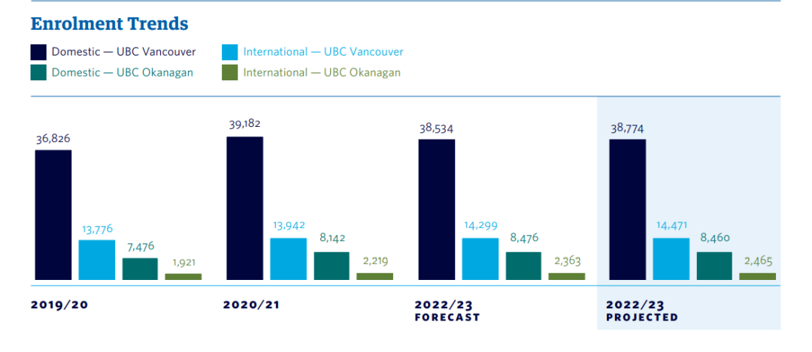
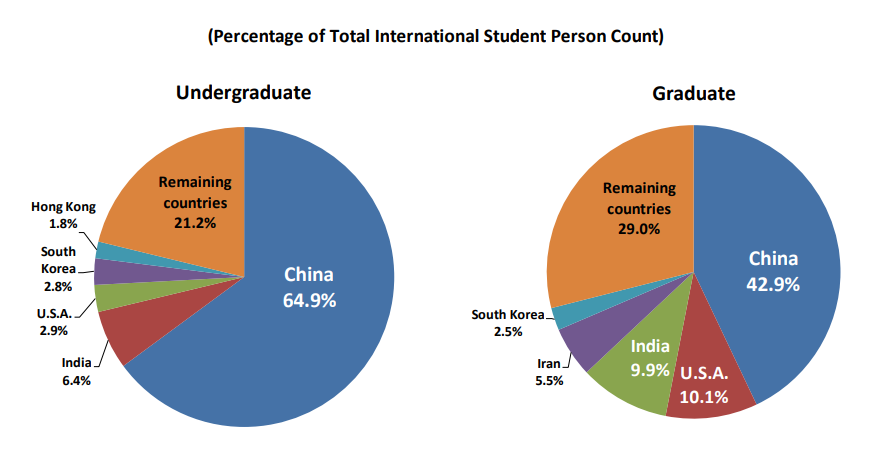
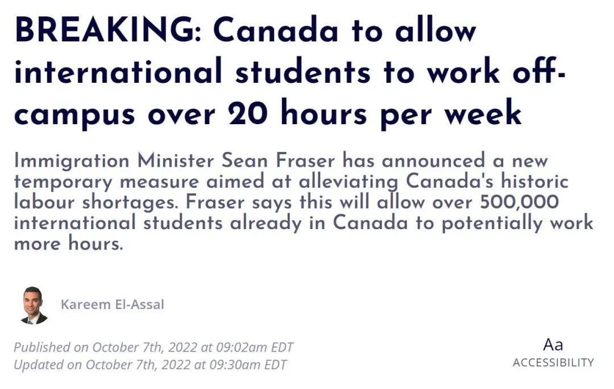
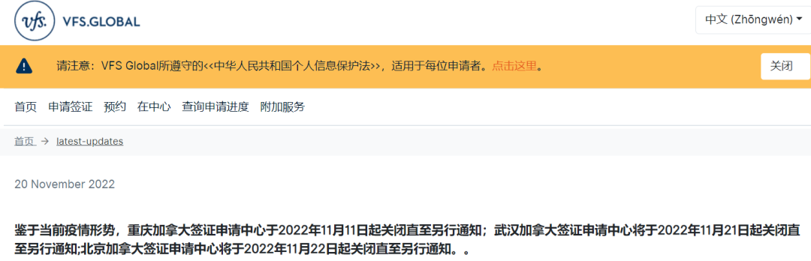
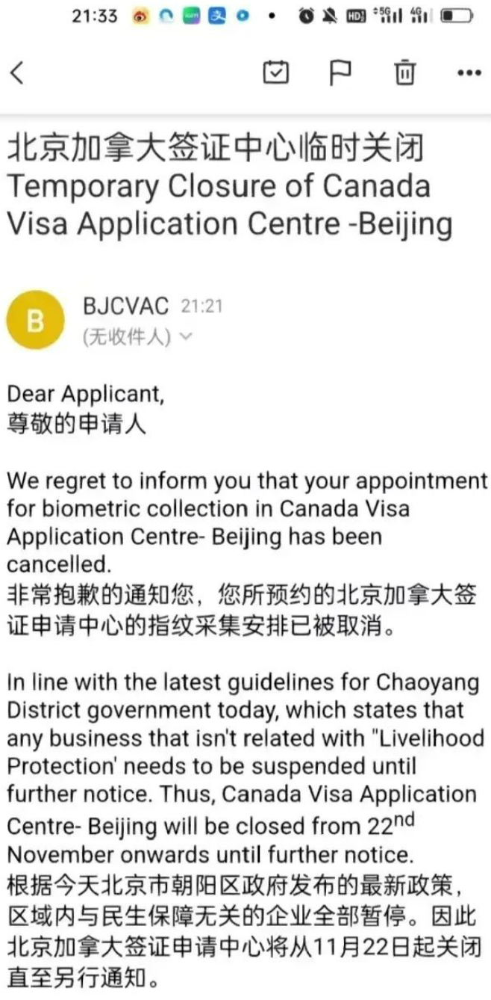
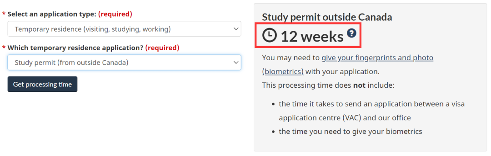

# 无标题

**链接地址:** http://mp.weixin.qq.com/s?__biz=MzUyNzA2NTAwNg==&mid=2247491899&idx=1&sn=aa83d19a2a7aade94971699fb6c3a26c&chksm=fa07ebfacd7062ec2624805658fe5adbcc11e436cd624fb31ba576d5889a95168855dd12df58&mpshare=1&scene=2&srcid=1202VcksixsU2BHTkMRXlkA8&sharer_sharetime=1669945871667&sharer_shareid=77848a6b3852ae4dcb6c74ffee84743c#rd
**作者:** 你身边的签证专家
**获取时间:** 2025/8/28 19:23:04
**图片数量:** 23

---

## 原始HTML内容

<section style="box-sizing: border-box;font-size: 16px;"><section style="text-align: center;margin-top: 10px;margin-bottom: 10px;line-height: 0;box-sizing: border-box;" powered-by="xiumi.us"><section style="max-width: 100%;vertical-align: middle;display: inline-block;line-height: 0;box-sizing: border-box;"></section></section><section style="text-align: center;margin-top: 10px;margin-bottom: 10px;line-height: 0;box-sizing: border-box;" powered-by="xiumi.us"><section style="max-width: 100%;vertical-align: middle;display: inline-block;line-height: 0;box-sizing: border-box;"></section></section>
 
<section style="font-size: 19px;text-align: center;margin-top: 10px;margin-bottom: 3px;box-sizing: border-box;" powered-by="xiumi.us"><section style="display: inline-block;border-width: 1px;border-style: solid;border-color: rgb(188, 65, 65);background-color: rgb(188, 65, 65);width: 1.8em;height: 1.8em;line-height: 1.8em;border-radius: 100%;margin-left: auto;margin-right: auto;font-size: 16px;color: rgb(255, 255, 255);box-sizing: border-box;">
<strong style="box-sizing: border-box;">1</strong>
</section></section><section style="text-align: center;box-sizing: border-box;" powered-by="xiumi.us"><section style="display: inline-block;width: 0px;height: 0px;vertical-align: top;overflow: hidden;border-style: solid;border-width: 9px 6px 0px;border-color: rgb(188, 65, 65) rgba(255, 255, 255, 0) rgba(255, 255, 255, 0);box-sizing: border-box;"><svg viewBox="0 0 1 1" style="float:left;line-height:0;width:0;vertical-align:top;"></svg></section></section><section style="margin-bottom: 10px;text-align: center;justify-content: center;display: flex;flex-flow: row nowrap;box-sizing: border-box;" powered-by="xiumi.us"><section style="display: inline-block;width: auto;vertical-align: middle;background-color: rgba(109, 155, 209, 0.1);min-width: 10%;max-width: 100%;flex: 0 0 auto;height: auto;align-self: center;padding: 12px;box-sizing: border-box;"><section style="color: rgb(109, 155, 209);text-align: justify;box-sizing: border-box;" powered-by="xiumi.us">
<strong style="box-sizing: border-box;">加国留学生学费水涨船高</strong> 
</section></section></section>
 
<section style="font-size: 14px;padding-right: 15px;padding-left: 15px;letter-spacing: 1px;box-sizing: border-box;" powered-by="xiumi.us">
学费一直是留学生最关心的话题之一。最近几年因为疫情影响，加拿大各大高校的留学费用可谓是<strong style="box-sizing: border-box;">蹭蹭蹭地上涨</strong>！

 

根据多伦多大学官网学费公示，今年多个中国留学生热门专业学费上涨都超过了$1000加元，并且<strong style="box-sizing: border-box;">明年还要再涨近$2000加元</strong>。

 
</section><section style="text-align: center;margin-top: 10px;margin-bottom: 10px;line-height: 0;box-sizing: border-box;" powered-by="xiumi.us"><section style="max-width: 100%;vertical-align: middle;display: inline-block;line-height: 0;width: 90%;height: auto;box-sizing: border-box;"></section></section><section style="text-align: center;box-sizing: border-box;" powered-by="xiumi.us"><section style="max-width: 100%;vertical-align: middle;display: inline-block;line-height: 0;width: 90%;height: auto;box-sizing: border-box;"></section></section><section style="font-size: 14px;padding-right: 15px;padding-left: 15px;letter-spacing: 1px;box-sizing: border-box;" powered-by="xiumi.us">
 

然而近日另一所加拿大的高校正在探讨一个新提案，这个提案将会使国际生的学费<strong style="box-sizing: border-box;">最高增加$11,140加元</strong>。

 
</section><section style="font-size: 14px;padding-right: 15px;padding-left: 15px;letter-spacing: 1px;box-sizing: border-box;" powered-by="xiumi.us">
 
</section><section style="text-align: center;box-sizing: border-box;" powered-by="xiumi.us"><section style="max-width: 100%;vertical-align: middle;display: inline-block;line-height: 0;width: 90%;height: auto;box-sizing: border-box;"></section></section><section style="font-size: 14px;padding-right: 15px;padding-left: 15px;letter-spacing: 1px;box-sizing: border-box;" powered-by="xiumi.us">
 

2023-2024学年，达尔豪斯大学（Dalhousie University）的许多新国际学生的学费可能会大幅增加，这让学生们感到很沮丧。

 

该提案将致使六个不同院系的新国际学生<strong style="box-sizing: border-box;">面临每年平均超过$7200加元的增长</strong>，并且在他们的学习期间锁定这一比率。

 

如果获得批准，在2023-24学年开始学习的工程系学生将面临最大的增幅，比2022-23学年入学的学生多支付$11,140加元。

 
</section><section style="text-align: center;margin-top: 10px;margin-bottom: 10px;line-height: 0;box-sizing: border-box;" powered-by="xiumi.us"><section style="max-width: 100%;vertical-align: middle;display: inline-block;line-height: 0;width: 90%;height: auto;box-sizing: border-box;"></section></section><section style="font-size: 14px;padding-right: 15px;padding-left: 15px;letter-spacing: 1px;box-sizing: border-box;" powered-by="xiumi.us">
 

虽然目前的学生不会受到这一提议的影响，但他们对此举将产生的影响表示担忧。 

 

学生Hamdaan Baig说：「<strong style="box-sizing: border-box;">国际学生的学费已经相当高了</strong>，而且对于我们来说，对于哈利法克斯的任何人来说，我们的工资真的很低。」

 

「但我们的税是15%，是全国最高的。」

 
</section><section style="text-align: center;margin-top: 10px;margin-bottom: 10px;line-height: 0;box-sizing: border-box;" powered-by="xiumi.us"><section style="max-width: 100%;vertical-align: middle;display: inline-block;line-height: 0;box-sizing: border-box;"></section></section><section style="font-size: 14px;padding-right: 15px;padding-left: 15px;letter-spacing: 1px;box-sizing: border-box;" powered-by="xiumi.us">
 

该大学周一拒绝了媒体的采访请求，但在一份声明中说，该提案将有助于使其与其他「类似的」加拿大大学保持一致，同时还提供了<strong style="box-sizing: border-box;">「学费保障」</strong>。

 

「达尔豪斯大学的国际学费目前低于我们的类似大学的平均水平，」大学发言人Janet Bryson在一份声明中写道。

 

但Bryson没有回答为什么该提案只影响国际学生。

 

 
</section><section style="font-size: 19px;text-align: center;margin-top: 10px;margin-bottom: 3px;box-sizing: border-box;" powered-by="xiumi.us"><section style="display: inline-block;border-width: 1px;border-style: solid;border-color: rgb(188, 65, 65);background-color: rgb(188, 65, 65);width: 1.8em;height: 1.8em;line-height: 1.8em;border-radius: 100%;margin-left: auto;margin-right: auto;font-size: 16px;color: rgb(255, 255, 255);box-sizing: border-box;">
<strong style="box-sizing: border-box;">2</strong>
</section></section><section style="text-align: center;box-sizing: border-box;" powered-by="xiumi.us"><section style="display: inline-block;width: 0px;height: 0px;vertical-align: top;overflow: hidden;border-style: solid;border-width: 9px 6px 0px;border-color: rgb(188, 65, 65) rgba(255, 255, 255, 0) rgba(255, 255, 255, 0);box-sizing: border-box;"><svg viewBox="0 0 1 1" style="float:left;line-height:0;width:0;vertical-align:top;"></svg></section></section><section style="margin-bottom: 10px;text-align: center;justify-content: center;display: flex;flex-flow: row nowrap;box-sizing: border-box;" powered-by="xiumi.us"><section style="display: inline-block;width: auto;vertical-align: middle;background-color: rgba(109, 155, 209, 0.1);min-width: 10%;max-width: 100%;flex: 0 0 auto;height: auto;align-self: center;padding: 12px;box-sizing: border-box;"><section style="color: rgb(109, 155, 209);text-align: justify;box-sizing: border-box;" powered-by="xiumi.us">
<strong style="box-sizing: border-box;">留学生是加国大学的“摇钱树”</strong> 
</section></section></section><section style="font-size: 14px;padding-right: 15px;padding-left: 15px;letter-spacing: 1px;box-sizing: border-box;" powered-by="xiumi.us">
 

达尔豪斯大学的一份预算文件说，2022-23学年，包括国际学生在内的学生的<strong style="box-sizing: border-box;">学费已经增加了3%</strong>，十多年来，每年增加的数额是一样的。

 

国际学生的学费问题一直处于风口浪尖，渥太华大学的国际和法语国家副校长、加拿大皇家学会的成员Sanni Yaya曾说，<strong style="box-sizing: border-box;">加拿大的学校都把留学生当“摇钱树”</strong>！

 

据报道，<strong style="box-sizing: border-box;">国际学生面临着每年高达20%的学费增长</strong>。根据安省审计长的说法，在安省学院就读的国际学生平均支付$14,306元，而国内学生平均支付$3,228元。

 
</section><section style="text-align: center;margin-top: 10px;margin-bottom: 10px;line-height: 0;box-sizing: border-box;" powered-by="xiumi.us"><section style="max-width: 100%;vertical-align: middle;display: inline-block;line-height: 0;width: 90%;height: auto;box-sizing: border-box;"></section></section><section style="font-size: 14px;padding-right: 15px;padding-left: 15px;letter-spacing: 1px;box-sizing: border-box;" powered-by="xiumi.us">
 

虽然国际生只占安省24所学院学生总数的30%，但<strong style="box-sizing: border-box;">国际学生提供了68%的学费收入</strong>。去年，仅他们的费用就达$17亿元，这比各学院收到的省级补助金还要多。 

 
</section><section style="text-align: center;box-sizing: border-box;" powered-by="xiumi.us"><section style="max-width: 100%;vertical-align: middle;display: inline-block;line-height: 0;width: 90%;height: auto;box-sizing: border-box;"></section></section><section style="font-size: 14px;padding-right: 15px;padding-left: 15px;letter-spacing: 1px;box-sizing: border-box;" powered-by="xiumi.us">
 

在2020-21年，国际学费占UBC<strong style="box-sizing: border-box;">大学营业收入的25%</strong>，而国际学生只占学生总数的28.6%。 

 
</section><section style="box-sizing: border-box;" powered-by="xiumi.us"><section style="max-width: 100%;vertical-align: middle;display: inline-block;line-height: 0;box-sizing: border-box;"></section></section><section style="font-size: 14px;padding-right: 15px;padding-left: 15px;letter-spacing: 1px;box-sizing: border-box;" powered-by="xiumi.us">
 

人们很容易想象国际生学费对多伦多大学或麦吉尔大学预算的贡献，那里的国际学生分别占学生总数的26.8％和近31.8％，这<strong style="box-sizing: border-box;">其</strong><strong style="box-sizing: border-box;">中过半留学生来自中国大陆</strong>。说收到学费暴涨影响最严重的是中国留学生群体丝毫不夸张。

 

 
</section><section style="font-size: 19px;text-align: center;margin-top: 10px;margin-bottom: 3px;box-sizing: border-box;" powered-by="xiumi.us"><section style="display: inline-block;border-width: 1px;border-style: solid;border-color: rgb(188, 65, 65);background-color: rgb(188, 65, 65);width: 1.8em;height: 1.8em;line-height: 1.8em;border-radius: 100%;margin-left: auto;margin-right: auto;font-size: 16px;color: rgb(255, 255, 255);box-sizing: border-box;">
<strong style="box-sizing: border-box;">3</strong>
</section></section><section style="text-align: center;box-sizing: border-box;" powered-by="xiumi.us"><section style="display: inline-block;width: 0px;height: 0px;vertical-align: top;overflow: hidden;border-style: solid;border-width: 9px 6px 0px;border-color: rgb(188, 65, 65) rgba(255, 255, 255, 0) rgba(255, 255, 255, 0);box-sizing: border-box;"><svg viewBox="0 0 1 1" style="float:left;line-height:0;width:0;vertical-align:top;"></svg></section></section><section style="margin-bottom: 10px;text-align: center;justify-content: center;display: flex;flex-flow: row nowrap;box-sizing: border-box;" powered-by="xiumi.us"><section style="display: inline-block;width: auto;vertical-align: middle;background-color: rgba(109, 155, 209, 0.1);min-width: 10%;max-width: 100%;flex: 0 0 auto;height: auto;align-self: center;padding: 12px;box-sizing: border-box;"><section style="color: rgb(109, 155, 209);text-align: justify;box-sizing: border-box;" powered-by="xiumi.us">
<strong style="box-sizing: border-box;">留学生成为食品银行常客</strong> 
</section></section></section><section style="margin: 10px 0%;box-sizing: border-box;" powered-by="xiumi.us"><section style="font-size: 15px;letter-spacing: 1.6px;padding-right: 15px;padding-left: 15px;box-sizing: border-box;">
 

那么，对于“人傻钱多”的留学生群体们来说，加拿大的留学生活到底是怎样的呢？

 

说起在留学生，许多人早已对他们形成了<strong style="box-sizing: border-box;">“挥霍父母财富的纨绔子弟”</strong>这种固有印象。但部分光鲜亮丽的留学生群体并不能完全代表背后广大留学生的真实生活状态。 

 
</section></section><section style="text-align: center;margin-top: 10px;margin-bottom: 10px;line-height: 0;box-sizing: border-box;" powered-by="xiumi.us"><section style="max-width: 100%;vertical-align: middle;display: inline-block;line-height: 0;width: 90%;height: auto;box-sizing: border-box;"></section></section><section style="margin: 10px 0%;box-sizing: border-box;" powered-by="xiumi.us"><section style="font-size: 15px;letter-spacing: 1.6px;padding-right: 15px;padding-left: 15px;box-sizing: border-box;">
 

2022年的加拿大在供应链危机、气候灾害、货币政策和战争影响下迈入了通胀高企的一年，这让许多在加拿大没有亲人可以依靠的留学生群体遭遇了<strong style="box-sizing: border-box;">史无前例的食品安全危机</strong>。

 

令人难以想象的是，这个许多人固有印象中过着优渥生活的群体实际上是<strong style="box-sizing: border-box;">加国食品银行的常客</strong>。

 
</section></section><section style="text-align: center;margin-top: 10px;margin-bottom: 10px;line-height: 0;box-sizing: border-box;" powered-by="xiumi.us"><section style="max-width: 100%;vertical-align: middle;display: inline-block;line-height: 0;width: 90%;height: auto;box-sizing: border-box;"></section></section><section style="margin: 10px 0%;box-sizing: border-box;" powered-by="xiumi.us"><section style="font-size: 15px;letter-spacing: 1.6px;padding-right: 15px;padding-left: 15px;box-sizing: border-box;">
 

所谓食品银行是一个专为穷人服务的特殊“银行”，一个遍布加拿大全国各地的福利机构。“银行”的主要职责是从各个渠道搜集食物，存入“食物银行仓库”，然后提供给需要帮助的人。

 

日前，温哥华一家食品银行表示，目前其账簿上<strong style="box-sizing: border-box;">四分之三的学生是国际留学生</strong>。

 
</section></section><section style="text-align: center;margin-top: 10px;margin-bottom: 10px;line-height: 0;box-sizing: border-box;" powered-by="xiumi.us"><section style="max-width: 100%;vertical-align: middle;display: inline-block;line-height: 0;width: 90%;height: auto;box-sizing: border-box;"></section></section><section style="text-align: center;margin-top: 10px;margin-bottom: 10px;line-height: 0;box-sizing: border-box;" powered-by="xiumi.us"><section style="max-width: 100%;vertical-align: middle;display: inline-block;line-height: 0;width: 90%;height: auto;box-sizing: border-box;"></section></section><section style="margin: 10px 0%;box-sizing: border-box;" powered-by="xiumi.us"><section style="font-size: 15px;letter-spacing: 1.6px;padding-right: 15px;padding-left: 15px;box-sizing: border-box;">
 

2022年10月，加拿大移民部长肖恩·弗雷泽（Sean Fraser）发布最新临时政令：从2022年11月15日到2023年12月31日，加拿大的国际留学生被允许在全职上学的期间内<strong style="box-sizing: border-box;">在校外工作超过20小时</strong>！

 

然而这样的政策在暴涨的学费和生活费面前依然<strong style="box-sizing: border-box;">杯水车薪</strong>。11,140加元的学费涨幅需要领着加拿大最低工资的留学生们<strong style="box-sizing: border-box;">工作700多个小时才能弥补</strong>，更不要计算可能到来的严重通胀对学生的影响。

 
</section></section><section style="text-align: center;margin-top: 10px;margin-bottom: 10px;line-height: 0;box-sizing: border-box;" powered-by="xiumi.us"><section style="max-width: 100%;vertical-align: middle;display: inline-block;line-height: 0;box-sizing: border-box;"></section></section>
 
<section style="font-size: 19px;text-align: center;margin-top: 10px;margin-bottom: 3px;box-sizing: border-box;" powered-by="xiumi.us"><section style="display: inline-block;border-width: 1px;border-style: solid;border-color: rgb(188, 65, 65);background-color: rgb(188, 65, 65);width: 1.8em;height: 1.8em;line-height: 1.8em;border-radius: 100%;margin-left: auto;margin-right: auto;font-size: 16px;color: rgb(255, 255, 255);box-sizing: border-box;">
<strong style="box-sizing: border-box;">4</strong>
</section></section><section style="text-align: center;box-sizing: border-box;" powered-by="xiumi.us"><section style="display: inline-block;width: 0px;height: 0px;vertical-align: top;overflow: hidden;border-style: solid;border-width: 9px 6px 0px;border-color: rgb(188, 65, 65) rgba(255, 255, 255, 0) rgba(255, 255, 255, 0);box-sizing: border-box;"><svg viewBox="0 0 1 1" style="float:left;line-height:0;width:0;vertical-align:top;"></svg></section></section><section style="margin-bottom: 10px;text-align: center;justify-content: center;display: flex;flex-flow: row nowrap;box-sizing: border-box;" powered-by="xiumi.us"><section style="display: inline-block;width: auto;vertical-align: middle;background-color: rgba(109, 155, 209, 0.1);min-width: 10%;max-width: 100%;flex: 0 0 auto;height: auto;align-self: center;padding: 12px;box-sizing: border-box;"><section style="color: rgb(109, 155, 209);text-align: justify;box-sizing: border-box;" powered-by="xiumi.us">
<strong style="box-sizing: border-box;">北京加拿大签证申请中心临时关闭</strong>
</section></section></section><section style="font-size: 14px;padding-right: 15px;padding-left: 15px;letter-spacing: 1px;box-sizing: border-box;" powered-by="xiumi.us">
 

繁重的课业压力，昂贵的学费和生活费……加拿大的留学之路并不容易。每一个留学生从申请学校开始就可以感受到这样的压力。但近期，另一个影响留学生申请加拿大学习签证的新闻又登上了热搜：

 

当地时间11月20日，北京加拿大签证申请中心（VAC）发出通知称，鉴于当前疫情形势，<strong style="box-sizing: border-box;">将于2022年11月22日起关闭直至另行通知</strong>。

 
</section><section style="text-align: center;box-sizing: border-box;" powered-by="xiumi.us"><section style="max-width: 100%;vertical-align: middle;display: inline-block;line-height: 0;width: 90%;height: auto;box-sizing: border-box;"></section></section><section style="font-size: 14px;padding-right: 15px;padding-left: 15px;letter-spacing: 1px;box-sizing: border-box;" powered-by="xiumi.us">
 

通知还称：鉴于当前疫情形势，<strong style="box-sizing: border-box;">重庆加拿大签证申请中心于2022年11月11日起关闭直至另行通知；武汉加拿大签证申请中心将于2022年11月21日起关闭直至另行通知。</strong>

 

根据网友收到的通知显示，此前预约的指纹采集已被取消。

 
</section><section style="text-align: center;box-sizing: border-box;" powered-by="xiumi.us"><section style="max-width: 100%;vertical-align: middle;display: inline-block;line-height: 0;width: 65%;height: auto;box-sizing: border-box;"></section></section><section style="font-size: 14px;padding-right: 15px;padding-left: 15px;letter-spacing: 1px;box-sizing: border-box;" powered-by="xiumi.us">
 

通知称，鉴于北京朝阳区政府发布的最新政策，所在区域内和民生保障无关的企业全部暂停营业，因此，加拿大北京签证中心将从11月22日起，关闭至另行通知。 

 

这是继5月9日之后，<strong style="box-sizing: border-box;">北京加拿大签证申请中心再一次暂时关闭</strong>。这将会影响准备在冬季学期入学加拿大高校留学生的签证办理周期。

 
</section><section style="text-align: center;box-sizing: border-box;" powered-by="xiumi.us"><section style="max-width: 100%;vertical-align: middle;display: inline-block;line-height: 0;width: 90%;height: auto;box-sizing: border-box;"></section></section><section style="font-size: 14px;padding-right: 15px;padding-left: 15px;letter-spacing: 1px;box-sizing: border-box;" powered-by="xiumi.us">
 

希望留学生朋友们在计划自己的求学安排时一定要考虑到<strong style="box-sizing: border-box;">各类突发因素的影响</strong>，尽早准备好证件提前办理，不要因此耽误了自己的学业安排。

 

如果您对办理包括学签在内的各项加拿大签证或永居业务需要帮助，欢迎联系<strong style="box-sizing: border-box;">新时代留学移民法律事务所</strong>，为您制定最专业、最贴心、最有经验的专属顾问服务！

 

 
</section><section style="text-align: left;justify-content: flex-start;display: flex;flex-flow: row nowrap;margin-top: 10px;box-sizing: border-box;" powered-by="xiumi.us"><section style="display: inline-block;vertical-align: top;width: auto;align-self: stretch;flex: 0 0 auto;background-color: rgb(188, 65, 65);min-width: 5%;max-width: 100%;height: auto;padding-top: 9px;padding-right: 9px;padding-left: 20px;box-sizing: border-box;"><section style="text-align: justify;font-size: 18px;color: rgb(252, 252, 252);box-sizing: border-box;" powered-by="xiumi.us">
<strong style="box-sizing: border-box;">阅读更多</strong>
</section></section><section style="display: inline-block;vertical-align: top;width: auto;min-width: 5%;max-width: 100%;flex: 0 0 auto;height: auto;align-self: stretch;box-sizing: border-box;"><section style="box-sizing: border-box;" powered-by="xiumi.us"><section style="display: inline-block;width: 0px;height: 0px;vertical-align: top;overflow: hidden;border-style: solid;border-width: 45px 0px 0px 19px;border-color: rgba(255, 255, 255, 0) rgba(255, 255, 255, 0) rgba(255, 255, 255, 0) rgb(188, 65, 65);box-sizing: border-box;"><svg viewBox="0 0 1 1" style="float:left;line-height:0;width:0;vertical-align:top;"></svg></section></section></section></section><section style="margin-bottom: 10px;box-sizing: border-box;" powered-by="xiumi.us"><section style="background-color: rgb(188, 65, 65);height: 3px;box-sizing: border-box;"><svg viewBox="0 0 1 1" style="float:left;line-height:0;width:0;vertical-align:top;"></svg></section></section><section style="margin: 10px 0%;text-align: left;justify-content: flex-start;display: flex;flex-flow: row nowrap;box-sizing: border-box;" powered-by="xiumi.us"><section style="display: inline-block;width: 100%;vertical-align: top;background-position: 55.6015% 33.1154%;background-repeat: repeat;background-size: 100.637%;background-attachment: scroll;padding: 30px;align-self: flex-start;flex: 0 0 auto;background-image: url(&quot;https://mmbiz.qpic.cn/mmbiz_jpg/904kUibXm7Y6NyeySSdPiceEJxeOSuNKfbD8xPxiau7dhyXgpkWsQ1uAxQDWShYs21nXZfVWx0Med3UcXX17iaic9Kg/640?wx_fmt=jpeg&quot;);box-sizing: border-box;"><section style="text-align: justify;justify-content: flex-start;display: flex;flex-flow: row nowrap;box-sizing: border-box;" powered-by="xiumi.us"><section style="display: inline-block;width: 100%;vertical-align: top;background-color: rgba(188, 65, 65, 0.22);padding: 10px;border-width: 0px;border-style: none;border-color: rgb(62, 62, 62);align-self: flex-start;flex: 0 0 auto;box-sizing: border-box;"><section style="text-align: center;color: rgb(255, 255, 255);font-size: 14px;box-sizing: border-box;" powered-by="xiumi.us">
<a target="_blank" href="http://mp.weixin.qq.com/s?__biz=MzUyNzA2NTAwNg==&amp;mid=2247491867&amp;idx=1&amp;sn=d34304deea782ec6c542871324e3d17c&amp;chksm=fa07ebdacd7062cccc341f3e76249c031b8726ee05bf2dba29a73810b18d46c60d21c8387ce6&amp;scene=21#wechat_redirect" textvalue="加拿大父母陪读签证好拿吗？怎么转学签或者工签？" linktype="text" imgurl="" imgdata="null" data-itemshowtype="0" tab="innerlink" style="color: rgb(255, 255, 255);" data-linktype="2"><strong style="box-sizing: border-box;">加拿大父母陪读签证好拿吗？怎么转学签或者工签？</strong></a>
</section></section></section></section></section><section style="margin: 10px 0%;text-align: left;justify-content: flex-start;display: flex;flex-flow: row nowrap;box-sizing: border-box;" powered-by="xiumi.us"><section style="display: inline-block;width: 100%;vertical-align: top;background-position: -26.3755% 52.8617%;background-repeat: repeat;background-size: 100.637%;background-attachment: scroll;padding: 30px;align-self: flex-start;flex: 0 0 auto;background-image: url(&quot;https://mmbiz.qpic.cn/mmbiz_jpg/904kUibXm7Y6NyeySSdPiceEJxeOSuNKfb3aZWFy9OCbO0ia8CXYqia06h073icIL2sCqMwXFU3IT1gpIh2ibCzORjCA/640?wx_fmt=jpeg&quot;);box-sizing: border-box;"><section style="text-align: justify;justify-content: flex-start;display: flex;flex-flow: row nowrap;box-sizing: border-box;" powered-by="xiumi.us"><section style="display: inline-block;width: 100%;vertical-align: top;background-color: rgba(188, 65, 65, 0.22);padding: 10px;border-width: 0px;border-style: none;border-color: rgb(62, 62, 62);align-self: flex-start;flex: 0 0 auto;box-sizing: border-box;"><section style="text-align: center;color: rgb(255, 255, 255);font-size: 14px;box-sizing: border-box;" powered-by="xiumi.us">
<a target="_blank" href="http://mp.weixin.qq.com/s?__biz=MzUyNzA2NTAwNg==&amp;mid=2247491772&amp;idx=1&amp;sn=2af85b162dd90b2f4af4fca48a497e0a&amp;chksm=fa07ea7dcd70636b9e49af3c20eec8c4a3e53cb0031aa5728655bcf96cdd7781e6619c222770&amp;scene=21#wechat_redirect" textvalue="加拿大移民EE快速通道分数跌至494，明年第一季度即将迎来“重大改革”！" linktype="text" imgurl="" imgdata="null" data-itemshowtype="0" tab="innerlink" style="color: rgb(255, 255, 255);" data-linktype="2"><strong style="box-sizing: border-box;">加拿大移民EE快速通道分数跌至494，明年第一季度即将迎来“重大改革”！</strong></a>
</section></section></section></section></section><section style="margin: 10px 0%;text-align: left;justify-content: flex-start;display: flex;flex-flow: row nowrap;box-sizing: border-box;" powered-by="xiumi.us"><section style="display: inline-block;width: 100%;vertical-align: top;background-position: 137.578% 27.8193%;background-repeat: repeat;background-size: 100.637%;background-attachment: scroll;padding: 30px;align-self: flex-start;flex: 0 0 auto;background-image: url(&quot;https://mmbiz.qpic.cn/mmbiz_jpg/904kUibXm7Y6NyeySSdPiceEJxeOSuNKfbSuqdvdibIXlHVxGicEicCsicYm6S4pbh1xTJaBRN54GvwDS7Hlde0bqL7Q/640?wx_fmt=jpeg&quot;);box-sizing: border-box;"><section style="text-align: justify;justify-content: flex-start;display: flex;flex-flow: row nowrap;box-sizing: border-box;" powered-by="xiumi.us"><section style="display: inline-block;width: 100%;vertical-align: top;background-color: rgba(188, 65, 65, 0.22);padding: 10px;border-width: 0px;border-style: none;border-color: rgb(62, 62, 62);align-self: flex-start;flex: 0 0 auto;box-sizing: border-box;"><section style="text-align: center;color: rgb(255, 255, 255);font-size: 14px;box-sizing: border-box;" powered-by="xiumi.us">
<a target="_blank" href="http://mp.weixin.qq.com/s?__biz=MzUyNzA2NTAwNg==&amp;mid=2247491739&amp;idx=1&amp;sn=26f7ed9e3bc578132ef7ce9dd771765b&amp;chksm=fa07ea5acd70634c7a4fe39e0cd7bbaa75887d69d4fd7dd540282a10d0ff374b9bb907d9de88&amp;scene=21#wechat_redirect" textvalue="黄金性价比！加拿大留学打工低成本高工资的城市推荐！" linktype="text" imgurl="" imgdata="null" data-itemshowtype="0" tab="innerlink" style="color: rgb(255, 255, 255);" data-linktype="2"><strong style="box-sizing: border-box;">黄金性价比！加拿大留学打工低成本高工资的城市推荐！</strong></a>
</section></section></section></section></section><section style="margin: 10px 0%;text-align: left;justify-content: flex-start;display: flex;flex-flow: row nowrap;box-sizing: border-box;" powered-by="xiumi.us"><section style="display: inline-block;width: 100%;vertical-align: top;background-position: 55.6015% 33.1154%;background-repeat: repeat;background-size: 100.637%;background-attachment: scroll;padding: 30px;align-self: flex-start;flex: 0 0 auto;background-image: url(&quot;https://mmbiz.qpic.cn/mmbiz_jpg/904kUibXm7Y6NyeySSdPiceEJxeOSuNKfbI6AjPeGSnibzQQzsnjhibhGHiawde2Gd0g1Igh1sqDHrHNiaErGfV8IymA/640?wx_fmt=jpeg&quot;);box-sizing: border-box;"><section style="text-align: justify;justify-content: flex-start;display: flex;flex-flow: row nowrap;box-sizing: border-box;" powered-by="xiumi.us"><section style="display: inline-block;width: 100%;vertical-align: top;background-color: rgba(188, 65, 65, 0.22);padding: 10px;border-width: 0px;border-style: none;border-color: rgb(62, 62, 62);align-self: flex-start;flex: 0 0 auto;box-sizing: border-box;"><section style="text-align: center;color: rgb(255, 255, 255);font-size: 14px;box-sizing: border-box;" powered-by="xiumi.us">
<a target="_blank" href="http://mp.weixin.qq.com/s?__biz=MzUyNzA2NTAwNg==&amp;mid=2247491674&amp;idx=1&amp;sn=a8da94523a70a1721034b273354cec37&amp;chksm=fa07ea9bcd70638df523cc586291f879b55bbcc6e4572f6b74ffedc3ac315bfdadb8ec7b239e&amp;scene=21#wechat_redirect" textvalue="严重缺人！加拿大军队破天荒允许永久居民入伍，大量高薪高福利职位待申！" linktype="text" imgurl="" imgdata="null" data-itemshowtype="0" tab="innerlink" style="color: rgb(255, 255, 255);" data-linktype="2"><strong style="box-sizing: border-box;">严重缺人！加拿大军队破天荒允许永久居民入伍，大量高薪高福利职位待申！</strong></a>
</section></section></section></section></section><section style="text-align: center;font-size: 12px;color: rgb(180, 180, 180);box-sizing: border-box;" powered-by="xiumi.us">
（点击文字阅读）
</section><section style="margin: 10px 0%;text-align: left;justify-content: flex-start;display: flex;flex-flow: row nowrap;box-sizing: border-box;" powered-by="xiumi.us"><section style="display: inline-block;width: 100%;vertical-align: top;background-color: rgb(216, 202, 160);line-height: 0;align-self: flex-start;flex: 0 0 auto;box-sizing: border-box;"><section style="text-align: justify;justify-content: flex-start;display: flex;flex-flow: row nowrap;box-sizing: border-box;" powered-by="xiumi.us"><section style="display: inline-block;width: 100%;vertical-align: top;background-position: 0% 0%;background-repeat: repeat;background-size: 1.56658%;background-attachment: scroll;align-self: flex-start;flex: 0 0 auto;background-image: url(&quot;https://mmbiz.qpic.cn/mmbiz_png/904kUibXm7Y6NyeySSdPiceEJxeOSuNKfbib0uuB9FIquWvQGsIWVLOUekDyMrzekO8ibR9kVbPPXx7sIicNe8z3OpQ/640?wx_fmt=png&quot;);box-sizing: border-box;"><section style="text-align: center;box-sizing: border-box;" powered-by="xiumi.us"><section style="display: inline-block;width: 100%;height: 11px;vertical-align: top;overflow: hidden;background-color: rgba(255, 255, 255, 0);box-sizing: border-box;"><svg viewBox="0 0 1 1" style="float:left;line-height:0;width:0;vertical-align:top;"></svg></section></section></section></section></section></section><section style="text-align: center;margin-top: 10px;margin-bottom: 10px;line-height: 0;box-sizing: border-box;" powered-by="xiumi.us"><section style="max-width: 100%;vertical-align: middle;display: inline-block;line-height: 0;box-sizing: border-box;"></section></section><section style="text-align: center;margin-top: 10px;margin-bottom: 10px;line-height: 0;box-sizing: border-box;" powered-by="xiumi.us"><section style="max-width: 100%;vertical-align: middle;display: inline-block;line-height: 0;box-sizing: border-box;"></section></section><section style="text-align: center;margin-top: 10px;margin-bottom: 10px;line-height: 0;box-sizing: border-box;" powered-by="xiumi.us"><section style="max-width: 100%;vertical-align: middle;display: inline-block;line-height: 0;box-sizing: border-box;"></section></section><section style="padding-right: 15px;padding-left: 15px;font-size: 12px;color: rgb(121, 121, 121);box-sizing: border-box;" powered-by="xiumi.us">
<strong style="box-sizing: border-box;">参考信息：</strong>

<strong style="box-sizing: border-box;">https://globalnews.ca/news/9295589/dalhousie-university-international-students-tuition-hike/</strong>
</section><section style="text-align: center;margin-top: 10px;margin-bottom: 10px;line-height: 0;box-sizing: border-box;" powered-by="xiumi.us"><section style="max-width: 100%;vertical-align: middle;display: inline-block;line-height: 0;box-sizing: border-box;"></section></section><section style="text-align: center;margin-top: 10px;margin-bottom: 10px;line-height: 0;box-sizing: border-box;" powered-by="xiumi.us"><section style="max-width: 100%;vertical-align: middle;display: inline-block;line-height: 0;box-sizing: border-box;"></section></section></section>
 

<mp-style-type data-value="3"></mp-style-type>

---

## 纯文本内容

1加国留学生学费水涨船高学费一直是留学生最关心的话题之一。最近几年因为疫情影响，加拿大各大高校的留学费用可谓是蹭蹭蹭地上涨！根据多伦多大学官网学费公示，今年多个中国留学生热门专业学费上涨都超过了$1000加元，并且明年还要再涨近$2000加元。然而近日另一所加拿大的高校正在探讨一个新提案，这个提案将会使国际生的学费最高增加$11,140加元。2023-2024学年，达尔豪斯大学（Dalhousie University）的许多新国际学生的学费可能会大幅增加，这让学生们感到很沮丧。该提案将致使六个不同院系的新国际学生面临每年平均超过$7200加元的增长，并且在他们的学习期间锁定这一比率。如果获得批准，在2023-24学年开始学习的工程系学生将面临最大的增幅，比2022-23学年入学的学生多支付$11,140加元。虽然目前的学生不会受到这一提议的影响，但他们对此举将产生的影响表示担忧。学生Hamdaan Baig说：「国际学生的学费已经相当高了，而且对于我们来说，对于哈利法克斯的任何人来说，我们的工资真的很低。」「但我们的税是15%，是全国最高的。」该大学周一拒绝了媒体的采访请求，但在一份声明中说，该提案将有助于使其与其他「类似的」加拿大大学保持一致，同时还提供了「学费保障」。「达尔豪斯大学的国际学费目前低于我们的类似大学的平均水平，」大学发言人Janet Bryson在一份声明中写道。但Bryson没有回答为什么该提案只影响国际学生。2留学生是加国大学的“摇钱树”达尔豪斯大学的一份预算文件说，2022-23学年，包括国际学生在内的学生的学费已经增加了3%，十多年来，每年增加的数额是一样的。国际学生的学费问题一直处于风口浪尖，渥太华大学的国际和法语国家副校长、加拿大皇家学会的成员Sanni Yaya曾说，加拿大的学校都把留学生当“摇钱树”！据报道，国际学生面临着每年高达20%的学费增长。根据安省审计长的说法，在安省学院就读的国际学生平均支付$14,306元，而国内学生平均支付$3,228元。虽然国际生只占安省24所学院学生总数的30%，但国际学生提供了68%的学费收入。去年，仅他们的费用就达$17亿元，这比各学院收到的省级补助金还要多。在2020-21年，国际学费占UBC大学营业收入的25%，而国际学生只占学生总数的28.6%。人们很容易想象国际生学费对多伦多大学或麦吉尔大学预算的贡献，那里的国际学生分别占学生总数的26.8％和近31.8％，这其中过半留学生来自中国大陆。说收到学费暴涨影响最严重的是中国留学生群体丝毫不夸张。3留学生成为食品银行常客那么，对于“人傻钱多”的留学生群体们来说，加拿大的留学生活到底是怎样的呢？说起在留学生，许多人早已对他们形成了“挥霍父母财富的纨绔子弟”这种固有印象。但部分光鲜亮丽的留学生群体并不能完全代表背后广大留学生的真实生活状态。2022年的加拿大在供应链危机、气候灾害、货币政策和战争影响下迈入了通胀高企的一年，这让许多在加拿大没有亲人可以依靠的留学生群体遭遇了史无前例的食品安全危机。令人难以想象的是，这个许多人固有印象中过着优渥生活的群体实际上是加国食品银行的常客。所谓食品银行是一个专为穷人服务的特殊“银行”，一个遍布加拿大全国各地的福利机构。“银行”的主要职责是从各个渠道搜集食物，存入“食物银行仓库”，然后提供给需要帮助的人。日前，温哥华一家食品银行表示，目前其账簿上四分之三的学生是国际留学生。2022年10月，加拿大移民部长肖恩·弗雷泽（Sean Fraser）发布最新临时政令：从2022年11月15日到2023年12月31日，加拿大的国际留学生被允许在全职上学的期间内在校外工作超过20小时！然而这样的政策在暴涨的学费和生活费面前依然杯水车薪。11,140加元的学费涨幅需要领着加拿大最低工资的留学生们工作700多个小时才能弥补，更不要计算可能到来的严重通胀对学生的影响。4北京加拿大签证申请中心临时关闭繁重的课业压力，昂贵的学费和生活费……加拿大的留学之路并不容易。每一个留学生从申请学校开始就可以感受到这样的压力。但近期，另一个影响留学生申请加拿大学习签证的新闻又登上了热搜：当地时间11月20日，北京加拿大签证申请中心（VAC）发出通知称，鉴于当前疫情形势，将于2022年11月22日起关闭直至另行通知。通知还称：鉴于当前疫情形势，重庆加拿大签证申请中心于2022年11月11日起关闭直至另行通知；武汉加拿大签证申请中心将于2022年11月21日起关闭直至另行通知。根据网友收到的通知显示，此前预约的指纹采集已被取消。通知称，鉴于北京朝阳区政府发布的最新政策，所在区域内和民生保障无关的企业全部暂停营业，因此，加拿大北京签证中心将从11月22日起，关闭至另行通知。这是继5月9日之后，北京加拿大签证申请中心再一次暂时关闭。这将会影响准备在冬季学期入学加拿大高校留学生的签证办理周期。希望留学生朋友们在计划自己的求学安排时一定要考虑到各类突发因素的影响，尽早准备好证件提前办理，不要因此耽误了自己的学业安排。如果您对办理包括学签在内的各项加拿大签证或永居业务需要帮助，欢迎联系新时代留学移民法律事务所，为您制定最专业、最贴心、最有经验的专属顾问服务！阅读更多加拿大父母陪读签证好拿吗？怎么转学签或者工签？加拿大移民EE快速通道分数跌至494，明年第一季度即将迎来“重大改革”！黄金性价比！加拿大留学打工低成本高工资的城市推荐！严重缺人！加拿大军队破天荒允许永久居民入伍，大量高薪高福利职位待申！（点击文字阅读）参考信息：https://globalnews.ca/news/9295589/dalhousie-university-international-students-tuition-hike/

---

## 图片列表

-  (原始链接: https://mmbiz.qpic.cn/mmbiz_jpg/904kUibXm7Y6NyeySSdPiceEJxeOSuNKfb1ftia3aeuXZgF1RaQG04lnxIicFKWO1Pabx9IIMPYaguYS9LRFRibvlAA/640?wx_fmt=jpeg)
-  (原始链接: https://mmbiz.qpic.cn/mmbiz_jpg/904kUibXm7Y6NyeySSdPiceEJxeOSuNKfbYiaBqUWHyR9bJJMEjHqLE45QFjwxVjKhokT8gtSEVMhOxey39YcpSgA/640?wx_fmt=jpeg)
-  (原始链接: https://mmbiz.qpic.cn/mmbiz_jpg/904kUibXm7Y6NyeySSdPiceEJxeOSuNKfbjibMehjicVoGvejaCxHL1KLXCbumP5cQHgicmpZ8dOnHgDCsX0ib8csiaBw/640?wx_fmt=jpeg)
-  (原始链接: https://mmbiz.qpic.cn/mmbiz_png/904kUibXm7Y6NyeySSdPiceEJxeOSuNKfbYsJtN31082YCMyfy0Y415kjyIeyGK3PqtoQk5JqsQo9jMdXiaH4roww/640?wx_fmt=png)
-  (原始链接: https://mmbiz.qpic.cn/mmbiz_png/904kUibXm7Y6NyeySSdPiceEJxeOSuNKfb9IDByRia0Fw01OtYjE3vf0LCg9n5GGLNPrgx9ibw7ka9yIV2g3K8O38g/640?wx_fmt=png)
-  (原始链接: https://mmbiz.qpic.cn/mmbiz_jpg/904kUibXm7Y6NyeySSdPiceEJxeOSuNKfbG1GkElsQ4TAcjIgBHGgxBe5ZWDkpvJzGDdeXFtKI8OLfXH3AZlxiaYQ/640?wx_fmt=jpeg)
-  (原始链接: https://mmbiz.qpic.cn/mmbiz_png/904kUibXm7Y6NyeySSdPiceEJxeOSuNKfbiaTMMsSy44rGIc5vicHgYYzehTUn9JocsOAiaGcB9P78PFZyur3FQr1Hg/640?wx_fmt=png)
-  (原始链接: https://mmbiz.qpic.cn/mmbiz_png/904kUibXm7Y6NyeySSdPiceEJxeOSuNKfb5MUd2u1HnaqUOTZm3Zr8RE8gMqbuhnSPLOTGxC1RU6QFGchVZg92uQ/640?wx_fmt=png)
-  (原始链接: https://mmbiz.qpic.cn/mmbiz_png/904kUibXm7Y6NyeySSdPiceEJxeOSuNKfbkweibRgbfiazHnB6JAQ3mYG9NiahmjcPgUHAT4ZcwQvRc8IloLrDntWSQ/640?wx_fmt=png)
-  (原始链接: https://mmbiz.qpic.cn/mmbiz_png/904kUibXm7Y6NyeySSdPiceEJxeOSuNKfbHQRs27OGHM7Jr1qrECeyI14zL2nsLK8W5sAJQt96UWfj5LVXic1PyCw/640?wx_fmt=png)
-  (原始链接: https://mmbiz.qpic.cn/mmbiz_jpg/904kUibXm7Y6NyeySSdPiceEJxeOSuNKfbWV3VSPhIhUJ3LwUtn38VnCdPhNOfya9GAmuNUFbianOMDRfKd8bPF6Q/640?wx_fmt=jpeg)
-  (原始链接: https://mmbiz.qpic.cn/mmbiz_png/904kUibXm7Y6NyeySSdPiceEJxeOSuNKfbY5BeCf7sibtYwHOicI2AVTuldVkfme34JxBUXXzprF3RYOF5ql2zt1HA/640?wx_fmt=png)
-  (原始链接: https://mmbiz.qpic.cn/mmbiz_jpg/904kUibXm7Y6NyeySSdPiceEJxeOSuNKfbJS14ljU8IJmLfPwGKprk7bzJwe8sLrK4sJ2ThaRt0lhldzVdSevScg/640?wx_fmt=jpeg)
-  (原始链接: https://mmbiz.qpic.cn/mmbiz_jpg/904kUibXm7Y6NyeySSdPiceEJxeOSuNKfbboVoiaMQ8hvSyVbicbU2MQo4TYIn8eaceCLJz67SS1dAu0zMCiajzvRiag/640?wx_fmt=jpeg)
-  (原始链接: https://mmbiz.qpic.cn/mmbiz_png/904kUibXm7Y6NyeySSdPiceEJxeOSuNKfbnfGNB1ib3ZezQBGiasEmXG1tBFjPibnicy3fnibWASJvJ2wxy4N1aoJfWMw/640?wx_fmt=png)
-  (原始链接: https://mmbiz.qpic.cn/mmbiz_png/904kUibXm7Y6NyeySSdPiceEJxeOSuNKfbSIPAuMKFXcxDN2oUbXJpHHvicwzX50qGUsa1v2SjEPiaOhY9IC3tZpFg/640?wx_fmt=png)
-  (原始链接: https://mmbiz.qpic.cn/mmbiz_png/904kUibXm7Y6NyeySSdPiceEJxeOSuNKfbtuLaTp6bTwCaH2pETM5RZt2iaTmtr2SNASqjWAgGzXiapqcJkcagOcPw/640?wx_fmt=png)
-  (原始链接: https://mmbiz.qpic.cn/mmbiz_png/904kUibXm7Y6NyeySSdPiceEJxeOSuNKfbDMICOQicSdNfkFgcSDROcgVvvNXIQUQ9wx5LIAXichhejrDlRclJvy2w/640?wx_fmt=png)
-  (原始链接: https://mmbiz.qpic.cn/mmbiz_jpg/904kUibXm7Y6NyeySSdPiceEJxeOSuNKfbTxicRRHMKRGrcfCjFh8ET1lPgicMXzyia9jsO0LLXctn42ajOdleZEo4w/640?wx_fmt=jpeg)
-  (原始链接: https://mmbiz.qpic.cn/mmbiz_png/904kUibXm7Y6NyeySSdPiceEJxeOSuNKfbZFuicibq0wJzw6zSO3AFyCGZ5cAoHzdUStQN1aHJ26NPiaQoqBPD5mJKg/640?wx_fmt=png)
-  (原始链接: https://mmbiz.qpic.cn/mmbiz_jpg/904kUibXm7Y6NyeySSdPiceEJxeOSuNKfb4FicL1RrNh4ZuVvriaTWKibMiaz1icHLJel3fBdT5L83Ke9olrmZ7pDgYCQ/640?wx_fmt=jpeg)
-  (原始链接: https://mmbiz.qpic.cn/mmbiz_jpg/904kUibXm7Y6NyeySSdPiceEJxeOSuNKfbQmhicAeK32nudKs8Fkskhwkv2jNzOicGPEicUlTMOF70eWic5cfibQjhCfg/640?wx_fmt=jpeg)
-  (原始链接: https://mmbiz.qpic.cn/mmbiz_jpg/904kUibXm7Y6NyeySSdPiceEJxeOSuNKfb1Lkszj7xLH42CRxA7H79pjuVxicqw3MR3zMrVXpuHibvJocRpkotMssg/640?wx_fmt=jpeg)
