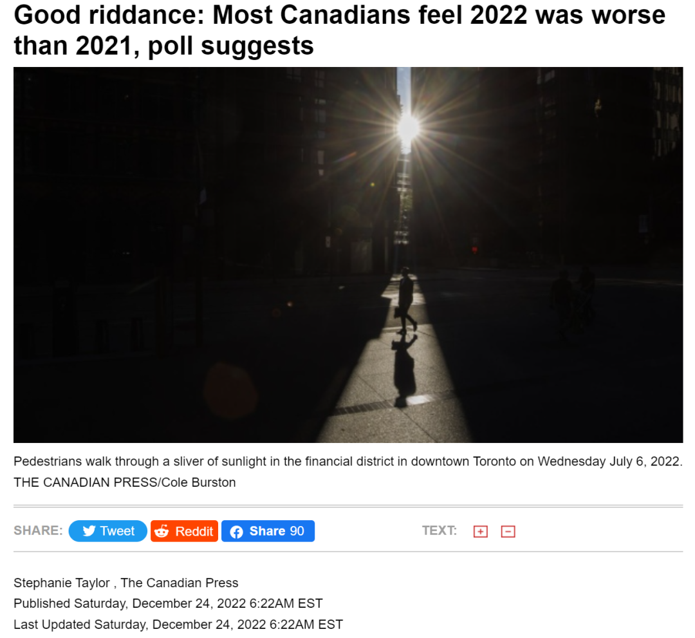
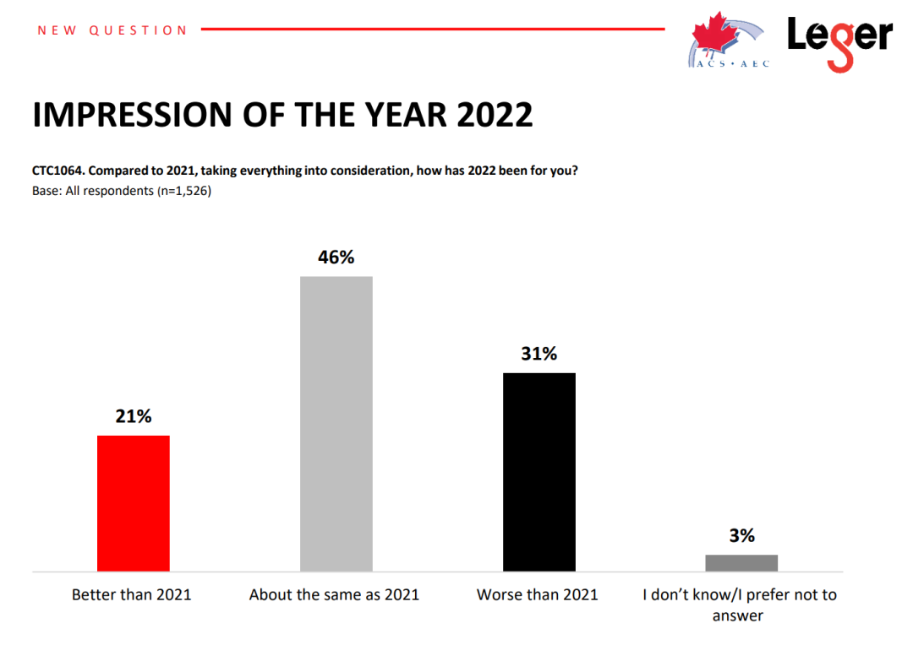
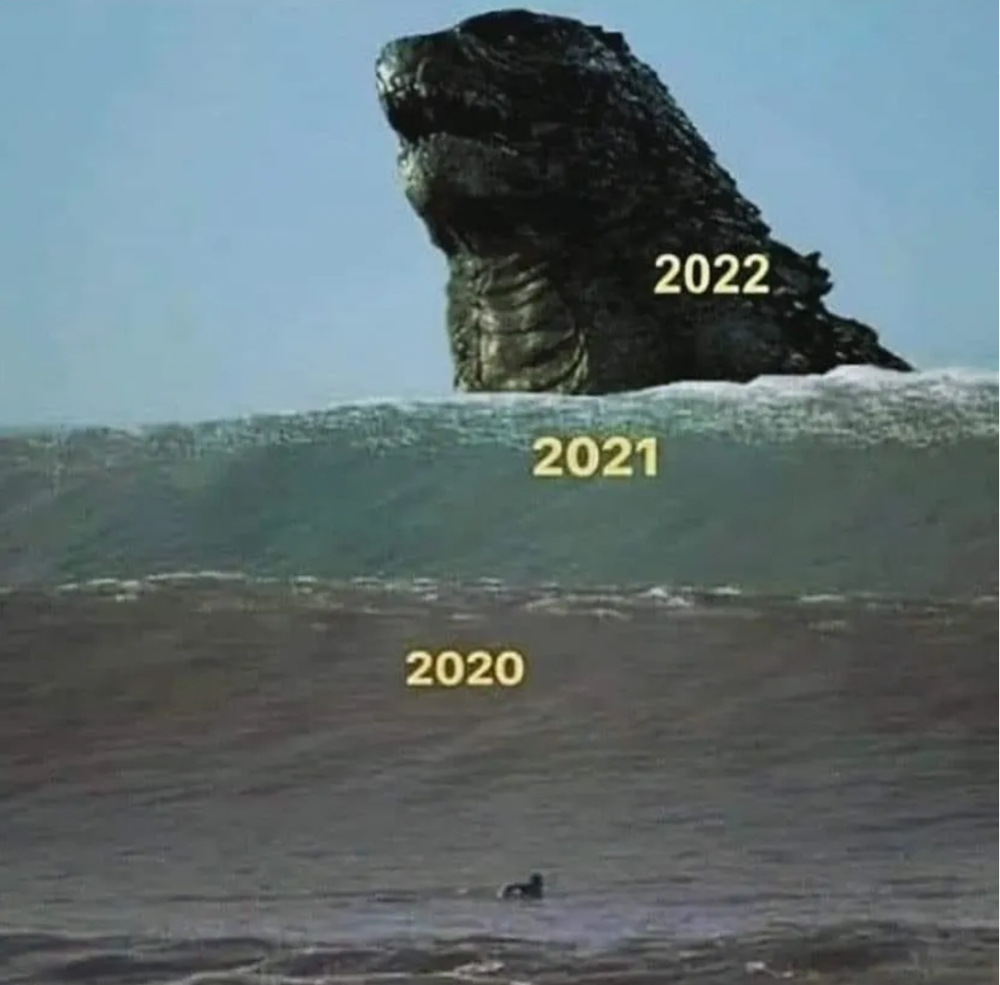
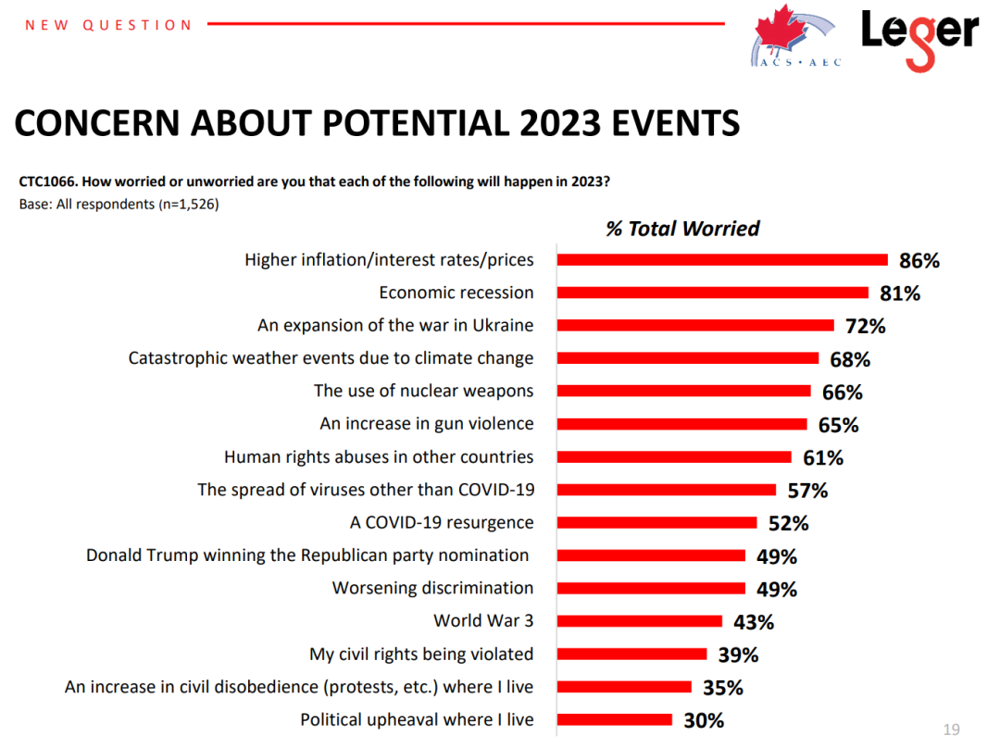
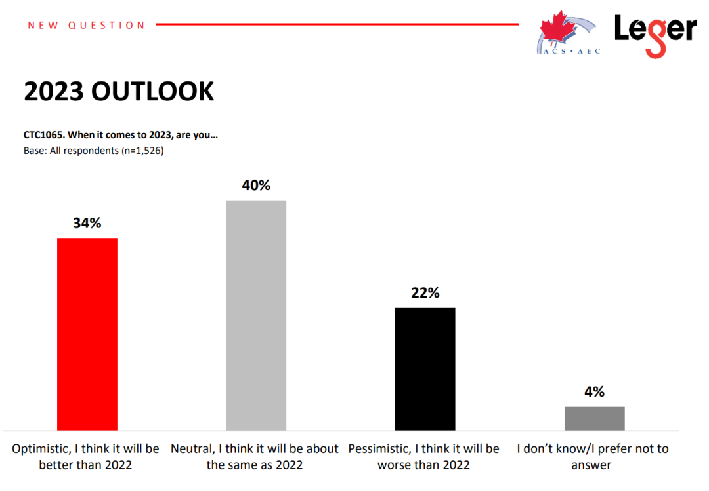
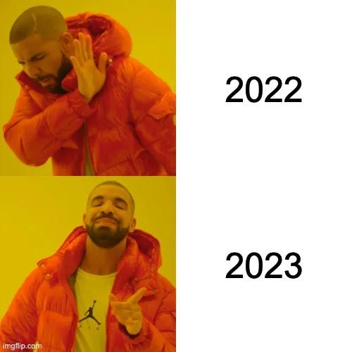

# 无标题

**链接地址:** http://mp.weixin.qq.com/s?__biz=MjM5MDEzNzY2NQ==&mid=2652853230&idx=7&sn=51f43cc2a9dc4a77c0b3dba0463a42d7&chksm=bda29fc08ad516d6cb7d28a6604e98e377981b8a651a6a00c28140d98403351701a34d5384ea&mpshare=1&scene=2&srcid=1228lXwBkwAtFsrlPmurPIGo&sharer_sharetime=1672174643147&sharer_shareid=77848a6b3852ae4dcb6c74ffee84743c#rd
**作者:** 妮娜
**获取时间:** 2025/8/28 19:22:34
**图片数量:** 10

---

## 原始HTML内容

<section style="box-sizing: border-box;font-size: 16px;margin-bottom: 0px;"><section style="margin: 10px 0%;box-sizing: border-box;" powered-by="xiumi.us"><section style="font-size: 15px;letter-spacing: 0px;line-height: 2;padding-right: 15px;padding-left: 15px;box-sizing: border-box;">
<strong style="box-sizing: border-box;">朋友们，你们的2022年过得怎么样？</strong>

 

2020年和2021年，网飞（Netflix）分别上映了<strong style="box-sizing: border-box;">年度吐槽“伪纪录片”大电影</strong>《Death to 2020》和《Death to 2021》，受到了被疫情堵在家中的广大网友们一致<strong style="box-sizing: border-box;">“扎心窝子式”好评</strong>！
</section></section><section style="margin: 10px 0%;box-sizing: border-box;" powered-by="xiumi.us"><section style="font-size: 15px;letter-spacing: 0px;line-height: 2;padding-right: 15px;padding-left: 15px;box-sizing: border-box;">
 

那么，加拿大人到底觉得这个2022年过得如何呢？

 
</section></section><section style="text-align: center;margin-top: 10px;margin-bottom: 10px;line-height: 0;box-sizing: border-box;" powered-by="xiumi.us"><section style="vertical-align: middle;display: inline-block;line-height: 0;width: 30%;height: auto;box-sizing: border-box;"></section></section><section style="margin: 10px 0%;box-sizing: border-box;" powered-by="xiumi.us"><section style="font-size: 15px;letter-spacing: 0px;line-height: 2;padding-right: 15px;padding-left: 15px;box-sizing: border-box;">
<strong style="box-sizing: border-box;">“呵呵，真不怎么样！”</strong>

 

一项新的民意调查显示，随着2022年接近尾声，许多加拿大人感到一种<strong style="box-sizing: border-box;">“解脱”</strong>，这<strong style="box-sizing: border-box;">比2021年还糟糕的2022年终于要过去了！</strong>然而2023年呢？

 
</section></section><section style="text-align: center;margin-top: 10px;margin-bottom: 10px;line-height: 0;box-sizing: border-box;" powered-by="xiumi.us"><section style="max-width: 100%;vertical-align: middle;display: inline-block;line-height: 0;width: 90%;height: auto;box-sizing: border-box;"></section></section><section style="margin: 10px 0%;box-sizing: border-box;" powered-by="xiumi.us"><section style="font-size: 15px;letter-spacing: 0px;line-height: 2;padding-right: 15px;padding-left: 15px;box-sizing: border-box;">
 

加拿大民意调查公司Leger在今年12月初向加拿大人询问了他们对过去一年的印象以及他们对2023年的展望。&nbsp;

 
</section></section><section style="text-align: center;margin-top: 10px;margin-bottom: 10px;line-height: 0;box-sizing: border-box;" powered-by="xiumi.us"><section style="max-width: 100%;vertical-align: middle;display: inline-block;line-height: 0;width: 90%;height: auto;box-sizing: border-box;"></section></section><section style="margin: 10px 0%;box-sizing: border-box;" powered-by="xiumi.us"><section style="font-size: 15px;letter-spacing: 0px;line-height: 2;padding-right: 15px;padding-left: 15px;box-sizing: border-box;">
 

调查发现，<strong style="box-sizing: border-box;">31%的受访者认为今年对他们来说比去年更糟</strong>，只有21%的人表示情况更好。另有46%的人表示<strong style="box-sizing: border-box;">大差不差那就是一样差</strong>，3%的人表示他们不知道或不想回答。共有1,526名加拿大人参加了这项从12月9日至12月11日举办的网络调查。

 

Leger执行副总裁克里斯汀·波克（Christian Bourque）在采访中指出，2021年是疫情横行的一年，当时的加拿大人对此无能为力。但“每个人都会认为病毒变弱，拥有疫苗和特效药的2022年会更好，对吧？”&nbsp;

 
</section></section><section style="text-align: center;margin-top: 10px;margin-bottom: 10px;line-height: 0;box-sizing: border-box;" powered-by="xiumi.us"><section style="max-width: 100%;vertical-align: middle;display: inline-block;line-height: 0;width: 60%;height: auto;box-sizing: border-box;"></section></section><section style="margin: 10px 0%;box-sizing: border-box;" powered-by="xiumi.us"><section style="font-size: 15px;letter-spacing: 0px;line-height: 2;padding-right: 15px;padding-left: 15px;box-sizing: border-box;">
 

<strong style="box-sizing: border-box;">可惜，调查结果并非如此。</strong>

 

尽管在过去一年中加拿大取消了广泛的防疫限制，数百万人恢复了更正常的日常生活和日程安排，但<strong style="box-sizing: border-box;">通货膨胀和生活成本的上升</strong>导致人们对未来前景感到黯淡无光。

 
</section></section><section style="text-align: center;margin-top: 10px;margin-bottom: 10px;line-height: 0;box-sizing: border-box;" powered-by="xiumi.us"><section style="max-width: 100%;vertical-align: middle;display: inline-block;line-height: 0;box-sizing: border-box;"></section></section><section style="margin: 10px 0%;box-sizing: border-box;" powered-by="xiumi.us"><section style="font-size: 15px;letter-spacing: 0px;line-height: 2;padding-right: 15px;padding-left: 15px;box-sizing: border-box;">
 

他说：“<strong style="box-sizing: border-box;">高度焦虑</strong>已经成为加拿大人主流的一种情绪。”&nbsp;

 

最有可能对2022年持负面看法的是<strong style="box-sizing: border-box;">55岁及以上的人</strong>，他们可能有固定收入但如何维持生计依然是一个主要问题。那些生活在加拿大大西洋遭遇极端通货膨胀和不列颠哥伦比亚省遭受重大天气灾害袭击的人，是<strong style="box-sizing: border-box;">对2022年评价最低的人群</strong>。

 

说起对未来的展望，<strong style="box-sizing: border-box;">高企的通胀和今年年初的俄乌战争</strong>仍然是加拿大人展望2023年时最关心的问题。&nbsp;

 
</section></section><section style="text-align: center;margin-top: 10px;margin-bottom: 10px;line-height: 0;box-sizing: border-box;" powered-by="xiumi.us"><section style="max-width: 100%;vertical-align: middle;display: inline-block;line-height: 0;width: 90%;height: auto;box-sizing: border-box;"></section></section><section style="margin: 10px 0%;box-sizing: border-box;" powered-by="xiumi.us"><section style="font-size: 15px;letter-spacing: 0px;line-height: 2;padding-right: 15px;padding-left: 15px;box-sizing: border-box;">
 

当被问及他们<strong style="box-sizing: border-box;">最担心哪些事件</strong>时，86%的受访者提到了更高的通货膨胀、利率和价格的组合，而81%的人表示他们担心加拿大的经济直接陷入衰退。&nbsp;72%的受访者对战争扩大表示担忧，68%的人担心气候变化导致的“灾难性”天气事件。&nbsp;

 

不过好消息是，过去笼罩在世界上空的阴影新冠病毒已经<strong style="box-sizing: border-box;">排不上最担心榜单的头牌</strong>。只有52%的加拿大人表示他们担心病毒卷土重来。&nbsp;更多人（57%）开始担心的是不知道何时何地会出现的毒性未知的<strong style="box-sizing: border-box;">新型变种病毒</strong>的传播。

 
</section></section><section style="margin: 10px 0%;box-sizing: border-box;" powered-by="xiumi.us"><section style="font-size: 15px;letter-spacing: 0px;line-height: 2;padding-right: 15px;padding-left: 15px;box-sizing: border-box;">
虽然去年冬天在渥太华和美国几个边境口岸举行的“自由车队”抗议活动被证明是2022年该国的<strong style="box-sizing: border-box;">“至暗时刻”</strong>，但似乎没有多少加拿大人担心这样影响安全问题的事件会在2023年再次上演。 

 

另外，该调查还显示，最担心价格和经济的人是加拿大<strong style="box-sizing: border-box;">保守党的支持者</strong>，该党领导人皮埃尔·普瓦利耶 (Pierre Poilievre) 也将这两个方面作为他的主要关注点。&nbsp; 

 

与保守党选民相比，更多的联邦自由党和新民主党支持者对乌克兰战争和与气候变化相关的天气灾害感到紧张。

 
</section></section><section style="text-align: center;margin-top: 10px;margin-bottom: 10px;line-height: 0;box-sizing: border-box;" powered-by="xiumi.us"><section style="max-width: 100%;vertical-align: middle;display: inline-block;line-height: 0;width: 90%;height: auto;box-sizing: border-box;"></section></section><section style="margin: 10px 0%;box-sizing: border-box;" powered-by="xiumi.us"><section style="font-size: 15px;letter-spacing: 0px;line-height: 2;padding-right: 15px;padding-left: 15px;box-sizing: border-box;">
 

虽然大家对加拿大2023年的经济前景感到悲观，但生性乐观的加拿大人还是愿意<strong style="box-sizing: border-box;">对2023年报以美好的展望</strong>。

 
</section></section><section style="text-align: center;margin-top: 10px;margin-bottom: 10px;line-height: 0;box-sizing: border-box;" powered-by="xiumi.us"><section style="max-width: 100%;vertical-align: middle;display: inline-block;line-height: 0;width: 50%;height: auto;box-sizing: border-box;"></section></section><section style="margin: 10px 0%;box-sizing: border-box;" powered-by="xiumi.us"><section style="font-size: 15px;letter-spacing: 0px;line-height: 2;padding-right: 15px;padding-left: 15px;box-sizing: border-box;">
 

其中34%的受访者表示他们认为2023年会过得比 2022年好，而22%的受访者表示，2023年恐怕也是一个要<strong style="box-sizing: border-box;">继续被骂得灰头土脸的年头</strong>。

 
</section></section><section style="margin: 10px 0%;box-sizing: border-box;" powered-by="xiumi.us"><section style="font-size: 15px;letter-spacing: 0px;line-height: 2;padding-right: 15px;padding-left: 15px;box-sizing: border-box;">
屏幕前的你<strong style="box-sizing: border-box;">对2022年有着怎样的感触</strong>呢？来，让我们翻开自己的投资账户和房价报告……算了，还是双手合十向天祈祷咱们的2023年，<strong style="box-sizing: border-box;">身体健康，万事如意，大吉大利，幸福美满</strong>吧！

 
<section style="margin-right: 16px;margin-bottom: 0px;margin-left: 16px;outline: 0px;max-width: 100%;color: rgb(34, 34, 34);letter-spacing: 0.544px;white-space: normal;background-color: rgb(255, 255, 255);caret-color: rgb(34, 34, 34);font-family: system-ui, -apple-system, system-ui, &quot;Helvetica Neue&quot;, &quot;PingFang SC&quot;, &quot;Hiragino Sans GB&quot;, &quot;Microsoft YaHei UI&quot;, &quot;Microsoft YaHei&quot;, Arial, sans-serif;text-align: center;line-height: 1.6em;box-sizing: border-box !important;overflow-wrap: break-word !important;">+++全加拿大华人都在关注超级生活，就差你了+++</section><section style="margin-right: 16px;margin-bottom: 0px;margin-left: 16px;outline: 0px;max-width: 100%;color: rgb(34, 34, 34);letter-spacing: 0.544px;white-space: normal;background-color: rgb(255, 255, 255);caret-color: rgb(34, 34, 34);font-family: -apple-system, BlinkMacSystemFont, &quot;Helvetica Neue&quot;, &quot;PingFang SC&quot;, &quot;Hiragino Sans GB&quot;, &quot;Microsoft YaHei UI&quot;, &quot;Microsoft YaHei&quot;, Arial, sans-serif;text-align: right;line-height: 1.6em;box-sizing: border-box !important;overflow-wrap: break-word !important;">&nbsp; &nbsp; &nbsp; &nbsp; &nbsp; &nbsp; &nbsp; &nbsp; &nbsp; &nbsp; &nbsp; &nbsp; &nbsp; &nbsp; &nbsp; &nbsp; &nbsp; &nbsp; &nbsp; &nbsp; &nbsp;&nbsp;&nbsp;&nbsp;&nbsp;&nbsp;&nbsp;喜欢就狠点下吧</section></section></section></section>
<mp-style-type data-value="3"></mp-style-type>

---

## 纯文本内容

朋友们，你们的2022年过得怎么样？2020年和2021年，网飞（Netflix）分别上映了年度吐槽“伪纪录片”大电影《Death to 2020》和《Death to 2021》，受到了被疫情堵在家中的广大网友们一致“扎心窝子式”好评！那么，加拿大人到底觉得这个2022年过得如何呢？“呵呵，真不怎么样！”一项新的民意调查显示，随着2022年接近尾声，许多加拿大人感到一种“解脱”，这比2021年还糟糕的2022年终于要过去了！然而2023年呢？加拿大民意调查公司Leger在今年12月初向加拿大人询问了他们对过去一年的印象以及他们对2023年的展望。 调查发现，31%的受访者认为今年对他们来说比去年更糟，只有21%的人表示情况更好。另有46%的人表示大差不差那就是一样差，3%的人表示他们不知道或不想回答。共有1,526名加拿大人参加了这项从12月9日至12月11日举办的网络调查。Leger执行副总裁克里斯汀·波克（Christian Bourque）在采访中指出，2021年是疫情横行的一年，当时的加拿大人对此无能为力。但“每个人都会认为病毒变弱，拥有疫苗和特效药的2022年会更好，对吧？” 可惜，调查结果并非如此。尽管在过去一年中加拿大取消了广泛的防疫限制，数百万人恢复了更正常的日常生活和日程安排，但通货膨胀和生活成本的上升导致人们对未来前景感到黯淡无光。他说：“高度焦虑已经成为加拿大人主流的一种情绪。” 最有可能对2022年持负面看法的是55岁及以上的人，他们可能有固定收入但如何维持生计依然是一个主要问题。那些生活在加拿大大西洋遭遇极端通货膨胀和不列颠哥伦比亚省遭受重大天气灾害袭击的人，是对2022年评价最低的人群。说起对未来的展望，高企的通胀和今年年初的俄乌战争仍然是加拿大人展望2023年时最关心的问题。 当被问及他们最担心哪些事件时，86%的受访者提到了更高的通货膨胀、利率和价格的组合，而81%的人表示他们担心加拿大的经济直接陷入衰退。 72%的受访者对战争扩大表示担忧，68%的人担心气候变化导致的“灾难性”天气事件。 不过好消息是，过去笼罩在世界上空的阴影新冠病毒已经排不上最担心榜单的头牌。只有52%的加拿大人表示他们担心病毒卷土重来。 更多人（57%）开始担心的是不知道何时何地会出现的毒性未知的新型变种病毒的传播。虽然去年冬天在渥太华和美国几个边境口岸举行的“自由车队”抗议活动被证明是2022年该国的“至暗时刻”，但似乎没有多少加拿大人担心这样影响安全问题的事件会在2023年再次上演。另外，该调查还显示，最担心价格和经济的人是加拿大保守党的支持者，该党领导人皮埃尔·普瓦利耶 (Pierre Poilievre) 也将这两个方面作为他的主要关注点。 与保守党选民相比，更多的联邦自由党和新民主党支持者对乌克兰战争和与气候变化相关的天气灾害感到紧张。虽然大家对加拿大2023年的经济前景感到悲观，但生性乐观的加拿大人还是愿意对2023年报以美好的展望。其中34%的受访者表示他们认为2023年会过得比 2022年好，而22%的受访者表示，2023年恐怕也是一个要继续被骂得灰头土脸的年头。屏幕前的你对2022年有着怎样的感触呢？来，让我们翻开自己的投资账户和房价报告……算了，还是双手合十向天祈祷咱们的2023年，身体健康，万事如意，大吉大利，幸福美满吧！+++全加拿大华人都在关注超级生活，就差你了+++                                               喜欢就狠点下吧

---

## 图片列表

-  (原始链接: https://mmbiz.qpic.cn/mmbiz_png/4kibCXA1QiblTrO5vp5wcXfqiaKF1pGQdkdJfXeCPu4ES8ArZXm1KfibLftIX4ThcjEm1ZEa2GTibY458MQCXyAtF6Q/640?wx_fmt=png)
-  (原始链接: https://mmbiz.qpic.cn/mmbiz_png/4kibCXA1QiblTrO5vp5wcXfqiaKF1pGQdkdTIkWwFgR7UJkibeTskgwY0VzoSZL6ns7WKfgNUoXV8rcSk6Q0B4icmIw/640?wx_fmt=png)
-  (原始链接: https://mmbiz.qpic.cn/mmbiz_png/4kibCXA1QiblTrO5vp5wcXfqiaKF1pGQdkdZ3iaEyPIwSkbic3aj1NmpwaLgFPLWVqY5Hicz7cZOWicNpB0tCbiaS2tPtQ/640?wx_fmt=png)
-  (原始链接: https://mmbiz.qpic.cn/mmbiz_png/4kibCXA1QiblTrO5vp5wcXfqiaKF1pGQdkdrIkx8dHlpxvdnZ2S4V4SFHd6daySJib53un6tbBick60WQ7hwz4xbLkw/640?wx_fmt=png)
-  (原始链接: https://mmbiz.qpic.cn/mmbiz_jpg/4kibCXA1QiblTrO5vp5wcXfqiaKF1pGQdkdWOFssyHR0eqYIs7UHQltR4HGy7d3RmFKV9AjY7CnOrsdSWY09mkzVA/640?wx_fmt=jpeg)
-  (原始链接: https://mmbiz.qpic.cn/mmbiz_png/4kibCXA1QiblTrO5vp5wcXfqiaKF1pGQdkdaFicoicHBsAKzicev4VSLQLjZGLVgdft5WlWzvIJoAducF2ibiceqvF4tnA/640?wx_fmt=png)
-  (原始链接: https://mmbiz.qpic.cn/mmbiz_png/4kibCXA1QiblTrO5vp5wcXfqiaKF1pGQdkdFuQ9pJW5gH2qZbfajrTWlRDvRtdPMUs9eugfL4vHqNocHQ9caibDpGg/640?wx_fmt=png)
-  (原始链接: https://mmbiz.qpic.cn/mmbiz_jpg/4kibCXA1QiblTrO5vp5wcXfqiaKF1pGQdkd5ib5IEG9LDtdYeWbTIEBNl4ZbKHWqewEBSvtrIOVenPicnzNFdzcj7kQ/640?wx_fmt=jpeg)
-  (原始链接: https://mmbiz.qpic.cn/mmbiz_gif/szJas1pFaJciafpfjOBz8frgHmpJ4qlKKk76KbuUlPOdJ89eVxMjeudj7VjeoS5xib6sXYhPHnwP6PiadxYVypibQg/640?wx_fmt=gif&wxfrom=5&wx_lazy=1)
-  (原始链接: https://mmbiz.qpic.cn/mmbiz_png/szJas1pFaJfrIIC5IeLhV2hKgkibia8ngvEb0uN9pIZicxAmlh1SkrSb7rJ7Xn9AT7ynNHlh2XLI8MchrVF5W1N2w/640?wx_fmt=png&wxfrom=5&wx_lazy=1&wx_co=1)
