# 无标题

**链接地址:** http://mp.weixin.qq.com/s?__biz=MzUyNzA2NTAwNg==&mid=2247492365&idx=1&sn=0b4b4e9ecd2a2f508b92aff0fcb63ae4&chksm=fa07e9cccd7060da74d9630aeebe2f8947d5989f819d0572121b71e2ce86543d1aa9a04207bd&mpshare=1&scene=2&srcid=0104PIZm4briqfs0v8HdxHjz&sharer_sharetime=1672797994817&sharer_shareid=77848a6b3852ae4dcb6c74ffee84743c#rd
**作者:** 你身边的签证专家
**获取时间:** 2025/8/28 19:22:04
**图片数量:** 23

---

## 原始HTML内容

<section style="box-sizing: border-box;font-size: 16px;"><section style="text-align: center;margin-top: 10px;margin-bottom: 10px;line-height: 0;box-sizing: border-box;" powered-by="xiumi.us"><section style="max-width: 100%;vertical-align: middle;display: inline-block;line-height: 0;box-sizing: border-box;"></section></section><section style="text-align: center;margin-top: 10px;margin-bottom: 10px;line-height: 0;box-sizing: border-box;" powered-by="xiumi.us"><section style="max-width: 100%;vertical-align: middle;display: inline-block;line-height: 0;box-sizing: border-box;"></section></section>
 
<section style="font-size: 19px;text-align: center;margin-top: 10px;margin-bottom: 3px;box-sizing: border-box;" powered-by="xiumi.us"><section style="display: inline-block;border-width: 1px;border-style: solid;border-color: rgb(188, 65, 65);background-color: rgb(188, 65, 65);width: 1.8em;height: 1.8em;line-height: 1.8em;border-radius: 100%;margin-left: auto;margin-right: auto;font-size: 16px;color: rgb(255, 255, 255);box-sizing: border-box;">
<strong style="box-sizing: border-box;">1</strong>
</section></section><section style="text-align: center;box-sizing: border-box;" powered-by="xiumi.us"><section style="display: inline-block;width: 0px;height: 0px;vertical-align: top;overflow: hidden;border-style: solid;border-width: 9px 6px 0px;border-color: rgb(188, 65, 65) rgba(255, 255, 255, 0) rgba(255, 255, 255, 0);box-sizing: border-box;"><svg viewBox="0 0 1 1" style="float:left;line-height:0;width:0;vertical-align:top;"></svg></section></section><section style="margin-bottom: 10px;text-align: center;justify-content: center;display: flex;flex-flow: row nowrap;box-sizing: border-box;" powered-by="xiumi.us"><section style="display: inline-block;width: auto;vertical-align: middle;background-color: rgba(109, 155, 209, 0.1);min-width: 10%;max-width: 100%;flex: 0 0 auto;height: auto;align-self: center;padding: 12px;box-sizing: border-box;"><section style="color: rgb(109, 155, 209);text-align: justify;box-sizing: border-box;" powered-by="xiumi.us">
<strong style="box-sizing: border-box;">加拿大新移民人数再创记录</strong>
</section></section></section><section style="font-size: 14px;padding-right: 15px;padding-left: 15px;letter-spacing: 1px;box-sizing: border-box;" powered-by="xiumi.us">
 

每年加国移民部在第四季度修订的<strong style="box-sizing: border-box;">未来三年移民配额目标</strong>是加拿大签证和移民申请群体最关心的话题之一。从配额的比例我们就可以总结出加国对于不同群体新移民的欢迎程度，以此来判断<strong style="box-sizing: border-box;">移民政策风向的变化</strong>。

 
</section><section style="text-align: center;margin-top: 10px;margin-bottom: 10px;line-height: 0;box-sizing: border-box;" powered-by="xiumi.us"><section style="max-width: 100%;vertical-align: middle;display: inline-block;line-height: 0;width: 90%;height: auto;box-sizing: border-box;"></section></section><section style="font-size: 14px;padding-right: 15px;padding-left: 15px;letter-spacing: 1px;box-sizing: border-box;" powered-by="xiumi.us">
 

2022年，加国移民部夸下海口，为今年设定了一个史无前例的<strong style="box-sizing: border-box;">超高目标</strong>：431,645名新移民！许多人质疑受到疫情封锁而积压了超过280万份申请的移民部门到年底是否可以完成这个目标。

 
</section><section style="text-align: center;margin-top: 10px;margin-bottom: 10px;line-height: 0;box-sizing: border-box;" powered-by="xiumi.us"><section style="max-width: 100%;vertical-align: middle;display: inline-block;line-height: 0;width: 90%;height: auto;box-sizing: border-box;"></section></section><section style="font-size: 14px;padding-right: 15px;padding-left: 15px;letter-spacing: 1px;box-sizing: border-box;" powered-by="xiumi.us">
 

在联邦政府8500万加元资金的支持下，2022年的加拿大移民部门进行了<strong style="box-sizing: border-box;">翻天覆地式的改革</strong>——在增派了1250位经过培训的移民官和签证官的同时，全面推行了高效的电子化审批方式。果不其然，到了年底检验成果的时刻，移民部也为我们焦急等待的申请人们<strong style="box-sizing: border-box;">交出了一份满意的答卷</strong>：

 
</section><section style="text-align: center;margin-top: 10px;margin-bottom: 10px;line-height: 0;box-sizing: border-box;" powered-by="xiumi.us"><section style="max-width: 100%;vertical-align: middle;display: inline-block;line-height: 0;width: 90%;height: auto;box-sizing: border-box;"></section></section><section style="font-size: 14px;padding-right: 15px;padding-left: 15px;letter-spacing: 1px;box-sizing: border-box;" powered-by="xiumi.us">
 

加拿大联邦政府在2022年共引进了431,645名新永久居民，<strong style="box-sizing: border-box;">超过了2021年创下的历史纪录</strong>。

 
</section><section style="text-align: center;margin-top: 10px;margin-bottom: 10px;line-height: 0;box-sizing: border-box;" powered-by="xiumi.us"><section style="max-width: 100%;vertical-align: middle;display: inline-block;line-height: 0;width: 90%;height: auto;box-sizing: border-box;"></section></section><section style="font-size: 14px;padding-right: 15px;padding-left: 15px;letter-spacing: 1px;box-sizing: border-box;" powered-by="xiumi.us">
 

这是一个显著的信号，表明联邦政府正在按部就班地实施其三年移民计划。而且2023年加国联邦政府希望在这个基础上增加引进新移民的数量，让这个数字更上一层楼，来到<strong style="box-sizing: border-box;">485,000名</strong>！
</section><section style="font-size: 14px;padding-right: 15px;padding-left: 15px;letter-spacing: 1px;box-sizing: border-box;" powered-by="xiumi.us">
 

加拿大移民部部长肖恩·弗雷泽(Sean Fraser)在周二的新闻发布会上说：“新移民在填补劳动力短缺、为我们的社区带来新的观点和人才、以及丰富我们的整个社会方面发挥着重要作用。”

 
</section><section style="text-align: center;margin-top: 10px;margin-bottom: 10px;line-height: 0;box-sizing: border-box;" powered-by="xiumi.us"><section style="max-width: 100%;vertical-align: middle;display: inline-block;line-height: 0;width: 90%;height: auto;box-sizing: border-box;"></section></section><section style="font-size: 14px;padding-right: 15px;padding-left: 15px;letter-spacing: 1px;box-sizing: border-box;" powered-by="xiumi.us">
 

在2021年之前，上一次创下移民记录还要追溯到<strong style="box-sizing: border-box;">1913年</strong>。2021年，加拿大迎来了<strong style="box-sizing: border-box;">超过40.5万名新移民</strong>。在疫情的影响下能达到这个数字，加拿大移民部也算是十分给力了。

 

同时，与去年相比，加拿大移民部处理的入籍、临时居留、永久居留申请数量也翻了一番，<strong style="box-sizing: border-box;">共审核了520万件申请</strong>，让申请积压的数字大幅降低！

 
</section><section style="text-align: center;margin-top: 10px;margin-bottom: 10px;line-height: 0;box-sizing: border-box;" powered-by="xiumi.us"><section style="max-width: 100%;vertical-align: middle;display: inline-block;line-height: 0;width: 90%;height: auto;box-sizing: border-box;"></section></section><section style="font-size: 14px;padding-right: 15px;padding-left: 15px;letter-spacing: 1px;box-sizing: border-box;" powered-by="xiumi.us">
 

近年来受到疫情、老龄化、低生育率和经济的多重影响，加拿大对于新移民数量的需求也来到了历史最高位。去年11月，联邦政府提出了2023年-2025年移民计划。预计到2025年，加拿大<strong style="box-sizing: border-box;">每年将迎来50万永久居民</strong>！

 

根据这项新的多年计划，经过改进后的技术移民系统将更高效地帮助那些面临严重劳动力短缺的行业——如<strong style="box-sizing: border-box;">医疗、制造业、建筑行业和STEM</strong>(科学、技术、工程和数学)挑选具备所需技能和资格的候选人。

 
</section><section style="text-align: center;margin-top: 10px;margin-bottom: 10px;line-height: 0;box-sizing: border-box;" powered-by="xiumi.us"><section style="max-width: 100%;vertical-align: middle;display: inline-block;line-height: 0;width: 90%;height: auto;box-sizing: border-box;"></section></section><section style="font-size: 14px;padding-right: 15px;padding-left: 15px;letter-spacing: 1px;box-sizing: border-box;" powered-by="xiumi.us">
 

2022年联邦预算法案赋予了移民部长弗雷泽新的权力，弗雷泽可以绕过目前的基于积分的选拔系统，挑选具有这里需要的技能的移民候选人。所谓的“<strong style="box-sizing: border-box;">定向抽签”</strong>预计将于今年初开始。

 

 
</section><section style="font-size: 19px;text-align: center;margin-top: 10px;margin-bottom: 3px;box-sizing: border-box;" powered-by="xiumi.us"><section style="display: inline-block;border-width: 1px;border-style: solid;border-color: rgb(188, 65, 65);background-color: rgb(188, 65, 65);width: 1.8em;height: 1.8em;line-height: 1.8em;border-radius: 100%;margin-left: auto;margin-right: auto;font-size: 16px;color: rgb(255, 255, 255);box-sizing: border-box;">
<strong style="box-sizing: border-box;">2</strong>
</section></section><section style="text-align: center;box-sizing: border-box;" powered-by="xiumi.us"><section style="display: inline-block;width: 0px;height: 0px;vertical-align: top;overflow: hidden;border-style: solid;border-width: 9px 6px 0px;border-color: rgb(188, 65, 65) rgba(255, 255, 255, 0) rgba(255, 255, 255, 0);box-sizing: border-box;"><svg viewBox="0 0 1 1" style="float:left;line-height:0;width:0;vertical-align:top;"></svg></section></section><section style="margin-bottom: 10px;text-align: center;justify-content: center;display: flex;flex-flow: row nowrap;box-sizing: border-box;" powered-by="xiumi.us"><section style="display: inline-block;width: auto;vertical-align: middle;background-color: rgba(109, 155, 209, 0.1);min-width: 10%;max-width: 100%;flex: 0 0 auto;height: auto;align-self: center;padding: 12px;box-sizing: border-box;"><section style="color: rgb(109, 155, 209);text-align: justify;box-sizing: border-box;" powered-by="xiumi.us">
<strong style="box-sizing: border-box;">增加移民数量为国家发展之根本</strong>
</section></section></section><section style="font-size: 14px;padding-right: 15px;padding-left: 15px;letter-spacing: 1px;box-sizing: border-box;" powered-by="xiumi.us">
 

加拿大近年内的劳动力增长几乎<strong style="box-sizing: border-box;">100%依靠从其他国家吸纳新移民</strong>。目前，加拿大有近百万个职位空缺。由于劳动力老龄化，熟练劳动力短缺，引入新移民是解决这个问题的唯一方案。

 
</section><section style="text-align: center;margin-top: 10px;margin-bottom: 10px;line-height: 0;box-sizing: border-box;" powered-by="xiumi.us"><section style="max-width: 100%;vertical-align: middle;display: inline-block;line-height: 0;width: 90%;height: auto;box-sizing: border-box;"></section></section><section style="font-size: 14px;padding-right: 15px;padding-left: 15px;letter-spacing: 1px;box-sizing: border-box;" powered-by="xiumi.us">
 

移民对加拿大经济至关重要。预计到2030年将有900万加拿大人达到65岁的退休年龄。到2035年，加拿大的人口老龄化意味着工人与退休人员的比例预计将从50年前的7比1转变为2比1。

 

此外，<strong style="box-sizing: border-box;">加拿大近75%的人口增长取决于移民</strong>，因为加拿大是<strong style="box-sizing: border-box;">全球出生率最低的国家之一</strong>，每位妇女的一生中平均只生育1.4个孩子。低于国际社会通常认为1.5的生育率警戒线，也低于生育更替水平2.1。

 
</section><section style="text-align: center;margin-top: 10px;margin-bottom: 10px;line-height: 0;box-sizing: border-box;" powered-by="xiumi.us"><section style="max-width: 100%;vertical-align: middle;display: inline-block;line-height: 0;width: 90%;height: auto;box-sizing: border-box;"></section></section><section style="font-size: 14px;padding-right: 15px;padding-left: 15px;letter-spacing: 1px;box-sizing: border-box;" powered-by="xiumi.us">
 

为了增加人口，加拿大近年来一直在努力欢迎更多的移民。根据2021年移民人口普查，2016年至2021年间有130万新永久居民抵达加拿大。<strong style="box-sizing: border-box;">在G7国家中是人口增长速率最高的国家</strong>。预计到2036年，<strong style="box-sizing: border-box;">移民将占据加拿大人口的36%</strong>。

 
</section><section style="text-align: center;margin-top: 10px;margin-bottom: 10px;line-height: 0;box-sizing: border-box;" powered-by="xiumi.us"><section style="max-width: 100%;vertical-align: middle;display: inline-block;line-height: 0;box-sizing: border-box;"></section></section><section style="font-size: 14px;padding-right: 15px;padding-left: 15px;letter-spacing: 1px;box-sizing: border-box;" powered-by="xiumi.us">
 

 
</section><section style="font-size: 19px;text-align: center;margin-top: 10px;margin-bottom: 3px;box-sizing: border-box;" powered-by="xiumi.us"><section style="display: inline-block;border-width: 1px;border-style: solid;border-color: rgb(188, 65, 65);background-color: rgb(188, 65, 65);width: 1.8em;height: 1.8em;line-height: 1.8em;border-radius: 100%;margin-left: auto;margin-right: auto;font-size: 16px;color: rgb(255, 255, 255);box-sizing: border-box;">
<strong style="box-sizing: border-box;">3</strong>
</section></section><section style="text-align: center;box-sizing: border-box;" powered-by="xiumi.us"><section style="display: inline-block;width: 0px;height: 0px;vertical-align: top;overflow: hidden;border-style: solid;border-width: 9px 6px 0px;border-color: rgb(188, 65, 65) rgba(255, 255, 255, 0) rgba(255, 255, 255, 0);box-sizing: border-box;"><svg viewBox="0 0 1 1" style="float:left;line-height:0;width:0;vertical-align:top;"></svg></section></section><section style="margin-bottom: 10px;text-align: center;justify-content: center;display: flex;flex-flow: row nowrap;box-sizing: border-box;" powered-by="xiumi.us"><section style="display: inline-block;width: auto;vertical-align: middle;background-color: rgba(109, 155, 209, 0.1);min-width: 10%;max-width: 100%;flex: 0 0 auto;height: auto;align-self: center;padding: 12px;box-sizing: border-box;"><section style="color: rgb(109, 155, 209);text-align: justify;box-sizing: border-box;" powered-by="xiumi.us">
<strong style="box-sizing: border-box;">加国人数增长也创纪录</strong>
</section></section></section><section style="font-size: 14px;padding-right: 15px;padding-left: 15px;letter-spacing: 1px;box-sizing: border-box;" powered-by="xiumi.us">
 

此外，据加拿大统计局（Statistics Canada）报道，截至2022年10月1日，加拿大人口估计为39,292,355人，比2022年7月1日增加了362,453人（+0.9%）。这是自1957年第二季度（+1.2%）以来的<strong style="box-sizing: border-box;">最高季度人口增长率</strong>。 

 
</section><section style="text-align: center;margin-top: 10px;margin-bottom: 10px;line-height: 0;box-sizing: border-box;" powered-by="xiumi.us"><section style="max-width: 100%;vertical-align: middle;display: inline-block;line-height: 0;width: 90%;height: auto;box-sizing: border-box;"></section></section><section style="font-size: 14px;padding-right: 15px;padding-left: 15px;letter-spacing: 1px;box-sizing: border-box;" powered-by="xiumi.us">
 

加拿大2022年前九个月的总人口增长（+776,217 人）已经超过自1867年加拿大成立联邦制国家以来任何全年的总增长。这种高水平的增长<strong style="box-sizing: border-box;">主要(94.0%)是由于国际移民 (+340,666人）</strong>，使加拿大人口首次超过3900万。在完全计算10月至12月的数据之后，加拿大<strong style="box-sizing: border-box;">2022年可能会看到惊人的约100万总人口增长</strong>。

 
</section><section style="text-align: center;margin-top: 10px;margin-bottom: 10px;line-height: 0;box-sizing: border-box;" powered-by="xiumi.us"><section style="max-width: 100%;vertical-align: middle;display: inline-block;line-height: 0;width: 90%;height: auto;box-sizing: border-box;"></section></section><section style="font-size: 14px;padding-right: 15px;padding-left: 15px;letter-spacing: 1px;box-sizing: border-box;" powered-by="xiumi.us">
 

2022年第三季度，加拿大迎来了122,145名移民，与 2021年第三季度（122,911人）大致相同，是自1946年有统计数据以来第三季度第二高的移民人数。 

 
</section><section style="text-align: center;margin-top: 10px;margin-bottom: 10px;line-height: 0;box-sizing: border-box;" powered-by="xiumi.us"><section style="max-width: 100%;vertical-align: middle;display: inline-block;line-height: 0;width: 90%;height: auto;box-sizing: border-box;"></section></section><section style="font-size: 14px;padding-right: 15px;padding-left: 15px;letter-spacing: 1px;box-sizing: border-box;" powered-by="xiumi.us">
 

然而，2022年第三季度创纪录的人口增长主要是由225,198名非永久居民（NPR) 的增长推动的。这一增长比2022年第二季度的上一次创纪录增长（+157,310）多了近68,000人。

 

 
</section><section style="font-size: 19px;text-align: center;margin-top: 10px;margin-bottom: 3px;box-sizing: border-box;" powered-by="xiumi.us"><section style="display: inline-block;border-width: 1px;border-style: solid;border-color: rgb(188, 65, 65);background-color: rgb(188, 65, 65);width: 1.8em;height: 1.8em;line-height: 1.8em;border-radius: 100%;margin-left: auto;margin-right: auto;font-size: 16px;color: rgb(255, 255, 255);box-sizing: border-box;">
<strong style="box-sizing: border-box;">4</strong>
</section></section><section style="text-align: center;box-sizing: border-box;" powered-by="xiumi.us"><section style="display: inline-block;width: 0px;height: 0px;vertical-align: top;overflow: hidden;border-style: solid;border-width: 9px 6px 0px;border-color: rgb(188, 65, 65) rgba(255, 255, 255, 0) rgba(255, 255, 255, 0);box-sizing: border-box;"><svg viewBox="0 0 1 1" style="float:left;line-height:0;width:0;vertical-align:top;"></svg></section></section><section style="margin-bottom: 10px;text-align: center;justify-content: center;display: flex;flex-flow: row nowrap;box-sizing: border-box;" powered-by="xiumi.us"><section style="display: inline-block;width: auto;vertical-align: middle;background-color: rgba(109, 155, 209, 0.1);min-width: 10%;max-width: 100%;flex: 0 0 auto;height: auto;align-self: center;padding: 12px;box-sizing: border-box;"><section style="color: rgb(109, 155, 209);text-align: justify;box-sizing: border-box;" powered-by="xiumi.us">
<strong style="box-sizing: border-box;">阿省是加国人口增长最快省份</strong>
</section></section></section><section style="font-size: 14px;padding-right: 15px;padding-left: 15px;letter-spacing: 1px;box-sizing: border-box;" powered-by="xiumi.us">
 

2022年第三季度非永久居民的增幅大于自1971年有统计数据以来的任何全年增幅。这一增长是<strong style="box-sizing: border-box;">由工作签证的持有者推动的</strong>，但所有类型的非永久居民都在增加，包括乌克兰难民。所有省份和地区的非永久居民数量都有所增加，其中安大略省(+106,459)、卑诗省(+39,429) 和魁北克省(+34,299)占增幅的80.0%。

 
</section><section style="text-align: center;margin-top: 10px;margin-bottom: 10px;line-height: 0;box-sizing: border-box;" powered-by="xiumi.us"><section style="max-width: 100%;vertical-align: middle;display: inline-block;line-height: 0;width: 90%;height: auto;box-sizing: border-box;"></section></section><section style="font-size: 14px;padding-right: 15px;padding-left: 15px;letter-spacing: 1px;box-sizing: border-box;" powered-by="xiumi.us">
 

然而，在跨省移民方面，安大略省的居民净流失了11,581人，这是<strong style="box-sizing: border-box;">自1980年以来第三季度最大的居民净流失记录</strong>。卑诗省记录到净流失了4,799名居民，这是该省近十年来首次出现净流失。 

 
</section><section style="text-align: center;margin-top: 10px;margin-bottom: 10px;line-height: 0;box-sizing: border-box;" powered-by="xiumi.us"><section style="max-width: 100%;vertical-align: middle;display: inline-block;line-height: 0;width: 90%;height: auto;box-sizing: border-box;"></section></section><section style="font-size: 14px;padding-right: 15px;padding-left: 15px;letter-spacing: 1px;box-sizing: border-box;" powered-by="xiumi.us">
 

就各省总人口增长而言，2022年前九个月，安大略省增加了321,748人，其次是阿尔伯塔省增加118,929人，卑诗省增加116,688人，魁北克增加113,702人。

 

2022 年第三季度，安大略省人口增加153,244人（+1%），阿尔伯塔省人口增加67,203人（+1.3%），魁北克省人口增加55,693人（+0.6%），卑诗省人口增加48,942人（+0.9%）。<strong style="box-sizing: border-box;">阿尔伯塔省的增长率在所有省份和地区中最高</strong>。

 
</section><section style="text-align: center;margin-top: 10px;margin-bottom: 10px;line-height: 0;box-sizing: border-box;" powered-by="xiumi.us"><section style="max-width: 100%;vertical-align: middle;display: inline-block;line-height: 0;width: 90%;height: auto;box-sizing: border-box;"></section></section><section style="font-size: 14px;padding-right: 15px;padding-left: 15px;letter-spacing: 1px;box-sizing: border-box;" powered-by="xiumi.us">
 

阿尔伯塔省第三季度的<strong style="box-sizing: border-box;">人口增长创下了该省历史上任何一个季度的记录</strong>，这可能与导致经济复苏和创造就业机会的高油价有关。自2014年以来，由于油价暴跌和经济衰退，阿尔伯塔省的人口增长放缓多年。

 
</section><section style="margin: 20px 0% 10px;text-align: center;box-sizing: border-box;" powered-by="xiumi.us"><section style="padding: 3px;display: inline-block;border-bottom: 5px solid rgb(147, 122, 122);color: rgb(147, 122, 122);box-sizing: border-box;">
<strong style="box-sizing: border-box;">2022年前九个月各人口增长估计：</strong>
</section></section><section style="font-size: 14px;padding-right: 15px;padding-left: 15px;letter-spacing: 1px;box-sizing: border-box;" powered-by="xiumi.us">
 

<strong style="box-sizing: border-box;">卑诗省</strong> 

1月1日：5,251,578

10月1日：5,368,266 (+116,688)

 

<strong style="box-sizing: border-box;">阿尔伯塔省</strong>

1月1日：4,482,385

10月1日：4,601,314 (+118,929)

 

<strong style="box-sizing: border-box;">萨斯喀彻温省</strong>

1月1日：1,185,311

10月1日：1,205,119 (+19,808)

 

<strong style="box-sizing: border-box;">曼尼托巴省</strong>

1月1日：1,398,303

10月1日：1,420,228 (+21,925)

 

<strong style="box-sizing: border-box;">安大略省</strong>

1月1日：14,940,912

10月1日：15,262,660 (+321,748)

 

<strong style="box-sizing: border-box;">魁北克</strong>

1月1日：8,637,650

10月1日：8,751,352 (+113,702)

 

<strong style="box-sizing: border-box;">新不伦瑞克省</strong>

1月1日：799,245

10月1日：820,786 (+21,541)

 

<strong style="box-sizing: border-box;">新斯科舍省</strong>

1月1日：1,002,441

10月1日：1,030,953 (+28,512)

 

<strong style="box-sizing: border-box;">爱德华王子岛</strong>

1月1日：166,858

10月1日：172,707 (+5,849)

 

<strong style="box-sizing: border-box;">纽芬兰和拉布拉多</strong>

1月1日：522,501

10月1日：528,818 (+6,317)
</section>
 
<section style="margin: 10px 0%;text-align: left;justify-content: flex-start;display: flex;flex-flow: row nowrap;box-sizing: border-box;" powered-by="xiumi.us"><section style="display: inline-block;width: 100%;vertical-align: top;background-color: rgb(216, 202, 160);line-height: 0;align-self: flex-start;flex: 0 0 auto;box-sizing: border-box;"><section style="text-align: justify;justify-content: flex-start;display: flex;flex-flow: row nowrap;box-sizing: border-box;" powered-by="xiumi.us"><section style="display: inline-block;width: 100%;vertical-align: top;background-position: 0% 0%;background-repeat: repeat;background-size: 1.56658%;background-attachment: scroll;align-self: flex-start;flex: 0 0 auto;background-image: url(&quot;https://mmbiz.qpic.cn/mmbiz_png/904kUibXm7Y70IxH8WANnfkyeYdy1RpCMCNPDfv9GPW1RLo6wDfXl0mvk8goZ1HqZBX9zKf0Nh5iccf8McH3XZ1g/640?wx_fmt=png&quot;);box-sizing: border-box;"><section style="text-align: center;box-sizing: border-box;" powered-by="xiumi.us"><section style="display: inline-block;width: 100%;height: 11px;vertical-align: top;overflow: hidden;background-color: rgba(255, 255, 255, 0);box-sizing: border-box;"><svg viewBox="0 0 1 1" style="float:left;line-height:0;width:0;vertical-align:top;"></svg></section></section></section></section></section></section><section style="font-size: 14px;padding-right: 15px;padding-left: 15px;letter-spacing: 1px;box-sizing: border-box;" powered-by="xiumi.us">
 

众所周知，加拿大是没有所谓“户口”制度的，因此新移民在不同城市和省份之间搬家十分方便。但加拿大特殊的联邦制度，让各省市之间拥有<strong style="box-sizing: border-box;">不尽相同的移民政策</strong>，这大大<strong style="box-sizing: border-box;">决定着移民申请的步骤和难易程度</strong>。不用说天差地别的福利配套，生活负担能力和就业难度，更是影响着各位在加拿大开始新生活的幸福指数。

 

希望各位客户朋友们在选择自己留学和移民目的地之前一定要<strong style="box-sizing: border-box;">做足功课</strong>，要综合自己的<strong style="box-sizing: border-box;">学习和就业方向，经济实力，生活习惯和适应能力</strong>做好选择。

 
</section><section style="text-align: center;margin-top: 10px;margin-bottom: 10px;line-height: 0;box-sizing: border-box;" powered-by="xiumi.us"><section style="max-width: 100%;vertical-align: middle;display: inline-block;line-height: 0;box-sizing: border-box;"></section></section><section style="font-size: 14px;padding-right: 15px;padding-left: 15px;letter-spacing: 1px;box-sizing: border-box;" powered-by="xiumi.us">
 

如果您需要更客观的专业帮助，欢迎联系<strong style="box-sizing: border-box;">新时代留学移民法律事务所</strong>帮助您规划最周全的留学移民计划。我们希望客户们在顺利拿到签证和永居的基础上，能够更好地适应并享受在加拿大的生活。<strong style="box-sizing: border-box;">移路相伴，有我同行！</strong>等你哟~

 
<section style="box-sizing: border-box;font-size: 16px;"><section style="text-align: left;justify-content: flex-start;display: flex;flex-flow: row nowrap;margin-top: 10px;box-sizing: border-box;" powered-by="xiumi.us"><section style="display: inline-block;vertical-align: top;width: auto;align-self: stretch;flex: 0 0 auto;background-color: rgb(188, 65, 65);min-width: 5%;max-width: 100%;height: auto;padding-top: 9px;padding-right: 9px;padding-left: 20px;box-sizing: border-box;"><section style="text-align: justify;font-size: 18px;color: rgb(252, 252, 252);box-sizing: border-box;" powered-by="xiumi.us">
<strong style="box-sizing: border-box;">阅读更多</strong>
</section></section><section style="display: inline-block;vertical-align: top;width: auto;min-width: 5%;max-width: 100%;flex: 0 0 auto;height: auto;align-self: stretch;box-sizing: border-box;"><section style="box-sizing: border-box;" powered-by="xiumi.us"><section style="display: inline-block;width: 0px;height: 0px;vertical-align: top;overflow: hidden;border-style: solid;border-width: 45px 0px 0px 19px;border-color: rgba(255, 255, 255, 0) rgba(255, 255, 255, 0) rgba(255, 255, 255, 0) rgb(188, 65, 65);box-sizing: border-box;"><svg viewBox="0 0 1 1" style="float:left;line-height:0;width:0;vertical-align:top;"></svg></section></section></section></section><section style="margin-bottom: 10px;box-sizing: border-box;" powered-by="xiumi.us"><section style="background-color: rgb(188, 65, 65);height: 3px;box-sizing: border-box;"><svg viewBox="0 0 1 1" style="float:left;line-height:0;width:0;vertical-align:top;"></svg></section></section><section style="margin: 10px 0%;text-align: left;justify-content: flex-start;display: flex;flex-flow: row nowrap;box-sizing: border-box;" powered-by="xiumi.us"><section style="display: inline-block;width: 100%;vertical-align: top;background-position: 18.2326% 54.4757%;background-repeat: repeat;background-size: 103.375%;background-attachment: scroll;padding: 30px;align-self: flex-start;flex: 0 0 auto;background-image: url(&quot;https://mmbiz.qpic.cn/mmbiz_png/904kUibXm7Y70IxH8WANnfkyeYdy1RpCMBrsxEZcyTF1Cib3xzmeB8E2RH97DW3MkN7TzmmmM9oCYyaUGGsS08Hg/640?wx_fmt=png&quot;);box-sizing: border-box;"><section style="text-align: justify;justify-content: flex-start;display: flex;flex-flow: row nowrap;box-sizing: border-box;" powered-by="xiumi.us"><section style="display: inline-block;width: 100%;vertical-align: top;background-color: rgba(188, 65, 65, 0.22);padding: 10px;border-width: 0px;border-style: none;border-color: rgb(62, 62, 62);align-self: flex-start;flex: 0 0 auto;box-sizing: border-box;"><section style="text-align: center;color: rgb(255, 255, 255);font-size: 14px;box-sizing: border-box;" powered-by="xiumi.us">
<a target="_blank" href="http://mp.weixin.qq.com/s?__biz=MzUyNzA2NTAwNg==&amp;mid=2247492320&amp;idx=1&amp;sn=80fb6f13bcb3db25247676faaf16c631&amp;chksm=fa07e821cd706137f531c6d22c68f671581f08e62df09872f1bd2808bfae81b33637194fabf8&amp;scene=21#wechat_redirect" textvalue="加拿大中国留学生数量连续第4年下降，移民部推“学生直达通道”，中国留学生20天拿签证！" linktype="text" imgurl="" imgdata="null" data-itemshowtype="0" tab="innerlink" style="color: rgb(255, 255, 255);" data-linktype="2"><strong style="box-sizing: border-box;">加拿大中国留学生数量连续第4年下降，移民部推“学生直达通道”，中国留学生20天拿签证！</strong></a>
</section></section></section></section></section><section style="margin: 10px 0%;text-align: left;justify-content: flex-start;display: flex;flex-flow: row nowrap;box-sizing: border-box;" powered-by="xiumi.us"><section style="display: inline-block;width: 100%;vertical-align: top;background-position: 55.6015% 33.1154%;background-repeat: repeat;background-size: 100.637%;background-attachment: scroll;padding: 30px;align-self: flex-start;flex: 0 0 auto;background-image: url(&quot;https://mmbiz.qpic.cn/mmbiz_jpg/904kUibXm7Y70IxH8WANnfkyeYdy1RpCMmhMGrpkKCkIo0Gd4jwcFLW3ickOAmkxvHZ9p8WqHaV1Y7icJDNKAycTg/640?wx_fmt=jpeg&quot;);box-sizing: border-box;"><section style="text-align: justify;justify-content: flex-start;display: flex;flex-flow: row nowrap;box-sizing: border-box;" powered-by="xiumi.us"><section style="display: inline-block;width: 100%;vertical-align: top;background-color: rgba(188, 65, 65, 0.22);padding: 10px;border-width: 0px;border-style: none;border-color: rgb(62, 62, 62);align-self: flex-start;flex: 0 0 auto;box-sizing: border-box;"><section style="text-align: center;color: rgb(255, 255, 255);font-size: 14px;box-sizing: border-box;" powered-by="xiumi.us">
<a target="_blank" href="http://mp.weixin.qq.com/s?__biz=MzUyNzA2NTAwNg==&amp;mid=2247492289&amp;idx=1&amp;sn=6986de75eec33a379a505ee4b08360fe&amp;chksm=fa07e800cd70611649fd93e0b0c35675042a23a5fafaed91732a50e990b1e2342a3e765d20d5&amp;scene=21#wechat_redirect" textvalue="加拿大新移民请注意！2023年加国政府10种方式福利补贴，最高可薅上万刀！" linktype="text" imgurl="" imgdata="null" data-itemshowtype="0" tab="innerlink" style="color: rgb(255, 255, 255);" data-linktype="2"><strong style="box-sizing: border-box;">加拿大新移民请注意！2023年加国政府10种方式福利补贴，最高可薅上万刀！</strong></a>
</section></section></section></section></section><section style="margin: 10px 0%;text-align: left;justify-content: flex-start;display: flex;flex-flow: row nowrap;box-sizing: border-box;" powered-by="xiumi.us"><section style="display: inline-block;width: 100%;vertical-align: top;background-position: 55.6015% 33.1154%;background-repeat: repeat;background-size: 100.637%;background-attachment: scroll;padding: 30px;align-self: flex-start;flex: 0 0 auto;background-image: url(&quot;https://mmbiz.qpic.cn/mmbiz_jpg/904kUibXm7Y70IxH8WANnfkyeYdy1RpCM7s8vMso0DZe6yCF9V5FAsKKKM8S9ZORUqjYXmwkvMbUVZpHL5icuUWQ/640?wx_fmt=jpeg&quot;);box-sizing: border-box;"><section style="text-align: justify;justify-content: flex-start;display: flex;flex-flow: row nowrap;box-sizing: border-box;" powered-by="xiumi.us"><section style="display: inline-block;width: 100%;vertical-align: top;background-color: rgba(188, 65, 65, 0.22);padding: 10px;border-width: 0px;border-style: none;border-color: rgb(62, 62, 62);align-self: flex-start;flex: 0 0 auto;box-sizing: border-box;"><section style="text-align: center;color: rgb(255, 255, 255);font-size: 14px;box-sizing: border-box;" powered-by="xiumi.us">
<a target="_blank" href="http://mp.weixin.qq.com/s?__biz=MzUyNzA2NTAwNg==&amp;mid=2247492255&amp;idx=1&amp;sn=0ef40f149482887b58d9ba36fef7fdc6&amp;chksm=fa07e85ecd706148b30e1ad811dfc0e71dc41ee76435961a1135ff59140f0940fe43a6d6afdd&amp;scene=21#wechat_redirect" textvalue="加拿大“全球人才计划”名单扩大，中国学生超火专业入选！快速通道移民加大分！" linktype="text" imgurl="" imgdata="null" data-itemshowtype="0" tab="innerlink" style="color: rgb(255, 255, 255);" data-linktype="2"><strong style="box-sizing: border-box;">加拿大“全球人才计划”名单扩大，中国学生超火专业入选！快速通道移民加大分！</strong></a>
</section></section></section></section></section><section style="margin: 10px 0%;text-align: left;justify-content: flex-start;display: flex;flex-flow: row nowrap;box-sizing: border-box;" powered-by="xiumi.us"><section style="display: inline-block;width: 100%;vertical-align: top;background-position: -26.3755% 52.8617%;background-repeat: repeat;background-size: 100.637%;background-attachment: scroll;padding: 30px;align-self: flex-start;flex: 0 0 auto;background-image: url(&quot;https://mmbiz.qpic.cn/mmbiz_png/904kUibXm7Y70IxH8WANnfkyeYdy1RpCMibiabNueqS7DSLojH0egTXJZujlwNJK1a2vavoDz9n7RtXHyFy7p21Cg/640?wx_fmt=png&quot;);box-sizing: border-box;"><section style="text-align: justify;justify-content: flex-start;display: flex;flex-flow: row nowrap;box-sizing: border-box;" powered-by="xiumi.us"><section style="display: inline-block;width: 100%;vertical-align: top;background-color: rgba(188, 65, 65, 0.22);padding: 10px;border-width: 0px;border-style: none;border-color: rgb(62, 62, 62);align-self: flex-start;flex: 0 0 auto;box-sizing: border-box;"><section style="text-align: center;color: rgb(255, 255, 255);font-size: 14px;box-sizing: border-box;" powered-by="xiumi.us">
<a target="_blank" href="http://mp.weixin.qq.com/s?__biz=MzUyNzA2NTAwNg==&amp;mid=2247492231&amp;idx=1&amp;sn=2fe3a1169fcbf4381228afd1750ae169&amp;chksm=fa07e846cd7061508af89114a46de2c7a5714db7ae84c6db270fc44d05c2794102cb554b1351&amp;scene=21#wechat_redirect" textvalue="加拿大“太卷了”！移民大省安省人口流出创纪录！新移民最喜欢的竟是这个省？" linktype="text" imgurl="" imgdata="null" data-itemshowtype="0" tab="innerlink" style="color: rgb(255, 255, 255);" data-linktype="2"><strong style="box-sizing: border-box;">加拿大“太卷了”！移民大省安省人口流出创纪录！新移民最喜欢的竟是这个省？</strong></a>
</section></section></section></section></section><section style="text-align: center;font-size: 12px;color: rgb(180, 180, 180);box-sizing: border-box;" powered-by="xiumi.us">
（点击文字阅读）
</section><section style="margin: 10px 0%;text-align: left;justify-content: flex-start;display: flex;flex-flow: row nowrap;box-sizing: border-box;" powered-by="xiumi.us"><section style="display: inline-block;width: 100%;vertical-align: top;background-color: rgb(216, 202, 160);line-height: 0;align-self: flex-start;flex: 0 0 auto;box-sizing: border-box;"><section style="text-align: justify;justify-content: flex-start;display: flex;flex-flow: row nowrap;box-sizing: border-box;" powered-by="xiumi.us"><section style="display: inline-block;width: 100%;vertical-align: top;background-position: 0% 0%;background-repeat: repeat;background-size: 1.56658%;background-attachment: scroll;align-self: flex-start;flex: 0 0 auto;background-image: url(&quot;https://mmbiz.qpic.cn/mmbiz_png/904kUibXm7Y70IxH8WANnfkyeYdy1RpCMCNPDfv9GPW1RLo6wDfXl0mvk8goZ1HqZBX9zKf0Nh5iccf8McH3XZ1g/640?wx_fmt=png&quot;);box-sizing: border-box;"><section style="text-align: center;box-sizing: border-box;" powered-by="xiumi.us"><section style="display: inline-block;width: 100%;height: 11px;vertical-align: top;overflow: hidden;background-color: rgba(255, 255, 255, 0);box-sizing: border-box;"><svg viewBox="0 0 1 1" style="float:left;line-height:0;width:0;vertical-align:top;"></svg></section></section></section></section></section></section></section>
 
</section><section style="text-align: center;margin-top: 10px;margin-bottom: 10px;line-height: 0;box-sizing: border-box;" powered-by="xiumi.us"><section style="max-width: 100%;vertical-align: middle;display: inline-block;line-height: 0;box-sizing: border-box;"></section></section><section style="text-align: center;margin-top: 10px;margin-bottom: 10px;line-height: 0;box-sizing: border-box;" powered-by="xiumi.us"><section style="max-width: 100%;vertical-align: middle;display: inline-block;line-height: 0;box-sizing: border-box;"></section></section><section style="padding-right: 15px;padding-left: 15px;font-size: 12px;color: rgb(121, 121, 121);box-sizing: border-box;" powered-by="xiumi.us">
<strong style="box-sizing: border-box;">参考信息：</strong>

<strong style="box-sizing: border-box;">https://www.canada.ca/en/immigration-refugees-citizenship/news/2022/12/canada-welcomes-historic-number-of-newcomers-in-2022.html</strong>
</section><section style="text-align: center;margin-top: 10px;margin-bottom: 10px;line-height: 0;box-sizing: border-box;" powered-by="xiumi.us"><section style="max-width: 100%;vertical-align: middle;display: inline-block;line-height: 0;box-sizing: border-box;"></section></section><section style="text-align: center;margin-top: 10px;margin-bottom: 10px;line-height: 0;box-sizing: border-box;" powered-by="xiumi.us"><section style="max-width: 100%;vertical-align: middle;display: inline-block;line-height: 0;box-sizing: border-box;"></section></section></section>
 

<mp-style-type data-value="3"></mp-style-type>

---

## 纯文本内容

1加拿大新移民人数再创记录每年加国移民部在第四季度修订的未来三年移民配额目标是加拿大签证和移民申请群体最关心的话题之一。从配额的比例我们就可以总结出加国对于不同群体新移民的欢迎程度，以此来判断移民政策风向的变化。2022年，加国移民部夸下海口，为今年设定了一个史无前例的超高目标：431,645名新移民！许多人质疑受到疫情封锁而积压了超过280万份申请的移民部门到年底是否可以完成这个目标。在联邦政府8500万加元资金的支持下，2022年的加拿大移民部门进行了翻天覆地式的改革——在增派了1250位经过培训的移民官和签证官的同时，全面推行了高效的电子化审批方式。果不其然，到了年底检验成果的时刻，移民部也为我们焦急等待的申请人们交出了一份满意的答卷：加拿大联邦政府在2022年共引进了431,645名新永久居民，超过了2021年创下的历史纪录。这是一个显著的信号，表明联邦政府正在按部就班地实施其三年移民计划。而且2023年加国联邦政府希望在这个基础上增加引进新移民的数量，让这个数字更上一层楼，来到485,000名！加拿大移民部部长肖恩·弗雷泽(Sean Fraser)在周二的新闻发布会上说：“新移民在填补劳动力短缺、为我们的社区带来新的观点和人才、以及丰富我们的整个社会方面发挥着重要作用。”在2021年之前，上一次创下移民记录还要追溯到1913年。2021年，加拿大迎来了超过40.5万名新移民。在疫情的影响下能达到这个数字，加拿大移民部也算是十分给力了。同时，与去年相比，加拿大移民部处理的入籍、临时居留、永久居留申请数量也翻了一番，共审核了520万件申请，让申请积压的数字大幅降低！近年来受到疫情、老龄化、低生育率和经济的多重影响，加拿大对于新移民数量的需求也来到了历史最高位。去年11月，联邦政府提出了2023年-2025年移民计划。预计到2025年，加拿大每年将迎来50万永久居民！根据这项新的多年计划，经过改进后的技术移民系统将更高效地帮助那些面临严重劳动力短缺的行业——如医疗、制造业、建筑行业和STEM(科学、技术、工程和数学)挑选具备所需技能和资格的候选人。2022年联邦预算法案赋予了移民部长弗雷泽新的权力，弗雷泽可以绕过目前的基于积分的选拔系统，挑选具有这里需要的技能的移民候选人。所谓的“定向抽签”预计将于今年初开始。2增加移民数量为国家发展之根本加拿大近年内的劳动力增长几乎100%依靠从其他国家吸纳新移民。目前，加拿大有近百万个职位空缺。由于劳动力老龄化，熟练劳动力短缺，引入新移民是解决这个问题的唯一方案。移民对加拿大经济至关重要。预计到2030年将有900万加拿大人达到65岁的退休年龄。到2035年，加拿大的人口老龄化意味着工人与退休人员的比例预计将从50年前的7比1转变为2比1。此外，加拿大近75%的人口增长取决于移民，因为加拿大是全球出生率最低的国家之一，每位妇女的一生中平均只生育1.4个孩子。低于国际社会通常认为1.5的生育率警戒线，也低于生育更替水平2.1。为了增加人口，加拿大近年来一直在努力欢迎更多的移民。根据2021年移民人口普查，2016年至2021年间有130万新永久居民抵达加拿大。在G7国家中是人口增长速率最高的国家。预计到2036年，移民将占据加拿大人口的36%。3加国人数增长也创纪录此外，据加拿大统计局（Statistics Canada）报道，截至2022年10月1日，加拿大人口估计为39,292,355人，比2022年7月1日增加了362,453人（+0.9%）。这是自1957年第二季度（+1.2%）以来的最高季度人口增长率。加拿大2022年前九个月的总人口增长（+776,217 人）已经超过自1867年加拿大成立联邦制国家以来任何全年的总增长。这种高水平的增长主要(94.0%)是由于国际移民 (+340,666人），使加拿大人口首次超过3900万。在完全计算10月至12月的数据之后，加拿大2022年可能会看到惊人的约100万总人口增长。2022年第三季度，加拿大迎来了122,145名移民，与 2021年第三季度（122,911人）大致相同，是自1946年有统计数据以来第三季度第二高的移民人数。然而，2022年第三季度创纪录的人口增长主要是由225,198名非永久居民（NPR) 的增长推动的。这一增长比2022年第二季度的上一次创纪录增长（+157,310）多了近68,000人。4阿省是加国人口增长最快省份2022年第三季度非永久居民的增幅大于自1971年有统计数据以来的任何全年增幅。这一增长是由工作签证的持有者推动的，但所有类型的非永久居民都在增加，包括乌克兰难民。所有省份和地区的非永久居民数量都有所增加，其中安大略省(+106,459)、卑诗省(+39,429) 和魁北克省(+34,299)占增幅的80.0%。然而，在跨省移民方面，安大略省的居民净流失了11,581人，这是自1980年以来第三季度最大的居民净流失记录。卑诗省记录到净流失了4,799名居民，这是该省近十年来首次出现净流失。就各省总人口增长而言，2022年前九个月，安大略省增加了321,748人，其次是阿尔伯塔省增加118,929人，卑诗省增加116,688人，魁北克增加113,702人。2022 年第三季度，安大略省人口增加153,244人（+1%），阿尔伯塔省人口增加67,203人（+1.3%），魁北克省人口增加55,693人（+0.6%），卑诗省人口增加48,942人（+0.9%）。阿尔伯塔省的增长率在所有省份和地区中最高。阿尔伯塔省第三季度的人口增长创下了该省历史上任何一个季度的记录，这可能与导致经济复苏和创造就业机会的高油价有关。自2014年以来，由于油价暴跌和经济衰退，阿尔伯塔省的人口增长放缓多年。2022年前九个月各人口增长估计：卑诗省1月1日：5,251,57810月1日：5,368,266 (+116,688)阿尔伯塔省1月1日：4,482,38510月1日：4,601,314 (+118,929)萨斯喀彻温省1月1日：1,185,31110月1日：1,205,119 (+19,808)曼尼托巴省1月1日：1,398,30310月1日：1,420,228 (+21,925)安大略省1月1日：14,940,91210月1日：15,262,660 (+321,748)魁北克1月1日：8,637,65010月1日：8,751,352 (+113,702)新不伦瑞克省1月1日：799,24510月1日：820,786 (+21,541)新斯科舍省1月1日：1,002,44110月1日：1,030,953 (+28,512)爱德华王子岛1月1日：166,85810月1日：172,707 (+5,849)纽芬兰和拉布拉多1月1日：522,50110月1日：528,818 (+6,317)众所周知，加拿大是没有所谓“户口”制度的，因此新移民在不同城市和省份之间搬家十分方便。但加拿大特殊的联邦制度，让各省市之间拥有不尽相同的移民政策，这大大决定着移民申请的步骤和难易程度。不用说天差地别的福利配套，生活负担能力和就业难度，更是影响着各位在加拿大开始新生活的幸福指数。希望各位客户朋友们在选择自己留学和移民目的地之前一定要做足功课，要综合自己的学习和就业方向，经济实力，生活习惯和适应能力做好选择。如果您需要更客观的专业帮助，欢迎联系新时代留学移民法律事务所帮助您规划最周全的留学移民计划。我们希望客户们在顺利拿到签证和永居的基础上，能够更好地适应并享受在加拿大的生活。移路相伴，有我同行！等你哟~阅读更多加拿大中国留学生数量连续第4年下降，移民部推“学生直达通道”，中国留学生20天拿签证！加拿大新移民请注意！2023年加国政府10种方式福利补贴，最高可薅上万刀！加拿大“全球人才计划”名单扩大，中国学生超火专业入选！快速通道移民加大分！加拿大“太卷了”！移民大省安省人口流出创纪录！新移民最喜欢的竟是这个省？（点击文字阅读）参考信息：https://www.canada.ca/en/immigration-refugees-citizenship/news/2022/12/canada-welcomes-historic-number-of-newcomers-in-2022.html

---

## 图片列表

-  (原始链接: https://mmbiz.qpic.cn/mmbiz_jpg/904kUibXm7Y70IxH8WANnfkyeYdy1RpCMezU1c1tkPmymmeuDHqKic09SJBGMTjph56ccER4XBianh3EjaxjoM3rg/640?wx_fmt=jpeg)
-  (原始链接: https://mmbiz.qpic.cn/mmbiz_jpg/904kUibXm7Y70IxH8WANnfkyeYdy1RpCM5mcupicJXvkZkhcdwvCX0Ij5lMicQibhL8DibPs0JPGLibUf4q0umKicNFfQ/640?wx_fmt=jpeg)
- 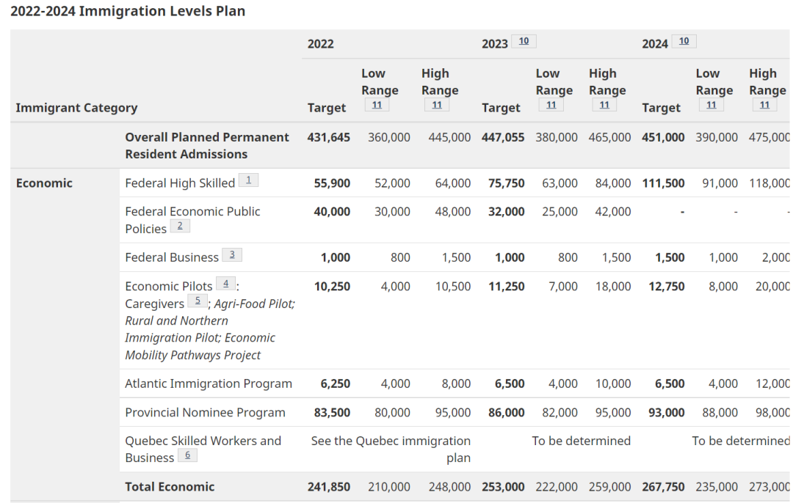 (原始链接: https://mmbiz.qpic.cn/mmbiz_png/904kUibXm7Y70IxH8WANnfkyeYdy1RpCMHy3e0qyjib5GyX5atdgU8076kMgAqryMOl18bIEY0A4PkkZz4CScfTw/640?wx_fmt=png)
- 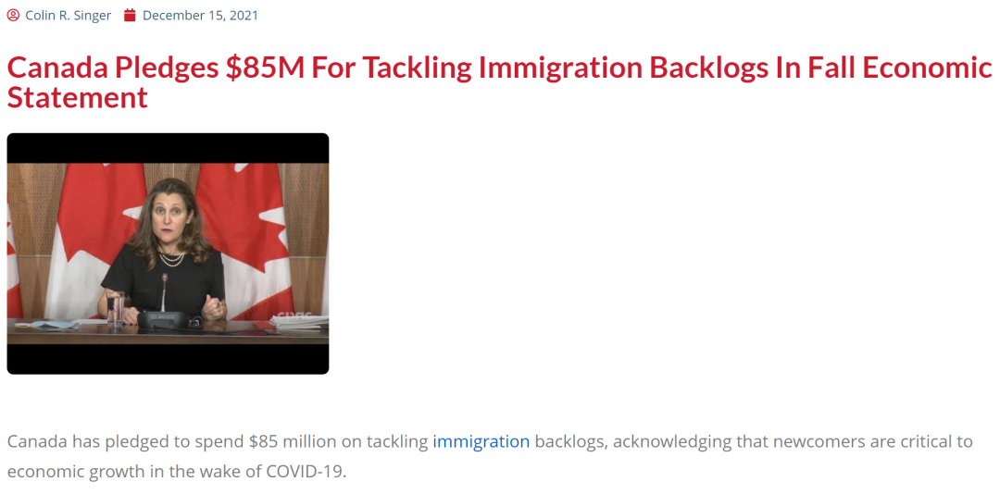 (原始链接: https://mmbiz.qpic.cn/mmbiz_png/904kUibXm7Y70IxH8WANnfkyeYdy1RpCMcjS3fP0kBQvRX7xtvm6455fUECKJYubP5mM2aIgibGANQ2SV0PTGvVg/640?wx_fmt=png)
- 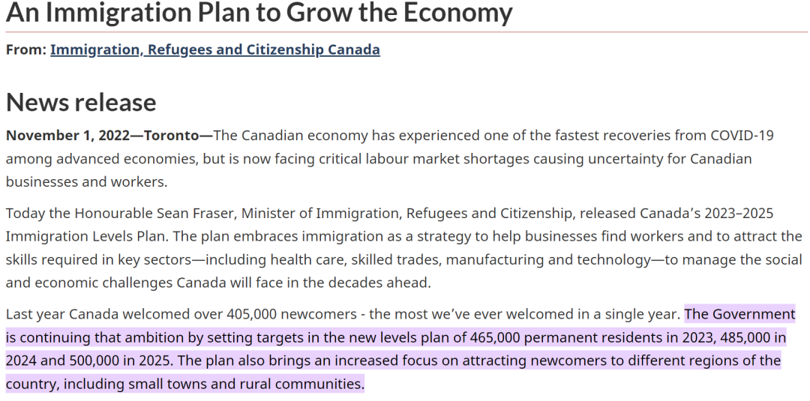 (原始链接: https://mmbiz.qpic.cn/mmbiz_png/904kUibXm7Y70IxH8WANnfkyeYdy1RpCMvwnvIkmd76dgatsTnYepQrHY96IiaNXqeciaC4xGf94SfiaBLLKpues2w/640?wx_fmt=png)
- 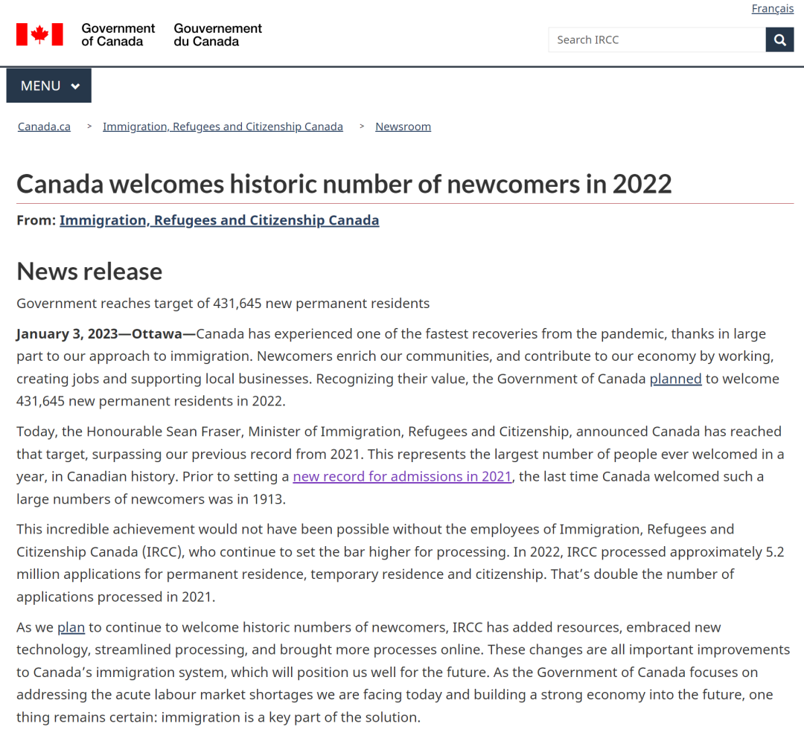 (原始链接: https://mmbiz.qpic.cn/mmbiz_png/904kUibXm7Y70IxH8WANnfkyeYdy1RpCMTjWPwprltibUXDa8oG7cB8XmicMRB4wGdYPHKSRupic8jUiblnuaozUa8g/640?wx_fmt=png)
- 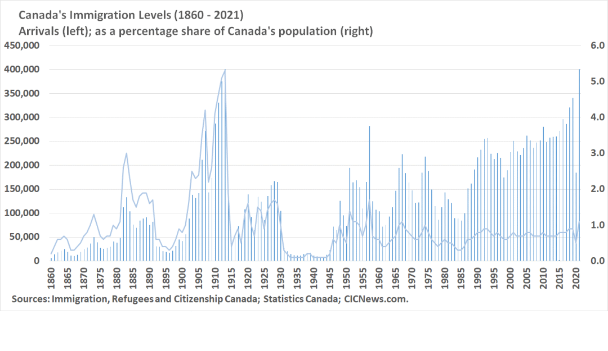 (原始链接: https://mmbiz.qpic.cn/mmbiz_png/904kUibXm7Y70IxH8WANnfkyeYdy1RpCMAan4vgNbOd637W37LjTHtqZxibYFa8AmlgGWbqQnmB5Yd4rjJ4mHm7Q/640?wx_fmt=png)
- 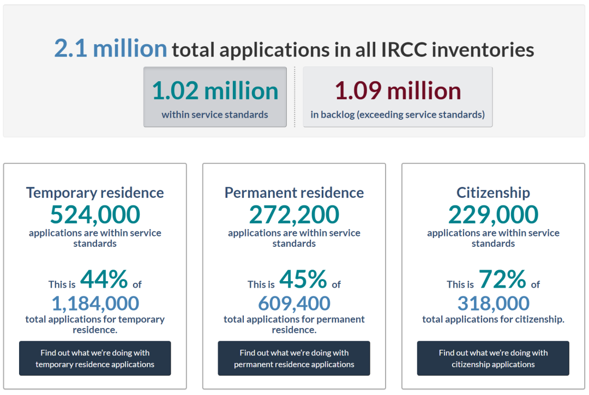 (原始链接: https://mmbiz.qpic.cn/mmbiz_png/904kUibXm7Y70IxH8WANnfkyeYdy1RpCMV828TicfpFiagHLD387Hcicl2WhiavEvhtvLQW6smAWe7Niajt2mwewFrBw/640?wx_fmt=png)
- 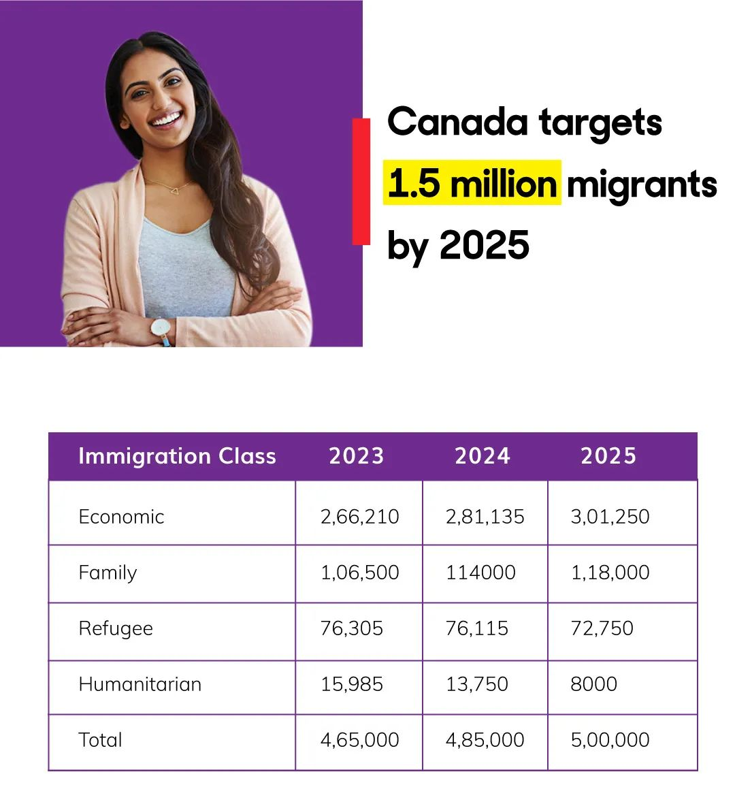 (原始链接: https://mmbiz.qpic.cn/mmbiz_jpg/904kUibXm7Y70IxH8WANnfkyeYdy1RpCMUYy3QzwxS7OxNEpwhXSJDibiaffHYKkdZicGxKyrMtq7tDUHRdnVYxNMg/640?wx_fmt=jpeg)
-  (原始链接: https://mmbiz.qpic.cn/mmbiz_png/904kUibXm7Y70IxH8WANnfkyeYdy1RpCMKF6GankECXtx4uGnuct20UHyJrgQvroKzbYV8oic4HtL1swRHoPBEdw/640?wx_fmt=png)
- 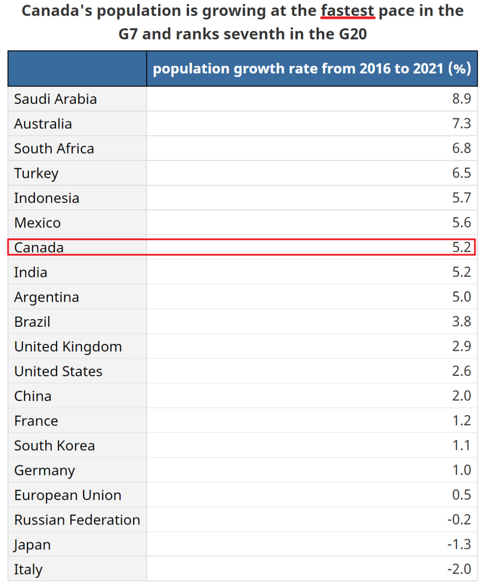 (原始链接: https://mmbiz.qpic.cn/mmbiz_png/904kUibXm7Y70IxH8WANnfkyeYdy1RpCMMlzGibjMR38fzue7OFGhc8MFWmSjnON1Y4iakElYMq2OWhIB6wLkDNvg/640?wx_fmt=png)
-  (原始链接: https://mmbiz.qpic.cn/mmbiz_png/904kUibXm7Y70IxH8WANnfkyeYdy1RpCM15GwOegXWcvAg7WFMibz32vribAMBXmWkQOSwsAnzUdbe0yms471g8Sg/640?wx_fmt=png)
- 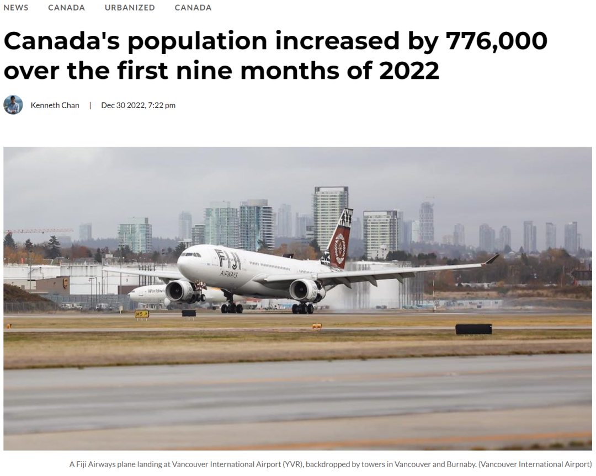 (原始链接: https://mmbiz.qpic.cn/mmbiz_png/904kUibXm7Y70IxH8WANnfkyeYdy1RpCMyMicmKdxOPsKyhpqDpajdq8ekXdIbBz8xEbaviaFq0Eo5ElaYKdYujibg/640?wx_fmt=png)
-  (原始链接: https://mmbiz.qpic.cn/mmbiz_jpg/904kUibXm7Y70IxH8WANnfkyeYdy1RpCMDiazpm9TcLfbFQ6cJpFvmuCkqdGLdpqSHTLtuAAD58zDMMblN8ldW7A/640?wx_fmt=jpeg)
- 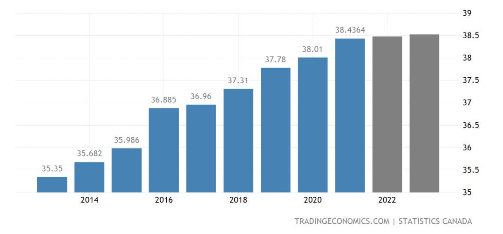 (原始链接: https://mmbiz.qpic.cn/mmbiz_png/904kUibXm7Y70IxH8WANnfkyeYdy1RpCM1GMSoCfYKbG0oxj8wbkXcBDBtB2PQ5weWpUHzf5gyRLVrgy5tyPgmg/640?wx_fmt=png)
-  (原始链接: https://mmbiz.qpic.cn/mmbiz_png/904kUibXm7Y70IxH8WANnfkyeYdy1RpCMxq5IKyM7tzicF8MIT4NiaNRvOiaxTI9LytOIIQ7fDfe3GEqZQVecMh6kg/640?wx_fmt=png)
- 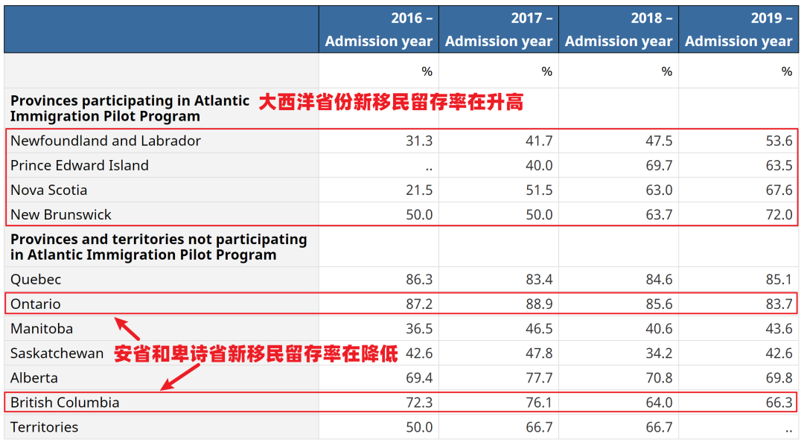 (原始链接: https://mmbiz.qpic.cn/mmbiz_png/904kUibXm7Y70IxH8WANnfkyeYdy1RpCMRmL3hicYsNrVfdndibwUicpmwhrZE89cQs9RtDnEvhcUpibibmex87hgSHA/640?wx_fmt=png)
-  (原始链接: https://mmbiz.qpic.cn/mmbiz_png/904kUibXm7Y70IxH8WANnfkyeYdy1RpCMNloIAOpIqmOU93v6YhZkKowDlWsn07cbdLDxIxdTWVx98wnNE9Iniag/640?wx_fmt=png)
-  (原始链接: https://mmbiz.qpic.cn/mmbiz_png/904kUibXm7Y70IxH8WANnfkyeYdy1RpCM8FXhFvjGkOswOKVibNu2Ke26amHfQSDkJWRbCxxUrguOkbL41GZsmYw/640?wx_fmt=png)
-  (原始链接: https://mmbiz.qpic.cn/mmbiz_png/904kUibXm7Y70IxH8WANnfkyeYdy1RpCMX2dJs0vqTfZ16ldqgMPLw7ABfltpIiaS1gCA9wRPicEcg8cSBWPqVtEQ/640?wx_fmt=png)
-  (原始链接: https://mmbiz.qpic.cn/mmbiz_jpg/904kUibXm7Y70IxH8WANnfkyeYdy1RpCMRes99VIJ6CEkjial3YJ6zrZPrvvzCrGSwibtIPrEUVr4wy0Ykn1LT25Q/640?wx_fmt=jpeg)
-  (原始链接: https://mmbiz.qpic.cn/mmbiz_jpg/904kUibXm7Y70IxH8WANnfkyeYdy1RpCMib8KwGBDTiclr0vVBkPymIxbplJa4S3GzuhlJ2MibIxfdGVXyKlK78NQQ/640?wx_fmt=jpeg)
-  (原始链接: https://mmbiz.qpic.cn/mmbiz_jpg/904kUibXm7Y70IxH8WANnfkyeYdy1RpCMmWkjGUA0eCDwsDX5hl1XL2lxz7Plk9MD1axWjEibySHwnGM3yicib66tQ/640?wx_fmt=jpeg)
