# 无标题

**链接地址:** http://mp.weixin.qq.com/s?__biz=MzI5NTc1MjY2MA==&mid=2247503900&idx=1&sn=4b6c5919ff2b5c629853e47e4dd556e8&chksm=ec4c56a7db3bdfb1a68d0cce77e72c209b7860167ae2c726de8ff575e2d89dd16f6ec4874ed6&mpshare=1&scene=2&srcid=0303IwzztJcRiOe9A5bvzB6f&sharer_sharetime=1677816242912&sharer_shareid=77848a6b3852ae4dcb6c74ffee84743c#rd
**作者:** 汾酒国际
**获取时间:** 2025/8/28 19:19:23
**图片数量:** 41

---

## 原始HTML内容

 
<section style="text-align: center;margin-bottom: 24px;"></section>
过去三年在北美肆虐的疫情改变了人们的生活和思考方式，隔阂了人与人之间的物理距离，也让悲观和焦虑的情绪蔓延在社交氛围中。随着疫情的平息，加拿大各地也逐步恢复了各类大型活动的举办。民众的精神面貌焕然一新，对待艺术和生活品质都有了更高的追求。汾酒顺应当地民众需求，举办“拥抱就不说话”汾酒艺术之夜绘画展，让更多民众在欣赏绘画艺术的同时，走近汾酒、感受汾酒、了解汾酒，从而喜欢汾酒。

“拥抱就不说话”艺术展海报
<section style="outline: 0px;max-width: 100%;color: rgb(34, 34, 34);font-family: system-ui, -apple-system, BlinkMacSystemFont, &quot;Helvetica Neue&quot;, &quot;PingFang SC&quot;, &quot;Hiragino Sans GB&quot;, &quot;Microsoft YaHei UI&quot;, &quot;Microsoft YaHei&quot;, Arial, sans-serif;letter-spacing: 0.544px;white-space: normal;background-color: rgb(255, 255, 255);line-height: 2em;text-align: left;margin-top: 8px;box-sizing: border-box !important;overflow-wrap: break-word !important;">匠心国际酒业联合加拿大青年艺术家协会和普罗米修斯画廊，邀请四位才华横溢的中国知名年轻艺术家，用他们精彩纷呈的绘画作品，为安大略省的艺术爱好者们带来了震撼人心的“拥抱就不说话”汾酒艺术之夜艺术展览活动。</section>
汾酒艺术之夜

“拥抱就不说话”汾酒艺术之夜绘画展开幕仪式于2023年2月25日晚在多伦多Villa Charities慈善中心举办。本次艺术展展出的作品来自中国的四位年轻艺术家：袁子涵、颜秉卿、谢天卓、方建喜；他们将对社会和科技发展的独到思考折射到艺术创作中，通过画作来传递温暖治癒的情绪和开放包容的态度。
<section style="text-align: center;margin-bottom: 0px;">青年艺术家袁子涵先生专门为本次活动</section>
手绘联名帆布袋

汾酒艺术之夜作为本次艺术展览荣誉开幕单元，邀请到来自社会各界的四百余位嘉宾亲临现场，包括联邦国会议员蒋振宇、多伦多市议员陈伶俐、列治文山市市议员崔冰辉、Villa Charities慈善基金会总裁Marco DeVuona等。国会议员董晗鹏也发来贺函，赞赏汾酒对于支持多元文化在国际上的传播和海外年轻华人、华裔以及华侨艺术家群体的创作所做出的杰出贡献，同时预祝本次艺术展览活动圆满成功。

国会议员董晗鹏向本次展会发来的贺函

活动于晚上6点钟准时开场。普罗米修斯画廊主理人孙博文先生、加拿大联邦国会议员蔣振宇先生，两位多伦多市议员陈伶俐和崔冰辉，以及本次画展艺术家代表袁子涵先生先后发表活动致辞。
<section style="text-align: center;margin-bottom: 8px;">展览策展人、普罗米修斯画廊主理人孙博文致词</section><section style="text-align: center;margin-bottom: 8px;">本次画展艺术家代表青年艺术家袁子涵致词</section><section style="text-align: center;margin-bottom: 8px;">国会议员蒋振宇（右2）致赠贺函</section><section style="text-align: center;margin-bottom: 8px;">多伦多市议员陈伶俐（左）获得活动礼品玫瑰汾酒</section>
匠心国际酒业总经理田屹发表致词

汾酒安大略省总代理匠心国际酒业总经理田屹先生代表汾酒发表了活动致辞，对主办单位和组织人员表达了衷心感谢，并邀请嘉宾品尝多款现场特调的汾酒鸡尾酒。

活动现场主持人为嘉宾详细介绍了汾酒文化、汾酒酿造工艺、汾酒的悠久历史以及汾酒在加拿大的发展历程，重点推介了集汾酒品牌文化精髓和新中式设计概念于一身的两款汾酒知名产品——丝绸之路限量版汾酒和青花汾酒30。
<section style="box-sizing: border-box;font-size: 16px;"><section style="text-align: center;justify-content: center;display: flex;flex-flow: row nowrap;margin-top: 10px;margin-bottom: 10px;box-sizing: border-box;" powered-by="xiumi.us"><section style="display: inline-block;width: 100%;vertical-align: top;align-self: flex-start;flex: 0 0 auto;height: auto;border-style: solid;border-width: 2px;border-color: rgb(81, 163, 104);padding: 5px;background-color: rgb(255, 255, 255);box-sizing: border-box;"><section style="justify-content: center;display: flex;flex-flow: row nowrap;box-sizing: border-box;" powered-by="xiumi.us"><section style="display: inline-block;width: 100%;vertical-align: top;align-self: flex-start;flex: 0 0 auto;height: auto;border-style: solid;border-width: 1px;border-color: rgb(81, 163, 104);padding: 10px;box-sizing: border-box;"><section style="line-height: 0;box-sizing: border-box;" powered-by="xiumi.us"><section style="max-width: 100%;vertical-align: middle;display: inline-block;line-height: 0;box-sizing: border-box;"></section></section><section style="justify-content: center;margin-top: 10px;margin-right: 0%;margin-left: 0%;display: flex;flex-flow: row nowrap;box-sizing: border-box;" powered-by="xiumi.us"><section style="display: inline-block;vertical-align: top;width: 50%;flex: 0 0 auto;height: auto;padding-right: 5px;align-self: flex-start;box-sizing: border-box;"><section style="line-height: 0;box-sizing: border-box;" powered-by="xiumi.us"><section style="max-width: 100%;vertical-align: middle;display: inline-block;line-height: 0;box-sizing: border-box;"></section></section></section><section style="display: inline-block;vertical-align: top;width: 50%;flex: 0 0 auto;height: auto;padding-left: 5px;align-self: flex-start;box-sizing: border-box;"><section style="line-height: 0;box-sizing: border-box;" powered-by="xiumi.us"><section style="max-width: 100%;vertical-align: middle;display: inline-block;line-height: 0;box-sizing: border-box;"></section></section></section></section></section></section></section></section><section style="text-align: center;margin-bottom: 8px;" powered-by="xiumi.us">
本次活动的主推单品酒丝绸之路限量版汾酒和青花汾酒30
</section></section>
匠心国际酒业带着12款已上架或即将上架LCBO（安大略省官方酒局）的别具品牌标识度又各具特色、全方位覆盖消费群体的产品，在活动现场进行展示。每一位到场的嘉宾无不驻足观赏，被汾酒瓶身的包装设计吸引住了目光。多位嘉宾甚至直接赞叹：这“汾酒”本身就是艺术品！中国白酒拥有丰富的文化历史底蕴，带来色香味俱全的立体感官体验，品鉴汾酒何尝不是一种品鉴艺术的过程呢？
<section style="text-align: center;margin-bottom: 8px;"></section>
匠心国际酒业带着12款汾酒产品来到活动现场

匠心国际酒业在邀请现场嘉宾直接品鉴多款产品之外，还考虑到加拿大本地人的饮酒习惯，特意邀请到本地知名调酒师为嘉宾现场调配出三款鸡尾酒：茉莉汾酒汤力略带细腻雅致的东方茉莉花茶馨香；粉色汾酒大都会用甜蜜的果味勾勒出现代都市热闹非凡的景象；而魅惑的蓝橙汾酒则充满神秘色彩，其丰富层次烘托下汾酒作为灵魂绽放在舌尖的柔和韵调才最是让人回味和向往。
<section style="box-sizing: border-box;font-size: 16px;"><section style="text-align: left;justify-content: flex-start;display: flex;flex-flow: row nowrap;margin-top: 10px;margin-bottom: 10px;box-sizing: border-box;" powered-by="xiumi.us"><section style="display: inline-block;vertical-align: middle;width: 50%;align-self: center;flex: 0 0 auto;box-sizing: border-box;"><section style="margin-top: 10px;box-sizing: border-box;" powered-by="xiumi.us"><section style="text-align: justify;color: rgb(126, 209, 191);font-size: 19px;box-sizing: border-box;">
✦+
</section></section><section style="text-align: justify;color: rgb(126, 209, 191);box-sizing: border-box;" powered-by="xiumi.us">
+
</section><section style="text-align: center;margin-top: -14px;margin-bottom: 10px;transform: translate3d(-1px, 0px, 0px);line-height: 0;box-sizing: border-box;" powered-by="xiumi.us"><section style="max-width: 100%;vertical-align: middle;display: inline-block;line-height: 0;width: 72%;height: auto;border-style: solid;border-width: 1px;border-color: rgb(255, 255, 255);box-sizing: border-box;"></section></section></section><section style="display: inline-block;vertical-align: middle;width: 50%;align-self: center;flex: 0 0 auto;box-sizing: border-box;"><section style="text-align: center;line-height: 0;box-sizing: border-box;" powered-by="xiumi.us"><section style="max-width: 100%;vertical-align: middle;display: inline-block;line-height: 0;width: 100%;height: auto;border-style: solid;border-width: 1px;border-color: rgb(255, 255, 255);box-sizing: border-box;"></section></section></section></section>
调酒师现场为嘉宾调配以汾酒作为基酒的鸡尾酒饮品
<section style="box-sizing: border-box;font-size: 16px;"><section style="text-align: center;justify-content: center;display: flex;flex-flow: row nowrap;margin-top: 10px;margin-bottom: 10px;box-sizing: border-box;" powered-by="xiumi.us"><section style="display: inline-block;width: 100%;vertical-align: top;align-self: flex-start;flex: 0 0 auto;height: auto;border-style: solid;border-width: 2px;border-color: rgb(81, 163, 104);padding: 5px;background-color: rgb(255, 255, 255);box-sizing: border-box;"><section style="justify-content: center;display: flex;flex-flow: row nowrap;box-sizing: border-box;" powered-by="xiumi.us"><section style="display: inline-block;width: 100%;vertical-align: top;align-self: flex-start;flex: 0 0 auto;height: auto;border-style: solid;border-width: 1px;border-color: rgb(81, 163, 104);padding: 10px;box-sizing: border-box;"><section style="line-height: 0;box-sizing: border-box;" powered-by="xiumi.us"><section style="max-width: 100%;vertical-align: middle;display: inline-block;line-height: 0;box-sizing: border-box;"></section></section><section style="justify-content: center;margin-top: 10px;margin-right: 0%;margin-left: 0%;display: flex;flex-flow: row nowrap;box-sizing: border-box;" powered-by="xiumi.us"><section style="display: inline-block;vertical-align: top;width: 50%;flex: 0 0 auto;height: auto;padding-right: 5px;align-self: flex-start;box-sizing: border-box;"><section style="line-height: 0;box-sizing: border-box;" powered-by="xiumi.us"><section style="max-width: 100%;vertical-align: middle;display: inline-block;line-height: 0;box-sizing: border-box;"></section></section></section><section style="display: inline-block;vertical-align: top;width: 50%;flex: 0 0 auto;height: auto;padding-left: 5px;align-self: flex-start;box-sizing: border-box;"><section style="line-height: 0;box-sizing: border-box;" powered-by="xiumi.us"><section style="max-width: 100%;vertical-align: middle;display: inline-block;line-height: 0;box-sizing: border-box;"></section></section></section></section></section></section></section></section><section style="text-align: center;margin-bottom: 16px;box-sizing: border-box;font-size: 16px;" powered-by="xiumi.us"><section style="text-align: center;box-sizing: border-box;font-size: 16px;margin-bottom: 8px;">以汾酒为基酒调制的三款鸡尾酒</section></section></section></section><section style="outline: 0px;max-width: 100%;color: rgb(34, 34, 34);font-family: system-ui, -apple-system, BlinkMacSystemFont, &quot;Helvetica Neue&quot;, &quot;PingFang SC&quot;, &quot;Hiragino Sans GB&quot;, &quot;Microsoft YaHei UI&quot;, &quot;Microsoft YaHei&quot;, Arial, sans-serif;letter-spacing: 0.544px;white-space: normal;background-color: rgb(255, 255, 255);line-height: 2em;margin-top: 8px;box-sizing: border-box !important;overflow-wrap: break-word !important;">现场嘉宾纷纷踊跃品鉴汾酒，有些现场嘉宾是第一次喝汾酒，他们表示汾酒和他们平时喝到的西方烈酒很不一样：单独品饮时清香绵甜、回味悠长；混合在鸡尾酒中则层次凸显，馥郁芬芳。这样细腻的口感只有在汾酒这样品质的中国白酒身上才能找到，会考虑今后在本地的LCBO酒铺中买来送给朋友或者自己品尝。</section><section style="box-sizing: border-box;font-size: 16px;"><section style="margin-top: 10px;margin-bottom: 10px;box-sizing: border-box;" powered-by="xiumi.us"><section style="display: inline-block;width: 100%;vertical-align: top;overflow-x: auto;box-sizing: border-box;"><section style="overflow: hidden;width: 400%;max-width: 400% !important;box-sizing: border-box;"><section style="display: inline-block;width: 25%;vertical-align: middle;box-sizing: border-box;" powered-by="xiumi.us"><section style="text-align: center;line-height: 0;box-sizing: border-box;"><section style="max-width: 100%;vertical-align: middle;display: inline-block;line-height: 0;width: 100%;box-sizing: border-box;"></section></section></section><section style="display: inline-block;width: 25%;vertical-align: top;box-sizing: border-box;" powered-by="xiumi.us"><section style="text-align: center;line-height: 0;box-sizing: border-box;"><section style="max-width: 100%;vertical-align: middle;display: inline-block;line-height: 0;width: 100%;box-sizing: border-box;"></section></section></section><section style="display: inline-block;width: 25%;vertical-align: top;box-sizing: border-box;" powered-by="xiumi.us"><section style="text-align: center;line-height: 0;box-sizing: border-box;"><section style="max-width: 100%;vertical-align: middle;display: inline-block;line-height: 0;width: 100%;box-sizing: border-box;"></section></section></section><section style="display: inline-block;width: 25%;vertical-align: top;box-sizing: border-box;" powered-by="xiumi.us"><section style="text-align: center;line-height: 0;box-sizing: border-box;"><section style="max-width: 100%;vertical-align: middle;display: inline-block;line-height: 0;width: 100%;box-sizing: border-box;"></section></section></section></section></section></section><section style="text-align: center;box-sizing: border-box;font-size: 16px;margin-bottom: 8px;">左右滑动 查看更多</section></section><section style="outline: 0px;max-width: 100%;color: rgb(34, 34, 34);font-family: system-ui, -apple-system, BlinkMacSystemFont, &quot;Helvetica Neue&quot;, &quot;PingFang SC&quot;, &quot;Hiragino Sans GB&quot;, &quot;Microsoft YaHei UI&quot;, &quot;Microsoft YaHei&quot;, Arial, sans-serif;letter-spacing: 0.544px;white-space: normal;background-color: rgb(255, 255, 255);line-height: 2em;margin-top: 8px;box-sizing: border-box !important;overflow-wrap: break-word !important;">匠心国际酒业一直致力于汾酒在加拿大的销售和推广，并取得了卓越的成绩，成为汾酒在海外市场的优秀代表之一。经过匠心国际酒业多年深耕市场，大力培育汾酒消费圈，努力使汾酒成为在加拿大知名且受欢迎的中国白酒代表品牌，让最能代表中国白酒的汾酒在当地的知名度和认可度均得到全面提升，为中国白酒走向国际市场贡献了力量。</section>
国会议员蒋振宇在签名墙上留下签名
<section style="text-align: center;margin-bottom: 8px;">预祝活动圆满举办</section><section style="text-align: center;margin-bottom: 8px;">汾酒海报及宣传册矗立在会场迎宾区</section>
自汾酒系列产品登陆加拿大以来，汾酒一直致力于加强与加国的社区合作发展。“拥抱就不说话”汾酒艺术之夜绘画展，是汾酒在加拿大与艺术类活动合作的首次尝试，这为中国白酒和文艺展演在国际舞台上的联袂出演树立了一个高标准的范本。白酒不再是围于烟火气的日常，不再受限于饭桌上的固定角色，而是可以游走在高端场合和多重社交语境中的耀眼明星。它可以是文化传播的有形载体，也可以是艺术创作的灵感缪斯。这不仅升华了白酒作为中国传统文化标识的身份，更描绘出其多元化、国际化、高端化、现代化的形象，让中国白酒以更亲和有力的方式进入加拿大本地社区民众的视野，自然融入到他们海纳百川，豁达包容的文化体系当中。

艺术是媒介，在观赏展览的同时和创作者进行思想碰撞，通过这些精彩的画作去聆听他们的心声；汾酒是载体，在和亲友们举杯共庆的过程中珍惜收获懂得感恩，体会语言无法传达的涓涓情谊。

开幕典礼后，展览将正式展出至3月13日，预祝“拥抱就不说话”汾酒艺术之夜艺术展览活动取得圆满成功！
<section style="box-sizing: border-box;font-size: 16px;"><section style="margin-top: 10px;margin-bottom: 10px;box-sizing: border-box;" powered-by="xiumi.us"><section style="display: inline-block;width: 100%;vertical-align: top;overflow-x: auto;box-sizing: border-box;"><section style="overflow: hidden;width: 700%;max-width: 700% !important;box-sizing: border-box;"><section style="display: inline-block;vertical-align: middle;width: 14.2857%;box-sizing: border-box;" powered-by="xiumi.us"><section style="text-align: center;margin-top: 10px;margin-bottom: 10px;line-height: 0;box-sizing: border-box;"><section style="max-width: 100%;vertical-align: middle;display: inline-block;line-height: 0;box-sizing: border-box;"></section></section></section><section style="display: inline-block;vertical-align: top;width: 14.2857%;box-sizing: border-box;" powered-by="xiumi.us"><section style="text-align: center;margin-top: 10px;margin-bottom: 10px;line-height: 0;box-sizing: border-box;"><section style="max-width: 100%;vertical-align: middle;display: inline-block;line-height: 0;box-sizing: border-box;"></section></section></section><section style="display: inline-block;vertical-align: top;width: 14.2857%;box-sizing: border-box;" powered-by="xiumi.us"><section style="text-align: center;margin-top: 10px;margin-bottom: 10px;line-height: 0;box-sizing: border-box;"><section style="max-width: 100%;vertical-align: middle;display: inline-block;line-height: 0;box-sizing: border-box;"></section></section></section><section style="display: inline-block;vertical-align: top;width: 14.2857%;box-sizing: border-box;" powered-by="xiumi.us"><section style="text-align: center;margin-top: 10px;margin-bottom: 10px;line-height: 0;box-sizing: border-box;"><section style="max-width: 100%;vertical-align: middle;display: inline-block;line-height: 0;box-sizing: border-box;"></section></section></section><section style="display: inline-block;vertical-align: top;width: 14.2857%;box-sizing: border-box;" powered-by="xiumi.us"><section style="text-align: center;margin-top: 10px;margin-bottom: 10px;line-height: 0;box-sizing: border-box;"><section style="max-width: 100%;vertical-align: middle;display: inline-block;line-height: 0;box-sizing: border-box;"></section></section></section><section style="display: inline-block;vertical-align: top;width: 14.2857%;box-sizing: border-box;" powered-by="xiumi.us"><section style="text-align: center;margin-top: 10px;margin-bottom: 10px;line-height: 0;box-sizing: border-box;"><section style="max-width: 100%;vertical-align: middle;display: inline-block;line-height: 0;box-sizing: border-box;"></section></section></section><section style="display: inline-block;vertical-align: top;width: 14.2857%;box-sizing: border-box;" powered-by="xiumi.us"><section style="text-align: center;margin-top: 10px;margin-bottom: 10px;line-height: 0;box-sizing: border-box;"><section style="max-width: 100%;vertical-align: middle;display: inline-block;line-height: 0;box-sizing: border-box;"></section></section></section></section></section></section>
左右滑动&nbsp;查看更多活动现场图
</section>
 

 

 

想了解最新活动资讯

记得把我们<strong style="outline: 0px;">置顶</strong>和<strong style="outline: 0px;">设为星标</strong>！

 

<strong>往期内容推荐</strong>
<section data-mpa-template="t" data-from="yb-recommend-list" style="margin-bottom: 0px;"><section data-mpa-template="t" data-from="yb-recommend" data-recommend-article-type="normal" data-recomment-template-id="4" data-recommend-article-id="2247502660_1" data-recommend-article-time="1674262800" data-recommend-article-cover="https://mmbiz.qpic.cn/mmbiz_jpg/mXYF5vw37Tt1tw5N3N7L5ibV0MgMLu1GAsTicrp2Gp3dYzansukM57Hsu8Th3ulcwAR3UumN6g7nUibkoYnib3gic7g/0?wx_fmt=jpeg" data-recommend-article-title="中国红 汾酒红" data-recommend-article-content-url="https://mp.weixin.qq.com/s?__biz=MzI5NTc1MjY2MA==&amp;mid=2247502660&amp;idx=1&amp;sn=de87ef47a6b7659d9138d51855e280a7&amp;chksm=ec4c4dffdb3bc4e9e74a139b9856e729cfbd9c5c43f7b0dc20ce26b643b38f7e583bfadd9daf#rd"><a href="https://mp.weixin.qq.com/s?__biz=MzI5NTc1MjY2MA==&amp;mid=2247502660&amp;idx=1&amp;sn=de87ef47a6b7659d9138d51855e280a7&amp;chksm=ec4c4dffdb3bc4e9e74a139b9856e729cfbd9c5c43f7b0dc20ce26b643b38f7e583bfadd9daf&amp;scene=21#wechat_redirect" data-linktype="1"><section data-recommend-type="normal" data-recommend-tid="4" data-mid="" style="display: flex;width: 578px;justify-content: center;align-items: center;"><section data-mid="" style="padding: 10px 9px;width: 578px;background: rgb(255, 255, 255);border-radius: 3px;border-width: 1px;border-style: solid;border-color: rgb(232, 232, 235);"><section data-mid="" style="margin-bottom: 8px;display: flex;width: 558px;justify-content: center;align-items: center;"></section><section data-mid="" style="width: 558px;text-align: left;font-size: 15px;color: rgb(102, 102, 102);line-height: 21px;">
中国红&nbsp;汾酒红
</section></section></section></a></section> <section data-mpa-template="t" data-from="yb-recommend" data-recommend-article-type="normal" data-recomment-template-id="4" data-recommend-article-id="2247502406_1" data-recommend-article-time="1673604550" data-recommend-article-cover="https://mmbiz.qpic.cn/mmbiz_jpg/mXYF5vw37TvUvVXHBFRahAPIbt1iag9uw7FPkPxTMYyYc2qbAAsiacZ686wVYrMnAsq17UuXibH7cTm1NO87Q5y9Q/0?wx_fmt=jpeg" data-recommend-article-title="Our Language is Fenjiu 2022" data-recommend-article-content-url="https://mp.weixin.qq.com/s?__biz=MzI5NTc1MjY2MA==&amp;mid=2247502406&amp;idx=1&amp;sn=924028cbfe2375b5b518f9b7c18c7fe4&amp;chksm=ec4c4cfddb3bc5eb4b38566d73f02c776741214dc689f40bc51e51e322fd0e3a1a481ef32a23#rd"><a href="https://mp.weixin.qq.com/s?__biz=MzI5NTc1MjY2MA==&amp;mid=2247502406&amp;idx=1&amp;sn=924028cbfe2375b5b518f9b7c18c7fe4&amp;chksm=ec4c4cfddb3bc5eb4b38566d73f02c776741214dc689f40bc51e51e322fd0e3a1a481ef32a23&amp;scene=21#wechat_redirect" data-linktype="1"><section data-recommend-type="normal" data-recommend-tid="4" data-mid="" style="display: flex;width: 578px;justify-content: center;align-items: center;"><section data-mid="" style="padding: 10px 9px;width: 578px;background: rgb(255, 255, 255);border-radius: 3px;border-width: 1px;border-style: solid;border-color: rgb(232, 232, 235);"><section data-mid="" style="margin-bottom: 8px;display: flex;width: 558px;justify-content: center;align-items: center;"></section><section data-mid="" style="width: 558px;text-align: left;font-size: 15px;color: rgb(102, 102, 102);line-height: 21px;">
Our&nbsp;Language&nbsp;is&nbsp;Fenjiu&nbsp;2022
</section></section></section></a></section> <section data-mpa-template="t" data-from="yb-recommend" data-recommend-article-type="normal" data-recomment-template-id="4" data-recommend-article-id="2247502659_1" data-recommend-article-time="1674199856" data-recommend-article-cover="https://mmbiz.qpic.cn/mmbiz_jpg/mXYF5vw37TtzPV4m0fXTKa1psMLS6TbgYETCeHkTCHc2turwyWRTM48AxCs55HvQacG8sR5bVRbZupFXfApz4Q/0?wx_fmt=jpeg" data-recommend-article-title="玉兔呈祥，汾酒携手法国侨界举杯贺新春" data-recommend-article-content-url="https://mp.weixin.qq.com/s?__biz=MzI5NTc1MjY2MA==&amp;mid=2247502659&amp;idx=1&amp;sn=9fa72e4e00b9a1819c461ecd8711504a&amp;chksm=ec4c4df8db3bc4ee751b740178b6b6f6407a97e330de9358cd0029bb6e4a4a929cad15144eaf#rd"><a href="https://mp.weixin.qq.com/s?__biz=MzI5NTc1MjY2MA==&amp;mid=2247502659&amp;idx=1&amp;sn=9fa72e4e00b9a1819c461ecd8711504a&amp;chksm=ec4c4df8db3bc4ee751b740178b6b6f6407a97e330de9358cd0029bb6e4a4a929cad15144eaf&amp;scene=21#wechat_redirect" data-linktype="1"><section data-recommend-type="normal" data-recommend-tid="4" data-mid="" style="display: flex;width: 578px;justify-content: center;align-items: center;"><section data-mid="" style="padding: 10px 9px;width: 578px;background: rgb(255, 255, 255);border-radius: 3px;border-width: 1px;border-style: solid;border-color: rgb(232, 232, 235);"><section data-mid="" style="margin-bottom: 8px;display: flex;width: 558px;justify-content: center;align-items: center;"></section><section data-mid="" style="width: 558px;text-align: left;font-size: 15px;color: rgb(102, 102, 102);line-height: 21px;">
玉兔呈祥，汾酒携手法国侨界举杯贺新春
</section></section></section></a></section> <section data-mpa-template="t" data-from="yb-recommend" data-recommend-article-type="normal" data-recomment-template-id="4" data-recommend-article-id="2247502284_1" data-recommend-article-time="1673238161" data-recommend-article-cover="https://mmbiz.qpic.cn/mmbiz_jpg/mXYF5vw37TvLQjGkzWVEeSVneCsZpiasry4At9satKD9cBibVggojgz4S0Frr43MpXJ9d5s4tg54Msjic2LWcDu3A/0?wx_fmt=jpeg" data-recommend-article-title="汾酒文化国际传播史｜以新姿态走向国际舞台（第38期）" data-recommend-article-content-url="https://mp.weixin.qq.com/s?__biz=MzI5NTc1MjY2MA==&amp;mid=2247502284&amp;idx=1&amp;sn=0bb366bb8ed2d8217c90ebced414b9d3&amp;chksm=ec4c4f77db3bc6615fd2c836304c4134972c927d8a268430ed5b5366366c3b5d8d741ea9df2a#rd"><a href="https://mp.weixin.qq.com/s?__biz=MzI5NTc1MjY2MA==&amp;mid=2247502284&amp;idx=1&amp;sn=0bb366bb8ed2d8217c90ebced414b9d3&amp;chksm=ec4c4f77db3bc6615fd2c836304c4134972c927d8a268430ed5b5366366c3b5d8d741ea9df2a&amp;scene=21#wechat_redirect" data-linktype="1"><section data-recommend-type="normal" data-recommend-tid="4" data-mid="" style="display: flex;width: 578px;justify-content: center;align-items: center;"><section data-mid="" style="padding: 10px 9px;width: 578px;background: rgb(255, 255, 255);border-radius: 3px;border-width: 1px;border-style: solid;border-color: rgb(232, 232, 235);"><section data-mid="" style="margin-bottom: 8px;display: flex;width: 558px;justify-content: center;align-items: center;"></section><section data-mid="" style="width: 558px;text-align: left;font-size: 15px;color: rgb(102, 102, 102);line-height: 21px;">
汾酒文化国际传播史｜以新姿态走向国际舞台（第38期）
</section></section></section></a></section> <section data-mpa-template="t" data-from="yb-recommend" data-recommend-article-type="normal" data-recomment-template-id="4" data-recommend-article-id="2247501880_1" data-recommend-article-time="1670835435" data-recommend-article-cover="https://mmbiz.qpic.cn/mmbiz_jpg/mXYF5vw37TvDrhEYz0srb0I4z6FrM80QAUGZvQwO3vHuhcflMQ6ZX47CozgLb0Cz44hXFRoFygMwicKpFTyR8oA/0?wx_fmt=jpeg" data-recommend-article-title="欧洲首场中国白酒拍卖巴黎成功举行 1979年杏花村汾酒拍出21280欧元高价" data-recommend-article-content-url="https://mp.weixin.qq.com/s?__biz=MzI5NTc1MjY2MA==&amp;mid=2247501880&amp;idx=1&amp;sn=bbd3deb8a3c285afbdf3ecffe2388c8c&amp;chksm=ec4c4e83db3bc7952fdbd66a82cd3854b778f1bdf4523811f8708d9c8e6aee7916e163e88df8#rd"><a href="https://mp.weixin.qq.com/s?__biz=MzI5NTc1MjY2MA==&amp;mid=2247501880&amp;idx=1&amp;sn=bbd3deb8a3c285afbdf3ecffe2388c8c&amp;chksm=ec4c4e83db3bc7952fdbd66a82cd3854b778f1bdf4523811f8708d9c8e6aee7916e163e88df8&amp;scene=21#wechat_redirect" data-linktype="1"><section data-recommend-type="normal" data-recommend-tid="4" data-mid="" style="display: flex;width: 578px;justify-content: center;align-items: center;"><section data-mid="" style="padding: 10px 9px;width: 578px;background: rgb(255, 255, 255);border-radius: 3px;border-width: 1px;border-style: solid;border-color: rgb(232, 232, 235);"><section data-mid="" style="margin-bottom: 8px;display: flex;width: 558px;justify-content: center;align-items: center;"></section><section data-mid="" style="width: 558px;text-align: left;font-size: 15px;color: rgb(102, 102, 102);line-height: 21px;">
欧洲首场中国白酒拍卖巴黎成功举行&nbsp;1979年杏花村汾酒拍出21280欧元高价
</section></section></section></a></section> </section>
 
<section style="margin-bottom: 0px;white-space: normal;color: rgb(53, 53, 53);font-size: 14px;outline: 0px;font-family: -apple-system, BlinkMacSystemFont, &quot;Helvetica Neue&quot;, &quot;PingFang SC&quot;, &quot;Hiragino Sans GB&quot;, &quot;Microsoft YaHei UI&quot;, &quot;Microsoft YaHei&quot;, Arial, sans-serif;letter-spacing: 0.544px;background-color: rgb(255, 255, 255);text-align: right;"> </section><section style="margin-bottom: 0px;white-space: normal;color: rgb(53, 53, 53);font-size: 14px;outline: 0px;font-family: -apple-system, BlinkMacSystemFont, &quot;Helvetica Neue&quot;, &quot;PingFang SC&quot;, &quot;Hiragino Sans GB&quot;, &quot;Microsoft YaHei UI&quot;, &quot;Microsoft YaHei&quot;, Arial, sans-serif;letter-spacing: 0.544px;background-color: rgb(255, 255, 255);text-align: right;"><strong style="outline: 0px;">❤&nbsp;您点的每一个“在看”，我都认真当成了喜欢。</strong></section>
 

 

 

<mp-style-type data-value="3"></mp-style-type>

---

## 纯文本内容

过去三年在北美肆虐的疫情改变了人们的生活和思考方式，隔阂了人与人之间的物理距离，也让悲观和焦虑的情绪蔓延在社交氛围中。随着疫情的平息，加拿大各地也逐步恢复了各类大型活动的举办。民众的精神面貌焕然一新，对待艺术和生活品质都有了更高的追求。汾酒顺应当地民众需求，举办“拥抱就不说话”汾酒艺术之夜绘画展，让更多民众在欣赏绘画艺术的同时，走近汾酒、感受汾酒、了解汾酒，从而喜欢汾酒。“拥抱就不说话”艺术展海报匠心国际酒业联合加拿大青年艺术家协会和普罗米修斯画廊，邀请四位才华横溢的中国知名年轻艺术家，用他们精彩纷呈的绘画作品，为安大略省的艺术爱好者们带来了震撼人心的“拥抱就不说话”汾酒艺术之夜艺术展览活动。汾酒艺术之夜“拥抱就不说话”汾酒艺术之夜绘画展开幕仪式于2023年2月25日晚在多伦多Villa Charities慈善中心举办。本次艺术展展出的作品来自中国的四位年轻艺术家：袁子涵、颜秉卿、谢天卓、方建喜；他们将对社会和科技发展的独到思考折射到艺术创作中，通过画作来传递温暖治癒的情绪和开放包容的态度。青年艺术家袁子涵先生专门为本次活动手绘联名帆布袋汾酒艺术之夜作为本次艺术展览荣誉开幕单元，邀请到来自社会各界的四百余位嘉宾亲临现场，包括联邦国会议员蒋振宇、多伦多市议员陈伶俐、列治文山市市议员崔冰辉、Villa Charities慈善基金会总裁Marco DeVuona等。国会议员董晗鹏也发来贺函，赞赏汾酒对于支持多元文化在国际上的传播和海外年轻华人、华裔以及华侨艺术家群体的创作所做出的杰出贡献，同时预祝本次艺术展览活动圆满成功。国会议员董晗鹏向本次展会发来的贺函活动于晚上6点钟准时开场。普罗米修斯画廊主理人孙博文先生、加拿大联邦国会议员蔣振宇先生，两位多伦多市议员陈伶俐和崔冰辉，以及本次画展艺术家代表袁子涵先生先后发表活动致辞。展览策展人、普罗米修斯画廊主理人孙博文致词本次画展艺术家代表青年艺术家袁子涵致词国会议员蒋振宇（右2）致赠贺函多伦多市议员陈伶俐（左）获得活动礼品玫瑰汾酒匠心国际酒业总经理田屹发表致词汾酒安大略省总代理匠心国际酒业总经理田屹先生代表汾酒发表了活动致辞，对主办单位和组织人员表达了衷心感谢，并邀请嘉宾品尝多款现场特调的汾酒鸡尾酒。活动现场主持人为嘉宾详细介绍了汾酒文化、汾酒酿造工艺、汾酒的悠久历史以及汾酒在加拿大的发展历程，重点推介了集汾酒品牌文化精髓和新中式设计概念于一身的两款汾酒知名产品——丝绸之路限量版汾酒和青花汾酒30。本次活动的主推单品酒丝绸之路限量版汾酒和青花汾酒30匠心国际酒业带着12款已上架或即将上架LCBO（安大略省官方酒局）的别具品牌标识度又各具特色、全方位覆盖消费群体的产品，在活动现场进行展示。每一位到场的嘉宾无不驻足观赏，被汾酒瓶身的包装设计吸引住了目光。多位嘉宾甚至直接赞叹：这“汾酒”本身就是艺术品！中国白酒拥有丰富的文化历史底蕴，带来色香味俱全的立体感官体验，品鉴汾酒何尝不是一种品鉴艺术的过程呢？匠心国际酒业带着12款汾酒产品来到活动现场匠心国际酒业在邀请现场嘉宾直接品鉴多款产品之外，还考虑到加拿大本地人的饮酒习惯，特意邀请到本地知名调酒师为嘉宾现场调配出三款鸡尾酒：茉莉汾酒汤力略带细腻雅致的东方茉莉花茶馨香；粉色汾酒大都会用甜蜜的果味勾勒出现代都市热闹非凡的景象；而魅惑的蓝橙汾酒则充满神秘色彩，其丰富层次烘托下汾酒作为灵魂绽放在舌尖的柔和韵调才最是让人回味和向往。✦++调酒师现场为嘉宾调配以汾酒作为基酒的鸡尾酒饮品以汾酒为基酒调制的三款鸡尾酒现场嘉宾纷纷踊跃品鉴汾酒，有些现场嘉宾是第一次喝汾酒，他们表示汾酒和他们平时喝到的西方烈酒很不一样：单独品饮时清香绵甜、回味悠长；混合在鸡尾酒中则层次凸显，馥郁芬芳。这样细腻的口感只有在汾酒这样品质的中国白酒身上才能找到，会考虑今后在本地的LCBO酒铺中买来送给朋友或者自己品尝。左右滑动 查看更多匠心国际酒业一直致力于汾酒在加拿大的销售和推广，并取得了卓越的成绩，成为汾酒在海外市场的优秀代表之一。经过匠心国际酒业多年深耕市场，大力培育汾酒消费圈，努力使汾酒成为在加拿大知名且受欢迎的中国白酒代表品牌，让最能代表中国白酒的汾酒在当地的知名度和认可度均得到全面提升，为中国白酒走向国际市场贡献了力量。国会议员蒋振宇在签名墙上留下签名预祝活动圆满举办汾酒海报及宣传册矗立在会场迎宾区自汾酒系列产品登陆加拿大以来，汾酒一直致力于加强与加国的社区合作发展。“拥抱就不说话”汾酒艺术之夜绘画展，是汾酒在加拿大与艺术类活动合作的首次尝试，这为中国白酒和文艺展演在国际舞台上的联袂出演树立了一个高标准的范本。白酒不再是围于烟火气的日常，不再受限于饭桌上的固定角色，而是可以游走在高端场合和多重社交语境中的耀眼明星。它可以是文化传播的有形载体，也可以是艺术创作的灵感缪斯。这不仅升华了白酒作为中国传统文化标识的身份，更描绘出其多元化、国际化、高端化、现代化的形象，让中国白酒以更亲和有力的方式进入加拿大本地社区民众的视野，自然融入到他们海纳百川，豁达包容的文化体系当中。艺术是媒介，在观赏展览的同时和创作者进行思想碰撞，通过这些精彩的画作去聆听他们的心声；汾酒是载体，在和亲友们举杯共庆的过程中珍惜收获懂得感恩，体会语言无法传达的涓涓情谊。开幕典礼后，展览将正式展出至3月13日，预祝“拥抱就不说话”汾酒艺术之夜艺术展览活动取得圆满成功！左右滑动 查看更多活动现场图想了解最新活动资讯记得把我们置顶和设为星标！往期内容推荐中国红 汾酒红Our Language is Fenjiu 2022玉兔呈祥，汾酒携手法国侨界举杯贺新春汾酒文化国际传播史｜以新姿态走向国际舞台（第38期）欧洲首场中国白酒拍卖巴黎成功举行 1979年杏花村汾酒拍出21280欧元高价❤ 您点的每一个“在看”，我都认真当成了喜欢。

---

## 图片列表

-  (原始链接: https://mmbiz.qpic.cn/mmbiz_gif/mXYF5vw37TusbAiaLk9iaVF51795So5LNnpI0N3v5r8rV6rkQ1v1KL9tQCSX975X956B9KLmsNVm1UmIw9AaPV7g/640?wx_fmt=gif)
- 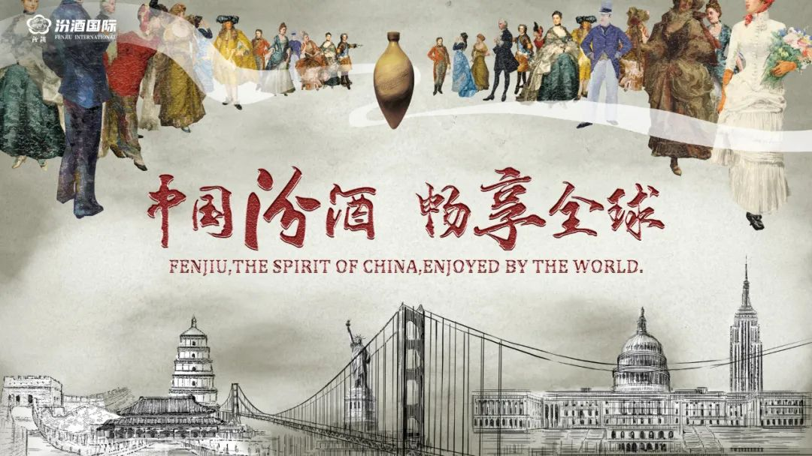 (原始链接: https://mmbiz.qpic.cn/mmbiz_jpg/mXYF5vw37TtAgQ9qLvltxdU0jwEs1ENAm1TnK8rOJ1jHC5iad3WK3U1wvnJPH4AHPfQIXFUMmNLzrLsiaFFmYO5g/640?wx_fmt=jpeg)
- 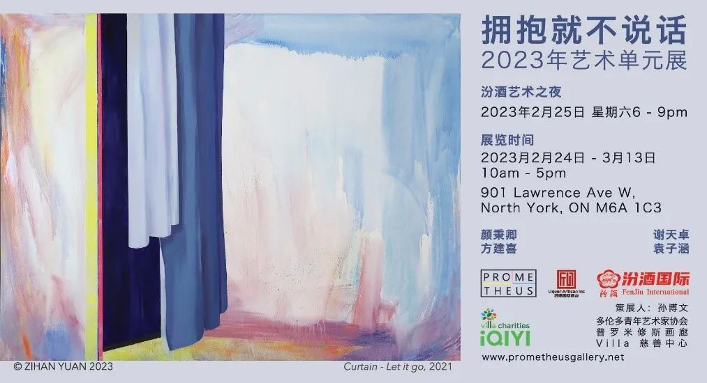 (原始链接: https://mmbiz.qpic.cn/mmbiz_jpg/mXYF5vw37Tv9gP8TS3Fg7D3fjs92rm1VAJjYdrF8tAMU2heXDCSb4lQNx0EhV3r8Z0lqVSrAgicuXzXltfWaxFA/640?wx_fmt=jpeg)
- 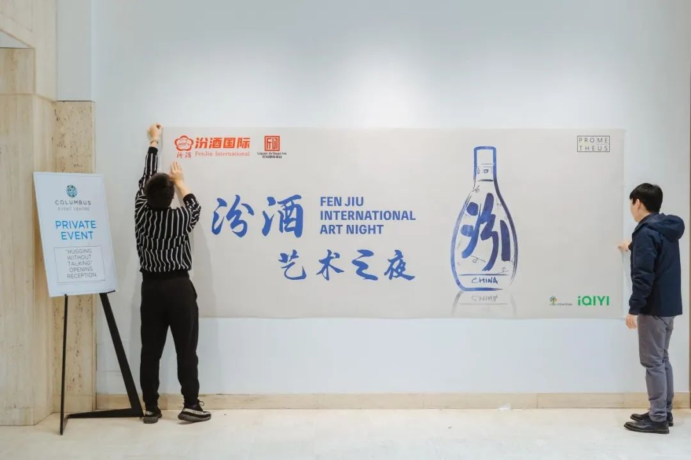 (原始链接: https://mmbiz.qpic.cn/mmbiz_jpg/mXYF5vw37Tv9gP8TS3Fg7D3fjs92rm1V3JM71ibURfo48KAaib8evG5MjSgpfrheQyAicffvbO0NPOAgoVicxH8CLw/640?wx_fmt=jpeg)
- 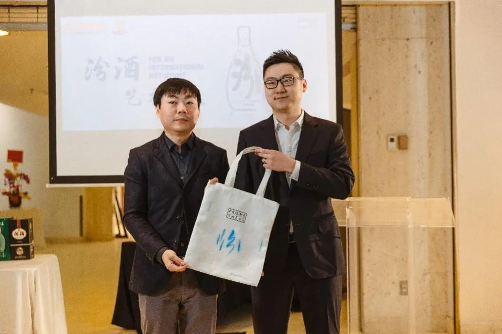 (原始链接: https://mmbiz.qpic.cn/mmbiz_jpg/mXYF5vw37Tv9gP8TS3Fg7D3fjs92rm1VaAiaQHXKusXU8jQO6UBueQcRnWglNNgicibWUvU2AmjQMt1oBcEV3dMqg/640?wx_fmt=jpeg)
- 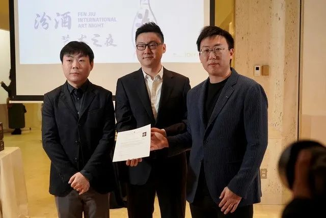 (原始链接: https://mmbiz.qpic.cn/mmbiz_jpg/mXYF5vw37Tv9gP8TS3Fg7D3fjs92rm1VJMsHnLJz8fJU8LIVwUmM9WQSXQ77Ke6gvQ6wfj7fwZDY5o0j5Z27oA/640?wx_fmt=jpeg)
-  (原始链接: https://mmbiz.qpic.cn/mmbiz_jpg/mXYF5vw37Tv9gP8TS3Fg7D3fjs92rm1Vjicib2BfU73h2FJKdg9qkloDsXrpdTWJibOcSK1rpEe6H7M7lSicRP2FPg/640?wx_fmt=jpeg)
-  (原始链接: https://mmbiz.qpic.cn/mmbiz_jpg/mXYF5vw37Tv9gP8TS3Fg7D3fjs92rm1VkKAP62KHwbWDHgzQyddMhSkW1agbySS1edk3Zb2s5rX4fQIXDickEpQ/640?wx_fmt=jpeg)
- 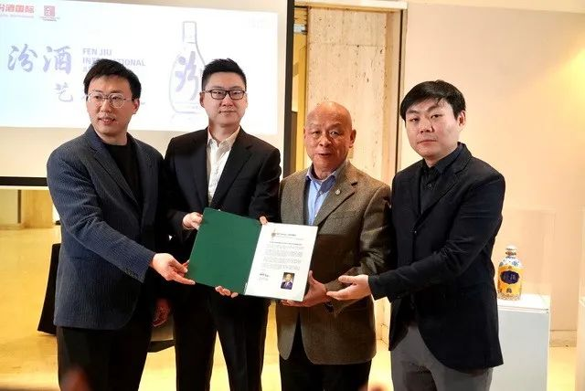 (原始链接: https://mmbiz.qpic.cn/mmbiz_jpg/mXYF5vw37Tv9gP8TS3Fg7D3fjs92rm1VaT9LbosGfnLkI0s5kNGmmzfq6wvgjvCMolvnPBFwzGCibIf0RpDuQtQ/640?wx_fmt=jpeg)
- 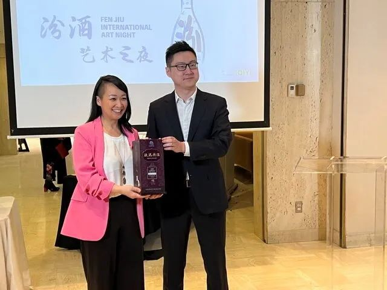 (原始链接: https://mmbiz.qpic.cn/mmbiz_jpg/mXYF5vw37Tv9gP8TS3Fg7D3fjs92rm1VOu3GTVibqKOXgKZXKP2NsM6SibwfJQhvlBq1ezQo5xCG4pTzVibohsSnw/640?wx_fmt=jpeg)
- 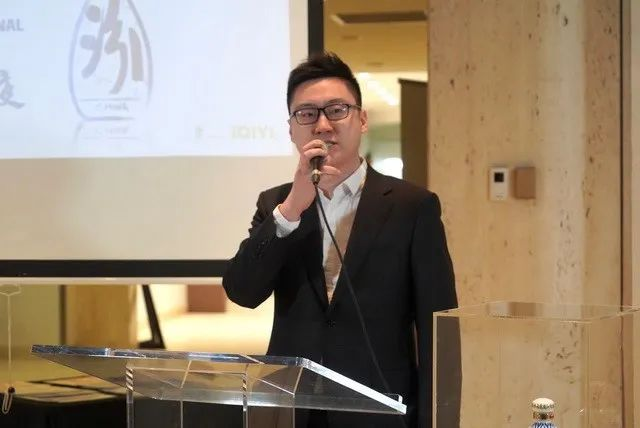 (原始链接: https://mmbiz.qpic.cn/mmbiz_jpg/mXYF5vw37Tv9gP8TS3Fg7D3fjs92rm1VllJ5PICwMkQj7jr2U5A4MHkoze1FrQduT3om8PkJaiaB4WaJ6G4Ur8g/640?wx_fmt=jpeg)
- 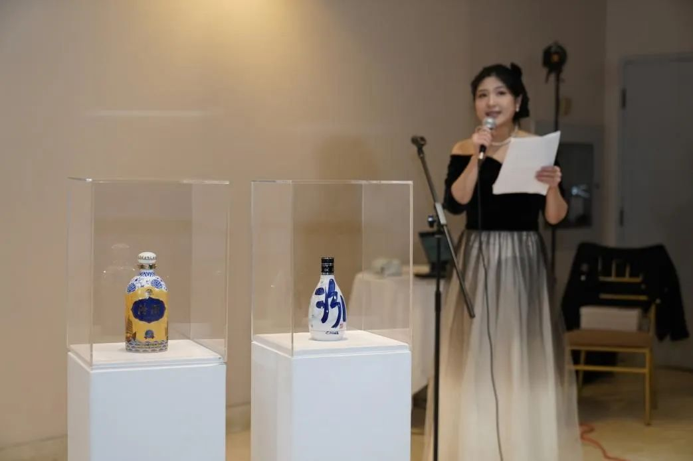 (原始链接: https://mmbiz.qpic.cn/mmbiz_jpg/mXYF5vw37Tv9gP8TS3Fg7D3fjs92rm1VWdNhHnh6EkdxTqbBWR0vfSRPTzEf1icEev58pQhKiaF05djiaYxOO6kLA/640?wx_fmt=jpeg)
- 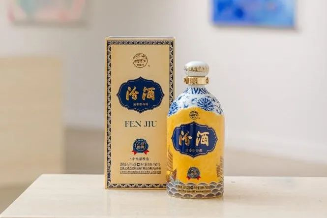 (原始链接: https://mmbiz.qpic.cn/mmbiz_jpg/mXYF5vw37Tv9gP8TS3Fg7D3fjs92rm1Viac6UCKOBZNTTT2N7ibLMepsrTWOOYHIPwiaRZmdZKxibzfsta6UzYlqOw/640?wx_fmt=jpeg)
- 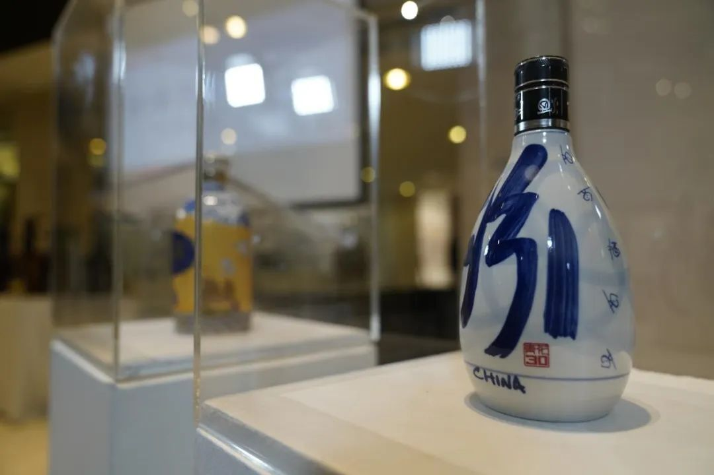 (原始链接: https://mmbiz.qpic.cn/mmbiz_jpg/mXYF5vw37Tv9gP8TS3Fg7D3fjs92rm1VTCRqHO2ll4TZFicibfSXGe7L33oXlRB2rFTVtqc0RmHePO7QvX8URvQQ/640?wx_fmt=jpeg)
- 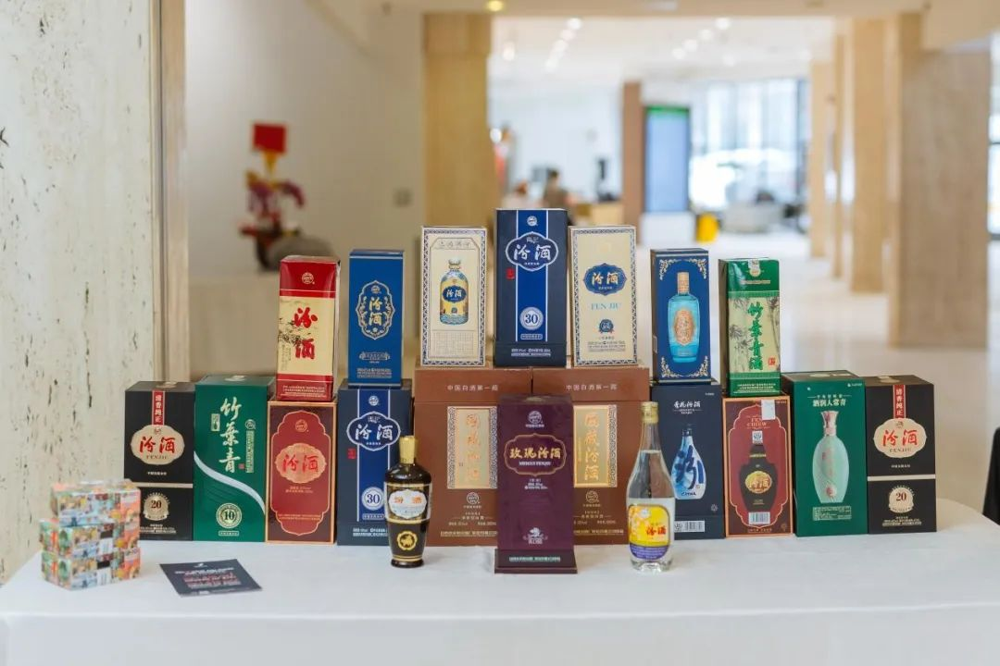 (原始链接: https://mmbiz.qpic.cn/mmbiz_jpg/mXYF5vw37Tv9gP8TS3Fg7D3fjs92rm1VfucicWMhlU0UVI7c6RFqAhcDcQKAiaZpricbPI1ccC7YpTw4Y7ytRibsSw/640?wx_fmt=jpeg)
- 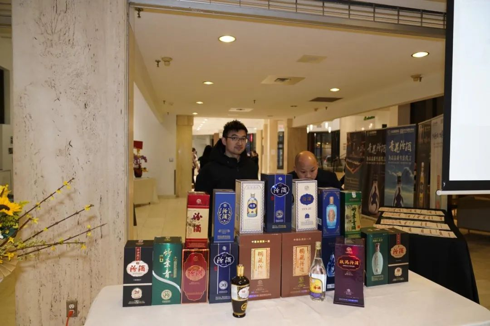 (原始链接: https://mmbiz.qpic.cn/mmbiz_jpg/mXYF5vw37Tv9gP8TS3Fg7D3fjs92rm1VuYicoyCTtl0bhMDfa4R8RpShUbqXjWcZRqwssGuB7lFGDicn3DibPkZaA/640?wx_fmt=jpeg)
- 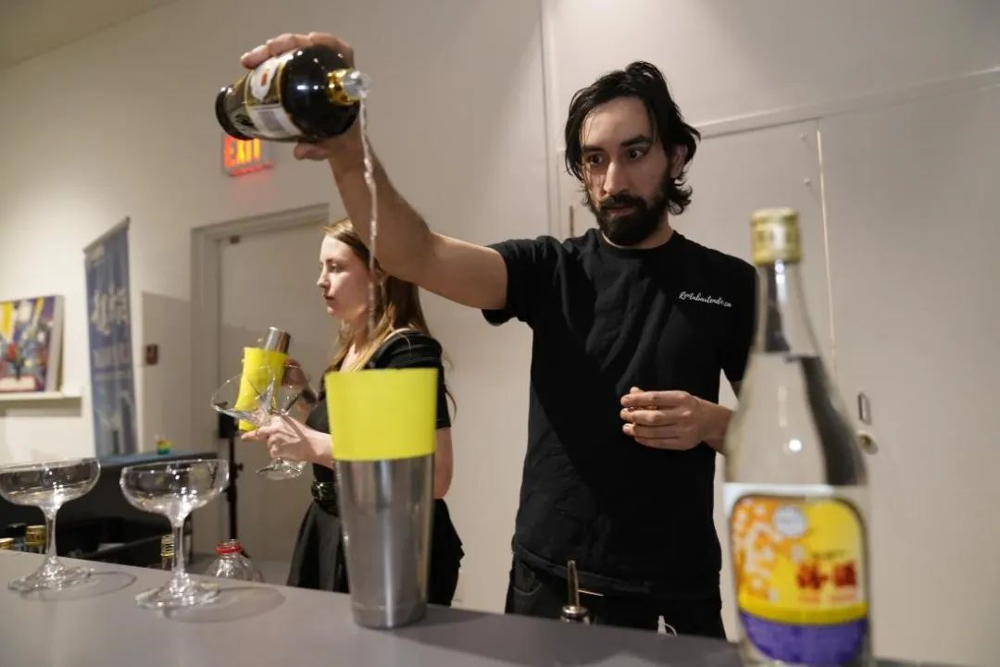 (原始链接: https://mmbiz.qpic.cn/mmbiz_jpg/mXYF5vw37Tv9gP8TS3Fg7D3fjs92rm1VEuaLBrtxa2U7iaP6QEcszAb8vqsKyJEIZsSMIhuMNTC3mgTSibbXMWCw/640?wx_fmt=jpeg)
- 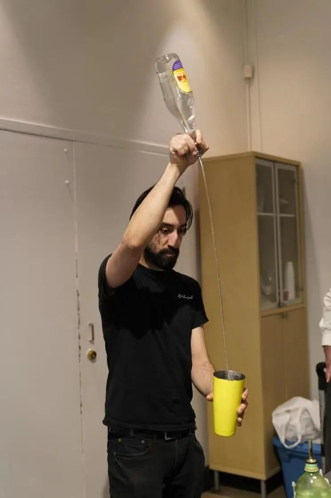 (原始链接: https://mmbiz.qpic.cn/mmbiz_jpg/mXYF5vw37Tv9gP8TS3Fg7D3fjs92rm1VsU7jctS5LQxP8sGR4Vtmfm6H3iaUrOmdkVPwlNbKibrnM2jvcqX3wVGg/640?wx_fmt=jpeg)
- 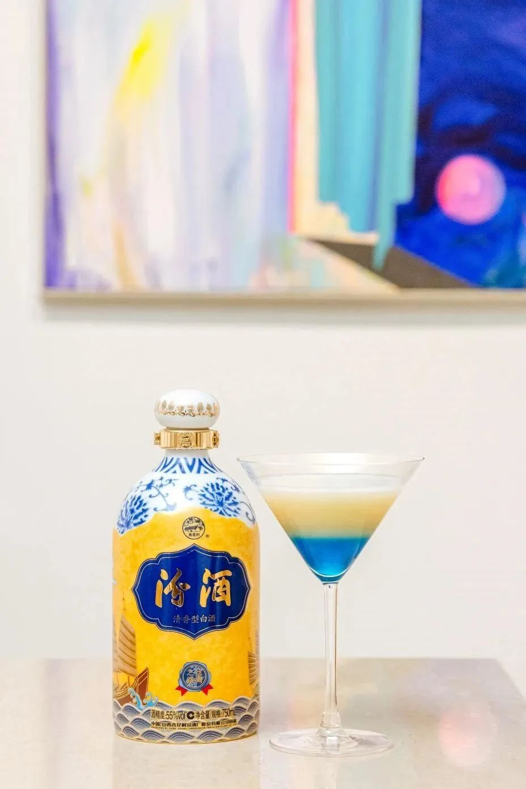 (原始链接: https://mmbiz.qpic.cn/mmbiz_jpg/mXYF5vw37Tv9gP8TS3Fg7D3fjs92rm1VIeWWwqZicoY6flGL71WAYunwc9oib59G86R1iau8BoJbMcoI9u6gjHlMw/640?wx_fmt=jpeg)
- 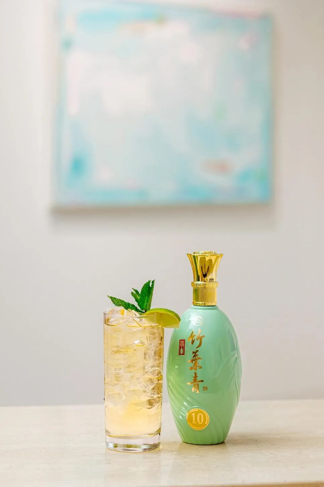 (原始链接: https://mmbiz.qpic.cn/mmbiz_jpg/mXYF5vw37Tv9gP8TS3Fg7D3fjs92rm1VzfibOo0hAs6L2qA9CtLupkCnWTcELHC6JUlaV9YAxrCQy9rFSickrYOQ/640?wx_fmt=jpeg)
- 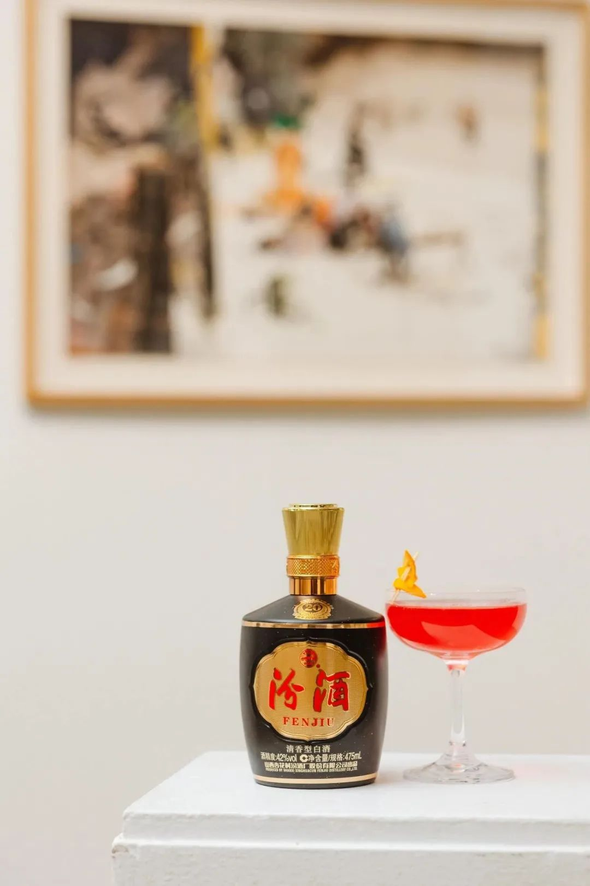 (原始链接: https://mmbiz.qpic.cn/mmbiz_jpg/mXYF5vw37Tv9gP8TS3Fg7D3fjs92rm1V1yo7XSelJ6I2yfoQKTKInAw9VokIChCkwp2zYZveBLYUc1XSg77hyA/640?wx_fmt=jpeg)
- 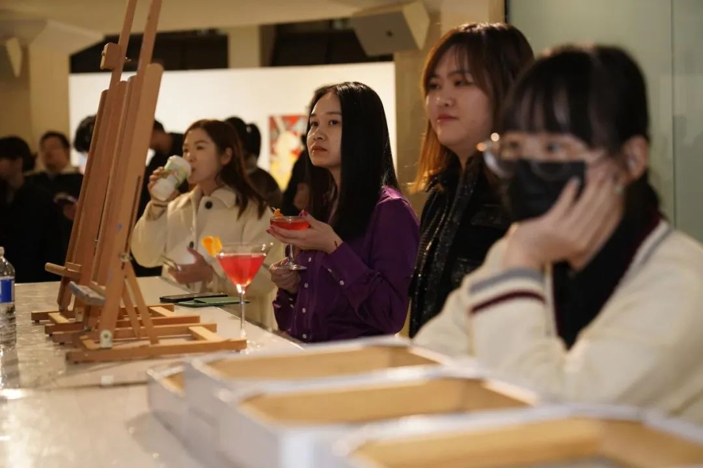 (原始链接: https://mmbiz.qpic.cn/mmbiz_jpg/mXYF5vw37Tv9gP8TS3Fg7D3fjs92rm1V9e0NMUeVmgc4fCAicnrMT3UswvtlAvQiaNaL2kvmyshMLRZzUZbUubTw/640?wx_fmt=jpeg)
- 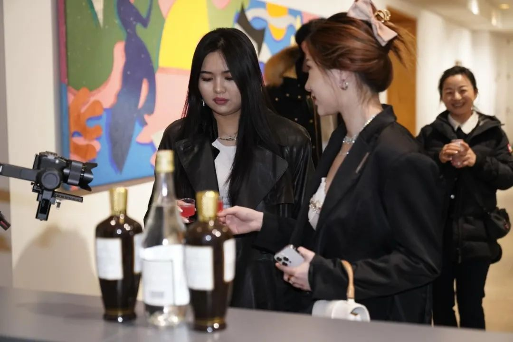 (原始链接: https://mmbiz.qpic.cn/mmbiz_jpg/mXYF5vw37Tv9gP8TS3Fg7D3fjs92rm1Vx5AGIIelbfsZ7WegPWIvz7MFibpmtleZ7tZiaZMBYSNjiaWN8eAL2YoPA/640?wx_fmt=jpeg)
- 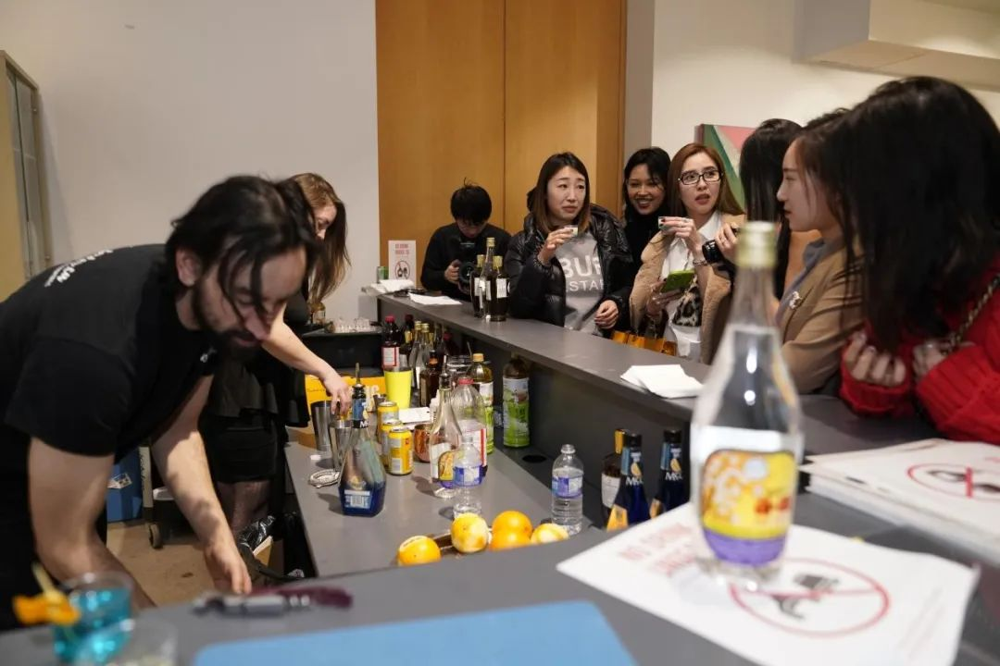 (原始链接: https://mmbiz.qpic.cn/mmbiz_jpg/mXYF5vw37Tv9gP8TS3Fg7D3fjs92rm1ViaYpBEsu76ia0g0p0lQfkIATsbdvnGukibqYg7TyfZWjRiafhBBF5CZCTw/640?wx_fmt=jpeg)
- 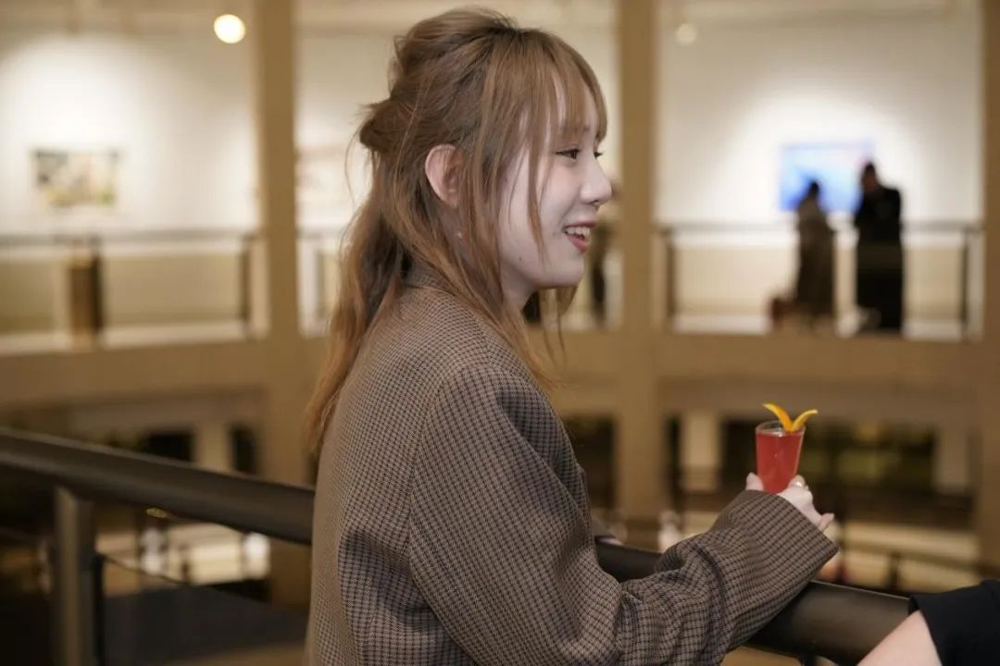 (原始链接: https://mmbiz.qpic.cn/mmbiz_jpg/mXYF5vw37Tv9gP8TS3Fg7D3fjs92rm1ViaFjhpExPM0PYL27T1KgfuIibgv9ey4RrbQqiaNJcCs63SVWibhvTCDiczg/640?wx_fmt=jpeg)
- 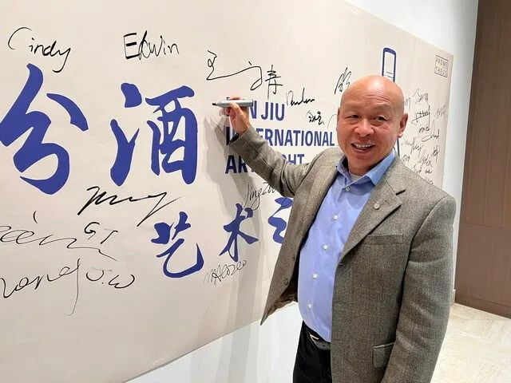 (原始链接: https://mmbiz.qpic.cn/mmbiz_jpg/mXYF5vw37Tv9gP8TS3Fg7D3fjs92rm1V9hpuezF5Nx1EgWtKrzWMIDGhZBa2iaskrUicOshqPWU7PyzL9FHqjlkg/640?wx_fmt=jpeg)
- 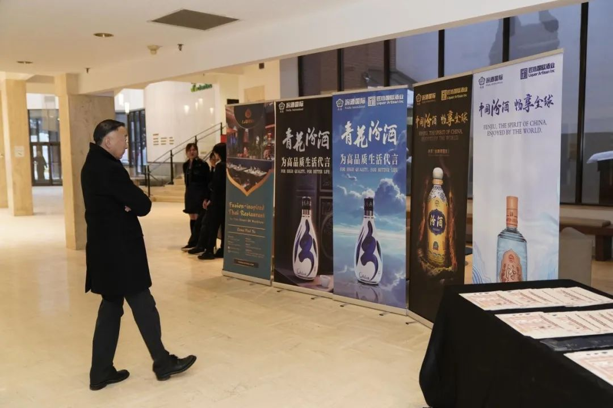 (原始链接: https://mmbiz.qpic.cn/mmbiz_jpg/mXYF5vw37Tv9gP8TS3Fg7D3fjs92rm1VJpKiak0FKkicSDBC3FaoMNibOicO8ejXVgYVicLKkxZpmnaO9JIbm1ypvHA/640?wx_fmt=jpeg)
- 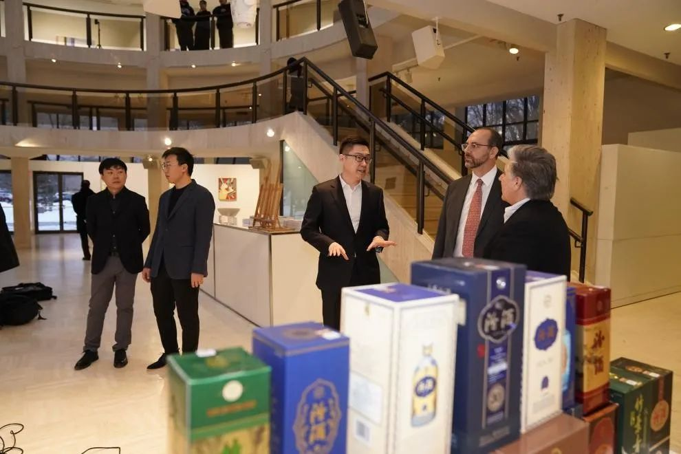 (原始链接: https://mmbiz.qpic.cn/mmbiz_jpg/mXYF5vw37Tv9gP8TS3Fg7D3fjs92rm1VZ2fVEzuRNORswC4iaia3EPsTvLpHmKYhPwhrvPoDDfWP8z5kFP2BwsHg/640?wx_fmt=jpeg)
- 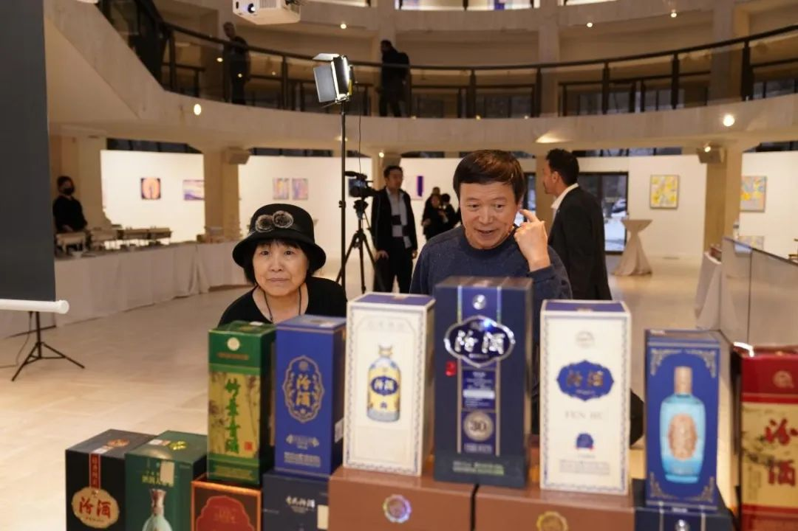 (原始链接: https://mmbiz.qpic.cn/mmbiz_jpg/mXYF5vw37Tv9gP8TS3Fg7D3fjs92rm1VkH76X1XjvCdJhsnco4cWL8FzI6nBJibaeuUONRa3Z1kNic2rhMQxeIUA/640?wx_fmt=jpeg)
- 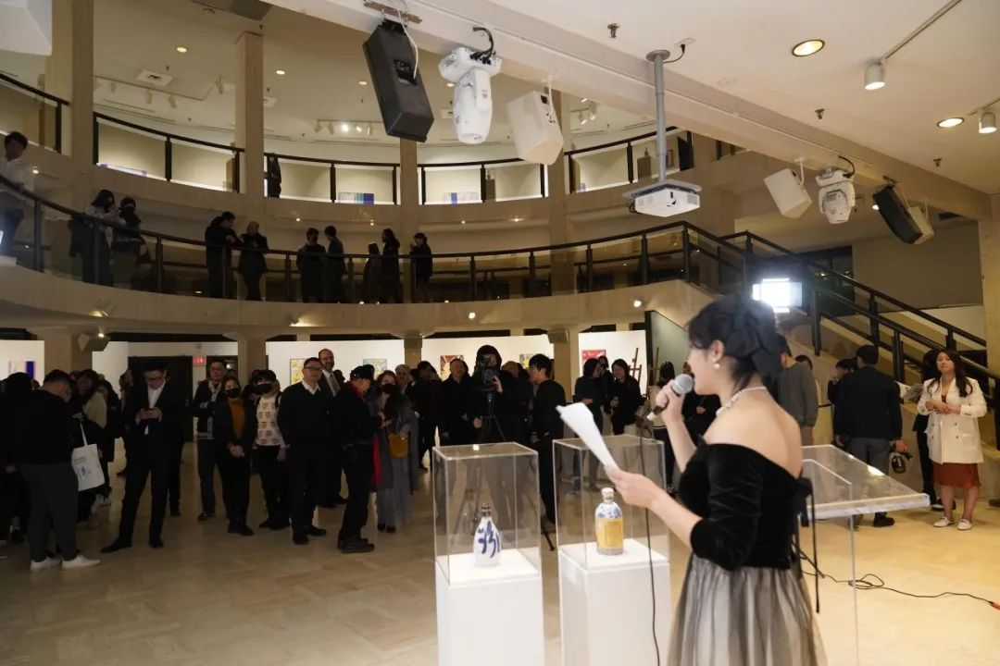 (原始链接: https://mmbiz.qpic.cn/mmbiz_jpg/mXYF5vw37Tv9gP8TS3Fg7D3fjs92rm1VTnldYk4ltuo3lKFe7FsnibsAuoOTp9rgdbvDDiajjzDlkm1cwPY9HPKw/640?wx_fmt=jpeg)
- 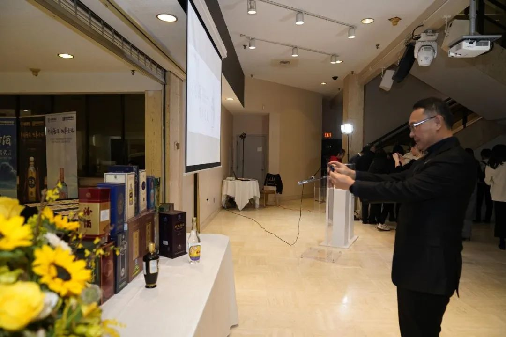 (原始链接: https://mmbiz.qpic.cn/mmbiz_jpg/mXYF5vw37Tv9gP8TS3Fg7D3fjs92rm1VdmMwlcnuUStNwAl8JoJcpe5WYKTG1XKsKb0SkDrZMib3glCKeaJB9PA/640?wx_fmt=jpeg)
-  (原始链接: https://mmbiz.qpic.cn/mmbiz_jpg/mXYF5vw37Tv9gP8TS3Fg7D3fjs92rm1VQda3PsL4YUPE62icndHkO1zf8Gic3aqtoaVVUfrktRmAQVUWxckr6ecA/640?wx_fmt=jpeg)
- 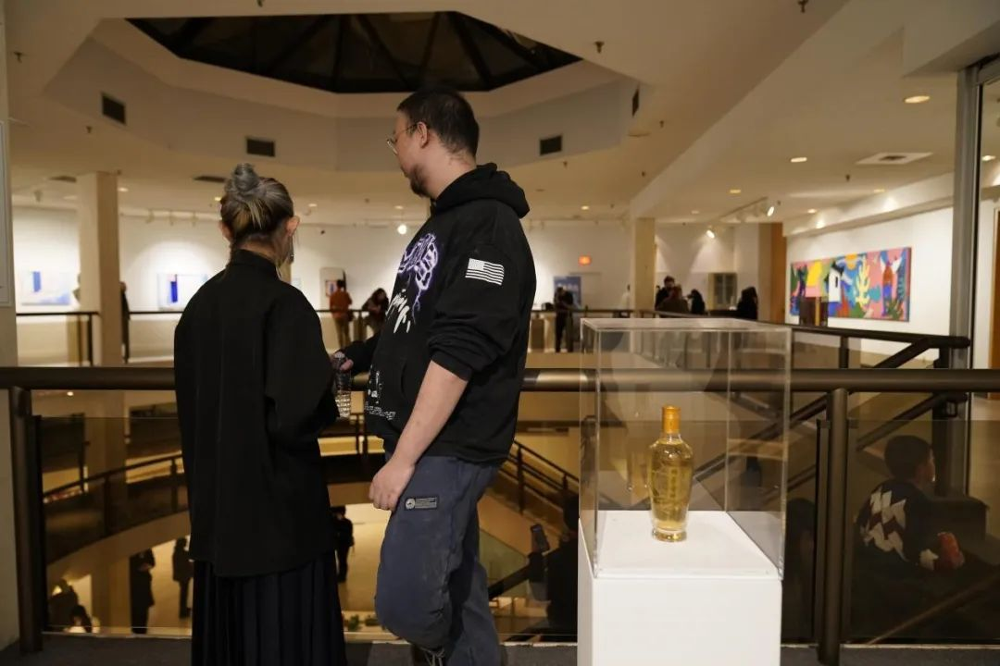 (原始链接: https://mmbiz.qpic.cn/mmbiz_jpg/mXYF5vw37Tv9gP8TS3Fg7D3fjs92rm1VohD7jdISJGLo022ib3aVJz5h3Yib6bXY4F4g33F6NqJZDyYj06renW9g/640?wx_fmt=jpeg)
- 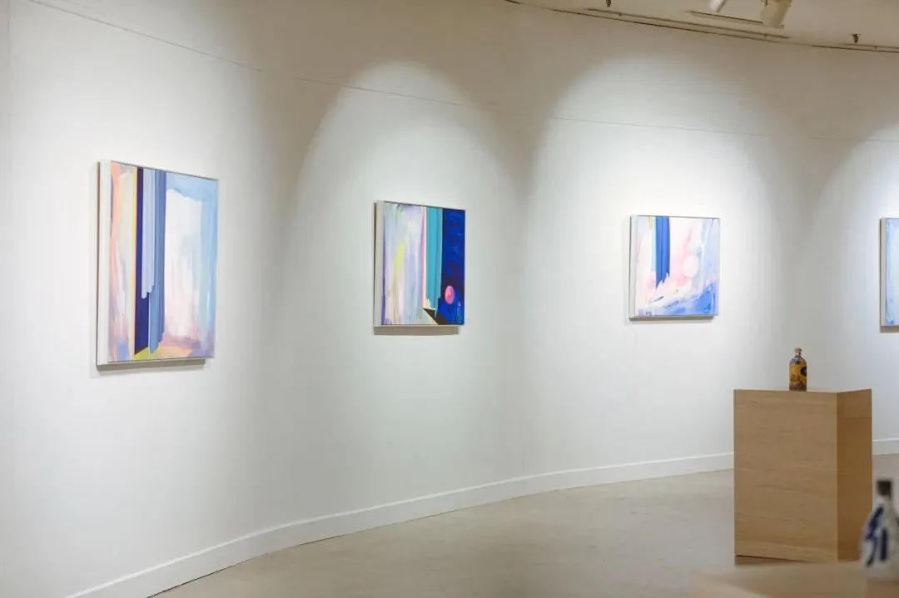 (原始链接: https://mmbiz.qpic.cn/mmbiz_jpg/mXYF5vw37Tv9gP8TS3Fg7D3fjs92rm1VkZ6tOT0HGWk7st0BtkMhZj2pic6hOAG6duY9OETyeVAVNTRdtthxFjQ/640?wx_fmt=jpeg)
- 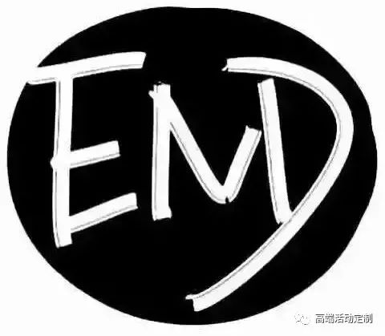 (原始链接: https://mmbiz.qpic.cn/mmbiz_jpg/VrYvjoKYAlTC37ey0FyhEVGDg4Nxd7cibCEXzvrQzicyzl5FeKicnZLVFNJxiacp6dHuTlXPUa6LfxUfiaicNZLKahcQ/640?wx_fmt=jpeg)
- 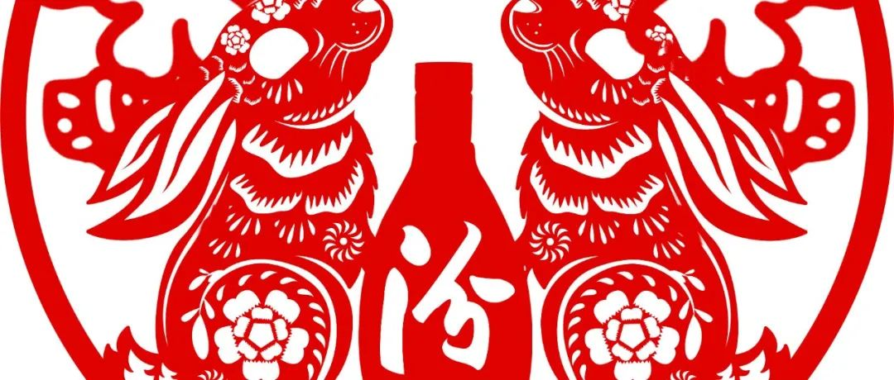 (原始链接: https://mmbiz.qpic.cn/mmbiz_jpg/mXYF5vw37Tt1tw5N3N7L5ibV0MgMLu1GAsTicrp2Gp3dYzansukM57Hsu8Th3ulcwAR3UumN6g7nUibkoYnib3gic7g/640?wx_fmt=jpeg)
- 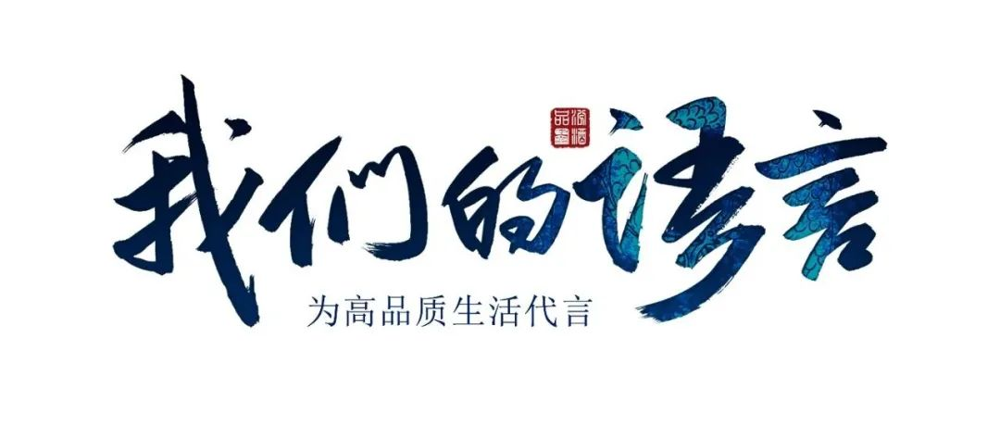 (原始链接: https://mmbiz.qpic.cn/mmbiz_jpg/mXYF5vw37TvUvVXHBFRahAPIbt1iag9uw7FPkPxTMYyYc2qbAAsiacZ686wVYrMnAsq17UuXibH7cTm1NO87Q5y9Q/640?wx_fmt=jpeg)
- 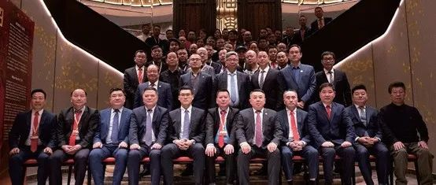 (原始链接: https://mmbiz.qpic.cn/mmbiz_jpg/mXYF5vw37TtzPV4m0fXTKa1psMLS6TbgYETCeHkTCHc2turwyWRTM48AxCs55HvQacG8sR5bVRbZupFXfApz4Q/640?wx_fmt=jpeg)
- 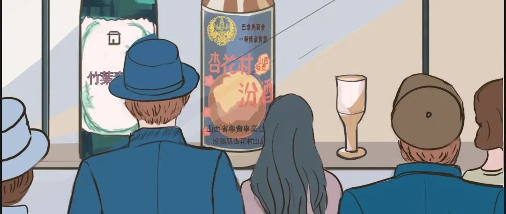 (原始链接: https://mmbiz.qpic.cn/mmbiz_jpg/mXYF5vw37TvLQjGkzWVEeSVneCsZpiasry4At9satKD9cBibVggojgz4S0Frr43MpXJ9d5s4tg54Msjic2LWcDu3A/640?wx_fmt=jpeg)
-  (原始链接: https://mmbiz.qpic.cn/mmbiz_jpg/mXYF5vw37TvDrhEYz0srb0I4z6FrM80QAUGZvQwO3vHuhcflMQ6ZX47CozgLb0Cz44hXFRoFygMwicKpFTyR8oA/640?wx_fmt=jpeg)
- 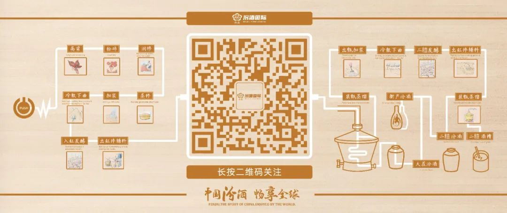 (原始链接: https://mmbiz.qpic.cn/mmbiz_jpg/mXYF5vw37TufXgBa07KjsYsgg1SXTZ5jpx0Ez8fWeHOXSsKn5ff51NXyyNcweTt7BgD78essDpktGTpj0fXdbA/640?wx_fmt=jpeg)
